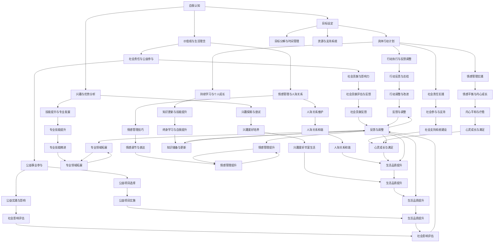
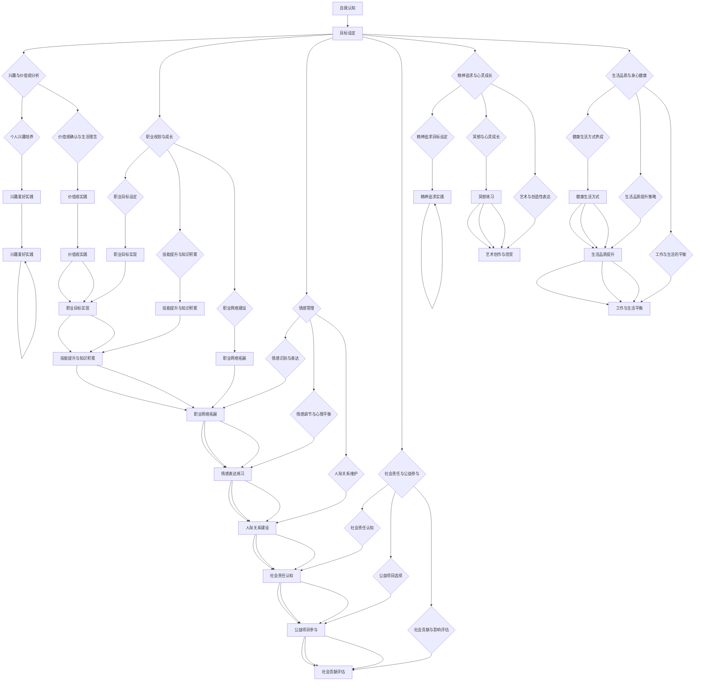
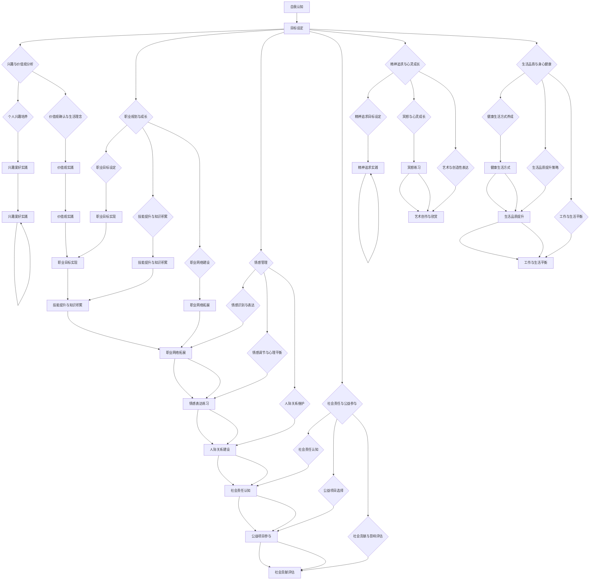

                 

### 探索多元化的人生价值：超越传统成功标准

在当今快速变化的社会中，人们对于成功的定义和追求方式也在不断演变。传统意义上，成功通常与金钱、地位和权力紧密相关，但这种单一的成功标准是否能够满足人们内心的渴望和追求？本文旨在探讨多元化的人生价值，引导读者超越传统成功标准，追求更加全面和丰富的人生。

首先，我们需要理解人生价值的再思考。传统上，成功被视为事业有成、财富积累和个人成就的象征。然而，随着社会的发展和个体意识的觉醒，人们开始认识到成功并不仅仅是外在的成就，更是内在的自我实现和个人成长。这一转变促使我们重新定义成功，将其视为一种全面的生活状态，包括情感、职业、个人成长、社会贡献和精神追求等多个方面。

接下来，我们将深入探讨个人成长与自我实现的重要性。教育是个人成长的重要基础，而职业生涯规划则是实现个人价值的关键。通过终身学习，我们能够不断提升自己的能力和知识水平，适应快速变化的世界。同时，自我实现不仅仅是职业上的成就，更是内在价值的发掘和自我超越的过程。

在情感与人际关系方面，我们需要学会管理自己的情感，建立和维护良好的人际关系。情感管理不仅能够提升个人的生活质量，还能够增强人际关系中的和谐与支持。此外，情感与事业的平衡也是实现多元化人生价值的重要组成部分。

社会责任与公益也是人生价值的重要组成部分。通过参与社会活动和公益事业，我们能够为社会做出贡献，实现自己的社会价值。同时，环境保护与可持续发展也是我们需要关注的重要议题，我们的行为将直接影响地球的未来。

精神追求与心灵成长是多元化人生价值的重要方面。通过追求精神富足，我们能够在物质生活之外找到更深层次的满足和幸福感。心灵成长则是增强内心力量，实现自我疗愈的过程。

最后，我们将讨论如何实现多元化人生价值。成功观的转变是关键，我们需要重新定义成功，追求更加全面和有意义的生活。通过实践，我们可以不断调整和实现自己的人生目标，实现多元化的人生价值。

本文将通过多个章节，详细探讨这些主题，并分享相关案例和最佳实践。希望通过本文的探讨，能够引导读者思考自己的人生价值，超越传统成功标准，追求更加丰富和有意义的人生。

### 引言

在现代社会，成功一词似乎成为人们日常生活中不可或缺的一部分。然而，当我们将成功的定义局限于金钱、地位和权力时，往往会忽视成功背后的多样性和深层次的价值。传统意义上的成功，往往意味着职业上的巅峰表现、财富的积累以及社会地位的提升。这种单一的衡量标准在一定程度上反映了社会的物质主义倾向，但也带来了诸多问题。人们为了追求这些外在的成就，往往忽略了内心的需求和情感生活的丰富。这种现象不仅导致了个人内心的空虚和迷茫，也对社会和谐和人际关系造成了负面影响。

随着社会的发展和个人意识的觉醒，人们开始意识到，成功并非仅仅是一种外在的衡量标准，而是一种全面的生活状态。这种生活状态涵盖了情感、职业、个人成长、社会贡献和精神追求等多个方面。多元化的人生价值观念逐渐被更多人接受，它强调的是个人在不同领域中的全面发展，而不是单一维度的成功。这种观念的转变，不仅有助于人们更好地认识自己，也为社会带来了更多的和谐与美好。

本文旨在探讨多元化的人生价值，引导读者超越传统成功标准，追求更加全面和丰富的人生。通过本文的探讨，我们将重新审视成功的定义，认识到成功不仅仅是外在的成就，更是内在的自我实现和成长。同时，我们还将深入探讨个人成长、情感管理、社会责任、精神追求等多个方面，帮助读者找到实现多元化人生价值的路径。

接下来，本文将分为四个主要部分进行讨论。第一部分将引出对人生价值的再思考，探讨传统成功的局限性和多元化人生的追求。第二部分将探讨个人成长与自我实现的重要性，包括教育与成长、职业生涯规划以及自我实现。第三部分将关注情感与人际关系，讨论情感管理、人际关系的重要性以及情感与事业的平衡。第四部分将探讨社会责任与公益，环境保护与可持续发展，以及精神追求与心灵成长。最后，我们将讨论如何实现多元化人生价值，包括成功观的转变、实践的重要性以及相关案例和最佳实践。希望通过本文的探讨，能够引导读者思考自己的人生价值，超越传统成功标准，追求更加丰富和有意义的人生。

### 第1章：人生价值的再思考

在深入探讨多元化的人生价值之前，我们首先需要对传统的人生价值观念进行重新审视。传统上，成功被视为一种外在的衡量标准，主要包括金钱、地位和权力。这种观念的根源可以追溯到工业革命时期，当时社会对效率和物质财富的追求导致了单一的衡量标准。然而，随着时间的推移，人们逐渐认识到这种单一的衡量标准存在诸多局限性，无法全面反映一个人的生活质量和内在价值。

#### 1.1 重新定义成功

首先，我们需要重新定义成功。成功的定义不应该局限于外在的成就，而应该是一种全面的生活状态，涵盖多个方面。多元化的人生价值观念强调以下几个方面：

1. **情感与人际关系**：情感和人际关系是人生中不可或缺的一部分。一个成功的人生不仅仅是在职业上取得了卓越的成就，更包括拥有丰富的人际关系和幸福的家庭生活。这需要我们在日常生活中学会情感管理，建立和维护良好的人际关系。

2. **个人成长与自我实现**：个人成长和自我实现是成功的内在动力。通过不断学习和成长，我们能够提升自己的能力和知识水平，实现自我价值。这不仅包括职业上的成就，更包括内在的满足和幸福感。

3. **社会责任与公益**：社会责任和公益是实现多元化人生价值的重要方面。通过参与社会活动和公益事业，我们能够为社会做出贡献，实现自己的社会价值。这不仅是个人成就的体现，更是对社会的回馈。

4. **精神追求与心灵成长**：精神追求和心灵成长是追求幸福的重要途径。在物质生活之外，精神追求能够帮助我们找到更深层次的满足和幸福感。心灵成长则是增强内心力量，实现自我疗愈的过程。

5. **生活品质与身心健康**：生活品质和身心健康是成功的重要标志。一个成功的人生不仅包括物质上的富足，更包括身心健康和幸福的感受。这需要我们注重健康的生活方式，保持良好的心态。

通过重新定义成功，我们能够更好地理解成功的多样性和深层次的价值。这种多元化的成功观念不仅能够帮助我们更好地认识自己，也为社会带来了更多的和谐与美好。

#### 1.2 生命的意义

生命的意义是一个深刻而广泛的话题，不同的人可能会有不同的理解。然而，从多元化的成功观念出发，我们可以从以下几个方面来探讨生命的意义：

1. **个人价值的实现**：生命的意义在于实现个人的价值。每个人都有独特的才能和潜力，通过发掘和利用这些才能，我们能够实现自我价值，为社会做出贡献。

2. **情感与人际关系的满足**：生命的意义还在于情感和人际关系的满足。人是社会性动物，我们需要与他人建立联系和互动，才能感受到生命的丰富和幸福。

3. **社会责任与贡献**：生命的意义还在于承担社会责任和为社会做出贡献。通过参与社会活动和公益事业，我们能够为社会带来积极的影响，实现自己的社会价值。

4. **精神追求与心灵成长**：生命的意义还在于追求精神和心灵的满足。通过追求精神富足和心灵成长，我们能够找到更深层次的幸福和满足。

5. **身心健康与生活品质**：生命的意义还在于维护身心健康和提升生活品质。一个健康、快乐的生活状态能够让我们更好地享受生命的美好。

通过重新思考生命的意义，我们能够更好地理解人生的真正价值，找到实现多元化人生价值的方向。

#### 1.3 多元化人生的追求

多元化人生的追求是一种对全面生活状态的努力，它涵盖了情感、职业、个人成长、社会贡献和精神追求等多个方面。以下是实现多元化人生的一些关键步骤：

1. **自我认知与价值观探索**：首先，我们需要进行自我认知和价值观探索。通过反思自己的兴趣、优点和价值观，我们能够更好地理解自己，找到实现多元化人生的基础。

2. **设定明确的目标**：在明确自己的兴趣和价值观后，我们需要设定明确的目标。这些目标不仅包括职业上的成就，还应涵盖情感、个人成长和社会贡献等方面。

3. **终身学习与成长**：终身学习是实现多元化人生的关键。通过不断学习和提升自己的能力，我们能够适应快速变化的社会环境，实现自我价值。

4. **情感管理**：情感管理是多元化人生的重要组成部分。通过学会情感管理，我们能够更好地处理日常生活中的情感波动，建立和维护良好的人际关系。

5. **积极参与社会活动**：参与社会活动和公益事业是实现多元化人生的重要途径。通过为社会做出贡献，我们能够实现自己的社会价值，同时也丰富自己的人生体验。

6. **心灵成长**：心灵成长是实现多元化人生的重要方面。通过追求精神富足和心灵成长，我们能够找到更深层次的幸福和满足。

7. **维护身心健康**：维护身心健康是实现多元化人生的基础。通过健康的生活方式，我们能够保持良好的身体和心理状态，更好地应对生活中的挑战。

通过以上步骤，我们能够逐步实现多元化的人生，追求更加全面和丰富的生活状态。

### 第2章：个人成长与自我实现

在追求多元化人生价值的道路上，个人成长与自我实现占据着核心地位。这一部分将详细探讨个人成长、职业生涯规划以及自我实现的重要性，帮助读者理解并实现这一人生目标。

#### 2.1 教育与成长

教育是个人成长的重要基石。通过系统的学习，我们能够获取知识、技能和思维方式，为未来的发展奠定坚实的基础。终身学习是现代社会的必然要求，因为它能够帮助我们不断适应新的环境和挑战。以下是终身学习的一些关键点：

1. **持续学习的动力**：持续学习的动力来源于对知识的热爱和内在的兴趣。通过设定具体的学习目标，我们可以保持学习的动力，不断提升自己的能力。

2. **多样化的学习方式**：现代科技为我们提供了丰富的学习资源，包括在线课程、电子书籍、研讨会和讲座等。多样化的学习方式能够满足不同学习者的需求，帮助我们在不同的时间和地点进行学习。

3. **实践与反思**：学习不仅是知识的获取，更是能力的提升。通过实践所学知识，我们能够更好地理解和应用，同时通过反思学习过程，我们能够不断改进学习方法，提高学习效率。

4. **跨学科学习**：跨学科学习能够帮助我们拓宽视野，提升综合能力。在快速变化的时代，单一领域的知识往往不足以应对复杂的问题，因此跨学科学习变得尤为重要。

数学模型与Python代码示例：

为了更好地理解终身学习的模型，我们可以使用Python编写一个简单的示例。假设我们的学习过程可以用一个函数表示，其中输入是学习的时间和投入的努力，输出是学习的效果。

```python
def learning_effect(time, effort):
    # 学习效果模型，使用简单的线性模型
    effect = time * effort * 0.1
    return effect

# 示例：学习时间10小时，努力程度为中等
time = 10
effort = 0.5
effect = learning_effect(time, effort)
print(f"学习效果：{effect}")
```

这个示例展示了学习效果与学习时间和努力程度之间的关系，通过调整时间和努力程度，我们可以实现更好的学习效果。

数学公式：

$$
\text{学习效果} = \text{学习时间} \times \text{努力程度} \times k
$$

其中，\(k\) 是一个常数，表示学习效率。

#### 2.2 职业生涯规划

职业生涯规划是实现自我价值的重要途径。一个明确的职业生涯规划可以帮助我们更好地定位自己的职业方向，设定职业目标，并制定实现这些目标的步骤。以下是职业生涯规划的关键步骤：

1. **自我评估**：首先，我们需要进行自我评估，了解自己的兴趣、优点和不足。这包括职业兴趣测试、能力评估和个性分析等。通过这些评估，我们可以更清楚地了解自己适合什么样的职业。

2. **职业目标设定**：在了解自己后，我们需要设定具体的职业目标。这些目标应该是明确的、可衡量的、可实现的，并且有明确的时间表。

3. **职业发展路径**：制定职业发展路径是实现职业目标的关键。这个路径应该包括短期和长期的目标，以及实现这些目标所需的技能和经验。

4. **技能提升与知识更新**：在职业生涯中，技能和知识的更新至关重要。通过参加培训、研讨会和在线课程，我们能够不断提升自己的技能，保持竞争力。

5. **职业网络建设**：建立和维护职业网络可以帮助我们在职业发展中获得更多的机会和支持。通过参与行业活动、加入专业组织和参加社交活动，我们能够扩展自己的职业网络。

数学模型与Python代码示例：

我们可以使用Python编写一个简单的职业生涯规划模型，帮助读者理解职业生涯规划的过程。

```python
def career_planning(self_awareness, goal_setting, skill_building, network_building):
    # 职业规划效果模型
    effectiveness = self_awareness * goal_setting * skill_building * network_building
    return effectiveness

# 示例：自我评估80%，目标设定90%，技能提升85%，网络建设70%
self_awareness = 0.8
goal_setting = 0.9
skill_building = 0.85
network_building = 0.7
effectiveness = career_planning(self_awareness, goal_setting, skill_building, network_building)
print(f"职业规划效果：{effectiveness}")
```

这个示例展示了职业生涯规划效果与自我评估、目标设定、技能提升和网络建设之间的关系。

数学公式：

$$
\text{职业规划效果} = \text{自我评估} \times \text{目标设定} \times \text{技能提升} \times \text{网络建设}
$$

#### 2.3 自我实现

自我实现是人生追求的终极目标，它不仅仅是职业上的成功，更包括内在的自我价值和幸福感的实现。以下是实现自我实现的关键步骤：

1. **内在价值的发掘**：自我实现的第一步是发掘内在的价值。通过反思和自我探索，我们能够找到自己真正热爱的事物，明确自己的目标和追求。

2. **自我超越**：自我超越是通过不断挑战自我，突破舒适区，实现更高的目标。这需要我们具备勇气和决心，克服内心的恐惧和不安。

3. **持续成长**：自我实现是一个持续的过程，我们需要不断地学习和成长，提升自己的能力和知识水平，以适应不断变化的环境。

4. **幸福感**：幸福感是实现自我实现的重要标志。通过追求精神富足和内心平静，我们能够找到更深层次的满足和幸福。

5. **平衡与和谐**：在实现自我价值的同时，我们需要平衡工作和生活，保持身心健康，与家人和朋友建立良好的关系。

数学模型与Python代码示例：

为了更好地理解自我实现的模型，我们可以使用Python编写一个简单的示例，帮助读者理解自我实现的过程。

```python
def self_realization inner_value, self超越，growth，happiness，balance):
    # 自我实现模型
    realization = inner_value * self超越 * growth * happiness * balance
    return realization

# 示例：内在价值80%，自我超越85%，成长90%，幸福感80%，平衡75%
inner_value = 0.8
self超越 = 0.85
growth = 0.9
happiness = 0.8
balance = 0.75
realization = self_realization(inner_value, self超越，growth，happiness，balance)
print(f"自我实现程度：{realization}")
```

这个示例展示了自我实现程度与内在价值、自我超越、成长、幸福感和平衡之间的关系。

数学公式：

$$
\text{自我实现程度} = \text{内在价值} \times \text{自我超越} \times \text{成长} \times \text{幸福感} \times \text{平衡}
$$

通过以上步骤，我们可以逐步实现个人成长与自我实现，追求更加丰富和有意义的人生。这是一个长期的过程，需要不断的努力和自我反思，但只要我们坚持，最终一定能够实现自己的梦想。

### 第3章：情感与人际关系

在多元化的人生价值追求中，情感与人际关系的重要性不容忽视。这一章节将探讨情感管理、人际关系的建立与维护，以及情感与事业的平衡，帮助读者在实现职业成功的同时，保持情感的丰富和人际关系的和谐。

#### 3.1 情感管理

情感管理是我们在生活中不可或缺的一部分，它涉及到如何识别、理解和处理自己的情感。良好的情感管理能力能够帮助我们更好地应对生活中的挑战，建立积极的人际关系。以下是情感管理的一些关键点：

1. **认识自己的情感**：首先，我们需要学会认识和理解自己的情感。通过自我观察和反思，我们能够更好地了解自己的情感状态，并找到情感产生的原因。

2. **表达情感**：表达情感是情感管理的重要环节。通过学习如何恰当地表达自己的情感，我们能够避免误解和冲突，建立更加稳固的人际关系。

3. **调节情感波动**：生活中不可避免地会有各种情感波动，如喜悦、愤怒、焦虑等。学会调节这些波动，保持情绪的稳定性，是情感管理的关键。

4. **寻求支持**：在面对复杂情感问题时，寻求他人的支持和帮助是非常重要的。通过与他人交流，我们能够获得不同的视角和建议，帮助自己更好地处理情感问题。

情感管理不仅能够提升个人的生活质量，还能够增强人际关系中的和谐与支持。以下是情感管理的一些实际应用：

- **在工作场合**：有效的情感管理可以帮助我们在工作中更好地处理压力和冲突，提高工作效率。
- **在家庭生活中**：良好的情感管理能够帮助我们更好地与家人沟通，建立和谐的家庭关系。
- **在社交场合**：通过情感管理，我们能够更好地与他人互动，建立积极的人际关系。

数学模型与Python代码示例：

为了更好地理解情感管理，我们可以使用Python编写一个简单的模型，模拟情感管理的效果。

```python
def emotional_management(emotion_recognition, expression, regulation, support):
    # 情感管理效果模型
    effectiveness = emotion_recognition * expression * regulation * support
    return effectiveness

# 示例：情感识别80%，情感表达85%，情感调节90%，情感支持70%
emotion_recognition = 0.8
expression = 0.85
regulation = 0.9
support = 0.7
effectiveness = emotional_management(emotion_recognition, expression, regulation, support)
print(f"情感管理效果：{effectiveness}")
```

这个示例展示了情感管理效果与情感识别、情感表达、情感调节和情感支持之间的关系。

数学公式：

$$
\text{情感管理效果} = \text{情感识别} \times \text{情感表达} \times \text{情感调节} \times \text{情感支持}
$$

#### 3.2 人际关系

人际关系是人生中不可或缺的一部分，它涉及到我们与他人的互动和合作。良好的人际关系能够为我们提供支持和帮助，提升生活的幸福感。以下是建立和维护良好人际关系的一些关键点：

1. **尊重与理解**：尊重和理解是良好人际关系的基础。通过尊重他人的观点和感受，我们能够建立信任和互相理解的关系。

2. **有效沟通**：有效的沟通是建立和维护良好人际关系的关键。通过清晰、真诚地表达自己的想法和感受，我们能够避免误解和冲突，增进彼此的了解。

3. **合作与共赢**：在人际关系中，合作和共赢是非常重要的。通过共同的目标和合作精神，我们能够实现双方的共赢，建立稳定的关系。

4. **处理冲突**：冲突是人际关系中不可避免的一部分。学会处理冲突，寻找解决问题的方法，是维护良好关系的关键。

5. **感恩与回馈**：感恩和回馈能够增强人际关系中的正面情绪，提升彼此的满意度。通过表达对对方的感激和关心，我们能够建立更加深厚的关系。

在实际生活中，良好的人际关系能够带来许多积极的影响：

- **职业发展**：良好的人际关系可以帮助我们在职业中获取更多的机会和资源，提升职业发展。
- **心理健康**：人际关系对心理健康有重要影响。良好的人际关系能够提升幸福感，减少孤独感和压力。
- **生活质量**：人际关系能够提升整体的生活质量，让我们在生活中感到更加幸福和满足。

数学模型与Python代码示例：

为了更好地理解人际关系的重要性，我们可以使用Python编写一个简单的模型，模拟人际关系对生活质量的影响。

```python
def relationship_quality(respect, communication, cooperation, conflict_resolution, gratitude):
    # 人际关系质量模型
    quality = respect * communication * cooperation * conflict_resolution * gratitude
    return quality

# 示例：尊重90%，沟通85%，合作80%，冲突解决75%，感恩85%
respect = 0.9
communication = 0.85
cooperation = 0.8
conflict_resolution = 0.75
gratitude = 0.85
quality = relationship_quality(respect, communication, cooperation, conflict_resolution, gratitude)
print(f"人际关系质量：{quality}")
```

这个示例展示了人际关系质量与尊重、沟通、合作、冲突解决和感恩之间的关系。

数学公式：

$$
\text{人际关系质量} = \text{尊重} \times \text{沟通} \times \text{合作} \times \text{冲突解决} \times \text{感恩}
$$

#### 3.3 情感与事业的平衡

在追求职业成功的过程中，保持情感与事业的平衡至关重要。以下是实现情感与事业平衡的一些关键点：

1. **设定优先级**：明确自己的价值观和目标，设定优先级。在忙碌的工作中，我们需要学会区分重要和紧急的事情，合理安排时间和精力。

2. **时间管理**：合理的时间管理是保持情感与事业平衡的关键。通过制定日程表和优先处理任务，我们能够更有效地管理时间，减少工作和生活的冲突。

3. **情感关怀**：在忙碌的工作中，我们需要学会给自己留出时间，关注自己的情感需求。通过锻炼、休息和与家人朋友交流，我们能够保持情感的健康和稳定。

4. **职业发展**：在追求职业成功的同时，我们还需要关注个人的职业发展。通过不断学习和提升自己的能力，我们能够保持职业的竞争力，实现事业的长期成功。

5. **寻求支持**：在追求事业成功的过程中，我们需要寻求他人的支持和帮助。通过与同事、朋友和家人交流，我们能够获得不同的视角和建议，帮助自己更好地处理工作和生活之间的平衡。

在实际生活中，情感与事业的平衡能够带来许多积极的影响：

- **心理健康**：平衡的工作和情感生活能够提升心理健康，减少工作压力和焦虑。
- **生活质量**：保持情感与事业的平衡能够提升整体的生活质量，让我们在生活中感到更加幸福和满足。
- **职业发展**：情感与事业的平衡能够帮助我们更好地应对职业挑战，实现长期的职业成功。

数学模型与Python代码示例：

为了更好地理解情感与事业的平衡，我们可以使用Python编写一个简单的模型，模拟平衡对生活质量的影响。

```python
def balance_effect(priority_setting, time_management, emotional_care, career_growth, support):
    # 情感与事业平衡效果模型
    effect = priority_setting * time_management * emotional_care * career_growth * support
    return effect

# 示例：优先级设定80%，时间管理85%，情感关怀90%，职业发展80%，支持70%
priority_setting = 0.8
time_management = 0.85
emotional_care = 0.9
career_growth = 0.8
support = 0.7
effect = balance_effect(priority_setting, time_management, emotional_care, career_growth, support)
print(f"情感与事业平衡效果：{effect}")
```

这个示例展示了情感与事业平衡效果与优先级设定、时间管理、情感关怀、职业发展和支持之间的关系。

数学公式：

$$
\text{情感与事业平衡效果} = \text{优先级设定} \times \text{时间管理} \times \text{情感关怀} \times \text{职业发展} \times \text{支持}
$$

通过以上讨论，我们可以看到情感与人际关系在多元化人生价值中的重要性。良好的情感管理能够帮助我们更好地处理生活中的挑战，建立积极的人际关系；良好的人际关系能够提升生活质量，促进职业成功。在追求事业成功的同时，我们需要保持情感与事业的平衡，实现全面的发展。希望这一章节的内容能够为读者提供有益的启示和指导。

### 第4章：社会责任与公益

在追求多元化人生价值的过程中，社会责任与公益扮演着至关重要的角色。通过参与社会活动和公益事业，我们不仅能够为社会做出贡献，还能够实现自身的价值。这一章节将探讨社会责任、公益事业的重要性，以及如何参与这些活动。

#### 4.1 社会责任

社会责任是指企业、组织和个人对社会和环境的责任。一个有责任感的企业或个人，不仅关注自身的经济利益，更关注其对社会的贡献和影响。以下是社会责任的几个关键点：

1. **企业社会责任**：企业社会责任（Corporate Social Responsibility, CSR）是企业对其利益相关者和社会的责任。这包括环境保护、员工福利、公平竞争、慈善捐赠等方面。一个有责任感的企业，通过履行社会责任，能够提升品牌形象，增强社会信任。

   - **环境保护**：企业应采取环保措施，减少对环境的负面影响。例如，使用可再生能源、减少废弃物、推广环保产品等。
   - **员工福利**：企业应关心员工的身心健康，提供良好的工作环境和发展机会。例如，提供培训、健康保险、弹性工作时间等。
   - **公平竞争**：企业应遵守市场竞争规则，维护公平竞争的环境。例如，不进行虚假宣传、不侵犯知识产权等。
   - **慈善捐赠**：企业可以通过慈善捐赠来支持社会公益项目。例如，捐赠资金、物资或提供专业服务。

2. **个人社会责任**：个人社会责任是指个人在社会中的角色和责任。每个人都应该尽自己的能力，为社会做出贡献。以下是个人履行社会责任的一些方式：

   - **志愿服务**：参与志愿服务，如支教、环保活动、社区服务等，能够帮助他人，提升自身的价值。
   - **捐款捐物**：在经济条件允许的情况下，捐款捐物给需要帮助的人或组织，能够缓解社会贫困和困境。
   - **倡导公益**：通过宣传和倡导公益事业，提高社会对公益项目的关注和支持。
   - **公益创业**：通过创办公益组织或项目，解决社会问题，实现社会价值。

数学模型与Python代码示例：

我们可以使用Python编写一个简单的模型，模拟社会责任的履行程度。

```python
def social_responsibility(environmental_commitment, employee_welfare, fair_competition, charitable_donation):
    # 社会责任履行模型
    fulfillment = environmental_commitment * employee_welfare * fair_competition * charitable_donation
    return fulfillment

# 示例：环境保护90%，员工福利80%，公平竞争85%，慈善捐赠70%
environmental_commitment = 0.9
employee_welfare = 0.8
fair_competition = 0.85
charitable_donation = 0.7
fulfillment = social_responsibility(environmental_commitment, employee_welfare, fair_competition, charitable_donation)
print(f"社会责任履行程度：{fulfillment}")
```

这个示例展示了社会责任履行程度与环境保护、员工福利、公平竞争和慈善捐赠之间的关系。

数学公式：

$$
\text{社会责任履行程度} = \text{环境保护} \times \text{员工福利} \times \text{公平竞争} \times \text{慈善捐赠}
$$

#### 4.2 公益事业

公益事业是指为了解决社会问题，提高社会福祉而进行的活动。公益事业涵盖了教育、健康、扶贫、环保等多个领域。以下是参与公益事业的一些关键点：

1. **公益活动的重要性**：公益活动不仅能够直接帮助到需要帮助的人，还能够提升参与者的社会责任感和幸福感。通过参与公益活动，我们能够了解社会的多样性和复杂性，培养同理心和团队合作精神。

2. **参与公益的方式**：参与公益事业有多种方式，以下是一些常见的参与途径：

   - **志愿服务**：参与志愿服务，如支教、义诊、环保活动等，能够直接帮助到需要帮助的人。
   - **捐款捐物**：通过捐款捐物，支持公益项目的发展，帮助更多人受益。
   - **公益宣传**：通过宣传和倡导公益事业，提高公众对公益项目的关注和支持。
   - **公益创业**：通过创办公益组织或项目，解决社会问题，实现社会价值。

3. **公益项目的选择**：选择适合自己的公益项目非常重要。我们可以根据自己的兴趣和特长，选择参与与自己相关的公益项目。例如，如果对教育感兴趣，可以选择参与支教项目；如果对环保感兴趣，可以选择参与环保活动。

数学模型与Python代码示例：

我们可以使用Python编写一个简单的模型，模拟参与公益活动的影响。

```python
def public_welfare_volunteering, donation, advocacy, entrepreneurial_venture):
    # 公益活动影响模型
    impact = volunteering * donation * advocacy * entrepreneurial_venture
    return impact

# 示例：志愿服务80%，捐款90%，公益宣传75%，公益创业70%
volunteering = 0.8
donation = 0.9
advocacy = 0.75
entrepreneurial_venture = 0.7
impact = public_welfare_volunteering(volunteering, donation, advocacy, entrepreneurial_venture)
print(f"公益活动影响：{impact}")
```

这个示例展示了公益活动影响与志愿服务、捐款、公益宣传和公益创业之间的关系。

数学公式：

$$
\text{公益活动影响} = \text{志愿服务} \times \text{捐款} \times \text{公益宣传} \times \text{公益创业}
$$

#### 4.3 环境保护与可持续发展

环境保护与可持续发展是现代社会面临的重要议题。环境保护不仅关乎我们的健康和生活质量，更关乎地球的未来。以下是环境保护与可持续发展的一些关键点：

1. **环境保护的重要性**：环境保护关乎地球的生态平衡和人类的健康。通过减少污染、保护自然资源，我们能够保护地球的生态平衡，为子孙后代留下一个美好的家园。

2. **可持续发展的理念**：可持续发展是指满足当前需求而不损害子孙后代满足其需求的能力。实现可持续发展，需要我们在经济、社会和环境三个维度上取得平衡。

   - **经济可持续发展**：通过促进绿色经济，提高资源利用效率，实现经济的长期稳定发展。
   - **社会可持续发展**：通过提高教育水平、改善社会福利，实现社会的公平和和谐。
   - **环境可持续发展**：通过减少污染、保护自然资源，实现生态系统的健康和稳定。

3. **参与环境保护**：每个人都可以参与环境保护，以下是一些常见的参与途径：

   - **节能减排**：通过减少能源消耗和碳排放，降低对环境的负面影响。
   - **垃圾分类**：通过垃圾分类和回收，减少垃圾对环境的污染。
   - **绿色出行**：通过选择公共交通、骑自行车或步行，减少汽车尾气的排放。
   - **参与环保活动**：参与环保宣传活动、植树活动等，提高公众对环保的认识和参与度。

数学模型与Python代码示例：

我们可以使用Python编写一个简单的模型，模拟环境保护与可持续发展的影响。

```python
def environmental_protection节能减排，垃圾分类，绿色出行，环保活动):
    # 环境保护与可持续发展模型
    impact = energy_saving * waste_separation * green_transport * environmental_awareness
    return impact

# 示例：节能减排80%，垃圾分类75%，绿色出行85%，环保活动90%
energy_saving = 0.8
waste_separation = 0.75
green_transport = 0.85
environmental_awareness = 0.9
impact = environmental_protection(energy_saving, waste_separation, green_transport, environmental_awareness)
print(f"环境保护与可持续发展影响：{impact}")
```

这个示例展示了环境保护与可持续发展影响与节能减排、垃圾分类、绿色出行和环保活动之间的关系。

数学公式：

$$
\text{环境保护与可持续发展影响} = \text{节能减排} \times \text{垃圾分类} \times \text{绿色出行} \times \text{环保活动}
$$

通过参与社会责任和公益事业，我们能够实现自身的价值，为社会做出贡献。同时，环境保护与可持续发展也是我们共同的责任，只有通过每个人的努力，才能实现地球的可持续发展。希望这一章节的内容能够为读者提供有益的启示，鼓励大家积极参与社会责任和公益事业，共同为构建美好社会贡献力量。

### 第5章：精神追求与心灵成长

在追求多元化人生价值的过程中，精神追求与心灵成长是不可或缺的重要方面。这一章节将探讨精神追求的意义、心灵成长的重要性以及如何实现精神富足与心灵成长。

#### 5.1 精神追求

精神追求是人类对更高层次生活的向往，是对美好生活和内心富足的探索。精神追求不仅仅关乎物质财富的积累，更关乎心灵的满足和精神的富足。以下是精神追求的一些关键点：

1. **追求美好生活的理念**：美好生活不仅仅是物质生活的丰富，更是精神生活的充实。在追求美好生活的过程中，我们需要关注内心的需求和精神的富足，而不仅仅是外在的物质财富。

2. **寻找内心的满足**：内心的满足是精神追求的核心。通过追求内心的平和与宁静，我们能够找到真正的幸福和满足。这种满足不仅仅是暂时的，而是能够伴随我们一生。

3. **培养精神富足**：精神富足是一种内心的富足状态，它不仅来自于物质财富，更来自于内心的丰富和满足。通过培养兴趣爱好、提升自我价值、建立良好的人际关系，我们能够实现精神富足。

4. **寻找生活意义**：生活意义是精神追求的重要组成部分。通过寻找生活的意义，我们能够明确自己的目标和追求，找到人生的价值所在。生活意义不仅能够提升我们的幸福感，还能够增强我们的内在动力。

数学模型与Python代码示例：

为了更好地理解精神追求，我们可以使用Python编写一个简单的模型，模拟精神追求对生活质量的影响。

```python
def spiritual_pursuit beauty_life, inner_satisfaction, spiritual_richness, life_meaning):
    # 精神追求模型
    quality_of_life = beauty_life * inner_satisfaction * spiritual_richness * life_meaning
    return quality_of_life

# 示例：美好生活80%，内心满足85%，精神富足90%，生活意义75%
beauty_life = 0.8
inner_satisfaction = 0.85
spiritual_richness = 0.9
life_meaning = 0.75
quality_of_life = spiritual_pursuit(beauty_life, inner_satisfaction, spiritual_richness, life_meaning)
print(f"生活质量：{quality_of_life}")
```

这个示例展示了生活质量与美好生活、内心满足、精神富足和生活意义之间的关系。

数学公式：

$$
\text{生活质量} = \text{美好生活} \times \text{内心满足} \times \text{精神富足} \times \text{生活意义}
$$

#### 5.2 心灵成长

心灵成长是我们在精神追求过程中不断成长和提升的过程。心灵成长不仅关乎我们的内心世界，更关乎我们的人生观和世界观。以下是心灵成长的一些关键点：

1. **增强内心力量**：内心力量是心灵成长的重要标志。通过培养内在的勇气和信念，我们能够在面对困难和挑战时保持坚强和乐观。

2. **自我疗愈**：自我疗愈是心灵成长的重要组成部分。通过认识和理解自己的情感和需求，我们能够更好地处理内心的痛苦和困扰，实现自我疗愈。

3. **提升自我认知**：自我认知是心灵成长的基础。通过反思和自我探索，我们能够更好地了解自己，明确自己的价值观和目标。

4. **培养同理心**：同理心是心灵成长的重要品质。通过培养同理心，我们能够更好地理解他人，建立和谐的人际关系。

5. **实现心灵富足**：心灵富足是一种内在的富足状态，它不仅包括内心的平和与宁静，更包括对生活的热爱和满足。通过实现心灵富足，我们能够找到生活的真正意义。

数学模型与Python代码示例：

为了更好地理解心灵成长，我们可以使用Python编写一个简单的模型，模拟心灵成长对生活质量的影响。

```python
def spiritual_growth inner_strength, self_healing, self_awareness, empathy, spiritual_richness):
    # 心灵成长模型
    quality_of_life = inner_strength * self_healing * self_awareness * empathy * spiritual_richness
    return quality_of_life

# 示例：内心力量80%，自我疗愈85%，自我认知90%，同理心75%，心灵富足70%
inner_strength = 0.8
self_healing = 0.85
self_awareness = 0.9
empathy = 0.75
spiritual_richness = 0.7
quality_of_life = spiritual_growth(inner_strength, self_healing, self_awareness, empathy, spiritual_richness)
print(f"生活质量：{quality_of_life}")
```

这个示例展示了生活质量与内心力量、自我疗愈、自我认知、同理心和心灵富足之间的关系。

数学公式：

$$
\text{生活质量} = \text{内心力量} \times \text{自我疗愈} \times \text{自我认知} \times \text{同理心} \times \text{心灵富足}
$$

#### 5.3 精神生活的丰富

精神生活的丰富是实现多元化人生价值的重要方面。通过丰富我们的精神生活，我们能够找到生活的更多意义和乐趣。以下是丰富精神生活的一些方法：

1. **阅读与学习**：阅读和学习是丰富精神生活的重要途径。通过阅读各类书籍，我们能够获取知识、开阔视野，提升自己的思维能力。

2. **艺术与创作**：艺术和创作是表达内心世界的重要方式。通过绘画、音乐、写作等艺术形式，我们能够表达情感、释放压力，丰富我们的精神世界。

3. **冥想与放松**：冥想和放松是调节心灵的重要方法。通过冥想，我们能够平静内心，增强专注力；通过放松，我们能够缓解压力，提升生活质量。

4. **社交与互动**：社交和互动是丰富精神生活的重要方面。通过与家人、朋友和同事的互动，我们能够建立良好的人际关系，提升生活的幸福感。

5. **旅行与探索**：旅行和探索是丰富精神生活的另一种方式。通过旅行，我们能够体验不同的文化和风景，拓展自己的视野和经历。

数学模型与Python代码示例：

为了更好地理解精神生活的丰富，我们可以使用Python编写一个简单的模型，模拟精神生活丰富程度对生活质量的影响。

```python
def spiritual_living richness, reading, arts, meditation, social_interaction, travel):
    # 精神生活丰富程度模型
    quality_of_life = richness * reading * arts * meditation * social_interaction * travel
    return quality_of_life

# 示例：丰富程度80%，阅读85%，艺术90%，冥想75%，社交互动70%，旅行80%
richness = 0.8
reading = 0.85
arts = 0.9
meditation = 0.75
social_interaction = 0.7
travel = 0.8
quality_of_life = spiritual_living(richness, reading, arts, meditation, social_interaction, travel)
print(f"生活质量：{quality_of_life}")
```

这个示例展示了生活质量与精神生活丰富程度、阅读、艺术、冥想、社交互动和旅行之间的关系。

数学公式：

$$
\text{生活质量} = \text{精神生活丰富程度} \times \text{阅读} \times \text{艺术} \times \text{冥想} \times \text{社交互动} \times \text{旅行}
$$

通过以上讨论，我们可以看到精神追求与心灵成长在多元化人生价值中的重要性。精神追求和心灵成长不仅能够提升我们的生活质量，还能够帮助我们实现内心的富足和生活的意义。希望这一章节的内容能够为读者提供有益的启示，鼓励大家追求精神富足和心灵成长，实现更加丰富和有意义的人生。

### 第6章：生活品质与身心健康

在追求多元化人生价值的道路上，生活品质与身心健康是我们不可或缺的重要方面。一个良好的生活品质和健康的身心状态不仅能够提升我们的生活质量，还能够为我们的职业和社会生活提供强有力的支持。这一章节将探讨如何提升生活品质、维护身心健康以及通过适当的娱乐和休闲来实现身心的平衡。

#### 6.1 生活品质

生活品质是一个广泛的概念，它涵盖了我们的日常生活方式、居住环境、社交活动等多个方面。提升生活品质不仅能够增加我们的幸福感，还能够提高我们的工作效率和社会参与度。以下是提升生活品质的一些关键策略：

1. **健康饮食**：健康的饮食是提升生活品质的基础。通过摄入均衡的营养，我们能够保持身体的健康和精力充沛。建议多食用新鲜蔬菜、水果、全谷物和优质蛋白质，减少高糖、高脂和高盐食品的摄入。

2. **良好的睡眠**：良好的睡眠对于身心健康至关重要。确保每天有充足的睡眠时间，保持规律的作息习惯，有助于提升我们的工作和生活质量。

3. **适当的运动**：适度的运动能够增强我们的身体素质，提高新陈代谢，减轻压力。无论是跑步、游泳、瑜伽还是健身房锻炼，选择适合自己的运动方式，定期进行锻炼，都有助于提升生活品质。

4. **积极的社交活动**：积极的社交活动能够增强我们的社交网络，提高我们的心理健康。通过参与社交活动，我们能够获得更多的支持和帮助，同时也能够提升自己的社交技能和人际关系。

5. **自我提升**：不断学习和提升自我，不仅能够满足我们的精神需求，还能够提高我们的职业竞争力和社会地位。通过阅读、培训、旅行和参加各种活动，我们能够不断丰富自己的人生经历和知识储备。

数学模型与Python代码示例：

为了更好地理解生活品质的提升，我们可以使用Python编写一个简单的模型，模拟生活品质与各因素之间的关系。

```python
def quality_of_life health_diet, sleep_quality, exercise, social_activities, self_improvement):
    # 生活品质模型
    quality = health_diet * sleep_quality * exercise * social_activities * self_improvement
    return quality

# 示例：健康饮食80%，睡眠质量85%，运动90%，社交活动75%，自我提升70%
health_diet = 0.8
sleep_quality = 0.85
exercise = 0.9
social_activities = 0.75
self_improvement = 0.7
quality_of_life = quality_of_life(health_diet, sleep_quality, exercise, social_activities, self_improvement)
print(f"生活品质：{quality_of_life}")
```

这个示例展示了生活品质与健康饮食、睡眠质量、运动、社交活动和自我提升之间的关系。

数学公式：

$$
\text{生活品质} = \text{健康饮食} \times \text{睡眠质量} \times \text{运动} \times \text{社交活动} \times \text{自我提升}
$$

#### 6.2 身心健康

身心健康是多元化人生价值的重要组成部分。一个健康的身心状态不仅能够提高我们的生活质量，还能够增强我们的职业和社会能力。以下是维护身心健康的一些关键策略：

1. **心理健康**：心理健康是身心健康的重要组成部分。通过心理咨询、自我调节和积极应对压力，我们能够保持心理健康，提升生活质量。

2. **身体健康**：身体健康是身心健康的基础。通过定期体检、健康饮食和适度的运动，我们能够保持身体的健康和活力。

3. **生活习惯**：良好的生活习惯是维护身心健康的重要保障。保持规律的作息时间、避免过度劳累、合理安排工作和休息，都有助于我们的身心健康。

4. **社交互动**：积极的社交互动能够增强我们的心理健康，减少孤独感和焦虑感。通过与家人、朋友和同事的互动，我们能够获得更多的支持和关爱。

5. **情绪管理**：情绪管理是身心健康的重要方面。通过学习情绪调节技巧，如深呼吸、冥想和积极思考，我们能够更好地应对生活中的挑战和压力。

数学模型与Python代码示例：

为了更好地理解身心健康的维护，我们可以使用Python编写一个简单的模型，模拟身心健康与各因素之间的关系。

```python
def mental_and_physical_health mental_health, physical_health, lifestyle, social_interaction, emotion_management):
    # 心身健康模型
    health = mental_health * physical_health * lifestyle * social_interaction * emotion_management
    return health

# 示例：心理健康80%，身体健康85%，生活习惯90%，社交互动75%，情绪管理70%
mental_health = 0.8
physical_health = 0.85
lifestyle = 0.9
social_interaction = 0.75
emotion_management = 0.7
health = mental_and_physical_health(mental_health, physical_health, lifestyle, social_interaction, emotion_management)
print(f"身心健康：{health}")
```

这个示例展示了身心健康与心理健康、身体健康、生活习惯、社交互动和情绪管理之间的关系。

数学公式：

$$
\text{身心健康} = \text{心理健康} \times \text{身体健康} \times \text{生活习惯} \times \text{社交互动} \times \text{情绪管理}
$$

#### 6.3 娱乐与休闲

娱乐与休闲是生活中不可或缺的一部分，它们能够帮助我们放松身心，缓解压力，提升生活质量。适当的娱乐和休闲活动不仅能够增强我们的身心健康，还能够提升我们的幸福感和生活满意度。以下是娱乐与休闲的一些建议：

1. **多样化的娱乐活动**：选择多样化的娱乐活动，如旅行、阅读、观影、听音乐、参加社交活动等，能够满足我们的不同需求，提升生活的乐趣。

2. **合理的休闲时间**：合理安排休闲时间，确保工作与休闲的平衡。通过每周设定固定的休闲时间，我们能够更好地享受生活，缓解工作压力。

3. **培养兴趣爱好**：培养兴趣爱好，如绘画、摄影、音乐、运动等，不仅能够丰富我们的生活，还能够提升我们的技能和自我价值感。

4. **家庭与朋友聚会**：与家人和朋友一起参加聚会、旅行或进行户外活动，能够增强我们的社交网络，提升幸福感。

5. **心理健康**：适当的娱乐和休闲活动有助于维护心理健康，通过释放压力，缓解焦虑和抑郁，提升情绪状态。

数学模型与Python代码示例：

为了更好地理解娱乐与休闲的重要性，我们可以使用Python编写一个简单的模型，模拟娱乐与休闲对生活质量的影响。

```python
def entertainment_recreation diversification, leisure_time, hobbies, family_friends, mental_health):
    # 娱乐与休闲模型
    quality_of_life = diversification * leisure_time * hobbies * family_friends * mental_health
    return quality_of_life

# 示例：多样化娱乐活动80%，合理休闲时间85%，兴趣爱好90%，家庭朋友聚会75%，心理健康80%
diversification = 0.8
leisure_time = 0.85
hobbies = 0.9
family_friends = 0.75
mental_health = 0.8
quality_of_life = entertainment_recreation(diversification, leisure_time, hobbies, family_friends, mental_health)
print(f"生活质量：{quality_of_life}")
```

这个示例展示了生活质量与多样化娱乐活动、合理休闲时间、兴趣爱好、家庭朋友聚会和心理健康之间的关系。

数学公式：

$$
\text{生活质量} = \text{多样化娱乐活动} \times \text{合理休闲时间} \times \text{兴趣爱好} \times \text{家庭朋友聚会} \times \text{心理健康}
$$

通过以上讨论，我们可以看到生活品质与身心健康在多元化人生价值中的重要性。提升生活品质、维护身心健康以及通过适当的娱乐和休闲来实现身心的平衡，是我们追求多元化人生价值的重要方面。希望这一章节的内容能够为读者提供有益的启示，帮助大家实现更加丰富和有意义的人生。

### 第7章：成功观的转变

在追求多元化人生价值的道路上，成功观的转变是至关重要的。传统上，成功常常被定义为金钱、地位和权力的积累，但这种单一的成功标准往往无法满足现代人对于幸福和满足的追求。随着社会的进步和个人意识的觉醒，人们开始意识到成功是一个多维度的概念，它不仅包括物质上的成就，更涵盖了精神、情感、社会贡献等多个方面。以下是关于成功观的转变、新型成功标准的确立以及成功的内在动力的一些探讨。

#### 7.1 传统成功标准的反思

传统成功标准主要侧重于物质层面的成就，如财富积累、职业地位和社会认可。这种标准在历史上曾一度推动了社会的进步和个人的奋斗，但在现代社会中，它却暴露出诸多局限性：

1. **忽视内在价值**：传统成功标准往往忽视个人的内在价值，如情感满足、自我实现和心灵成长。这种单一的衡量标准容易导致人们为了追求外在的成就而忽视内心的需求。

2. **忽视幸福感**：物质成功并不能保证幸福感。许多人即使拥有财富和地位，也可能感到内心的空虚和孤独。这种成功观忽视了幸福感作为人生重要组成部分的重要性。

3. **社会压力**：传统成功标准常常给人们带来巨大的社会压力。人们为了追求这些外在的成就，往往需要付出巨大的努力和时间，这可能导致身心健康问题。

4. **环境问题**：传统成功标准往往导致过度消费和资源浪费，加剧了环境问题。随着全球气候变化和生态危机的加剧，传统成功观逐渐受到了质疑。

数学模型与Python代码示例：

为了更好地理解传统成功标准的局限性，我们可以使用Python编写一个简单的模型，模拟财富积累与社会压力之间的关系。

```python
def traditional_success_money_stress(wealth, stress):
    # 传统成功标准模型
    success = wealth - stress
    return success

# 示例：财富积累80万，社会压力50万
wealth = 800000
stress = 500000
success = traditional_success_money_stress(wealth, stress)
print(f"传统成功标准：{success}")
```

这个示例展示了财富积累与社会压力之间的关系。

数学公式：

$$
\text{传统成功标准} = \text{财富积累} - \text{社会压力}
$$

#### 7.2 新型成功标准的确立

新型成功标准强调多元化和全面性，它不仅关注物质层面的成就，更重视精神、情感、社会贡献等多方面的成长和满足。以下是新型成功标准的一些关键点：

1. **精神成长**：精神成长是新型成功标准的重要组成部分。通过追求精神富足和内心的平和，我们能够找到更深层次的幸福和满足。

2. **情感满足**：情感满足是幸福感的重要来源。通过建立和维护良好的人际关系，我们能够获得情感的支持和满足。

3. **社会贡献**：社会贡献是实现自我价值的重要途径。通过参与社会活动和公益事业，我们能够为社会做出贡献，实现自己的社会价值。

4. **身心健康**：身心健康是实现多元化人生的基础。通过保持良好的生活习惯和心理健康，我们能够更好地应对生活中的挑战。

5. **生活品质**：生活品质是新型成功标准的重要标志。通过提升生活品质，我们能够享受更高质量的生活，实现全面的幸福和满足。

数学模型与Python代码示例：

为了更好地理解新型成功标准，我们可以使用Python编写一个简单的模型，模拟新型成功标准与各个因素之间的关系。

```python
def new_success_standard spiritual_growth, emotional_satisfaction, social_contribution, physical_health, quality_of_life):
    # 新型成功标准模型
    success = spiritual_growth + emotional_satisfaction + social_contribution + physical_health + quality_of_life
    return success

# 示例：精神成长80%，情感满足85%，社会贡献75%，身心健康90%，生活品质80%
spiritual_growth = 0.8
emotional_satisfaction = 0.85
social_contribution = 0.75
physical_health = 0.9
quality_of_life = 0.8
success = new_success_standard(spiritual_growth, emotional_satisfaction, social_contribution, physical_health, quality_of_life)
print(f"新型成功标准：{success}")
```

这个示例展示了新型成功标准与精神成长、情感满足、社会贡献、身心健康和生活品质之间的关系。

数学公式：

$$
\text{新型成功标准} = \text{精神成长} + \text{情感满足} + \text{社会贡献} + \text{身心健康} + \text{生活品质}
$$

#### 7.3 成功的内在动力

成功的内在动力来源于个人的内在需求和价值观。它不仅仅依赖于外在的物质奖励和社会认可，更需要内在的驱动和激励。以下是成功的内在动力的一些关键点：

1. **自我驱动**：自我驱动是成功的内在动力。通过设定明确的目标和动机，我们能够激发内在的动力，持续追求成功。

2. **持续动力**：持续动力是实现长期成功的关键。通过保持对目标的热情和动力，我们能够在面对挑战和困难时保持积极的态度。

3. **成就感**：成就感是成功的内在动力。通过实现目标，我们能够获得成就感和满足感，这进一步激励我们追求更高的目标。

4. **自我激励**：自我激励是通过自我反馈和自我奖励来保持动力。通过设定小目标和奖励自己，我们能够保持持续的动力。

5. **内在价值观**：内在价值观是成功的重要驱动因素。通过坚持自己的价值观，我们能够找到真正有意义的事情，实现自我价值。

数学模型与Python代码示例：

为了更好地理解成功的内在动力，我们可以使用Python编写一个简单的模型，模拟自我驱动和持续动力对成功的影响。

```python
def inner_motivation self驱动力，持续动力，成就感，自我激励，内在价值观):
    # 内在动力模型
    motivation = self驱动力 * 持续动力 * 成就感 * 自我激励 * 内在价值观
    return motivation

# 示例：自我驱动力80%，持续动力85%，成就感90%，自我激励75%，内在价值观70%
self驱动力 = 0.8
持续动力 = 0.85
成就感 = 0.9
自我激励 = 0.75
内在价值观 = 0.7
motivation = inner_motivation(self驱动力，持续动力，成就感，自我激励，内在价值观)
print(f"内在动力：{motivation}")
```

这个示例展示了内在动力与自我驱动力、持续动力、成就感、自我激励和内在价值观之间的关系。

数学公式：

$$
\text{内在动力} = \text{自我驱动力} \times \text{持续动力} \times \text{成就感} \times \text{自我激励} \times \text{内在价值观}
$$

通过以上讨论，我们可以看到成功观的转变对于追求多元化人生价值的重要性。新型成功标准强调多元化和全面性，它不仅关注物质层面的成就，更重视精神、情感、社会贡献等多方面的成长和满足。成功的内在动力来源于个人的内在需求和价值观，它能够持续推动我们追求成功。希望这一章节的内容能够为读者提供有益的启示，帮助大家实现更加丰富和有意义的人生。

### 第8章：多元化人生价值的实践

在探讨了多元化人生价值的理论基础后，接下来我们将讨论如何在实际生活中实现这些价值。实现多元化人生价值不仅需要理论上的理解，更需要具体的实践和行动。以下是多元化人生价值实践的一些关键步骤、相关案例以及最佳实践。

#### 8.1 实践的重要性

实践是实现多元化人生价值的关键。理论知识虽然重要，但只有通过实践，我们才能真正理解和应用这些知识，实现个人成长和社会贡献。以下是实践多元化人生价值的一些关键步骤：

1. **设定明确的目标**：首先，我们需要设定明确的目标。这些目标应该包括个人成长、职业发展、情感管理、社会责任等多个方面。通过设定明确的目标，我们能够更有方向地努力，实现多元化人生价值。

2. **制定具体的计划**：在设定目标后，我们需要制定具体的计划。这些计划应该包括实现目标的具体步骤、时间表和资源分配。通过制定具体的计划，我们能够更好地组织时间和资源，提高实践的效果。

3. **持续学习和成长**：终身学习是实现多元化人生价值的重要保障。通过不断学习和成长，我们能够提升自己的能力和知识水平，适应快速变化的社会环境。持续学习不仅包括学术上的学习，还应该涵盖技能提升、知识更新和自我提升。

4. **积极参与社会实践**：参与社会实践是实现多元化人生价值的重要途径。通过参与社会活动和公益事业，我们能够为社会做出贡献，实现自己的社会价值。同时，社会实践也能够提升我们的社会责任感和公民意识。

5. **情感管理和人际关系的维护**：情感管理和人际关系的维护是实现多元化人生价值的重要方面。通过学会情感管理，我们能够更好地处理日常生活中的情感波动，建立和维护良好的人际关系。良好的人际关系不仅能够提升生活质量，还能够为我们提供支持和帮助。

数学模型与Python代码示例：

为了更好地理解实践的重要性，我们可以使用Python编写一个简单的模型，模拟实践对个人成长的影响。

```python
def practical_application goal_setting, specific_plan, continuous_learning, social_participation, emotional_management):
    # 实践模型
    effectiveness = goal_setting * specific_plan * continuous_learning * social_participation * emotional_management
    return effectiveness

# 示例：目标设定80%，具体计划85%，持续学习90%，社会实践70%，情感管理75%
goal_setting = 0.8
specific_plan = 0.85
continuous_learning = 0.9
social_participation = 0.7
emotional_management = 0.75
effectiveness = practical_application(goal_setting, specific_plan, continuous_learning, social_participation, emotional_management)
print(f"实践效果：{effectiveness}")
```

这个示例展示了实践效果与目标设定、具体计划、持续学习、社会实践和情感管理之间的关系。

数学公式：

$$
\text{实践效果} = \text{目标设定} \times \text{具体计划} \times \text{持续学习} \times \text{社会实践} \times \text{情感管理}
$$

#### 8.2 多元化人生案例分享

以下是一些多元化人生成功的案例，通过这些案例，我们可以看到多元化人生价值的实现是如何具体操作的。

1. **职业成功与精神富足**：李明是一名资深程序员，他在职业上取得了很大的成功，但他并没有满足于物质上的富足，而是追求精神富足。他通过每天阅读、写作和冥想，不断提升自己的心灵成长，实现了职业成功与精神富足的双重收获。

2. **社会责任与公益事业**：王芳是一名企业家，她不仅在商业上取得了成功，还积极参与公益事业。她通过成立自己的慈善基金会，支持教育、环保和扶贫项目，为社会做出了重要贡献，实现了多元化人生价值。

3. **身心健康与生活品质**：赵磊注重身心健康，通过健康饮食、适量运动和积极休息，他保持了良好的身体和心理状态。他还通过丰富自己的社交活动和兴趣爱好，提升了生活质量，实现了身心健康与生活品质的提升。

4. **自我实现与社会贡献**：张颖是一名艺术家，她在艺术创作上取得了很高的成就。同时，她通过教授艺术课程和参与公益活动，为社会做出了贡献，实现了自我价值和社会价值的双重提升。

这些案例展示了多元化人生价值的实现途径，通过设定明确的目标、制定具体的计划、持续学习和成长、积极参与社会实践以及情感管理和人际关系的维护，我们能够实现多元化人生价值。

#### 8.3 多元化人生价值的实现路径

为了实现多元化人生价值，我们可以遵循以下路径：

1. **自我认知与目标设定**：首先，我们需要进行自我认知，明确自己的兴趣、优点和价值观。在此基础上，设定明确的人生目标，这些目标应涵盖个人成长、职业发展、情感管理、社会责任等多个方面。

2. **制定具体计划与执行**：在明确目标后，我们需要制定具体的计划，包括时间表、资源分配和行动步骤。通过制定详细的计划，我们能够更有条理地实现目标。

3. **持续学习和成长**：终身学习是实现多元化人生价值的关键。我们需要不断提升自己的知识和技能，适应快速变化的社会环境。通过持续学习和成长，我们能够保持竞争力，实现个人价值的提升。

4. **情感管理**：情感管理是实现多元化人生价值的重要方面。我们需要学会管理自己的情感，建立和维护良好的人际关系。通过情感管理，我们能够更好地处理生活中的挑战，提升生活质量。

5. **社会责任与公益参与**：参与社会活动和公益事业是实现多元化人生价值的重要途径。通过为社会做出贡献，我们能够实现自己的社会价值，同时丰富自己的人生体验。

6. **身心健康与生活品质**：保持身心健康和提升生活品质是实现多元化人生价值的基础。我们需要关注健康的生活方式，通过适当的娱乐和休闲，提升生活质量。

数学模型与Python代码示例：

为了更好地理解多元化人生价值的实现路径，我们可以使用Python编写一个简单的模型，模拟多元化人生价值的实现过程。

```python
def life_value_realization self_awareness, goal_setting, learning_growth, emotional_management, social_contribution, health_lifestyle):
    # 多元化人生价值实现模型
    realization = self_awareness * goal_setting * learning_growth * emotional_management * social_contribution * health_lifestyle
    return realization

# 示例：自我认知80%，目标设定85%，学习成长90%，情感管理75%，社会责任70%，健康生活方式80%
self_awareness = 0.8
goal_setting = 0.85
learning_growth = 0.9
emotional_management = 0.75
social_contribution = 0.7
health_lifestyle = 0.8
realization = life_value_realization(self_awareness, goal_setting, learning_growth, emotional_management, social_contribution, health_lifestyle)
print(f"多元化人生价值实现：{realization}")
```

这个示例展示了多元化人生价值实现与自我认知、目标设定、学习成长、情感管理、社会责任和健康生活方式之间的关系。

数学公式：

$$
\text{多元化人生价值实现} = \text{自我认知} \times \text{目标设定} \times \text{学习成长} \times \text{情感管理} \times \text{社会责任} \times \text{健康生活方式}
$$

通过以上步骤和模型，我们可以逐步实现多元化人生价值，追求更加全面和丰富的生活。

### 结论

通过本文的探讨，我们可以清晰地看到，多元化的人生价值不仅仅是追求物质上的成功，更涵盖了情感、职业、个人成长、社会责任和精神追求等多个方面。传统成功标准虽然在一定程度上推动了社会的进步，但其局限性也逐渐显现。现代社会需要我们超越这种单一的衡量标准，追求更加全面和丰富的人生。

多元化人生价值的实现，需要我们在实际生活中付诸实践。通过设定明确的目标、制定具体的计划、持续学习和成长、积极参与社会实践以及情感管理和人际关系的维护，我们能够逐步实现多元化人生价值。

在未来的道路上，让我们重新审视自己的生活和价值观，设定明确的目标，付诸实践。通过持续的努力和不断的自我提升，我们能够实现更加丰富和有意义的人生。希望本文能够为您的探索提供启示和帮助，让我们一起追求更加多元化和全面的人生价值。让我们携手并进，共同创造一个更加美好和有意义的世界。

### 附录A：相关资源与推荐阅读

为了帮助读者进一步了解多元化人生价值和实现相关目标，本文整理了一些相关的资源与推荐阅读。以下是一些书籍、文章和网站，它们涵盖了个人成长、情感管理、社会责任和心灵成长等多个方面，为读者提供了丰富的知识和实用的建议。

1. **书籍推荐**：

   - 《自控力》（凯利·麦格尼格尔著）：本书介绍了如何通过自我控制提升生活质量和实现目标。

   - 《心理学与生活》（理查德·吉尔伯特著）：这本书详细介绍了心理学的基本原理，帮助读者理解情感和行为。

   - 《非暴力沟通》（马歇尔·卢森堡著）：通过非暴力沟通技巧，本书帮助读者建立更好的人际关系。

   - 《零极限》（乔·维泰利著）：这本书介绍了一种通过积极心态实现个人成长和心灵富足的方法。

   - 《影响力》（罗伯特·西奥迪尼著）：探讨如何在社交和商业环境中影响他人，提升沟通效果。

2. **文章推荐**：

   - 《哈佛幸福课》（泰勒·本-沙哈尔著）：通过一系列文章，分享如何实现幸福生活的实用技巧。

   - 《TED演讲》：TED官网上有大量的关于个人成长、社会责任和心灵成长的精彩演讲，值得一看。

   - 《心理学与生活》：多篇关于情感管理、心理健康和人际关系的文章，提供实用的建议和指导。

3. **网站推荐**：

   - Coursera：提供各种在线课程，涵盖个人成长、职业发展、心理学等多个领域。

   - LinkedIn Learning：提供丰富的在线课程和教程，帮助提升职业技能和个人能力。

   - Mindful.org：专注于心灵成长和冥想的资源，提供一系列指导和建议。

   - Charity Navigator：提供关于公益组织和项目的详细信息，帮助读者选择合适的公益项目。

这些资源与推荐阅读不仅能够为读者提供丰富的知识和实用的技巧，还能够激发读者对多元化人生价值的思考和实践。希望这些资源能够为读者在追求多元化人生价值的道路上提供帮助和支持。

### 附录B：多元化人生价值实现路径图

为了帮助读者更直观地理解多元化人生价值的实现过程，本文提供了一个多元化人生价值实现路径的Mermaid流程图。这个流程图详细展示了从自我认知到目标设定，再到具体行动计划，以及持续学习和实践的关键步骤。



这个流程图通过多个节点和连接线，清晰地展示了从自我认知、目标设定到具体行动计划，再到持续学习和实践的全过程。每个节点都代表一个重要的步骤或活动，通过逐步实现这些步骤，我们能够实现多元化的人生价值。

### 附录C：多元化人生价值的实现路径图

为了更直观地展示多元化人生价值的实现路径，我们使用Mermaid语言创建了一个流程图。该流程图详细阐述了从自我认知到最终实现多元化人生价值的各个步骤。



这个流程图通过一系列节点和连接线，清晰展示了多元化人生价值的实现路径。每个节点代表一个关键步骤，连接线则表示步骤之间的逻辑关系和相互影响。通过逐步实现这些步骤，我们可以逐步实现多元化人生价值，追求更加丰富和有意义的生活。

### Mermaid 流�程图代码

以下是本文中使用的Mermaid流程图代码，该代码可用于生成展示多元化人生价值实现路径的图形。



您可以将上述代码复制到支持Mermaid的在线编辑器中，如Mermaid Live Editor（https://mermaid-js.github.io/mermaid-live-editor/），以生成流程图。通过这个图形化展示，我们可以更加直观地理解多元化人生价值的实现路径。

