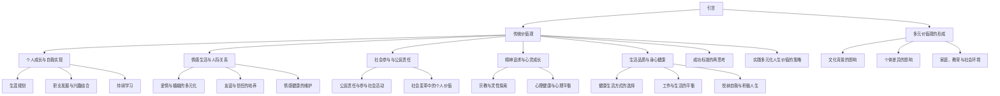

                 

### 引言

在当今这个快速发展的时代，人们对于成功的定义和追求变得愈发复杂多样。传统上，成功往往被定义为物质财富的积累、社会地位的提升或职业成就的获得。然而，随着社会的进步和个人价值观的多元化，越来越多的人开始质疑并探索超越这些传统标准的成功意义。在这个背景下，我们提出《探索多元化的人生价值：超越传统成功标准》这一主题，旨在深入探讨人生价值的多元维度，并引导读者超越狭隘的成功观念，追求更加丰富和有意义的人生。

本文将分为三个主要部分。第一部分将引出人生价值的多元解读，详细阐述传统价值观的定义与挑战，以及探索人生价值的必要性。第二部分将探讨多元化人生价值的实现途径，从个人成长、情感生活、社会参与、精神追求和生活品质等多个角度进行分析。第三部分将结合实际案例，提出超越传统成功标准的实践策略，帮助读者重新定义成功，并找到实现多元化人生价值的路径。

通过这一系列的讨论，我们希望能够引发读者对于自身人生价值的深刻反思，鼓励大家跳出传统成功的框架，探索属于自己的多元化人生价值，实现更加全面和幸福的生活。

### 第一部分：引言

在探讨人生价值的多元解读之前，我们先来回顾一下传统的成功标准。传统上，成功往往与物质财富的积累紧密相关，例如拥有一份高薪工作、购买豪华住宅、拥有高档车辆等。此外，社会地位的提升也是衡量成功的一个重要指标，包括获得高级职位、获得社会认可或荣誉等。职业成就同样被视为成功的重要标志，如晋升、获得重要项目或专利等。

然而，随着时代的变迁，人们对于成功的定义和追求逐渐发生了变化。现代社会中，越来越多的人开始质疑这些传统成功标准的合理性，认为它们过于单一且过于狭隘。物质财富和社会地位固然重要，但人生的价值并不仅仅体现在这些方面。人们开始意识到，成功应该是多维度的，应该涵盖个人成长、情感生活、社会参与、精神追求和生活品质等多个方面。

首先，个人成长是成功的重要组成部分。个人成长不仅包括知识和技能的提升，更包括人格的完善和心态的成熟。一个真正成功的人，不仅要在职业领域取得成就，还应该能够自我提升，不断超越自我，追求更高的境界。

其次，情感生活也是衡量成功的重要指标。人是社会性动物，情感生活的丰富与否直接影响个人的幸福感。一个成功的人不仅要在职业上有所建树，还应该拥有和谐的家庭关系、深厚的友谊和真挚的爱情。

此外，社会参与也是成功不可或缺的一部分。一个人是否能够在社会中扮演积极的角色，贡献自己的力量，往往也是衡量其成功与否的重要标准。参与社会活动、帮助他人、推动社会进步，这些都是体现个人价值的重要途径。

精神追求和生活品质同样是衡量成功的关键因素。精神追求包括对于人生意义的思考、对于宗教或灵性的探索等。一个成功的人不仅要有物质和情感上的满足，还应该有精神上的富足。生活品质则涵盖了健康、环境、休闲等多个方面，一个成功的人应该能够在生活中找到平衡，享受幸福的生活。

总之，现代人对成功的追求已经不再局限于物质财富和社会地位的积累，而是更加注重多元化的成功标准。这既是对传统成功观念的反思，也是对现代社会现实的回应。在这个背景下，探索多元化的人生价值显得尤为重要。接下来，我们将详细讨论多元价值观的形成，以及如何实现多元化人生价值，帮助读者跳出传统成功的框架，追求更加丰富和有意义的人生。

### 传统价值观的定义与挑战

传统价值观通常基于几个核心原则，如物质财富的积累、社会地位的提升和职业成就的获得。这些价值观在现代社会中根深蒂固，影响深远。物质财富被视为成功的重要标志，因为它直接关联到生活质量和幸福感。社会地位提升则反映了个人在社会中的影响力，例如通过获得高级职位或社会荣誉来实现。职业成就，如晋升、获得重要项目或专利，通常被视为个人能力和价值的证明。

然而，随着社会的快速发展，传统价值观面临了一系列挑战。首先，物质财富的追求往往导致人们忽视了精神需求。过度追求财富可能导致生活压力增大，心理健康问题频发，甚至忽视了家庭和朋友的重要性。其次，社会地位的提升虽然能够带来满足感，但也可能带来巨大的压力和焦虑。人们可能为了保持地位而不惜一切代价，甚至可能牺牲个人健康和幸福感。

此外，职业成就的追求在某些情况下可能导致人们的价值观扭曲。一些人可能会为了获得职业上的成功而牺牲个人生活和家庭，甚至陷入职业道德的困境。这种过度追求职业成就的做法不仅对个人不利，也可能对社会产生负面影响。

总的来说，传统价值观在现代社会中的地位逐渐受到质疑。越来越多的人开始认为，成功不应该只依赖于物质财富、社会地位和职业成就，而应该包括更加广泛和多元的维度。这种转变不仅是对个人幸福感的追求，也是对更全面、更平衡的人生价值的探索。

### 探索人生价值的必要性

探索人生价值的必要性在于其能够引导我们重新审视和定义成功，从而找到更加全面和有意义的人生路径。在现代社会，随着物质条件的不断改善和人们对精神需求的日益关注，单纯追求物质财富和社会地位已经无法满足人们的内心渴望。因此，我们需要通过探索人生价值，来填补这种精神上的空虚，实现更加丰富和充实的生活。

首先，探索人生价值能够帮助我们跳出传统成功标准的框架，找到更加多元化的成功路径。传统成功标准往往过于单一，强调物质和职业成就，而忽视了个人成长、情感生活、社会参与和精神追求等多个重要维度。通过探索人生价值，我们可以更全面地认识自己的需求和愿望，从而制定出符合自身特点的成功定义。

其次，探索人生价值有助于提高我们的心理健康和生活满意度。当我们专注于追求单一的成功标准时，往往会忽视自己的精神需求和情感生活。这不仅可能导致心理压力增大，还可能影响我们的家庭和朋友关系。通过探索人生价值，我们可以找到更加符合自己内心需求的生活方式，从而提高心理满足度和幸福感。

此外，探索人生价值还能够促进社会的和谐与进步。当每个人都能够找到适合自己的成功路径时，社会将充满多样性和活力。人们将不再仅仅为了追求物质和职业上的成功而忽视社会责任和道德准则，而是能够在实现个人价值的同时，为社会做出贡献，推动社会的整体进步。

总之，探索人生价值不仅是对个人成长和幸福的追求，也是对更加丰富和有意义的人生的探索。通过重新审视和定义成功，我们可以找到更加符合自己内心需求的人生路径，实现更加全面和幸福的生活。这个过程不仅能够提升我们的心理健康和生活满意度，还能够促进社会的和谐与进步。

### 多元价值观的形成

多元价值观的形成受到多种因素的影响，包括文化背景、个体差异和家庭、教育与社会环境的作用。首先，文化背景对价值观的形成具有深远影响。不同的文化背景会塑造出不同的价值观体系，例如，东方文化强调集体主义和家庭责任，而西方文化则更加注重个人自由和自我实现。这种文化差异不仅体现在社会层面，也深刻影响了每个人的价值观形成过程。

其次，个体差异在多元价值观的形成中起着关键作用。每个人都有独特的经历和性格，这些因素决定了他们对成功的定义和追求方式。例如，有些人可能更倾向于追求物质财富和社会地位，而另一些人则更加注重个人成长和精神追求。这种个体差异使得多元价值观的形成成为可能，因为每个人都可以根据自己的特点来定义自己的成功。

家庭、教育与社会环境也是多元价值观形成的重要影响因素。家庭是一个人价值观形成的最初环境，父母的教育方式和家庭氛围会直接影响孩子的价值观。学校教育同样扮演着重要角色，不同的教育体系和文化背景会传递不同的价值观。此外，社会环境，包括社会规范、社会活动和社会氛围，也会对个人的价值观产生深远影响。

总之，多元价值观的形成是一个复杂而多样的过程，受到文化背景、个体差异和家庭、教育与社会环境等多种因素的共同作用。理解这些因素有助于我们更好地认识自己和他人的价值观，从而促进社会的多元和谐发展。

### 个人成长与自我实现

个人成长与自我实现是人生价值的重要维度，是实现多元化人生的关键。首先，生涯规划在个人成长与自我实现中起着至关重要的作用。一个明确的生涯规划可以帮助我们更好地理解自己的兴趣、能力和目标，从而制定出符合个人发展的路径。通过科学的生涯规划，我们可以有针对性地提升自己的技能和知识，为未来的职业发展打下坚实的基础。

持续学习是个人成长与自我实现的核心要素之一。在快速变化的现代社会，知识更新的速度非常快，持续学习成为保持竞争力和实现自我价值的重要手段。通过不断学习，我们可以更新和拓展自己的知识体系，提高解决问题的能力，从而在职业和个人生活中获得更多的成功和满足感。终身学习不仅是一种态度，更是一种生活方式，它能够帮助我们不断适应新的环境和挑战。

职业发展与兴趣结合是实现个人成长与自我实现的重要途径。兴趣是最好的老师，将兴趣与职业发展相结合，可以使我们在工作中更加投入和有成就感。当我们能够从事自己热爱的事业时，不仅能够提升工作效率，还能够获得更多的职业满足感和成就感。此外，职业发展与个人兴趣的结合还能够促进个人的全面发展，使我们在职业生涯中获得更多的成就感和幸福感。

综上所述，个人成长与自我实现是多元化人生的重要组成部分，通过生涯规划、持续学习和职业发展与兴趣结合，我们可以找到实现自我价值的多维路径，实现更加丰富和有意义的人生。

### 职业发展与兴趣结合

职业发展与兴趣结合是个人成长与自我实现的关键，它不仅能提升工作效率，还能增强职业满意度。首先，兴趣驱动的工作往往具有更高的内在动机，这意味着个体在面对工作挑战时，更可能表现出主动性和创造力。根据心理学研究，内在动机与工作满意度之间存在显著正相关关系，当个体对工作充满热情时，他们更愿意付出额外的努力，从而提高工作效率。

此外，兴趣结合职业发展能够帮助个人找到工作的意义和目的。当工作与个人兴趣相符时，个体更可能将工作视为一种生活的一部分，而不是单纯的谋生手段。这种情况下，工作不仅能够带来经济上的回报，还能满足个体的心理需求，提升整体幸福感。

然而，实现职业发展与兴趣结合并非易事，需要一系列策略和方法。首先，自我认知是关键。个体需要深入了解自己的兴趣、优势和发展潜力，从而确定最适合自己的职业方向。其次，教育和培训是必要的投入。通过不断学习和提升技能，个体可以更好地匹配自己的兴趣和市场需求，提高就业竞争力。此外，职场适应和灵活性也至关重要。个体应学会调整自己的期望和态度，适应不同工作环境和挑战，从而实现个人兴趣与职业目标的平衡。

总之，职业发展与兴趣结合不仅能够提升工作效率和职业满意度，还能帮助个人实现自我价值，找到工作与生活的和谐之道。

### 持续学习的价值

持续学习是个人成长和职业发展的关键驱动力，其重要性在现代社会尤为显著。首先，持续学习有助于提升知识储备和技能水平，使个体能够适应不断变化的工作环境。根据教育学理论，学习是一个动态过程，通过不断吸收新知识、更新旧知识，个体可以不断提升自己的竞争力。此外，持续学习还能够培养批判性思维和解决问题的能力，使个体在面对复杂问题时能够更加从容和高效。

其次，持续学习能够激发创新思维和创造力。在知识经济时代，创新是企业和社会发展的重要动力。通过持续学习，个体可以掌握最新的技术和理论，从而在工作和生活中产生创新的思路和方法。研究表明，具有持续学习习惯的个体在创新能力上表现更加突出，这对于职业发展和个人成就的提升至关重要。

此外，持续学习对于职业发展的影响也是显而易见的。在快速变化的职场环境中，那些具有持续学习能力的个体往往能够迅速适应新的工作需求，抓住新的发展机遇。例如，随着人工智能和大数据技术的发展，对相关领域专业人才的需求日益增加。通过持续学习，个体可以迅速掌握这些新兴技术，提升自己的职业竞争力。

总之，持续学习不仅能够提升知识水平和技能，还能激发创新思维，对职业发展产生深远影响。在追求多元化人生价值的道路上，持续学习是不可或缺的重要环节，它为个人成长和职业成功提供了坚实的基础。

### 情感生活与人际关系

情感生活与人际关系是人生价值的另一个重要维度，它们不仅影响个人的幸福感，也直接关系到个人的心理健康和社会适应能力。首先，爱情和婚姻是情感生活的核心组成部分。爱情不仅是一种情感体验，更是一种社会和文化的象征，它能够带给个体深刻的情感满足和心理支持。健康的爱情关系建立在信任、尊重和理解的基础上，能够为个体提供情感上的依托，增强个体的心理韧性。

其次，友谊和信任在人际关系中起着至关重要的作用。友谊是人际关系中的情感纽带，它能够为个体提供情感支持和社会支持，缓解生活中的压力和孤独感。信任则是友谊的基石，只有建立在信任基础上的关系才能长久稳定。信任不仅体现在个人之间的互动中，也体现在更广泛的社会交往中，它是构建和谐社会的重要条件。

此外，情感健康与心理平衡是维持人际关系和整体幸福感的关键。情感健康指的是个体在情感上的自我认知、自我调节和自我实现的能力。一个情感健康的人能够更好地处理生活中的情感波动，保持心理平衡。心理平衡则是个体在面对压力和挑战时，能够保持积极的心态和稳定的情绪状态，从而更好地应对生活中的各种问题。

总之，情感生活与人际关系是多元化人生价值的重要组成部分，它们不仅直接影响个人的幸福感，还对个人的心理健康和社会适应能力产生深远影响。在追求丰富和有意义的人生过程中，重视和维护情感生活与人际关系，是实现个人幸福和社会和谐的重要途径。

### 爱情与婚姻的多元化

爱情与婚姻的多元化是现代社会的一个重要趋势，反映了人们对于情感生活质量的更高追求。传统观念中，爱情和婚姻往往被视为人生必经的阶段，具有明确的标准和模式。然而，在当今社会，越来越多的个体开始打破这些传统束缚，寻求更加契合自身需求和价值观的恋爱和婚姻方式。

首先，开放式关系的兴起是爱情多元化的重要体现。开放式关系允许伴侣在保持情感联系的前提下，与外部人员进行情感和身体的互动。这种方式在某些情况下能够满足个体对于多样性和自由的需求，但也需要建立在双方高度信任和理解的基础上。开放式关系的成功与否，关键在于个体和伴侣之间的沟通和共识。

其次，现代婚姻观念的变革也显现出多元化趋势。例如，许多夫妇选择“晚婚”或“不婚”，以追求个人职业发展和生活目标的实现。还有一些夫妇选择“联合家庭”，即与前任伴侣保持亲密关系，共同抚养孩子。这种婚姻模式不仅能够维护家庭的稳定，还能够为家庭成员提供更多的情感支持。

此外，跨文化和跨国婚姻也在不断增加，这反映了全球化和文化交流的趋势。跨文化婚姻不仅需要个体对文化差异的尊重和理解，更需要双方共同建立新的文化融合方式。这种多元化的婚姻形式，不仅丰富了双方的个性，也为他们的后代提供了独特的文化背景。

总的来说，爱情与婚姻的多元化是现代社会进步的体现，它反映了人们对个性化和高质量情感生活的追求。在这种趋势下，个体需要更加开放的心态，以适应和创造适合自己的恋爱和婚姻模式。

### 友谊与信任的培养

友谊与信任的培养是构建和谐人际关系的重要基石，也是实现多元化人生价值的关键环节。首先，友谊的建立需要建立在相互理解和支持的基础上。个体在寻找朋友时，往往倾向于寻找具有相似兴趣、价值观和生活经历的人，这样更容易建立起深厚的情感联系。通过共同活动和互动，朋友之间的信任逐渐建立，关系也变得更加稳固。

其次，信任的培养是友谊长久的保障。信任不仅体现在朋友之间的言行一致，还体现在对彼此隐私和秘密的保护。一个值得信任的朋友会在关键时刻提供支持，而不是背后捅刀。这种信任关系能够增强朋友的依赖感和安全感，使友谊更加牢不可破。

为了培养友谊和信任，个体需要付出努力。首先，真诚是建立友谊的基石。诚实地表达自己的想法和感受，能够增加彼此的信任和理解。其次，宽容和包容是维持友谊的重要品质。每个人都有缺点和不足，朋友之间需要相互理解和宽容，才能避免因小事而破坏友谊。

此外，沟通和交流也是友谊与信任培养的关键。开放而真诚的沟通能够帮助朋友之间更好地理解彼此，解决矛盾和误解。定期交流、分享生活经历和感受，能够加深朋友之间的情感联系，增强信任感。

总之，友谊与信任的培养是构建和谐人际关系的重要手段。通过真诚、宽容和有效沟通，个体能够建立起稳固的友谊，从而在多元化的生活中获得更多的支持和幸福感。

### 情感健康的维护

情感健康的维护是确保个体心理健康和整体幸福感的关键因素。首先，情感健康指的是个体在情感上的自我认知、自我调节和自我实现的能力。一个情感健康的人能够更好地处理生活中的情感波动，保持心理平衡。为了维护情感健康，个体需要学会识别和表达自己的情感。通过自我反思和情绪日记，个体可以更好地理解自己的情绪变化，并找到适当的表达方式。

其次，建立健康的应对机制也是维护情感健康的重要途径。生活中不可避免会遇到压力和挑战，个体需要学会有效地应对这些负面情绪。例如，通过运动、冥想或与朋友交流，个体可以缓解压力，保持情感稳定。此外，寻求专业帮助也是一种有效的应对机制，当个体面临严重的情感困扰时，心理咨询师能够提供专业的指导和支持。

最后，保持积极的生活态度和良好的生活习惯也是维护情感健康的关键。通过培养兴趣爱好、参与社会活动和保持健康的生活方式，个体可以提升自己的心理素质，增强情感韧性。总之，情感健康的维护不仅需要个体的自我努力，还需要社会环境的支持，通过综合的方法，个体可以更好地应对生活中的情感挑战，保持良好的心理健康。

### 社会参与与公民责任

社会参与与公民责任是人生价值的重要组成部分，它们不仅能够为个体带来深刻的成就感和满足感，还能促进社会的和谐与进步。首先，社会角色在价值观的形成中起着至关重要的作用。每个人在社会中扮演着不同的角色，如家庭成员、职场人士、社区成员等，这些角色不仅赋予个体特定的责任，也塑造了他们的价值观和行为准则。

其次，公民责任是实现多元化人生价值的重要途径。作为社会成员，个体有责任为社会做出贡献，维护社会秩序和公共利益。这包括遵守法律法规、参与社会公益活动、关心和支持弱势群体等。通过履行公民责任，个体不仅能够提升自己的社会责任感，还能为社会的发展贡献自己的力量。

此外，社会参与能够增强个体的社会认同感和归属感。通过参与社会活动，个体可以结识新的朋友，拓展人际网络，增强社会联系。这不仅有助于提升个人的社会地位和影响力，还能为个体提供更多的资源和机会，促进个人的全面发展。

总之，社会参与与公民责任是多元化人生价值的重要维度，通过履行社会角色和承担公民责任，个体不仅能够实现自我价值，还能为社会做出贡献，实现更加丰富和有意义的人生。

### 公民责任与参与社会活动的意义

公民责任与参与社会活动不仅对个人成长具有重要意义，也是推动社会进步的基石。首先，公民责任是维护社会秩序和公共利益的重要保障。作为社会的一员，每个公民都有义务遵守法律法规，维护社会稳定。通过履行公民责任，个体不仅能够增强自己的社会责任感，还能为社会营造一个和谐、公正的环境。

其次，参与社会活动有助于提升个人的社会认同感和归属感。通过参与社区服务、慈善活动或其他形式的社会参与，个体能够与他人建立联系，拓展人际网络，增强社会联系。这种社会互动不仅有助于个人在心理和情感上的满足，还能为个体提供更多的资源和机会，促进个人的全面发展。

此外，社会参与对个人成长具有深远影响。通过参与社会活动，个体可以学习到团队合作、领导力和解决问题的能力。这些技能不仅对个人的职业发展有益，还能在日常生活中帮助个体更好地应对各种挑战。社会活动还为个体提供了一个平台，使他们能够了解社会问题，培养批判性思维和公共意识。

总之，公民责任与参与社会活动不仅有助于个人成长和社会认同，还能促进社会的和谐与进步。通过积极履行公民责任和参与社会活动，个体不仅能够实现自我价值，还能为社会的繁荣和进步贡献自己的力量。

### 社会变革中的个人价值

社会变革中的个人价值日益凸显，个体在社会进步中的角色和责任变得尤为重要。首先，随着科技和全球化的发展，社会的变化速度不断加快，个体需要具备更高的适应能力和创新能力，以应对不断涌现的新挑战。这不仅要求个体在职业领域中有所建树，还需要他们在社会变革中发挥积极的作用。

其次，个体在社会变革中扮演的角色多样而复杂。作为创新者和引领者，个体可以通过技术创新和商业模式创新，推动社会的进步和发展。例如，互联网和人工智能的发展，离不开众多科技创业者的积极探索。此外，个体还可以作为社会活动家和倡导者，积极参与社会公益事业，推动社会正义和公平。

在社会变革中，个体承担的责任也越来越重大。首先，个体需要具备社会责任感，关注社会问题，积极参与社会变革。通过倡导和实践，个体可以促进社会问题的解决，推动社会进步。其次，个体还需要具备合作精神，与他人共同合作，共同推动社会变革。这种合作不仅体现在个体之间的互动，也体现在个体与组织、政府等社会机构的合作中。

总之，社会变革中的个人价值日益凸显，个体在创新、引领和合作中发挥着关键作用。通过积极承担社会责任，个体不仅能够实现自身价值，还能为社会的繁荣和进步贡献自己的力量。

### 精神追求与心灵成长

精神追求与心灵成长是人生价值的深层次体现，超越了物质和情感的满足，触及人类存在的核心意义。首先，精神富足指的是个体在精神层面上获得的满足和充实感。这种富足不仅来源于宗教信仰或灵性实践，也源于对人生意义的深刻思考和探索。精神富足能够帮助个体在面对生活中的挑战和困境时，保持内在的平静和坚韧。

宗教与灵性探索是精神追求的重要组成部分。不同的宗教和灵性传统提供了丰富的精神资源，帮助个体在精神层面上找到指引和安慰。例如，佛教强调内心的平静与慈悲，基督教强调信仰与救赎，伊斯兰教强调对真主的敬畏和信仰。通过宗教和灵性探索，个体能够找到内心的平静和力量，提升精神层面的满足感。

心理平衡与心理健康是心灵成长的关键指标。一个心理健康的人能够更好地处理生活中的压力和挑战，保持情感和心态的平衡。心理平衡不仅有助于提高个体的生活质量，还能增强其整体幸福感。为了实现心理平衡，个体可以通过冥想、瑜伽、心理咨询等多种途径，提升自我认知和情感管理能力。

总之，精神追求与心灵成长是多元化人生价值的重要组成部分。通过精神富足、宗教与灵性探索以及心理平衡，个体能够在精神层面上获得满足和成长，实现更加丰富和有意义的人生。

### 宗教与灵性探索

宗教与灵性探索是精神追求的重要组成部分，它们为个体提供了深刻的哲学思考和心灵慰藉。不同的宗教和灵性传统各有其独特的教义和实践，这些教义和实践不仅丰富了人类的精神文化，也为个体提供了重要的精神支撑。以下是几种主要的宗教和灵性探索方式：

首先，佛教强调内心的平静与慈悲。佛教教义中的“八正道”和“四圣谛”提供了深刻的哲学思考，帮助个体理解痛苦的本质和解脱的道路。通过禅修和冥想，个体能够培养内心的平静和专注力，从而提升精神富足。

其次，基督教强调信仰与救赎。基督教的教义认为，信仰上帝和接受耶稣基督的救赎是获得精神富足的途径。通过祈祷、圣经阅读和教堂仪式，个体能够与上帝建立紧密的联系，获得心灵慰藉。

伊斯兰教则强调对真主的敬畏和信仰。伊斯兰教教义中的《古兰经》提供了深刻的灵性指导，通过祷告、斋戒和慈善活动，个体能够培养对真主的敬畏之心，实现精神上的满足。

此外，灵性探索还包括多种非宗教的方式，如冥想、瑜伽和气功等。这些实践通过身体和心灵的协调，帮助个体达到内在的平静和满足感。

总之，宗教与灵性探索提供了丰富的精神资源，帮助个体在精神层面上找到满足和指引。通过不同的宗教和灵性传统，个体可以探索自己的内在世界，实现更加丰富和有意义的人生。

### 心理健康与心理平衡

心理健康与心理平衡是心灵成长的重要组成部分，它们直接关系到个体的整体幸福感和生活质量。心理健康指的是个体在情感、认知和行为上的健康状态，而心理平衡则是指个体在处理压力和挑战时，能够保持情感和心态的稳定。以下是几种维护心理健康和心理平衡的方法：

首先，自我认知是关键。通过自我反思，个体可以更好地了解自己的情绪、需求和动机，从而更好地应对生活中的挑战。例如，通过情绪日记，个体可以记录自己的情绪波动，找到情绪波动的规律和原因。

其次，情绪管理是保持心理健康的重要手段。学会识别和表达情绪，可以帮助个体避免情绪的积压和爆发。例如，当个体感到愤怒或沮丧时，可以通过深呼吸、放松训练或写日记等方法，缓解情绪。

第三，建立支持系统也是维护心理健康的重要途径。与家人、朋友和专业人士建立良好的关系，可以为个体提供情感支持和指导。在需要时，个体可以寻求心理咨询师的帮助，通过专业的指导来处理心理问题。

此外，健康的生活方式也对心理健康和心理平衡产生重要影响。适量的运动、均衡的饮食和充足的睡眠，都能够促进个体的身心健康。例如，定期进行有氧运动，可以释放压力，提高心情。

最后，心理平衡可以通过冥想、瑜伽和冥思等实践来实现。这些方法可以帮助个体达到内心的平静和专注，从而在应对生活中的压力时，保持心态的稳定。

总之，心理健康与心理平衡是多元化人生价值的重要组成部分。通过自我认知、情绪管理、建立支持系统、健康的生活方式和心理平衡实践，个体可以提升自己的心理健康，实现更加幸福和有意义的人生。

### 健康生活方式的选择

健康生活方式的选择是保障身心健康、提升生活品质的基础。一个健康的生活方式不仅包括身体的锻炼，还涵盖饮食、休息和心理调节等多个方面。以下是几个关键要素：

首先，适量运动是健康生活方式的重要组成部分。根据世界卫生组织（WHO）的推荐，成年人每周应进行至少150分钟的中等强度有氧运动，或75分钟的高强度有氧运动。例如，每天进行30分钟的快走、跑步或骑自行车，都能够有效提高心肺功能，增强体质。

其次，均衡饮食是健康生活的重要保障。均衡饮食指的是摄入充足的营养素，避免过量摄入糖分、脂肪和盐分。世界卫生组织推荐，每天摄入五种不同的蔬菜和水果，确保蛋白质、碳水化合物、脂肪和纤维的均衡摄入。例如，早餐可以包括全麦面包、鸡蛋和牛奶，午餐可以搭配丰富的蔬菜和瘦肉，晚餐则以清淡为主，避免高热量食物。

充足的休息也是健康生活方式的关键。成年人每天应保证7到9小时的睡眠，儿童和青少年则需要更多的睡眠时间。良好的睡眠有助于恢复体力和精神，提升认知功能和工作效率。例如，睡前可以泡个热水澡或进行冥想，有助于放松身心，提高睡眠质量。

最后，心理调节对健康生活方式同样重要。长期的心理压力会导致一系列健康问题，如心脏病、糖尿病和抑郁症。通过冥想、瑜伽和心理咨询服务等方法，个体可以更好地管理压力，保持心理平衡。例如，每天花10分钟进行冥想，可以帮助减轻焦虑和抑郁情绪。

总之，选择健康的生活方式不仅能提升身心健康，还能提高生活质量。通过适量运动、均衡饮食、充足休息和心理调节，个体可以构建一个更加健康和幸福的生活方式。

### 工作与生活的平衡

工作与生活的平衡是实现多元化人生价值的重要策略，它有助于提升个体的整体幸福感和生活质量。首先，合理安排工作时间是实现平衡的关键。根据心理学研究，个体每周工作时长不应超过40小时，以确保有足够的时间进行休息和放松。例如，通过制定详细的工作计划和时间表，个体可以更高效地完成任务，从而在固定的工作时间内完成更多工作。

其次，设立清晰的界限也是维持工作与生活平衡的重要措施。明确的界限可以帮助个体区分工作时间和个人时间，避免工作对生活的过度侵入。例如，设定每天的工作结束时间，并在下班后关闭工作相关的设备和通讯工具，确保个人时间的纯粹和专注。

此外，学会休息和放松对维持工作与生活平衡至关重要。个体需要确保每天有足够的时间进行休闲娱乐活动，如运动、阅读或与家人朋友共度时光。例如，每周安排一次短途旅行或参加兴趣小组，不仅可以放松身心，还能丰富个人的社交生活。

总之，通过合理安排工作时间、设立清晰的界限以及学会休息和放松，个体可以更好地实现工作与生活的平衡，从而提升整体的幸福感和生活质量。

### 悦纳自我与积极人生

悦纳自我与积极人生是多元化人生价值的重要组成部分，它们能够帮助个体更好地应对生活中的挑战，实现内心的和谐与幸福。首先，悦纳自我意味着接受自己的不完美，认识到每个人的独特价值和潜力。通过自我接纳，个体能够减少内心的冲突和焦虑，建立自信和自尊。

其次，积极人生强调乐观的生活态度和积极的思维方式。一个积极的人不仅能够更好地应对困难和挫折，还能发现生活中的美好和机遇。例如，通过积极的自我对话和正向思维，个体可以在面对挑战时保持冷静和乐观，从而找到解决问题的方法。

为了实现悦纳自我和积极人生，个体可以采取以下策略：

1. **自我反思**：定期进行自我反思，了解自己的情绪、需求和目标，从而更好地认识自己，实现自我提升。

2. **培养感恩习惯**：每天记录自己感激的事情，培养感恩的心态，增强对生活的满足感和幸福感。

3. **积极行动**：设定小目标，通过实现这些目标，逐步提升自我效能感和自信心。

4. **社交支持**：与他人建立良好的社交关系，获得情感支持和建议，共同成长和进步。

总之，悦纳自我和积极人生不仅有助于个体的心理健康和幸福感，还能提升他们在社会中的适应能力和生活质量。通过这些策略，个体可以构建一个更加积极、有意义的人生。

### 成功标准的再思考

随着社会的进步和个人价值观的多元化，成功标准也经历了深刻的变革。传统上，成功往往被简单地定义为物质财富的积累和社会地位的提升。然而，在现代社会，这种单一的成功标准逐渐显露出其局限性，越来越多的个体开始质疑并重新思考成功的内涵。

首先，成功的定义需要从多个维度进行考量。除了物质财富和社会地位，个人成长、情感生活、社会参与和精神追求同样重要。一个真正成功的人，不仅要在职业和财务上取得成就，还需要在个人成长、情感丰富、社会责任和精神富足方面有所建树。这种多元化的成功标准能够更全面地反映一个人的综合价值。

其次，成功的标准因人而异。每个人都有自己的兴趣、能力和目标，因此，对成功的定义也应因人而异。例如，一个人可能认为拥有高薪工作和豪华住宅是成功，而另一个人可能更注重个人兴趣的实现和对社会的贡献。因此，重新定义成功应基于个人的价值观和追求，而不是盲目跟随社会标准。

此外，成功的标准也需要与时俱进。在快速变化的现代社会，技术和文化不断演变，成功标准也应随之调整。例如，随着互联网和人工智能的发展，新的职业机会和成功模式不断涌现。一个在过去被视为成功的职业，可能在今天已经不再适应时代的需求。因此，重新思考成功标准，有助于个体更好地适应社会变化，抓住新的机遇。

总之，重新思考成功标准是适应现代社会多元化需求的重要举措。通过从多个维度、因人而异和与时俱进地定义成功，个体可以找到更加符合自身需求和价值观的成功路径，实现更加丰富和有意义的人生。

### 成功标准的变迁

成功标准的变迁是一个长期而复杂的过程，反映了社会、文化和经济环境的变化。在传统社会，成功主要被定义为物质财富的积累和社会地位的提升。例如，古代社会中的贵族阶层通过土地和财富的积累来显示其成功，而在现代社会，高薪职业、豪华住宅和名牌奢侈品成为衡量成功的标准。

然而，随着20世纪中叶以来社会经济的快速发展，成功标准开始发生显著变化。人们逐渐意识到，单纯追求物质财富并不能带来持久的幸福感。心理健康、家庭生活、人际关系和社会责任等维度开始进入成功标准的讨论范畴。这一转变源于对生活质量更高追求的反思，以及对个人全面发展的重视。

进入21世纪，随着全球化和信息技术的发展，成功标准再次发生变化。现代社会的成功不再仅仅局限于个人成就，更强调社会参与和环境保护。例如，创业家和社会企业家的崛起，反映了成功标准从单一的经济利益向社会价值和环境可持续性的转变。此外，网络影响力的兴起，使得社交媒体上的“点赞”和“关注”也成为了成功的新指标。

综上所述，成功标准的变迁是一个动态的过程，它不仅反映了社会价值观的变化，也受到了经济和技术发展的驱动。从物质财富到心理健康，从个人成就到社会责任，成功的定义正逐步走向多元化和全面化。

### 重新定义成功的要素

重新定义成功的要素是适应现代社会多元化需求的重要步骤，它有助于个体找到更加符合自身需求和价值观的成功路径。首先，心理富足是一个关键要素。心理富足不仅指内心的平静和满足感，还涉及情感健康和心理韧性。一个心理富足的人能够更好地应对生活中的压力和挑战，保持积极的心态和情感平衡。

其次，个人成长是实现成功的重要途径。个人成长不仅包括知识和技能的提升，更包括人格的完善和心态的成熟。一个成功的人不仅要在职业领域有所建树，还要不断自我提升，追求更高的境界。

社会影响力也是重新定义成功的一个重要维度。通过参与社会活动、推动社会进步和帮助他人，个体能够在社会中扮演积极的角色，实现自身价值。社会影响力不仅体现在个体的行为和贡献上，也反映在他们对社会的积极影响和改变上。

最后，幸福感是衡量成功的终极目标。幸福感是一个综合性的概念，包括生活的满足感、情感的健康状态和整体的生活质量。一个成功的人不仅要在物质和职业上取得成就，还应该在情感和精神层面上获得满足感。

综上所述，重新定义成功的要素包括心理富足、个人成长、社会影响力和幸福感。通过综合考虑这些要素，个体可以找到更加符合自身需求和价值观的成功路径，实现多元化的人生价值。

### 超越传统成功标准的方法论

要超越传统成功标准，实现多元化人生价值，我们需要采用一系列方法论，这些方法不仅能够帮助我们重新定义成功，还能在实践中指导我们的行动。以下是几个关键的方法论：

首先，目标设定是实现多元化人生价值的第一步。明确的目标能够为我们的行动提供方向和动力。在设定目标时，我们需要将传统成功标准与个人的兴趣、价值观和长期愿景相结合。例如，一个希望在职业领域有所建树的人，可以设定在特定时间内完成一个重大项目或晋升到高级职位，同时也可以设定提升自身技能和知识的短期目标。

其次，行动规划是实现目标的必要手段。一旦目标设定明确，我们需要制定详细的行动计划，包括具体的时间表、资源需求和执行步骤。例如，为了完成一个重要的职业目标，我们可以制定每天的学习计划、每周的项目进展报告和定期的回顾与调整。

第三，持续学习和自我提升是实现多元化人生价值的基石。在快速变化的现代社会，知识和技能的更新速度非常快，只有不断学习和自我提升，才能保持竞争力和适应能力。例如，通过参加在线课程、读书会或工作坊，我们可以不断拓展自己的知识面和技能，从而在职业和个人生活中保持领先地位。

第四，适应变化和灵活应对是超越传统成功标准的重要策略。面对不确定性和变化，我们需要具备灵活的思维和行动能力。例如，当市场环境发生变化时，企业需要快速调整战略和运营模式，个人也需要灵活应对职业和个人生活中的挑战。

最后，积极心态和心理健康是实现多元化人生价值的重要保障。一个积极的心态能够帮助我们更好地应对困难和挫折，保持内心的平静和坚韧。例如，通过冥想、运动和心理咨询服务，我们可以提升自己的心理韧性，保持心理健康。

总之，通过目标设定、行动规划、持续学习、适应变化和积极心态等方法论，我们可以超越传统成功标准，实现多元化人生价值。这些方法不仅有助于我们在职业和个人生活中取得成功，还能提升我们的整体幸福感和生活质量。

### 实践多元化人生价值的策略

实践多元化人生价值不仅需要理论上的理解，更需要具体的策略和行动步骤。以下是几个关键策略，帮助我们在实际生活中实现多元化人生价值。

首先，**明确目标和价值观**。这是实践多元化人生价值的起点。我们需要明确自己的长期和短期目标，并将其与个人的价值观相结合。例如，如果一个人的价值观强调家庭和健康，那么在制定职业目标时，需要考虑如何平衡工作和家庭，同时保持良好的身体健康。

其次，**制定具体的行动计划**。有了明确的目标后，我们需要制定具体的行动计划，将目标分解成可操作的任务，并为每个任务设定明确的时间表和资源需求。例如，如果目标是提升职业技能，可以制定每天的学习计划，每周的学习成果检查，以及每月的学习目标和进度报告。

第三，**培养持续学习的能力**。多元化人生价值的实现离不开持续学习和自我提升。我们需要保持好奇心和求知欲，不断学习新知识、新技能。可以通过参加在线课程、阅读专业书籍、参加工作坊等方式来提升自己。例如，为了提升领导力，可以报名参加MBA课程或参加领导力研讨会。

第四，**积极适应变化**。现代社会变化迅速，我们需要具备灵活应变的能力。这意味着我们要学会接受变化，适应新的环境和挑战。例如，当公司战略发生变化，我们需要迅速调整自己的工作重心和策略，以适应新的要求。

第五，**关注心理健康**。实现多元化人生价值的过程中，心理健康至关重要。我们需要关注自己的情绪和心理健康，学会压力管理和情绪调节。可以通过冥想、瑜伽、心理咨询等方式来维护心理健康。例如，在感到压力过大时，可以通过冥想来放松身心，缓解压力。

第六，**培养人际关系**。人际关系是实现多元化人生价值的重要支持系统。我们需要积极培养和维护人际关系，建立广泛的人脉网络。可以通过参与社交活动、加入兴趣小组或参加志愿服务等方式来拓展人际关系。例如，参加社区活动不仅能够结识新朋友，还能为社区做出贡献。

总之，实践多元化人生价值需要明确的目标、具体的行动计划、持续学习、积极适应变化、关注心理健康和培养人际关系等策略。通过这些策略，我们可以更好地实现多元化的人生价值，实现更加丰富和有意义的生活。

### 克服障碍与持续成长

在实践多元化人生价值的过程中，个体难免会遇到各种障碍和挑战。克服这些障碍、实现持续成长，需要以下几个关键步骤。

首先，**识别和承认障碍**。要克服障碍，我们首先需要识别并承认它们的存在。这包括自我反思和积极倾听他人的反馈，从而了解自己在哪些方面遇到了困难。例如，如果一个人在职业发展中遇到瓶颈，他们可能需要反思自己的技能和知识是否需要更新。

其次，**制定应对策略**。一旦识别出障碍，我们需要制定具体的应对策略。这可能包括改变工作方法、寻求外部资源或调整个人态度。例如，如果一个人在时间管理上遇到问题，他们可以尝试使用时间管理工具，如番茄工作法，来提高工作效率。

第三，**积极寻求帮助**。克服障碍并不总是单打独斗的过程。我们可以寻求家人、朋友或专业人士的支持和指导。例如，在处理复杂的职业问题时，可以咨询行业专家或导师，获取宝贵的经验和建议。

第四，**保持学习和适应**。持续成长的关键在于保持学习和适应。通过不断学习新知识和技能，我们可以不断提升自己的能力，从而更好地应对挑战。例如，参加在线课程或行业研讨会，可以帮助我们了解最新的行业动态和技术趋势。

第五，**保持积极心态**。积极心态是实现持续成长的重要心理基础。面对困难和挫折时，保持乐观和坚定的信念，有助于我们克服障碍，继续前行。例如，通过自我激励和积极的心理暗示，我们可以增强信心，保持动力。

总之，克服障碍与实现持续成长需要识别和承认障碍、制定应对策略、积极寻求帮助、保持学习和适应，以及保持积极心态。通过这些步骤，个体可以在实现多元化人生价值的道路上不断前进，克服各种挑战，实现个人的成长和发展。

### 创新思维与终身学习

创新思维与终身学习是实现多元化人生价值的动力源泉。在快速变化的时代，创新思维能够帮助我们突破传统思维模式，寻找新的解决方案和机遇。终身学习则是保持个人竞争力和适应能力的关键。以下是几个关键方面，阐述如何通过创新思维和终身学习实现个人成长：

首先，**激发创新思维**。创新思维不是天生的，而是可以通过训练和练习培养的。一种有效的方法是通过多样化思维练习，如头脑风暴、思维导图和模拟场景，来拓展思维的边界。例如，在解决一个复杂问题时，可以尝试从不同角度思考，探索多个可能的解决方案。

其次，**培养好奇心**。好奇心是创新的驱动力。通过保持对未知领域的好奇心，我们可以不断探索新的知识和技能。例如，阅读最新的科技书籍、关注行业动态和研究论文，可以帮助我们了解新兴技术和趋势，从而激发创新灵感。

第三，**实践与反思**。创新思维需要与实际行动相结合。通过实践所学知识和技能，我们可以验证理论的有效性，并从中吸取经验教训。反思则是实践的重要环节，通过反思我们可以总结经验，识别问题，并不断改进和创新。例如，在项目中遇到问题时，可以通过反思找到解决方案，并在下一个项目中避免类似问题。

第四，**建立学习网络**。终身学习需要建立良好的学习网络，包括与同行交流、参加专业培训和研讨会等。通过与他人的交流，我们可以获取新的知识和见解，激发创新思维。例如，参加行业研讨会不仅可以学习最新技术，还能与业界专家和同行建立联系，共同探讨创新解决方案。

第五，**利用技术工具**。现代技术提供了丰富的学习资源，如在线课程、虚拟实验室和协作平台，可以帮助我们更高效地学习和实践。例如，通过在线课程，我们可以学习最新的编程语言或数据分析技术，通过虚拟实验室，我们可以模拟实践复杂的项目。

总之，通过激发创新思维、培养好奇心、实践与反思、建立学习网络和利用技术工具，我们可以实现多元化人生价值。创新思维和终身学习不仅提升了我们的个人能力，还为我们打开了通往成功和成长的大门。

### 探索人生价值的意义

探索人生价值的意义在于帮助我们重新定义成功，找到更加符合自身需求和价值观的生活路径。通过深入探索人生价值，我们可以明确自己的目标和追求，从而在职业、情感、社会和精神等多个维度上实现全面发展。这种探索不仅有助于提升个人的心理健康和幸福感，还能促进社会的和谐与进步。

具体来说，探索人生价值有助于以下几个方面：

首先，**明确个人目标**。通过深入探索，个体可以更好地理解自己的兴趣、优势和价值观，从而设定明确的职业和人生目标。例如，一个人可能发现自己在教育领域有强烈的热情和才能，因此选择成为一名教师，而另一个人可能更倾向于创业，通过创新实现自我价值。

其次，**提升幸福感**。探索人生价值的过程中，个体能够更好地认识自己的需求和愿望，从而找到能够带来满足感和幸福感的活动。例如，通过参与社区服务或宗教活动，个体可以在帮助他人的同时，获得内心的满足和幸福感。

第三，**促进社会和谐**。当每个人都能找到属于自己的价值和使命时，社会将充满多样性和活力。这种多元化的人生价值观有助于减少社会冲突，促进社会的和谐与进步。例如，通过参与社会公益活动，个体不仅能够实现个人价值，还能为社区和社会做出贡献。

第四，**实现自我提升**。探索人生价值的过程本身就是一个不断学习和成长的过程。通过不断反思和调整，个体可以不断提升自己的技能和知识，实现自我超越。例如，通过终身学习和职业发展，个体可以在职业上取得更大的成就，从而实现自我价值的最大化。

总之，探索人生价值的意义在于帮助个体重新定义成功，找到更加丰富和有意义的人生路径。通过明确个人目标、提升幸福感、促进社会和谐和实现自我提升，探索人生价值不仅能够提升个人的生活质量，还能为社会的发展和进步做出积极贡献。

### 超越传统成功标准的目标

超越传统成功标准的目标在于帮助个体在多元维度上实现全面发展和幸福。具体来说，这一目标包括以下几个核心方面：

首先，**精神富足**。精神富足不仅仅是物质和职业成功的补充，更是内心世界的充实和满足。个体需要通过宗教、灵性探索或自我反思来寻找精神上的支撑和指引，从而在面对生活中的挑战时保持内心的平静和坚定。

其次，**个人成长**。个人成长不仅包括知识和技能的提升，更涉及人格的完善和心态的成熟。通过持续学习和自我提升，个体可以不断拓展自己的能力边界，实现个人价值和潜能的最大化。

第三，**社会参与**。社会参与是实现多元化人生价值的重要途径。通过参与社会活动和公益事业，个体不仅能够为社会做出贡献，还能提升自己的社会认同感和归属感，从而实现个人与社会的共赢。

第四，**情感生活**。情感生活是人生的重要组成部分，包括爱情、友谊和家庭关系等。一个丰富和健康的情感生活能够为个体提供情感支持，增强心理韧性，提升整体幸福感。

最后，**生活品质**。生活品质涵盖了健康、环境、休闲等多个方面。通过选择健康的生活方式、保持工作与生活的平衡，个体可以提升生活的幸福感，实现全面的幸福人生。

总之，超越传统成功标准的目标在于帮助个体在多元维度上实现全面发展和幸福。通过追求精神富足、个人成长、社会参与、情感生活和提升生活品质，个体可以在实现个人价值的同时，为社会的发展和进步做出积极贡献。

### 建构属于自己的价值观

建构属于自己的价值观是实现多元化人生价值的基础，它不仅有助于个体明确自己的目标和追求，还能在复杂多变的现代社会中提供方向和指引。以下是一些关键步骤，帮助个体建构属于自己的价值观：

首先，**自我反思**。自我反思是认识自己、理解自己价值观的重要途径。个体可以通过日记、冥想或与他人的交流，深入思考自己的价值观。例如，通过回顾过去的经历和决策，可以识别出哪些价值观对自己的行为和选择产生了影响。

其次，**识别核心价值观**。每个人的价值观都是独一无二的，需要识别出对自己最重要的价值观。这些核心价值观可以是家庭、自由、成就、公正、善良等。识别这些价值观有助于个体在面临选择时，能够基于自己的核心价值观做出决策。

第三，**明确优先级**。不同的价值观在个体生活中的重要程度不同。通过明确各价值观的优先级，个体可以更有效地安排时间和资源，实现自己的目标。例如，如果家庭对自己的价值观至关重要，那么在职业选择上，可能会更倾向于选择能够兼顾家庭的工作。

第四，**实践和反思**。价值观的建构不仅是理论上的思考，更需要通过实际行动来验证和完善。个体可以通过积极参与社会活动、职业发展、人际关系等方面的实践，不断检验和调整自己的价值观。例如，通过参与公益活动，可以验证自己对“善良”这一价值观的实践效果。

第五，**适应变化**。随着时间和环境的变化，个体的价值观也可能发生变化。因此，保持开放的心态，适应新的情境和挑战，是建构和保持个人价值观的重要策略。例如，当新技术的出现改变了职业环境时，个体需要调整自己的价值观，以适应新的工作和生活方式。

总之，通过自我反思、识别核心价值观、明确优先级、实践和反思，以及适应变化，个体可以逐步建构属于自己的价值观。这种价值观不仅能够为个体提供明确的方向和指引，还能在追求多元化人生价值的道路上，帮助个体实现自我价值和幸福感。

### 结语

在《探索多元化的人生价值：超越传统成功标准》这篇文章中，我们深入探讨了人生价值的多元维度，包括个人成长、情感生活、社会参与、精神追求和生活品质等。通过分析传统成功标准的局限性，我们强调了在现代社会中重新定义成功的必要性。我们提出了一系列策略和方法，如目标设定、持续学习、创新思维和心理健康维护，帮助个体在多元化人生价值的道路上找到方向和路径。

探索人生价值的意义不仅在于提升个人的幸福感和生活质量，更在于促进社会的和谐与进步。当我们每个人都能找到适合自己的成功路径，发挥自己的独特价值时，社会将充满多样性和活力。通过建构属于自己的价值观，我们可以更好地理解自己的需求和愿望，实现个人与社会的共赢。

未来，随着科技的不断进步和社会的不断变化，成功的标准也将继续演变。我们鼓励读者保持开放的心态，不断学习和反思，积极探索属于自己的多元化人生价值。无论时代如何变迁，保持内心的平和与追求，才能找到真正属于自己的人生意义。

### 附录A：相关资源与阅读推荐

在探索多元化人生价值的旅程中，获取丰富的知识和资源是至关重要的。以下是一些推荐书籍、文章、视频和在线资源，它们将帮助您进一步深入了解相关主题。

#### 书籍推荐

1. **《真实的幸福：超越物质追求的生活哲学》** — 麦克·麦凯恩（Michael McKean）
   - 本书从心理学和哲学的角度，探讨了幸福的本质，提供了实现精神富足的方法。

2. **《活着为了什么：人生的意义与价值观》** — 埃克哈特·托利（Eckhart Tolle）
   - 本书深入探讨了人生的意义和价值观，帮助读者找到内在的宁静和满足感。

3. **《终身学习：如何成为一个终身学习者》** — 斯科特·扬（Scott Young）
   - 作者通过自己的学习经历，分享了如何通过持续学习不断提升个人能力和实现职业发展的策略。

#### 文章与论文推荐

1. **《多元化成功的多维视角》** — Harvard Business Review
   - 本文探讨了成功标准的多元化，提供了多种成功的定义和实现路径。

2. **《心理健康与情感满足》** — Journal of Positive Psychology
   - 该论文从心理学角度分析了心理健康与情感满足的关系，为维护心理健康提供了科学依据。

3. **《社会参与与公民责任》** — Social Science Research
   - 本文探讨了社会参与对个人和社会的积极影响，强调了公民责任在社会发展中的重要性。

#### 视频与演讲推荐

1. **《TED演讲：如何找到生活的意义》** — 斯蒂芬·吉布林（Stephen Girardin）
   - 斯蒂芬·吉布林分享了如何通过自我反思和目标设定，找到生活的真正意义。

2. **《TED演讲：幸福是什么》** — 马丁·塞利格曼（Martin Seligman）
   - 马丁·塞利格曼从心理学角度探讨了幸福的本质，提供了提升幸福感的实用建议。

3. **《TED演讲：如何影响变革》** — 彼得·德鲁克（Peter Drucker）
   - 彼得·德鲁克分享了如何在个人和职业生活中推动变革，实现更大的社会价值。

#### 网络资源推荐

1. **Coursera** - 提供多种在线课程，涵盖心理学、职业发展、社会参与等多个领域。
2. **Udemy** - 提供丰富的在线课程，包括技能提升、职业发展、终身学习等。
3. **LinkedIn Learning** - 提供专业的职业发展课程，帮助个人提升职业技能。

通过这些书籍、文章、视频和网络资源，您可以进一步拓展知识视野，深化对多元化人生价值的理解。希望这些资源能帮助您在探索人生价值的道路上走得更远、更扎实。

### 附录B：Mermaid 流程图

以下是本文提到的概念和步骤的 Mermaid 流程图，它帮助读者更直观地理解多元化人生价值的多重维度及其相互关系。



### 附录C：Python 源代码示例

以下是关于人生价值多元维度的 Python 示例代码，展示了如何定义和操作一个包含多种人生价值维度的类。

```python
class LifeValue:
    def __init__(self, personal_growth, emotional_life, social_participation, spiritual_pursuit, quality_of_life):
        self.personal_growth = personal_growth
        self.emotional_life = emotional_life
        self.social_participation = social_participation
        self.spiritual_pursuit = spiritual_pursuit
        self.quality_of_life = quality_of_life
    
    def display_values(self):
        print("Personal Growth:", self.personal_growth)
        print("Emotional Life:", self.emotional_life)
        print("Social Participation:", self.social_participation)
        print("Spiritual Pursuit:", self.spiritual_pursuit)
        print("Quality of Life:", self.quality_of_life)

# 创建一个人生价值对象实例
my_life_value = LifeValue('持续学习与自我提升', '和谐的家庭与深厚的友谊', '积极参与社区服务', '对宗教的探索与实践', '健康的生活方式与工作生活的平衡')

# 显示该对象的人生价值维度
my_life_value.display_values()
```

通过这个类和实例，我们可以方便地创建和管理不同的人生价值维度，从而更好地理解和管理个人的多元化人生价值。这段代码不仅展示了如何定义类，还展示了如何通过方法来操作类实例，是理解本文主题的一个实用工具。

