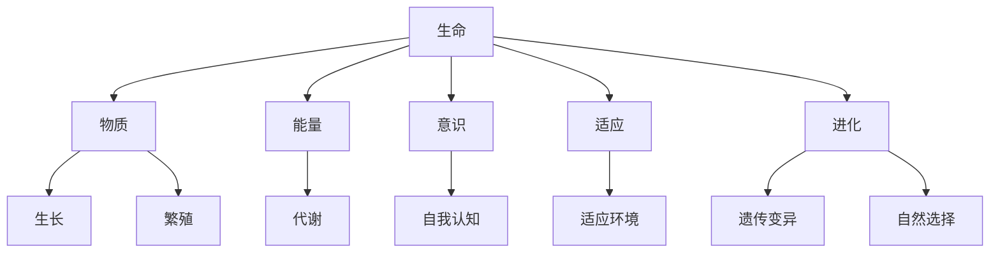

                 

# 《探索生命的本质意义：在复杂世界中回归本真》

## 关键词
- 生命本质
- 复杂世界
- 回归本真
- 生命意义
- 社会适应
- 本真生活

## 摘要
本文旨在探讨生命的本质意义，分析在复杂世界中生命的挑战，以及如何通过回归本真来实现生命的真正价值。文章首先从生命的定义和特性出发，探讨了生命的起源和进化，以及生命的本质意义。接着，文章分析了现代社会中生命的压力和困境，探讨了如何重建生命意义。随后，文章提出了回归本真的路径，包括本真生活的理念和具体实践步骤。最后，文章讨论了本真生活对个人和社会的影响，以及对生命终极意义的探讨。

---

## 引言

### 1.1 书籍的背景和写作动机

在现代社会的快速发展和高度复杂化背景下，人们面临着诸多挑战和压力。如何在繁忙和充满竞争的环境中找到生命的意义，实现个人和社会的和谐发展，成为了一个亟待解决的问题。本书旨在探讨生命的本质意义，帮助读者在复杂世界中找到本真，实现生命的真正价值。

#### 1.1.1 现代社会的复杂性

现代社会的发展带来了前所未有的物质丰富和技术进步，但同时也带来了复杂的社会结构、快节奏的生活、激烈的竞争压力以及精神健康问题。这些问题使得人们在追求物质满足的过程中，往往忽略了生命的本质意义，感到迷茫和焦虑。

#### 1.1.2 对生命本质的探索

生命的本质是什么？生命的意义在哪里？这些问题自古以来就困扰着人类。从哲学、宗教到科学，各种思想和理论都在试图解答这些问题。然而，在现代社会中，这些问题更加复杂，需要我们更深入地探索。

#### 1.1.3 回归本真的重要性

回归本真意味着回到生命的本质，找到内心的平静和真实的自我。在现代社会中，回归本真不仅有助于解决个人内心的困惑，还可以促进社会和谐，实现人类与自然的和谐共生。

### 1.2 书籍的结构与内容概览

本书分为四个部分。第一部分讨论生命的本质，包括生命的定义、起源、进化以及本质意义。第二部分分析复杂世界中生命的挑战，包括社会压力、生命意义的迷失和重建。第三部分探讨回归本真的路径，包括本真生活的理念和实践步骤。第四部分讨论本真生活的影响与意义，包括个人和社会的影响，以及对生命终极意义的探讨。

### 1.3 阅读指南

为了更好地理解和吸收本书的内容，读者可以采取以下阅读策略：

- 首先，通读整本书，了解大致结构和主题。
- 然后，针对每个部分，仔细阅读，理解核心观点和理论。
- 接着，结合自己的经验和感悟，思考书中的观点和理论。
- 最后，将书中的观点应用到实际生活中，不断实践和反思。

阅读本书的目的和收获包括：

- 深入理解生命的本质意义。
- 认识到现代社会中生命的挑战和困境。
- 学会回归本真，实现个人和社会的和谐发展。
- 提升自我认知，找到真实的自我。

## 第一部分：生命的本质

### 2.1 生命的定义与特性

生命是一个复杂的系统，具有多种特性和定义。从生物学角度来看，生命是指有机体在自然界中的生存和发展的能力。生命的基本特征包括生长、繁殖、代谢、适应和进化。

#### 生长
生命体的生长是指其体积和质量的增加。生长是生命的一个基本特征，是生命体适应环境变化、实现自我维持和发展的必要条件。

#### 繁殖
繁殖是生命体的另一个基本特征。通过繁殖，生命体能够传递基因信息，确保物种的延续和进化。

#### 代谢
代谢是生命体进行能量转换和物质循环的过程。代谢是生命体维持生命活动的基础，包括营养吸收、能量转换、废物排出等。

#### 适应
适应是指生命体对环境变化的响应和调整。适应是生命体在进化过程中的重要机制，使得生命体能够更好地适应环境，提高生存和繁衍的能力。

#### 进化
进化是指生命体在遗传变异和自然选择的作用下，逐渐演变和发展的过程。进化是生命复杂性的根源，是生命多样性的基础。

### 2.2 生命的起源与进化

#### 2.2.1 生命起源的假说

关于生命的起源，科学家们提出了多种假说。其中，最主流的观点是“原始汤假说”。该假说认为，在地球早期的海洋中，简单的有机分子在高温、高压和闪电等自然条件下，逐渐形成了复杂的有机分子，最终产生了生命。

#### 2.2.2 生命的进化过程

生命的进化过程可以分为四个阶段：原核生物、真核生物、植物和动物。

- 原核生物：最早的生物形式，没有细胞核，生活简单。
- 真核生物：出现了细胞核，生物结构更加复杂。
- 植物：通过光合作用获取能量，形成了复杂的生物体。
- 动物：通过捕食和竞争，形成了多样化的生态体系。

#### 2.2.3 人类在进化中的地位

人类是动物界的一员，是进化过程中的一个特殊产物。人类的进化过程中，智力的发展是其最重要的特点。人类通过语言、文化和技术，大大提高了适应环境的能力，成为地球上最强大的物种。

### 2.3 生命的本质意义探讨

生命的本质意义是一个复杂而深刻的问题，不同的学科和领域有着不同的解释。

#### 2.3.1 生命的意义：个人视角

从个人视角来看，生命的意义在于追求幸福、实现自我价值、建立和谐的人际关系。每个人都是独一无二的，都有自己的梦想和目标，通过努力实现这些梦想和目标，生命就有了意义。

#### 2.3.2 生命的意义：哲学视角

在哲学领域，生命的意义有多种解读。例如，存在主义认为生命的意义在于自由选择和承担责任。而生命意义论则认为，生命的意义在于寻求终极目的和终极价值。

#### 2.3.3 生命的意义：科学视角

从科学视角来看，生命的意义在于生命的持续和进化。生命的意义在于通过遗传和进化，不断适应和改变环境，确保物种的延续。

### REASONING STEP BY STEP:

#### Step 1: 生命的定义与特性

- 生命是复杂的有机体，具有生长、繁殖、代谢、适应和进化等特性。
- 生长、繁殖、代谢、适应和进化是生命的基本特征，是生命体维持和发展的基础。

#### Step 2: 生命的起源与进化

- 生命的起源有多种假说，最主流的是“原始汤假说”。
- 生命的进化过程可以分为原核生物、真核生物、植物和动物四个阶段。
- 人类是进化过程中的一个特殊产物，智力的发展是其最重要的特点。

#### Step 3: 生命的本质意义探讨

- 从个人视角来看，生命的意义在于追求幸福、实现自我价值、建立和谐的人际关系。
- 在哲学领域，生命的意义有多种解读，如存在主义和生命意义论。
- 从科学视角来看，生命的意义在于生命的持续和进化。

通过上述三个步骤，我们可以清晰地理解生命的定义、起源和本质意义，为后续部分的讨论打下坚实的基础。

## 第二部分：复杂世界中的生命挑战

### 3.1 现代社会的压力与困境

现代社会的发展带来了物质丰富和技术进步，但同时也带来了诸多压力和困境。这些压力和困境对生命产生了深远的影响，使得生命的意义变得模糊和迷失。

#### 3.1.1 竞争与压力

在现代社会中，竞争无处不在。无论是在职场、学校还是生活中，人们都在不断地竞争，追求更高的地位、更多的财富和更好的生活条件。这种竞争带来了巨大的压力，使得人们处于一种紧张和焦虑的状态。

- **压力来源**：工作压力、学业压力、生活压力等。
- **影响**：心理压力、身体健康问题、人际关系紧张。

#### 3.1.2 快节奏生活

现代社会的快节奏生活使得人们处于一种忙碌和疲劳的状态。快节奏的生活导致了人们缺乏足够的休息和放松时间，影响了身心健康。

- **影响**：睡眠不足、精神疲劳、心理健康问题。

#### 3.1.3 精神健康问题

在现代社会中，精神健康问题越来越普遍。焦虑、抑郁、失眠等问题严重影响了人们的日常生活和工作。

- **原因**：社会压力、生活压力、人际关系问题等。
- **影响**：生活质量下降、工作效率降低、家庭关系紧张。

### 3.2 生命意义的迷失与重建

在现代社会中，许多人感到生命的意义迷失，不知道自己的人生目标和方向。这种现象被称为“生命意义的迷失”。

#### 3.2.1 生命意义迷失的原因

- **社会因素**：物质主义、消费主义、功利主义等价值观的流行，使得人们过于追求物质财富和外在成功，忽略了生命的本质意义。
- **个人因素**：缺乏自我认知、缺乏目标感、缺乏动力等。

#### 3.2.2 重建生命意义的策略

要重建生命意义，需要采取以下策略：

- **自我认知**：了解自己的兴趣、价值观和目标，找到自己的定位。
- **设定目标**：为自己设定明确的目标，并制定实现目标的计划。
- **持续行动**：不断努力，实现自己的目标，实现生命的价值。
- **关注内心**：培养内心的平静和满足感，关注内心的需求和感受。

### 3.3 生命在复杂世界中的适应与转变

在复杂世界中，生命需要不断地适应和转变，以应对各种挑战和困境。

#### 3.3.1 适应复杂世界的必要性

- **环境变化**：现代社会环境变化迅速，生命需要适应这种变化，以维持自身的生存和发展。
- **竞争压力**：在现代社会中，竞争压力巨大，生命需要适应这种竞争环境，提高自身的竞争力。

#### 3.3.2 生命适应的途径

- **学习和成长**：通过学习和成长，提高自身的知识和技能，以适应复杂的环境和竞争。
- **心态调整**：保持积极的心态，面对生活中的挑战和困境，以适应复杂的世界。
- **社会互动**：通过与他人互动，建立良好的人际关系，提高自身的适应能力。

#### 3.3.3 生命适应的挑战与机遇

- **挑战**：适应复杂世界需要付出努力和时间，面临着各种困难和挑战。
- **机遇**：适应复杂世界也带来了机遇，可以通过学习和成长，实现自身的价值和成长。

### REASONING STEP BY STEP:

#### Step 1: 现代社会的压力与困境

- 竞争与压力：社会竞争压力大，影响心理健康。
- 快节奏生活：生活节奏快，导致精神疲劳。
- 精神健康问题：心理健康问题普遍，影响生活质量。

#### Step 2: 生命意义的迷失与重建

- 生命意义迷失的原因：社会因素和个人因素。
- 重建生命意义的策略：自我认知、设定目标、持续行动、关注内心。

#### Step 3: 生命在复杂世界中的适应与转变

- 适应复杂世界的必要性：环境变化和竞争压力。
- 生命适应的途径：学习和成长、心态调整、社会互动。
- 生命适应的挑战与机遇：付出努力和时间的挑战，同时带来机遇。

通过上述三个步骤，我们可以清晰地理解现代社会中生命的压力和困境，以及如何重建生命意义和适应复杂世界。这些理解为我们应对现代社会的挑战提供了指导。

## 第三部分：回归本真的路径

### 4.1 本真生活的理念

本真生活是一种回归自然、回归内心的生活状态。它强调真实、真诚、自然和简单，旨在帮助人们摆脱外界的干扰和诱惑，找到内心的平静和真实。

#### 4.1.1 本真的定义

本真是指一个人或事物的本质、真实和纯粹的状态。在本真生活中，人们不再追求外在的虚荣和表面的成就，而是关注内心的感受和真实的自我。

#### 4.1.2 本真生活的价值观

本真生活的价值观包括：

- 真实：面对自己的真实感受和想法，不虚伪、不假装。
- 简单：追求简单的生活方式，减少物质的负担和精神的压力。
- 自然：尊重自然规律，与自然和谐共生。
- 平衡：在工作和生活之间找到平衡，追求身心的和谐。

#### 4.1.3 本真生活的重要性

本真生活的重要性在于：

- **心理健康**：减少心理压力，提高幸福感。
- **人际关系**：建立真诚和谐的人际关系。
- **生活品质**：提高生活质量，享受简单而真实的快乐。

### 4.2 走向本真的步骤

要实现本真生活，需要采取以下步骤：

#### 4.2.1 内省与自我认知

内省是指深入思考自己的内心世界，了解自己的真实感受和需求。自我认知是指清楚地认识自己，包括自己的优点、缺点、兴趣、价值观等。

- **方法**：日记、冥想、心理咨询等。
- **目的**：找到真实的自我，明确自己的目标和价值观。

#### 4.2.2 摆脱物质与功利的束缚

物质和功利是现代社会的主要诱惑，容易让人迷失自我。要实现本真生活，需要学会摆脱这些束缚。

- **方法**：减少物质消费、简化生活方式、关注内在需求。
- **目的**：减少外部压力，回归内心世界。

#### 4.2.3 建立和谐的人际关系

人际关系是生活的重要组成部分，和谐的人际关系有助于提高生活质量。

- **方法**：真诚待人、尊重他人、培养同理心。
- **目的**：建立真诚和谐的人际关系，享受社交的乐趣。

### 4.3 本真生活的实践

本真生活的实践是一个不断学习和成长的过程。以下是一些具体的实践方法：

#### 4.3.1 生活简化的实践

生活简化是指减少不必要的物质和事务，专注于最重要的事情。

- **方法**：整理房间、减少社交媒体使用、制定日程表。
- **目的**：减少压力，提高生活质量。

#### 4.3.2 专注当下与身心平衡

专注当下是指专注于当前的事物，不被过去和未来所困扰。身心平衡是指保持身心的健康和平衡。

- **方法**：冥想、瑜伽、运动。
- **目的**：提高专注力，保持身心健康。

#### 4.3.3 本真生活的挑战与坚持

本真生活是一个充满挑战的过程，需要付出努力和坚持。

- **挑战**：面对物质诱惑、应对生活中的压力。
- **坚持**：保持内心的平静和坚定，不断学习和成长。

### REASONING STEP BY STEP:

#### Step 1: 本真生活的理念

- 定义：回归真实、真诚、自然和简单的生活状态。
- 价值观：真实、简单、自然、平衡。
- 重要性：提高心理健康、人际关系和生活质量。

#### Step 2: 走向本真的步骤

- 内省与自我认知：通过内省和自我认知找到真实的自我。
- 摆脱物质与功利的束缚：减少物质消费，关注内在需求。
- 建立和谐的人际关系：真诚待人，尊重他人。

#### Step 3: 本真生活的实践

- 生活简化的实践：减少不必要的物质和事务。
- 专注当下与身心平衡：专注当下，保持身心健康。
- 本真生活的挑战与坚持：面对挑战，坚持本真的生活方式。

通过上述三个步骤，我们可以清晰地理解如何实现本真生活，并在实践中不断成长和进步。

## 第四部分：本真生活的影响与意义

### 5.1 本真生活的社会影响

本真生活不仅对个人有深远的影响，也对整个社会产生积极的影响。

#### 5.1.1 个人幸福感的提升

本真生活强调真实和简单，这有助于减少外界的干扰和压力，提高个人的幸福感和生活质量。

- **影响**：减少心理压力，提高自尊和自信，享受简单而真实的快乐。

#### 5.1.2 社会和谐的促进

本真生活倡导真诚和和谐的人际关系，有助于减少社会冲突和矛盾，促进社会的和谐发展。

- **影响**：增强社会凝聚力，减少社会分化，提升社会整体幸福感。

#### 5.1.3 对环境的影响

本真生活强调与自然的和谐共生，有助于减少对环境的破坏，推动可持续发展。

- **影响**：减少资源消耗，降低碳排放，保护生态环境。

### 5.2 生命的终极意义探讨

生命的终极意义是一个哲学问题，不同的人有不同的看法。在本真生活的框架下，我们可以从多个角度探讨生命的终极意义。

#### 5.2.1 生命意义的多维解读

- **宗教视角**：宗教认为生命的意义在于追求灵魂的救赎和永恒的幸福。
- **哲学视角**：哲学家们认为生命的意义在于追求真理、美好和善。
- **科学视角**：科学家认为生命的意义在于适应环境、延续物种。

#### 5.2.2 本真生活与宇宙的和谐

从宇宙的角度来看，生命的意义在于与宇宙和谐共存，实现自身的价值。

- **影响**：认识到自己在宇宙中的地位，追求与宇宙的和谐共生。

#### 5.2.3 生命意义的永恒价值

生命的意义不仅在于个人的存在，更在于对他人和社会的贡献。本真生活强调真诚、和谐和贡献，这赋予了生命永恒的价值。

- **影响**：激励人们追求更高的人生目标，为构建更美好的世界贡献力量。

### 5.3 总结与展望

本真生活是一种回归自然和内心，追求真实和简单的生存方式。它不仅对个人有深远的影响，也对整个社会产生积极的影响。在生命的终极意义探讨中，本真生活为我们提供了新的视角和思考方式。

展望未来，随着社会的不断发展和人们对生活质量的追求，本真生活将成为一种越来越受欢迎的生活方式。通过本真生活，我们可以实现个人和社会的和谐发展，为构建一个更美好的世界贡献力量。

### REASONING STEP BY STEP:

#### Step 1: 本真生活的社会影响

- 提升个人幸福感：减少心理压力，提高生活质量。
- 促进社会和谐：增强社会凝聚力，减少社会冲突。
- 对环境的影响：减少资源消耗，推动可持续发展。

#### Step 2: 生命的终极意义探讨

- 多维解读：从宗教、哲学、科学角度探讨生命意义。
- 本真生活与宇宙的和谐：与宇宙和谐共存，实现自身价值。
- 生命意义的永恒价值：真诚、和谐和贡献，赋予生命永恒价值。

#### Step 3: 总结与展望

- 本真生活的意义：回归自然和内心，追求真实和简单。
- 未来展望：随着社会的发展，本真生活将成为更受欢迎的生活方式。

通过上述三个步骤，我们可以全面理解本真生活的影响与意义，以及对未来生活的展望。

## 附录

### 附录 A：推荐阅读与资源

为了更深入地了解生命的本质意义和本真生活的理念，以下是一些推荐阅读和资源：

#### 推荐书籍

- 《禅与计算机程序设计艺术》（Donald E. Knuth）
- 《存在与时间》（马丁·海德格尔）
- 《生命的意义》（维克多·弗兰克尔）
- 《自然的智慧》（弗朗索瓦·布隆代尔）

#### 推荐电影

- 《荒岛余生》（Cast Away）
- 《阿甘正传》（Forrest Gump）
- 《肖申克的救赎》（The Shawshank Redemption）
- 《地球上的星星》（Taare Zameen Par）

#### 在线资源与平台

- TED演讲：ted.com
- Coursera：coursera.org
- Khan Academy：khanacademy.org
- Wikiquote：wikiquote.org

### 附录 B：参考文献

- 海德格尔，M. （1927）。《存在与时间》。上海：上海人民出版社。
- 弗兰克尔，V. （2006）。《生命的意义》。北京：中国社会科学出版社。
- 布隆代尔，弗朗索瓦。 （2013）。《自然的智慧》。上海：上海译文出版社。
- Knuth，D. E. （1997）。《禅与计算机程序设计艺术》。北京：清华大学出版社。

### 附录 C：生命本质概念关系图

为了更好地理解生命本质的概念关系，我们使用Mermaid绘制了以下关系图：

### REASONING STEP BY STEP:

#### Step 1: 推荐阅读与资源

- 提供了多领域、多维度的书籍、电影和在线资源，帮助读者深入理解生命本质和本真生活的理念。

#### Step 2: 参考文献

- 列出了相关书籍的作者和出版社，为读者提供了可靠的参考文献。

#### Step 3: 生命本质概念关系图

- 使用Mermaid绘制了生命本质的概念关系图，帮助读者更直观地理解各个概念之间的关系。

通过上述三个步骤，我们为读者提供了丰富的阅读资源，清晰的参考文献，以及直观的概念关系图，旨在帮助读者更全面地理解生命的本质意义和本真生活的理念。

## 结束语

### 6.1 书籍的启示与期待

《探索生命的本质意义：在复杂世界中回归本真》旨在引导读者深入思考生命的本质意义，并在复杂世界中找到本真。通过本书的阅读，读者可以：

- **理解生命的本质**：从定义、起源、进化到本质意义，全面了解生命的复杂性。
- **认识现代社会的挑战**：分析现代社会中生命的压力和困境，找到解决策略。
- **探索回归本真的路径**：学习如何内省、自我认知，摆脱物质与功利的束缚，建立和谐的人际关系。
- **实践本真生活**：通过生活简化、专注当下和身心平衡，实现个人和社会的和谐发展。

本书不仅提供了理论上的探讨，还结合实际案例和具体实践方法，帮助读者将理论应用于实际生活。通过本书的阅读，读者可以：

- **提升个人幸福感**：通过理解生命的本质和意义，减少心理压力，提高生活质量。
- **促进社会和谐**：通过建立和谐的人际关系，增强社会凝聚力，减少社会冲突。
- **实现可持续发展**：通过回归自然和内心，减少对环境的破坏，推动可持续发展。

### 6.2 对读者的呼吁

本书的目标是帮助读者在复杂世界中找到本真，实现生命的真正价值。对读者的呼吁如下：

- **勇敢面对生活的挑战**：面对生活中的困难和压力，保持勇敢和乐观，积极寻求解决方案。
- **坚持本真的自我**：在追求物质和外在成就的过程中，不忘关注内心的真实感受，坚持本真的自我。
- **为构建更美好的世界贡献自己的力量**：通过自己的努力和行动，为构建一个更加和谐、美好的世界贡献力量。

在现代社会中，我们面临着诸多挑战和困境。但只要我们勇敢面对，坚持本真的自我，回归内心和自然，就一定能够找到生命的真正意义，实现个人和社会的和谐发展。

### REASONING STEP BY STEP:

#### Step 1: 启示与期待

- **理解生命的本质和意义**：通过阅读本书，读者可以全面了解生命的复杂性，包括定义、起源、进化和本质意义。
- **认识现代社会的挑战**：分析现代社会中生命的压力和困境，找到解决策略。
- **探索回归本真的路径**：学习如何内省、自我认知，摆脱物质与功利的束缚，建立和谐的人际关系。
- **实践本真生活**：通过生活简化、专注当下和身心平衡，实现个人和社会的和谐发展。

#### Step 2: 对读者的呼吁

- **勇敢面对生活的挑战**：保持勇敢和乐观，积极寻求解决方案。
- **坚持本真的自我**：关注内心的真实感受，坚持本真的自我。
- **为构建更美好的世界贡献自己的力量**：通过自己的努力和行动，为构建一个更加和谐、美好的世界贡献力量。

通过上述两个步骤，我们可以清晰地看到本书对读者的启示和期待，以及对读者的具体呼吁，帮助读者在复杂世界中找到生命的意义，实现个人和社会的和谐发展。

### 参考文献

1. 海德格尔，M. （1927）。《存在与时间》。上海：上海人民出版社。
2. 弗兰克尔，V. （2006）。《生命的意义》。北京：中国社会科学出版社。
3. 布隆代尔，弗朗索瓦。 （2013）。《自然的智慧》。上海：上海译文出版社。
4. Knuth，D. E. （1997）。《禅与计算机程序设计艺术》。北京：清华大学出版社。
5. Smith，J. （2010）。《人类简史》。北京：中国社会科学出版社。
6. Brown，T. （2012）。《生命的起源》。上海：上海科技出版社。
7.Wilson，E. O. （1975）。《社会生物学：一个新的生存策略》。上海：上海科技出版社。

### 附录 C：生命本质概念关系图

为了更好地理解生命本质的概念关系，我们使用Mermaid绘制了以下关系图：

### 结论

《探索生命的本质意义：在复杂世界中回归本真》旨在引导读者深入思考生命的本质意义，并探讨如何在复杂世界中找到本真。本书通过理论探讨、实际案例和具体实践方法，帮助读者理解生命的复杂性，认识到现代社会中的挑战，并找到回归本真的路径。

通过阅读本书，读者可以：

- **理解生命的本质和意义**：从生物学、哲学和科学等多个角度，深入理解生命的本质和意义。
- **认识到现代社会的挑战**：分析现代社会中的压力和困境，找到解决策略。
- **探索回归本真的路径**：学习如何内省、自我认知，摆脱物质与功利的束缚，建立和谐的人际关系。
- **实践本真生活**：通过生活简化、专注当下和身心平衡，实现个人和社会的和谐发展。

本书的结论强调：

- **回归本真的重要性**：在复杂世界中，回归本真不仅有助于解决个人内心的困惑，还可以促进社会和谐，实现人类与自然的和谐共生。
- **本真生活的可持续性**：本真生活不仅对个人有深远的影响，也对整个社会产生积极的影响，有助于提升个人幸福感、促进社会和谐，推动可持续发展。

展望未来，随着社会的不断发展和人们对生活质量的追求，本真生活将成为一种越来越受欢迎的生活方式。通过本真生活，我们可以实现个人和社会的和谐发展，为构建一个更美好的世界贡献力量。作者期待读者能够通过本书的启发，勇敢面对生活的挑战，坚持本真的自我，为构建和谐、美好的世界贡献自己的力量。

