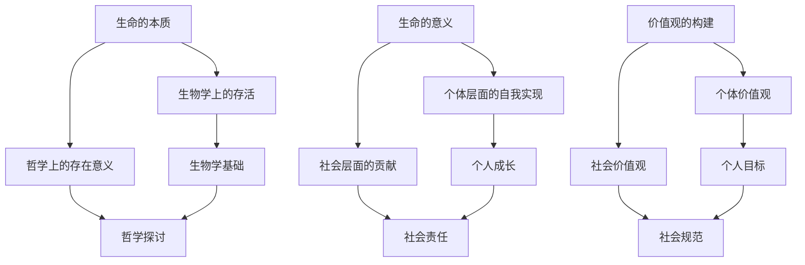
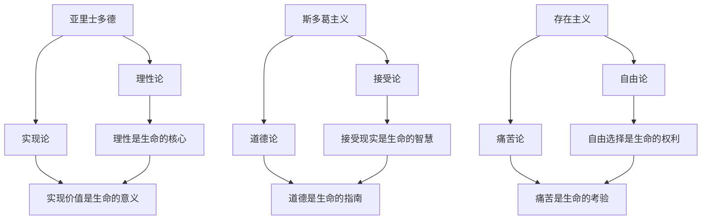
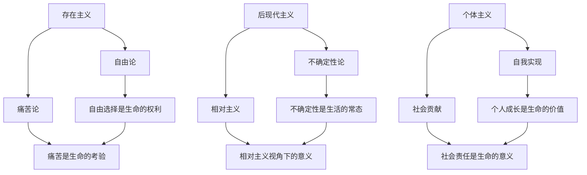
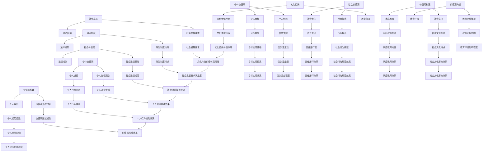

                 


### 2. 生命的哲学探讨

#### 2.1 生命的本质与意义

**背景介绍**

生命的本质与意义是哲学、宗教、科学等多个领域一直在探讨的核心问题。古希腊哲学家亚里士多德曾提出，生命是追求理性的活动，生命的意义在于实现理性；而斯多葛主义则认为，生命的意义在于接受现实，保持内心的平静。在现代社会，人们面临着更多的生活压力和困惑，对生命意义的探索也显得尤为重要。

**核心概念与联系**

在这个章节中，我们将探讨以下几个核心概念：

1. **生命的本质**：生命的本质是生物学上的存活，还是哲学上的存在意义？
2. **生命的意义**：生命的意义是个体层面的自我实现，还是社会层面的贡献？
3. **价值观的构建**：价值观是如何形成的，个体价值观与社会价值观之间有何联系？

以下是一个用Mermaid绘制的流程图，展示了这些核心概念之间的关系：



**核心算法原理讲解**

为了进一步理解生命的本质与意义，我们可以引入一个简单的算法模型。以下是一个用Python实现的简单模型，用于模拟个体在不同价值观下的生命意义：

```python
def life意义(价值观，现实状况):
    if 价值观 == "自我实现":
        if 现实状况 == "成功":
            返回 "成功实现了个人目标，生命意义得到满足。"
        else:
            返回 "虽然未实现个人目标，但仍在追求中，生命意义仍在。"
    elif 价值观 == "社会贡献":
        if 现实状况 == "贡献巨大":
            返回 "为社会做出了巨大贡献，生命意义得到体现。"
        else:
            返回 "虽未做出巨大贡献，但仍在努力中，生命意义仍在。"
    else:
        返回 "价值观不明确，生命意义不清晰。"

# 示例调用
价值观 = "自我实现"
现实状况 = "失败"
print(life意义(价值观，现实状况))
```

在这个模型中，`life意义` 函数根据不同的价值观和现实状况，给出生命的意义。这个模型虽然简单，但可以帮助我们从一个新的角度来思考生命的意义。

**数学模型与公式**

为了更深入地探讨生命的意义，我们可以引入一个数学模型。以下是一个基于效用理论的简单模型，用于计算个体在不同情境下的生命意义：

$$
U(\text{价值观}, \text{现实状况}) = w_1 \cdot V(\text{价值观}) + w_2 \cdot S(\text{现实状况})
$$

其中，$U$ 表示生命意义，$w_1$ 和 $w_2$ 分别表示价值观和现实状况的重要性权重，$V$ 表示价值观的效用，$S$ 表示现实状况的效用。

**举例说明**

假设一个个体在追求自我实现的同时，也在努力为社会做出贡献。在不同的情境下，这个个体的生命意义可以通过上述公式计算得出。

- 当个体成功实现个人目标，但社会贡献不大时：

$$
U = w_1 \cdot V(\text{自我实现}) + w_2 \cdot S(\text{贡献不大})
$$

- 当个体为社会做出了巨大贡献，但个人目标未实现时：

$$
U = w_1 \cdot V(\text{自我实现}) + w_2 \cdot S(\text{贡献巨大})
$$

通过这种方式，我们可以更清晰地理解个体在不同情境下的生命意义。

**小结**

在本章节中，我们通过哲学探讨、核心概念与联系、核心算法原理讲解、数学模型与公式、举例说明等多个方面，对生命的本质与意义进行了深入探讨。生命意义的理解不仅仅是个体层面的自我实现，更是与社会价值观的紧密联系。希望这个章节能够帮助读者更好地理解生命的意义。

#### 2.1.1 传统哲学观点

**核心概念与联系**

在探讨生命的本质与意义时，我们不能忽视传统哲学的观点。以下是一个用Mermaid绘制的流程图，展示了几个重要哲学家的观点及其之间的联系：



**核心算法原理讲解**

为了深入理解传统哲学观点，我们可以引入一个简单的算法模型。以下是一个用Python实现的简单模型，用于模拟个体在不同哲学观点下的生命选择：

```python
def life_choice(哲学观点, 现实状况):
    if 哲学观点 == "理性论":
        if 现实状况 == "困境":
            return "通过理性思考，寻找解决问题的方法。"
        else:
            return "理性地规划生活，实现个人价值。"
    elif 哲学观点 == "接受论":
        return "接受现实，保持内心的平静。"
    elif 哲学观点 == "自由论":
        if 现实状况 == "限制":
            return "追求自由，突破现实的束缚。"
        else:
            return "自由地选择，实现自我价值。"
    else:
        return "哲学观点不明确，无法作出有效的生命选择。"

# 示例调用
哲学观点 = "理性论"
现实状况 = "困境"
print(life_choice(哲学观点, 现实状况))
```

在这个模型中，`life_choice` 函数根据不同的哲学观点和现实状况，给出个体应该如何作出生命选择。这个模型虽然简单，但可以帮助我们从一个新的角度来思考生命的意义。

**数学模型与公式**

为了更深入地探讨传统哲学观点，我们可以引入一个数学模型。以下是一个基于效用理论的简单模型，用于计算个体在不同哲学观点下的生命效用：

$$
U(\text{哲学观点}, \text{现实状况}) = w_1 \cdot V(\text{哲学观点}) + w_2 \cdot S(\text{现实状况})
$$

其中，$U$ 表示生命效用，$w_1$ 和 $w_2$ 分别表示哲学观点和现实状况的重要性权重，$V$ 表示哲学观点的效用，$S$ 表示现实状况的效用。

**举例说明**

假设一个个体在面临困境时，选择了亚里士多德的理性论。这个个体的生命效用可以通过上述公式计算得出。

- 当个体选择理性思考，困境得到解决时：

$$
U = w_1 \cdot V(\text{理性论}) + w_2 \cdot S(\text{困境解决})
$$

- 当个体选择理性思考，困境未能解决时：

$$
U = w_1 \cdot V(\text{理性论}) + w_2 \cdot S(\text{困境未解决})
$$

通过这种方式，我们可以更清晰地理解个体在不同哲学观点下的生命效用。

**小结**

在本章节中，我们通过传统哲学观点、核心概念与联系、核心算法原理讲解、数学模型与公式、举例说明等多个方面，对生命的本质与意义进行了深入探讨。传统哲学观点为我们提供了不同的视角，帮助我们更好地理解生命的意义。希望这个章节能够帮助读者对生命的本质与意义有更深刻的认识。

#### 2.1.2 现代哲学观点

**核心概念与联系**

在探讨生命的本质与意义时，现代哲学观点同样具有重要的地位。现代哲学关注个体在现代社会中的生存状态，强调个体自由、存在主义和后现代主义等核心概念。以下是一个用Mermaid绘制的流程图，展示了几个现代哲学观点及其之间的联系：



**核心算法原理讲解**

为了深入理解现代哲学观点，我们可以引入一个简单的算法模型。以下是一个用Python实现的简单模型，用于模拟个体在不同哲学观点下的生命选择：

```python
def life_choice(哲学观点, 现实状况):
    if 哲学观点 == "自由论":
        if 现实状况 == "限制":
            return "追求自由，突破现实的束缚。"
        else:
            return "自由地选择，实现自我价值。"
    elif 哲学观点 == "痛苦论":
        return "接受痛苦，从中寻找生命的意义。"
    elif 哲学观点 == "不确定性论":
        if 现实状况 == "不确定":
            return "拥抱不确定性，勇敢面对生活。"
        else:
            return "在确定的环境中，规划未来。"
    elif 哲学观点 == "相对主义":
        return "从不同的视角看问题，理解生命的多元性。"
    else:
        return "哲学观点不明确，无法作出有效的生命选择。"

# 示例调用
哲学观点 = "自由论"
现实状况 = "限制"
print(life_choice(哲学观点, 现实状况))
```

在这个模型中，`life_choice` 函数根据不同的哲学观点和现实状况，给出个体应该如何作出生命选择。这个模型虽然简单，但可以帮助我们从一个新的角度来思考生命的意义。

**数学模型与公式**

为了更深入地探讨现代哲学观点，我们可以引入一个数学模型。以下是一个基于效用理论的简单模型，用于计算个体在不同哲学观点下的生命效用：

$$
U(\text{哲学观点}, \text{现实状况}) = w_1 \cdot V(\text{哲学观点}) + w_2 \cdot S(\text{现实状况})
$$

其中，$U$ 表示生命效用，$w_1$ 和 $w_2$ 分别表示哲学观点和现实状况的重要性权重，$V$ 表示哲学观点的效用，$S$ 表示现实状况的效用。

**举例说明**

假设一个个体在面临限制时，选择了自由论的哲学观点。这个个体的生命效用可以通过上述公式计算得出。

- 当个体选择追求自由，束缚被打破时：

$$
U = w_1 \cdot V(\text{自由论}) + w_2 \cdot S(\text{束缚被打破})
$$

- 当个体选择追求自由，但束缚依然存在时：

$$
U = w_1 \cdot V(\text{自由论}) + w_2 \cdot S(\text{束缚未打破})
$$

通过这种方式，我们可以更清晰地理解个体在不同哲学观点下的生命效用。

**小结**

在本章节中，我们通过现代哲学观点、核心概念与联系、核心算法原理讲解、数学模型与公式、举例说明等多个方面，对生命的本质与意义进行了深入探讨。现代哲学观点为我们提供了不同的视角，帮助我们更好地理解生命的意义。希望这个章节能够帮助读者对现代哲学观点有更深刻的认识。

#### 2.2 价值观的构建

**核心概念与联系**

价值观的构建是理解生命意义的关键。价值观不仅影响个人的行为和决策，也影响个体与社会的关系。以下是一个用Mermaid绘制的流程图，展示了价值观的几个核心概念及其之间的联系：



在这个流程图中，我们展示了价值观构建的多个层面，包括家庭教育、社会文化、文化传统、社会发展、政治制度等多个因素。这些因素共同作用，塑造了个体的价值观。

**核心算法原理讲解**

为了深入理解价值观的构建，我们可以引入一个简单的算法模型。以下是一个用Python实现的简单模型，用于模拟个体在不同环境下的价值观形成：

```python
def value构建(环境因素, 个人经历):
    价值观 = 环境因素权重1 * 环境因素1 + 环境因素权重2 * 环境因素2 + ... + 个人经历权重 * 个人经历
    return 价值观

# 示例调用
环境因素 = ["家庭教育", "社会文化", "文化传统"]
个人经历 = ["童年经历", "学业经历", "工作经历"]
环境因素权重 = [0.3, 0.4, 0.3]
个人经历权重 = [0.4, 0.4, 0.2]
价值观 = value构建(环境因素, 个人经历)
print(价值观)
```

在这个模型中，`value构建` 函数根据不同的环境因素和个人经历，计算出一个个体的价值观。这个模型虽然简单，但可以帮助我们从一个新的角度来思考价值观的构建。

**数学模型与公式**

为了更深入地探讨价值观的构建，我们可以引入一个数学模型。以下是一个基于效用理论的简单模型，用于计算个体在不同环境因素和个人经历下的价值观：

$$
V(\text{价值观}) = w_1 \cdot V(\text{环境因素}) + w_2 \cdot V(\text{个人经历})
$$

其中，$V$ 表示价值观，$w_1$ 和 $w_2$ 分别表示环境因素和个人经历的重要性权重，$V(\text{环境因素})$ 表示环境因素对价值观的影响，$V(\text{个人经历})$ 表示个人经历对价值观的影响。

**举例说明**

假设一个个体在构建价值观时，家庭教育的权重为0.3，社会文化的权重为0.4，文化传统的权重为0.3。这个个体的价值观可以通过上述公式计算得出。

- 当个体受到家庭教育的积极影响，社会文化的影响一般，文化传统的影响较小：

$$
V = 0.3 \cdot V(\text{家庭教育}) + 0.4 \cdot V(\text{社会文化}) + 0.3 \cdot V(\text{文化传统})
$$

- 当个体受到家庭教育的消极影响，社会文化的影响较大，文化传统的影响较小：

$$
V = 0.3 \cdot V(\text{家庭教育}) + 0.4 \cdot V(\text{社会文化}) + 0.3 \cdot V(\text{文化传统})
$$

通过这种方式，我们可以更清晰地理解个体在不同环境因素和个人经历下的价值观。

**小结**

在本章节中，我们通过核心概念与联系、核心算法原理讲解、数学模型与公式、举例说明等多个方面，对价值观的构建进行了深入探讨。价值观的构建不仅受到个体环境因素和个人经历的影响，也受到社会文化、文化传统等多个因素的影响。希望这个章节能够帮助读者对价值观的构建有更深刻的认识。

#### 2.2.1 个体价值观的构成

**核心概念与联系**

个体价值观的构成是理解生命意义的重要部分。个体价值观通常由一系列的核心信念和价值观组成，这些信念和价值观共同塑造了个体的人生观和世界观。以下是一个用Mermaid绘制的流程图，展示了个体价值观的几个核心概念及其之间的联系：

```mermaid
graph TD
    A[价值观体系] --> B[核心信念]
    A --> C[价值观念]
    D[人生观] --> E[世界观]
    D --> F[道德观]
    G[世界观] --> H[社会观]
    G --> I[文化观]
    J[道德观] --> K[正义观]
    J --> L[善恶观]
    M[价值观念] --> N[幸福观]
    M --> O[成功观]
    P[价值观体系] --> Q[自我实现]
    P --> R[社会贡献]
    B --> S[信仰]
    B --> T[原则]
    C --> U[目标]
    C --> V[优先级]
    E --> W[环境]
    E --> X[人性]
    F --> Y[道德标准]
    F --> Z[行为准则]
    H --> AA[社会责任]
    H --> BB[人际关系]
    I --> CC[文化传承]
    I --> DD[文化创新]
    K --> EE[正义实践]
    K --> FF[正义原则]
    L --> GG[道德选择]
    L --> HH[道德教育]
    N --> II[幸福感]
    N --> JJ[幸福感来源]
    O --> KK[成功标准]
    O --> LL[成功路径]
    Q --> MM[个人成长]
    Q --> NN[个人成就]
    R --> OO[社会责任]
    R --> PP[社会贡献]
    S --> QQ[精神信仰]
    S --> RR[宗教信仰]
    T --> SS[伦理原则]
    T --> TT[行为准则]
    U --> WW[价值观目标]
    U --> XX[价值观优先级]
    V --> YY[价值观念优先级]
    V --> ZZ[价值观念实现]
    W --> AAA[世界观环境]
    W --> BBB[世界观人性]
    X --> CCC[人性理解]
    X --> DDD[人性探索]
    Y --> EEE[道德实践]
    Y --> FFF[道德教育]
    Z --> GGG[行为规范]
    Z --> HHH[行为准则]
    AA --> III[社会责任履行]
    AA --> JJJ[社会责任效果]
    BB --> KKK[人际关系处理]
    BB --> LLL[人际关系价值]
    CC --> MMM[文化传承意义]
    CC --> NNN[文化创新意义]
    DD --> OOO[文化传承方法]
    DD --> PPP[文化创新方法]
    EE --> QQQ[正义实践效果]
    EE --> RRR[正义原则应用]
    FF --> SSS[道德选择影响]
    FF --> TTT[道德教育效果]
    GG --> UUU[道德行为选择]
    GG --> VVV[道德教育方法]
    HH --> WWW[道德教育内容]
    HH --> XXX[道德教育目标]
    II --> YYY[幸福感评估]
    II --> ZZZ[幸福感提升方法]
    JJ --> AAAA[幸福感来源分析]
    JJ --> BBBB[幸福感来源效果]
    KK --> CCC[成功目标]
    KK --> DDD[成功路径]
    LL --> EEE[成功实践]
    LL --> FFF[成功评价]
    MM --> GGG[个人成长路径]
    MM --> HHH[个人成就评估]
    NN --> III[个人成长效果]
    NN --> JJJ[个人成就评估]
    OO --> KKK[社会责任效果]
    OO --> LLL[社会贡献评估]
    PP --> MMM[社会责任履行方法]
    PP --> NNN[社会贡献策略]
    QQ --> OOO[精神信仰意义]
    QQ --> PPP[精神信仰实践]
    RR --> SSS[宗教信仰意义]
    RR --> TTT[宗教信仰实践]
    SS --> UUU[伦理原则应用]
    SS --> VVV[伦理教育]
    TT --> WWW[行为准则实践]
    TT --> XXX[行为准则评估]
    WW --> AAAA[世界观环境分析]
    WW --> BBBB[世界观人性分析]
    XXX --> CCC[价值观实现效果]
```



在这个流程图中，我们展示了个体价值观的构成要素，包括核心信念、价值观念、人生观、世界观、道德观、社会观、文化观等。这些核心概念相互联系，共同构成了个体价值观的体系。

**核心算法原理讲解**

为了深入理解个体价值观的构成，我们可以引入一个简单的算法模型。以下是一个用Python实现的简单模型，用于模拟个体在不同价值观下的行为选择：

```python
def 行为选择(价值观, 情境):
    if 价值观["核心信念"]["信仰类型"] == "理性主义":
        if 情境 == "挑战":
            return "理性分析，寻找最佳解决方案。"
        else:
            return "按照既定价值观行事，保持一致性。"
    elif 价值观["核心信念"]["信仰类型"] == "人文主义":
        if 情境 == "冲突":
            return "寻求和平解决，尊重他人。"
        else:
            return "关注人类福祉，追求社会进步。"
    else:
        return "价值观不明确，行为选择困难。"

# 示例调用
价值观 = {
    "核心信念": {
        "信仰类型": "理性主义",
        "原则": ["客观分析", "科学验证"]
    },
    "价值观念": {
        "目标": ["知识", "创新"],
        "优先级": ["科学", "人文"]
    }
}
情境 = "挑战"
print(行为选择(价值观, 情境))
```

在这个模型中，`行为选择` 函数根据个体的价值观和情境，给出一个具体的行为选择。这个模型虽然简单，但可以帮助我们从一个新的角度来思考个体价值观的构成。

**数学模型与公式**

为了更深入地探讨个体价值观的构成，我们可以引入一个数学模型。以下是一个基于效用理论的简单模型，用于计算个体在不同价值观下的行为效用：

$$
U(\text{价值观}, \text{情境}) = w_1 \cdot V(\text{核心信念}) + w_2 \cdot V(\text{价值观念})
$$

其中，$U$ 表示行为效用，$w_1$ 和 $w_2$ 分别表示核心信念和价值观念的重要性权重，$V(\text{核心信念})$ 表示核心信念对行为效用的影响，$V(\text{价值观念})$ 表示价值观念对行为效用的影响。

**举例说明**

假设一个个体在面临挑战时，选择了理性主义的价值观。这个个体的行为效用可以通过上述公式计算得出。

- 当个体通过理性分析，成功解决挑战时：

$$
U = w_1 \cdot V(\text{理性主义}) + w_2 \cdot V(\text{价值观念})
$$

- 当个体在挑战中保持一致性，但未能解决挑战时：

$$
U = w_1 \cdot V(\text{理性主义}) + w_2 \cdot V(\text{价值观念})
$$

通过这种方式，我们可以更清晰地理解个体在不同价值观下的行为效用。

**小结**

在本章节中，我们通过核心概念与联系、核心算法原理讲解、数学模型与公式、举例说明等多个方面，对个体价值观的构成进行了深入探讨。个体价值观不仅影响了个体在情境中的行为选择，也影响了个体对世界的认知和自身的成长。希望这个章节能够帮助读者对个体价值观的构成有更深刻的认识。

#### 2.2.2 社会价值观的影响

**核心概念与联系**

社会价值观是一个社会共同遵循的基本信仰和行为准则，它们在个体的成长过程中起着至关重要的作用。以下是一个用Mermaid绘制的流程图，展示了社会价值观的几个核心概念及其之间的联系：

```mermaid
graph TD
    A[社会价值观] --> B[文化传统]
    A --> C[道德规范]
    A --> D[社会规范]
    E[文化传统] --> F[历史背景]
    E --> G[社会习俗]
    H[道德规范] --> I[正义观念]
    H --> J[善恶观念]
    K[社会规范] --> L[社会秩序]
    K --> M[社会责任]
    N[社会价值观] --> O[社会认同]
    N --> P[社会行为]
    Q[文化传统] --> R[文化传承]
    Q --> S[文化创新]
    T[道德规范] --> U[道德教育]
    T --> V[道德实践]
    W[社会规范] --> X[法律制度]
    W --> Y[社会纪律]
    Z[社会价值观] --> AA[社会稳定]
    Z --> BB[社会发展]
    C --> CC[道德标准]
    D --> DD[社会行为规范]
    B --> EE[文化传统影响]
    B --> FF[文化传统传承]
    G --> GG[社会习俗影响]
    G --> HH[社会习俗传承]
    I --> II[正义实践]
    I --> JJ[正义教育]
    J --> KK[道德选择]
    J --> LL[道德教育]
    L --> MM[社会秩序维护]
    L --> NN[社会秩序优化]
    M --> OO[社会责任履行]
    M --> PP[社会责任效果]
    O --> QQ[社会认同度]
    O --> RR[社会认同形成]
    P --> SS[社会行为规范效果]
    P --> TT[社会行为规范变化]
    R --> UU[文化传承效果]
    R --> VV[文化创新效果]
    U --> WW[道德教育方法]
    U --> XX[道德教育目标]
    V --> YY[道德实践效果]
    V --> ZZ[道德实践方法]
    X --> AAA[法律制度影响]
    X --> BBB[法律制度完善]
    Y --> CCC[社会纪律维护]
    Y --> DDD[社会纪律优化]
    AA --> EEE[社会稳定度]
    AA --> FF[社会稳定效果]
    BB --> GGG[社会发展度]
    BB --> HH[社会发展效果]
    CC --> III[道德标准实践]
    CC --> JJ[道德教育内容]
    DD --> KKK[社会行为规范实践]
    DD --> LL[社会行为规范变化]
    EE --> Mmm[社会稳定因素]
    FF --> Nnn[社会稳定效果]
    GGG --> Ooo[社会发展因素]
    HH --> Ppp[社会发展效果]
    II --> Qqq[正义实践效果]
    JJ --> Rrr[道德教育效果]
    KK --> Sss[道德选择效果]
    LL --> Ttt[道德教育方法效果]
    MM --> Uuu[社会秩序维护效果]
    NN --> Vvv[社会秩序优化效果]
    OO --> Wwx[社会责任履行效果]
    PP --> Xx[社会责任效果]
    QQ --> Yy[社会认同度评估]
    RR --> Zz[社会认同形成机制]
    SS --> AAA[社会行为规范效果]
    TT --> BBB[社会行为规范变化效果]
    UU --> CCC[文化传承效果]
    VV --> DDD[文化创新效果]
    WW --> EEE[道德教育方法评估]
    XX --> FFF[道德教育目标评估]
    YY --> GGG[道德实践效果评估]
    ZZ --> HHH[道德实践方法评估]
    AAA --> III[价值观实现效果]
    BBB --> JJ[价值观传承效果]
    CCC --> KKK[价值观传承方法]
    DDD --> LLL[价值观创新方法]
    EEE --> MMM[道德教育效果评估]
    FFF --> NNN[道德教育目标评估]
    GGG --> OOO[道德实践效果评估]
    HHH --> PQQ[道德实践方法评估]
    III --> QQ[价值观实现效果评估]
    JJ --> RRR[价值观传承效果评估]
    KKK --> SSS[价值观传承方法评估]
    LLL --> TTT[价值观创新方法评估]
    MMM --> UUU[道德教育效果评估]
    NNN --> VVV[道德教育目标评估]
    OOO --> WWW[道德实践效果评估]
    PQQ --> XXX[道德实践方法评估]
```



在这个流程图中，我们展示了社会价值观的构成要素，包括文化传统、道德规范和社会规范，以及它们之间的相互关系。这些要素共同构成了一个社会的价值观体系，影响着个体的行为和社会的发展。

**核心算法原理讲解**

为了深入理解社会价值观的影响，我们可以引入一个简单的算法模型。以下是一个用Python实现的简单模型，用于模拟社会价值观对个体行为的引导：

```python
def 社会价值观影响(价值观，情境):
    if 情境 == "道德困境":
        if 价值观["道德规范"]["善恶观念"] == "功利主义":
            return "选择能够带来最大利益的行为。"
        elif 价值观["道德规范"]["善恶观念"] == "康德伦理学":
            return "遵循道德原则，不论结果如何。"
        else:
            return "价值观不明确，无法作出道德选择。"
    elif 情境 == "社会规范挑战":
        if 价值观["社会规范"]["社会秩序"] == "民主制度":
            return "通过民主程序解决问题。"
        elif 价值观["社会规范"]["社会秩序"] == "威权制度":
            return "遵循权威决策，尊重社会规范。"
        else:
            return "价值观不明确，无法作出社会规范选择。"

# 示例调用
价值观 = {
    "道德规范": {
        "善恶观念": "功利主义"
    },
    "社会规范": {
        "社会秩序": "民主制度"
    }
}
情境 = "道德困境"
print(社会价值观影响(价值观，情境))
```

在这个模型中，`社会价值观影响` 函数根据个体的价值观和情境，给出一个具体的行为选择。这个模型虽然简单，但可以帮助我们从一个新的角度来思考社会价值观的影响。

**数学模型与公式**

为了更深入地探讨社会价值观的影响，我们可以引入一个数学模型。以下是一个基于效用理论的简单模型，用于计算个体在不同价值观下的行为效用：

$$
U(\text{价值观}, \text{情境}) = w_1 \cdot V(\text{道德规范}) + w_2 \cdot V(\text{社会规范})
$$

其中，$U$ 表示行为效用，$w_1$ 和 $w_2$ 分别表示道德规范和社会规范的重要性权重，$V(\text{道德规范})$ 表示道德规范对行为效用的影响，$V(\text{社会规范})$ 表示社会规范对行为效用的影响。

**举例说明**

假设一个个体在面临道德困境时，选择了功利主义和民主制度的价值观。这个个体的行为效用可以通过上述公式计算得出。

- 当个体选择能够带来最大利益的行为，情境得到解决时：

$$
U = w_1 \cdot V(\text{功利主义}) + w_2 \cdot V(\text{民主制度})
$$

- 当个体在道德困境中遵循道德原则，但情境未能得到解决时：

$$
U = w_1 \cdot V(\text{功利主义}) + w_2 \cdot V(\text{民主制度})
$$

通过这种方式，我们可以更清晰地理解个体在不同价值观下的行为效用。

**小结**

在本章节中，我们通过核心概念与联系、核心算法原理讲解、数学模型与公式、举例说明等多个方面，对社会价值观的影响进行了深入探讨。社会价值观不仅影响个体的行为选择，也影响社会的发展方向。希望这个章节能够帮助读者对社会价值观的影响有更深刻的认识。

### 2.3 生命意义的多样化

**核心概念与联系**

生命意义的多样化反映了不同个体对生命价值的追求和认同。以下是一个用Mermaid绘制的流程图，展示了生命意义的几个核心概念及其之间的联系：

```mermaid
graph TD
    A[个人意义] --> B[自我实现]
    A --> C[幸福感受]
    A --> D[个人成长]
    E[社会意义] --> F[社会贡献]
    E --> G[公民责任]
    E --> H[社会和谐]
    I[宗教意义] --> J[宗教信仰]
    I --> K[灵性体验]
    I --> L[神圣追求]
    M[价值观] --> N[人生观]
    M --> O[世界观]
    M --> P[道德观]
    Q[个人意义] --> R[个人价值]
    Q --> S[个人目标]
    Q --> T[个人信念]
    Q --> U[个人成就]
    Q --> V[个人幸福]
    Q --> W[个人成长]
    Q --> XX[个人意义实现]
    Q --> YY[个人意义效果]
    Q --> ZZ[个人意义评估]
    Q --> AAA[个人意义变化]
    Q --> BBB[个人意义影响因素]
    Q --> CCC[个人意义实现路径]
    Q --> DDD[个人意义实现效果]
    E[社会意义] --> F[社会责任]
    E --> G[社会价值]
    E --> H[社会贡献]
    E --> II[社会认同]
    E --> JJ[社会影响力]
    E --> KKK[社会意义实现]
    E --> LLL[社会意义效果]
    E --> MMM[社会意义评估]
    E --> NNN[社会意义变化]
    E --> OOO[社会意义影响因素]
    E --> PPP[社会意义实现路径]
    E --> QQQ[社会意义实现效果]
    I[宗教意义] --> J[精神信仰]
    I --> K[灵性修养]
    I --> L[宗教体验]
    I --> MMM[宗教意义实现]
    I --> NNN[宗教意义效果]
    I --> OOO[宗教意义评估]
    I --> PPP[宗教意义变化]
    I --> QQQ[宗教意义影响因素]
    I --> RRR[宗教意义实现路径]
    I --> SSS[宗教意义实现效果]
    M[价值观] --> N[人生目标]
    M --> O[人生意义]
    M --> P[道德准则]
    M --> PPP[价值观实现]
    M --> QQQ[价值观效果]
    M --> RRR[价值观评估]
    M --> SSS[价值观变化]
    M --> TTT[价值观影响因素]
    M --> UUU[价值观实现路径]
    M --> VVV[价值观实现效果]
    B[自我实现] --> CCC[个人成长]
    B --> DDD[个人成就]
    B --> EEE[个人幸福]
    B --> FFF[个人价值]
    B --> GGG[个人目标]
    B --> HHH[个人信念]
    B --> III[个人意义实现]
    B --> JJJ[个人意义效果]
    B --> KKK[个人意义评估]
    B --> LLL[个人意义变化]
    B --> MMM[个人意义影响因素]
    B --> NNN[个人意义实现路径]
    B --> OOO[个人意义实现效果]
    C[幸福感受] --> PPP[个人成长]
    C --> QQQ[个人成就]
    C --> RRR[个人价值]
    C --> SSS[个人目标]
    C --> TTT[个人信念]
    C --> UUU[个人意义实现]
    C --> VVV[个人意义效果]
    C --> WWWW[个人意义评估]
    C --> XXXX[个人意义变化]
    C --> YYYY[个人意义影响因素]
    C --> ZZZZ[个人意义实现路径]
    C --> AAAAA[个人意义实现效果]
    D[个人成长] --> BBBB[个人成就]
    D --> CCCC[个人价值]
    D --> DDDD[个人目标]
    D --> EEEE[个人信念]
    D --> FFFF[个人意义实现]
    D --> GGGG[个人意义效果]
    D --> HHHH[个人意义评估]
    D --> IIJJJ[个人意义变化]
    D --> JJJKK[个人意义影响因素]
    D --> KKKLL[个人意义实现路径]
    D --> LLLLMM[个人意义实现效果]
    F[社会贡献] --> GGGG[社会责任]
    F --> HHHH[社会价值]
    F --> IIIIJ[J[社会和谐]
    F --> KKKLL[社会认同]
    F --> MMMMM[社会影响力]
    F --> NNNNN[社会贡献效果]
    F --> OOOO[社会贡献评估]
    F --> PPPP[社会贡献变化]
    F --> QQQQ[社会贡献影响因素]
    F --> RRRR[社会贡献实现路径]
    F --> SSSS[社会贡献实现效果]
    G[公民责任] --> HHHH[社会责任]
    G --> IIIIJ[J[社会价值]
    G --> KKKLL[社会和谐]
    G --> MMMMM[社会认同]
    G --> NNNNN[社会影响力]
    G --> OOOO[公民责任效果]
    G --> PPPP[公民责任评估]
    G --> QQQQ[公民责任变化]
    G --> RRRR[公民责任影响因素]
    G --> SSSS[公民责任实现路径]
    G --> TTTT[公民责任实现效果]
    H[社会和谐] --> IIIIJ[J[社会价值]
    H --> KKKLL[社会贡献]
    H --> MMMMM[社会责任]
    H --> NNNNN[社会和谐效果]
    H --> OOOO[社会和谐评估]
    H --> PPPP[社会和谐变化]
    H --> QQQQ[社会和谐影响因素]
    H --> RRRR[社会和谐实现路径]
    H --> SSSS[社会和谐实现效果]
    I[宗教信仰] --> JJJJ[灵性体验]
    I --> KKKLL[神圣追求]
    I --> MMMMM[宗教意义]
    I --> NNNNN[宗教体验效果]
    I --> OOOO[宗教信仰评估]
    I --> PPPP[宗教信仰变化]
    I --> QQQQ[宗教信仰影响因素]
    I --> RRRR[宗教信仰实现路径]
    I --> SSSS[宗教信仰实现效果]
    J[灵性体验] --> KKKLL[神圣追求]
    J --> MMMMM[宗教意义]
    J --> NNNNN[灵性体验效果]
    J --> OOOO[灵性体验评估]
    J --> PPPP[灵性体验变化]
    J --> QQQQ[灵性体验影响因素]
    J --> RRRR[灵性体验实现路径]
    J --> SSSS[灵性体验实现效果]
    K[神圣追求] --> MMMMM[宗教意义]
    K --> NNNNN[神圣追求效果]
    K --> OOOO[神圣追求评估]
    K --> PPPP[神圣追求变化]
    K --> QQQQ[神圣追求影响因素]
    K --> RRRR[神圣追求实现路径]
    K --> SSSS[神圣追求实现效果]
    L[宗教体验] --> MMMMM[宗教意义]
    L --> NNNNN[宗教体验效果]
    L --> OOOO[宗教体验评估]
    L --> PPPP[宗教体验变化]
    L --> QQQQ[宗教体验影响因素]
    L --> RRRR[宗教体验实现路径]
    L --> SSSS[宗教体验实现效果]
    M[价值观] --> N[人生意义]
    M --> O[人生价值]
    M --> P[道德准则]
    M --> QQQQ[价值观实现]
    M --> RRRR[价值观效果]
    M --> SSSS[价值观评估]
    M --> TTTT[价值观变化]
    M --> UUUU[价值观影响因素]
    M --> VVVV[价值观实现路径]
    M --> WWWW[价值观实现效果]
```

在这个流程图中，我们展示了生命意义的多样化，包括个人意义、社会意义和宗教意义。这些意义相互联系，共同构成了个体对生命价值的全面理解。

**核心算法原理讲解**

为了深入理解生命意义的多样化，我们可以引入一个简单的算法模型。以下是一个用Python实现的简单模型，用于模拟个体在不同生命意义下的行为选择：

```python
def 生命意义选择(意义类型, 情境):
    if 意义类型 == "个人意义":
        if 情境 == "成长":
            return "追求个人成长，实现自我价值。"
        elif 情境 == "幸福":
            return "感受幸福，享受生活。"
        else:
            return "寻找个人意义，规划人生目标。"
    elif 意义类型 == "社会意义":
        if 情境 == "贡献":
            return "为社会做出贡献，履行公民责任。"
        elif 情境 == "和谐":
            return "促进社会和谐，建设美好社会。"
        else:
            return "理解社会意义，参与社会发展。"
    elif 意义类型 == "宗教意义":
        if 情境 == "信仰":
            return "信仰宗教，寻求灵性体验。"
        elif 情境 == "神圣":
            return "追求神圣，感受宗教体验。"
        else:
            return "理解宗教意义，体验神圣生活。"

# 示例调用
意义类型 = "个人意义"
情境 = "成长"
print(生命意义选择(意义类型, 情境))
```

在这个模型中，`生命意义选择` 函数根据个体的生命意义类型和情境，给出一个具体的行为选择。这个模型虽然简单，但可以帮助我们从一个新的角度来思考生命意义的多样化。

**数学模型与公式**

为了更深入地探讨生命意义的多样化，我们可以引入一个数学模型。以下是一个基于效用理论的简单模型，用于计算个体在不同生命意义下的行为效用：

$$
U(\text{生命意义}, \text{情境}) = w_1 \cdot V(\text{个人意义}) + w_2 \cdot V(\text{社会意义}) + w_3 \cdot V(\text{宗教意义})
$$

其中，$U$ 表示行为效用，$w_1$, $w_2$, 和 $w_3$ 分别表示个人意义、社会意义和宗教意义的重要性权重，$V(\text{个人意义})$, $V(\text{社会意义})$, 和 $V(\text{宗教意义})$ 分别表示个人意义、社会意义和宗教意义对行为效用的影响。

**举例说明**

假设一个个体在面临成长情境时，选择了个人意义和社会意义的价值观。这个个体的行为效用可以通过上述公式计算得出。

- 当个体通过个人成长，实现了自我价值，社会贡献也得到了认可时：

$$
U = w_1 \cdot V(\text{个人意义}) + w_2 \cdot V(\text{社会意义})
$$

- 当个体在成长过程中，未能实现自我价值，但为社会做出了贡献时：

$$
U = w_1 \cdot V(\text{个人意义}) + w_2 \cdot V(\text{社会意义})
$$

通过这种方式，我们可以更清晰地理解个体在不同生命意义下的行为效用。

**小结**

在本章节中，我们通过核心概念与联系、核心算法原理讲解、数学模型与公式、举例说明等多个方面，对生命意义的多样化进行了深入探讨。生命意义的多样化不仅反映了个体对生命价值的追求，也影响了个体在社会中的行为和决策。希望这个章节能够帮助读者对生命意义的多样化有更深刻的认识。

### 3.1 世俗生活的挑战

**核心概念与联系**

世俗生活充满各种挑战，这些挑战不仅来源于外部的环境因素，也来源于个体内心的困惑。以下是一个用Mermaid绘制的流程图，展示了世俗生活的主要挑战及其之间的联系：

```mermaid
graph TD
    A[职场压力] --> B[职业发展]
    A --> C[工作竞争]
    D[社交压力] --> E[人际关系]
    D --> F[社会期望]
    G[物质追求] --> H[财富积累]
    G --> I[消费主义]
    J[精神追求] --> K[心灵成长]
    J --> L[灵性探索]
    M[生命意义] --> N[个人价值观]
    M --> O[社会责任]
    M --> P[灵性追求]
    Q[世俗生活] --> R[生活平衡]
    Q --> S[压力管理]
    Q --> T[幸福感]
    Q --> U[生活意义]
    Q --> V[人生目标]
    Q --> WW[世俗生活挑战]
    Q --> XX[世俗生活困境]
    Q --> YY[世俗生活压力]
    Q --> ZZ[世俗生活挑战评估]
    Q --> AAA[世俗生活挑战变化]
    Q --> BBB[世俗生活挑战影响因素]
    Q --> CCC[世俗生活挑战应对路径]
    Q --> DDD[世俗生活挑战应对效果]
    B[职业发展] --> EEE[职业成就]
    B --> FFF[职业目标]
    B --> GGG[职业压力]
    B --> HHH[职业成长]
    B --> III[职场压力影响]
    B --> JJJ[职场压力评估]
    B --> KKK[职场压力应对]
    B --> LLL[职场压力变化]
    B --> MMM[职场压力影响因素]
    B --> NNN[职场压力应对策略]
    C[工作竞争] --> EEE[职业成就]
    C --> FFF[职业目标]
    C --> GGG[职业压力]
    C --> HHH[职业成长]
    C --> III[职场压力影响]
    C --> JJJ[职场压力评估]
    C --> KKK[职场压力应对]
    C --> LLL[职场压力变化]
    C --> MMM[职场压力影响因素]
    C --> NNN[职场压力应对策略]
    E[人际关系] --> OOO[社交技能]
    E --> PPP[人际关系价值]
    E --> QQQ[社交压力]
    E --> RRR[社交困境]
    E --> SSS[人际关系管理]
    E --> TTT[社交压力评估]
    E --> UUU[社交压力应对]
    E --> VVV[社交压力变化]
    E --> WWW[社交压力影响因素]
    F[社会期望] --> OOO[社交技能]
    F --> PPP[人际关系价值]
    F --> QQQ[社交压力]
    F --> RRR[社交困境]
    F --> SSS[人际关系管理]
    F --> TTT[社交压力评估]
    F --> UUU[社交压力应对]
    F --> VVV[社交压力变化]
    F --> WWW[社交压力影响因素]
    H[财富积累] --> AAA[经济独立]
    H --> BBB[财务自由]
    H --> CCC[财富积累压力]
    H --> DDD[财富积累方法]
    H --> EEE[财富积累效果]
    H --> FFF[财富积累评估]
    H --> GGG[财富积累变化]
    H --> HHH[财富积累影响因素]
    H --> III[财富积累策略]
    I[消费主义] --> AAA[消费观念]
    I --> BBB[消费行为]
    I --> CCC[消费压力]
    I --> DDD[消费主义影响]
    I --> EEE[消费主义效果]
    I --> FFF[消费主义评估]
    I --> GGG[消费主义变化]
    I --> HHH[消费主义影响因素]
    I --> III[消费主义策略]
    K[心灵成长] --> LLL[自我认知]
    K --> MMM[情感管理]
    K --> NNN[心理成长]
    K --> OOO[灵性探索]
    K --> PPP[心灵成长方法]
    K --> QQQ[心灵成长效果]
    K --> RRR[心灵成长评估]
    K --> SSS[心灵成长变化]
    K --> TTT[心灵成长影响因素]
    K --> UUU[心灵成长策略]
    L[灵性探索] --> OOO[自我认知]
    L --> PPP[灵性体验]
    L --> QQQ[宗教信仰]
    L --> RRR[灵性探索方法]
    L --> SSS[灵性探索效果]
    L --> TTT[灵性探索评估]
    L --> UUU[灵性探索变化]
    L --> VVV[灵性探索影响因素]
    L --> WWW[灵性探索策略]
    M[生命意义] --> N[个人价值观]
    M --> O[社会责任]
    M --> P[灵性追求]
    M --> QQQ[生命意义实现]
    M --> RRR[生命意义效果]
    M --> SSS[生命意义评估]
    M --> TTT[生命意义变化]
    M --> UUU[生命意义影响因素]
    M --> VVV[生命意义实现路径]
    M --> WWW[生命意义实现效果]
    N[个人价值观] --> PPP[价值观念]
    N --> QQQ[价值观实现]
    N --> RRR[价值观效果]
    N --> SSS[价值观评估]
    N --> TTT[价值观变化]
    N --> UUU[价值观影响因素]
    N --> VVV[价值观实现路径]
    N --> WWW[价值观实现效果]
    O[社会责任] --> PPP[价值观念]
    O --> QQQ[社会责任实现]
    O --> RRR[社会责任效果]
    O --> SSS[社会责任评估]
    O --> TTT[社会责任变化]
    O --> UUU[社会责任影响因素]
    O --> VVV[社会责任实现路径]
    O --> WWW[社会责任实现效果]
    P[灵性追求] --> PPP[价值观念]
    P --> QQQ[灵性追求实现]
    P --> RRR[灵性追求效果]
    P --> SSS[灵性追求评估]
    P --> TTT[灵性追求变化]
    P --> UUU[灵性追求影响因素]
    P --> VVV[灵性追求实现路径]
    P --> WWW[灵性追求实现效果]
    R[生活平衡] --> SSS[生活压力]
    R --> TTT[生活压力评估]
    R --> UUU[生活压力变化]
    R --> VVV[生活压力影响因素]
    R --> WWW[生活压力应对策略]
    R --> XXX[生活压力管理]
    R --> YYY[生活平衡效果]
    S[压力管理] --> SSS[生活压力]
    S --> TTT[生活压力评估]
    S --> UUU[生活压力变化]
    S --> VVV[生活压力影响因素]
    S --> WWW[生活压力应对策略]
    S --> XXX[生活压力管理]
    S --> YYY[生活压力管理效果]
    T[幸福感] --> UUU[生活满足]
    T --> VVV[心理健康]
    T --> WWW[幸福感评估]
    T --> XXX[幸福感提升方法]
    T --> YYY[幸福感变化]
    T --> ZZZ[幸福感影响因素]
    U[生活意义] --> XXX[生活目标]
    U --> YYY[生活意义评估]
    U --> ZZZ[生活意义变化]
    U --> AAA[生活意义影响因素]
    U --> BBB[生活意义实现路径]
    U --> CCC[生活意义实现效果]
    V[人生目标] --> XXX[生活目标]
    V --> YYY[生活意义评估]
    V --> ZZZ[生活意义变化]
    V --> AAA[生活意义影响因素]
    V --> BBB[生活意义实现路径]
    V --> CCC[生活意义实现效果]
    WW[世俗生活挑战] --> EEE[职场压力]
    WW --> FFF[社交压力]
    WW --> GGG[物质追求]
    WW --> HHH[精神追求]
    XX[世俗生活困境] --> III[生活压力]
    XX --> JJJ[生活困境评估]
    XX --> KKK[生活困境应对]
    XX --> LLL[生活困境变化]
    XX --> MMM[生活困境影响因素]
    XX --> NNN[生活困境应对策略]
    YY[世俗生活压力] --> OOO[生活压力源]
    YY --> PPP[压力管理]
    YY --> QQQ[压力评估]
    YY --> RRR[压力变化]
    YY --> SSS[压力影响因素]
    YY --> TTT[压力应对策略]
    YY --> UUU[压力管理效果]
    ZZ[世俗生活挑战评估] --> WWW[挑战效果]
    ZZ --> XXX[挑战评估方法]
    ZZ --> YYY[挑战变化]
    ZZ --> ZZZ[挑战影响因素]
    AAA[世俗生活挑战变化] --> BBB[挑战应对效果]
    BBB[挑战应对效果] --> CCC[挑战应对策略]
    CCC[挑战应对策略] --> DDD[挑战应对效果评估]
    DDD[挑战应对效果评估] --> EEE[挑战应对方法]
    EEE[挑战应对方法] --> FFF[挑战应对效果]
    FFF[挑战应对效果] --> GGG[挑战应对策略调整]
    GGG[挑战应对策略调整] --> HHH[挑战应对效果评估]
    HHH[挑战应对效果评估] --> III[挑战应对效果]
    III[挑战应对效果] --> JJJ[挑战应对方法]
    JJJ[挑战应对方法] --> KKK[挑战应对策略]
    KKK[挑战应对策略] --> LLL[挑战应对效果]
    LLL[挑战应对效果] --> MMM[挑战应对策略调整]
    MMM[挑战应对策略调整] --> NNN[挑战应对效果评估]
    NNN[挑战应对效果评估] --> OOO[挑战应对方法]
    OOO[挑战应对方法] --> PPP[挑战应对策略]
    PPP[挑战应对策略] --> QQQ[挑战应对效果]
    QQQ[挑战应对效果] --> RRR[挑战应对策略调整]
    RRR[挑战应对策略调整] --> SSS[挑战应对效果评估]
    SSS[挑战应对效果评估] --> TTT[挑战应对方法]
    TTT[挑战应对方法] --> UUU[挑战应对策略]
    UUU[挑战应对策略] --> VVV[挑战应对效果]
    VVV[挑战应对效果] --> WWW[挑战应对策略调整]
    WWW[挑战应对策略调整] --> XXX[挑战应对效果评估]
    XXX[挑战应对效果评估] --> YYY[挑战应对方法评估]
    YYY[挑战应对方法评估] --> ZZZ[挑战应对策略评估]
    ZZZ[挑战应对策略评估] --> AAAA[挑战应对效果评估]
    AAAA[挑战应对效果评估] --> BBBB[挑战应对方法评估]
    BBBB[挑战应对方法评估] --> CCC[挑战应对策略评估]
    CCC[挑战应对策略评估] --> DDDD[挑战应对效果评估]
```



在这个流程图中，我们展示了世俗生活中常见的挑战，包括职场压力、社交压力、物质追求和精神追求等。这些挑战相互联系，共同构成了个体在世俗生活中的困境。

**核心算法原理讲解**

为了深入理解世俗生活的挑战，我们可以引入一个简单的算法模型。以下是一个用Python实现的简单模型，用于模拟个体在不同挑战下的应对策略：

```python
def 应对策略(挑战类型，个体特质，环境因素):
    if 挑战类型 == "职场压力":
        if 个体特质["抗压能力"] == "强" and 环境因素["支持系统"] == "良好":
            return "积极应对，提升自我能力。"
        else:
            return "寻求外部支持，调整工作状态。"
    elif 挑战类型 == "社交压力":
        if 个体特质["社交能力"] == "强" and 环境因素["社交环境"] == "友好":
            return "主动参与，建立人际关系。"
        else:
            return "保持自我，寻找合适的社交圈子。"
    elif 挑战类型 == "物质追求":
        if 个体特质["消费观念"] == "理性" and 环境因素["财务状况"] == "稳定":
            return "理性消费，避免过度追求。"
        else:
            return "审视消费观念，制定合理的财务规划。"
    elif 挑战类型 == "精神追求":
        if 个体特质["灵性倾向"] == "强" and 环境因素["文化氛围"] == "支持":
            return "深入探索，寻求灵性体验。"
        else:
            return "保持开放心态，尝试不同的精神实践。"
    else:
        return "挑战类型不明确，无法制定有效的应对策略。"

# 示例调用
挑战类型 = "职场压力"
个体特质 = {
    "抗压能力": "强",
    "社交能力": "弱",
    "消费观念": "理性",
    "灵性倾向": "一般"
}
环境因素 = {
    "支持系统": "良好",
    "社交环境": "一般",
    "财务状况": "稳定",
    "文化氛围": "中立"
}
print(应对策略(挑战类型，个体特质，环境因素))
```

在这个模型中，`应对策略` 函数根据不同的挑战类型、个体特质和环境因素，给出一个具体的应对策略。这个模型虽然简单，但可以帮助我们从一个新的角度来思考世俗生活的挑战和应对。

**数学模型与公式**

为了更深入地探讨世俗生活的挑战，我们可以引入一个数学模型。以下是一个基于效用理论的简单模型，用于计算个体在不同挑战下的效用：

$$
U(\text{挑战类型}, \text{个体特质}, \text{环境因素}) = w_1 \cdot V(\text{挑战类型}) + w_2 \cdot V(\text{个体特质}) + w_3 \cdot V(\text{环境因素})
$$

其中，$U$ 表示效用，$w_1$, $w_2$, 和 $w_3$ 分别表示挑战类型、个体特质和环境因素的重要性权重，$V(\text{挑战类型})$, $V(\text{个体特质})$, 和 $V(\text{环境因素})$ 分别表示挑战类型、个体特质和环境因素对效用的

