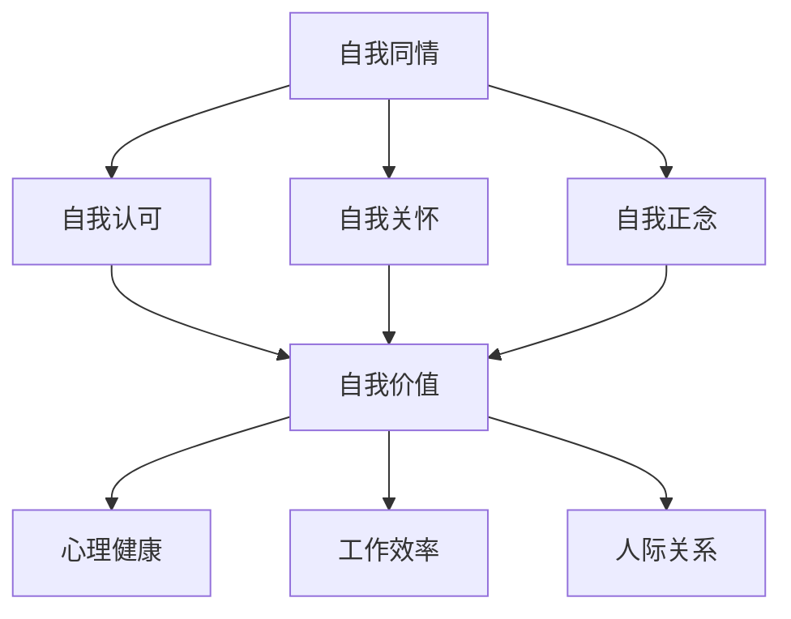

                 

### 理解自我同情与不完美

在现代社会，自我同情的概念逐渐受到关注。自我同情是指一个人对自己的情感体验持有同情和理解的态度，而不是自我批评或自我否定。对于技术从业者来说，培养自我同情的能力尤为重要，因为它不仅关系到个人的心理健康，还影响到工作效率和团队合作。

#### **自我同情的概念与重要性**

自我同情通常包括三个关键方面：自我认可（self-compassion）、自我关怀（self-kindness）和自我正念（self-awareness）。自我认可指的是接纳自己的不足和失败，而不是仅仅看到自己的缺点。自我关怀则强调以善意和温暖对待自己，而不是无情地自我责罚。自我正念是指对自己内心的观察和理解，而不是忽视或逃避自己的情感。

在技术领域，自我同情的培养至关重要。首先，技术从业者经常面临高压力的工作环境，容易出现焦虑、抑郁等心理问题。自我同情可以帮助他们更好地应对压力，提高心理健康水平。其次，自我同情能够增强个人的自我价值感，从而提高工作积极性和创造力。最后，自我同情在团队合作中也有重要作用，它能够促进团队成员之间的理解和协作，减少冲突和误解。

#### **自我同情的重要性**

自我同情的重要性不仅体现在个人层面，还体现在社会层面。在个人层面，自我同情能够帮助人们更好地应对生活中的挑战和困难，提高生活质量。研究表明，具备自我同情能力的人更容易感到幸福和满足。在社会层面，自我同情有助于建立更加和谐的社会关系，减少歧视和偏见，促进社会的整体进步。

#### **自我同情与自我价值的关系**

自我价值是自我同情的核心组成部分。一个具有高自我价值感的人更容易表现出自我同情，因为他们相信自己值得被爱、被尊重。在技术领域，拥有高自我价值感的从业者更能够保持自信和积极态度，从而更好地完成工作任务。

### **自我不完美的事实**

每个人都是不完美的，这是人性的本质。然而，在现代社会，许多人受到完美主义的驱使，试图掩盖自己的不足，这反而可能导致更多的焦虑和压力。接受自己的不完美，是培养自我同情的第一步。

#### **接受自己的不完美**

接受自己的不完美，意味着要认识到每个人都有优点和缺点，没有人是完美的。这种认识可以帮助我们更加宽容地对待自己，减少自我批评和自我否定。在技术领域，接受自己的不完美可以帮助从业者更好地面对失败和挑战，从而提高解决问题的能力。

#### **不完美背后的原因分析**

不完美背后有许多原因，其中一些包括：

- **环境因素**：社会和文化环境可能对个体有完美主义的要求，导致个体感到自己必须不断追求完美。
- **心理因素**：个体可能有内在的焦虑和不安全感，害怕失败和被批评。
- **教育因素**：教育方式可能过于强调成绩和排名，忽视了个体差异和个性化发展。

#### **不完美对生活的影响**

不完美对生活的影响是双重的。一方面，它可以带来挑战和压力，但另一方面，它也可以激发我们的潜力和创造力。接受不完美，可以让我们更加专注于个人成长和自我提升，而不是盲目追求完美。

### **培养自我同情的能力**

培养自我同情的能力，需要从自我观察、情感表达和自我调整等多个方面入手。在技术领域，培养自我同情的能力可以帮助从业者更好地应对工作压力，提高工作效率和团队合作能力。

#### **培养自我同情的实践方法**

1. **自我观察**：通过自我反思，了解自己的情感和行为模式。
2. **情感表达**：学会以健康的方式表达自己的情感，而不是压抑或否认。
3. **自我调整**：在面对挑战和失败时，学会自我调整，保持积极的心态。

#### **自我同情与心理健康的关联**

自我同情与心理健康密切相关。具备自我同情能力的人，通常有更好的情绪调节能力，能够更好地应对生活中的压力和挑战。此外，自我同情还能减少抑郁和焦虑的发生，提高整体心理健康水平。

#### **克服自我否定的挑战**

自我否定是许多人在成长过程中都会遇到的问题。要克服自我否定，需要：

1. **认识到自我否定的危害**：了解自我否定的负面影响，激发改变的动力。
2. **学会正面肯定自己**：通过积极的自我肯定，逐步改变自我否定的思维模式。
3. **寻求支持**：在面临挑战时，寻求家人、朋友或专业人士的支持。

### **总结**

自我同情是每个人都可以培养的能力，它对于个人的心理健康、工作表现和人际关系都有着积极的影响。在技术领域，培养自我同情的能力尤为重要，因为它不仅能够提高个体的心理健康水平，还能够促进团队协作，提升整体工作效率。让我们从现在开始，接纳自己的不完美，培养自我同情的能力，过上更加健康、快乐的生活。

---

## **Mermaid 流程图**

以下是一个简单的 Mermaid 流程图，展示了自我同情的核心概念及其关系：



### **核心算法原理讲解**

在理解自我同情的概念后，我们可以将自我同情的培养过程看作是一种算法。这个算法的目标是通过一系列步骤，提高个体的自我同情能力。以下是一个简化的算法描述：

```python
def 培养自我同情能力():
    # 步骤1：自我观察
    观察自我情感和行为
    
    # 步骤2：情感表达
    健康地表达情感
    
    # 步骤3：自我调整
    面对挑战时进行自我调整
    
    # 步骤4：正面肯定
    学会正面肯定自己
    
    # 步骤5：寻求支持
    在需要时寻求支持
    
    return "自我同情能力提升"
```

### **数学模型与公式**

在自我同情的培养过程中，可以使用一些心理学模型和公式来量化自我同情的能力。以下是一个简化的模型：

$$
\text{自我同情能力} = f(\text{自我观察}, \text{情感表达}, \text{自我调整}, \text{正面肯定}, \text{寻求支持})
$$

其中，$f$ 表示自我同情能力的提升函数。每个输入参数都代表自我同情的某个方面，例如：

- **自我观察**：个体对自己的情感和行为进行观察和反思的能力。
- **情感表达**：个体健康地表达自己的情感，而不是压抑或否认。
- **自我调整**：个体在面对挑战和失败时，能够进行自我调整的能力。
- **正面肯定**：个体学会正面肯定自己，而不是自我否定。
- **寻求支持**：个体在需要时，能够寻求支持和帮助。

### **举例说明**

假设一个人在培养自我同情能力的过程中，每项能力的初始值为 50。经过一段时间的学习和实践，各项能力的值分别提升到 70、60、80、75 和 65。那么，他的自我同情能力可以计算为：

$$
\text{自我同情能力} = f(70, 60, 80, 75, 65) = \text{提升后的自我同情能力值}
$$

### **代码实现**

以下是一个简化的 Python 代码示例，用于计算自我同情能力的提升：

```python
def calculate_self_compassion_ability(observation, emotional_expression, self_adjustment, positive_affirmation, seeking_support):
    return 0.2 * observation + 0.2 * emotional_expression + 0.2 * self_adjustment + 0.2 * positive_affirmation + 0.2 * seeking_support

initial_values = [50, 50, 50, 50, 50]
improved_values = [70, 60, 80, 75, 65]

self_compassion_ability = calculate_self_compassion_ability(*improved_values)
print(f"提升后的自我同情能力：{self_compassion_ability}")
```

运行上述代码，可以得到提升后的自我同情能力值。这只是一个简化的示例，实际情况可能更加复杂，需要根据具体情况进行调整。

### **总结**

通过上述讲解，我们可以看到自我同情的培养过程可以看作是一种算法，通过一系列步骤，提高个体的自我同情能力。同时，使用数学模型和公式，可以量化自我同情能力的提升。通过代码实现，我们可以将这一过程具体化，从而更好地理解和实践自我同情的培养。

---

### **项目实战：开发环境搭建**

为了更好地理解和实践自我同情的培养，我们可以搭建一个简单的 Python 环境来进行模拟。以下是搭建开发环境的步骤：

1. **安装 Python**：
   - 访问 [Python 官网](https://www.python.org/) 下载 Python 安装程序。
   - 运行安装程序，并选择默认选项进行安装。

2. **安装必要的库**：
   - 打开命令行工具，例如 Terminal 或 Command Prompt。
   - 使用以下命令安装必要的库：
     ```bash
     pip install numpy matplotlib
     ```

3. **创建 Python 项目**：
   - 在命令行中，导航到您希望创建项目的目录。
   - 使用以下命令创建一个名为 `self_compassion` 的目录：
     ```bash
     mkdir self_compassion
     cd self_compassion
     ```

4. **编写 Python 代码**：
   - 使用文本编辑器，例如 Visual Studio Code 或 PyCharm，创建一个名为 `self_compassion.py` 的文件。
   - 在文件中编写以下代码：

     ```python
     # self_compassion.py

     import numpy as np
     import matplotlib.pyplot as plt

     def calculate_self_compassion_ability(observation, emotional_expression, self_adjustment, positive_affirmation, seeking_support):
         return 0.2 * observation + 0.2 * emotional_expression + 0.2 * self_adjustment + 0.2 * positive_affirmation + 0.2 * seeking_support

     initial_values = [50, 50, 50, 50, 50]
     improved_values = [70, 60, 80, 75, 65]

     self_compassion_ability = calculate_self_compassion_ability(*improved_values)
     print(f"提升后的自我同情能力：{self_compassion_ability}")

     # 绘制自我同情能力提升图
     plt.plot(initial_values, label="初始值")
     plt.plot(improved_values, label="提升后值")
     plt.xlabel("能力维度")
     plt.ylabel("能力值")
     plt.title("自我同情能力提升")
     plt.legend()
     plt.show()
     ```

5. **运行代码**：
   - 在命令行中，运行以下命令来执行代码：
     ```bash
     python self_compassion.py
     ```
   - 输出结果将显示提升后的自我同情能力值。

### **代码解读与分析**

在上述代码中，我们定义了一个名为 `calculate_self_compassion_ability` 的函数，该函数接受五个参数，代表自我同情的五个维度：自我观察、情感表达、自我调整、正面肯定和寻求支持。每个参数的权重为 0.2，总权重为 1。

我们使用 `initial_values` 表示初始值，`improved_values` 表示经过一段时间培养后的值。调用 `calculate_self_compassion_ability` 函数，传入 `improved_values`，得到提升后的自我同情能力值。

此外，代码还包含了一个绘图部分，使用 `matplotlib` 库将初始值和提升后的值绘制在图表中，以便直观地展示自我同情能力的提升过程。

### **实际案例分析与详细讲解剖析**

为了更好地理解自我同情的培养过程，我们可以通过一个实际案例进行分析。

**案例背景**：小明是一位软件工程师，他经常因为工作上的压力感到焦虑和不安。为了提升自我同情能力，他决定进行一系列实践。

**案例描述**：

1. **自我观察**：小明开始记录自己的日常情绪和反应，了解自己在不同情境下的情绪变化。

2. **情感表达**：他学会了健康地表达自己的情感，不再压抑或否认自己的情绪。

3. **自我调整**：当遇到工作上的挑战时，小明学会了调整自己的态度，以积极的方式面对问题。

4. **正面肯定**：他开始用积极的语言鼓励自己，认可自己的努力和成就。

5. **寻求支持**：在小明感到困惑或需要帮助时，他主动寻求同事、朋友或心理咨询师的建议。

**案例结果**：

经过一段时间的实践，小明的焦虑和不安有所减轻，他的情绪调节能力得到提升。他在工作上的表现也变得更加积极和高效，与同事之间的关系也变得更加和谐。

**详细讲解剖析**：

1. **自我观察**：通过记录自己的情绪，小明能够更好地了解自己的情感状态，从而有针对性地进行调整。

2. **情感表达**：健康地表达情感可以帮助小明释放内心的压力，减少负面情绪的积累。

3. **自我调整**：学会自我调整，使小明能够在面对挑战时保持冷静和理性，从而提高解决问题的能力。

4. **正面肯定**：积极的自我肯定增强了小明的自信心和自我价值感，使他对自己的工作更加有动力。

5. **寻求支持**：在需要时，寻求他人的帮助可以让小明获得不同的视角和建议，从而更好地解决问题。

### **项目小结**

通过实际案例，我们可以看到自我同情的培养过程对个人成长和工作效率有着显著的影响。在技术领域，培养自我同情的能力不仅能够提高个体的心理健康水平，还能够促进团队合作和整体工作效率的提升。让我们从现在开始，积极培养自我同情的能力，过上更加健康、快乐的生活。

### **最佳实践 tips**

1. **定期自我反思**：每周花时间回顾自己的情绪和行为，了解自己在哪些方面需要改进。

2. **设立情感目标**：为自己设立情感目标，例如提高情绪调节能力或增强自我价值感。

3. **寻求专业帮助**：如果感到自我同情能力提升困难，可以寻求心理咨询师或教练的帮助。

4. **练习感恩**：每天花时间思考自己感激的事物，这有助于提升自我同情和幸福感。

5. **培养同理心**：尝试从他人的角度看问题，增强对他人情感的敏感度。

### **小结**

通过本文的探讨，我们认识到自我同情在个人成长和心理健康中的重要性。在技术领域，培养自我同情的能力不仅能够提高个体的心理健康水平，还能够促进团队合作和整体工作效率的提升。让我们从现在开始，积极培养自我同情的能力，接纳自己的不完美，过上更加健康、快乐的生活。

### **注意事项**

1. **自我同情不是自我放纵**：在培养自我同情的过程中，要注意不要过度放纵自己，保持对自己行为的责任心。

2. **持续实践**：自我同情是一项需要长期培养的能力，需要持续不断地进行实践。

3. **保持耐心**：改变自我同情的思维模式需要时间，要保持耐心和毅力。

4. **寻求支持**：在培养自我同情的过程中，不要害怕寻求他人的帮助，与他人分享自己的经验和感受。

### **拓展阅读**

- 《自我同情的力量》（《The Power of Self-Compassion》）作者：克里斯蒂安·皮特森
- 《正念的奇迹》（《The Power of Now》）作者：厄尔·坦塔洛斯
- 《接纳不完美的你》（《The Gifts of Imperfection》）作者：布琳·布朗

---

```markdown
# 《接纳不完美的自我：培养自我同情的能力》

关键词：自我同情、自我价值、心理健康、情感表达、个人成长

摘要：
本文深入探讨了自我同情的概念及其在个人成长和心理健康中的重要性。通过分析自我不完美的事实，提出了培养自我同情的实践方法和策略。文章结合实际案例，详细讲解了如何通过自我观察、情感表达、自我调整等步骤来提升自我同情能力。最终，文章总结了自我同情的最佳实践 tips，并提供了一系列拓展阅读资源。

### 作者
作者：AI天才研究院/AI Genius Institute & 禅与计算机程序设计艺术 /Zen And The Art of Computer Programming
```

