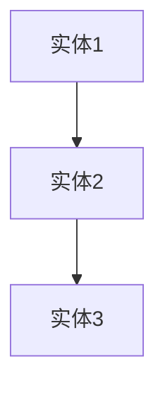
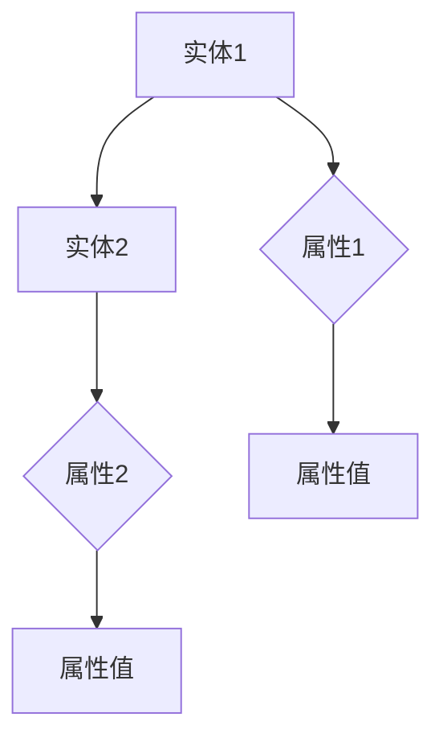
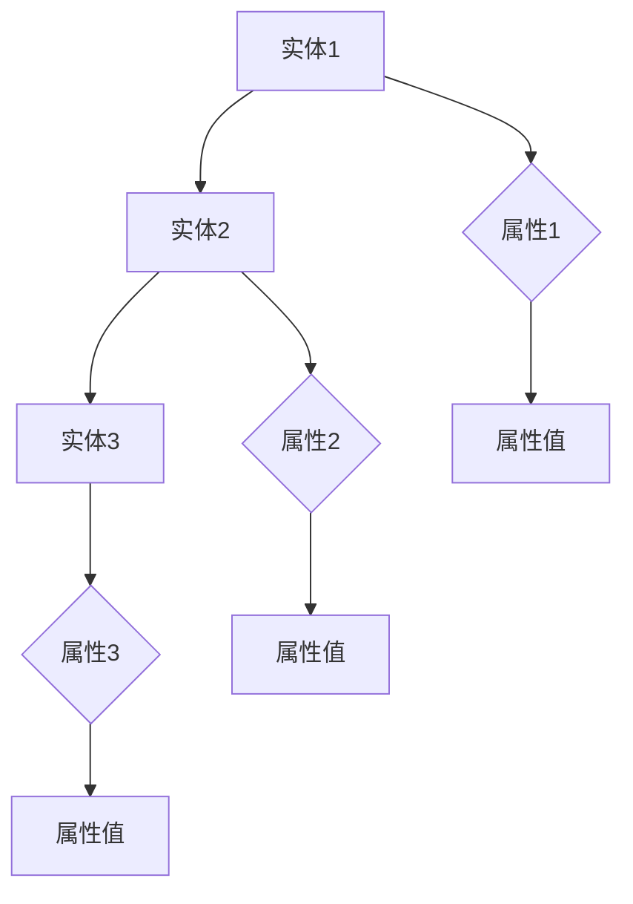

                 

# 推理任务中的知识表示与利用

> 关键词：推理任务，知识表示，知识图谱，多模态推理，图像推理，文本推理

> 摘要：本文从推理任务的基本概念出发，详细探讨了知识表示与利用在推理任务中的重要性。通过分析文本推理、图像推理以及多模态推理中的知识表示与利用方法，本文提供了对当前研究现状的深入理解，并展望了未来的研究方向。

## 目录大纲

1. 推理任务概述
   1.1 推理任务的定义与分类
   1.2 推理任务的重要性和应用领域
   1.3 知识表示的基本原理

2. 知识表示方法
   2.1 知识表示的基本概念
   2.2 常见的知识表示形式
      2.2.1 实体-关系图表示法
      2.2.2 属性图表示法
      2.2.3 知识图谱表示法
   2.3 知识表示的优势与挑战

3. 知识利用方法
   3.1 知识融合与推理
   3.2 知识图谱在推理中的应用
   3.3 知识利用的算法与优化

4. 推理任务中的知识表示与利用
   4.1 文本推理中的知识表示
   4.2 图像推理中的知识表示
   4.3 多模态推理中的知识表示与利用

5. 实战案例分析
   5.1 基于知识图谱的智能问答系统
   5.2 知识图谱在图像识别中的应用
   5.3 多模态知识图谱在智能监控中的运用

6. 未来展望与研究方向
   6.1 知识表示与利用的挑战与机遇
   6.2 未来发展趋势
   6.3 可能的研究方向

7. 附录
   7.1 相关工具与技术概述
   7.2 开发环境与资源推荐

## 第一部分：基础知识与核心概念

### 第1章：推理任务概述

#### 1.1 推理任务的定义与分类

推理任务是指计算机系统在给定一组已知事实的基础上，通过逻辑推理得到未知结论的过程。推理任务可以大致分为以下几类：

1. **演绎推理**：从一般到特殊的推理方式，以一组前提推导出结论。例如，所有人都会死亡（大前提），苏格拉底是人（小前提），因此苏格拉底会死亡（结论）。

2. **归纳推理**：从特殊到一般的推理方式，通过观察多个具体实例，归纳出一个普遍规律。例如，观察多次晴天后麦子生长得很好，可以推断晴天有利于麦子生长。

3. **类比推理**：通过比较两个或多个相似的事物，推导出它们之间的相似点。例如，既然地球上存在生命，那么其他星球上可能也存在生命。

4. **混合推理**：结合演绎、归纳和类比推理的一种综合推理方式。

#### 1.2 推理任务的重要性和应用领域

推理任务在人工智能领域具有重要的地位。它不仅是自然语言处理、计算机视觉、知识图谱等多个领域的关键技术，也是实现智能决策、智能推荐、智能监控等应用的基础。

- **自然语言处理**：推理任务在自然语言处理中广泛应用于语义理解、问答系统、机器翻译等领域。例如，在问答系统中，需要根据用户的问题和已有的知识库进行推理，以给出合适的答案。

- **计算机视觉**：在计算机视觉中，推理任务用于图像分类、目标检测、图像分割等任务。例如，在目标检测中，通过推理判断图像中的物体类别和位置。

- **知识图谱**：知识图谱是表示实体及其关系的图形结构，推理任务在知识图谱中用于实体关联、知识推理等。例如，在智能问答系统中，通过推理确定用户问题的答案。

#### 1.3 知识表示的基本原理

知识表示是推理任务中的核心概念之一，它涉及如何将知识以计算机可以理解的形式表示出来。知识表示的基本原理包括以下几个方面：

- **实体表示**：实体是知识表示中的基本元素，可以是事物、概念、事件等。实体可以通过属性、标签、关系等来描述。

- **关系表示**：关系表示实体之间的关联，可以是因果关系、同义关系、上下位关系等。关系可以通过图结构、语义网络等来表示。

- **属性表示**：属性是实体的特征描述，可以是数值、文本、图像等。属性可以通过特征向量、特征图等来表示。

- **知识融合**：知识融合是将多个知识源中的信息整合起来，形成更全面的认知。知识融合可以通过规则匹配、相似性度量、推理算法等来实现。

### 第2章：知识表示方法

#### 2.1 知识表示的基本概念

知识表示是指将人类知识以计算机可以处理的形式表示出来，以便于计算机理解和利用。知识表示的基本概念包括实体、关系、属性和知识库等。

- **实体**：实体是知识表示中的基本元素，可以是事物、概念、事件等。实体具有属性和关系。

- **关系**：关系是实体之间的关联，可以是因果关系、同义关系、上下位关系等。关系具有方向性和强度。

- **属性**：属性是实体的特征描述，可以是数值、文本、图像等。属性可以用来区分不同的实体。

- **知识库**：知识库是存储和管理知识的数据库，可以是结构化的表格、文档、图形等。知识库可以为推理任务提供基础数据。

#### 2.2 常见的知识表示形式

常见的知识表示形式包括实体-关系图表示法、属性图表示法、知识图谱表示法等。

##### 2.2.1 实体-关系图表示法

实体-关系图表示法是一种基于图的表示方法，将实体表示为节点，关系表示为边。实体-关系图具有清晰的结构和直观的表示能力，适用于简单的知识表示。

##### 2.2.2 属性图表示法

属性图表示法是一种结合了实体-关系图和属性表示的方法，将实体、关系和属性都表示为节点。属性图表示法适用于复杂的知识表示，可以更好地描述实体之间的关系和属性。

##### 2.2.3 知识图谱表示法

知识图谱表示法是一种基于大规模图结构的表示方法，将实体、关系和属性以大规模图的形式组织起来。知识图谱表示法具有高度的结构化和强大的表达能力，适用于复杂的推理任务。

#### 2.3 知识表示的优势与挑战

知识表示在推理任务中具有以下优势：

- **高效性**：知识表示可以将大量知识以结构化的形式存储和检索，提高推理任务的效率。

- **灵活性**：知识表示可以适应不同的推理任务和应用场景，具有较好的灵活性。

- **可扩展性**：知识表示可以方便地添加新的实体、关系和属性，实现知识的扩展。

然而，知识表示也面临以下挑战：

- **复杂性**：知识表示涉及到多个层面的知识，包括实体、关系、属性等，具有较高的复杂性。

- **准确性**：知识表示需要准确描述实体之间的关系和属性，否则会导致推理结果的不准确。

- **效率**：大规模的知识表示在处理和存储上面临较高的效率问题，需要优化数据结构和算法。

### 第3章：知识利用方法

#### 3.1 知识融合与推理

知识融合是指将多个知识源中的信息整合起来，形成更全面的认知。知识融合可以通过以下方法实现：

- **规则匹配**：通过匹配知识库中的规则，将不同知识源的信息整合起来。

- **相似性度量**：通过计算知识源之间的相似度，选择相似度最高的信息进行融合。

- **推理算法**：通过推理算法，将知识源中的信息进行逻辑推理，形成新的结论。

知识融合在推理任务中具有重要应用，可以提高推理的准确性和效率。

#### 3.2 知识图谱在推理中的应用

知识图谱在推理任务中具有广泛的应用，可以用于实体关联、知识推理等。

- **实体关联**：通过知识图谱中的关系，确定实体之间的关联关系，例如人与人之间的社交关系、物品与物品之间的分类关系等。

- **知识推理**：通过知识图谱中的关系和属性，进行逻辑推理，得出新的结论。例如，在问答系统中，通过知识图谱进行推理，确定问题的答案。

#### 3.3 知识利用的算法与优化

知识利用的算法包括推理算法、知识融合算法等。为了提高知识利用的效率，可以采用以下优化方法：

- **分布式计算**：通过分布式计算，提高知识利用的效率。

- **并行处理**：通过并行处理，加速知识利用的过程。

- **数据压缩**：通过数据压缩，减少知识利用所需的存储空间和计算资源。

## 第二部分：推理任务中的知识表示与利用

### 第4章：文本推理中的知识表示

文本推理是指利用文本数据中的知识进行推理，以得到新的结论。文本推理中的知识表示方法主要包括文本表示方法和文本知识图谱构建。

#### 4.1 文本表示方法

文本表示方法是指将文本数据转化为计算机可以处理的形式。常见的文本表示方法包括词袋模型、词向量、实体识别等。

- **词袋模型**：词袋模型将文本表示为一组单词的集合，不考虑单词的顺序和语法结构。

- **词向量**：词向量是将文本中的每个单词映射为一个高维向量，通过向量的相似度来计算文本的相似性。

- **实体识别**：实体识别是指从文本中识别出实体，包括人名、地名、组织名等。

#### 4.2 文本知识图谱构建

文本知识图谱是指将文本数据中的实体、关系和属性以图的形式组织起来。文本知识图谱的构建主要包括以下步骤：

- **实体识别**：从文本中识别出实体，包括人名、地名、组织名等。

- **关系抽取**：从文本中抽取实体之间的关系，例如人与人之间的社交关系、物品与物品之间的分类关系等。

- **属性抽取**：从文本中抽取实体的属性，例如人的年龄、性别、职业等。

- **图谱构建**：将识别出的实体、关系和属性以图的形式组织起来，形成文本知识图谱。

#### 4.3 基于知识图谱的文本推理算法

基于知识图谱的文本推理算法是指利用文本知识图谱进行推理，以得到新的结论。常见的文本推理算法包括：

- **路径推理**：通过在知识图谱中查找实体之间的路径，得到实体之间的关联关系。

- **规则推理**：通过在知识图谱中匹配规则，得到实体之间的关联关系。

- **基于图谱的语义搜索**：通过在知识图谱中进行语义搜索，得到与查询文本相关的实体和关系。

### 第5章：图像推理中的知识表示

图像推理是指利用图像数据中的知识进行推理，以得到新的结论。图像推理中的知识表示方法主要包括图像表示方法和图像知识图谱构建。

#### 5.1 图像表示方法

图像表示方法是指将图像数据转化为计算机可以处理的形式。常见的图像表示方法包括卷积神经网络（CNN）、生成对抗网络（GAN）等。

- **卷积神经网络（CNN）**：卷积神经网络是一种用于图像分类、目标检测等任务的深度学习模型。

- **生成对抗网络（GAN）**：生成对抗网络是一种用于图像生成、图像修复等任务的深度学习模型。

#### 5.2 图像知识图谱构建

图像知识图谱是指将图像数据中的实体、关系和属性以图的形式组织起来。图像知识图谱的构建主要包括以下步骤：

- **对象识别**：从图像中识别出对象，包括人、车、建筑物等。

- **关系抽取**：从图像中抽取对象之间的关系，例如人与人之间的社交关系、物品与物品之间的分类关系等。

- **属性抽取**：从图像中抽取对象的属性，例如人的年龄、性别、衣服颜色等。

- **图谱构建**：将识别出的对象、关系和属性以图的形式组织起来，形成图像知识图谱。

#### 5.3 基于知识图谱的图像推理算法

基于知识图谱的图像推理算法是指利用图像知识图谱进行推理，以得到新的结论。常见的图像推理算法包括：

- **路径推理**：通过在知识图谱中查找对象之间的路径，得到对象之间的关联关系。

- **规则推理**：通过在知识图谱中匹配规则，得到对象之间的关联关系。

- **基于图谱的图像搜索**：通过在知识图谱中进行图像搜索，得到与查询图像相关的对象和关系。

### 第6章：多模态推理中的知识表示与利用

多模态推理是指利用文本、图像等多种模态的数据进行推理，以得到新的结论。多模态推理中的知识表示与利用方法主要包括多模态数据融合、多模态知识图谱构建和基于多模态知识图谱的推理算法。

#### 6.1 多模态数据融合

多模态数据融合是指将文本、图像等多种模态的数据进行整合，形成一个统一的数据表示。多模态数据融合的方法包括：

- **特征级融合**：将不同模态的特征进行拼接或加权，形成统一的特征表示。

- **句级融合**：将不同模态的句子进行拼接或加权，形成统一的句子表示。

- **图级融合**：将不同模态的图进行拼接或加权，形成统一的图表示。

#### 6.2 多模态知识图谱构建

多模态知识图谱是指将文本、图像等多种模态的数据中的实体、关系和属性以图的形式组织起来。多模态知识图谱的构建主要包括以下步骤：

- **多模态实体识别**：从文本和图像等多种模态的数据中识别出实体。

- **多模态关系抽取**：从文本和图像等多种模态的数据中抽取实体之间的关系。

- **多模态属性抽取**：从文本和图像等多种模态的数据中抽取实体的属性。

- **图谱构建**：将识别出的实体、关系和属性以图的形式组织起来，形成多模态知识图谱。

#### 6.3 基于多模态知识图谱的推理算法

基于多模态知识图谱的推理算法是指利用多模态知识图谱进行推理，以得到新的结论。常见的多模态推理算法包括：

- **路径推理**：通过在多模态知识图谱中查找实体之间的路径，得到实体之间的关联关系。

- **规则推理**：通过在多模态知识图谱中匹配规则，得到实体之间的关联关系。

- **多模态语义搜索**：通过在多模态知识图谱中进行语义搜索，得到与查询文本和图像相关的实体和关系。

## 第三部分：实战案例分析

### 第7章：知识表示与利用在真实场景中的应用

#### 7.1 基于知识图谱的智能问答系统

智能问答系统是知识表示与利用在真实场景中的重要应用之一。基于知识图谱的智能问答系统通过构建知识图谱，将文本数据中的实体、关系和属性组织起来，为用户提供准确的答案。

案例一：一个基于知识图谱的智能问答系统可以应用于企业知识库管理。企业知识库包含大量的文档、报告、邮件等文本数据，通过知识图谱的构建和利用，可以实现对知识库中的信息进行快速检索和推理，为员工提供准确的答案。

步骤：

1. 数据预处理：对文本数据进行清洗、分词、实体识别等预处理操作。

2. 知识图谱构建：将预处理后的文本数据构建成知识图谱，包括实体、关系和属性。

3. 答案推理：根据用户的问题，在知识图谱中进行路径推理和规则推理，得到答案。

4. 答案输出：将得到的答案以自然语言的形式输出给用户。

#### 7.2 知识图谱在图像识别中的应用

知识图谱在图像识别中的应用主要包括图像知识图谱的构建和基于知识图谱的图像识别算法。

案例二：一个基于知识图谱的图像识别系统可以应用于安防监控。该系统通过图像知识图谱的构建，将监控视频中的对象、事件和属性组织起来，实现对监控场景的实时识别和预警。

步骤：

1. 数据预处理：对监控视频进行预处理，包括去噪、缩放、剪辑等操作。

2. 对象识别：利用深度学习模型对监控视频进行对象识别，识别出场景中的对象。

3. 关系抽取：根据对象识别的结果，抽取对象之间的关系，如人与人之间的互动、物品与物品之间的关联等。

4. 属性抽取：根据对象识别和关系抽取的结果，抽取对象的属性，如人的年龄、性别、衣服颜色等。

5. 知识图谱构建：将识别出的对象、关系和属性构建成知识图谱。

6. 图像识别：在知识图谱中进行路径推理和规则推理，实现对图像的识别。

7. 预警输出：将识别结果以预警的形式输出给监控系统。

#### 7.3 多模态知识图谱在智能监控中的运用

多模态知识图谱在智能监控中的应用可以实现对监控场景的全面理解和智能分析。

案例三：一个基于多模态知识图谱的智能监控系统可以应用于智慧城市。该系统通过融合文本、图像等多种模态的数据，实现对城市交通、环境、公共安全等领域的实时监控和智能分析。

步骤：

1. 数据收集：收集城市交通、环境、公共安全等多领域的文本、图像等多模态数据。

2. 数据预处理：对多模态数据进行预处理，包括分词、对象识别、情感分析等操作。

3. 多模态数据融合：将预处理后的多模态数据进行融合，形成统一的多模态数据表示。

4. 多模态知识图谱构建：将融合后的多模态数据构建成多模态知识图谱，包括实体、关系和属性。

5. 多模态推理：在多模态知识图谱中进行路径推理、规则推理和语义搜索，实现对监控场景的全面理解和智能分析。

6. 决策输出：根据多模态推理的结果，生成相应的决策和指令，如交通信号调节、环境治理等。

## 第四部分：未来展望与研究方向

### 第8章：知识表示与利用的挑战与机遇

知识表示与利用在推理任务中具有巨大的潜力，但也面临着诸多挑战。

#### 8.1 挑战

1. **数据质量**：知识表示与利用依赖于高质量的数据。然而，在实际应用中，数据质量往往受到噪声、错误和不完整的影响。

2. **知识融合**：多模态知识融合是一个复杂的过程，需要解决不同模态数据之间的不一致性和互补性问题。

3. **推理效率**：大规模知识图谱的推理效率是一个关键挑战，需要优化算法和数据结构。

4. **解释性**：知识表示与利用的结果需要具有解释性，以便用户理解和信任。

#### 8.2 机遇

1. **多模态数据**：随着传感器技术的发展，多模态数据越来越丰富，为知识表示与利用提供了更多的数据来源。

2. **深度学习**：深度学习模型的进步为知识表示与利用提供了新的算法和技术。

3. **云计算与分布式计算**：云计算和分布式计算技术为处理大规模知识图谱提供了强大的计算能力。

4. **跨领域应用**：知识表示与利用在医疗、金融、教育等跨领域应用中具有巨大的潜力。

### 第9章：未来发展趋势

1. **自动化知识表示**：通过自动化方法生成知识表示，减少人工干预。

2. **知识图谱压缩**：研究知识图谱的压缩方法，提高推理效率。

3. **知识图谱嵌入**：将知识图谱嵌入到深度学习模型中，实现知识驱动的深度学习。

4. **跨模态交互**：研究跨模态数据的交互机制，实现多模态知识的协同推理。

### 第10章：可能的研究方向

1. **多模态知识图谱构建**：研究多模态知识图谱的构建方法，提高知识融合的准确性。

2. **知识图谱推理算法**：研究高效的推理算法，提高知识利用的效率。

3. **知识图谱解释性**：研究知识图谱的解释性方法，提高用户对知识表示与利用结果的信任度。

4. **知识图谱在跨领域应用**：探索知识图谱在医疗、金融、教育等跨领域应用中的价值。

### 附录

#### 附录A：相关工具与技术概述

1. **知识图谱构建工具**：介绍常见的知识图谱构建工具，如Neo4j、Apache Jena等。

2. **推理引擎与算法库**：介绍常见的推理引擎和算法库，如RDF-3X、OWLIM等。

3. **开发环境与资源推荐**：推荐用于知识表示与利用的开发生态系统，如Python、Java等。

## 结束语

推理任务中的知识表示与利用是人工智能领域的关键技术之一。通过对文本、图像等多模态数据的表示与利用，可以实现对知识的全面理解和智能应用。未来，随着多模态数据的丰富和深度学习技术的进步，知识表示与利用将在更多领域发挥重要作用。

作者：AI天才研究院/AI Genius Institute & 禅与计算机程序设计艺术 /Zen And The Art of Computer Programming

