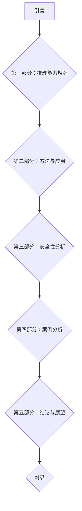

                 

### 《推理能力增强对模型安全性的影响》

> 关键词：推理能力、模型安全性、神经网络、强化学习、聚类方法、安全评估

> 摘要：本文旨在探讨推理能力增强对模型安全性的影响。首先，我们介绍了推理能力的背景和重要性，然后详细分析了推理能力增强的基本原理和方法，以及这些方法在模型安全性方面的应用。随后，我们探讨了推理能力增强与模型安全性的关系，并提出了相应的安全性评估和分析方法。最后，通过实际案例分析，总结了推理能力增强在提升模型安全性方面的最佳实践和未来展望。

---

## 目录大纲

### 第一部分：引言

1. **推理能力增强的背景与重要性**
2. **推理能力增强的基本原理**
   - **2.1 推理能力的定义与类型**
   - **2.2 推理能力增强的动机**
   - **2.3 推理能力增强的技术方法**

### 第二部分：推理能力增强的方法与应用

1. **神经网络增强方法**
   - **3.1 神经网络的基本结构**
   - **3.2 神经网络优化算法**
   - **3.3 神经网络在推理能力增强中的应用**

2. **强化学习方法**
   - **3.4 强化学习的基本概念**
   - **3.5 强化学习在推理能力增强中的应用**

3. **聚类方法**
   - **3.6 聚类算法的基本概念**
   - **3.7 聚类方法在推理能力增强中的应用**

### 第三部分：推理能力增强与模型安全性的关系

1. **模型安全性的基本概念**
2. **推理能力增强对模型安全性的影响**
3. **常见的模型安全性问题与应对策略**

### 第四部分：推理能力增强的安全性分析

1. **安全性评估方法**
   - **5.1 测试数据集的选择**
   - **5.2 安全性评价指标**

2. **安全性分析方法**
   - **5.3 静态分析**
   - **5.4 动态分析**

3. **安全性增强方法**
   - **5.5 神经网络安全性增强方法**
   - **5.6 强化学习安全性增强方法**
   - **5.7 聚类方法安全性增强方法**

### 第五部分：案例分析

1. **案例一：图像识别任务中的推理能力增强与安全性**
2. **案例二：自然语言处理任务中的推理能力增强与安全性**
3. **案例三：自动驾驶任务中的推理能力增强与安全性**

### 第六部分：结论与未来展望

1. **总结与展望**
2. **存在的问题与挑战**
3. **未来发展趋势与方向**

### 附录

1. **附录A：常用推理能力增强方法及安全性评估工具**
2. **附录B：相关数学公式与Python代码实现**
3. **附录C：参考文献**

### Mermaid 流程图

---

以上是《推理能力增强对模型安全性的影响》的详细目录大纲设计，结构清晰，内容全面。接下来，我们将逐步深入探讨每个部分的内容。

