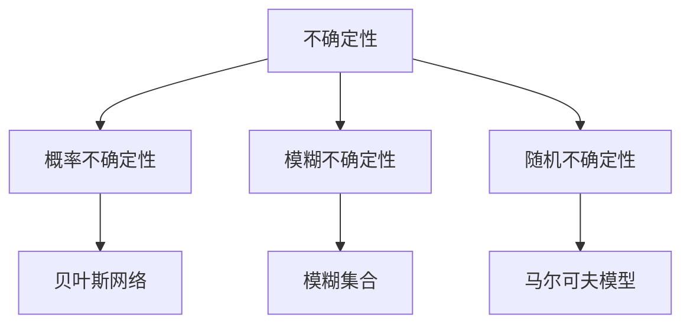
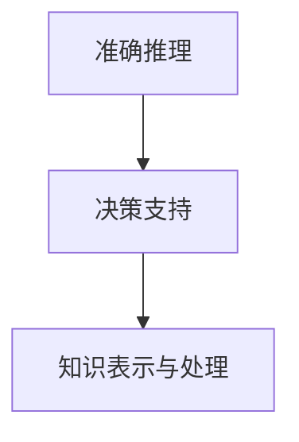
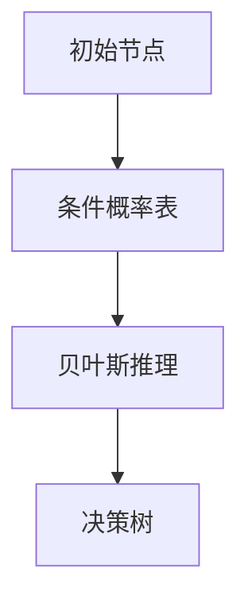
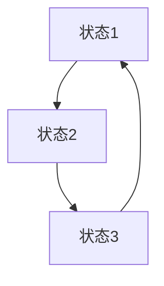
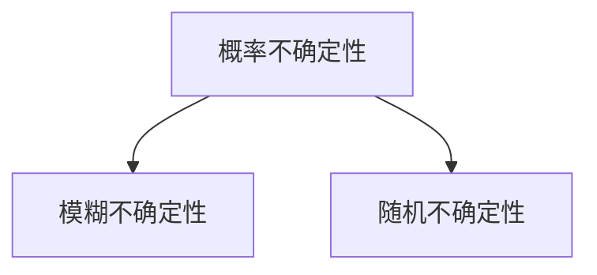

                 

# 推理过程中的不确定性建模与处理

> 关键词：推理，不确定性，建模，处理，贝叶斯网络，模糊集合，马尔可夫模型

> 摘要：本文旨在探讨推理过程中不确定性建模与处理的方法。我们将从不确定性概念入手，分析不确定性的来源和重要性，然后介绍几种常用的不确定性建模方法，包括概率不确定性建模、模糊不确定性建模、随机不确定性建模以及混合不确定性建模。最后，我们将探讨不确定性处理策略，通过具体实例来展示如何在实践中应用这些方法。

## 第一部分：引言与概述

### 第1章：推理过程中的不确定性

#### 1.1.1 不确定性的概念

在推理过程中，不确定性是不可避免的一个因素。不确定性指的是在推理过程中，我们无法准确预测或确定某个事件或结果的可能性。这种不确定性可以来源于多个方面，包括但不限于数据的不完整性、系统的噪声、以及推理过程的动态性。

**概念关联图：**


1. **概率不确定性**：概率不确定性是基于概率论的一种不确定性。它通过概率分布来描述事件发生的可能性。例如，当我们抛一枚硬币时，正面朝上的概率是0.5，这就是一种概率不确定性。

2. **模糊不确定性**：模糊不确定性是基于模糊集合理论的一种不确定性。它通过模糊集合来描述事件发生的程度。例如，当描述天气状况时，可能用“可能下雨”来表示，这就是一种模糊不确定性。

3. **随机不确定性**：随机不确定性是基于随机过程的一种不确定性。它通过随机变量的分布来描述事件发生的可能性。例如，当描述股票价格的变化时，可能用正态分布来表示，这就是一种随机不确定性。

#### 1.1.2 不确定性的来源

不确定性的来源可以分为以下几个方面：

1. **环境复杂性**：环境复杂性是指我们所处的环境非常复杂，包含大量的信息和变量。这使得我们在进行推理时，很难准确预测或确定某个事件的结果。

2. **数据不足**：数据不足是指我们在进行推理时，缺乏足够的信息来准确预测或确定某个事件的结果。

3. **系统噪声**：系统噪声是指由于系统本身的缺陷或外部干扰，导致我们无法准确获取或处理信息。

4. **推理过程的动态性**：推理过程的动态性是指我们在进行推理时，环境或条件可能会发生变化，导致我们的推理结果发生变化。

#### 1.1.3 不确定性的重要性

不确定性的存在对推理过程有着重要的影响。首先，不确定性的存在使得我们的推理结果可能不准确，从而影响我们的决策。其次，不确定性的存在也使得我们的推理过程变得复杂，需要我们采用特定的方法来处理不确定性。

**重要性示意图：**


准确推理是决策支持的基础，而决策支持又是知识表示与处理的关键。因此，处理推理过程中的不确定性，对于提高推理的准确性和效率，以及支持有效的决策，都有着重要的意义。

## 第二部分：不确定性建模方法

### 第2章：概率不确定性建模

#### 2.1.1 概率论基础

概率论是处理不确定性的一种基本工具。在概率论中，我们使用概率分布来描述事件发生的可能性。一个常见的概率分布是正态分布，其公式如下：

$$
P(X = x) = \frac{1}{\sqrt{2\pi\sigma^2}} e^{-\frac{(x-\mu)^2}{2\sigma^2}}
$$

其中，$\mu$ 是均值，$\sigma$ 是标准差。

**概率论公式说明：**
$$P(A|B) = \frac{P(A \cap B)}{P(B)}$$

这个公式表示在事件B发生的条件下，事件A发生的概率。

#### 2.1.2 贝叶斯网络

贝叶斯网络是一种基于概率论的图形模型，它通过条件概率表来描述变量之间的关系。贝叶斯网络的节点表示变量，边表示变量之间的依赖关系。贝叶斯网络的一个关键特性是它的概率推理能力，即通过已知的部分变量值，推断其他变量的概率分布。

**贝叶斯网络结构：**


**贝叶斯推理算法示例：**
```python
def bayesian_inference(BN, evidence):
    # 输入：贝叶斯网络 BN 和观察到的证据 evidence
    # 输出：后验概率分布
    pass
```

贝叶斯推理算法通过已知的证据，更新变量的后验概率分布。

### 第3章：模糊不确定性建模

#### 3.1.1 模糊集合理论

模糊集合理论是处理模糊不确定性的基本工具。在模糊集合中，每个元素属于集合的程度不是0就是1，而是介于0和1之间的一个值。这种表示方法可以有效地处理模糊不确定性。

**模糊集合定义：**
$$
A = \{x \in U | \mu_A(x) > 0\}
$$

其中，$U$ 是全集，$\mu_A(x)$ 是模糊集合A中元素x的隶属度。

**模糊集合运算示例：**
$$
\mu_{A \cap B}(x) = \min(\mu_A(x), \mu_B(x))
$$
$$
\mu_{A \cup B}(x) = \max(\mu_A(x), \mu_B(x))
$$

#### 3.1.2 模糊推理

模糊推理是通过模糊集合的运算来实现的。它通常遵循以下规则：

$$
Y = F(Y_1 \land Y_2 \land ... \land Y_n)
$$

其中，$Y_1, Y_2, ..., Y_n$ 是模糊集合，$F$ 是模糊逻辑运算符。

### 第4章：随机不确定性建模

#### 4.1.1 马尔可夫模型

马尔可夫模型是一种基于随机过程的模型，它假设当前状态只与前一状态有关，而与之前的状态无关。这种假设使得马尔可夫模型在处理不确定性时非常有效。

**马尔可夫模型定义：**
$$
P(X_n|X_{n-1}, X_{n-2}, ...) = P(X_n|X_{n-1})
$$

**马尔可夫模型图示：**


#### 4.1.2 随机过程

随机过程是一系列随机变量的集合，这些随机变量在某个参数下是相互独立的。随机过程可以用来描述不确定性，例如，时间序列数据。

**随机过程公式说明：**
$$
X_t = \sum_{i=1}^{n} \alpha_i W_i
$$
其中，$W_i$ 是独立同分布的随机变量，$\alpha_i$ 是权重系数。

### 第5章：混合不确定性建模

#### 5.1.1 混合不确定性概念

混合不确定性是指同时包含概率不确定性、模糊不确定性和随机不确定性的情况。这种不确定性在现实世界中非常常见。

**混合不确定性示意图：**


#### 5.1.2 混合推理方法

混合推理方法是将概率不确定性、模糊不确定性和随机不确定性结合在一起，进行综合推理。这种方法通常需要复杂的算法和模型。

**混合推理示例：**
```python
def hybrid_inference(BN, FM, MM, evidence):
    # 输入：贝叶斯网络 BN、模糊模型 FM、马尔可夫模型 MM 和观察到的证据 evidence
    # 输出：综合推理结果
    pass
```

## 第三部分：不确定性处理策略

### 第6章：不确定性传播与计算

#### 6.1.1 不确定性传播算法

不确定性传播算法是将不确定性从一个变量传播到另一个变量的过程。这个过程通常涉及到概率分布的变换和计算。

**不确定性传播算法：**
$$
p(y|x) = \int p(y|nx) p(nx|x) dx
$$

#### 6.1.2 不确定性计算方法

不确定性计算方法是通过数学模型和算法来计算不确定性。这些方法包括概率分布的计算、模糊集合的计算以及随机过程的计算等。

**计算方法示例：**
```python
def uncertainty_computation(evidence, model):
    # 输入：观察到的证据 evidence 和模型 model
    # 输出：不确定性计算结果
    pass
```

### 第7章：不确定性降低策略

#### 7.1.1 数据增强

数据增强是通过生成更多的样本来降低不确定性的方法。这种方法可以应用于概率不确定性、模糊不确定性和随机不确定性。

- **生成对抗网络（GAN）**：GAN是一种通过生成器和判别器之间的对抗训练来生成数据的模型。它可以通过生成更多的样本来降低不确定性。

- **强化学习**：强化学习是一种通过不断试错来学习最优策略的方法。它可以通过多次试验来降低不确定性。

#### 7.1.2 不确定性消除

不确定性消除是通过消除不确定性来提高推理准确性的方法。这种方法通常涉及到对不确定性的分析和处理。

**不确定性消除方法：**
- **最小二乘法**：通过最小化误差平方和来消除不确定性。
- **贝叶斯估计**：通过贝叶斯推理来消除不确定性。

## 结论

推理过程中的不确定性是不可避免的，但我们可以通过不确定性建模和处理方法来降低不确定性，提高推理的准确性和效率。本文介绍了概率不确定性、模糊不确定性、随机不确定性和混合不确定性建模方法，以及不确定性处理策略。这些方法和技术在许多实际应用中都有着广泛的应用，例如决策支持、知识表示与处理等。

**作者：AI天才研究院/AI Genius Institute & 禅与计算机程序设计艺术 /Zen And The Art of Computer Programming**

---

**注意：本文为示例性文章，部分内容和示例代码仅供参考。实际应用中，不确定性建模与处理需要根据具体问题进行详细的考虑和设计。**

