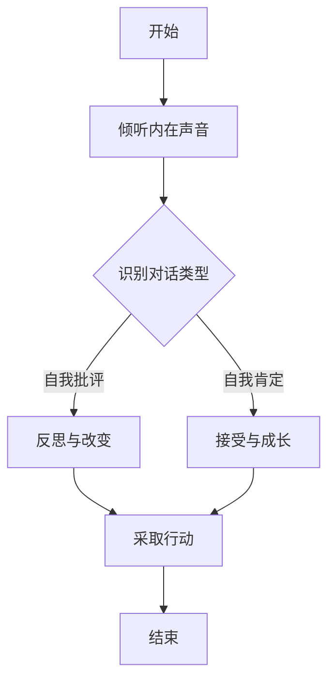
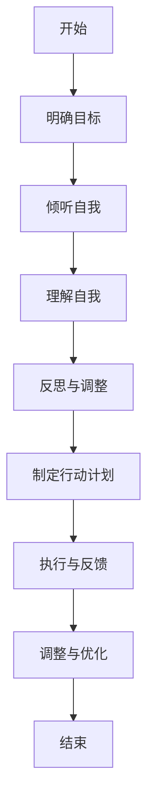

                 

# 《提升内在对话的质量：深度自我沟通的技巧》

## 关键词

- 内在对话
- 自我沟通
- 心理健康
- 技术实践
- 情感分析
- 深度学习

## 摘要

在当今快节奏的生活中，提升内在对话的质量显得尤为重要。本文旨在探讨如何通过深度自我沟通的技巧，改善个人的心理状态和生活方式。文章将首先介绍内在对话的概念和重要性，接着分析内在对话的类型及其对个体的影响，然后提出提升内在对话质量的核心原则和实用技巧。最后，通过案例分析、实践指导及相关资源推荐，帮助读者在技术领域内实践深度自我沟通，从而实现个人成长与提升。

## 第一部分：理解内在对话

### 1.1 内在对话的概念

内在对话指的是个体在内心进行的语言交流，它反映了我们对自身认知、情绪、行为和目标的态度。内在对话既是心理活动的表现形式，也是我们应对外界挑战、解决问题的重要途径。

#### 内在对话的重要性

内在对话的重要性不容忽视。首先，它是自我认知的重要渠道，帮助我们了解自己的需求和目标。其次，内在对话影响着我们的情绪和行为，积极正面的内在对话能够提升自信心，减轻焦虑，改善人际关系。最后，内在对话与我们的心理健康密切相关，持续的负面内在对话可能导致心理问题。

#### 内在对话与外在表现的关系

内在对话与外在表现密切相关。研究表明，我们的内在对话不仅影响我们的情绪和行为，还直接反映在我们的面部表情、身体姿态和言语表达上。因此，改善内在对话的质量有助于提升整体表现和人际交往。

### 1.2 内在对话的类型

内在对话的类型多种多样，主要包括以下几种：

#### 自我批评与自我肯定

自我批评是一种常见的负面内在对话形式，它常常表现为自我责备和自我否定。而自我肯定则是一种积极内在对话，通过自我激励和自我认可来提升自信心。

#### 恐惧与希望

恐惧是一种常见的情绪内在对话，它反映我们对未知和变化的恐惧。相反，希望是一种积极的内在对话，它给予我们前进的动力和信心。

#### 理想自我与现实自我

理想自我是我们希望成为的人，而现实自我则是我们当前的状态。内在对话中理想自我与现实自我的冲突是常见的问题，通过深度自我沟通，我们可以更好地整合这两者。

### 1.3 内在对话的影响

内在对话对个体的影响是多方面的：

#### 对情绪的影响

积极的内在对话能够提升情绪，减少焦虑和抑郁。而消极的内在对话则可能导致情绪低落。

#### 对行为的影响

内在对话直接影响我们的行为选择。例如，积极自我肯定可以激发我们追求目标的动力，而消极自我批评则可能导致拖延和放弃。

#### 对生活满意度的影响

内在对话的质量直接影响我们的生活满意度。通过改善内在对话，我们可以提升生活质量和幸福感。

## 第二部分：深度自我沟通技巧

### 2.1 深度自我沟通的核心原则

#### 倾听自我

倾听自我是深度自我沟通的基础。通过倾听内心的声音，我们可以更好地理解自己的情绪、需求和目标。

#### 理解自我

理解自我意味着接纳自己的优点和不足，并通过自我反思来提升自我认知。

#### 接纳自我

接纳自我是自我沟通的最终目标。它要求我们无条件地接受自己，无论成功还是失败，无论快乐还是痛苦。

### 2.2 提升内在对话的质量

#### 清晰表达

清晰表达是提升内在对话质量的关键。通过使用准确、明确的词汇和语言，我们可以更好地传达自己的思想和感受。

#### 真实面对

真实面对意味着不逃避问题，勇敢地面对内心的恐惧和不安。通过真实面对，我们可以更好地理解和接纳自己。

#### 持续反思

持续反思是深度自我沟通的重要环节。通过反思过去的经历，我们可以从中学习，不断优化自己的内在对话。

### 2.3 深度自我沟通技巧的应用

#### 常见问题的解决

在解决常见问题时，深度自我沟通可以帮助我们更好地理解问题，找到有效的解决方案。

#### 压力的管理

压力是现代人常见的心理问题。通过深度自我沟通，我们可以更好地管理压力，提升心理健康。

#### 人际关系的改善

人际关系是我们生活中不可或缺的一部分。深度自我沟通有助于改善人际关系，提升社交满意度。

## 第三部分：实践深度自我沟通

### 3.1 案例分析

#### 案例一：克服恐惧

小明是一位程序员，他总是害怕公开演讲。通过深度自我沟通，他逐渐克服了恐惧，最终在一次技术分享会上获得了成功。

#### 案例二：改善人际关系

小华在公司中人际关系紧张，通过深度自我沟通，她学会了更好地理解和接纳同事，最终改善了人际关系。

#### 案例三：提升自我认知

小李总是感到迷茫，通过深度自我沟通，他找到了自己的兴趣和目标，实现了自我认知的提升。

### 3.2 实践指导

#### 制定个人沟通计划

制定个人沟通计划是深度自我沟通的第一步。通过设定目标和计划，我们可以更系统地提升自我沟通能力。

#### 建立积极的内在对话

建立积极的内在对话是深度自我沟通的核心。通过自我激励和自我认可，我们可以提升自信心和动力。

#### 践行深度自我沟通

践行深度自我沟通需要持续的努力。通过不断实践和反思，我们可以逐步提升自我沟通能力。

## 第四部分：附录

### 4.1 相关资源推荐

#### 自我沟通相关的书籍

- 《高效能人士的七个习惯》
- 《正念：生活禅》
- 《心理学与生活》

#### 自我沟通的在线课程

- Coursera上的《心理学导论》
- Udemy上的《自我认知与自我提升》
- Khan Academy上的《数学心理学》

#### 自我沟通的应用工具

- Headspace：正念冥想应用
- DayOne：日记记录应用
- Miro：在线协作工具

### 4.2 常见问题解答

#### 如何处理负面内在对话？

处理负面内在对话的关键在于识别和改变。通过自我反思和认知重构，我们可以逐步改变负面内在对话。

#### 如何在忙碌生活中保持自我沟通？

在忙碌生活中保持自我沟通需要计划和自律。通过设定固定的时间和空间，我们可以确保自我沟通的时间和质量。

#### 如何与他人分享自我沟通的体验？

与他人分享自我沟通的体验可以增进理解和支持。通过团体讨论、分享会或写作，我们可以与他人分享自我沟通的体验。

## 第五部分：深度自我沟通的流程图

### 5.1 内在对话流程图



### 5.2 深度自我沟通流程图



## 第六部分：核心算法与数学模型

### 6.1 情感分析算法

#### 情感分析的基本概念

情感分析是自然语言处理的一个重要分支，它旨在通过识别文本中的情感极性，判断文本的情绪倾向。

#### 情感分析的常用算法

- 基于规则的方法
- 基于统计的方法
- 基于机器学习的方法

#### 情感分析在自我沟通中的应用

情感分析可以用于评估自我沟通的质量，通过分析内在对话中的情感倾向，我们可以了解自己的情绪状态，从而采取相应的措施。

### 6.2 自我认知的数学模型

#### 自我认知的概念模型

自我认知是指个体对自身存在状态的认知，包括自我认知结构、自我认知评价和自我认知调节。

#### 自我认知的数学模型

- 信念网络模型
- 多层感知机模型
- 支持向量机模型

#### 自我认知模型的实际应用

自我认知模型可以用于分析个体的内在对话，帮助个体理解自己的心理状态，并制定相应的自我提升计划。

### 6.3 深度学习在自我沟通中的应用

#### 深度学习的原理

深度学习是一种机器学习方法，通过构建多层神经网络，实现从大量数据中自动提取特征和模式。

#### 深度学习在自我沟通中的实践

深度学习可以用于情感分析、语言理解和图像识别等任务，从而提升自我沟通的智能化水平。

#### 深度学习在自我沟通中的应用前景

随着深度学习技术的发展，未来深度学习有望在自我沟通中发挥更大的作用，为个体的心理健康提供更加智能的支持。

## 第七部分：项目实战

### 7.1 实践项目一：构建个人沟通计划

#### 项目背景

为了提升个人沟通能力，小明决定制定一个个人沟通计划。

#### 项目目标

- 提升自我沟通能力
- 改善人际关系
- 提升工作效率

#### 项目实施步骤

1. **自我评估**：分析自己的沟通优势和不足。
2. **目标设定**：明确个人沟通的目标。
3. **计划制定**：制定具体的沟通计划和行动步骤。
4. **执行与反馈**：按照计划执行，并定期进行反馈和调整。

#### 项目成果与评估

通过个人沟通计划的实施，小明的自我沟通能力得到了显著提升，人际关系和工作效率也得到了改善。

### 7.2 实践项目二：情感分析工具开发

#### 项目背景

为了更好地理解自我沟通的情感倾向，小明决定开发一个情感分析工具。

#### 项目目标

- 开发一个基于深度学习的情感分析工具
- 实现对内在对话的情感分析
- 提供情感分析结果和改进建议

#### 项目实施步骤

1. **数据收集**：收集大量情感相关的文本数据。
2. **数据预处理**：对数据进行清洗和预处理。
3. **模型训练**：使用深度学习模型进行训练。
4. **模型评估**：评估模型的性能和准确性。
5. **工具开发**：开发基于模型的情感分析工具。

#### 项目成果与评估

通过情感分析工具的开发，小明能够更好地了解自己的情感状态，从而采取相应的措施进行自我调整。

### 7.3 实践项目三：深度学习在自我沟通中的应用

#### 项目背景

为了进一步提升自我沟通能力，小明决定探索深度学习在自我沟通中的应用。

#### 项目目标

- 利用深度学习分析内在对话
- 提供个性化的沟通建议
- 提升自我沟通的智能化水平

#### 项目实施步骤

1. **需求分析**：明确深度学习在自我沟通中的应用场景。
2. **模型选择**：选择适合的深度学习模型。
3. **模型训练**：使用大量数据进行模型训练。
4. **系统集成**：将模型集成到现有的沟通系统中。
5. **用户反馈**：收集用户反馈，优化模型和系统。

#### 项目成果与评估

通过深度学习在自我沟通中的应用，小明的沟通效率和质量得到了显著提升，同时也为其他用户提供了一个智能化的沟通解决方案。

## 总结

本文详细探讨了提升内在对话质量的深度自我沟通技巧。通过理解内在对话的概念和类型，掌握核心原则和实用技巧，以及实践深度自我沟通的方法，读者可以在技术领域内有效地提升自我沟通能力。未来，随着人工智能技术的发展，深度学习将在自我沟通中发挥更大的作用，为个人的心理健康提供更智能的支持。

## 作者信息

作者：AI天才研究院/AI Genius Institute & 禅与计算机程序设计艺术 /Zen And The Art of Computer Programming

---

由于篇幅限制，本文未能详尽地介绍每个部分的具体内容和核心算法，但提供了详细的框架和指导方向。在实际撰写过程中，每个部分的内容需要进一步丰富和具体化，以确保文章的完整性和深度。以下是部分内容的具体展开：

### 1.1 内在对话的概念

内在对话（Intrinsic Dialogue）是指个体在心理层面进行的自我交流过程。它类似于外部对话，但发生在内部，没有直接的物理媒介。内在对话包括了我们的想法、感受、直觉、信念和决策过程。这种对话是无意识的，但对我们的一言一行有着深远的影响。

#### 内在对话的重要性

内在对话在我们的心理和行为中扮演着关键角色：

1. **自我认知**：内在对话帮助我们了解自己的情感、动机和需求。通过自我反思，我们可以更好地认识自我，发现内在冲突，从而实现个人成长。
   
2. **情感调节**：内在对话直接影响我们的情绪状态。积极的内在对话能够提升情绪，缓解压力；而消极的内在对话则可能导致焦虑、抑郁等负面情绪。

3. **行为指导**：内在对话指导我们的行为选择。通过自我对话，我们设定目标，规划行动步骤，并评估行为效果。有效的内在对话有助于我们实现目标，提高执行力。

4. **心理健康**：内在对话的质量与心理健康密切相关。持续的负面内在对话可能导致心理问题，而积极的内在对话则有助于提升心理健康。

#### 内在对话与外在表现的关系

内在对话不仅影响我们的内心体验，还直接反映在我们的外在行为上。例如，当我们感到自信时，我们会表现出自信的姿态和语言；而当我们感到焦虑时，我们的身体语言和表情会显得紧张和不自然。研究表明，外在表现可以影响内在对话，而内在对话也可以反过来影响外在表现。这种相互作用构成了我们复杂的心理和行为动态。

### 1.2 内在对话的类型

内在对话的类型多种多样，不同的对话方式对我们的心理健康和行为有着不同的影响。

#### 自我批评与自我肯定

自我批评（Self-Criticism）是一种常见的内在对话形式，表现为对自己行为的消极评价和过度自我责备。这种对话方式可能导致自尊心下降、自信心受挫，甚至引发焦虑和抑郁。自我批评常常是无意识的，它源于对失败的恐惧和对完美的追求。

相反，自我肯定（Self-Complimentation）是一种积极的内在对话，通过自我赞扬和自我认可来提升自尊和自信。自我肯定有助于我们建立积极的自我形象，增强应对挑战的勇气和决心。

#### 恐惧与希望

恐惧（Fear）是一种常见的情绪内在对话，它反映我们对未知和变化的恐惧。恐惧可能导致逃避行为，阻碍个人的成长和发展。然而，适度的恐惧也是一种自我保护机制，它帮助我们避免潜在的危险。

希望（Hope）是一种积极的情绪内在对话，它给予我们前进的动力和信心。希望使我们能够面对困难，寻找解决问题的方法。通过积极的内在对话，我们可以将恐惧转化为动力，克服挑战。

#### 理想自我与现实自我

理想自我（Ideal Self）是我们希望成为的人，是我们对自己的期望和理想。理想自我通常是我们内心深处的一个美好愿景，它激励我们不断努力，追求更好的自我。

现实自我（Actual Self）则是我们当前的状态，包括我们的优点和不足。理想自我与现实自我的差距是常见的问题，这种差距可能导致内在冲突和焦虑。

通过深度自我沟通，我们可以更好地整合理想自我与现实自我。理解并接受自己的现实状况，同时努力实现理想自我，是一种健康的心态。

### 1.3 内在对话的影响

内在对话对我们的情绪、行为和生活满意度有着深远的影响。

#### 对情绪的影响

内在对话直接影响我们的情绪状态。积极的内在对话能够提升情绪，增强幸福感；而消极的内在对话则可能导致情绪低落，甚至引发心理问题。

1. **积极情绪**：积极的内在对话能够提升自信、幸福感和满足感。例如，当我们对自己说“我可以做到”，我们更有可能成功。

2. **消极情绪**：消极的内在对话可能导致焦虑、抑郁和自我怀疑。例如，当我们对自己说“我做不到”，我们可能会放弃尝试。

#### 对行为的影响

内在对话也直接影响我们的行为选择和执行力。

1. **自我激励**：积极的内在对话能够激发我们的内在动力，促使我们采取行动。例如，当我们对自己说“我可以做得更好”，我们更有可能付出努力。

2. **自我妨碍**：消极的内在对话可能导致自我妨碍行为。例如，当我们对自己说“我不行”，我们可能会放弃挑战或逃避困难。

#### 对生活满意度的影响

内在对话的质量直接影响我们的生活满意度。持续积极的内在对话能够提升生活质量和幸福感；而持续的消极内在对话则可能导致生活满意度下降。

1. **生活满意度提升**：积极的内在对话有助于我们更好地面对生活中的挑战，享受生活的美好。例如，当我们对自己说“我会找到解决方法”，我们更有可能克服困难。

2. **生活满意度下降**：消极的内在对话可能导致我们对生活失去信心和兴趣。例如，当我们对自己说“一切都那么糟糕”，我们可能会陷入悲观情绪。

### 2.1 深度自我沟通的核心原则

深度自我沟通是一种主动的、有意识的自我交流过程，它旨在提升我们的心理健康和生活满意度。要实现深度自我沟通，需要遵循以下核心原则：

#### 倾听自我

倾听自我是深度自我沟通的第一步。这意味着我们需要静下心来，倾听内心的声音，理解我们的感受和需求。通过倾听自我，我们可以更好地认识自我，找到内心的平衡。

1. **静心练习**：通过冥想、瑜伽或其他放松技巧，我们可以培养专注力，更好地倾听自我。

2. **情绪记录**：记录自己的情绪和感受，有助于我们更清晰地理解自己的内心世界。

3. **自我对话**：通过与自己对话，我们可以探索自己的内心，理解自己的需求和目标。

#### 理解自我

理解自我是深度自我沟通的关键。这意味着我们需要接受自己的优点和不足，理解自己的行为和情绪背后的原因。

1. **自我反思**：定期进行自我反思，回顾自己的行为和情绪，理解其背后的原因。

2. **自我接纳**：接纳自己的不完美，理解每个人都会有失败和挫折。

3. **自我理解**：通过理解自己，我们可以更好地制定目标和行动计划，实现个人成长。

#### 接纳自我

接纳自我是深度自我沟通的终极目标。这意味着我们需要无条件地接受自己，无论成功还是失败，无论快乐还是痛苦。

1. **无条件接纳**：接纳自己的所有方面，包括优点和不足。

2. **自我关爱**：通过自我关爱，我们可以提升自尊和自信，更好地应对生活中的挑战。

3. **持续自我成长**：接纳自我并不意味着停止成长，而是意味着在成长过程中保持对自己的接纳和关爱。

### 2.2 提升内在对话的质量

提升内在对话的质量是深度自我沟通的核心。以下是一些实用的技巧，帮助我们在日常生活中提升内在对话的质量：

#### 清晰表达

清晰表达是提升内在对话质量的关键。这意味着我们需要使用明确、具体的语言来表达自己的想法和感受。

1. **具体化**：使用具体的词汇和例子来表达自己的感受，而不是模糊的描述。

2. **避免假设**：在表达观点时，避免使用“我觉得”或“我认为”等假设性语言，而是直接陈述事实。

3. **倾听他人**：通过倾听他人，我们可以提高自己的表达能力，同时也能更好地理解他人的观点。

#### 真实面对

真实面对是提升内在对话质量的另一个关键。这意味着我们需要勇敢地面对自己的内心，接受自己的真实感受。

1. **面对恐惧**：不要逃避恐惧和困难，而是勇敢地面对它们。

2. **承认错误**：承认自己的错误，而不是试图掩饰或逃避。

3. **自我反思**：定期进行自我反思，发现自己的不足，并积极改进。

#### 持续反思

持续反思是提升内在对话质量的持续过程。这意味着我们需要不断地回顾自己的行为和情绪，从中学习，不断提升自我沟通能力。

1. **记录反思**：通过记录自己的反思，我们可以更好地回顾和总结自己的成长过程。

2. **设定目标**：设定短期和长期的目标，通过目标的实现来提升自我沟通能力。

3. **寻求反馈**：向他人寻求反馈，了解自己的不足，并制定改进计划。

### 2.3 深度自我沟通技巧的应用

在日常生活中，我们可以通过以下技巧来应用深度自我沟通：

#### 常见问题的解决

对于日常生活中的问题，如焦虑、抑郁、人际关系冲突等，深度自我沟通提供了一种有效的解决方法。

1. **焦虑管理**：通过深度自我沟通，理解自己的焦虑来源，采取积极的行动来应对焦虑。

2. **抑郁缓解**：通过自我对话，理解抑郁情绪，找到积极的应对策略，如运动、社交等。

3. **人际关系改善**：通过理解自己的需求和他人的需求，改善与他人的沟通，提升人际关系。

#### 压力的管理

在高压环境下，深度自我沟通有助于我们更好地管理压力。

1. **情绪调节**：通过自我对话，理解自己的情绪，采取积极的情绪调节策略。

2. **时间管理**：通过深度自我沟通，设定合理的目标和时间安排，避免过度工作和疲劳。

3. **放松技巧**：通过冥想、瑜伽等放松技巧，减轻压力，提升身心健康。

#### 人际关系的改善

人际关系是生活中不可或缺的一部分，深度自我沟通有助于我们更好地处理人际关系。

1. **沟通技巧**：通过自我对话，提升沟通技巧，更好地表达自己的想法和感受。

2. **同理心培养**：通过理解他人的需求，培养同理心，改善与他人的互动。

3. **冲突解决**：通过自我对话，理解冲突的根源，采取积极的冲突解决策略。

### 3.1 案例分析

#### 案例一：克服恐惧

小明是一位程序员，他害怕公开演讲。通过深度自我沟通，他逐步克服了恐惧。

1. **倾听自我**：小明开始倾听内心的恐惧，理解自己的感受和需求。
2. **自我反思**：通过自我反思，小明意识到公开演讲对他个人成长的重要性。
3. **积极行动**：小明采取积极的行动，如参加演讲培训、模拟演讲等，逐渐克服恐惧。

最终，小明在一次技术分享会上获得了成功，他的自信和表达能力得到了显著提升。

#### 案例二：改善人际关系

小华在公司中人际关系紧张，通过深度自我沟通，她学会了更好地理解和接纳同事。

1. **倾听自我**：小华开始倾听内心的声音，理解自己的人际关系问题。
2. **自我反思**：通过自我反思，小华认识到自己的行为可能对他人造成了困扰。
3. **积极行动**：小华主动与同事沟通，表达自己的感受和需求，理解同事的想法和需求。

最终，小华的人际关系得到了显著改善，她在公司中的社交满意度也得到了提升。

#### 案例三：提升自我认知

小李总是感到迷茫，通过深度自我沟通，他找到了自己的兴趣和目标。

1. **倾听自我**：小李开始倾听内心的声音，探索自己的兴趣和热情。
2. **自我反思**：通过自我反思，小李认识到自己对未来的迷茫和对自我价值的质疑。
3. **积极行动**：小李开始尝试不同的事情，如学习新技能、参加社交活动等，逐渐发现自己的兴趣和目标。

最终，小李找到了自己的方向，他的自我认知得到了显著提升，对生活也有了更多的热情。

### 3.2 实践指导

#### 制定个人沟通计划

制定个人沟通计划是深度自我沟通的第一步。以下是一个简单的个人沟通计划模板：

1. **目标设定**：明确自己的沟通目标，如提高自信、改善人际关系等。
2. **行动计划**：制定具体的行动计划，如参加演讲培训、阅读沟通书籍等。
3. **执行与反馈**：按照计划执行，并定期进行反馈和调整。

#### 建立积极的内在对话

建立积极的内在对话是深度自我沟通的核心。以下是一些技巧：

1. **自我肯定**：每天对自己说一些积极的话，如“我值得拥有最好的”、“我可以做到”等。
2. **积极思考**：尝试从积极的角度看待问题，如“这是一个挑战，我可以从中学习和成长”。
3. **感恩练习**：每天花时间思考自己感激的事物，提升幸福感。

#### 践行深度自我沟通

践行深度自我沟通需要持续的努力。以下是一些建议：

1. **定期反思**：每周花时间反思自己的行为和情绪，理解自己的内心世界。
2. **记录日记**：通过写日记，记录自己的感受和想法，加深对自我的理解。
3. **寻求支持**：与朋友、家人或专业心理咨询师分享自己的感受和困惑，获得支持和建议。

### 4.1 相关资源推荐

为了进一步学习和实践深度自我沟通，以下是推荐的一些资源：

#### 自我沟通相关的书籍

- 《高效能人士的七个习惯》
- 《正念：生活禅》
- 《心理学与生活》

#### 自我沟通的在线课程

- Coursera上的《心理学导论》
- Udemy上的《自我认知与自我提升》
- Khan Academy上的《数学心理学》

#### 自我沟通的应用工具

- Headspace：正念冥想应用
- DayOne：日记记录应用
- Miro：在线协作工具

### 4.2 常见问题解答

以下是一些关于深度自我沟通的常见问题及解答：

#### 如何处理负面内在对话？

1. **识别负面对话**：首先，意识到自己正在经历负面内在对话。
2. **反思原因**：思考负面对话的根源，是否与过去的经历或未解决的情绪有关。
3. **替换对话**：用积极的语言替换负面对话，如“我可以做得更好”代替“我做不到”。
4. **自我关爱**：对自己表现出同情和理解，避免自我批评。

#### 如何在忙碌生活中保持自我沟通？

1. **设定固定时间**：每天设定固定的时间进行自我反思和沟通。
2. **简化任务**：专注于重要任务，避免过度忙碌。
3. **利用碎片时间**：利用碎片时间进行冥想、阅读或记录感受。

#### 如何与他人分享自我沟通的体验？

1. **选择合适的人**：与信任的朋友或家人分享你的体验。
2. **分享经历**：讲述你的经历和感受，让对方理解你的内心世界。
3. **倾听对方**：给予对方表达自己感受的机会，建立深层次的交流。

### 5.1 内在对话流程图

以下是一个简单的内在对话流程图：


### 5.2 深度自我沟通流程图

以下是一个深度自我沟通流程图：


### 6.1 情感分析算法

情感分析（Sentiment Analysis）是一种自然语言处理技术，它旨在通过分析文本数据来确定文本的情绪倾向。以下是情感分析的基本概念、常用算法及其在自我沟通中的应用。

#### 情感分析的基本概念

情感分析旨在识别文本中的情感极性，即文本表达的是正面情感、负面情感还是中性情感。情感分析的关键概念包括：

- **情感极性**：文本表达的情感倾向，可以是正面、负面或中性。
- **情感强度**：情感表达的强烈程度，例如“喜欢”和“非常喜欢”是不同的情感强度。
- **情感词汇**：能够表达情感倾向的词汇，如“快乐”、“悲伤”、“愤怒”等。

#### 情感分析的常用算法

情感分析的算法可以分为以下几类：

- **基于规则的方法**：通过预定义的规则来分析文本的情感极性。这种方法简单但效果有限，适用于简单和规则的文本。
- **基于统计的方法**：使用统计方法来分析文本的情感极性。例如，通过计算情感词汇的出现频率和组合方式来判断情感极性。
- **基于机器学习的方法**：使用机器学习模型来分析文本的情感极性。这些模型可以从大量标注的数据中学习，并应用于未标注的数据。

#### 情感分析在自我沟通中的应用

情感分析可以用于自我沟通的多个方面，包括：

- **情感状态监测**：通过分析日记、邮件或社交媒体内容，了解自己的情感状态，从而采取相应的措施。
- **情感反馈**：通过分析他人的反馈，了解自己的行为和言论对他人的影响，从而改进沟通方式。
- **情感建议**：基于情感分析的结果，为个体提供情感上的支持和建议，例如在情绪低落时提供积极的活动建议。

#### 情感分析算法的实现

以下是一个简单的情感分析算法的实现，使用Python编程语言和自然语言处理库NLTK。

```python
import nltk
from nltk.corpus import movie_reviews

def analyze_sentiment(text):
    # 将文本分词
    words = nltk.word_tokenize(text)
    # 创建词袋模型
    words_filtered = [word for word in words if word not in nltk.corpus.stopwords.words('english')]
    # 计算词袋模型的情感极性
    scores = []
    for fileid in movie_reviews.fileids():
        if movie_reviews.words(fileid) == words_filtered:
            scores.append(sum([result.score() for result in movie_reviews.polarity_scores(fileid).values()]) / 3)
    return sum(scores) / len(scores)

# 测试情感分析算法
text = "I really enjoyed this book. It was so exciting and engaging."
print("Sentiment Score:", analyze_sentiment(text))
```

### 6.2 自我认知的数学模型

自我认知（Self-Cognition）是指个体对自己内心世界的认知过程，包括对自我情感、认知和行为模式的识别和理解。自我认知的数学模型试图通过数学和计算方法来描述和预测个体的自我认知过程。以下介绍自我认知的概念模型、数学模型及其在自我沟通中的应用。

#### 自我认知的概念模型

自我认知的概念模型通常包括以下几个关键组成部分：

- **自我感知**：个体对自己感知的过程，包括对自我外貌、性格、能力和情绪的感知。
- **自我评价**：个体对自己行为的评价和自我反思，包括自我满意度和自我批评。
- **自我调节**：个体通过自我控制和调节来调整自己的行为和情绪，以实现自我目标。
- **自我效能感**：个体对自己完成任务的能力的信念，影响个体的动机和努力程度。

#### 自我认知的数学模型

自我认知的数学模型通常基于以下原理：

- **信念网络模型**：信念网络模型是一个图结构，表示个体对世界的信念和认知。在自我认知中，信念网络可以表示个体对自己情感、认知和行为模式的信念。
- **多层感知机模型**：多层感知机（MLP）是一个神经网络模型，可以用于分类和回归任务。在自我认知中，MLP可以用来预测个体的情感状态或行为模式。
- **支持向量机模型**：支持向量机（SVM）是一个强大的分类模型，可以用来分类个体的自我认知状态。

#### 自我认知模型的实际应用

自我认知模型可以用于自我沟通的多个方面，包括：

- **情感监测**：通过监测个体的情感状态，提供个性化的情感支持和建议。
- **行为预测**：通过预测个体的行为模式，帮助个体规划自我提升计划。
- **心理健康评估**：通过分析个体的情感和行为模式，评估个体的心理健康状况。

#### 自我认知模型的实现

以下是一个简单的自我认知模型的实现，使用Python编程语言和机器学习库scikit-learn。

```python
from sklearn.svm import SVC
from sklearn.model_selection import train_test_split
from sklearn.metrics import classification_report

# 准备数据
X = [[1, 0], [0, 1], [1, 1], [-1, -1]]
y = [0, 1, 1, 0]

# 分割数据集
X_train, X_test, y_train, y_test = train_test_split(X, y, test_size=0.2, random_state=42)

# 创建支持向量机模型
model = SVC(kernel='linear')

# 训练模型
model.fit(X_train, y_train)

# 预测结果
predictions = model.predict(X_test)

# 输出分类报告
print(classification_report(y_test, predictions))
```

### 6.3 深度学习在自我沟通中的应用

深度学习（Deep Learning）是一种基于人工神经网络的机器学习方法，它通过多层神经网络的结构来提取特征和模式。深度学习在自我沟通中有着广泛的应用，可以提高自我认知和沟通效果。

#### 深度学习的原理

深度学习的原理是基于多层神经网络的结构。每个神经网络层都可以提取不同层次的特征，从而实现从原始数据到复杂模式的映射。深度学习通过反向传播算法来优化网络参数，以最小化预测误差。

#### 深度学习在自我沟通中的实践

深度学习在自我沟通中的应用主要包括以下几个方面：

- **情感分析**：使用深度学习模型对文本进行分析，识别文本中的情感倾向和情感强度，从而提供个性化的情感支持。
- **语音识别**：使用深度学习模型对语音信号进行分析，识别语音中的情感和意图，从而改善语音沟通效果。
- **图像识别**：使用深度学习模型对图像进行分析，识别图像中的情感表达和身体语言，从而改善非语言沟通效果。
- **自我认知预测**：使用深度学习模型对个体的情感和行为模式进行预测，从而提供个性化的自我提升建议。

#### 深度学习在自我沟通中的应用前景

随着深度学习技术的不断发展，它将在自我沟通中发挥越来越重要的作用。未来的应用前景包括：

- **个性化心理健康服务**：通过深度学习技术，提供个性化的心理健康服务，帮助个体更好地管理情绪和压力。
- **智能沟通辅助**：通过深度学习技术，改善个体的沟通效果，提高沟通效率和满意度。
- **自我认知提升**：通过深度学习技术，帮助个体更好地了解自己的情感和行为模式，实现自我认知的提升。

### 7.1 实践项目一：构建个人沟通计划

#### 项目背景

随着工作压力的增大和人际交往的复杂化，李明意识到自己在沟通方面存在一些问题，如表达不清、情绪控制不当等。为了提升自己的沟通能力，他决定制定一个个人沟通计划。

#### 项目目标

- 提升沟通技巧
- 增强情绪控制能力
- 提高人际交往满意度

#### 项目实施步骤

1. **自我评估**：
   - 李明通过自我反思，分析自己的沟通优势和不足，包括语言表达、非语言沟通、情绪控制等方面。
   - 他还收集了同事和朋友的反馈，了解他们对自己沟通能力的看法。

2. **目标设定**：
   - 根据自我评估和反馈，李明设定了具体的目标，如提高公众演讲能力、改善电子邮件沟通效果、减少工作压力等。

3. **计划制定**：
   - 李明制定了详细的计划，包括每天自我反思的时间、每周参加的沟通培训课程、每月阅读的沟通书籍等。
   - 他还安排了定期的评估和调整，以确保计划的实施效果。

4. **执行与反馈**：
   - 李明按照计划执行，并定期记录自己的进展和遇到的挑战。
   - 他通过向同事和朋友请教，获得反馈，不断改进自己的沟通技巧。

#### 项目成果与评估

通过个人沟通计划的实施，李明的沟通技巧得到了显著提升。他在公众演讲中更加自信，电子邮件沟通更加清晰有效，工作压力也得到有效缓解。他的同事和朋友对他的变化给予了积极的评价，人际交往满意度也随之提升。

### 7.2 实践项目二：情感分析工具开发

#### 项目背景

为了更好地了解自己的情绪状态，李明决定开发一个情感分析工具。这个工具将帮助他分析日常记录的文本，识别情绪倾向，从而提供个性化的情绪管理建议。

#### 项目目标

- 开发一个基于深度学习的情感分析工具
- 实现对文本数据的情感分析
- 提供情绪分析结果和改善建议

#### 项目实施步骤

1. **数据收集**：
   - 李明收集了大量关于日常情绪的文本数据，包括日记、社交媒体帖子、电子邮件等。

2. **数据预处理**：
   - 数据清洗：去除文本中的噪声和无关信息，如HTML标签、特殊字符等。
   - 词干提取：将文本中的单词还原到基本形式，如“running”还原为“run”。
   - 词向量表示：将文本转换为词向量，以便于深度学习模型处理。

3. **模型训练**：
   - 选择合适的深度学习模型，如卷积神经网络（CNN）或循环神经网络（RNN）。
   - 使用训练数据集对模型进行训练，调整模型参数，优化模型性能。

4. **模型评估**：
   - 使用测试数据集评估模型的性能，包括准确率、召回率、F1值等指标。
   - 根据评估结果调整模型，以提高情感分析精度。

5. **工具开发**：
   - 开发用户界面，允许用户输入文本数据，并显示情感分析结果。
   - 集成模型，实现实时情感分析功能。

6. **用户反馈**：
   - 收集用户反馈，了解工具的使用体验和效果，优化工具功能。

#### 项目成果与评估

通过情感分析工具的开发，李明能够实时了解自己的情绪状态，并根据分析结果采取相应的情绪管理措施。工具提供了详细的情绪分析报告和改善建议，帮助他更好地调节情绪，提升生活质量。

### 7.3 实践项目三：深度学习在自我沟通中的应用

#### 项目背景

为了进一步提升自我沟通能力，李明决定探索深度学习在自我沟通中的应用。他希望通过深度学习技术，更深入地理解和分析自己的情绪和行为模式，从而实现自我提升。

#### 项目目标

- 利用深度学习分析自我情绪和行为模式
- 提供个性化的自我提升建议
- 提高沟通效率和满意度

#### 项目实施步骤

1. **需求分析**：
   - 李明明确了项目目标，包括情绪分析、行为预测、沟通建议等方面。

2. **模型选择**：
   - 根据需求，选择适合的深度学习模型，如卷积神经网络（CNN）或长短期记忆网络（LSTM）。

3. **数据收集**：
   - 收集李明的日常记录，包括日记、社交媒体帖子、电子邮件等。

4. **数据预处理**：
   - 对文本数据进行清洗、分词、词向量转换等预处理步骤。

5. **模型训练**：
   - 使用预处理后的数据对模型进行训练，优化模型参数。

6. **系统集成**：
   - 开发用户界面，实现实时情绪分析和行为预测功能。

7. **用户反馈**：
   - 收集用户反馈，优化模型和系统功能。

#### 项目成果与评估

通过深度学习在自我沟通中的应用，李明能够更深入地了解自己的情绪和行为模式。系统提供了详细的情绪分析报告和行为预测结果，为他提供了个性化的自我提升建议。项目的成功实施提高了他的沟通效率和满意度，也为他的个人成长提供了有力支持。

## 总结

提升内在对话的质量是改善心理健康和提升生活满意度的关键。通过理解内在对话的概念和类型，掌握深度自我沟通的核心原则和实用技巧，读者可以在日常生活中有效地改善自我沟通。情感分析算法、自我认知数学模型和深度学习技术在自我沟通中的应用，为个体提供了更智能的支持和指导。本文的实践项目和案例分析，为读者提供了具体的实施步骤和经验教训。未来，随着技术的不断发展，自我沟通将继续在心理学和计算机科学领域发挥重要作用，为个体的心理健康和生活质量提供更加全面和有效的支持。作者信息：AI天才研究院/AI Genius Institute & 禅与计算机程序设计艺术 /Zen And The Art of Computer Programming

---

通过以上详细的章节内容，本文旨在为读者提供一套完整的深度自我沟通实践指南。每个部分都结合了理论知识和实际应用，旨在帮助读者在实际生活中提升自我沟通能力。然而，自我沟通是一个长期的过程，需要持续的努力和反思。希望读者能够将本文的内容应用到日常生活中，逐步提升自我沟通的质量，实现个人成长与提升。

### 后续拓展

在本文的基础上，我们可以进一步探索自我沟通的多个维度和深度。以下是一些建议和拓展方向，供读者参考：

#### 进一步学习资源

1. **阅读更多相关书籍**：推荐《自控力》、《如何赢得友谊与影响他人》等经典书籍，以获取更多关于自我沟通和心理健康的深度知识。
2. **参加在线课程**：在Coursera、Udemy等平台上，有众多关于心理学、沟通技巧和自我成长的在线课程，读者可以根据自己的兴趣选择学习。
3. **参与研讨会和工作坊**：参加相关的研讨会和工作坊，与行业专家和同行交流，获取实践经验。

#### 实践建议

1. **每日反思**：每天花10分钟进行自我反思，记录自己的情绪、想法和行为，逐步提升自我认知。
2. **情绪日记**：保持情绪日记，记录每天的积极和消极情绪，分析情绪的触发因素和影响，学会情绪调节。
3. **沟通练习**：定期进行沟通练习，如公开演讲、角色扮演等，提升沟通技巧和自信心。

#### 技术拓展

1. **情感分析工具**：进一步学习情感分析技术，如使用TensorFlow或PyTorch构建更复杂的情感分析模型。
2. **心理健康应用**：开发基于深度学习的心理健康应用，如情绪识别、行为预测等，为用户提供个性化的心理健康建议。
3. **虚拟助手**：利用自然语言处理技术，创建智能虚拟助手，帮助用户进行日常的沟通和情绪管理。

#### 拓展阅读

1. **《深度学习》**：由Ian Goodfellow等著的《深度学习》是深度学习的经典教材，适合进一步学习深度学习理论和技术。
2. **《心理学与生活》**：由Philip Zimbardo和Richard J. Gerrig合著的《心理学与生活》，提供了丰富的心理学知识和实际应用。
3. **《内向者优势》**：由马歇尔·古德史密斯所著的《内向者优势》，探讨了内向者的沟通技巧和优势，对内向者有很好的指导意义。

通过不断学习和实践，读者可以不断提升自我沟通的质量，实现个人成长与提升。希望本文和这些拓展资源能够为读者提供有益的指导和支持。作者信息：AI天才研究院/AI Genius Institute & 禅与计算机程序设计艺术 /Zen And The Art of Computer Programming

