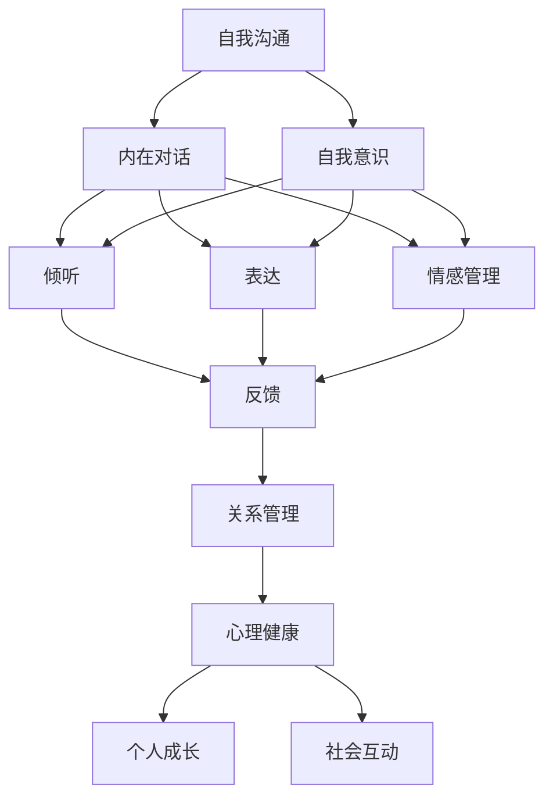

                 

### 第1章 引言

#### 1.1 自我沟通的重要性

自我沟通，指的是个体与自己内心进行的有效对话。这种内在的交流不仅涵盖了信息的传递，还包括情感、态度、价值观等多方面的互动。自我沟通的重要性不容小觑，它不仅影响着个体的心理健康，还与个人成长、决策能力和社会互动紧密相关。

在心理健康的层面，良好的自我沟通有助于个体更好地认识自我，调节情绪，减轻压力。当个体能够坦诚地面对自己的感受和想法时，心理负担会大大减轻，从而有利于心理健康的维护。

在个人成长的领域，自我沟通是自我反省和自我认知的重要途径。通过自我对话，个体可以深入了解自己的需求和期望，从而更好地规划自己的人生路径。

在决策过程中，自我沟通的质量直接影响到决策的合理性。一个善于自我沟通的个体，能够全面考虑问题，避免盲目决策，提高决策的准确性和有效性。

在社会互动中，自我沟通的技巧同样重要。良好的自我沟通能力能够帮助个体更好地理解他人，表达自己的观点，建立和谐的人际关系。

#### 1.2 书籍的目标与读者

本书的目标是为读者提供一套系统的自我沟通技巧和方法，帮助读者提升自我沟通的质量，实现个人成长和心理健康的目标。

本书适合以下读者群体：
1. 关注个人成长和心理健康的人群
2. 需要提升沟通能力，改善人际关系的职场人士
3. 对自我沟通感兴趣，希望深入了解这一领域的研究者

本书结构清晰，内容丰富，旨在通过理论讲解、实践技巧和案例分析，帮助读者逐步提升自我沟通能力。

#### 1.3 书籍的结构与内容安排

本书分为八个章节，具体结构如下：

- **第1章 引言**：介绍自我沟通的重要性、本书的目标与读者，以及书籍的结构与内容安排。
- **第2章 自我沟通的基础**：讨论内在对话的概念、自我意识的培养以及内在对话的影响。
- **第3章 提升自我沟通的技巧**：详细探讨倾听的艺术、表达自我的技巧和情感管理的技巧。
- **第4章 深度自我沟通的实践**：介绍自我反思的技巧和自我对话的实践方法。
- **第5章 提升内在对话质量的案例研究**：通过实际案例，分析提升内在对话质量的方法和效果。
- **第6章 内在对话与心理健康**：探讨内在对话与心理健康的关系，以及如何通过自我疗愈来维护心理健康。
- **第7章 内在对话与社会互动**：分析内在对话与社会互动的关系，介绍人际关系管理的技巧。
- **第8章 内在对话的持续发展**：讨论内在对话的持续发展策略和未来发展趋势。

通过以上章节的讲解，读者将逐步掌握自我沟通的核心技巧，提升自我沟通的质量，实现个人成长和心理健康的目标。

### 第2章 自我沟通的基础

#### 2.1 内在对话的概念

内在对话，指的是个体与自己内心进行的一系列对话。这种对话不仅涉及语言上的交流，还包括情感、态度、价值观等多个层面的互动。内在对话是自我沟通的重要组成部分，它帮助个体更好地理解自我，调节情绪，制定决策。

首先，内在对话的定义可以概括为：个体内心深处的思考、感受和情感的交流。这种对话不受外界干扰，是一种纯粹的心灵对话。内在对话的过程包括自我反思、自我批评、自我肯定等多种形式。

内在对话的类型可以分为以下几种：

1. **思考型**：个体在内心进行逻辑思考，分析问题，制定计划。这种类型的内在对话有助于个体在面对挑战时做出明智的决策。
   
2. **情感型**：个体在内心表达自己的情感，包括喜怒哀乐等。通过情感型内在对话，个体可以更好地理解和处理自己的情感。

3. **自我批评型**：个体在内心对自己进行批评，分析自己的不足和错误。这种内在对话有助于个体反思自己的行为，提升自我认知。

4. **自我肯定型**：个体在内心对自己进行肯定，包括自己的成就、优点等。这种内在对话有助于个体建立自信，增强自我价值感。

#### 2.2 自我意识的培养

自我意识，是指个体对自己存在的认知，包括自己的思想、情感、行为和生理状态等。培养良好的自我意识是提升自我沟通质量的基础。

首先，自我意识的重要性体现在以下几个方面：

1. **心理健康的维护**：良好的自我意识有助于个体更好地理解和处理自己的情感，减轻心理压力，维护心理健康。

2. **个人成长的促进**：自我意识使个体能够深入了解自己的需求和期望，从而更好地规划自己的人生道路，实现个人成长。

3. **沟通能力的提升**：自我意识使个体能够更好地理解和表达自己的观点，提高沟通效果，改善人际关系。

为了培养良好的自我意识，可以采取以下几种技巧：

1. **自我观察**：定期进行自我观察，了解自己的行为和情绪变化。通过记录日记或思考日志，个体可以更好地了解自己的内心世界。

2. **自我反思**：定期对自己的行为和决策进行反思，分析自己的优点和不足。这种反思有助于个体提升自我认知，培养自我意识。

3. **心理训练**：通过冥想、瑜伽等心理训练方法，增强个体的心理素质，提高自我意识的敏锐度。

4. **求助专业人士**：在自我意识培养的过程中，个体可以寻求心理咨询师或教练的帮助，通过专业的指导提升自我意识。

#### 2.3 内在对话的影响

内在对话对个体的生活和工作有着深远的影响。以下是内在对话对个体影响的几个方面：

1. **心理健康**：良好的内在对话有助于个体更好地理解自己的情感，调节情绪，减轻心理压力。通过内在对话，个体可以培养积极的心态，提升心理健康水平。

2. **决策能力**：内在对话使个体能够全面考虑问题，避免盲目决策。通过思考型内在对话，个体可以制定更合理的计划和策略，提高决策能力。

3. **人际关系**：良好的内在对话有助于个体更好地理解和表达自己的观点，建立和谐的人际关系。通过情感型内在对话，个体可以更好地处理人际冲突，提升沟通效果。

4. **个人成长**：内在对话是自我反省和自我认知的重要途径。通过内在对话，个体可以深入了解自己的需求和期望，从而更好地规划自己的人生路径，实现个人成长。

总之，内在对话和自我意识是自我沟通的基础，对于个体的心理健康、决策能力、人际关系和个人成长都有着重要的影响。通过培养良好的自我意识和提升内在对话的质量，个体可以更好地认识自我，实现个人成长和心理健康的目标。

### 第3章 提升自我沟通的技巧

#### 3.1 倾听的艺术

倾听，是一种重要的自我沟通技巧，不仅体现了对他人的尊重和理解，更是提升自我沟通质量的关键。有效的倾听不仅仅是听到对方说什么，更在于理解对方的感受和需求。

##### 3.1.1 有效倾听的要素

1. **专注力**：倾听的首要要素是专注力。当与他人交谈时，需要将注意力集中在对方身上，避免分心。这包括目光接触、肢体语言和专注的姿态。

2. **开放心态**：开放心态是有效倾听的重要条件。倾听者需要保持开放的心态，接受不同的观点和意见，避免过早做出评判。

3. **同理心**：同理心是理解对方情感和需求的关键。通过换位思考，倾听者能够更好地理解对方的感受，从而提供更有针对性的反馈和支持。

##### 3.1.2 倾听的技巧

1. **全神贯注**：在倾听过程中，要避免分心，专注于对方的每一句话。可以通过点头、微笑等非语言表达来表示理解。

2. **反馈和确认**：通过重复对方的关键内容或情感，确认自己是否正确理解了对方的意图。例如：“我理解你的意思是...”，或“你的感受我明白，你感到...”。

3. **避免打断**：在对方说话时，避免插话或打断，让对方感受到自己的话语被尊重。

4. **问开放式问题**：通过问开放式问题，引导对方分享更多信息。例如：“你能进一步解释一下吗？”或“你的感受是如何产生的？”

##### 3.1.3 倾听的实践

1. **日常练习**：在日常生活中，尝试与家人、朋友或同事进行有意识的倾听练习。可以通过角色扮演、模拟对话等方式提高倾听技巧。

2. **反馈机制**：定期向他人寻求反馈，了解自己在倾听过程中的优点和不足。通过反馈不断改进，提升倾听效果。

3. **专业培训**：参加倾听技巧的培训课程，通过专业指导提升倾听能力。这些课程通常包括实践练习、案例分析等，有助于提高实际应用能力。

通过以上技巧和实践，个体可以提升倾听的质量，从而在自我沟通中取得更好的效果，建立更和谐的人际关系。

#### 3.2 表达自我的技巧

在自我沟通中，表达自我的能力同样至关重要。一个善于表达自我的人，能够清晰、准确地传达自己的想法和感受，从而减少误解和冲突，提升沟通效果。以下是一些提升表达自我的技巧：

##### 3.2.1 自我表达的障碍

1. **恐惧和焦虑**：许多人害怕表达自己的真实想法和感受，担心被批评或拒绝。这种恐惧和焦虑常常阻碍了自我表达的顺利进行。

2. **社交压力**：在社交场合中，个体可能会感到压力，担心自己的观点不被接受或评价。这种压力会影响表达的真实性和流畅性。

3. **情绪干扰**：强烈的情绪，如愤怒、悲伤或焦虑，会干扰个体的表达。在情绪激烈时，个体可能难以冷静地表达自己的观点。

##### 3.2.2 提升自我表达的技巧

1. **自我接纳**：自我接纳是表达自我的基础。个体需要接受自己的优点和缺点，培养自信，减少自我怀疑。

2. **情绪管理**：在表达前，个体应先管理好自己的情绪。通过冥想、深呼吸等方法，降低情绪的干扰，从而更清晰地表达自己的观点。

3. **明确目的**：在表达前，明确自己的目的和意图。这有助于个体更有针对性地表达，避免不必要的歧义。

4. **结构化表达**：使用清晰、有条理的语言进行表达。可以通过列出要点、使用逻辑连接词等方式，使表达更加清晰易懂。

5. **练习和反馈**：通过日常练习和获取反馈，提升表达技能。可以尝试写日记、演讲练习或参与讨论，逐步提高表达能力。

##### 3.2.3 自我表达的实践

1. **日常练习**：在日常生活中，尝试更多地表达自己的观点和感受。可以通过与家人、朋友的对话，或在公开场合发言等方式进行练习。

2. **模拟情境**：设计一些常见的社交情境，如面试、辩论等，模拟实际表达过程。通过模拟练习，个体可以更好地应对实际情境中的表达挑战。

3. **寻求反馈**：向他人寻求反馈，了解自己的表达效果。可以通过反思、他人评价等方式，不断改进和提升自我表达技能。

4. **专业培训**：参加沟通技巧培训课程，通过专业指导提升自我表达能力。这些课程通常包括角色扮演、案例分析等，有助于提高实际应用能力。

通过以上技巧和实践，个体可以逐渐提升自我表达的技巧，更有效地传达自己的思想和感受，从而在自我沟通中取得更好的效果。

#### 3.3 情感管理的技巧

情感管理是自我沟通中的一个重要环节，它不仅影响个体的心理健康，还关系到与他人的互动质量。有效的情感管理技巧有助于个体更好地应对各种情绪波动，保持心理平衡。

##### 3.3.1 情感管理的重要性

情感管理的重要性体现在以下几个方面：

1. **心理健康**：有效的情感管理有助于个体更好地处理压力和挫折，保持心理健康。通过调节情绪，个体能够减少焦虑、抑郁等负面情绪的影响。

2. **人际关系**：良好的情感管理能力使个体能够更好地理解和应对他人的情感，建立和谐的人际关系。这有助于减少冲突，增强合作。

3. **决策能力**：在情绪稳定的状态下，个体能够更理性地分析问题，做出明智的决策。情感管理有助于提高个体的决策能力。

##### 3.3.2 情感管理的技巧

1. **情绪识别**：情绪识别是情感管理的第一步。个体需要学会识别和理解自己的情绪。可以通过记录日记、情绪地图等方式，识别情绪的来源和特点。

2. **情绪调节**：在识别情绪后，个体应学会调节情绪，使其回归正常水平。可以通过深呼吸、冥想、运动等方法，缓解情绪压力。

3. **情绪表达**：情感管理不仅包括情绪的调节，还包括情绪的表达。个体应学会以健康的方式表达自己的情感，避免压抑或过度表达。可以通过积极的沟通技巧，如倾听和反馈，表达自己的情感。

4. **情感转化**：情感转化是将负面情绪转化为积极能量的过程。个体可以通过积极思考、转变视角等方式，将负面情绪转化为动力，促进个人成长。

##### 3.3.3 情感管理的实践

1. **日常练习**：在日常生活中，个体可以通过练习冥想、深呼吸等方法，提高情绪调节能力。可以通过记录日记，分析自己的情绪波动，从而更好地管理情感。

2. **求助专业人士**：在情感管理过程中，个体可以寻求心理咨询师的帮助。通过专业指导，个体可以学习更有效的情感管理技巧。

3. **社交支持**：建立良好的社交支持网络，有助于个体在情感困扰时获得支持和帮助。通过与家人、朋友或社区互动，个体可以获得情感上的支持，提升情感管理能力。

4. **情绪记录**：通过记录情绪日记，个体可以更好地了解自己的情绪变化，从而采取相应的管理措施。情绪日记可以记录情绪的类型、强度、发生时间等，有助于个体反思和管理自己的情绪。

通过以上技巧和实践，个体可以提升情感管理能力，更好地应对生活中的情绪波动，保持心理健康，从而在自我沟通中取得更好的效果。

### 第4章 深度自我沟通的实践

#### 4.1 自我反思的技巧

自我反思是一种深入自我沟通的重要技巧，它有助于个体更好地了解自我，发现问题，从而实现个人成长。以下是一些自我反思的技巧和实践方法：

##### 4.1.1 自我反思的定义

自我反思是指个体在特定情境下，对自己的行为、思想和情感进行深入思考和分析的过程。这种反思不仅关注当前的情况，还包括对过去经验的回顾和对未来计划的规划。

##### 4.1.2 自我反思的技巧

1. **设立明确的目标**：在进行自我反思前，明确自己的反思目标。这有助于个体集中注意力，更有效地进行反思。例如，可以设定目标：“今天我要反思我的工作表现”或“我要分析我最近的情绪波动”。

2. **定期安排反思时间**：为了确保自我反思的持续性和有效性，个体应定期安排反思时间。可以设定每周固定的一天或一段时间进行反思，如每天晚上睡前花10分钟反思当天的事情。

3. **记录反思内容**：记录反思内容有助于个体更清晰地回顾和分析自己的行为和情感。可以通过写日记、做笔记或使用电子记录工具等方式进行记录。

4. **多角度分析**：在反思时，个体应从多个角度分析自己的行为和情感。例如，可以从行为、动机、结果等多个层面进行思考，从而更全面地理解自我。

5. **求助于他人**：通过与他人交流，个体可以获得不同的视角和建议，有助于更深入地反思自我。可以与家人、朋友或专业人士进行交流，获取反馈和指导。

##### 4.1.3 自我反思的实践

1. **日常反思**：在日常生活中，个体可以随时进行自我反思。例如，在遇到困难时，反思自己是如何应对的；在感到满足时，反思是什么让自己感到幸福。

2. **定期总结**：每周或每月进行一次总结，回顾自己的行为和情感变化。通过总结，个体可以更好地了解自己的成长轨迹，为下一步的行动提供指导。

3. **问题导向反思**：针对具体问题进行反思，找出问题的根源，并提出解决方案。例如，如果工作表现不佳，可以反思工作中的不足，并制定改进计划。

4. **模拟情境**：通过模拟不同的情境，想象自己会如何应对。例如，在面试前模拟面试过程，通过反思和改进，提高应对实际情境的能力。

通过以上技巧和实践，个体可以提升自我反思的能力，从而更好地认识自我，解决问题，实现个人成长。

#### 4.2 自我对话的实践

自我对话是一种内在的沟通方式，通过这种沟通，个体可以深入了解自己的内心世界，从而实现个人成长和心理调节。以下是一些自我对话的实践技巧：

##### 4.2.1 自我对话的意义

自我对话对于个人的成长和心理调节具有重要意义。通过自我对话，个体可以：

1. **深入理解自我**：自我对话使个体有机会深入探讨自己的内心世界，包括情感、需求和价值观。这有助于个体更清晰地认识自我，找到内心的平衡点。

2. **促进心理调节**：自我对话有助于个体在心理困扰时进行自我调节。通过对话，个体可以理解自己的情绪，找到合适的应对策略，减轻心理压力。

3. **提高决策能力**：自我对话使个体能够在做出决策前进行全面的思考和评估。通过对话，个体可以从不同的角度分析问题，做出更为明智的决策。

##### 4.2.2 自我对话的技巧

1. **设定对话目标**：在进行自我对话前，明确对话的目标。这有助于个体集中精力，更有效地进行对话。例如，设定目标：“我要探讨我的职业规划”或“我要分析我的情绪波动”。

2. **保持开放心态**：在自我对话中，个体应保持开放的心态，不受外界干扰。这有助于个体更真实地表达自己的想法和感受。

3. **多角度分析**：在自我对话时，个体应从多个角度分析问题。例如，可以从行为、情感、价值观等多个层面进行思考，从而更全面地理解自我。

4. **倾听内心声音**：在自我对话中，个体应倾听内心的声音。这包括理解自己的情绪、需求和动机，从而更好地认识自我。

5. **记录对话内容**：记录自我对话的内容有助于个体回顾和反思。可以通过写日记、做笔记或使用电子记录工具等方式进行记录。

##### 4.2.3 自我对话的实践

1. **日常对话**：在日常生活中，个体可以随时进行自我对话。例如，在遇到困难时，反思自己的应对策略；在感到焦虑时，探讨情绪的来源和应对方法。

2. **情境模拟**：通过模拟不同的情境，个体可以进行自我对话练习。例如，在面试前模拟面试过程，通过对话，提前准备和解决问题。

3. **定期回顾**：定期回顾自我对话的内容，有助于个体了解自己的成长轨迹。可以通过每周或每月的回顾，总结对话中的收获和反思。

4. **求助专业人士**：在自我对话过程中，个体可以寻求心理咨询师的帮助。通过专业指导，个体可以学习更有效的自我对话技巧。

通过以上技巧和实践，个体可以提升自我对话的能力，从而更好地认识自我，实现个人成长和心理调节。

### 第5章 提升内在对话质量的案例研究

为了更直观地展示提升内在对话质量的方法和效果，本章节将通过两个实际案例，详细分析如何通过自我沟通技巧实现个人成长和职场沟通的优化。

#### 5.1 案例一：个人成长

##### 5.1.1 案例背景

李华是一名年轻的软件工程师，他在工作中表现出色，但在个人生活中常常感到迷茫和焦虑。尤其是在职业发展方面，他不确定自己的下一步该怎么做。这种情况导致他在工作中也难以集中注意力，影响了工作效率。李华意识到需要通过提升自我沟通来解决这个问题。

##### 5.1.2 案例分析

1. **自我反思**：李华开始每天花时间进行自我反思，通过记录日记，他分析了自己的职业目标、兴趣和价值观。通过这个过程，他发现了自己对技术开发的热情以及对团队合作的渴望。

   $$ 
   \text{自我反思公式：} \\
   \text{当前状态} + \text{需求分析} + \text{价值观匹配} = \text{明确目标}
   $$

2. **情感管理**：李华通过练习冥想和深呼吸技巧来管理自己的情绪。他学会了在面对焦虑和迷茫时保持冷静，从而更好地分析问题。

   $$ 
   \text{情绪管理公式：} \\
   \text{情绪识别} + \text{情绪调节} + \text{情感表达} = \text{情绪稳定}
   $$

3. **目标设定**：在明确了自己的兴趣和职业目标后，李华设定了具体的短期和长期目标，如提升特定技术技能、参与团队项目等。

4. **行动规划**：李华制定了一个详细的行动计划，包括学习计划、时间管理策略等。通过这些实践，他逐渐提升了自我沟通能力，并在工作中取得了显著进步。

##### 5.1.3 案例启示

通过这个案例，我们可以看到自我反思和情感管理在提升内在对话质量中的重要作用。明确的自我认知和目标设定，加上有效的情感管理技巧，帮助李华实现了个人成长，提高了工作效率。

#### 5.2 案例二：职场沟通

##### 5.2.1 案例背景

张伟是一家大型公司的项目经理，他负责管理多个项目团队。然而，他在与团队成员沟通时经常遇到障碍，导致项目进度受到影响。张伟意识到需要提升自我沟通技巧，以改善职场沟通。

##### 5.2.2 案例分析

1. **倾听技巧**：张伟通过参加沟通技巧培训，学习如何更有效地倾听团队成员的意见。他开始更加注重对方的发言，避免打断，并使用反馈技巧确认理解。

   $$ 
   \text{倾听技巧公式：} \\
   \text{专注倾听} + \text{反馈确认} + \text{开放式问题} = \text{有效倾听}
   $$

2. **表达自我**：张伟学习了如何更清晰地表达自己的观点和需求。他开始使用结构化表达，列出关键点，并用逻辑连接词来组织语言。

   $$ 
   \text{表达自我公式：} \\
   \text{明确目的} + \text{结构化表达} + \text{积极沟通} = \text{清晰表达}
   $$

3. **情感管理**：张伟学会了在沟通中管理自己的情绪。他通过冥想和放松技巧，减少压力和焦虑，保持冷静和理性。

   $$ 
   \text{情感管理公式：} \\
   \text{情绪识别} + \text{情绪调节} + \text{健康表达} = \text{情绪稳定}
   $$

4. **团队互动**：张伟开始定期组织团队会议，鼓励团队成员分享意见和反馈。通过有效的倾听和表达，他建立了更和谐的团队关系，提高了项目沟通效率。

##### 5.2.3 案例启示

通过这个案例，我们可以看到提升内在对话质量对职场沟通的重要性。倾听技巧、表达自我和情感管理是提升职场沟通效果的关键。通过这些技巧，张伟成功地改善了团队沟通，提高了项目执行力。

### 案例总结

以上两个案例展示了提升内在对话质量的方法在实际生活中的应用效果。无论是个人成长还是职场沟通，自我反思、倾听技巧、表达自我和情感管理都是提升内在对话质量的重要工具。通过这些技巧，个体可以更深入地认识自我，实现个人成长，同时改善与他人之间的沟通效果，从而在各个方面取得更好的成果。

### 第6章 内在对话与心理健康

#### 6.1 内在对话与心理健康的关系

内在对话与心理健康之间存在密切的关系。内在对话不仅影响个体的情绪状态，还对其心理韧性、自我认知和心理健康产生深远影响。

首先，内在对话对情绪状态有显著影响。通过内在对话，个体可以更好地识别和理解自己的情绪。例如，当个体经历焦虑或抑郁时，通过自我对话，他们可以深入探讨情绪的根源，找到解决问题的方法。这种自我觉察有助于个体减轻情绪负担，提高情绪调节能力。

其次，内在对话对心理韧性有积极作用。心理韧性是指个体在面对压力和挑战时的适应能力。通过深度自我对话，个体可以培养积极的心态，增强对逆境的应对能力。例如，当个体遇到挫折时，通过自我对话，他们可以反思过去的成功经验，找到应对策略，从而提高心理韧性。

此外，内在对话对自我认知有重要影响。自我认知是指个体对自己身份、能力和价值的认知。通过内在对话，个体可以更清晰地了解自己的需求和期望，从而建立积极的自我概念。这种自我认知有助于个体在面对外界评价时保持自信，减少自我怀疑。

#### 6.2 内在对话对心理健康的影响

内在对话对心理健康的影响可以从以下几个方面进行探讨：

1. **情绪调节**：内在对话有助于个体更好地理解和调节自己的情绪。通过自我对话，个体可以识别负面情绪，找到情绪波动的根源，并采取积极的措施进行调节。例如，当个体感到焦虑时，他们可以通过自我对话来分析焦虑的原因，并采取深呼吸、冥想等放松技巧来缓解焦虑。

2. **心理韧性的提升**：内在对话有助于个体培养心理韧性。通过自我对话，个体可以反思过去的挑战和成功经验，从中获得应对未来困难的启示。例如，当个体遇到挫折时，他们可以通过自我对话来回顾过去如何克服困难，从而增强信心，提高心理韧性。

3. **自我认知的发展**：内在对话有助于个体发展积极的自我认知。通过自我对话，个体可以深入探讨自己的价值观、兴趣和目标，从而建立清晰的自我概念。这种自我认知有助于个体在面对外界压力时保持自我认同，减少自我怀疑。

4. **压力管理的改善**：内在对话有助于个体改善压力管理能力。通过自我对话，个体可以更好地理解自己的需求，从而调整自己的期望和行为。例如，当个体感到压力过大时，他们可以通过自我对话来分析压力的来源，并采取适当的休息和放松措施来缓解压力。

#### 6.3 心理健康维护的技巧

为了维护心理健康，个体可以采取以下几种技巧：

1. **自我觉察**：培养自我觉察能力，有助于个体更好地了解自己的情绪和行为。通过记录日记或思考日志，个体可以定期反思自己的情绪变化和行为模式，从而更好地调节情绪，提高心理健康。

2. **自我接纳**：自我接纳是指接受自己的优点和缺点，不进行无谓的自我批评。通过自我对话，个体可以培养自我接纳的能力，从而减少自我压力，提高心理健康水平。

3. **积极心态**：培养积极心态，有助于个体更好地应对生活中的挑战。通过自我对话，个体可以反思过去的成功经验，找到积极的应对策略，从而保持积极的心态，提高心理健康。

4. **情感表达**：学会健康地表达情感，有助于个体更好地处理情绪。通过自我对话，个体可以了解自己的情感需求，并采取适当的方式表达情感，从而减少情绪积压，提高心理健康。

5. **求助专业人士**：在遇到心理健康问题时，个体可以寻求心理咨询师的帮助。通过专业的指导和治疗，个体可以学习更有效的心理调节技巧，提高心理健康水平。

通过以上技巧，个体可以提升内在对话的质量，从而更好地维护心理健康，实现个人成长和幸福。

### 第7章 内在对话与社会互动

#### 7.1 内在对话与社会互动的关系

内在对话与社会互动之间存在密切的关系。内在对话不仅影响个体的自我认知和心理状态，也对其社会互动模式产生重要影响。理解这种关系对于提升个体的社交能力和人际沟通技巧至关重要。

首先，内在对话影响个体的自我认知。通过深度自我对话，个体能够更清晰地认识自己的价值观、信念和需求。这种自我认知有助于个体在社会互动中更好地表达自己，理解他人，从而建立和谐的人际关系。

其次，内在对话影响个体的情绪状态。有效的内在对话技巧，如情绪管理和自我调节，可以帮助个体在面对社交挑战时保持冷静和理性。这有助于个体更好地处理社交情境中的冲突，提升社交互动的质量。

此外，内在对话还影响个体的社交技能。通过自我对话，个体可以反思自己的社交行为，识别社交技巧的不足，并采取改进措施。这种自我反思有助于个体提升社交能力，建立更广泛的社会网络。

#### 7.1.1 社会互动的重要性

社会互动是个人成长和社会发展的重要组成部分。通过社会互动，个体能够获取信息、建立关系、提高自我认知，并实现自我价值。以下是社会互动的几个关键方面：

1. **信息交流**：社会互动是信息交流的重要渠道。通过与他人交流，个体可以获得新知识、新观点和新信息，从而扩展自己的视野，提高认知水平。

2. **关系建立**：社会互动有助于个体建立和维护人际关系。通过互动，个体可以结识新朋友，加深与他人的联系，从而建立稳定和持久的社会网络。

3. **自我认知**：社会互动是自我认知的重要途径。通过与他人互动，个体可以了解自己的优点和不足，从而反思和改进自己，提高自我认知水平。

4. **自我价值实现**：社会互动有助于个体实现自我价值。通过参与社会活动、承担责任和贡献社会，个体能够感受到自己的价值和重要性，从而增强自信心和幸福感。

#### 7.1.2 内在对话在社会互动中的应用

内在对话在社会互动中的应用主要体现在以下几个方面：

1. **自我反思**：在社会互动中，个体可以通过自我反思来评估自己的行为和互动效果。通过反思，个体可以识别自己在互动中的优势和不足，并采取相应的改进措施。

2. **情绪管理**：在社交情境中，个体常常会面临情绪波动，如紧张、兴奋或焦虑。通过内在对话，个体可以管理自己的情绪，保持冷静和理性，从而更好地应对社交挑战。

3. **沟通技巧提升**：内在对话可以帮助个体反思自己的沟通方式，识别沟通中的障碍，并寻求改进方法。例如，通过自我对话，个体可以学习如何更有效地倾听和表达，提高沟通效果。

4. **关系维护**：内在对话有助于个体更好地理解和维护人际关系。通过自我对话，个体可以反思自己在关系中的角色和责任，采取积极的措施来维护和改善关系。

#### 7.1.3 社会互动中的沟通技巧

在社会互动中，沟通技巧是关键。以下是一些提升社会互动沟通技巧的方法：

1. **倾听技巧**：有效的倾听是沟通的基础。通过倾听，个体可以更好地理解他人的观点和需求，从而建立更好的互动关系。

2. **表达清晰**：清晰、准确的表达能够减少误解和冲突。个体可以通过使用明确的语言、逻辑的结构和适当的肢体语言来提升表达效果。

3. **情绪调节**：在社会互动中，情绪调节能力至关重要。个体可以通过冥想、深呼吸和积极的自我对话来管理自己的情绪，保持冷静和理性。

4. **同理心**：同理心是理解他人的情感和需求的关键。通过换位思考和敏感的感知，个体可以更好地理解他人，从而建立更深层次的互动。

5. **反馈技巧**：及时、恰当的反馈有助于沟通的顺利进行。个体可以通过积极的反馈和建设性的建议来促进有效的互动。

通过以上沟通技巧，个体可以提升社会互动的质量，建立更和谐的人际关系，实现个人成长和社会价值的最大化。

#### 7.2 内在对话与人际关系

人际关系是影响个体幸福感和社会适应能力的重要因素。内在对话在人际关系中的作用不容忽视，它不仅影响个体的自我认知和情感状态，还直接影响人际互动的质量。

##### 7.2.1 人际关系的定义

人际关系是指个体之间通过相互交往、互动和沟通建立起来的社会联系。这种联系可以是个体与家人、朋友、同事或合作伙伴之间的互动。良好的人际关系有助于个体获得支持、建立信任和增强归属感。

##### 7.2.2 内在对话在人际关系中的应用

内在对话在人际关系中的应用主要体现在以下几个方面：

1. **自我认知**：通过内在对话，个体可以更深入地了解自己的需求和期望，从而更好地理解自己的行为和情感反应。这种自我认知有助于个体在人际互动中做出更合适的选择。

2. **情感管理**：内在对话可以帮助个体更好地管理自己的情绪。例如，当个体感到愤怒或沮丧时，通过自我对话，他们可以反思情绪的根源，找到适当的调节方法，从而避免负面情绪对人际关系的负面影响。

3. **沟通技巧**：内在对话有助于个体反思和改进自己的沟通方式。通过自我对话，个体可以识别沟通中的障碍，如误解或表达不清，并寻求改进方法，从而提升沟通效果。

4. **同理心**：内在对话使个体能够更好地理解和感受他人的情感和需求。通过换位思考和积极的自我对话，个体可以培养同理心，从而在人际互动中更有效地建立和维护关系。

##### 7.2.3 人际关系管理的技巧

为了建立和维护良好的人际关系，个体可以采取以下几种技巧：

1. **倾听**：倾听是建立良好人际关系的基础。通过倾听，个体可以更好地理解他人的观点和需求，从而建立信任和共鸣。

2. **表达**：清晰、准确的表达有助于减少误解和冲突。个体可以通过使用明确的语言、逻辑的结构和适当的肢体语言来提升表达效果。

3. **情感共鸣**：建立情感共鸣是维持良好人际关系的关键。通过同理心和积极的情感表达，个体可以与他人建立更深层次的联系。

4. **冲突解决**：在人际互动中，冲突是难以避免的。有效的冲突解决技巧，如沟通和妥协，可以帮助个体解决冲突，维护关系的和谐。

5. **反馈**：及时、恰当的反馈有助于沟通的顺利进行。个体可以通过积极的反馈和建设性的建议来促进有效的互动。

通过以上技巧，个体可以提升内在对话的质量，从而在人际关系中取得更好的效果，建立和维护和谐的人际关系。

### 第8章 内在对话的持续发展

#### 8.1 持续提升内在对话质量

内在对话的质量是一个持续提升的过程，它不仅影响个体的心理健康和人际关系，还对其职业发展和个人成长产生深远影响。以下是一些策略，帮助个体在日常生活中持续提升内在对话的质量。

##### 8.1.1 持续发展的意义

持续提升内在对话质量的意义在于：

1. **增强心理韧性**：通过持续提升内在对话质量，个体能够更好地识别和调节情绪，提高心理韧性，应对生活中的挑战。

2. **改善人际关系**：持续的内在对话训练有助于个体更好地理解和表达情感，建立和谐的人际关系。

3. **提高职业素养**：内在对话能力的提升有助于个体在职场中更有效地沟通和协作，提高工作效率和职业发展。

##### 8.1.2 持续发展的策略

1. **定期自我反思**：设立固定的自我反思时间，如每天早晨或晚上，回顾一天的经历，分析自己的行为、情绪和思考过程。通过持续的反思，个体可以不断改进自我沟通方式。

2. **学习新的沟通技巧**：参加沟通技巧培训课程或阅读相关书籍，学习新的倾听、表达和情绪管理技巧。持续的技能提升有助于个体在多种情境下运用有效的沟通方法。

3. **培养同理心**：通过阅读、观影或与他人交流，培养同理心。理解和感受他人的情感和需求，有助于个体在人际互动中建立更深的联系。

4. **实践冥想和放松技巧**：冥想和深呼吸等放松技巧有助于个体在压力下保持冷静和专注，从而提高内在对话的质量。

5. **建立支持网络**：与家人、朋友或专业人士建立支持网络，定期交流，获取反馈和建议。这种支持有助于个体在自我沟通中不断进步。

##### 8.1.3 持续发展的实践

1. **日常练习**：在日常生活中，随时进行自我对话练习。例如，在遇到挑战时，反思自己的应对策略；在感到满足时，分析原因和感受。

2. **情境模拟**：设计一些常见的社交和职业情境，模拟实际对话过程。通过情境模拟，个体可以在实践中提升沟通技巧。

3. **记录和回顾**：记录自我对话的内容，定期回顾和总结。通过记录和回顾，个体可以清晰地看到自己的进步和不足，从而持续改进。

4. **专业指导**：寻求心理咨询师或沟通技巧教练的专业指导。通过专业的指导，个体可以获得更深入的理解和更有效的沟通策略。

通过以上策略和实践，个体可以持续提升内在对话的质量，实现个人成长和职业发展。

#### 8.2 内在对话的未来发展趋势

随着科技的进步和社会的变迁，内在对话也在不断演变和发展。以下是内在对话未来可能的发展趋势：

##### 8.2.1 未来发展趋势概述

1. **人工智能的应用**：人工智能（AI）在心理治疗和自我沟通领域的应用逐渐增多。通过AI技术，个体可以获得个性化的自我对话建议，提高沟通效果。

2. **虚拟现实（VR）与内在对话**：虚拟现实技术可以为个体提供一个沉浸式的自我对话环境。通过VR，个体可以在虚拟世界中探索和反思自己的内心世界，从而更深入地进行自我对话。

3. **数字工具的支持**：各种数字工具，如应用程序、在线平台和智能设备，将提供更便捷的自我对话工具。这些工具可以帮助个体更系统地记录、分析和提升自我沟通能力。

##### 8.2.2 技术对内在对话的影响

1. **个性化服务**：通过AI算法，数字工具可以提供个性化的自我对话建议，根据个体的情绪、需求和习惯，量身定制沟通策略。

2. **实时反馈**：数字工具可以实时监控个体的自我对话过程，提供即时反馈，帮助个体及时调整和改进沟通方式。

3. **增强情感识别**：AI和机器学习技术可以识别和分析个体情感，从而提供更精准的情感管理建议，提高沟通效果。

##### 8.2.3 内在对话在社会发展中的作用

1. **心理健康促进**：内在对话作为一种心理调节工具，将在未来社会中发挥更大作用，帮助个体应对压力，提升心理健康水平。

2. **社会互动优化**：随着内在对话技巧的普及，社会互动的质量将得到显著提升，人际冲突减少，社会关系更加和谐。

3. **职业发展支持**：内在对话技巧的运用将有助于个体在职场中更有效地沟通和协作，提高职业素养和职业发展。

通过技术和社会发展的支持，内在对话将在未来发挥更加重要的作用，成为促进个人成长和社会和谐的重要工具。

### 附录

#### 附录A：自我沟通评估工具

以下是一些自我沟通评估工具，帮助个体了解自己的沟通能力和状况：

1. **自我沟通评估问卷**：通过一系列问题，评估个体的沟通技巧、情绪管理和自我反思能力。
2. **沟通行为记录表**：记录个体在特定情境中的沟通行为，如会议、面试或团队协作，分析沟通效果和改进空间。
3. **情绪温度计**：用于测量个体在不同情境下的情绪状态，帮助识别和调节情绪。

#### 附录B：自我沟通实践指南

以下是一些自我沟通实践指南，帮助个体提升自我沟通能力：

1. **设定沟通目标**：明确自己的沟通目标，如提高倾听技巧、改善表达方式或增强情感管理能力。
2. **定期反思**：定期回顾自己的沟通行为，分析成功和不足之处，制定改进计划。
3. **实践技巧**：通过日常练习、模拟情境和寻求反馈，逐步提升沟通技巧。

#### 附录C：参考文献和推荐阅读

1. **《沟通的艺术》** - 阿兰·拉金（A. Lakin）
2. **《情绪智慧》** - 丹尼尔·戈尔曼（Daniel Goleman）
3. **《自我沟通：技巧与实践》** - 约翰·罗克奇（John Rockeche)

以上参考文献和推荐阅读提供了丰富的理论和实践经验，有助于读者深入了解自我沟通的重要性和提升方法。

## Mermaid 流程图：自我沟通核心概念与联系



## Python 源代码示例：深度自我沟通技巧

```python
# 示例1：倾听技巧实现
def active_listening(message):
    response = f"我正在倾听：{message}"
    return response

# 示例2：情感管理技巧实现
def manage_emotions(emotion):
    if emotion == "愤怒":
        response = "我理解你现在的情绪，我们可以先冷静一下，然后再讨论问题。"
    elif emotion == "悲伤":
        response = "我感到很遗憾，如果你愿意，我们可以一起谈谈怎么帮助你感觉好一些。"
    else:
        response = "我注意到你现在的情绪似乎有点复杂，可以和我分享一下吗？"
    return response

# 示例3：自我反思技巧实现
def self_reflection(question):
    response = f"针对这个问题：'{question}'，我思考了一下，我的感受和看法是..."
    return response
```

通过上述流程图和代码示例，我们可以更直观地理解自我沟通的核心概念及其相互联系。这些工具和方法将帮助读者在实践中提升自我沟通能力，实现个人成长和心理健康的目标。

### 作者信息

- 作者：AI天才研究院/AI Genius Institute & 禅与计算机程序设计艺术 /Zen And The Art of Computer Programming

