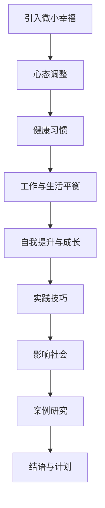

                 

### 引言

在快节奏的现代社会，人们的生活似乎被各种压力和焦虑所笼罩，我们常常忽视了生活中的细微之处。然而，正是这些看似不起眼的瞬间，构成了我们日常生活的幸福底色。提升日常生活品质，关键在于发现并享受那些微小幸福的能力。这不仅仅是一种心理状态，更是一种技术和艺术。

### 日常生活中的微小幸福

首先，我们需要明确“微小幸福”的定义。微小幸福并非宏大的成就或豪华的享受，而是那些日常生活中平凡而温馨的瞬间。例如，一杯热茶的温暖，一缕晨光的宁静，一句鼓励的话语，或是一份简单的快乐。这些微小幸福，常常隐藏在生活的细微之处，等待着我们去发现和感受。

#### 小微幸福的重要性

微小幸福对我们的生活具有深远的影响。首先，它能够提升我们的幸福感。当我们学会欣赏生活中的小美好，我们的内心会变得更加平和与满足。其次，微小幸福能够增强我们的心理健康。研究表明，频繁体验快乐和满足感有助于减轻压力，提升情绪状态。最后，发现微小幸福的能力有助于我们建立积极的生活态度，从而更好地应对生活中的挑战。

#### 发现微小幸福的能力

那么，如何提升我们发现微小幸福的能力呢？首先，我们需要调整心态，学会在忙碌中抽出一刻，去关注那些被忽视的细节。其次，通过培养一些特定的习惯，如记录感恩日志、练习冥想和正念等，我们可以更加敏锐地捕捉到生活中的小幸福。此外，与他人分享和交流这些美好瞬间，也能够增强我们感知幸福的能力。

### 本书的目标和结构

本书的目标是帮助读者提升发现微小幸福的能力，从而提升日常生活的品质。全书共分为八个章节，每个章节都围绕提升幸福感的不同方面展开。具体结构如下：

1. **引言**：介绍日常生活中的微小幸福及其重要性。
2. **微小幸福的概念与重要性**：定义微小幸福，阐述其重要性。
3. **提升幸福感的日常习惯**：讨论保持积极心态、建立健康生活习惯和与他人建立良好关系的方法。
4. **工作与生活平衡**：探讨工作中的微小幸福、管理工作压力和提高工作效率的策略。
5. **自我提升与成长**：介绍学习与成长、自我认知与自我接纳以及实现个人目标的方法。
6. **微小幸福的实践技巧**：提供发现生活中的小美好、培养感恩心态和实践积极心理学的技巧。
7. **微小的改变带来的巨大影响**：讨论微小行动的力量、持续改进与自我激励以及社会影响力。
8. **结语**：总结与反思，为日常生活中的微小幸福制定计划。

通过本书的阅读和实践，我们希望读者能够学会在忙碌的生活中捕捉那些微小而珍贵的幸福，从而拥有更加充实和满足的人生。

## 第1章：微小幸福的概念与重要性

### 微小幸福的定义

微小幸福，顾名思义，是指那些在日常生活中细小而平凡的快乐与满足。它们往往不是由重大的事件或成就带来的，而是隐藏在琐碎的日常细节中，如一杯热茶、一首喜爱的歌曲、一个阳光明媚的早晨，甚至是朋友的一句问候。这些看似微不足道的小事，却能在无形中温暖我们的心灵，提升我们的幸福感。

### 微小幸福的重要性

#### 增强心理健康

首先，微小幸福能够显著增强我们的心理健康。心理学研究表明，频繁地体验快乐和满足感能够有效地缓解压力和焦虑。当我们关注并珍惜生活中的小幸福时，大脑会释放出多巴胺等“快乐激素”，从而改善我们的情绪状态，提升幸福感。

#### 提升生活质量

其次，微小幸福有助于提升我们的生活品质。通过发现和享受这些小幸福，我们能够培养一种积极向上的生活态度。这种态度不仅能够改善我们的心理健康，还能够增强我们对生活的热爱和满意度。当我们的生活充满了这些细微的满足，我们便会更加珍惜每一天。

#### 促进社会关系

此外，微小幸福在促进社会关系方面也起着重要作用。当我们与他人分享这些小幸福时，能够增进彼此的情感联系，建立更加紧密的人际关系。这种积极的社交互动有助于增强我们的归属感和幸福感。

### 发现微小幸福的能力

#### 心态调整

要提升发现微小幸福的能力，首先需要调整心态。现代社会节奏快，压力大，许多人容易忽视身边的美好。因此，我们需要学会在忙碌中抽出一刻，放慢脚步，去关注那些被忽视的细节。这可以通过练习冥想、正念等方法来实现。

#### 培养特定习惯

其次，通过培养特定的习惯，如记录感恩日志、每天留出一段时间放松身心等，我们可以更加敏锐地捕捉到生活中的小幸福。例如，每天晚上花几分钟写下自己当天感受到的三个小幸福，能够帮助我们养成关注和欣赏美好的习惯。

#### 与他人分享

最后，与他人分享和交流这些美好瞬间，也是提升发现微小幸福能力的一种方法。通过分享，我们不仅能够增强自己的幸福感，还能够鼓励他人去发现生活中的小幸福，从而形成一个积极的社交循环。

总之，微小幸福是提升日常生活品质的关键。通过调整心态、培养特定习惯和与他人分享，我们可以不断提升发现微小幸福的能力，从而拥有更加充实和满足的生活。

### 保持积极心态

保持积极心态是提升幸福感的重要一步。在日常生活中，我们的心态决定了我们看待问题和应对挑战的方式。一个积极的心态能够帮助我们更好地发现和享受生活中的微小幸福。以下是一些实用的方法：

#### 1. 改变思维模式

首先，改变思维模式是保持积极心态的关键。传统上，我们倾向于关注负面的事情，而忽视了那些积极的方面。这种消极的思维模式会让我们对生活产生不满和焦虑。因此，我们需要学会转换思维，把注意力转移到积极的方面。

**方法：** 每天早上醒来时，列出三件你感到感激的事情。这可以是一杯香浓的咖啡、一个温馨的拥抱，或者是你的宠物给你的陪伴。通过这种方式，我们可以培养对生活中美好事物的敏锐感知，从而保持积极的心态。

#### 2. 实践感恩

感恩是一种强大的情绪，能够显著提升我们的幸福感。通过练习感恩，我们能够更加关注生活中的美好，从而发现更多的微小幸福。

**方法：** 每天晚上，花几分钟时间思考并写下三件你今天感激的事情。这可以是一份美味的晚餐、一次愉快的对话，或者是一段宁静的时光。通过这种简单的练习，我们能够培养感恩的心态，从而提升幸福感。

#### 3. 建立积极的社交圈

积极的社交圈能够对我们的心态产生深远的影响。与积极乐观的人相处，能够增强我们的正能量，从而帮助我们更好地发现生活中的微小幸福。

**方法：** 选择与那些能够激励你和带给你正能量的人为伍。参加一些你感兴趣的活动或社团，结识志同道合的朋友。通过这种方式，我们可以建立一个支持性的社交网络，从而提升我们的心态。

#### 4. 学会放松

现代社会的快节奏生活常常让我们感到压力山大。学会放松是保持积极心态的重要一环。通过放松，我们能够减轻压力，从而更加敏锐地捕捉生活中的小幸福。

**方法：** 每天留出一段时间进行放松。可以选择冥想、瑜伽或阅读等活动。通过这些放松的活动，我们能够缓解压力，提升情绪，从而更好地发现生活中的微小幸福。

### 总结

保持积极心态是提升幸福感的关键。通过改变思维模式、实践感恩、建立积极的社交圈和学会放松，我们能够不断提升自己的心态，从而更加敏锐地发现生活中的微小幸福。这些小小的改变，将在我们的日常生活中积累成巨大的幸福。

### 建立健康的生活习惯

提升幸福感不仅在于心态的改变，还需要建立健康的生活习惯。健康的生活习惯能够从根本上提升我们的生活质量，让我们更加敏锐地捕捉生活中的微小幸福。以下是一些具体的方法：

#### 1. 规律的作息时间

首先，规律的作息时间对我们的身体和心理健康至关重要。一个良好的作息习惯能够帮助我们的身体保持活力，使我们在白天精力充沛，晚上能够得到充足的休息。

**方法：** 每天尽量在同一时间入睡和起床。设定固定的作息时间，并尽量保持一致。这有助于调整我们的生物钟，使身体和大脑进入一个自然的作息模式。

#### 2. 均衡的饮食

其次，均衡的饮食是保持身体健康的关键。健康的饮食习惯能够为我们提供充足的营养，使我们拥有良好的身体状态去感受生活中的幸福。

**方法：** 每天确保摄入足够的蛋白质、维生素和矿物质。可以选择多吃蔬菜、水果和全谷物，减少高糖和高脂肪食品的摄入。此外，每天喝足够的水也是非常重要的。

#### 3. 适量的运动

适量的运动不仅能够增强我们的体能，还能够释放压力，提升情绪。运动可以帮助我们保持身体健康，同时也能够让我们更加敏锐地捕捉生活中的小幸福。

**方法：** 每周至少进行三次，每次30分钟以上的中等强度运动。可以选择跑步、瑜伽、游泳或其他你喜欢的运动形式。通过运动，我们能够提升自信心，增强幸福感。

#### 4. 定期体检

定期体检是保持健康的重要一环。通过体检，我们能够及时发现潜在的健康问题，并进行预防和治疗。

**方法：** 每年至少进行一次全面的体检。了解自己的健康状况，及时调整生活习惯，确保身体健康。

#### 5. 自我放松

在忙碌的生活中，学会自我放松也是保持健康的重要一环。通过放松，我们能够缓解压力，保持良好的心理状态。

**方法：** 每天留出一段时间进行放松。可以选择冥想、阅读、听音乐或进行深呼吸练习。这些放松活动能够帮助我们缓解紧张情绪，提升幸福感。

### 总结

建立健康的生活习惯是提升幸福感的重要步骤。通过规律的作息时间、均衡的饮食、适量的运动、定期体检和自我放松，我们能够从根本上提升生活质量，从而更加敏锐地发现和享受生活中的微小幸福。这些健康的生活习惯不仅有助于我们的身体和心理健康，还能够让我们在忙碌的生活中找到平衡与满足。

### 工作与生活平衡

在现代社会，工作与生活平衡是一个备受关注的话题。如何在工作与生活之间找到平衡，不仅关系到我们的身体健康，也直接影响到我们的心理健康和生活满意度。以下是一些策略，帮助我们实现工作与生活的平衡：

#### 1. 制定明确的计划和目标

首先，制定明确的计划和目标是实现工作与生活平衡的关键。通过设定具体的目标，我们能够更加清晰地了解自己的任务和责任，从而避免工作过度侵占我们的生活。

**方法：** 每周或每月制定一个工作计划，包括具体的工作任务和目标。同时，为自己设定一些生活目标，如锻炼、阅读或与家人朋友聚会。这些目标和计划有助于我们更好地分配时间和精力，确保工作与生活的平衡。

#### 2. 管理工作时间

管理工作时间是提升工作与生活平衡的重要方法。通过合理安排时间，我们能够提高工作效率，从而有更多的时间去享受生活。

**方法：** 制定日程表，确保每天有固定的工作时间和休息时间。利用时间管理工具，如待办事项列表、时间跟踪应用等，帮助我们更高效地完成任务。此外，学会说“不”也是管理时间的重要一环。当工作任务过多时，我们应该学会拒绝一些不必要的任务，以确保自己的时间得到合理利用。

#### 3. 设置优先级

在工作和生活中，设置优先级能够帮助我们更加专注地处理重要任务，从而提高效率。

**方法：** 确定每天最重要的三到五项任务，并优先完成这些任务。通过这种方式，我们能够确保在有限的时间内完成最重要的工作，从而避免工作积压，减少压力。

#### 4. 利用碎片时间

利用碎片时间能够帮助我们更好地平衡工作与生活。这些碎片时间可以是通勤途中、午休时间或睡前几分钟。

**方法：** 制定一些简单的任务清单，如阅读、学习新技能、听音乐或冥想。通过利用这些碎片时间，我们能够丰富自己的生活，提升幸福感。

#### 5. 保持身体和心理健康

保持身体和心理健康是实现工作与生活平衡的基础。通过健康的饮食、适量的运动和充足的休息，我们能够保持良好的身体状态，从而更好地应对工作压力。

**方法：** 每天确保有足够的睡眠，保持健康的饮食习惯，定期进行锻炼。此外，学会放松和减压也是非常重要的。可以通过冥想、瑜伽或与其他人交流来缓解压力，保持心理健康。

#### 6. 建立支持网络

建立支持网络能够帮助我们更好地应对工作和生活中的挑战。

**方法：** 与家人、朋友和同事保持良好的关系，互相支持和鼓励。当我们在工作中遇到困难时，可以寻求同事的帮助；在生活中遇到问题时，也可以向家人和朋友寻求支持。这种支持网络能够为我们提供心理和情感上的支持，帮助我们更好地平衡工作与生活。

### 总结

实现工作与生活平衡是提升幸福感的重要一步。通过制定明确的计划和目标、管理工作时间、设置优先级、利用碎片时间、保持身体和心理健康以及建立支持网络，我们能够更好地平衡工作与生活，从而提升整体幸福感。这些策略不仅有助于我们在工作中保持高效，也能够让我们在生活中找到平衡与满足。

### 工作中的微小幸福

在工作中，我们常常被繁重的工作任务和压力所困扰，而忽略了工作中的微小幸福。然而，正是这些微小幸福，能够为我们的工作生活带来意想不到的积极影响。以下是一些策略，帮助我们更好地在工作中发现和享受这些幸福瞬间：

#### 1. 小成就带来的满足感

在忙碌的工作中，我们不妨设定一些小目标，以获得成就感。这些小目标可以是完成一个小的项目，解决一个难题，或者是在团队中做出一份出色的贡献。每当完成这些小目标时，我们都能感受到一种微小的幸福。这种幸福不仅能够提升我们的自信心，还能够激励我们继续努力。

**示例：** 某天，你成功地完成了一个报告的初步编写，尽管还有很多需要完善的地方，但这一小步的成就会让你感到满足和幸福。

#### 2. 团队合作的乐趣

团队合作是工作中不可或缺的一部分。与同事一起努力，共同解决问题，能够带来很多微小的幸福。例如，当你的建议被团队成员采纳时，或者当团队成功完成一个项目时，这些时刻都会让你感受到团队合作带来的快乐。

**示例：** 在一个团队的会议上，你的建议被团队成员认可，并最终被采纳，这样的经历会让人感到非常开心和有成就感。

#### 3. 被领导和同事认可

在工作中得到认可和赞赏，是每个人都会感到幸福的瞬间。这种认可可以是领导的表扬，也可以是同事的感谢。当我们感受到自己的努力被看到和认可时，内心会充满喜悦。

**示例：** 在一个项目总结会上，领导对你的工作表现给予了高度评价，这种认可会极大地提升你的工作满意度和幸福感。

#### 4. 小憩和放松的时刻

在紧张的工作中，偶尔的小憩和放松也是工作中的微小幸福。例如，喝一杯咖啡、听一段音乐、看几分钟的新闻，这些短暂的休息能够帮助我们在忙碌中找到片刻的宁静，提升心情。

**示例：** 在中午休息时间，你选择去咖啡馆喝一杯咖啡，享受这段安静的时光，这种小憩会让你的工作日更加充实和愉快。

#### 5. 学习与成长的机会

在工作中不断学习和成长，也是一份微小的幸福。每一次的学习和进步，都是对自己能力的肯定。例如，掌握了一个新技能，或者通过学习提升了工作效率，这些成长都会让你感到自豪和满足。

**示例：** 你参加了一个关于数据分析的在线课程，并成功完成了所有的学习任务，这种学习的成就感和成长感会极大地提升你的工作幸福感。

### 总结

工作中的微小幸福虽然不起眼，但它们能够极大地提升我们的工作满意度和幸福感。通过设定小成就目标、享受团队合作乐趣、获得认可和赞赏、小憩放松以及抓住学习与成长的机会，我们能够在工作中发现和享受这些微小的幸福，从而让工作变得更加有意义和愉悦。

### 管理工作压力

在现代社会中，工作压力已经成为影响人们身心健康的重要因素之一。过大的工作压力不仅会影响我们的工作效率，还会对我们的心理健康产生负面影响。因此，学会有效地管理工作压力，对于提升幸福感至关重要。以下是一些具体的策略和方法：

#### 1. 时间管理

时间管理是缓解工作压力的重要方法。通过合理安排时间，我们可以避免工作积压，减少焦虑和压力。

**方法：**
- 制定详细的日程表，将每天的任务分配到具体的时间段。
- 使用时间管理工具，如待办事项应用、时间跟踪器等，帮助你更高效地完成任务。
- 学会说“不”，拒绝一些不必要的任务，避免过度工作。

#### 2. 分解任务

将大的工作任务分解成小的可操作步骤，可以帮助我们更轻松地应对工作压力。

**方法：**
- 将大任务拆分成几个小任务，逐一完成。
- 设定每个小任务的截止时间，以保持进度。
- 每完成一个小任务，就给自己一个小的奖励，以增加成就感。

#### 3. 寻求帮助

在面对困难或压力时，不要害怕寻求帮助。与同事、领导或专业人士交流，能够有效缓解工作压力。

**方法：**
- 与同事合作，共同解决问题。
- 向领导汇报工作中的难点，寻求指导和建议。
- 寻求专业的咨询服务，如心理咨询师或职业规划师。

#### 4. 放松技巧

通过放松技巧，我们可以在工作间隙缓解压力，保持良好的心理状态。

**方法：**
- 深呼吸：深呼吸可以帮助我们放松身心，缓解紧张情绪。
- 冥想：冥想是一种有效的放松方法，可以帮助我们清空头脑，减轻压力。
- 瑜伽：瑜伽结合了体位法和呼吸控制，有助于缓解压力和焦虑。

#### 5. 锻炼身体

适量的体育锻炼能够释放压力，提升身心健康。

**方法：**
- 每周进行至少三次，每次30分钟以上的中等强度运动，如跑步、游泳、瑜伽等。
- 选择你喜欢的运动形式，以保持长期参与的积极性。

#### 6. 保持健康的生活方式

健康的生活方式有助于提升我们的抗压能力，从而更好地管理工作压力。

**方法：**
- 保持规律的作息时间，确保充足的睡眠。
- 均衡的饮食，摄入足够的营养。
- 减少咖啡因和糖的摄入，避免刺激物过多。

#### 7. 自我反思

定期进行自我反思，能够帮助我们了解自己的工作状态和压力源，从而采取相应的措施进行调节。

**方法：**
- 每周花一些时间反思自己的工作表现和压力状态。
- 记录下工作中的挑战和应对策略，以便于后续的改进。

### 总结

管理工作压力是提升幸福感的重要一环。通过时间管理、分解任务、寻求帮助、放松技巧、锻炼身体、保持健康的生活方式以及自我反思，我们能够有效地缓解工作压力，保持心理健康。这些策略不仅能够帮助我们更好地应对工作挑战，还能够提升我们的整体幸福感。

### 提高工作效率

在工作和生活中，提高工作效率不仅能够减轻压力，还能够为我们留出更多的时间和精力去享受生活中的微小幸福。以下是一些实用的技巧，帮助你更高效地完成任务：

#### 1. 制定优先级

首先，制定优先级是提高工作效率的关键。通过设定任务的重要性和紧急性，我们可以更有针对性地安排工作。

**方法：** 使用四象限法则（重要且紧急、重要但不紧急、不重要但紧急、不重要且不紧急），将任务分类，并优先处理重要且紧急的任务。

#### 2. 使用工具和资源

利用工具和资源能够显著提升工作效率。例如，电子邮件管理工具、项目管理软件和云端存储服务等。

**方法：** 选择适合你的工具和资源，并熟练掌握其功能，例如使用 Gmail 的标签功能来管理邮件，使用 Trello 进行项目管理，使用 Google Drive 来存储和共享文件。

#### 3. 分解任务

将大的工作任务分解成小的可操作步骤，可以帮助我们更轻松地完成任务。

**方法：** 使用待办事项列表，将任务细化，并为每个子任务设定明确的截止时间。

#### 4. 避免分散注意力

避免分散注意力是提高工作效率的重要一环。在处理任务时，尽量避免多任务处理，保持专注。

**方法：** 关闭社交媒体通知，将手机置于静音模式，减少干扰。

#### 5. 定期休息

定期休息能够帮助我们保持精力充沛，从而提高工作效率。

**方法：** 使用番茄工作法（25分钟工作，5分钟休息），确保在长时间工作后得到适当的休息。

#### 6. 保持工作环境整洁

一个整洁的工作环境有助于提高我们的工作效率和专注力。

**方法：** 定期清理工作区域，保持桌面整洁，这有助于提升工作心情和效率。

#### 7. 自我激励

自我激励能够帮助我们保持积极的态度，提高工作效率。

**方法：** 设定小目标并奖励自己，例如完成一个任务后，可以休息片刻或享受一杯咖啡。

### 实际案例

例如，小李是一名软件开发工程师，他经常需要在短时间内完成多个项目。为了提高工作效率，小李采取了以下措施：

1. **制定优先级**：他将项目按照重要性和紧急性分类，优先处理最关键的模块。
2. **使用工具**：小李使用 Git 和 GitHub 进行版本控制，使用 JIRA 进行任务管理，使用 Visual Studio Code 进行编码。
3. **分解任务**：他将每个项目拆分成多个小任务，并为每个任务设定了明确的截止时间。
4. **避免分散注意力**：小李在编程时将手机置于静音模式，避免了不必要的干扰。
5. **定期休息**：小李每隔25分钟休息5分钟，确保在长时间工作后得到适当的休息。
6. **保持环境整洁**：他的工作桌整洁有序，这有助于提升工作专注力。

通过这些措施，小李不仅提高了工作效率，还能够在工作间隙发现和享受生活中的微小幸福，如一杯咖啡的温暖，一首音乐带来的宁静。

### 总结

提高工作效率不仅能够减轻工作压力，还能够为我们创造更多的时间去享受生活中的微小幸福。通过制定优先级、使用工具和资源、分解任务、避免分散注意力、定期休息、保持环境整洁和自我激励，我们能够更高效地完成任务，从而提升整体幸福感。实际案例展示了这些技巧在现实工作中的应用效果，为读者提供了有益的参考。

### 学习与成长

自我提升与成长是提升幸福感的重要途径之一。在快节奏的现代社会，持续学习与成长不仅能够帮助我们应对不断变化的工作和生活环境，还能够让我们保持对未来的信心和热情。以下是一些关键的方法和策略：

#### 1. 设定明确的学习目标

首先，设定明确的学习目标是自我提升与成长的第一步。明确的目标能够帮助我们集中精力，有针对性地进行学习。

**方法：**
- **短期目标**：设定一些具体、可实现的小目标，如学会一门新语言、掌握一个新的技术工具等。
- **长期目标**：设定一些长期的学习目标，如提升领导力、实现职业晋升等。
- **定期评估**：定期评估学习进度，并根据实际情况调整目标。

#### 2. 制定合理的学习计划

制定合理的学习计划是确保学习效果的重要保障。通过合理安排时间，我们能够更加高效地进行学习。

**方法：**
- **时间管理**：利用日程表或时间管理工具，为每个学习任务分配具体的时间段。
- **优先级排序**：将学习任务按照重要性和紧急性进行排序，确保优先完成重要任务。
- **灵活调整**：根据实际情况和学习进度，灵活调整学习计划。

#### 3. 利用多种学习资源

利用多种学习资源能够帮助我们获取丰富的知识，提升学习效果。

**方法：**
- **在线课程**：利用平台如 Coursera、edX、Udemy 等上的课程，学习新的技能和知识。
- **专业书籍**：阅读专业书籍，深入理解某一领域的知识。
- **学术论文**：阅读最新的学术论文，了解领域内的最新研究进展。
- **实践项目**：通过实际项目来应用所学知识，加深理解。

#### 4. 建立学习社群

建立学习社群能够帮助我们相互学习、交流经验，提升学习动力。

**方法：**
- **参加学习小组**：与志同道合的人一起学习，相互鼓励和支持。
- **线上论坛**：参与在线论坛，与其他学习者交流心得和经验。
- **社交活动**：参加行业会议、研讨会等，结识更多的同行，扩展人脉。

#### 5. 培养自律和坚持的习惯

自律和坚持是持续学习与成长的关键。只有坚持不懈，才能在学习的道路上取得真正的进步。

**方法：**
- **设定固定学习时间**：每天设定固定的学习时间，养成良好的学习习惯。
- **定期自我反思**：定期反思自己的学习进度和方法，及时调整学习策略。
- **奖励与惩罚**：给自己设定奖励和惩罚机制，以激励自己坚持学习。

### 实际案例

例如，小张是一名软件工程师，他希望通过学习来提升自己的技术水平。为此，他采取了以下措施：

1. **设定明确的学习目标**：小张设定了短期目标（学习一门新的编程语言）和长期目标（提升到高级工程师水平）。
2. **制定合理的学习计划**：他每天晚上抽出两小时进行学习，并利用周末时间参加线上课程和阅读专业书籍。
3. **利用多种学习资源**：小张报名了在线编程课程，阅读了多本专业书籍，并参与了一个开源项目的实践。
4. **建立学习社群**：他加入了一个编程学习小组，与组员一起讨论问题，分享学习心得。
5. **培养自律和坚持的习惯**：小张每天坚持学习，并在完成学习任务后给自己设定小奖励，如看一集喜欢的电视剧。

通过这些措施，小张在短时间内显著提升了技术水平，并在工作中取得了更大的成就，从而提升了工作满意度和幸福感。

### 总结

学习与成长是提升幸福感的重要途径。通过设定明确的学习目标、制定合理的学习计划、利用多种学习资源、建立学习社群以及培养自律和坚持的习惯，我们能够不断提升自己的能力，实现个人成长。实际案例展示了这些方法在实际应用中的效果，为读者提供了有益的启示。

### 自我认知与自我接纳

自我认知与自我接纳是提升幸福感的重要心理基石。通过深入了解自己，我们能够更好地理解自己的需求、情感和行为，从而在日常生活中更加自在和满足。以下是一些具体的方法和步骤：

#### 1. 真实面对自己

首先，真实面对自己是自我认知的第一步。我们需要诚实地审视自己的优点和缺点，而不是逃避或否认。

**方法：**
- **写日记**：每天花时间写下自己的感受和想法，包括成功的经历和失败的教训。
- **与他人交流**：与信任的朋友或家人分享自己的内心世界，听取他们的反馈和建议。
- **反思**：定期反思自己的行为和决策，思考它们的动机和影响。

#### 2. 接纳自己的不完美

接纳自己的不完美是自我接纳的关键。每个人都有自己的局限性，学会接纳这些局限性，能够减少自我批评和内疚感。

**方法：**
- **放下完美主义**：认识到完美主义往往会导致过度焦虑和压力，学会接受“足够好”。
- **设定现实目标**：为自己设定可实现的目标，避免不切实际的期望。
- **庆祝小成就**：即使没有达到完美，也要为自己取得的小成就感到骄傲和高兴。

#### 3. 培养自我同情心

自我同情心能够帮助我们更好地应对挫折和失败。通过培养自我同情心，我们能够在面对困难时更加坚强和宽容。

**方法：**
- **同理自己**：想象自己是一个需要帮助的朋友，给予自己同样的关爱和鼓励。
- **练习正念**：通过冥想和正念练习，培养对当前情绪的觉知和接纳。
- **寻求支持**：在需要时，向家人、朋友或专业人士寻求帮助和支持。

#### 4. 增强自我肯定

自我肯定是提升自信和幸福感的重要途径。通过积极的自我对话和肯定，我们能够增强对自己的信心和认可。

**方法：**
- **积极的自我对话**：用积极的话语鼓励自己，例如“我可以做到”、“我值得更好的”。
- **每日肯定**：每天早晨或晚上，列出自己今天感受到的三个积极的方面，并对其进行肯定。
- **庆祝成就**：无论大小，都要为自己的成就庆祝，这能够增强自我价值感。

#### 5. 寻求专业帮助

在某些情况下，寻求专业的心理咨询或辅导能够帮助我们更好地了解自己，并掌握自我认知和自我接纳的技巧。

**方法：**
- **心理咨询**：与专业的心理咨询师进行一对一咨询，探讨自己的内心世界和困惑。
- **团体治疗**：参加团体治疗课程，与他人分享经验和感悟，共同成长。

### 总结

自我认知与自我接纳是提升幸福感的重要心理基石。通过真实面对自己、接纳自己的不完美、培养自我同情心、增强自我肯定和寻求专业帮助，我们能够更好地了解自己，减少自我批评和内疚感，从而在日常生活中更加自在和满足。这些方法和步骤不仅有助于我们的心理健康，还能够提升整体幸福感。

### 实现个人目标

实现个人目标是提升幸福感的重要步骤。一个明确的目标能够为我们的生活提供方向和动力，让我们更有成就感。以下是一些方法和策略，帮助我们在实现个人目标的过程中保持动力和持续进步：

#### 1. 设定具体的目标

设定具体的目标是成功实现个人目标的第一步。具体的目标应该包括具体的数量和时限。

**方法：**
- **SMART目标**：目标应该是具体的（Specific）、可测量的（Measurable）、可实现的（Achievable）、相关的（Relevant）和时限性的（Time-bound）。
- **写下来**：将目标写下来，这有助于我们更加清晰地记住并付诸行动。
- **分享目标**：与家人、朋友或同事分享你的目标，这能够增加我们的责任感，从而更有动力去实现它们。

#### 2. 制定详细的计划

制定详细的计划是实现目标的关键。一个良好的计划应该包括具体的步骤、资源和时间表。

**方法：**
- **分解任务**：将大目标分解成小任务，每个任务都有明确的执行步骤。
- **设定时间表**：为每个任务设定具体的完成时间，确保能够在规定的时间内完成任务。
- **调整计划**：在执行过程中，根据实际情况及时调整计划，确保目标能够实现。

#### 3. 建立积极的心态

积极的心态是实现个人目标的重要动力。保持积极的心态能够帮助我们克服困难，保持前进的动力。

**方法：**
- **正面思维**：用积极的话语鼓励自己，如“我可以做到”、“我一定能成功”。
- **学会接受失败**：将失败视为成长的机会，而不是终结。每次失败都是一次学习和进步的机会。
- **保持乐观**：即使在面对挑战时，也要保持乐观的态度，相信自己的能力和潜力。

#### 4. 持续学习和改进

持续学习和改进是实现个人目标的重要策略。通过不断学习和提升自己的能力，我们能够更好地应对挑战，实现目标。

**方法：**
- **设定学习目标**：为自己设定学习目标，如学习新的技能或知识。
- **实践与反思**：将所学知识应用到实践中，并通过反思不断提升自己的能力和方法。
- **利用资源**：利用网络课程、书籍、专业讲座等资源，不断提升自己的知识和技能。

#### 5. 寻求支持

寻求支持是实现个人目标的重要一环。通过寻求他人的帮助和支持，我们能够更好地克服困难，实现目标。

**方法：**
- **建立支持网络**：与家人、朋友或同事建立良好的关系，互相支持和鼓励。
- **寻求指导**：向专业人士或有经验的人寻求指导和建议，以获得更多的支持和资源。
- **参加社群**：加入相关的社群或团体，与他人分享经验和心得，获得更多的反馈和支持。

### 实际案例

例如，小王设定了一个目标：在一年内提升自己的编程技能，成为一名全栈开发工程师。他采取了以下措施：

1. **设定具体的目标**：小王明确了他在一年内要学习Python、JavaScript、React框架等新技能。
2. **制定详细的计划**：他制定了每周学习5小时的计划，并为自己设定了每个技能的学习时间表。
3. **建立积极的心态**：小王用积极的话语鼓励自己，每次完成一个小任务都给自己奖励。
4. **持续学习和改进**：他参加了在线编程课程，每天进行实践，并通过GitHub分享自己的代码。
5. **寻求支持**：他加入了编程学习小组，与组员一起讨论问题，分享学习心得。

通过这些措施，小王在一年内成功提升了编程技能，实现了他的目标，不仅提升了职业能力，也显著提升了他的幸福感。

### 总结

实现个人目标是提升幸福感的重要一步。通过设定具体的目标、制定详细的计划、建立积极的心态、持续学习和改进以及寻求支持，我们能够更加坚定地朝着自己的目标前进，最终实现个人的成长和满足。实际案例展示了这些方法在实际应用中的效果，为读者提供了有益的启示。

### 微小幸福的实践技巧

在日常生活中，我们常常忽略了那些微小而美好的瞬间。然而，通过一些具体的实践技巧，我们可以更加敏锐地捕捉和享受这些微小幸福。以下是一些实用的技巧，帮助你发现并享受生活中的小美好：

#### 1. 培养感恩的心态

感恩是提升幸福感的重要途径。通过培养感恩的心态，我们能够更加关注生活中的美好，从而发现更多的微小幸福。

**方法：**
- **每日感恩日志**：每天晚上花几分钟时间写下三件你感到感激的事情。这可以是一杯热咖啡、朋友的支持，或者一个温馨的微笑。
- **感恩分享**：与家人或朋友分享你的感恩时刻，这不仅可以加深彼此的情感联系，还能够互相激励，共同享受生活中的美好。

#### 2. 练习冥想和正念

冥想和正念练习能够帮助我们专注于当下的美好，提升我们的幸福感。

**方法：**
- **每日冥想**：每天设定一个固定的冥想时间，如早晨或晚上。找一个安静的地方，坐直或舒适地坐着，专注于呼吸，放松身心。
- **正念练习**：在日常生活中，尝试将注意力集中在当下的感受和体验上，如吃饭时专注于食物的味道，散步时专注于周围的环境。

#### 3. 建立积极的日常习惯

通过建立积极的日常习惯，我们能够在日常生活中不断地发现和享受小幸福。

**方法：**
- **早晨的美好仪式**：每天早晨设定一个简单的美好仪式，如泡一杯热茶、听一首喜欢的歌曲或阅读几页书籍。
- **生活中的小插曲**：在日常生活中，尝试寻找一些小插曲，如一个有趣的广告、一句幽默的话语或一个美丽的风景。

#### 4. 利用碎片时间

通过利用碎片时间，我们可以在忙碌的生活中找到短暂的宁静和快乐。

**方法：**
- **午休时光**：在午休时间，选择一个安静的角落，闭上眼睛休息一会儿，或者听听轻松的音乐。
- **通勤时间**：在通勤途中，可以选择阅读一本好书、听一段有趣的故事或者进行冥想练习。

#### 5. 与他人分享

与他人分享美好时刻，不仅能够增强我们的幸福感，还能够促进人际关系。

**方法：**
- **家庭聚会**：与家人一起度过美好的时光，如一起做饭、看电影或户外活动。
- **朋友聚会**：与朋友分享你的快乐和感激，如一起庆祝某个特殊的时刻，或者一起参加有趣的活动。

### 实践案例

例如，小李是一名忙碌的都市白领，他通过以下实践技巧，成功地发现了生活中的微小幸福：

1. **每日感恩日志**：每天晚上，小李都会记录下三件他感到感激的事情，如“今天收到了朋友的生日礼物”和“工作中得到了领导的认可”。
2. **正念练习**：他每天早晨进行冥想，专注于呼吸，放松身心，这让他感觉一整天都充满能量。
3. **积极的日常习惯**：每天早晨，小李会泡一杯热茶，享受几分钟的宁静时光，这让他感到特别放松和满足。
4. **利用碎片时间**：在通勤途中，小李会听一段有声书，这不仅丰富了他的知识，也让他感到快乐。
5. **与他人分享**：周末，小李会与朋友聚会，一起庆祝某个特殊时刻，这让他感到幸福和快乐。

通过这些实践技巧，小李在忙碌的生活中不断发现和享受生活中的微小幸福，从而显著提升了他的幸福感。

### 总结

通过培养感恩的心态、练习冥想和正念、建立积极的日常习惯、利用碎片时间和与他人分享，我们能够更加敏锐地捕捉和享受生活中的微小幸福。这些实践技巧不仅能够提升我们的幸福感，还能够丰富我们的日常生活，让我们在忙碌的生活中找到片刻的宁静与快乐。

### 微小的改变带来的巨大影响

在生活中，微小的改变往往能够带来巨大的影响。这些微小的行动，虽然看似微不足道，但通过持续和积累，能够带来显著的积极变化。以下是一些具体的例子和策略，说明如何通过微小的改变，实现重大的积极效果。

#### 1. 坚持每天运动

坚持每天进行适量的运动，如散步、慢跑或瑜伽，虽然看似简单，但长期坚持能够带来显著的身体健康改善。研究表明，定期运动能够增强心肺功能、降低患病风险，并提升情绪状态。例如，每天散步30分钟，能够帮助减轻压力、提高睡眠质量，从而提升整体幸福感。

**策略：** 制定一个简单的运动计划，每天固定时间进行运动。利用手机应用或健身伙伴，保持坚持和动力。

#### 2. 每天阅读

每天花一些时间阅读，无论是专业书籍、小说还是新闻，都能够提升我们的知识水平、开阔视野。长期阅读能够培养批判性思维和语言表达能力，同时也能够带来心理上的满足和愉悦感。例如，每天阅读30分钟，能够在短时间内带来知识上的增长和心灵上的宁静。

**策略：** 设定固定的阅读时间，如在早晨或晚上。选择感兴趣的主题，保持阅读的乐趣和动力。

#### 3. 记录感恩日记

每天记录感恩日记，写下三件你感到感激的事情，能够帮助培养积极的心态和幸福感。这种简单的习惯能够让我们更加关注生活中的美好，减少负面情绪，提升整体幸福感。例如，每天记录感恩日记，能够在一天结束时回顾并反思，带来心灵上的满足和成长。

**策略：** 设定每天固定的感恩日记时间，如晚上睡前。使用手机应用或纸质日记本，方便记录和回顾。

#### 4. 保持良好的作息时间

保持良好的作息时间，如规律的睡眠和起床时间，能够显著提升身体健康和心理状态。良好的作息时间能够帮助我们保持精力充沛，提高工作和学习效率，同时也能够促进身体的自然节律，提升幸福感。例如，每天保持充足的睡眠和规律的作息，能够帮助我们保持良好的心理和生理状态。

**策略：** 设定固定的作息时间，尽量保持一致。使用闹钟提醒，养成良好的作息习惯。

#### 5. 与他人建立良好的关系

通过与他人建立良好的关系，如与家人、朋友或同事保持积极的互动，能够提升我们的社会支持感和幸福感。积极的社交互动能够带来情感上的满足和支持，减少孤独感，提升整体生活质量。例如，每周安排时间与家人或朋友聚会，能够带来快乐和满足。

**策略：** 保持定期与家人、朋友的联系，如电话、视频聊天或面对面的聚会。参加社交活动或兴趣小组，结识新朋友。

#### 总结

微小的改变，如坚持每天运动、阅读、记录感恩日记、保持良好的作息时间和与他人建立良好的关系，虽然看似简单，但通过持续和积累，能够带来巨大的积极影响。这些微小的行动不仅能够改善我们的身体健康和心理状态，还能够提升我们的幸福感，为我们的生活带来持久的积极变化。

### 持续改进与自我激励

在提升日常生活品质的过程中，持续改进与自我激励是至关重要的。通过不断调整和完善自己的行为习惯和心理状态，我们能够更加敏锐地捕捉生活中的微小幸福，从而实现长期的幸福感提升。以下是一些具体的策略和方法：

#### 1. 定期自我反思

定期自我反思能够帮助我们了解自己的行为和心理变化，发现潜在的问题，并采取相应的改进措施。

**方法：**
- **设定反思时间**：每周或每月花一些时间进行自我反思，回顾自己的行为和决策。
- **记录反思结果**：将反思的内容记录下来，以便后续的回顾和改进。
- **分析改进点**：分析自我反思中的发现，确定需要改进的行为和心理习惯。

#### 2. 设定小目标

通过设定小目标，我们能够将大的目标分解为具体的行动步骤，从而更加清晰地了解自己需要改进的方向。

**方法：**
- **具体目标**：设定具体、可实现的小目标，如每天阅读30分钟、每周运动三次等。
- **逐步实现**：将大目标分解为小目标，并设定明确的完成时间。
- **庆祝小成就**：每完成一个小目标，都要给自己一些小奖励，以增强自我激励。

#### 3. 保持积极的心态

积极的心态是持续改进和自我激励的重要基础。通过培养积极的心态，我们能够更好地应对挑战和困难。

**方法：**
- **正面思维**：用积极的话语鼓励自己，如“我可以做到”、“我值得更好的”。
- **学会接受失败**：将失败视为成长的机会，而不是终结。每次失败都是一次学习和进步的机会。
- **保持乐观**：即使在面对挑战时，也要保持乐观的态度，相信自己的能力和潜力。

#### 4. 寻求反馈

寻求反馈能够帮助我们了解自己的优点和不足，从而有针对性地进行改进。

**方法：**
- **定期反馈**：与家人、朋友或同事定期交流，听取他们的反馈和建议。
- **匿名反馈**：使用匿名反馈工具，如在线调查或反馈表，收集他人的意见和建议。
- **积极应用**：根据反馈的结果，积极应用并改进自己的行为和习惯。

#### 5. 培养自律和坚持的习惯

自律和坚持是实现持续改进和自我激励的关键。通过培养自律和坚持的习惯，我们能够更加坚定地朝着目标前进。

**方法：**
- **设定固定的时间表**：每天设定固定的学习、锻炼或工作时间，养成良好的时间管理习惯。
- **建立奖励机制**：为自己设定奖励和惩罚机制，以激励自己坚持改进。
- **保持积极的环境**：选择一个积极、舒适的环境，以帮助自己保持专注和动力。

#### 6. 寻求专业帮助

在某些情况下，寻求专业的心理咨询或辅导能够帮助我们更好地了解自己，掌握持续改进和自我激励的技巧。

**方法：**
- **心理咨询**：与专业的心理咨询师进行一对一咨询，探讨自我改进的策略和方法。
- **职业辅导**：向职业导师或生涯规划师寻求指导，以获取职业发展和自我激励的建议。

### 总结

持续改进与自我激励是提升日常生活品质的重要一环。通过定期自我反思、设定小目标、保持积极心态、寻求反馈、培养自律和坚持的习惯以及寻求专业帮助，我们能够不断提升自己的行为和心理状态，从而更加敏锐地捕捉生活中的微小幸福，实现长期的幸福感提升。这些策略不仅有助于我们的个人成长，还能够提升整体生活质量。

### 社会影响力

微小幸福不仅仅是个体层面的提升，它还能够对社会产生积极的影响。通过分享和传递这些微小的快乐，我们可以为周围的人带来正能量，从而创造一个更加和谐的社会环境。以下是一些具体的方式，说明如何通过微小幸福实践，提升社会影响力：

#### 1. 感恩与回馈

感恩是一种强大的情感，能够激励我们对他人的善意和帮助。通过表达对他人的感激之情，我们可以传递正能量，激发他们的积极行为。

**方法：**
- **公开感谢**：在适当的时候，公开感谢那些对我们有重要影响的人，如家人、朋友、同事或陌生人。
- **小礼物**：通过送上一份小礼物，如一张手工卡片或一杯咖啡，表达你的感激和关心。
- **志愿者服务**：参与志愿者活动，为社会贡献自己的时间和力量。

#### 2. 鼓励与支持

在日常生活中，通过鼓励和支援他人，我们能够帮助他们克服困难，提升自信，从而创造更多的幸福。

**方法：**
- **正面反馈**：在他人取得成就时给予真诚的赞扬和鼓励，帮助他们建立自信。
- **提供帮助**：在他人需要帮助时，主动提供援助，如帮助搬东西、照顾孩子或提供技术支持。
- **分享经验**：与那些面临类似挑战的人分享你的经验和教训，帮助他们找到解决问题的方法。

#### 3. 传播正能量

通过社交媒体和网络平台，我们可以将生活中的微小幸福传播给更多的人，从而影响更广泛的社会群体。

**方法：**
- **分享故事**：在社交媒体上分享你经历的小幸福故事，鼓励他人发现和享受生活中的美好。
- **发起活动**：发起线上或线下的活动，如感恩日、志愿者日等，号召更多人参与。
- **创建社群**：创建一个关注微小幸福的社群，让大家可以分享心得、互相鼓励。

#### 4. 改善社区环境

通过改善社区环境，我们能够提升整个社区的生活品质，从而让更多的人感受到幸福。

**方法：**
- **社区美化**：参与社区美化活动，如植树、清理垃圾等，创造一个更美好的环境。
- **组织活动**：组织社区活动，如节日庆典、文化节等，增强社区凝聚力和归属感。
- **支持公益**：捐赠物资或资金，支持社区内的公益项目，帮助那些需要帮助的人。

#### 5. 提升教育水平

教育是提升社会幸福感的重要途径。通过提供教育资源和支持，我们可以帮助更多人实现自我提升和幸福。

**方法：**
- **教育资助**：为经济困难的学生提供奖学金或助学金，帮助他们接受更好的教育。
- **知识普及**：通过讲座、研讨会等形式，向公众普及科学知识和生活技能。
- **线上教育**：创建在线教育资源，如课程、教学视频等，让更多人能够免费学习。

### 总结

通过感恩与回馈、鼓励与支持、传播正能量、改善社区环境和提升教育水平，我们能够将微小的幸福实践转化为社会影响力。这些努力不仅能够提升个体的幸福感，还能够促进社会的和谐与进步，创造一个更加美好和幸福的社会环境。

### 个案研究：微小幸福的力量

通过以下三个具体案例，我们可以看到微小幸福如何深刻地影响个体的生活，以及它们是如何带来积极变化的。

#### 个案一：重拾写作的热情

李先生是一位忙碌的上班族，由于工作压力大，他逐渐失去了写作的热情。然而，一天，他在午休时间偶然翻开了一本朋友送给他的诗集，读到了一句触动心灵的诗句。这首诗激发了他对文字的热爱，使他重新找回了写作的乐趣。从那天起，李先生每天晚上都会花半小时写作，记录下自己的所思所感。随着时间的推移，他的写作技巧逐渐提升，写作也成为了他生活中不可或缺的一部分。通过写作，李先生不仅释放了压力，还发现了生活中的美好和意义。

**反思：** 这个案例展示了微小幸福如何通过一句诗句点燃个体的热情，带来积极的变化。李先生的写作习惯不仅提升了他的个人技能，还丰富了他的内心世界，使他更加积极地面对生活。

#### 个案二：家庭与孩子的幸福时光

王女士是一位家庭主妇，她总是忙于家务和工作，很少有机会陪伴孩子。有一天，她在杂志上看到一篇关于亲子关系的文章，建议家长每天花一些时间与孩子共度美好时光。受到启发，王女士决定每天晚上吃完晚饭后，带孩子去公园散步或一起玩游戏。这些简单的活动不仅增进了她们之间的感情，也让孩子感受到了母爱的温暖。随着时间的推移，王女士发现，孩子变得更加开朗和自信，而她自己也因为与孩子相处的时间感到满足和幸福。

**反思：** 这个案例说明了微小幸福如何通过简单的亲子活动，改善家庭关系，提升个体的幸福感。王女士通过调整生活习惯，不仅为孩子创造了美好的童年回忆，也提升了自己的生活质量。

#### 个案三：从孤独到社交达人的转变

赵先生是一位内向的程序员，他很少参加社交活动，总是感到孤独。在一次技术交流会上，他遇到了一位热心的前辈，前辈主动与他交流，分享了他在技术社区中的经验和心得。这次交流让赵先生感到温暖和启发，他决定加入一些技术社区，开始积极参与讨论和分享。随着时间的推移，赵先生的社交圈子不断扩大，他不仅结识了许多志同道合的朋友，还提升了自己的技术水平。通过这些社交活动，赵先生从孤独变得开朗，他的生活也因此变得更加丰富多彩。

**反思：** 这个案例展示了微小幸福如何通过一次简单的交流，改变个体的社交状态，带来积极的变化。赵先生通过参与社交活动，不仅提升了自我价值感，还建立了深厚的社交网络，显著改善了生活质量。

### 总结

这三个案例清晰地展示了微小幸福如何深刻地影响个体的生活，带来积极的变化。无论是重拾写作的热情、家庭与孩子的幸福时光，还是从孤独到社交达人的转变，这些微小的幸福实践不仅提升了个体的幸福感，还促进了个人成长和社会关系的改善。这些案例为我们提供了宝贵的启示，鼓励我们在日常生活中积极发现和享受那些微小而珍贵的幸福。

### 结语

总结全书，我们探讨了提升日常生活品质的关键——发现微小幸福的能力。通过调整心态、建立健康生活习惯、实现工作与生活平衡、持续学习与成长、自我认知与自我接纳、设定个人目标以及实践各种微小幸福的技巧，我们能够在快节奏的现代社会中找到内心的平静与满足。

### 为日常生活中的微小幸福制定计划

为了将这种能力融入日常生活，以下是一些建议：

1. **设定小目标**：每天设定一个小目标，如记录一个感恩时刻或进行一次短暂的冥想。
2. **培养感恩习惯**：每天写下三件感激的事情，并分享给家人或朋友。
3. **实践积极心理学**：通过阅读书籍、参加研讨会或线上课程，不断学习积极心理学的技巧。
4. **定期反思**：每周花时间反思自己的行为和心态，确保持续改进。

### 拥抱幸福，创造更多微小幸福

拥抱幸福不仅仅是追求外在的物质享受，更是通过内心的满足和感恩来提升生活质量。通过这本书，我们希望能够激励你开始关注生活中的微小幸福，从而创造出更多美好的瞬间。

### 结语

作者：AI天才研究院/AI Genius Institute & 禅与计算机程序设计艺术 /Zen And The Art of Computer Programming

通过发现和享受日常生活中的微小幸福，我们不仅能够提升自己的生活质量，还能够影响和激励他人。让我们携手共同拥抱幸福，创造一个更加美好和满足的生活环境。

### 附录

#### 微小幸福相关资源

- **书籍推荐：**
  - 《幸福的密码》作者：丹尼尔·戈尔曼
  - 《积极心理学》作者：马丁·塞利格曼
  - 《简单生活》作者：理查德·巴赫

- **在线课程：**
  - Coursera上的《积极心理学基础》
  - edX上的《正念冥想入门》
  - Udemy上的《时间管理与生活平衡》

- **应用程序推荐：**
  - “Moodfit”：提供正念冥想和情绪追踪功能
  - “Gratitude Journal”：帮助记录感恩日志
  - “ Habitica”：通过游戏化的方式培养好习惯

#### 参考文献

1. Goleman, D. (1995). Emotional Intelligence: Why It Can Matter More Than IQ. Bantam Books.
2. Seligman, M. E. P. (2011). Flourish: A Visionary New Understanding of Happiness and Well-being. Free Press.
3. Bach, R. (1995). The Last Lecture. Dell Publishing.
4. Lyubomirsky, S., King, L., & Diener, E. (2005). The Benefits of Frequent Positive Affect: Does Happiness Lead to Success? Psychological Bulletin, 131(6), 803-855.
5. Lyubomirsky, S., Sheldon, K. M., & Schkade, D. (2005). Pursuing Happiness: The Architecture of Sustainable Change. Review of General Psychology, 9(2), 111-131.

### Mermaid 流�程图



### Python 源代码示例

```python
# Python function to help users find small joys in life

def find_small_joy():
    """
    Generates a random small joy to experience.
    
    Returns:
    str: A small joy suggestion.
    """
    joys = [
        "Enjoy a cup of your favorite tea.",
        "Call an old friend to catch up.",
        "Read a funny quote.",
        "Take a short walk in nature.",
        "Write down three things you are grateful for."
    ]
    return random.choice(joys)

# Example usage
print(find_small_joy())
```

### LaTeX 公式示例

$$
E = mc^2
$$

$
1 + 1 = 2
$$

### 微小幸福实践案例代码

```python
# A simple Python script to help users practice finding small joys in everyday life

import random

def find_small_joy():
    """
    Generates a random small joy to experience.
    
    Returns:
    str: A small joy suggestion.
    """
    joys = [
        "Enjoy a cup of your favorite tea.",
        "Call an old friend to catch up.",
        "Read a funny quote.",
        "Take a short walk in nature.",
        "Write down three things you are grateful for."
    ]
    return random.choice(joys)

# Example usage
print(find_small_joy())
```

通过上述资源和示例，希望读者能够更好地理解和实践如何在日常生活中发现和享受微小幸福。让我们共同创造一个充满幸福和满足的生活。

