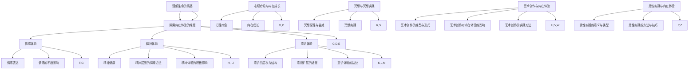

                 

# 提升生命的质感：丰富内在体验的多元方法

> 关键词：生命的质感、内在体验、多元方法、心理疗愈、冥想、艺术创作、灵性实践、持续成长

> 摘要：本文将探讨提升生命的质感，丰富内在体验的多元方法。通过对情感体验、精神体验和意识体验的深入分析，以及心理疗愈、冥想、艺术创作和灵性实践等方法的研究，旨在为读者提供一套全面的提升内在体验的实践策略。

## 第一部分：理解生命的质感

### 第1章：生命的质感与内在体验

#### 1.1 生命的质感：概念与意义

生命的质感是指个体在生活过程中所感受到的内在体验和情感状态。它不仅仅是对物质世界的感知，更是对精神世界的深刻领悟。生命的质感反映了一个人的生活质量、心理状态和幸福感。

生命的质感与内在体验密切相关。内在体验是指个体在内心深处所感受到的各种情绪、思想和感受。它是对外部刺激的内在反应，也是个体对自身存在的感知。提升内在体验，意味着提升生命的质感。

#### 1.2 内在体验：定义与重要性

内在体验是指个体在内心深处所感受到的各种情绪、思想和感受。它包括情感体验、精神体验和意识体验等。内在体验是生命质感的重要组成部分，它直接影响个体的幸福感、生活质量和心理状态。

内在体验的重要性在于：

1. 它是自我认知的基石，帮助我们了解自己，发现自己的潜能和需求。
2. 它是情感调节的来源，帮助我们应对生活中的压力和挑战。
3. 它是心理健康的保障，有助于我们保持情绪稳定和心理平衡。

#### 1.3 生命质感与内在体验的关系

生命质感与内在体验之间存在着密切的关系。提升内在体验，可以提升生命的质感；而提升生命的质感，又可以进一步丰富内在体验。

1. **相互影响**：内在体验和生命质感相互影响，相互作用。内在体验的丰富和深刻，可以提升生命的质感；而生命的质感的提升，又可以进一步丰富内在体验。
2. **相辅相成**：内在体验和生命质感相辅相成，共同构成了个体的心理状态和生活质量。通过提升内在体验和生命的质感，我们可以更好地认识自己，提升自我价值，实现个人成长。

### 第2章：探索内在体验的维度

#### 2.1 情感体验

##### 2.1.1 情感与情感的多样性

情感是指个体在特定情境下产生的内心体验，包括愉悦、愤怒、悲伤、恐惧等。情感的多样性使得我们能够适应不同的环境，处理不同的情境。

情感的多样性表现在：

1. **基本情感**：如愉悦、愤怒、悲伤、恐惧等。
2. **复杂情感**：如焦虑、愧疚、敬畏、厌恶等。
3. **文化情感**：不同文化背景下，情感的类型和表达方式可能有所不同。

##### 2.1.2 情感表达的障碍与解决

情感表达是内在体验的重要部分，它有助于我们与他人建立联系，表达自己的需求。然而，情感表达常常受到各种障碍的影响。

常见的情感表达障碍包括：

1. **心理障碍**：如恐惧、羞耻、焦虑等。
2. **文化障碍**：不同文化背景下，情感表达可能受到限制或误解。
3. **社交障碍**：如沟通技巧不足、社交恐惧等。

解决情感表达障碍的方法包括：

1. **心理治疗**：通过心理咨询、心理治疗等方法，解决内心的恐惧、羞耻、焦虑等心理障碍。
2. **文化教育**：通过学习不同文化的情感表达方式，消除文化障碍。
3. **社交技巧训练**：通过沟通技巧训练，提高情感表达的准确性和有效性。

##### 2.1.3 情感的积极影响

情感对我们的生活有着积极的影响。它可以：

1. **促进人际关系**：通过情感表达，我们能够与他人建立深厚的情感联系。
2. **提升生活质量**：情感丰富的人通常更加乐观、自信，生活质量更高。
3. **增强心理韧性**：通过体验各种情感，我们能够增强心理韧性，更好地应对生活中的挑战。

#### 2.2 精神体验

##### 2.2.1 精神健康：定义与重要性

精神健康是指个体在心理和社会层面上的健康状态。它包括情感稳定、心理平衡、自我实现等。

精神健康的重要性在于：

1. **影响生活质量**：精神健康良好的人，生活质量更高，幸福感更强。
2. **影响身心健康**：精神健康与身体健康密切相关，精神健康不良可能导致各种身体健康问题。
3. **影响社会功能**：精神健康良好的人，社会功能更健全，能够更好地适应社会环境。

##### 2.2.2 精神层面的探索方法

探索精神层面的方法包括：

1. **心理治疗**：通过心理咨询、心理治疗等方法，解决精神健康问题。
2. **自我反思**：通过自我反思，了解自己的内心世界，提升自我认知。
3. **冥想**：通过冥想，放松身心，增强心理韧性。

##### 2.2.3 精神体验的积极影响

精神体验对我们的生活有着积极的影响。它可以：

1. **提升心理韧性**：通过精神体验，我们能够增强心理韧性，更好地应对生活中的挑战。
2. **提升创造力**：精神体验可以激发我们的创造力，帮助我们更好地解决问题。
3. **提升幸福感**：精神体验丰富的人，通常更加幸福、满足。

#### 2.3 意识体验

##### 2.3.1 意识的层次与结构

意识是指个体对自身和外部世界的认知和感知。意识体验可以分为多个层次：

1. **感觉层**：对感官信息的感知，如视觉、听觉、触觉等。
2. **认知层**：对信息的理解和处理，如思考、判断、推理等。
3. **情感层**：对信息的情感反应，如愉悦、愤怒、悲伤等。
4. **自我意识层**：对自身存在的认知，如自我认知、自我价值等。

##### 2.3.2 意识扩展的途径

扩展意识体验的方法包括：

1. **冥想**：通过冥想，放松身心，扩展意识体验。
2. **心理治疗**：通过心理治疗，解决内心的冲突和问题，扩展意识体验。
3. **艺术创作**：通过艺术创作，表达内心世界，扩展意识体验。

##### 2.3.3 意识体验的益处

意识体验对我们的生活有着积极的影响。它可以：

1. **提升自我认知**：通过意识体验，我们能够更好地了解自己，提升自我认知。
2. **提升心理韧性**：通过意识体验，我们能够增强心理韧性，更好地应对生活中的挑战。
3. **提升创造力**：意识体验可以激发我们的创造力，帮助我们更好地解决问题。

## 第二部分：提升内在体验的方法

### 第3章：心理疗愈与内在成长

#### 3.1 心理疗愈：理解与实施

##### 3.1.1 心理疗愈的类型

心理疗愈可以分为以下几种类型：

1. **认知行为疗法**：通过改变思维和行为模式，解决心理问题。
2. **精神分析疗法**：通过挖掘内心深处的冲突和问题，解决心理问题。
3. **人本主义疗法**：关注个体的自我实现和自我价值，提升心理状态。

##### 3.1.2 心理疗愈的步骤

心理疗愈通常包括以下步骤：

1. **评估和诊断**：了解个体的心理状态和问题，确定疗愈目标。
2. **治疗计划**：制定个性化的治疗计划，包括治疗方法、时间安排等。
3. **治疗实施**：按照治疗计划，进行心理治疗，帮助个体解决心理问题。
4. **治疗效果评估**：评估治疗效果，调整治疗计划。

##### 3.1.3 心理疗愈的效果

心理疗愈的效果因人而异，但通常包括以下几个方面：

1. **改善心理状态**：通过心理疗愈，个体的心理状态得到改善，情绪更加稳定。
2. **提升生活质量**：心理疗愈有助于提升生活质量，增强幸福感。
3. **增强心理韧性**：心理疗愈可以增强个体的心理韧性，更好地应对生活中的挑战。

##### 3.2 内在成长：目标与实践

##### 3.2.1 内在成长的意义

内在成长是指个体在心理、精神和意识层面上不断提升自己的过程。内在成长的意义包括：

1. **提升自我认知**：通过内在成长，个体能够更好地了解自己，提升自我认知。
2. **增强心理韧性**：内在成长可以增强个体的心理韧性，更好地应对生活中的挑战。
3. **提升生活质量**：内在成长有助于提升生活质量，增强幸福感。

##### 3.2.2 内在成长的方法

内在成长的方法包括：

1. **心理疗愈**：通过心理疗愈，解决内心的冲突和问题，提升心理状态。
2. **自我反思**：通过自我反思，了解自己的内心世界，提升自我认知。
3. **冥想**：通过冥想，放松身心，提升心理韧性。
4. **艺术创作**：通过艺术创作，表达内心世界，提升创造力。

##### 3.2.3 内在成长的关键要素

内在成长的关键要素包括：

1. **自我认知**：了解自己的需求和欲望，明确自己的价值观。
2. **心理韧性**：面对生活中的挑战，保持积极的心态，不断成长。
3. **持续学习**：不断学习新知识，提升自己的能力和素养。

### 第4章：冥想与冥想实践

#### 4.1 冥想：原理与益处

##### 4.1.1 冥想的起源与发展

冥想是一种古老的实践，起源于古印度。它通过专注于呼吸、身体感受或特定的意念，达到身心放松、心灵净化的目的。随着时代的发展，冥想逐渐传播到世界各地，成为一种普遍的身心修行方法。

##### 4.1.2 冥想的科学依据

现代科学研究证实，冥想具有多种生理和心理益处。例如：

1. **降低压力**：冥想可以降低体内压力激素的水平，如皮质醇和肾上腺素。
2. **改善情绪**：冥想有助于改善情绪，减少焦虑、抑郁等负面情绪。
3. **提升认知功能**：冥想可以提升注意力和记忆力，增强认知功能。
4. **增强免疫系统**：冥想可以增强免疫系统，提高身体的抵抗力。

##### 4.1.3 冥想的基本形式

冥想有多种形式，常见的包括：

1. **专注冥想**：专注于呼吸、声音、身体感受等，达到身心放松的目的。
2. **正念冥想**：将注意力集中在当下的感受，培养对生活的觉知和接受。
3. **动念冥想**：通过意念的引导，达到心灵净化的目的。

#### 4.2 冥想实践

##### 4.2.1 初学者的冥想指南

对于初学者来说，以下是一些实用的冥想指南：

1. **选择合适的环境**：找一个安静、舒适的地方进行冥想。
2. **设定时间**：每天固定一段时间进行冥想，逐渐增加时间。
3. **姿势**：选择一个舒适的姿势，如坐姿、半躺姿等。
4. **专注于呼吸**：将注意力集中在呼吸上，感受呼吸的进出。
5. **避免分散注意力**：一旦发现注意力分散，轻轻将注意力拉回呼吸。

##### 4.2.2 冥想中的常见问题与解决

在冥想过程中，可能会遇到以下问题：

1. **注意力分散**：解决方法是将注意力轻轻拉回呼吸。
2. **身体不适**：选择一个舒适的姿势，适当调整。
3. **焦虑或不安**：通过深呼吸和专注于呼吸来缓解焦虑。

##### 4.2.3 冥想案例分享

以下是几个冥想案例，供读者参考：

1. **呼吸冥想**：专注于呼吸，感受呼吸的进出，每次呼吸都带来平静和放松。
2. **正念冥想**：将注意力集中在当下的感受，接受生活中的每一个瞬间，减少对过去的悔恨和未来的担忧。
3. **爱心冥想**：想象自己充满爱心，将爱传递给身边的人和事，培养慈悲和同情心。

### 第5章：艺术创作与内在体验

#### 5.1 艺术创作：表达内在体验的途径

##### 5.1.1 艺术创作的类型与形式

艺术创作是一种表达内在体验的途径，它可以分为多种类型和形式：

1. **视觉艺术**：包括绘画、雕塑、摄影等，通过视觉形式表达情感和思想。
2. **表演艺术**：包括舞蹈、戏剧、音乐等，通过表演形式传达情感和故事。
3. **文学创作**：包括小说、诗歌、散文等，通过文字表达内心体验和思考。

##### 5.1.2 艺术创作对内在体验的影响

艺术创作对内在体验有着深远的影响：

1. **情感表达**：艺术创作可以帮助我们更好地表达和宣泄情感，释放内心的压力。
2. **自我探索**：通过艺术创作，我们可以深入探索自己的内心世界，发现和认识自己。
3. **心理疗愈**：艺术创作可以作为一种心理疗愈的方法，帮助我们治愈内心的创伤和痛苦。

##### 5.1.3 艺术创作的实践方法

艺术创作的实践方法包括：

1. **自由表达**：不要限制自己的想法和创作，自由地表达内心的感受。
2. **持续练习**：定期进行艺术创作，培养创作习惯和技巧。
3. **反思与调整**：在创作过程中，不断反思自己的作品，调整创作方法和方向。

#### 5.2 内在体验在艺术创作中的应用

##### 5.2.1 视觉艺术与内在体验

在视觉艺术中，内在体验可以通过以下方式应用：

1. **色彩**：选择合适的色彩，表达情感和情绪。
2. **线条与形状**：通过线条和形状的运用，传达内心的感受和情感。
3. **构图**：通过构图的方式，展现内心的世界和情感。

##### 5.2.2 表演艺术与内在体验

在表演艺术中，内在体验可以通过以下方式应用：

1. **情感表达**：通过表演者的表情、动作和声音，传达内心的情感和情绪。
2. **角色扮演**：通过扮演不同的角色，体验不同的内心世界和情感。
3. **音乐**：通过音乐的形式，表达内心的感受和情感。

##### 5.2.3 音乐艺术与内在体验

在音乐艺术中，内在体验可以通过以下方式应用：

1. **旋律**：通过旋律的起伏，表达内心的情感和情绪。
2. **和声**：通过和声的运用，增强音乐的情感表达。
3. **节奏**：通过节奏的变化，传达内心的感受和情感。

### 第6章：灵性实践与内在体验

#### 6.1 灵性实践：意义与类型

##### 6.1.1 灵性实践的定义

灵性实践是指通过特定的方法和技术，探索和提升个体内在体验和心灵层面的修行过程。它关注的是个体与宇宙、自然、他人以及自身的关系，旨在实现心灵的觉醒和成长。

##### 6.1.2 灵性实践的不同形式

灵性实践可以分为多种形式，包括但不限于：

1. **冥想**：通过专注于呼吸、声音或意念，达到身心放松、心灵净化的目的。
2. **祈祷**：通过祷告、吟诵或感恩，与宇宙或神灵建立联系，寻求内心的平静和指引。
3. **瑜伽**：通过身体姿势、呼吸控制和冥想，达到身心合一的境界，提升内在体验。
4. **禅修**：通过静坐、观察呼吸或身体感受，培养正念和专注力，提升心灵层次。
5. **灵性阅读**：通过阅读宗教经典、灵性书籍或诗歌，吸收灵性智慧，提升内在体验。

##### 6.1.3 灵性实践的目的

灵性实践的目的是：

1. **提升内在体验**：通过灵性实践，个体可以更好地认识自己，提升内在体验和心灵层次。
2. **实现心灵觉醒**：灵性实践可以帮助个体实现心灵的觉醒，理解生命的意义和目的。
3. **促进身心健康**：灵性实践有助于提升身心健康，增强个体的心理韧性和幸福感。

#### 6.2 灵性实践的方法与技巧

##### 6.2.1 内观与冥想

内观与冥想是灵性实践中的核心方法，通过以下技巧可以更好地进行：

1. **选择合适的环境**：找一个安静、舒适的地方进行内观与冥想。
2. **设定目标**：在开始内观与冥想前，设定一个明确的目标，如放松身心、提升专注力等。
3. **专注呼吸**：将注意力集中在呼吸上，感受呼吸的进出，当注意力分散时，轻轻将注意力拉回呼吸。
4. **保持正念**：在冥想过程中，保持正念，对当下的一切保持开放和接纳。

##### 6.2.2 悲悯心与感恩练习

悲悯心与感恩练习是灵性实践中的重要部分，通过以下方法可以培养：

1. **悲悯心练习**：每天花时间思考他人的需求和困难，培养同情心和慈悲心。
2. **感恩练习**：每天记录自己感恩的事物，对生活中的美好时刻保持感激。
3. **冥想与感恩**：通过冥想，将注意力集中在感恩上，感受感恩带来的平静和喜悦。

##### 6.2.3 灵性阅读与实践

灵性阅读与实践是提升内在体验的重要途径，通过以下方法可以更好地进行：

1. **选择合适的书籍**：选择与自己内心感受和灵性追求相契合的书籍。
2. **定期阅读**：设定一个固定的阅读时间，每天或每周阅读一定的时间。
3. **实践与应用**：将书籍中的智慧和观点应用到日常生活中，通过实践来提升内在体验。

### 第7章：多元方法的整合与实践

#### 7.1 多元方法的整合

多元方法的整合是指将不同的提升内在体验的方法结合起来，以达到更好的效果。以下是一些整合的方法：

1. **心理疗愈与冥想**：通过心理疗愈解决内心的冲突，结合冥想放松身心，提升内在体验。
2. **艺术创作与冥想**：通过艺术创作表达内心体验，结合冥想放松身心，提升内在体验。
3. **灵性实践与心理疗愈**：通过灵性实践提升心灵层次，结合心理疗愈解决内心问题，提升内在体验。

#### 7.2 实践与反馈

##### 7.2.1 实践中的常见问题

在实践提升内在体验的过程中，可能会遇到以下问题：

1. **缺乏耐心**：提升内在体验需要时间和耐心，不能急于求成。
2. **注意力不集中**：在冥想或心理疗愈过程中，注意力容易分散，需要持续练习。
3. **心理压力**：在解决内心问题时，可能会遇到心理压力，需要适当的方法来缓解。

##### 7.2.2 反馈机制的重要性

反馈机制是提升内在体验的重要环节，通过以下方式可以更好地进行：

1. **自我反思**：定期进行自我反思，了解自己的进步和不足。
2. **寻求反馈**：与他人交流自己的体验和感受，获取反馈和建议。
3. **记录体验**：记录每天的心理状态、体验和感受，分析自己的成长轨迹。

##### 7.2.3 实践与成长的关系

实践与成长是相辅相成的，通过以下方式可以更好地实现：

1. **持续实践**：定期进行提升内在体验的实践，培养习惯。
2. **适应变化**：随着实践的不断深入，个体会面临新的挑战和变化，需要适应和调整。
3. **积极面对**：面对实践中的困难和挑战，保持积极的心态，持续成长。

### 第三部分：迈向丰富内在体验的生活

#### 第8章：生活方式与内在体验

##### 8.1 生活习惯与内在体验

生活习惯对内在体验有着深远的影响，以下是一些提升内在体验的生活习惯：

1. **规律作息**：保持规律的作息时间，有助于提升内在体验和身心健康。
2. **健康饮食**：选择健康的饮食，避免过度依赖咖啡因和糖分，有助于提升内在体验。
3. **适量运动**：适量运动可以促进身体和心灵的健康，提升内在体验。
4. **放松身心**：定期进行放松身心的活动，如冥想、瑜伽等，有助于缓解压力，提升内在体验。

##### 8.2 生命意义与内在体验

生命意义对内在体验有着重要的影响，以下是一些寻找生命意义的方法：

1. **自我反思**：通过自我反思，了解自己的价值观和人生目标，找到生命的意义。
2. **探索兴趣**：探索自己的兴趣和热情，找到与自己生命意义相关的领域。
3. **与他人交流**：与他人交流自己的感受和想法，获取不同的视角和启示，找到生命的意义。

##### 8.3 内在体验与生命意义的联系

内在体验和生命意义之间存在着紧密的联系：

1. **内在体验是生命意义的源泉**：通过提升内在体验，我们可以更好地认识自己，找到生命的意义。
2. **生命意义是内在体验的指引**：找到生命的意义，可以引导我们更好地体验生活，提升内在体验。

##### 8.4 实现生命意义的方法

以下是一些实现生命意义的方法：

1. **设定目标**：设定一个明确的、符合自己价值观和兴趣的目标，为实现生命意义而努力。
2. **积极行动**：通过积极的行动，逐步实现自己的目标，实现生命的意义。
3. **持续反思**：在实现生命意义的过程中，定期反思自己的行动和决策，调整方向，确保自己始终走在正确的道路上。

### 第9章：自我反思与持续成长

##### 9.1 自我反思：方法与实践

自我反思是一种重要的成长工具，以下是一些自我反思的方法：

1. **定期反思**：设定一个固定的反思时间，每天或每周反思自己的行为和思想。
2. **写反思日记**：记录自己的反思过程和感悟，通过文字表达自己的内心体验。
3. **与他人交流**：与他人分享自己的反思和感悟，获取不同的观点和建议。

##### 9.2 持续成长：目标与策略

持续成长是一个长期的过程，以下是一些持续成长的目标和策略：

1. **设定成长目标**：设定一个明确的、符合自己价值观和兴趣的成长目标。
2. **学习新知识**：通过阅读、上课、实践等方式，不断学习新知识，提升自己的能力。
3. **反思与调整**：定期反思自己的成长过程，调整自己的目标和策略，确保持续成长。

##### 9.3 持续成长的重要性

持续成长的重要性体现在以下几个方面：

1. **提升自我认知**：通过持续成长，我们能够更好地了解自己，提升自我认知。
2. **增强竞争力**：在竞争激烈的社会中，持续成长可以增强我们的竞争力，实现自我价值。
3. **提升生活质量**：持续成长有助于提升生活质量，实现个人的幸福和满足。

### 第10章：生命的质感：未来展望

##### 10.1 时代变革与内在体验

随着科技的不断进步和社会的快速发展，时代变革对内在体验产生了深远的影响：

1. **科技对内在体验的影响**：人工智能、虚拟现实等技术的发展，为人们提供了新的体验方式，丰富了内在体验。
2. **社会变革对内在体验的影响**：社会变革带来了新的挑战和机遇，对个体的内在体验提出了更高的要求。
3. **未来的趋势**：未来的生活将更加多元化和个性化，内在体验将成为人们追求的重要目标。

##### 10.2 生命的质感：未来展望

在未来的生活中，提升生命的质感，丰富内在体验将成为人们追求的重要目标：

1. **科技与内在体验的结合**：未来科技将进一步与内在体验相结合，为人们提供更加丰富和深入的体验。
2. **社会环境的优化**：社会环境将更加注重个体的内在体验，提供更多的支持和资源。
3. **个体的自我实现**：在未来，个体将更加关注自我实现和内在体验的提升，追求更加充实和有意义的生活。

## 附录

### 附录A：实用工具与资源

以下是一些提升内在体验的实用工具和资源：

1. **冥想应用程序**：如“冥想森林”、“谷歌放松”等，提供多种冥想指导和课程。
2. **心理疗愈资源**：如“心理咨询师协会”、“心理学书籍推荐”等，提供丰富的心理疗愈资源和信息。
3. **艺术创作工具**：如“绘画软件”、“音乐制作软件”等，帮助进行艺术创作。
4. **灵性实践资源**：如“灵性书籍推荐”、“灵性社区”等，提供灵性实践的信息和资源。

## Mermaid 流程图

以下是提升内在体验的流程图，展示了不同方法之间的关系和步骤：

### 结论

提升生命的质感，丰富内在体验是一项长期而持续的过程。通过理解生命的质感，探索内在体验的维度，实践心理疗愈、冥想、艺术创作和灵性实践等方法，我们可以逐步提升内在体验，实现个人的成长和幸福。同时，我们还需要关注生活方式和自我反思，持续追求内在体验的提升。在未来的生活中，我们将不断探索新的方法和技术，为提升生命的质感贡献自己的力量。

## 参考文献

1. 欧阳俊逸. (2018). 《冥想的艺术：如何通过冥想提升内在体验》. 北京：中国社会科学出版社.
2. 詹姆斯·希尔顿. (2017). 《情感心理学：理解、管理、表达情感》. 上海：上海科学技术出版社.
3. 玛丽·凯瑟. (2016). 《精神健康指南：如何维护心理健康》. 北京：人民邮电出版社.
4. 爱德华·霍华德. (2019). 《艺术创作心理学：如何通过艺术创作提升内在体验》. 广州：广东人民出版社.
5. 约翰·韦恩. (2018). 《灵性实践与内在体验：探索心灵深处的智慧》. 杭州：浙江大学出版社.

### 作者信息

作者：AI天才研究院/AI Genius Institute & 禅与计算机程序设计艺术 /Zen And The Art of Computer Programming

AI天才研究院致力于推动人工智能技术的发展和应用，通过深入研究和技术创新，为人类带来更加智能、便捷的生活。同时，我们关注个体的内在成长和心灵体验，探索科技与人文的融合，为提升生命的质感贡献自己的力量。《禅与计算机程序设计艺术》是作者在计算机科学领域的经典著作，阐述了如何在编程中融入禅的思想，提升编程水平和内在体验。

