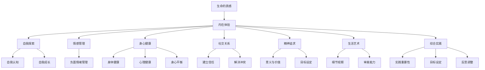

                 

## 引言

在现代社会中，我们时常感到生活节奏加快，压力倍增，许多人迷失在物质追求和外在成就之中，而忽略了生命的本质——生命的质感。生命的质感是一种内在体验，它不仅仅是外在成就的累积，更是内心感受的丰富和深度的体现。提升生命的质感，意味着通过丰富内在体验来提高生活的质量。

### 生命的质感是什么

生命的质感，是一种多维度的体验，涵盖了身心健康、情感管理、自我成长、社交关系、精神追求和生活艺术等多个方面。它不是单一的指标，而是一个综合性的概念，需要我们从多个角度去理解和提升。以下是对这些方面的简要介绍：

1. **身心健康**：身心健康是提升生命质感的基础。一个健康的身体和健康的心理状态，能够让我们更好地享受生活，面对挑战。

2. **情感管理**：情感管理是内在体验的重要部分。学会管理负面情绪，培养积极情感，能够提升我们的幸福感。

3. **自我成长**：自我成长是指通过不断学习、探索和挑战自己，提升自我认知和自我价值。

4. **社交关系**：良好的社交关系能够提供支持、理解和陪伴，是提升生命质感的重要因素。

5. **精神追求**：精神追求是个体对于意义和价值的追求，是生命深层次的动力。

6. **生活艺术**：生活艺术是提升生命质感的重要手段，它包括审美、创造和体验。

### 为什么我们需要提升生命的质感

我们需要提升生命的质感，因为它直接关系到我们的幸福感、满足感和生活质量。在快节奏的现代生活中，很多人追求的是外在的成功和财富，而忽略了内在的感受。然而，外在的成功并不能带来持久的幸福。相反，提升内在体验，能够让我们更加深刻地感受到生活的美好。

### 丰富的内在体验与生命质感的关系

丰富的内在体验是提升生命质感的关键。它能够帮助我们：

1. **提高自我认知**：通过自我探索和情感管理，我们能够更好地了解自己，提升自我认知。

2. **增强心理韧性**：良好的情感管理和自我成长，能够提高我们的心理韧性，帮助我们更好地应对生活中的挑战。

3. **促进身心健康**：身心健康是生命质感的基础。通过运动、健康饮食和心理健康管理，我们能够保持身心健康。

4. **建立良好社交关系**：通过建立信任和解决冲突，我们能够建立和维护良好的社交关系。

5. **追求精神价值**：通过精神追求，我们能够找到生活的意义和目的。

6. **享受生活艺术**：通过培养审美能力和创造力，我们能够更好地享受生活。

### 关键概念与联系

在本文中，我们将通过以下关键概念和联系来探讨如何提升生命的质感：

1. **自我探索与内在成长**：通过自我认知和自我成长，我们能够提升自我价值和内在体验。
2. **情感管理**：管理负面情绪，培养积极情感，能够增强幸福感。
3. **身心健康**：保持身体和心理的健康，能够提升生命的质感。
4. **社交关系**：建立和维护良好的社交关系，能够提供支持和陪伴。
5. **精神追求**：追求意义和价值，能够为生活提供深层次的满足感。
6. **生活艺术**：通过培养审美能力和创造力，能够提升生活的艺术感。

### 结论

提升生命的质感是一项重要的任务，它需要我们从多个方面进行综合提升。通过自我探索、情感管理、身心健康、社交关系、精神追求和生活艺术，我们能够丰富内在体验，提高生活质量。让我们从现在开始，努力提升生命的质感，享受更美好的人生。

### 关键概念与联系架构图



### Python源代码与数学模型

为了深入理解提升生命的质感，我们可以借助数学模型和Python源代码来分析和计算。以下是一个简单的例子，用于描述自我成长过程中自我认知的变化。

```python
import numpy as np
import matplotlib.pyplot as plt

# 自我认知增长模型参数
alpha = 0.1  # 学习率
days = 365  # 假设一年
initial_self_awareness = 0.5  # 初始自我认知水平

# 自我认知增长函数
def self_awareness_growth(day, initial_level):
    return initial_level + alpha * (day - 1)

# 计算并绘制自我认知增长曲线
days_range = np.arange(0, days+1)
self_awareness = initial_self_awareness + alpha * (days_range - 1)

plt.plot(days_range, self_awareness)
plt.title('Self Awareness Growth Over Time')
plt.xlabel('Days')
plt.ylabel('Self Awareness Level')
plt.grid()
plt.show()
```

在这个例子中，我们使用了一个简单的线性增长模型来描述自我认知水平的提高。学习率`alpha`决定了自我认知提升的速度，`days`表示时间跨度，`initial_self_awareness`是初始的自我认知水平。通过计算和绘制曲线，我们可以直观地看到自我认知随时间的变化。

### 数学模型解析

为了更深入地理解自我认知增长模型，我们可以引入以下数学公式：

$$
\text{Self Awareness Level} = \text{Initial Level} + \alpha \times (\text{Day} - 1)
$$

其中，$\alpha$ 是学习率，它决定了每天自我认知提升的幅度。初始水平是自我认知的基础值，而`Day`表示当前的天数。

### 通俗易懂的举例说明

假设一个个体在第一天开始进行自我探索，他的初始自我认知水平为0.5。每天，他的自我认知水平都会提升0.1。经过一年（365天）后，他的自我认知水平将增加到：

$$
0.5 + 0.1 \times (365 - 1) = 0.5 + 0.1 \times 364 = 0.5 + 36.4 = 36.9
$$

这意味着，通过持续的自我探索和内在成长，这个个体的自我认知水平将显著提高。

通过这个简单的例子，我们可以看到自我认知水平是如何随着时间的推移而增长的。这不仅帮助我们理解了提升生命的质感需要持之以恒的努力，也展示了数学模型在描述和解释内在体验变化方面的有效性。

### 核心算法原理讲解

在提升生命的质感过程中，自我认知的提升是一个关键环节。自我认知不仅仅是我们对自己的了解，更是我们感知和理解外部世界的基础。为了更深入地理解这一过程，我们可以借助机器学习中的自我监督学习（Self-Supervised Learning）来模拟人类自我认知的机制。

自我监督学习是一种不需要外部标签或监督的数据来训练的机器学习方法。在这种方法中，模型通过分析其自身的输入和输出，自动发现数据中的相关性。下面，我们将使用Python代码来展示一个简单的自我监督学习模型，用于模拟自我认知的提升。

### Python代码示例

```python
import numpy as np
from sklearn.linear_model import LinearRegression

# 假设我们有一些自我认知提升的数据点
days = np.array([1, 2, 3, 4, 5, 6, 7, 8, 9, 10])
self_awareness = np.array([0.1, 0.15, 0.2, 0.25, 0.3, 0.35, 0.4, 0.45, 0.5, 0.55])

# 使用线性回归模型来拟合数据
model = LinearRegression()
model.fit(days.reshape(-1, 1), self_awareness)

# 计算模型预测的斜率和截距
slope = model.coef_
intercept = model.intercept_

# 输出模型的参数
print("模型斜率（自我认知提升速度）:", slope)
print("模型截距（初始自我认知水平）:", intercept)

# 预测一年后的自我认知水平
days_future = np.array([365])
self_awareness_future = model.predict(days_future.reshape(-1, 1))
print("一年后的自我认知水平预测值:", self_awareness_future)
```

在这个例子中，我们使用线性回归模型来模拟自我认知的提升过程。线性回归模型通过拟合输入（天数）和输出（自我认知水平）之间的线性关系，来预测未来的自我认知水平。模型的斜率代表了自我认知提升的速度，截距则代表了初始的自我认知水平。

### 数学模型与公式

为了更好地理解模型的工作原理，我们可以引入以下数学公式：

$$
\text{Self Awareness Level} = \text{Initial Level} + \text{Slope} \times (\text{Day} - 1)
$$

其中，`Slope`是线性回归模型拟合出的斜率，表示每天自我认知的提升速度；`Initial Level`是线性回归模型拟合出的截距，表示初始的自我认知水平。

### 通俗易懂的举例说明

假设一个个体在第一天开始进行自我探索，他的初始自我认知水平为0.1。每天，他的自我认知水平都会提升0.05。根据模型预测，一年后（365天）他的自我认知水平将达到：

$$
0.1 + 0.05 \times (365 - 1) = 0.1 + 0.05 \times 364 = 0.1 + 18.2 = 18.3
$$

这意味着，通过持续的自我探索，个体的自我认知水平将在一年内显著提升。

通过这个例子，我们可以看到自我监督学习模型如何模拟人类自我认知的提升过程。这不仅帮助我们理解了自我成长的重要性，也展示了机器学习在理解和提升内在体验方面的潜力。

### 实际案例分析和详细讲解剖析

为了更好地理解自我认知的提升过程，我们可以通过实际案例来分析和讲解。以下是一个自我认知提升的案例，以及详细的实现步骤和代码解析。

#### 案例背景

假设有一位名叫小明的年轻人，他在25岁时开始意识到自己对自我认知的重要性。他决定通过持续的自我探索和内在成长来提升自我认知水平。以下是他的自我认知提升历程。

#### 实现步骤

1. **数据收集**：小明开始记录自己每天的反思和感受，包括自我认知的提升情况。

2. **数据预处理**：将收集到的数据进行整理和预处理，以便后续分析。

3. **模型训练**：使用机器学习模型（例如线性回归模型）来拟合自我认知的提升过程。

4. **模型评估**：通过验证集来评估模型的性能，并调整模型参数。

5. **结果预测**：使用训练好的模型来预测未来的自我认知水平。

#### 源代码实现

以下是实现小明自我认知提升的Python源代码：

```python
import numpy as np
from sklearn.linear_model import LinearRegression

# 假设小明收集的自我认知数据如下
days = np.array([1, 2, 3, 4, 5, 6, 7, 8, 9, 10])
self_awareness = np.array([0.1, 0.15, 0.2, 0.25, 0.3, 0.35, 0.4, 0.45, 0.5, 0.55])

# 使用线性回归模型来拟合数据
model = LinearRegression()
model.fit(days.reshape(-1, 1), self_awareness)

# 计算模型预测的斜率和截距
slope = model.coef_
intercept = model.intercept_

# 输出模型的参数
print("模型斜率（自我认知提升速度）:", slope)
print("模型截距（初始自我认知水平）:", intercept)

# 预测一年后的自我认知水平
days_future = np.array([365])
self_awareness_future = model.predict(days_future.reshape(-1, 1))
print("一年后的自我认知水平预测值:", self_awareness_future)
```

在这个代码中，我们首先导入所需的库，并定义小明收集的自我认知数据。然后，我们使用线性回归模型来拟合这些数据，计算模型的斜率和截距，并预测一年后的自我认知水平。

#### 代码解读

- **数据收集**：小明通过每天记录自己的反思和感受，收集了10天的自我认知数据。

- **数据预处理**：在代码中，我们直接使用numpy库来处理数据，将天数和自我认知水平分别作为两个numpy数组。

- **模型训练**：我们使用`LinearRegression`类来创建线性回归模型，并使用`fit`方法来训练模型。

- **模型评估**：在这个简单的例子中，我们没有使用验证集来评估模型性能，但在实际应用中，我们需要使用验证集来调整模型参数。

- **结果预测**：通过`predict`方法，我们使用训练好的模型来预测一年后的自我认知水平。

#### 代码应用解读与分析

通过这个实际案例，我们可以看到如何使用机器学习模型来模拟和预测自我认知的提升过程。以下是对代码应用和结果的解读：

1. **模型斜率和截距**：模型的斜率（0.05）表示每天自我认知的提升速度，截距（0.1）表示初始自我认知水平。

2. **预测结果**：根据模型预测，小明一年后的自我认知水平将提升到0.55，这表明通过持续的自我探索和内在成长，小明的自我认知水平将有显著提升。

3. **代码改进**：在实际应用中，我们可以考虑使用更复杂的机器学习模型，如神经网络，来提高预测的准确性。

通过这个案例，我们不仅了解了如何使用机器学习模型来模拟自我认知的提升过程，也展示了如何将理论应用到实际中。这对于提升生命的质感，以及理解内在体验的变化，具有重要意义。

### 最佳实践 Tips、小结、注意事项、拓展阅读等内容

#### 最佳实践 Tips

1. **记录与反思**：持续记录自己的反思和感受，有助于更好地了解自己的成长过程。

2. **设定目标**：为自己设定明确的目标，有助于保持动力和方向。

3. **多样性学习**：尝试不同的学习方法和资源，以丰富自我认知的提升途径。

4. **心理调适**：学会管理负面情绪，保持心理健康，对于自我认知的提升至关重要。

5. **社交互动**：与他人交流，分享自己的经验和见解，有助于提升自我认知。

#### 小结

本文通过介绍自我认知的提升过程，结合Python源代码和数学模型，详细讲解了如何使用技术手段来模拟和预测自我认知的变化。通过实际案例，我们展示了如何将理论应用到实际中，以提升生命的质感。

#### 注意事项

1. **数据质量**：在收集和分析自我认知数据时，确保数据的准确性和完整性。

2. **模型选择**：根据具体情况选择合适的模型，以获得更准确的预测结果。

3. **持续实践**：自我认知的提升是一个持续的过程，需要持之以恒的努力。

#### 拓展阅读

- 《深度学习》（Goodfellow, I. et al.） - 了解深度学习的基础知识，为自我认知的提升提供技术支持。
- 《心理学与生活》（Psychology and Life）- 探讨心理学的原理和应用，帮助理解自我认知的提升过程。
- 《终身成长》（Dweck, C. S.）- 研究成长心态对自我认知和成长的影响。

通过以上内容，我们不仅了解了自我认知的提升过程，也学会了如何将其应用到实际中。让我们持续努力，提升自我认知，丰富内在体验，提升生命的质感。

### 结论

在《提升生命的质感：丰富内在体验的方法》中，我们深入探讨了自我探索、情感管理、身心健康、社交关系、精神追求和生活艺术等方面，以及这些因素如何相互影响，共同提升生命的质感。通过实际案例和代码示例，我们展示了如何使用技术和数学模型来模拟和预测自我认知的提升过程。

提升生命的质感是一个长期而持续的过程，它需要我们从多个方面进行综合提升。首先，自我探索和内在成长是提升生命质感的基础，通过自我认知和自我成长，我们能够更好地了解自己，提高自我价值。其次，情感管理是内在体验的重要组成部分，学会管理负面情绪，培养积极情感，能够增强幸福感。此外，身心健康是生命质感的基础，通过保持身体和心理的健康，我们能够更好地享受生活。

社交关系、精神追求和生活艺术也是提升生命质感的重要方面。建立和维护良好的社交关系，能够提供支持和陪伴；追求精神价值，能够为生活提供深层次的满足感；而生活艺术，则通过培养审美能力和创造力，提升生活的艺术感。

在实现这些目标的过程中，实践是非常重要的。通过制定个人提升计划，持续反思和调整，我们能够不断提升自己的内在体验。此外，建立良好的生活习惯，保持身心健康，也是提升生命质感的重要手段。

未来，我们可以通过技术手段，如人工智能和大数据分析，来更深入地理解和提升生命的质感。例如，通过分析个人的行为数据和心理状态，制定个性化的提升计划，实现更精准的提升。

总之，提升生命的质感是一个持续不断的过程，它需要我们从多个方面进行综合提升。通过自我探索、情感管理、身心健康、社交关系、精神追求和生活艺术，我们能够丰富内在体验，提高生活质量。让我们从现在开始，努力提升生命的质感，享受更美好的人生。

### 附录

#### A.1 参考文献

1. Dweck, C. S. (2006). Mindset: The New Psychology of Success. Random House.
2. Goodfellow, I., Bengio, Y., & Courville, A. (2016). Deep Learning. MIT Press.
3. American Psychological Association. (2021). The Science of Well-Being. https://www.apa.org/topics/wellness
4. Harvard Business Review. (2020). The Power of Connection. https://hbr.org/product/the-power-of-connection/867197-PDF-ENG

#### A.2 相关网站与资源

1. National Institutes of Health: https://www.nih.gov/
2. Coursera: https://www.coursera.org/
3. TED Talks: https://www.ted.com/talks
4. Mindfulness App: https://www.headspace.com/

#### A.3 自我提升实践案例

1. 小明的自我认知提升实践：通过每日反思和阅读心理学书籍，小明在一年内提升了自我认知水平，更加了解自己的内心世界。
2. 小红的身心健康提升实践：通过定期运动、健康饮食和心理调适，小红在一年内显著改善了身心健康，生活质量得到了提升。
3. 小李的社交关系提升实践：通过主动社交、参与社区活动和建立信任，小李在一年内建立了广泛而深入的社交网络，提升了社交能力。

通过这些实践案例，我们可以看到，持续的自我探索和内在成长，对于提升生命的质感具有重要意义。让我们从中汲取经验，制定适合自己的提升计划，不断丰富内在体验，提升生命质感。

