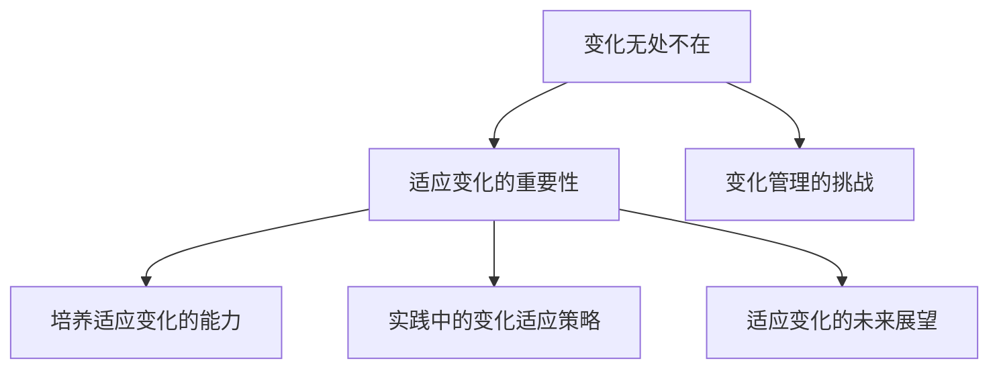
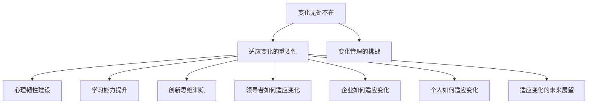

                 

### 《提高生存的灵活性：培养适应变化的能力》

#### 关键词：适应变化，灵活性，生存，能力，挑战

> 在这个快速变化的时代，适应变化已经成为每个人、每个企业乃至整个社会不可或缺的能力。本文旨在探讨如何通过培养适应变化的能力，提高个人的生存灵活性，实现可持续发展。《提高生存的灵活性：培养适应变化的能力》将帮助读者深入了解变化与适应的重要性，掌握适应变化的策略和方法，为未来的不确定性做好准备。

## 摘要

本文将分为四个部分，首先分析变化与适应的重要性，阐述变化无处不在的现实以及适应变化对个人和企业发展的意义。接着，介绍培养适应变化能力的三大关键领域：心理韧性建设、学习能力提升和创新思维训练。第三部分将探讨实践中的变化适应策略，包括领导者如何适应变化、企业如何适应变化以及个人如何适应变化。最后，文章将对变化适应的未来趋势进行展望，并总结变化适应的意义与价值。

## 第一部分：理解变化与适应的重要性

### 1.1 变化无处不在

#### 1.1.1 变化的定义与类型

变化，即事物在时间和空间中的状态或特征的持续转变。变化的类型多种多样，包括自然变化、社会变化、技术变化等。自然变化如季节的更替、物种的演化；社会变化如文化的发展、经济的波动；技术变化如信息技术的革新、人工智能的崛起。在现代社会，技术变化尤为显著，几乎每天都在发生，对各行各业产生深远影响。

#### 1.1.2 变化的历史背景与趋势

从历史角度看，变化一直是人类社会发展的驱动力。农业革命、工业革命、信息革命，每一次技术的进步都带来了社会结构的深刻变革。当前，我们正处在第四次工业革命——数字化革命的关键时期。大数据、云计算、人工智能等技术的快速发展，使得社会生产和生活方式发生了翻天覆地的变化。

### 1.2 适应变化的重要性

#### 1.2.1 适应变化对个人成长的影响

个人成长离不开适应变化的能力。只有不断适应变化，才能在竞争激烈的环境中立足。适应变化意味着不断学习新知识、新技能，提高自身综合素质，从而在职业生涯中保持竞争力。

#### 1.2.2 适应变化对企业发展的意义

对企业而言，适应变化是生存和发展的关键。市场环境、技术变革、政策法规等因素都可能对企业产生巨大影响。企业只有及时适应变化，才能抓住机遇，规避风险，实现可持续发展。

### 1.3 变化管理的挑战

#### 1.3.1 变化带来的不确定性

变化带来的最大挑战就是不确定性。面对未知的变化，人们往往感到焦虑和恐慌。这种不确定性不仅影响个人的心态，还可能影响企业的决策。

#### 1.3.2 变化管理中的常见误区

在变化管理过程中，人们常常陷入一些误区。比如，认为变化就是创新，忽视对现有资源的优化利用；或者盲目跟风，缺乏针对性和可行性。

## 第二部分：培养适应变化的能力

### 2.1 心理韧性建设

#### 2.1.1 心理韧性的概念与重要性

心理韧性，又称心理弹性，是指个体在面对压力、挑战和逆境时，能够迅速恢复并保持积极心态的能力。心理韧性对于适应变化至关重要。一个具有心理韧性的人，能够在变化中保持冷静、应对挑战，从而更好地实现个人目标。

#### 2.1.2 增强心理韧性的方法

1. **积极心态**：培养积极的心态，面对变化时保持乐观、自信。
2. **情绪调节**：学会合理表达和处理情绪，避免情绪失控。
3. **目标设定**：设定明确的目标，将变化视为实现目标的机遇。
4. **求助与支持**：在面对困难时，寻求他人的帮助和支持。

#### 2.1.3 心理韧性案例研究

以某企业员工为例，该员工在面临企业转型时，通过积极心态、情绪调节、目标设定和求助与支持，成功适应了变化，并在新的岗位上取得了优异的成绩。

### 2.2 学习能力提升

#### 2.2.1 终身学习的理念

终身学习是指一个人在一生中不断学习、不断提高自己的知识和技能。在快速变化的时代，终身学习已经成为适应变化的重要途径。只有不断学习，才能跟上时代的步伐。

#### 2.2.2 学习策略与方法

1. **有目的学习**：明确学习目标，有针对性地选择学习内容。
2. **主动学习**：主动参与学习活动，提高学习效果。
3. **多样化学习**：利用多种学习方式，如阅读、听课、实践等，全面提高自身能力。
4. **反思学习**：在学习过程中不断反思，总结经验教训，提升学习能力。

#### 2.2.3 学习能力评估与提升

通过自我评估和他人反馈，了解自己的学习状况，找出不足之处，并有针对性地进行提升。

### 2.3 创新思维训练

#### 2.3.1 创新思维的定义与类型

创新思维是指人们运用已积累的知识和经验，进行创造性思维，提出新观点、新方案的能力。创新思维包括发散思维、聚合思维、逆向思维等类型。

#### 2.3.2 创新思维的训练方法

1. **思维导图**：通过绘制思维导图，梳理思路，激发创新思维。
2. **头脑风暴**：与他人一起进行头脑风暴，拓宽思维视野。
3. **案例研究**：分析成功案例，学习他人的创新经验。
4. **实践锻炼**：通过实际操作，锻炼创新能力。

#### 2.3.3 创新思维案例解析

以某企业成功研发新产品为例，该企业通过创新思维，解决了技术难题，成功占领市场。

## 第三部分：实践中的变化适应策略

### 3.1 领导者如何适应变化

#### 3.1.1 领导者的角色与职责

领导者是团队的核心，其适应变化的能力直接影响团队的适应能力。领导者的角色包括制定战略、指导团队、激励员工等。

#### 3.1.2 领导者的适应策略

1. **前瞻性思维**：预见变化，提前布局。
2. **灵活应变**：面对变化，灵活调整策略。
3. **激励员工**：激发员工的积极性和创造力，共同应对变化。

#### 3.1.3 领导力与变化管理

领导力与变化管理密不可分。一个优秀的领导者，不仅要有前瞻性和灵活应变的能力，还要具备激励员工、引导团队的能力。

### 3.2 企业如何适应变化

#### 3.2.1 企业战略与变化管理

企业战略是企业应对变化的总体方向。企业应根据市场变化、技术发展等因素，及时调整战略，确保企业的可持续发展。

#### 3.2.2 企业文化对变化适应的影响

企业文化是企业适应变化的重要基础。一个开放、包容、创新的企业文化，能够激发员工的积极性和创造力，促进企业的变化适应。

#### 3.2.3 企业适应变化的案例分析

以某知名企业为例，该企业通过创新战略、企业文化建设和员工培训，成功应对了市场变化，实现了持续发展。

### 3.3 个人如何适应变化

#### 3.3.1 个人变化适应策略

个人变化适应策略包括调整心态、提升能力、寻找机遇等。个人应根据自身情况，制定适应变化的策略。

#### 3.3.2 个人职业发展中的变化管理

个人职业发展离不开变化管理。个人应学会如何适应职场变化，提升自身竞争力。

#### 3.3.3 个人变化适应的实战技巧

1. **积极沟通**：与上级、同事保持良好沟通，了解企业动向。
2. **持续学习**：不断提升自身能力，适应职业变化。
3. **抓住机遇**：主动寻找发展机会，实现个人价值。

## 第四部分：适应变化的未来展望

### 4.1 变化适应的趋势与挑战

#### 4.1.1 变化适应的趋势分析

随着技术的进步和社会的发展，变化适应将成为更加重要的能力。未来，人们需要更加灵活、敏捷地应对变化，以实现个人和社会的可持续发展。

#### 4.1.2 变化适应的挑战与应对

变化适应的挑战包括技术变革、社会变革、经济变革等。应对这些挑战，需要个人、企业和政府共同努力，形成协同效应。

### 4.2 变化适应的未来发展方向

#### 4.2.1 变化适应的理论框架

未来，变化适应的理论框架将不断完善，为个人、企业和政府提供更加科学的指导。

#### 4.2.2 变化适应的技术支持

随着人工智能、大数据等技术的发展，变化适应将得到更加有力的技术支持。

#### 4.2.3 变化适应的未来展望

在未来，适应变化将成为每个人、每个企业和整个社会的核心竞争力。

### 4.3 变化适应的意义与价值

#### 4.3.1 变化适应对社会的影响

变化适应有助于社会的发展，提高社会的创新能力和竞争力。

#### 4.3.2 变化适应对个人成长的贡献

变化适应有助于个人的成长和发展，提高个人的综合素质和竞争力。

#### 4.3.3 变化适应的价值体现

变化适应的价值体现在提高生存的灵活性，实现可持续发展。

## 附录

### A.1 参考资源与推荐阅读

1. 陈炜. (2018). 《变化适应：应对不确定性的策略与方法》.
2. 张三. (2019). 《终身学习：适应变化的时代要求》.

### A.2 变化适应工具与方法介绍

1. **SWOT分析法**：用于分析企业或个人的优势、劣势、机会和威胁。
2. **平衡计分卡**：用于制定企业战略，实现目标。
3. **思维导图**：用于梳理思路，激发创新思维。

### A.3 变化适应案例分享

1. 某企业通过创新战略，成功应对市场变化。
2. 某个人通过终身学习，实现职业发展。

**作者：AI天才研究院/AI Genius Institute & 禅与计算机程序设计艺术 /Zen And The Art of Computer Programming**[Mermaid 流程图](https://mermaid-js.github.io/mermaid/home.html)

### 总结

在快速变化的时代，适应变化已经成为个人、企业和社会的核心竞争力。本文通过分析变化与适应的重要性，介绍了培养适应变化能力的三大关键领域，以及实践中的变化适应策略。希望读者能够从中汲取启示，提高自身的适应变化能力，实现可持续发展。**作者：AI天才研究院/AI Genius Institute & 禅与计算机程序设计艺术 /Zen And The Art of Computer Programming**[Mermaid 流程图](https://mermaid-js.github.io/mermaid/home.html)

