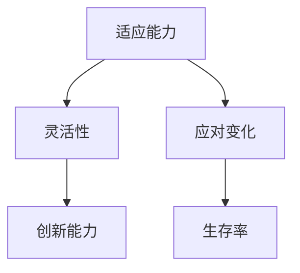

                 

# 提高生存的灵活性：培养适应变化的能力

## 关键词
- 适应能力
- 灵活性
- 创新思维
- 变化应对策略
- 技术创新
- 职业发展

## 摘要
在快速变化的社会和技术环境中，适应变化成为了提高生存能力的关键。本文通过分析适应变化的重要性，探讨了如何培养适应性思维和应对变化的策略。同时，本文还深入探讨了技术创新在适应变化中的作用，以及职业和生活变化中的适应策略。通过本文的阅读，读者将获得提高生存灵活性的实用方法和深刻见解。

### 第一部分：理解适应变化的重要性

#### 第1章：生存的灵活性：时代的需求

#### 1.1 适应变化的意义
适应变化意味着能够迅速调整自己的思维和行为，以应对外界环境的变化。在自然界中，适应能力强的物种更容易生存和繁衍。同样，在人类社会，适应变化的能力与生存率密切相关。随着环境的变化，只有那些能够快速适应的个体或组织才能在激烈的竞争中脱颖而出。

#### 1.2 适应变化的重要性
社会变迁和技术革新不断推动着我们的生活方式和工作方式。在这个不确定的时代，适应变化的重要性愈发凸显。个人发展也离不开适应能力，只有具备适应能力，才能在不断变化的环境中找到自己的位置，实现个人价值。

#### 1.3 适应变化与生存的灵活性
生存的灵活性指的是个体或组织在面对外部环境变化时，能够迅速做出反应并调整自身状态的能力。灵活性越高，适应能力就越强，生存的可能性就越大。因此，培养适应变化的能力，是提高生存灵活性的关键。

### 第2章：适应性思维的培养

#### 2.1 适应性思维的定义
适应性思维是一种能够迅速理解新情况、调整策略并采取行动的思维方式。它与固定思维相反，固定思维倾向于按照既定模式思考和行动，难以适应变化。

#### 2.2 适应性思维的培养
培养适应性思维需要自我反思、持续学习和创新意识。通过自我反思，我们可以发现自己在适应变化过程中的不足，从而有针对性地进行改进。持续学习可以帮助我们掌握新的知识和技能，为适应变化提供支持。创新意识则能激发我们创造新方法和新思路，提高适应能力。

#### 2.3 培养适应性思维的方法
要培养适应性思维，我们需要保持开放心态，勇于面对不确定性，并学会从多个角度思考问题。开放心态能帮助我们接受新观念和新方法，勇于尝试。面对不确定性，我们需要学会分析风险并制定应对策略。多角度思考可以帮助我们全面理解问题，找到最佳的解决方案。

### 第二部分：适应变化的策略与实践

#### 第3章：应对环境变化的策略

#### 3.1 环境扫描与分析
环境扫描是了解外部环境变化的重要手段。通过扫描，我们可以发现潜在的机遇和挑战。SWOT分析可以帮助我们评估自身的优势、劣势、机会和威胁，为制定应对策略提供依据。情境分析则可以帮助我们预测不同情况下可能的结果，从而更好地应对变化。

#### 3.2 应对变化的方法
应对变化的方法包括适应性策略、敏捷应对和风险管理。适应性策略是根据环境变化调整自身策略，以实现长期目标。敏捷应对则是在变化发生时迅速做出反应，减少损失。风险管理则是通过预测和评估风险，制定应对措施，降低风险对组织的影响。

#### 3.3 应对变化的成功案例
通过分析企业成功转型的案例，我们可以看到，适应变化的关键在于及时调整策略、勇于创新和不断提升自身能力。个人职业转换的实例也表明，适应变化的能力是成功实现职业发展的关键。

### 第4章：技术创新与适应变化

#### 4.1 技术创新的本质
技术创新是推动社会进步的重要力量。它不仅改变了我们的生活方式，也改变了我们的工作方式。了解技术创新的本质，有助于我们更好地应对变化。

#### 4.2 技术创新与适应变化
技术创新在适应变化中起着至关重要的作用。通过技术创新，我们可以发现新的应用场景，解决新的问题。技术预测和应对策略可以帮助我们预见未来的变化，提前做好准备。

#### 4.3 技术适应变化的策略
技术适应变化的策略包括持续学习、技术更新和跨界融合。持续学习可以帮助我们跟上技术发展的步伐。技术更新则是保持竞争力的关键。跨界融合则能激发新的创新思维，推动技术进步。

### 第5章：应对职业变化的策略

#### 5.1 职业发展的不确定性
职业发展面临着越来越多的不确定性。技术变革、市场变化等因素都可能对职业发展产生影响。了解职业发展的不确定性，有助于我们更好地应对职业变化。

#### 5.2 职业适应变化的策略
职业适应变化的策略包括自我定位、技能提升和职业规划。自我定位是明确自己在职业市场中的位置，为适应变化提供方向。技能提升则是保持竞争力的关键。职业规划则是根据个人兴趣和市场需求，制定长期职业发展计划。

#### 5.3 职业适应变化的实例
通过分析成功职业转型的案例，我们可以看到，职业适应变化的关键在于不断学习新技能、勇于挑战自我和把握机遇。

### 第6章：应对个人生活变化的策略

#### 6.1 个人生活的变化
个人生活也面临着各种各样的变化。生活方式、生活习惯等都在不断调整。了解个人生活的变化，有助于我们更好地适应生活。

#### 6.2 应对生活变化的策略
应对生活变化的策略包括适应性调整、生活适应能力和心理调适。适应性调整是根据变化调整生活方式。生活适应能力是应对生活变化的能力。心理调适则是保持心理健康，积极应对变化。

#### 6.3 生活变化的成功案例
通过分析家庭生活和个人成长的案例，我们可以看到，适应生活变化的关键在于保持积极心态、勇于面对挑战和不断学习。

### 第7章：总结与展望

#### 7.1 适应变化的核心要点
适应变化的核心要点包括适应性、灵活性和创新思维。适应性是应对变化的基础。灵活性是适应变化的关键。创新思维则是适应变化的动力。

#### 7.2 未来适应变化的趋势
未来适应变化的趋势将包括社会变革、技术发展和个人发展等方面。社会变革将带来新的挑战和机遇。技术的发展将推动社会进步。个人发展也将越来越依赖于适应能力。

#### 7.3 提高适应能力的建议
提高适应能力的建议包括个人行动、组织策略和社会支持。个人行动包括自我反思、持续学习和创新思维。组织策略包括制定适应性策略、提供培训和激励。社会支持包括建立适应变化的社会环境、提供资源和支持。

### 附录

#### A.1 参考文献
- 《适应性思维：如何在不确定的世界中生存和繁荣》
- 《创新者的窘境》
- 《未来简史》

#### A.2 致谢
感谢所有参与本文撰写和讨论的同事和朋友。特别感谢AI天才研究院和禅与计算机程序设计艺术团队的支持和帮助。

#### A.3 附录资料
- 常用术语解释
- 开发环境搭建指南
- Python源代码示例

### 核心概念原理与联系架构 Mermaid 流程图


### 核心算法原理讲解（示例）

#### Python 源代码：适应性评估算法

```python
import numpy as np

def adaptability_score(challenges, skills):
    """
    计算适应能力的评分。
    
    参数：
    challenges：外部挑战的列表。
    skills：个人技能的列表。
    
    返回：
    adaptability_score：适应能力的评分。
    """
    
    # 计算挑战与技能的匹配度
    match_score = sum(skill in challenge for challenge, skill in zip(challenges, skills))
    
    # 计算总挑战数
    total_challenges = len(challenges)
    
    # 计算适应能力评分
    adaptability_score = match_score / total_challenges
    
    return adaptability_score

# 示例
challenges = ['技术更新', '市场竞争', '法规变化']
skills = ['软件开发', '市场分析', '政策研究']

score = adaptability_score(challenges, skills)
print(f"适应能力评分：{score:.2f}")
```

#### 数学公式
适应性评分的计算公式可以表示为：
$$
\text{适应能力评分} = \frac{\text{挑战与技能的匹配度}}{\text{总挑战数}}
$$

#### 项目实战

#### 开发环境搭建

1. 安装Python 3.8及以上版本。
2. 安装numpy库：`pip install numpy`。

#### 源代码实现

```python
# 导入相关库
import numpy as np

def adaptability_score(challenges, skills):
    """
    计算适应能力的评分。
    
    参数：
    challenges：外部挑战的列表。
    skills：个人技能的列表。
    
    返回：
    adaptability_score：适应能力的评分。
    """
    
    # 计算挑战与技能的匹配度
    match_score = sum(skill in challenge for challenge, skill in zip(challenges, skills))
    
    # 计算总挑战数
    total_challenges = len(challenges)
    
    # 计算适应能力评分
    adaptability_score = match_score / total_challenges
    
    return adaptability_score

# 示例
challenges = ['技术更新', '市场竞争', '法规变化']
skills = ['软件开发', '市场分析', '政策研究']

score = adaptability_score(challenges, skills)
print(f"适应能力评分：{score:.2f}")
```

#### 代码解读

该算法首先计算挑战与技能的匹配度，即哪些技能与当前面临的挑战相关。然后，计算总挑战数。最后，通过匹配度除以总挑战数，得到适应能力评分。评分越高，表示适应能力越强。

#### 应用解读与分析

适应性评分可以用于个人职业发展评估，帮助个人了解自己在面对职业变化时的适应能力。例如，一个销售人员可能面临技术更新、市场竞争和法规变化的挑战，而他们的技能包括市场分析、客户关系管理和营销策略。通过计算适应性评分，销售人员可以了解自己在这些挑战中的适应能力，并制定相应的提升计划。

#### 实际案例分析和详细讲解剖析

假设某公司面临以下挑战：市场扩大、技术升级和客户需求变化。公司的员工技能包括软件开发、市场营销、项目管理、客户服务和数据分析。通过计算每个员工的适应性评分，公司可以识别出哪些员工在当前挑战中具有更强的适应能力，从而为关键项目分配资源，并针对较弱适应能力的员工提供培训。

#### 项目小结

通过适应性评分算法，公司能够更有效地管理人力资源，提高整体适应能力。这不仅有助于应对当前的挑战，也为未来的不确定性做好准备。

#### 最佳实践 tips、小结、注意事项、拓展阅读等内容

- **最佳实践 tips**：定期评估自身技能与面临的挑战，及时调整技能培训计划。
- **小结**：适应性评分是一种有效的工具，可以帮助个人和组织提高适应能力。
- **注意事项**：适应性评分仅供参考，实际应用时需要结合具体情况进行调整。
- **拓展阅读**：《适应性思维：如何在不确定的世界中生存和繁荣》、《创新者的窘境》、《未来简史》。

