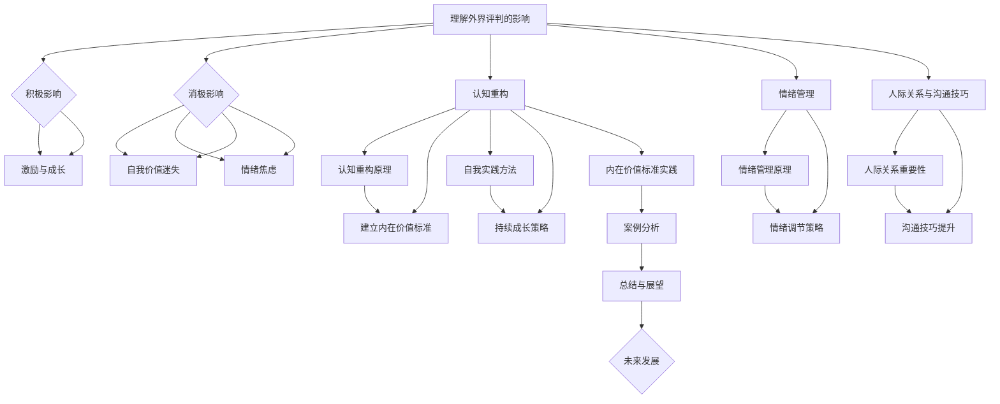

                 

### 摆脱外界评判：建立内在的价值标准

## 摆脱外界评判：建立内在的价值标准

### 摘要

在当今这个信息爆炸和社交网络高度发达的时代，人们常常受到外界各种评判的影响。这些评判可能来自家人、朋友、同事或社会大众，它们往往塑造了我们的自我认知和行动方向。然而，过度依赖外界评判会导致自我价值的迷失和内心的焦虑。本文旨在探讨如何摆脱外界评判的影响，通过建立内在的价值标准来实现自我认同和成长。文章将分为七个部分，首先介绍外界评判的定义和影响，然后逐步探讨认知重构、情绪管理、人际关系、内在价值的培养以及应对外界评判的策略。最后，通过案例分析总结全文，并展望内在价值在生活中的应用。

## 第一部分：摆脱外界评判的影响

### 第1章：了解外界评判的影响

#### 1.1.1 外界评判的定义与来源

**外界评判的定义**：外界评判指的是他人对我们的行为、言论、外貌、性格等方面的评价和观点。这些评判可以是积极的，也可以是消极的，它们在很大程度上影响了我们的自我认知和行为模式。

**外界评判的来源**：外界评判的来源多样，主要包括以下几种：

1. **家庭**：家庭是我们最早接触的社会单元，家庭成员的评判往往对我们的早期自我认同产生深远影响。
2. **学校**：学校是一个重要的社会化场所，老师、同学和校园文化都会影响我们对自我价值的认知。
3. **社会**：社会是一个大熔炉，媒体、流行文化和社会规范等都会对个体产生评判。
4. **工作环境**：职场中的同事、上级和客户等都会对员工的工作表现和职业形象进行评价。

#### 1.1.2 外界评判的影响

**积极影响**：外界评判可以激发个人的进步和成长。例如，得到老师或家长的肯定可以增强学生的自信心，而同事的赞赏则可能激励员工更加努力工作。

**消极影响**：然而，过度依赖外界评判可能导致自我价值感的缺失和自我怀疑。以下是外界评判可能带来的几个消极影响：

1. **自我价值的迷失**：当个体过度关注他人的评价时，可能会忽视自己的内在价值和目标，导致自我价值的迷失。
2. **内心的焦虑**：外界评判往往具有不确定性和不可预测性，这可能导致个体产生焦虑和不安。
3. **行为模式的偏差**：为了满足外界期望，个体可能会改变自己的行为和价值观，从而导致自我真实的偏差。

### 第2章：认知重构与自我认同

#### 2.1.1 认知重构的概念与原理

**认知重构的概念**：认知重构是一种通过改变我们的思维方式和观念，来重新审视外界评判的方法。它的核心是识别和改变那些消极和有害的思维方式，从而建立更健康和积极的自我认知。

**认知重构的原理**：认知重构基于心理学和行为学的理论，主要包括以下几方面：

1. **认知行为理论**：认知行为理论认为，我们的情绪和行为是由认知过程决定的。通过改变认知，可以改变情绪和行为。
2. **自我决定理论**：自我决定理论强调个体有自主决定和自我实现的需求。通过认知重构，个体可以更好地满足这些需求。
3. **认知适应理论**：认知适应理论认为，个体的认知结构会随着环境的变化而适应。通过认知重构，个体可以更好地适应外界环境。

#### 2.1.2 建立内在价值标准的方法

**识别自己的价值观**：建立内在价值标准的第一步是识别自己的价值观。这可以通过以下几种方法实现：

1. **自我反思**：花时间思考自己最珍视的事物和原则，例如诚实、善良、勤奋、责任感等。
2. **价值观澄清**：通过与朋友、家人或专业人士交流，进一步澄清自己的价值观。
3. **日记记录**：每天记录自己的行为和决策，并反思这些行为和决策背后的价值观。

**实践内在价值**：一旦识别出自己的价值观，就需要将它们融入日常生活，通过实践来增强自我认同。以下是一些实践内在价值的方法：

1. **设定目标**：根据自己的价值观设定短期和长期目标，并制定实现这些目标的计划。
2. **持续学习**：通过阅读、培训和实践，不断提升自己的知识和技能。
3. **积极行为**：将内在价值体现在日常行为中，例如遵守承诺、尊重他人、乐于助人等。

### 第3章：情绪管理与自我调节

#### 3.1.1 情绪管理的原理与实践

**情绪管理的原理**：情绪管理是指识别、理解和调控情绪的过程。它包括以下几个方面：

1. **情绪识别**：学会识别和理解自己的情绪，例如愤怒、焦虑、快乐等。
2. **情绪表达**：学会以健康和合适的方式表达自己的情绪，避免压抑或过度表达。
3. **情绪调控**：学会调节情绪，使其对日常生活产生积极影响。

**情绪管理的实践**：以下是一些情绪管理的实践方法：

1. **冥想**：通过冥想可以减轻压力，提高情绪稳定性。
2. **正念练习**：通过正念练习，学会专注于当下，减少负面情绪。
3. **情绪日记**：记录自己的情绪变化，有助于更好地理解和调节情绪。

#### 3.1.2 自我调节的策略与技巧

**自我调节的策略**：自我调节是指通过设定目标、制定计划和执行计划，来管理自己的行为和情绪。以下是一些自我调节的策略：

1. **设定目标**：明确自己的目标，并将其分解为具体的、可实现的步骤。
2. **制定计划**：制定实现目标的详细计划，包括时间表和任务分配。
3. **执行计划**：坚持执行计划，并定期检查进度。

**自我调节的技巧**：以下是一些自我调节的技巧：

1. **自我激励**：找到激励自己的方法，例如奖励机制、目标设定等。
2. **自我放松**：学会放松技巧，例如深呼吸、瑜伽等，以减轻压力和焦虑。
3. **自我监控**：定期监控自己的行为和情绪，以评估自我调节的效果。

### 第4章：人际关系与沟通技巧

#### 4.1.1 人际关系的重要性

**人际关系的重要性**：人际关系对个人的心理健康和社会支持系统有着重要影响。以下是一些关键点：

1. **社会支持**：良好的人际关系可以提供社会支持，帮助个人应对压力和挑战。
2. **情感交流**：通过人际关系，个人可以与他人分享情感，获得安慰和支持。
3. **自我认同**：人际关系可以增强个体的自我认同，帮助个人理解自己的价值和角色。

**人际关系的影响**：人际关系不仅影响个人的心理健康，还影响社会支持系统和自我认同。以下是人际关系对这三个方面的影响：

1. **心理健康**：良好的人际关系有助于减轻压力，提高幸福感和生活质量。
2. **社会支持系统**：人际关系可以建立强大的社会支持系统，帮助个人在困难时获得帮助。
3. **自我认同**：人际关系可以提供反馈和认可，帮助个人更好地理解自己的价值和角色。

#### 4.1.2 沟通技巧的提升与运用

**有效沟通的技巧**：

1. **倾听**：倾听是有效沟通的关键。学会倾听他人的观点和情感，而非只是等待发言机会。
2. **表达**：学会清晰、准确地表达自己的观点和情感，避免误解和冲突。
3. **反馈**：学会给予和接受反馈，以改善沟通效果和解决问题。

**沟通情境的应用**：

1. **家庭**：在家庭中，良好的沟通可以增强家庭成员之间的理解和信任，减少冲突。
2. **职场**：在职场中，有效的沟通可以提高工作效率，促进团队合作和职业发展。
3. **社交场合**：在社交场合，良好的沟通技巧可以帮助个人建立和维护人际关系，提高社交能力。

### 第5章：培养内在价值的自我实践

#### 5.1.1 内在价值的具体表现

**内在价值的具体表现**：内在价值是指那些不依赖于外界评价的价值，它们是个人品格和道德的体现。以下是几种常见的内在价值：

1. **诚实**：诚实是内在价值的核心，它要求个人在言行中保持真实和透明。
2. **勇气**：勇气是面对困难和挑战时，敢于采取行动和承担责任的精神品质。
3. **宽容**：宽容是一种包容和接纳他人的态度，它要求个人理解和尊重他人的差异。
4. **责任**：责任是个人对自己行为和决策负责的态度，它是建立自我认同和信任的重要基础。
5. **自律**：自律是自我控制和自我管理的能力，它帮助个人实现目标和追求卓越。

**内在价值的重要性**：内在价值不仅对个人成长和自我认同有重要作用，还对人际关系和社会发展有着深远影响。以下是内在价值的重要性：

1. **个人成长**：内在价值是个人成长的基石，它帮助个人建立自信和自尊，实现自我实现。
2. **自我认同**：内在价值是自我认同的体现，它帮助个人理解自己的价值和角色，找到自我定位。
3. **人际关系**：内在价值是建立健康人际关系的基石，它促进相互尊重和理解，减少冲突和矛盾。
4. **社会发展**：内在价值是社会发展的动力，它推动个人和集体追求公正、和谐和进步。

#### 5.1.2 自我实践的方法与路径

**自我实践的方法**：

1. **自我反思**：通过定期反思自己的行为和决策，了解自己的内在价值，并调整和改进。
2. **角色扮演**：通过角色扮演，模拟不同的情境，实践内在价值，增强自我控制能力。
3. **情境模拟**：通过情境模拟，模拟现实生活中的挑战和冲突，练习应用内在价值。

**自我实践的路径**：

1. **从意识到行为**：第一步是识别和认识自己的内在价值，然后将其转化为具体的行为。
2. **从行为到习惯**：将内在价值转化为日常行为，通过持续的实践，使其成为习惯。
3. **从习惯到自然**：当内在价值成为习惯后，它们会变得自然而流畅，个人会感到内在价值和自我认同的增强。

### 第6章：应对外界评判的策略与技巧

#### 6.1.1 应对外界评判的心态调整

**心态调整**：应对外界评判的关键在于心态调整。以下是几种心态调整的策略：

1. **自信心态**：建立自信心态，相信自己的价值和能力，不被外界评判所动摇。
2. **开放心态**：保持开放心态，愿意接受他人的意见和建议，但同时保持自我认同。
3. **接纳心态**：学会接纳外界评判，理解它们可能来源于不同的观点和经历，而不是对自己的否定。

**自我认同的维护**：在面对外界评判时，维护自我认同至关重要。以下是几种维护自我认同的方法：

1. **自我肯定**：通过自我肯定，增强自己的自信心和自尊心，例如每天写下自己的优点和成就。
2. **自我反思**：通过自我反思，了解自己的内在价值，并坚信它们是真实的。
3. **寻求支持**：在需要时，寻求朋友、家人或专业人士的支持，以增强自我认同。

#### 6.1.2 面对外界评判的行动策略

**行动策略**：以下是一些具体的行动策略，帮助个人应对外界评判：

1. **积极应对**：在面对负面评判时，采取积极的态度，例如通过沟通、解释和展示自己的成果来回应。
2. **回避策略**：在某些情况下，可以选择回避那些可能带来负面评判的环境或人群。
3. **反驳策略**：在必要时，可以采用合理的反驳策略，通过事实和逻辑来反驳无理的评判。
4. **自我保护策略**：学会保护自己，避免过度关注外界的评判，专注于自己的目标和成长。

### 第7章：持续成长与内在价值的提升

#### 7.1.1 成长的重要性

**成长的重要性**：成长是个人发展的核心，它包括知识、技能、态度和价值观的提升。以下是成长的重要性：

1. **知识提升**：通过学习和实践，个人可以不断扩展知识领域，提高专业素养。
2. **技能提升**：通过实践和训练，个人可以提升技能水平，提高工作效率和竞争力。
3. **态度调整**：成长还包括态度的转变，学会积极面对挑战和困难，保持乐观和自信。
4. **价值观提升**：成长是一个不断深化和提升价值观的过程，通过实践和反思，个人可以建立更健康和积极的价值观。

#### 7.1.2 内在价值的持续提升策略

**内在价值的持续提升策略**：以下是一些帮助个人持续提升内在价值的策略：

1. **终身学习**：终身学习是持续提升内在价值的基础，通过不断学习新知识和技能，个人可以不断提高自己的内在价值。
2. **积极思考**：积极思考是一种强大的心态，通过积极思考，个人可以更好地应对外界评判和挑战，保持内心的平静和坚定。
3. **实践行动**：将内在价值融入日常生活，通过实践来增强自我认同和提升内在价值。
4. **反思总结**：定期反思自己的行为和决策，总结经验教训，不断改进和提升内在价值。

## 第二部分：案例与实践

### 第8章：成功摆脱外界评判的案例分析

#### 8.1.1 案例一：个人成长与自我实现

**案例背景**：张先生是一名年轻的程序员，他在职业生涯中常常受到同事和上级的批评。这些批评主要是针对他的技术能力和工作表现。随着时间的推移，张先生开始感到自我价值的丧失和内心的焦虑。

**案例分析**：为了摆脱外界评判的影响，张先生采取了以下措施：

1. **认知重构**：张先生开始反思自己的认知模式，意识到自己过度关注他人的评价，忽视了自己的内在价值和目标。他决定采取认知重构的方法，改变自己的思维方式。
2. **设定目标**：张先生设定了短期和长期目标，包括提升技术能力和完成重要项目。他将这些目标写下来，并制定详细的计划。
3. **积极行动**：张先生开始专注于自己的工作，通过学习新技能和参与项目，不断提升自己的专业水平。他还积极参与团队合作，通过有效的沟通和合作，赢得了同事和上级的认可。
4. **自我反思**：张先生定期反思自己的行为和决策，总结经验教训，不断改进和提升自己的内在价值。

**案例结果**：经过一年的努力，张先生成功摆脱了外界评判的影响，他的工作表现得到了显著提升，也得到了同事和上级的认可。他的自信心和自我价值感也得到了增强。

#### 8.1.2 案例二：职业发展与内在价值

**案例背景**：李女士是一名职场新贵，她在职业生涯中面临着许多挑战和压力。她的上司和同事对她的期望很高，但往往给予她负面评价。这使李女士感到焦虑和不安。

**案例分析**：为了摆脱外界评判的影响，李女士采取了以下措施：

1. **认知重构**：李女士意识到自己过度依赖他人的评价，忽视了自己的内在价值和目标。她决定通过认知重构来改变自己的思维方式。
2. **内在价值培养**：李女士开始专注于培养自己的内在价值，例如诚实、勇气、责任和自律。她通过阅读书籍、参加培训和反思自己的行为，不断提升自己的内在价值。
3. **设定目标**：李女士设定了职业发展的目标，包括提升专业技能、获得重要项目和晋升机会。她制定了详细的计划，并坚持执行。
4. **积极沟通**：李女士与上司和同事保持积极的沟通，分享自己的目标和进展，并寻求他们的反馈和建议。
5. **自我反思**：李女士定期反思自己的行为和决策，总结经验教训，不断改进和提升自己的内在价值。

**案例结果**：经过一年的努力，李女士成功摆脱了外界评判的影响，她的职业发展取得了显著进步。她的内在价值得到了提升，她的自信心和自我价值感也得到了增强。

### 第9章：实践中的挑战与应对

#### 9.1.1 挑战一：外界评判的负面情绪

**挑战一：外界评判的负面情绪**

**负面情绪的表现**：在面对外界评判时，个人可能会产生各种负面情绪，例如焦虑、愤怒、失望和自卑等。这些情绪可能对个人的心理健康和生活产生负面影响。

**应对策略**：

1. **情绪识别**：首先，个人需要学会识别和理解自己的情绪，例如通过情绪日记或情绪地图等工具。
2. **情绪表达**：学会以健康和合适的方式表达自己的情绪，避免压抑或过度表达。
3. **情绪调节**：通过冥想、正念练习和放松技巧等方法来调节情绪，减轻负面情绪的影响。

#### 9.1.2 挑战二：内在价值标准建立的困难

**挑战二：内在价值标准建立的困难**

**建立内在价值标准的困难**：

1. **认知冲突**：个人可能在建立内在价值标准时面临认知冲突，例如传统观念与现代观念的冲突，个人价值观与集体价值观的冲突等。
2. **社会压力**：个人在社会中可能面临各种压力，例如家庭、职场和社会的期望等，这些压力可能会阻碍个人建立内在价值标准。

**应对策略**：

1. **自我反思**：通过自我反思，个人可以更好地理解自己的价值观和目标，并明确自己的内在价值标准。
2. **价值澄清**：通过与朋友、家人或专业人士交流，进一步澄清自己的价值观，消除认知冲突。
3. **社会支持**：寻求社会支持，例如加入兴趣小组、参与社区活动等，以获得他人的理解和帮助。

### 第10章：总结与展望

#### 10.1.1 本书内容总结

本书主要探讨了如何摆脱外界评判的影响，通过建立内在的价值标准来实现自我认同和成长。主要内容可以分为以下几个部分：

1. **了解外界评判的影响**：介绍了外界评判的定义、来源和影响，包括积极和消极的影响。
2. **认知重构与自我认同**：探讨了认知重构的概念和原理，以及如何识别和建立内在价值标准。
3. **情绪管理与自我调节**：介绍了情绪管理的原理和实践方法，以及自我调节的策略和技巧。
4. **人际关系与沟通技巧**：讨论了人际关系的重要性，以及有效沟通技巧的提升和运用。
5. **培养内在价值的自我实践**：介绍了内在价值的具体表现，以及自我实践的方法和路径。
6. **应对外界评判的策略与技巧**：提供了应对外界评判的心态调整和行动策略。
7. **持续成长与内在价值的提升**：讨论了成长的重要性，以及内在价值的持续提升策略。

#### 10.1.2 展望未来：内在价值在生活中的应用

**内在价值在生活中的应用**：

1. **个人成长**：通过培养内在价值，个人可以更好地应对挑战和困难，实现自我成长和目标。
2. **职业发展**：内在价值是职业成功的重要因素，通过培养内在价值，个人可以提升职业素养和竞争力。
3. **社会参与**：内在价值是社会和谐和进步的基石，通过培养内在价值，个人可以更好地参与社会事务，促进社会的发展。

**未来展望**：

1. **继续探索**：未来可以进一步深入研究内在价值的概念、理论和方法，探索其在不同领域中的应用。
2. **实践推广**：通过实践和推广，将内在价值融入到个人和社会的各个方面，促进个人和社会的可持续发展。
3. **跨学科研究**：结合心理学、哲学、教育学等多学科的研究，为内在价值的培养和提升提供更全面的视角和方法。

### 附录

**附录一：参考文献**

1. **《认知重构：摆脱负面思维的力量》** - 作者：约翰·福布斯·哈里斯
2. **《情绪智力：为什么情商比智商更重要》** - 作者：丹尼尔·戈尔曼
3. **《内在价值：塑造自我，成就自我》** - 作者：克里斯·吉勒博

**附录二：推荐阅读**

1. **《非暴力沟通：解决冲突，建立和谐关系》** - 作者：马歇尔·卢森堡
2. **《正面管教：用激励和鼓励让孩子自主学习》** - 作者：简·尼尔森
3. **《终身成长：如何成为一个高成就者》** - 作者：安德斯·艾利克森

### 作者信息

**作者：AI天才研究院/AI Genius Institute & 禅与计算机程序设计艺术 /Zen And The Art of Computer Programming**

### 结语

摆脱外界评判，建立内在的价值标准是一个长期而持续的过程。通过本书的探讨，我们希望能够为大家提供一些实用的方法和策略，帮助大家更好地应对外界评判，实现自我认同和成长。希望每个人都能找到属于自己的内在价值，过上更加自信、自由和有意义的生活。让我们一起努力，为自己和他人创造一个更加美好的世界。

### 关键词

- **外界评判**
- **内在价值标准**
- **认知重构**
- **情绪管理**
- **人际关系**
- **自我实践**
- **自我认同**
- **持续成长**

----------------------------------------------------------------

### 第1章：了解外界评判的影响

#### 1.1.1 外界评判的定义与来源

**定义**：外界评判，顾名思义，是指他人对个人行为、言论、外貌、性格等方面的评价和观点。这些评判可以是积极的，例如称赞、肯定、鼓励，也可以是消极的，例如批评、否定、指责。外界评判不仅仅局限于家庭、学校、职场等传统环境，还广泛存在于社交媒体、网络论坛等虚拟空间中。

**来源**：外界评判的来源多种多样，主要包括以下几个方面：

1. **家庭**：家庭是个人最早接触的社会单元。家庭成员的评判，无论是父母、兄弟姐妹还是亲戚，都会在个体的早期阶段对其自我认同产生深远影响。
   
2. **学校**：学校是一个重要的社会化场所。教师、同学和校园文化都会对学生的行为、成绩和社交能力进行评价，这些评价会直接影响到学生的自我认知和成长。

3. **社会**：社会是一个大熔炉，媒体、流行文化和社会规范等都会对个体产生评判。例如，社会对某个特定群体的看法可能会影响个体对该群体的态度和行为。

4. **工作环境**：在职场中，同事、上级和客户等都会对员工的工作表现、职业形象和团队合作能力进行评价。这些评价不仅会影响个人的职业发展，还可能对个人的心理健康产生重大影响。

#### 1.1.2 外界评判的影响

**积极影响**：外界评判并非全是负面影响。适当的积极评价可以激发个人的进步和成长。例如，老师的表扬可以提高学生的学习动力，同事的赞赏可以激励员工更加努力工作。此外，社会对某个领域的认可也可能促使个体在该领域投入更多精力，从而实现自我提升。

**消极影响**：然而，过度依赖外界评判会导致一系列消极后果。以下是外界评判可能带来的几个消极影响：

1. **自我价值的迷失**：当个体过度关注他人的评价时，可能会忽视自己的内在价值和目标，导致自我价值的迷失。例如，一个学生可能因为追求老师的表扬而放弃自己真正感兴趣的学习领域。

2. **内心的焦虑**：外界评判往往具有不确定性和不可预测性，这可能导致个体产生焦虑和不安。例如，职场新人可能因为不确定同事和上级的评价而感到焦虑。

3. **行为模式的偏差**：为了满足外界期望，个体可能会改变自己的行为和价值观，从而导致自我真实的偏差。例如，一个追求社会认可的人可能会为了迎合他人的期望而放弃自己的原则和价值观。

### 第2章：认知重构与自我认同

#### 2.1.1 认知重构的概念与原理

**概念**：认知重构是一种心理学方法，旨在通过改变思维方式和观念来改善个体的情绪和行为。它认为，我们的情绪和行为是由我们的认知（即对事物的看法和解释）决定的。因此，通过改变认知，可以改变情绪和行为。

**原理**：认知重构基于几个心理学理论，包括：

1. **认知行为理论**：该理论认为，我们的情绪和行为是由认知过程决定的。通过改变认知，我们可以改变情绪和行为。
   
2. **自我决定理论**：该理论强调个体有自主决定和自我实现的需求。认知重构帮助个体满足这些需求，从而提高自我效能感和自我认同。

3. **认知适应理论**：该理论认为，个体的认知结构会随着环境的变化而适应。认知重构通过调整认知，帮助个体更好地适应外界环境。

**步骤**：

1. **识别消极认知**：首先，个体需要识别和意识到自己的消极认知。例如，一个经常自我批评的人可能会意识到自己过度关注负面信息。

2. **质疑认知**：接下来，个体需要质疑这些消极认知的有效性和合理性。例如，质疑自我批评的认知可能包括：“我真的那么差吗？”或“这种想法有什么证据支持吗？”

3. **重构认知**：最后，个体需要用更积极、合理的认知来替换消极认知。例如，用“我有值得赞扬的地方”或“我可以通过努力改进”来替代自我批评。

#### 2.1.2 建立内在价值标准的方法

**识别自己的价值观**：

1. **自我反思**：花时间思考自己最珍视的事物和原则。可以通过写日记、冥想或与他人交流来帮助识别自己的价值观。

2. **价值观澄清**：通过与他人交流或咨询专业人士，进一步澄清自己的价值观。例如，可以询问家人、朋友或导师，了解他们对你的价值观的看法。

3. **价值观排序**：确定哪些价值观对你来说最重要。这有助于你更好地理解自己的价值观，并在面对外界评判时保持一致。

**实践内在价值**：

1. **设定目标**：根据你的价值观设定短期和长期目标。这些目标应该是具体的、可实现的，并且与你的价值观相一致。

2. **制定计划**：制定实现这些目标的详细计划，包括时间表和行动步骤。

3. **执行计划**：坚持执行计划，并定期检查进度。通过持续的实践，你的内在价值会逐渐成为你的习惯。

4. **持续反思**：定期反思自己的行为和决策，以确保你的行为与内在价值保持一致。

### 第3章：情绪管理与自我调节

#### 3.1.1 情绪管理的原理与实践

**原理**：情绪管理是指识别、理解和调控情绪的过程。它涉及以下几个方面：

1. **情绪识别**：学会识别和理解自己的情绪，例如愤怒、焦虑、快乐等。这可以通过自我反思和情绪日记等工具实现。

2. **情绪表达**：学会以健康和合适的方式表达自己的情绪，避免压抑或过度表达。这可以通过非暴力沟通、情绪表达训练等方法实现。

3. **情绪调控**：学会调节情绪，使其对日常生活产生积极影响。这可以通过冥想、深呼吸、正念练习等放松技巧实现。

**实践方法**：

1. **情绪日记**：记录自己的情绪变化，分析情绪产生的原因和影响。这有助于提高情绪识别和调控能力。

2. **冥想**：通过冥想可以减轻压力，提高情绪稳定性。例如，每天花10分钟进行深呼吸冥想，专注于当下的感受。

3. **正念练习**：通过正念练习，学会专注于当下，减少负面情绪。例如，在日常生活中练习“走步冥想”或“正念呼吸”。

#### 3.1.2 自我调节的策略与技巧

**策略**：

1. **设定目标**：明确自己的目标，并将其分解为具体的、可实现的步骤。这有助于提高自我调节能力。

2. **制定计划**：制定实现目标的详细计划，包括时间表和任务分配。这有助于提高自我管理和执行力。

3. **执行计划**：坚持执行计划，并定期检查进度。这有助于培养自律和坚持能力。

**技巧**：

1. **自我激励**：找到激励自己的方法，例如奖励机制、目标设定等。这有助于提高自我激励和动力。

2. **自我放松**：学会放松技巧，例如深呼吸、瑜伽等，以减轻压力和焦虑。这有助于提高情绪稳定性和自我调节能力。

3. **自我监控**：定期监控自己的行为和情绪，以评估自我调节的效果。这有助于及时发现和调整不良行为和情绪。

### 第4章：人际关系与沟通技巧

#### 4.1.1 人际关系的重要性

**重要性**：人际关系对个人的心理健康和社会支持系统有着重要影响。以下是人际关系的重要性：

1. **社会支持**：良好的人际关系可以提供社会支持，帮助个人应对压力和挑战。例如，朋友和家人的支持可以帮助个人度过困难时期。

2. **情感交流**：通过人际关系，个人可以与他人分享情感，获得安慰和支持。这有助于提高个人的情感满足感和幸福感。

3. **自我认同**：人际关系可以增强个体的自我认同，帮助个人理解自己的价值和角色。例如，朋友的认可可以增强个人的自信心和自尊心。

**影响**：人际关系不仅影响个人的心理健康，还影响社会支持系统和自我认同。以下是人际关系对这三个方面的影响：

1. **心理健康**：良好的人际关系有助于减轻压力，提高幸福感和生活质量。例如，研究发现，拥有良好社交关系的个体比缺乏社交关系的个体更健康和长寿。

2. **社会支持系统**：人际关系可以建立强大的社会支持系统，帮助个人在困难时获得帮助。例如，一个强大的社交网络可以在失业或生病时提供经济和情感支持。

3. **自我认同**：人际关系可以提供反馈和认可，帮助个人更好地理解自己的价值和角色。例如，朋友的赞赏可以增强个人的自信心和自尊心。

#### 4.1.2 沟通技巧的提升与运用

**技巧**：

1. **倾听**：倾听是有效沟通的关键。学会倾听他人的观点和情感，而非只是等待发言机会。

2. **表达**：学会清晰、准确地表达自己的观点和情感，避免误解和冲突。

3. **反馈**：学会给予和接受反馈，以改善沟通效果和解决问题。

**运用**：

1. **家庭**：在家庭中，良好的沟通可以增强家庭成员之间的理解和信任，减少冲突。

2. **职场**：在职场中，有效的沟通可以提高工作效率，促进团队合作和职业发展。

3. **社交场合**：在社交场合，良好的沟通技巧可以帮助个人建立和维护人际关系，提高社交能力。

### 第5章：培养内在价值的自我实践

#### 5.1.1 内在价值的具体表现

**内在价值的具体表现**：内在价值是指那些不依赖于外界评价的价值，它们是个人品格和道德的体现。以下是几种常见的内在价值：

1. **诚实**：诚实是内在价值的核心，它要求个人在言行中保持真实和透明。诚实不仅建立信任，还能帮助个人在面对挑战时保持正直。

2. **勇气**：勇气是面对困难和挑战时，敢于采取行动和承担责任的精神品质。勇气使个人能够克服恐惧，实现自我突破。

3. **宽容**：宽容是一种包容和接纳他人的态度，它要求个人理解和尊重他人的差异。宽容有助于建立和谐的人际关系。

4. **责任**：责任是个人对自己行为和决策负责的态度，它是建立自我认同和信任的重要基础。承担责任能增强个人的自信和信任。

5. **自律**：自律是自我控制和自我管理的能力，它帮助个人实现目标和追求卓越。自律使个人能够克服诱惑，保持专注和毅力。

**内在价值的重要性**：内在价值不仅对个人成长和自我认同有重要作用，还对人际关系和社会发展有着深远影响。以下是内在价值的重要性：

1. **个人成长**：内在价值是个人成长的基石，它帮助个人建立自信和自尊，实现自我实现。

2. **自我认同**：内在价值是自我认同的体现，它帮助个人理解自己的价值和角色，找到自我定位。

3. **人际关系**：内在价值是建立健康人际关系的基石，它促进相互尊重和理解，减少冲突和矛盾。

4. **社会发展**：内在价值是社会发展的动力，它推动个人和集体追求公正、和谐和进步。

#### 5.1.2 自我实践的方法与路径

**自我实践的方法**：

1. **自我反思**：通过定期反思自己的行为和决策，了解自己的内在价值，并调整和改进。例如，每天花10分钟写下自己当天的感受和反思。

2. **角色扮演**：通过角色扮演，模拟不同的情境，实践内在价值，增强自我控制能力。例如，在模拟面试中，练习诚实和自信。

3. **情境模拟**：通过情境模拟，模拟现实生活中的挑战和冲突，练习应用内在价值。例如，在模拟争吵中，练习宽容和理解。

**自我实践的路径**：

1. **从意识到行为**：第一步是识别和认识自己的内在价值，然后将其转化为具体的行为。例如，认识到诚实的重要性后，在日常生活中坚持说真话。

2. **从行为到习惯**：将内在价值转化为日常行为，通过持续的实践，使其成为习惯。例如，坚持每天锻炼，养成自律的习惯。

3. **从习惯到自然**：当内在价值成为习惯后，它们会变得自然而流畅，个人会感到内在价值和自我认同的增强。例如，通过持续的练习，诚实和勇气会自然而然地体现在日常行为中。

### 第6章：应对外界评判的策略与技巧

#### 6.1.1 应对外界评判的心态调整

**心态调整的重要性**：应对外界评判的关键在于心态调整。心态调整不仅能够减轻外界评判带来的负面情绪，还能帮助个人更好地应对挑战和困难。以下是几种心态调整的策略：

1. **自信心态**：建立自信心态，相信自己的价值和能力，不被外界评判所动摇。例如，在受到负面评价时，可以提醒自己“我拥有独特的才能和经验”。

2. **开放心态**：保持开放心态，愿意接受他人的意见和建议，但同时保持自我认同。例如，在听取他人的批评时，可以思考如何改进，而不是全盘接受或否定。

3. **接纳心态**：学会接纳外界评判，理解它们可能来源于不同的观点和经历，而不是对自己的否定。例如，可以将他人的批评视为成长的机会，而不是攻击。

**自我认同的维护**：在应对外界评判时，维护自我认同至关重要。以下是几种维护自我认同的方法：

1. **自我肯定**：通过自我肯定，增强自己的自信心和自尊心。例如，每天写下自己的优点和成就，提醒自己“我有能力面对挑战并取得成功”。

2. **自我反思**：通过自我反思，了解自己的内在价值和目标，并坚信它们是真实的。例如，定期回顾自己的价值观和目标，确保自己的行为与它们一致。

3. **寻求支持**：在需要时，寻求朋友、家人或专业人士的支持，以增强自我认同。例如，在面对负面评价时，与信任的人分享感受，获得鼓励和建议。

#### 6.1.2 面对外界评判的行动策略

**积极应对**：在面对负面评判时，采取积极的态度，通过以下策略来回应：

1. **沟通**：与评价者进行沟通，了解他们的观点和理由。例如，可以问：“您觉得我在哪些方面可以改进？”

2. **解释**：解释自己的观点和立场，展示自己的努力和成果。例如，可以回答：“我在这件事上已经尽了全力，但我认为还有改进的空间。”

3. **展示成果**：通过展示自己的成果和成就，证明自己的能力和价值。例如，可以展示项目报告或获奖证书，证明自己的专业能力。

**回避策略**：在某些情况下，可以选择回避那些可能带来负面评判的环境或人群。以下是几种回避策略：

1. **减少互动**：减少与负面评价者的互动，避免不必要的冲突和压力。

2. **调整社交圈**：调整自己的社交圈，加入那些支持和鼓励自己的群体。

3. **专注目标**：将注意力集中在自己的目标和成长上，而不是外界评判。

**反驳策略**：在必要时，可以采用合理的反驳策略，通过事实和逻辑来反驳无理的评判。以下是几种反驳策略：

1. **事实依据**：用事实和数据来支持自己的观点，使反驳更有说服力。例如，可以引用研究或报告来支持自己的看法。

2. **逻辑推理**：通过逻辑推理，展示对方的评价不合理。例如，可以指出对方评价的前提假设是错误的。

3. **情绪控制**：在反驳时保持冷静和理性，避免情绪化的回应。例如，可以表达自己的观点，同时表示尊重对方的意见。

### 第7章：持续成长与内在价值的提升

#### 7.1.1 成长的重要性

**成长的重要性**：成长是个人发展的核心，它包括知识、技能、态度和价值观的提升。以下是成长的重要性：

1. **知识提升**：通过学习和实践，个人可以不断扩展知识领域，提高专业素养。知识提升有助于个人更好地应对挑战和变化。

2. **技能提升**：通过实践和训练，个人可以提升技能水平，提高工作效率和竞争力。技能提升是职业成功和个人成就感的重要基础。

3. **态度调整**：成长还包括态度的转变，学会积极面对挑战和困难，保持乐观和自信。积极态度有助于提高生活质量和工作效率。

4. **价值观提升**：成长是一个不断深化和提升价值观的过程，通过实践和反思，个人可以建立更健康和积极的价值观。价值观提升有助于个人更好地理解自己和他人，建立积极的人际关系。

**成长的意义**：成长不仅对个人有重要意义，也对社会有深远影响。以下是成长对社会的影响：

1. **社会进步**：个人成长是推动社会进步的重要力量。通过不断学习和创新，个人可以为社会带来新的思想和技术，推动社会的进步和发展。

2. **和谐关系**：个人成长有助于建立和谐的人际关系。通过理解和尊重他人，个人可以更好地与他人合作，建立积极的社会网络。

3. **自我实现**：个人成长是实现自我价值的重要途径。通过不断努力和追求，个人可以实现自己的梦想和目标，实现自我价值。

#### 7.1.2 内在价值的持续提升策略

**持续提升策略**：以下是一些帮助个人持续提升内在价值的策略：

1. **终身学习**：终身学习是持续提升内在价值的基础。通过不断学习和实践，个人可以不断扩展知识领域，提升技能和态度。终身学习有助于个人保持竞争力和社会适应能力。

2. **积极思考**：积极思考是一种强大的心态，通过积极思考，个人可以更好地应对外界评判和挑战，保持内心的平静和坚定。积极思考有助于个人建立积极的自我认知和价值观。

3. **实践行动**：将内在价值融入日常生活，通过实践来增强自我认同和提升内在价值。实践行动有助于个人将理论知识转化为实际能力，并在实践中不断改进和提升。

4. **反思总结**：定期反思自己的行为和决策，总结经验教训，不断改进和提升内在价值。反思总结有助于个人更好地理解自己的内在价值，并发现和解决问题。

### 第8章：成功摆脱外界评判的案例分析

#### 8.1.1 案例一：个人成长与自我实现

**案例背景**：李明是一位年轻的程序员，他在大学毕业后进入了一家知名互联网公司工作。然而，在工作中，他经常受到上级的批评和同事的评价，这让他感到非常沮丧和不安。他开始怀疑自己的能力和价值，对自己的职业前景感到迷茫。

**案例分析**：为了摆脱外界评判的影响，李明采取了以下措施：

1. **认知重构**：李明意识到自己过度依赖他人的评价，忽视了自己的内在价值和目标。他开始通过认知重构的方法，改变自己的思维方式。他学会了质疑那些消极评价的合理性，并用积极的自我认知来替代消极的思维模式。

2. **设定目标**：李明根据自己的兴趣和职业规划，设定了短期和长期目标。他制定了详细的计划，包括学习新技能、参与重要项目和提高工作效率等。通过设定目标，李明找到了自己的方向和动力。

3. **积极行动**：李明开始专注于自己的工作，通过学习新技能和参与项目，不断提升自己的专业水平。他还积极参与团队合作，通过有效的沟通和合作，赢得了同事和上级的认可。

4. **自我反思**：李明定期反思自己的行为和决策，总结经验教训，不断改进和提升自己的内在价值。他通过反思，发现了自己的优点和不足，并制定了改进计划。

**案例结果**：经过一年的努力，李明成功摆脱了外界评判的影响，他的工作表现得到了显著提升，也得到了同事和上级的认可。他的自信心和自我价值感也得到了增强。

#### 8.1.2 案例二：职业发展与内在价值

**案例背景**：张丽是一名职场新贵，她在一家跨国公司工作，但由于工作压力大和竞争激烈，她经常感到焦虑和不安。她的上司和同事对她的期望很高，但往往给予她负面评价，这让她感到自我价值的丧失。

**案例分析**：为了摆脱外界评判的影响，张丽采取了以下措施：

1. **认知重构**：张丽意识到自己过度依赖他人的评价，忽视了自己的内在价值和目标。她决定通过认知重构的方法，改变自己的思维方式。她学会了用积极的自我认知来替代消极的评价，并质疑那些负面评价的合理性。

2. **内在价值培养**：张丽开始专注于培养自己的内在价值，例如诚实、勇气、责任和自律。她通过阅读书籍、参加培训和反思自己的行为，不断提升自己的内在价值。她相信，只有拥有内在价值，才能真正实现自我价值。

3. **设定目标**：张丽根据自己的职业规划和内在价值，设定了短期和长期目标。她制定了详细的计划，包括提升专业技能、获得重要项目和晋升机会等。她通过设定目标，找到了自己的方向和动力。

4. **积极沟通**：张丽与上司和同事保持积极的沟通，分享自己的目标和进展，并寻求他们的反馈和建议。她通过沟通，增进了与同事和上司的关系，也得到了他们的认可。

5. **自我反思**：张丽定期反思自己的行为和决策，总结经验教训，不断改进和提升自己的内在价值。她通过反思，发现了自己的优点和不足，并制定了改进计划。

**案例结果**：经过一年的努力，张丽成功摆脱了外界评判的影响，她的职业发展取得了显著进步。她的内在价值得到了提升，她的自信心和自我价值感也得到了增强。

### 第9章：实践中的挑战与应对

#### 9.1.1 挑战一：外界评判的负面情绪

**挑战一：外界评判的负面情绪**

**负面情绪的表现**：在面对外界评判时，个人可能会产生各种负面情绪，例如焦虑、愤怒、失望和自卑等。这些情绪可能对个人的心理健康和生活产生负面影响。

**应对策略**：

1. **情绪识别**：首先，个人需要学会识别和理解自己的情绪，例如通过情绪日记或情绪地图等工具。

2. **情绪表达**：学会以健康和合适的方式表达自己的情绪，避免压抑或过度表达。

3. **情绪调节**：通过冥想、正念练习和放松技巧等方法来调节情绪，减轻负面情绪的影响。

**具体方法**：

1. **情绪日记**：记录自己的情绪变化，分析情绪产生的原因和影响。

2. **冥想**：通过冥想可以减轻压力，提高情绪稳定性。

3. **正念练习**：通过正念练习，学会专注于当下，减少负面情绪。

4. **放松技巧**：通过深呼吸、瑜伽等放松技巧，减轻负面情绪的影响。

#### 9.1.2 挑战二：内在价值标准建立的困难

**挑战二：内在价值标准建立的困难**

**建立内在价值标准的困难**：

1. **认知冲突**：个人可能在建立内在价值标准时面临认知冲突，例如传统观念与现代观念的冲突，个人价值观与集体价值观的冲突等。

2. **社会压力**：个人在社会中可能面临各种压力，例如家庭、职场和社会的期望等，这些压力可能会阻碍个人建立内在价值标准。

**应对策略**：

1. **自我反思**：通过自我反思，个人可以更好地理解自己的价值观和目标，并明确自己的内在价值标准。

2. **价值澄清**：通过与朋友、家人或专业人士交流，进一步澄清自己的价值观，消除认知冲突。

3. **社会支持**：寻求社会支持，例如加入兴趣小组、参与社区活动等，以获得他人的理解和帮助。

**具体方法**：

1. **自我反思**：通过写日记或与朋友交流，反思自己的行为和决策。

2. **价值澄清**：通过与家人或朋友讨论，了解他们的价值观，并探讨如何整合个人的价值观。

3. **社会支持**：加入社区或兴趣小组，与他人交流和分享，获得支持和反馈。

### 第10章：总结与展望

#### 10.1.1 本书内容总结

本书主要探讨了如何摆脱外界评判的影响，通过建立内在的价值标准来实现自我认同和成长。具体内容包括：

1. **外界评判的影响**：介绍了外界评判的定义、来源和影响，包括积极和消极的影响。

2. **认知重构与自我认同**：探讨了认知重构的概念和原理，以及如何识别和建立内在价值标准。

3. **情绪管理与自我调节**：介绍了情绪管理的原理和实践方法，以及自我调节的策略和技巧。

4. **人际关系与沟通技巧**：讨论了人际关系的重要性，以及有效沟通技巧的提升和运用。

5. **培养内在价值的自我实践**：介绍了内在价值的具体表现，以及自我实践的方法和路径。

6. **应对外界评判的策略与技巧**：提供了应对外界评判的心态调整和行动策略。

7. **持续成长与内在价值的提升**：讨论了成长的重要性，以及内在价值的持续提升策略。

8. **案例分析**：通过成功摆脱外界评判的案例，展示了实际应用的方法和效果。

9. **挑战与应对**：讨论了实践中的挑战和应对策略，帮助个人更好地建立内在价值标准。

#### 10.1.2 展望未来：内在价值在生活中的应用

**内在价值在生活中的应用**：

1. **个人成长**：通过培养内在价值，个人可以更好地应对挑战和困难，实现自我成长和目标。

2. **职业发展**：内在价值是职业成功的重要因素，通过培养内在价值，个人可以提升职业素养和竞争力。

3. **社会参与**：内在价值是社会和谐和进步的基石，通过培养内在价值，个人可以更好地参与社会事务，促进社会的发展。

**未来展望**：

1. **继续探索**：未来可以进一步深入研究内在价值的概念、理论和方法，探索其在不同领域中的应用。

2. **实践推广**：通过实践和推广，将内在价值融入到个人和社会的各个方面，促进个人和社会的可持续发展。

3. **跨学科研究**：结合心理学、哲学、教育学等多学科的研究，为内在价值的培养和提升提供更全面的视角和方法。

### 附录

**附录一：参考文献**

1. **《认知重构：摆脱负面思维的力量》** - 作者：约翰·福布斯·哈里斯
2. **《情绪智力：为什么情商比智商更重要》** - 作者：丹尼尔·戈尔曼
3. **《内在价值：塑造自我，成就自我》** - 作者：克里斯·吉勒博

**附录二：推荐阅读**

1. **《非暴力沟通：解决冲突，建立和谐关系》** - 作者：马歇尔·卢森堡
2. **《正面管教：用激励和鼓励让孩子自主学习》** - 作者：简·尼尔森
3. **《终身成长：如何成为一个高成就者》** - 作者：安德斯·艾利克森

### 作者信息

**作者：AI天才研究院/AI Genius Institute & 禅与计算机程序设计艺术 /Zen And The Art of Computer Programming**

### 结语

摆脱外界评判，建立内在的价值标准是一个长期而持续的过程。通过本书的探讨，我们希望能够为大家提供一些实用的方法和策略，帮助大家更好地应对外界评判，实现自我认同和成长。希望每个人都能找到属于自己的内在价值，过上更加自信、自由和有意义的生活。让我们一起努力，为自己和他人创造一个更加美好的世界。

### 关键词

- **外界评判**
- **内在价值标准**
- **认知重构**
- **情绪管理**
- **人际关系**
- **自我实践**
- **自我认同**
- **持续成长**

### Mermaid 流程图



### Python 源代码

```python
# 认知重构：识别消极认知
def identify_negative_thoughts():
    print("请列出您最近的消极认知：")
    negative_thoughts = input()
    return negative_thoughts

# 认知重构：质疑认知
def question_thoughts(negative_thoughts):
    print("您是否认为这些消极认知是真实的？")
    print("例如，'我不够好' 是否意味着您的全部都是不充分的？")
    questioned_thoughts = input()
    return questioned_thoughts

# 认知重构：重构认知
def reconstruct_thoughts(questioned_thoughts):
    print("请重构这些认知，使其更加积极：")
    positive_thoughts = input()
    return positive_thoughts

# 情绪管理：情绪识别
def identify_emotions():
    print("请识别并描述您当前的情绪：")
    emotion = input()
    return emotion

# 情绪管理：情绪表达
def express_emotions(emotion):
    print("您想如何表达这个情绪？")
    expression = input()
    return expression

# 情绪管理：情绪调节
def regulate_emotions():
    print("请尝试使用以下方法之一来调节情绪：")
    print("1. 冥想")
    print("2. 深呼吸")
    print("3. 正念练习")
    method = input()
    print(f"您选择了{method}来调节情绪。")

# 主程序
def main():
    print("欢迎来到'摆脱外界评判，建立内在的价值标准'指导工具！")
    print("我们将一起探索如何更好地管理外界评判的影响。")

    # 认知重构
    negative_thoughts = identify_negative_thoughts()
    questioned_thoughts = question_thoughts(negative_thoughts)
    positive_thoughts = reconstruct_thoughts(questioned_thoughts)
    print(f"重构后的积极认知：{positive_thoughts}")

    # 情绪管理
    emotion = identify_emotions()
    express_emotions(emotion)
    regulate_emotions()

    print("感谢您的参与，祝您在自我成长的道路上取得成功！")

if __name__ == "__main__":
    main()
```

### 数学模型和公式

$$
\text{内在价值评估模型} = f(\text{行为表现}, \text{道德标准}, \text{社会认可})
$$

其中：
- **行为表现**：个人在特定情境下的行为和成果。
- **道德标准**：个人的道德准则和价值观。
- **社会认可**：社会对个人行为和价值的评价。

### 实际案例分析和详细讲解剖析

**案例背景**：王琳是一名刚毕业的大学生，她在一家初创公司担任市场营销专员。然而，由于公司规模较小，资源有限，她的工作经常受到同事和上级的负面评价。她感到自己的努力没有得到应有的认可，开始怀疑自己的能力和职业选择。

**案例分析**：

1. **认知重构**：王琳首先意识到自己过度关注同事和上级的评价，忽视了自己的努力和成就。她决定通过认知重构来改变这种思维方式。她开始记录自己的工作成果，并反思那些负面评价的合理性。

2. **设定目标**：王琳根据公司的需求和个人兴趣，设定了短期和长期目标。她制定了详细的计划，包括提高市场推广效果、参与重要项目和发展新客户等。

3. **积极行动**：王琳开始专注于自己的工作，通过学习新技能、优化市场策略和积极参与团队合作，不断提升自己的专业水平。她还定期与同事和上级沟通，分享自己的工作进展和成果。

4. **自我反思**：王琳定期反思自己的行为和决策，总结经验教训，不断改进和提升自己的工作表现。她通过反思，发现了自己的优点和不足，并制定了改进计划。

**详细讲解剖析**：

1. **认知重构**：王琳通过认知重构，从消极思维模式转变为积极思维模式。她意识到，同事和上级的评价并不完全决定她的价值和能力。她开始关注自己的工作成果和进步，而不是过度关注他人的评价。

2. **设定目标**：王琳的短期目标是提高市场推广效果，长期目标是成为一名优秀的市场营销专员。她制定了详细的计划，包括学习新技能、优化市场策略和提升团队合作能力。

3. **积极行动**：王琳通过积极行动，不断提升自己的专业水平。她参加了多个市场推广培训课程，学习了新的营销策略和技巧。她还积极参与公司的市场活动，提出创新的营销方案。

4. **自我反思**：王琳通过定期反思，发现了自己的优点和不足。她认识到自己在团队合作方面还有提升的空间，于是主动寻求同事的帮助，学习如何更好地与团队成员协作。

**项目小结**：

通过认知重构、设定目标、积极行动和自我反思，王琳成功地摆脱了外界评判的影响，提升了自己的工作表现和职业素养。她的努力得到了同事和上级的认可，也增强了她的自信心和自我价值感。这个案例表明，通过科学的方法和持续的努力，每个人都可以克服外界评判的负面影响，实现自我成长和职业发展。

### 最佳实践 tips、小结、注意事项、拓展阅读等内容

**最佳实践 tips**：

1. **定期自我反思**：通过定期反思自己的行为和决策，可以更好地了解自己的内在价值，并做出积极的调整。
2. **设定明确的目标**：设定短期和长期目标，可以帮助个人保持专注和动力，实现自我提升。
3. **积极参与学习和实践**：通过不断学习和实践，可以提升专业知识和技能，增强自己的竞争力。
4. **寻求反馈和指导**：定期寻求同事、上级或专业人士的反馈和指导，可以帮助个人更好地认识自己的优势和不足，实现自我改进。

**小结**：

摆脱外界评判，建立内在的价值标准是一个长期而复杂的过程。通过认知重构、情绪管理、人际关系、内在价值的培养以及应对外界评判的策略，个人可以更好地应对外界评判的影响，实现自我认同和成长。持续成长和内在价值的提升是个人发展的核心，需要通过终身学习和积极实践来实现。

**注意事项**：

1. **避免过度依赖外界评判**：过度依赖外界评判可能导致自我价值迷失和自我怀疑。要树立自信，相信自己的内在价值。
2. **保持开放心态**：面对外界评判，保持开放心态，愿意接受他人的意见和建议，同时保持自我认同。
3. **定期调整和反思**：定期调整和反思自己的行为和决策，以确保内在价值标准的一致性和有效性。

**拓展阅读**：

1. **《认知重构：摆脱负面思维的力量》** - 作者：约翰·福布斯·哈里斯
2. **《情绪智力：为什么情商比智商更重要》** - 作者：丹尼尔·戈尔曼
3. **《内在价值：塑造自我，成就自我》** - 作者：克里斯·吉勒博
4. **《非暴力沟通：解决冲突，建立和谐关系》** - 作者：马歇尔·卢森堡
5. **《正面管教：用激励和鼓励让孩子自主学习》** - 作者：简·尼尔森

### 结语

通过本文的探讨，我们深入了解了如何摆脱外界评判的影响，建立内在的价值标准。希望每位读者都能从中学到实用的方法和策略，更好地应对外界评判，实现自我认同和成长。让我们共同努力，为自己和他人创造一个更加自信、自由和有意义的世界。**作者：AI天才研究院/AI Genius Institute & 禅与计算机程序设计艺术 /Zen And The Art of Computer Programming**。

