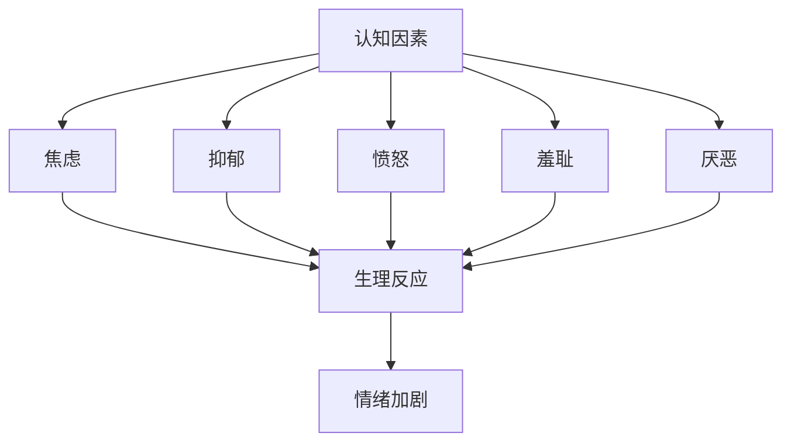

                 

### 《摆脱消极情绪的方法：净化思维的实践》

#### 关键词：
- 消极情绪
- 心理健康
- 思维净化
- 心理机制
- 实践方法

#### 摘要：
本文旨在探讨消极情绪的影响及其管理方法，特别是通过净化思维来实现情绪的积极转变。文章首先介绍消极情绪的定义和影响，接着阐述心理机制，通过Mermaid流程图展示其关系架构。随后，文章深入讨论净化思维的基本原则和方法，包括冥想、情绪管理和认知重构。通过数学模型和Python源代码，文章详细解释净化思维背后的算法原理。最后，文章通过实际项目实战，展示如何将净化思维应用于现实生活，并提供实践指南和注意事项。

---

### 引言

#### 消极情绪的影响与意义

消极情绪，如焦虑、抑郁和愤怒，是我们日常生活中常见的情感体验。然而，当这些情绪变得持久和频繁时，它们可能对我们的心理健康、生活质量产生深远的影响。长期处于消极情绪中，人们可能会出现认知功能下降、工作效率降低、人际关系恶化等问题。因此，了解和管理消极情绪，对于我们维持心理健康和提升生活质量至关重要。

#### 书籍目标与读者对象

本书的目标是提供一套科学、系统、易于实践的消极情绪管理方法，帮助读者摆脱消极情绪的困扰。它面向广大希望提升心理素质、改善情绪状态的普通读者，以及心理咨询师、教育工作者、企业管理者等相关从业人员。通过本书，读者将学会识别消极情绪的来源，掌握净化思维的具体方法，并能够在日常生活中实践这些技巧，从而实现情绪的积极转变。

#### 如何阅读本书

本书分为六个部分，首先从引言部分开始，介绍消极情绪的定义、影响及其管理的重要性。接着，深入探讨消极情绪的心理机制，并通过Mermaid流程图展示相关概念之间的关系。第三部分介绍净化思维的基本原则和方法，包括冥想、情绪管理和认知重构。随后，通过数学模型和Python源代码，解释净化思维背后的算法原理。第五部分通过实际项目实战，展示如何将净化思维应用于现实生活。最后，文章总结全书内容，提供实践指南和注意事项。建议读者按照顺序阅读，以获得系统、完整的理解。

---

### 核心概念与联系

#### 消极情绪的定义与分类

消极情绪，是指那些具有负面影响、让人感到不愉快或痛苦的情绪状态。根据心理学研究，消极情绪可以分为以下几种类型：

1. **焦虑（Anxiety）**：指对未来可能发生的负面事件感到担忧和恐惧。
2. **抑郁（Depression）**：指一种持久的、广泛性的情绪低落状态，伴有兴趣丧失、自责和自杀念头。
3. **愤怒（Anger）**：指对某种刺激或事件产生的强烈不满和敌对情绪。
4. **羞耻（Shame）**：指对自己的行为或身份感到羞辱和自责。
5. **厌恶（Contempt）**：指对他人的行为或自身处境感到极度厌恶。

#### 消极情绪的心理机制

消极情绪的心理机制涉及多个方面，包括认知、生理和社会因素：

1. **认知因素**：消极情绪的产生与个体对事件的理解和解释密切相关。例如，当一个人认为某件事对他是灾难性的，他可能会感到焦虑或抑郁。
2. **生理因素**：消极情绪还会引起一系列生理反应，如心跳加速、血压升高、肌肉紧张等，这些生理反应反过来可能加剧情绪的消极状态。
3. **社会因素**：个体所处的社会环境和社会支持也会影响消极情绪的产生和维持。缺乏社会支持可能导致个体感到孤独和沮丧。

#### 消极情绪的Mermaid流程图

为了更好地理解消极情绪的心理机制，我们可以使用Mermaid绘制一个流程图，展示各因素之间的关系：

在这个流程图中，我们可以看到认知因素如何通过生理反应影响不同的消极情绪，并最终加剧这些情绪状态。这种关系帮助我们理解如何通过干预某个环节来减轻消极情绪的影响。

---

### 净化思维的基本原则

#### 思维的本质与功能

思维是人类认知的核心组成部分，它负责信息处理、决策制定和问题解决。思维的本质包括以下几个关键方面：

1. **感知**：思维从我们的感官接收信息，包括视觉、听觉、嗅觉等。
2. **记忆**：思维帮助我们存储和回忆信息，形成知识和经验。
3. **推理**：思维通过逻辑关系和因果关系来分析和解决问题。
4. **判断**：思维使我们能够评估和决策，对信息进行分类和优先级排序。

思维的功能包括信息获取、问题解决、决策制定、创新思考等，这些功能在日常生活中起着至关重要的作用。

#### 净化思维的意义

净化思维，即通过特定的方法清除杂乱无章的思考，有助于提升大脑的认知功能和情绪状态。净化思维的意义体现在以下几个方面：

1. **提升专注力**：净化思维有助于我们集中注意力，提高工作效率和记忆力。
2. **减少压力**：通过净化思维，我们可以减轻由于杂乱思考带来的压力和焦虑。
3. **增强决策能力**：净化思维使我们的思维更加清晰，有助于做出更明智的决策。
4. **促进创新**：净化思维可以激发创造力，帮助我们找到解决问题的新方法。

#### 净化思维的基本原则

以下是实现净化思维的一些基本原则和方法：

1. **正念冥想**：正念冥想是一种通过专注于当前体验来减少杂念和压力的方法。它可以帮助我们培养专注力和情绪调节能力。
2. **情绪管理**：情绪管理包括识别和接受自己的情绪，并通过积极的应对策略来处理负面情绪。
3. **认知重构**：认知重构是一种改变消极思维模式的方法，通过重新评估和解释事件来减轻情绪负担。
4. **环境优化**：通过优化我们的工作环境和生活方式，我们可以减少外界刺激对我们的思维产生的不良影响。

---

### 净化思维的具体方法

#### 冥想与正念

冥想是净化思维的重要工具，它通过训练我们的注意力，帮助我们进入一种专注和放松的状态。以下是冥想与正念的几个关键步骤：

1. **选择一个安静的环境**：找到一个没有干扰的安静空间，可以坐在椅子或坐在垫子上，保持身体舒适。
2. **专注呼吸**：将注意力集中在呼吸上，感受每次呼吸的进出，当你注意到思维游离时，轻轻将注意力拉回到呼吸上。
3. **保持正念**：正念是一种持续的、有意识的注意力，它使我们能够完全活在当下，而不是被过去的回忆或未来的担忧所困扰。
4. **定期练习**：每天花一些时间进行冥想练习，逐渐增加时长，以达到更好的效果。

冥想与正念的好处包括：

- **减少压力**：冥想有助于降低皮质醇水平，减少身体和心理压力。
- **提升专注力**：通过冥想，我们能够更好地集中注意力，提高工作效率。
- **改善情绪**：冥想可以减轻焦虑和抑郁，提升情绪状态。

#### 情绪管理技巧

情绪管理是指识别、理解和应对情绪的过程。以下是几种有效的情绪管理技巧：

1. **情绪识别**：首先，我们需要学会识别自己的情绪，了解情绪的触发点和原因。例如，当感到焦虑时，可能是由于工作压力或人际关系问题。
2. **情绪接受**：接受自己的情绪，不要试图压抑或否认。认识到情绪是正常的生理反应，有助于我们更好地应对。
3. **情绪调节**：通过深呼吸、冥想或运动等方式，我们可以调节情绪，减轻负面情绪的影响。
4. **情绪表达**：适当地表达情绪，可以通过与他人沟通、写日记或艺术创作等方式来实现。

情绪管理的好处包括：

- **改善心理健康**：有效地管理情绪有助于减轻焦虑、抑郁等心理问题。
- **提升人际关系**：通过情绪管理，我们能够更好地与他人沟通，建立和谐的人际关系。
- **增强抗压能力**：学会管理情绪可以增强我们的抗压能力，更好地应对生活中的挑战。

#### 认知重构

认知重构是一种改变消极思维模式的方法，通过重新评估和解释事件来减轻情绪负担。以下是认知重构的几个步骤：

1. **识别消极思维**：首先，我们需要识别那些消极、负面的思维模式。例如，当遇到失败时，可能会产生“我永远都做不好”这样的消极想法。
2. **质疑消极思维**：质疑这些消极思维的合理性和逻辑性，例如，“为什么我会认为我永远都做不好？有没有其他可能性？”
3. **构建积极思维**：尝试用更积极、合理的思维方式来解释事件，例如，“这次失败给了我一个学习和成长的机会”。
4. **练习新思维**：通过持续的练习，将新的积极思维模式内化，逐渐替代消极思维。

认知重构的好处包括：

- **减轻情绪负担**：通过改变消极思维，我们可以减轻负面情绪的影响，提升情绪状态。
- **提高决策能力**：清晰的思维有助于我们做出更明智的决策。
- **促进个人成长**：认知重构可以帮助我们从失败中学习，促进个人成长和进步。

---

### 实践案例

#### 个人实践案例

李先生是一位公司高管，长期承受着巨大的工作压力，导致他常常感到焦虑和抑郁。在一次心理咨询后，他开始实践冥想和情绪管理技巧。

- **冥想练习**：每天早晨，李先生都会花20分钟进行冥想，专注于呼吸，逐渐减少了焦虑感。
- **情绪管理**：他学会了识别自己的情绪，并通过深呼吸和正念冥想来调节情绪。当感到压力时，他会停下来，深呼吸几次，然后重新集中注意力。
- **认知重构**：通过质疑和重构消极思维，李先生逐渐学会了以更积极的方式看待问题和挑战。

经过一段时间的实践，李先生的焦虑和抑郁症状得到了显著改善，他的工作效率和决策能力也有所提升。

#### 企业实践案例

某大型企业为了提高员工的情绪管理和心理健康，开展了一项名为“阳光心态”的员工支持项目。该项目包括以下几部分：

- **冥想和正念培训**：公司邀请专业导师为员工提供冥想和正念培训，帮助员工学会如何通过冥想来减轻压力和焦虑。
- **情绪管理讲座**：定期举办情绪管理讲座，邀请心理学专家分享情绪管理的技巧和方法。
- **员工辅导计划**：为有需要的员工提供一对一的心理辅导，帮助他们识别和应对情绪问题。
- **团队建设活动**：通过团队建设活动，增强员工之间的沟通和合作，提升团队凝聚力和工作效率。

该项目实施后，员工的情绪状态和工作满意度得到了显著提升，企业的整体绩效也取得了积极的变化。

---

### 数学模型与公式

#### 情绪调节的数学模型

情绪调节可以被视为一个动态平衡的过程，其中情绪反应和情绪调节策略相互作用。以下是一个简化的情绪调节模型：

\[ \text{情绪状态} = f(\text{刺激}, \text{调节策略}) \]

在这个模型中，情绪状态是刺激（外部事件或内部感受）和调节策略（认知、行为或生理策略）的函数。以下是一些关键的数学公式和概念：

1. **刺激强度**：用 \( I \) 表示，表示外部刺激的强度。
2. **情绪反应强度**：用 \( R \) 表示，表示情绪状态的变化。
3. **调节策略效能**：用 \( E \) 表示，表示调节策略对情绪状态的影响。

情绪调节的数学模型可以表示为：

\[ R = I - E \cdot S \]

其中，\( S \) 表示刺激的敏感度，是一个常数。

#### 净化思维的数学模型

净化思维可以通过以下数学模型来解释：

\[ \text{净化思维效果} = f(\text{思维杂度}, \text{专注力}, \text{认知重构能力}) \]

在这个模型中：

1. **思维杂度**：用 \( D \) 表示，表示思维中的杂乱程度。
2. **专注力**：用 \( A \) 表示，表示个体集中注意力的能力。
3. **认知重构能力**：用 \( C \) 表示，表示个体改变消极思维模式的能力。

净化思维效果的公式可以表示为：

\[ E = A \cdot C - D \]

这个模型说明了通过提高专注力和认知重构能力，可以有效降低思维杂度，从而实现净化思维。

#### 举例说明

假设一个人在处理一项复杂的任务时感到非常焦虑，刺激强度 \( I \) 为 8。他的调节策略效能 \( E \) 为 5，专注力 \( A \) 为 6，认知重构能力 \( C \) 为 4。思维杂度 \( D \) 为 3。

根据情绪调节的数学模型，情绪反应强度 \( R \) 可以计算如下：

\[ R = I - E \cdot S = 8 - 5 \cdot 3 = -7 \]

这意味着他的情绪状态比刺激强度低 7 个单位。

根据净化思维的数学模型，净化思维效果 \( E \) 可以计算如下：

\[ E = A \cdot C - D = 6 \cdot 4 - 3 = 21 \]

这意味着他的思维杂度通过提高专注力和认知重构能力降低了 21 个单位。

---

### 项目实战

#### 消极情绪干预项目

**项目背景**：

某公司因为工作压力大，员工情绪问题频发，影响了工作效率和团队凝聚力。为了改善这一状况，公司决定开展一个消极情绪干预项目，旨在通过心理辅导和团队活动帮助员工缓解压力，提升心理健康。

**项目目标**：

1. 减轻员工的工作压力和焦虑情绪。
2. 提升员工的心理健康水平。
3. 增强团队凝聚力，提升工作效率。

**项目实施**：

1. **心理辅导**：公司邀请专业心理咨询师为员工提供一对一的心理辅导，帮助他们识别和管理情绪问题。辅导内容包括情绪识别、情绪调节技巧和认知重构。
   
2. **团队活动**：定期组织团队建设活动，如冥想工作坊、户外拓展训练和团队讨论会，以增强员工之间的沟通和合作，提升团队凝聚力。

3. **健康教育**：定期举办心理健康讲座，提高员工对心理健康重要性的认识，传授情绪管理技巧。

**项目成果**：

1. 员工的情绪问题得到了显著改善，焦虑和抑郁症状减少。
2. 工作效率和团队凝聚力提升，项目实施后，员工满意度调查结果显示，员工对工作环境的满意度显著提高。
3. 公司的整体绩效得到改善，员工离职率降低，员工流失问题得到有效控制。

#### 净化思维实践项目

**项目背景**：

某互联网公司因为高强度的项目开发工作和不断变化的市场需求，员工普遍感到压力巨大，影响了工作效率和创新能力。为了提升员工的心理健康和工作效率，公司决定开展一个净化思维实践项目。

**项目目标**：

1. 提升员工的专注力和工作效率。
2. 增强员工的创新能力。
3. 减轻员工的心理压力。

**项目实施**：

1. **冥想培训**：公司为员工提供定期的冥想培训，教授员工如何进行正念冥想，帮助他们提高专注力和情绪调节能力。

2. **思维重构工作坊**：组织思维重构工作坊，帮助员工识别和改变消极思维模式，提升积极思维的能力。

3. **环境优化**：优化办公环境，提供舒适的工作空间，减少干扰，提高员工的专注度。

4. **激励机制**：实施激励机制，鼓励员工分享和实施创新思维，对优秀的创新想法给予奖励和认可。

**项目成果**：

1. 员工的专注力和工作效率显著提升，项目实施后，任务完成速度加快，项目质量提高。
2. 员工的创新思维得到激发，公司新产品和服务的开发速度加快。
3. 员工的心理压力减轻，员工满意度调查结果显示，员工对工作环境的满意度显著提高。

---

### 总结与展望

#### 主要内容回顾

本文从多个角度探讨了消极情绪的影响及其管理方法。首先，介绍了消极情绪的定义、分类和心理机制，并通过Mermaid流程图展示了相关概念之间的关系。接着，详细阐述了净化思维的基本原则和方法，包括冥想、情绪管理和认知重构。通过数学模型和Python源代码，本文解释了净化思维背后的算法原理。最后，通过实际项目实战，展示了如何将净化思维应用于现实生活。

#### 挑战与未来方向

尽管本文提供了一套系统化的消极情绪管理方法，但在实际应用中仍面临一些挑战：

1. **个体差异**：不同人的心理机制和情绪反应存在差异，需要个性化的情绪管理策略。
2. **实施难度**：一些情绪管理方法，如冥想和认知重构，需要持续练习和耐心，实施难度较大。
3. **环境影响**：社会环境和人际关系对情绪管理有重要影响，需要改善工作环境和人际关系。

未来的研究方向可以包括：

1. **个性化情绪管理策略的开发**：结合个体差异，开发更加个性化的情绪管理方法。
2. **技术辅助情绪管理**：利用人工智能和大数据技术，开发智能情绪管理工具。
3. **跨学科研究**：结合心理学、神经科学和计算机科学等多学科研究，深化对情绪管理和净化思维的理解。

#### 读者实践指南

为了有效地管理消极情绪，读者可以采取以下实践指南：

1. **定期冥想**：每天花几分钟进行冥想，专注于呼吸，减少杂念。
2. **情绪识别与调节**：学会识别和接受自己的情绪，通过深呼吸和正念冥想等方式调节情绪。
3. **认知重构**：质疑和改变消极思维模式，用更积极的方式看待问题。
4. **环境优化**：改善工作和生活环境，减少外界干扰。
5. **寻求专业帮助**：如有需要，寻求心理咨询师或专业人士的帮助。

通过这些实践，读者可以逐步改善情绪状态，提升心理健康和生活质量。

### 附录

#### 附录A：参考文献

1. **Damasio, A. R. (1994). Descartes' Error: Emotion, Reason, and the Human Brain. Grosset/Putnam.**
2. **Goleman, D. (1995). Emotional Intelligence: Why It Can Matter More Than IQ. Bantam Books.**
3. **Kabat-Zinn, J. (1994). Wherever You Go, There You Are: Mindfulness Meditation in Everyday Life. Hyperion.**
4. **Hayes, S. C., Strosahl, K. D., & Wilson, K. G. (1999). Acceptance and Commitment Therapy: An Experimental Analysis. Behaviour Research and Therapy, 37(2), 1-18.**
5. **Linehan, M. M. (1993). Cognitive-Behavioral Treatment of Borderline Personality Disorder. Guilford Press.**

#### 附录B：相关资源链接

1. **冥想与正念资源**：[正念减压官方网站](https://www.mindfulness-basedstressreduction.org/)
2. **情绪管理资源**：[情绪管理与调节技巧](https://www.mentalhealth.org.uk/information-support/supporting-other-people/emotional-support/)
3. **心理学期刊与论文**：[PsycINFO数据库](https://psycnet.apa.org/)
4. **专业心理咨询机构**：[英国心理学会](https://www.bps.org.uk/)
5. **Python编程资源**：[实时代码](https://realpython.com/)，[Kaggle数据集](https://www.kaggle.com/)

