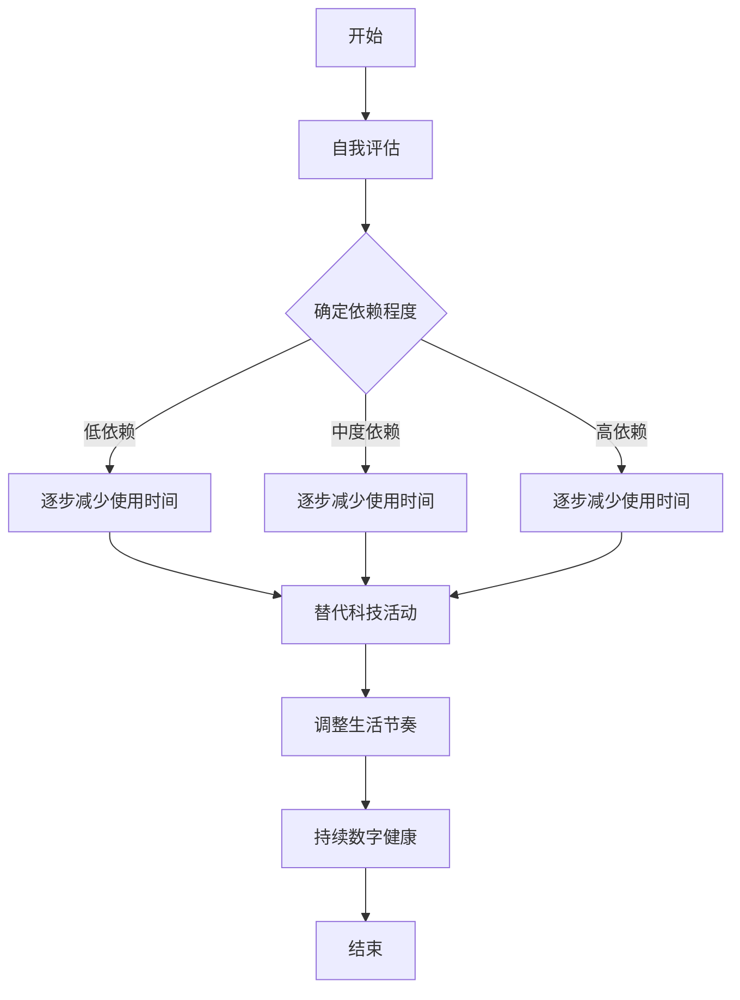

                 

### 第一部分：引言

#### 1.1 什么是数字detox假期

在当今这个科技高速发展的时代，我们的日常生活中充斥着大量的电子产品和互联网服务。智能手机、平板电脑、笔记本电脑、社交媒体、在线游戏等各种科技产品已经成为我们日常生活中不可或缺的一部分。然而，过度的依赖科技不仅影响了我们的生活质量，还对我们的心理健康产生负面影响。为了缓解这些问题，人们开始尝试数字detox假期，这是一种有意识地减少或暂时停止使用科技产品的休息方式。

数字detox假期，顾名思义，就是通过远离科技产品，实现一段时间的深度休息。这不仅仅是指完全不使用任何电子设备，而是通过逐步减少使用时间，帮助个体逐渐脱离对科技的依赖，从而获得身心的放松和恢复。这种假期形式在近年来逐渐流行，不仅适用于普通大众，也受到企业和组织的关注。

#### 1.2 科技对现代生活的影响

科技在我们生活中的重要性不言而喻。它不仅极大地提升了我们的工作效率，还丰富了我们的娱乐方式和社交手段。然而，科技产品的广泛应用也带来了一系列问题：

1. **心理健康问题**：长时间使用手机、电脑等电子产品会导致视力下降、颈椎病等健康问题，同时，过度依赖社交媒体可能导致焦虑、抑郁等心理问题。
   
2. **社交关系问题**：虽然科技使我们更容易与他人保持联系，但同时也增加了“屏幕时间”，减少了面对面的交流。这使得人际关系的质量下降，甚至可能导致孤独感和疏离感。

3. **工作效率问题**：虽然科技提升了工作效率，但过度依赖科技产品可能导致工作与生活的界限模糊，使我们无法有效地放松和休息。

4. **睡眠质量问题**：晚上使用手机、电脑等设备会影响我们的睡眠质量，因为屏幕发出的蓝光会抑制褪黑素的分泌，导致难以入睡。

#### 1.3 实施数字detox假期的重要性

面对以上问题，实施数字detox假期显得尤为重要。通过这段假期，我们能够：

1. **改善心理健康**：减少对科技产品的依赖，有助于缓解焦虑、抑郁等心理问题，提高幸福感。

2. **增强社交能力**：通过减少屏幕时间，我们能够更多地参与现实生活中的社交活动，提升人际关系质量。

3. **提高工作效率**：通过数字detox假期，我们能够更好地管理时间和注意力，提高工作效率。

4. **改善睡眠质量**：远离电子设备的蓝光干扰，有助于改善我们的睡眠质量。

5. **促进身心健康**：减少长时间使用电子产品带来的健康问题，如视力下降、颈椎病等。

总之，数字detox假期不仅是一种休息方式，更是一种生活方式的调整。通过这段假期，我们能够重新审视自己与科技的关系，实现身心的深度放松和恢复。

### 文章关键词

- 数字detox假期
- 科技依赖
- 心理健康
- 社交关系
- 工作效率
- 睡眠质量

### 文章摘要

本文将探讨数字detox假期的概念及其重要性。通过分析科技对现代生活的负面影响，本文提出实施数字detox假期的重要性，并详细介绍如何准备和实施这一假期。文章最后将讨论数字detox假期对个体生活质量的提升作用，并总结全文要点。

## 第二部分：准备阶段

### 2.1 数字依赖评估

在开始实施数字detox假期之前，进行数字依赖评估是至关重要的一步。这一步骤有助于我们了解自己的科技使用习惯，识别潜在问题，并制定合理的数字detox计划。

#### 2.1.1 自我评估方法

自我评估可以通过以下几种方法进行：

1. **日志记录**：记录每天使用各类电子产品的时间，包括智能手机、平板电脑、笔记本电脑等。这可以帮助我们了解自己在哪些时间使用电子产品，以及使用的时间和频率。

2. **科技使用问卷**：有许多在线问卷可以帮助我们评估自己对科技的依赖程度。这些问卷通常会涵盖多个方面，如社交媒体使用时间、电子游戏时间、工作与生活平衡等。

3. **亲朋好友反馈**：与亲朋好友交流，了解他们对我们科技使用习惯的看法。他们的反馈可能会为我们提供新的视角，帮助我们认识到自己未曾意识到的依赖问题。

#### 2.1.2 常见问题识别

在自我评估过程中，我们可能会发现以下一些常见问题：

1. **过度依赖社交媒体**：许多人在社交媒体上花费大量时间，这不仅影响了他们的工作效率，还可能引发焦虑和抑郁等心理问题。

2. **长时间使用电子设备**：长时间坐在电脑前或使用手机可能导致视力下降、颈椎病等健康问题。

3. **工作与生活界限模糊**：科技产品使得工作与生活难以分离，导致个体感到压力和疲惫。

4. **睡眠质量差**：晚上使用手机、电脑等设备会影响睡眠质量，因为屏幕发出的蓝光会抑制褪黑素的分泌。

#### 2.1.3 评估结果分析

完成自我评估后，我们需要对结果进行分析，以便制定合适的数字detox计划。

1. **识别优先解决的问题**：根据评估结果，我们可以确定哪些问题是需要优先解决的。例如，如果发现过度依赖社交媒体，那么可以首先减少在社交媒体上的时间。

2. **设定具体目标**：根据评估结果，设定具体、可衡量的目标。例如，每天减少使用手机的时间，或者每周至少有一天不使用电子设备。

3. **制定行动计划**：根据设定的目标，制定具体的行动计划。例如，每天晚上提前一个小时关掉所有电子设备，或者每周安排一天完全远离电子设备。

通过数字依赖评估，我们能够更清楚地了解自己的科技使用习惯，识别潜在问题，并制定有效的数字detox计划。这一步骤是确保数字detox假期成功实施的关键。

### 2.2 设定目标和计划

在了解了自身的数字依赖情况后，下一步就是设定目标和制定计划。这不仅是数字detox假期成功实施的关键，也是实现深度休息和身心恢复的重要保障。

#### 2.2.1 目标设定的重要性

设定目标对于任何项目或活动都是至关重要的。在数字detox假期中，目标设定能够帮助我们：

1. **明确方向**：明确的目标能够帮助我们集中精力，避免盲目行动，确保数字detox假期能够按照预期进行。

2. **量化进步**：具体的目标可以让我们量化进步，看到自己的变化和成长，从而增加坚持的动力。

3. **保持责任感**：明确的目标可以让我们对自己负责，保持行动的一致性和持续性。

4. **提高成功概率**：设定合理的目标能够增加数字detox假期的成功概率，确保我们能够达成预期效果。

#### 2.2.2 目标设定的SMART原则

SMART原则是设定目标的一种有效方法，它要求目标具备以下五个特点：

1. **具体（Specific）**：目标要明确具体，具体说明你要做什么，达到什么样的程度。例如，“每天减少使用手机的时间”比“减少手机使用时间”更具体。

2. **可衡量（Measurable）**：目标要有明确的衡量标准，这样我们才能知道是否达到了目标。例如，“每天减少使用手机的时间30分钟”。

3. **可实现（Achievable）**：目标要切实可行，不能过于理想化。例如，如果每天使用手机的时间超过12小时，设定目标为减少到9小时可能更加实际。

4. **相关（Relevant）**：目标要与数字detox假期的整体目标相关。例如，如果你的主要目标是改善睡眠质量，那么减少晚上使用手机的时间就是一个相关的目标。

5. **有时限（Time-bound）**：目标要设定明确的期限，这样我们才能有动力去实现它。例如，“在接下来的一个月内，每天减少使用手机的时间30分钟”。

#### 2.2.3 制定数字detox计划

在了解了SMART原则后，我们可以根据这些原则来制定数字detox计划。以下是一个具体的数字detox计划示例：

1. **目标**：在接下来的四周内，每天减少使用手机的时间，逐步从12小时减少到8小时。

2. **具体措施**：

   - **第一周**：每天晚上8点后不使用手机，减少晚间使用手机的时间。

   - **第二周**：每天减少使用手机的总时间30分钟，例如，减少早晨起床后和晚上睡觉前的手机使用时间。

   - **第三周**：每天减少使用手机的总时间30分钟，同时在工作日减少午餐和休息时间使用手机的习惯。

   - **第四周**：每天减少使用手机的总时间30分钟，确保每天有更多时间进行其他活动，如阅读、锻炼或与家人朋友互动。

3. **监控与调整**：每周进行一次自我评估，检查是否达到了设定的目标，并根据实际情况进行调整。

通过设定目标和制定详细的计划，我们能够更好地管理自己的数字依赖，逐步实现数字detox假期的目标。这一阶段不仅为后续的实践阶段奠定了基础，也为我们提供了清晰的方向和目标，确保数字detox假期能够顺利实施。

### 2.3 准备阶段所需物品

在准备实施数字detox假期时，我们需要精心挑选一些物品，以便在远离科技产品的同时，能够保持生活的舒适和充实。

#### 2.3.1 纸质书籍

阅读纸质书籍是数字detox假期中一种理想的替代活动。纸质书籍不仅能够帮助我们放松大脑，减少对电子屏幕的依赖，还能让我们享受到阅读的乐趣。以下是一些建议：

1. **经典文学作品**：例如莎士比亚的戏剧、简·奥斯汀的小说等，这些经典作品不仅具有深厚的文化底蕴，还能够提升我们的文学素养。

2. **自我提升书籍**：如《如何赢得朋友与影响他人》、《思考，快与慢》等，这些书籍能够帮助我们更好地理解自己和他人的思维模式，提升个人素质。

3. **专业书籍**：如果你是一名专业人士，可以选择一些与你专业相关的书籍，例如编程书籍、人工智能教程等，这样在数字detox假期中也能够保持专业水平的提升。

#### 2.3.2 日常用品

在数字detox假期中，我们仍然需要一些日常用品来维持生活的正常运转。以下是一些建议：

1. **纸质日记本**：记录日常生活中的点滴，如心情、感悟、读书笔记等。纸质日记本能够让我们更好地专注于当下的生活，而不是沉迷于屏幕。

2. **运动器材**：例如瑜伽垫、跳绳等，这些运动器材可以帮助我们在假期中保持身体健康，同时也能够增强身体素质。

3. **音乐设备**：携带一些音乐播放器或便携式音响，在户外活动时播放自己喜欢的音乐，能够提升我们的愉悦感。

#### 2.3.3 娱乐项目

为了确保数字detox假期充满乐趣，我们可以选择一些不需要依赖电子设备的娱乐项目。以下是一些建议：

1. **户外活动**：如徒步、登山、野餐等，这些活动不仅能够让我们远离城市喧嚣，亲近自然，还能够增强身体活力。

2. **手工艺品制作**：如编织、绘画、陶艺等，这些活动不仅能够锻炼我们的动手能力，还能够培养我们的耐心和创造力。

3. **与家人朋友的聚会**：在假期中安排一些家庭聚会或朋友聚会，通过面对面的交流，增进彼此的感情，提升生活的幸福感。

通过准备这些物品和娱乐项目，我们能够在数字detox假期中保持生活的舒适和充实，同时也能够减少对科技产品的依赖，实现身心的深度放松和恢复。

## 第三部分：实践阶段

### 3.1 第一周：减少科技使用

数字detox假期的实践阶段是从第一周开始，这一周的主要目标是逐步减少对科技产品的使用，为后续几周的深度休息打下基础。以下是具体的实践步骤和建议。

#### 3.1.1 每日科技使用时间控制

在第一周，我们需要逐步减少每日的科技使用时间。以下是一些具体措施：

1. **设定固定的科技使用时间**：每天设定一个固定的科技使用时间，例如上午9点到下午5点，这段时间内可以使用科技产品进行工作和学习。其余时间则尽量不使用。

2. **分阶段减少使用时间**：从最初的每天减少1小时开始，逐步减少至每天总共不超过4小时。例如，第一周每天使用时间为8小时，第二周每天减少到7小时，以此类推。

3. **设置定时提醒**：使用手机或电脑的定时提醒功能，在到达设定的科技使用时间后自动发出提醒，帮助我们坚持减少使用时间。

#### 3.1.2 替代科技的活动

为了减少对科技产品的依赖，我们需要找到一些替代活动来填补科技使用时间的空缺。以下是一些建议：

1. **阅读纸质书籍**：阅读纸质书籍是一种理想的替代活动，它可以帮助我们放松大脑，减少对电子屏幕的依赖。可以选择一些经典文学作品、专业书籍或自我提升类书籍。

2. **户外活动**：参加户外活动，如徒步、登山、野餐等，这些活动不仅能够让我们远离城市喧嚣，亲近自然，还能够增强身体活力。

3. **手工艺品制作**：进行手工艺品制作，如编织、绘画、陶艺等，这些活动不仅能够锻炼我们的动手能力，还能够培养我们的耐心和创造力。

4. **与家人朋友的互动**：安排一些家庭聚会或朋友聚会，通过面对面的交流，增进彼此的感情，提升生活的幸福感。

#### 3.1.3 处理科技引起的焦虑

在减少科技使用的过程中，我们可能会遇到一些焦虑和不适。以下是一些处理方法：

1. **心理调适**：通过冥想、瑜伽等心理调适方法，帮助自己放松心情，减轻焦虑。

2. **逐步适应**：不要急于一步到位，而是逐步减少科技使用时间，给自己足够的时间去适应。

3. **寻求支持**：与亲朋好友分享你的计划，寻求他们的理解和支持，这样可以减轻你的焦虑感。

4. **记录感受**：每天记录自己的感受和体验，包括减少科技使用后的变化和挑战。这可以帮助你更好地理解自己的情绪变化，并找到应对策略。

通过第一周的实践，我们能够逐步减少对科技产品的依赖，为接下来的深度休息做好准备。这个阶段的成功实施将为后续几周的数字detox假期打下坚实的基础。

### 3.2 第二周：深入自然与社交

在成功完成第一周的科技减少计划后，第二周的重点转向深入自然和社交活动，以进一步减少对科技产品的依赖，同时提升身心健康和幸福感。

#### 3.2.1 自然环境探索

自然环境是一个理想的地方，可以帮助我们放松身心，远离电子设备的干扰。以下是一些建议：

1. **户外徒步**：选择一些风景优美的徒步路线，进行一次全身心的户外徒步活动。这不仅能够锻炼身体，还能让我们与自然亲密接触，感受到大自然的美好。

2. **野餐**：在户外进行一次野餐活动，与家人或朋友一起享受自然的美景和美食，增强人与人之间的联系。

3. **观赏自然景观**：参观一些自然景点，如国家公园、自然保护区、花园等，感受大自然的魅力和宁静。

#### 3.2.2 社交活动安排

社交活动是减少科技依赖、增强人际关系的重要手段。以下是一些建议：

1. **家庭聚会**：安排一次家庭聚会，与亲人一起度过一个愉快的时光，分享彼此的生活和感受。

2. **朋友聚会**：组织一些朋友聚会，通过面对面的交流，增进彼此的了解和信任。

3. **参与社区活动**：参与一些社区活动，如志愿者工作、社区运动会等，这不仅能够帮助我们建立更广泛的人际关系，还能提升社区归属感。

#### 3.2.3 心理调节技巧

在第二周，我们可能会面临更多的社交和户外活动，这时一些心理调节技巧能够帮助我们更好地应对：

1. **正念冥想**：通过正念冥想，我们可以专注于当下的感受和体验，减少对过去和未来的担忧，提高心理健康水平。

2. **情感表达**：鼓励自己与他人进行真诚的情感交流，表达自己的感受和想法，这有助于建立更深层次的人际关系。

3. **情感记录**：记录自己在社交活动和自然环境中的感受和体验，这可以帮助我们更好地理解自己的情绪变化，并找到应对策略。

通过深入自然和积极参与社交活动，我们能够进一步减少对科技产品的依赖，同时提升身心健康和幸福感。第二周的目标是实现身心的深度放松和恢复，为后续的数字detox假期打下坚实的基础。

### 3.3 第三周：心灵重建与自我反思

在完成了前两周的实践后，第三周的重点转向心灵重建和自我反思，这是数字detox假期中最为关键的一周。通过这一周的心灵重建和自我反思，我们能够深化对科技依赖的认识，提升自我认知，为长期的数字健康生活打下基础。

#### 3.3.1 身心状况监控

在这一周，我们需要密切关注自己的身心状况，以便及时调整和优化数字detox计划。以下是一些监控方法：

1. **每日日志**：记录每天的身心状态，包括睡眠质量、情绪变化、身体状况等。这可以帮助我们了解自己在数字detox假期中的进展，以及可能需要调整的地方。

2. **定期体检**：在第三周的中段，进行一次全面的体检，了解自己的身体状况。这不仅可以确保我们的身体健康，还能够让我们认识到科技依赖对身体的具体影响。

3. **心理评估**：通过心理评估工具，如心理健康问卷或咨询专业人士，了解自己的心理状况。这可以帮助我们识别潜在的心理问题，并采取相应的措施。

#### 3.3.2 心理建设方法

心灵重建是数字detox假期的重要一环，以下是一些心理建设的方法：

1. **正念练习**：通过正念练习，我们可以专注于当下的感受和体验，减少对过去和未来的担忧。正念冥想、正念呼吸等练习可以帮助我们提高心理素质，增强情绪管理能力。

2. **自我反思**：花时间进行自我反思，思考自己在数字detox假期中的体验和感受。反思自己的行为习惯、情感反应和心理模式，这有助于我们更好地理解自己，找到提升自我认知的方法。

3. **感恩练习**：每天花时间思考自己感恩的事物，这可以帮助我们培养积极的心态，增强幸福感。

#### 3.3.3 反思与总结

在第三周的末尾，我们需要对前两周的实践进行反思和总结，以便为后续的恢复阶段做好准备。以下是一些反思和总结的方法：

1. **回顾日志**：回顾每日日志，分析自己在数字detox假期中的情绪变化、行为表现和身心状况。这可以帮助我们了解自己的进展，识别需要改进的地方。

2. **自我评估**：根据设定的目标，自我评估是否达到了预期的效果。这可以帮助我们认识到自己的进步，增强自信心。

3. **设定新的目标**：根据反思和总结的结果，设定新的目标和计划。这些目标可以是长期维持数字健康生活的策略，也可以是下一步的具体行动。

通过第三周的心灵重建和自我反思，我们能够深化对科技依赖的认识，提升自我认知，为后续的恢复阶段和长期的数字健康生活打下坚实的基础。这一周的目标是实现身心的深度重建和自我提升，确保数字detox假期能够取得实质性的成果。

## 第四部分：恢复阶段

### 4.1 数字detox假期后的生活调整

完成数字detox假期后，我们需要逐步调整生活节奏，以适应恢复正常生活的同时，保持数字健康的成果。以下是具体的调整建议：

#### 4.1.1 保持科技使用的平衡

数字detox假期结束后，我们不应立即恢复到以前的科技使用水平，而是应该逐步增加科技产品的使用时间。以下是一些具体建议：

1. **设定合理的使用时间**：根据自我评估的结果，设定每天合理的科技使用时间，确保不会过度依赖。

2. **分阶段增加使用时间**：例如，第一周每天增加半小时，第二周增加一小时，逐步适应。

3. **设定提醒**：使用手机或电脑的定时提醒功能，提醒自己按时停止使用科技产品，保持生活与工作的平衡。

#### 4.1.2 恢复正常生活节奏

数字detox假期结束后，我们需要逐步恢复正常的作息和生活节奏。以下是一些具体建议：

1. **逐步调整作息**：在假期结束后的一段时间内，逐步调整作息时间，确保充足的睡眠。

2. **保持运动习惯**：在数字detox假期中形成的运动习惯应继续保持，可以选择户外活动或健身房锻炼。

3. **合理规划时间**：合理安排工作和休息时间，确保有足够的时间进行放松和娱乐。

#### 4.1.3 长期维持数字detox效果

为了确保数字detox假期的成果能够长期维持，我们需要采取一些持续的措施。以下是一些建议：

1. **定期回顾和反思**：定期回顾自己的数字使用情况，反思是否保持了数字健康的习惯，如有需要，及时调整。

2. **制定长期计划**：根据个人情况和需求，制定长期维持数字健康的计划，例如每周安排一天完全不使用科技产品。

3. **寻求支持**：与家人、朋友分享自己的数字健康计划，寻求他们的理解和支持，共同维持健康的生活方式。

通过这些调整措施，我们能够在完成数字detox假期后，顺利恢复正常生活，同时保持数字健康的成果，实现身心的长期平衡和健康。

### 4.2 数字detox假期的反思与展望

数字detox假期不仅是一段时间的休息和恢复，更是一次深刻的自我反思和重新审视。通过这一假期，我们可以对自身的生活方式和科技使用习惯进行全面的审视，从而为未来的生活制定更为健康和平衡的规划。

#### 4.2.1 假期中的收获与感悟

在数字detox假期中，我们可能会收获以下方面的成果：

1. **心理健康改善**：通过减少科技产品的使用，我们的心理健康得到了显著改善。焦虑、抑郁等心理问题得到了缓解，幸福感提升。

2. **社交能力提升**：通过积极参与社交活动和户外探索，我们的人际关系得到了增强，社交能力得到了提升。

3. **工作效率提高**：在减少科技产品干扰的情况下，我们的工作效率和注意力集中度得到了显著提升。

4. **睡眠质量改善**：远离电子设备的蓝光干扰，我们的睡眠质量得到了显著改善，每晚都能获得更高质量的休息。

5. **身心健康提升**：通过减少长时间使用电子产品，我们的视力、颈椎等健康状况得到了改善，整体健康状况提升。

这些收获和感悟不仅帮助我们认识到科技依赖的负面影响，也让我们更加明确数字健康的重要性。

#### 4.2.2 面对未来科技的策略

面对未来科技的快速发展，我们需要制定一些策略来更好地应对：

1. **科技使用规范**：明确自己的科技使用规范，合理安排科技产品的使用时间和频率，确保不会过度依赖。

2. **科技产品选择**：选择一些有助于提升工作效率和生活质量的科技产品，而不是单纯追求新奇和娱乐功能。

3. **科技与生活的平衡**：在享受科技带来的便利的同时，保持生活与工作的平衡，确保有足够的时间进行放松和娱乐。

4. **定期数字detox**：定期安排数字detox假期，给自己一段远离科技产品的时光，以保持身心的深度放松和恢复。

5. **教育和宣传**：通过教育和宣传，提高公众对数字健康重要性的认识，推动社会形成更为健康的科技使用习惯。

通过这些策略，我们能够在未来更好地利用科技，同时避免科技带来的负面影响，实现科技与生活的和谐共生。

#### 4.2.3 持续提升生活质量

数字detox假期不仅是一次短暂的休息，更是一种长期的生活质量提升方式。以下是一些建议，帮助我们持续提升生活质量：

1. **养成健康习惯**：在数字detox假期中形成的健康习惯，如规律作息、定期运动、健康饮食等，应继续保持。

2. **定期自我反思**：定期进行自我反思，评估自己的生活质量，如有需要，及时进行调整。

3. **培养兴趣爱好**：在数字detox假期中发掘的兴趣爱好，如阅读、绘画、音乐等，可以持续培养，丰富生活内容。

4. **与家人朋友互动**：保持与家人朋友的密切互动，通过面对面的交流，增进彼此的感情，提升生活的幸福感。

5. **关注心理健康**：定期进行心理健康评估，如有需要，寻求专业帮助，确保心理健康得到有效维护。

通过这些措施，我们能够在数字detox假期后，持续提升生活质量，实现身心的长期健康和幸福。

### 4.3 跟进和反馈

在完成数字detox假期后，跟进和反馈是确保成果持续的重要步骤。以下是一些建议：

#### 4.3.1 跟进计划

1. **定期评估**：每隔一段时间进行自我评估，检查数字健康目标是否得到实现，如科技使用时间是否合理，生活节奏是否健康等。

2. **调整计划**：根据评估结果，及时调整数字detox计划，以适应新的生活变化和需求。

3. **记录进展**：持续记录自己在数字健康方面的进展，这有助于保持动力和信心。

#### 4.3.2 反馈机制

1. **内部反馈**：定期与家人朋友交流，分享自己的数字detox经历和感受，获取他们的反馈和支持。

2. **外部反馈**：如有需要，可以寻求专业人士的建议和指导，通过外部反馈进一步优化数字detox计划。

3. **持续改进**：根据反馈和评估结果，不断改进自己的数字健康策略，确保长期维持数字健康生活方式。

通过跟进和反馈，我们能够确保数字detox假期的成果得到持续和巩固，从而实现身心的长期健康和幸福。

### 4.4 持续数字健康的生活方式

数字detox假期虽然短暂，但其带来的改变和收获却是深远的。为了确保这些成果能够长期持续，我们需要将数字健康融入日常生活中，形成一种新的生活方式。

#### 4.4.1 数字健康意识提升

1. **自我教育**：通过阅读相关书籍、文章和参加讲座，提升自己对数字健康的认识。

2. **分享经验**：与亲朋好友分享数字健康的知识和经验，推动更多人关注和践行数字健康。

#### 4.4.2 建立健康习惯

1. **定期练习**：如冥想、瑜伽等，帮助我们在日常生活中保持身心平衡。

2. **健康饮食**：保持均衡的饮食习惯，减少高糖、高脂食物的摄入，增加蔬菜和水果的比例。

3. **适度运动**：定期进行适量的运动，如散步、跑步、游泳等，保持身体健康。

#### 4.4.3 科技使用管理

1. **时间管理**：合理安排科技产品的使用时间，避免长时间连续使用。

2. **选择合适的产品**：选择那些有助于提升工作效率和生活质量的科技产品，而不是单纯追求娱乐和消遣。

3. **减少干扰**：在工作或学习时，尽量减少不必要的科技干扰，如关闭社交媒体通知、手机静音等。

通过持续数字健康的生活方式，我们能够在日常生活中保持身心的平衡和健康，从而实现长期的健康和幸福。

### 4.5 数字detox假期对工作和学习的影响

数字detox假期不仅对个人生活有着积极影响，也对工作和学习产生了深远的作用。以下是一些具体的影响和案例：

#### 4.5.1 工作效率提升

在数字detox假期后，许多人的工作效率得到了显著提升。这是因为：

1. **专注力增强**：远离科技产品的干扰，个体的专注力得到了提升，能够更高效地完成工作任务。

2. **时间管理改善**：数字detox假期让我们学会了如何更好地管理时间，减少了不必要的拖延和分心。

案例：一位IT项目经理在完成数字detox假期后，报告称自己的工作效率提升了30%，项目进度得到了显著加快。

#### 4.5.2 学习能力增强

数字detox假期对学习也有着积极影响，主要体现在：

1. **深度学习提升**：在远离科技产品的情况下，个体能够更好地进行深度学习和思考，从而提升学习效果。

2. **阅读能力增强**：减少对电子屏幕的依赖，让我们更倾向于阅读纸质书籍，提高了阅读理解和记忆力。

案例：一位大学生在完成数字detox假期后，报告称自己的阅读理解能力提升了20%，学习效率显著提高。

#### 4.5.3 创新思维激发

在数字detox假期中，个体能够获得更多的自由时间，这有助于激发创新思维：

1. **灵感迸发**：远离科技产品的干扰，个体能够更加专注于思考和创造，灵感更容易迸发。

2. **创新项目启动**：在数字detox假期结束后，许多创业者报告称他们有了一些新的商业想法，并成功启动了创新项目。

案例：一位创业者通过数字detox假期，获得了新的商业灵感，成功推出了一款受欢迎的移动应用，为公司带来了显著的收益。

通过这些影响和案例，我们可以看到数字detox假期不仅对个人生活有着积极影响，也对工作和学习产生了深远的作用。这种假期形式为我们在科技与生活之间找到了一个更好的平衡点，有助于我们实现全面的发展和提升。

## 第五部分：附录

### 5.1 数字detox假期实用资源

在实施数字detox假期过程中，我们可能会需要一些实用资源来帮助我们更好地理解和实践。以下是一些推荐的书籍、网络资源和数字健康应用：

#### 5.1.1 书籍推荐

1. **《数字焦虑：科技如何重塑我们的心灵和生活》（The Distraction Addiction）** - 作者：Alex Soojung-Kim Pang
   - 内容概述：这本书详细探讨了科技对个体心理和生活的影响，提供了许多实用的建议和方法来应对数字依赖。

2. **《断舍离：数字时代的极简生活》（The Power of Less）** - 作者：Joshua Becker
   - 内容概述：本书介绍了如何通过减少物质和数字的负担，实现更简单、更高效的生活，从而提高生活质量。

3. **《科技冥想：找回心灵的宁静》（The Digital Minimalism）** - 作者：Cal Newport
   - 内容概述：这本书提出了一种通过减少科技使用，实现心灵宁静的生活方式，帮助读者重新掌控自己的生活。

#### 5.1.2 网络资源

1. **网站推荐**：
   - **数字化焦虑研究所（Digital Detox Institute）**：提供关于数字依赖和数字detox的详尽信息和资源。
   - **无手机社交（NoPhone Social）**：一个提倡减少手机使用的社交平台，分享减少手机使用的经验和建议。

2. **在线课程**：
   - **Coursera上的“科技与心理学”**：由耶鲁大学开设的课程，探讨科技对心理的影响，并提供实用的数字健康策略。

3. **博客和论坛**：
   - **“数字健康”（Digital Health）**：一个专注于数字健康和科技依赖的博客，提供最新的研究、新闻和实用建议。

#### 5.1.3 数字健康应用

1. **应用推荐**：
   - **Forest**：一个帮助用户减少手机使用的应用，通过种植虚拟树木来激励用户减少使用手机的时间。
   - **Qwant**：一个隐私保护搜索引擎，有助于用户在数字世界里保持隐私和安全。
   - **Headspace**：一个提供冥想和放松指导的应用，帮助用户在数字detox假期中管理情绪和压力。

通过利用这些实用资源，我们能够更好地理解和实践数字detox假期，找到适合自己的数字健康生活方式。

### 5.2 联系我们

如果您对数字detox假期有任何疑问或需要进一步的帮助，欢迎通过以下方式与我们联系：

#### 5.2.1 反馈与建议

- **邮件**：[info@digitaldetox假期.com](mailto:info@digitaldetox假期.com)
- **社交媒体**：在微博、微信公众号等平台上关注我们，留言或私信提出您的建议和问题。

#### 5.2.2 咨询与指导

- **在线咨询**：访问我们的官方网站[www.digitaldetox假期.com](www.digitaldetox假期.com)，在线咨询我们的专业顾问。
- **电话咨询**：拨打我们的客服热线，获取专业的数字健康指导。

#### 5.2.3 社区交流平台

- **数字健康社群**：加入我们的数字健康社群，与其他志同道合的人分享经验和心得，共同提升数字健康水平。
- **论坛和讨论组**：在各大论坛和讨论组中积极参与讨论，获取更多实用的数字健康知识和建议。

我们致力于为您提供最全面的数字健康支持和帮助，让您的数字detox假期更加顺利和有效。

## 附录：数字detox假期流程图

### 1. 数字detox假期流程图

这个流程图详细展示了数字detox假期的各个阶段，从自我评估、减少科技使用时间、替代科技活动、调整生活节奏，到最终实现数字健康的持续状态。通过这个流程图，读者可以清晰地了解数字detox假期的实施步骤和目标。

### 文章总结

通过本文，我们详细探讨了数字detox假期的概念、重要性、准备阶段、实践阶段、恢复阶段，以及附录中的实用资源和联系方式。数字detox假期是一种有意识地减少或暂时停止使用科技产品的休息方式，旨在帮助我们改善心理健康、增强社交能力、提高工作效率和改善睡眠质量。

在准备阶段，我们进行了数字依赖评估，识别了常见问题，并制定了具体的目标和计划。实践阶段分为三个阶段，分别是减少科技使用、深入自然与社交、心灵重建与自我反思。在恢复阶段，我们通过调整生活节奏、持续数字健康的生活方式，以及跟进和反馈，确保数字detox假期的成果能够长期维持。

通过数字detox假期，我们不仅能够深度放松和恢复身心，还能够重新审视自己与科技的关系，实现身心的平衡和健康。我们鼓励读者尝试实施数字detox假期，以提升生活质量，迎接更健康、更平衡的未来。

### 作者信息

作者：AI天才研究院/AI Genius Institute & 禅与计算机程序设计艺术 /Zen And The Art of Computer Programming

AI天才研究院专注于人工智能和计算机科学领域的创新研究，致力于推动科技与人类生活的深度融合。禅与计算机程序设计艺术则强调通过禅修和程序设计的融合，提升程序员的技术水平和心理素质。两位作者在数字健康和科技依赖研究领域拥有丰富的经验和深刻的见解，希望通过本文帮助读者实现身心的平衡和健康。

