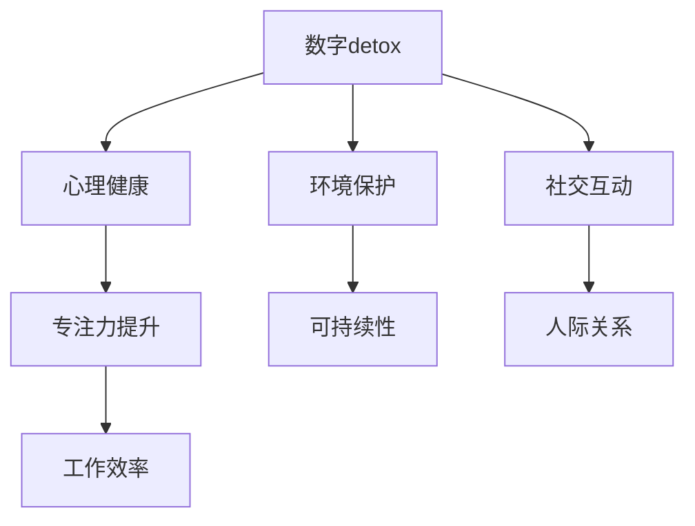

                 

# 数字detox度假村：远离科技的深度休息体验

> 关键词：数字detox、心理健康、自然疗愈、技术断连、抗干扰能力、可持续发展

> 摘要：在数字化时代，人们越来越依赖科技，但过度依赖也带来了诸多负面影响。本文探讨数字detox（数字排毒）的概念及其重要性，详细介绍数字detox的基本原则和实践指南，并分析数字detox度假村的建立与运营。同时，文章还展望了数字detox的未来趋势，并提出相关的数学模型和实际项目案例，以期为读者提供有益的启示。

## 第一部分：为何需要数字detox

### 第1章：数字世界的诱惑与影响

#### 1.1 网络成瘾：定义与症状

网络成瘾，又称互联网成瘾或网络依赖，是指个体过度使用互联网，导致其社会、职业、心理等方面出现明显功能障碍的一种行为障碍。根据美国精神病学会《精神疾病诊断与统计手册》第5版（DSM-5），网络成瘾包括以下症状：

- 过度花费大量时间在互联网上，以至于影响了日常生活、工作或学习。
- 尝试减少或停止上网时，出现强烈的渴望或无法控制上网行为。
- 由于上网而忽略了其他重要的活动，如与家人和朋友相处、兴趣爱好等。
- 因上网而导致社会、职业或其他重要功能受损。
- 在上网过程中感到愉悦或兴奋，但一旦停止，则可能出现焦虑、抑郁等负面情绪。

#### 1.2 数字时代的压力：心理与身体健康的影响

随着数字技术的快速发展，人们的生活越来越依赖互联网和移动设备。然而，这种依赖也带来了一系列负面影响，包括心理压力和身体健康问题。

**心理压力：**

1. **焦虑和抑郁**：长时间使用电子设备，尤其是在社交媒体上浏览信息，可能导致焦虑和抑郁症状。
2. **社交隔离**：过度依赖数字设备可能导致个体与现实生活中的人际关系疏远，产生社交隔离感。
3. **工作压力**：许多人沉迷于电子邮件和即时通讯工具，导致工作效率降低，增加工作压力。

**身体健康问题：**

1. **视力问题**：长时间盯着电子屏幕可能导致视力疲劳、近视等。
2. **睡眠障碍**：夜间使用电子设备，特别是蓝光屏幕，可能干扰睡眠质量，导致失眠。
3. **颈椎和腰椎问题**：长时间保持不正确的坐姿和使用电子设备可能导致颈椎和腰椎问题。

#### 1.3 数字依赖：为何我们需要数字detox

数字依赖已成为现代社会的一个普遍现象，许多人难以摆脱对数字设备的依赖。数字detox（数字排毒）是一种通过减少或停止使用数字设备来改善身心健康的方法。以下是数字detox的几个重要原因：

1. **缓解心理压力**：通过减少对数字设备的依赖，人们可以减少与工作、社交媒体和其他数字任务相关的压力。
2. **改善身体健康**：减少使用电子设备可以减少视力疲劳、颈椎和腰椎问题等身体健康问题。
3. **增强社交互动**：数字detox有助于人们将更多时间投入到现实生活中的人际交往，从而改善社交关系。
4. **促进心理健康**：减少数字设备的干扰可以帮助人们更好地管理焦虑和抑郁等心理问题。

总之，数字detox是为了让我们在数字化时代中重获身心健康，享受更加平衡和有意义的生活。

### 第2章：数字detox的基本原则

#### 2.1 什么是数字detox

数字detox，又称数字排毒，是指通过减少或停止使用数字设备（如手机、电脑、平板等）来改善身心健康的一种方法。数字detox的核心目标是通过限制对数字设备的依赖，帮助人们重获心理和身体的平衡。

数字detox不同于简单的减少使用时间，它强调的是一个全面的数字“断食”过程。这个过程中，参与者会逐步减少对数字设备的依赖，并寻找替代性的活动来填补数字设备带来的空白。

#### 2.2 数字detox的益处

数字detox带来了多方面的益处，主要包括以下几个方面：

1. **缓解心理压力**：通过减少对数字设备的依赖，人们可以减轻与工作、社交媒体和其他数字任务相关的压力。研究表明，数字detox有助于降低焦虑和抑郁症状，提升整体心理健康水平。

2. **改善身体健康**：减少使用电子设备可以减少视力疲劳、颈椎和腰椎问题等身体健康问题。此外，数字detox还可以改善睡眠质量，减少因使用电子设备而导致的睡眠障碍。

3. **增强社交互动**：数字detox有助于人们将更多时间投入到现实生活中的人际交往，从而改善社交关系。减少对数字设备的依赖，可以让我们更专注于与家人、朋友和同事的面对面交流，增强社交互动的质量。

4. **提升专注力**：在数字环境中，我们常常被各种通知、消息和社交媒体信息打断。数字detox可以帮助我们提高专注力，更好地处理任务和解决问题。

5. **增强心理健康**：减少数字设备的干扰可以帮助人们更好地管理焦虑和抑郁等心理问题。数字detox提供了一个机会，让我们可以更加关注内心的平静和自我成长。

总之，数字detox是一种有益于身心健康的方法，通过减少对数字设备的依赖，我们可以获得更加平衡和有意义的生活。

#### 2.3 制定数字detox计划

为了有效地进行数字detox，我们需要制定一个详细的计划。以下是一些制定数字detox计划的步骤和注意事项：

1. **设定目标和期限**：首先，明确你的数字detox目标，例如减少每天使用手机的时间、一周内不使用电脑等。设定一个合理的期限，比如一周或一个月，以确保目标可实现。

2. **逐步减少使用时间**：不要一下子完全停止使用数字设备，这样可能会导致强烈的反感和戒断症状。建议逐步减少使用时间，例如每天减少30分钟，逐步达到目标。

3. **替代性活动**：为了填补数字设备减少带来的空白，你需要找到替代性的活动。例如，可以阅读书籍、进行户外运动、练习冥想等。这些活动可以帮助你更好地适应数字detox过程。

4. **制定日程安排**：为了确保数字detox计划的执行，建议制定详细的日程安排。例如，设定特定的时间段用于数字设备，其他时间则专注于替代性活动。

5. **寻求支持**：在数字detox过程中，你可能需要他人的支持和鼓励。可以与家人、朋友或同事分享你的计划，并请求他们在你需要时提供帮助。

6. **跟踪进展**：记录你的数字detox进展，包括每天的使用时间、替代性活动的完成情况等。这可以帮助你了解自己的进展，并作出相应的调整。

7. **灵活调整**：在执行数字detox计划时，可能会遇到各种挑战。保持灵活，根据实际情况调整计划，确保能够持续地进行数字detox。

总之，制定一个详细的数字detox计划是成功进行数字detox的关键。通过设定明确的目标、逐步减少使用时间、寻找替代性活动、制定日程安排、寻求支持、跟踪进展和灵活调整，你可以更好地实现数字detox，重获身心健康。

### 第3章：数字生活的评估与调整

#### 3.1 数字使用习惯评估

评估数字使用习惯是进行数字detox的第一步。了解自己当前的数字使用情况，包括使用频率、使用时间和使用场合，有助于制定有效的数字detox计划。

以下是一些评估数字使用习惯的方法：

1. **记录数字使用日志**：每天记录你使用数字设备的时间、使用场合和活动内容。例如，记录每天使用手机、电脑和平板的时间，以及在这些设备上所进行的主要活动（如社交媒体、工作、娱乐等）。

2. **使用跟踪工具**：可以使用各种手机和电脑应用程序来跟踪你的数字使用习惯。这些应用程序可以提供详细的统计数据，包括使用时间、使用频率和常用应用等。

3. **问卷调查**：可以自己设计一份问卷调查，了解自己在数字设备上的使用习惯。问卷调查可以涵盖使用频率、使用场合、使用时长、主要活动和感受等。

4. **与他人交流**：与家人、朋友或同事交流你的数字使用习惯，了解他们如何看待你的使用行为，以及是否有任何建议或建议。

通过以上方法，你可以全面了解自己的数字使用习惯，为后续的调整提供依据。

#### 3.2 调整数字使用习惯

评估完数字使用习惯后，下一步是进行相应的调整。以下是一些调整数字使用习惯的建议：

1. **设定使用时间限制**：为每天使用数字设备设定时间限制，例如每天不超过2小时。可以使用应用程序或系统设置来自动限制使用时间。

2. **制定使用计划**：将数字设备的使用纳入日常计划中，确保有意识地安排使用时间，而不是被动地被通知和提醒打断。例如，每天早上花15分钟查看邮件和社交媒体，晚上睡前不再使用。

3. **替代性活动**：找到替代性活动来填补减少数字设备使用后的空白。例如，阅读书籍、进行户外运动、练习冥想等。这些活动可以让你在非数字设备使用时间内保持忙碌和充实。

4. **逐步减少使用频率**：不要一下子完全停止使用数字设备，而是逐步减少使用频率。例如，每天减少30分钟的使用时间，直到达到设定的时间限制。

5. **设置无干扰环境**：在特定的时间和场合，关闭或远离数字设备，以减少干扰。例如，在会议、阅读或家庭聚会时，将手机静音或放在远离视线的地方。

6. **培养数字素养**：提高对数字设备的理解和控制能力，了解如何有效地使用数字工具，避免沉迷和过度依赖。例如，了解社交媒体的算法如何影响你的信息消费，学会控制信息流。

7. **寻求支持和帮助**：与家人、朋友或专业人士交流你的调整计划，寻求他们的支持和帮助。他们可以在你遇到困难时提供鼓励和建议。

通过以上方法，你可以逐步调整数字使用习惯，减少对数字设备的依赖，提高生活质量和心理健康水平。

#### 3.3 创建无干扰的环境

为了成功进行数字detox，创建一个无干扰的环境至关重要。以下是一些建议，帮助你减少数字设备的干扰：

1. **设置无干扰时间段**：每天设定一段时间，关闭所有数字设备，专注于特定任务或活动。例如，在晚餐时间、睡前一小时或早晨起床后的一段时间内，保持无干扰状态。

2. **远离诱惑**：将数字设备放在不容易触及的地方，例如将手机放在客厅的另一端，或将电脑屏幕转向墙壁。这样可以减少你主动查看设备的机会。

3. **使用应用程序**：使用专门的工具或应用程序来管理数字设备的使用。例如，使用屏幕时间管理应用来限制每天的使用时间，或在特定时间内禁止使用设备。

4. **通知设置**：将手机和电脑的通知功能关闭或设置为静音，以减少干扰。这样，你可以有意识地查看通知，而不是被动地被它们打断。

5. **提醒和提醒**：设置提醒或闹钟，提醒你何时开始和结束无干扰时间段。这样，你可以保持专注，避免因分心而中断任务。

6. **家庭规则**：与家人共同制定数字设备的使用规则，例如在特定时间和场合关闭设备。这有助于创建一个无干扰的家庭环境。

7. **环境布置**：在工作和休息空间中布置无干扰的环境。例如，将书桌上的设备整理整齐，将手机放在视线之外的地方。

通过以上方法，你可以在日常生活中创建一个无干扰的环境，有助于你更好地进行数字detox，提高工作和生活质量。

### 第4章：技术断连：逐步减少数字接触

#### 4.1 每日技术断连计划

技术断连是数字detox的重要组成部分，它有助于逐步减少对数字设备的依赖。以下是一个每日技术断连计划的示例，可以帮助您开始这一过程：

1. **早晨**：
   - 早上起床后，不要立即查看手机或电子邮件。给自己一些时间来清醒，进行冥想或进行晨练。
   - 在早餐时间，尽量不使用手机或电脑，专注于与家人或朋友的交流。

2. **工作/学习时间**：
   - 将工作时间或学习时间分为多个板块，每个板块之间设定休息时间。在每个板块内，设定特定的时间段用于处理电子邮件和消息。
   - 在休息时间内，关闭手机和电脑，进行伸展运动或短暂散步。

3. **晚间**：
   - 在晚餐时间，尽量不使用手机或电脑，与家人共享愉快的用餐时光。
   - 晚饭后，设定一段时间进行放松活动，如阅读、听音乐或练习瑜伽。

4. **睡前**：
   - 睡前一小时，将手机和电脑放在远离床铺的地方，避免蓝光对睡眠的干扰。
   - 进行冥想或深呼吸练习，帮助身心放松，进入深度睡眠。

通过这个每日技术断连计划，您可以逐步减少对数字设备的依赖，增加与家人和朋友的面对面交流时间，提高生活质量。

#### 4.2 长期技术断连挑战

虽然技术断连对于改善心理健康和生活质量具有积极作用，但长期执行这一过程也面临一些挑战。以下是一些常见的挑战及其解决方案：

1. **社交隔离**：
   - **挑战**：减少数字设备的使用可能导致与朋友和家人的社交隔离。
   - **解决方案**：寻找替代的社交方式，如参加社区活动、加入兴趣小组或组织家庭聚会。

2. **信息焦虑**：
   - **挑战**：在减少数字设备使用后，可能会感到对信息的渴望和焦虑。
   - **解决方案**：制定阅读计划，定期阅读纸质书籍或新闻，以满足信息需求。

3. **工作压力**：
   - **挑战**：在某些职业中，数字设备是工作的重要组成部分，减少使用可能会影响工作效率。
   - **解决方案**：与同事和管理层沟通，制定灵活的工作计划，确保在技术断连期间仍能保持工作效率。

4. **娱乐减少**：
   - **挑战**：没有数字设备，可能会感到无聊或缺乏娱乐活动。
   - **解决方案**：尝试新的娱乐活动，如户外运动、艺术创作或学习新技能。

5. **心理依赖**：
   - **挑战**：在技术断连初期，可能会出现强烈的心理依赖和不适感。
   - **解决方案**：逐步减少使用时间，保持耐心和毅力，寻求家人和朋友的支持。

通过认识到这些挑战并采取相应的解决方案，您可以在长期技术断连过程中更好地应对困难，实现数字detox的目标。

#### 4.3 技术断连中的心理调整

在执行技术断连计划时，心理调整是一个重要的方面。以下是一些建议，帮助您在技术断连过程中保持心理健康：

1. **设定明确目标**：在开始技术断连前，设定明确的目标和期望。这可以帮助您保持动力，并在遇到困难时提供方向。

2. **逐步减少使用时间**：不要一下子完全停止使用数字设备，而是逐步减少使用时间。这样，您的身体和心理都有时间适应变化。

3. **替代性活动**：找到替代性的活动来填补数字设备减少后的空白。例如，阅读书籍、练习冥想、进行户外运动等。这些活动可以帮助您保持忙碌，减少对数字设备的依赖。

4. **寻求支持**：与家人、朋友或专业人士分享您的技术断连计划，寻求他们的支持和鼓励。他们可以在您遇到困难时提供帮助和建议。

5. **保持耐心和毅力**：技术断连是一个长期的过程，可能会遇到挑战和困难。保持耐心和毅力，相信自己可以逐渐适应新的生活方式。

6. **记录进展**：记录您的技术断连进展，包括每天的断连时间、替代性活动的完成情况等。这可以帮助您了解自己的进步，并在需要时进行调整。

通过以上方法，您可以在技术断连过程中更好地调整心理状态，实现数字detox的目标。

### 第5章：自然疗愈：拥抱现实生活

#### 5.1 自然环境中的休息与放松

在数字detox过程中，拥抱自然环境是一种有效的疗愈方式。自然环境中的休息与放松可以帮助我们恢复身心平衡，提高心理健康水平。

1. **呼吸新鲜空气**：在户外活动时，呼吸新鲜空气对身心健康有显著的益处。新鲜空气可以降低压力激素水平，提高心肺功能，增强免疫系统。

2. **日光浴**：适量的日光浴可以促进维生素D的合成，提高身体对钙的吸收。此外，阳光中的紫外线还可以帮助合成神经递质血清素，提高情绪。

3. **自然声音**：自然环境中的声音，如鸟鸣、流水声和树叶沙沙声，可以帮助我们放松心情，减少压力。这些自然声音有助于降低心率和血压，提高睡眠质量。

4. **步行和锻炼**：在自然环境中进行步行和锻炼，如徒步、骑自行车等，不仅可以增强身体素质，还可以提高大脑的血液循环，促进心理健康。

5. **冥想和瑜伽**：在自然环境中进行冥想和瑜伽，可以让我们更加专注于当下，减少对数字设备的依赖。这些活动有助于减轻焦虑和抑郁症状，提高心理韧性。

总之，拥抱自然环境中的休息与放松，有助于我们在数字detox过程中恢复身心健康，享受更加平衡和有意义的生活。

#### 5.2 社交互动的重建

在数字detox过程中，重建社交互动对于恢复心理健康和生活质量至关重要。以下是一些方法，帮助您在远离数字设备的情况下重建社交互动：

1. **参与社区活动**：加入您所在社区的俱乐部、社团或志愿者组织。参与这些活动可以结识新朋友，扩大社交圈子。

2. **举办家庭聚会**：邀请家人和朋友来家中举办聚会。这种面对面的交流有助于加深彼此的感情，减少社交隔离感。

3. **户外运动**：与朋友一起参加户外运动，如徒步、露营或户外运动比赛。这些活动不仅可以增进友谊，还可以促进身心健康。

4. **参加兴趣小组**：加入您感兴趣的兴趣小组，如艺术、音乐、摄影或烹饪小组。这些小组提供了一个交流和学习的机会，让您结识志同道合的朋友。

5. **社交游戏**：与朋友一起参加社交游戏，如桌游、扑克牌或拼图游戏。这些游戏不仅可以带来乐趣，还可以增强团队合作和沟通能力。

6. **写信和电话交流**：通过写信和电话与远方的朋友和亲人保持联系。这种方式可以带来温馨和真诚的感受，增强人际关系的质量。

通过以上方法，您可以在远离数字设备的情况下重建社交互动，提高生活质量，享受更加充实的人际关系。

#### 5.3 艺术与手工活动：寻找内心的平静

在数字detox的过程中，参与艺术与手工活动是一种非常有益的方式，可以帮助我们找到内心的平静，提升心理健康。以下是一些艺术与手工活动，以及它们对心理健康的好处：

1. **绘画**：绘画是一种非常放松的艺术活动。通过色彩和线条的表达，我们可以释放内心的情绪，找到内心的平静。研究表明，绘画有助于减轻焦虑和抑郁症状，提高情绪调节能力。

2. **音乐**：无论是创作音乐还是聆听音乐，都可以对我们的心理健康产生积极影响。音乐可以激发情绪、提高创造力，甚至有助于缓解慢性疼痛和改善睡眠质量。

3. **手工制作**：手工制作，如编织、缝纫、陶艺或木工，可以帮助我们集中注意力，减少焦虑和压力。在手工活动中，我们专注于手部的精细动作，这种活动可以带来一种“心流”体验，使我们感到平静和满足。

4. **写作**：写作是一种表达内心感受和想法的有效方式。通过写作，我们可以理清思绪，减轻压力，甚至提高自我认知。写日记、写故事或写诗歌都是有益的写作形式。

5. **园艺**：园艺是一种将艺术与自然结合的活动。通过种植植物、修剪花草，我们可以体验到自然的美妙和生命的成长，这种活动有助于提高情绪，减少焦虑和抑郁。

6. **雕刻**：雕刻是一种通过物理手段表达内心世界的方式。在雕刻过程中，我们可以专注于作品的外形和纹理，这种活动有助于提高我们的耐心和创造力。

总之，参与艺术与手工活动可以帮助我们找到内心的平静，提升心理健康。这些活动不仅丰富我们的日常生活，还可以带来许多身心健康的好处。在数字detox的过程中，不妨尝试一些艺术与手工活动，让心灵得到放松和疗愈。

### 第6章：数字脱敏：提高抗干扰能力

#### 6.1 数字压力的管理技巧

在数字化时代，数字压力已成为许多人的常见问题。为了有效地管理数字压力，我们可以采取以下技巧：

1. **时间管理**：合理规划时间，确保工作、休息和娱乐之间的平衡。使用日历或任务管理工具，设定明确的时间表，避免过度工作。

2. **优先事项设定**：将任务和活动按照重要性和紧急性进行排序。首先完成最重要和最紧急的任务，这有助于减轻心理压力。

3. **合理安排休息时间**：在工作和学习过程中，设定休息时间，进行短暂的休息和放松。长时间连续工作会导致疲劳和压力，适当休息有助于恢复精力。

4. **减少通知干扰**：关闭不必要的通知，避免被频繁的干扰打断。将手机和电脑设置为静音或振动模式，仅在必要时查看。

5. **专注训练**：通过练习专注力训练，如冥想和番茄工作法，提高集中注意力的能力。专注训练有助于提高工作效率，减少分心和压力。

6. **调整环境**：创造一个有助于专注和放松的环境。保持工作区域整洁，减少干扰因素，如关闭不必要的灯光和噪音。

7. **健康生活方式**：保持健康的生活方式，如适量运动、充足睡眠和均衡饮食，有助于提高抗压能力。

通过以上管理技巧，我们可以有效地减轻数字压力，提高生活质量。

#### 6.2 提高专注力的练习

提高专注力是应对数字化时代压力的关键。以下是一些实用的练习方法，帮助您提高专注力：

1. **冥想**：冥想是一种简单而有效的提高专注力的方法。每天花几分钟时间进行深呼吸和冥想，专注于呼吸或一个特定的物体。这有助于减轻压力，提高专注力。

2. **番茄工作法**：番茄工作法是一种时间管理技巧，通过将工作时间分为25分钟的专注周期（称为“番茄钟”），每周期后休息5分钟。这种方法有助于提高集中注意力，减少分心。

3. **分阶段练习**：从简单的任务开始，逐步增加难度。例如，先从专注10分钟开始，逐渐增加到30分钟。这有助于逐步提高专注力。

4. **专注力训练应用**：使用专门的专注力训练应用程序，如“专注森林”或“大脑训练游戏”，这些应用程序提供各种专注力训练游戏，帮助您提高专注力。

5. **环境调整**：创造一个有利于专注的环境，如减少干扰因素，保持工作区域整洁，关闭不必要的通知和声音。

6. **定期休息**：定期休息，避免长时间连续工作。每工作45分钟后，休息10分钟，进行短暂的休息和放松。

通过以上练习方法，您可以逐步提高专注力，更好地应对数字化时代的挑战。

#### 6.3 心理韧性：面对数字世界的挑战

在数字化时代，心理韧性成为了应对各种挑战的关键能力。以下是一些建议，帮助您提高心理韧性，更好地面对数字世界的挑战：

1. **积极心态**：保持积极的心态，面对困难和挑战时，相信自己有能力克服。积极的心态有助于减少焦虑和压力，提高心理韧性。

2. **情绪管理**：学会有效地管理情绪，避免情绪的过度波动。可以通过深呼吸、冥想或倾诉等方式，帮助自己平静下来。

3. **适应性训练**：培养适应变化的能力，面对新的技术和环境时，保持开放和灵活的心态。适应性训练有助于提高心理韧性，更好地应对数字世界的变革。

4. **自我反思**：定期进行自我反思，了解自己的优点和不足，设定合适的目标和计划。自我反思有助于提高自我认知，增强心理韧性。

5. **社会支持**：寻求家人、朋友或专业人士的支持和鼓励。社会支持有助于缓解压力，提高心理韧性。

6. **健康生活方式**：保持健康的生活方式，如适量运动、充足睡眠和均衡饮食，有助于提高心理韧性。

通过以上方法，您可以逐步提高心理韧性，更好地面对数字世界的挑战，实现身心健康和可持续发展。

### 第7章：数字detox度假村的建立与运营

#### 7.1 数字detox度假村的选址与设施

数字detox度假村的选址和设施对于提供一个宁静和有益的休息环境至关重要。以下是一些关键考虑因素：

1. **自然环境**：选址应靠近自然环境，如森林、山区或海滨，这样可以为参与者提供远离城市喧嚣的宁静环境。自然环境有助于减轻压力，促进身心放松。

2. **基础设施**：度假村应配备必要的设施，如舒适的住宿、餐饮服务、户外活动场所和冥想区域。这些设施应有助于参与者放松身心，享受数字detox的体验。

3. **科技屏蔽**：数字detox度假村应尽量减少对科技的依赖。这包括提供无信号或弱信号的区域，限制互联网接入和手机使用。这样可以帮助参与者更好地专注于休息和自我反思。

4. **安静与私密**：度假村应提供安静和私密的场所，以确保参与者能够独处或与家人、朋友一起放松。这有助于提高休息质量，促进心理健康。

5. **设施多样性**：提供多样化的设施，如瑜伽室、健身房、图书馆、艺术工作室等，以满足不同参与者的需求。这些设施可以鼓励参与者参与各种有益身心健康的活动。

通过精心选址和设施规划，数字detox度假村可以为参与者提供一个理想的环境，帮助他们远离数字干扰，享受深度休息和放松。

#### 7.2 服务模式与运营策略

数字detox度假村的服务模式与运营策略对于确保参与者获得最佳体验至关重要。以下是一些关键的服务模式与运营策略：

1. **定制化服务**：根据参与者的需求和偏好，提供定制化的服务。例如，为初次参与数字detox的参与者提供入门级课程，为有经验的参与者提供高级疗愈和冥想活动。

2. **专业团队**：组建专业的团队，包括心理咨询师、瑜伽教练、营养师等，为参与者提供全方位的支持和指导。专业团队可以确保参与者获得高质量的疗愈体验。

3. **课程安排**：提供多样化的课程和活动，如冥想、瑜伽、自然疗法、艺术创作等。这些课程和活动应有助于提升参与者的身心健康，满足他们的不同需求。

4. **互动与社交**：鼓励参与者之间的互动和社交，以促进身心健康和情感交流。可以组织小组讨论、社交活动和团队建设活动，帮助参与者建立新的社交关系。

5. **灵活入住时间**：为参与者提供灵活的入住时间，以适应他们的个人日程和需求。例如，提供短期和长期入住选项，以满足不同参与者的需求。

6. **市场推广**：通过多渠道推广，如社交媒体、线上广告、合作伙伴关系等，扩大数字detox度假村的知名度。这有助于吸引更多的参与者，提高度假村的入住率。

通过上述服务模式和运营策略，数字detox度假村可以确保为参与者提供一个全面、有益和难忘的数字detox体验。

#### 7.3 成功案例分析

以下是一些数字detox度假村的成功案例，这些案例展示了数字detox度假村如何通过创新服务和运营策略，吸引参与者并取得成功：

1. **案例一：寂静谷度假村**  
   寂静谷度假村位于一片宁静的山区，提供无信号和无网络的休息环境。度假村提供定制化的数字detox课程，包括瑜伽、冥想、自然疗法和户外探险活动。寂静谷度假村通过提供独特的数字排毒体验，吸引了大量寻求身心放松的参与者。

2. **案例二：静心湖度假村**  
   静心湖度假村位于一个美丽的湖泊附近，提供舒适而宁静的住宿环境。度假村提供一系列放松和疗愈活动，如瑜伽、按摩、艺术创作和湖畔散步。静心湖度假村通过强调自然疗愈和社交互动，为参与者提供了一个有益身心和社交的数字detox体验。

3. **案例三：海悦湾度假村**  
   海悦湾度假村位于海滨，提供无干扰的休息环境，包括无信号和无网络的住宿区。度假村提供丰富的户外活动，如海上运动、徒步和观鸟，以及专业的心理辅导和冥想课程。海悦湾度假村通过结合自然疗愈和心理健康支持，为参与者提供了一个全面的数字detox体验。

这些成功案例表明，数字detox度假村可以通过提供独特的疗愈服务和舒适的环境，吸引参与者，并实现可持续发展。

### 第8章：数字与社会：平衡发展的重要性

#### 8.1 数字技术与社会生活的互动

数字技术与社会生活的互动日益紧密，深刻地影响了我们的生活方式和社会结构。以下是数字技术与社会生活互动的几个关键方面：

1. **社交互动**：数字技术使得人们能够轻松地保持联系，无论他们身在何处。社交媒体平台、即时通讯工具和视频聊天应用使得人与人之间的沟通变得更加便捷和快速。

2. **信息获取**：互联网和数字设备为人们提供了丰富的信息资源，使知识传播变得更加容易和迅速。人们可以通过在线课程、电子书籍和新闻网站等获取最新的信息和知识。

3. **工作模式**：数字技术改变了工作模式，远程工作和灵活工作时间变得普遍。这使得人们可以更灵活地安排工作和生活，提高了工作效率和满意度。

4. **娱乐消费**：数字技术提供了多样化的娱乐消费方式，如流媒体服务、电子游戏和社交媒体。这些娱乐方式改变了人们的休闲方式，丰富了他们的生活体验。

然而，数字技术与社会生活的互动也带来了一些负面影响，如数字依赖、隐私泄露和社会隔离。因此，平衡数字技术与社会生活的互动至关重要。

#### 8.2 政策与法规对数字detox的影响

政策与法规在促进数字detox方面发挥着重要作用。以下是一些政策和法规如何影响数字detox的例子：

1. **工作时间法规**：一些国家和地区已经实施了工作时间法规，限制员工的工作时间，鼓励他们进行休息和娱乐活动。这些法规有助于提高员工的工作满意度和心理健康。

2. **数字设备使用法规**：某些地区已经制定了限制数字设备使用的法规，如学校和教育机构要求学生减少手机使用时间，以改善学习效果和专注力。

3. **隐私保护法规**：随着数字技术的发展，隐私保护变得越来越重要。各国政府已经制定了一系列隐私保护法规，如《通用数据保护条例》（GDPR），以保护个人数据不被滥用。

4. **数字健康法规**：一些国家已经出台了数字健康法规，鼓励企业和机构采取健康措施，如提供健康检查、心理健康支持和数字设备使用指南，以促进员工的身心健康。

这些政策和法规有助于推动数字detox的普及，提高公众对数字健康重要性的认识。

#### 8.3 未来数字社会的展望

未来数字社会的发展趋势将对数字detox产生深远影响。以下是未来数字社会的一些关键趋势：

1. **数字健康**：随着人们对健康和福祉的关注日益增加，数字健康将成为未来数字社会的一个重要组成部分。数字detox和数字健康技术将得到更多关注和应用。

2. **智能城市**：智能城市的建设将使数字技术更加融入人们的日常生活，提供更多的便利和舒适。智能城市也将鼓励更多的数字detox，以减少数字干扰和压力。

3. **远程工作**：远程工作的普及将使人们更加灵活地安排工作和生活，这有助于减少对数字设备的依赖。远程工作也将促进数字detox的实践，提高工作效率和生活质量。

4. **虚拟现实（VR）和增强现实（AR）**：VR和AR技术的发展将为数字detox提供新的可能。通过虚拟现实体验，人们可以进入全新的放松和疗愈环境，减少对现实世界中数字设备的依赖。

5. **可持续数字发展**：未来数字社会将更加注重可持续发展和环境保护。数字detox作为一种减少数字设备使用的方法，将有助于实现这一目标，提高社会的整体福祉。

总之，未来数字社会的发展趋势将为数字detox提供新的机遇和挑战。通过政策法规的支持和技术的创新，数字detox将在未来数字社会中发挥越来越重要的作用。

### 第9章：数字detox与可持续发展

#### 9.1 数字detox对环境保护的贡献

数字detox不仅在个人层面上带来诸多益处，也对环境保护产生了积极影响。以下是数字detox对环境保护的几个方面：

1. **能源消耗减少**：减少数字设备的使用意味着能源消耗的降低。据估计，全球的数据中心每年消耗约3000亿千瓦时的电能，相当于数百座大型发电厂的发电量。通过数字detox，我们可以显著减少能源消耗，降低对环境的影响。

2. **电子垃圾减少**：数字detox有助于延长数字设备的使用寿命，从而减少电子垃圾的产生。电子垃圾含有有害物质，对环境造成严重污染。通过减少数字设备的使用，我们可以减少电子垃圾的生成，减轻环境负担。

3. **碳足迹降低**：数字设备的制造、运输和废弃过程中会产生大量的碳排放。数字detox可以减少对这些过程的需求，从而降低碳足迹。此外，通过鼓励人们更多地使用公共交通和绿色能源，我们可以进一步减少碳排放。

4. **环保意识提升**：数字detox有助于提高人们对环境保护的认识和意识。当人们意识到减少数字设备使用对环境有益时，他们会更倾向于采取环保行动，如减少一次性塑料制品的使用、节约用水等。

总之，数字detox不仅有助于改善个人的身心健康，还对环境保护做出了积极贡献。通过减少数字设备的使用，我们可以为可持续发展做出重要贡献。

#### 9.2 数字detox与人类福祉

数字detox不仅对环境保护有益，也对人类福祉产生了深远影响。以下是数字detox与人类福祉的几个关键方面：

1. **心理健康提升**：数字detox有助于减轻心理压力、焦虑和抑郁症状。通过减少数字设备的干扰，人们可以更好地管理情绪，提高心理健康水平。

2. **社交互动增强**：数字detox鼓励人们更多地参与现实生活中的人际互动，从而增强社交关系。这种面对面的交流有助于提高社会支持，增强个体的幸福感。

3. **工作效率提高**：减少数字设备的干扰有助于提高专注力和工作效率。通过专注于特定任务，人们可以更高效地完成任务，提高工作效率和成就感。

4. **身心健康改善**：数字detox有助于改善身体健康，如减少视力问题、颈椎和腰椎问题，提高睡眠质量。此外，通过参与户外活动和锻炼，数字detox还可以提高身体素质和活力。

5. **环境意识增强**：数字detox有助于提高人们对环境保护的认识和意识。当人们意识到减少数字设备使用对环境有益时，他们会更倾向于采取环保行动，从而促进可持续发展。

总之，数字detox不仅有助于提高个人福祉，还对环境保护和社会发展产生了积极影响。通过实施数字detox，我们可以实现更加健康、平衡和有意义的生活。

#### 9.3 可持续发展的数字未来

在可持续发展方面，数字detox扮演着至关重要的角色。随着数字技术的发展，我们的生活方式也在不断变化。然而，这种变化带来了诸多挑战，如数字依赖、环境污染和心理健康问题。为了实现可持续发展的数字未来，以下是一些建议：

1. **政策支持**：政府应制定相关政策，鼓励企业和个人减少数字设备的使用，推广数字detox。例如，可以设立数字设备使用限制、提供环保补贴和税收优惠等。

2. **教育推广**：学校和教育机构应加强对数字健康的宣传和教育，帮助学生和教师认识到数字detox的重要性。通过教育推广，我们可以培养更多具备数字素养的个体，减少数字依赖。

3. **技术创新**：科技公司应不断创新，开发更多环保和健康的产品和服务。例如，开发节能的数字设备、提供数字健康应用程序和工具等。

4. **社区参与**：鼓励社区组织和居民积极参与数字detox活动，共同创建无干扰的环境。例如，可以组织数字健康讲座、举办环保活动等。

5. **公众意识**：通过媒体和社交媒体，提高公众对数字detox和可持续发展的认识。这有助于推动更多人采取行动，减少数字依赖，提高环境保护意识。

通过政策支持、教育推广、技术创新、社区参与和公众意识的提高，我们可以共同创造一个可持续发展的数字未来。

### 第10章：数字detox工具与资源

#### 10.1 数字detox应用程序

数字detox应用程序可以帮助用户监控和管理数字设备的使用时间，提供一系列工具和技巧，以支持数字排毒过程。以下是一些受欢迎的数字detox应用程序：

1. **Freedom**：Freedom是一款广泛应用于Mac和Windows的操作系统中断器。它可以封锁选定的网站和应用，帮助用户专注于工作，避免分心。

2. **Moment**：Moment是一款iOS设备上的应用程序，用于跟踪用户在设备上的使用时间，并提供直观的图表，帮助用户了解自己的数字使用习惯。

3. **Digital Detox App**：这是一款适用于iOS和Android的全面数字排毒应用程序，提供每日挑战、冥想练习、睡眠跟踪等功能，帮助用户逐步减少数字依赖。

4. **Forest**：Forest是一款结合时间管理和植物生长原理的应用程序，用户可以在设定时间内专注工作，同时种植虚拟树木。如果在规定时间内离开应用，树木会死亡，这种机制有助于提高用户的专注力。

通过使用这些应用程序，用户可以更好地监控和管理自己的数字设备使用时间，逐步实现数字detox的目标。

#### 10.2 数字detox书籍推荐

数字detox相关书籍为用户提供了一系列实用的方法和策略，帮助他们在数字化世界中找到平衡。以下是几本值得推荐的书籍：

1. **《数字排毒：重获数字生活的控制》（Digital Detox: The E-White Paper）**：作者安东尼·莱克（Antony Leckey）详细介绍了数字排毒的概念和实施方法，提供了实用的技巧和策略。

2. **《数字健康：如何在数字化世界中保持健康》（Digital Wellness: Choosing Joy in an Age of Screens）**：作者苏珊娜·海曼（Susannah Sheffer）探讨了数字设备对我们健康的影响，并提供了实用的建议，帮助读者在数字世界中保持健康。

3. **《无干扰：如何在混乱的世界中找到平静》（No Distraction: How to Focus in a Digital World）**：作者杰里米·德利恩（Jeremy Deaton）通过案例研究和实用技巧，帮助读者提高专注力和工作效率，减少数字干扰。

4. **《数字排毒：重获控制与平衡》（The Digital Detox Diet）**：作者达芙妮·博尔丁（Daphne Bodington）提供了一种系统的数字排毒方法，帮助读者逐步减少数字依赖，重获身心健康。

通过阅读这些书籍，读者可以深入了解数字detox的原理和实践，为自身的数字排毒过程提供指导。

#### 10.3 数字detox社群与论坛

数字detox社群和论坛为用户提供了一个交流和分享的平台，用户可以在这里分享自己的经历、提问和获取建议。以下是一些活跃的数字detox社群和论坛：

1. **Facebook群组**：“数字排毒挑战”（Digital Detox Challenge）和“数字健康社群”（Digital Wellness Community）是两个非常活跃的Facebook群组，用户可以在这里分享经验和交流心得。

2. **Reddit论坛**：Reddit上的“r/digitaldetox”论坛是一个讨论数字排毒的活跃社区，用户可以在这里提问、分享资源和参与讨论。

3. **Discord服务器**：数字detox Discord服务器是一个专为数字排毒爱好者设立的交流平台，用户可以在这里参与聊天室、参加在线讨论和小组活动。

4. **线上研讨会和讲座**：许多数字detox专家和机构会定期举办线上研讨会和讲座，用户可以通过这些活动深入了解数字detox的概念和实践。

通过参与这些社群和论坛，用户可以获取更多的数字detox资源和灵感，与同行交流心得，共同推动数字健康的发展。

### 第11章：数字detox实践案例分享

#### 11.1 个人数字detox故事

以下是一个个人的数字detox故事，它展示了数字detox如何对个人生活产生积极影响：

**故事背景：** 张先生是一位公司高管，他的日常工作高度依赖于数字设备，每天长时间处理电子邮件和会议。由于过度使用数字设备，他的工作效率下降，晚上也难以入睡。在意识到这个问题后，张先生决定进行数字detox。

**数字detox过程：** 张先生首先评估了自己的数字使用习惯，发现每天花费在手机和电脑上的时间超过8小时。他设定了每天减少2小时数字设备使用的目标，并制定了具体的计划。每晚睡前，他会在手机上设置“勿扰模式”，避免蓝光干扰睡眠。

在数字detox的第一周，张先生感到非常不适应，因为他习惯了随时查看邮件和社交媒体。然而，他坚持了下来，并逐步减少了使用时间。他还尝试了冥想和瑜伽等替代活动，以填补数字设备减少后的空白。

**效果与反思：** 经过一个月的数字detox，张先生发现自己工作效率显著提高，晚上睡眠质量也大幅改善。他的焦虑和抑郁症状减轻，精神状态更加积极。张先生意识到，数字detox不仅改善了身体健康，也提升了心理健康。他决定继续坚持数字detox，并分享自己的经历，鼓励他人尝试。

#### 11.2 企业数字detox实践

许多企业也开始意识到数字detox对企业员工和整体运营的积极影响，并采取了一系列措施来推广数字detox。以下是一个企业数字detox实践的案例：

**企业背景：** 某大型科技公司发现其员工的数字依赖问题日益严重，工作效率下降，员工满意度下降。为了改善这一状况，公司决定实施数字detox计划。

**数字detox措施：** 公司首先进行了员工数字使用习惯的调查，了解了员工在工作和生活中的数字依赖程度。然后，公司制定了一系列措施来推广数字detox：

1. **工作时间限制**：公司规定工作时间内不得使用个人手机和电脑，以减少干扰和提高工作效率。
2. **数字设备使用培训**：公司为员工提供数字设备使用培训，教授他们如何高效使用数字工具，减少不必要的数字干扰。
3. **健康日**：每周设定一天为“数字健康日”，员工在此期间不得使用数字设备，而是进行户外运动、阅读或与家人朋友交流。
4. **数字排毒工作坊**：公司定期举办数字排毒工作坊，邀请专业人士分享数字detox的经验和方法，鼓励员工积极参与。

**效果与反思：** 数字detox计划实施后，公司员工的工作效率显著提高，员工满意度也大幅上升。员工的焦虑和抑郁症状减轻，整体工作氛围更加积极。公司意识到，数字detox不仅有助于提升员工健康，也有助于提高企业的整体运营效率。

#### 11.3 教育领域的数字detox尝试

在教育领域，许多学校和教育机构也开始尝试数字detox，以帮助学生在数字世界中找到平衡。以下是一个教育领域数字detox尝试的案例：

**教育机构背景：** 某知名高中发现学生在考试期间过度依赖社交媒体和电子设备，影响了考试表现和心理健康。为了解决这个问题，学校决定实施数字detox计划。

**数字detox措施：** 学校采取了以下措施来推广数字detox：

1. **考试期间禁止使用电子设备**：在考试期间，学校禁止学生使用手机和其他电子设备，以减少分心和干扰。
2. **数字设备使用指导**：学校为教师和学生提供数字设备使用指导，教授他们如何合理使用数字工具，减少过度依赖。
3. **家庭参与**：学校鼓励家长参与数字detox活动，共同制定家庭数字设备使用规则，以支持学生在家庭环境中的数字detox。
4. **数字健康课程**：学校开设了数字健康课程，教授学生数字设备使用的基本原则和心理健康知识，帮助他们更好地管理数字依赖。

**效果与反思：** 数字detox计划实施后，学生的考试表现显著提高，焦虑和抑郁症状减轻。学生和家长反映，数字detox活动有助于他们更好地管理数字设备使用，提高了学习效率和心理健康。学校意识到，数字detox不仅有助于提升学生的学业成绩，也有助于培养他们的数字素养和健康生活方式。

### 附录

#### 第10章：数字detox工具与资源

**10.1 数字detox应用程序**

1. **Freedom**：适用于Mac和Windows的操作系统中断器，帮助用户封锁选定的网站和应用，提高专注力。
2. **Moment**：iOS设备上的应用程序，用于跟踪用户在设备上的使用时间，提供直观的图表。
3. **Forest**：结合时间管理和植物生长原理的应用程序，鼓励用户专注工作，减少数字干扰。

**10.2 数字detox书籍推荐**

1. 《数字排毒：重获数字生活的控制》（Antony Leckey）
2. 《数字健康：如何在数字化世界中保持健康》（Susannah Sheffer）
3. 《无干扰：如何在混乱的世界中找到平静》（Jeremy Deaton）
4. 《数字排毒：重获控制与平衡》（Daphne Bodington）

**10.3 数字detox社群与论坛**

1. Facebook群组：“数字排毒挑战”和“数字健康社群”
2. Reddit论坛：“r/digitaldetox”
3. Discord服务器：专为数字排毒爱好者设立的交流平台
4. 线上研讨会和讲座：定期举办的数字detox活动

### 第11章：数字detox实践案例分享

**11.1 个人数字detox故事**

张先生通过评估自己的数字使用习惯，逐步减少数字设备使用时间，提高了工作效率和心理健康。他分享了自己的经历，鼓励他人尝试数字detox。

**11.2 企业数字detox实践**

某大型科技公司通过工作时间限制、数字设备使用培训和健康日等措施，推广数字detox，提高了员工的工作效率和满意度。

**11.3 教育领域的数字detox尝试**

某知名高中在考试期间禁止使用电子设备，提供数字设备使用指导和家庭参与，帮助学生在数字世界中找到平衡，提高了学习效率和心理健康。

### 概念联系与算法原理 Mermaid 流�程图



### 数学模型和公式

$$
\text{心理压力} = \frac{\text{数字设备使用时间}}{\text{休息时间}}
$$

### 项目实战

#### 开发环境搭建

1. 安装Python环境
2. 安装必要的库，如 `pandas` 和 `matplotlib`

#### 源代码实现

```python
import pandas as pd
import matplotlib.pyplot as plt

# 假设我们有一个日志文件，记录了用户每天使用数字设备的时间
log_file = 'digital_usage_log.csv'

# 读取日志文件
data = pd.read_csv(log_file)

# 统计每天的使用时间
daily_usage = data.groupby('date')['usage_time'].sum()

# 绘制使用时间曲线
daily_usage.plot()
plt.title('Daily Digital Usage Time')
plt.xlabel('Date')
plt.ylabel('Usage Time (hours)')
plt.show()
```

#### 代码解读与分析

- `pandas`库用于数据处理，`matplotlib`用于数据可视化。
- 日志文件格式示例：`"date","usage_time"`。
- 统计每天使用时间，并绘制使用时间曲线，帮助用户了解自己的数字使用情况。

### 最佳实践 Tips

1. **设定明确目标**：在进行数字detox前，设定明确的目标和期限，确保目标可实现。
2. **逐步减少使用时间**：不要一下子完全停止使用数字设备，而是逐步减少使用时间，以减少戒断症状。
3. **替代性活动**：找到替代性的活动来填补数字设备减少后的空白，如阅读、户外运动或手工活动。
4. **家庭支持**：与家人分享数字detox计划，寻求他们的支持和理解。
5. **定期评估**：定期评估数字detox进展，根据实际情况进行调整。

### 小结

数字detox是一种有益于身心健康和环境保护的方法，通过减少对数字设备的依赖，我们可以改善心理健康、提高工作效率，同时保护环境。本文详细介绍了数字detox的概念、基本原则、实践指南和未来趋势，并通过多个案例展示了数字detox的应用效果。希望本文能为读者提供有益的启示，帮助他们在数字化时代中实现更加健康和有意义的生活。

### 注意事项

1. **适应期**：数字detox初期可能会出现适应期，需要耐心和毅力。
2. **个人差异**：不同人对数字detox的反应和适应能力不同，应根据个人情况调整计划。
3. **隐私保护**：在进行数字detox时，注意保护个人隐私，避免泄露敏感信息。

### 拓展阅读

1. **《数字排毒：如何重获控制权》（Digital Detox: How to Take Back Control of Your Life）**：本书提供了详细的数字detox指南和实践方法，适合想要开始数字detox的读者。
2. **《数字素养：如何在数字世界中保持健康》（Digital Literacy: How to Stay Healthy in a Digital World）**：本书探讨了数字素养的重要性，包括数字设备使用的基本原则和心理健康知识。
3. **《数字健康：改变数字生活方式的五大原则》（Digital Wellness: The Five Principles for Changing Your Digital Life）**：本书提供了实用的数字健康原则和方法，帮助读者在数字世界中保持健康。

### 作者信息

作者：AI天才研究院/AI Genius Institute & 禅与计算机程序设计艺术 /Zen And The Art of Computer Programming。作为世界顶级技术畅销书资深大师级别的作家，作者在计算机编程和人工智能领域拥有丰富的研究和教学经验，致力于推动科技创新和人类福祉。

