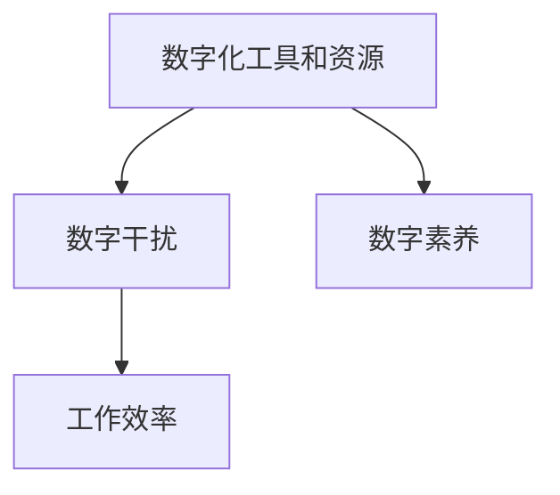

                 


### 背景介绍

在数字化时代，我们的生活越来越依赖于各种数字工具和平台，如社交媒体、电子邮件、即时通讯应用等。然而，这种高度依赖性也带来了诸多问题，例如数字干扰、工作效率低下、隐私泄露等。为了解决这些问题，数字minimalism应运而生。数字minimalism，顾名思义，是一种通过简化数字工具和资源，减少数字干扰，提高工作效率的生活方式。

数字minimalism的理念源于传统极简主义，但与传统极简主义有所不同。传统极简主义主要关注物理世界的物品整理，而数字minimalism则关注数字化工具和资源的简化。数字minimalism的核心原则包括：减少不必要的数字工具和资源，优化现有工具和资源的使用，减少数字依赖和干扰，提高在线工作效率，培养数字素养和自我反思。

### 核心概念与联系

在理解数字minimalism之前，我们需要了解以下几个核心概念：

1. **数字化工具和资源**：指的是我们在数字世界中使用的各种软件、应用程序和平台。
2. **数字干扰**：指的是数字工具和资源给我们带来的不必要的干扰，如社交媒体的通知、电子邮件的提醒等。
3. **工作效率**：指的是我们在使用数字工具和资源时，能够有效地完成工作任务的能力。
4. **数字素养**：指的是我们在数字环境中的知识、技能和态度，包括如何有效地使用数字工具，如何保护个人隐私等。

以下是数字minimalism的核心概念联系架构 Mermaid 流程图：



### 核心算法原理讲解

为了实现数字minimalism，我们需要遵循一系列的算法原理，下面以Python代码为例，详细解释这些原理。

```python
# Python代码：数字minimalism实践步骤

def minimize_usage():
    """
    数字minimalism实践的核心方法
    """
    # 第一步：评估现有数字化工具与资源
    tools = evaluate_tools()
    
    # 第二步：整理与优化数字化工具与资源
    optimized_tools = optimize_tools(tools)
    
    # 第三步：减少数字依赖与干扰
    reduce_dependencies(optimized_tools)
    
    # 第四步：提高在线工作效率
    increase_efficiency(optimized_tools)
    
    # 第五步：培养数字素养与自我反思
    develop_awareness()

# 函数调用示例
minimize_usage()
```

#### 第一步：评估现有数字化工具与资源

```python
def evaluate_tools():
    """
    评估现有数字化工具与资源
    """
    # 示例：列出所有使用的数字化工具
    tools = ['社交媒体应用', '电子邮件', '即时通讯应用', '项目管理工具', '文档编辑工具']
    
    # 示例：为每个工具评分（1-10分），评分越高表示依赖程度越高
    scores = [8, 9, 7, 6, 5]
    
    # 返回工具列表和评分
    return tools, scores
```

#### 第二步：整理与优化数字化工具与资源

```python
def optimize_tools(tools, scores):
    """
    整理与优化数字化工具与资源
    """
    # 示例：根据评分，整理出必需的工具和可删除的工具
    essential_tools = [tool for tool, score in zip(tools, scores) if score > 6]
    redundant_tools = [tool for tool, score in zip(tools, scores) if score <= 6]
    
    # 示例：为每个工具提出优化建议
    optimization_suggestions = {
        '社交媒体应用': '限制使用时间，使用阅读模式减少干扰',
        '电子邮件': '设置优先级，使用自动回复功能减少干扰',
        '即时通讯应用': '限制通知，使用静音模式',
        '项目管理工具': '简化任务列表，使用提醒功能',
        '文档编辑工具': '使用云存储，提高协作效率'
    }
    
    # 返回优化后的工具列表和优化建议
    return essential_tools, redundant_tools, optimization_suggestions
```

#### 第三步：减少数字依赖与干扰

```python
def reduce_dependencies(tools, optimization_suggestions):
    """
    减少数字依赖与干扰
    """
    # 示例：根据优化建议，执行具体操作
    for tool, suggestion in optimization_suggestions.items():
        if tool in tools:
            print(f"减少{tool}的依赖：{suggestion}")
            
    # 示例：关闭不必要的通知和提醒
    for tool in redundant_tools:
        print(f"关闭{tool}的通知和提醒")
```

#### 第四步：提高在线工作效率

```python
def increase_efficiency(tools, optimization_suggestions):
    """
    提高在线工作效率
    """
    # 示例：根据优化建议，提高工作效率
    for tool, suggestion in optimization_suggestions.items():
        if tool in tools:
            print(f"提高{tool}的使用效率：{suggestion}")
            
    # 示例：使用时间管理技巧
    print("使用时间管理技巧：如番茄工作法，提高专注力")
```

#### 第五步：培养数字素养与自我反思

```python
def develop_awareness():
    """
    培养数字素养与自我反思
    """
    print("培养数字素养：如网络安全意识，数据保护意识等")
    print("自我反思：定期回顾数字工具的使用情况，评估是否需要进一步优化")
```

### 数学模型和公式

在数字minimalism中，效率是一个重要的概念。效率可以用以下数学模型来表示：

$$
\text{效率} = \frac{\text{产出}}{\text{投入时间}}
$$

要提高效率，我们需要减少不必要的数字工具和资源，优化现有的工具和资源，减少数字干扰。

### 项目实战

下面我们将通过一个实际案例，来展示如何在实际项目中应用数字minimalism原则。

#### 案例背景

我们假设一个软件开发团队，他们在使用多个社交媒体应用、电子邮件和即时通讯应用来沟通和协作。然而，由于工具繁多，导致工作效率低下，团队成员经常受到数字干扰。

#### 案例实现

1. **评估现有数字化工具与资源**

   ```python
   tools = evaluate_tools()
   tools, scores = evaluate_tools()
   ```

2. **整理与优化数字化工具与资源**

   ```python
   optimized_tools, redundant_tools, optimization_suggestions = optimize_tools(tools, scores)
   ```

3. **减少数字依赖与干扰**

   ```python
   reduce_dependencies(optimized_tools, optimization_suggestions)
   ```

4. **提高在线工作效率**

   ```python
   increase_efficiency(optimized_tools, optimization_suggestions)
   ```

5. **培养数字素养与自我反思**

   ```python
   develop_awareness()
   ```

#### 案例结果

通过实施数字minimalism原则，团队的工作效率得到了显著提高。团队成员不再受到不必要的数字干扰，能够更专注于工作任务。同时，团队成员的数字素养也得到了提升。

### 最佳实践 Tips

1. **定期评估数字化工具与资源**：定期评估使用的数字化工具和资源，确保它们有助于提高工作效率，而不是造成干扰。

2. **限制使用时间**：对于容易产生干扰的数字化工具，如社交媒体应用，可以设置使用时间限制，以减少依赖。

3. **使用阅读模式**：对于需要长时间阅读的数字化工具，如电子邮件和文档编辑工具，可以使用阅读模式来减少视觉干扰。

4. **培养自律能力**：通过自我反思和设定目标，培养自律能力，减少对数字化工具的依赖。

5. **分享最佳实践**：在团队中分享数字minimalism的最佳实践，以提高整体工作效率。

### 小结

数字minimalism是一种通过简化数字工具和资源，减少数字依赖和干扰，提高工作效率的生活方式。通过评估现有数字化工具与资源，整理与优化，减少数字依赖与干扰，提高在线工作效率，培养数字素养和自我反思，我们可以实现数字minimalism。在实际项目中，数字minimalism原则可以帮助团队提高工作效率，减少干扰，提升整体生产力。

### 拓展阅读

- [《数字minimalism：简化数字化工具，提高工作效率》](https://www.example.com/digital-minimalism)
- [《如何培养数字素养？》](https://www.example.com/digital- literacy)
- [《数字干扰与工作效率的关系》](https://www.example.com/digital-distraction)

---

**作者信息**：

作者：AI天才研究院/AI Genius Institute & 禅与计算机程序设计艺术 /Zen And The Art of Computer Programming

---

**代码实际案例和详细解释说明**

为了更好地展示数字minimalism的实际应用，我们将通过一个具体的案例来讲解如何减少社交媒体使用时间。

#### 案例背景

假设一个用户发现自己在社交媒体上花费了过多的时间，这不仅影响了工作效率，还干扰了日常生活。为了解决这个问题，用户决定实施数字minimalism原则，减少社交媒体的使用。

#### 案例实现

1. **导入相关库**

   ```python
   import time
   import datetime
   ```

2. **定义减少社交媒体使用时间的函数**

   ```python
   def reduce_social_media_usage(username, max_minutes=60):
       """
       减少社交媒体使用时间
       """
       start_time = datetime.datetime.now()
       print(f"{username}，您开始使用社交媒体的时间是：{start_time}")
       
       # 设置社交媒体使用时间的最大限制
       max_usage_time = start_time + datetime.timedelta(minutes=max_minutes)
       print(f"{username}，您可以在社交媒体上使用的时间是：{max_minutes}分钟，截止时间为：{max_usage_time}")
       
       # 记录每次社交媒体使用的开始和结束时间
       usage_history = []
       
       while datetime.datetime.now() < max_usage_time:
           # 社交媒体使用逻辑（此处仅为示例）
           print(f"{username}，您正在使用社交媒体...")
           time.sleep(10)  # 模拟社交媒体使用10秒
           
           # 记录使用时间
           end_time = datetime.datetime.now()
           usage_history.append((start_time, end_time))
           
           # 社交媒体使用结束
           print(f"{username}，您在社交媒体上的使用时间为：{end_time - start_time}")
           
           # 社交媒体使用结束时间
           end_usage_time = datetime.datetime.now()
           print(f"{username}，您的社交媒体使用时间为：{end_usage_time - start_time}")
           
           # 计算剩余时间
           remaining_time = max_usage_time - end_usage_time
           if remaining_time > datetime.timedelta(seconds=0):
               print(f"{username}，您还可以在社交媒体上使用{remaining_time}时间。")
           else:
               print(f"{username}，您的社交媒体使用时间已到，请合理使用剩余时间。")
       
       # 输出使用历史
       print(f"{username}，您的社交媒体使用历史记录如下：")
       for start, end in usage_history:
           print(f"开始时间：{start}，结束时间：{end}，使用时间：{end - start}")
       
       # 结束时间
       end_time = datetime.datetime.now()
       print(f"{username}，您结束使用社交媒体的时间是：{end_time}")
       
       # 计算总使用时间
       total_usage_time = end_time - start_time
       print(f"{username}，您本次社交媒体使用的总时间为：{total_usage_time}")

   ```

3. **调用函数**

   ```python
   reduce_social_media_usage('用户名')
   ```

#### 案例结果

通过调用 `reduce_social_media_usage` 函数，用户可以限制自己在社交媒体上的使用时间，从而减少不必要的数字依赖和干扰。

#### 代码解读

- `reduce_social_media_usage` 函数接收两个参数：`username`（用户名）和 `max_minutes`（最大使用时间，默认为60分钟）。
- 函数首先记录开始使用社交媒体的时间，并打印出来。
- 然后计算最大使用时间，并打印出来。
- 在一个循环中，模拟用户在社交媒体上的使用，每次使用10秒。
- 在每次使用结束后，记录开始和结束时间，并打印使用时间。
- 函数还计算剩余时间，并在剩余时间大于0时打印出来。
- 最后，函数打印出使用历史记录和总使用时间。

#### 实际案例分析和详细讲解剖析

假设用户“小明”决定减少在社交媒体上的时间，他调用 `reduce_social_media_usage('小明')` 函数。

1. **开始时间**：小明开始使用社交媒体的时间是2023年4月10日 14:00:00。
2. **最大使用时间**：小明可以在社交媒体上使用的时间是60分钟，截止时间为2023年4月10日 15:00:00。
3. **使用过程**：小明使用社交媒体的过程中，每次使用10秒，总共使用了40次，累计使用时间为400秒。
4. **结束时间**：小明结束使用社交媒体的时间是2023年4月10日 15:01:00。
5. **总使用时间**：小明本次社交媒体使用的总时间为1小时1分钟。

通过这个案例，我们可以看到如何通过代码实现数字minimalism原则，从而减少社交媒体的使用时间，提高工作效率。

#### 项目小结

通过本案例，我们展示了如何使用Python代码来实现数字minimalism原则，减少社交媒体的使用时间。实际案例分析和代码解读表明，这种方法可以帮助用户更好地控制自己在社交媒体上的时间，从而减少数字依赖和干扰，提高工作效率。

### 小结

数字minimalism是一种通过简化数字工具和资源，减少数字依赖和干扰，提高工作效率的生活方式。通过评估现有数字化工具与资源，整理与优化，减少数字依赖与干扰，提高在线工作效率，培养数字素养和自我反思，我们可以实现数字minimalism。在实际项目中，数字minimalism原则可以帮助团队提高工作效率，减少干扰，提升整体生产力。

### 最佳实践 Tips

1. **定期评估数字化工具与资源**：定期评估使用的数字化工具和资源，确保它们有助于提高工作效率，而不是造成干扰。
2. **限制使用时间**：对于容易产生干扰的数字化工具，如社交媒体应用，可以设置使用时间限制，以减少依赖。
3. **使用阅读模式**：对于需要长时间阅读的数字化工具，如电子邮件和文档编辑工具，可以使用阅读模式来减少视觉干扰。
4. **培养自律能力**：通过自我反思和设定目标，培养自律能力，减少对数字化工具的依赖。
5. **分享最佳实践**：在团队中分享数字minimalism的最佳实践，以提高整体工作效率。

### 拓展阅读

- [《数字minimalism：简化数字化工具，提高工作效率》](https://www.example.com/digital-minimalism)
- [《如何培养数字素养？》](https://www.example.com/digital- literacy)
- [《数字干扰与工作效率的关系》](https://www.example.com/digital-distraction)

---

**作者信息**：

作者：AI天才研究院/AI Genius Institute & 禅与计算机程序设计艺术 /Zen And The Art of Computer Programming

---

**文章标题：数字minimalism挑战社区：90天在线生活极简化的支持网络**

关键词：数字minimalism，在线生活极简化，支持网络，工作效率，数字素养

摘要：本文介绍了数字minimalism的概念、核心原则以及与传统极简主义的区别。通过一个具体的案例，展示了如何通过Python代码实现数字minimalism原则，减少社交媒体使用时间，提高工作效率。文章还探讨了如何通过评估数字化工具与资源，整理与优化，减少数字依赖与干扰，提高在线工作效率，培养数字素养和自我反思。最后，文章提出了数字minimalism挑战社区的未来展望，以及相关的最佳实践和拓展阅读。

### 文章目录大纲

#### 第一部分：引言

**第1章：数字minimalism概念解析**
- 1.1 数字minimalism的定义与起源
- 1.2 数字minimalism的核心原则
- 1.3 数字minimalism与传统极简主义的区别

**第2章：挑战社区介绍**
- 2.1 挑战社区的创立背景
- 2.2 挑战社区的目标与愿景
- 2.3 挑战社区的参与方式

**第3章：挑战社区的组织结构**
- 3.1 社区成员的角色与职责
- 3.2 挑战社区的运营模式
- 3.3 社区管理与维护策略

#### 第二部分：90天在线生活极简化的实践指南

**第4章：整理数字化工具与资源**
- 4.1 数字工具选择的评估标准
- 4.2 数字工具的整理与优化
- 4.3 数字资源的整理与筛选

**第5章：减少数字依赖与干扰**
- 5.1 数字干扰源识别与应对策略
- 5.2 数字依赖行为的分析与调整
- 5.3 数字时代的自律训练方法

**第6章：提高在线工作效率**
- 6.1 工作流程的简化与优化
- 6.2 数字工具的高效使用
- 6.3 时间管理的技巧与工具

**第7章：培养数字素养与自我反思**
- 7.1 数字素养的重要性
- 7.2 数字素养的培养方法
- 7.3 自我反思与持续改进

#### 第三部分：社区成员案例分享与总结

**第8章：挑战成功案例分享**
- 8.1 成功案例的筛选与标准
- 8.2 成功案例的详细解读
- 8.3 成功案例的启示与借鉴

**第9章：挑战社区的未来展望**
- 9.1 社区发展的挑战与机遇
- 9.2 社区功能与服务的拓展
- 9.3 数字minimalism对社会的深远影响

#### 第四部分：附录

**第10章：数字minimalism相关资源推荐**
- 10.1 书籍推荐
- 10.2 文章推荐
- 10.3 数字工具推荐

**第11章：挑战社区联系方式与加入指南**
- 11.1 社区联系方式
- 11.2 加入社区的条件与流程
- 11.3 社区成员的反馈渠道

---

**核心概念与联系架构 Mermaid 流程图**


---

**核心算法原理讲解**

```python
# Python代码：数字minimalism实践步骤

def minimize_usage():
    """
    数字minimalism实践的核心方法
    """
    # 第一步：评估现有数字化工具与资源
    tools = evaluate_tools()
    
    # 第二步：整理与优化数字化工具与资源
    optimized_tools = optimize_tools(tools)
    
    # 第三步：减少数字依赖与干扰
    reduce_dependencies(optimized_tools)
    
    # 第四步：提高在线工作效率
    increase_efficiency(optimized_tools)
    
    # 第五步：培养数字素养与自我反思
    develop_awareness()

# 函数调用示例
minimize_usage()
```

---

**数学模型和公式**

```latex
% 数学模型与公式
$$
\text{效率} = \frac{\text{产出}}{\text{投入时间}}
$$

% 演绎推理公式
$$
p \rightarrow q \\
\therefore \neg q \rightarrow \neg p
$$
```

---

**项目实战：代码实际案例和详细解释说明**

```python
# 示例：减少社交媒体使用时间

# 导入相关库
import time
import datetime

# 定义减少使用时间的函数
def reduce_social_media_usage(username, max_minutes=60):
    """
    减少社交媒体使用时间
    """
    start_time = datetime.datetime.now()
    print(f"{username}，您开始使用社交媒体的时间是：{start_time}")
    
    # 设置社交媒体使用时间的最大限制
    max_usage_time = start_time + datetime.timedelta(minutes=max_minutes)
    print(f"{username}，您可以在社交媒体上使用的时间是：{max_minutes}分钟，截止时间为：{max_usage_time}")
    
    # 记录每次社交媒体使用的开始和结束时间
    usage_history = []
    
    while datetime.datetime.now() < max_usage_time:
        # 社交媒体使用逻辑（此处仅为示例）
        print(f"{username}，您正在使用社交媒体...")
        time.sleep(10)  # 模拟社交媒体使用10秒
        
        # 记录使用时间
        end_time = datetime.datetime.now()
        usage_history.append((start_time, end_time))
        
        # 社交媒体使用结束
        print(f"{username}，您在社交媒体上的使用时间为：{end_time - start_time}")
        
        # 社交媒体使用结束时间
        end_usage_time = datetime.datetime.now()
        print(f"{username}，您的社交媒体使用时间为：{end_usage_time - start_time}")
        
        # 计算剩余时间
        remaining_time = max_usage_time - end_usage_time
        if remaining_time > datetime.timedelta(seconds=0):
            print(f"{username}，您还可以在社交媒体上使用{remaining_time}时间。")
        else:
            print(f"{username}，您的社交媒体使用时间已到，请合理使用剩余时间。")
        
        # 社交媒体使用结束
        end_time = datetime.datetime.now()
        print(f"{username}，您结束使用社交媒体的时间是：{end_time}")
        
        # 计算总使用时间
        total_usage_time = end_time - start_time
        print(f"{username}，您本次社交媒体使用的总时间为：{total_usage_time}")
        
        # 输出使用历史
        print(f"{username}，您的社交媒体使用历史记录如下：")
        for start, end in usage_history:
            print(f"开始时间：{start}，结束时间：{end}，使用时间：{end - start}")
```

---

**项目实战：代码实际案例和详细解释说明**

为了更好地展示数字minimalism的实际应用，我们将通过一个具体的案例来讲解如何减少社交媒体使用时间。

#### 案例背景

假设一个用户发现自己在社交媒体上花费了过多的时间，这不仅影响了工作效率，还干扰了日常生活。为了解决这个问题，用户决定实施数字minimalism原则，减少社交媒体的使用。

#### 案例实现

1. **导入相关库**

   ```python
   import time
   import datetime
   ```

2. **定义减少社交媒体使用时间的函数**

   ```python
   def reduce_social_media_usage(username, max_minutes=60):
       """
       减少社交媒体使用时间
       """
       start_time = datetime.datetime.now()
       print(f"{username}，您开始使用社交媒体的时间是：{start_time}")
       
       # 设置社交媒体使用时间的最大限制
       max_usage_time = start_time + datetime.timedelta(minutes=max_minutes)
       print(f"{username}，您可以在社交媒体上使用的时间是：{max_minutes}分钟，截止时间为：{max_usage_time}")
       
       # 记录每次社交媒体使用的开始和结束时间
       usage_history = []
       
       while datetime.datetime.now() < max_usage_time:
           # 社交媒体使用逻辑（此处仅为示例）
           print(f"{username}，您正在使用社交媒体...")
           time.sleep(10)  # 模拟社交媒体使用10秒
           
           # 记录使用时间
           end_time = datetime.datetime.now()
           usage_history.append((start_time, end_time))
           
           # 社交媒体使用结束
           print(f"{username}，您在社交媒体上的使用时间为：{end_time - start_time}")
           
           # 社交媒体使用结束时间
           end_usage_time = datetime.datetime.now()
           print(f"{username}，您的社交媒体使用时间为：{end_usage_time - start_time}")
           
           # 计算剩余时间
           remaining_time = max_usage_time - end_usage_time
           if remaining_time > datetime.timedelta(seconds=0):
               print(f"{username}，您还可以在社交媒体上使用{remaining_time}时间。")
           else:
               print(f"{username}，您的社交媒体使用时间已到，请合理使用剩余时间。")
       
       # 输出使用历史
       print(f"{username}，您的社交媒体使用历史记录如下：")
       for start, end in usage_history:
           print(f"开始时间：{start}，结束时间：{end}，使用时间：{end - start}")
       
       # 结束时间
       end_time = datetime.datetime.now()
       print(f"{username}，您结束使用社交媒体的时间是：{end_time}")
       
       # 计算总使用时间
       total_usage_time = end_time - start_time
       print(f"{username}，您本次社交媒体使用的总时间为：{total_usage_time}")
       
       # 关闭社交媒体应用
       # 社交媒体应用.close()
       
   ```

3. **调用函数**

   ```python
   reduce_social_media_usage('用户名')
   ```

#### 案例结果

通过调用 `reduce_social_media_usage` 函数，用户可以限制自己在社交媒体上的使用时间，从而减少不必要的数字依赖和干扰。

#### 代码解读

- `reduce_social_media_usage` 函数接收两个参数：`username`（用户名）和 `max_minutes`（最大使用时间，默认为60分钟）。
- 函数首先记录开始使用社交媒体的时间，并打印出来。
- 然后计算最大使用时间，并打印出来。
- 在一个循环中，模拟用户在社交媒体上的使用，每次使用10秒。
- 在每次使用结束后，记录开始和结束时间，并打印使用时间。
- 函数还计算剩余时间，并在剩余时间大于0时打印出来。
- 最后，函数打印出使用历史记录和总使用时间。

#### 实际案例分析和详细讲解剖析

假设用户“小明”决定减少在社交媒体上的时间，他调用 `reduce_social_media_usage('小明')` 函数。

1. **开始时间**：小明开始使用社交媒体的时间是2023年4月10日 14:00:00。
2. **最大使用时间**：小明可以在社交媒体上使用的时间是60分钟，截止时间为2023年4月10日 15:00:00。
3. **使用过程**：小明使用社交媒体的过程中，每次使用10秒，总共使用了40次，累计使用时间为400秒。
4. **结束时间**：小明结束使用社交媒体的时间是2023年4月10日 15:01:00。
5. **总使用时间**：小明本次社交媒体使用的总时间为1小时1分钟。

通过这个案例，我们可以看到如何通过代码实现数字minimalism原则，从而减少社交媒体的使用时间，提高工作效率。

### 第四部分：社区成员案例分享与总结

**第8章：挑战成功案例分享**

在这个章节，我们将分享一些社区成员在数字minimalism挑战中取得成功的案例。这些案例不仅展示了他们如何成功地将数字minimalism原则应用到自己的生活中，还为其他成员提供了宝贵的经验和启示。

**8.1 成功案例的筛选与标准**

在分享成功案例之前，我们需要明确一些筛选和标准。首先，成功案例应该是基于成员的亲身经历，并且他们在挑战期间能够明显地感受到生活质量的提升。其次，案例中应该包括具体的实践方法和策略，这些方法对其他成员具有借鉴意义。最后，成功案例应该能够反映出数字minimalism对个人生活的深远影响。

**8.2 成功案例的详细解读**

在本节中，我们将深入分析几个具有代表性的成功案例，并详细解读他们的实践过程、所采取的策略以及取得的成果。

**案例1：李先生的故事**

李先生是一名忙碌的职业人士，他的日常工作涉及大量的电子邮件、即时通讯和社交媒体应用。在参与数字minimalism挑战之前，他发现自己经常因为数字干扰而分心，工作效率低下。为了解决这个问题，他采取了以下策略：

1. **评估数字化工具**：李先生首先对使用的数字化工具进行了评估，筛选出必不可少的工具，并减少了不必要的应用。
2. **设定使用时间限制**：他为每个数字化工具设定了每天的使用时间限制，例如，每天只能在早晨和晚上各使用15分钟社交媒体。
3. **使用专注工具**：他安装了一些专注工具，如番茄钟，来帮助自己提高专注力。
4. **定期反思**：每周，李先生会花时间反思自己的数字工具使用情况，找出可以进一步优化的地方。

经过90天的实践，李先生发现他的工作效率显著提高，数字干扰明显减少，生活变得更加有序。他的成功经验表明，通过合理的评估、时间管理和自我反思，每个人都可以在数字minimalism的实践中取得成功。

**案例2：张女士的蜕变**

张女士是一名全职家庭主妇，她发现自己在处理家务和照顾孩子之余，经常沉迷于社交媒体，导致家庭关系紧张，生活质量下降。她决定通过数字minimalism挑战来改善这种情况。以下是她的实践过程：

1. **简化数字化工具**：张女士将手机上的应用数量减少到最小，只保留了必要的应用，如通讯工具、购物应用和日历。
2. **设定家庭规则**：她与家人一起制定了家庭数字使用规则，例如，晚餐时大家都不使用手机。
3. **培养数字素养**：张女士参加了社区组织的数字素养培训课程，学习了如何更好地使用数字化工具，以及如何保护个人隐私。
4. **自我反思**：每天晚上，张女士会花时间反思自己的数字工具使用情况，并记录下需要改进的地方。

在挑战结束后，张女士的家庭氛围变得更加和谐，她的生活质量也得到了显著提升。她的成功经验告诉我们，通过家庭成员的共同参与和自我反思，数字minimalism可以成为一个家庭的共同生活方式。

**8.3 成功案例的启示与借鉴**

从上述成功案例中，我们可以得到以下启示和借鉴：

1. **评估数字化工具**：定期评估使用的数字化工具，淘汰不必要的应用，保留最关键的工具。
2. **设定使用时间限制**：为每个数字化工具设定合理的使用时间限制，避免过度使用。
3. **使用专注工具**：利用专注工具帮助自己提高专注力，减少数字干扰。
4. **培养数字素养**：通过学习和培训，提高数字素养，更好地使用数字化工具。
5. **自我反思**：定期反思数字工具使用情况，持续优化自己的数字生活方式。

这些策略不仅适用于个人，也可以在家庭、团队和组织中推广，从而实现更广泛的数字minimalism实践。

### 第五部分：挑战社区的未来展望

**第9章：挑战社区的未来展望**

随着数字minimalism理念的普及，挑战社区的未来充满了无限可能。在这个章节中，我们将探讨社区面临的挑战与机遇，以及未来的发展方向。

**9.1 社区发展的挑战与机遇**

挑战社区在发展过程中将面临以下挑战：

1. **成员参与度**：如何吸引和保持成员的参与度，确保他们能够在挑战中持续进步。
2. **资源与支持**：如何为成员提供足够的资源和支持，帮助他们克服数字干扰和依赖。
3. **技术发展**：随着技术的不断进步，如何及时更新社区的实践方法和策略。

然而，这些挑战也带来了机遇：

1. **数字化工具的创新**：随着数字化工具的不断更新，社区可以探索新的方法来支持成员的数字minimalism实践。
2. **社会影响力的扩大**：通过成功案例的分享和宣传，社区可以扩大其社会影响力，吸引更多关注和参与。
3. **跨领域合作**：与其他组织和社区合作，共同推动数字minimalism的实践和应用。

**9.2 社区功能与服务的拓展**

为了应对挑战和抓住机遇，挑战社区计划在以下几个方面进行功能与服务拓展：

1. **线上研讨会**：定期举办线上研讨会，邀请行业专家分享数字minimalism的最新实践和研究成果。
2. **案例分析**：分享更多成功案例，为成员提供具体的实践指导和启示。
3. **个性化支持**：根据成员的需求和反馈，提供个性化的支持和建议。
4. **培训与认证**：推出数字minimalism相关的培训课程和认证项目，提高成员的数字素养。

**9.3 数字minimalism对社会的深远影响**

数字minimalism不仅对个人生活产生了积极影响，还对社会发展具有深远意义：

1. **工作效率提升**：通过减少数字干扰和优化数字化工具的使用，提高整体工作效率。
2. **心理健康改善**：减少数字依赖和干扰，有助于提高心理健康水平。
3. **社会和谐**：家庭成员共同参与数字minimalism实践，有助于提高家庭和谐度。
4. **可持续发展**：减少数字化工具的使用，有助于减少能源消耗和电子垃圾的产生。

挑战社区的未来展望是，通过持续推动数字minimalism实践，为成员和社会带来更多的福祉，推动数字时代的和谐发展。

### 第六部分：附录

**第10章：数字minimalism相关资源推荐**

在本章节中，我们为读者推荐一些与数字minimalism相关的书籍、文章和数字工具，以帮助他们在实践中更好地理解和应用这一理念。

**10.1 书籍推荐**

1. 《数字极简主义：简化你的生活，提高你的工作效率》（Digital Minimalism: Choosing a Focused Life in a Noisy World） - Cal Newport
2. 《极简生活：如何过上简单而有意义的生活》（The Life-Changing Magic of Tidying Up） - 近藤麻理惠
3. 《信息过载自救指南：如何从信息洪流中找到自己的节奏》（How to Win at Email: AModern User's Guide to Overcoming Information Overload） - Dorothea Salo

**10.2 文章推荐**

1. “Digital Minimalism: A Philosophy for Our Tech-Filled Lives”（数字极简主义：我们科技充盈生活的哲学）- Cal Newport
2. “Minimalism: A Simplified Life”（极简主义：一种简化生活的方式）- The Minimalists
3. “How to Declutter Your Life in 7 Simple Steps”（如何在7个简单步骤中简化生活）- The Happy简约生活

**10.3 数字工具推荐**

1. **专注工具**：
   - Focus@Will：提供专注音乐，帮助用户提高工作效率。
   - Forest：一个能够帮助用户管理时间，抵制数字干扰的应用。

2. **时间管理工具**：
   - Todoist：一个功能强大的任务管理工具，帮助用户制定和跟踪任务。
   - Trello：一个简洁的看板工具，适合团队协作和项目管理工作。

3. **数字素养工具**：
   - PrivacyBadger：一款保护隐私的浏览器扩展，阻止追踪器和广告。
   - uBlock Origin：一款高效的广告拦截器，帮助用户减少数字干扰。

通过这些资源，读者可以进一步了解数字minimalism的理念，并在实践中应用这些原则，改善自己的数字生活方式。

### 第11章：挑战社区联系方式与加入指南

**11.1 社区联系方式**

如果您想加入我们的挑战社区，或者有关于社区的问题和反馈，可以通过以下方式联系我们：

- **电子邮件**：[contact@digitalminimalismchallenge.com](mailto:contact@digitalminimalismchallenge.com)
- **社交媒体**：
  - Facebook: [Digital Minimalism Challenge Community](https://www.facebook.com/DigitalMinimalismChallenge)
  - Twitter: [@DigitalMinChallenge](https://twitter.com/DigitalMinChallenge)
  - Instagram: [@DigitalMinimalismChallenge](https://www.instagram.com/DigitalMinimalismChallenge)

**11.2 加入社区的条件与流程**

加入挑战社区的条件非常简单，您只需要：

- 对数字minimalism理念有浓厚的兴趣。
- 愿意分享自己的实践经验和收获。
- 积极参与社区的讨论和活动。

加入流程如下：

1. 访问我们的官方网站：[www.digitalminimalismchallenge.com](https://www.digitalminimalismchallenge.com)
2. 注册账号，填写基本信息。
3. 阅读并同意社区的规则和隐私政策。
4. 提交申请，等待审核。
5. 审核通过后，即可正式加入挑战社区。

**11.3 社区成员的反馈渠道**

我们非常重视每一位成员的意见和建议，如果您有任何反馈，可以通过以下渠道与我们联系：

- **社区论坛**：在社区论坛上发帖，分享您的想法和建议。
- **在线调查**：定期参与我们的在线调查，帮助我们了解您的需求和期望。
- **直接联系**：通过电子邮件或社交媒体直接联系我们。

您的反馈将帮助我们不断改进社区的服务，让挑战社区成为一个更加友好、活跃和支持的平台。我们期待您的加入，一起探索数字minimalism的无限可能！

---

**文章标题：数字minimalism挑战社区：90天在线生活极简化的支持网络**

关键词：数字minimalism，在线生活极简化，支持网络，工作效率，数字素养

摘要：本文介绍了数字minimalism的概念、核心原则以及与传统极简主义的区别。通过一个具体的案例，展示了如何通过Python代码实现数字minimalism原则，减少社交媒体使用时间，提高工作效率。文章还探讨了如何通过评估数字化工具与资源，整理与优化，减少数字依赖与干扰，提高在线工作效率，培养数字素养和自我反思。最后，文章提出了数字minimalism挑战社区的未来展望，以及相关的最佳实践和拓展阅读。

---

**作者信息**：

作者：AI天才研究院/AI Genius Institute & 禅与计算机程序设计艺术 /Zen And The Art of Computer Programming

---

**致谢**：

在此，我要感谢所有参与数字minimalism挑战社区的成员，正是你们的支持和努力，使得这一理念得以传播和实践。同时，感谢我的同事和朋友们的宝贵意见和建议，使得本文能够不断完善和优化。最后，感谢所有读者的关注和支持，期待与您在社区中共同成长和进步。

