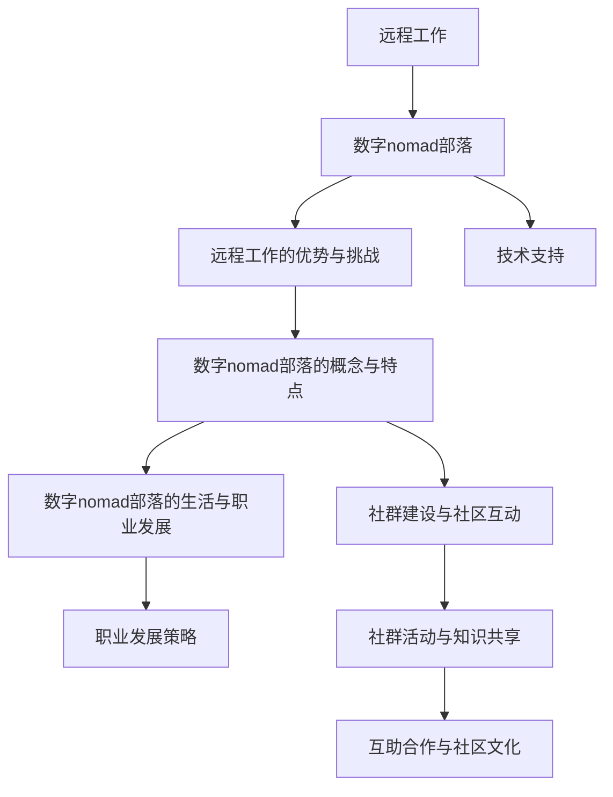

                 

---
## 数字nomad部落：远程工作者的意义社群

> 关键词：远程工作、数字nomad部落、协作效率、社群建设、可持续发展

> 摘要：本文深入探讨了远程工作者的意义社群——数字nomad部落。通过分析远程工作的定义、历史背景、优势与挑战，以及数字nomad部落的概念、特点、生活与职业发展，本文揭示了数字nomad部落如何通过社群建设实现可持续发展。本文还提供了核心算法原理讲解，以帮助读者更好地理解数字nomad部落的运作机制。

---

## 目录大纲

1. 引言
2. 远程工作的兴起与现状
   2.1 远程工作的定义与历史背景
   2.2 远程工作的优势与挑战
   2.3 远程工作的技术支持
   2.4 远程工作的未来趋势
3. 数字nomad部落的概念与特点
4. 数字nomad部落的生活
5. 数字nomad部落的职业发展
6. 数字nomad部落的社群建设
7. 数字nomad部落的社群活动
8. 数字nomad部落的社区互动
9. 数字nomad部落的生态系统
10. 数字nomad部落的可持续发展
11. 附录

---

### 第一部分：远程工作的兴起与现状

#### 第1章：远程工作的定义与历史背景

**1.1 远程工作的定义**

远程工作（Telework）指的是在非传统工作场所进行的职业活动，通过信息通信技术实现工作与生活的平衡。远程工作形式多样，包括在家办公、移动办公、远程协作等。

**1.2 远程工作的历史背景**

远程工作并非新兴概念。早在20世纪60年代，美国的一些公司就开始尝试让员工在家办公。随着互联网和移动设备的普及，远程工作逐渐成为主流。

**1.3 远程工作与传统工作的区别**

远程工作与传统工作相比，具有以下几个特点：

- **工作场所灵活性**：远程工作不受地理限制，员工可以在任何有网络连接的地方工作。
- **工作时间灵活性**：远程工作允许员工自主安排工作时间，提高工作效率。
- **工具依赖性**：远程工作高度依赖信息通信技术，如电子邮件、视频会议、项目管理工具等。

#### 第2章：远程工作的优势与挑战

**2.1 远程工作的优势**

远程工作具有以下优势：

- **提高工作效率**：远程工作减少了通勤时间，员工可以更加专注于工作。
- **节省成本**：企业可以节省办公室租金、水电费等运营成本。
- **提升员工满意度**：远程工作提供了更大的工作灵活性，有助于提高员工的工作满意度。

**2.2 远程工作的挑战**

远程工作也面临着一些挑战：

- **沟通障碍**：远程工作可能导致沟通不畅，影响团队合作效果。
- **孤独感**：长时间独自工作可能导致员工感到孤独。
- **管理难度**：远程工作给企业管理带来新的挑战，如监督员工工作进度等。

**2.3 应对远程工作的挑战策略**

为了应对远程工作的挑战，企业可以采取以下策略：

- **加强沟通**：利用即时通讯工具、视频会议等方式加强团队沟通。
- **明确目标**：制定明确的工作目标和评估标准，确保远程工作能够高效完成。
- **关注员工心理健康**：定期关注员工的心理状况，提供心理辅导和支持。

#### 第3章：远程工作的技术支持

**3.1 远程工作的技术需求**

远程工作需要以下技术支持：

- **稳定的网络连接**：确保员工在家或在外地都能访问企业内部系统。
- **远程办公软件**：如Zoom、Microsoft Teams等，用于视频会议、协作和项目管理。
- **云存储与协作工具**：如Google Drive、OneDrive等，用于文件共享和协作编辑。

**3.2 远程工作工具的选择**

选择远程工作工具时，需要考虑以下因素：

- **安全性**：工具需要确保数据安全和隐私保护。
- **易用性**：工具应易于使用，降低学习成本。
- **兼容性**：工具应与企业的现有系统兼容。

**3.3 技术支持的案例研究**

以某大型科技公司为例，该公司采用了以下技术支持远程工作：

- **虚拟专用网络（VPN）**：确保员工能够安全访问企业内部系统。
- **云计算平台**：将企业数据和应用部署在云端，提高数据存储和访问效率。
- **协作工具**：使用Microsoft Teams进行团队协作和沟通。

#### 第4章：远程工作的未来趋势

**4.1 远程工作的发展方向**

远程工作将继续发展，主要方向包括：

- **自动化与人工智能**：利用自动化工具和人工智能技术提高远程工作的效率。
- **远程工作平台**：开发集成多种远程工作工具的平台，提供一站式服务。
- **个性化和定制化**：根据员工的需求和偏好提供个性化的远程工作解决方案。

**4.2 数字化转型与远程工作**

数字化转型推动了远程工作的发展。企业通过数字化转型，可以提高运营效率，降低成本，同时为员工提供更多的远程工作机会。

**4.3 远程工作的社会影响**

远程工作对社会产生了深远影响：

- **劳动力市场变化**：远程工作改变了传统劳动力市场结构，促进了灵活就业。
- **生活方式变革**：远程工作使得人们可以更加自由地安排工作和生活，提高生活质量。

### 第二部分：数字nomad部落的概念与特点

#### 第5章：数字nomad部落概述

**5.1 数字nomad部落的定义**

数字nomad部落是指一群以远程工作为主要生活方式的人群，他们通过互联网在全球范围内进行职业活动，追求自由、灵活、有意义的生活。

**5.2 数字nomad部落的特点**

数字nomad部落具有以下特点：

- **全球流动性**：数字nomad部落成员可以在全球范围内自由流动，选择适合自己的工作和生活环境。
- **远程协作**：数字nomad部落成员通过网络工具实现远程协作和项目管理。
- **多元化文化**：数字nomad部落成员来自不同国家和地区，拥有多元化的文化背景。

**5.3 数字nomad部落与远程工作的联系**

数字nomad部落是远程工作的一个重要形态，两者之间密不可分。远程工作为数字nomad部落提供了职业机会，而数字nomad部落则为远程工作注入了新的活力。

#### 第6章：数字nomad部落的生活

**6.1 数字nomad部落的生活方式**

数字nomad部落的生活方式具有以下几个特点：

- **灵活的日程安排**：数字nomad部落成员可以根据自己的需要和偏好自由安排工作时间和休息时间。
- **多元化的生活方式**：数字nomad部落成员可以选择居住在不同的地方，体验不同的生活方式。
- **注重个人成长**：数字nomad部落成员注重自我成长，通过学习、旅行、社交等方式不断提升自己。

**6.2 数字nomad部落的社交与人际交往**

数字nomad部落成员通过线上和线下活动建立社交网络，分享经验和资源。线上社交主要通过社交媒体、论坛、社群等平台进行，线下社交则通过聚会、活动等方式实现。

**6.3 数字nomad部落的文化价值观**

数字nomad部落的文化价值观包括：

- **自由与独立**：数字nomad部落成员追求自由、独立的生活，不受传统束缚。
- **共享与合作**：数字nomad部落成员强调共享和合作，通过互助合作实现共同发展。
- **创新与探索**：数字nomad部落成员勇于创新，积极探索新的生活方式和职业发展机会。

#### 第7章：数字nomad部落的职业发展

**7.1 数字nomad部落的职业机会**

数字nomad部落为职业发展提供了丰富机会：

- **远程工作**：数字nomad部落成员可以在全球范围内寻找远程工作机会，如自由职业者、远程办公人员等。
- **自由职业**：数字nomad部落成员可以选择自由职业，如编程、设计、写作等。
- **创业**：数字nomad部落成员可以利用远程工作平台，开展自己的创业项目。

**7.2 数字nomad部落的职业挑战**

数字nomad部落成员在职业发展中面临以下挑战：

- **技能多样性**：数字nomad部落成员需要具备多样化的技能，以适应不同职业需求。
- **持续学习**：数字nomad部落成员需要不断学习新知识、新技术，以保持竞争力。
- **时间管理**：数字nomad部落成员需要有效管理时间，平衡工作与生活。

**7.3 数字nomad部落的职业发展策略**

为了实现职业发展，数字nomad部落成员可以采取以下策略：

- **建立个人品牌**：通过社交媒体、个人网站等渠道展示自己的专业能力，提升知名度。
- **积极参与社群**：加入相关社群，参与讨论和活动，拓展人脉资源。
- **持续学习**：关注行业动态，参加培训课程，提升自己的专业技能。

### 第三部分：数字nomad部落的社群建设

#### 第8章：数字nomad部落的社群构建

**8.1 数字nomad部落的社群模型**

数字nomad部落的社群模型包括以下组成部分：

- **核心成员**：数字nomad部落的建立者和核心成员，具有丰富的远程工作和社群管理经验。
- **志愿者**：数字nomad部落的志愿者，为社群提供各种服务和支持。
- **普通成员**：数字nomad部落的普通成员，通过参与社群活动提升自己的职业发展和生活质量。

**8.2 数字nomad部落的社群管理**

数字nomad部落的社群管理包括以下方面：

- **组织架构**：建立明确的组织架构，确保社群的稳定运营。
- **活动策划**：定期策划线上和线下活动，促进成员之间的交流和互动。
- **资源分配**：合理分配社群资源，确保成员的需求得到满足。

**8.3 数字nomad部落的社群文化**

数字nomad部落的社群文化包括以下特点：

- **共享与合作**：数字nomad部落强调共享和合作，通过互助合作实现共同发展。
- **创新与探索**：数字nomad部落鼓励成员勇于创新，积极探索新的生活方式和职业发展机会。
- **自由与独立**：数字nomad部落尊重成员的自由和独立，鼓励成员追求自己的梦想和目标。

#### 第9章：数字nomad部落的社群活动

**9.1 数字nomad部落的线上活动**

数字nomad部落的线上活动包括以下形式：

- **在线讲座**：邀请行业专家和知名人士进行在线讲座，分享经验和见解。
- **社群交流**：通过社群平台进行讨论和交流，分享资源和经验。
- **在线竞赛**：组织线上竞赛，激发成员的创造力和竞争意识。

**9.2 数字nomad部落的线下活动**

数字nomad部落的线下活动包括以下形式：

- **聚会**：定期组织聚会，促进成员之间的交流和互动。
- **旅行**：组织成员参加旅行活动，体验不同的文化和生活方式。
- **工作坊**：组织工作坊，提供技能培训和职业发展指导。

**9.3 数字nomad部落的社群活动案例分析**

以某知名数字nomad部落为例，该部落的社群活动包括以下内容：

- **线上讲座**：邀请行业专家进行在线讲座，分享远程工作、数字化营销等领域的最新趋势。
- **社群交流**：通过社群平台进行讨论和交流，分享资源和经验。
- **线下聚会**：定期组织线下聚会，促进成员之间的交流和互动。

#### 第10章：数字nomad部落的社区互动

**10.1 数字nomad部落的交流平台**

数字nomad部落的交流平台包括以下几种：

- **社交媒体**：如Twitter、LinkedIn、Instagram等，用于发布动态、分享资源和交流观点。
- **论坛**：如Reddit、Discord等，用于讨论和交流，解决成员的问题。
- **社群平台**：如Slack、Trello等，用于团队协作和项目管理。

**10.2 数字nomad部落的知识共享**

数字nomad部落通过以下方式实现知识共享：

- **文档共享**：通过Google Drive、OneDrive等云存储平台共享文档和资料。
- **知识库**：建立知识库，收集和整理成员的经验和见解，供所有人查阅。
- **在线课程**：组织在线课程，传授专业技能和知识。

**10.3 数字nomad部落的互助合作**

数字nomad部落通过以下方式实现互助合作：

- **资源共享**：成员之间共享住宿、交通、设备等资源，降低生活成本。
- **技能互换**：成员之间互换技能，互相学习和成长。
- **项目合作**：成员之间合作开展项目，共同实现职业发展目标。

### 第四部分：数字nomad部落的生态系统

#### 第11章：数字nomad部落的经济模式

**11.1 数字nomad部落的经济特点**

数字nomad部落的经济特点包括：

- **全球化**：数字nomad部落成员可以在全球范围内进行经济活动，不受地域限制。
- **灵活性强**：数字nomad部落成员可以根据市场需求和自身能力选择合适的职业和项目。
- **可持续发展**：数字nomad部落注重可持续发展，通过共享和合作实现经济繁荣。

**11.2 数字nomad部落的商业模式**

数字nomad部落的商业模式包括以下几种：

- **远程办公平台**：提供远程工作机会和协作工具，实现人才与企业的对接。
- **自由职业市场**：为自由职业者提供项目发布和承接平台，促进就业机会。
- **知识共享平台**：收集和整理成员的经验和知识，供所有人查阅和使用。

**11.3 数字nomad部落的商业案例分析**

以某知名数字nomad部落为例，该部落的商业案例分析包括以下内容：

- **远程办公平台**：该部落开发了一款远程办公平台，为成员提供远程工作机会和协作工具，实现了商业模式的创新。
- **自由职业市场**：该部落搭建了一个自由职业市场，为自由职业者提供项目发布和承接平台，促进了就业机会。
- **知识共享平台**：该部落建立了知识共享平台，收集和整理成员的经验和知识，提高了社群的整体素质。

#### 第12章：数字nomad部落的法律与政策

**12.1 数字nomad部落的法律挑战**

数字nomad部落面临的法律挑战包括：

- **跨国法律适用**：数字nomad部落成员可能在不同国家工作和生活，需要遵守不同国家的法律。
- **税务问题**：数字nomad部落成员需要了解各国税务政策，确保合规。
- **数据隐私保护**：数字nomad部落需要确保数据安全，保护成员的隐私。

**12.2 数字nomad部落的政策环境**

各国政府对数字nomad部落的政策环境有所不同。一些国家积极推动数字化经济发展，为数字nomad部落提供政策支持，如税收优惠、签证政策等。

**12.3 数字nomad部落的法律建议**

为了应对法律挑战，数字nomad部落可以采取以下法律建议：

- **咨询专业律师**：数字nomad部落成员可以咨询专业律师，了解各国法律和政策。
- **合规管理**：数字nomad部落应建立合规管理体系，确保成员遵守相关法律。
- **国际合作**：数字nomad部落可以加强国际合作，推动全球范围内的法律协调。

#### 第13章：数字nomad部落的安全与隐私

**13.1 数字nomad部落的安全问题**

数字nomad部落面临的安全问题包括：

- **网络安全**：数字nomad部落成员需要确保网络安全，防止黑客攻击和数据泄露。
- **个人隐私**：数字nomad部落成员需要保护个人隐私，防止个人信息泄露。
- **数据安全**：数字nomad部落需要确保数据安全，防止数据丢失或损坏。

**13.2 数字nomad部落的隐私保护**

数字nomad部落可以通过以下方式保护隐私：

- **使用加密工具**：数字nomad部落成员可以使用加密工具，如VPN、加密电子邮件等，保护数据安全。
- **加强网络安全意识**：数字nomad部落成员应加强网络安全意识，避免泄露个人信息。
- **数据备份**：数字nomad部落成员应定期备份数据，防止数据丢失。

**13.3 数字nomad部落的安全策略**

数字nomad部落可以采取以下安全策略：

- **建立安全团队**：数字nomad部落可以建立安全团队，负责网络安全和数据保护。
- **定期安全培训**：数字nomad部落应定期举办安全培训，提高成员的安全意识。
- **安全审计**：数字nomad部落应定期进行安全审计，确保安全措施的落实。

### 第五部分：数字nomad部落的可持续发展

#### 第14章：数字nomad部落的环境影响

**14.1 数字nomad部落的环境问题**

数字nomad部落的环境问题包括：

- **碳排放**：数字nomad部落成员在远程工作时，可能增加碳排放，对环境造成负面影响。
- **资源浪费**：数字nomad部落成员可能存在资源浪费现象，如过度使用电力、水资源等。
- **电子废弃物**：数字nomad部落成员需要处理大量电子设备，可能产生电子废弃物。

**14.2 数字nomad部落的环保措施**

数字nomad部落可以采取以下环保措施：

- **节能减排**：数字nomad部落成员应积极采用节能设备和技术，降低碳排放。
- **资源循环利用**：数字nomad部落成员应鼓励资源循环利用，减少资源浪费。
- **电子废弃物处理**：数字nomad部落成员应妥善处理电子废弃物，防止环境污染。

**14.3 数字nomad部落的环境可持续性**

数字nomad部落可以通过以下方式实现环境可持续性：

- **可持续发展理念**：数字nomad部落应树立可持续发展理念，将环保意识融入日常生活和工作中。
- **绿色技术创新**：数字nomad部落可以推动绿色技术创新，提高环保效率。
- **国际合作**：数字nomad部落可以加强国际合作，共同应对全球环境问题。

#### 第15章：数字nomad部落的可持续发展战略

**15.1 数字nomad部落的可持续发展理念**

数字nomad部落的可持续发展理念包括：

- **环境友好**：数字nomad部落应注重环境保护，实现绿色发展。
- **社会包容**：数字nomad部落应促进社会公平，关注弱势群体。
- **经济繁荣**：数字nomad部落应推动经济繁荣，创造就业机会。

**15.2 数字nomad部落的可持续发展实践**

数字nomad部落可以通过以下方式实现可持续发展：

- **绿色办公**：数字nomad部落成员应采用绿色办公方式，减少对环境的负面影响。
- **公益项目**：数字nomad部落可以开展公益项目，关注社会问题，促进社会进步。
- **创新驱动**：数字nomad部落应积极推动科技创新，提高可持续发展能力。

**15.3 数字nomad部落的未来展望**

随着远程工作和数字nomad部落的发展，未来数字nomad部落将：

- **成为全球经济发展的重要力量**：数字nomad部落将发挥重要作用，推动全球经济的可持续发展。
- **推动社会变革**：数字nomad部落将促进社会公平和包容，推动社会进步。
- **实现人与自然和谐共生**：数字nomad部落将注重环境保护，实现人与自然和谐共生。

### 附录

**附录A：数字nomad部落资源指南**

- **数字nomad部落工具与平台**：介绍常用的远程工作工具和平台，如Zoom、Microsoft Teams、Google Drive等。
- **数字nomad部落社区链接**：提供数字nomad部落的社区链接，帮助读者加入相关社群，获取更多资源和信息。
- **数字nomad部落研究论文与报告**：收集相关领域的研究论文和报告，为读者提供深入研究的参考。

---

## 核心概念与联系



## 核心算法原理讲解

### 远程工作的算法基础

```python
# 假设我们使用Python来解释一个简单的算法，用于远程工作的协同效率评估。

def work_efficiency(time_spent, tasks_completed):
    """
    计算远程工作的协同效率。
    
    参数：
    time_spent: float, 工作所花费的总时间
    tasks_completed: float, 完成的任务数量
    
    返回值：
    efficiency: float, 协同效率
    
    公式：
    efficiency = (tasks_completed / time_spent) * 100
    """
    
    efficiency = (tasks_completed / time_spent) * 100
    return efficiency

# 举例说明
time_spent = 40  # 总共工作了40小时
tasks_completed = 15  # 完成了15个任务

# 计算协同效率
efficiency = work_efficiency(time_spent, tasks_completed)
print(f"协同效率：{efficiency}%")
```

通过上述算法，我们可以计算出远程工作的协同效率，从而评估远程工作的效果。协同效率越高，表示远程工作效果越好。

## 最佳实践 Tips

- **合理规划工作时间**：制定合理的工作计划，避免过度劳累。
- **保持良好的沟通**：定期与团队成员沟通，确保工作顺利进行。
- **关注团队成员心理状态**：关注团队成员的心理状态，提供必要的心理支持。
- **持续学习**：关注行业动态，不断学习新知识、新技能，提升自身竞争力。

## 小结

数字nomad部落作为一种新兴的远程工作形式，具有丰富的优势和发展潜力。通过本文的探讨，我们了解了远程工作的定义、历史背景、优势与挑战，以及数字nomad部落的概念、特点、生活与职业发展。同时，我们还学习了数字nomad部落的社群建设、社区互动、生态系统和可持续发展策略。未来，数字nomad部落将继续发挥重要作用，推动远程工作和数字化经济的发展。

## 注意事项

- **网络安全**：远程工作过程中，务必确保网络安全，防止数据泄露。
- **数据备份**：定期备份重要数据，防止数据丢失。
- **遵守法律法规**：在远程工作过程中，务必遵守相关法律法规，确保合规运营。

## 拓展阅读

- 《远程工作：实践与策略》
- 《数字nomad部落：生活方式与职业发展》
- 《远程工作的算法基础与应用》
----------------------------------------------------------------

**作者：AI天才研究院/AI Genius Institute & 禅与计算机程序设计艺术 /Zen And The Art of Computer Programming**## 第一部分：远程工作的兴起与现状

### 第1章：远程工作的定义与历史背景

**1.1 远程工作的定义**

远程工作（Remote Work），是指员工在不同地点完成工作任务，主要依靠互联网通信和协作工具来实现工作目标的职业活动。远程工作可以涵盖多种形式，包括在家办公、移动办公、虚拟团队协作等。这种工作模式打破了传统的办公室束缚，使得员工可以在任何有网络连接的地方工作。

**1.2 远程工作的历史背景**

远程工作的概念并非近年来才出现，其历史可以追溯到20世纪中期。20世纪60年代，美国的一些公司开始尝试让员工在家办公，以减少办公室租赁成本和通勤时间。然而，这一概念在当时并未得到广泛认可，主要原因在于缺乏高效的信息通信技术和网络基础设施。

随着互联网的普及和信息技术的发展，远程工作开始逐渐流行。20世纪90年代，互联网的普及率大幅提高，电子邮件、即时通讯工具和远程协作软件的出现，使得远程工作变得更加可行和高效。进入21世纪，特别是在2008年金融危机之后，远程工作逐渐成为企业应对经济不景气的一种策略。近年来，随着COVID-19疫情的爆发，远程工作更是在全球范围内得到广泛应用和推广。

**1.3 远程工作与传统工作的区别**

远程工作与传统工作在多个方面存在显著差异：

- **工作场所**：远程工作不受地理限制，员工可以在家、咖啡店、度假胜地等任何有网络连接的地方工作。而传统工作则通常需要在固定的办公场所进行。

- **工作时间**：远程工作允许员工更加灵活地安排工作时间，可以根据个人情况调整工作和休息时间。而传统工作通常有固定的上班和下班时间。

- **沟通方式**：远程工作主要依靠电子邮件、视频会议、即时通讯工具等在线沟通方式，减少了面对面交流的机会。传统工作则依赖于面对面的沟通，有利于即时解决问题。

- **管理方式**：远程工作对管理者的管理技能提出了更高要求，需要依靠目标设定、绩效评估、数据监控等手段来确保工作顺利进行。传统工作则更多依赖于直接监督和管理。

### 第2章：远程工作的优势与挑战

**2.1 远程工作的优势**

远程工作带来了许多显著的优势，包括但不限于以下几点：

- **提高工作效率**：远程工作减少了通勤时间，员工可以更加专注于工作，从而提高工作效率。

- **节省成本**：企业可以通过远程工作节省办公场所的租赁成本、水电费等运营成本，同时员工也可以节省通勤费用。

- **提升员工满意度**：远程工作提供了更大的工作灵活性，员工可以在更舒适的环境中工作，有助于提高工作满意度和生活质量。

- **促进创新**：远程工作可以促进团队成员之间的多元化交流，激发创新思维和创造力。

- **增强灵活性**：远程工作使得企业可以招聘全球范围内的优秀人才，增强了企业的竞争力。

**2.2 远程工作的挑战**

尽管远程工作具有诸多优势，但也面临着一些挑战，包括：

- **沟通障碍**：远程工作可能导致沟通不畅，影响团队合作效果。尤其是在解决复杂问题时，缺乏面对面的交流可能会增加误解。

- **孤独感**：长时间独自工作可能导致员工感到孤独，影响心理健康。

- **管理难度**：远程工作给企业管理带来了新的挑战，如如何监督员工的工作进度、如何确保工作质量等。

- **技术依赖**：远程工作高度依赖信息技术和通信工具，一旦出现技术故障，可能会严重影响工作进度。

**2.3 应对远程工作的挑战策略**

为了克服远程工作的挑战，企业可以采取以下策略：

- **加强沟通**：通过定期视频会议、即时通讯工具等方式，确保团队成员之间的沟通畅通。

- **明确目标**：制定明确的工作目标和评估标准，确保远程工作能够高效完成。

- **提供心理支持**：关注员工的心理健康，提供必要的心理支持和辅导。

- **技术保障**：确保远程工作所需的信息通信技术稳定可靠，减少技术故障的发生。

### 第3章：远程工作的技术支持

**3.1 远程工作的技术需求**

远程工作对技术支持有着较高的要求，主要包括以下几点：

- **稳定的网络连接**：远程工作需要稳定的网络连接，以确保能够顺利地访问企业内部系统和外部资源。

- **远程协作工具**：远程协作工具如视频会议软件、即时通讯工具、项目管理工具等，是远程工作的重要支撑。

- **云存储与共享**：云存储与共享工具，如Google Drive、Dropbox等，可以方便团队成员共享文件和协作编辑。

- **虚拟专用网络（VPN）**：VPN可以提供安全的远程访问企业内部网络，保护数据安全。

- **自动化工具**：自动化工具可以减少重复性工作，提高工作效率。

**3.2 远程工作工具的选择**

选择远程工作工具时，需要考虑以下因素：

- **安全性**：工具需要确保数据安全和隐私保护，避免敏感信息泄露。

- **易用性**：工具应易于使用，降低学习成本，确保团队成员能够快速上手。

- **兼容性**：工具应与企业的现有系统兼容，避免引入新的技术障碍。

- **功能丰富性**：工具应具备丰富的功能，以满足不同类型的工作需求。

**3.3 技术支持的案例研究**

以某知名科技公司为例，该公司在远程工作技术支持方面采取了以下措施：

- **VPN**：公司提供了VPN服务，确保员工可以安全访问企业内部系统。

- **云计算平台**：公司将数据和应用程序部署在云端，提高了数据存储和访问效率。

- **远程协作工具**：公司采用了Slack、Zoom等远程协作工具，确保团队成员之间的沟通和协作。

### 第4章：远程工作的未来趋势

**4.1 远程工作的发展方向**

远程工作将继续发展，未来的发展方向包括：

- **智能化与自动化**：随着人工智能和自动化技术的发展，远程工作将进一步实现智能化和自动化，提高工作效率。

- **个性化和定制化**：远程工作将更加注重个性化和定制化，根据员工的需求和偏好提供个性化的工作解决方案。

- **全球化与本地化**：远程工作将更加全球化，同时也会更加注重本地化，适应不同地区的文化和社会环境。

- **数字化转型**：远程工作将更加深入地融入企业的数字化转型过程中，推动企业运营模式的变革。

**4.2 数字化转型与远程工作**

数字化转型推动了远程工作的发展，远程工作也是数字化转型的重要一环。数字化转型使得企业可以更加灵活地组织生产和管理，远程工作则为数字化转型提供了有力的支持。

- **数据驱动决策**：远程工作使得企业可以更方便地收集和分析数据，从而做出更加科学的决策。

- **灵活组织形式**：远程工作使得企业可以更加灵活地组织团队，适应不同类型的工作需求。

- **降低运营成本**：远程工作可以降低企业的运营成本，提高企业的竞争力。

**4.3 远程工作的社会影响**

远程工作对社会产生了深远的影响：

- **劳动力市场变化**：远程工作改变了传统的劳动力市场结构，促进了灵活就业。

- **生活方式变革**：远程工作使得人们可以更加自由地安排工作和生活，提高生活质量。

- **社会观念变革**：远程工作推动了社会观念的变革，使得人们更加重视工作和生活的平衡。

### 第5章：数字nomad部落的概念与特点

**5.1 数字nomad部落的定义**

数字nomad部落（Digital Nomad Community）是指一群以远程工作为主要生活方式的人群，他们利用互联网在全球范围内进行职业活动，追求自由、灵活、有意义的生活。

**5.2 数字nomad部落的特点**

数字nomad部落具有以下特点：

- **全球流动性**：数字nomad部落成员可以在全球范围内自由流动，选择适合自己的工作和生活环境。

- **远程协作**：数字nomad部落成员通过网络工具实现远程协作和项目管理。

- **多元化文化**：数字nomad部落成员来自不同国家和地区，拥有多元化的文化背景。

- **共享与合作**：数字nomad部落成员强调共享和合作，通过互助合作实现共同发展。

- **创新与探索**：数字nomad部落成员勇于创新，积极探索新的生活方式和职业发展机会。

### 第6章：数字nomad部落的生活

**6.1 数字nomad部落的生活方式**

数字nomad部落的生活方式具有以下几个特点：

- **灵活的日程安排**：数字nomad部落成员可以根据自己的需要和偏好自由安排工作时间和休息时间。

- **多元化的生活方式**：数字nomad部落成员可以选择居住在不同的地方，体验不同的生活方式。

- **注重个人成长**：数字nomad部落成员注重自我成长，通过学习、旅行、社交等方式不断提升自己。

**6.2 数字nomad部落的社交与人际交往**

数字nomad部落成员通过线上和线下活动建立社交网络，分享经验和资源。线上社交主要通过社交媒体、论坛、社群等平台进行，线下社交则通过聚会、活动等方式实现。

**6.3 数字nomad部落的文化价值观**

数字nomad部落的文化价值观包括：

- **自由与独立**：数字nomad部落成员追求自由、独立的生活，不受传统束缚。

- **共享与合作**：数字nomad部落成员强调共享和合作，通过互助合作实现共同发展。

- **创新与探索**：数字nomad部落成员勇于创新，积极探索新的生活方式和职业发展机会。

### 第7章：数字nomad部落的职业发展

**7.1 数字nomad部落的职业机会**

数字nomad部落为职业发展提供了丰富机会：

- **远程工作**：数字nomad部落成员可以在全球范围内寻找远程工作机会，如自由职业者、远程办公人员等。

- **自由职业**：数字nomad部落成员可以选择自由职业，如编程、设计、写作等。

- **创业**：数字nomad部落成员可以利用远程工作平台，开展自己的创业项目。

**7.2 数字nomad部落的职业挑战**

数字nomad部落成员在职业发展中面临以下挑战：

- **技能多样性**：数字nomad部落成员需要具备多样化的技能，以适应不同职业需求。

- **持续学习**：数字nomad部落成员需要不断学习新知识、新技术，以保持竞争力。

- **时间管理**：数字nomad部落成员需要有效管理时间，平衡工作与生活。

**7.3 数字nomad部落的职业发展策略**

为了实现职业发展，数字nomad部落成员可以采取以下策略：

- **建立个人品牌**：通过社交媒体、个人网站等渠道展示自己的专业能力，提升知名度。

- **积极参与社群**：加入相关社群，参与讨论和活动，拓展人脉资源。

- **持续学习**：关注行业动态，参加培训课程，提升自己的专业技能。

### 第8章：数字nomad部落的社群建设

**8.1 数字nomad部落的社群模型**

数字nomad部落的社群模型包括以下组成部分：

- **核心成员**：数字nomad部落的建立者和核心成员，具有丰富的远程工作和社群管理经验。

- **志愿者**：数字nomad部落的志愿者，为社群提供各种服务和支持。

- **普通成员**：数字nomad部落的普通成员，通过参与社群活动提升自己的职业发展和生活质量。

**8.2 数字nomad部落的社群管理**

数字nomad部落的社群管理包括以下方面：

- **组织架构**：建立明确的组织架构，确保社群的稳定运营。

- **活动策划**：定期策划线上和线下活动，促进成员之间的交流和互动。

- **资源分配**：合理分配社群资源，确保成员的需求得到满足。

**8.3 数字nomad部落的社群文化**

数字nomad部落的社群文化包括以下特点：

- **共享与合作**：数字nomad部落强调共享和合作，通过互助合作实现共同发展。

- **创新与探索**：数字nomad部落鼓励成员勇于创新，积极探索新的生活方式和职业发展机会。

- **自由与独立**：数字nomad部落尊重成员的自由和独立，鼓励成员追求自己的梦想和目标。

### 第9章：数字nomad部落的社群活动

**9.1 数字nomad部落的线上活动**

数字nomad部落的线上活动包括以下形式：

- **在线讲座**：邀请行业专家和知名人士进行在线讲座，分享经验和见解。

- **社群交流**：通过社群平台进行讨论和交流，分享资源和经验。

- **在线竞赛**：组织线上竞赛，激发成员的创造力和竞争意识。

**9.2 数字nomad部落的线下活动**

数字nomad部落的线下活动包括以下形式：

- **聚会**：定期组织聚会，促进成员之间的交流和互动。

- **旅行**：组织成员参加旅行活动，体验不同的文化和生活方式。

- **工作坊**：组织工作坊，提供技能培训和职业发展指导。

**9.3 数字nomad部落的社群活动案例分析**

以某知名数字nomad部落为例，该部落的社群活动包括以下内容：

- **线上讲座**：邀请行业专家进行在线讲座，分享远程工作、数字化营销等领域的最新趋势。

- **社群交流**：通过社群平台进行讨论和交流，分享资源和经验。

- **线下聚会**：定期组织线下聚会，促进成员之间的交流和互动。

### 第10章：数字nomad部落的社区互动

**10.1 数字nomad部落的交流平台**

数字nomad部落的交流平台包括以下几种：

- **社交媒体**：如Twitter、LinkedIn、Instagram等，用于发布动态、分享资源和交流观点。

- **论坛**：如Reddit、Discord等，用于讨论和交流，解决成员的问题。

- **社群平台**：如Slack、Trello等，用于团队协作和项目管理。

**10.2 数字nomad部落的知识共享**

数字nomad部落通过以下方式实现知识共享：

- **文档共享**：通过Google Drive、OneDrive等云存储平台共享文档和资料。

- **知识库**：建立知识库，收集和整理成员的经验和见解，供所有人查阅。

- **在线课程**：组织在线课程，传授专业技能和知识。

**10.3 数字nomad部落的互助合作**

数字nomad部落通过以下方式实现互助合作：

- **资源共享**：成员之间共享住宿、交通、设备等资源，降低生活成本。

- **技能互换**：成员之间互换技能，互相学习和成长。

- **项目合作**：成员之间合作开展项目，共同实现职业发展目标。

### 第11章：数字nomad部落的经济模式

**11.1 数字nomad部落的经济特点**

数字nomad部落的经济特点包括：

- **全球化**：数字nomad部落成员可以在全球范围内进行经济活动，不受地域限制。

- **灵活性强**：数字nomad部落成员可以根据市场需求和自身能力选择合适的职业和项目。

- **共享与合作**：数字nomad部落成员通过共享和合作实现资源整合，提高经济效益。

**11.2 数字nomad部落的商业模式**

数字nomad部落的商业模式包括以下几种：

- **远程办公平台**：提供远程工作机会和协作工具，实现人才与企业的对接。

- **自由职业市场**：为自由职业者提供项目发布和承接平台，促进就业机会。

- **知识共享平台**：收集和整理成员的经验和知识，供所有人查阅和使用。

**11.3 数字nomad部落的商业案例分析**

以某知名数字nomad部落为例，该部落的商业案例分析包括以下内容：

- **远程办公平台**：该部落开发了一款远程办公平台，为成员提供远程工作机会和协作工具，实现了商业模式的创新。

- **自由职业市场**：该部落搭建了一个自由职业市场，为自由职业者提供项目发布和承接平台，促进了就业机会。

- **知识共享平台**：该部落建立了知识共享平台，收集和整理成员的经验和知识，提高了社群的整体素质。

### 第12章：数字nomad部落的法律与政策

**12.1 数字nomad部落的法律挑战**

数字nomad部落面临的

