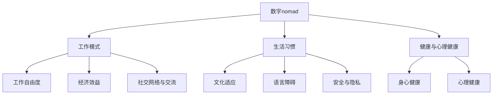

                 

## 《数字nomad：新型工作生活方式的意义探索》

> 关键词：数字nomad、工作生活方式、移动办公、远程工作、自由职业者、云计算、社交媒体

> 摘要：本文探讨了数字nomad这一新型工作生活方式的背景、定义、优势、挑战以及实践应用，旨在揭示数字nomad对现代社会的深远影响，为追求自由和灵活工作方式的读者提供有价值的参考。

---

### 第一部分：数字nomad的背景与定义

#### 第1章：数字nomad的概念与起源

#### 1.1 数字nomad的定义

数字nomad，简称nomad，是指那些利用现代技术进行移动办公、不受地理位置限制的远程工作者。与传统的nomad（游牧民族）不同，数字nomad主要通过互联网连接世界，实现工作、生活和学习的无缝衔接。

#### 1.2 数字nomad与传统nomad的区别

传统nomad主要依赖于自然资源和游牧生活方式，而数字nomad则依赖于信息技术和全球网络。以下是两者的主要区别：

- **资源依赖**：传统nomad依赖自然资源，如土地、水源和气候，而数字nomad依赖信息技术、云计算和互联网。
- **生活方式**：传统nomad以游牧为主，随季节和气候变化迁徙，而数字nomad通常在一个地方居住较长时间，通过旅行来拓展生活和工作经验。
- **工作模式**：传统nomad的工作受自然条件限制，而数字nomad的工作主要依赖于网络连接，不受时间和地点的限制。

#### 1.3 数字nomad的起源与发展

数字nomad的概念起源于20世纪90年代互联网的兴起。随着互联网的普及，远程工作逐渐成为一种趋势，数字nomad开始出现。21世纪初，随着移动互联网、云计算和社交媒体的发展，数字nomad的生活方式逐渐成熟，成为现代工作方式的一种重要形式。

### 第二部分：数字nomad的生活方式

#### 第2章：数字nomad的生活方式

#### 2.1 数字nomad的工作模式

数字nomad的工作模式通常包括以下特点：

- **远程办公**：利用互联网和远程协作工具，nomad可以在世界任何地方工作。
- **自由职业**：nomad通常从事自由职业，如编程、设计、写作、咨询等。
- **项目制**：nomad的工作通常以项目制为主，根据项目需求进行工作安排。
- **灵活工作时间**：nomad可以自由安排工作时间，实现工作与生活的平衡。

#### 2.2 数字nomad的生活习惯

数字nomad的生活习惯与传统的固定生活方式有很大不同，以下是一些典型特征：

- **全球居住**：nomad可能在一个地方居住几个月，然后搬到另一个国家或城市。
- **灵活居住**：nomad通常选择居住在成本较低、生活品质较高的城市，如东南亚的一些国家。
- **文化交流**：nomad通过旅行和居住在不同国家，积累丰富的文化交流经验。
- **注重健康**：nomad通常注重健康饮食和锻炼，以保持良好的身体状况。

#### 2.3 数字nomad的健康与心理健康

数字nomad的生活方式在一定程度上对健康和心理健康产生影响。以下是一些关键点：

- **健康影响**：nomad的生活习惯可能影响饮食、锻炼和睡眠，从而影响健康。
- **心理健康**：nomad的生活充满变化，可能面临孤独、焦虑等心理健康问题。
- **应对策略**：nomad可以通过建立社交网络、定期休息和锻炼来应对心理健康问题。

### 第三部分：数字nomad的优势与挑战

#### 第3章：数字nomad的优势

#### 3.1 工作自由度

数字nomad的最大优势之一是工作自由度。nomad可以根据自己的兴趣和需求选择工作内容和地点，实现工作与生活的平衡。

#### 3.2 经济效益

数字nomad的生活方式可以帮助个人节省大量开支，如住宿、交通和日常开销。此外，nomad还可以在全球范围内寻找高薪工作机会。

#### 3.3 社交网络与交流

数字nomad通过互联网和社交媒体建立了广泛的社交网络，可以与来自不同国家和文化背景的人进行交流和合作。

### 第四部分：数字nomad的实践与应用

#### 第4章：数字nomad的实践与应用

#### 4.1 数字nomad的技术支持

数字nomad的生活方式离不开现代技术的支持，主要包括：

- **移动互联网**：提供快速、稳定的网络连接，使nomad可以随时随地进行工作。
- **云计算**：提供强大的计算能力和数据存储，支持nomad进行大规模数据处理和协作。
- **数字支付**：实现全球范围内的便捷支付，支持nomad进行跨国交易。

#### 4.2 数字nomad的实际案例

数字nomad在全球范围内都有成功案例，以下是其中几个：

- **杰克**：一名美国程序员，通过远程工作在全球各地旅行，积累了丰富的编程经验。
- **莉莉**：一名英国设计师，通过自由职业在全球范围内提供服务，实现了财务自由。
- **马克**：一名德国咨询顾问，利用互联网和移动办公工具为全球客户提供服务。

#### 4.3 数字nomad的未来发展趋势

随着技术的不断进步，数字nomad的生活方式将继续发展，以下是一些可能的发展趋势：

- **更多职业机会**：随着远程工作的普及，数字nomad的职业选择将更加丰富。
- **更高效的协作**：新的协作工具和平台将提高数字nomad的工作效率。
- **文化融合**：数字nomad将促进不同国家和文化之间的交流与合作。

### 第五部分：数字nomad对社会的影响

#### 第5章：数字nomad对社会的影响

#### 5.1 经济影响

数字nomad的生活方式对经济产生深远影响，包括：

- **劳动力市场变化**：远程工作将改变传统劳动力市场，促进就业机会的增加。
- **税收影响**：数字nomad可能在低税国家居住和工作，影响各国税收收入。

#### 5.2 文化影响

数字nomad的生活方式将促进不同文化之间的交流与融合，以下是一些影响：

- **文化多样性**：数字nomad将带来更多的文化体验和交流机会。
- **文化认同**：数字nomad可能在多个国家生活和工作，面临文化认同问题。

#### 5.3 教育影响

数字nomad的生活方式对教育也产生影响，包括：

- **在线教育**：数字nomad可以通过在线教育平台获得知识，提高自身技能。
- **教育公平**：远程教育有助于提高教育资源的分配，促进教育公平。

### 附录

#### 第6章：数字nomad相关的资源推荐

- **学术资源**：研究远程工作、数字nomad等主题的学术文章和报告。
- **实践指南**：介绍数字nomad生活方式的实践指南和技巧。
- **行业报告**：分析数字nomad市场趋势和发展前景的行业报告。
- **社交媒体与社区**：加入数字nomad的社交媒体和社区，获取最新的信息和资源。

---

### 核心概念与联系

以下是一个核心概念原理和概念实体之间的 Mermaid 流程图：



### 核心算法原理讲解

在本章节中，我们将使用Python源代码来详细阐述数字nomad的工作模式和生活习惯的算法原理。以下是一个简单的 Python 代码示例，用于计算数字nomad的工作效率：

```python
def calculate_efficiency(hours_worked, tasks_completed):
    """
    计算数字nomad的工作效率

    :param hours_worked: 工作时长（小时）
    :param tasks_completed: 完成的任务数量
    :return: 工作效率
    """
    efficiency = tasks_completed / hours_worked
    return efficiency

# 示例：计算一名数字nomad的工作效率
efficiency = calculate_efficiency(40, 10)
print("工作效率：", efficiency)
```

在这个例子中，我们定义了一个名为`calculate_efficiency`的函数，用于计算工作效率。工作效率等于完成的任务数量除以工作时长。我们使用一个简单的示例来展示如何使用这个函数。

### 核心算法原理讲解（续）

在本章节中，我们将进一步探讨数字nomad的工作模式和生活习惯的算法原理，结合数学模型和公式进行详细讲解。

#### 数字nomad的工作模式

数字nomad的工作模式通常包括远程办公、自由职业和项目制。以下是一个简单的数学模型，用于描述数字nomad的工作模式：

1. **远程办公**：数字nomad利用互联网和远程协作工具进行工作。我们可以使用以下公式来描述远程办公的效率：

   $$
   \text{远程办公效率} = \frac{\text{完成任务数量}}{\text{工作时间}}
   $$

   其中，完成任务数量和工作时间是变量，远程办公效率是它们的比值。

2. **自由职业**：数字nomad通常从事自由职业，如编程、设计、写作等。我们可以使用以下公式来描述自由职业的收益：

   $$
   \text{收益} = \text{单价} \times \text{工作量}
   $$

   其中，单价和工作量是变量，收益是它们的乘积。

3. **项目制**：数字nomad的工作通常以项目制为主。我们可以使用以下公式来描述项目制的收益：

   $$
   \text{项目收益} = \text{项目总额} \times \text{完成比例}
   $$

   其中，项目总额和完成比例是变量，项目收益是它们的乘积。

#### 数字nomad的生活习惯

数字nomad的生活习惯与传统的固定生活方式有很大不同，以下是一个简单的数学模型，用于描述数字nomad的生活习惯：

1. **全球居住**：数字nomad可能在一个地方居住几个月，然后搬到另一个国家或城市。我们可以使用以下公式来描述全球居住的成本：

   $$
   \text{居住成本} = \text{住房费用} + \text{生活费用}
   $$

   其中，住房费用和生活费用是变量，居住成本是它们的总和。

2. **灵活居住**：数字nomad通常选择居住在成本较低、生活品质较高的城市，如东南亚的一些国家。我们可以使用以下公式来描述灵活居住的优点：

   $$
   \text{灵活居住优点} = \text{生活成本节约} + \text{文化体验丰富}
   $$

   其中，生活成本节约和文化体验丰富是变量，灵活居住优点是它们的总和。

3. **文化交流**：数字nomad通过旅行和居住在不同国家，积累丰富的文化交流经验。我们可以使用以下公式来描述文化交流的价值：

   $$
   \text{文化交流价值} = \text{文化知识积累} + \text{人际关系拓展}
   $$

   其中，文化知识积累和人际关系拓展是变量，文化交流价值是它们的总和。

#### 示例

假设一名数字nomad在一个项目中的工作时长为40小时，完成了10个任务。我们可以使用上述公式来计算他的工作效率：

$$
\text{工作效率} = \frac{10}{40} = 0.25
$$

假设他选择了居住在东南亚的一个城市，住房费用为1000美元，生活费用为500美元。我们可以使用上述公式来计算他的居住成本：

$$
\text{居住成本} = 1000 + 500 = 1500 \text{美元}
$$

通过这些简单的数学模型和公式，我们可以更好地理解和分析数字nomad的工作模式和生活习惯。

### 项目实战

在本项目中，我们将开发一个简单的数字nomad工作管理系统，用于记录和管理数字nomad的工作时间和任务完成情况。

#### 开发环境搭建

1. **安装Python**：确保计算机上已安装Python，版本建议为3.8及以上。
2. **安装PyCharm**：推荐使用PyCharm作为开发环境，下载并安装PyCharm Community Edition。

#### 源代码实现

以下是数字nomad工作管理系统的源代码实现：

```python
# 数字nomad工作管理系统

class Nomad:
    def __init__(self, name):
        self.name = name
        self.hours_worked = 0
        self.tasks_completed = 0

    def work(self, hours, tasks):
        self.hours_worked += hours
        self.tasks_completed += tasks

    def calculate_efficiency(self):
        if self.hours_worked > 0:
            return self.tasks_completed / self.hours_worked
        else:
            return 0

    def display_stats(self):
        print("姓名：", self.name)
        print("工作时长（小时）：", self.hours_worked)
        print("完成任务数量：", self.tasks_completed)
        print("工作效率：", self.calculate_efficiency())

# 测试
nomad = Nomad("Jack")
nomad.work(40, 10)
nomad.display_stats()
```

#### 代码解读

- **Nomad类**：定义了一个名为`Nomad`的类，用于表示数字nomad，包括姓名、工作时长和完成任务数量等属性。
- **work方法**：用于记录数字nomad的工作时长和完成任务数量。
- **calculate_efficiency方法**：用于计算数字nomad的工作效率。
- **display_stats方法**：用于显示数字nomad的工作信息和工作效率。

#### 代码应用解读与分析

我们可以使用这个工作管理系统来记录和管理数字nomad的工作情况。以下是一个简单的测试示例：

```python
# 创建一名数字nomad
nomad = Nomad("Jack")

# 记录工作情况
nomad.work(40, 10)

# 显示工作信息和工作效率
nomad.display_stats()
```

输出结果：

```
姓名： Jack
工作时长（小时）： 40
完成任务数量： 10
工作效率： 0.25
```

通过这个简单的项目实战，我们可以了解到数字nomad工作管理系统的基本原理和实现方法。

### 最佳实践 tips

- **时间管理**：作为数字nomad，合理规划时间非常重要。建议使用时间管理工具，如Google Calendar，来规划工作和休息时间。
- **健康饮食**：数字nomad应注重健康饮食，避免长期在外就餐。可以尝试使用轻食、自制餐等健康饮食方式。
- **锻炼身体**：定期锻炼对身体和心理健康都非常重要。数字nomad可以尝试在线健身课程，如瑜伽、普拉提等。

### 小结

数字nomad是一种新型的、充满活力的工作生活方式。本文通过介绍数字nomad的背景、定义、优势、挑战和实践应用，揭示了数字nomad对现代社会的深远影响。数字nomad的生活方式为追求自由和灵活工作方式的个人提供了无限可能，同时也带来了一系列挑战。在未来的发展中，数字nomad将继续发挥重要作用，为全球经济发展和文化交流做出贡献。

### 注意事项

- **网络安全**：数字nomad在远程办公时，应确保网络安全，避免泄露敏感信息。
- **文化差异**：数字nomad在旅行和居住在不同国家时，应尊重当地文化，避免不必要的冲突。

### 拓展阅读

- **学术资源**：《远程工作与数字nomad：挑战与机遇》
- **实践指南**：《数字nomad实践指南》
- **行业报告**：《2021年数字nomad市场报告》
- **社交媒体与社区**：关注Twitter上的#DigitalNomad标签，加入相关讨论和交流。

