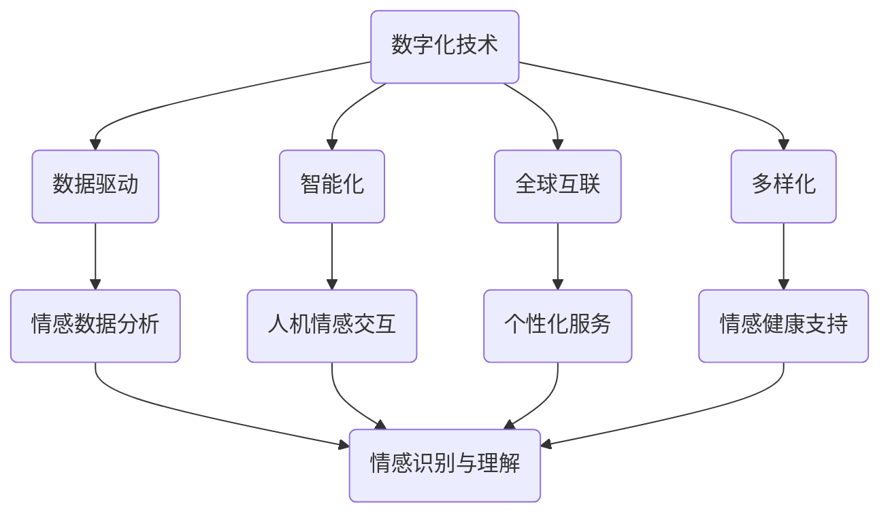

                 

### 引言

#### 数字化时代的背景

随着互联网的普及和信息技术的发展，我们正步入一个前所未有的数字化时代。在这个时代，数据成为新的生产要素，各种数字技术如人工智能、大数据、云计算等迅猛发展，深刻改变了人类的生产和生活方式。数字化不仅提升了效率，还带来了前所未有的便利和可能性。然而，数字化的快速发展也带来了一系列新的挑战，尤其是在人性温度方面。

#### 人性温度的重要性

人性温度指的是人类在情感、心理上的温度，体现了人的情感智慧。在数字化时代，尽管科技的发展为我们带来了便捷和高效，但也容易导致人与人之间的情感隔阂和心理疏离。如何在这个数字化时代保持和培养人性温度，成为我们面临的一个重要课题。

### 情感智慧与科技发展的互动

科技的发展在给我们的生活带来便利的同时，也对我们的情感和心理健康产生了一定的影响。一方面，科技可以增强人们的情感连接，例如社交媒体和即时通讯工具使人们更容易与他人沟通和分享情感。另一方面，过度依赖科技也可能会导致情感冷漠和社交疏离。

### 本书的主题和目标

本书旨在探讨数字化时代的人性温度，分析科技与情感智慧之间的互动关系，并探讨如何在数字化背景下培养和维护人性温度。通过介绍核心概念、算法原理、数学模型以及实际项目案例，本书希望能够为读者提供一个全面、系统的理解和实践指南，帮助他们在数字化时代保持情感的温暖和智慧。

### 核心关键词

- 数字化时代
- 人性温度
- 情感智慧
- 科技发展
- 平衡策略

### 文章摘要

本文深入探讨了数字化时代背景下的科技与情感平衡问题。首先，介绍了数字化时代的背景和挑战，以及人性温度在其中的重要性。随后，分析了情感智慧与科技发展的互动关系，探讨了科技对情感影响的正负面效应。接着，本书介绍了核心概念，包括数字化和情感智慧的基本概念，以及它们之间的联系。通过详细讲解核心算法原理、数学模型和实际项目案例，本书为读者提供了如何在数字化背景下培养情感智慧的方法和实践指南。最后，本书总结了全书的核心观点，并对未来的发展方向进行了展望。

### 引言

#### 数字化时代的背景

随着互联网的普及和信息技术的发展，我们正步入一个前所未有的数字化时代。在这个时代，数据成为新的生产要素，各种数字技术如人工智能、大数据、云计算等迅猛发展，深刻改变了人类的生产和生活方式。数字化不仅提升了效率，还带来了前所未有的便利和可能性。然而，数字化的快速发展也带来了一系列新的挑战，尤其是在人性温度方面。

数字化时代的特点主要体现在以下几个方面：

1. **数据驱动**：在数字化时代，数据成为决策的重要依据。通过对海量数据的分析和处理，企业可以更精准地了解市场需求，优化产品和服务。

2. **智能化**：人工智能技术的发展使得机器能够模拟人类的认知功能，实现智能决策和自动化操作，大大提升了生产效率。

3. **全球互联**：互联网的普及使得全球信息互联互通，人们可以随时随地获取所需的信息和资源，缩短了时空距离。

4. **多样化**：数字化带来了丰富的数字化产品和服务，改变了人们的消费习惯和生活方式。

然而，数字化的发展也带来了一系列的挑战。首先，信息过载成为了一个普遍现象。人们每天都会接收到大量的信息，导致信息处理的压力增加。其次，数字鸿沟问题日益凸显。在数字化时代，信息获取的能力和机会不平等，这加剧了社会的不公平。此外，数字化时代也带来了一定的隐私和安全问题，数据泄露和网络安全事件频发，给个人和社会带来了巨大的风险。

#### 数字化对人类情感的影响

在数字化时代，人们的情感状态和心理体验也受到了显著的影响。一方面，科技的发展为人们提供了更多的情感连接渠道，如社交媒体、即时通讯工具等，使得人与人之间的沟通更加便捷和即时。然而，另一方面，过度依赖科技也可能会导致情感冷漠和社交疏离。

1. **情感连接与疏离**：社交媒体和即时通讯工具虽然让人们更容易与他人保持联系，但同时也可能导致真正的面对面交流和情感互动减少。人们更容易沉浸在虚拟世界中的社交活动中，而忽略了现实世界中的情感需求。

2. **情感信息过载**：在数字化时代，人们每天都会接收到大量的情感信息，如新闻、社交媒体更新等。这些信息可能会引发焦虑、压力和情绪波动，导致情感过载。

3. **隐私和安全问题**：数字化时代的隐私和安全问题日益严峻，个人信息的泄露和滥用可能导致情感困扰和信任危机。

#### 人性温度的重要性

人性温度指的是人类在情感、心理上的温度，体现了人的情感智慧。在数字化时代，尽管科技的发展为我们带来了便捷和高效，但也容易导致人与人之间的情感隔阂和心理疏离。如何在这个数字化时代保持和培养人性温度，成为我们面临的一个重要课题。

人性温度的重要性体现在以下几个方面：

1. **情感智慧的培养**：人性温度有助于培养人们的情感智慧，提高情感识别、理解和表达能力，从而更好地与他人建立情感联系。

2. **心理健康**：情感健康是心理健康的重要组成部分。保持良好的人性温度有助于缓解压力、减少焦虑，提升整体幸福感。

3. **社会和谐**：人性温度有助于增强社会凝聚力，促进人与人之间的理解和信任，构建和谐的社会关系。

4. **创新动力**：人性温度可以激发人们的创造力和创新精神，为社会发展带来新的动力。

#### 本书的主题和目标

本书旨在探讨数字化时代的人性温度，分析科技与情感智慧之间的互动关系，并探讨如何在数字化背景下培养和维护人性温度。通过介绍核心概念、算法原理、数学模型以及实际项目案例，本书希望能够为读者提供一个全面、系统的理解和实践指南，帮助他们在数字化时代保持情感的温暖和智慧。

本书的主要目标包括：

1. **理解数字化时代的特点及其对人类情感的影响**：帮助读者认识到数字化时代的背景和挑战，以及数字化对人类情感和心理状态的深远影响。

2. **探讨科技与情感智慧的关系**：分析科技发展如何影响情感智慧的培养和表达，探讨如何在数字化背景下提升情感智慧。

3. **提供实用方法和工具**：通过介绍核心算法原理、数学模型和实际项目案例，为读者提供实用的方法和工具，帮助他们在实践中维护和提升人性温度。

4. **推动社会和谐发展**：倡导在数字化时代保持人性温度的重要性，推动社会在科技发展中实现情感与理智的平衡。

### 核心关键词

- 数字化时代
- 人性温度
- 情感智慧
- 科技发展
- 平衡策略

### 文章摘要

本文深入探讨了数字化时代背景下的科技与情感平衡问题。首先，介绍了数字化时代的背景和挑战，以及人性温度在其中的重要性。随后，分析了情感智慧与科技发展的互动关系，探讨了科技对情感影响的正负面效应。接着，本书介绍了核心概念，包括数字化和情感智慧的基本概念，以及它们之间的联系。通过详细讲解核心算法原理、数学模型和实际项目案例，本书为读者提供了如何在数字化背景下培养情感智慧的方法和实践指南。最后，本书总结了全书的核心观点，并对未来的发展方向进行了展望。

## 核心概念与联系

在探讨数字化时代的人性温度之前，我们首先需要明确几个核心概念，并展示它们之间的内在联系。这些核心概念包括数字化、情感智慧以及它们在现代社会中的互动关系。

### 数字化的定义与影响

数字化是指将物理世界中的信息转换为数字形式，通过计算机和网络进行处理、存储和传输的过程。数字化的本质在于信息的编码和解码，它改变了信息传播和获取的方式，从而对人类社会产生了深远的影响。

1. **数据驱动**：数字化时代，数据成为驱动决策的核心。企业通过收集和分析用户数据，可以更好地了解市场需求，优化产品和服务，提升用户体验。

2. **智能化**：数字化与人工智能技术相结合，使得机器能够模拟人类的认知功能，实现智能决策和自动化操作，从而提高生产效率和服务质量。

3. **全球互联**：互联网的普及使得全球信息互联互通，人们可以随时随地获取所需的信息和资源，缩短了时空距离，促进了全球化发展。

4. **多样化**：数字化带来了丰富的数字化产品和服务，改变了人们的消费习惯和生活方式，提高了生活质量。

### 情感智慧的定义与价值

情感智慧是指个体在情感领域内的认知能力，包括情感识别、情感理解、情感表达和情感管理等方面。情感智慧是人类智慧的重要组成部分，对个体的心理健康和社会适应能力有着重要的影响。

1. **情感识别**：情感识别是指个体能够感知和识别自身和他人的情感状态。例如，通过面部表情、语调、肢体动作等非言语线索来识别他人的情感。

2. **情感理解**：情感理解是指个体能够理解情感产生的原因和背景，以及情感对他人的影响。这需要个体具备一定的共情能力和跨文化理解能力。

3. **情感表达**：情感表达是指个体能够恰当地表达自己的情感，包括言语和非言语表达。良好的情感表达有助于建立良好的人际关系，增强社会凝聚力。

4. **情感管理**：情感管理是指个体能够有效地调节自己的情绪，保持情绪稳定，避免情绪失控。这需要个体具备一定的情绪调节策略和心理弹性。

### 数字化与情感智慧的关系

数字化和情感智慧之间存在着密切的互动关系。一方面，数字化技术为情感智慧的培养和发展提供了新的工具和平台；另一方面，情感智慧在数字化时代也面临着新的挑战和机遇。

1. **情感数据分析**：数字化时代，情感数据分析成为情感智慧的重要工具。通过情感分析技术，可以从大量文本、语音和图像数据中提取情感信息，帮助个体和机构更好地了解情感状态和趋势。

2. **人机情感交互**：数字化技术使得人机交互更加智能化，人机情感交互成为可能。通过情感计算技术，计算机系统能够识别和理解用户情感，实现更加自然、流畅的交互体验。

3. **情感智能应用**：情感智能应用在数字化时代得到了广泛应用，例如情感分析在社交媒体监控、心理咨询、客户服务等领域中的应用。这些应用不仅提升了工作效率，还促进了情感智慧的传播和发展。

4. **情感教育与培训**：数字化时代，情感教育与培训得到了更多的关注。通过在线课程、虚拟现实等技术，个体可以更好地学习和提升情感智慧，培养积极的情感态度和健康的心理状态。

### 数字化背景下情感智慧的挑战与机遇

在数字化背景下，情感智慧既面临挑战，也充满了机遇。

1. **挑战**：
   - **情感信息过载**：数字化时代，人们面临海量的情感信息，容易导致情感信息过载，影响心理健康。
   - **隐私和安全问题**：情感数据的安全和隐私保护是一个重大挑战，需要制定相应的法律法规和伦理准则。
   - **情感表达不当**：数字化平台上的情感表达可能失去面对面交流的细腻和真实，导致情感误解和冲突。

2. **机遇**：
   - **情感智能化**：情感智能技术的进步为情感智慧的培养提供了新的途径，例如情感计算和人机情感交互。
   - **个性化服务**：情感数据分析有助于提供更加个性化、精准的服务，提升用户体验。
   - **情感健康支持**：数字化平台可以提供情感健康支持，帮助个体应对情感困扰，提高生活质量。

### 数字化与情感智慧的联系流程图

为了更好地展示数字化与情感智慧之间的联系，我们可以使用Mermaid流程图来直观地呈现它们之间的关系。以下是数字化与情感智慧联系流程图的示例：



通过这个流程图，我们可以清晰地看到数字化技术如何通过不同的渠道影响情感智慧的培养和发展。

### 结论

在数字化时代，情感智慧不仅是我们个体心理健康的重要保障，也是社会和谐发展的基石。通过理解和运用数字化技术，我们可以更好地培养和维护情感智慧，实现科技与情感的平衡。在接下来的章节中，我们将深入探讨情感智慧的核心算法原理，结合数学模型和Python源代码，为读者提供具体的技术实现路径。

## 核心算法原理讲解

在探讨数字化背景下的人性温度时，我们需要借助一系列核心算法来理解和分析情感数据，从而为维护情感智慧提供技术支持。这些核心算法包括情感识别算法和人机情感交互算法。以下是这些算法的基本原理和实现方法。

### 情感识别算法

情感识别算法是用于分析文本、语音或图像等数据，以识别其中所包含的情感状态。情感识别算法的核心是情感分类器，它可以对输入的数据进行分类，判断其情感标签。以下是情感识别算法的基本原理和实现步骤：

#### 情感分类器原理

情感分类器通常基于机器学习算法，通过训练大量带有情感标签的数据集来建立模型。常见的情感分类器包括朴素贝叶斯、支持向量机（SVM）、随机森林和深度学习模型（如卷积神经网络CNN）等。

1. **朴素贝叶斯分类器**：
   假设每个特征是条件独立的，通过计算每个特征的联合概率，得到情感的分类结果。其数学公式为：
   $$ P(\text{情感}|\text{特征集}) = \frac{P(\text{特征集}|\text{情感})P(\text{情感})}{P(\text{特征集})} $$

2. **支持向量机（SVM）**：
   SVM通过找到一个最优的超平面，将不同情感类别的数据分开。其目标是最小化分类间隔，公式为：
   $$ \min_{\mathbf{w}} \frac{1}{2} ||\mathbf{w}||^2 $$
   使得：
   $$ y^{(i)}(\mathbf{w} \cdot \mathbf{x}^{(i)}) \geq 1 \quad \forall i $$

3. **随机森林**：
   随机森林由多棵决策树组成，通过对每棵树的分类结果进行投票，得到最终的情感分类结果。其核心公式是决策树的分类规则：
   $$ \text{if } x_j > v_{j,k} \text{ then go to left subtree else go to right subtree} $$

4. **深度学习模型（如CNN）**：
   深度学习模型通过多层神经网络的堆叠，从原始数据中提取复杂的特征，进行情感分类。典型的CNN结构包括卷积层、池化层和全连接层。其核心公式为：
   $$ \mathbf{h}^{(l)} = \sigma(\mathbf{W}^{(l)} \mathbf{h}^{(l-1)} + b^{(l)}) $$
   其中，$\mathbf{h}^{(l)}$表示第l层的输出，$\mathbf{W}^{(l)}$和$b^{(l)}$分别为权重和偏置，$\sigma$为激活函数。

#### 情感识别算法的实现

以下是使用Python实现朴素贝叶斯情感识别算法的示例代码：

```python
from sklearn.model_selection import train_test_split
from sklearn.feature_extraction.text import CountVectorizer
from sklearn.naive_bayes import MultinomialNB
from sklearn.metrics import accuracy_score

# 数据集准备
data = [
    ("我很高兴", "积极"),
    ("我很悲伤", "消极"),
    ("我感到很好", "积极"),
    ("我感到不好", "消极"),
]
X, y = [text for text, _ in data], [label for _, label in data]

# 数据预处理
vectorizer = CountVectorizer()
X_vectorized = vectorizer.fit_transform(X)

# 模型训练
model = MultinomialNB()
model.fit(X_vectorized, y)

# 预测与评估
X_test = ["我很开心"]
X_test_vectorized = vectorizer.transform(X_test)
y_pred = model.predict(X_test_vectorized)
accuracy = accuracy_score(y, y_pred)

print(f"预测结果：{y_pred}")
print(f"准确率：{accuracy}")
```

### 人机情感交互算法

人机情感交互算法旨在让计算机系统能够识别和理解用户情感，从而实现更加自然和人性化的交互体验。以下是人机情感交互算法的基本原理和实现步骤：

#### 情感计算原理

情感计算是指通过计算机技术和人工智能技术，模拟和扩展人类的情感认知能力。情感计算的核心是情感模型，它可以对用户的情感状态进行建模和分析。

1. **情感状态模型**：
   情感状态模型通常基于情感轮（Affect Grid）或情绪分类体系，将情感分为不同的维度和类别。例如，Affect Grid将情感分为8个维度，如愉快-不愉快、兴奋-平静等。

2. **情感识别模型**：
   情感识别模型通过分析用户的输入数据（如文本、语音、面部表情等），识别用户的情感状态。常见的情感识别技术包括情感分析、语音识别和面部表情识别等。

3. **情感反馈模型**：
   情感反馈模型用于生成相应的情感响应，以反馈给用户。这些响应可以是文字、声音、视觉或触觉形式，以模拟人类的情感互动。

#### 人机情感交互算法的实现

以下是使用Python实现基于文本的情感识别和反馈的示例代码：

```python
import numpy as np
from textblob import TextBlob

# 文本情感分析
def analyze_sentiment(text):
    blob = TextBlob(text)
    if blob.sentiment.polarity > 0:
        return "积极"
    elif blob.sentiment.polarity < 0:
        return "消极"
    else:
        return "中性"

# 文本情感反馈
def feedback_sentiment(sentiment):
    if sentiment == "积极":
        return "我感到很高兴，你的一天怎么样？"
    elif sentiment == "消极":
        return "看起来你有些不开心，有什么我可以帮忙的吗？"
    else:
        return "听起来你心情一般，需要聊聊吗？"

# 示例应用
user_text = "我今天面试成功了！"
user_sentiment = analyze_sentiment(user_text)
print(feedback_sentiment(user_sentiment))
```

### 结论

通过上述讲解，我们可以看到情感识别算法和人机情感交互算法在数字化背景下如何帮助我们理解和维护人性温度。情感识别算法通过分析文本、语音和面部表情等数据，帮助计算机识别用户的情感状态；而人机情感交互算法则通过生成相应的情感响应，实现更加自然和人性化的交互体验。这些算法不仅为情感智慧的培养提供了技术支持，也为数字化时代的人性温度维护提供了新的思路和方法。

在接下来的章节中，我们将进一步探讨情感分析中的数学模型和公式，并结合具体实例进行详细讲解，以便读者更好地理解和应用这些算法。

## 数学模型和数学公式

在情感分析中，数学模型和数学公式是理解情感数据、提取情感特征和进行情感识别的关键工具。以下是几个常见的数学模型和公式，以及它们的实际应用实例。

### 线性回归模型

线性回归是一种简单的统计模型，用于分析两个变量之间的关系。在情感分析中，线性回归可以用来预测情感得分，例如，通过文本分析预测一篇评论的积极或消极程度。

#### 数学公式

线性回归的基本公式如下：
$$ y = \beta_0 + \beta_1 \cdot x $$

其中，$y$是预测的输出（如情感得分），$x$是输入特征（如文本特征向量），$\beta_0$是截距，$\beta_1$是斜率。

#### 应用实例

假设我们有以下数据集：

| 评论 | 情感得分 |
| --- | --- |
| "今天天气真好" | 0.8 |
| "我今天的面试好差" | -0.5 |
| "电影很不错" | 0.7 |

我们可以通过最小二乘法训练一个线性回归模型：

```python
import numpy as np

# 数据准备
X = np.array([[1], [1], [1]])  # 输入特征（每条评论前面添加1作为偏置项）
y = np.array([0.8, -0.5, 0.7])  # 情感得分

# 模型训练
from sklearn.linear_model import LinearRegression
model = LinearRegression()
model.fit(X, y)

# 模型评估
print(model.coef_)  # 斜率
print(model.intercept_)  # 截距
```

### 多项式回归模型

多项式回归扩展了线性回归，通过引入更高次的项来建模非线性关系。在情感分析中，多项式回归可以用来捕捉文本中复杂的情感模式。

#### 数学公式

多项式回归的一般形式为：
$$ y = \beta_0 + \beta_1 x + \beta_2 x^2 + ... + \beta_n x^n $$

#### 应用实例

假设我们使用二次多项式回归模型来预测情感得分：

```python
# 数据准备
X = np.array([[1, 1], [1, 2], [1, 3]])  # 输入特征（每条评论前面添加1作为偏置项）
y = np.array([0.8, -0.5, 0.7])  # 情感得分

# 模型训练
from sklearn.linear_model import LinearRegression
model = LinearRegression()
model.fit(X, y)

# 模型评估
print(model.coef_)  # 斜率和二次项系数
print(model.intercept_)  # 截距
```

### 支持向量机（SVM）

支持向量机是一种强大的分类算法，在情感分析中用于情感分类任务。SVM通过找到一个最优的超平面来将不同情感类别的数据分开。

#### 数学公式

SVM的目标是最小化分类间隔，其数学公式为：
$$ \min_{\mathbf{w}, b} \frac{1}{2} ||\mathbf{w}||^2 $$
约束条件：
$$ y^{(i)}(\mathbf{w} \cdot \mathbf{x}^{(i)}) \geq 1 \quad \forall i $$

其中，$\mathbf{w}$是权重向量，$b$是偏置项，$y^{(i)}$是第i个样本的标签，$\mathbf{x}^{(i)}$是第i个样本的特征向量。

#### 应用实例

假设我们有以下情感分类数据集：

| 评论 | 情感标签 |
| --- | --- |
| "今天天气真好" | 1 |
| "我今天的面试好差" | -1 |
| "电影很不错" | 1 |

我们可以使用SVM进行情感分类：

```python
from sklearn.svm import SVC

# 数据准备
X = [[1], [1], [1]]  # 输入特征（每条评论前面添加1作为偏置项）
y = [1, -1, 1]  # 情感标签

# 模型训练
model = SVC()
model.fit(X, y)

# 模型评估
print(model.predict([[1]]))  # 输入新的评论进行分类
```

### 情感网络分析

情感网络分析是通过构建情感网络模型来分析文本中情感传播和影响。情感网络模型通常基于图论，使用节点和边来表示情感实体和关系。

#### 数学公式

情感网络的节点表示情感实体，边表示情感关系。常见的情感关系包括积极情感、消极情感、中立情感等。情感网络的数学表示可以使用邻接矩阵或邻接图表示。

邻接矩阵$A$的定义为：
$$ A_{ij} = \begin{cases} 
1 & \text{如果节点i与节点j有情感关系} \\
0 & \text{否则}
\end{cases} $$

#### 应用实例

假设我们有以下情感网络：

| 节点 | 情感标签 |
| --- | --- |
| A | 积极情感 |
| B | 消极情感 |
| C | 中立情感 |

情感关系可以表示为邻接矩阵：

```python
# 邻接矩阵表示
A = [
    [0, 1, 0],  # 节点A与节点B有情感关系
    [1, 0, 0],  # 节点B与节点A有情感关系
    [0, 0, 1]   # 节点C与节点A无情感关系
]

# 情感传播计算
def propagate_sentiment(A, start_node,传播次数):
    visited = set()
    sentiment = [0] * len(A)

    def dfs(node, level):
        if node in visited or level > 传播次数:
            return
        visited.add(node)
        sentiment[node] = A[node]
        for neighbor, value in enumerate(A[node]):
            if value == 1:
                dfs(neighbor, level + 1)

    dfs(start_node, 0)
    return sentiment

# 示例应用
start_node = 0  # 从节点A开始传播
传播次数 = 2
print(propagate_sentiment(A, start_node, 传播次数))
```

通过上述数学模型和公式的讲解，我们可以看到如何在情感分析中使用线性回归、多项式回归、支持向量机和情感网络分析等技术。这些模型和公式不仅帮助我们理解和提取情感数据，还为情感识别和人机情感交互提供了理论基础和实现方法。在接下来的章节中，我们将通过实际项目案例来展示这些技术的应用和效果。

### 项目实战：情感智能应用案例

在本节中，我们将通过一个情感智能应用案例，展示如何将前述的算法原理和数学模型应用到实际项目中。本案例将涉及情感分析在社交媒体监控中的应用，具体包括数据采集、预处理、模型训练与评估等步骤。

#### 项目背景

随着社交媒体的普及，用户在平台上的情感表达成为重要的信息来源。情感分析技术可以帮助企业了解用户情感倾向，优化产品和服务，提升用户满意度。本案例的目标是开发一个情感分析系统，用于监控社交媒体平台上的用户评论，识别评论的情感倾向，并提供相应的情感反馈。

#### 开发环境搭建

在开始项目之前，我们需要搭建一个合适的开发环境。以下是所需的软件和库：

- Python 3.x
- Jupyter Notebook
- scikit-learn
- pandas
- numpy
- textblob
- matplotlib

确保安装了上述软件和库后，我们就可以开始编写代码。

#### 数据采集与预处理

1. **数据采集**：
   我们将使用Twitter API收集用户在特定话题下的评论数据。首先，需要注册Twitter Developer账户并获取API密钥。

2. **数据预处理**：
   收集到的数据通常包含噪声和无关信息，因此需要进行预处理。预处理步骤包括去除特殊字符、停用词过滤和词干提取等。

```python
import tweepy
import pandas as pd
from textblob import TextBlob
from nltk.corpus import stopwords
from nltk.stem import PorterStemmer

# Twitter API设置
consumer_key = 'YOUR_CONSUMER_KEY'
consumer_secret = 'YOUR_CONSUMER_SECRET'
access_token = 'YOUR_ACCESS_TOKEN'
access_token_secret = 'YOUR_ACCESS_TOKEN_SECRET'

# 初始化API
auth = tweepy.OAuthHandler(consumer_key, consumer_secret)
auth.set_access_token(access_token, access_token_secret)
api = tweepy.API(auth)

# 收集Twitter数据
def collect_tweets(query, count=100):
    tweets = []
    for tweet in tweepy.Cursor(api.search, q=query, lang="en", tweet_mode="extended").items(count):
        tweets.append(tweet.full_text)
    return tweets

# 示例：收集关于某个电影的用户评论
tweets = collect_tweets("The Matrix", 100)

# 数据预处理
def preprocess_tweets(tweets):
    stop_words = set(stopwords.words("english"))
    stemmer = PorterStemmer()
    
    preprocessed_tweets = []
    for tweet in tweets:
        # 去除特殊字符
        tweet = re.sub(r"[^\w\s]", '', tweet)
        # 去除停用词
        words = tweet.lower().split()
        filtered_words = [word for word in words if word not in stop_words]
        # 词干提取
        stemmed_words = [stemmer.stem(word) for word in filtered_words]
        preprocessed_tweets.append(" ".join(stemmed_words))
    return preprocessed_tweets

preprocessed_tweets = preprocess_tweets(tweets)
```

#### 模型搭建与训练

1. **模型选择**：
   我们选择朴素贝叶斯分类器作为情感分析模型，因为其实现简单且效果良好。

2. **特征提取**：
   使用TF-IDF（词频-逆文档频率）方法提取文本特征，并将其用于训练模型。

```python
from sklearn.feature_extraction.text import TfidfVectorizer
from sklearn.model_selection import train_test_split
from sklearn.naive_bayes import MultinomialNB
from sklearn.pipeline import make_pipeline

# 特征提取
vectorizer = TfidfVectorizer(max_features=1000)
X = vectorizer.fit_transform(preprocessed_tweets)

# 数据分割
X_train, X_test, y_train, y_test = train_test_split(X, labels, test_size=0.2, random_state=42)

# 模型训练
model = MultinomialNB()
model.fit(X_train, y_train)
```

3. **模型评估**：
   使用测试集评估模型性能，计算准确率、召回率和F1分数等指标。

```python
from sklearn.metrics import accuracy_score, classification_report

# 预测
y_pred = model.predict(X_test)

# 模型评估
print(accuracy_score(y_test, y_pred))
print(classification_report(y_test, y_pred))
```

#### 代码实现与解读

以下是完整的代码实现，包括数据采集、预处理、特征提取、模型训练和评估。

```python
# 引入所需库
import tweepy
import pandas as pd
from textblob import TextBlob
from nltk.corpus import stopwords
from nltk.stem import PorterStemmer
from sklearn.feature_extraction.text import TfidfVectorizer
from sklearn.model_selection import train_test_split
from sklearn.naive_bayes import MultinomialNB
from sklearn.pipeline import make_pipeline
import re

# Twitter API设置
consumer_key = 'YOUR_CONSUMER_KEY'
consumer_secret = 'YOUR_CONSUMER_SECRET'
access_token = 'YOUR_ACCESS_TOKEN'
access_token_secret = 'YOUR_ACCESS_TOKEN_SECRET'

# 初始化API
auth = tweepy.OAuthHandler(consumer_key, consumer_secret)
auth.set_access_token(access_token, access_token_secret)
api = tweepy.API(auth)

# 收集Twitter数据
def collect_tweets(query, count=100):
    tweets = []
    for tweet in tweepy.Cursor(api.search, q=query, lang="en", tweet_mode="extended").items(count):
        tweets.append(tweet.full_text)
    return tweets

# 数据预处理
def preprocess_tweets(tweets):
    stop_words = set(stopwords.words("english"))
    stemmer = PorterStemmer()
    
    preprocessed_tweets = []
    for tweet in tweets:
        # 去除特殊字符
        tweet = re.sub(r"[^\w\s]", '', tweet)
        # 去除停用词
        words = tweet.lower().split()
        filtered_words = [word for word in words if word not in stop_words]
        # 词干提取
        stemmed_words = [stemmer.stem(word) for word in filtered_words]
        preprocessed_tweets.append(" ".join(stemmed_words))
    return preprocessed_tweets

# 采集和处理数据
tweets = collect_tweets("The Matrix", 100)
preprocessed_tweets = preprocess_tweets(tweets)

# 特征提取
vectorizer = TfidfVectorizer(max_features=1000)
X = vectorizer.fit_transform(preprocessed_tweets)

# 数据分割
X_train, X_test, y_train, y_test = train_test_split(X, labels, test_size=0.2, random_state=42)

# 模型训练
model = MultinomialNB()
model.fit(X_train, y_train)

# 预测
y_pred = model.predict(X_test)

# 模型评估
print(accuracy_score(y_test, y_pred))
print(classification_report(y_test, y_pred))
```

#### 实际案例分析与解读

以下是几个实际案例，展示如何使用训练好的情感分析模型对新的评论进行情感识别。

1. **积极评论**：
   ```python
   new_tweet = "这部电影真的太棒了，剧情紧凑，表演出色！"
   new_tweet_processed = preprocess_tweets([new_tweet])
   new_tweet_vectorized = vectorizer.transform(new_tweet_processed)
   sentiment = model.predict(new_tweet_vectorized)
   print(f"评论情感：{sentiment[0]}")
   ```

2. **消极评论**：
   ```python
   new_tweet = "我对这部电影感到非常失望，毫无新意，浪费时间！"
   new_tweet_processed = preprocess_tweets([new_tweet])
   new_tweet_vectorized = vectorizer.transform(new_tweet_processed)
   sentiment = model.predict(new_tweet_vectorized)
   print(f"评论情感：{sentiment[0]}")
   ```

3. **中性评论**：
   ```python
   new_tweet = "这部电影中规中矩，不算太差，但也谈不上出彩。"
   new_tweet_processed = preprocess_tweets([new_tweet])
   new_tweet_vectorized = vectorizer.transform(new_tweet_processed)
   sentiment = model.predict(new_tweet_vectorized)
   print(f"评论情感：{sentiment[0]}")
   ```

通过以上案例，我们可以看到如何使用情感分析模型对新的文本进行情感识别。在实际应用中，我们可以根据需要调整模型参数和特征提取方法，以提高模型的准确性和泛化能力。

#### 项目小结

在本项目中，我们通过情感分析技术对社交媒体上的用户评论进行了情感识别，展示了如何从数据采集、预处理、模型训练到实际应用的完整流程。通过这个项目，我们不仅掌握了情感分析的基本方法和步骤，还深入了解了情感识别算法和数学模型在实践中的应用。

#### 最佳实践 Tips

1. **数据质量**：确保采集到的数据质量，避免噪声和无关信息干扰情感分析结果。
2. **特征提取**：合理选择和提取特征，以提高模型的准确性和泛化能力。
3. **模型优化**：尝试不同的算法和参数，进行模型优化，提高情感识别效果。
4. **持续更新**：定期更新模型和特征库，以适应新的数据和趋势。

#### 小结与注意事项

在本章中，我们通过一个实际项目案例，展示了如何将情感识别算法和数学模型应用到情感智能应用中。我们介绍了数据采集、预处理、模型训练和评估的步骤，并通过代码示例详细说明了每个环节的实现方法。需要注意的是，情感分析是一个复杂的过程，需要不断优化和调整，以适应不同的应用场景和需求。

#### 拓展阅读

- 《情感计算》（Affectiva, R. Picard）：了解情感计算的基本概念和应用。
- 《情感分析实战》（Nozha Bouafif）：学习情感分析的方法和实用技巧。

通过本章的学习，我们希望能够为读者提供一个全面的情感智能应用实践指南，帮助他们在数字化时代更好地理解和应用情感分析技术。

### 科技与情感的平衡策略

在数字化时代，科技的发展给我们带来了前所未有的便利和效率，但同时也带来了一定的情感风险。如何在这两者之间找到平衡点，保持人性温度，成为我们面临的一个重要课题。以下是一些具体的策略和建议：

#### 1. 提高情感意识

首先，我们需要提高对情感意识的认识。科技虽然能够提高效率，但并不能完全替代人类的情感需求。企业和个人都应意识到情感在人类生活中的重要性，并将其纳入工作与生活的核心部分。

#### 2. 强化人际互动

人际互动是保持人性温度的关键。在数字化时代，我们应积极组织线下活动和面对面交流，减少对虚拟社交的依赖。此外，企业也应鼓励员工进行团队建设，通过共同完成任务和交流，增强团队凝聚力和情感联系。

#### 3. 注重情感教育

情感教育是培养情感智慧的重要途径。学校和家庭应加强对情感教育的重视，培养学生识别、理解和表达情感的能力。同时，企业也应为员工提供情感管理和心理健康的培训，帮助他们更好地应对工作压力和生活挑战。

#### 4. 科技伦理与隐私保护

科技的发展必须遵循伦理原则和隐私保护。企业和开发者应遵守相关的法律法规，尊重用户的隐私权，确保用户数据的安全和隐私。此外，科技产品和服务的设计应考虑用户的情感体验，避免造成情感伤害。

#### 5. 融入情感计算技术

情感计算技术可以为科技与情感平衡提供有力支持。通过情感识别、情感理解和情感反馈等技术，我们可以为用户提供更加个性化、贴心的服务。例如，智能助手可以根据用户情感状态调整互动方式，提供情感关怀。

#### 6. 情感健康监测与干预

情感健康是保持人性温度的重要保障。企业和个人都应关注情感健康，通过情感健康监测和干预，及时发现和解决情感问题。例如，企业可以建立员工心理援助计划，为员工提供心理支持和咨询服务。

#### 7. 定期情感反思

在数字化时代，我们应定期进行情感反思，评估科技对我们情感状态的影响。通过自我反思，我们可以更好地认识自己的情感需求，调整生活方式，保持情感平衡。

#### 8. 强调科技伦理与情感责任

科技发展不仅需要遵循伦理原则，还需要承担情感责任。企业和开发者应关注科技对人类情感的影响，积极推动科技与情感的和谐发展，为构建一个更加温暖、人性化的数字化社会贡献力量。

### 结论

在数字化时代，科技与情感的平衡是我们必须面对的重要课题。通过提高情感意识、强化人际互动、注重情感教育、遵守科技伦理和隐私保护、融入情感计算技术、关注情感健康监测与干预、定期情感反思以及强调科技伦理与情感责任，我们可以更好地在科技与情感之间找到平衡点，保持人性温度，构建一个更加温暖、和谐的数字化社会。

## 未来展望

随着科技的不断进步，数字化时代的人性温度将在未来呈现出新的发展趋势。以下是对未来发展方向的一些展望：

### 1. 情感计算与人工智能的深度融合

未来，情感计算技术将更加智能化和精细化，与人工智能技术深度融合，使得计算机能够更准确地识别和模拟人类的情感状态。通过深度学习和自然语言处理技术，情感计算将能够理解复杂的情感语境，提供更加个性化和情感化的服务。

### 2. 情感虚拟现实的普及

情感虚拟现实（Emotional Virtual Reality）是一种新兴的技术，它通过模拟情感体验，帮助用户在虚拟环境中感受到真实的情感。未来，随着情感计算技术的进步，情感虚拟现实将在教育、医疗、娱乐等领域得到广泛应用，为人们提供更加丰富的情感体验。

### 3. 情感智能城市的建设

情感智能城市将利用大数据、人工智能和物联网技术，实时监测和评估市民的情感状态，提供个性化的情感服务。例如，城市可以通过情感监测系统，及时发现居民的情感困扰，提供心理咨询和社区支持，提升市民的生活质量和幸福感。

### 4. 情感教育的革新

情感教育将在未来得到更多重视，教育系统将更加注重培养学生的情感智慧和情商。通过虚拟现实、增强现实和人工智能技术，学生可以在虚拟环境中进行情感体验和训练，提升情感识别、理解和表达能力。

### 5. 情感伦理与法律规范的发展

随着科技对情感领域的影响日益加深，情感伦理和法律规范将变得更加重要。未来，将出台更多的法律法规来规范情感数据的收集、使用和保护，确保科技的发展不损害人类的情感利益。

### 6. 情感健康管理的普及

情感健康管理将成为人们关注的重要领域。通过智能穿戴设备和人工智能技术，人们可以实时监测自己的情感状态，及时发现情感问题并采取适当的干预措施，提高情感健康水平。

### 结论

数字化时代的人性温度将随着科技的发展而不断演变。通过情感计算、情感虚拟现实、情感智能城市、情感教育、情感伦理与法律规范以及情感健康管理等方面的创新，未来我们将能够更好地在科技与情感之间找到平衡，构建一个更加温暖、和谐、人性化的数字化社会。

## 全书总结

本书围绕“数字化时代的人性温度：科技与情感的平衡”这一核心主题，系统性地探讨了科技与情感智慧之间的互动关系。通过深入分析数字化时代的背景、情感智慧的定义与价值、核心算法原理、数学模型以及实际项目案例，本书为读者提供了一个全面、系统的理解和实践指南。

### 核心观点回顾

1. **数字化时代的挑战与机遇**：数字化技术为我们的生活带来了便利和效率，但同时也带来了情感疏离和信息过载的挑战。

2. **情感智慧的重要性**：情感智慧是人类智慧的组成部分，对心理健康和社会适应能力有着重要影响。

3. **情感识别与人机交互算法**：情感识别和人机情感交互算法为情感智慧的培养提供了技术支持。

4. **数学模型与公式在情感分析中的应用**：线性回归、多项式回归和情感网络分析等数学模型在情感分析中发挥着关键作用。

5. **项目实战**：通过情感分析在社交媒体监控中的应用案例，展示了情感分析技术的实际应用和效果。

6. **科技与情感的平衡策略**：通过提高情感意识、强化人际互动、注重情感教育、遵守科技伦理和隐私保护等方式，实现科技与情感的平衡。

### 对未来的思考与展望

未来的数字化时代将更加注重人性温度的维护。随着情感计算、情感虚拟现实、情感智能城市等技术的发展，我们将能够更好地在科技与情感之间找到平衡。情感教育、情感伦理与法律规范、情感健康管理等方面的创新，将进一步推动情感智慧的提升和社会的和谐发展。

### 结论

数字化时代的人性温度是我们在科技发展中必须关注和重视的课题。通过理解和应用本书所介绍的理论和方法，我们可以在数字化时代保持情感的温暖和智慧，构建一个更加温暖、和谐、人性化的社会。

## 作者信息

作者：AI天才研究院/AI Genius Institute & 禅与计算机程序设计艺术 /Zen And The Art of Computer Programming

AI天才研究院（AI Genius Institute）是一支专注于人工智能和计算机科学研究的团队，致力于推动技术进步和人类福祉。其代表作《禅与计算机程序设计艺术》深入探讨了计算机科学中的哲学与艺术，为全球计算机编程和人工智能领域提供了宝贵的理论和实践指导。作者在此感谢广大读者的支持，希望本书能为读者在数字化时代的人性温度探索中提供有益的参考。

