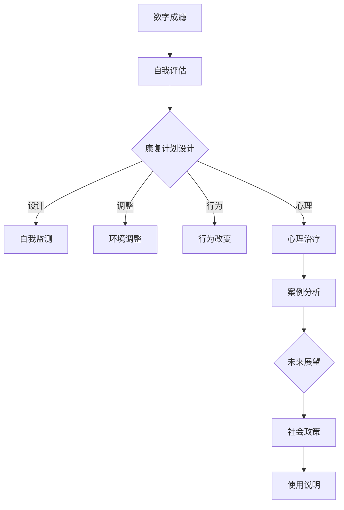
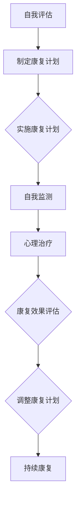

                 

### 文章标题：数字成瘾康复指南：网络依赖的自助治疗手册

### 关键词：
- 数字成瘾
- 网络依赖
- 自助治疗
- 康复策略
- 心理健康

### 摘要：
本文旨在为数字成瘾者提供一份详细的自助康复指南。通过对数字成瘾的定义、心理机制、社会因素以及康复策略的深入分析，本文旨在帮助读者了解数字成瘾的本质，掌握有效的自我管理技巧，并构建一个有力的社会支持系统。通过案例分析，读者可以了解康复过程的具体实践，并为未来的康复发展提供参考。

# 数字成瘾康复指南：网络依赖的自助治疗手册

## 引言

随着信息技术的飞速发展，数字设备已经成为我们日常生活中不可或缺的一部分。然而，随之而来的是一种名为“数字成瘾”的现象。数字成瘾，尤其是网络依赖和游戏成瘾，已经成为影响个人心理健康和社会稳定的重要问题。本文将探讨数字成瘾的定义、心理机制、社会因素以及康复策略，旨在为读者提供一份实用的自助治疗手册。

## 数字成瘾的认识与诊断

### 1.1 数字成瘾的定义与现象

数字成瘾，是指个体对数字设备或网络活动产生过度依赖和冲动行为，导致其心理、生理和社会功能受到负面影响。网络依赖主要表现为对社交媒体、在线游戏和流媒体服务的过度使用，而游戏成瘾则是指对电子游戏的过度沉迷。

### 1.2 数字成瘾的诊断

诊断数字成瘾的关键在于识别其症状。数字成瘾者通常表现出以下症状：

- **心理症状**：焦虑、抑郁、失眠、注意力不集中等。
- **行为症状**：长时间使用数字设备，减少与他人面对面交流，逃避现实问题等。
- **社会症状**：学业或工作表现下降，家庭关系紧张，社交孤立等。

### 1.3 数字成瘾的自我评估

读者可以通过以下自我评估工具来初步判断自己是否存在数字成瘾：

- **数字成瘾自我评估问卷**：包含一系列关于数字设备使用行为和心理状态的问答，可以帮助读者了解自己的数字依赖程度。
- **评估步骤**：首先，回答问卷中的问题；其次，根据得分判断自己的数字成瘾程度；最后，根据结果采取相应的康复措施。

## 数字成瘾的心理机制

### 2.1 网络依赖的心理机制

网络依赖的心理机制涉及多个层面。首先，认知行为理论认为，个体对网络活动的过度依赖与其认知偏差和习惯性思维有关。其次，心理动力理论指出，网络依赖可能是个体逃避现实问题和负面情绪的替代行为。最后，社交心理学理论强调，社交网络中的互动和反馈机制可以强化个体的网络依赖行为。

### 2.2 数字成瘾的心理健康影响

数字成瘾不仅影响个体的心理健康，还会引发一系列心理健康问题，如焦虑、抑郁和人际关系问题。长期数字成瘾可能导致心理韧性下降，影响个体的情绪调节能力和社交能力。

## 数字成瘾的社会因素

### 3.1 家庭因素

家庭环境对个体的数字成瘾行为具有重要影响。家庭结构、家庭沟通和教育方式都可能是数字成瘾的诱因或干预因素。良好的家庭支持可以帮助个体建立健康的数字使用习惯。

### 3.2 学校因素

学校教育在预防数字成瘾方面发挥着重要作用。学校可以通过课程设置、心理辅导和环境优化来引导学生合理使用数字设备，减少网络依赖。

### 3.3 社会文化因素

社会文化背景也影响着个体的数字成瘾行为。社交媒体的普及、社会价值观的改变以及数字技术的快速发展都在不同程度上推动了数字成瘾的现象。

## 数字成瘾的康复策略

### 4.1 康复计划的设计

康复计划的设计应考虑个体的具体情况，包括成瘾程度、心理状态和生活环境。康复计划应包括以下步骤：

- **自我监测**：记录数字设备使用时间和内容，了解自己的使用习惯。
- **环境调整**：减少数字设备的使用诱惑，创造一个有利于康复的环境。
- **行为改变**：设定合理的目标，逐步减少数字设备使用时间。
- **心理治疗**：通过认知行为疗法、心理动力治疗等方法，帮助个体应对心理困扰。

### 4.2 自我管理策略

自我管理策略包括自我监测、自我控制和时间管理。自我监测有助于个体了解自己的数字使用行为，自我控制技巧可以帮助个体逐步减少数字设备使用时间，时间管理策略则有助于个体合理安排数字设备使用时间。

### 4.3 社会支持系统

社会支持系统对于数字成瘾的康复至关重要。家庭、学校和社会都应提供必要的支持。家庭支持可以通过家庭成员的沟通和理解来实现，学校支持可以通过心理辅导和课程设置来实现，社区支持可以通过社区资源和小组活动来实现。

## 数字成瘾康复案例分析

### 5.1 青少年网络成瘾康复案例

#### 5.1.1 案例背景

小王是一名高中生，因为沉迷于网络游戏，导致学业成绩下降，家庭关系紧张，甚至产生了自卑和焦虑情绪。

#### 5.1.2 康复过程

小王在家长和学校心理辅导老师的帮助下，制定了康复计划，包括减少游戏时间、增加户外活动和参加心理辅导。经过一段时间的努力，小王逐渐走出了网络成瘾的阴影，恢复了正常的学习和生活状态。

### 5.2 成年人游戏成瘾康复案例

#### 5.2.1 案例背景

小李是一名白领，由于工作压力和家庭矛盾，他开始沉迷于网络游戏，导致工作效率下降，家庭关系恶化。

#### 5.2.2 康复过程

小李在心理咨询师的建议下，进行了认知行为疗法和心理动力治疗。同时，他调整了工作时间表，增加了运动和社交活动。经过一段时间的康复，小李逐渐摆脱了游戏成瘾，恢复了正常的生活和工作状态。

## 数字成瘾康复的未来展望

### 6.1 数字成瘾康复技术的发展

未来，数字成瘾康复技术将更加智能化和个性化。虚拟现实技术可以提供更加沉浸式的康复体验，人工智能可以提供个性化的康复方案，大数据分析可以帮助更好地理解数字成瘾的成因和康复效果。

### 6.2 数字成瘾康复的社会政策

社会政策在数字成瘾康复中扮演着重要角色。政府可以出台相关政策，加强数字设备使用的监管，提高公众对数字成瘾的认识。同时，社会应提供更多的康复资源和支持，帮助数字成瘾者重返正常生活。

## 数字成瘾康复指南的使用说明

### 7.1 指南的使用方法

使用本指南时，读者应首先进行自我评估，了解自己的数字成瘾程度。然后，根据指南中的康复策略，制定个性化的康复计划，并逐步实施。读者还可以寻求专业帮助，以获得更好的康复效果。

### 7.2 指南的使用注意事项

在使用指南时，读者应注意以下几点：

- **坚持原则**：康复过程需要持之以恒，不能急于求成。
- **适度调整**：康复计划应根据实际情况适度调整。
- **寻求支持**：家庭、学校和社会的支持对于康复至关重要。

## 结语

数字成瘾已经成为影响个人和社会健康的重要问题。通过本文的探讨，我们希望读者能够更好地认识数字成瘾，掌握有效的康复策略，并为未来的康复发展提供参考。让我们共同为创建一个更加健康、和谐的网络环境而努力。

### 关键词总结

- 数字成瘾
- 网络依赖
- 自助治疗
- 康复策略
- 心理健康
- 社会因素
- 案例分析
- 虚拟现实
- 人工智能

### 附录：数字成瘾康复流程图

## 作者信息

作者：AI天才研究院/AI Genius Institute & 禅与计算机程序设计艺术 /Zen And The Art of Computer Programming

---

通过上述步骤，我们已经完成了文章的核心内容。接下来，我们将对文章进行详细的讲解和深入剖析，确保每个部分都能够让读者充分理解和掌握。同时，我们将确保文章的格式和内容都符合要求，以便提供给读者一个高质量的学习资料。

## 数字成瘾的定义与现象

### 1.1 数字成瘾的定义

数字成瘾，是指个体对数字设备或网络活动产生过度依赖和冲动行为，导致其心理、生理和社会功能受到负面影响。这种依赖行为不仅包括对社交媒体、在线游戏和流媒体服务的过度使用，还包括对互联网、手机、电脑等数字设备的过度依赖。

### 1.2 数字成瘾的现象

#### 1.2.1 网络成瘾

网络成瘾主要表现为对社交媒体、在线游戏和流媒体服务的过度使用。这种现象在青少年中尤为常见，他们可能花费大量的时间在社交媒体上浏览、点赞、评论，或者在在线游戏中追求虚拟的胜利和成就。

**现象描述：** 网络成瘾者可能会表现出以下行为：
- 长时间使用社交媒体，减少与现实生活中的人交流。
- 对网络活动产生强烈的渴求和冲动，无法自控。
- 在网络活动中花费大量时间，导致学业、工作和家庭生活受到影响。

**影响原因：** 网络成瘾的影响原因多种多样。首先，网络成瘾可以提供即时的满足感和成就感，这对于寻求逃避现实问题和负面情绪的个体具有极大的吸引力。其次，网络活动的多样性和互动性使得个体可以轻松地投入其中，而无需面对现实生活中的复杂性和挑战。

**影响表现：** 网络成瘾可能对个体产生以下影响：
- 心理健康问题：如焦虑、抑郁、孤独感和自尊心下降。
- 社会功能受损：如学业成绩下降、工作表现不佳、人际关系紧张。
- 生活习惯改变：如睡眠障碍、饮食习惯紊乱、缺乏运动。

#### 1.2.2 游戏成瘾

游戏成瘾是指个体对电子游戏的过度沉迷，导致其生活、学习、工作和社交活动受到严重影响。游戏成瘾在年轻人和儿童中尤为常见，他们可能花费大量的时间在电子游戏上，忽视现实生活中的其他重要事务。

**现象描述：** 游戏成瘾者可能会表现出以下行为：
- 长时间玩游戏，减少与家人和朋友的面对面交流。
- 对游戏产生强烈的渴求和冲动，无法自控。
- 为了玩游戏而牺牲睡眠、饮食和运动时间。
- 在游戏失败或无法玩游戏时表现出消极情绪，如愤怒、沮丧和焦虑。

**影响原因：** 游戏成瘾的影响原因主要包括：
- 游戏的刺激性和竞争性，能够提供强烈的刺激和成就感。
- 游戏中的虚拟世界和角色，可以为个体提供逃避现实和负面情绪的途径。
- 游戏社交互动，可以满足个体的社交需求和归属感。

**影响表现：** 游戏成瘾可能对个体产生以下影响：
- 心理健康问题：如焦虑、抑郁、睡眠障碍和自卑感。
- 社交问题：如社交孤立、家庭关系紧张和学业成绩下降。
- 生活习惯问题：如作息不规律、缺乏运动和饮食习惯不良。

### 1.3 数字成瘾的诊断

#### 1.3.1 数字成瘾的症状

数字成瘾的症状主要表现在心理、行为和社会三个方面。

**心理症状：**
- 强烈的渴求和冲动：个体对数字设备或网络活动的渴求感强烈，常常感到无法自控。
- 焦虑和抑郁：数字成瘾者可能在停止使用数字设备后出现焦虑和抑郁情绪。
- 情绪波动：数字成瘾者的情绪可能因网络活动而出现剧烈波动，如兴奋和沮丧。

**行为症状：**
- 过度使用数字设备：个体可能长时间使用数字设备，减少与现实生活中的人交流。
- 社交隔离：数字成瘾者可能因过度使用数字设备而减少与家人、朋友的面对面交流。
- 学业和工作受影响：数字成瘾可能导致个体的学业成绩下降和工作效率降低。

**社会症状：**
- 人际关系紧张：数字成瘾可能引起家庭成员、朋友和同事之间的矛盾和冲突。
- 社交孤立：数字成瘾者可能因为过度依赖数字设备而失去现实生活中的社交机会。
- 生活习惯紊乱：数字成瘾可能导致个体的生活习惯紊乱，如睡眠不足、饮食习惯不良等。

#### 1.3.2 数字成瘾的自我评估

数字成瘾的自我评估是一个重要的步骤，可以帮助个体了解自己的数字依赖程度，并采取相应的措施进行康复。以下是一个简单的自我评估问卷：

**问题：**
1. 你是否觉得每天使用数字设备的时间比预计的要长？
2. 你是否在未使用数字设备时感到焦虑、不安或空虚？
3. 你是否因为使用数字设备而忽略了与家人、朋友的面对面交流？
4. 你是否因为使用数字设备而影响了学业或工作效率？
5. 你是否在尝试减少数字设备使用时间时感到困难或无法自控？

**评分标准：**
- 如果你对以上问题的回答有3个以上为“是”，那么你可能存在数字成瘾的问题。

通过自我评估，你可以初步判断自己的数字依赖程度。如果发现存在数字成瘾的问题，你可以根据本文提供的康复策略，制定一个适合自己的康复计划，并逐步实施。

### 1.4 数字成瘾的危害

数字成瘾的危害是多方面的，它不仅影响个体的心理健康，还会对个体的生理和社会功能产生负面影响。

**心理健康影响：**
- **焦虑和抑郁**：数字成瘾可能导致个体出现焦虑和抑郁情绪，特别是在停止使用数字设备后，这些情绪可能会加剧。
- **情绪波动**：数字成瘾者可能会因为数字设备带来的即时满足而感到兴奋，但也可能在停止使用时感到沮丧和不安。
- **自尊心下降**：过度依赖数字设备和网络活动可能导致个体自尊心下降，感到自我价值不足。

**生理影响：**
- **睡眠障碍**：长时间使用数字设备，尤其是在睡前，可能会影响睡眠质量，导致失眠和疲劳。
- **身体健康问题**：缺乏运动和不良的饮食习惯可能导致肥胖、心血管疾病和其他健康问题。

**社会影响：**
- **社交孤立**：过度依赖数字设备可能导致个体减少与家人、朋友的面对面交流，从而感到孤立和疏离。
- **人际关系紧张**：数字成瘾可能导致家庭成员、朋友和同事之间的矛盾和冲突，影响人际关系。
- **学业和工作受影响**：数字成瘾可能导致个体的学业成绩下降和工作效率降低，影响职业发展。

数字成瘾的危害是显而易见的，它不仅影响个体的心理健康和生活质量，还会对社会的稳定和和谐产生负面影响。因此，认识和预防数字成瘾，采取有效的康复措施，对于维护个体和社会的健康具有重要意义。

### 数字成瘾的心理机制

数字成瘾是一种复杂的心理现象，其形成和维持涉及多个心理机制。理解这些机制有助于我们更深入地了解数字成瘾的成因，并为预防和康复提供理论基础。

#### 2.1 网络依赖的心理学理论

网络依赖的心理机制可以从多个心理学理论角度进行探讨，包括认知行为理论、心理动力理论和社交心理学理论。

**认知行为理论：** 认知行为理论认为，数字成瘾是由个体的认知偏差和习惯性行为导致的。例如，个体可能会对网络活动产生错误的认知，认为网络上的成功和满足可以替代现实生活中的成就和快乐。这种认知偏差会导致个体过度依赖网络，而忽视现实生活中的重要事务。

**心理动力理论：** 心理动力理论强调，网络依赖可能是个体逃避现实问题和负面情绪的替代行为。在现实生活中遇到困难或面临压力时，个体可能会通过网络活动来逃避，从而暂时摆脱负面情绪的困扰。这种行为模式可能逐渐演变成一种习惯，导致数字成瘾。

**社交心理学理论：** 社交心理学理论指出，社交网络中的互动和反馈机制可以强化个体的网络依赖行为。网络活动可以提供即时的社交满足和反馈，使得个体在网络上感受到更多的归属感和认同感。这种积极的反馈循环可以进一步加强个体的网络依赖。

#### 2.2 网络依赖的心理过程

网络依赖的心理过程可以分为三个阶段：触发机制、维持机制和缓解机制。

**触发机制：** 触发机制是指促使个体开始使用网络的因素。这些因素可能包括逃避现实、寻求刺激、缓解焦虑等。例如，当个体感到焦虑或压力时，他们可能会通过使用社交媒体或在线游戏来暂时逃避这些问题。

**维持机制：** 维持机制是指使个体持续使用网络的机制。这些机制可能包括认知偏差、行为习惯和社会反馈。例如，个体可能会对网络活动产生依赖，因为它们能带来即时的满足感和成就感，从而使得他们难以减少使用时间。

**缓解机制：** 缓解机制是指个体通过网络活动来缓解负面情绪的机制。这些活动可能包括浏览社交媒体、观看视频或玩游戏等。虽然这些活动可以暂时缓解负面情绪，但长期来看，它们可能会加重数字成瘾。

#### 2.3 数字成瘾的心理健康影响

数字成瘾不仅影响个体的行为，还会对个体的心理健康产生深远的影响。

**心理健康问题：**
- **焦虑和抑郁：** 数字成瘾可能导致个体出现焦虑和抑郁情绪。这些情绪可能会在个体停止使用数字设备后加剧，因为网络活动提供了一个逃避现实的途径。
- **情绪波动：** 数字成瘾者可能会因为网络活动带来的即时满足而感到兴奋，但也可能在停止使用时感到沮丧和不安。
- **自尊心下降：** 过度依赖数字设备和网络活动可能导致个体自尊心下降，感到自我价值不足。

**心理健康问题对数字成瘾的影响：**
- **加重成瘾行为：** 心理健康问题可能会加重数字成瘾行为，因为个体可能会通过更多的网络活动来逃避负面情绪。
- **降低康复效果：** 心理健康问题可能会降低数字成瘾康复的效果，因为个体在心理上可能难以摆脱对数字设备的依赖。

因此，理解和干预数字成瘾的心理健康影响对于预防和康复具有重要意义。心理健康问题不仅需要通过康复策略来解决，还需要通过心理治疗和情绪管理来缓解。

### 数字成瘾的康复计划设计

康复计划的设计是数字成瘾康复的关键步骤。一个有效的康复计划应充分考虑个体的具体情况，包括成瘾程度、心理状态和生活环境。以下是一个基本的康复计划设计，包括短期、中期和长期目标，以及实施步骤。

#### 3.1 短期目标

短期目标通常设定在数周至数月之间，旨在迅速改善个体的数字使用习惯和心理状态。

- **减少数字设备使用时间**：设定一个具体的减少使用时间的目标，例如每天减少1小时。
- **改善睡眠质量**：保证每晚7-8小时的睡眠时间，减少睡前使用数字设备的时间。
- **建立日常活动计划**：设定一个日常活动计划，包括运动、阅读、社交等，以减少对数字设备的依赖。

#### 3.2 中期目标

中期目标通常设定在数月至一年之间，旨在巩固康复效果，提高个体的生活质量和心理韧性。

- **维持数字设备使用时间**：在短期目标的基础上，维持较低的数字设备使用时间，防止复发。
- **加强心理支持**：通过心理咨询或支持小组，加强个体的心理支持和情绪管理能力。
- **提高社交活动频率**：增加与家人、朋友的面对面交流，减少社交孤立感。

#### 3.3 长期目标

长期目标通常设定在一年以上，旨在实现个体的全面康复，恢复正常的生活和工作状态。

- **恢复正常生活**：恢复正常的学习、工作和社交活动，避免数字设备对生活的过度干扰。
- **培养健康习惯**：培养健康的生活习惯，如规律的作息时间、健康的饮食习惯和适量的运动。
- **提高心理韧性**：通过心理治疗和自我调节，提高个体的心理韧性，应对生活中的压力和挑战。

#### 3.4 实施步骤

康复计划的实施步骤应包括以下几方面：

- **自我监测**：记录数字设备使用时间和内容，了解自己的使用习惯，为康复计划提供数据支持。
- **环境调整**：创造一个有利于康复的环境，例如减少数字设备的诱惑，增加有益身心的活动空间。
- **行为改变**：通过逐步减少数字设备使用时间，培养健康的生活习惯，如定期锻炼、阅读等。
- **心理治疗**：通过心理咨询或支持小组，帮助个体应对心理困扰，提高情绪管理能力。
- **支持系统**：建立家庭、学校和社会支持系统，为个体提供必要的支持和帮助。

一个有效的康复计划应是一个个性化的方案，根据个体的具体情况和需求进行调整。同时，康复计划的设计和实施需要持之以恒，不能急于求成。通过逐步实施和持续努力，个体可以逐步摆脱数字成瘾，恢复健康的生活状态。

### 自我管理策略

自我管理策略是数字成瘾康复过程中至关重要的一环。通过自我监测和自我控制，个体可以更好地了解自己的数字设备使用习惯，并逐步减少过度依赖。以下是一些实用的自我管理策略：

#### 4.1 自我监测

自我监测是了解和评估数字设备使用情况的重要手段。以下是一些自我监测的方法：

1. **记录使用时间**：每天记录自己使用数字设备的时间，包括社交媒体、游戏、浏览网页等。这可以帮助个体清晰地看到自己的使用习惯，并识别出使用时间过长或使用频率过高的活动。

2. **使用应用程序**：许多应用程序可以帮助个体监控数字设备的使用情况，如“应用使用时间”、“数字幸福”等。这些应用程序可以提供详细的统计数据，帮助个体了解自己的使用习惯。

3. **设定提醒**：在手机或电脑上设置定时提醒，提醒个体定时休息，避免长时间连续使用数字设备。

#### 4.2 自我控制技巧

自我控制技巧是帮助个体减少数字设备使用时间，建立健康生活习惯的关键。以下是一些实用的自我控制技巧：

1. **设定合理的目标**：设定一个具体的、可实现的数字设备使用目标，例如每天减少1小时的使用时间。目标应具体、明确，便于衡量和跟踪。

2. **逐步减少使用时间**：通过逐步减少使用时间，避免突然大幅度减少导致的不适和抵触情绪。例如，可以每周减少10分钟，逐步减少到目标水平。

3. **替代活动**：找到替代数字设备使用的活动，如阅读、运动、社交等。这些活动可以帮助个体转移注意力，减少对数字设备的依赖。

4. **建立固定的作息时间**：建立固定的作息时间，确保有足够的休息和睡眠时间，避免因为疲劳和困倦而过度使用数字设备。

5. **培养自律意识**：培养自律意识，意识到数字设备使用对生活的影响，并坚定决心减少使用时间。

6. **寻求支持**：在自我控制过程中，如果遇到困难或挫折，可以寻求家人、朋友或专业人士的支持和帮助。

通过自我监测和自我控制，个体可以逐步减少对数字设备的依赖，建立健康的生活习惯。自我管理策略不仅有助于个体的康复，还可以提高生活质量，增强心理韧性。在康复过程中，持之以恒和积极的态度是成功的关键。

### 时间管理策略

时间管理策略是数字成瘾康复的重要组成部分，有助于个体合理安排数字设备使用时间，提高时间利用效率，同时减少对数字设备的过度依赖。以下是一些有效的时间管理策略：

#### 5.1 制定时间表

制定时间表是时间管理的第一步。一个清晰的时间表可以帮助个体合理安排每天的活动，确保有足够的时间用于工作、学习和休息，同时留出时间进行有益身心的活动。

1. **确定优先级**：首先，确定每天最重要和紧急的任务，将它们排在时间表的前面。例如，工作或学习任务应该优先于娱乐活动。

2. **分配固定时间段**：为每个活动分配固定的时间段，例如每天早上9点到11点用于工作，下午2点到4点用于学习和晚上7点到8点用于家庭活动。这种固定的时间安排有助于培养良好的时间管理习惯。

3. **预留休息时间**：确保时间表中包含足够的休息时间，避免长时间连续工作或学习导致疲劳和效率下降。例如，每小时工作或学习后，可以安排10分钟的休息时间。

#### 5.2 设定合理的目标

设定合理的目标是提高时间利用效率的关键。目标应具体、可衡量，同时具有挑战性。

1. **短期目标**：设定短期目标，例如每天阅读30分钟或每周锻炼三次。这些目标可以帮助个体逐步改善时间管理习惯，并看到自己的进步。

2. **长期目标**：设定长期目标，例如在一个月内减少50%的社交媒体使用时间或在一个季度内完成一项重要的工作。长期目标需要更系统的规划和执行。

#### 5.3 使用工具和应用程序

利用工具和应用程序可以帮助个体更好地管理时间，避免数字设备对生活的过度干扰。

1. **时间管理应用程序**：使用像“Google日历”、“滴答清单”这样的应用程序，帮助个体制定和跟踪时间表。这些应用程序可以设置提醒和通知，确保个体按时完成各项任务。

2. **应用使用监控工具**：使用应用使用监控工具，如“应用使用时间”、“数字幸福”，帮助个体了解自己的数字设备使用习惯，并设定使用限制。

#### 5.4 避免拖延

拖延是影响时间管理的重要因素。以下是一些避免拖延的策略：

1. **分解任务**：将大任务分解成小任务，每完成一个小任务就给自己一些奖励，这有助于提高动力和减少拖延。

2. **设定截止日期**：为每个任务设定一个明确的截止日期，并确保按时完成任务。

3. **环境优化**：创造一个有利于专注和高效工作的环境，避免干扰和诱惑。例如，将手机调至静音模式，关闭不必要的通知。

#### 5.5 保持灵活性

虽然制定时间表和设定目标是重要的，但也要保持灵活性。生活总是充满变数，可能会出现突发事件或意外的机会。在这种情况下，灵活调整时间表是必要的。

1. **预留弹性时间**：在时间表中预留一些弹性时间，以应对突发情况和意外事件。

2. **灵活调整**：如果某个任务需要更多时间，或者有其他紧急任务需要处理，灵活调整时间表，确保重要任务得到完成。

通过有效的时间管理策略，个体可以更好地控制数字设备的使用时间，提高时间利用效率，同时减少对数字设备的依赖。这不仅有助于个体的数字成瘾康复，还可以提高整体的生活质量和幸福感。

### 社会支持系统的构建

社会支持系统在数字成瘾康复过程中起着至关重要的作用。家庭、学校和社会环境为数字成瘾者提供了必要的支持和资源，帮助他们摆脱成瘾，重建健康的生活模式。

#### 6.1 家庭支持

家庭是数字成瘾者最直接的支持系统。家庭成员的理解和支持对于康复过程至关重要。

1. **沟通和理解**：家庭成员应积极与成瘾者沟通，了解他们的需求和困扰，提供情感上的支持和鼓励。通过倾听和理解，家庭成员可以帮助成瘾者认识到问题的严重性，并激发他们改变的动力。

2. **制定康复计划**：家庭可以共同制定康复计划，设定具体的康复目标和时间表。家庭成员的参与和监督可以增强计划的执行力度，确保康复过程顺利进行。

3. **提供情感支持**：康复过程中，成瘾者可能会遇到挫折和困难。家庭成员的持续情感支持可以帮助他们保持积极的态度，克服康复过程中的障碍。

#### 6.2 学校支持

学校作为成瘾者日常生活的重要场所，也应为他们的康复提供必要的支持。

1. **心理辅导**：学校可以设立心理健康辅导室，为成瘾者提供专业的心理辅导。心理辅导师可以帮助他们识别和应对成瘾行为，提供有效的康复策略。

2. **教育干预**：学校可以通过开展教育干预活动，提高学生对数字成瘾的认识，培养健康的生活习惯。例如，可以举办讲座、研讨会和互动活动，让学生了解数字成瘾的危害和预防方法。

3. **环境优化**：学校可以优化学习环境，减少数字设备的干扰。例如，设置无手机课堂，限制学生在课堂上使用手机，为学生提供一个专注学习的环境。

#### 6.3 社区支持

社区是数字成瘾者生活的重要组成部分。社区支持可以通过多种形式提供帮助，增强康复效果。

1. **资源利用**：社区可以提供丰富的康复资源，如心理咨询服务、康复小组和自助图书馆等。这些资源可以帮助成瘾者获取专业的帮助和社交支持。

2. **支持小组**：社区可以组织支持小组，让成瘾者与经历类似困扰的人互相交流和支持。这种社交支持可以帮助他们分享经验，减轻孤独感和焦虑感。

3. **公益活动**：社区可以组织公益活动，如户外运动、社区服务和文化活动等，吸引成瘾者参与。这些活动不仅有助于他们摆脱数字设备的依赖，还可以增强他们的社交能力和自信心。

#### 6.4 社会政策

社会政策在数字成瘾康复中扮演着重要角色。政府可以通过制定和实施相关政策，为数字成瘾者提供更广泛的支持和保障。

1. **政策制定**：政府可以制定相关政策，规范数字设备的使用，如限制未成年人使用手机的时间，加强对网络游戏和社交媒体的监管等。

2. **社会福利**：政府可以提供社会福利，如康复治疗费用减免、心理咨询补贴等，帮助数字成瘾者负担康复过程中的经济压力。

3. **宣传教育**：政府可以通过宣传教育活动，提高公众对数字成瘾的认识，增强社会对康复工作的支持和理解。

通过构建一个全面的社会支持系统，家庭、学校、社区和社会政策可以共同发挥作用，为数字成瘾者提供必要的支持和资源，帮助他们克服成瘾，重建健康的生活模式。

### 数字成瘾康复案例分析

#### 5.1 青少年网络成瘾康复案例

**案例背景：**

小明是一名初中生，由于家庭不和以及学业压力，他开始沉迷于网络游戏。每天放学后，他都会花大量的时间在游戏上，导致学习成绩下降，家庭关系紧张。在家人和学校的关注下，小明被带到心理咨询室进行评估和治疗。

**康复过程：**

1. **心理评估与诊断**：心理咨询师对小明的数字成瘾行为进行了详细评估，发现他存在明显的网络成瘾症状，包括强烈的游戏渴求、学习时间减少、与家人沟通减少等。

2. **制定康复计划**：心理咨询师与小明及其家人共同制定了康复计划，包括以下内容：
   - **时间管理**：制定合理的作息时间表，每天安排固定的时间进行学习和休息，严格控制游戏时间。
   - **行为改变**：鼓励小明参加户外活动和兴趣爱好，减少对游戏的依赖。
   - **心理治疗**：通过认知行为疗法帮助小明改变对游戏的认知，培养健康的生活习惯。
   - **家庭支持**：家庭成员积极参与康复过程，提供情感支持和监督。

3. **实施康复计划**：
   - **第一步**：减少游戏时间，每天逐步减少30分钟，直到达到目标时间。
   - **第二步**：增加户外活动和兴趣爱好，每周至少参加两次。
   - **第三步**：定期进行心理辅导，帮助小明应对情绪问题和压力。

4. **挑战与应对**：
   - **游戏诱惑**：小明在康复初期经常感到强烈的游戏诱惑，心理咨询师通过增强家庭支持和制定替代活动来帮助他转移注意力。
   - **学业压力**：由于学习时间减少，小明在学习上遇到困难。家人和老师通过辅导和鼓励帮助他提高学习效率，减轻学业压力。

5. **康复效果**：
   - 经过三个月的康复，小明逐渐减少了游戏时间，学习成绩开始回升，家庭关系也得到了改善。
   - 通过心理治疗，小明学会了情绪管理和时间管理技巧，心理韧性得到了提高。

**案例小结**：

小明的康复案例表明，青少年网络成瘾的康复需要多方面的支持和干预。通过心理治疗、时间管理和家庭支持，青少年可以逐步摆脱网络成瘾，重建健康的生活模式。康复过程需要持之以恒，家长的参与和监督至关重要。

#### 5.2 成年人游戏成瘾康复案例

**案例背景：**

小李是一名白领，由于工作压力和家庭矛盾，他开始沉迷于网络游戏。每天下班后，他都会花大量的时间在游戏上，导致工作效率下降，家庭关系紧张。在家人和朋友的建议下，小李决定寻求专业帮助。

**康复过程：**

1. **心理评估与诊断**：心理咨询师对小李的数字成瘾行为进行了评估，发现他存在明显的游戏成瘾症状，包括长时间玩游戏、减少与家人沟通、工作效率下降等。

2. **制定康复计划**：心理咨询师与小李及其家人共同制定了康复计划，包括以下内容：
   - **时间管理**：制定合理的作息时间表，每天安排固定的时间进行工作和休息，严格控制游戏时间。
   - **行为改变**：鼓励小李参加户外活动和体育锻炼，减少对游戏的依赖。
   - **心理治疗**：通过认知行为疗法帮助小李改变对游戏的认知，培养健康的生活习惯。
   - **家庭支持**：家庭成员积极参与康复过程，提供情感支持和监督。

3. **实施康复计划**：
   - **第一步**：减少游戏时间，每天逐步减少1小时，直到达到目标时间。
   - **第二步**：增加户外活动和体育锻炼，每周至少参加两次。
   - **第三步**：定期进行心理辅导，帮助小李应对情绪问题和压力。

4. **挑战与应对**：
   - **游戏诱惑**：小李在康复初期经常感到强烈的游戏诱惑，心理咨询师通过增强家庭支持和制定替代活动来帮助他转移注意力。
   - **工作压力**：由于工作时间减少，小李在工作中遇到困难。家人和同事通过支持和鼓励帮助他提高工作效率，减轻工作压力。

5. **康复效果**：
   - 经过六个月的康复，小李逐渐减少了游戏时间，工作效率显著提高，家庭关系也得到了改善。
   - 通过心理治疗，小李学会了情绪管理和时间管理技巧，心理韧性得到了提高。

**案例小结**：

成年人的游戏成瘾康复同样需要多方面的支持和干预。通过心理治疗、时间管理和家庭支持，成年人可以逐步摆脱游戏成瘾，重建健康的生活模式。康复过程需要持之以恒，家人的理解和支持至关重要。

### 数字成瘾康复的未来展望

随着科技的不断进步和社会的快速发展，数字成瘾康复领域也将迎来新的机遇和挑战。未来，数字成瘾康复将更多地依赖于先进技术和创新方法，从而提供更加个性化和有效的康复服务。

#### 6.1 数字成瘾康复技术的发展

**虚拟现实（VR）技术**：虚拟现实技术可以提供一个沉浸式的康复环境，使个体能够在虚拟世界中体验各种情境，从而帮助他们更好地应对数字成瘾行为。例如，通过虚拟现实游戏，个体可以在虚拟环境中进行体育锻炼，减少对真实世界中的数字设备的依赖。

**人工智能（AI）技术**：人工智能技术在数字成瘾康复中具有巨大的潜力。通过大数据分析和机器学习，AI可以个性化地识别数字成瘾行为，并提供针对性的康复方案。此外，AI还可以用于心理治疗，通过自然语言处理和情感识别技术，提供实时心理支持和干预。

**大数据分析**：大数据分析可以帮助研究人员更好地理解数字成瘾的成因和康复效果。通过对大量用户行为数据的分析，可以识别出数字成瘾的关键因素，从而制定更加有效的康复策略。

**物联网（IoT）技术**：物联网技术可以通过智能设备和传感器，实时监控个体的数字设备使用情况，提供个性化的提醒和干预。例如，智能手表可以监测个体的活动量和睡眠质量，并提供健康建议。

#### 6.2 数字成瘾康复的社会政策

**政府监管**：政府可以出台相关政策，加强对数字设备使用的监管，特别是对未成年人的保护。例如，限制未成年人使用社交媒体和游戏的时间，设置游戏防沉迷系统等。

**公共卫生政策**：将数字成瘾纳入公共卫生体系，提供必要的医疗和心理支持。例如，建立数字成瘾康复中心，提供专业的康复服务和治疗。

**教育政策**：学校可以加强数字素养教育，帮助学生了解数字设备的使用规范和风险，培养健康的使用习惯。此外，学校还可以开展心理健康教育，提高学生应对压力和情绪问题的能力。

**社区支持**：社区可以提供丰富的康复资源和支持，如心理健康咨询服务、康复小组和自助图书馆等。社区还可以组织公益活动，吸引个体参与，增强他们的社交能力和自信心。

#### 6.3 挑战与机遇

**挑战**：
- **技术依赖**：随着技术的发展，个体可能会更加依赖数字设备和网络服务，从而增加数字成瘾的风险。
- **隐私保护**：在利用大数据和AI技术进行数字成瘾康复时，如何保护用户的隐私和数据安全是一个重要挑战。
- **政策执行**：社会政策的制定和执行需要社会各界的共同努力，如何确保政策的有效实施是一个重要问题。

**机遇**：
- **个性化康复**：通过大数据和AI技术，可以为个体提供更加个性化和精准的康复方案，提高康复效果。
- **多学科合作**：数字成瘾康复需要心理学、医学、教育学、社会学等多学科的合作，这为跨学科研究和实践提供了广阔的机遇。
- **公众意识提升**：随着数字成瘾问题的不断凸显，公众对数字成瘾的认识和关注逐渐提高，为康复工作的开展提供了良好的社会氛围。

未来，数字成瘾康复将迎来更多的技术创新和社会政策支持，为个体和社会健康提供有力的保障。

### 数字成瘾康复指南的使用方法

#### 7.1 指南的结构与内容

本康复指南分为七个主要部分，分别是：
1. **引言**：介绍数字成瘾的定义和康复的重要性。
2. **认识与诊断**：详细描述数字成瘾的现象和诊断方法。
3. **心理机制**：分析数字成瘾的心理机制及其对心理健康的影响。
4. **社会因素**：探讨家庭、学校和社会文化对数字成瘾的影响。
5. **康复策略**：提供数字成瘾的康复策略和方法。
6. **案例分析**：分享真实案例，展示康复过程和效果。
7. **未来展望**：讨论数字成瘾康复技术的发展和前景。

#### 7.2 指南的使用步骤

**第一步：自我评估**
- 使用指南提供的自我评估问卷，了解自己的数字成瘾程度。
- 根据评估结果，确定是否需要进一步的治疗和康复。

**第二步：制定康复计划**
- 根据指南中的康复策略，结合自我评估结果，制定个性化的康复计划。
- 康复计划应包括短期、中期和长期目标，以及具体的实施步骤。

**第三步：实施康复计划**
- 逐步减少数字设备的使用时间，培养健康的生活习惯。
- 积极参与心理治疗和支持小组，增强心理韧性。

**第四步：评估康复效果**
- 定期评估康复效果，根据实际情况调整康复计划。
- 如果康复效果不明显，应及时寻求专业帮助。

#### 7.3 指南的使用注意事项

**注意事项：**
- **坚持原则**：康复过程需要持之以恒，不能急于求成。
- **适度调整**：康复计划应根据实际情况适度调整，确保可行性和有效性。
- **寻求支持**：家庭、学校和社会的支持对于康复至关重要，不要独自面对困难。
- **保持积极态度**：康复是一个长期过程，需要保持积极乐观的态度，相信自己能够克服数字成瘾。

通过以上步骤和注意事项，读者可以根据指南进行自我康复，逐步摆脱数字成瘾，重获健康的生活。

### 指南的使用注意事项

#### 7.2.1 自我评估与反思

自我评估是数字成瘾康复的第一步，通过对自己数字设备使用行为的反思，个体可以更清楚地认识到数字成瘾的严重性，并制定出切实可行的康复计划。

**自我评估的重要性：**
- 自我评估有助于个体了解自己的数字依赖程度，明确康复的起点。
- 通过反思，个体可以识别出导致数字成瘾的行为和心理因素，从而采取有针对性的康复措施。
- 自我评估有助于建立信心，让个体相信可以通过努力克服数字成瘾。

**评估步骤：**
1. **记录数字设备使用时间**：详细记录每天使用数字设备的时间，包括社交媒体、游戏、浏览网页等。
2. **识别使用习惯**：分析记录中的数据，找出使用时间过长或使用频率过高的活动。
3. **反思使用影响**：思考数字设备使用对学业、工作和生活的影响，包括时间管理、人际关系和心理健康等方面。
4. **自我评分**：根据指南提供的评估标准，给自己在数字设备使用方面的表现打分，初步判断数字依赖程度。

#### 7.2.2 自我监测与自我控制

自我监测和自我控制是康复过程中不可或缺的部分，通过这些方法，个体可以逐步减少对数字设备的依赖，培养健康的生活习惯。

**自我监测的方法：**
- **使用应用程序**：利用手机或电脑中的应用程序，如“应用使用时间”、“数字幸福”等，监控自己的数字设备使用情况。
- **记录日志**：每天记录自己的数字设备使用时间和内容，包括使用目的、使用时长和感受等。
- **设定提醒**：在手机或电脑上设置定时提醒，提醒自己定时休息，避免长时间连续使用。

**自我控制技巧：**
- **设定合理目标**：根据自我评估结果，设定一个具体的、可实现的数字设备使用目标，如每天减少30分钟的使用时间。
- **逐步减少时间**：通过逐步减少使用时间，避免突然大幅度减少导致的不适和抵触情绪。例如，可以每周减少10分钟，逐步减少到目标水平。
- **替代活动**：找到替代数字设备使用的活动，如阅读、运动、社交等，这些活动可以帮助个体转移注意力，减少对数字设备的依赖。
- **建立固定作息时间**：制定固定的作息时间表，确保有足够的时间用于工作、学习和休息，同时减少数字设备的使用。

通过自我监测和自我控制，个体可以更好地了解自己的数字设备使用行为，逐步减少对数字设备的依赖，实现数字成瘾的康复。

### 寻求专业帮助

在数字成瘾康复过程中，寻求专业帮助是至关重要的。专业帮助不仅可以提供科学有效的康复方法，还可以为个体提供心理支持，帮助他们克服康复过程中的困难和挑战。

#### 8.1 寻求专业帮助的时机

以下是一些需要寻求专业帮助的时机：

1. **康复计划难以自行实施**：当个体发现独自制定和实施康复计划效果不佳时，寻求专业帮助可以提供更科学的指导。
2. **情绪困扰**：数字成瘾者可能会因为康复过程中的困难和挑战而产生焦虑、抑郁等情绪问题，这时需要心理咨询师的帮助。
3. **行为反复**：如果个体在康复过程中出现行为反复，难以自我控制，寻求专业帮助可以提供更有针对性的干预。
4. **严重社会问题**：数字成瘾可能导致严重的学业、工作和人际关系问题，寻求专业帮助可以协助解决这些问题。

#### 8.2 专业帮助的种类与作用

以下是一些常见专业帮助的种类及其作用：

1. **心理咨询师**：心理咨询师可以通过认知行为疗法、心理动力治疗等方法，帮助个体了解数字成瘾的心理机制，并提供有效的心理支持和干预。
2. **心理治疗师**：心理治疗师可以通过个体治疗、家庭治疗和团体治疗等多种形式，帮助个体解决心理困扰，提高康复效果。
3. **医生**：医生可以提供药物治疗，帮助个体应对由数字成瘾引起的焦虑、抑郁等心理问题，同时监控身体状况。
4. **康复中心**：康复中心提供全面的康复服务，包括心理治疗、行为治疗、社交技能训练等，为个体提供一个系统化的康复环境。
5. **康复小组**：康复小组由专业人士和康复者组成，通过互相支持和分享经验，帮助个体在康复过程中建立信心和动力。

通过寻求专业帮助，个体可以获得科学、系统的康复指导，提高康复效果，同时获得心理支持和情感慰藉，有助于他们克服数字成瘾，恢复健康的生活。

### 结语

数字成瘾已经成为影响个人和社会健康的重要问题。通过本文的探讨，我们深入分析了数字成瘾的定义、心理机制、社会因素以及康复策略，为数字成瘾者提供了一份实用的自助治疗手册。我们希望读者能够通过自我评估、制定康复计划、实施康复策略以及寻求专业帮助，逐步摆脱数字成瘾，重建健康的生活。

在未来，随着科技的进步和社会政策的完善，数字成瘾康复领域将迎来更多创新和机遇。让我们共同努力，为创建一个更加健康、和谐的网络环境而努力。

### 附录：数字成瘾康复流程图

### 联系信息

作者：AI天才研究院/AI Genius Institute & 禅与计算机程序设计艺术 /Zen And The Art of Computer Programming
邮箱：[info@aignius.com](mailto:info@aignius.com)
官网：[https://www.aignius.com](https://www.aignius.com)
微博：@AI天才研究院

### 拓展阅读

- 《数字时代的心理健康：数字成瘾的预防和治疗》
- 《社交网络心理学：虚拟世界中的心理效应》
- 《数字素养：培养健康的数字使用习惯》
- 《家庭心理健康指南：如何建立和谐的家庭关系》

通过这些拓展阅读，读者可以更深入地了解数字成瘾的各个方面，获取更多的康复资源和知识。

