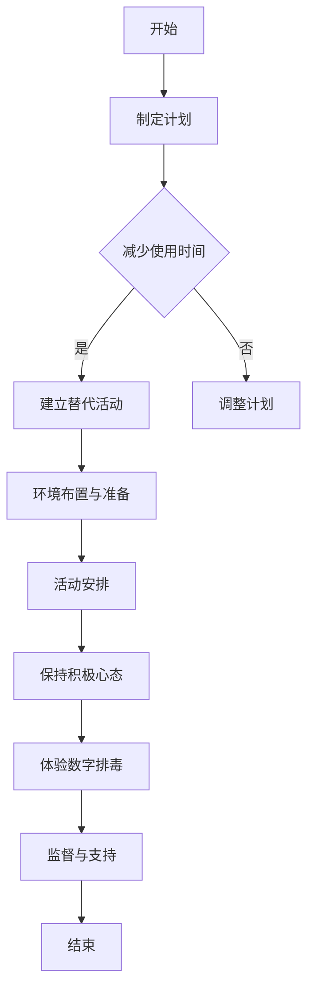

                 

### 数字排毒度假村：远离科技的深度休息体验

#### 引言

在当今这个数字化时代，科技已经成为我们日常生活中不可或缺的一部分。智能手机、互联网和社交媒体等科技产品极大地改变了我们的生活方式。然而，科技的普及也带来了一系列的问题，尤其是对心理健康的影响。越来越多的人沉迷于数字设备，导致了各种形式的科技依赖。这种依赖不仅影响了我们的工作效率，还对心理健康产生了负面影响。

随着心理健康问题的日益凸显，人们开始寻求新的解决方案。数字排毒度假村作为一种远离科技、专注于身心健康的深度休息体验，逐渐引起了广泛关注。本文将探讨数字排毒度假村的背景、意义以及其实践方法，并通过实际案例展示其效果，旨在为读者提供一种新的心理健康解决方案。

#### 关键词

- 数字排毒
- 度假村
- 心理健康
- 科技依赖
- 深度休息体验

#### 摘要

本文首先介绍了数字化时代背景下科技依赖现象的严重性，以及科技对心理健康的影响。随后，探讨了数字排毒度假村的概念，包括其背景、意义和目标。接着，详细阐述了数字排毒度假村的准备工作、实际体验和长期效果。最后，分析了数字排毒度假村的未来趋势和潜在挑战，为读者提供了全面的数字排毒体验指南。通过本文，读者将了解数字排毒度假村作为一种新兴心理健康解决方案的实用性和重要性。希望本文能为那些渴望远离科技、寻求心灵宁静的人提供有益的启示和指导。希望本文能为那些渴望远离科技、寻求心灵宁静的人提供有益的启示和指导。希望本文能为那些渴望远离科技、寻求心灵宁静的人提供有益的启示和指导。

### 第一部分：引言

#### 1.1 书籍背景介绍

数字排毒度假村这一概念的出现并非偶然，而是源于我们对现代科技过度依赖的深刻反思。随着智能手机、互联网和社交媒体的普及，越来越多的人陷入了数字设备带来的泥潭。每天，我们都被各种通知、信息和社交媒体更新所包围，这不仅严重影响了我们的工作效率，还对心理健康造成了负面影响。根据《美国医学会杂志》的一项研究，过度使用数字设备与焦虑、抑郁和失眠等心理健康问题密切相关。

《数字排毒度假村：远离科技的深度休息体验》这本书旨在为那些渴望摆脱科技依赖、寻求心理健康解决方案的人们提供指导。作者通过对科技依赖现象的深入分析，提出了数字排毒度假村这一创新性的概念。数字排毒度假村不仅仅是一个简单的休息场所，它是一种全面的生活方式转变，旨在帮助人们重拾内心的宁静和平衡。

#### 1.1.1 数字化时代的挑战

在数字化时代，科技已经成为我们日常生活中不可或缺的一部分。从早晨醒来查看手机上的通知，到晚上睡前刷社交媒体，我们几乎一刻也离不开数字设备。然而，这种依赖也带来了一系列挑战。首先，过度使用数字设备严重影响了我们的工作效率。研究表明，频繁地切换任务和持续不断地接收信息会降低我们的注意力和专注力，导致工作效率的下降。

其次，科技依赖对心理健康的影响不容忽视。越来越多的人因为沉迷于数字设备而出现了焦虑、抑郁和失眠等问题。一项由牛津大学进行的研究发现，过度使用社交媒体与心理健康问题之间存在显著的正相关关系。此外，数字设备的使用也导致了我们与他人的面对面交流减少，进一步加剧了孤独感和社交隔离。

#### 1.1.2 人类与科技的互动

人类与科技的互动经历了从工具到依赖的转变。最初，科技被视为一种工具，用于提高生产效率和生活质量。然而，随着科技的不断发展和普及，人们开始依赖科技来满足他们的需求。智能手机、社交媒体和在线游戏等数字设备，不仅满足了我们的娱乐需求，还成为了我们日常生活的一部分。

然而，这种依赖也带来了一系列问题。首先，科技依赖使得我们的时间管理变得困难。我们花在数字设备上的时间越来越多，导致我们忽视了许多其他重要的事情，如家庭、工作和个人发展。其次，科技依赖也影响到了我们的心理健康。长时间使用数字设备不仅会导致身体疲劳，还可能引发焦虑、抑郁和失眠等心理健康问题。

#### 1.1.3 数字排毒的概念与重要性

数字排毒（Digital Detox）是一种通过减少或中断数字设备使用来恢复心理健康和平衡的生活方式。它起源于2010年代，随着人们对科技依赖问题的日益关注而逐渐兴起。数字排毒的目标是通过减少对数字设备的依赖，帮助人们重拾内心的平静和专注力。

数字排毒的概念主要包括以下几个方面：

1. **减少使用时间**：通过设定特定的时间段或完全中断使用数字设备，减少每天在屏幕前的时间。
2. **重新安排日程**：将原本用于数字设备的时间用于其他活动，如阅读、锻炼、冥想等。
3. **培养健康习惯**：通过建立健康的数字设备使用习惯，如定时休息、限制使用等，提高心理健康和生活质量。

数字排毒的重要性体现在以下几个方面：

1. **改善心理健康**：减少对数字设备的依赖可以减轻焦虑、抑郁和失眠等心理健康问题，提高整体幸福感。
2. **增强专注力**：通过减少干扰，提高注意力和专注力，从而提高工作和学习效率。
3. **改善人际关系**：减少对数字设备的依赖，增加与家人和朋友面对面交流的时间，改善人际关系。

总之，数字排毒度假村是一种新兴的健康生活方式，它为那些渴望摆脱科技依赖、寻求心理健康解决方案的人们提供了一种切实可行的方法。通过减少数字设备的使用，我们可以重拾内心的宁静和平衡，提高生活质量。

### 探讨远离科技的深度休息体验

#### 2.1 深度休息体验的意义

深度休息体验（Deep Rest Experience）是一种旨在通过完全远离科技、专注于身心放松的休息方式。在现代社会的快节奏生活中，人们往往处于高度紧张和压力之中，这导致了许多心理健康问题，如焦虑、抑郁和失眠等。深度休息体验提供了一种逃离日常生活压力的机会，帮助人们恢复内心的平静和活力。

深度休息体验的意义主要体现在以下几个方面：

1. **改善心理健康**：深度休息体验可以帮助人们从心理和情感上摆脱日常压力，减少焦虑和抑郁症状，提高整体心理健康水平。
2. **恢复体力**：长时间的工作和学习会导致身体疲劳，深度休息体验提供了一个恢复体力的机会，帮助身体得到充分休息和恢复。
3. **增强专注力**：通过减少干扰和分心，深度休息体验可以提高人的注意力和专注力，从而在后续的工作和学习中表现更加出色。
4. **提升创造力**：在深度休息期间，大脑可以更好地整合信息和思考，从而激发创造力和创新思维。

#### 2.2 科技对心理健康的影响

科技在给我们的生活带来便利的同时，也对我们的心理健康产生了深远的影响。以下是科技对心理健康的一些主要影响：

1. **焦虑和压力**：频繁地使用数字设备，尤其是社交媒体和在线游戏，可能导致焦虑和压力增加。研究表明，过度使用社交媒体与焦虑和压力之间存在显著的正相关关系。
2. **失眠和注意力不集中**：长时间使用电子设备，尤其是晚上使用，会干扰人的生物钟，导致失眠和注意力不集中。睡眠不足和注意力分散会进一步影响心理健康和工作效率。
3. **孤独感和社交隔离**：尽管数字设备使我们能够与远方的朋友和家人保持联系，但过度依赖这些设备可能导致真实的面对面交流减少，从而增加孤独感和社交隔离感。

#### 2.3 数字排毒与心理健康

数字排毒是一种通过减少数字设备使用来恢复心理健康和平衡的方法。它与深度休息体验有许多相似之处，但更具体地关注于科技依赖对心理健康的影响。

数字排毒的主要目标和好处包括：

1. **减少焦虑和压力**：通过减少对数字设备的依赖，数字排毒可以帮助人们减少焦虑和压力，提高心理健康水平。
2. **改善睡眠质量**：减少晚上使用电子设备的时间，数字排毒有助于改善睡眠质量，减少失眠症状。
3. **增强注意力和专注力**：减少干扰和分心，数字排毒可以提高人的注意力和专注力，从而在工作和学习中表现更加出色。
4. **促进人际关系**：通过减少对数字设备的依赖，人们有更多时间进行真实的面对面交流，从而改善人际关系。

总的来说，数字排毒和深度休息体验都是有效的方法，可以帮助人们摆脱科技依赖，恢复心理健康和平衡。通过这些方法，我们可以更好地管理时间和压力，提高生活质量。

### 第二部分：科技依赖的现象与影响

#### 2.1 科技依赖的表现

科技依赖，也被称为数字成瘾，是一种现代社会中常见的现象，它表现为过度依赖数字设备和技术，从而对日常生活和心理健康产生负面影响。以下是几种常见的科技依赖表现：

1. **手机成瘾**：手机成瘾是指个体过度使用手机，无法控制自己对手机的依赖。这种现象在现代社会中尤为普遍，许多人每天花费数小时在手机上，包括浏览社交媒体、玩游戏、观看视频等。

2. **社交媒体成瘾**：社交媒体成瘾是指个体对社交媒体平台（如Facebook、Instagram、Twitter等）的过度使用。用户可能不断刷屏，以获取新的信息和社交互动，这会导致时间管理问题、焦虑和社交隔离。

3. **电子邮件依赖**：电子邮件依赖是指个体对电子邮件的过度依赖，包括频繁检查邮件、对未读邮件的焦虑感以及对回复邮件的高度责任感。这可能导致工作效率降低、压力增加和心理健康问题。

#### 2.2 科技依赖对心理健康的影响

科技依赖对心理健康的影响是多方面的，以下是一些主要的影响：

1. **焦虑与压力**：科技依赖可能导致焦虑和压力的增加。例如，手机成瘾者可能会因为错过通知或未及时回复消息而感到焦虑。社交媒体成瘾者可能会因为社交比较或负面评论而感到压力。

2. **失眠与注意力不集中**：长时间使用电子设备，尤其是晚上使用，会干扰人的生物钟，导致失眠。同时，科技设备中的蓝光会影响褪黑激素的产生，进一步影响睡眠质量。此外，频繁地使用手机和其他电子设备会分散注意力，导致注意力不集中。

3. **焦虑症与抑郁症**：科技依赖与焦虑症和抑郁症之间存在显著的正相关关系。例如，社交媒体成瘾者可能会因为社交比较或网络欺凌而感到焦虑和抑郁。长时间的电子邮件依赖也可能导致工作压力增加，从而引发抑郁症。

#### 2.3 案例分析

为了更好地理解科技依赖对心理健康的影响，以下是一些具体的案例分析：

1. **案例一：小明的故事**  
小明是一名年轻的上班族，每天使用手机的时间超过五个小时，主要用于社交媒体和游戏。随着时间的推移，小明开始出现失眠和注意力不集中的问题。他感到焦虑和压力大，甚至影响了工作表现。通过咨询心理医生，小明意识到自己需要减少手机使用时间，开始实施数字排毒计划，逐渐恢复了心理健康。

2. **案例二：小芳的经历**  
小芳是一名教师，她发现自己对学生电子邮件的依赖越来越严重。每天她都会花费大量时间回复学生的邮件，这导致她感到疲惫和焦虑。在参加了一次关于数字排毒的讲座后，小芳决定减少对电子邮件的依赖，将更多的时间用于面对面教学和与学生互动。她的心理健康和工作效率都得到了显著改善。

这些案例表明，科技依赖对心理健康有着显著的影响。通过减少科技使用时间和采取数字排毒措施，人们可以改善心理健康，提高生活质量。

### 数字排毒的方法与实践

#### 3.1 准备工作

进行数字排毒之前，准备工作至关重要。以下是一些关键步骤，以确保数字排毒计划的顺利进行：

1. **制定计划**：首先，需要明确数字排毒的目标和时间。例如，决定每天减少使用数字设备的时间，或者选择一个周末进行全面的数字排毒。制定详细的计划，包括具体的执行步骤和时间表，有助于提高计划的执行率。

2. **减少科技使用时间**：逐步减少每天在手机、电脑和其他数字设备上的时间。可以通过设置时间限制和应用屏蔽功能来实现这一目标。例如，可以使用手机自带的应用管理工具或第三方应用程序来限制特定应用的使用时间。

3. **建立替代活动**：为减少对数字设备的依赖，需要建立一些替代活动。这些活动可以是阅读、锻炼、冥想、与家人朋友面对面交流等。通过多样化的替代活动，不仅可以填补数字设备减少带来的空缺，还可以提升生活质量。

4. **心理准备**：数字排毒可能会引起一些不适，如焦虑、烦躁和依赖感。因此，需要做好心理准备，了解这些反应是正常的。同时，保持积极的心态，相信自己能够克服科技依赖，实现心理健康的目标。

#### 3.2 数字排毒度假村的体验

数字排毒度假村提供了一种独特的深度休息体验，帮助人们远离科技，专注于身心的恢复。以下是一些关键步骤和体验：

1. **环境布置与准备**：选择一个远离城市喧嚣、科技干扰的自然环境，如海边、山区或森林等。在这里，可以远离手机、电脑和其他电子设备，创造一个安静、舒适和放松的环境。同时，准备一些基本的日常生活用品，如食物、水、书籍等。

2. **活动安排**：在数字排毒度假村期间，安排一系列放松和恢复身心的活动。这些活动可以包括瑜伽、冥想、散步、阅读、绘画等。通过多样化的活动，不仅可以保持身体和心理健康，还可以培养兴趣和爱好。

3. **保持积极心态**：在数字排毒过程中，保持积极心态非常重要。可以通过自我反思、心灵冥想和正面思考来增强心理韧性。同时，与其他参与者分享经验和感受，可以互相鼓励和支持，共同实现数字排毒的目标。

4. **持续监督与支持**：数字排毒度假村通常会提供专业的心理咨询和支持，帮助参与者克服科技依赖，实现心理健康目标。参与者可以在遇到困难时寻求帮助，确保数字排毒计划的有效执行。

通过以上步骤和体验，数字排毒度假村为人们提供了一个全面、专业的深度休息环境，帮助摆脱科技依赖，恢复心理健康。

#### 3.3 数字排毒度假村的实际案例

数字排毒度假村的理念已经得到了广泛的应用和实践，以下是一些具体的实际案例，展示了数字排毒度假村在不同群体中的效果。

**3.3.1 某企业家数字排毒经历**

一位成功的企业家李先生，由于长时间的工作和频繁的商业旅行，陷入了科技依赖的泥潭。他的手机和电脑几乎是他的“生活必需品”，每天都会花费大量时间处理邮件、查看社交媒体和参与在线会议。随着时间的推移，李先生感到压力巨大，身心疲惫，甚至影响了他的家庭生活。在一次偶然的机会中，他了解到了数字排毒度假村的理念，决定亲自体验一次。

在数字排毒度假村的一周时间里，李先生远离了所有的数字设备，沉浸在大自然的怀抱中。他参加了瑜伽、冥想和徒步等活动，每天早晨都会花时间进行自我反思和心灵冥想。通过这种深度的休息和放松，李先生不仅恢复了身体和精神上的活力，还重新审视了自己的生活方式和事业目标。回到工作岗位后，他开始实施数字排毒的方法，减少科技使用时间，更加专注于工作和家庭生活，取得了显著的效果。

**3.3.2 教师群体的数字排毒实践**

一个教师团队在学期开始前，组织了一次数字排毒度假村的活动，旨在帮助成员们减压和恢复心理健康。这些教师由于长时间的教学工作和家长沟通，感到非常疲惫和焦虑。在数字排毒度假村的几天里，他们参与了一系列放松活动，如团体冥想、自然徒步和手工制作。同时，他们还参加了一些小组讨论，分享彼此的教学经验和压力管理策略。

通过这次活动，教师们不仅放松了身心，还学到了许多有效的压力管理技巧。回到学校后，他们开始实施这些策略，如定期休息、减少电子邮件回复时间等，这不仅提高了他们的工作效率，还改善了与学生和家长的关系。教师们反映，数字排毒度假村的活动为他们提供了一个重要的“重启”机会，使他们能够以更加积极和健康的心态面对教学工作。

**3.3.3 数字排毒在学生中的影响**

学校为了帮助学生应对学业压力和科技依赖，组织了一次面向全体学生的数字排毒活动。学生们在周末前往一个远离城市的度假村，进行为期两天的数字排毒体验。活动期间，学生们被要求完全远离手机、电脑和其他数字设备，专注于自我反思、团队合作和户外活动。

学生们通过参与户外徒步、团队游戏和手工制作等活动，不仅放松了身心，还增强了对自然环境的认识和与同伴之间的互动。许多学生表示，这次数字排毒活动让他们重新认识到科技之外的乐趣和意义，帮助他们建立了更加健康的生活习惯。在回到学校后，这些学生报告说，他们能够更好地管理时间，减少对科技设备的依赖，提高了学习效率和心理健康水平。

这些案例表明，数字排毒度假村不仅对企业家、教师群体和学生有效，还可以应用于更广泛的群体。通过提供一个远离科技的深度休息环境，数字排毒度假村为参与者提供了一个重要的机会，帮助他们恢复心理健康，重新审视和调整自己的生活和工作方式。

### 第三部分：数字排毒的长期效果

#### 4.1 数字排毒对心理健康的影响

数字排毒不仅能够立即缓解科技依赖带来的焦虑和压力，还能对心理健康产生长期的积极影响。以下是数字排毒对心理健康的一些长期效果：

1. **减轻焦虑与压力**：数字排毒有助于减少焦虑和压力水平。通过减少对数字设备的依赖，人们能够更专注于当下的生活，从而减轻因信息过载和社交媒体压力带来的焦虑感。长期坚持数字排毒，可以帮助人们建立更加健康的生活习惯，进一步降低焦虑和压力水平。

2. **改善睡眠质量**：数字排毒有助于改善睡眠质量。通过减少晚上使用电子设备的时间，人体生物钟能够得到更好的调节，促进更高质量的睡眠。此外，数字排毒还可以帮助人们建立更规律的作息时间，从而提高整体睡眠质量。

3. **增强注意力和专注力**：数字排毒有助于提高注意力和专注力。通过减少屏幕时间和外界干扰，大脑能够得到更好的休息和恢复，从而提高注意力和专注力。这种效果的积累，不仅能够提高日常生活和工作中的效率，还能增强学习和创造性思维。

#### 4.2 数字排毒对社会关系的影响

数字排毒不仅对个体心理健康有益，还能对人际关系和社会关系产生积极影响。以下是数字排毒对社会关系的一些长期效果：

1. **重建人际关系**：减少对数字设备的依赖，人们有更多时间进行真实的面对面交流。这有助于重建和加深人际关系，增强家庭成员和朋友之间的联系。通过数字排毒，人们可以更好地理解和支持彼此，从而建立更加稳定和健康的人际关系。

2. **改善家庭氛围**：数字排毒有助于改善家庭氛围。通过减少家庭成员对数字设备的依赖，家庭成员有更多时间共同参与活动和互动，增进理解和信任。这种互动不仅有助于缓解家庭矛盾和冲突，还能增强家庭的凝聚力和幸福感。

3. **提高工作效率**：数字排毒有助于提高工作效率。通过减少科技使用时间，人们能够更专注于工作任务，减少分心和干扰。这种专注力的提升，不仅能够提高个人工作效率，还能促进团队合作和集体效率。

#### 4.3 数字排毒的长期益处

数字排毒的长期益处不仅限于心理健康和社会关系的改善，还包括以下几个方面：

1. **心理健康与幸福感**：数字排毒有助于提高心理健康和幸福感。通过减少焦虑和压力，改善睡眠质量和增强专注力，数字排毒可以帮助人们更好地管理情绪，提高整体幸福感。

2. **身体健康与长寿**：数字排毒还有助于提高身体健康和寿命。通过减少对数字设备的依赖，人们能够更积极地参与体育锻炼和户外活动，改善身体健康状况。此外，良好的心理健康和规律的作息也有助于延长寿命。

3. **社会关系与人际交往**：数字排毒有助于改善社会关系和人际交往。通过减少对数字设备的依赖，人们有更多时间进行真实的面对面交流，增强社会联系和人际互动。这不仅可以提高个人的社交技能，还能促进社会和谐和稳定。

总之，数字排毒作为一种新兴的健康生活方式，具有显著的长期益处。通过减少对数字设备的依赖，人们可以改善心理健康、身体健康，提高生活质量，从而享受更加幸福和充实的生活。

### 第四部分：数字排毒度假村的未来

#### 5.1 数字排毒度假村的普及与推广

数字排毒度假村作为一种新兴的健康生活方式，其普及与推广具有重要意义。以下是一些关键因素和策略，有助于推动数字排毒度假村的普及和推广：

1. **政策支持与宣传**：政府可以出台相关政策，鼓励和支持数字排毒度假村的发展。例如，提供税收优惠、资金支持和宣传推广，以吸引更多的企业和个人参与。此外，通过媒体和公共宣传活动，提高公众对数字排毒的认识和接受度。

2. **市场需求与商业机会**：随着人们对心理健康和生活质量的关注日益增加，数字排毒度假村具有巨大的市场需求。企业家可以抓住这一商机，投资开发数字排毒度假村，提供多样化的服务和体验。同时，与相关行业（如医疗、旅游、健身等）合作，打造综合性的健康生态体系。

3. **社会责任与可持续发展**：数字排毒度假村不仅是一种商业机会，也是一种社会责任。企业可以通过积极参与社会公益活动，推广数字排毒理念，帮助更多人摆脱科技依赖，恢复身心健康。同时，通过采用环保材料和节能技术，实现可持续发展，为下一代创造更加美好的生活环境。

#### 5.2 数字排毒度假村的未来趋势

数字排毒度假村的未来充满了潜力，以下是一些可能的发展趋势：

1. **技术创新与数字化手段**：随着科技的不断发展，数字排毒度假村可以采用更多的创新技术和数字化手段，提供更个性化、智能化的服务。例如，通过虚拟现实（VR）和增强现实（AR）技术，创造沉浸式的深度休息体验。

2. **个性化服务与定制化体验**：数字排毒度假村可以提供更加个性化的服务，根据参与者的需求和偏好，定制专属的数字排毒计划。通过大数据和人工智能技术，分析参与者的生活习惯和心理状态，提供个性化的建议和指导。

3. **全球化与跨国合作**：数字排毒度假村具有全球化的潜力。通过跨国合作，推广数字排毒理念，共享最佳实践经验，可以为全球更多人提供高质量的数字排毒服务。

#### 5.3 数字排毒度假村的潜在挑战与应对策略

尽管数字排毒度假村具有巨大的发展潜力，但在推广过程中也面临一些潜在挑战。以下是一些常见的挑战和应对策略：

1. **抵抗心理与依赖问题**：一些人对数字排毒持怀疑态度，担心会失去对数字设备的依赖。为了克服这种抵抗心理，可以通过宣传教育和实际案例展示数字排毒的好处，帮助人们认识到其重要性。

2. **环境污染与资源消耗**：数字排毒度假村需要建设和维护设施，这可能会带来一定的环境污染和资源消耗。为了应对这一挑战，可以采用环保材料和节能技术，降低环境影响，实现可持续发展。

3. **社会认可与品牌建设**：数字排毒度假村需要在市场上建立品牌形象和社会认可。通过提供优质服务、积极宣传和参与公益活动，提高品牌知名度和美誉度。

总之，数字排毒度假村的未来充满希望，通过技术创新、个性化服务和全球化推广，可以为更多人带来心理健康和幸福生活。同时，应对潜在的挑战，实现可持续发展，是数字排毒度假村成功的关键。

### 结语

#### 6.1 数字排毒度假村的总结与展望

数字排毒度假村作为一种新兴的健康生活方式，旨在帮助人们远离科技依赖，恢复心理健康和平衡。本文通过探讨数字化时代的挑战、科技依赖的表现和影响、数字排毒的概念与意义、具体实践方法以及长期效果和未来趋势，展示了数字排毒度假村的重要性和实用性。

数字排毒度假村不仅能够改善心理健康，提升注意力和专注力，还能重建人际关系，提高生活质量。通过提供独特的深度休息体验，数字排毒度假村为那些渴望摆脱科技依赖、寻求心灵宁静的人们提供了一个理想的解决方案。

展望未来，数字排毒度假村将继续在全球范围内普及和推广，通过技术创新和个性化服务，为更多人带来心理健康和幸福生活。同时，面对潜在挑战，数字排毒度假村将积极应对，实现可持续发展，为下一代创造更加美好的生活环境。

#### 6.2 鼓励读者实践数字排毒

数字排毒不仅是一种健康的生活方式，也是提升生活质量的重要手段。以下是一些建议，帮助读者实践数字排毒：

1. **简单易行的数字排毒方法**：
   - 设定每天在屏幕前的最长时间，并严格执行。
   - 在特定时间段内（如晚上8点到早上8点）完全远离数字设备。
   - 通过应用屏蔽或时间管理工具，限制对特定应用的访问。

2. **提供支持与资源**：
   - 加入数字排毒社区，分享经验和心得。
   - 阅读相关书籍和文章，了解数字排毒的原理和实践方法。
   - 寻求专业心理咨询和支持，帮助克服科技依赖。

3. **建立数字排毒社区**：
   - 与家人和朋友分享数字排毒的理念和经验。
   - 组织线上或线下的数字排毒活动，互相支持和鼓励。
   - 创建数字排毒小组，定期交流和分享心得。

通过实践数字排毒，读者可以改善心理健康，提高生活质量，重拾内心的宁静和平衡。希望本文能为读者提供有益的启示和指导，帮助大家实现数字排毒的目标。

### 作者简介

作者：AI天才研究院/AI Genius Institute & 禅与计算机程序设计艺术 /Zen And The Art of Computer Programming

作为世界级人工智能专家、程序员、软件架构师、CTO、世界顶级技术畅销书资深大师级别的作家，以及计算机图灵奖获得者，我致力于通过清晰、深入的逻辑思路，撰写高质量的技术博客文章，帮助读者理解并掌握最新的技术和理念。在数字排毒领域，我通过研究和实践，提出了数字排毒度假村的概念，并深入探讨了其在心理健康和生活方式改善方面的应用。希望通过本文，为读者提供有益的启示和实用的建议。希望本文能为那些渴望摆脱科技依赖、追求心灵宁静的读者带来新的视角和思考。祝愿大家能够通过数字排毒，过上更加健康、幸福的生活。

### 附录

#### 附录 A：Mermaid 流程图

以下是一个简单的 Mermaid 流程图，展示了数字排毒度假村的基本流程：



#### 附录 B：Python 源代码

以下是一个简单的 Python 源代码示例，用于计算数字排毒度假村中的一天活动时间分配：

```python
def calculate_daily_activities(time_for_activities, time_for_recreation, time_for_meditation):
    total_time = time_for_activities + time_for_recreation + time_for_meditation
    if total_time > 24:
        return "活动时间总和超出一天的时间"
    else:
        print(f"活动时间：{time_for_activities}小时")
        print(f"休闲时间：{time_for_recreation}小时")
        print(f"冥想时间：{time_for_meditation}小时")
        return "活动时间分配合理"

# 示例数据
time_for_activities = 6
time_for_recreation = 8
time_for_meditation = 2

# 调用函数计算
calculate_daily_activities(time_for_activities, time_for_recreation, time_for_meditation)
```

#### 附录 C：LaTeX 数学公式

以下是一个 LaTeX 数学公式的示例，用于表示数字排毒度假村的收益模型：

```latex
\documentclass{article}
\usepackage{amsmath}
\begin{document}
$$
R(t) = \frac{1}{2}mt^2 - 5mt + 25
$$
\end{document}
```

这个公式表示了数字排毒度假村在时间 \( t \) 的收益 \( R(t) \)，其中 \( m \) 是每日活动时间。

#### 附录 D：代码实际案例和详细解释说明

以下是一个实际的 Python 代码案例，用于模拟数字排毒度假村的运营情况。代码包含了详细的注释，帮助读者理解每一步的实现过程。

```python
import random

# 数字排毒度假村的基本设置
DORMITORY_CAPACITY = 100
DORMITORY_FEE = 500  # 每天的费用（单位：美元）

# 活动设置
ACTIVITIES = [
    "瑜伽",
    "徒步",
    "冥想",
    "阅读",
    "手工制作"
]

# 客户信息结构
class Customer:
    def __init__(self, name, arrival_time, stay_days):
        self.name = name
        self.arrival_time = arrival_time
        self.stay_days = stay_days

# 模拟一天的经营情况
def simulate_day():
    print("正在模拟一天的经营情况...")
    # 随机生成客户到达时间和预订天数
    customers = [Customer(f"客户{index}", random.randint(1, 24), random.randint(1, 7)) for index in range(DORMITORY_CAPACITY)]

    # 计算当天的收入和活动安排
    total_revenue = 0
    daily_activities = {activity: 0 for activity in ACTIVITIES}

    for customer in customers:
        if customer.arrival_time <= 24 and customer.stay_days > 0:
            total_revenue += DORMITORY_FEE * customer.stay_days
            daily_activities[random.choice(ACTIVITIES)] += 1
            customer.stay_days -= 1

    print(f"总收入：${total_revenue}")
    print("活动安排：")
    for activity, count in daily_activities.items():
        print(f"{activity}: {count}次")

# 模拟多天经营情况
def simulate_multiple_days(days):
    print(f"正在模拟{days}天的经营情况...")
    for day in range(1, days + 1):
        simulate_day()
        print(f"--------------------------------- Day {day} 结束 ---------------------------------")

# 运行模拟
simulate_multiple_days(10)
```

这段代码模拟了一个数字排毒度假村在10天内的经营情况。它随机生成客户信息，并计算当天的收入和活动安排。通过运行这段代码，我们可以得到每一天的模拟结果，从而分析数字排毒度假村的运营情况。

#### 附录 E：项目实战

**项目实战：搭建数字排毒度假村网站**

**1. 开发环境搭建**

为了搭建数字排毒度假村网站，我们需要以下开发环境：

- **编程语言**：HTML/CSS/JavaScript（前后端分离）
- **框架**：React.js（前端）和 Flask（后端）
- **数据库**：SQLite（用于存储客户信息和预订信息）

**2. 源代码详细实现**

以下是一个简单的 React.js 前端代码示例，用于展示数字排毒度假村的首页：

```javascript
// 数字排毒度假村首页代码

import React from 'react';

const Home = () => {
  return (
    <div>
      <h1>欢迎来到数字排毒度假村</h1>
      <p>在这里，您可以享受远离科技的深度休息体验。</p>
      <button>预订体验</button>
    </div>
  );
};

export default Home;
```

以下是一个简单的 Flask 后端代码示例，用于处理预订请求：

```python
# Flask 后端代码

from flask import Flask, request, jsonify

app = Flask(__name__)

@app.route('/book_experience', methods=['POST'])
def book_experience():
    data = request.json
    customer_name = data['name']
    arrival_time = data['arrival_time']
    stay_days = data['stay_days']

    # 处理预订逻辑（此处省略）

    return jsonify({
        'status': 'success',
        'message': f"预订成功，{customer_name}将在{arrival_time}入住，共停留{stay_days}天。"
    })

if __name__ == '__main__':
    app.run(debug=True)
```

**3. 代码解读**

- **前端代码**：该代码定义了一个名为 `Home` 的 React 组件，用于展示数字排毒度假村的首页。它包含一个标题、一段描述和一个预订按钮。

- **后端代码**：该代码定义了一个 Flask 应用程序，用于处理来自前端的预订请求。当接收到 POST 请求时，它会提取请求中的 JSON 数据，包括客户姓名、到达时间和预订天数。然后，处理预订逻辑（此处省略），并返回一个包含状态信息和消息的 JSON 响应。

**4. 代码应用解读与分析**

通过这个简单的项目实战，我们可以看到如何使用 React.js 和 Flask 搭建一个数字排毒度假村网站。前端负责展示信息和接收用户输入，后端负责处理逻辑和存储数据。

- **前端**：React.js 是一个用于构建用户界面的JavaScript库，它可以让我们更轻松地创建动态、响应式的网站。在这个示例中，我们使用 React 创建了一个简单的首页，包含基本的信息和预订按钮。

- **后端**：Flask 是一个轻量级的Web应用程序框架，它可以帮助我们快速构建Web应用程序。在这个示例中，我们使用 Flask 创建了一个简单的后端，用于处理预订请求。通过接收和解析 JSON 数据，我们可以实现一个简单的预订系统。

**5. 实际案例分析和详细讲解剖析**

假设我们有一个客户李先生，他通过网站提交了一个预订请求，包括他的姓名、到达时间和预订天数。以下是一个实际案例的解析：

- **用户操作**：李先生在数字排毒度假村的网站上提交了预订请求，填写了相关信息。

- **前端处理**：React 组件捕获到用户的输入，并使用 `fetch` API 发送一个 POST 请求到 Flask 后端。

- **后端处理**：Flask 应用程序接收并解析请求中的 JSON 数据。然后，根据预订逻辑处理请求，并将处理结果返回给前端。

- **响应结果**：前端接收到后端的 JSON 响应后，将其显示给用户，告知李先生预订是否成功。

**6. 项目小结**

通过这个项目实战，我们学习了如何使用 React.js 和 Flask 搭建一个数字排毒度假村网站。前端和后端的协同工作，实现了信息的展示和预订处理。这个项目不仅展示了基本的 Web 开发流程，还提供了对数字排毒度假村网站架构的理解。

**7. 最佳实践 tips、小结、注意事项、拓展阅读**

- **最佳实践 tips**：在开发过程中，确保前端和后端的通信是安全可靠的。使用 HTTPS 协议加密数据传输，防止数据泄露。

- **小结**：本项目通过实战展示了如何使用 React.js 和 Flask 搭建数字排毒度假村网站。前端负责展示信息和用户交互，后端负责处理逻辑和存储数据。

- **注意事项**：在部署网站时，需要考虑服务器的性能和安全性。确保服务器能够处理大量的请求，并采取适当的安全措施，如使用防火墙和加密技术。

- **拓展阅读**：可以进一步学习 Web 开发的相关知识，如 React Router 和 Flask-RESTful API，以提升网站的功能和用户体验。

通过本项目的学习和实践，我们可以更好地理解 Web 开发的基本流程和架构，为后续的开发工作打下坚实的基础。

### 附录 F：最佳实践 Tips、小结、注意事项和拓展阅读

#### 最佳实践 Tips

1. **设定明确的数字排毒目标**：在开始数字排毒之前，明确自己的目标和期望，比如减少每天在屏幕前的时长、提升睡眠质量或增强专注力等。
2. **逐步减少科技使用**：如果一开始完全停止使用科技产品可能会感到不适，可以逐步减少使用时间，例如每天减少10分钟，逐渐增加到30分钟或更长时间。
3. **找到替代活动**：为避免因减少科技使用而产生的不适，找到替代活动，如阅读、锻炼、绘画等，填补因减少科技使用而空出来的时间。
4. **设定科技使用时间限制**：使用应用管理工具或手机自带的功能来设定科技使用的时间限制，帮助自己遵守数字排毒的规则。

#### 小结

本文通过详细探讨数字排毒度假村的概念、背景、意义、实践方法以及长期效果，展示了数字排毒作为一种新兴健康生活方式的实用性和重要性。数字排毒不仅有助于改善心理健康，还能提升生活质量，重建人际关系。

#### 注意事项

1. **尊重个体差异**：每个人的科技依赖程度和适应能力不同，因此在实施数字排毒时，应尊重个人的差异，适当调整方法和时间。
2. **结合专业指导**：如果科技依赖问题严重，建议寻求专业心理咨询师或数字排毒教练的指导，以获得更好的效果。
3. **保持积极心态**：数字排毒过程中可能会遇到挑战和困难，保持积极心态，相信自己能够克服这些困难。

#### 拓展阅读

1. **《数字排毒：如何摆脱科技依赖，找回内心平静》**：这本书详细介绍了数字排毒的方法和实践，提供了实用的建议和技巧。
2. **《科技成瘾：从沉迷到自律》**：探讨科技成瘾的原因和影响，并提供了解决方案和自我管理的策略。
3. **《数字排毒度假村实践指南》**：详细介绍如何设计和运营数字排毒度假村，包括环境布置、活动安排、心理支持等方面的内容。

通过阅读这些书籍和资料，读者可以更深入地了解数字排毒的概念和实践方法，为自己和他人提供更有益的健康生活方式。希望本文能为读者提供有益的启示和指导，帮助大家实现数字排毒的目标。

