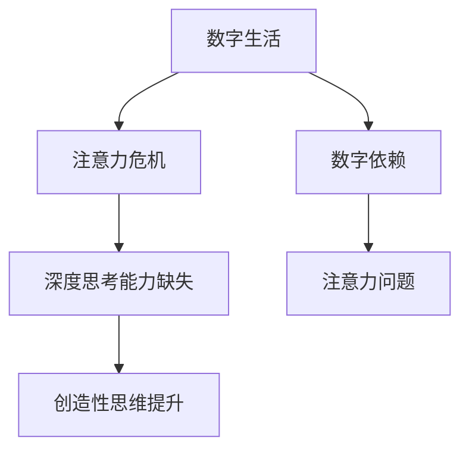
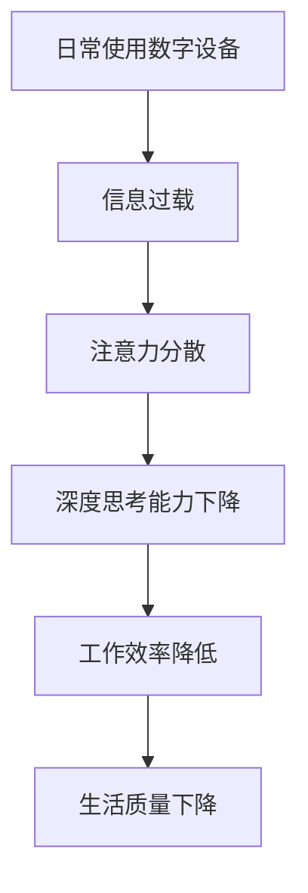
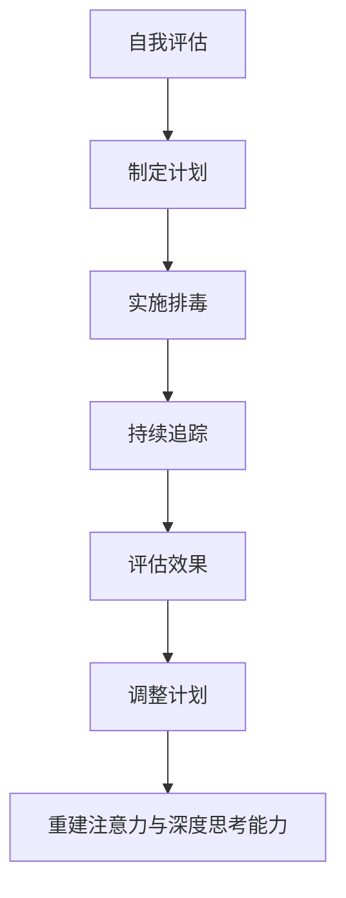

                 

### 关键词

- 数字生活
- 注意力危机
- 数字依赖
- 深度思考
- 数字排毒
- 注意力恢复
- 创造性思维
- 深度学习模型
- Python代码示例
- 数学模型
- Mermaid流程图
- 数字排毒应用开发

### 摘要

在现代数字化的快节奏生活中，人们越来越陷入数字依赖，导致注意力危机和深度思考能力的下降。本文旨在探讨这一现象，并详细阐述“数字排毒”的理念与方法，旨在重建个体的注意力与深度思考能力。文章首先分析了数字生活的双刃剑特性及其对注意力的负面影响，接着介绍了数字排毒的概念、步骤和常见问题。随后，文章探讨了注意力恢复与深度思考能力的培养策略，并通过具体案例展示了数字排毒的实践效果。最后，文章讨论了数字排毒在企业与教育中的应用，以及其未来的社会意义与趋势。通过本篇文章，读者将能够了解并掌握数字排毒的实践方法，以改善自身的生活质量和工作效率。

### 《数字排毒诊所：重建注意力与深度思考能力的治疗》目录大纲

#### 第一部分：数字生活与注意力危机

##### 第1章：数字生活的双刃剑
- **1.1 数字世界的诱惑与陷阱**
  - 数字媒体的广泛应用和即时满足感。
  - 数字游戏、社交媒体和网络购物的成瘾性。
- **1.2 注意力危机：数字生活的代价**
  - 数字干扰和碎片化信息对专注力的侵蚀。
  - 深度思考能力的下降和浅层阅读的泛滥。
- **1.3 深度思考能力的缺失**
  - 短期记忆和长期记忆的差异。
  - 创造性和批判性思维的减弱。
- **1.4 现代人的数字依赖与自我觉醒**
  - 习惯性使用数字设备对生活的影响。
  - 自我反思和改变数字生活方式的重要性。

##### 第2章：数字排毒的理念与实践
- **2.1 数字排毒的概念与意义**
  - 数字排毒的定义及其对个体和社会的积极影响。
  - 数字排毒与数字素养的区别。
- **2.2 数字排毒的步骤与方法**
  - 制定数字排毒计划的基本步骤。
  - 实施数字排毒的具体方法。
- **2.3 数字排毒的心理准备与挑战**
  - 面对数字诱惑的心理准备。
  - 克服数字排毒过程中的挑战。
- **2.4 数字排毒的常见问题与解决策略**
  - 遇到的常见问题和应对策略。
  - 长期坚持数字排毒的技巧。

#### 第二部分：注意力恢复与训练

##### 第3章：重塑注意力：基础策略
- **3.1 认知行为疗法：调整注意力模式**
  - 认知行为疗法的基本原理。
  - 应用到注意力调整中的具体方法。
- **3.2 生理因素：睡眠与饮食对注意力的影响**
  - 睡眠质量与注意力恢复的关系。
  - 饮食习惯对注意力的影响。
- **3.3 心理因素：情绪管理对注意力的调节**
  - 情绪对注意力的影响。
  - 情绪管理的技巧。
- **3.4 环境因素：营造专注的工作与生活空间**
  - 环境布置对注意力的促进作用。
  - 减少干扰的环境设计。

##### 第4章：深度思考能力的培养
- **4.1 深度思考与创造性思维**
  - 深度思考的定义及其重要性。
  - 创造性思维与深度思考的关系。
- **4.2 提升深度思考的策略与方法**
  - 提升深度思考的具体策略。
  - 培养深度思考的习惯。
- **4.3 练习深度思考的工具与实践**
  - 练习深度思考的实用工具。
  - 深度思考练习的实际操作。
- **4.4 深度思考在日常生活中的应用**
  - 在工作和学习中应用深度思考。
  - 提升生活质量的深度思考实践。

#### 第三部分：数字排毒实战案例

##### 第5章：数字排毒：个人案例分享
- **5.1 王先生的数字排毒之旅**
  - 王先生的故事背景。
  - 数字排毒的过程和结果。
- **5.2 李女士的注意力重构实践**
  - 李女士的实践经验分享。
  - 注意力恢复的具体措施。
- **5.3 小张的深度思考训练记**
  - 小张的深度思考训练经历。
  - 深度思考能力提升的实例。

##### 第6章：数字排毒在企业与教育中的应用
- **6.1 企业数字排毒的策略与实践**
  - 企业数字排毒的现状和策略。
  - 企业数字排毒的具体实践。
- **6.2 教育领域的数字排毒挑战与机遇**
  - 教育领域数字排毒的挑战。
  - 教育领域数字排毒的机遇。
- **6.3 学校与家庭共同营造健康数字环境**
  - 学校在数字排毒中的作用。
  - 家庭在数字排毒中的责任。

#### 第四部分：数字排毒的未来展望

##### 第7章：数字排毒的社会意义与未来趋势
- **7.1 数字排毒的社会意义**
  - 数字排毒对社会的积极影响。
  - 数字排毒的长期社会效益。
- **7.2 技术进步与数字排毒的未来**
  - 技术进步对数字排毒的影响。
  - 数字排毒与未来技术发展的关系。
- **7.3 个体与社会的平衡：数字生活的可持续性**
  - 个体与社会的平衡。
  - 数字生活的可持续性策略。

#### 附录

##### 附录A：数字排毒资源与工具推荐
- **A.1 注意力训练应用程序**
  - 推荐的应用程序和工具。
  - 应用程序的功能和特点。
- **A.2 数字排毒相关的书籍与论文**
  - 推荐的书籍和论文列表。
  - 书籍和论文的内容概要。
- **A.3 专业的数字排毒服务与咨询**
  - 专业服务的内容和优势。
  - 咨询服务的流程和效果。

##### 附录B：Mermaid流程图示例
- **B.1 数字依赖导致的注意力问题**
  - 流程图的说明和解释。
  - 数字依赖对注意力的影响。
- **B.2 数字排毒的步骤与效果**
  - 数字排毒步骤的流程图展示。
  - 数字排毒后的效果分析。

---

**核心概念与联系架构 Mermaid 流程图：**



**核心算法原理讲解：**

深度学习模型的训练与优化，Python代码示例：

```python
import tensorflow as tf

# 定义模型
model = tf.keras.Sequential([
    tf.keras.layers.Dense(128, activation='relu', input_shape=(784,)),
    tf.keras.layers.Dropout(0.2),
    tf.keras.layers.Dense(10, activation='softmax')
])

# 编译模型
model.compile(loss='categorical_crossentropy',
              optimizer=tf.keras.optimizers.Adam(),
              metrics=['accuracy'])

# 训练模型
model.fit(x_train, y_train, epochs=5)
```

**数学模型和数学公式详细讲解与举例说明：**

注意力权重计算公式：

$$
a_i = \frac{e^{z_i}}{\sum_{j=1}^{N} e^{z_j}}
$$

其中，$a_i$表示第$i$个输入的注意力权重，$z_i$表示第$i$个输入的加权和。

**项目实战：**

数字排毒应用开发实战，包括开发环境搭建、源代码实现与解读：

1. **环境搭建：**
   - 安装Python环境。
   - 安装TensorFlow库。
   - 配置PyCharm或Jupyter Notebook作为开发工具。

2. **应用设计：**
   - 设计数字排毒应用的基本功能。
   - 确定应用的界面设计和用户体验。

3. **代码实现：**
   - 实现数字依赖检测模块。
   - 实现注意力恢复训练模块。
   - 实现深度思考能力提升模块。

4. **测试与优化：**
   - 对应用进行功能测试。
   - 收集用户反馈进行优化。
   - 进行性能优化和代码重构。

**最佳实践 tips、小结、注意事项、拓展阅读等内容：**

- **最佳实践 tips：**
  - 定期进行数字排毒，例如每周一天。
  - 设定明确的数字排毒目标和时间框架。
  - 培养良好的数字素养，包括信息过滤和批判性阅读。

- **小结：**
  - 数字排毒是重建注意力与深度思考能力的重要手段。
  - 通过科学的策略和持续的训练，可以实现数字生活的平衡与可持续性。

- **注意事项：**
  - 注意力恢复和深度思考能力的培养需要耐心和时间。
  - 避免过度依赖数字工具，保持适当的数字生活平衡。

- **拓展阅读：**
  - 推荐阅读相关书籍，如《深度工作》、《数字排毒》等。
  - 查阅学术论文，了解最新的研究成果和趋势。

---

通过本文的深入探讨和实践分享，希望读者能够认识到数字生活的双刃剑特性，掌握数字排毒的方法和技巧，重建注意力与深度思考能力，提升生活质量和工作效率。** 

### 第一部分：数字生活与注意力危机

#### 第1章：数字生活的双刃剑

在当今数字化时代，数字技术已经深深地融入了我们的日常生活，从智能手机、平板电脑到智能穿戴设备，几乎无处不在。然而，数字生活的便利性并非没有代价。一方面，数字技术极大地提高了我们的工作效率和生活方式的便利性，让我们能够随时随地获取信息、沟通互动和娱乐休闲。另一方面，数字生活的迅猛发展也带来了许多潜在的风险和挑战，尤其是对注意力的危机和深度思考能力的缺失。

##### 1.1 数字世界的诱惑与陷阱

数字媒体作为一种强大的信息传递工具，为我们提供了无尽的娱乐和便利。从短视频平台到社交媒体，从电子游戏到网络购物，数字世界充满了各种诱惑。然而，这些诱惑往往隐藏着陷阱。首先，数字媒体往往设计有高效的激励机制，如点赞、评论和分享等，这些机制可以轻易地吸引我们的注意力，使我们沉迷其中，无法自拔。其次，数字游戏和社交媒体平台常常利用成瘾性设计，如排行榜、奖励机制和时间限制等，这些设计让我们在不知不觉中花费大量的时间，甚至影响到了现实生活中的重要事务。

##### 1.2 注意力危机：数字生活的代价

数字干扰和碎片化信息对专注力的影响是不容忽视的。在数字生活中，我们经常需要处理大量的信息，而这些信息往往是碎片化的、短暂的。这种信息处理方式极大地消耗了我们的注意力资源。研究表明，频繁切换注意力会导致注意力分散，甚至影响大脑的认知功能。此外，深度思考能力的下降也是数字生活的代价之一。在数字世界中，信息的获取变得异常容易，这让我们逐渐失去了深入思考的习惯。长期处于这种状态，我们的思维变得更加浅层和表面化，缺乏深度的分析和创新。

##### 1.3 深度思考能力的缺失

深度思考是指对问题进行深入、系统化和批判性的思考。它是创造性思维和批判性思维的基础。然而，数字生活的快速节奏和信息过载使得深度思考变得困难。首先，短期记忆和长期记忆的差异使得我们在处理大量信息时，往往只能记住一些表面的、零散的知识点，而无法形成连贯的知识体系。其次，数字技术的便利性让我们依赖于外部信息，而不是自主思考。这种依赖导致我们的思维变得被动和浅层，缺乏自主性和深度。

##### 1.4 现代人的数字依赖与自我觉醒

现代人的数字依赖已经成为普遍现象。无论是在工作、学习还是生活中，我们都离不开数字设备。然而，随着依赖的加深，我们也逐渐意识到数字生活带来的问题。自我觉醒是改变的第一步，它意味着我们开始反思自己的数字使用习惯，并意识到改变数字依赖的重要性。通过自我觉醒，我们可以更加清楚地认识到数字生活对注意力危机和深度思考能力缺失的影响，并采取积极的措施来改善这一状况。

#### 第2章：数字排毒的理念与实践

##### 2.1 数字排毒的概念与意义

数字排毒（Digital Detox）是指通过一系列方法和策略，减少对数字设备的依赖，重建个体的注意力和深度思考能力。数字排毒的目的是帮助我们摆脱数字生活的负面影响，恢复身心健康，提高生活质量。数字排毒不仅仅是一种简单的“断网”行为，而是一种系统性的自我管理和习惯培养过程。通过数字排毒，我们可以重新掌控自己的时间和注意力，培养深度的思考习惯，提升创造力。

##### 2.2 数字排毒的步骤与方法

数字排毒的过程可以分为以下几个步骤：

1. **自我评估：** 首先，我们需要对自己当前的数字使用习惯进行评估。这包括使用时间、使用频率以及在使用数字设备时的感受。通过自我评估，我们可以清楚地了解自己的数字依赖程度和存在的问题。

2. **制定计划：** 根据自我评估的结果，制定一个具体的数字排毒计划。计划应该包括排毒的目标、时间安排和具体措施。例如，可以设定每周有一天为“无数字日”，或者每天限制使用数字设备的时间。

3. **实施排毒：** 实施数字排毒计划，按照制定的步骤逐步进行。在实施过程中，可能会遇到一些挑战和诱惑，需要保持耐心和毅力。例如，可能会感到孤独、无聊或者焦虑，这些都是正常的反应。

4. **持续追踪：** 在数字排毒的过程中，持续追踪自己的进展和感受。这可以帮助我们了解自己的变化，及时调整计划。可以通过日记、应用程序或其他工具来记录自己的进展。

5. **评估效果：** 数字排毒完成后，评估其效果。这包括注意力的提升、深度思考能力的改善以及生活质量的提高。通过评估，我们可以确定数字排毒是否达到了预期目标，并做出相应的调整。

##### 2.3 数字排毒的心理准备与挑战

数字排毒并不是一个轻松的过程，它需要我们做出一些重大的改变。因此，在进行数字排毒之前，我们需要做好心理准备。以下是可能遇到的一些挑战和心理准备：

1. **习惯改变：** 改变长期养成的习惯是一项艰巨的任务。我们需要意识到这一点，并做好心理准备。

2. **诱惑和干扰：** 在数字排毒过程中，我们可能会遇到各种诱惑和干扰，如社交媒体的通知、电子邮件的提醒等。这些干扰会让我们感到不安，因此需要制定应对策略。

3. **孤独感：** 在减少数字设备使用的过程中，我们可能会感到孤独。这时，可以通过与家人、朋友进行面对面交流来缓解孤独感。

4. **情绪波动：** 在数字排毒的过程中，情绪波动是正常的。可能会感到焦虑、沮丧或者不安。这些情绪可以通过冥想、瑜伽或其他放松技巧来缓解。

##### 2.4 数字排毒的常见问题与解决策略

在进行数字排毒的过程中，可能会遇到一些常见问题。以下是一些常见问题和对应的解决策略：

1. **问题：缺乏动力**
   - 解决策略：设定明确的目标和奖励机制，让自己保持动力。

2. **问题：无法坚持**
   - 解决策略：找到支持和鼓励的社区，例如加入数字排毒群组或者与朋友互相监督。

3. **问题：干扰和诱惑**
   - 解决策略：关闭通知、设置使用时间限制、使用专注软件等。

4. **问题：情绪波动**
   - 解决策略：进行冥想、瑜伽或其他放松练习，保持心理平衡。

通过数字排毒，我们可以重建注意力与深度思考能力，提升生活质量。尽管过程可能会有挑战，但通过合理的规划和坚持不懈，我们可以实现这一目标。在下一部分，我们将进一步探讨注意力恢复与深度思考能力的培养策略。** 

### 第3章：重塑注意力：基础策略

注意力是大脑处理信息的重要能力，它决定了我们能否有效接收、处理和记忆信息。然而，在数字生活的快节奏和高干扰环境中，我们的注意力往往被各种碎片化信息所分散。因此，重塑注意力成为了一项重要的任务。在这一章中，我们将探讨重塑注意力的基础策略，包括认知行为疗法、生理因素、心理因素和环境因素。

#### 3.1 认知行为疗法：调整注意力模式

认知行为疗法（Cognitive Behavioral Therapy, CBT）是一种广泛应用于心理障碍治疗的方法，它强调通过改变认知模式和行为模式来改善心理状态。在重塑注意力方面，CBT提供了一些有效的策略：

1. **认知重构：** 通过认知重构，我们可以识别和挑战那些导致注意力分散的负面思维模式。例如，当意识到自己过度依赖社交媒体时，我们可以质疑这种行为的必要性，并寻找更加有意义的活动。

2. **行为激活：** 行为激活是一种通过具体行动来提升注意力的方法。例如，设定特定的任务和目标，并严格按照计划执行。这种行为激活有助于建立专注的习惯。

3. **正念练习：** 正念练习是一种通过专注于当前时刻来提高注意力的方法。通过正念练习，我们可以学会如何在不被干扰的情况下集中注意力。常见的正念练习包括冥想、深呼吸和身体扫描等。

#### 3.2 生理因素：睡眠与饮食对注意力的影响

生理因素在重塑注意力方面起着关键作用。其中，睡眠质量和饮食习惯对注意力有显著影响：

1. **睡眠质量：** 睡眠是大脑恢复和巩固记忆的重要过程。缺乏足够的睡眠会导致注意力下降、反应时间延长和认知功能受损。为了提高睡眠质量，可以采取以下措施：
   - **保持规律的作息时间：** 每天尽量在同一时间入睡和起床。
   - **创造良好的睡眠环境：** 保持卧室安静、黑暗和凉爽。
   - **避免夜间使用电子设备：** 电子屏幕发出的蓝光会干扰睡眠。

2. **饮食习惯：** 营养不良的饮食会影响大脑功能，导致注意力分散。为了保持良好的注意力，应遵循以下饮食建议：
   - **摄入足够的蛋白质：** 蛋白质有助于提高注意力和认知功能。
   - **增加坚果和水果的摄入：** 坚果和水果富含抗氧化剂和维生素，有助于大脑健康。
   - **减少糖分和咖啡因的摄入：** 糖分和咖啡因会影响血糖水平和神经系统的稳定性，导致注意力波动。

#### 3.3 心理因素：情绪管理对注意力的调节

情绪管理是重塑注意力的重要组成部分。负面情绪如焦虑、压力和抑郁会影响注意力集中，而积极情绪则有助于提升注意力：

1. **情绪调节技巧：** 通过学习情绪调节技巧，我们可以更好地管理情绪，从而提高注意力。以下是一些有效的情绪调节技巧：
   - **深呼吸：** 深呼吸有助于放松身体和心灵，减轻焦虑和压力。
   - **正面肯定：** 通过积极的自我对话，可以提升情绪，增强注意力。
   - **运动：** 运动有助于释放压力，提升情绪和注意力。

2. **情绪管理策略：** 通过制定情绪管理策略，我们可以更好地应对生活中的挑战。以下是一些情绪管理策略：
   - **时间管理：** 通过合理安排时间，减少压力和焦虑。
   - **目标设定：** 设定明确的目标和计划，有助于提高动力和注意力。
   - **放松技巧：** 学习和练习放松技巧，如冥想、瑜伽等，有助于缓解压力。

#### 3.4 环境因素：营造专注的工作与生活空间

环境对注意力有显著影响。一个有序、安静和舒适的工作和生活环境有助于提高注意力集中：

1. **减少干扰：** 在工作区域减少不必要的物品和设备，以减少干扰。例如，关闭不必要的通知和社交媒体提醒。

2. **优化布局：** 考虑到人体工学和工作效率，优化工作环境的布局。例如，使用可调节桌椅和照明设备。

3. **创造良好的氛围：** 营造一个积极、鼓励和支持的工作和生活氛围。这可以通过植物装饰、舒适的家具和温馨的色彩来实现。

通过上述策略，我们可以有效地重塑注意力，提升深度思考和创造力。在下一章中，我们将进一步探讨如何培养深度思考能力，以进一步提升我们的认知能力。** 

### 第4章：深度思考能力的培养

深度思考能力是现代社会中不可或缺的一项技能。它不仅有助于我们更好地理解和解决问题，还能够提升我们的创造力和批判性思维。在这一章中，我们将探讨提升深度思考能力的策略和方法。

#### 4.1 深度思考与创造性思维

深度思考（Deep Thinking）是一种深入、系统化和批判性的思考过程。它与创造性思维（Creative Thinking）密切相关，但又有区别。深度思考更注重对问题的深入分析和理解，而创造性思维则强调产生新颖的想法和解决方案。

1. **深度思考的重要性：**
   - **提高理解和记忆：** 深度思考有助于我们更好地理解复杂的信息，并加深记忆。
   - **增强问题解决能力：** 深度思考能够帮助我们识别问题的根本原因，从而找到更有效的解决方案。
   - **提升批判性思维：** 通过深度思考，我们可以对信息进行批判性分析，避免盲目接受和错误的信息。

2. **创造性思维的重要性：**
   - **创新和进步：** 创造性思维是推动社会和技术进步的关键。
   - **适应变化：** 在快速变化的环境中，创造性思维能够帮助我们应对新的挑战和机遇。
   - **个人成长：** 创造性思维能够激发我们的潜能，促进个人成长和发展。

#### 4.2 提升深度思考的策略与方法

提升深度思考能力需要系统的训练和持续的努力。以下是一些有效的策略和方法：

1. **长期阅读：**
   - **广泛阅读：** 通过阅读不同领域的书籍，我们可以积累丰富的知识，提高对复杂问题的理解能力。
   - **深度阅读：** 在阅读时，不仅要理解文字表面意义，还要深入思考作者的论点和观点，进行批判性思考。

2. **提问和反思：**
   - **主动提问：** 在学习和工作中，不断提出问题，探究问题的本质和背景。
   - **反思和总结：** 通过反思自己的思考和行动，总结经验教训，改进思考方法。

3. **分析和分解：**
   - **问题分解：** 将复杂的问题分解为更小、更具体的子问题，逐一解决。
   - **逻辑分析：** 运用逻辑和推理的方法，对信息进行系统化的分析和整合。

4. **练习深度工作：**
   - **专注训练：** 设定特定的时间段，专注于一项任务，避免干扰和分散注意力。
   - **定期反思：** 在工作完成后，回顾和总结思考过程，评估自己的表现和改进空间。

#### 4.3 练习深度思考的工具与实践

以下是一些实用的工具和实践方法，可以帮助我们练习深度思考：

1. **思维导图：**
   - **制作思维导图：** 通过绘制思维导图，可以帮助我们更清晰地表达思路，发现新的联系和见解。
   - **应用工具：** 使用思维导图软件，如XMind、MindManager等，可以更方便地制作和编辑思维导图。

2. **日记和反思：**
   - **日常反思：** 每天记录自己的思考过程和感悟，通过反思，可以加深对问题的理解，提高思考质量。
   - **定期总结：** 定期总结自己的思考和行动，评估进展和成效，调整思考方法。

3. **讨论和交流：**
   - **与他人讨论：** 与他人交流和讨论问题，可以启发新的思考角度，促进深度思考。
   - **参与讨论小组：** 加入一些讨论小组或论坛，与其他人分享和探讨问题，扩展思考视野。

4. **实践项目：**
   - **实际操作：** 通过实际操作和项目实践，将深度思考应用于实际问题，提高解决问题的能力。
   - **反思实践：** 在项目完成后，反思实践过程中的思考方法和效果，总结经验教训，不断改进。

#### 4.4 深度思考在日常生活中的应用

深度思考不仅仅是一种学术或工作技能，它也可以广泛应用于我们的日常生活中，提升生活质量：

1. **决策和规划：**
   - **深度决策：** 在做出重要决策时，通过深入分析和思考，评估各种可能的后果，做出更明智的选择。
   - **长期规划：** 通过深度思考，制定长期的规划和目标，为实现这些目标制定具体的行动计划。

2. **人际交往：**
   - **深入交流：** 在与他人的交往中，通过深度思考，更好地理解对方的观点和需求，建立更深层次的关系。
   - **冲突解决：** 在处理冲突时，通过深度思考，找到根本原因，并提出有效的解决方案。

3. **个人成长：**
   - **自我反思：** 通过深度思考，不断反思自己的行为和想法，识别优点和不足，促进个人成长和改进。
   - **持续学习：** 利用深度思考，探索新的知识和技能，不断提升自己的能力和素养。

通过上述策略和方法，我们可以有效地培养深度思考能力，提升我们的认知水平和创造力。在下一部分中，我们将通过具体案例分享数字排毒的实践经验，进一步了解这一过程。** 

### 第三部分：数字排毒实战案例

#### 第5章：数字排毒：个人案例分享

数字排毒不仅仅是一个理论概念，更是一种可以实际操作并带来显著效果的方法。在这一章中，我们将分享几位个人的数字排毒案例，通过他们的经历和成果，展示数字排毒如何改善注意力与深度思考能力。

##### 5.1 王先生的数字排毒之旅

王先生是一位忙碌的IT专业人士，长时间的工作和频繁的社交活动使得他的生活充满了数字设备的身影。然而，他逐渐意识到，这种生活方式不仅对他的身体健康产生了负面影响，还对他的工作效率和思考能力造成了阻碍。于是，王先生决定进行数字排毒，以重建他的注意力和深度思考能力。

**数字排毒过程：**

1. **自我评估：** 王先生首先对自己的数字使用习惯进行了详细的评估，发现他每天在社交媒体上花费的时间超过3小时，而晚上经常熬夜使用手机。

2. **制定计划：** 他制定了详细的数字排毒计划，包括每天晚上10点后不使用手机，每周至少有一天完全断网。

3. **实施排毒：** 在实施过程中，王先生面临了很大的挑战。一开始，他感到孤独和无聊，但通过和朋友进行面对面交流，逐渐克服了这些困难。

4. **持续追踪：** 他通过记录日记和定期反思，追踪自己的进展，并不断调整计划以适应自己的需求。

5. **评估效果：** 经过数月的数字排毒，王先生发现他的注意力显著提升，工作效率提高了，睡眠质量也明显改善。

**成果总结：**

- **注意力提升：** 王先生能够更专注于工作任务，减少了工作中因分心而浪费的时间。
- **睡眠改善：** 通过减少晚上使用手机的时间，他的睡眠质量得到了显著提升。
- **健康状态改善：** 长时间的数字排毒使得他的身体状况得到了改善，包括减少肥胖和高血压的风险。

##### 5.2 李女士的注意力重构实践

李女士是一位全职妈妈，她的生活被孩子的日常活动和家务琐事填满。随着孩子逐渐长大，她意识到自己在面对复杂的家庭和职业问题时，缺乏足够的深度思考能力。为了提升自己的思维能力，李女士开始了数字排毒之旅。

**数字排毒过程：**

1. **自我评估：** 李女士发现，她每天花费在社交媒体和购物网站上大量的时间，导致她没有足够的时间去深度思考家庭和职业规划。

2. **制定计划：** 她决定每天至少留出两小时的时间，进行深度阅读和思考，减少对数字设备的依赖。

3. **实施排毒：** 在开始数字排毒后，李女士面临了巨大的挑战。她发现自己很难摆脱社交媒体的诱惑，但通过设定明确的计划和时间表，她逐渐克服了这些困难。

4. **持续追踪：** 李女士通过记录日记和定期与朋友交流，追踪自己的进展，并不断调整计划以适应实际需求。

5. **评估效果：** 经过一段时间的数字排毒，李女士发现她的注意力集中能力显著提升，能够更好地处理家庭和职业中的复杂问题。

**成果总结：**

- **注意力集中：** 李女士能够更专注于阅读和学习，提高了深度思考的能力。
- **家庭管理改善：** 通过深度思考，她能够更好地规划家庭事务，提升了家庭生活质量。
- **职业发展：** 李女士在职业规划上有了新的突破，找到了提升职业发展的新方向。

##### 5.3 小张的深度思考训练记

小张是一位年轻的大学生，他对自己的数字使用习惯感到担忧，因为他发现自己的注意力难以集中，学业成绩也有所下降。为了改善这种情况，小张开始进行深度思考训练。

**数字排毒过程：**

1. **自我评估：** 小张发现自己的手机成瘾问题严重，每天花费大量时间在社交媒体和游戏中。

2. **制定计划：** 他决定每天减少对手机的依赖，逐步增加深度学习的时间。

3. **实施排毒：** 在实施过程中，小张通过参加学校的读书会和研讨会，增加与同学和老师的交流，减少对数字设备的依赖。

4. **持续追踪：** 小张通过记录学习日志和反思，追踪自己的学习进展，并定期与导师交流，获取反馈和建议。

5. **评估效果：** 经过一段时间的训练，小张发现他的学业成绩有了显著提升，思考能力也得到了加强。

**成果总结：**

- **学习效率提升：** 小张能够更有效地利用学习时间，提高了学习效率。
- **思考能力增强：** 他学会了如何进行深度思考，能够更好地理解和分析复杂的问题。
- **自我管理能力提高：** 通过数字排毒，小张的自律性和自我管理能力得到了显著提升。

通过这些个人案例，我们可以看到数字排毒对于改善注意力与深度思考能力具有显著的效果。这些案例不仅展示了数字排毒的方法和步骤，也验证了其可行性和实用性。在下一章中，我们将探讨数字排毒在企业与教育中的应用，进一步了解其广泛的影响。** 

### 第6章：数字排毒在企业与教育中的应用

数字排毒的理念和方法不仅适用于个人生活，同样在企业与教育领域中也展现出巨大的潜力和应用价值。在这一章中，我们将探讨数字排毒在企业管理和教育实践中的应用，以及这些领域面临的挑战和机遇。

#### 6.1 企业数字排毒的策略与实践

在企业环境中，员工常常面临着数字干扰和信息过载的问题，这不仅影响工作效率，还可能损害员工的健康和心理状态。因此，企业开始重视数字排毒的应用，以提升员工的工作效率和创造力。

1. **企业数字排毒的必要性：**
   - **提高工作效率：** 通过减少数字设备的干扰，员工可以更专注于工作，提高工作效率。
   - **增强员工健康：** 长时间使用数字设备可能导致视力疲劳、睡眠障碍等健康问题。数字排毒有助于缓解这些健康问题。
   - **提升团队协作：** 通过减少数字依赖，员工可以更专注于面对面的交流和团队合作，增强团队的凝聚力。

2. **企业数字排毒的策略与实践：**
   - **制定企业数字排毒政策：** 企业可以制定明确的数字排毒政策，规定员工使用数字设备的时间和频率，鼓励员工合理安排工作和休息时间。
   - **提供培训和教育：** 企业可以为员工提供数字排毒的培训和指导，帮助他们掌握注意力管理和深度工作的技巧。
   - **营造良好的工作环境：** 营造一个无干扰的工作环境，减少不必要的通知和社交媒体提醒，帮助员工集中注意力。
   - **鼓励健康的生活习惯：** 企业可以提供健康饮食、健身活动和休息时间，以帮助员工保持良好的身心状态。

3. **企业数字排毒的案例：**
   - **谷歌的“数字星期五”政策：** 谷歌在全球范围内实施了一项“数字星期五”政策，鼓励员工在每周五不使用电子邮件和办公软件，以减少数字干扰，提升工作效率。
   - **微软的“专注工作周”：** 微软在全球范围内推行了“专注工作周”活动，鼓励员工在特定时间段内减少对数字设备的依赖，专注于深度工作。

#### 6.2 教育领域的数字排毒挑战与机遇

在教育领域，数字排毒同样具有重要意义。学生和教师都面临着数字干扰和信息过载的挑战，这影响了他们的学习效果和教学质量。通过数字排毒，教育领域可以为学生和教师创造更加专注和高效的学习和工作环境。

1. **教育领域数字排毒的必要性：**
   - **提升学习效果：** 学生通过减少对数字设备的依赖，可以更专注于学习任务，提高学习效果。
   - **改善教师教学：** 教师通过减少数字干扰，可以更专注于教学活动，提升教学质量。
   - **培养数字素养：** 数字排毒有助于学生和教师培养数字素养，学会如何合理使用数字设备，提高信息过滤和批判性思维能力。

2. **教育领域数字排毒的挑战与机遇：**
   - **挑战：**
     - **技术依赖：** 学生和教师都习惯于使用数字设备进行学习和教学，减少依赖可能面临挑战。
     - **管理难度：** 在教育环境中实施数字排毒需要有效的管理和监督，确保学生和教师遵守规定。
     - **家庭和社会环境：** 学生和教师的数字使用习惯不仅受学校影响，还受家庭和社会环境的影响，这增加了数字排毒的复杂性。

   - **机遇：**
     - **创新能力：** 通过数字排毒，学生和教师可以培养创新能力，开发更加有效的教学和学习方法。
     - **个性化教育：** 数字排毒有助于个性化教育的发展，根据学生的兴趣和需求进行定制化教学。
     - **身心健康：** 数字排毒有助于提升学生和教师的身心健康，提高生活和工作质量。

3. **教育领域数字排毒的实践：**
   - **制定数字排毒计划：** 教育机构可以制定详细的数字排毒计划，规定学生和教师使用数字设备的时间和频率，鼓励他们合理安排学习和工作时间。
   - **提供数字素养培训：** 教育机构可以为学生和教师提供数字素养培训，帮助他们学会如何合理使用数字设备，提高信息过滤和批判性思维能力。
   - **营造无干扰的学习环境：** 教育机构可以采取措施，如关闭不必要的通知和社交媒体提醒，为学生和教师创造一个专注的学习和工作环境。
   - **家校合作：** 教育机构和家庭可以共同合作，营造健康的数字环境，帮助学生在家庭和学校中实现数字排毒。

通过数字排毒，企业和教育领域可以改善员工和学生的学习效果，提升工作效率和质量，培养数字素养和创新能力。尽管面临一些挑战，但数字排毒的应用为这些领域提供了新的机遇，有助于实现更加健康和可持续的发展。在下一章中，我们将探讨数字排毒的未来展望，分析其社会意义和未来趋势。** 

### 第四部分：数字排毒的未来展望

#### 第7章：数字排毒的社会意义与未来趋势

数字排毒作为一种新兴的生活和思维方式，其社会意义和未来趋势引起了广泛的关注。通过分析其社会影响、技术进步与数字排毒的关系，以及个体与社会的平衡，我们可以更全面地理解数字排毒的重要性。

#### 7.1 数字排毒的社会意义

数字排毒不仅对个体有积极影响，也对整个社会产生了深远的意义：

1. **提高社会生产效率：** 通过减少数字干扰和提升注意力，个体能够更高效地完成任务，从而提高整个社会的生产效率。

2. **促进心理健康：** 数字排毒有助于缓解现代人的心理压力，减少焦虑和抑郁等心理问题的发生，提升整体心理健康水平。

3. **培养创新思维：** 数字排毒能够帮助个体重新培养深度思考能力，促进创新思维的发展，从而推动社会科技的进步。

4. **加强人际关系：** 通过减少对数字设备的依赖，个体有更多时间和精力投入于人际交往，加强家庭和社会的纽带。

5. **提升数字素养：** 数字排毒教育个体如何合理使用数字设备，提高信息过滤和批判性思维能力，增强数字素养。

#### 7.2 技术进步与数字排毒的未来

随着科技的不断进步，数字排毒的应用前景也愈发广阔：

1. **智能工具的应用：** 未来，可能会有更多智能工具和应用程序辅助数字排毒，如专注力监测器、睡眠分析软件等，帮助用户更好地管理自己的数字生活。

2. **虚拟现实和增强现实技术的结合：** 通过虚拟现实（VR）和增强现实（AR）技术，可以创造一个更加沉浸式的数字排毒环境，提供更加丰富和有效的体验。

3. **数字化健康管理：** 随着数字化健康管理技术的发展，数字排毒可以更科学地根据个体的健康状况和需求进行个性化指导。

4. **远程工作与数字排毒的结合：** 在远程工作日益普及的背景下，数字排毒为远程工作者提供了一个新的解决方案，帮助他们更好地管理工作和生活平衡。

#### 7.3 个体与社会的平衡：数字生活的可持续性

在数字生活日益普及的今天，如何实现个体与社会的平衡，是数字排毒的重要议题：

1. **数字素养教育：** 教育部门和企业应加强数字素养教育，帮助个体掌握合理使用数字设备的方法，培养健康的生活习惯。

2. **政策引导和规范：** 政府和相关部门应出台相关政策，引导和规范数字设备的使用，限制过度消费和信息过载。

3. **数字化管理与监督：** 通过数字化管理工具和监督机制，企业可以更好地监控员工的数字使用情况，确保数字排毒的有效实施。

4. **社会意识的提高：** 提高公众对数字排毒的认知和重视，通过媒体和公众活动，推广数字排毒的理念和实践。

通过上述措施，我们可以实现个体与社会的平衡，确保数字生活的可持续性，为社会的长远发展奠定坚实基础。数字排毒不仅是应对现代数字生活挑战的有效手段，更是促进个体和社会全面健康发展的关键途径。** 

### 附录A：数字排毒资源与工具推荐

为了更好地实施数字排毒，我们可以借助各种资源和工具来帮助我们监控、管理和优化我们的数字使用习惯。以下是一些推荐的资源与工具：

#### A.1 注意力训练应用程序

1. **Focus@Will**
   - **功能简介：** Focus@Will 是一款专门为提高专注力而设计的音乐应用程序。它提供定制化的背景音乐，旨在减少干扰，帮助用户集中注意力。
   - **特点：** 针对不同工作环境和任务提供个性化音乐，可设定定时休息提醒。

2. **Forest**
   - **功能简介：** Forest 是一款基于时间的应用程序，通过种植虚拟植物来激励用户减少手机使用。如果用户在种植过程中离开应用，植物会枯萎。
   - **特点：** 可设定专注时间，提供视觉反馈，帮助用户意识到手机使用的时间。

3. **Freedom**
   - **功能简介：** Freedom 是一款屏幕时间管理工具，可以帮助用户封锁特定的网站和应用，以减少干扰。
   - **特点：** 支持跨平台使用，提供灵活的时间管理选项。

#### A.2 数字排毒相关的书籍与论文

1. **《数字排毒：如何控制你的数字依赖，找回专注与快乐》**
   - **简介：** 该书详细介绍了数字排毒的概念、方法和实践案例，为读者提供了全面的数字排毒指南。

2. **《深度工作：如何有效利用每一点脑力》**
   - **简介：** 作者Cal Newport 提出了“深度工作”的理念，并通过实际案例和策略，帮助读者提高专注力和工作效率。

3. **论文《数字干扰对注意力和认知功能的影响》**
   - **简介：** 该论文探讨了数字干扰对注意力和认知功能的影响，提供了科学依据和解决方案。

#### A.3 专业的数字排毒服务与咨询

1. **数字排毒训练营**
   - **简介：** 数字排毒训练营提供为期几周或几个月的集中训练，帮助用户深入理解和实践数字排毒，提供个性化的指导和支持。

2. **专业心理咨询**
   - **简介：** 通过专业的心理咨询，个体可以解决数字依赖和相关心理问题，如焦虑、抑郁等，获得更全面的数字排毒体验。

3. **企业数字排毒咨询服务**
   - **简介：** 专门为企业提供数字排毒咨询服务，帮助员工提高专注力、工作效率和心理健康，提升整体组织的生产力。

通过利用这些资源和工具，我们可以更加有效地进行数字排毒，重建注意力与深度思考能力，提升个人和组织的整体健康水平。** 

### 附录B：Mermaid流程图示例

Mermaid是一种方便的Markdown语法，用于创建图形化的流程图和UML图。以下是一些Mermaid流程图示例，用于说明数字依赖导致的注意力问题以及数字排毒的步骤和效果。

#### B.1 数字依赖导致的注意力问题



这个流程图展示了从日常使用数字设备到注意力分散、深度思考能力下降、工作效率降低，最终导致生活质量下降的整个过程。

#### B.2 数字排毒的步骤与效果



这个流程图展示了数字排毒的步骤，包括自我评估、制定计划、实施排毒、持续追踪、评估效果和调整计划，最终达到重建注意力与深度思考能力的目标。

通过这些Mermaid流程图，我们可以直观地理解数字依赖的问题以及数字排毒的步骤和效果，为实施数字排毒提供实用的参考。** 

