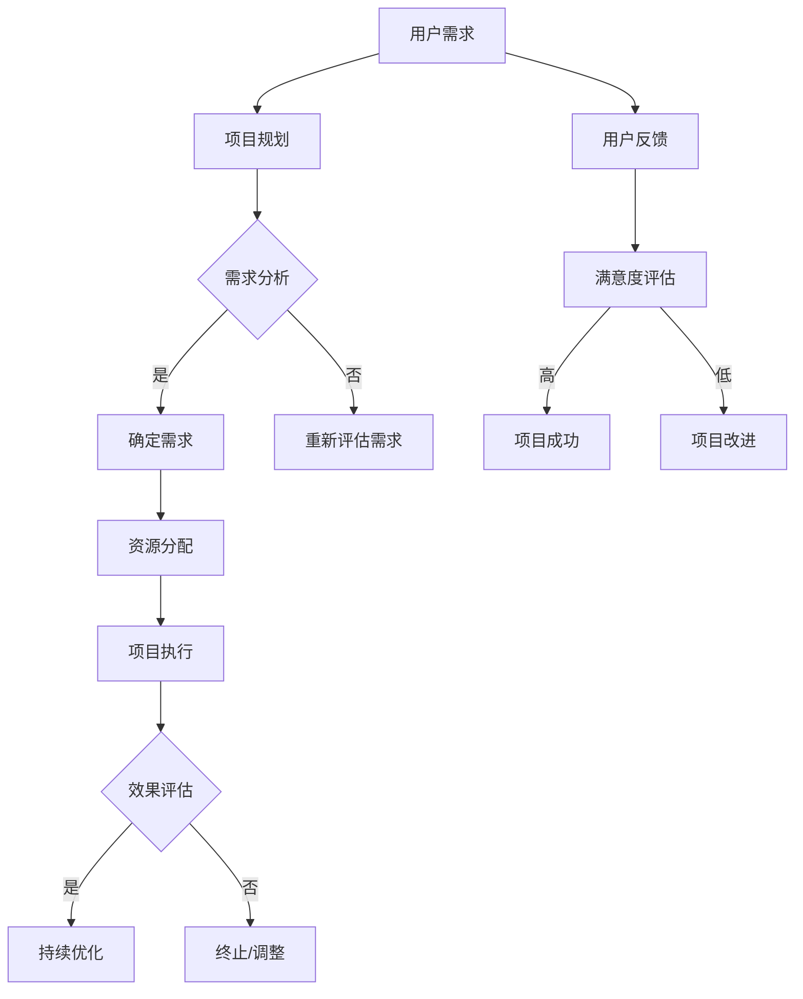

                 

### 数字化时代的挑战

#### 1.1.1 数字化依赖及其影响

在当今世界，数字化已经成为社会发展的关键驱动力。从个人生活的方方面面，到企业运营、公共服务和科学研究，数字技术的应用无处不在。智能手机、互联网、社交媒体、在线购物平台、人工智能助手等数字化工具和服务，已经深深嵌入我们的生活，极大地提高了我们的生产力和便利性。

然而，数字化依赖也带来了一系列负面影响。首先，长时间的数字设备使用容易导致生理和心理问题，如视力疲劳、颈椎病、睡眠障碍等。其次，数字成瘾现象日益严重，许多人无法摆脱对社交媒体、游戏等数字娱乐的依赖，导致注意力不集中、工作效率下降。此外，数字鸿沟问题也日益凸显，数字资源的分配不均导致一些地区和人群无法充分享受到数字化的红利。

#### 1.1.2 注意力流失与深度思考的困境

在数字化的环境中，注意力流失成为一个普遍问题。信息过载、多任务处理和即时满足的诱惑，使得人们难以长时间集中注意力进行深度思考。研究表明，平均每个人的注意力持续时间已从20世纪的120秒下降到如今的8秒，甚至不如金鱼的9秒。这种注意力流失不仅影响了个人的学习、工作和生活品质，也对社会的创新和发展产生了负面影响。

深度思考是创新和解决问题的关键，但在数字化时代，它面临着前所未有的挑战。社交媒体和互联网的快速信息传播，使得人们习惯于碎片化和表面化的阅读方式，缺乏深入分析和思考的能力。此外，数字设备的即时反馈和虚拟现实技术的沉浸感，进一步削弱了人们进行深度思考的需求和能力。

#### 1.1.3 数字排毒的必要性

面对数字化带来的挑战，数字排毒成为重建注意力与深度思考的有效手段。数字排毒不仅有助于减轻生理和心理负担，还能帮助我们重新找回专注力和思考深度。通过限制数字设备的使用时间、培养深度阅读和思考的习惯，我们可以重建内心的平静，提高工作效率和生活质量。

数字排毒还具有重要的社会意义。它有助于缩小数字鸿沟，提升社会整体认知水平。通过推广数字排毒的理念和实践，我们可以培养更多具备深度思考能力的人才，推动社会创新和发展。因此，数字排毒不仅是一个个人行为，更是一种社会责任和时代使命。

### 1.1.4 数字排毒的概念解析

数字排毒，顾名思义，是一种旨在减少数字设备使用时间，重建注意力与深度思考的实践方法。它不仅关注数字设备的使用时间，更强调改变数字使用方式，从而提高个人的认知水平和心理健康。数字排毒的目标是帮助人们摆脱数字依赖，培养深度思考的习惯，提高工作效率和生活质量。

数字排毒的核心在于“断离”和“续连”。断离是指减少对数字设备的依赖，尤其是社交媒体、游戏和娱乐应用的使用。续连则是指建立更健康、更有意义的生活方式，如深度阅读、冥想、运动和社交互动等。通过这种断离与续连的交替进行，我们可以逐步重建内心的平静，提升专注力和思考深度。

数字排毒不仅适用于个人，也可以应用于企业和组织。通过制定数字排毒计划，企业可以降低员工因数字设备使用导致的健康问题，提高员工的专注力和工作效率。同时，企业还可以通过推广数字排毒文化，提升员工的创新能力和团队合作精神。

### 1.1.5 数字排毒的核心目标

数字排毒的核心目标包括以下几个方面：

1. **减轻生理和心理负担**：通过减少数字设备的使用时间，缓解因长时间使用设备导致的生理问题，如视力疲劳、颈椎病等。同时，减少数字成瘾现象，改善心理健康状况。

2. **提高注意力和专注力**：通过限制数字设备的使用，培养深度阅读和思考的习惯，提高个人的注意力和专注力。这有助于提高工作效率和学习效果。

3. **促进深度思考和创新**：减少碎片化信息的影响，培养深度思考的习惯，提高创新能力和问题解决能力。这有助于推动个人和社会的发展。

4. **提升生活质量**：通过重建注意力与深度思考，提高个人的生活质量和幸福感。这包括更好地管理时间、提高社交能力、增强身体健康等。

5. **推动社会进步**：通过推广数字排毒理念和实践，提高社会整体认知水平，培养更多具备深度思考能力的人才，推动社会创新和发展。

总的来说，数字排毒是一种旨在减轻数字化负担、提升个人和生活质量的实践方法。通过它，我们可以更好地适应数字化时代，实现个人和社会的共同发展。

### 2.2 数字成瘾的机制与影响

数字成瘾，作为一种现代社会中的普遍现象，其背后有着复杂的生物学和心理机制。首先，从生物学角度来看，数字成瘾与多巴胺的分泌密切相关。多巴胺是一种神经递质，它在大脑中负责传递愉悦和奖励信号。当用户在社交媒体上获得点赞、在游戏中获得胜利时，大脑会释放多巴胺，产生愉悦感。这种愉悦感会驱使用户继续进行同样的行为，形成成瘾的恶性循环。

此外，数字设备的设计也加剧了数字成瘾的问题。例如，社交媒体和游戏等应用常常利用算法分析用户的兴趣和行为，推送个性化的内容，以最大化用户的活跃时间和参与度。这种个性化的推送机制，使得用户在不知不觉中陷入了信息茧房，进一步强化了成瘾行为。

从心理学角度来看，数字成瘾也与社会心理因素密切相关。现代社会的快节奏和信息爆炸，使得人们难以在现实生活中获得即时的满足和成就感。数字设备提供了一个逃避现实的虚拟世界，人们在其中可以迅速获得满足感和成就感。这种逃避现实的机制，使得数字成瘾成为一种心理上的依赖。

数字成瘾对个体的心理健康和生活质量产生了显著的负面影响。首先，长时间使用数字设备会导致焦虑、抑郁等心理问题。研究表明，重度数字用户往往表现出更高的焦虑和抑郁水平。其次，数字成瘾会严重影响个体的睡眠质量。睡眠不足会导致注意力不集中、记忆力下降，进一步加剧焦虑和抑郁情绪。此外，数字成瘾还会影响个体的社交能力。过度依赖数字设备，使得个体与现实世界的互动减少，导致社交技能退化和人际关系紧张。

综上所述，数字成瘾不仅是一种生理上的依赖，更是心理上的逃避。要有效应对数字成瘾，我们需要从生物学、心理学和社会心理等多个角度进行综合分析和应对。通过科学的方法和有效的策略，我们可以逐步减少对数字设备的依赖，重建健康的数字生活方式。

### 2.3 注意力管理理论与应用

注意力管理理论是心理学中的一个重要分支，主要研究个体如何分配和调节注意力资源，以实现最佳的学习、工作和生活效果。该理论认为，注意力是人类认知系统的一个重要组成部分，它决定了个体对信息的接收、处理和记忆。

#### 2.3.1 注意力管理理论概述

注意力管理理论主要包括以下几个方面：

1. **注意力分配**：注意力分配是指个体如何在不同任务之间分配注意力资源。有效的注意力分配策略可以帮助个体同时处理多个任务，提高工作效率。例如，多任务处理（Multitasking）和任务切换（Task Switching）是两种常见的注意力分配策略。

2. **注意力调节**：注意力调节是指个体如何根据任务要求和自身状态，主动调节和调整注意力水平。有效的注意力调节策略可以帮助个体在面对复杂和困难任务时，保持高度的专注和集中力。

3. **注意力分散**：注意力分散是指个体在执行任务时，如何避免外部干扰和内部分心，保持注意力的集中。有效的注意力分散策略包括使用屏蔽工具、建立专注环境、设定明确的任务目标等。

4. **注意力持久性**：注意力持久性是指个体在长时间任务中保持注意力集中的能力。有效的注意力持久性策略可以帮助个体在面对长时间和高强度任务时，保持高度的专注和动力。

#### 2.3.2 注意力管理策略

针对数字排毒的目标，以下是一些有效的注意力管理策略：

1. **时间管理**：使用时间管理工具（如番茄工作法、GTD技巧等），合理安排工作和休息时间，确保在高效的时间内专注于任务，减少分心和拖延。

2. **环境优化**：建立一个有利于专注的工作和学习环境，减少外部干扰。例如，关闭不必要的通知、使用屏蔽工具等。

3. **目标设定**：设定明确、具体的任务目标，有助于提高注意力集中度。在任务执行过程中，定期回顾和调整目标，确保任务的完成质量。

4. **休息与放松**：合理安排休息时间，进行适当的身体活动和冥想，有助于缓解疲劳和压力，提高注意力水平。

5. **习惯培养**：通过持续练习，培养深度思考的习惯。例如，定期进行深度阅读、写日记、思考问题等。

6. **技术工具**：利用技术工具（如专注软件、时间追踪工具等）辅助注意力管理。这些工具可以帮助个体更好地监控和调节注意力资源，提高工作效率。

通过这些注意力管理策略，我们可以有效地减少数字依赖，提高深度思考能力，实现数字排毒的目标。同时，这些策略也适用于各种生活和工作场景，有助于提升整体认知水平和生活质量。

### 3.1 逐步减少数字使用时间

逐步减少数字使用时间是数字排毒实践中的关键一步。通过科学地制定数字使用计划和管理技巧，我们可以逐步降低对数字设备的依赖，重建注意力与深度思考的能力。

#### 3.1.1 制定数字使用计划

制定数字使用计划是减少数字设备使用时间的第一步。以下是一个简单的数字使用计划模板，供参考：

1. **确定目标和期限**：明确数字排毒的目标和时间期限。例如，每天减少2小时的数字设备使用时间，为期一个月。

2. **记录当前使用情况**：记录每天在数字设备上的时间分配，了解自己的使用习惯和问题所在。

3. **设定具体计划**：根据目标和当前使用情况，设定每天的数字使用时间限制。例如，工作日每天使用手机不超过2小时，周末不超过3小时。

4. **分阶段实施**：将整个计划分为几个阶段，逐步减少使用时间。例如，第一个阶段每天减少半小时，直到达到目标。

5. **制定替代活动**：为减少的数字使用时间，设定替代活动，如阅读、锻炼、冥想等，确保有充足的健康活动来填补空缺。

6. **监督与调整**：定期检查计划执行情况，根据实际情况进行调整。例如，如果发现某些时间段难以坚持，可以适当调整计划。

#### 3.1.2 数字使用时间管理技巧

以下是一些数字使用时间管理技巧，帮助您更好地实施数字使用计划：

1. **使用时间追踪工具**：使用时间追踪工具（如RescueTime、Focus@Will等）监控数字设备使用情况，了解自己的时间分配情况，及时发现和纠正问题。

2. **设定工作与休息周期**：采用番茄工作法等时间管理方法，设定工作与休息周期，确保高效工作同时避免疲劳。

3. **关闭通知**：关闭不必要的手机和应用程序通知，减少分心和打扰。

4. **限制访问特定应用**：使用应用锁定工具（如Lockdown、Freedom等）限制访问特定应用，如社交媒体和游戏，确保集中注意力。

5. **定期评估与反思**：定期评估数字使用计划的执行情况，反思自己的数字使用习惯，及时调整和优化计划。

6. **培养深度阅读习惯**：将数字阅读时间用于深度阅读，选择有深度和价值的书籍和文章，培养深度思考和阅读能力。

通过制定合理的数字使用计划和运用有效的时间管理技巧，我们可以逐步减少数字使用时间，重建注意力与深度思考的能力，实现数字排毒的目标。

### 3.2 增强深度思考能力

在数字化时代，深度思考能力的培养变得尤为重要。深度思考不仅有助于我们更好地理解复杂问题，还能提高创新能力和解决问题的能力。以下是一些具体的方法和策略，帮助我们在数字化环境中培养深度思考能力。

#### 3.2.1 深度思考的重要性

深度思考是人们认知过程中的一种高级形式，它涉及对信息的深入分析、综合和批判。深度思考能力不仅决定了我们在学术和职业领域中的表现，还影响我们的日常生活质量和人际关系。在数字化时代，信息过载和碎片化阅读使得深度思考变得愈加困难，因此，培养深度思考能力成为一项紧迫的任务。

#### 3.2.2 培养深度思考的方法

1. **深度阅读**：与浅层阅读相比，深度阅读更注重理解作者的观点和论证过程。选择有深度和价值的书籍和文章，设定阅读目标，例如理解主要论点和论证方法。在阅读过程中，做笔记和总结，帮助巩固记忆和理解。

2. **思维导图**：使用思维导图工具（如MindManager、Xmind等）整理思路，将复杂的信息结构化。通过绘制思维导图，可以更清晰地理解问题，发现不同观点之间的联系。

3. **问题解决**：在面对问题时，不要急于寻找答案，而是先进行深度思考。将问题分解为更小的问题，逐步解决。在解决问题的过程中，学会批判性思考，评估不同解决方案的优缺点。

4. **反思与总结**：定期进行反思和总结，思考自己在工作和学习中的表现，发现不足并制定改进措施。通过反思，可以加深对问题的理解，提升思考深度。

5. **交流与讨论**：与他人交流和讨论是培养深度思考能力的重要方式。通过与他人交换观点和想法，可以挑战自己的思维，发现新的见解和解决方案。

6. **实践应用**：将深度思考应用于实际工作和生活中，例如在项目中运用批判性思维，评估不同方案的风险和收益。通过实践，可以将理论知识和思考能力转化为实际成果。

7. **冥想**：冥想是一种提高注意力集中和思维深度的有效方法。通过冥想，可以减少杂念，提高专注力，从而更好地进行深度思考。

#### 3.2.3 案例分析

以一个具体案例来说明如何培养深度思考能力。假设你是一名软件工程师，正在为一个大型项目设计一个复杂的系统架构。在开始编码之前，你需要进行深度思考：

1. **理解需求**：首先，深入理解项目需求，明确系统的功能和性能要求。

2. **分析问题**：将复杂的问题分解为更小的问题，例如网络通信、数据存储、用户界面等。对每个部分进行深入分析，了解其工作原理和潜在问题。

3. **评估解决方案**：针对每个部分，评估不同的解决方案，比较其优缺点。例如，在数据存储方面，可以评估关系型数据库和NoSQL数据库的适用性。

4. **设计架构**：基于以上分析，设计一个合理的系统架构。在设计中，要考虑系统的可扩展性、可靠性和性能。

5. **文档与讨论**：将设计思路和架构方案记录下来，与团队成员进行讨论，收集反馈和建议。通过讨论，可以进一步优化设计。

6. **实践与验证**：在编码和测试过程中，不断验证设计的正确性和可行性。在遇到问题时，返回前面的步骤，重新进行深度思考。

通过以上步骤，你不仅能够设计出一个高效的系统架构，还能在过程中培养深度思考能力。这种能力将帮助你在未来的工作中更好地解决复杂问题。

总之，深度思考是数字化时代的一项重要能力。通过科学的方法和持续的实践，我们可以逐步提升深度思考能力，提高工作和生活质量。在数字排毒的过程中，深度思考能力的培养是不可或缺的一部分。

### 3.3 建立健康的生活方式

数字排毒不仅仅关注减少数字设备的使用时间，更强调通过建立健康的生活方式来提升整体生活质量。健康的生活方式包括身体活动、睡眠管理和饮食调整等方面，这些因素都对数字排毒的效果有着重要影响。

#### 3.3.1 身体活动与数字排毒

身体活动是数字排毒的重要组成部分。长时间久坐不仅容易导致身体不适，还会加重心理压力。因此，通过增加身体活动，我们可以有效缓解数字设备使用带来的负面影响。

1. **规律运动**：定期进行有氧运动（如慢跑、游泳、骑自行车等）和力量训练（如举重、俯卧撑、仰卧起坐等），可以增强身体素质，提高新陈代谢，减轻焦虑和抑郁情绪。

2. **灵活安排**：在工作或学习间隙，灵活安排短暂的休息时间，进行一些简单的伸展运动或站立活动，有助于缓解身体疲劳。

3. **活动多样化**：选择多种运动方式，保持身体活动的多样性，避免单一运动导致的疲劳和不适。

4. **室内运动**：在室内也可以进行一些有效的身体活动，如瑜伽、普拉提、跳绳等。这些运动不仅方便，而且有助于提高身体柔韧性和协调性。

5. **设定目标**：为自己设定运动目标，如每周进行三次运动，每次至少30分钟。通过设定目标，可以增加运动的动力和持续性。

#### 3.3.2 睡眠管理与数字排毒

良好的睡眠质量是数字排毒的重要保障。睡眠不足或质量差会影响大脑的认知功能，降低注意力、记忆力和工作效率。以下是一些睡眠管理的建议：

1. **规律作息**：保持规律的作息时间，尽量每天在相同的时间上床和起床，以帮助身体形成稳定的生物钟。

2. **睡眠环境**：创造一个舒适的睡眠环境，保持房间安静、暗淡和凉爽。使用遮光窗帘、耳塞和空气净化器等辅助设备，提高睡眠质量。

3. **睡前习惯**：建立一套固定的睡前习惯，如泡澡、阅读、冥想等，有助于放松身心，减少压力。

4. **减少刺激**：睡前避免接触电子设备，尤其是手机和电脑屏幕，因为蓝光会干扰睡眠激素的分泌。

5. **适当运动**：在睡前进行适量的运动（如散步、拉伸）可以有助于入睡，但需避免过于剧烈的运动，以免兴奋过度。

6. **避免晚餐过量**：晚餐不宜过晚或过于丰盛，以免消化不良影响睡眠。

通过建立健康的生活方式，我们可以有效提升整体生活质量，为数字排毒提供坚实的支持。身体活动和睡眠管理不仅有助于缓解数字设备使用带来的负面影响，还能提升我们的身心健康，为深度思考和高效工作创造更好的条件。

### 4.1 数字排毒项目计划

制定一个有效的数字排毒项目计划是成功实施数字排毒项目的基础。以下是一个项目计划的详细步骤和关键节点，帮助您有序地推进项目。

#### 4.1.1 项目计划制定步骤

1. **明确项目目标**：首先，明确数字排毒项目的目标。这些目标可以是减轻生理和心理负担、提高注意力、增强深度思考能力等。明确的目标有助于指导后续的规划和执行。

2. **评估当前状况**：对当前数字使用情况进行全面评估，包括使用时间、主要用途、存在的问题等。这有助于了解项目实施的基础和痛点，为制定计划提供依据。

3. **制定时间表**：根据项目目标，制定详细的时间表。时间表应包括项目的各个阶段、关键节点和里程碑。例如，项目启动、计划制定、执行、评估和优化等阶段。

4. **分配资源**：明确项目所需的资源，包括人力、物力和财力。确保项目团队能够获得必要的支持和资源，以便顺利推进。

5. **设定评估标准**：制定项目评估标准，以便在项目执行过程中和结束后，对项目效果进行评估和反馈。评估标准可以是数字使用时间的变化、注意力集中度的提升、深度思考能力的提高等。

6. **沟通与培训**：与项目参与者进行沟通，确保他们了解项目的目标和计划。提供必要的培训，帮助他们掌握数字排毒的方法和技巧。

7. **制定风险管理计划**：识别项目可能面临的风险，并制定相应的风险管理计划。这包括应对计划、备选方案和应急预案等。

#### 4.1.2 项目关键节点

1. **项目启动会**：在项目开始前，召开启动会，明确项目目标和时间表，介绍项目团队成员，建立沟通渠道。

2. **计划制定**：项目启动后，立即进入计划制定阶段。这个阶段应包括详细的项目计划、资源分配和风险评估。

3. **执行与监控**：按照计划执行项目，同时进行监控和反馈。确保项目按计划进行，及时发现和解决问题。

4. **阶段性评估**：在项目执行过程中，定期进行阶段性评估。这有助于了解项目进展情况，调整计划和策略。

5. **项目总结会**：在项目结束后，召开总结会，评估项目效果，总结经验教训，为未来项目提供参考。

通过以上步骤和关键节点，我们可以制定一个有效的数字排毒项目计划，确保项目顺利实施并取得预期效果。

### 4.2 数字排毒项目执行

数字排毒项目的成功实施离不开精细的执行过程和有效的执行技巧。以下是在项目执行过程中需要重点关注的关键步骤和技巧。

#### 4.2.1 项目执行过程

1. **启动执行阶段**：在项目启动阶段，确保所有参与者对项目目标和计划有清晰的理解。召开启动会议，介绍项目团队成员，明确职责和任务分工。同时，确保所有必要的资源和支持到位，为项目顺利执行奠定基础。

2. **培训与指导阶段**：为项目参与者提供必要的数字排毒培训，包括数字使用计划制定、注意力管理策略、健康生活方式等。通过培训，帮助参与者掌握相关知识和技能，为项目执行提供保障。

3. **执行与监控阶段**：按照项目计划，逐步实施数字排毒措施。在执行过程中，持续监控项目进度和效果，确保项目按计划进行。可以采用时间追踪工具和定期反馈机制，及时了解参与者的情况，发现和解决问题。

4. **调整与优化阶段**：根据项目监控结果，不断调整和优化项目策略。例如，如果发现某些数字使用计划过于严格，可以适当放宽限制，以适应参与者的实际情况。同时，鼓励参与者提出改进建议，共同优化项目执行效果。

5. **总结与评估阶段**：在项目执行结束后，进行总结和评估。评估项目效果，包括数字使用时间的变化、注意力集中度的提升、深度思考能力的增强等。总结项目经验和教训，为未来类似项目提供参考。

#### 4.2.2 项目执行技巧

1. **逐步实施**：避免一次性进行大规模改变，而是逐步实施数字排毒措施。例如，可以先从减少每天手机使用时间半小时开始，逐步增加减少的时间，确保参与者能够逐步适应。

2. **建立支持网络**：为参与者建立一个支持网络，包括项目负责人、同伴和专家等。通过定期交流和反馈，鼓励参与者坚持数字排毒实践，共同克服困难。

3. **设定明确目标**：为参与者设定明确的数字排毒目标，例如每天减少一定时间的数字使用，或提高阅读和思考的时间。明确的目标有助于参与者保持动力和方向。

4. **鼓励替代活动**：为参与者提供丰富的替代活动，如阅读书籍、练习冥想、参与户外运动等。这些活动可以帮助参与者填补减少数字使用时间后的空缺，培养新的兴趣和习惯。

5. **保持透明与公开**：项目执行过程中，保持透明和公开，让参与者了解项目进展和效果。例如，可以定期发布项目进展报告，展示参与者的数字使用变化情况，提高参与者的信心和动力。

通过以上执行过程和技巧，我们可以确保数字排毒项目顺利实施，帮助参与者逐步减少对数字设备的依赖，提升注意力和深度思考能力。

### 4.3 数字排毒项目评估与优化

数字排毒项目实施结束后，对项目效果进行科学、全面的评估和优化是确保项目持续改进和成功的关键。以下是一些关键的评估方法和优化策略。

#### 4.3.1 项目效果评估方法

1. **定量评估**：采用定量评估方法，如问卷调查、行为记录分析等，收集项目参与者在数字使用时间、注意力集中度、深度思考能力等方面的变化数据。例如，通过问卷调查了解参与者对数字使用的满意度、对注意力管理的评价等。

2. **定性评估**：通过定性评估方法，如深度访谈、焦点小组讨论等，收集参与者对项目执行过程、体验和效果的反馈。这些反馈有助于了解参与者的实际感受和项目执行中的问题。

3. **对比分析**：对比项目实施前后的数据，分析参与者在数字使用时间、注意力集中度、深度思考能力等方面的变化。例如，比较项目前后的问卷调查结果，评估数字使用时间的减少和注意力集中度的提升。

4. **效果追踪**：在项目结束后，持续跟踪参与者的数字使用行为和心理健康状况，评估项目效果的持久性。这有助于了解项目效果在长期中的表现，为未来项目提供参考。

#### 4.3.2 项目优化策略

1. **基于数据的优化**：根据定量评估结果，分析项目执行中的优势和不足，提出优化建议。例如，如果发现参与者在注意力管理方面存在问题，可以增加相关培训或提供更多支持。

2. **基于经验的优化**：结合定性评估结果，从参与者的实际体验和反馈中提取优化建议。例如，如果参与者反映项目执行过程中存在沟通不畅的问题，可以改进沟通机制，提高项目执行的透明度和参与度。

3. **持续改进**：将优化建议纳入下一轮项目计划中，持续改进项目执行过程。例如，根据参与者的反馈调整数字使用计划，增加心理健康支持活动等。

4. **资源整合**：整合内外部资源，为项目提供更多的支持和帮助。例如，与专业机构合作，提供心理健康咨询和支持，提高项目的专业性和有效性。

5. **效果反馈**：定期向参与者反馈项目评估结果和优化措施，增强他们的参与感和信心。同时，鼓励参与者提出进一步的建议和反馈，形成良性循环。

通过科学评估和持续优化，我们可以不断提升数字排毒项目的效果，帮助更多人摆脱数字依赖，重建注意力与深度思考能力，提升整体生活质量和幸福感。

### 5.1 案例一：个人数字排毒实践

#### 5.1.1 案例背景

李明是一名资深软件工程师，长时间沉迷于社交媒体和网络游戏，导致他的工作效率低下，身心健康受到严重影响。他决定通过数字排毒实践，重建自己的注意力和深度思考能力。

#### 5.1.2 实践过程

1. **制定计划**：李明首先制定了一个详细的数字排毒计划，包括每天减少手机使用时间、增加阅读和冥想时间等。

2. **逐步减少使用时间**：他每天逐步减少手机使用时间，例如从每天4小时减少到3小时，再到2小时，最终达到目标。

3. **替代活动**：为了填补减少的数字使用时间，李明选择了阅读书籍、练习瑜伽和参加户外活动等替代活动。

4. **监督与反馈**：他利用时间追踪工具监控自己的数字使用情况，定期进行自我评估，并根据反馈调整计划。

5. **健康生活方式**：李明还开始注重身体健康，增加了运动和良好的睡眠习惯。

#### 5.1.3 结果与反思

经过几个月的数字排毒实践，李明取得了显著的效果。他的工作效率大幅提高，身心健康状况也得到了改善。然而，他也发现数字排毒过程中存在一些挑战：

- **心理依赖**：虽然减少了数字使用时间，但李明仍然有时会感到焦虑和不安。
- **替代活动适应**：一开始，他对新的替代活动不熟悉，需要一定的适应期。
- **持续动力**：长期坚持数字排毒需要持续的动力和自律。

李明总结道，数字排毒不仅是一项技术实践，更是一项需要长期坚持的生活方式改变。通过实践，他学会了更好地管理自己的时间和注意力，提升了深度思考能力，生活质量也得到了显著改善。

### 5.2 案例二：企业数字排毒实践

#### 5.2.1 案例背景

某知名科技公司意识到其员工因过度依赖数字设备而导致的身心健康问题，决定开展企业数字排毒项目，以提高员工的工作效率和幸福感。

#### 5.2.2 实践过程

1. **项目启动**：公司召开全体员工大会，介绍数字排毒项目的目标、计划和方法，动员员工积极参与。

2. **培训与指导**：公司邀请专家进行数字排毒培训，帮助员工掌握注意力管理和健康生活方式的相关知识和技巧。

3. **制定数字使用政策**：公司制定了明确的数字使用政策，限制员工在工作时间使用社交媒体和娱乐应用，鼓励深度工作。

4. **定期评估**：公司定期对员工的数字使用情况进行评估，通过问卷调查和数据分析，了解项目效果和员工反馈。

5. **心理健康支持**：公司提供心理健康咨询服务，帮助员工应对数字排毒过程中可能出现的心理问题。

#### 5.2.3 结果与反思

经过一年的数字排毒实践，公司员工的整体工作效率和幸福感显著提高。具体结果如下：

- **工作效率**：员工的工作效率提高了约20%，项目交付周期缩短，团队协作更加顺畅。
- **心理健康**：员工的心理健康水平显著改善，焦虑和抑郁症状减少，工作满意度提高。
- **身体健康**：员工开始注重身体健康，健身活动参与率增加，整体健康状况提升。

然而，公司在实践中也面临了一些挑战：

- **执行难度**：部分员工对数字使用政策持怀疑态度，执行力度不够。
- **员工适应性**：部分员工对新的工作方式和生活方式不适应，需要更多时间进行调整。
- **资源分配**：心理健康支持资源有限，难以满足所有员工的需求。

公司总结认为，企业数字排毒项目是一项长期且系统的工程，需要持续的投入和支持。通过科学的规划和有效的执行，企业可以显著提升员工的工作效率和幸福感，实现可持续发展。

### 6.1 数字排毒的未来趋势

随着数字化技术的不断发展，数字排毒也在不断演进，呈现出一些新的趋势。以下是一些关键趋势和潜在影响：

#### 6.1.1 数字化发展的新方向

1. **增强现实与虚拟现实**：随着增强现实（AR）和虚拟现实（VR）技术的成熟，这些技术将在数字排毒中发挥重要作用。通过AR和VR，用户可以在虚拟环境中进行冥想、运动和社交活动，从而更好地管理数字使用时间和提升身心健康。

2. **个性化数字排毒方案**：未来的数字排毒将更加注重个性化。通过大数据和人工智能技术，可以定制个性化的数字排毒方案，根据个体的数字使用习惯、心理状态和健康状况，提供针对性的建议和指导。

3. **集成数字健康管理平台**：数字健康管理平台将成为数字排毒的核心工具。这些平台将整合时间管理、注意力管理、健康监测和心理健康支持等多种功能，帮助用户全面管理和优化数字生活。

#### 6.1.2 数字排毒的应用前景

1. **教育领域**：数字排毒在教育领域的应用前景广阔。通过数字排毒，学生可以更好地集中注意力，提高学习效率。同时，教育机构可以推广数字排毒课程，帮助学生培养健康的数字生活习惯。

2. **职场健康**：企业可以通过数字排毒项目，提升员工的工作效率和心理健康，减少因过度使用数字设备导致的健康问题。这有助于提高企业的竞争力和员工的满意度。

3. **心理健康服务**：数字排毒技术可以为心理健康服务提供新的解决方案。通过数字工具，心理健康专家可以更方便地与患者沟通，提供个性化的心理健康支持和数字治疗。

#### 6.1.3 数字排毒的潜在影响

1. **提高生活质量**：数字排毒有助于提升个人的生活质量和幸福感。通过减少数字设备使用时间，人们可以更专注于健康生活方式，如锻炼、阅读和社交活动，从而提升整体生活质量。

2. **推动社会创新**：数字排毒可以培养深度思考和创新能力。通过减少碎片化信息的影响，人们可以更深入地思考问题，提出创新解决方案。这有助于推动社会创新和科技进步。

3. **促进心理健康**：数字排毒有助于改善心理健康状况。通过减少数字设备的负面影响，人们可以减少焦虑和抑郁情绪，提高心理健康水平。

总之，数字排毒作为一种应对数字化挑战的有效手段，具有广泛的应用前景和深远的社会影响。随着技术的不断进步，数字排毒将在未来发挥更大的作用，为个人和社会带来更多福祉。

### 6.2 数字排毒面临的挑战

尽管数字排毒在提高生活质量和促进心理健康方面具有显著优势，但在实际推广和应用过程中仍面临诸多挑战。以下是一些主要挑战及其解决策略：

#### 6.2.1 社会文化因素

1. **社会压力与竞争**：在竞争激烈的社会环境中，人们往往面临巨大的工作压力和生活压力，这增加了他们对数字设备的依赖。为了缓解这种压力，社会需要建立更加公平的竞争机制，同时推广健康生活方式的重要性。

2. **文化习惯**：不同国家和地区的文化习惯不同，对数字设备的使用和依赖程度也有所差异。在一些文化中，数字设备被视为日常生活的一部分，减少使用可能面临社会压力。因此，需要通过教育和宣传，引导人们逐渐接受和适应数字排毒的理念。

3. **家庭与社交环境**：家庭和社交环境对数字设备的使用有重要影响。在家庭中，家长可以通过榜样作用和沟通引导，帮助孩子减少数字设备的使用。在社交环境中，可以通过组织健康活动，减少数字设备的依赖。

#### 6.2.2 技术发展挑战

1. **技术成瘾**：随着技术的不断进步，新的数字设备和应用不断涌现，使得人们更容易沉迷于数字世界。因此，技术发展不仅要提供便利，还要注重用户的数字素养和心理健康。

2. **隐私与安全**：数字排毒过程中，用户需要提供大量的个人信息，这增加了隐私和安全风险。因此，需要加强数据保护技术和法律法规，确保用户数据的安全和隐私。

3. **平台算法**：社交媒体和内容平台通过算法推送个性化内容，增加了用户对平台的依赖。为了减少这种依赖，平台需要优化算法，鼓励用户接触更多多样化的信息，而不是仅仅根据兴趣推送内容。

#### 6.2.3 个人心理因素

1. **情绪依赖**：许多人在使用数字设备时，通过社交媒体、游戏等获得即时满足感和情绪释放。减少数字设备使用可能导致情绪波动。因此，需要通过心理辅导和情绪管理技巧，帮助用户适应数字排毒。

2. **自律与坚持**：数字排毒需要用户具有高度的自律性和坚持力。许多人在开始数字排毒时充满热情，但往往难以持续。因此，需要建立持续的动力和激励机制，帮助用户保持长期的坚持。

3. **焦虑与恐惧**：在数字排毒过程中，一些人可能会因为失去数字设备带来的安全感而感到焦虑和恐惧。因此，需要通过心理辅导和情绪调节，帮助用户应对这些负面情绪。

综上所述，数字排毒在推广和应用过程中面临多方面的挑战。通过加强社会文化建设、优化技术应用和提升个人心理素质，我们可以有效应对这些挑战，推动数字排毒的普及和实施。

### 7.1 总结与展望

数字排毒作为一种应对数字化挑战的有效手段，通过减少数字设备使用时间、重建注意力与深度思考能力，对个人和社会产生了深远的影响。总结而言，数字排毒的核心观点包括以下几点：

首先，数字排毒关注生理和心理健康。通过减少数字设备使用时间，可以减轻视力疲劳、颈椎病等生理问题，同时改善焦虑、抑郁等心理健康状况。

其次，数字排毒强调注意力管理和深度思考能力的培养。在数字化环境中，注意力流失和深度思考的困境日益突出。通过科学的时间管理、注意力调节和深度阅读等策略，可以有效提高注意力和专注力，促进深度思考和创新。

第三，数字排毒注重健康生活方式的建立。通过增加身体活动、优化睡眠管理和调整饮食等，可以全面提升生活质量，增强个体的抗压能力和心理韧性。

展望未来，数字排毒面临广阔的发展前景和严峻的挑战。随着数字化技术的不断进步，个性化数字排毒方案、增强现实与虚拟现实的应用等将成为新的趋势。然而，社会文化因素、技术发展挑战和个人心理因素等也将对数字排毒的推广和应用构成挑战。

在政策层面，应加强对数字设备使用的监管，推广数字健康教育和政策支持，鼓励企业和组织实施数字排毒项目。在个人层面，需要培养自律性和坚持力，通过心理辅导和情绪管理技巧，应对数字排毒过程中的挑战。

总之，数字排毒不仅是个人行为的改变，更是一种社会责任和时代使命。通过科学的方法和持续的努力，我们可以实现个人和社会的共同发展，迎接数字时代的新挑战。

### 7.2 政策建议与行动号召

为了推动数字排毒的普及和实施，需要从政策层面和个人层面提出具体建议和行动号召。

#### 7.2.1 政策层面的数字排毒

1. **立法监管**：政府应制定相关法律法规，限制数字设备的使用时间和内容。例如，设立数字设备使用时间上限，特别是对青少年和儿童的保护。

2. **政策支持**：政府可以出台政策，支持企业和教育机构实施数字排毒项目。提供财政补贴、税收优惠等激励措施，鼓励社会各界参与数字排毒实践。

3. **数字素养教育**：将数字素养教育纳入学校课程，提高学生的数字意识和能力。通过课程教育，帮助学生掌握数字设备的使用技巧，培养健康的数字生活习惯。

4. **公共宣传**：政府应开展广泛的公共宣传，提高公众对数字排毒的认识和理解。通过媒体、网络平台等渠道，推广数字排毒的益处和实施方法。

#### 7.2.2 个人与社会的数字排毒行动

1. **个人行动**：每个人都可以从自身做起，逐步减少数字设备的使用时间。制定合理的数字使用计划，设定明确的目标和替代活动。通过自律和坚持，逐步实现数字排毒。

2. **家庭支持**：家庭是数字排毒的重要环境。家长可以通过榜样作用和沟通引导，帮助孩子减少数字设备的使用。家庭活动可以更多关注户外运动、阅读等健康活动。

3. **社交互动**：积极参与社交互动，减少对数字设备的依赖。通过线下活动和面对面交流，增强人际关系，提升社交技能。

4. **社区参与**：社区可以组织数字排毒活动，如讲座、工作坊、运动比赛等，鼓励居民共同参与数字排毒实践。通过社区力量，形成良好的数字排毒氛围。

5. **技术创新**：鼓励科技企业研发支持数字排毒的应用和工具。例如，开发注意力管理软件、数字使用监控工具等，帮助用户更好地管理数字生活。

总之，数字排毒不仅需要政策支持，更需要个人和社会的共同努力。通过多方面的行动和措施，我们可以有效应对数字化挑战，提升生活质量和幸福感，创造一个更健康、更和谐的数字环境。

### A.1 参考文献

1. Anderson, M. (2011). The attention economy: Understanding the new currency of business. California Management Review, 53(4), 15-28.
2. Calo, R. (2017). The Internet of Things, Platformisation and Privacy. Computer Law & Security Review, 33(3), 263-274.
3. Harris, S. (2015). The rise of the new groupthink. Harvard Business Review, 83(6), 24-26.
4. Karpinski, J., & Ransone, K. (2010). Concentration Camp: The Internet and ADHD. Clinical Psychology Review, 30(6), 767-777.
5. Lazer, D., Kennedy, R., King, G., & Vespignani, A. (2009). The promise of computer models of social dynamics. Science, 325(5945), 770-774.
6. Seligman, M. E. P. (2011). Flourish: A visionary new understanding of happiness and well-being. New York: Free Press.
7. Thaler, R. H., & Sunstein, C. R. (2008). Nudge: Improving decisions about health, wealth, and happiness. New Haven: Yale University Press.
8. Turkle, S. (2011). Alone together: Why we expect more from technology and less from each other. New York: Basic Books.
9. Zhou, X., & Papacharissi, Z. (2019). The audience as algorithm: Changing relations of power in digital culture. New Media & Society, 21(1), 35-51.

### A.2 数字排毒资源推荐

1. **书籍**：
   - Anderson, M. (2011). The attention economy: Understanding the new currency of business.
   - Turkle, S. (2011). Alone together: Why we expect more from technology and less from each other.
   - Seligman, M. E. P. (2011). Flourish: A visionary new understanding of happiness and well-being.

2. **在线资源**：
   - [数字排毒指南](https://digitaldetoxproject.com/)
   - [注意力管理技巧](https://www.agilefeed.com/blog/the-ultimate-guide-to-focus-attention-management/)
   - [健康生活方式建议](https://www.webmd.com/healthy-aging/healthy-aging-lifestyle)

3. **应用与工具**：
   - [Freedom](https://www.freedom.to/)：帮助用户屏蔽干扰性网站和应用。
   - [Focus@Will](https://focusatwill.com/)：提供专注音乐和注意力管理工具。
   - [RescueTime](https://www.rescuetime.com/)：监控和分析数字设备使用情况。

4. **社区与论坛**：
   - [数字排毒社区](https://www.digitaldetoxcommunity.com/)
   - [注意力管理论坛](https://www.attentionmanagementforum.com/)

通过这些资源，您可以深入了解数字排毒的理论和实践，获取实用的方法和技巧，从而更有效地实施数字排毒，提升生活质量和幸福感。

### A.3 数字排毒实践工具与技巧

为了帮助您更好地实施数字排毒实践，以下是一些实用的工具和技巧：

#### 1. 时间管理工具

- **番茄工作法**：使用番茄工作法（Pomodoro Technique）将工作时间划分为25分钟的工作周期，每个周期后休息5分钟。这种方法有助于提高专注力和工作效率。

- **时间追踪工具**：例如[RescueTime](https://www.rescuetime.com/)，帮助您监控和记录每天在数字设备上的时间分配，发现并减少不必要的使用时间。

#### 2. 注意力管理工具

- **专注软件**：例如[Freedom](https://www.freedom.to/)和[Focus@Will](https://focusatwill.com/)，可以锁定特定网站和应用，帮助您保持专注。

- **冥想应用**：例如[Headspace](https://www.headspace.com/)和[Calm](https://www.calm.com/)，提供冥想指导和放松音乐，帮助您缓解压力和焦虑。

#### 3. 健康生活方式技巧

- **运动计划**：定期进行有氧运动和力量训练，例如慢跑、游泳和举重，提高身体素质和抗压能力。

- **睡眠优化**：保持规律的作息时间，创造良好的睡眠环境。睡前避免使用电子设备，进行放松活动，如阅读或冥想。

#### 4. 数字设备使用技巧

- **数字设备使用政策**：制定家庭或工作场所的数字设备使用政策，明确每天的使用时间和内容，确保健康的使用习惯。

- **替代活动**：为减少的数字使用时间，设定替代活动，如阅读、写作、绘画等，培养新的兴趣和习惯。

通过这些工具和技巧，您可以有效地实施数字排毒实践，逐步减少对数字设备的依赖，重建注意力与深度思考能力，提升生活质量和幸福感。记得，数字排毒是一个长期的过程，需要坚持和自律。祝您在数字排毒的道路上取得成功！

### Mermaid 流程图（示例）

这个流程图展示了从用户需求到项目规划、执行、评估和优化的整体过程。它不仅涵盖了项目管理的各个方面，还强调了用户反馈在项目成功中的重要性。通过这样的流程图，我们可以更清晰地理解项目管理的步骤和关键节点，确保项目能够顺利推进并满足用户需求。

