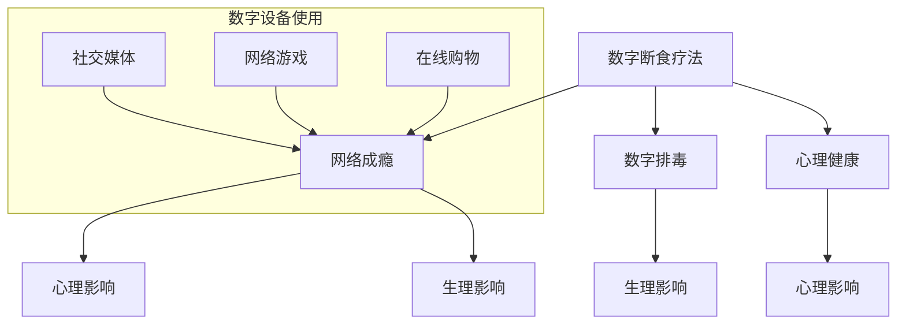

                 

### 文章标题

《数字断食疗法：网络成瘾的治愈之道》

### 文章关键词

- 数字断食疗法
- 网络成瘾
- 心理健康
- 数字排毒
- 生理影响

### 文章摘要

数字断食疗法，作为一种新兴的干预方法，正逐渐受到公众的关注和认可。本文旨在探讨数字断食疗法的理论基础和实践方法，分析其在治疗网络成瘾中的作用机制，并提供具体的实战案例和实用建议。通过深入探讨这一疗法，我们希望能够帮助读者更好地理解网络成瘾的危害，以及如何通过数字断食疗法来治愈这一现代“疾病”。

## 基本概念

### 数字断食疗法

数字断食疗法，是指在一定时间内限制或完全中断与互联网和数字设备的接触，以帮助个体恢复心理健康和生理平衡的一种治疗方法。这种方法起源于数字排毒（Digital Detox）的概念，但相较于简单的减少使用时间，数字断食疗法更加严格，要求个体在特定时间内完全戒断与数字设备的互动。

### 网络成瘾

网络成瘾，是指个体对互联网活动产生强烈的依赖，导致其日常生活、工作、学习等方面受到严重影响的现象。网络成瘾可能表现为过度使用社交媒体、网络游戏、在线购物等，常见的症状包括失眠、注意力下降、情绪波动等。

### 心理健康

心理健康，是指个体在认知、情感、行为和社会适应等方面处于良好的状态，能够有效应对生活中的压力和挑战。心理健康的重要性不言而喻，它直接影响个体的生活质量和工作效率。

### 数字排毒

数字排毒，是一种旨在减少数字设备使用时间、改善身心健康的运动。数字排毒通常包括设定特定的休息日、减少社交媒体使用时间、练习冥想和放松技巧等。数字排毒是数字断食疗法的一个组成部分，但更为灵活和温和。

## 核心概念与联系

数字断食疗法、网络成瘾、心理健康和数字排毒这四个核心概念之间存在着紧密的联系。我们可以通过一个Mermaid流程图来展示它们之间的关系。

在这个流程图中，我们可以看到：

- **数字断食疗法**与**网络成瘾**和**数字排毒**密切相关，数字断食疗法通过限制数字设备使用来帮助治疗网络成瘾，而数字排毒则是一个更加温和的替代方案。
- **网络成瘾**对**心理健康**和**生理健康**都有显著影响，导致情绪波动、注意力下降、失眠等症状。
- **数字排毒**对**生理健康**也有积极影响，通过减少电子设备的长时间使用来改善睡眠质量和减轻身体疲劳。
- **心理健康**与**心理影响**和**生理影响**相互关联，良好的心理健康有助于缓解心理压力和生理不适。

通过这个流程图，我们可以更直观地理解数字断食疗法在治疗网络成瘾和改善心理健康中的核心作用。

## 数字断食疗法的基础知识

### 定义

数字断食疗法（Digital Detox），是一种通过减少或中断与互联网和数字设备的接触来改善身心健康的方法。它起源于数字排毒（Digital Detox），但相较于数字排毒，数字断食疗法更加严格，通常要求在一定时间内完全戒断与数字设备的互动。这一方法旨在帮助个体摆脱对数字设备的依赖，减少网络成瘾的影响，恢复身心健康。

### 起源与发展

数字断食疗法的概念最早出现在2000年代初期，随着互联网和智能手机的普及，人们对数字设备依赖的负面效应逐渐显现。早期的研究主要集中在数字设备的生理影响上，如睡眠质量下降、视力问题等。然而，随着对网络成瘾和心理健康的关注增加，数字断食疗法逐渐成为一个多学科交叉的研究领域。

近年来，数字断食疗法在全球范围内得到了广泛的关注和应用。许多国家和组织开始推广这一方法，以帮助人们摆脱网络成瘾、改善心理健康。例如，美国心理学会（APA）和英国国民健康保险制度（NHS）都提供了关于数字断食疗法的指导和资源。

### 数字成瘾的危害与诊断

数字成瘾，是指个体对互联网活动产生强烈的依赖，导致其日常生活、工作、学习等方面受到严重影响。数字成瘾的危害包括但不限于以下几点：

1. **心理健康问题**：数字成瘾可能导致焦虑、抑郁、情绪波动、社交回避等问题。
2. **生理健康问题**：长时间使用数字设备可能导致视力问题、颈椎病、睡眠障碍等。
3. **工作效率下降**：过度使用互联网可能导致注意力不集中、工作效率下降。
4. **人际关系疏远**：数字成瘾可能导致个体与家人、朋友的关系疏远，影响社交技能的发展。

数字成瘾的诊断通常基于以下标准：

1. **依赖程度**：个体是否对互联网活动产生强烈的渴望和依赖。
2. **行为表现**：个体是否表现出过度使用互联网的行为，如频繁查看社交媒体、沉迷网络游戏等。
3. **戒断症状**：个体在减少或停止使用互联网后是否出现焦虑、烦躁等戒断症状。

### 数字断食疗法的基本原则与实践方法

数字断食疗法的基本原则包括以下几点：

1. **逐步减少使用时间**：个体可以根据自身情况逐步减少数字设备的使用时间，避免突然中断造成的不适。
2. **明确目标**：设定明确的数字断食目标，如每天减少使用时间、每周设定数字断食日等。
3. **建立支持系统**：寻找家人、朋友或专业人士的支持，共同应对数字断食过程中可能遇到的挑战。
4. **替代活动**：寻找其他有益身心健康的替代活动，如运动、阅读、冥想等，以填补减少数字设备使用后产生的空白。

数字断食疗法的实践方法包括以下步骤：

1. **评估当前状况**：了解自身的数字设备使用习惯和成瘾程度。
2. **设定具体目标**：根据自身情况设定具体的数字断食目标，如每天减少1小时使用时间。
3. **逐步减少使用时间**：逐步减少数字设备的使用时间，可以在每天固定的时间段内停止使用，如晚上9点到早上7点。
4. **记录进展**：定期记录数字设备使用情况和自身感受，以便评估效果和调整策略。
5. **坚持和反思**：坚持数字断食疗法，并定期反思自身的进步和挑战，及时调整策略。

数字断食疗法的适应症和禁忌症如下：

1. **适应症**：网络成瘾、心理健康问题、工作效率下降、身体健康问题等。
2. **禁忌症**：严重心理疾病、身体疾病等，需在专业人士指导下进行。

通过数字断食疗法，个体可以逐步减少对数字设备的依赖，改善心理健康和生理状况，提高生活质量。

## 数字断食疗法与心理学

### 心理学视角下的网络成瘾

网络成瘾，从心理学角度来看，是一种行为成瘾现象，其机制和特征与药物成瘾、酒精成瘾等行为成瘾有相似之处。网络成瘾通常涉及以下几个关键因素：

1. **心理动机**：个体可能出于逃避现实压力、寻求社交满足、追求成就感等心理动机而过度使用网络。
2. **情绪调节**：网络成瘾者可能通过上网来调节情绪，如缓解焦虑、抑郁等负面情绪。
3. **行为模式**：个体可能形成固定的上网行为模式，如早晨起床后的第一件事是查看社交媒体，晚上睡前必须玩手机等。
4. **戒断症状**：当个体尝试减少或停止上网时，可能会出现焦虑、烦躁、失眠等戒断症状。

网络成瘾的心理机制主要包括以下几个方面：

1. **奖励机制**：网络活动（如社交媒体点赞、网络游戏胜利）可以释放多巴胺等神经递质，产生愉悦感和满足感。
2. **逃避现实**：网络成瘾者可能通过上网来逃避现实生活中的压力和困难，寻求短暂的快乐和逃避。
3. **行为依赖**：长时间的网络使用可能导致个体对网络活动产生依赖，即使意识到成瘾的危害，也难以自我控制。
4. **社交互动**：虽然网络成瘾者可能花大量时间在线上社交，但实际的面对面社交能力可能受到损害，导致社交回避。

### 数字断食疗法对心理健康的促进作用

数字断食疗法通过减少或中断与互联网和数字设备的接触，能够有效促进心理健康，其主要作用机制包括：

1. **改善情绪状态**：数字断食可以减少网络成瘾者对网络的依赖，从而减少焦虑、抑郁等负面情绪的出现。
2. **提高专注力**：减少数字设备干扰，有助于个体集中注意力，提高工作和学习效率。
3. **增强自我控制力**：通过数字断食，个体可以逐步学会自我控制和时间管理，提高自我效能感。
4. **改善睡眠质量**：减少晚上使用电子设备的时间，有助于改善睡眠质量，减少失眠症状。

具体来说，数字断食疗法对心理健康的促进作用体现在以下几个方面：

1. **情绪调节**：数字断食可以帮助个体减少对社交媒体和在线游戏的依赖，从而减少与网络成瘾相关的负面情绪，如焦虑、抑郁和情绪波动。
2. **提高专注力**：数字设备的使用常常导致注意力分散。通过数字断食，个体可以减少外界干扰，提高专注力和工作效率。
3. **自我控制**：通过设定具体的数字断食目标和实施计划，个体可以逐步培养自我控制和时间管理能力，这对于长期的心理健康和幸福感具有积极影响。
4. **睡眠改善**：晚上使用电子设备会发出蓝光，干扰睡眠激素的分泌，导致睡眠质量下降。数字断食有助于减少这种干扰，改善睡眠。

### 心理干预在数字断食疗法中的应用

数字断食疗法不仅仅是减少数字设备使用，它还需要结合心理干预措施，以帮助个体更好地应对戒断过程中的挑战。以下是一些常见的心理干预方法：

1. **认知行为疗法**：通过认知行为疗法（CBT），个体可以学会识别和改变负面的思维模式和行为习惯，减少网络成瘾的行为。
2. **正念冥想**：正念冥想可以帮助个体培养对当下时刻的专注和觉察，减少对数字设备的依赖。
3. **动机激发**：通过动机激发，个体可以明确数字断食的目标和好处，增强自我驱动力。
4. **社交支持**：通过家人、朋友或专业心理师的支持，个体可以更好地应对数字断食过程中的挑战。

### 总结

数字断食疗法在心理学领域中的应用，通过减少数字设备的接触，有助于改善情绪状态、提高专注力、增强自我控制力，从而促进心理健康。结合心理干预措施，数字断食疗法可以更有效地帮助个体摆脱网络成瘾，实现身心平衡。

## 数字断食疗法与生理健康

### 数字成瘾对生理健康的影响

数字成瘾不仅对心理健康有显著影响，也对生理健康造成了诸多负面影响。首先，长时间使用电子设备会导致视力问题，如近视、干眼症等。此外，长时间低头使用设备还会引发颈椎病、肩膀疼痛等身体不适。其次，过度使用数字设备还会影响睡眠质量，蓝光辐射会干扰生物钟，导致失眠、多梦等问题。最后，缺乏运动和户外活动也是数字成瘾者的常见现象，这会导致肥胖、肌肉无力、免疫力下降等健康问题。

### 数字断食疗法对生理健康的改善

数字断食疗法通过减少或中断与数字设备的接触，可以有效改善上述生理问题。首先，减少电子设备使用时间有助于减轻视力负担，降低近视发生的风险。其次，通过设定休息时间和晚上避免使用电子设备，可以改善睡眠质量，减少蓝光干扰。此外，数字断食疗法鼓励个体增加户外活动和体育运动，有助于增强体质，改善心血管健康和肌肉力量。最后，数字断食还可以帮助个体建立更健康的生活习惯，如定时饮食、规律作息等，从而整体提升生理健康水平。

### 生理指标监测与评估

在实施数字断食疗法时，监测和评估生理指标是非常重要的。以下是一些常用的生理指标及其监测方法：

1. **视力**：通过视力表检查或专业眼科医生评估视力水平，可以了解数字设备使用对视力的具体影响。
2. **睡眠质量**：使用睡眠监测设备（如智能手表、睡眠追踪应用程序）可以记录睡眠时间、睡眠深度、醒来次数等指标。
3. **血压**：定期测量血压，了解数字设备使用对心血管健康的影响。
4. **体重**：通过体重秤定期测量体重，了解饮食习惯和运动习惯的变化。
5. **心率**：使用心率监测设备可以了解运动和休息时的心率变化，评估心血管健康状况。

通过这些生理指标的监测和评估，个体可以更好地了解自身健康状况的变化，及时调整数字断食策略，实现生理健康的目标。

## 数字断食疗法的实践指导

### 准备阶段

在开始数字断食疗法之前，个体需要进行充分的准备，以确保整个过程顺利进行。首先，明确自己的数字成瘾程度，可以通过自我评估问卷或咨询专业人士来确定。其次，设定一个明确的数字断食目标，如每天减少使用时间、每周设定数字断食日等。此外，制定详细的数字断食计划，包括具体的执行步骤和时间安排。

### 实施步骤

1. **逐步减少使用时间**：从减少每天使用电子设备的时间开始，例如每天减少30分钟，逐渐增加至每小时、每天。逐步减少使用时间有助于个体逐渐适应减少数字设备使用的生活。
2. **设定固定休息时间**：在每天的固定时间段内停止使用电子设备，如晚上9点到早上7点，这段时间内专注于其他活动，如阅读、冥想、运动等。
3. **寻找替代活动**：在减少数字设备使用的同时，寻找其他有益身心健康的替代活动，如阅读纸质书籍、户外活动、与家人朋友面对面交流等。
4. **建立支持系统**：寻找家人、朋友或专业人士的支持，共同应对数字断食过程中可能遇到的挑战。

### 恢复与巩固

数字断食疗法并不是一个短期的过程，而是一个长期的生活方式改变。在完成数字断食周期后，个体需要逐步恢复正常的数字设备使用，但需保持减少使用的时间。以下是一些建议：

1. **定期回顾**：定期回顾数字断食过程中的体验和收获，及时调整策略。
2. **保持运动和健康饮食**：通过坚持运动和健康饮食，巩固数字断食带来的生理健康改善。
3. **继续寻找替代活动**：保持对其他有益身心的替代活动的兴趣，减少对数字设备的依赖。
4. **持续关注心理健康**：通过心理干预措施，如正念冥想、心理咨询等，持续关注和改善心理健康。

### 注意事项

1. **逐步减少使用时间**：避免突然完全中断数字设备使用，以免引起戒断症状。
2. **设定明确目标**：明确数字断食的目标和期望，有助于更好地实施和评估效果。
3. **建立支持系统**：寻找支持和理解自己的家人、朋友或专业人士，有助于克服数字断食过程中的困难。
4. **适应调整**：根据个体情况和反馈，适当调整数字断食计划和目标，确保整个过程的顺利进行。

通过以上的实践指导，个体可以更好地实施数字断食疗法，逐步减少对数字设备的依赖，改善身心健康，实现更高质量的生活。

## 数字断食疗法的实战案例

### 案例一：减轻网络成瘾症状

**背景**：李先生，35岁，软件工程师，沉迷于网络游戏，每天花费大量时间在线上，导致工作效率低下，身体健康状况恶化，家庭关系紧张。

**实施步骤**：
1. **评估现状**：首先，李先生对自己的网络使用时间进行了记录，发现每天平均花费6小时在游戏上。
2. **设定目标**：李先生设定了一个为期一个月的数字断食计划，每天减少1小时的游戏时间，每周设定一个无游戏日。
3. **逐步减少使用时间**：从每天减少30分钟开始，逐步增加到每小时减少1小时，并在每周无游戏日完全戒断。
4. **寻找替代活动**：李先生开始参加健身房锻炼，每周3次，每次1小时，并增加了阅读时间，每周至少读一本纸质书。
5. **建立支持系统**：李先生与家人沟通，获得他们的支持，并在公司内部找到了一位志同道合的同事，共同监督和鼓励。

**效果评估**：
- 经过一个月的数字断食，李先生每天的游戏时间减少到了2小时，工作效率显著提高。
- 身体状况改善，睡眠质量提升，颈椎病症状减轻。
- 家庭关系得到缓解，与家人的互动增加。

**案例分析**：李先生的案例展示了通过数字断食疗法可以有效减轻网络成瘾症状。关键在于逐步减少使用时间、寻找替代活动以及建立支持系统。

### 案例二：提高工作效率与学习效率

**背景**：张同学，18岁，高中生，沉迷于社交媒体和在线游戏，导致学习效率低下，考试成绩下滑。

**实施步骤**：
1. **评估现状**：张同学的父母记录了他的社交媒体和游戏使用时间，发现每天平均花费4小时在网络上。
2. **设定目标**：张同学和家长一起制定了为期两个月的数字断食计划，每天减少30分钟的网络时间，每周设定一个无网络日。
3. **逐步减少使用时间**：从每天减少15分钟开始，逐步增加到每小时减少30分钟，并在每周无网络日完全戒断。
4. **寻找替代活动**：张同学开始参加学校社团活动，每周参加一次户外活动，如足球比赛或徒步旅行。
5. **建立支持系统**：张同学的父母定期与他沟通，监督他的网络使用情况，并在学校找到了一位班主任，共同关注他的学习进步。

**效果评估**：
- 经过两个月的数字断食，张同学每天的网络时间减少到了1小时，学习效率显著提高，考试成绩逐渐提升。
- 身体状况改善，睡眠质量提升，注意力更加集中。
- 家庭关系得到改善，父母与张同学的沟通增多。

**案例分析**：张同学的案例展示了数字断食疗法对于提高学习效率和工作效率的有效性。关键在于家长的支持、逐步减少使用时间和寻找有益的替代活动。

### 案例三：家庭与学校中的数字断食疗法

**背景**：某高中学校，全校师生共同参与数字断食疗法，以改善整体身心健康。

**实施步骤**：
1. **宣传推广**：学校通过班会、校园广播、海报等方式宣传数字断食疗法，提高师生的意识。
2. **设定目标**：学校制定了全校范围的数字断食计划，每周设定一个数字断食日，全校师生共同参与。
3. **开展活动**：在数字断食日，学校组织了一系列户外活动，如徒步、足球比赛、篮球比赛等，鼓励师生积极参与。
4. **监督与反馈**：学校设立了监督小组，定期收集师生的反馈，并根据反馈调整活动安排。

**效果评估**：
- 全校范围内的数字断食活动得到了师生的高度参与，网络成瘾现象有所减轻。
- 学生们的学习效率和课堂表现得到提升，师生关系更加和谐。
- 家庭关系得到改善，家长和学生的互动增多。

**案例分析**：学校与家庭共同参与的数字断食疗法，不仅改善了师生的身心健康，还增强了家校互动，为数字健康生活方式的推广提供了良好的示范。

通过这些实战案例，我们可以看到数字断食疗法在减轻网络成瘾症状、提高工作效率与学习效率、改善家庭与学校关系等方面的显著效果。数字断食疗法不仅适用于个人，也可以在家庭和学校中推广，实现更广泛的健康改善。

## 数字断食疗法的未来展望

### 社会影响与趋势

随着互联网和数字设备的普及，数字成瘾已成为全球性的公共卫生问题。数字断食疗法作为一种新兴的干预方法，正逐渐受到公众和政策制定者的关注。当前，许多国家和地区已经开始推广数字断食疗法，将其纳入学校教育、职场健康管理和公共卫生政策中。

在未来，数字断食疗法的推广将面临以下几个趋势：

1. **政策支持**：政府可能出台更多支持数字断食疗法的政策，如减少电子设备使用时间的法规、鼓励数字断食的社会活动等。
2. **技术应用**：随着智能穿戴设备、健康监测技术的不断发展，数字断食疗法将更加精准和个性化。
3. **公众意识**：随着公众对数字成瘾危害的认识加深，更多人将主动参与数字断食活动，形成健康的生活方式。

### 发展趋势

1. **个性化定制**：未来，数字断食疗法将更加注重个性化，根据个体的具体情况定制断食方案，实现最佳效果。
2. **多学科融合**：数字断食疗法将与其他学科（如心理学、医学、公共卫生等）深入融合，形成更全面的治疗体系。
3. **数字健康产业**：数字断食疗法的发展将带动数字健康产业的兴起，包括健康监测设备、数字疗愈应用程序等。

### 可持续发展

数字断食疗法不仅是个人健康干预的一种手段，也是推动社会可持续发展的关键。以下是一些可持续发展方面的考虑：

1. **环境保护**：减少数字设备的过度使用有助于减少电子垃圾的产生，保护环境。
2. **社会公平**：通过普及数字断食疗法，可以减少数字鸿沟，提高社会整体的数字素养和健康水平。
3. **经济影响**：数字断食疗法有助于提高工作效率和学习效率，减少因数字成瘾导致的医疗成本和社会福利支出。

### 总结

数字断食疗法作为一种有效的干预方法，在治疗网络成瘾、改善心理健康和促进生理健康方面具有显著作用。随着技术的进步和公众意识的提升，数字断食疗法将在全球范围内得到更广泛的推广和应用。未来，数字断食疗法的发展将朝着个性化、多学科融合和可持续发展的方向迈进，为个体和社会带来更多福祉。

## 数字断食疗法的技术支持

### 数字设备管理技巧

为了有效地实施数字断食疗法，首先需要掌握一些数字设备管理的技巧，以帮助个体更好地控制设备使用时间和内容。

1. **使用屏幕时间监控**：
   - **iPhone用户**：可以通过“健康”应用中的“屏幕时间”功能来监控自己的设备使用情况，设置每日使用限制和通知提醒。
   - **Android用户**：可以使用内置的数字健康功能或第三方应用程序（如“数字健康助手”）来监控屏幕时间，设置使用限制。

2. **应用限制**：
   - 通过设置应用限制，可以阻止某些应用程序在特定时间段内使用。例如，在晚上休息时间，可以限制社交媒体和游戏等应用程序的使用。

3. **家长控制**：
   - 家长可以通过家长控制功能限制孩子的设备使用时间和内容。例如，使用“Apple家长控制”或“Google家庭链接”来设置设备使用限制。

### 数字环境优化建议

优化数字环境是数字断食疗法成功实施的关键之一。以下是一些建议：

1. **设备布局**：
   - 将数字设备放置在远离床边的地方，减少夜间使用设备的诱惑。
   - 使用带有滤蓝光的屏幕或贴膜，以减少蓝光对睡眠的影响。

2. **时间管理**：
   - 制定日常时间表，确保有固定的学习和休息时间，避免使用数字设备过度。
   - 利用番茄工作法等时间管理技巧，合理安排工作和休息时间。

3. **家庭氛围**：
   - 家庭成员之间相互支持，共同制定数字设备使用规则，营造良好的数字环境。

### 数字健康监测工具

监测和管理数字健康是数字断食疗法的重要组成部分。以下是一些实用的数字健康监测工具：

1. **智能穿戴设备**：
   - 智能手表和健身追踪器可以监测步数、心率、睡眠质量等健康指标，帮助个体了解自身健康状况。
   - 通过与手机应用程序的联动，智能穿戴设备可以提供详细的数据分析和建议。

2. **数字健康应用程序**：
   - 诸如“Headspace”和“Calm”等应用程序提供了冥想、放松和睡眠管理功能，有助于改善心理健康和睡眠质量。
   - “MyFitnessPal”和“Google Fit”等应用程序可以监测饮食和运动习惯，提供健康建议。

3. **睡眠监测应用程序**：
   - 如“Sleep Cycle”和“SleepScore”等应用程序可以通过智能手机或智能手表监测睡眠质量，提供个性化的睡眠建议。

通过使用这些数字设备管理技巧、优化数字环境，并利用数字健康监测工具，个体可以更好地实施数字断食疗法，实现身心健康的目标。

## 最佳实践 tips、小结、注意事项、拓展阅读

### 最佳实践 tips

1. **制定详细的计划**：在开始数字断食疗法前，制定一个详细的计划，包括目标、步骤和预期结果，以帮助您更好地执行。

2. **寻求支持**：找到家人、朋友或专业人士的支持，共同参与和监督您的数字断食过程，以增加成功的可能性。

3. **逐步减少使用时间**：避免突然中断数字设备使用，而是逐步减少使用时间，以减少戒断症状和不适感。

4. **寻找替代活动**：在减少数字设备使用的同时，寻找其他有益的替代活动，如阅读、运动、户外活动等，以填补时间空白。

5. **定期评估和调整**：定期评估数字断食的效果，并根据反馈调整计划，以保持进步。

### 小结

数字断食疗法是一种有效的干预方法，可以帮助个体减少对数字设备的依赖，改善心理健康和生理健康。通过逐步减少使用时间、设定明确目标、建立支持系统，以及寻找有益的替代活动，个体可以逐步实现数字健康的目标。

### 注意事项

1. **不要过度依赖**：数字断食疗法不是万能的，个体仍需平衡数字设备使用和其他活动，以保持身心健康。

2. **合理设定目标**：根据自身情况设定合理的目标，避免目标过高导致挫折感。

3. **注意身体和心理健康**：在数字断食过程中，注意身体和心理的变化，及时调整策略。

4. **寻求专业帮助**：如有需要，可以寻求心理咨询师或医生的专业帮助，以确保安全和效果。

### 拓展阅读

1. **《数字疗愈：互联网时代的心理健康指南》**：作者 [凯文·卡洛尔]，详细介绍了数字疗愈的概念和方法。

2. **《网络成瘾的自我管理》**：作者 [李宏茂]，提供了关于网络成瘾的自我管理和治疗策略。

3. **《数字断食：如何找回你的时间和注意力》**：作者 [布赖恩·巴克斯]，探讨了数字断食的实际应用和益处。

4. **《数字排毒：摆脱屏幕依赖，重拾健康生活》**：作者 [克里斯·巴尔特斯]，介绍了数字排毒的方法和实践。

通过拓展阅读，您可以获得更多关于数字断食疗法和相关主题的深入信息和实用建议。

### 作者信息

作者：AI天才研究院/AI Genius Institute & 禅与计算机程序设计艺术 /Zen And The Art of Computer Programming

本文由AI天才研究院（AI Genius Institute）和禅与计算机程序设计艺术（Zen And The Art of Computer Programming）联合撰写，旨在为读者提供关于数字断食疗法的技术性和实用性指南。我们致力于推动人工智能和健康科技的发展，帮助人们实现更高质量的生活。

