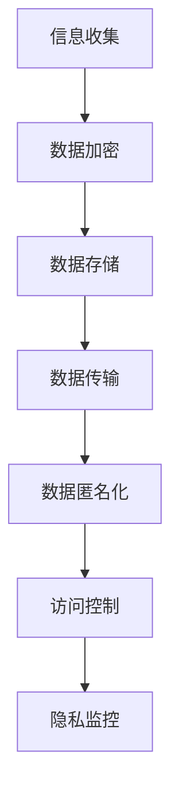

                 

### 核心概念与联系

#### 个人隐私的基本概念

个人隐私是指个人享有的对其私人生活安宁和私人信息秘密的权益。这一概念在数字时代显得尤为重要，因为它涉及到数据的收集、存储、传输和处理。个人隐私包括以下几个方面：

1. **信息隐私**：指个人的个人信息，如姓名、地址、电话号码、电子邮件等不被未经授权的第三方获取或使用。
2. **通信隐私**：涉及个人通信内容，如电子邮件、电话通话、即时消息等，不被未经授权的人拦截或窃听。
3. **位置隐私**：涉及个人地理位置信息不被未经授权的人获取。
4. **生物识别隐私**：涉及个人生物识别信息，如指纹、面部识别等，不被未经授权的人获取或使用。

#### 数字时代个人隐私的重要性

随着互联网的普及和大数据技术的应用，个人隐私面临着前所未有的威胁。个人隐私的重要性主要体现在以下几个方面：

1. **信息安全**：个人隐私泄露可能导致严重的经济损失，甚至危害到个人的生命安全。
2. **社会信任**：隐私泄露会削弱用户对互联网服务提供商的信任，影响互联网产业的健康发展。
3. **个人权利**：个人隐私是公民的一项基本权利，保护个人隐私是维护社会公正和法治的体现。

#### 个人隐私与数据安全的关系

个人隐私和数据安全是密切相关的概念。数据安全是指通过各种技术和管理手段，确保数据的保密性、完整性和可用性。个人隐私保护离不开数据安全：

1. **数据加密**：通过数据加密技术，可以确保个人数据在传输和存储过程中的安全性。
2. **访问控制**：通过严格的访问控制措施，可以限制未经授权的人员访问个人数据。
3. **数据匿名化**：对个人数据进行匿名化处理，可以降低数据泄露的风险。

#### Mermaid流程图

以下是一个简化的Mermaid流程图，描述了个人隐私保护的基本流程：

#### 结论

个人隐私在数字时代的重要性不言而喻。理解和掌握个人隐私保护的基本概念和关系，对于维护个人权益和社会稳定至关重要。在接下来的章节中，我们将深入探讨数字时代个人隐私的现状、技术手段、法律法规以及用户隐私保护实践。

### 2. 数字时代个人隐私的现状

随着数字技术的飞速发展，个人隐私的泄露风险也在不断加剧。这一节将分析数字时代个人隐私的现状，包括数据收集、隐私泄露风险以及个人隐私保护的国际比较。

#### 数据收集

在数字时代，各种平台和应用程序大量收集用户数据，以提供个性化服务。数据收集的主要途径包括：

1. **用户输入**：用户在使用应用程序时主动输入的数据，如姓名、年龄、电子邮件等。
2. **设备信息**：包括设备的型号、操作系统版本、IP地址等。
3. **行为数据**：用户在互联网上的浏览记录、搜索历史、购买行为等。

这些数据被用于广告推送、用户行为分析、个性化推荐等，但在未经用户同意的情况下，这些数据可能被滥用。

#### 隐私泄露风险

数字时代个人隐私泄露的风险主要来自以下几个方面：

1. **黑客攻击**：黑客通过技术手段非法获取用户数据。
2. **内部泄露**：企业内部员工泄露用户数据。
3. **数据泄露事件**：如Facebook剑桥分析事件，大量用户数据被非法使用。
4. **隐私政策模糊**：许多应用程序在收集用户数据时，隐私政策模糊不清，用户难以知晓其数据如何被使用。

#### 个人隐私保护的国际比较

不同国家和地区在个人隐私保护方面存在较大差异。以下是几个典型国家的隐私保护情况：

1. **欧盟**：欧盟实施了严格的《通用数据保护条例》（GDPR），对个人数据的收集、存储、处理和传输提出了严格的要求，违反GDPR的企业将面临巨额罚款。
2. **美国**：美国没有统一的隐私保护法律，而是依赖于行业自律和个别州的法律。尽管如此，美国的一些大型科技公司也在积极采取措施保护用户隐私。
3. **中国**：中国正在积极推动个人隐私保护立法，如《网络安全法》和《个人信息保护法》等。但这些法律的执行力度和实际效果仍有待观察。

### 结论

数字时代个人隐私的现状令人担忧，隐私泄露风险无处不在。各国在个人隐私保护方面采取了不同的措施，但都面临诸多挑战。在接下来的章节中，我们将探讨隐私保护的技术手段、法律法规以及用户隐私保护的实践。

### 3. 技术手段与隐私保护

在数字时代，个人隐私的保护离不开各种技术手段的应用。这些技术手段包括数据加密、数据匿名化、同步传输和人工智能在隐私保护中的应用。以下将逐一介绍这些技术手段的原理、方法和实际应用。

#### 数据加密

数据加密是保护个人隐私的核心技术之一。其原理是通过加密算法将明文数据转换为密文，只有拥有密钥的实体才能解密并获取原始数据。数据加密主要包括以下几种方法：

1. **对称加密**：使用相同的密钥进行加密和解密。常见的对称加密算法有AES、DES等。
2. **非对称加密**：使用一对密钥（公钥和私钥）进行加密和解密。常见的非对称加密算法有RSA、ECC等。
3. **哈希算法**：将任意长度的数据映射为固定长度的字符串，常见的哈希算法有MD5、SHA系列等。

在实际应用中，数据加密被广泛应用于数据传输、存储和访问控制等领域。例如，HTTPS协议使用SSL/TLS加密来确保数据在互联网上的传输安全；数据库系统使用加密算法来保护存储的敏感数据。

#### 数据匿名化

数据匿名化是将个人识别信息从数据中去除，以保护个人隐私的一种技术手段。数据匿名化的方法主要包括：

1. **数据泛化**：将具体数据替换为泛化后的数据，如将具体年龄替换为年龄段。
2. **数据脱敏**：对敏感数据进行特殊处理，使其无法被直接识别，如将身份证号中的部分数字替换为星号。
3. **数据混淆**：通过算法将数据与随机噪声混合，以掩盖真实数据。

数据匿名化广泛应用于大数据分析和数据共享等领域。例如，在医疗数据分析中，通过对患者信息进行匿名化处理，可以保护患者的隐私，同时为研究人员提供有价值的数据。

#### 同步传输

同步传输是一种数据传输技术，通过在源端和目标端之间建立实时数据同步机制，确保数据的一致性和完整性。同步传输的方法主要包括：

1. **文件同步**：将源端的文件复制到目标端，确保两端的文件一致。
2. **数据库同步**：通过复制、备份和恢复等技术，确保数据库的实时同步。
3. **实时数据流同步**：对实时产生的数据进行同步处理，确保数据的实时性。

同步传输在分布式系统和云计算等领域得到广泛应用。例如，在分布式数据库中，通过同步传输技术确保各个节点的数据一致性；在云计算环境中，同步传输技术用于确保数据的可靠性和可用性。

#### 人工智能在隐私保护中的应用

人工智能技术在个人隐私保护中具有巨大的潜力。以下是一些人工智能在隐私保护中的应用：

1. **隐私计算**：通过人工智能算法，对数据进行隐私保护处理，如差分隐私、同态加密等。
2. **隐私监控**：利用人工智能技术监控和分析隐私泄露风险，如异常检测、用户行为分析等。
3. **隐私合规**：利用人工智能技术自动识别和合规个人数据处理活动，如隐私合规检测、隐私政策生成等。

人工智能在隐私保护中的应用不仅提高了隐私保护的效果，还降低了隐私保护的成本和复杂性。

### 结论

技术手段在个人隐私保护中发挥着重要作用。数据加密、数据匿名化、同步传输和人工智能等技术为个人隐私保护提供了有力保障。在数字时代，有效利用这些技术手段，结合法律法规和用户隐私保护实践，才能更好地保护个人隐私，维护社会和谐与安全。

### 4. 法律法规与隐私保护

隐私保护不仅仅依赖于技术手段，还需要法律法规的支持和引导。本节将探讨全球隐私法律框架、我国隐私法律体系以及企业隐私保护的合规要求。

#### 全球隐私法律框架

全球范围内，隐私法律框架主要由各国立法机构和国际组织制定。以下是一些重要的隐私法律框架：

1. **欧盟《通用数据保护条例》（GDPR）**：GDPR是欧盟最具影响力的隐私保护法律，它对个人数据的收集、存储、处理和传输提出了严格的要求，违反GDPR的企业将面临高达2000万欧元或全球营业额4%的罚款。
2. **美国《加州消费者隐私法案》（CCPA）**：CCPA是加州制定的隐私保护法律，它赋予了消费者对个人数据的更多控制权，包括知情权、访问权、删除权和拒绝销售权。
3. **隐私盾协议（Privacy Shield）**：隐私盾协议是欧盟和美国之间的一项协议，旨在允许个人数据在欧盟和美国之间合法流动，同时保护个人隐私。

这些法律框架在隐私保护方面起到了重要作用，推动了全球隐私保护意识的提升。

#### 我国隐私法律体系

我国也在隐私保护方面做出了积极的努力，逐步建立和完善隐私法律体系。以下是我国的主要隐私法律：

1. **《网络安全法》**：是我国网络安全的基本法律，明确了网络运营者对用户个人信息保护的基本义务。
2. **《个人信息保护法》（PIPL）**：PIPL是我国首部全面规范个人信息保护的专门法律，它对个人信息的收集、使用、存储、处理、传输和删除等环节提出了严格的要求。
3. **《数据安全法》**：数据安全法是我国数据安全的基本法律，它强调了数据安全的重要性，并对数据安全管理制度、数据安全评估、数据安全监测等提出了具体要求。

这些法律为我国个人隐私保护提供了坚实的法律基础。

#### 企业隐私保护的合规要求

企业作为数据处理主体，有义务遵守相关隐私法律和规定，确保用户个人信息的安全。以下是企业隐私保护合规要求的一些要点：

1. **个人信息收集合法**：企业应当遵循合法、正当、必要的原则，不得非法收集用户个人信息。
2. **个人信息使用明确**：企业应当明确告知用户其个人信息的使用目的、方式和范围，并取得用户同意。
3. **个人信息存储安全**：企业应当采取有效措施确保用户个人信息的安全存储，防止数据泄露、损毁和篡改。
4. **个人信息处理透明**：企业应当建立个人信息处理透明机制，用户可以查询、更正和删除其个人信息。
5. **个人信息保护培训**：企业应当对员工进行个人信息保护培训，提高员工的隐私保护意识。

#### 结论

法律法规在个人隐私保护中起到了至关重要的作用。全球隐私法律框架、我国隐私法律体系以及企业隐私保护的合规要求共同构成了隐私保护的法律体系。企业应当严格遵守相关法律法规，采取有效措施保护用户个人信息，以维护社会和谐与安全。

### 5. 用户隐私保护实践

在实际操作中，用户隐私保护不仅需要法律和技术的支持，更需要用户自身的积极参与。本节将介绍用户隐私保护的基本措施、企业隐私保护策略以及隐私保护工具推荐。

#### 用户隐私保护的基本措施

1. **使用强密码**：为账号设置复杂、独特的密码，并定期更换。避免使用常见密码或与个人信息相关的密码。
2. **两步验证**：启用两步验证（双重认证），增加账号的安全性。
3. **限制权限**：仅在必要时授权应用程序访问个人数据，并定期检查已授权的应用程序。
4. **定期更新软件**：保持操作系统和应用软件的最新版本，以修复已知的安全漏洞。
5. **安全浏览**：使用HTTPS协议进行网络通信，避免在不安全的网络环境中访问敏感信息。
6. **数据备份**：定期备份重要数据，以防数据丢失或损坏。

#### 企业隐私保护策略

1. **隐私政策**：明确告知用户其个人信息的使用目的、方式和范围，并取得用户同意。
2. **数据加密**：对用户数据进行加密存储和传输，确保数据在存储和传输过程中的安全性。
3. **访问控制**：实施严格的访问控制措施，限制对用户数据的访问权限。
4. **员工培训**：对员工进行隐私保护培训，提高员工的隐私保护意识。
5. **安全审计**：定期进行安全审计，检查和评估隐私保护措施的执行情况。
6. **应急响应**：建立隐私泄露应急预案，确保在隐私泄露事件发生时能够迅速响应。

#### 隐私保护工具推荐

1. **VPN（虚拟私人网络）**：通过VPN可以加密网络通信，保护用户隐私。
2. **反病毒软件**：使用可靠的反病毒软件，防止恶意软件感染。
3. **密码管理器**：使用密码管理器生成和存储复杂密码，提高账号安全性。
4. **隐私浏览器**：使用隐私浏览器（如Mozilla Firefox的隐私模式或Google Chrome的无痕模式），防止浏览器记录用户行为。
5. **加密邮件服务**：使用加密邮件服务（如ProtonMail），确保邮件内容的安全性。

#### 结论

用户隐私保护需要从多个方面进行考虑和实践。用户自身需要采取基本措施保护个人信息，企业需要制定和实施隐私保护策略，同时利用隐私保护工具提升隐私保护效果。只有各方共同努力，才能有效保护个人隐私，维护数字时代的秩序与安全。

### 6. 隐私保护的未来展望

随着技术的不断进步和隐私保护意识的提高，隐私保护在未来将面临新的挑战和机遇。以下是关于隐私保护技术发展趋势、法律法规的完善以及隐私保护面临的挑战与机遇的探讨。

#### 技术发展趋势

1. **区块链技术**：区块链的去中心化和不可篡改特性为隐私保护提供了新的可能性。通过区块链技术，可以实现数据的安全共享和隐私保护。
2. **联邦学习**：联邦学习是一种分布式机器学习技术，可以在不共享数据的情况下，实现模型训练和优化。这为隐私保护提供了新的解决方案。
3. **零知识证明**：零知识证明是一种密码学技术，允许证明某个陈述的真实性，而不泄露任何有关该陈述的具体信息。这为隐私保护提供了更高级别的保障。
4. **差分隐私**：差分隐私是一种设计隐私保护算法的方法，通过在数据集中添加噪声，确保个人数据不可识别。这在大数据分析和人工智能领域具有广泛的应用前景。

#### 法律法规的完善

隐私保护法律法规的完善是保障个人隐私权益的重要保障。未来，隐私保护法律法规将可能朝以下方向发展：

1. **国际协同**：随着全球化和数字化的深入，隐私保护法律法规将趋向国际协同，形成更为统一的全球隐私保护标准。
2. **隐私设计原则**：隐私保护将更加注重隐私设计原则，即在系统设计和开发阶段就考虑到隐私保护，从而避免隐私泄露风险。
3. **数据可携性**：隐私保护法律法规将更加注重数据可携性，用户有权将其数据从一个服务提供商转移到另一个服务提供商，从而提升数据控制权。

#### 隐私保护的挑战与机遇

隐私保护在未来将面临一系列挑战和机遇：

1. **数据量的增加**：随着物联网、大数据和人工智能的发展，数据量将呈爆炸式增长。这给隐私保护带来了巨大挑战，同时也为隐私保护技术提供了更多应用场景。
2. **隐私计算**：隐私计算是一种在数据处理过程中保护隐私的技术，未来将面临如何在确保隐私保护的同时，提高数据处理效率和效果的问题。
3. **用户参与**：用户的隐私保护意识和参与度对隐私保护至关重要。未来，如何提高用户的隐私保护意识和参与度，是隐私保护面临的一大挑战。
4. **隐私合规**：随着隐私保护法律法规的不断完善，企业需要不断适应新的合规要求。这既是挑战，也是机遇。

#### 结论

隐私保护的未来充满挑战与机遇。技术发展趋势、法律法规的完善以及用户参与共同构成了隐私保护的未来图景。通过不断创新和协作，我们可以更好地应对隐私保护的挑战，保护个人隐私，维护数字时代的秩序与安全。

### 7. 案例分析

在本节中，我们将分析几个国际和我国的隐私保护案例，探讨这些案例的启示，并提出隐私保护的建议。

#### 国际知名隐私保护案例

**1. Facebook剑桥分析事件**

2018年，Facebook曝出剑桥分析公司未经用户同意，非法获取8700万用户的数据，用于政治广告精准投放。这一事件引发了全球对隐私保护的广泛关注。

**案例分析**：Facebook剑桥分析事件暴露了社交媒体平台在数据收集、存储和利用方面的严重漏洞。隐私保护措施不足、用户隐私意识淡薄以及法律监管不力是导致该事件的主要原因。

**启示与建议**：

- **加强隐私保护措施**：平台应采取严格的数据加密和访问控制措施，确保用户数据安全。
- **提升用户隐私意识**：通过宣传教育，提高用户对隐私保护的重视。
- **完善法律法规**：加强对平台的数据收集和利用的监管，确保法律法规的严格执行。

**2. 差分隐私技术案例**

苹果公司在其iOS操作系统中采用了差分隐私技术，确保用户数据在分析过程中无法被识别。

**案例分析**：差分隐私技术通过在数据集中添加噪声，确保个人数据不被泄露，从而实现隐私保护与数据分析的双重目标。

**启示与建议**：

- **技术创新**：企业应积极采用先进的隐私保护技术，如差分隐私、联邦学习等。
- **用户透明度**：企业应向用户明确其隐私保护措施和数据处理方式，增强用户信任。

#### 我国隐私保护实践案例分析

**1. 谷歌退出中国事件**

2019年，谷歌宣布退出中国大陆市场，部分原因是其无法满足中国的隐私保护要求。

**案例分析**：谷歌退出中国市场表明，隐私保护已经成为国际企业在中国市场发展的重要考量因素。中国严格的隐私保护法律法规和监管要求，迫使一些国际企业重新评估其在中国的业务模式。

**启示与建议**：

- **本地化策略**：国际企业应深入了解中国的隐私保护法律法规，制定符合中国市场的隐私保护策略。
- **合规培训**：企业应加强对员工的隐私保护培训，确保其遵守相关法律法规。

**2. 支付宝隐私保护措施**

支付宝作为中国领先的移动支付平台，在隐私保护方面采取了一系列措施，包括数据加密、用户权限管理和隐私政策公示等。

**案例分析**：支付宝通过多层次的技术和管理措施，有效保护用户隐私，赢得了用户的信任。

**启示与建议**：

- **技术措施**：企业应采用先进的技术手段，如数据加密、匿名化等，确保用户数据安全。
- **透明度**：企业应公开其隐私保护措施和数据处理方式，提高用户透明度。

#### 案例启示与隐私保护建议

通过分析上述案例，我们可以得出以下启示：

1. **加强法律法规**：隐私保护法律法规的完善和严格执行是保护个人隐私的关键。
2. **技术创新**：企业应积极采用先进的隐私保护技术，提升隐私保护效果。
3. **用户意识**：提高用户的隐私保护意识，增强用户的隐私保护能力。
4. **合作与协同**：政府、企业和用户应共同努力，构建多方参与的隐私保护体系。

总之，隐私保护是一个复杂的系统工程，需要各方共同努力，才能实现个人隐私的有效保护。

### 附录

#### 附录 A 隐私保护法律法规汇编

- **欧盟《通用数据保护条例》（GDPR）**
- **美国《加州消费者隐私法案》（CCPA）**
- **我国《网络安全法》**
- **我国《个人信息保护法》（PIPL）**
- **我国《数据安全法》**

#### 附录 B 隐私保护工具使用指南

- **VPN使用指南**
- **密码管理器使用指南**
- **加密邮件服务使用指南**
- **隐私浏览器使用指南**

### 小结

隐私保护是数字时代的重要议题，涉及技术、法律和用户意识等多个方面。通过技术创新、法律法规完善和用户积极参与，我们可以更好地保护个人隐私，维护数字时代的秩序与安全。

### 注意事项

- **遵守法律法规**：在处理个人数据时，严格遵守相关法律法规，确保合规性。
- **用户透明度**：向用户明确说明隐私保护措施和数据处理方式，提高用户信任。
- **定期审计**：定期进行隐私保护审计，及时发现和解决问题。

### 拓展阅读

- **《数字时代的个人隐私：法律与伦理的挑战》**
- **《隐私计算：技术与实践》**
- **《大数据隐私保护技术》**

### 作者信息

作者：AI天才研究院/AI Genius Institute & 禅与计算机程序设计艺术 /Zen And The Art of Computer Programming

---

## 数字时代的个人隐私：在便利与安全间的权衡

关键词：个人隐私、数据安全、隐私保护、法律法规、技术手段

摘要：随着数字技术的飞速发展，个人隐私保护成为了一个日益重要的话题。本文从核心概念与联系、现状、技术手段、法律法规、用户隐私保护实践、未来展望以及案例分析等方面，全面探讨了数字时代个人隐私保护的问题。文章指出，个人隐私保护需要技术、法律和用户意识的共同参与，以实现个人隐私的有效保护。

---

### 核心概念与联系

#### 个人隐私的基本概念

个人隐私是指个人对其私人生活安宁和私人信息的控制权，包括但不限于以下几个方面：

1. **信息隐私**：指个人的个人信息，如姓名、住址、电话号码、电子邮件等不被未经授权的第三方获取或使用。
2. **通信隐私**：涉及个人通信内容，如电子邮件、电话通话、即时消息等不被未经授权的人拦截或窃听。
3. **位置隐私**：涉及个人地理位置信息不被未经授权的人获取。
4. **生物识别隐私**：涉及个人生物识别信息，如指纹、面部识别等，不被未经授权的人获取或使用。

#### 数字时代个人隐私的重要性

随着互联网的普及和大数据技术的应用，个人隐私面临着前所未有的威胁。个人隐私的重要性主要体现在以下几个方面：

1. **信息安全**：个人隐私泄露可能导致严重的经济损失，甚至危害到个人的生命安全。
2. **社会信任**：隐私泄露会削弱用户对互联网服务提供商的信任，影响互联网产业的健康发展。
3. **个人权利**：个人隐私是公民的一项基本权利，保护个人隐私是维护社会公正和法治的体现。

#### 个人隐私与数据安全的关系

个人隐私和数据安全是密切相关的概念。数据安全是指通过各种技术和管理手段，确保数据的保密性、完整性和可用性。个人隐私保护离不开数据安全：

1. **数据加密**：通过数据加密技术，可以确保个人数据在传输和存储过程中的安全性。
2. **访问控制**：通过严格的访问控制措施，可以限制未经授权的人员访问个人数据。
3. **数据匿名化**：对个人数据进行匿名化处理，可以降低数据泄露的风险。

#### Mermaid流程图

以下是一个简化的Mermaid流程图，描述了个人隐私保护的基本流程：

#### 结论

个人隐私在数字时代的重要性不言而喻。理解和掌握个人隐私保护的基本概念和关系，对于维护个人权益和社会稳定至关重要。在接下来的章节中，我们将深入探讨数字时代个人隐私的现状、技术手段、法律法规以及用户隐私保护实践。

### 2. 数字时代个人隐私的现状

随着数字技术的飞速发展，个人隐私的泄露风险也在不断加剧。这一节将分析数字时代个人隐私的现状，包括数据收集、隐私泄露风险以及个人隐私保护的国际比较。

#### 数据收集

在数字时代，各种平台和应用程序大量收集用户数据，以提供个性化服务。数据收集的主要途径包括：

1. **用户输入**：用户在使用应用程序时主动输入的数据，如姓名、年龄、电子邮件等。
2. **设备信息**：包括设备的型号、操作系统版本、IP地址等。
3. **行为数据**：用户在互联网上的浏览记录、搜索历史、购买行为等。

这些数据被用于广告推送、用户行为分析、个性化推荐等，但在未经用户同意的情况下，这些数据可能被滥用。

#### 隐私泄露风险

数字时代个人隐私泄露的风险主要来自以下几个方面：

1. **黑客攻击**：黑客通过技术手段非法获取用户数据。
2. **内部泄露**：企业内部员工泄露用户数据。
3. **数据泄露事件**：如Facebook剑桥分析事件，大量用户数据被非法使用。
4. **隐私政策模糊**：许多应用程序在收集用户数据时，隐私政策模糊不清，用户难以知晓其数据如何被使用。

#### 个人隐私保护的国际比较

不同国家和地区在个人隐私保护方面存在较大差异。以下是几个典型国家的隐私保护情况：

1. **欧盟**：欧盟实施了严格的《通用数据保护条例》（GDPR），对个人数据的收集、存储、处理和传输提出了严格的要求，违反GDPR的企业将面临高达2000万欧元或全球营业额4%的罚款。
2. **美国**：美国没有统一的隐私保护法律，而是依赖于行业自律和个别州的法律。尽管如此，美国的一些大型科技公司也在积极采取措施保护用户隐私。
3. **中国**：中国正在积极推动个人隐私保护立法，如《网络安全法》和《个人信息保护法》等。但这些法律的执行力度和实际效果仍有待观察。

### 结论

数字时代个人隐私的现状令人担忧，隐私泄露风险无处不在。各国在个人隐私保护方面采取了不同的措施，但都面临诸多挑战。在接下来的章节中，我们将探讨隐私保护的技术手段、法律法规以及用户隐私保护的实践。

### 3. 技术手段与隐私保护

在数字时代，个人隐私的保护离不开各种技术手段的应用。以下将介绍数据加密、数据匿名化、同步传输和人工智能在隐私保护中的应用。

#### 数据加密

数据加密是保护个人隐私的核心技术之一。其原理是通过加密算法将明文数据转换为密文，只有拥有密钥的实体才能解密并获取原始数据。数据加密主要包括以下几种方法：

1. **对称加密**：使用相同的密钥进行加密和解密。常见的对称加密算法有AES、DES等。
2. **非对称加密**：使用一对密钥（公钥和私钥）进行加密和解密。常见的非对称加密算法有RSA、ECC等。
3. **哈希算法**：将任意长度的数据映射为固定长度的字符串，常见的哈希算法有MD5、SHA系列等。

在实际应用中，数据加密被广泛应用于数据传输、存储和访问控制等领域。例如，HTTPS协议使用SSL/TLS加密来确保数据在互联网上的传输安全；数据库系统使用加密算法来保护存储的敏感数据。

#### 数据匿名化

数据匿名化是将个人识别信息从数据中去除，以保护个人隐私的一种技术手段。数据匿名化的方法主要包括：

1. **数据泛化**：将具体数据替换为泛化后的数据，如将具体年龄替换为年龄段。
2. **数据脱敏**：对敏感数据进行特殊处理，使其无法被直接识别，如将身份证号中的部分数字替换为星号。
3. **数据混淆**：通过算法将数据与随机噪声混合，以掩盖真实数据。

数据匿名化广泛应用于大数据分析和数据共享等领域。例如，在医疗数据分析中，通过对患者信息进行匿名化处理，可以保护患者的隐私，同时为研究人员提供有价值的数据。

#### 同步传输

同步传输是一种数据传输技术，通过在源端和目标端之间建立实时数据同步机制，确保数据的一致性和完整性。同步传输的方法主要包括：

1. **文件同步**：将源端的文件复制到目标端，确保两端的文件一致。
2. **数据库同步**：通过复制、备份和恢复等技术，确保数据库的实时同步。
3. **实时数据流同步**：对实时产生的数据进行同步处理，确保数据的实时性。

同步传输在分布式系统和云计算等领域得到广泛应用。例如，在分布式数据库中，通过同步传输技术确保各个节点的数据一致性；在云计算环境中，同步传输技术用于确保数据的可靠性和可用性。

#### 人工智能在隐私保护中的应用

人工智能技术在个人隐私保护中具有巨大的潜力。以下是一些人工智能在隐私保护中的应用：

1. **隐私计算**：通过人工智能算法，对数据进行隐私保护处理，如差分隐私、同态加密等。
2. **隐私监控**：利用人工智能技术监控和分析隐私泄露风险，如异常检测、用户行为分析等。
3. **隐私合规**：利用人工智能技术自动识别和合规个人数据处理活动，如隐私合规检测、隐私政策生成等。

人工智能在隐私保护中的应用不仅提高了隐私保护的效果，还降低了隐私保护的成本和复杂性。

### 结论

技术手段在个人隐私保护中发挥着重要作用。数据加密、数据匿名化、同步传输和人工智能等技术为个人隐私保护提供了有力保障。在数字时代，有效利用这些技术手段，结合法律法规和用户隐私保护实践，才能更好地保护个人隐私，维护社会和谐与安全。

### 4. 法律法规与隐私保护

隐私保护不仅仅依赖于技术手段，还需要法律法规的支持和引导。以下将探讨全球隐私法律框架、我国隐私法律体系以及企业隐私保护的合规要求。

#### 全球隐私法律框架

全球范围内，隐私法律框架主要由各国立法机构和国际组织制定。以下是一些重要的隐私法律框架：

1. **欧盟《通用数据保护条例》（GDPR）**：GDPR是欧盟最具影响力的隐私保护法律，它对个人数据的收集、存储、处理和传输提出了严格的要求，违反GDPR的企业将面临高达2000万欧元或全球营业额4%的罚款。
2. **美国《加州消费者隐私法案》（CCPA）**：CCPA是加州制定的隐私保护法律，它赋予了消费者对个人数据的更多控制权，包括知情权、访问权、删除权和拒绝销售权。
3. **隐私盾协议（Privacy Shield）**：隐私盾协议是欧盟和美国之间的一项协议，旨在允许个人数据在欧盟和美国之间合法流动，同时保护个人隐私。

这些法律框架在隐私保护方面起到了重要作用，推动了全球隐私保护意识的提升。

#### 我国隐私法律体系

我国也在隐私保护方面做出了积极的努力，逐步建立和完善隐私法律体系。以下是我国的主要隐私法律：

1. **《网络安全法》**：是我国网络安全的基本法律，明确了网络运营者对用户个人信息保护的基本义务。
2. **《个人信息保护法》（PIPL）**：PIPL是我国首部全面规范个人信息保护的专门法律，它对个人信息的收集、使用、存储、处理、传输和删除等环节提出了严格的要求。
3. **《数据安全法》**：数据安全法是我国数据安全的基本法律，它强调了数据安全的重要性，并对数据安全管理制度、数据安全评估、数据安全监测等提出了具体要求。

这些法律为我国个人隐私保护提供了坚实的法律基础。

#### 企业隐私保护的合规要求

企业作为数据处理主体，有义务遵守相关隐私法律和规定，确保用户个人信息的安全。以下是企业隐私保护合规要求的一些要点：

1. **个人信息收集合法**：企业应当遵循合法、正当、必要的原则，不得非法收集用户个人信息。
2. **个人信息使用明确**：企业应当明确告知用户其个人信息的使用目的、方式和范围，并取得用户同意。
3. **个人信息存储安全**：企业应当采取有效措施确保用户个人信息的安全存储，防止数据泄露、损毁和篡改。
4. **个人信息处理透明**：企业应当建立个人信息处理透明机制，用户可以查询、更正和删除其个人信息。
5. **个人信息保护培训**：企业应当对员工进行个人信息保护培训，提高员工的个人信息保护意识。

#### 结论

法律法规在个人隐私保护中起到了至关重要的作用。全球隐私法律框架、我国隐私法律体系以及企业隐私保护的合规要求共同构成了隐私保护的法律体系。企业应当严格遵守相关法律法规，采取有效措施保护用户个人信息，以维护社会和谐与安全。

### 5. 用户隐私保护实践

在实际操作中，用户隐私保护不仅需要法律和技术的支持，更需要用户自身的积极参与。以下将介绍用户隐私保护的基本措施、企业隐私保护策略以及隐私保护工具推荐。

#### 用户隐私保护的基本措施

1. **使用强密码**：为账号设置复杂、独特的密码，并定期更换。避免使用常见密码或与个人信息相关的密码。
2. **两步验证**：启用两步验证（双重认证），增加账号的安全性。
3. **限制权限**：仅在必要时授权应用程序访问个人数据，并定期检查已授权的应用程序。
4. **定期更新软件**：保持操作系统和应用软件的最新版本，以修复已知的安全漏洞。
5. **安全浏览**：使用HTTPS协议进行网络通信，避免在不安全的网络环境中访问敏感信息。
6. **数据备份**：定期备份重要数据，以防数据丢失或损坏。

#### 企业隐私保护策略

1. **隐私政策**：明确告知用户其个人信息的使用目的、方式和范围，并取得用户同意。
2. **数据加密**：对用户数据进行加密存储和传输，确保数据在存储和传输过程中的安全性。
3. **访问控制**：实施严格的访问控制措施，限制对用户数据的访问权限。
4. **员工培训**：对员工进行隐私保护培训，提高员工的隐私保护意识。
5. **安全审计**：定期进行安全审计，检查和评估隐私保护措施的执行情况。
6. **应急响应**：建立隐私泄露应急预案，确保在隐私泄露事件发生时能够迅速响应。

#### 隐私保护工具推荐

1. **VPN（虚拟私人网络）**：通过VPN可以加密网络通信，保护用户隐私。
2. **密码管理器**：使用密码管理器生成和存储复杂密码，提高账号安全性。
3. **加密邮件服务**：使用加密邮件服务（如ProtonMail），确保邮件内容的安全性。
4. **隐私浏览器**：使用隐私浏览器（如Mozilla Firefox的隐私模式或Google Chrome的无痕模式），防止浏览器记录用户行为。
5. **安全软件**：使用可靠的安全软件（如反病毒软件），防止恶意软件感染。

#### 结论

用户隐私保护需要从多个方面进行考虑和实践。用户自身需要采取基本措施保护个人信息，企业需要制定和实施隐私保护策略，同时利用隐私保护工具提升隐私保护效果。只有各方共同努力，才能有效保护个人隐私，维护数字时代的秩序与安全。

### 6. 隐私保护的未来展望

随着技术的不断进步和隐私保护意识的提高，隐私保护在未来将面临新的挑战和机遇。以下是关于隐私保护技术发展趋势、法律法规的完善以及隐私保护面临的挑战与机遇的探讨。

#### 技术发展趋势

1. **区块链技术**：区块链的去中心化和不可篡改特性为隐私保护提供了新的可能性。通过区块链技术，可以实现数据的安全共享和隐私保护。
2. **联邦学习**：联邦学习是一种分布式机器学习技术，可以在不共享数据的情况下，实现模型训练和优化。这为隐私保护提供了新的解决方案。
3. **零知识证明**：零知识证明是一种密码学技术，允许证明某个陈述的真实性，而不泄露任何有关该陈述的具体信息。这为隐私保护提供了更高级别的保障。
4. **差分隐私**：差分隐私是一种设计隐私保护算法的方法，通过在数据集中添加噪声，确保个人数据不可识别。这在大数据分析和人工智能领域具有广泛的应用前景。

#### 法律法规的完善

隐私保护法律法规的完善是保障个人隐私权益的重要保障。未来，隐私保护法律法规将可能朝以下方向发展：

1. **国际协同**：随着全球化和数字化的深入，隐私保护法律法规将趋向国际协同，形成更为统一的全球隐私保护标准。
2. **隐私设计原则**：隐私保护将更加注重隐私设计原则，即在系统设计和开发阶段就考虑到隐私保护，从而避免隐私泄露风险。
3. **数据可携性**：隐私保护法律法规将更加注重数据可携性，用户有权将其数据从一个服务提供商转移到另一个服务提供商，从而提升数据控制权。

#### 隐私保护的挑战与机遇

隐私保护在未来将面临一系列挑战和机遇：

1. **数据量的增加**：随着物联网、大数据和人工智能的发展，数据量将呈爆炸式增长。这给隐私保护带来了巨大挑战，同时也为隐私保护技术提供了更多应用场景。
2. **隐私计算**：隐私计算是一种在数据处理过程中保护隐私的技术，未来将面临如何在确保隐私保护的同时，提高数据处理效率和效果的问题。
3. **用户参与**：用户的隐私保护意识和参与度对隐私保护至关重要。未来，如何提高用户的隐私保护意识和参与度，是隐私保护面临的一大挑战。
4. **隐私合规**：随着隐私保护法律法规的不断完善，企业需要不断适应新的合规要求。这既是挑战，也是机遇。

#### 结论

隐私保护的未来充满挑战与机遇。技术发展趋势、法律法规的完善以及用户参与共同构成了隐私保护的未来图景。通过不断创新和协作，我们可以更好地应对隐私保护的挑战，保护个人隐私，维护数字时代的秩序与安全。

### 7. 案例分析

在本节中，我们将分析几个国际和我国的隐私保护案例，探讨这些案例的启示，并提出隐私保护的建议。

#### 国际知名隐私保护案例

**1. Facebook剑桥分析事件**

2018年，Facebook曝出剑桥分析公司未经用户同意，非法获取8700万用户的数据，用于政治广告精准投放。这一事件引发了全球对隐私保护的广泛关注。

**案例分析**：Facebook剑桥分析事件暴露了社交媒体平台在数据收集、存储和利用方面的严重漏洞。隐私保护措施不足、用户隐私意识淡薄以及法律监管不力是导致该事件的主要原因。

**启示与建议**：

- **加强隐私保护措施**：平台应采取严格的数据加密和访问控制措施，确保用户数据安全。
- **提升用户隐私意识**：通过宣传教育，提高用户对隐私保护的重视。
- **完善法律法规**：加强对平台的数据收集和利用的监管，确保法律法规的严格执行。

**2. 差分隐私技术案例**

苹果公司在其iOS操作系统中采用了差分隐私技术，确保用户数据在分析过程中无法被识别。

**案例分析**：差分隐私技术通过在数据集中添加噪声，确保个人数据不被泄露，从而实现隐私保护与数据分析的双重目标。

**启示与建议**：

- **技术创新**：企业应积极采用先进的隐私保护技术，如差分隐私、联邦学习等。
- **用户透明度**：企业应向用户明确其隐私保护措施和数据处理方式，增强用户信任。

#### 我国隐私保护实践案例分析

**1. 谷歌退出中国事件**

2019年，谷歌宣布退出中国大陆市场，部分原因是其无法满足中国的隐私保护要求。

**案例分析**：谷歌退出中国市场表明，隐私保护已经成为国际企业在中国市场发展的重要考量因素。中国严格的隐私保护法律法规和监管要求，迫使一些国际企业重新评估其在中国的业务模式。

**启示与建议**：

- **本地化策略**：国际企业应深入了解中国的隐私保护法律法规，制定符合中国市场的隐私保护策略。
- **合规培训**：企业应加强对员工的隐私保护培训，确保其遵守相关法律法规。

**2. 支付宝隐私保护措施**

支付宝作为中国领先的移动支付平台，在隐私保护方面采取了一系列措施，包括数据加密、用户权限管理和隐私政策公示等。

**案例分析**：支付宝通过多层次的技术和管理措施，有效保护用户隐私，赢得了用户的信任。

**启示与建议**：

- **技术措施**：企业应采用先进的技术手段，如数据加密、匿名化等，确保用户数据安全。
- **透明度**：企业应公开其隐私保护措施和数据处理方式，提高用户透明度。

#### 案例启示与隐私保护建议

通过分析上述案例，我们可以得出以下启示：

1. **加强法律法规**：隐私保护法律法规的完善和严格执行是保护个人隐私的关键。
2. **技术创新**：企业应积极采用先进的隐私保护技术，提升隐私保护效果。
3. **用户意识**：提高用户的隐私保护意识，增强用户的隐私保护能力。
4. **合作与协同**：政府、企业和用户应共同努力，构建多方参与的隐私保护体系。

总之，隐私保护是一个复杂的系统工程，需要各方共同努力，才能实现个人隐私的有效保护。

### 附录

#### 附录 A 隐私保护法律法规汇编

- **欧盟《通用数据保护条例》（GDPR）**
- **美国《加州消费者隐私法案》（CCPA）**
- **我国《网络安全法》**
- **我国《个人信息保护法》（PIPL）**
- **我国《数据安全法》**

#### 附录 B 隐私保护工具使用指南

- **VPN使用指南**
- **密码管理器使用指南**
- **加密邮件服务使用指南**
- **隐私浏览器使用指南**

### 小结

隐私保护是数字时代的重要议题，涉及技术、法律和用户意识等多个方面。通过技术创新、法律法规完善和用户积极参与，我们可以更好地保护个人隐私，维护数字时代的秩序与安全。

### 注意事项

- **遵守法律法规**：在处理个人数据时，严格遵守相关法律法规，确保合规性。
- **用户透明度**：向用户明确说明隐私保护措施和数据处理方式，提高用户信任。
- **定期审计**：定期进行隐私保护审计，及时发现和解决问题。

### 拓展阅读

- **《数字时代的个人隐私：法律与伦理的挑战》**
- **《隐私计算：技术与实践》**
- **《大数据隐私保护技术》**

### 作者信息

作者：AI天才研究院/AI Genius Institute & 禅与计算机程序设计艺术 /Zen And The Art of Computer Programming

