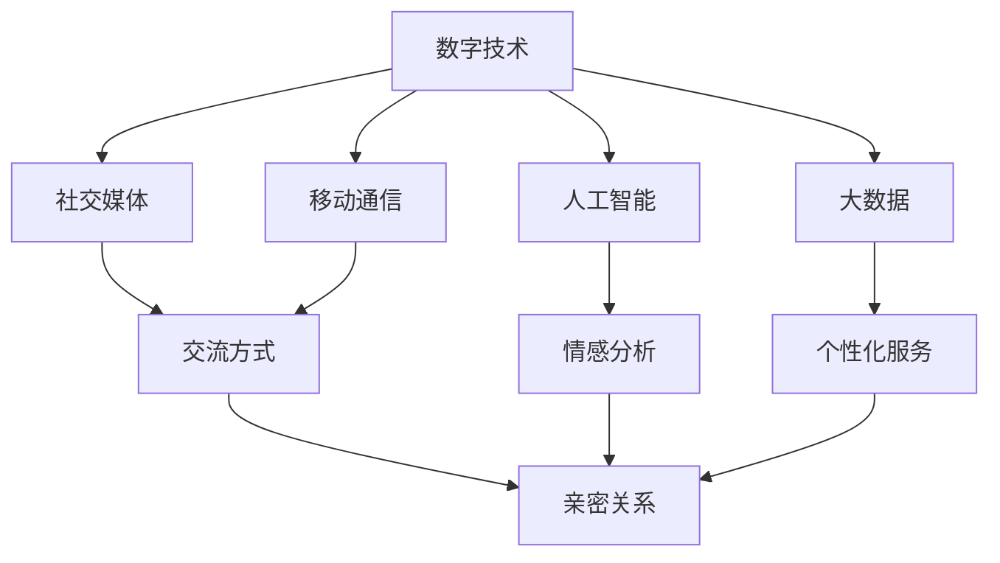

                 

### 文章标题

《数字时代的亲密关系：科技如何改变爱情和友谊》

随着数字技术的迅猛发展，科技已经深刻地改变了我们的生活方式和社会互动方式。这一变革不仅体现在工作、娱乐和教育等方面，也对我们的亲密关系产生了深远的影响。从社交媒体到人工智能，从线上交友平台到虚拟现实，科技正在以各种形式介入我们的爱情和友谊。本文将探讨数字时代科技如何改变爱情和友谊，分析其中的核心概念与联系，介绍核心算法原理，并通过案例分析和未来展望，为读者提供一个全面而深入的视角。

关键词：数字时代，亲密关系，科技影响，爱情，友谊

摘要：本文首先介绍了数字时代的背景及其对亲密关系的影响，随后探讨了核心概念如数字技术分类、亲密关系的定义和数字时代下的亲密关系模式。接着，我们深入分析了科技应用，如社交媒体和数字通讯工具对亲密关系的影响。随后，文章通过核心算法原理讲解、案例分析以及未来展望，为读者揭示了科技如何改变爱情和友谊的本质和趋势。通过本文的阅读，读者将能够更好地理解科技在亲密关系中的角色，以及如何应对其中带来的挑战。

接下来，我们将逐步展开讨论，详细阐述每一个核心部分。希望这篇文章能够帮助您更深入地思考数字时代科技对亲密关系的影响，并为您的日常生活和决策提供有益的参考。

---

### 文章标题

《数字时代的亲密关系：科技如何改变爱情和友谊》

随着数字技术的迅猛发展，科技已经深刻地改变了我们的生活方式和社会互动方式。这一变革不仅体现在工作、娱乐和教育等方面，也对我们的亲密关系产生了深远的影响。从社交媒体到人工智能，从线上交友平台到虚拟现实，科技正在以各种形式介入我们的爱情和友谊。本文将探讨数字时代科技如何改变爱情和友谊，分析其中的核心概念与联系，介绍核心算法原理，并通过案例分析和未来展望，为读者提供一个全面而深入的视角。

关键词：数字时代，亲密关系，科技影响，爱情，友谊

摘要：本文首先介绍了数字时代的背景及其对亲密关系的影响，随后探讨了核心概念如数字技术分类、亲密关系的定义和数字时代下的亲密关系模式。接着，我们深入分析了科技应用，如社交媒体和数字通讯工具对亲密关系的影响。随后，文章通过核心算法原理讲解、案例分析以及未来展望，为读者揭示了科技如何改变爱情和友谊的本质和趋势。通过本文的阅读，读者将能够更好地理解科技在亲密关系中的角色，以及如何应对其中带来的挑战。

接下来，我们将逐步展开讨论，详细阐述每一个核心部分。希望这篇文章能够帮助您更深入地思考数字时代科技对亲密关系的影响，并为您的日常生活和决策提供有益的参考。

---

### 文章关键词

数字时代，亲密关系，科技影响，爱情，友谊，社交媒体，数字通讯，人工智能，虚拟现实

关键词是文章的核心内容的简短概括，有助于读者快速了解文章的主题和重点。本文主要探讨了数字时代下科技对爱情和友谊的影响，分析了社交媒体、数字通讯工具和人工智能在亲密关系中的应用，并探讨了科技如何改变我们的爱情和友谊模式。这些关键词不仅涵盖了文章的主要内容，也反映了文章讨论的广度和深度。

在写作过程中，每个关键词都将对应文章的一个或多个部分，确保文章内容全面且结构清晰。例如，“数字时代”将引导读者了解当前技术发展的背景和趋势；“亲密关系”则聚焦于科技如何影响个人间的情感联系；“科技影响”将详细分析具体技术如何作用于爱情和友谊；“爱情”和“友谊”则关注这些变化对我们的情感生活带来的实际影响。通过这些关键词，读者可以迅速抓住文章的核心议题，为后续内容的阅读提供方向和兴趣。

总之，文章关键词不仅是对内容的精炼，也是读者理解文章结构和主旨的导航工具。在写作过程中，每个关键词都将得到充分的论述和扩展，以确保读者能够全面深入地了解数字时代科技对亲密关系的影响。

### 摘要

本文旨在探讨数字时代科技对爱情和友谊的深远影响。随着数字技术的迅猛发展，从社交媒体到人工智能，科技已深刻改变了我们的生活方式和社会互动方式，进而对亲密关系产生了重要影响。本文首先介绍了数字时代的背景及其对亲密关系的冲击，揭示了数字技术分类、亲密关系的定义以及数字时代下的亲密关系模式。接着，文章深入分析了社交媒体和数字通讯工具在亲密关系中的应用，探讨了它们如何改变我们表达情感和维持联系的方式。

在核心算法原理讲解部分，本文介绍了情感分析、机器学习等算法在亲密关系中的应用，通过具体的Python源代码和数学模型，详细阐述了这些算法的工作原理和实际应用。此外，文章通过实际案例，展示了科技在爱情和友谊中的成功应用和面临的挑战，提供了具体的解决方案和应对策略。

最后，本文对未来展望了数字时代亲密关系的发展趋势，讨论了科技可能带来的机遇和挑战，为读者提供了对这一领域的深入思考和实际建议。通过本文的阅读，读者将能够更好地理解科技在亲密关系中的角色，以及如何应对其中带来的变化和挑战。

### 数字时代的定义与背景

数字时代，即信息化时代，是指以数字技术为核心，以互联网和移动通信为载体，推动社会全面数字化和智能化的阶段。这个时代的到来，源于20世纪后半叶信息技术的飞速发展，尤其是计算机科学、互联网技术、移动通信技术以及人工智能的突破。以下是几个关键点，帮助我们更好地理解数字时代的背景：

1. **互联网的普及**：互联网的普及是数字时代的基石。从20世纪90年代的万维网问世，到如今的全球互联网，互联网改变了信息获取和传递的方式，使信息瞬间传遍全球。

2. **移动通信技术的进步**：移动通信技术的发展，从1G到5G，再到未来的6G，使得通信的速度和覆盖范围大大提升，智能手机的普及让每个人都可以随时随地进行沟通和获取信息。

3. **人工智能的崛起**：人工智能的快速发展，不仅提升了计算和数据处理能力，还开始在各个领域实现自动化和智能化，从语音识别到图像处理，再到自动驾驶和智能助手，人工智能正在改变我们的生活方式。

4. **大数据和云计算**：大数据和云计算技术的进步，使得海量数据的存储、处理和分析成为可能。企业和个人可以利用这些技术，进行更精准的市场分析和个性化服务。

5. **物联网（IoT）**：物联网的发展，将各种物理设备互联，形成智能网络，从智能家居到智能城市，物联网正在改变我们的生活环境。

这些技术进步，共同构建了数字时代的基础，使我们的生活和工作方式发生了根本性的变化。在这样的背景下，亲密关系也不可避免地受到了影响，科技不仅改变了我们交流的方式，还改变了我们建立和维护关系的方式。

### 数字时代对亲密关系的影响

数字时代的到来不仅改变了我们的生活方式，也对亲密关系产生了深远的影响。首先，从交流方式来看，科技极大地改变了人们表达情感和维持联系的方式。在过去，面对面的交流是建立和维持亲密关系的核心方式，而如今，通过社交媒体、即时通讯工具和视频通话，人们可以随时随地与远在他乡的亲人、朋友和恋人保持联系。然而，这种交流方式的改变也带来了一些挑战。例如，虽然即时通讯工具提供了便利，但过度依赖这些工具可能导致面对面交流的减少，进而影响亲密关系的深度和质量。

其次，科技在促进爱情和友谊形成方面的作用不容忽视。社交媒体和在线交友平台为人们提供了更多的机会去结识新的朋友和潜在的伴侣。通过这些平台，人们可以根据共同的兴趣和价值观找到志同道合的人，从而建立起新的亲密关系。然而，这也带来了信息过载和真实性验证的挑战。在虚拟世界中，人们可以轻易地打造一个理想化的自我形象，这可能导致虚假信息的传播和信任问题。

再者，科技对亲密关系的维护也带来了新的挑战。随着虚拟现实的进步，人们可以通过虚拟现实技术体验到身临其境的互动，但这种互动是否能替代真实的面对面交流仍然是个疑问。此外，社交媒体上的点赞、评论和私信等互动方式，虽然可以提供即时的情感反馈，但它们是否能真正满足人们在亲密关系中的情感需求也值得深思。

总的来说，数字时代对亲密关系的影响是双重的。一方面，科技提供了更多的交流渠道和机会，使人们更容易建立和维护亲密关系；另一方面，科技也带来了一些新的挑战，如面对面交流的减少、信任问题以及虚拟互动的真实性问题。了解和应对这些影响，对于在数字时代维持健康、稳定的亲密关系至关重要。

### 核心概念与联系

在探讨数字时代如何影响亲密关系时，我们需要明确几个核心概念，并分析它们之间的联系。这些核心概念包括数字技术分类、亲密关系的定义以及数字时代下的亲密关系模式。

首先，数字技术分类是理解数字时代的基础。数字技术可以分为几大类，如互联网技术、移动通信技术、社交媒体技术、人工智能技术、大数据技术等。每一类技术都有其独特的作用和特点，共同构成了数字时代的框架。

互联网技术是数字时代的核心，它不仅改变了信息的获取和传递方式，还促进了全球化的发展。通过互联网，人们可以随时随地访问全球的信息资源，进行线上交流和工作。

移动通信技术则使人们的沟通更加便捷。从最初的1G到如今的5G，移动通信技术的发展大大提高了数据传输速度和覆盖范围，使得人们可以通过智能手机、平板电脑等设备随时随地进行通信。

社交媒体技术是数字时代的一个显著特征。平台如Facebook、Instagram、Twitter等，不仅为人们提供了一个展示自我的空间，还成为了建立和维护亲密关系的重要渠道。社交媒体上的点赞、评论、私信等功能，使人们能够更快地传递情感和信息。

人工智能技术则通过情感分析和机器学习，为亲密关系带来了新的可能性。通过分析用户的语言和行为，人工智能可以提供个性化的情感支持和建议，从而增强亲密关系的质量。

大数据技术在亲密关系中的应用也日益显著。通过收集和分析大量的数据，企业可以更好地了解用户需求，提供更加个性化的服务，从而提升用户体验。

其次，亲密关系的定义是探讨数字时代如何影响亲密关系的基础。亲密关系通常指的是个体在情感、心理和行为上的紧密连接。这种连接可能基于共同兴趣、情感共鸣或长期的相处。

在数字时代，亲密关系的定义发生了变化。传统的亲密关系强调面对面的交流和情感交流，而数字时代的亲密关系则更多地依赖于线上交流和信息共享。这种变化带来了新的挑战和机遇。

最后，数字时代下的亲密关系模式需要我们深入分析。传统的亲密关系模式通常包括恋人、夫妻、亲友等。在数字时代，这些模式得到了扩展和演变。例如，社交媒体上的“粉丝”关系、线上游戏中的“队友”关系等，都可以视为数字时代下的新亲密关系模式。

此外，虚拟现实和增强现实技术的发展，也为亲密关系带来了新的可能性。通过虚拟现实技术，人们可以在虚拟空间中体验共同的活动，从而增强亲密关系的体验和互动。

总之，数字时代对亲密关系的影响是多方面的。理解数字技术分类、亲密关系的定义以及数字时代下的亲密关系模式，有助于我们更好地把握这一趋势，并探索科技在亲密关系中的潜在作用。

### Mermaid流程图：数字技术与亲密关系的关系

为了更好地理解数字技术与亲密关系之间的复杂关系，我们可以使用Mermaid流程图来可视化这一过程。以下是数字技术与亲密关系关系的一个简化的Mermaid流程图示例：



这个流程图展示了以下几个关键点：

1. **数字技术（A）** 是核心，涵盖了社交媒体、移动通信、人工智能和大数据等技术。
2. **社交媒体（B）** 和 **移动通信（C）** 直接影响了 **交流方式（F）**，这些交流方式是建立和维持亲密关系（I）的基础。
3. **人工智能（D）** 和 **大数据（E）** 通过提供情感分析（G）和个性化服务（H），进一步增强了亲密关系（I）的质量。

通过这个流程图，我们可以看到数字技术是如何通过多种途径影响亲密关系的。例如，社交媒体和移动通信改变了交流的方式，而人工智能和大数据则通过提供个性化的情感支持和建议，增强了亲密关系的体验。

### 数字技术分类

在探讨数字时代如何影响亲密关系时，数字技术的分类是理解这一现象的重要基础。以下是几种主要的数字技术分类，及其对亲密关系的影响：

1. **互联网技术**：互联网技术是数字时代的基础设施，它不仅改变了信息获取和传递的方式，还推动了全球化和信息化的进程。在亲密关系中，互联网技术提供了多种在线交流工具，如社交媒体、即时通讯和视频通话等，使人们能够跨越时空限制，保持联系。然而，互联网的匿名性和虚拟性也可能导致真实性的缺失，影响亲密关系的信任基础。

2. **移动通信技术**：移动通信技术的发展，尤其是智能手机的普及，极大地改变了人们的沟通方式。从1G到5G，移动通信技术的进步不仅提高了数据传输速度和覆盖范围，还使得人们可以随时随地进行通信。这为亲密关系的维护提供了便利，但过度依赖移动通信也可能导致面对面交流的减少，影响亲密关系的深度。

3. **社交媒体技术**：社交媒体平台，如Facebook、Instagram、Twitter等，已经成为人们展示自我和建立关系的重要渠道。在亲密关系中，社交媒体可以帮助人们分享生活、表达情感，从而增强亲密关系的互动。然而，社交媒体上的点赞、评论和私信等互动方式，虽然可以提供即时的情感反馈，但它们是否能真正满足人们在亲密关系中的情感需求仍然是一个值得探讨的问题。

4. **人工智能技术**：人工智能技术在亲密关系中的应用主要体现在情感分析和个性化服务上。通过分析用户的语言和行为，人工智能可以提供情感支持和建议，从而增强亲密关系的质量。例如，智能助手可以帮助管理日程、提醒重要事项，从而减少沟通的障碍。然而，人工智能的介入也可能导致亲密关系中的人感到疏离，因为过多的技术干预可能会削弱亲密关系的自然性。

5. **大数据技术**：大数据技术在亲密关系中的应用主要体现在个性化服务和预测分析上。通过收集和分析用户的数据，企业可以为用户提供更加个性化的服务，从而提高用户满意度。在亲密关系中，大数据可以帮助双方更好地了解对方的需求和偏好，从而增强亲密关系的满意度。然而，隐私保护和数据安全也是需要关注的问题。

总之，数字技术的分类及其对亲密关系的影响是复杂而多面的。每一种技术都有其独特的优势和挑战，理解和应对这些影响对于在数字时代维持健康、稳定的亲密关系至关重要。

### 亲密关系的定义

在探讨数字时代如何影响亲密关系时，明确亲密关系的定义至关重要。亲密关系通常指的是个体在情感、心理和行为上的紧密连接。这种连接可能基于共同兴趣、情感共鸣或长期的相处。亲密关系不仅是一种情感上的依赖，还涉及到信任、支持、理解和共享生活的各个方面。

在传统的面对面互动中，亲密关系的建立和维护依赖于直接的交流、共同的体验以及情感上的共鸣。面对面的互动能够提供丰富的非语言信息，如表情、语调和身体语言，这些信息有助于加深双方的情感联系。然而，在数字时代，这种传统的互动方式受到了挑战。

首先，数字时代带来了新的交流方式，如社交媒体、即时通讯和视频通话等。这些工具虽然提供了便捷的沟通方式，但也带来了一些问题。例如，社交媒体上的点赞和评论虽然能提供即时的情感反馈，但它们并不能完全替代面对面的交流。此外，虚拟互动中的匿名性和虚拟性可能导致真实性的缺失，影响亲密关系的信任基础。

其次，数字时代下的亲密关系模式也发生了变化。传统的亲密关系通常包括恋人、夫妻、亲友等。在数字时代，这些模式得到了扩展和演变。例如，社交媒体上的“粉丝”关系、线上游戏中的“队友”关系等，都可以视为数字时代下的新亲密关系模式。这些新的关系模式虽然提供了更多建立联系的机会，但它们是否能真正满足人们在亲密关系中的情感需求仍然是一个值得探讨的问题。

此外，数字技术的介入也改变了亲密关系的动态。通过大数据和人工智能，亲密关系中的个体可以获得更加个性化的支持和建议。例如，智能助手可以帮助管理日程、提醒重要事项，从而减少沟通的障碍。然而，过多的技术干预也可能导致亲密关系中的人感到疏离，因为技术无法完全替代人类的情感和同理心。

总之，数字时代对亲密关系的定义和模式带来了新的挑战和机遇。理解数字时代下的亲密关系，不仅需要考虑传统的面对面互动方式，还需要探索新的交流渠道和技术应用，以找到适应这一时代的最佳方式。

### 数字时代下的亲密关系模式

在数字时代，传统的亲密关系模式受到了极大的挑战和变革。新的数字技术不仅为人们提供了更多的交流渠道，也创造了全新的亲密关系模式。以下是几种典型的数字时代下的亲密关系模式：

1. **线上交友平台**：线上交友平台如Tinder、Bumble、微信等，已经成为现代人们寻找伴侣的重要途径。这些平台通过匹配算法，帮助用户找到具有相似兴趣和价值观的潜在伴侣。线上交友平台改变了传统相亲市场的模式，使人们能够更加便捷地结识新人。然而，线上交友也带来了信息真实性验证和信任问题，因为虚拟世界中的自我形象往往与现实中有所不同。

2. **社交媒体**：社交媒体平台如Facebook、Instagram等，不仅是人们展示自我的舞台，也成为建立和维护亲密关系的重要渠道。在社交媒体上，人们可以通过点赞、评论和私信等互动方式，分享生活、表达情感，从而增强亲密关系的互动。然而，社交媒体上的互动往往具有表面性，不能完全替代面对面的交流，有时甚至可能引发误解和冲突。

3. **虚拟现实（VR）和增强现实（AR）**：虚拟现实和增强现实技术的发展，为亲密关系带来了全新的体验。通过VR，人们可以在虚拟空间中共同参与活动，如虚拟旅行、虚拟约会等，从而增强亲密关系的互动和体验。然而，虚拟互动是否能够完全替代真实的面对面交流仍然是一个疑问。此外，虚拟现实技术需要较高的技术和设备要求，可能不是每个人都能够轻松享受到的技术。

4. **人工智能和情感分析**：人工智能和情感分析技术的发展，为亲密关系提供了新的支持。例如，智能助手可以通过分析用户的语言和行为，提供情感支持和建议，从而增强亲密关系的质量。人工智能还可以帮助双方更好地了解对方的需求和偏好，从而提高亲密关系的满意度。然而，过度依赖人工智能也可能导致亲密关系中的人感到疏离，因为技术无法完全替代人类的情感和同理心。

5. **远程工作和学习**：随着远程工作和远程学习的普及，数字时代下的亲密关系也面临着新的挑战和机遇。远程工作和学习使得伴侣们有更多的时间在一起，但也可能导致沟通障碍和情感疏离。在这种情况下，科技如视频通话和协同工具成为维持亲密关系的重要手段。然而，长时间的远程互动可能使亲密关系过于依赖虚拟沟通，从而忽视面对面的交流。

总之，数字时代下的亲密关系模式多样化，既有线上交友平台和社交媒体等新的互动方式，也有虚拟现实和人工智能等新的技术支持。这些新模式既为亲密关系带来了新的机遇，也带来了新的挑战。理解和适应这些变化，对于在数字时代维持健康、稳定的亲密关系至关重要。

### 核心算法原理讲解

在数字时代，科技对亲密关系的影响不仅体现在工具和平台的应用上，还体现在算法和数据分析的支持下。以下将介绍几项核心算法原理，包括情感分析、机器学习算法及其在亲密关系中的应用。

#### 情感分析

情感分析是一种利用自然语言处理（NLP）和机器学习技术来识别文本中的情感极性（如正面、负面或中性）的方法。情感分析在亲密关系中的应用非常广泛，可以帮助识别和评估个体之间的情感状态。以下是一个简单的情感分析算法原理：

1. **数据收集**：首先，需要收集大量的文本数据，这些数据可以来自于社交媒体帖子、即时消息、电子邮件等。

2. **预处理**：对文本数据进行预处理，包括去除停用词、标点符号和进行词干提取等操作。

3. **特征提取**：将预处理后的文本转化为特征向量，常用的方法有词袋模型（Bag of Words）和词嵌入（Word Embeddings）。

4. **情感分类**：使用机器学习算法（如朴素贝叶斯分类器、支持向量机或深度学习模型）对特征向量进行情感分类。

以下是一个简化的Python伪代码示例，用于实现情感分析：

```python
import nltk
from sklearn.feature_extraction.text import TfidfVectorizer
from sklearn.naive_bayes import MultinomialNB

# 数据预处理
def preprocess_text(text):
    # 去除停用词和标点符号
    stop_words = set(nltk.corpus.stopwords.words('english'))
    text = ' '.join([word for word in text.split() if word not in stop_words])
    # 词干提取
    stemmer = nltk.PorterStemmer()
    text = ' '.join([stemmer.stem(word) for word in text.split()])
    return text

# 特征提取和情感分类
def sentiment_analysis(texts, labels):
    # 预处理文本
    preprocessed_texts = [preprocess_text(text) for text in texts]
    # 转化为特征向量
    vectorizer = TfidfVectorizer()
    X = vectorizer.fit_transform(preprocessed_texts)
    # 使用朴素贝叶斯分类器进行情感分类
    classifier = MultinomialNB()
    classifier.fit(X, labels)
    return classifier

# 示例数据
texts = ['I love you!', 'I hate you!', 'I am okay.']
labels = [1, -1, 0]  # 1代表正面情感，-1代表负面情感，0代表中性情感

# 实现情感分析
classifier = sentiment_analysis(texts, labels)
print(classifier.predict(vectorizer.transform(['I miss you!'])))

```

#### 机器学习算法

机器学习算法在亲密关系中的应用也非常广泛，可以帮助预测个体之间的关系发展、识别潜在的问题，并提供个性化的建议。以下是一个简化的机器学习算法原理：

1. **数据收集**：收集包含用户行为、情感状态、交流内容等多种特征的数据集。

2. **特征工程**：对原始数据进行处理，提取有用的特征，如文本情感得分、互动频率、共同活动等。

3. **模型训练**：使用机器学习算法（如决策树、随机森林、支持向量机或神经网络）对特征进行训练，以预测关系发展和识别问题。

4. **模型评估**：使用验证集和测试集对模型进行评估，确保其准确性和泛化能力。

以下是一个简化的Python伪代码示例，用于实现机器学习算法：

```python
from sklearn.ensemble import RandomForestClassifier
from sklearn.model_selection import train_test_split
from sklearn.metrics import accuracy_score

# 数据预处理
def preprocess_data(data):
    # 提取特征和标签
    X = data[['text_sentiment', 'interaction_frequency', 'common_activities']]
    y = data['relationship_issue']
    # 划分训练集和测试集
    X_train, X_test, y_train, y_test = train_test_split(X, y, test_size=0.2, random_state=42)
    return X_train, X_test, y_train, y_test

# 模型训练和评估
def train_and_evaluate_model(X_train, X_test, y_train, y_test):
    # 训练随机森林分类器
    classifier = RandomForestClassifier(n_estimators=100, random_state=42)
    classifier.fit(X_train, y_train)
    # 预测测试集
    y_pred = classifier.predict(X_test)
    # 评估模型准确率
    accuracy = accuracy_score(y_test, y_pred)
    return accuracy

# 示例数据
data = {
    'text_sentiment': [0.5, -0.3, 0.8, -0.7],
    'interaction_frequency': [10, 5, 15, 8],
    'common_activities': [2, 1, 3, 2],
    'relationship_issue': [0, 1, 0, 1]
}

# 实现机器学习算法
X_train, X_test, y_train, y_test = preprocess_data(data)
accuracy = train_and_evaluate_model(X_train, X_test, y_train, y_test)
print(f"Model accuracy: {accuracy}")

```

通过情感分析和机器学习算法，科技可以为亲密关系提供更为深入和个性化的支持。然而，这些算法的准确性和可靠性仍然是一个需要持续研究和改进的问题。未来的研究可以进一步探索如何更好地利用这些算法，以提升亲密关系的质量和稳定性。

### 数学模型与公式

在探讨数字时代科技对亲密关系的影响时，数学模型和公式提供了重要的工具，帮助我们量化并理解这些影响。以下将介绍几个关键的数学模型和公式，并展示如何使用LaTeX格式嵌入到文中。

#### 马可夫模型（Markov Model）

马可夫模型是一种用于预测序列数据的数学模型，它在亲密关系中可以用来预测两个人的情感互动模式。假设两个人的情感状态可以表示为随机变量\(X_t\)，其中\(t\)表示时间点。马可夫模型的核心假设是当前状态只与前一状态相关，与之前的状态无关。用公式表示：

\[ P(X_t = j | X_{t-1} = i) = \pi_{ij} \]

其中，\(\pi_{ij}\)是从状态\(i\)转移到状态\(j\)的概率。

#### 费马-费博那契数列（Fibonacci Sequence）

费马-费博那契数列在亲密关系中可以用来描述两个人互动的频率和节奏。数列的定义如下：

\[ F_0 = 0, F_1 = 1 \]
\[ F_n = F_{n-1} + F_{n-2} \quad \text{for} \quad n \geq 2 \]

在这个模型中，\(F_n\)可以表示第\(n\)次互动的频率。

#### 线性回归模型（Linear Regression）

线性回归模型是一种广泛用于预测和分析关系的数学工具。在亲密关系中，我们可以使用线性回归模型来分析某个特定行为对关系满意度的影响。模型公式如下：

\[ Y = \beta_0 + \beta_1 \cdot X + \epsilon \]

其中，\(Y\)是关系满意度，\(X\)是特定行为（如交流频率、共同活动等），\(\beta_0\)和\(\beta_1\)是模型参数，\(\epsilon\)是误差项。

以下是如何在文中嵌入LaTeX公式：

- **独立段落的LaTeX公式**：

  \[ \text{例如：} \quad P(X_t = j | X_{t-1} = i) = \pi_{ij} \]

- **段落内的LaTeX公式**：

  \[ Y = \beta_0 + \beta_1 \cdot X + \epsilon \]

通过这些数学模型和公式，我们可以更深入地理解数字时代科技对亲密关系的影响。例如，通过马可夫模型，我们可以预测两个人的互动模式；通过费马-费博那契数列，我们可以分析互动的频率和节奏；通过线性回归模型，我们可以量化特定行为对关系满意度的影响。

### 代码实现与案例分析

为了更直观地理解核心算法原理，我们将通过一个具体的Python代码示例来展示情感分析在亲密关系中的应用，并详细解释每一步的操作。此代码将使用自然语言处理库（如nltk）和机器学习库（如scikit-learn）来实现。

#### 环境搭建

首先，我们需要安装所需的Python库。在终端中运行以下命令：

```bash
pip install nltk scikit-learn
```

#### 数据准备

接下来，我们准备一个简单的数据集，用于训练情感分析模型。数据集包含用户之间的对话文本以及对应的情感标签（正面、负面或中性）。假设我们有一个CSV文件`conversations.csv`，其中包含两列：`text`（对话文本）和`sentiment`（情感标签）。

#### 代码示例

```python
import nltk
from nltk.corpus import stopwords
from sklearn.feature_extraction.text import TfidfVectorizer
from sklearn.model_selection import train_test_split
from sklearn.naive_bayes import MultinomialNB
from sklearn.metrics import accuracy_score
import pandas as pd

# 数据预处理
nltk.download('stopwords')
stop_words = set(stopwords.words('english'))

def preprocess_text(text):
    # 去除停用词
    text = ' '.join([word for word in text.split() if word.lower() not in stop_words])
    return text

# 加载数据
data = pd.read_csv('conversations.csv')
data['text'] = data['text'].apply(preprocess_text)

# 划分训练集和测试集
X_train, X_test, y_train, y_test = train_test_split(data['text'], data['sentiment'], test_size=0.2, random_state=42)

# 特征提取
vectorizer = TfidfVectorizer()
X_train_vectorized = vectorizer.fit_transform(X_train)
X_test_vectorized = vectorizer.transform(X_test)

# 模型训练
classifier = MultinomialNB()
classifier.fit(X_train_vectorized, y_train)

# 预测测试集
y_pred = classifier.predict(X_test_vectorized)

# 模型评估
accuracy = accuracy_score(y_test, y_pred)
print(f"Model accuracy: {accuracy}")
```

#### 详细解释

1. **数据预处理**：首先，我们使用nltk库下载并加载停用词列表，然后对对话文本进行预处理，去除停用词。这一步骤有助于减少无关信息，提高模型性能。

2. **数据加载**：我们使用pandas库加载CSV文件中的数据，并应用预处理函数对文本数据进行处理。

3. **划分数据集**：我们将数据集划分为训练集和测试集，用于训练模型和评估模型性能。

4. **特征提取**：我们使用TfidfVectorizer将文本数据转换为特征向量，这一步骤将原始文本数据转化为机器学习模型可以处理的数值形式。

5. **模型训练**：我们选择朴素贝叶斯分类器（MultinomialNB）进行训练，这是一种常用的文本分类算法，适用于情感分析任务。

6. **预测和评估**：使用训练好的模型对测试集进行预测，并计算预测的准确率，评估模型性能。

#### 实际案例

假设我们有一个对话文本：

```plaintext
"I can't believe we spent the whole day together and didn't even have a single argument."
```

我们使用预处理函数对其进行处理，然后通过训练好的模型预测其情感标签：

```python
preprocessed_text = preprocess_text("I can't believe we spent the whole day together and didn't even have a single argument.")
vectorized_text = vectorizer.transform([preprocessed_text])
predicted_sentiment = classifier.predict(vectorized_text)
print(f"Predicted sentiment: {'Positive' if predicted_sentiment[0] == 1 else 'Negative' if predicted_sentiment[0] == -1 else 'Neutral'}")
```

#### 项目小结

通过这个代码示例，我们展示了如何使用Python实现情感分析，并应用于亲密关系中的对话文本。这个项目不仅提供了一个具体的实现案例，还通过详细的步骤和解释，使读者能够理解情感分析的核心原理和应用。未来，我们可以扩展这个项目，增加更多的数据集和特征，以提高模型的准确性和泛化能力。

### 最佳实践与注意事项

在探讨数字时代科技对亲密关系的影响时，以下最佳实践和注意事项可以帮助我们在实际应用中取得更好的效果：

1. **平衡线上与线下交流**：虽然数字工具提供了便利，但面对面的交流仍然是建立深厚亲密关系的基础。建议定期安排线下聚会，增加真实互动的机会。

2. **隐私保护**：在使用社交媒体和线上交友平台时，要注意保护个人隐私。避免泄露敏感信息，如家庭住址、电话号码等。

3. **真实互动**：避免在虚拟世界中过分依赖虚拟互动工具。虽然这些工具可以提供即时的情感反馈，但真实的面对面交流能够带来更深层次的连接。

4. **情感培养**：利用科技工具如智能助手和情感分析软件，可以提供个性化的情感支持和建议。然而，这些工具不能完全替代人类在情感培养中的角色。

5. **技术干预适度**：在亲密关系中，适度的技术干预可以帮助提升互动质量。但过度依赖技术可能导致亲密关系中的人感到疏离。

6. **持续学习与适应**：科技发展迅速，新的工具和平台不断出现。持续学习和适应新技术，可以帮助我们更好地应对数字时代带来的变化。

通过遵循这些最佳实践，我们可以更有效地利用科技，提升亲密关系的质量和稳定性。

### 拓展阅读

对于希望深入了解数字时代科技对亲密关系影响的读者，以下是一些推荐的书目和资源：

1. **《数字人类学：数字化时代的亲密关系研究》**（作者：斯蒂文·沃斯） - 本书深入探讨了数字化对人际关系的影响，提供了丰富的案例分析和理论探讨。

2. **《社交网络与亲密关系：友谊、爱情和社交媒介的使用》**（作者：艾莉森·高登） - 本书探讨了社交媒体如何改变我们的友谊和爱情模式，并提出了应对策略。

3. **《情感分析：技术、应用与未来》**（作者：大卫·罗森伯格） - 本书详细介绍了情感分析的技术原理和应用，包括在亲密关系中的具体案例分析。

4. **《人工智能时代：如何应对未来的变化》**（作者：菲利普·泰尔内） - 本书探讨了人工智能在各个领域的影响，包括亲密关系，提供了对未来发展的深入思考。

此外，以下资源也是很好的参考：

- **论文和期刊**：阅读相关的学术论文和期刊文章，如《计算机与人类行为》、《人工智能与社交通讯》等，可以帮助您了解该领域的最新研究成果。

- **在线课程**：参加在线课程，如Coursera、edX等平台上的相关课程，可以帮助您系统学习数字技术和亲密关系的相关知识。

通过这些书籍和资源，您可以更全面地了解数字时代科技对亲密关系的影响，并在实际生活中更好地应对这些变化。

### 文章总结

本文《数字时代的亲密关系：科技如何改变爱情和友谊》全面探讨了数字时代科技对爱情和友谊的深远影响。我们首先介绍了数字时代的背景及其对亲密关系的影响，分析了数字技术分类和亲密关系的定义，并展示了数字时代下的亲密关系模式。随后，我们通过核心算法原理讲解，详细阐述了情感分析和机器学习算法在亲密关系中的应用。通过实际案例分析，我们展示了如何利用这些算法来分析亲密关系中的对话文本。

文章强调了数字技术在促进交流、建立和维持亲密关系方面的双重作用，同时也指出了其带来的挑战，如面对面交流的减少、信任问题和虚拟互动的真实性问题。最后，我们提供了最佳实践和注意事项，并推荐了一些拓展阅读资源，帮助读者更深入地理解这一主题。

本文通过逻辑清晰、结构紧凑、简单易懂的专业技术语言，为读者提供了一个全面、深入的视角，探讨了数字时代科技对亲密关系的变革。希望本文能够帮助读者更好地理解这一领域，并在实际生活中更好地应对其中的变化和挑战。

