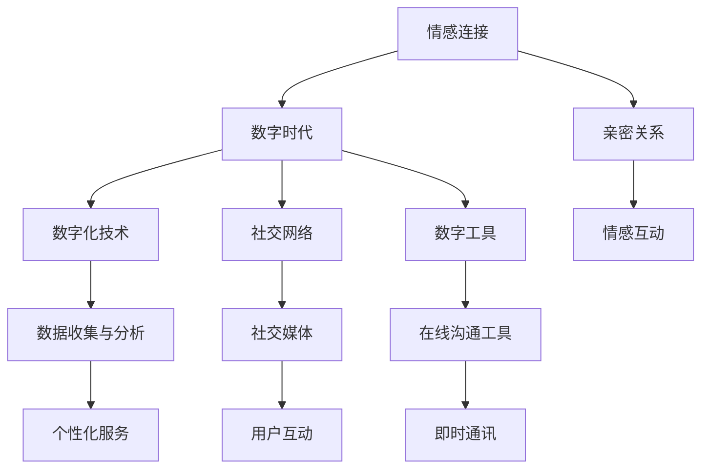

                 

### 《数字时代的情感连接：重新定义亲密关系》

关键词：数字时代、情感连接、亲密关系、社交网络、数字工具、情感分析

摘要：本文探讨了数字时代下情感连接和亲密关系的演变。随着数字化技术的普及，人们之间的情感互动方式发生了重大变化。本文分析了数字时代情感连接的核心要素，探讨了数字技术对亲密关系的影响，以及如何利用数字工具来维护和发展亲密关系。通过具体的案例和实践，提出了数字时代下的情感沟通和亲密关系维护策略，并展望了数字时代情感连接的未来。

---

## 《数字时代的情感连接：重新定义亲密关系》目录大纲

### 第一部分：情感连接的数字时代背景

#### 第1章：数字时代与情感连接
1.1 数字时代的社会变革
1.2 情感连接的数字时代背景
1.3 数字技术在情感连接中的应用

#### 第2章：情感连接的核心要素
2.1 情感连接的定义与特点
2.2 情感连接的核心要素
2.3 情感连接与亲密关系的关联

### 第二部分：数字时代下的亲密关系

#### 第3章：数字技术对亲密关系的影响
3.1 数字技术对亲密关系的影响
3.2 数字时代下的亲密关系挑战
3.3 重建数字时代下的亲密关系

#### 第4章：情感连接的数字工具与平台
4.1 社交媒体与情感连接
4.2 情感交流的数字平台
4.3 数字工具在情感连接中的应用案例

#### 第5章：情感连接的数字障碍与应对
5.1 数字障碍对情感连接的影响
5.2 克服数字障碍的策略
5.3 数字时代的情感素养培养

### 第三部分：数字时代的亲密关系实践

#### 第6章：数字时代的情感沟通
6.1 数字时代下的情感沟通技巧
6.2 情感沟通的数字工具应用
6.3 数字时代下的情感沟通案例

#### 第7章：数字时代的亲密关系维护
7.1 数字时代下的亲密关系维护策略
7.2 数字工具在亲密关系维护中的应用
7.3 数字时代下的亲密关系维护案例

#### 第8章：数字时代的情感教育与成长
8.1 数字时代的情感教育
8.2 情感成长与数字工具的关系
8.3 数字时代的情感教育与成长实践

### 第四部分：未来展望与反思

#### 第9章：数字时代情感连接的展望
9.1 数字时代情感连接的发展趋势
9.2 数字时代情感连接的潜在影响
9.3 数字时代情感连接的未来展望

#### 第10章：数字时代的情感反思
10.1 数字时代下的情感反思
10.2 情感连接与数字时代的平衡
10.3 数字时代的情感责任与反思

### 附录

#### 附录A：情感连接的数字工具与应用资源
A.1 数字工具与应用资源介绍
A.2 情感连接的数字工具使用指南
A.3 情感连接的数字工具案例分析

## 核心概念与联系
### 情感连接、数字时代、亲密关系

- 情感连接：人与人之间基于情感而产生的互动与联系。
- 数字时代：以数字化技术为核心的社会发展阶段。
- 亲密关系：人与人之间基于信任、依赖与共享情感的状态。

### Mermaid 流程图


## 核心算法原理讲解

- Python 源代码示例：
```python
import numpy as np

# 情感分析算法示例
def sentiment_analysis(text):
    # 假设已经训练好的情感分析模型
    model = ...
    # 输入文本处理
    processed_text = preprocess_text(text)
    # 情感分析
    sentiment = model.predict(processed_text)
    return sentiment

# 文本预处理
def preprocess_text(text):
    # 文本清洗、分词、去停用词等操作
    processed_text = ...
    return processed_text

# 示例
text = "我今天很开心，因为我通过了考试。"
sentiment = sentiment_analysis(text)
print(f"文本情感分析结果：{sentiment}")
```

## 数学模型和数学公式

### 情感连接强度模型
$$
I = \alpha \cdot D + \beta \cdot T
$$
其中，$I$ 表示情感连接强度，$D$ 表示情感互动的频率，$T$ 表示情感互动的时间长度，$\alpha$ 和 $\beta$ 分别是互动频率和时间长度的权重系数。

### 情感连接稳定性模型
$$
S = \frac{I}{V}
$$
其中，$S$ 表示情感连接的稳定性，$I$ 表示情感连接强度，$V$ 表示情感连接的变量范围。

---

### 第一部分：情感连接的数字时代背景

#### 第1章：数字时代与情感连接

在现代社会中，数字化技术已成为我们日常生活不可或缺的一部分。从智能手机、社交媒体到在线购物和远程工作，数字化技术极大地改变了我们的生活方式。这一变革不仅影响了经济活动、信息传播和文化交流，还对人际关系和情感连接产生了深远影响。

1.1 数字时代的社会变革

数字时代的到来，标志着人类社会的又一次重大变革。这一变革主要体现在以下几个方面：

1. 信息爆炸：互联网的普及使得信息传播速度加快，信息量呈指数级增长。人们可以随时随地获取大量的信息，这极大地改变了我们的知识获取方式和思维方式。

2. 社交模式转变：社交媒体和即时通讯工具的兴起，改变了人们社交的方式。传统的面对面的社交逐渐被线上交流所取代，人们可以通过网络与远在千里之外的朋友保持联系。

3. 工作方式变革：远程工作和数字化办公技术的应用，使人们的工作方式更加灵活。不再受限于时间和地点，工作效率也得到了显著提高。

1.2 情感连接的数字时代背景

数字时代为情感连接带来了新的机遇和挑战。在数字时代，情感连接具有以下特点：

1. 空间距离的削弱：通过互联网和社交媒体，人们可以与远在他乡的亲友保持实时联系，空间距离不再成为情感连接的障碍。

2. 情感互动的多样性：数字工具提供了多种情感互动方式，如文字、语音、视频等，使得情感表达更加丰富和立体。

3. 情感表达的局限性：虽然数字工具提供了多样的情感表达方式，但在某些方面仍存在局限性，如非语言沟通的缺失可能影响情感传递的准确性。

1.3 数字技术在情感连接中的应用

数字技术为情感连接提供了多种应用场景，主要包括以下几个方面：

1. 社交媒体：社交媒体平台如Facebook、Instagram等，成为人们表达情感、分享生活的重要工具。用户可以通过发布状态、照片和视频来传递情感。

2. 在线沟通工具：即时通讯工具如WhatsApp、微信等，提供了实时、便捷的沟通方式。用户可以通过文字、语音和视频进行情感交流。

3. 情感分析技术：利用自然语言处理和机器学习技术，可以对用户在网络上的情感表达进行量化分析，从而了解他们的情感状态。

4. 虚拟现实（VR）和增强现实（AR）：通过VR和AR技术，人们可以在虚拟空间中与亲友进行沉浸式的情感互动，增强情感体验。

#### 第2章：情感连接的核心要素

2.1 情感连接的定义与特点

情感连接是指人与人之间基于情感而产生的互动与联系。情感连接具有以下特点：

1. 情感驱动：情感连接是由情感驱动的，情感是连接的基础。情感可以包括快乐、悲伤、愤怒、爱、信任等。

2. 双向性：情感连接是双向的，需要双方都参与其中，才能形成有效的情感互动。

3. 动态性：情感连接是动态的，会随着时间和情境的变化而变化。

2.2 情感连接的核心要素

情感连接的核心要素包括以下几个方面：

1. 情感表达：情感表达是指个体通过语言、行为、面部表情等方式来表达情感。有效的情感表达是建立和维护情感连接的关键。

2. 情感理解：情感理解是指个体能够理解和感受他人的情感。情感理解有助于建立信任和共鸣，是情感连接的重要基础。

3. 情感互动：情感互动是指个体之间通过情感交流而产生的互动。情感互动可以增进理解和信任，加强情感连接。

2.3 情感连接与亲密关系的关联

情感连接与亲密关系之间存在紧密的联系。亲密关系是指人与人之间基于信任、依赖与共享情感的状态。情感连接是亲密关系的重要基础，以下是它们之间的关联：

1. 情感连接是建立亲密关系的前提。没有情感连接，很难形成亲密关系。

2. 情感连接的强度和稳定性影响亲密关系的质量和稳定性。情感连接越强，亲密关系越稳定。

3. 情感连接的多样性可以丰富亲密关系的内涵。不同的情感连接方式可以为亲密关系带来新的体验和乐趣。

### 第二部分：数字时代下的亲密关系

#### 第3章：数字技术对亲密关系的影响

数字技术在改变我们生活方式的同时，也对亲密关系产生了深远的影响。数字技术的普及使得人们之间的情感互动变得更加便捷和多样化，但同时也带来了一系列挑战。

3.1 数字技术对亲密关系的影响

1. 积极影响：

   - **增强联系**：数字技术使得人们可以随时随地保持联系，缩短了空间距离，增强了情感连接。

   - **丰富互动**：数字工具提供了多样的互动方式，如文字、语音、视频等，丰富了情感表达和互动体验。

   - **提升效率**：远程工作和数字化办公技术使得伴侣可以更加灵活地安排时间，减少因工作原因而导致的情感疏离。

2. 消极影响：

   - **情感疏离**：过度依赖数字工具可能导致面对面沟通的减少，影响情感连接的质量。

   - **隐私和安全问题**：数字平台上的隐私和安全问题可能导致信任危机，影响亲密关系的稳定性。

   - **数字成瘾**：对数字工具的过度依赖可能导致成瘾行为，影响个人的情感健康和亲密关系的稳定性。

3.2 数字时代下的亲密关系挑战

1. **沟通障碍**：数字工具虽然提供了便捷的沟通方式，但在某些情况下，如非语言沟通的缺失，可能导致沟通障碍，影响情感连接。

2. **情感疏离**：随着社交网络的普及，人们可能将更多的精力投入到虚拟社交中，而忽视了现实中的亲密关系，导致情感疏离。

3. **数字成瘾**：数字成瘾行为，如过度使用社交媒体、沉迷游戏等，可能影响个体的情感健康和亲密关系的稳定性。

3.3 重建数字时代下的亲密关系

1. **增强面对面沟通**：尽管数字工具提供了便捷的沟通方式，但面对面沟通仍然是建立和维护亲密关系的重要手段。伴侣应尽量减少对数字工具的依赖，增加现实中的互动。

2. **培养情感理解**：情感理解是亲密关系的重要基础。伴侣应学会倾听和理解对方的情感需求，增强情感互动。

3. **制定数字使用规则**：伴侣应共同制定数字使用规则，合理安排使用时间，避免数字工具对亲密关系的影响。

4. **关注个体情感健康**：个体情感健康是亲密关系稳定性的基础。伴侣应关注彼此的情感需求，提供情感支持，共同成长。

### 第4章：情感连接的数字工具与平台

在数字时代，各种数字工具和平台极大地丰富了人们的情感连接方式。这些工具和平台不仅提供了便捷的沟通手段，还促进了情感的互动和表达。

4.1 社交媒体与情感连接

社交媒体是数字时代情感连接的重要平台，如Facebook、Instagram、Twitter等。它们具有以下特点：

- **实时性**：社交媒体支持实时更新，用户可以第一时间分享自己的生活动态和情感状态。

- **互动性**：社交媒体上的点赞、评论、分享等功能，促进了用户之间的情感互动。

- **多样性**：用户可以通过文字、图片、视频等多种形式表达情感，丰富了情感连接的内容。

案例：Facebook上的情感分享和互动

Facebook是一个广泛使用的社交媒体平台，用户可以在个人主页上分享自己的情感状态。例如，用户可能会发布一条关于自己喜悦的消息，并配上一张照片，朋友们可以通过点赞、评论等方式表达他们的支持和关心。这种互动不仅增强了用户之间的情感连接，还提高了社区的凝聚力。

4.2 情感交流的数字平台

除了社交媒体，还有专门用于情感交流的数字平台，如在线聊天室、论坛和情感咨询平台。这些平台具有以下特点：

- **私密性**：这些平台通常提供较为私密的空间，用户可以在不受干扰的环境中表达情感。

- **专业性**：一些情感交流平台还提供专业咨询师的服务，帮助用户解决情感问题。

- **多样性**：用户可以通过文字、语音、视频等多种形式进行情感交流，满足不同的需求。

案例：在线聊天室的情感交流

在线聊天室是另一个常见的情感交流平台，用户可以匿名进入聊天室，与其他用户进行实时聊天。这种平台提供了匿名性和私密性，用户可以更加自由地表达自己的情感。例如，一位用户可能会在聊天室中分享自己的烦恼和忧虑，其他用户可以提供支持和建议。这种互动有助于缓解用户的情感压力，增强情感连接。

4.3 数字工具在情感连接中的应用案例

除了社交媒体和情感交流平台，还有许多其他数字工具在情感连接中发挥着重要作用，如即时通讯工具、虚拟现实（VR）和增强现实（AR）等。

- **即时通讯工具**：如微信、WhatsApp等，提供了便捷、快速的沟通方式，用户可以通过文字、语音、视频进行情感交流。

- **虚拟现实（VR）**：VR技术可以创建一个虚拟的环境，用户可以在这个环境中与亲友进行沉浸式的情感互动。

- **增强现实（AR）**：AR技术可以将虚拟元素叠加到现实世界中，用户可以通过AR设备与虚拟角色进行互动，增强情感体验。

案例：虚拟现实（VR）的情感互动

虚拟现实（VR）技术为人们提供了一个全新的情感互动方式。例如，用户可以通过VR设备进入一个虚拟的房间，与远在千里之外的亲友进行面对面的交流。这种互动不仅打破了空间距离的限制，还提供了更加丰富和真实的情感体验。用户可以在虚拟环境中一起观看电影、玩游戏，甚至共同完成一些任务，增强了彼此之间的情感连接。

通过以上案例可以看出，数字工具和平台在情感连接中发挥着重要作用。它们不仅提供了多样的情感表达和互动方式，还丰富了人们的情感体验。然而，在享受数字带来的便利的同时，我们也应关注数字技术对亲密关系的潜在影响，确保情感连接的质量和稳定性。

#### 第5章：情感连接的数字障碍与应对

尽管数字技术为我们提供了丰富的情感连接工具和平台，但在实际应用中，仍存在一些数字障碍影响着情感连接的质量。这些障碍主要包括隐私和安全问题、数字依赖以及数字鸿沟等。为了克服这些障碍，我们需要采取一系列策略和措施。

5.1 数字障碍对情感连接的影响

1. **隐私和安全问题**：在数字时代，个人隐私和安全问题日益突出。人们在社交媒体和其他数字平台上分享个人信息，可能面临隐私泄露和数据滥用的风险。这种不安全感可能导致用户对情感交流的抵触，影响情感连接的质量。

2. **数字依赖**：数字工具的便捷性和即时性使得一些人过度依赖数字沟通，忽视了现实生活中的人际互动。这种依赖可能导致情感连接的单一化和表面化，影响亲密关系的深度和稳定性。

3. **数字鸿沟**：数字鸿沟是指不同群体在获取和使用数字技术方面的差异。在情感连接中，数字鸿沟可能导致一些用户无法充分享受数字工具带来的便利，从而影响他们与他人建立情感连接的机会。

5.2 克服数字障碍的策略

1. **提高数字素养**：提高用户的数字素养是克服数字障碍的重要策略。这包括了解数字工具的正确使用方法、保护个人隐私和安全的知识，以及如何平衡数字生活与现实生活。

   - **隐私设置**：用户应学会如何设置社交媒体和其他数字平台的隐私选项，以保护自己的个人信息不被滥用。

   - **安全意识**：用户应保持警惕，避免在数字平台上泄露敏感信息，避免陷入网络诈骗等风险。

2. **限制数字使用时间**：为了减少数字依赖，用户可以设定一定的数字使用时间限制，鼓励自己更多地参与现实生活中的社交活动。

   - **时间管理**：制定合理的日程安排，将一部分时间用于面对面交流，减少对数字工具的依赖。

   - **心理调适**：培养数字使用后的放松习惯，如进行户外运动、阅读等，以缓解数字使用带来的心理压力。

3. **促进数字包容**：为了缩小数字鸿沟，社会应采取措施促进数字包容，确保所有群体都能平等地享受数字技术带来的便利。

   - **数字普及教育**：通过教育提高公众的数字素养，帮助更多人掌握数字工具的使用技巧。

   - **政策支持**：政府和企业可以提供经济支持和技术支持，帮助贫困和弱势群体获取数字设备和服务。

5.3 数字时代的情感素养培养

除了上述策略，培养数字时代的情感素养也是克服数字障碍的重要一环。情感素养包括情感表达、情感理解和情感管理等方面的能力。以下是一些建议：

1. **情感表达能力**：用户应学会如何有效地表达自己的情感，包括通过文字、语音和视频等多种形式。

   - **情感写作**：通过写日记或博客记录自己的情感体验，提高情感表达能力。

   - **情感演讲**：通过参加演讲和辩论等活动，锻炼情感表达的能力。

2. **情感理解能力**：用户应学会倾听和理解他人的情感，建立情感共鸣。

   - **倾听技巧**：学会倾听他人的情感需求，避免打断和误解。

   - **情感共鸣**：通过体验他人的情感经历，增进对他人情感的理解和共鸣。

3. **情感管理能力**：用户应学会如何管理自己的情感，保持情感稳定。

   - **情绪调节**：通过冥想、瑜伽等放松技巧，调节情绪，保持情感稳定。

   - **情感冲突处理**：学会有效地处理情感冲突，避免情感波动对亲密关系的影响。

通过上述策略和措施，我们可以克服数字时代带来的情感连接障碍，促进情感连接的质量和稳定性，为数字时代的亲密关系奠定坚实基础。

### 第三部分：数字时代的亲密关系实践

#### 第6章：数字时代的情感沟通

数字时代的情感沟通为人们提供了多种便捷的方式，但同时也带来了一系列挑战。有效利用数字工具和平台，掌握合适的沟通技巧，有助于提升情感沟通的质量。

6.1 数字时代下的情感沟通技巧

1. **倾听与回应**：在数字沟通中，倾听和回应是建立情感连接的关键。用户应学会认真倾听对方的情感表达，并及时给予回应，以表达关注和理解。

   - **主动倾听**：避免在对方讲话时分散注意力，全身心投入倾听。
   - **及时回应**：对方发言后，及时给予反馈，如“我理解你的感受”或“你的想法很有道理”。

2. **情感表达**：在数字沟通中，文字和符号可能无法完全传达情感，因此用户需要学会如何有效地使用文字和表情符号来表达情感。

   - **文字表达**：使用简洁、明确的文字描述自己的情感状态，避免模糊和含糊的表达。
   - **表情符号**：恰当使用表情符号，如开心、难过等，以增强情感表达的直观性。

3. **非语言沟通**：尽管数字工具无法完全替代面对面的非语言沟通，但用户可以通过视频通话等方式，尽可能模拟非语言沟通的效果。

   - **面部表情**：在视频通话中，保持微笑和亲切的表情，以传达积极的情感。
   - **身体语言**：通过适当的肢体动作，如点头、手势等，表达认同和支持。

6.2 情感沟通的数字工具应用

1. **即时通讯工具**：如微信、WhatsApp等，提供了实时、便捷的沟通方式。用户可以通过文字、语音、视频等多种形式进行情感交流。

   - **文字聊天**：适合简单、直接的沟通，适用于日常交流。
   - **语音通话**：适合深入、细致的沟通，能够更好地传达情感。
   - **视频通话**：适合亲密互动，能够模拟面对面的沟通效果。

2. **社交媒体**：如Facebook、Instagram等，用户可以通过发布状态、照片和视频来分享情感，与他人互动。

   - **情感分享**：通过发布自己的生活动态，表达情感状态，与他人建立共鸣。
   - **互动评论**：通过回复和评论，参与他人的情感表达，增进互动。

3. **情感咨询平台**：如线上心理咨询、情感咨询等，提供了专业的情感支持和服务。

   - **心理咨询**：用户可以在线寻求专业的情感咨询，解决情感问题。
   - **情感交流**：通过参与线上讨论和咨询，与其他用户分享情感经验，获得支持和建议。

6.3 数字时代下的情感沟通案例

1. **远程恋爱**：随着远程工作的普及，许多恋人选择通过数字工具保持联系。通过视频通话、即时通讯等方式，他们能够定期见面，分享彼此的生活和工作。

   - **案例**：一对恋人，一个在纽约，一个在伦敦，他们通过视频通话和微信保持联系。每天晚上，他们会通过视频通话互道晚安，分享当天的情感和经历。

2. **情感互助**：一些用户通过社交媒体和在线聊天室，寻求情感支持和建议。

   - **案例**：一位用户在Facebook上创建了一个情感互助群组，成员们可以匿名分享自己的情感困扰，获得其他成员的支持和鼓励。

通过有效的情感沟通技巧和数字工具的应用，用户可以在数字时代建立和维护亲密关系，增强情感连接。尽管数字工具有其局限性，但合理利用它们，可以弥补面对面沟通的不足，提升情感沟通的质量。

#### 第7章：数字时代的亲密关系维护

在数字时代，维护亲密关系需要更多的努力和策略。数字工具提供了丰富的资源和方法，帮助我们保持情感的联系和互动。以下是一些关键策略和应用案例，帮助我们在数字时代有效地维护亲密关系。

7.1 数字时代下的亲密关系维护策略

1. **定期沟通**：定期与伴侣进行沟通是维护亲密关系的基础。即使是在远程工作或异地恋的情况下，也可以通过电话、视频通话或即时通讯工具保持联系。

   - **具体行动**：每周设定一个固定的“情侣时间”，无论是视频通话还是面对面交流，确保双方都有充足的时间分享生活和情感。

2. **情感表达**：在数字沟通中，情感表达尤为重要。通过文字、语音和表情符号等多种方式，真诚地表达自己的情感和想法。

   - **具体行动**：每天晚上发送一条温馨的短信或语音消息，分享当天的感受或感谢对方的支持。

3. **共同兴趣**：在数字平台上找到共同兴趣，如观看同一部电影、参加在线游戏或参加线上活动，增强互动和情感连接。

   - **具体行动**：一起观看Netflix上的热门剧集，讨论剧情和感受，或者一起参加线上读书会。

4. **隐私保护**：在数字沟通中，保护彼此的隐私和安全感至关重要。

   - **具体行动**：设置社交媒体隐私，确保只有信任的亲密朋友能够查看你的个人状态。

7.2 数字工具在亲密关系维护中的应用

1. **即时通讯工具**：如微信、WhatsApp等，提供了便捷的沟通渠道，适合日常的情感交流和日常事务的处理。

   - **应用案例**：通过微信的语音消息，伴侣可以随时随地分享自己的情感状态，增强亲密感。

2. **社交媒体**：如Facebook、Instagram等，可以作为展示生活片段和分享快乐时刻的平台。

   - **应用案例**：伴侣可以在Facebook上分享彼此的旅行照片或生活点滴，让彼此感受到在对方生活中的存在。

3. **共享应用**：如Google日历、Trello等，可以帮助伴侣共同管理日常事务和计划未来的活动。

   - **应用案例**：伴侣可以通过Google日历同步彼此的日程，确保不会错过重要的约会或活动。

4. **虚拟现实（VR）**：VR技术可以模拟亲密互动，为远程伴侣提供更加真实的情感体验。

   - **应用案例**：使用VR技术，远程伴侣可以共同观看虚拟旅游体验，仿佛亲临现场。

7.3 数字时代下的亲密关系维护案例

1. **异地恋情侣的日常维护**：

   - **案例**：一对异地恋情侣，每天晚上都会进行30分钟的视频通话，分享当天的经历和感受。他们还使用Trello来规划共同兴趣和未来的旅行计划。

2. **繁忙工作者的亲密关系维护**：

   - **案例**：一对忙碌的职场人士，每周会安排一次深度的对话时间，通过语音消息分享日常的点滴和情感。他们还会在周末一起在线观看电影，享受共同的时间。

通过上述策略和数字工具的应用，数字时代下的亲密关系维护成为可能。尽管面临挑战，但通过定期沟通、情感表达、共同兴趣和隐私保护，伴侣可以保持情感连接，共同成长。

#### 第8章：数字时代的情感教育与成长

在数字时代，情感教育不仅关系到个体的心理健康，也直接影响着亲密关系的质量。数字工具为情感教育提供了新的途径，同时也带来了一些挑战。通过有效的情感教育和成长实践，我们可以更好地应对数字时代带来的变化。

8.1 数字时代的情感教育

情感教育是帮助个体认识、理解和管理自己情感的过程。在数字时代，情感教育具有以下特点：

1. **个性化**：数字工具可以根据个体的需求和兴趣提供个性化的情感教育资源，如在线课程、心理测试和情感分析工具。

2. **互动性**：数字平台支持用户之间的互动和交流，通过在线讨论和分享，个体可以更好地理解和表达自己的情感。

3. **实时性**：数字工具可以实时提供情感支持和反馈，帮助个体及时处理情感问题。

8.2 情感成长与数字工具的关系

数字工具在情感成长中起着关键作用，具体体现在以下几个方面：

1. **情感表达**：数字工具提供了多种表达情感的方式，如文字、语音和视频，帮助个体更好地表达和处理自己的情感。

2. **情感理解**：通过在线课程和心理测试，个体可以更深入地了解自己的情感状态和他人情感，增强情感理解能力。

3. **情感管理**：数字工具提供了情感管理的工具和技巧，如冥想应用、情绪日记和情感调节训练，帮助个体更好地管理自己的情感。

8.3 数字时代的情感教育与成长实践

1. **在线情感课程**：参加在线情感课程，如情绪管理、冲突解决和亲密关系课程，可以帮助个体提升情感知识和技能。

2. **情感社交平台**：加入情感社交平台，参与情感讨论和互助小组，与他人分享情感经验和建议，获得支持和理解。

3. **情感分析工具**：利用情感分析工具，如社交媒体的情感分析应用和情绪监测设备，了解自己的情感状态，进行自我反思和调整。

4. **家庭情感教育**：家庭成员一起参与情感教育，通过互动和讨论，共同成长和提升情感素养。

案例：一位年轻的女性通过参加在线情绪管理课程，学会了如何更好地处理工作压力和家庭矛盾。她通过在线讨论和分享，与其他学员交流经验和心得，从中获得了许多实用的技巧和建议。这不仅提高了她的情感素养，也改善了她的亲密关系。

通过数字时代的情感教育与成长实践，个体可以更好地理解和管理自己的情感，提升情感素养，从而促进个人成长和亲密关系的健康发展。

### 第四部分：未来展望与反思

#### 第9章：数字时代情感连接的展望

随着数字化技术的不断进步，数字时代下的情感连接将呈现出新的趋势和特点。以下是数字时代情感连接的发展趋势、潜在影响以及未来展望：

9.1 数字时代情感连接的发展趋势

1. **情感互动的智能化**：人工智能和自然语言处理技术的发展，将使得情感互动更加智能化和个性化。例如，智能助手可以更好地理解用户的情感需求，提供个性化的情感支持。

2. **情感表达的多样化**：虚拟现实（VR）和增强现实（AR）技术的应用，将带来更加丰富和沉浸式的情感表达方式。用户可以在虚拟环境中进行更加真实和互动的情感交流。

3. **情感连接的全球化**：互联网的普及和跨国合作的加强，将使得全球范围内的情感连接变得更加紧密。人们可以跨越地域和文化差异，建立跨文化的情感联系。

9.2 数字时代情感连接的潜在影响

1. **积极影响**：数字时代将使情感连接更加便捷和多样化，人们可以更加轻松地维护和扩展亲密关系。同时，数字化技术还可以为心理健康提供新的工具和方法，如在线心理咨询和情感分析应用。

2. **消极影响**：数字工具的过度使用可能影响面对面沟通的质量，导致情感疏离。此外，数字鸿沟的存在可能导致一些用户无法充分享受数字技术带来的便利，影响情感连接的平等性。

9.3 数字时代情感连接的未来展望

1. **情感科技的发展**：随着情感科技的不断进步，未来将有更多智能化的情感工具和平台问世，为情感连接提供更丰富的选择和体验。

2. **情感教育的普及**：情感教育将在数字时代得到更广泛的关注和推广，帮助个体更好地理解和管理自己的情感，提升整体情感素养。

3. **情感连接的平衡**：在数字时代，如何在享受数字便利的同时，保持情感连接的平衡，将成为一个重要的课题。通过制定合理的数字使用规则和提升情感素养，我们可以更好地应对这一挑战。

#### 第10章：数字时代的情感反思

随着数字技术的不断渗透，我们的情感生活也在悄然发生变化。在这个充满变革的时代，我们需要深入反思数字时代对情感的影响，以及如何平衡数字生活与现实生活的情感需求。

10.1 数字时代下的情感反思

1. **情感连接的质量**：在数字时代，尽管我们可以随时随地与他人保持联系，但这种联系的质量是否真正满足了我们的情感需求？我们需要反思，数字工具是否真正促进了我们与他人的情感共鸣和深度互动。

2. **情感表达的准确性**：数字工具提供了多种情感表达方式，但有时文字和符号无法完全传达我们的情感。我们需要思考，如何在数字沟通中更加准确地表达自己的情感，以及如何理解和回应他人的情感。

3. **情感依赖的平衡**：在享受数字工具带来的便利的同时，我们如何保持情感依赖的平衡，避免过度依赖数字工具，忽视现实生活中的情感互动？

10.2 情感连接与数字时代的平衡

1. **合理使用数字工具**：我们需要合理使用数字工具，避免沉迷于虚拟世界，忽视现实生活中的情感互动。通过制定数字使用规则，合理安排使用时间，我们可以更好地平衡数字生活与现实生活。

2. **提升情感素养**：通过情感教育和自我提升，我们可以更好地理解和管理自己的情感，提高情感沟通的能力。这有助于我们在数字时代中建立和维护高质量的亲密关系。

3. **重视面对面互动**：尽管数字工具提供了便捷的沟通方式，但面对面互动仍然是建立和维护亲密关系的重要手段。我们需要尽量减少对数字工具的依赖，增加现实生活中的情感互动。

10.3 数字时代的情感责任与反思

1. **情感责任的承担**：在数字时代，我们不仅要对自己和他人负责，还要对数字平台和工具负责。我们需要思考，如何在数字世界中维护个人隐私和信息安全，避免情感被滥用。

2. **情感反思的习惯**：我们需要培养情感反思的习惯，定期审视自己的情感状态和情感互动，确保我们的情感需求得到满足。

3. **情感教育的推广**：社会应更加重视情感教育，通过教育提高公众的数字素养和情感素养，为数字时代的情感生活提供有力的支持。

通过反思数字时代对情感的影响，我们可以更好地认识自己的情感需求，找到情感连接与数字时代的平衡点，提升情感生活的质量。

### 附录

#### 附录A：情感连接的数字工具与应用资源

A.1 数字工具与应用资源介绍

在数字时代，许多数字工具和应用可以帮助我们更好地建立和维护情感连接。以下是一些常用的数字工具和应用：

1. **社交媒体平台**：如Facebook、Instagram、Twitter等，提供了便捷的情感分享和互动平台。
2. **即时通讯工具**：如微信、WhatsApp、Slack等，支持实时沟通和消息传递。
3. **在线聊天室**：如Reddit、Discord等，提供了匿名和私密的情感交流空间。
4. **情感分析工具**：如IBM Watson、Google Cloud Natural Language API等，可以分析文本情感，帮助我们了解他人的情感状态。
5. **虚拟现实（VR）和增强现实（AR）应用**：如Facebook Horizon、谷歌Cardboard等，提供了沉浸式的情感互动体验。

A.2 情感连接的数字工具使用指南

以下是一些使用数字工具的指南，帮助您更好地建立和维护情感连接：

1. **社交媒体**：定期发布和分享情感状态，参与朋友互动，关注感兴趣的话题。
2. **即时通讯**：及时回复消息，保持与亲友的日常沟通，分享生活中的点滴。
3. **在线聊天室**：参与讨论，寻求支持和建议，结识志同道合的朋友。
4. **情感分析**：通过分析他人的文本情感，更好地理解他们的情感状态，提供相应的支持和关心。
5. **VR和AR**：尝试虚拟现实和增强现实应用，与亲友一起体验沉浸式的情感互动。

A.3 情感连接的数字工具案例分析

以下是一些情感连接的数字工具案例分析：

1. **案例一：Facebook**
   - 用户分享生活动态，如旅行照片、美食体验等，与他人互动和分享快乐。
   - 用户在生日或特殊日子里收到朋友们的祝福和礼物，感受到关爱和温暖。

2. **案例二：微信**
   - 用户通过语音和视频通话与亲友保持实时联系，分享日常生活中的喜怒哀乐。
   - 用户通过微信群组与朋友讨论共同兴趣，增强互动和情感连接。

3. **案例三：Reddit**
   - 用户在Reddit的情感讨论区分享自己的情感困扰，获得其他用户的支持和建议。
   - 用户参与情感互助小组，共同探讨情感问题，互相鼓励和支持。

通过这些案例分析，我们可以看到数字工具在情感连接中的实际应用和效果。合理使用这些工具，可以有效地建立和维护情感连接，提升亲密关系的质量。

