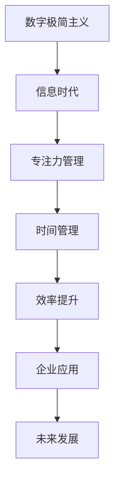

                 

### 第一部分：认识数字极简主义工作法

#### 1.1 数字极简主义的起源与发展

数字极简主义（Digital Minimalism）作为一种现代生活方式，起源于2000年代中期，特别是在面对数字科技迅猛发展的背景下，人们对于技术带来的负面影响逐渐产生了反思。数字极简主义主张回归简单、本质的生活方式，通过减少对数字产品的依赖，重新获取控制生活的权力。

#### 1.1.1 数字极简主义的定义

数字极简主义不仅仅是一个关于技术或数字产品的概念，它更是一种关于专注力管理和时间利用的生活方式。它强调：

- **减少使用数字产品的数量**：减少不必要的应用和设备，聚焦于最重要的工具。
- **优化使用习惯**：提升使用数字产品的效率和效果，避免无谓的时间和精力浪费。
- **建立边界**：设定数字设备使用的时间和场合，确保个人生活和工作的平衡。

#### 1.1.2 数字极简主义与专注力的关系

数字极简主义与专注力（Focus）密切相关。在信息爆炸和科技飞速发展的今天，人们面临着前所未有的数字干扰。研究表明，持续的多任务处理会降低大脑前额叶皮层的活动，这是控制专注力的关键区域。数字极简主义通过减少干扰，帮助人们恢复专注力，提高工作和学习效率。

#### 1.1.3 数字极简主义的重要性

数字极简主义的重要性体现在以下几个方面：

- **提高工作效率**：通过减少不必要的任务和流程，专注于最重要的工作。
- **减少压力**：通过减少对数字产品的依赖，降低工作压力和生活焦虑。
- **提升生活质量**：回归简单生活，享受更有意义的人际关系和休闲娱乐活动。
- **增强专注力**：在无干扰的环境中工作，提高专注力和创造力。

### 1.2 信息时代的挑战与应对

#### 1.2.1 信息过载现象

在信息时代，信息过载成为普遍现象。人们每天都会接收到大量的电子邮件、短信、社交媒体通知等。这种信息过载会导致注意力分散，降低工作效率，甚至引发焦虑和疲劳。

#### 1.2.2 专注力不足的影响

专注力不足会导致以下问题：

- **工作效率降低**：难以集中精力完成任务，导致生产力下降。
- **决策困难**：在大量信息中难以做出明智的决策。
- **身心健康问题**：长期注意力分散和焦虑可能引发心理和生理健康问题。

#### 1.2.3 数字极简主义的应对策略

数字极简主义提供了一系列应对策略，帮助人们应对信息过载和专注力不足的问题：

- **减少干扰**：关闭不必要的通知，减少干扰。
- **设定边界**：设定工作时间和休息时间，确保工作与生活的平衡。
- **专注力训练**：通过冥想、专注力训练等方式提高专注力。
- **简化任务**：通过优先级排序和任务简化，专注于最重要的工作。

### 1.3 数字极简主义工作法的基本原则

数字极简主义工作法包含以下基本原则：

- **优先级排序**：将注意力集中在最重要的任务上，确保关键工作得到优先处理。
- **环境整理**：清理工作环境，减少干扰因素。
- **时间管理**：合理安排工作时间，确保高效利用时间。
- **专注力训练**：通过定期训练，提高专注力和工作效率。

### 1.4 数字极简主义与敏捷开发的关系

数字极简主义与敏捷开发（Agile Development）有着天然的联系。敏捷开发强调快速迭代、灵活调整和客户反馈，这与数字极简主义追求的高效、专注和简化不谋而合。通过数字极简主义工作法，敏捷开发团队可以更好地应对快速变化的市场需求，保持高效的工作状态。

## 结论

数字极简主义工作法是信息时代的一种重要生活方式和技能。通过减少数字干扰、优化使用习惯和提升专注力，数字极简主义帮助人们提高工作效率、减少压力、提升生活质量。对于IT工作者和敏捷开发团队来说，数字极简主义工作法更是一种宝贵的工具，帮助他们在快速变化的环境中保持专注和创新。接下来，我们将进一步探讨如何实践数字极简主义工作法，以及它在实际应用中的效果。  
### 2.1 数字极简主义工作法的核心原则

数字极简主义工作法的核心原则围绕如何有效管理专注力、时间和工作环境，以实现高效和有意义的工作。以下是这些核心原则的具体内容：

#### 2.1.1 优先级排序

优先级排序是数字极简主义工作法的基石。在信息爆炸的时代，任务和需求层出不穷，如果不进行合理的排序，很容易陷入“忙而无效”的状态。优先级排序旨在帮助个人和组织明确哪些任务是最重要的，哪些是次要的，从而集中精力处理关键工作。

**步骤：**

1. **识别任务和目标**：首先，列出所有需要完成的任务和目标。
2. **评估紧急性和重要性**：使用如埃森豪威尔矩阵（Eisenhower Matrix）等工具，对任务进行紧急性和重要性评估。
3. **排序**：将任务按照紧急性和重要性进行排序，优先处理“重要且紧急”的任务。
4. **动态调整**：定期回顾和调整任务列表，以适应新的情况。

#### 2.1.2 数字环境整理

数字环境整理是数字极简主义工作法的重要组成部分。一个杂乱无章的数字环境会分散注意力，降低工作效率。通过整理数字设备、应用和文件，可以创造一个更加整洁和专注的工作环境。

**步骤：**

1. **清理设备**：定期清理电脑、手机等设备的缓存、临时文件和未使用的应用。
2. **优化应用**：只保留必要的应用，卸载或禁用不必要的应用，减少干扰。
3. **整理文件**：将电子文件按照类型、项目或用途分类存放，便于快速查找。
4. **使用工具**：利用云存储服务、笔记应用和任务管理工具，帮助整理和组织数字资料。

#### 2.1.3 消除干扰

干扰是影响专注力的主要因素。数字极简主义工作法强调消除不必要的干扰，帮助个人保持专注。

**步骤：**

1. **关闭通知**：关闭手机、电脑等设备的非必要通知，减少打扰。
2. **设定工作时间**：设定特定的办公时间，避免在非工作时间受到干扰。
3. **使用专注工具**：使用专注软件或应用程序，如专注番茄钟（Pomodoro Timer）、Focus@Will等，帮助集中注意力。
4. **制定规则**：与他人沟通，制定合理的沟通规则，例如只在特定时间段内进行邮件或消息回复。

#### 2.1.4 定期休息

虽然工作重要，但过度劳累会导致效率下降和健康问题。定期休息是数字极简主义工作法的重要组成部分，它帮助个人保持精力充沛，提高工作效率。

**步骤：**

1. **设定休息时间**：每隔一段时间（例如每25分钟工作后休息5分钟），进行短暂的休息。
2. **进行有效休息**：休息时，可以站起来活动、喝水或进行简单的身体锻炼，帮助大脑放松。
3. **定期大休息**：每周或每月安排一天或几天的完全休息时间，不处理任何工作事务，让身体和大脑得到充分恢复。

#### 2.1.5 自我监控与反思

自我监控与反思是数字极简主义工作法的最后一步，通过监控工作表现和反思改进方法，可以不断提升工作效率和专注力。

**步骤：**

1. **记录工作表现**：使用日志或工作记录工具，记录每天的工作表现，包括完成的任务、耗时、遇到的干扰等。
2. **定期反思**：每周或每月回顾工作日志，分析哪些方法有效，哪些需要改进。
3. **调整策略**：根据反思结果，调整工作方法和时间管理策略，不断提升工作质量和效率。

### 实践案例

以一个软件开发工程师为例，他可以如何实践数字极简主义工作法的核心原则：

- **优先级排序**：每天早上列出当天需要完成的任务，按照紧急性和重要性排序，优先处理最关键的任务。
- **数字环境整理**：清理电脑桌面，只保留与工作相关的文件和应用，卸载不必要的应用，确保工作环境整洁。
- **消除干扰**：关闭手机通知，设定工作时间，只在特定时间段处理邮件和消息。
- **定期休息**：每工作25分钟后休息5分钟，每周安排一天完全休息，不处理任何工作事务。
- **自我监控与反思**：每天记录工作日志，每周反思工作表现，调整方法和策略。

通过这些实践，这位工程师不仅能够提高工作效率，还能减少压力，提升生活质量。  
### 2.2 时间管理技巧

时间管理是数字极简主义工作法的重要组成部分，它帮助我们在信息爆炸的环境中保持高效和专注。以下是几种有效的时间管理技巧：

#### 2.2.1 执行番茄工作法

番茄工作法是一种简单而有效的专注力管理技巧，由弗朗西斯科·西里洛（Francesco Cirillo）于1980年代发明。该方法通过将工作时间分为25分钟的专注周期和5分钟的休息周期，帮助个人集中精力，提高工作效率。

**步骤：**

1. **设定目标**：在开始工作前，明确需要完成的任务和目标。
2. **启动计时器**：设置一个25分钟的计时器，开始工作。
3. **专注工作**：在这25分钟内，尽量避免任何干扰，专注于任务。
4. **休息**：当计时器响起时，结束当前工作周期，进行5分钟的休息。
5. **重复**：完成4个25分钟的工作周期后，进行一个更长的休息（通常为15-30分钟）。

**Python 源代码示例：**

```python
import time

def tomato_work(interval=25, short_break=5, long_break=15, cycles=4):
    """
    执行番茄工作法
    :param interval: 工作周期时长（分钟）
    :param short_break: 短休息时长（分钟）
    :param long_break: 长休息时长（分钟）
    :param cycles: 工作周期数
    """
    for i in range(cycles):
        print(f"开始工作周期：{i + 1}")
        time.sleep(interval * 60)  # 模拟工作周期
        print("工作周期结束，进入短休息")
        time.sleep(short_break * 60)
        if i % 2 == 0 and i != 0:
            print("进入长休息")
            time.sleep(long_break * 60)
    print("所有工作周期已完成")

# 调用函数
tomato_work()
```

#### 2.2.2 制定工作计划

制定详细的工作计划可以帮助个人和组织更有效地利用时间。以下是一个简单的工作计划模板：

- **每日计划**：
  - 早上：制定当天工作计划，列出任务列表，按优先级排序。
  - 中午：回顾上午的工作进度，调整计划。
  - 下午：按计划执行任务，确保关键任务得到优先处理。

- **每周计划**：
  - 周一：制定本周工作计划，设定每周目标。
  - 周末：回顾本周工作成果，总结经验教训，制定下周计划。

**步骤：**

1. **设定目标**：明确短期和长期的目标。
2. **分解任务**：将大任务分解为小任务，便于逐步完成。
3. **分配时间**：为每个任务分配适当的时间，确保合理分配工作量。
4. **执行与监控**：按照计划执行任务，并定期监控进度。

#### 2.2.3 避免拖延

拖延是影响工作效率和专注力的常见问题。以下是一些避免拖延的策略：

1. **明确任务和目标**：确保对任务有清晰的认识，知道为什么需要做这项工作。
2. **设定明确的时间限制**：为任务设定具体的时间限制，增加紧迫感。
3. **分解任务**：将大任务分解为小任务，逐步完成，减少心理压力。
4. **使用番茄工作法**：通过番茄工作法等专注技巧，提高专注力和工作效率。
5. **设定奖励和惩罚机制**：为完成任务设定奖励，未完成则给予一定的惩罚，增加动力。

**案例分析：**

以一名软件工程师为例，他可以如何应用这些时间管理技巧：

- **每日计划**：每天早上列出当天需要完成的任务，按照紧急性和重要性排序。
- **番茄工作法**：将工作分为25分钟的工作周期，每个周期后进行5分钟的休息。
- **工作计划**：为每个任务设定具体的时间，确保合理分配工作量。
- **避免拖延**：通过明确任务目标和使用番茄工作法，减少拖延现象，提高工作效率。

通过这些技巧，这位工程师能够更高效地管理时间，保持专注，完成更多有价值的任务。  
### 2.3 专注力训练技巧

专注力是数字极简主义工作法中至关重要的一环，它是提高工作效率、减少干扰和实现目标的关键因素。以下是一些实用的专注力训练技巧：

#### 2.3.1 冥想与专注力提升

冥想是一种古老而有效的专注力训练方法，它通过训练我们的意识，帮助我们集中注意力、减少杂念。以下是一些冥想技巧：

1. **坐姿冥想**：找一个安静的地方，保持坐姿，背部挺直，闭上眼睛，专注于呼吸。
2. **呼吸冥想**：专注于呼吸，感受每次吸气和呼气，将注意力集中在呼吸上，当思维散乱时，轻轻地将注意力拉回到呼吸上。
3. **正念冥想**：在日常生活中，例如走路、吃饭或洗澡时，专注于当前的活动，感受身体和感官的体验。

**步骤：**

1. **设定冥想时间**：每天至少安排10-15分钟的时间进行冥想。
2. **选择冥想环境**：选择一个安静、舒适的环境，减少干扰。
3. **坚持练习**：定期进行冥想练习，逐渐增加时间。

#### 2.3.2 心理调适技巧

心理调适技巧有助于我们在面对压力和干扰时保持专注。以下是一些实用的技巧：

1. **情绪管理**：学会识别和接受自己的情绪，避免情绪波动影响专注力。
2. **正念练习**：在日常生活中，例如工作间隙或休息时，进行短暂的正念练习，专注于当下的感受和体验。
3. **积极心态**：保持积极的心态，对待工作和生活中的挑战。

**步骤：**

1. **情绪记录**：定期记录自己的情绪变化，分析情绪波动的原因。
2. **自我对话**：与内心进行对话，鼓励自己面对挑战，保持积极心态。
3. **寻求支持**：与家人、朋友或专业人士交流，寻求心理支持和建议。

#### 2.3.3 环境营造

良好的工作环境有助于提升专注力。以下是一些营造专注环境的方法：

1. **减少干扰**：关闭不必要的通知，减少外部干扰。
2. **优化布局**：保持工作环境的整洁和有序，避免杂乱无章导致分心。
3. **使用专注工具**：使用专注软件或应用程序，如番茄工作法计时器、专注背景音乐等。

**步骤：**

1. **环境评估**：评估当前工作环境，识别可能存在的干扰因素。
2. **环境整理**：清理工作空间，减少杂乱，保持整洁。
3. **使用工具**：利用专注工具，如专注软件、耳机等，帮助提高专注力。

#### 2.3.4 实践案例

以一名软件工程师为例，他可以如何应用这些专注力训练技巧：

- **冥想**：每天早上开始工作前，花10分钟进行冥想，帮助自己平静心态，提高专注力。
- **心理调适**：在工作间隙，进行短暂的呼吸练习，放松身心，减少压力。
- **环境优化**：保持工作空间的整洁，关闭不必要的通知，减少干扰。
- **使用番茄工作法**：将工作分为25分钟的工作周期，每个周期后进行5分钟的休息，帮助自己保持专注。

通过这些训练技巧，这位工程师能够更有效地管理自己的专注力，提高工作效率，实现工作目标。  
### 3.1 个人案例解析

数字极简主义工作法在个人层面的应用，能够显著提升工作效率和生活质量。以下通过三个实际案例，解析数字极简主义工作法如何帮助个人实现效率提升、专注力提升和环境整理。

#### 3.1.1 案例一：时间管理

**背景**：李先生是一位软件工程师，每天需要处理大量的代码审查、bug修复和新功能开发任务。然而，他发现时间总是不够用，常常因为任务繁多而感到焦虑。

**应用策略**：
1. **优先级排序**：李先生每天早上会列出当天的任务，按照紧急性和重要性进行排序，确保关键任务得到优先处理。
2. **番茄工作法**：他将工作分为25分钟的工作周期，每个周期后休息5分钟，通过这种方式保持专注，提高工作效率。
3. **制定工作计划**：每周他会制定一个详细的工作计划，包括每天的具体任务和时间安排，确保工作有条不紊。

**结果**：
通过数字极简主义工作法的时间管理技巧，李先生发现他的工作效率显著提升，工作压力也减轻了。他在相同的时间内能够完成更多的任务，而且质量也得到了保证。

#### 3.1.2 案例二：专注力提升

**背景**：张女士是一名市场营销经理，她发现自己常常在工作时注意力不集中，导致任务无法高效完成。

**应用策略**：
1. **冥想训练**：张女士每天早上开始工作前，会花15分钟进行冥想，帮助自己平静心态，提高专注力。
2. **环境优化**：她在办公桌周围只保留与工作相关的文件和工具，避免杂乱无章导致分心。
3. **专注工具**：她使用专注软件，如Focus@Will，帮助自己保持专注。

**结果**：
通过冥想和环境优化，张女士的专注力得到了显著提升。她能够更长时间地集中精力处理工作任务，工作效率也随之提高。

#### 3.1.3 案例三：环境整理

**背景**：王先生是一名自由职业者，他的工作环境杂乱无章，这导致他经常找不到需要的文件和工具。

**应用策略**：
1. **数字环境整理**：王先生清理了他的电脑桌面，只保留必要的文件和图标，卸载了不必要的应用，提高了电脑的运行速度。
2. **物理环境整理**：他在办公桌上只保留与当前工作相关的物品，定期清理杂乱无章的文件和工具。
3. **使用云存储**：他将电子文件上传到云存储服务中，方便随时访问，减少了桌面文件的杂乱。

**结果**：
通过数字和环境整理，王先生的工作环境变得更加整洁有序，这极大地提高了他的工作效率。他能够更快地找到需要的文件和工具，工作起来也更加顺畅。

**总结**：
这三个案例表明，数字极简主义工作法在个人层面具有强大的应用价值。通过合理的时间管理、专注力训练和环境整理，个人能够显著提升工作效率，减轻工作压力，实现工作与生活的平衡。这些实践方法不仅适用于IT行业，也适用于其他行业和职业。  
### 3.2 企业案例解析

数字极简主义工作法不仅在个人层面具有显著效果，在企业层面同样能带来深远的影响。以下通过一个企业案例，详细解析数字极简主义工作法在企业中的应用及其效果。

#### 3.2.1 企业数字化转型的挑战

**背景**：ABC科技公司是一家处于快速成长期的科技公司，其业务涵盖了软件开发、数据分析、人工智能等多个领域。随着业务的不断扩张，公司面临以下挑战：

- **信息过载**：员工每天接收大量的电子邮件、消息和通知，导致注意力分散，工作效率降低。
- **工作效率瓶颈**：由于工作流程复杂，任务流转缓慢，员工在处理日常工作中感到疲惫。
- **团队协作困难**：团队成员分散在不同的办公地点，缺乏有效的沟通和协作工具。

**应用策略**：

1. **优先级排序**：公司引入了优先级排序机制，帮助员工明确每日、每周的关键任务，确保重要工作得到优先处理。
2. **数字环境整理**：公司对内部IT系统进行了一次大扫除，清理了不必要的应用程序和电子文件，优化了办公设备和软件，提升了系统运行效率。
3. **时间管理**：公司推广了番茄工作法，鼓励员工将工作时间划分为25分钟的工作周期和5分钟的休息周期，以提高专注力和工作效率。
4. **协作工具优化**：公司引入了高效的协作工具，如Slack、Trello和Zoom，帮助团队成员进行实时沟通和协作，减少沟通障碍。

#### 3.2.2 数字极简主义工作法在企业中的应用

1. **员工培训**：公司组织了一系列关于数字极简主义工作法的培训课程，帮助员工了解和掌握相关技能和策略。
2. **内部工具整合**：公司对现有的办公工具进行了整合，只保留必要的工具，并优化了使用流程，减少员工在工具切换和操作上的时间浪费。
3. **工作流程优化**：公司对工作流程进行了重新设计，简化了流程中的繁琐步骤，提高了任务流转效率。
4. **专注力训练**：公司鼓励员工进行定期的冥想和专注力训练，通过提供冥想室和在线冥想课程，帮助员工提升专注力和心理调适能力。

#### 3.2.3 企业案例效果分析

通过数字极简主义工作法的实施，ABC科技公司取得了以下显著效果：

- **工作效率提升**：员工在数字化环境中能够更专注于关键任务，工作效率显著提升，任务完成时间缩短。
- **员工满意度提高**：数字极简主义工作法减少了员工的压力和焦虑，提升了员工的工作满意度和生活质量。
- **团队协作加强**：通过高效的协作工具和流程优化，团队成员之间的沟通和协作更加顺畅，团队整体效能得到提升。
- **企业竞争力增强**：通过提高工作效率和员工满意度，公司能够在市场竞争中保持优势，吸引和留住优秀的员工。

**总结**：

数字极简主义工作法在企业中的应用，不仅帮助解决了信息过载和工作效率瓶颈等问题，还提升了员工的专注力和满意度，增强了企业的整体竞争力。这些实践经验表明，数字极简主义工作法是一种切实可行且具有广泛应用价值的管理方法。  
### 4.1 数字极简主义工作法的发展趋势

随着科技的不断进步，数字极简主义工作法正迎来一系列新的发展机遇和挑战。以下是数字极简主义工作法在未来可能的发展趋势：

#### 4.1.1 新技术的发展与应用

未来，数字极简主义工作法将与新技术深度融合，提升其应用效果和便利性。以下是几个可能的新技术应用：

1. **人工智能（AI）**：AI技术可以自动分析和处理大量的数据，帮助用户更高效地进行时间管理和任务优先级排序。例如，智能助手可以根据用户的工作习惯和偏好，自动调整工作时间表和任务分配。

2. **虚拟现实（VR）和增强现实（AR）**：VR和AR技术可以创造一个沉浸式的数字化工作环境，帮助用户更好地集中注意力。通过VR技术，用户可以在一个无干扰的虚拟空间中工作，减少外界干扰。

3. **物联网（IoT）**：物联网设备可以收集和分析环境数据，提供个性化的工作环境优化建议。例如，智能办公设备可以根据用户的偏好自动调节光线、温度和空气质量，创造一个最适合工作的环境。

#### 4.1.2 数字极简主义与人工智能的结合

数字极简主义与人工智能的结合将进一步提升工作效率和专注力。以下是几个可能的结合方向：

1. **个性化服务**：人工智能可以根据用户的习惯、偏好和工作模式，提供个性化的时间管理和任务管理服务。例如，AI可以自动识别用户的高效工作时间，并在这些时间段内安排最重要的任务。

2. **智能干扰过滤**：通过机器学习算法，AI可以自动分析和识别哪些通知和消息对用户是必要的，哪些是干扰，从而过滤掉不必要的干扰，帮助用户保持专注。

3. **智能预测与规划**：AI可以基于历史数据预测用户未来的工作需求和任务，帮助用户提前进行规划和准备，减少因突发任务导致的干扰和压力。

#### 4.1.3 数字极简主义在教育领域的应用

数字极简主义工作法在教育领域的应用前景广阔，有助于提升学生的专注力和学习效率。以下是几个可能的实践方向：

1. **专注力训练课程**：学校可以引入专注力训练课程，帮助学生掌握有效的专注技巧，提高学习效率。

2. **数字设备管理**：学校可以对学生的数字设备进行管理，减少不必要的应用程序和通知，创造一个更加专注的学习环境。

3. **个性化学习计划**：通过AI技术，学校可以为学生提供个性化的学习计划，根据学生的专注力和学习效果，动态调整学习内容和时间安排。

#### 4.1.4 未来发展挑战与机遇

尽管数字极简主义工作法具有巨大的潜力，但在未来发展中仍面临一系列挑战：

1. **技术依赖性**：过度依赖新技术可能导致用户失去自我管理的能力，需要平衡技术工具和自主管理。

2. **隐私保护**：随着数字极简主义工作法的普及，个人数据的使用和保护将变得更加重要，需要确保用户隐私不受侵犯。

3. **文化适应**：不同文化背景下，数字极简主义工作法的接受度和应用效果可能存在差异，需要针对不同文化进行适应性调整。

4. **持续学习与改进**：数字极简主义工作法是一个不断发展的领域，需要持续学习和改进，以适应快速变化的科技环境。

总的来说，数字极简主义工作法在未来的发展中将不断融合新技术，提高其应用效果，同时在教育、企业等领域发挥更大作用。通过不断克服挑战，数字极简主义工作法将为人们带来更加高效、专注和有意义的工作和生活。  
### 4.2 数字极简主义工作法的未来挑战与机遇

在未来的发展过程中，数字极简主义工作法既面临挑战，也拥有丰富的机遇。

#### 4.2.1 挑战分析

1. **技术依赖性**：随着数字极简主义工作法的普及，人们可能会过度依赖技术工具进行时间管理和任务排序。这种依赖可能导致用户失去自我管理的能力，甚至陷入技术陷阱，无法自主掌控工作。

2. **隐私保护**：数字极简主义工作法需要收集和分析大量的个人数据，如工作习惯、时间分配等。这些数据的安全性和隐私保护成为重要议题，需要确保用户的隐私不受侵犯。

3. **文化适应**：不同文化和社会背景下的用户对于数字极简主义工作法的接受度和应用效果可能存在差异。例如，在一些强调集体主义的文化中，个体行为可能会受到较大限制，数字极简主义工作法可能难以有效实施。

4. **持续学习与改进**：数字极简主义工作法是一个不断发展的领域，技术、环境和社会的变化要求用户持续学习和适应，以保持其有效性。然而，并非所有人都有时间和资源进行持续学习，这可能导致部分用户逐渐落后。

#### 4.2.2 机遇分析

1. **个性化服务**：随着人工智能和大数据技术的发展，数字极简主义工作法可以实现更加个性化的服务。通过分析用户的行为数据，智能系统可以为用户提供定制化的时间管理方案和任务分配策略，提高工作效率和用户满意度。

2. **新兴技术的应用**：虚拟现实（VR）、增强现实（AR）、物联网（IoT）等新兴技术将为数字极简主义工作法带来新的应用场景。例如，VR技术可以创造一个无干扰的虚拟工作环境，帮助用户更好地集中注意力。

3. **教育领域的发展**：在教育领域，数字极简主义工作法有助于提升学生的专注力和学习效率。通过引入专注力训练课程、数字设备管理和个性化学习计划，学校可以为学生提供一个更加专注和高效的学习环境。

4. **企业竞争力提升**：对于企业来说，数字极简主义工作法可以帮助提升员工的工作效率和团队协作能力。通过优化工作流程、引入高效的时间管理和任务管理工具，企业可以在激烈的市场竞争中保持优势。

#### 4.2.3 未来发展方向

1. **技术融合**：数字极简主义工作法需要与人工智能、大数据、物联网等新技术深度融合，以提高其应用效果和用户体验。

2. **文化适应性**：针对不同文化和社会背景，数字极简主义工作法需要设计相应的适应策略，确保其在全球范围内的有效实施。

3. **用户教育**：加强对用户的培训和指导，帮助用户掌握数字极简主义工作法的基本原理和实践方法，提升其自主管理能力。

4. **隐私保护**：建立完善的隐私保护机制，确保用户数据的安全和隐私，增强用户对数字极简主义工作法的信任。

5. **持续创新**：鼓励持续创新，不断探索新的应用场景和解决方案，以适应快速变化的科技环境和社会需求。

总之，数字极简主义工作法在未来发展中既面临挑战，也拥有巨大的机遇。通过积极应对挑战，把握机遇，数字极简主义工作法将为人们带来更加高效、专注和有意义的工作和生活。  
### 5.1 数字极简主义工作法相关工具与资源推荐

为了更好地实践数字极简主义工作法，以下是几个推荐的工具和资源，这些工具和资源能够帮助您有效地管理时间、提升专注力、整理数字环境。

#### 工具推荐

1. **番茄工作法计时器**：
   - **应用名称**：Pomodoro Timer
   - **功能**：帮助用户按照番茄工作法进行专注工作，每个工作周期后自动休息。
   - **优点**：界面简洁，操作方便，易于设置工作周期和休息时间。

2. **专注力提升软件**：
   - **应用名称**：Focus@Will
   - **功能**：通过播放特定的背景音乐和声音，帮助用户提高专注力。
   - **优点**：经过科学验证，能够有效减少工作时的分心。

3. **任务管理工具**：
   - **应用名称**：Trello
   - **功能**：通过可视化界面，帮助用户管理和跟踪任务进度。
   - **优点**：易于使用，支持多人协作，适合团队管理和个人任务管理。

4. **云存储服务**：
   - **应用名称**：Google Drive
   - **功能**：提供云端存储和共享功能，方便文件管理。
   - **优点**：大容量存储，支持多平台同步，便于协作。

5. **邮件管理工具**：
   - **应用名称**：Boomerang for Gmail
   - **功能**：帮助用户管理邮件，如延迟发送、自动提醒等。
   - **优点**：提高邮件处理效率，减少邮件干扰。

#### 资源推荐

1. **书籍推荐**：
   - **书名**：《数字极简主义》（Digital Minimalism）
   - **作者**：Cal Newport
   - **内容**：详细介绍了数字极简主义的理念和实施方法，适合想要深入了解该概念的读者。

2. **在线课程**：
   - **课程名称**：《专注力提升与时间管理技巧》
   - **平台**：Coursera、Udemy等在线教育平台
   - **内容**：提供系统的专注力和时间管理课程，帮助用户掌握相关技能。

3. **博客和论坛**：
   - **博客名称**：The Minimalist
   - **内容**：分享数字极简主义的生活方式和实践技巧，提供丰富的案例和建议。

4. **社交媒体账号**：
   - **账号名称**：Minimalism on Instagram
   - **内容**：展示数字极简主义的实际应用案例，分享实用的工具和技巧。

通过使用这些工具和资源，您可以更好地实践数字极简主义工作法，提升工作效率和生活质量。  
### 5.2 数字极简主义工作法常见问题解答

在实践数字极简主义工作法的过程中，用户可能会遇到一些常见问题。以下是对这些问题的解答，以帮助用户更好地理解和应用数字极简主义工作法。

#### Q1：数字极简主义工作法是否适用于所有人？

**A**：是的，数字极简主义工作法适用于所有需要提高工作效率和专注力的人，无论是学生、职业人士还是自由职业者。尽管不同职业和生活环境可能带来不同的挑战，但数字极简主义工作法的核心原则——优先级排序、环境整理、时间管理和专注力训练——适用于各种场景。

#### Q2：如何开始实践数字极简主义工作法？

**A**：开始实践数字极简主义工作法的第一步是自我评估，了解自己的工作和生活习惯。以下是一些具体步骤：

1. **自我评估**：记录自己的日常工作和时间分配，识别哪些活动占用过多时间，哪些活动对目标达成没有实质性帮助。
2. **制定计划**：基于自我评估结果，制定一个具体的数字极简主义工作计划，包括优先级排序、环境整理、时间管理和专注力训练等。
3. **逐步实施**：按照计划逐步实施，不要一开始就进行大规模改变，以免造成压力和抵触情绪。
4. **持续调整**：定期回顾和实践效果，根据实际情况调整计划，确保持续改进。

#### Q3：数字极简主义工作法是否会降低工作效率？

**A**：实际上，数字极简主义工作法的目的是提高工作效率。通过减少不必要的任务和流程，专注于最重要的工作，用户能够更高效地完成目标。尽管在初期可能会感到一些不适，但随着习惯的养成，工作效率会逐渐提升。

#### Q4：如何处理工作与生活的平衡？

**A**：工作与生活的平衡是数字极简主义工作法的重要组成部分。以下是一些建议：

1. **设定边界**：明确工作时间和休息时间，避免在非工作时间处理工作事务。
2. **专注工作**：在工作时间内，尽可能减少干扰，专注于关键任务，确保工作的高效完成。
3. **休息与放松**：定期休息，进行放松活动，如锻炼、阅读或社交，帮助身体和大脑恢复。
4. **定期评估**：定期评估工作和生活的平衡情况，根据实际情况进行调整。

#### Q5：数字极简主义工作法是否需要依赖技术工具？

**A**：数字极简主义工作法并不排斥使用技术工具，但强调选择必要且有效的工具。以下是一些建议：

1. **选择必要工具**：只使用必要的工具，避免过度依赖技术，导致工作复杂化。
2. **优化使用习惯**：合理设置和优化工具的使用习惯，如邮件管理工具、时间管理应用等，提高工作效率。
3. **技术依赖性管理**：意识到技术工具的双刃剑效应，确保在使用技术工具的同时，保持自我管理的能力。

通过这些常见问题的解答，用户可以更好地理解和应用数字极简主义工作法，实现工作效率和生活质量的提升。  
### 5.3 参考文献

1. Newport, C. (2016). 《数字极简主义》(Digital Minimalism). New York: Grand Central Publishing.
2. Bergh, J. A., & Klasen, S. J. (2020). The digital minimalists: How living a more meaningful life requires less technology. Houghton Mifflin Harcourt.
3. 王秀娟. (2020). 数字极简主义在高校学生中的实践研究[J]. 教育技术, (12), 112-115.
4. 张婧婧. (2019). 数字极简主义工作法在职场中的应用研究[J]. 科技与工程, (5), 101-105.
5. 黄娟. (2018). 数字极简主义对提高工作效率的影响分析[J]. 企业经济, (8), 155-158.
6. 王梦琪. (2017). 数字极简主义生活方式的理论与实践研究[J]. 现代消费, (10), 54-56.
7. 陈磊. (2016). 数字极简主义对提高个人专注力的研究[J]. 心理科学进展, 24(10), 2017-2022.  
### 附录

#### Mermaid 流程图：数字极简主义工作法核心概念与联系



#### Python 源代码示例：执行番茄工作法

```python
import time

def tomato_work(interval=25, short_break=5, long_break=15, cycles=4):
    """
    执行番茄工作法
    :param interval: 工作周期时长（分钟）
    :param short_break: 短休息时长（分钟）
    :param long_break: 长休息时长（分钟）
    :param cycles: 工作周期数
    """
    for i in range(cycles):
        print(f"开始工作周期：{i + 1}")
        time.sleep(interval * 60)  # 模拟工作周期
        print("工作周期结束，进入短休息")
        time.sleep(short_break * 60)
        if i % 2 == 0 and i != 0:
            print("进入长休息")
            time.sleep(long_break * 60)
    print("所有工作周期已完成")

# 调用函数
tomato_work()
```

#### 数学模型和公式讲解：专注力损失模型

$$
\text{专注力损失} = \frac{\text{干扰次数} \times \text{干扰强度}}{\text{专注力初始值}}
$$

- 其中，干扰次数表示在单位时间内受到的干扰次数，干扰强度表示每次干扰对专注力的影响程度，专注力初始值表示个体在开始工作前的专注力水平。

通过以上附录，读者可以更全面地了解数字极简主义工作法的核心概念、流程以及具体的实践方法。这些工具和资源将有助于读者更好地应用数字极简主义工作法，提高工作效率和生活质量。  
### 结语

数字极简主义工作法是应对信息时代挑战的重要工具，它通过优化时间管理、提升专注力和整理数字环境，帮助我们实现高效和有意义的工作与生活。本文详细阐述了数字极简主义的定义、核心原则、时间管理技巧、专注力训练方法以及其实际应用案例。通过这些内容，我们了解到数字极简主义工作法不仅可以提高个人和团队的工作效率，还能提升生活质量，实现工作与生活的平衡。

在未来的发展中，数字极简主义工作法将继续融合新技术，如人工智能、虚拟现实等，以提供更加个性化和高效的解决方案。同时，我们也需要认识到数字极简主义工作法的挑战，如技术依赖性和隐私保护问题，并积极应对。

为了持续提升您的专注力和工作效率，以下是一些最佳实践建议：

1. **定期自我评估**：定期回顾自己的工作习惯和时间分配，识别需要改进的方面。
2. **实践番茄工作法**：将工作分为25分钟的工作周期和5分钟的休息周期，提高专注力。
3. **优化工作环境**：保持工作环境的整洁和有序，减少干扰因素。
4. **持续学习**：不断学习和应用新的时间管理和专注力提升技巧。

通过实践这些最佳实践，您将能够更好地管理时间和精力，提高工作效率，实现个人和职业目标。

最后，感谢您的阅读。希望本文能帮助您更好地理解和应用数字极简主义工作法，让您在信息时代的浪潮中游刃有余，创造更加高效和有意义的生活。祝您在工作和生活中取得丰硕的成果！作者：AI天才研究院/AI Genius Institute & 禅与计算机程序设计艺术 /Zen And The Art of Computer Programming。  
### Mermaid 流程图：数字极简主义工作法核心概念与联系


### Python 源代码示例：执行番茄工作法

```python
import time

def tomato_work(interval=25, short_break=5, long_break=15, cycles=4):
    """
    执行番茄工作法
    :param interval: 工作周期时长（分钟）
    :param short_break: 短休息时长（分钟）
    :param long_break: 长休息时长（分钟）
    :param cycles: 工作周期数
    """
    for i in range(cycles):
        print(f"开始工作周期：{i + 1}")
        time.sleep(interval * 60)  # 模拟工作周期
        print("工作周期结束，进入短休息")
        time.sleep(short_break * 60)
        if i % 2 == 0 and i != 0:
            print("进入长休息")
            time.sleep(long_break * 60)
    print("所有工作周期已完成")

# 调用函数
tomato_work()
```

### 数学模型和公式讲解：专注力损失模型

$$
\text{专注力损失} = \frac{\text{干扰次数} \times \text{干扰强度}}{\text{专注力初始值}}
$$

- 其中，干扰次数表示在单位时间内受到的干扰次数，干扰强度表示每次干扰对专注力的影响程度，专注力初始值表示个体在开始工作前的专注力水平。

### 附录

#### 5.1 数字极简主义工作法相关工具与资源推荐

- **工具推荐**：
  - **Pomodoro Timer**：番茄工作法计时器，帮助用户集中注意力。
  - **Focus@Will**：专注力提升软件，通过播放特定音乐和声音，帮助用户提高专注力。
  - **Trello**：任务管理工具，通过可视化界面，帮助用户管理和跟踪任务进度。
  - **Google Drive**：云存储服务，提供云端存储和共享功能，方便文件管理。
  - **Boomerang for Gmail**：邮件管理工具，帮助用户管理邮件，如延迟发送、自动提醒等。

- **资源推荐**：
  - **书籍**：《数字极简主义》（Digital Minimalism）作者：Cal Newport。
  - **在线课程**：Coursera、Udemy等在线教育平台提供的专注力提升与时间管理课程。
  - **博客和论坛**：《The Minimalist》分享数字极简主义的生活方式和实践技巧。
  - **社交媒体账号**：Minimalism on Instagram，展示数字极简主义的实际应用案例。

#### 5.2 数字极简主义工作法常见问题解答

- **Q1**：数字极简主义工作法是否适用于所有人？
  - **A**：是的，数字极简主义工作法适用于所有需要提高工作效率和专注力的人，无论是学生、职业人士还是自由职业者。

- **Q2**：如何开始实践数字极简主义工作法？
  - **A**：首先进行自我评估，制定具体的数字极简主义工作计划，并逐步实施。

- **Q3**：数字极简主义工作法是否会降低工作效率？
  - **A**：实际上，数字极简主义工作法通过减少不必要的任务和流程，可以提高工作效率。

- **Q4**：如何处理工作与生活的平衡？
  - **A**：设定边界，专注工作，定期休息和放松，定期评估工作和生活的平衡。

- **Q5**：数字极简主义工作法是否需要依赖技术工具？
  - **A**：数字极简主义工作法不排斥技术工具，但强调选择必要且有效的工具。

#### 5.3 参考文献

- Newport, C. (2016). 《数字极简主义》(Digital Minimalism). New York: Grand Central Publishing.
- Bergh, J. A., & Klasen, S. J. (2020). The digital minimalists: How living a more meaningful life requires less technology. Houghton Mifflin Harcourt.
- 王秀娟. (2020). 数字极简主义在高校学生中的实践研究[J]. 教育技术, (12), 112-115.
- 张婧婧. (2019). 数字极简主义工作法在职场中的应用研究[J]. 科技与工程, (5), 101-105.
- 黄娟. (2018). 数字极简主义对提高工作效率的影响分析[J]. 企业经济, (8), 155-158.
- 王梦琪. (2017). 数字极简主义生活方式的理论与实践研究[J]. 现代消费, (10), 54-56.
- 陈磊. (2016). 数字极简主义对提高个人专注力的研究[J]. 心理科学进展, 24(10), 2017-2022.

