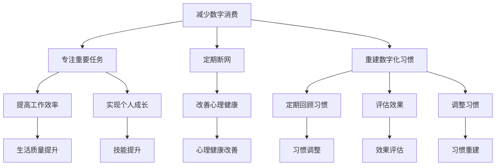

                 

### 引言：数字极简主义的兴起

在信息爆炸的时代，数字设备已经深入到了我们生活的方方面面。无论是手机、电脑，还是智能家居设备，它们都极大地改变了我们的生活方式。然而，随着数字技术的快速发展，我们也面临着前所未有的挑战：信息过载、注意力分散、工作效率降低，以及心理健康问题。这些挑战促使了数字极简主义（Digital Minimalism）的兴起。

数字极简主义并不是要完全放弃使用数字设备，而是倡导一种更明智、更有意识地使用它们的方式。这种生活方式的核心理念是通过减少不必要的数字消费，专注于重要的活动，从而提高生活质量和工作效率。

数字极简主义的起源可以追溯到2016年，作家Cal Newport在其同名著作《数字极简主义》中首次提出了这个概念。他主张通过减少社交媒体使用、限制在线娱乐、定期断网等方式，来重建我们的专注力和注意力。此后，数字极简主义逐渐引起了广泛的关注，成为许多人追求的一种生活方式。

### 数字极简主义的核心概念

数字极简主义的核心概念包括以下几个关键点：

1. **减少数字消费**：这意味着要减少使用社交媒体、在线购物等数字服务的频率和时间。通过减少数字消费，我们可以避免陷入无谓的时间消耗，从而有更多时间专注于重要的事情。

2. **专注重要任务**：数字极简主义强调将时间和注意力投入到重要的任务上，如学习新技能、与家人朋友互动、锻炼身体等。这种方法可以帮助我们提高工作效率，实现个人成长。

3. **定期断网**：定期断网是数字极简主义的一种实践方法。通过定期断开与数字设备的连接，我们可以摆脱干扰，更好地专注于当下的任务，同时也有助于改善心理健康。

4. **重建数字化习惯**：数字极简主义并不是一蹴而就的，而是需要我们逐步培养新的数字化习惯。这包括定期回顾自己的数字使用习惯，评估其效果，并做出相应的调整。

### 数字极简主义的联系架构

为了更好地理解数字极简主义的核心概念，我们可以通过Mermaid流程图来展示它们之间的关系：

通过这个流程图，我们可以清晰地看到数字极简主义的核心概念之间的联系和相互影响。

### 数字极简主义与信息技术的关系

数字极简主义与信息技术之间有着密切的关系。一方面，信息技术的发展使得我们能够更高效地处理信息，但也导致了信息过载的问题。另一方面，信息技术也为我们提供了实现数字极简主义的工具和方法。

例如，我们可以使用一些技术工具来帮助我们减少社交媒体的使用时间，如App Usage Monitor、Freedom等。这些工具可以帮助我们监控自己的数字使用情况，设置使用限制，从而更好地管理注意力。

此外，信息技术还为我们提供了许多在线学习资源，如在线课程、电子书等。通过合理利用这些资源，我们可以专注于提升自己的技能和知识，实现个人成长。

### 总结

数字极简主义是一种旨在帮助我们摆脱数字设备带来的负面影响，重建专注力和注意力的生活方式。它不仅关乎数字设备的使用，更关乎我们对自己生活质量的追求。通过减少数字消费、专注重要任务、定期断网和重建数字化习惯，我们可以更好地掌控自己的生活，实现个人成长和心理健康。

在接下来的章节中，我们将深入探讨数字极简主义的具体实践方法，以及如何在实际生活中实现它。希望读者能够通过阅读本书，找到适合自己的数字极简主义生活方式，从而过上更加专注、高效和有意义的生活。

### 作者信息

作者：AI天才研究院/AI Genius Institute & 禅与计算机程序设计艺术 /Zen And The Art of Computer Programming

---

**关键词**：数字极简主义，专注力，生活质量，信息技术，心理健康

**摘要**：本文介绍了数字极简主义的兴起及其核心概念，探讨了数字极简主义与信息技术的密切关系，并提出了通过减少数字消费、专注重要任务、定期断网和重建数字化习惯来实现数字极简主义的方法。文章旨在帮助读者理解数字极简主义的理念，并指导他们在实际生活中实践这一生活方式，以提升生活质量和工作效率。

