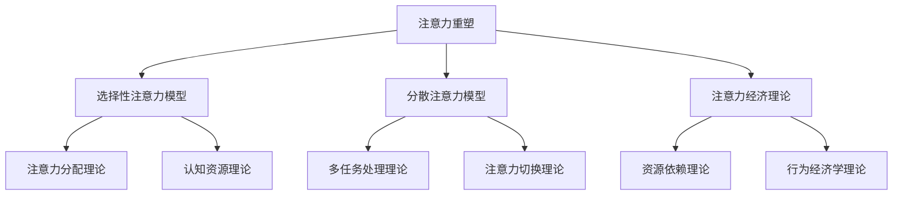

                 

### 1. 数字注意力重塑营：提升专注力的集中训练

**关键词：** 数字注意力、专注力、重塑、训练、方法、策略、习惯、认知重构

**摘要：**  
在数字时代，人们的注意力被各种信息碎片所分散，导致专注力的下降。本文提出了数字注意力重塑营的概念，旨在通过一系列的集中训练方法，帮助提升个人的专注力。文章从理解数字注意力的概述、核心概念、理论基础，到重塑方法的策略、练习与习惯的养成，以及认知重构和数字注意力重塑的应用案例，全面探讨了提升专注力的途径和策略。

---

# 《数字注意力重塑营：提升专注力的集中训练》目录大纲

## 引言

### 1. 数字时代下的注意力挑战

### 2. 书籍目标与读者定位

## 第一部分：理解数字注意力

### 第1章：数字注意力概述

#### 1.1 注意力的定义与作用

#### 1.2 数字注意力与传统的注意力

#### 1.3 数字注意力的影响因素

### 第2章：数字注意力的核心概念

#### 2.1 选择性注意力

#### 2.2 分散注意力

#### 2.3 注意力经济

### 第3章：注意力重塑的理论基础

#### 3.1 注意力重塑的概念

#### 3.2 注意力重塑的理论框架

#### 3.3 注意力重塑的重要性

## 第二部分：数字注意力的重塑方法

### 第4章：提升专注力的策略

#### 4.1 环境控制

#### 4.2 技术辅助

#### 4.3 心理训练

### 第5章：练习与习惯的养成

#### 5.1 持续练习的重要性

#### 5.2 建立有效的练习计划

#### 5.3 养成专注的习惯

### 第6章：认知重构与注意力重塑

#### 6.1 认知重构的理论基础

#### 6.2 认知重构的实践方法

#### 6.3 认知重构对注意力的重塑作用

### 第7章：数字注意力的持续训练

#### 7.1 训练计划的设计

#### 7.2 训练效果的评估

#### 7.3 长期坚持的策略

## 第三部分：数字注意力重塑的应用案例

### 第8章：职场中的注意力管理

#### 8.1 职场注意力管理的挑战

#### 8.2 提升职场注意力的方法

#### 8.3 成功案例分享

### 第9章：教育领域的注意力重塑

#### 9.1 教育中注意力缺失的问题

#### 9.2 教育注意力重塑的策略

#### 9.3 教育领域成功案例

### 第10章：数字注意力的社会影响

#### 10.1 数字注意力对社会的影响

#### 10.2 注意力重塑的社会责任

#### 10.3 注意力重塑的未来展望

## 总结与展望

### 1. 数字注意力重塑的重要性

### 2. 注意力重塑的未来发展趋势

### 3. 对读者的寄语

## 附录

### 1. 相关资源与工具推荐

### 2. 参考文献列表

# Mermaid 流程图：注意力重塑的理论框架

## 第1章：数字时代下的注意力挑战

### 1.1 注意力的定义与作用

注意力是大脑处理信息的关键能力，它决定了我们如何选择性地关注某些信息，而忽略其他不相关的信息。传统意义上的注意力主要依赖于个体在现实世界中的活动，如阅读书籍、观看电影、进行社交互动等。然而，随着数字技术的快速发展，人们越来越多地沉浸在虚拟世界中，面对的是前所未有的信息爆炸和干扰。

注意力的作用主要体现在以下几个方面：

1. **信息筛选与处理**：注意力使我们能够从大量的信息中筛选出重要信息，并对其进行深入处理。
2. **认知资源的分配**：注意力是有限的认知资源，我们需要根据任务的复杂程度和紧急程度合理分配注意力。
3. **学习与记忆**：注意力集中的时候，我们更容易记住新信息，并进行有效的学习。
4. **决策与问题解决**：注意力集中有助于我们更清晰地思考问题，做出更合理的决策。

### 1.2 数字注意力与传统的注意力

数字注意力与传统注意力的区别主要体现在以下几个方面：

1. **信息来源**：传统注意力主要依赖于现实世界的物理刺激，如声音、视觉、触觉等。而数字注意力则主要依赖于虚拟环境中的电子屏幕、多媒体信息等。
2. **信息量**：数字环境中的信息量庞大且变化快速，远超过传统环境中信息的丰富度。这导致人们需要更高的注意力来处理这些信息。
3. **干扰程度**：数字环境中的干扰因素更多，如社交媒体通知、电子邮件、即时通讯等，这些都可能导致注意力的分散。
4. **持续时长**：传统注意力的集中时间相对较长，而数字注意力往往容易被干扰打断，难以保持长时间的集中。

### 1.3 数字注意力的影响因素

数字注意力受到多种因素的影响，包括：

1. **技术特性**：屏幕的亮度、分辨率、刷新率等都会影响人们的注意力。
2. **用户习惯**：长时间使用电子设备、频繁切换任务等习惯会影响注意力分布。
3. **环境噪音**：无论是物理噪音还是背景噪音，都会对数字注意力产生负面影响。
4. **情绪状态**：情绪波动如焦虑、兴奋等会影响注意力的集中程度。
5. **生理因素**：如疲劳、饥饿等生理状态也会影响数字注意力的水平。

总的来说，数字时代下的注意力挑战主要体现在信息过载、干扰因素多、注意力集中时间短等方面。为了应对这些挑战，我们需要了解数字注意力的本质，并采取有效的策略进行重塑和提升。

---

### 第2章：数字注意力的核心概念

#### 2.1 选择性注意力

选择性注意力是数字注意力中的一个核心概念，指的是人们在面对大量信息时，能够有选择性地关注某些信息，而忽略其他不相关的信息。这种能力是人类大脑的基本特性，使得我们能够在复杂的环境中有效处理信息。

选择性注意力的几个关键点包括：

1. **信息筛选**：在数字环境中，人们需要快速筛选出重要的信息，以便进行进一步的关注和处理。
2. **注意力分配**：根据任务的优先级和复杂性，人们需要合理分配注意力，确保关键任务得到充分的关注。
3. **环境适应**：数字注意力需要能够根据不同的环境和任务需求进行灵活调整，以便在动态变化的信息流中保持高效。

#### 2.2 分散注意力

分散注意力是指由于外界干扰或内在心理因素，导致个体在处理任务时注意力无法集中，容易受到其他信息的干扰。分散注意力在数字环境中尤为普遍，因为电子设备上的各种通知、弹窗、社交媒体更新等都会不断打断人们的注意。

分散注意力的几个关键点包括：

1. **干扰因素**：识别并减少干扰因素是防止注意力分散的重要步骤。例如，关闭不必要的通知、保持工作环境的整洁等。
2. **多任务处理**：虽然多任务处理看似提高了效率，但实际上会降低注意力集中度，增加错误率。因此，尽量避免同时处理多个任务。
3. **心理调节**：培养心理韧性，学会应对干扰和压力，有助于减少分散注意力。

#### 2.3 注意力经济

注意力经济是一个描述数字环境中注意力资源如何被分配和利用的概念。它类似于经济学中的资源优化理论，旨在最大化个体在有限注意力资源下的效用。

注意力经济的几个关键点包括：

1. **资源稀缺性**：注意力资源是有限的，个体需要有效管理自己的注意力，避免浪费在低价值的信息上。
2. **注意力成本**：处理信息需要付出心理和生理成本，个体需要权衡信息价值与处理成本，做出最优选择。
3. **注意力回报**：高价值的注意力投入能够带来更高的回报，包括学习、工作、娱乐等多个方面。

总的来说，数字注意力的核心概念包括选择性注意力、分散注意力和注意力经济。理解这些概念有助于我们更好地认识和应对数字环境中的注意力挑战。

---

### 第3章：注意力重塑的理论基础

#### 3.1 注意力重塑的概念

注意力重塑是指通过一系列的训练方法，改变个体在数字环境中的注意力分布，使其能够更有效地管理自己的注意力资源。这种重塑不仅仅是简单的注意力提升，而是一个综合性的过程，涉及认知、行为和心理等多个层面。

注意力重塑的关键点包括：

1. **适应性调整**：通过不断的训练和反馈，个体能够更好地适应数字环境中的变化，提高注意力管理的灵活性。
2. **自我监控**：个体需要学会如何监控自己的注意力状态，及时发现并纠正注意力分散的行为。
3. **目标导向**：设定明确的目标和计划，有助于个体集中注意力，提高任务的完成效率。

#### 3.2 注意力重塑的理论框架

注意力重塑的理论框架通常包括以下几个核心理论：

1. **选择性注意力模型**：这个模型强调个体在处理信息时，能够有选择性地关注某些信息，而忽略其他不相关信息。选择性注意力的关键在于如何有效地筛选和过滤信息。
   
2. **分散注意力模型**：分散注意力模型研究个体在处理任务时受到干扰的因素，以及如何减少这些干扰。分散注意力的管理策略包括环境控制、时间管理和心理调节等。

3. **注意力经济理论**：注意力经济理论关注个体如何在有限的注意力资源下，最大化效用。这个理论强调注意力资源的稀缺性和优化利用。

4. **认知重构理论**：认知重构理论认为，通过改变个体的认知方式和思维方式，可以重塑注意力模式。例如，通过认知行为训练，个体可以学会更有效地管理自己的注意力。

#### 3.3 注意力重塑的重要性

注意力重塑在数字时代具有至关重要的意义，主要表现在以下几个方面：

1. **提升工作效率**：通过重塑注意力，个体能够更集中精力完成任务，减少错误率，提高工作效率。

2. **改善生活质量**：有效管理注意力，有助于个体减少数字依赖，减少因注意力分散导致的疲劳和焦虑。

3. **促进学习与成长**：注意力重塑有助于个体更好地吸收和处理学习信息，提高学习效果，促进个人成长。

4. **应对信息过载**：数字环境中的信息量庞大，注意力重塑可以帮助个体更好地筛选和处理信息，减轻信息过载的压力。

总之，注意力重塑是应对数字时代挑战的关键策略，它不仅有助于提高个体的专注力和工作效率，还能够改善生活质量，促进个人的全面发展。

### 第4章：提升专注力的策略

#### 4.1 环境控制

环境控制是提升专注力的首要策略之一。通过优化工作或学习环境，可以有效减少干扰因素，提高专注力。

**4.1.1 环境布置**

- **减少干扰源**：确保工作或学习空间整洁，避免堆放杂乱的物品，减少不必要的视觉和触觉干扰。
- **控制噪音**：在可能的情况下，使用降噪耳机或选择一个安静的房间进行工作或学习。如果无法完全避免噪音，可以使用耳塞来减少干扰。
- **光线调节**：确保工作环境的光线充足且柔和，避免强烈的直射光或过暗的环境，以减轻眼睛疲劳。

**4.1.2 时间管理**

- **制定时间计划**：合理安排每天的时间，为不同的任务分配特定的时间段。使用日历或时间管理应用，提前规划日程，避免临时任务的干扰。
- **使用番茄工作法**：将工作时间分为25分钟的工作周期，每个周期后休息5分钟。这种方法有助于保持注意力集中，并防止疲劳。

**4.1.3 避免多任务处理**

- **专注单一任务**：尽量在一个时间段内集中精力处理一个任务，避免同时进行多个任务。多任务处理会导致注意力分散，降低工作效率。
- **设置明确的目标**：在处理任务前，明确任务的目标和预期结果，有助于保持专注并提高效率。

#### 4.2 技术辅助

技术辅助是提升专注力的另一个有效策略，通过使用特定的工具和应用，可以帮助个体更好地管理自己的注意力。

**4.2.1 注意力追踪工具**

- **应用推荐**：如Forest、Focus@Will等，这些应用通过设定专注时间，帮助用户在指定时间内保持专注，同时提供可视化反馈。
- **使用方法**：在开始工作或学习前，设置专注时间，并在专注期间避免使用手机或其他干扰设备。应用会根据用户的专注时间提供相应的奖励。

**4.2.2 技术限制**

- **限制社交媒体使用**：使用应用如Freedom或StayFocusd，这些应用可以帮助用户限制在社交媒体网站上的时间，减少干扰。
- **手机使用限制**：使用手机的屏幕时间功能，监控和限制每天使用手机的总时间，尤其是在工作和学习时。

#### 4.3 心理训练

心理训练是提升专注力的深层次策略，通过调整个体的认知和行为方式，可以显著提高专注力。

**4.3.1 冥想与呼吸练习**

- **冥想**：通过冥想练习，可以帮助个体放松身心，减少焦虑和压力，提高专注力。
- **呼吸练习**：深呼吸有助于放松神经系统，提高注意力集中度。

**4.3.2 认知行为训练**

- **认知重构**：通过认知行为技术，帮助个体改变对干扰和挑战的看法，提高心理韧性。
- **专注力训练**：使用特定的专注力训练应用或书籍，如《心智的力量：专注力训练法》，进行系统性的专注力训练。

综上所述，提升专注力的策略包括环境控制、技术辅助和心理训练。通过综合运用这些策略，个体可以显著提高自己的专注力，提高工作效率和生活质量。

### 第5章：练习与习惯的养成

#### 5.1 持续练习的重要性

持续练习是提升专注力的关键步骤，它不仅有助于巩固已有的训练效果，还能逐步提高大脑处理信息和保持注意力的能力。心理学研究表明，通过重复练习，大脑能够形成新的神经通路，从而提高专注力和认知功能。

**5.1.1 练习的效果**

- **增强神经可塑性**：持续练习可以促进大脑神经通路的建立和强化，提高大脑处理信息的效率。
- **提高专注力持久度**：通过持续练习，个体能够逐渐延长专注时间，减少注意力分散的情况。
- **改善认知功能**：专注力的提升有助于提高记忆、决策和问题解决能力。

**5.1.2 练习的方法**

- **分散练习**：将练习时间分散到每天的不同时段，有助于维持练习的热情和效果。
- **定期评估**：定期评估练习效果，根据评估结果调整练习计划，确保练习内容的针对性和有效性。
- **设定目标**：设定明确的练习目标，有助于个体保持动机和方向，提高练习效果。

#### 5.2 建立有效的练习计划

建立有效的练习计划是提升专注力的关键，一个合理的计划应包括以下要素：

**5.2.1 练习内容**

- **专注力训练**：如专注力游戏、冥想练习、焦点训练等。
- **认知行为训练**：如认知重构、心理韧性训练、情绪管理训练等。
- **身体锻炼**：如瑜伽、跑步、太极等，有助于提高身体状态，从而改善专注力。

**5.2.2 练习频率**

- **每天练习**：保持每天进行一定的专注力训练，有助于形成稳定的练习习惯。
- **每周评估**：每周进行一次练习效果的评估，确保练习计划的执行和调整。

**5.2.3 练习时间**

- **合理分配**：根据个人情况，合理分配每天的练习时间，避免过度疲劳。
- **专注时段**：选择注意力较为集中的时段进行练习，提高练习效率。

#### 5.3 养成专注的习惯

养成专注的习惯是提升专注力的长期目标，以下方法有助于培养良好的专注习惯：

**5.3.1 培养自律**

- **设定明确的目标**：明确练习目标，有助于提高自律，确保练习计划的执行。
- **记录练习进度**：定期记录练习进度和成果，有助于激发自信和动力。

**5.3.2 保持好奇心**

- **探索新领域**：保持对新知识和新技能的好奇心，有助于激发学习兴趣和专注力。
- **多样化练习内容**：尝试不同类型的专注力训练，避免练习内容单一导致疲劳。

**5.3.3 建立积极心态**

- **正面激励**：使用正面激励来增强专注力，如奖励机制、自我表扬等。
- **接受挑战**：勇于接受新的挑战，通过挑战提高自我激励和专注力。

总之，通过持续练习、建立有效的练习计划和养成专注的习惯，个体可以显著提升专注力。这不仅有助于提高工作效率和学习效果，还能改善生活质量，使个体更好地应对数字时代的挑战。

### 第6章：认知重构与注意力重塑

#### 6.1 认知重构的理论基础

认知重构是通过改变个体对信息的处理方式，从而改变其对环境的感知和理解。这种理论认为，人的思维和行为模式并不是固定不变的，而是可以通过不断的训练和练习来调整和优化。

**6.1.1 认知重构的概念**

认知重构是指通过一系列的认知训练方法，帮助个体重新构建其认知模式，使其能够更有效地处理和应对外界信息。这种方法的核心在于：

- **认知灵活性**：通过训练，提高个体在面对新信息和复杂环境时的适应能力。
- **认知自我调节**：帮助个体学会自我监控和调整注意力，使其能够根据任务需求和环境变化灵活分配注意力资源。

**6.1.2 认知重构的组成部分**

认知重构通常包括以下几个关键组成部分：

- **注意力管理**：通过训练，提高个体在处理信息时对注意力的分配和控制能力。
- **情绪调节**：帮助个体学会管理和调节自己的情绪，减少情绪波动对注意力的影响。
- **认知策略**：教授个体有效的认知策略，如记忆技巧、问题解决方法和决策技巧，以提高其认知效率。

#### 6.2 认知重构的实践方法

认知重构的实践方法包括一系列的认知训练和心理技能训练，以下是一些常见的实践方法：

**6.2.1 注意力训练**

- **聚焦练习**：通过冥想、专注力游戏等方式，训练个体的专注力和注意力集中能力。
- **多任务处理训练**：通过模拟多任务处理场景，训练个体在复杂环境中的注意力分配能力。

**6.2.2 情绪调节训练**

- **情绪觉察**：帮助个体学会识别和感知自己的情绪状态，从而更好地管理情绪。
- **情绪调节技巧**：如深呼吸、正念冥想等，通过这些技巧，个体可以在面对压力和干扰时保持冷静和专注。

**6.2.3 认知策略训练**

- **记忆技巧**：教授个体如何使用记忆宫殿、联想记忆等技巧，提高记忆效率。
- **问题解决技巧**：通过模拟问题解决场景，训练个体的逻辑思维和决策能力。

#### 6.3 认知重构对注意力的重塑作用

认知重构对注意力重塑具有显著作用，具体体现在以下几个方面：

**6.3.1 提高注意力集中度**

通过认知重构训练，个体能够学会如何集中注意力，减少分散注意力的情况。这种集中度的提升有助于提高工作、学习和其他任务中的效率。

**6.3.2 增强注意力持久性**

认知重构通过训练个体的认知策略和情绪调节能力，使其能够在长时间的任务中保持专注，减少疲劳和分心。

**6.3.3 提高注意力灵活性**

认知重构帮助个体提高对注意力的自我调节能力，使其能够根据不同任务和环境需求灵活调整注意力分布，提高应对复杂情境的能力。

总之，认知重构是一种强大的注意力重塑工具，通过改变个体的认知模式，可以显著提高其专注力和注意力管理能力。这种重塑不仅有助于提高个体的工作、学习和生活质量，还能为他们在数字时代中的高效生存提供重要支持。

### 第7章：数字注意力的持续训练

#### 7.1 训练计划的设计

设计一个有效的数字注意力训练计划是提升专注力的关键。以下是一些设计训练计划的步骤和注意事项：

**7.1.1 明确训练目标**

在开始设计训练计划之前，首先要明确训练目标。这些目标可以是短期目标，如提高专注时间，也可以是长期目标，如改善工作或学习效率。明确的目标有助于训练计划的制定和执行。

**7.1.2 制定合理的训练频率**

根据个体的时间安排和生活习惯，制定合理的训练频率。例如，每天进行20分钟的专注力训练，每周进行一次完整的注意力管理课程。合理的频率可以确保训练的持续性和有效性。

**7.1.3 选择多样的训练方法**

结合不同的训练方法，如冥想、专注力游戏、认知重构练习等，可以全面提高数字注意力。多样化的训练方法有助于保持训练的新鲜感和效果。

**7.1.4 定期评估和调整**

定期评估训练效果，并根据评估结果进行调整。例如，如果发现某项训练方法效果不佳，可以更换其他方法。此外，定期评估还可以帮助个体保持训练的动力和信心。

**7.1.5 融入日常生活**

将注意力训练融入日常生活，如在工作或学习时定期休息，进行短暂的正念冥想，可以帮助个体保持持续的训练效果。

#### 7.2 训练效果的评估

评估训练效果是确保训练计划有效性的重要步骤。以下是一些评估训练效果的方法：

**7.2.1 自我评估**

个体可以通过自我评估来了解自己的训练进展。例如，记录每天的专注时间，评估在特定任务中的注意力分散情况，并对比训练前后的变化。

**7.2.2 第三方评估**

邀请专业人士或使用专业的评估工具，如专注力测试软件，对个体的注意力进行评估。这些评估工具可以提供量化的数据，帮助个体更客观地了解训练效果。

**7.2.3 反馈机制**

建立反馈机制，如与教练或训练伙伴进行定期交流，获取他们的反馈和建议。这种互动可以提供额外的视角，帮助个体更全面地了解自己的进步和不足。

#### 7.3 长期坚持的策略

要确保数字注意力的持续训练，个体需要采取一些策略来保持长期的动力和效果：

**7.3.1 培养兴趣和热情**

通过选择有趣和吸引人的训练内容，培养对注意力训练的兴趣和热情。兴趣和热情是保持长期坚持的关键。

**7.3.2 设定奖励机制**

设定明确的奖励机制，如完成训练目标后给予自己小奖励，可以提高个体的积极性和坚持力。

**7.3.3 建立支持系统**

建立支持系统，如与家人、朋友或同事分享训练经验和成果，可以获得额外的动力和支持。

**7.3.4 保持灵活性**

在训练过程中，根据实际情况调整训练计划和方法，保持灵活性，以确保训练的持续性和有效性。

总之，通过设计合理的训练计划、定期评估效果以及采取长期坚持的策略，个体可以有效地提升数字注意力，提高工作效率和生活质量。

### 第8章：职场中的注意力管理

#### 8.1 职场注意力管理的挑战

在职场环境中，注意力管理面临诸多挑战。首先，工作任务的复杂性和多样性使得员工需要处理大量信息，容易导致注意力分散。其次，电子邮件、电话、即时通讯工具等现代通讯方式不断打断员工的专注力，影响工作效率。此外，职场压力和情绪波动也会对注意力管理产生负面影响。

**8.1.1 多任务处理**

多任务处理是职场中常见的注意力分散源之一。尽管多任务处理看似提高了工作效率，但实际上会降低注意力的集中度和任务质量。研究表明，频繁切换任务会导致“任务切换成本”，即每次切换任务时，大脑需要重新配置注意力和资源，从而增加认知负担。

**8.1.2 数字干扰**

数字干扰是现代职场中注意力管理的主要挑战之一。各种社交媒体通知、电子邮件提示、手机消息等都会不断打断员工的专注力，导致“多任务切换”成为常态。这种持续的干扰不仅降低了工作效率，还增加了员工的心理压力。

**8.1.3 压力和情绪波动**

职场压力和情绪波动会显著影响注意力管理。长期的工作压力和焦虑会导致注意力分散和疲劳，从而影响工作表现。情绪波动如愤怒、焦虑和沮丧等也会干扰注意力的集中，导致任务完成的效率和质量下降。

#### 8.2 提升职场注意力的方法

为了应对职场中的注意力管理挑战，以下是一些有效的方法：

**8.2.1 环境优化**

- **减少干扰源**：保持工作环境的整洁，关闭不必要的通知和提示，减少视觉和听觉干扰。
- **合理布局**：合理安排工作区域，确保工作空间有足够的光线和舒适的温度，以减少身体上的不适感。

**8.2.2 时间管理**

- **制定计划**：提前制定工作计划，为每个任务分配特定的时间段，避免临时任务的干扰。
- **番茄工作法**：使用番茄工作法，将工作时间分为25分钟的工作周期，每个周期后休息5分钟，有助于提高专注力。

**8.2.3 技术辅助**

- **专注工具**：使用专注工具，如Forest、Focus@Will等，帮助员工在指定时间内保持专注，减少数字干扰。
- **手机使用限制**：利用手机自带的功能或第三方应用，限制社交媒体和电子邮件的使用时间，避免干扰。

**8.2.4 心理调节**

- **情绪管理**：学会管理自己的情绪，通过深呼吸、冥想等方法缓解压力和焦虑。
- **积极心态**：培养积极的心态，对待工作保持乐观和耐心，提高心理韧性。

#### 8.3 成功案例分享

以下是一些在职场中成功提升注意力的案例：

**案例一：某科技公司员工**

某科技公司的员工通过使用专注工具和番茄工作法，显著提高了工作效率。他每天早晨制定详细的工作计划，并在工作过程中使用专注工具，确保在规定的时间内集中精力完成任务。这种方法不仅提高了他的工作效率，还减轻了他的工作压力。

**案例二：某银行客户服务代表**

某银行客户服务代表通过环境优化和心理调节，成功提升了注意力管理能力。她保持工作环境的整洁，关闭不必要的通知，并通过冥想和深呼吸练习缓解工作压力。这种方法使她在处理客户问题时更加专注和高效。

**案例三：某企业项目经理**

某企业的项目经理通过制定详细的任务计划和使用专注工具，成功管理了多个并行项目。他每天都会提前规划任务，并根据任务的紧急程度和优先级进行排序。这种方法使他能够更加专注于关键任务，确保项目按时完成。

这些案例表明，通过有效的注意力管理策略，职场员工可以显著提升工作效率和职业成就感。通过环境优化、时间管理、技术辅助和心理调节，个体可以在职场中更好地应对注意力分散的挑战。

### 第9章：教育领域的注意力重塑

#### 9.1 教育中注意力缺失的问题

在当前的数字化教育环境中，注意力缺失成为一个普遍且严重的问题。学生们在面对电子设备、多媒体内容和各种在线资源时，很容易分散注意力，导致学习效果下降。以下是一些教育中注意力缺失的主要问题：

**9.1.1 电子设备依赖**

随着智能手机、平板电脑等电子设备的普及，学生们在课堂上和课外活动中频繁使用这些设备，导致注意力无法集中。这些设备不仅分散了学生的注意力，还影响了他们的学习兴趣和参与度。

**9.1.2 多媒体干扰**

多媒体教学内容虽然生动有趣，但也容易分散学生的注意力。例如，视频中过多的动画和特效、课堂中的即时反馈和游戏等，虽然能提高学生的学习兴趣，但也可能导致他们在学习过程中分心。

**9.1.3 社交媒体干扰**

社交媒体在学生中的普及使得他们难以在课堂上保持专注。社交媒体的通知、消息和活动不断打断学生的学习进程，使得他们很难专注于老师的教学内容。

**9.1.4 压力和焦虑**

学习压力和焦虑是导致学生注意力缺失的另一个重要因素。许多学生在面对考试、作业和学术压力时，容易感到焦虑和不安，这进一步影响了他们的注意力和学习效率。

#### 9.2 教育注意力重塑的策略

为了解决教育领域中注意力缺失的问题，以下是一些有效的注意力重塑策略：

**9.2.1 教学方法创新**

教师可以采用互动式和项目式教学方法，以提高学生的学习兴趣和参与度。例如，通过小组讨论、角色扮演和实际操作等活动，让学生在实践中学习，从而提高他们的注意力集中度。

**9.2.2 注意力训练课程**

在学校课程中融入注意力训练课程，如专注力游戏、冥想和认知重构练习等，可以帮助学生提高注意力管理能力。这些课程可以定期进行，帮助学生建立良好的注意力习惯。

**9.2.3 环境优化**

优化教学环境，减少干扰因素，如关闭不必要的电子设备、保持教室整洁、使用安静的背景音乐等，有助于提高学生的注意力集中度。

**9.2.4 技术辅助**

使用专注工具和应用程序，如Forest、Focus@Will等，帮助学生管理自己的注意力。这些工具可以通过设定专注时间、提供奖励和反馈来激励学生保持专注。

**9.2.5 心理支持**

为学生们提供心理支持和指导，帮助他们管理学习压力和焦虑。例如，通过正念冥想、情绪调节训练和压力管理课程，提高学生的心理韧性和注意力管理能力。

#### 9.3 教育领域成功案例

以下是一些在教育领域成功重塑注意力的案例：

**案例一：某中学专注力提升计划**

某中学通过引入专注力训练课程，帮助学生们提高注意力集中度。学校每周安排一次专注力训练课程，课程内容包括专注力游戏、冥想练习和认知重构技巧。通过定期的训练，学生们的注意力集中时间显著增加，学习效率得到提升。

**案例二：某大学在线学习平台**

某大学开发了一个在线学习平台，该平台结合了专注工具和学习资源。学生在使用平台时，需要完成一系列专注力挑战，如专注时间打卡、完成任务等。通过这些挑战，学生不仅提高了注意力集中度，还增强了学习动力。

**案例三：某教育机构注意力重塑课程**

某教育机构开设了注意力重塑课程，面向有需要的中小学生。课程内容包括注意力训练、情绪管理技巧和认知重构方法。通过课程学习，学生们的注意力集中度得到显著提高，学习效果明显改善。

这些案例表明，通过创新的教学方法、有效的注意力训练和心理支持，教育领域可以成功解决注意力缺失的问题，帮助学生提高学习效果和生活质量。

### 第10章：数字注意力的社会影响

#### 10.1 数字注意力对社会的影响

数字注意力不仅是个人能力的体现，也是社会整体运行效率的关键因素。随着数字技术的不断进步，人们的注意力资源被大量分散，这给社会带来了诸多影响：

**10.1.1 生产效率**

数字注意力缺失会直接影响到生产效率。在工作场所，由于注意力分散，员工往往无法高效完成工作任务，导致整体生产效率下降。同时，由于多任务处理带来的“任务切换成本”，员工在频繁切换任务时需要重新集中注意力，这不仅浪费时间，还增加了认知负担。

**10.1.2 教育质量**

在教育和学习领域，数字注意力分散导致了学习效率的下降。学生和教师在面对电子设备和多媒体内容时，容易分心，难以专注于学习任务。这直接影响了教育质量，导致学生知识掌握不牢固，教师教学效果不佳。

**10.1.3 社会关系**

数字注意力分散也影响了社会关系。人们在社交媒体上花费大量时间，与真实世界的社交互动减少。这导致了人际关系的疏远和沟通质量的下降。此外，由于注意力分散，人们难以深入理解和处理复杂的社会问题，导致社会凝聚力的减弱。

**10.1.4 心理健康**

注意力分散还与心理健康问题密切相关。长时间使用电子设备、面对大量信息，容易导致焦虑、抑郁等心理问题。研究表明，数字注意力分散与心理压力呈正相关，从而对个体的心理健康产生负面影响。

#### 10.2 注意力重塑的社会责任

为了应对数字注意力分散带来的负面影响，社会各界需要共同努力，承担起注意力重塑的社会责任：

**10.2.1 政府角色**

政府应制定相关政策，规范数字设备的使用，减少信息过载。例如，可以限制在工作时间和学习时间内的电子设备使用，推广专注力训练课程，提高公众的数字注意力管理水平。

**10.2.2 企业责任**

企业应关注员工的数字注意力管理，提供相应的培训和工具，帮助员工提高专注力和工作效率。例如，企业可以引入专注工具，提供心理健康支持，鼓励员工进行专注力训练。

**10.2.3 教育系统**

教育系统应将注意力管理纳入课程体系，培养学生良好的注意力习惯。通过教学创新和注意力训练，提高学生的学习效率和参与度。同时，教师应通过榜样作用，引导学生正确使用电子设备，培养他们的数字注意力。

**10.2.4 社会组织**

社会组织可以举办各类注意力管理活动，提高公众对数字注意力问题的认识。例如，可以开展注意力训练工作坊、研讨会，分享注意力管理的最佳实践，促进社会对这一问题的关注。

#### 10.3 注意力重塑的未来展望

随着科技的发展，数字注意力重塑将成为社会发展的关键议题。未来，以下趋势值得期待：

**10.3.1 技术进步**

随着人工智能和大数据技术的进步，将出现更多针对个体需求的注意力管理工具和解决方案。这些工具可以通过个性化推荐、智能分析等方式，帮助个体更有效地管理注意力资源。

**10.3.2 教育创新**

教育领域将不断推进教育创新，结合数字技术和注意力管理理论，开发出更多有效的教学方法和学习工具，提高学生的学习效率和注意力集中度。

**10.3.3 社会共识**

社会对数字注意力问题的认识将逐步提高，形成共识。政府、企业、教育机构和公众将共同努力，通过政策、技术和教育等多方面的措施，推动数字注意力的提升和重塑。

总之，数字注意力重塑不仅关乎个体的生活质量和工作效率，也对社会整体的发展具有重要影响。通过各界的共同努力，数字注意力的提升将成为未来社会进步的重要驱动力。

### 总结与展望

数字注意力重塑的重要性不言而喻。在数字时代，提升个人的专注力和注意力管理能力，不仅能够显著提高工作效率和学习成果，还能改善生活质量，增强心理韧性。本文从理解数字注意力的挑战、核心概念、理论基础，到重塑方法、策略和实践，全面探讨了提升专注力的途径和策略。通过环境控制、技术辅助、心理训练、持续练习和认知重构，个体可以逐步提升数字注意力，应对信息过载和干扰。

未来，随着科技的进步和教育创新，数字注意力重塑将成为社会发展的重要方向。我们呼吁社会各界共同努力，制定相关政策，推广注意力管理工具和方法，培养良好的注意力习惯。政府、企业、教育机构和公众应共同承担责任，推动数字注意力的提升，为实现高效、健康、和谐的社会发展贡献力量。

### 附录

#### 1. 相关资源与工具推荐

- **专注力训练应用**：Forest、Focus@Will、Happier
- **时间管理工具**：Trello、Asana、Google Calendar
- **冥想应用**：Headspace、Calm、Insight Timer
- **注意力追踪工具**：RescueTime、Freedom、StayFocusd

#### 2. 参考文献列表

1. **Mirowsky, J., & Ross, C. E. (1961). Social structure and psychological anxiety. American Journal of Soci

