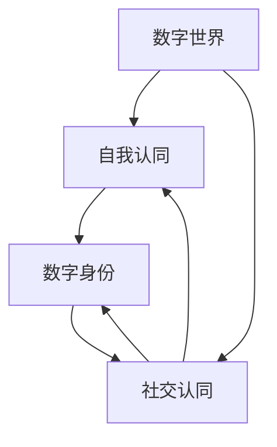
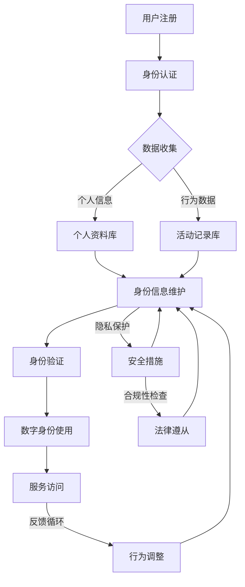

                 

### 引言

在数字化时代，我们每个人都在扮演着“数字流浪者”的角色。我们的生活和身份在虚拟世界中得到了新的定义和表达，而这种转变既带来了无限的机遇，也带来了新的挑战。数字流浪者指南：网络时代的自我认同探索手册，正是为了帮助我们在数字化的海洋中找到自己的方向，探索自我认同的深度和广度。

本文将分为三个主要部分进行探讨。第一部分将深入分析数字世界与自我认同的关系，包括数字世界的兴起与演变、数字身份的探索、网络时代的自我表达和网络社交与社交认同。第二部分将关注数字流浪者的特质与挑战，以及如何进行自我认同的重建与探索。第三部分则将探讨数字世界的伦理与道德，以及数字时代的前景与挑战，并给出数字流浪者的行动指南。

通过对这些主题的深入探讨，我们希望能够提供一个全面的指南，帮助您在这个数字化的时代中找到自己的定位，建立和维护健康的数字身份，实现自我认同的和谐发展。

### 背景介绍

数字世界与自我认同的关系，可以追溯到人类历史中的第一个电子计算机诞生之时。随着互联网的普及，数字世界逐渐成为人们日常生活的一部分，而自我认同的概念也在此过程中发生了深刻的变革。在传统社会中，个体主要通过物理身份和现实生活中的行为来定义自我，如职业、家庭背景、社会地位等。然而，在数字世界中，这些定义逐渐被数字身份所替代。

首先，数字身份是数字世界中对个体的识别和定位方式，它不仅包括电子邮箱、社交媒体账号等，还涉及在线行为、消费习惯等数据。这些数据共同构成了一个数字化的自我形象，与物理世界的身份截然不同。数字身份的灵活性使得个体可以在不同的网络平台上切换角色，形成多重身份，这在一定程度上模糊了现实与虚拟之间的界限。

其次，数字世界的兴起改变了人们的社交方式。传统的面对面社交被网络社交所取代，人们通过社交媒体、即时通讯工具等平台进行互动。这种社交方式的变革，不仅改变了人们交流的内容和频率，还改变了人们建立社交关系的方式。网络社交的匿名性和虚拟性，使得个体可以更自由地表达自我，但也带来了身份认同的挑战，如网络欺凌、身份盗窃等问题。

此外，数字世界中的自我表达也呈现出新的特点。在传统社会中，个体的表达往往受到现实世界规则和道德规范的制约，而在数字世界中，这些限制相对较少。个体可以在网络上分享自己的思想、感受和经历，这种自由的表达不仅丰富了自我认同的内容，也带来了一定的风险，如隐私泄露、信息滥用等。

综上所述，数字世界与自我认同之间的关系是复杂且多维的。它不仅改变了个体对自我的认知方式，还带来了新的挑战和机遇。在这个背景下，理解数字世界和自我认同的关系，对于我们更好地应对数字化时代的挑战具有重要意义。

### 核心概念与联系

在探讨数字世界与自我认同的关系时，我们首先需要明确几个核心概念：数字世界、自我认同、数字身份和社交认同。这些概念之间有着紧密的联系和相互影响，构成了理解数字化时代自我认同的基础。

**1. 数字世界**：指的是通过计算机、互联网和移动设备等数字技术构建的虚拟空间。它包括网页、社交媒体、在线游戏、虚拟现实等多种形式。数字世界提供了一个平台，使得人们可以在其中进行各种活动，如信息获取、社交互动、娱乐消费等。

**2. 自我认同**：是指个体对自己存在的认知和定位。它涉及到个体的身份、价值观、目标等方面。自我认同是一个动态的过程，会受到个体经历、社会环境等因素的影响。

**3. 数字身份**：是数字世界中对个体的识别和定位方式，它通常通过电子邮箱、社交媒体账号、在线行为等数据来构建。数字身份不仅包括个人的基本信息，还包括个体的网络行为和偏好，构成了一个数字化、多维度的自我形象。

**4. 社交认同**：是指个体在社交网络中的自我认知和被他人认同的过程。它包括对社交角色的认同、社交群体的认同以及对社交互动的认同。社交认同对个体的自我认同有着重要的影响，特别是在数字社交中，它往往决定了个体在网络世界的社交地位和影响力。

**核心概念之间的关系架构**：

- **数字世界** 是**自我认同** 的基础环境，它提供了个体进行自我表达和社交互动的平台。个体的**数字身份** 是在数字世界中形成和展现自我认同的具体体现，它依赖于个体在数字世界中的行为数据。
- **社交认同** 则是数字世界中个体自我认同的一个重要维度，它通过社交互动和群体认同来影响个体的自我认知和自我定位。社交认同不仅反映了个体在数字世界的社交地位，还反过来影响个体的自我认同。
- **数字身份** 与**社交认同** 之间存在着互动和影响。个体的数字身份会影响其在社交网络中的行为和表现，从而影响其社交认同。同时，社交认同也会影响个体如何塑造和维护其数字身份。

为了更好地理解这些核心概念之间的关系，我们可以使用 Mermaid 流程图进行展示：

在这个流程图中，数字世界是整个关系的起点，它连接着自我认同、数字身份和社交认同三个核心概念，形成了一个闭环。这个闭环展示了数字世界与自我认同之间的复杂互动关系，也揭示了个体如何在数字世界中通过数字身份和社交认同来塑造和认知自我。

### 数字世界的兴起与演变

数字世界的兴起是现代科技进步的产物，其起源可以追溯到20世纪中期。当时，计算机技术的诞生为信息的存储和处理提供了新的可能性，而互联网的发展则将这一可能性扩展到了全球范围。从1969年阿帕网（ARPANET）的建立，到1991年万维网（WWW）的出现，数字世界经历了从无到有、从简单到复杂的演变过程。

首先，数字世界的形成离不开计算机技术的发展。计算机的出现不仅改变了信息处理的方式，也开创了新的社交和互动模式。早期的计算机主要用于科学研究和国防项目，但随着时间的推移，计算机逐渐走进了商业和日常生活。个人计算机的普及使得人们能够在家中访问信息，进行在线交流和娱乐，从而为数字世界的形成奠定了基础。

互联网的发展则是数字世界兴起的关键。互联网将全球的计算机连接在一起，形成了一个庞大的信息网络。通过这个网络，人们可以随时随地获取信息、交流思想、分享内容。特别是万维网的发明，使得信息的获取和传播变得更加容易和便捷，从而推动了数字世界的快速扩展。

随着时间的推移，数字世界逐渐从简单的信息共享平台演变为一个复杂的生态系统，涵盖了多个方面，如电子商务、在线教育、社交媒体、在线娱乐等。这些新形式的出现不仅改变了人们的生活方式，也深刻影响了社会的运行机制。

在这个数字化的过程中，数字生活逐渐成为人们日常生活的重要组成部分。人们通过电子邮件、社交媒体、即时通讯工具等数字平台进行交流，通过网络购物满足消费需求，通过在线学习提升个人能力。数字生活不仅改变了人们的行为模式，也带来了新的挑战和机遇。

首先，数字生活为个体提供了更多的自由和便利。通过数字平台，人们可以更加便捷地进行社交、获取信息和娱乐。数字世界的开放性和多样性为个体提供了更多的选择和机会，使得生活更加丰富多彩。

然而，数字生活也带来了一系列挑战。一方面，数字世界的匿名性和虚拟性使得网络欺凌、身份盗窃等问题日益严重。另一方面，过度依赖数字平台可能导致现实生活的疏离，影响个体的人际关系和心理健康。此外，数字技术的快速发展也带来了信息过载和隐私泄露的风险。

总的来说，数字世界的兴起与演变为人类生活带来了巨大的变革。它不仅改变了我们的生活方式，也带来了新的挑战和机遇。在这个背景下，理解数字生活的影响，掌握数字素养，实现数字生活的平衡，成为了每个人在数字化时代的重要任务。

### 数字生活的双刃剑效应

数字生活的双刃剑效应表现在它既带来了许多便利和机遇，也带来了诸多挑战和风险。首先，从积极方面来看，数字生活极大地提高了我们的生活质量。通过电子邮件、社交媒体和即时通讯工具，我们可以随时随地与亲友保持联系，打破了时空的限制。电子商务的兴起让购物变得更加便捷，我们只需点击几下鼠标，就能购买到全球的商品。在线教育和远程工作的普及，也为人们提供了更多的学习和发展机会，促进了知识的传播和共享。

然而，数字生活也带来了一些负面影响。网络欺凌和身份盗窃等问题日益严重，对个人的心理和财产安全构成威胁。在数字世界中，个体的隐私权也面临着巨大的挑战，个人信息容易被泄露和滥用。此外，数字生活的便利性可能让人过度依赖，导致现实生活中的社交技能和人际交往能力下降，甚至引发孤独感和焦虑。

为了最大化数字生活的益处，同时降低其负面影响，我们需要采取一系列策略。首先，个人应提高数字素养，包括网络安全知识、信息鉴别能力和数据保护意识。其次，企业和政府应加强数字伦理和法规建设，规范数字平台的运营，保障用户的权益。最后，社会各界应共同努力，营造一个健康、积极、和谐的数字环境，让每个人都能在数字生活中获得安全和满足。

### 数字生活的变革与未来趋势

数字生活的变革与未来趋势是一个复杂且充满变数的领域，随着技术的不断进步和社会需求的演变，这一领域正经历着深刻的变化。首先，人工智能（AI）和大数据技术的应用正在极大地改变数字生活的面貌。AI技术不仅提高了信息处理的效率，还使得个性化服务和智能决策成为可能。例如，智能助手能够根据用户的习惯和偏好提供个性化的建议，从而提升用户体验。大数据技术则通过分析海量数据，帮助企业和政府做出更加精准的决策，优化资源配置，提升运营效率。

其次，物联网（IoT）的快速发展也为数字生活带来了新的机遇。通过连接各种智能设备，物联网使得家庭自动化、智能城市和智能制造成为现实。智能家居设备如智能灯泡、智能空调和智能安防系统，不仅提高了生活的便利性，还提升了家居的安全性。智能城市通过物联网技术实现交通管理、环境保护和公共安全等方面的优化，提高了城市管理的效率和居民的幸福感。

此外，虚拟现实（VR）和增强现实（AR）技术的应用也为数字生活带来了新的可能。VR和AR技术为用户提供了沉浸式的体验，无论是在虚拟世界中探索宇宙、参观博物馆，还是在虚拟商店中进行购物，这些技术都极大地丰富了数字生活的内容。特别是随着5G网络的普及，VR和AR的应用场景将进一步扩展，为用户提供更加真实和丰富的互动体验。

未来，数字生活还将朝着更加智能、互联和个性化的方向发展。随着区块链技术的应用，数字生活的安全性和隐私保护将得到进一步提升。区块链技术通过去中心化的方式，确保数据的安全性和透明性，减少了信息泄露和篡改的风险。同时，虚拟身份和数字货币的兴起，也为数字生活带来了新的支付和社交方式。

总之，数字生活的变革与未来趋势将深刻影响我们的生活方式和社会结构。通过抓住这些趋势，我们不仅能享受数字生活带来的便利和乐趣，还能为社会的可持续发展做出贡献。在这个过程中，技术进步、政策引导和用户需求将共同推动数字生活的不断进化。

### 数字身份的定义与特征

数字身份，作为数字化时代的核心概念之一，是理解和参与网络社会的基础。数字身份不仅仅是一个电子邮箱地址或社交媒体账号，它是一个多维度的综合体，包含了个体在数字世界中的所有行为数据、社会关系和身份标识。

首先，数字身份的定义可以从多个角度进行解读。从技术角度来看，数字身份是通过各种数字媒介进行识别和认证的过程，包括用户名、密码、生物识别信息等。从社会角度来看，数字身份是个人在数字空间中的社会角色和地位的体现，如在线购物者、社交媒体用户、网络内容创作者等。

数字身份具有以下特征：

1. **唯一性**：每个个体在数字世界中拥有一个独特的数字身份，这使得网络服务提供商能够对用户进行准确的识别和个性化服务。
2. **多功能性**：数字身份不仅用于登录和访问数字服务，还用于记录和展示个人的行为、偏好和社交关系，从而形成一个综合性的数字画像。
3. **动态性**：数字身份是不断演变的，随着个体的在线行为和社会关系的改变而改变。例如，一个用户在社交媒体上的关注者和粉丝群体可能会影响其数字身份的塑造。
4. **虚拟性**：数字身份存在于虚拟空间中，与现实世界的身份有所不同，它更自由、更灵活，但也带来了身份管理和隐私保护的新挑战。

数字身份与现实身份的冲突主要体现在以下几个方面：

1. **隐私泄露**：在数字世界中，个人的信息容易因为技术漏洞或不当管理而被泄露，从而威胁到现实中的隐私安全。
2. **身份欺诈**：不法分子可以通过伪造数字身份进行欺诈活动，给个人和整个社会带来巨大的经济损失。
3. **多重身份管理**：个体可能在多个数字平台上拥有不同的身份，这种多重身份的管理复杂性增加了身份验证的难度，同时也增加了身份冲突的风险。

总的来说，数字身份作为数字化时代的重要特征，不仅改变了我们对自我和他人身份的认知，也带来了新的挑战和机遇。理解和应对这些挑战，对于维护数字世界的安全和秩序具有重要意义。

### 数字身份与现实身份的冲突

数字身份与现实身份的冲突在现代社会中愈发显著，这种冲突主要体现在隐私泄露、身份欺诈和多重身份管理等方面。首先，隐私泄露是数字身份与现实身份冲突的最常见表现形式。由于网络技术的不断发展，个体的个人信息如姓名、住址、电话号码、电子邮箱等数据在数字世界中被广泛收集和使用。然而，这些数据的安全性和保密性往往难以得到保障，尤其是在数据泄露、黑客攻击和数据滥用事件频发的背景下。例如，某些社交媒体平台可能会因安全漏洞导致用户的个人信息泄露，从而威胁到用户的现实身份安全。

其次，身份欺诈也是数字身份与现实身份冲突的一个重要方面。不法分子利用数字身份的虚拟性和匿名性，通过伪造身份进行各种欺诈活动，如网络诈骗、虚假广告等。这些活动不仅损害了受害者的财产安全，还可能对他们的信用记录和声誉造成长期影响。例如，某些犯罪分子可能会利用伪造的数字身份在多个平台上进行诈骗，从而逃避法律的制裁。

多重身份管理则是数字身份与现实身份冲突的另一个复杂问题。在数字世界中，个体可能在不同的平台上拥有多个身份，这些身份之间可能存在冲突和混淆。例如，一个人可能在社交媒体上展示一个与在工作中完全不同的形象，这种身份的不一致性可能导致现实生活中的社交和职业关系受到影响。此外，多重身份管理还增加了身份验证的难度，使得服务提供商难以准确识别用户的真实身份，从而影响服务的质量和安全性。

为了解决这些冲突，需要采取一系列策略和方法。首先，提高数字素养是关键。个人应增强对数字身份隐私和安全的认识，学会保护自己的个人信息，避免在不安全的平台上泄露敏感数据。其次，加强网络安全措施，如使用强密码、两步验证和加密技术等，可以有效降低隐私泄露和身份欺诈的风险。此外，平台和服务提供商也应承担起更大的责任，加强数据保护和隐私管理，确保用户数据的安全。

最后，建立更加完善的法律法规和监管机制，对数字身份的管理和使用进行规范，也是解决冲突的重要手段。政府、企业和个人应共同努力，构建一个安全、透明和可信赖的数字环境，从而减少数字身份与现实身份之间的冲突，提升整体社会的数字生活质量。

### 数字身份管理的挑战与策略

数字身份管理是确保个人数字世界安全与隐私的重要环节，但同时也面临着诸多挑战。首先，数据隐私保护是一个核心问题。由于网络平台的多样化，个体在多个平台上留下了大量的个人信息和行为数据。这些数据若未能得到有效保护，极易被不法分子获取和利用。因此，确保数据在传输、存储和处理过程中的安全至关重要。具体措施包括采用先进的加密技术和安全协议，以及定期进行安全审计和漏洞修补。

其次，身份验证的复杂度也是一个挑战。在数字世界中，身份验证不仅需要保证准确性，还需兼顾用户体验。传统的单因素验证（如用户名和密码）已经难以抵御日益复杂的网络攻击，因此多因素身份验证（MFA）成为了一种流行的方法。然而，MFA增加了验证的复杂度，可能导致用户体验下降。为了平衡这两者，可以采用动态验证方法，如短信验证码、生物识别验证等，以提升安全性同时保持便捷性。

此外，身份管理的动态性也是一大挑战。随着个体在网络中的活动和社交关系的不断变化，数字身份也需要进行相应的调整和更新。这种动态性要求身份管理系统具备高度的灵活性和可扩展性，能够及时响应用户需求。为此，可以采用分布式身份管理架构，通过区块链技术实现去中心化的身份管理，从而提高系统的可靠性和透明度。

为了应对这些挑战，可以采取以下策略：

1. **提升用户意识**：通过教育和宣传，增强用户对数字身份管理的认识，教育用户如何保护个人信息和选择安全的身份验证方法。
2. **技术创新**：引入和研发先进的技术，如人工智能、机器学习和生物识别技术，以提高身份验证的准确性和安全性。
3. **法律和法规**：制定和执行相关法律法规，明确数字身份管理的责任和义务，规范平台和服务提供商的行为。
4. **协作与共享**：构建跨平台、跨领域的身份管理合作机制，共享安全信息和最佳实践，共同提升数字身份管理的整体水平。

通过上述策略，可以有效应对数字身份管理的挑战，保障用户的数字隐私和安全，促进数字世界的健康和可持续发展。

### 网络时代的自我表达

网络时代的自我表达为个体提供了一个全新的平台，使得人们能够以多种方式展示和传达自己的思想和情感。在传统社会中，个体的表达往往受到物理环境和社交规则的制约，而在数字世界中，这些限制相对较少。人们可以通过文字、图片、视频、音频等多种形式进行表达，这种多样化的表达方式不仅丰富了自我认同的内容，也带来了新的挑战和机遇。

首先，文字表达是网络自我表达中最常见的形式。通过社交媒体、博客、论坛等平台，个体可以随时发表自己的观点、分享生活经历和感受。这种表达方式不仅具有即时性和广泛性，还可以通过点赞、评论等方式与其他用户进行互动，从而增强表达的影响力。

其次，图片和视频表达也是网络自我表达的重要组成部分。在网络平台上，用户可以通过上传照片、拍摄视频或直播来展示自己的生活和观点。这种形式的表达直观、生动，能够更有效地传达情感和思想。例如，短视频平台上的博主通过短视频分享生活技巧、旅游经历或美食制作，吸引了大量的关注和粉丝。

音频表达则为那些不善言辞或无法长时间书写的人提供了一个新的表达渠道。通过语音播客、音频分享平台，用户可以录制和分享自己的声音，如故事、音乐、朗诵等。这种形式的表达不仅能够传达情感，还能增加互动性，例如，播客节目常常邀请嘉宾参与讨论，观众也可以通过留言进行互动。

此外，数字世界的自我表达还带来了新的挑战。首先是信息过载的问题。在网络上，每天有海量的信息产生和传播，个体需要在其中找到自己的声音。这要求个体具备更强的信息筛选和表达能力，才能在竞争激烈的环境中脱颖而出。

其次是隐私和安全问题。在数字世界中，个体的表达可能会暴露其个人信息和隐私，尤其是在社交媒体等公共平台上。因此，个体在进行自我表达时需要具备一定的安全意识，保护自己的隐私和权益。

总的来说，网络时代的自我表达为个体提供了更多的自由和机会，但也带来了一系列挑战。个体需要在这个多元化的环境中找到自己的表达方式，同时保持警惕，确保自己的表达安全和有效。通过合理利用网络平台，个体不仅能够更好地实现自我表达，还能在社会中发挥更大的影响力。

### 网络身份的多重角色

在网络世界中，个体常常会扮演多种不同的角色，这些角色的多样性不仅丰富了自我表达的内容，也为社交互动带来了新的挑战。首先，个人在社交媒体上可能会扮演多个不同的角色，如朋友、家庭成员、职业身份等。例如，一个人在朋友圈中可能会分享自己的生活琐事和家庭照片，而在职业社交媒体上则展示自己的专业技能和职业成就。

其次，网络身份的多重角色也体现在用户在不同平台上的行为差异。在某些平台上，用户可能是活跃的评论者或内容创作者，而在其他平台上则可能更倾向于默默关注他人。这种角色的转换不仅反映了个体在不同社交环境中的自我认同，也影响了其在网络社会中的社交互动模式。

这种多重角色的现象带来了几个显著的挑战。首先是身份管理的问题。个体需要在不同的网络平台上维护不同的身份信息，这增加了身份管理的复杂性。例如，一个人在LinkedIn上展示的是职业形象，而在Facebook上则可能展示更加私人的一面，这种身份的转换要求个体具备较高的管理能力和自律性。

其次是角色冲突的问题。在某些情况下，个体在网络上扮演的不同角色可能会产生冲突。例如，一个人在社交媒体上表现出开放和热情的一面，但在工作环境中则需要保持专业和谨慎。这种角色冲突可能会导致心理压力和社交困难。

最后是隐私保护的问题。多重角色可能导致个体的个人信息在多个平台上被曝光，从而增加隐私泄露的风险。例如，一个人在公开的社交媒体上分享了自己的兴趣爱好和旅行照片，这些信息可能会被不法分子利用，从而威胁到其隐私和安全。

为了应对这些挑战，个体可以采取以下策略：

1. **明确角色定位**：在网络上明确每个角色的定位和目标，确保每个角色的表达和行为都符合其身份和价值观。
2. **合理管理身份**：在多个网络平台上使用不同的账号或身份，避免身份混淆，确保隐私和安全。
3. **加强隐私保护**：了解并使用网络平台提供的隐私设置，限制个人信息的公开范围，防范隐私泄露。
4. **培养自律能力**：培养自律意识，确保在不同角色之间的转换过程中保持一致性，避免角色冲突。

通过这些策略，个体可以在网络世界中更好地管理多重角色，实现自我表达和社会互动的平衡，同时保护自己的隐私和安全。

### 网络表达的自由与责任

网络表达的自由是数字世界的一大亮点，它为个体提供了前所未有的自我表达和言论自由的空间。然而，这种自由并非无限制的，它伴随着相应的责任和义务。网络表达的自由与责任之间的关系，是一个复杂且值得深思的议题。

首先，网络表达的自由体现在个体可以在网络上自由地表达自己的观点、分享信息、参与讨论。这种自由不仅增强了社会的多元性和开放性，也为个体提供了展示自我和影响力的平台。例如，社交媒体平台上的用户可以自由地发表评论、转发信息、发布内容，甚至参与公共话题的讨论，从而表达自己的立场和态度。

然而，自由并不意味着无责任。网络表达的自由与责任是相互依存的。个体在享受表达自由的同时，也需承担相应的责任。这些责任包括但不限于：

1. **遵守法律法规**：网络表达需遵守相关的法律法规，如版权法、诽谤法等。不当言论可能导致法律责任，甚至对社会秩序和公共利益造成危害。
2. **尊重他人权利**：网络表达应尊重他人的隐私权、名誉权等合法权益。不当言论可能侵犯他人的权益，引发纠纷和冲突。
3. **维护网络环境**：个体应积极参与维护网络环境的健康和秩序。例如，举报网络欺凌、虚假信息和恶意攻击行为，共同营造一个积极、和谐的数字空间。

为了实现网络表达的自由与责任的平衡，可以采取以下措施：

1. **加强法律法规的制定和执行**：政府和相关机构应制定和完善网络法律法规，明确网络表达的法律边界和责任义务，确保法律法规的严格执行。
2. **提高数字素养**：个体应提高数字素养，增强法律意识和道德观念，了解网络表达的自由与责任，合理、负责任地使用网络平台。
3. **完善网络监管机制**：网络平台应建立健全的监管机制，加强对用户行为的监管，及时处理不当言论和信息，维护网络环境的秩序和安全。
4. **加强公众教育和宣传**：通过公众教育和宣传活动，提高社会对网络表达自由与责任的认知，引导个体在享受自由的同时，承担相应的责任。

总之，网络表达的自由与责任是一个动态平衡的过程。只有在自由与责任之间找到合适的平衡点，才能实现网络空间的健康发展，确保个体和社会的共同利益。通过法律、教育和技术等多方面的努力，我们可以共同营造一个自由、安全、健康的数字环境。

### 数字形象的构建与维护

在数字时代，数字形象不仅反映了个人在网络世界中的自我表达，也成为了塑造公众形象和职业发展的重要工具。构建和维护良好的数字形象，对于个体在职业生涯中的成功至关重要。以下是一些关键的步骤和策略。

首先，**明确目标和定位**是构建数字形象的基础。个体应明确自己的职业目标和发展方向，从而确定数字形象的核心内容和风格。例如，一个职场人士可能需要展示专业性和可靠性，而一个自媒体创作者则可能更注重创意和互动性。

其次，**内容质量**是数字形象的核心。个体应定期发布高质量的内容，如专业见解、行业动态、原创文章或视频等。这些内容不仅能够吸引关注，还能树立专业形象。同时，内容应保持一致性，确保在多个平台上的形象一致，避免产生混淆。

**社交互动**也是构建数字形象的关键因素。个体应积极参与网络社区的讨论，回复评论，建立良好的人际关系。这种互动不仅能够增加曝光度，还能展示个人的沟通能力和团队协作精神。

**社交媒体管理**则是维护数字形象的重要策略。个体应定期检查和维护社交媒体账号，确保信息的准确性和时效性。同时，应设置隐私保护措施，限制对个人信息的访问，防止隐私泄露。

此外，**网络声誉管理**也是不可忽视的一环。个体应密切关注网络上的反馈和评论，及时处理负面信息，防止声誉受损。例如，对于不实的指责或负面评论，可以采取理性回应或申诉的方式，维护自己的权益和形象。

**自我评估**也是维护数字形象的重要手段。个体应定期评估自己的数字形象，了解自己在网络社区中的表现和影响力，并根据评估结果进行调整和优化。这有助于保持数字形象的新鲜感和吸引力。

总之，构建和维护良好的数字形象需要明确目标、高质量内容、积极社交互动、有效社交媒体管理和持续的网络声誉管理。通过这些策略，个体可以在数字世界中建立积极的个人品牌，提升职业竞争力，实现职业生涯的持续发展。

### 网络社交的特点与影响

网络社交作为数字化时代的重要组成部分，具有独特的特点，并对个体的生活产生深远的影响。首先，网络社交的**即时性**是其最显著的特性之一。通过即时通讯工具和社交媒体平台，个体可以随时随地与朋友、家人和其他社交网络成员保持联系，这种即时互动极大地缩短了沟通的时间差距，增强了社交的便利性。

**虚拟性**是网络社交的另一个重要特点。在虚拟空间中，个体无需面对面的互动，这为人们提供了更多的自由，可以选择更加私密或匿名的方式进行交流。虚拟性不仅降低了社交压力，还使得个体能够更加自由地表达自己的想法和感受。

**多样性**是网络社交的第三大特点。网络社交平台提供了多样化的社交场景和互动形式，如聊天室、论坛、短视频分享、直播等。这种多样性不仅丰富了社交的内容和形式，还为个体提供了更多展示自我和发现他人的机会。

网络社交对个体生活的影响是广泛而深远的。首先，它极大地丰富了社交方式，使得人们可以跨越地理和时间的限制，与他人建立和维持关系。这种社交方式的变革，不仅提高了社交效率，也扩展了社交网络的范围。

然而，网络社交也带来了一些负面影响。一方面，它可能导致个体与现实社交的疏离，影响人际关系和心理健康。过度依赖网络社交可能导致现实生活中的社交技能下降，甚至引发孤独感和焦虑。另一方面，网络社交的匿名性和虚拟性也容易导致网络欺凌和身份盗窃等问题的发生。

总的来说，网络社交的特点包括即时性、虚拟性和多样性，它为个体提供了丰富的社交机会，但也带来了一系列挑战。理解和应对这些影响，对于在数字化时代中实现健康、平衡的社交生活具有重要意义。

### 社交认同的多样性

社交认同的多样性是网络社交的一个重要特征，反映了个体在网络社区中的自我认知和他人认同的多样性。在传统的社交环境中，个体的社交认同往往受限于现实地理位置和人际关系网络，而在网络社交中，这种限制得到了极大的扩展和变化。

首先，网络社交使得个体能够加入多样化的社交群体，从而体验不同的社交认同。在传统社交中，个体的社交圈子相对固定，社交认同也较为单一。而在网络社交中，个体可以自由选择加入各种兴趣小组、社区论坛和社交媒体群组，这些群体可能涵盖不同的文化、兴趣和价值观。这种多样化的社交认同不仅丰富了个体的人生经历，也为个体提供了更多元化的社交机会。

其次，网络社交的匿名性和虚拟性也使得个体的社交认同更具多样性。在现实社交中，个体的身份和行为往往受到社会规范和伦理道德的约束，而在网络社交中，个体可以更自由地表达和探索不同的自我形象。这种匿名性使得个体敢于尝试和展示自己平时在现实中无法展示的一面，从而体验到不同的社交认同。例如，某些在现实中较为内向的人可能会在网络上成为活跃的讨论者或创作者，获得新的社交认同。

此外，网络社交的多样性还体现在社交互动的灵活性和即时性上。在传统社交中，社交互动往往受时间和空间的限制，而在网络社交中，个体可以随时随地进行交流和互动，这种灵活性不仅增强了社交的便利性，也使得社交认同更加多样化。例如，通过社交媒体平台，个体可以与全球的网友进行实时互动，分享思想和经验，从而体验到更加丰富的社交认同。

总的来说，社交认同的多样性是网络社交的一大亮点，它不仅丰富了个体的社交体验，也为个体提供了更多的自我探索和成长的机会。理解和利用这种多样性，有助于个体在网络社交中建立更健康、更丰富的社交网络。

### 社交网络的自我认知与反馈

在社交网络中，自我认知与反馈是一个动态且不断发展的过程，它不仅影响个体的网络行为，还对其整体心理健康产生深远影响。首先，社交网络的自我认知是指个体通过社交互动对自己身份、价值和地位的理解。这种认知往往受到多个因素的影响，包括他人的评价、互动频率以及社交网络的结构。

**自我认知的提升**可以通过积极的社交互动实现。例如，当个体在社交媒体上获得点赞、评论或关注时，这些正面的反馈能够增强其自信心和自尊心，从而提升自我认知。此外，通过参与有意义的讨论和分享有价值的内容，个体能够感受到自己的观点和经验被认可，这也有助于提升自我价值感。

然而，社交网络的反馈也可能带来负面影响，特别是当这些反馈具有负面性质时。例如，网络欺凌、诽谤或忽视都可能对个体的心理健康产生不良影响。长期处于负面反馈的环境中，个体可能会感到自卑、焦虑甚至抑郁，从而影响其在网络和现实生活中的表现。

**反馈的平衡**是关键。积极的反馈能够促进个体的自我认知和发展，而适度的负面反馈则可以帮助个体认识到自身的不足，从而实现自我提升。为了实现这种平衡，个体应培养健康的网络社交习惯，如理性看待反馈、学会过滤和筛选信息，避免过度依赖负面反馈。

此外，**自我反思**也是提升自我认知的重要途径。通过定期反思自己在社交网络中的行为和互动，个体能够更好地理解自己的动机、价值观和行为模式，从而调整和优化自己的网络行为。这种自我反思不仅有助于提升自我认知，还能提高个体的心理韧性，增强面对挑战和压力的能力。

总的来说，社交网络的自我认知与反馈是一个复杂且动态的过程，它既受到社交互动的影响，又对个体的心理健康产生深远影响。通过积极的互动、健康的反馈机制和自我反思，个体可以在社交网络中实现自我认知的提升，从而更好地应对数字化时代的挑战。

### 虚拟生活与现实生活的交融

虚拟生活与现实生活的交融在数字化时代日益显著，这种交融不仅改变了人们的日常生活方式，也带来了新的挑战。首先，虚拟生活与现实生活的交融为人们提供了更多的便利和选择。通过互联网和移动设备，个体可以在虚拟世界中实现多种现实生活中的活动，如远程办公、在线购物、在线学习和虚拟旅游等。这种便利性极大地提高了生活效率，减少了时间和空间的限制。

然而，这种交融也带来了一些负面影响。首先是时间管理的挑战。由于虚拟生活的高度便捷，个体容易沉迷于网络活动，导致时间分配不均，影响现实生活中的重要任务和活动。例如，过度使用社交媒体和在线娱乐可能导致工作和学习时间的减少，甚至引发网络成瘾问题。

其次是心理健康的影响。虚拟生活的匿名性和虚拟性，虽然为个体提供了自由表达的空间，但也可能导致心理上的疏离和孤独感。个体在虚拟世界中的互动往往缺乏现实生活中的深度和真实性，可能导致心理健康问题，如焦虑、抑郁和社交恐惧等。

为了实现虚拟生活与现实生活的平衡，个体可以采取以下策略：

1. **时间管理**：制定合理的时间表，明确虚拟生活和现实生活的时间分配，确保两者之间的平衡。
2. **现实互动**：积极参与现实生活中的社交活动和兴趣爱好，增加现实互动，减少虚拟世界的沉迷。
3. **心理健康维护**：培养健康的生活习惯，如定期锻炼、保持充足的睡眠和合理饮食，提高心理韧性。
4. **自我反思**：定期反思虚拟生活和现实生活的状态，了解自己的需求和动机，及时调整行为和态度。

通过这些策略，个体可以在享受虚拟生活便利的同时，维护现实生活的健康和丰富，实现虚拟生活与现实生活的和谐交融。

### 网瘾与数字排毒

网瘾，也称为互联网成瘾或网络依赖，是数字化时代的一个普遍现象，它对个体的心理健康和生活质量产生了深远的影响。网瘾主要表现为过度使用互联网，无法自控，甚至影响到日常生活和工作。首先，网瘾可能导致时间管理问题，个体可能会花费大量时间在社交媒体、网络游戏或在线娱乐上，从而忽视了现实生活中的重要任务和人际关系。

其次，网瘾还会对心理健康产生负面影响。长期的过度使用互联网可能导致焦虑、抑郁和社交恐惧等心理问题。此外，网瘾还可能导致睡眠质量下降，影响生理健康。

为了克服网瘾，进行数字排毒是一种有效的方法。数字排毒是指通过减少或中断互联网使用，恢复现实生活的平衡。以下是一些实现数字排毒的策略：

1. **设定时间限制**：为互联网使用设定具体的时间限制，例如每天使用互联网的时间不超过2小时，确保其他时间能够投入到现实生活中的活动。
2. **建立健康习惯**：培养其他有益的爱好和活动，如阅读、锻炼、社交等，以减少对互联网的依赖。
3. **家庭和朋友的支持**：寻求家庭和朋友的支持，共同监督和鼓励，有助于克服网瘾。
4. **专业帮助**：对于严重的网瘾问题，可以寻求专业的心理咨询和治疗，帮助个体恢复心理健康和社交能力。

通过这些策略，个体可以有效减少互联网使用时间，恢复现实生活的平衡，提高整体生活质量。

### 数字素养与心理健康

数字素养与心理健康在现代社会中具有日益重要的地位。数字素养是指个体在数字化环境中获取、使用、评估和管理信息的能力，包括技术操作、网络安全、数据隐私保护等方面。而心理健康则涵盖了情绪管理、自我认知、社会互动和幸福感等多个方面。

首先，数字素养对心理健康有显著的积极影响。具备良好数字素养的个体能够更加自信地使用数字工具，管理个人信息，保护自己的隐私和安全。这种自信有助于减少焦虑和恐惧，提高生活满意度。此外，数字素养还使个体能够有效地获取和利用网络资源，提升学习、工作和娱乐的质量，从而增强幸福感。

其次，心理健康也影响着数字素养的发展。心理健康良好的个体通常具有更强的自我调节能力和情绪管理能力，这有助于他们在使用数字工具时保持专注和理性。相反，心理健康问题如焦虑、抑郁等可能削弱个体的数字素养，导致他们在使用数字工具时产生挫败感和无助感。

为了在数字化时代中保持健康的心理状态，以下策略至关重要：

1. **平衡使用数字工具**：合理安排时间，避免过度使用数字设备，确保有足够的休息时间。
2. **培养健康习惯**：定期进行体育锻炼、充足的睡眠和健康的饮食习惯，以维持良好的生理和心理健康。
3. **情绪管理**：学会识别和应对情绪波动，通过冥想、放松训练和心理咨询等方法缓解压力。
4. **社交互动**：积极参与现实生活中的社交活动，建立和维护健康的人际关系。
5. **数字素养教育**：通过学习和培训，提高数字素养，增强信息获取和管理的技能。

通过这些策略，个体可以在数字化环境中保持良好的心理健康，同时提升数字素养，实现生活与技术的和谐共存。

### 数字流浪者的特质与挑战

数字流浪者，这个在数字化时代中崭露头角的新兴群体，以其独特的特质和面临的挑战定义了现代生活的多个方面。首先，数字流浪者通常具有高度的适应性和灵活性。他们能够迅速适应各种新的数字技术和平台，通过不断学习和实践，掌握多种技能，这使得他们在职场和生活中具备较强的竞争力。此外，数字流浪者往往具有探索精神和创新思维，他们不满足于现有的技术和生活方式，总是寻求新的解决方案和突破。

然而，数字流浪者也面临着一系列独特的挑战。首先是技术过载的问题。随着数字技术的发展和更新速度加快，个体需要不断学习新的技术和工具，这可能导致时间和精力的过度消耗。此外，数字流浪者通常需要在多个数字平台上进行活动，这使得信息过载和社交压力增大，容易导致焦虑和疲劳。

其次是身份管理的复杂性。数字流浪者通常在多个平台上拥有不同的身份和角色，这种多重身份的管理不仅增加了复杂性，还可能引发身份混淆和隐私泄露的风险。此外，数字流浪者在网络世界中的高度互动性，也可能导致现实生活中的社交关系和职业发展受到影响。

为了应对这些挑战，数字流浪者可以采取以下策略：

1. **技能持续更新**：定期学习新的数字技能和知识，保持技术领先地位，提高职业竞争力。
2. **时间管理**：合理安排时间，确保工作和休息的平衡，避免因技术过载导致的心理和生理压力。
3. **身份管理**：明确每个数字平台上的角色和目标，确保身份的一致性和透明性，同时加强隐私保护措施。
4. **社交平衡**：积极参与现实生活中的社交活动，维护健康的人际关系，避免过度依赖虚拟社交。

通过这些策略，数字流浪者可以在数字化环境中保持高效和平衡，实现个人成长和职业发展。

### 自我认同的内涵与重要性

自我认同是指个体对自己身份、价值观、目标和存在意义的认知和理解。它不仅是心理健康的基石，也是个人行为和决策的重要驱动力。自我认同的内涵非常丰富，包括自我感知、自我价值感、自我一致性、自我目标和自我反思等多个方面。

首先，自我感知是指个体对自己的认知和理解，包括外貌、性格、能力等。自我感知是个体形成自我认同的基础，它影响着个体如何看待自己，以及如何在与他人的互动中定位自己的角色。

其次，自我价值感是指个体对自己存在的意义和价值的认可。自我价值感强的个体通常表现出较高的自尊心和自信心，能够积极地应对生活中的挑战和压力。相反，自我价值感低的个体则可能容易感到自卑和焦虑。

自我一致性是指个体在行为和思想上的自我协调和统一。一个自我一致性高的个体能够清晰地认识到自己的价值观和行为准则，并在各种情境下坚持这些准则，从而保持内心的稳定和一致。

自我目标是指个体为自己设定的长期和短期目标，这些目标不仅反映了个体对未来的期望，也指引着个体的行为和努力方向。自我目标有助于个体在面对困难时保持动力和决心，是自我认同的重要组成部分。

最后，自我反思是指个体定期对自己的行为、思想和价值观进行审视和评估，从而不断调整和优化。自我反思不仅有助于个体发现自身的不足，还能促进个体自我成长和自我完善。

总的来说，自我认同在个体心理和行为中扮演着至关重要的角色。它不仅影响个体的心理健康和幸福感，还影响个体的决策、人际关系和职业发展。一个清晰的自我认同有助于个体在面对各种挑战时保持坚定和自信，实现个人价值和目标。

### 数字世界中的自我发现

在数字世界中，个体可以通过多种途径进行自我发现，这一过程不仅丰富了自我认同，也为个人成长提供了新的平台。首先，通过在线学习和知识分享平台，个体可以接触到广泛的知识资源，提升专业技能和知识水平。例如，通过Coursera、edX等在线教育平台，个体可以学习最新的学术研究成果和行业动态，从而不断丰富自己的知识体系。

其次，社交媒体和博客是另一个重要的自我发现途径。通过在这些平台上分享自己的想法、经验和观点，个体可以与全球的网友互动，获取不同的反馈和见解。这种互动不仅有助于个体了解不同的文化和观点，还能促进自我认知和自我反思，从而实现自我提升。

此外，网络社区和论坛也为个体提供了交流和讨论的空间。在这些平台上，个体可以加入自己感兴趣的话题小组，与其他爱好者和专家进行深入交流。通过这种参与，个体不仅能够扩展自己的视野，还能找到志同道合的伙伴，共同探讨和解决问题。

总之，数字世界为个体提供了丰富的自我发现机会，通过在线学习、社交媒体和网络社区等多种途径，个体可以在不断探索和互动中实现自我成长和自我认同的提升。

### 数字流浪者的身份认同危机

数字流浪者在数字化时代面临的一个重要挑战是身份认同危机。身份认同危机指的是个体在数字世界中感到自我认同模糊或不确定，这种模糊性可能源于多重身份、虚拟社交和快速变化的技术环境。首先，数字流浪者在多个平台上拥有不同的身份和角色，如社交媒体上的个人形象、职业社交媒体上的专业角色等。这种多重身份的管理复杂且易混淆，可能导致个体难以清晰地定义自己，从而产生身份认同危机。

其次，虚拟社交的匿名性和虚拟性也加剧了身份认同危机。在虚拟社交环境中，个体可以自由地切换身份，这种自由性虽然增加了表达和互动的灵活性，但也使得个体难以建立稳定和真实的自我认同。匿名性使得个体在社交互动中容易产生角色冲突，难以保持一致的自我形象，进而导致心理上的不稳定。

此外，技术的快速变化也使得数字流浪者的身份认同面临挑战。随着新技术的不断涌现，个体需要不断学习新的技能和工具，以适应数字世界的变化。这种持续的学习压力可能导致个体在数字世界中感到迷失和焦虑，从而影响其身份认同。

为了应对这些身份认同危机，数字流浪者可以采取以下策略：

1. **明确自我定位**：在数字世界中，个体应明确自己的目标和定位，确保每个身份和角色的目标一致，从而减少身份混淆和冲突。
2. **建立稳定的社交网络**：积极参与现实生活中的社交活动，建立和维护稳定的社交关系，增强现实生活中的身份认同。
3. **持续自我反思**：定期反思自己在数字世界中的行为和角色，了解自己的动机和价值观，保持自我的一致性和稳定性。
4. **培养数字素养**：提高数字素养，了解数字世界的规则和伦理，增强自我保护意识和能力，减少身份认同危机的风险。

通过这些策略，数字流浪者可以在数字化环境中找到自己的定位，实现自我认同的稳定和健康，从而更好地应对数字化时代的挑战。

### 数字身份的塑造原则

在数字世界中，塑造一个积极、健康的数字身份至关重要。以下是一些关键原则和方法，帮助个体有效地塑造和维护数字身份。

首先，**真实性**是塑造数字身份的基础。个体应确保在数字世界中展现真实的自我，包括真实的个人信息、经历和观点。这种真实性不仅能够增强个体的可信度，还能赢得他人的尊重和信任。例如，在社交媒体上发布的内容应真实反映个人的生活、兴趣和价值观，避免虚假宣传和夸大事实。

其次，**一致性**是保持数字身份的重要原则。个体在数字世界中的所有行为和表达应保持一致，以避免身份混淆和信任危机。这意味着，无论在哪个平台，个体的角色和形象都应保持一致，避免在不同的社交网络中表现出截然不同的个性和行为。例如，一个在LinkedIn上展示专业形象的职场人士，不应在Facebook上展示与其职业形象不符的内容。

**透明性**是塑造健康数字身份的另一个关键原则。个体应在数字世界中保持开放和透明，公开分享个人的行为、观点和决策过程。这种透明性有助于建立信任，增强个体在网络社区中的影响力。例如，通过定期更新博客或社交媒体帖子，分享自己的工作和生活动态，个体可以展示自己的透明性和诚信。

**责任性**也是塑造健康数字身份的重要原则。个体在数字世界中应承担相应的责任，包括遵守网络规则和法律法规，尊重他人的隐私和权益。此外，个体应积极应对网络欺凌、虚假信息和恶意攻击，维护网络环境的健康和秩序。

为了实现这些原则，以下是一些具体的方法：

1. **制定内容策略**：在发布任何内容之前，个体应仔细考虑其影响和意义，确保内容符合真实性、一致性和透明性原则。
2. **定期反思**：个体应定期反思自己在数字世界中的行为和角色，确保每个行为和表达都符合自己的价值观和目标。
3. **积极参与网络社区**：通过参与有意义的讨论和分享高质量的内容，个体可以增强自己在网络社区中的影响力和可信度。
4. **保护隐私**：了解并使用数字工具和平台提供的隐私设置，确保个人信息的安全和隐私。

通过遵循这些原则和方法，个体可以有效地塑造和维护一个积极、健康的数字身份，实现自我认同和职业发展的目标。

### 数字身份的维护策略

在数字世界中，维护良好的数字身份是确保个人安全和隐私的重要环节。以下是一些关键策略，帮助个体有效地保护和管理其数字身份：

首先，**使用强密码和双因素认证**是基本的安全措施。强密码应包括字母、数字和符号的组合，避免使用容易猜测的信息如生日或家庭地址。此外，双因素认证为账户提供了额外的安全层，通过手机验证码或生物识别技术，确保只有授权用户能够访问账户。

其次，**定期更新密码**是维护数字身份的重要策略。建议每三个月更新一次密码，避免长时间使用同一密码，降低账户被破解的风险。同时，使用密码管理工具可以帮助用户管理复杂的密码组合，提高安全性。

**谨慎处理个人信息**也是维护数字身份的重要原则。个体应避免在公共平台或不可信网站上泄露敏感信息，如身份证号码、银行账户等。此外，对于不必要的个人信息，应尽量减少公开，降低隐私泄露的风险。

**定期监控账户活动**也是维护数字身份的关键。通过设置账户通知和监控，个体可以及时发现异常活动，如登录地点变化、密码修改等。如果发现异常，应立即采取相应措施，如更改密码或暂时冻结账户。

**网络安全意识**是维护数字身份的基础。个体应了解常见的网络威胁，如钓鱼攻击、恶意软件等，并学会如何识别和防范这些威胁。通过参加网络安全培训和教育，提高对网络安全的认识和应对能力。

最后，**备份重要数据**是确保数字身份安全的重要措施。定期备份重要文件和数据，确保在数据丢失或遭受恶意攻击时能够迅速恢复。使用可靠的云存储服务或外部硬盘进行数据备份，提高数据的安全性和可用性。

通过这些策略，个体可以有效地维护其数字身份，确保在数字化环境中保持安全和隐私。

### 数字世界的伦理与道德

在数字世界迅速发展的今天，伦理与道德问题变得尤为突出。数字世界的匿名性和虚拟性，使得一些传统的道德准则和伦理规范面临新的挑战。首先，数字伦理的基本原则包括尊重隐私、保护安全、公平公正和透明性等。尊重隐私是数字伦理的核心，意味着在收集、使用和共享个人数据时，必须获得用户的明确同意，并确保数据的安全和保密。保护安全则强调在数字环境中采取必要的措施，防止数据泄露、网络攻击和欺诈行为。公平公正要求在数字平台上的服务和内容应公正对待所有用户，避免歧视和偏见。透明性则要求数字服务的运作和决策过程应公开透明，使用户能够理解和监督。

然而，数字时代也带来了许多道德困境。首先，信息过载和隐私泄露问题日益严重。在数字世界中，个人数据被广泛收集和利用，但这也带来了隐私泄露的风险。例如，社交媒体平台通过用户数据广告定位，虽然提高了广告效率，但也引发了关于用户隐私保护的争议。

其次，网络欺凌和仇恨言论的问题也日益突出。在虚拟环境中，个体可以匿名表达观点，这使得网络欺凌和仇恨言论变得更加普遍和难以控制。这种不当行为不仅对个人心理健康造成伤害，还可能引发社会动荡和公共安全问题。

为了解决这些道德困境，需要采取一系列措施。首先，政府和相关机构应制定和执行严格的数字伦理法规，明确数字平台和企业的责任和义务。其次，数字平台和服务提供商应加强内部监管，采取技术手段和人工审核，确保平台内容符合道德标准。最后，公众应提高数字素养，了解数字伦理的基本原则，自觉遵守网络规则，共同维护数字世界的健康和秩序。

### 数字伦理的基本原则

数字伦理的基本原则是确保数字世界健康发展的基石，这些原则涵盖了尊重隐私、保护安全、公平公正和透明性等多个方面。首先，**尊重隐私**是数字伦理的核心，意味着在收集、使用和共享个人数据时，必须获得用户的明确同意，并确保数据的安全和保密。隐私保护不仅关系到用户的个人权利，也是建立用户信任的基础。

其次，**保护安全**是数字伦理的重要组成部分。在数字环境中，个人数据容易受到网络攻击、数据泄露和恶意软件的威胁。因此，数字平台和服务提供商应采取必要的安全措施，如加密技术、防火墙和安全审计，确保用户数据的安全性和完整性。

**公平公正**原则要求在数字平台上的服务和内容应公正对待所有用户，避免歧视和偏见。无论是算法推荐、广告投放还是用户评价系统，都应确保公平性和透明性，避免对特定群体或个体造成不公平的待遇。

**透明性**则要求数字服务的运作和决策过程应公开透明，使用户能够理解和监督。这不仅有助于增强用户对数字平台的信任，还能促进数字世界的健康发展。

为了实现这些原则，政府和相关机构应制定和执行严格的数字伦理法规，明确数字平台和企业的责任和义务。数字平台和服务提供商也应加强内部监管，采取技术手段和人工审核，确保平台内容符合道德标准。公众则应提高数字素养，了解数字伦理的基本原则，自觉遵守网络规则，共同维护数字世界的健康和秩序。

### 数字时代的道德困境

数字时代带来了前所未有的技术进步和便利，但也引发了诸多道德困境。首先，隐私保护问题尤为突出。在数字世界中，个人数据被广泛收集和存储，但数据泄露事件频发，导致用户隐私严重受损。例如，社交媒体平台和电子商务网站因安全漏洞导致用户数据泄露，使得黑客能够获取用户的个人信息，甚至进行身份盗窃和金融诈骗。

其次，算法偏见问题也引发了广泛讨论。许多数字平台依赖算法来推荐内容、分配资源，但这些算法往往基于历史数据和用户行为进行决策。如果这些数据本身存在偏见，算法的决策结果也将带有偏见，导致不公平对待。例如，招聘平台可能因算法的偏见而排除特定种族或性别的人才，这显然违反了公平公正的原则。

此外，网络欺凌和仇恨言论也是一个严重的道德困境。在匿名性和虚拟性的掩护下，一些人会在网络上进行恶意攻击和侮辱，对他人进行心理和情感上的伤害。这种行为不仅侵犯了受害者的权益，还可能导致社会动荡和公共安全问题。

为了应对这些道德困境，首先需要加强法律监管，制定和执行严格的数据保护法规，确保用户隐私得到有效保护。其次，数字平台和服务提供商应承担社会责任，采取技术手段和人工审核，减少算法偏见和不当行为。此外，公众应提高道德素养，自觉遵守网络规范，共同维护数字世界的健康和秩序。

通过多方面的努力，我们可以逐步解决数字时代的道德困境，实现技术进步与道德发展的和谐共存。

### 数字伦理与自我认同的和谐

数字伦理与自我认同的和谐关系是数字化时代个人发展的重要课题。首先，良好的数字伦理有助于个体在数字世界中建立和维护健康的自我认同。通过遵守数字伦理原则，如尊重隐私、保护安全、公平公正和透明性，个体能够在网络平台上树立积极的形象，赢得他人的尊重和信任。这种正面的网络形象不仅增强了自我价值感，也促进了自我认同的稳固。

其次，数字伦理对个体自我认同的塑造有着深远的影响。一个具备良好数字伦理的个体，能够在网络互动中保持一致性，避免因为虚拟性和匿名性导致的角色混淆和自我认同危机。例如，通过坚持真实性和透明性，个体能够在社交媒体上真实地表达自己的观点和经历，从而获得真实的社交认同。

此外，数字伦理也有助于提升个体的心理健康和幸福感。在数字环境中，遵守伦理规范，避免参与网络欺凌、恶意攻击等不当行为，有助于减少心理压力和情感困扰，提升个体的心理健康水平。

为了实现数字伦理与自我认同的和谐，个体可以采取以下措施：

1. **树立正确的数字伦理观念**：了解和掌握数字伦理的基本原则，明确其在数字世界中的责任和义务。
2. **践行良好的数字行为**：在数字互动中，坚持真实、透明、公正的原则，避免参与任何不当行为。
3. **定期反思自我行为**：定期审视自己的网络行为，确保符合数字伦理要求，并及时调整不当行为。
4. **参与数字伦理教育**：通过参加相关培训和课程，提高对数字伦理的理解和认识，增强自我约束能力。

通过这些措施，个体可以在数字世界中实现自我认同的和谐发展，同时促进数字世界的健康和可持续发展。

### 数字时代的前景与挑战

数字时代的前景与挑战并存，对个人和社会的影响深远且广泛。首先，数字技术的快速发展带来了前所未有的机遇。人工智能（AI）、大数据、物联网（IoT）、区块链等技术的普及，使得信息处理和共享变得更加高效，为各行各业带来了创新和变革。例如，智能医疗系统可以更精准地诊断和治疗疾病，智慧城市能够优化交通管理和公共资源分配，远程办公和在线教育则打破了时间和空间的限制，提升了工作效率和灵活性。

然而，数字时代也带来了诸多挑战。隐私泄露和数据滥用问题是首要关注点。随着数据收集和分析技术的提升，个人信息的泄露风险大幅增加，不仅可能导致财务损失，还可能引发更严重的安全和道德问题。其次，网络成瘾和数字依赖成为一个普遍现象，尤其是年轻人，他们可能因为过度使用互联网而忽视了现实生活中的重要事务，影响身心健康。此外，数字鸿沟问题依然严峻，技术的发展并未均匀地惠及所有人群，导致社会不平等加剧。

为了应对这些挑战，需要从多个层面采取行动。首先，加强法律法规和监管，确保数据安全和隐私保护。政府和企业应共同努力，制定和执行严格的数据保护法规，同时推动技术创新，提高数据安全防护水平。其次，提高公众的数字素养，通过教育和培训，增强个人对数字技术的理解和应用能力，提高网络安全意识和自我保护能力。最后，鼓励科技创新和公平分配，通过政策和资金支持，缩小数字鸿沟，确保技术的发展惠及所有社会成员。

总的来说，数字时代的前景充满机遇，但同时也面临诸多挑战。只有通过多方面的努力，才能实现数字技术的健康发展，为个人和社会创造更大的价值。

### 数字流浪者的行动指南

作为数字时代的探索者，数字流浪者需要遵循一系列行动指南，以实现自我认同的持续探索和成长。以下是一些具体的行动建议，帮助数字流浪者在数字化环境中保持高效和平衡。

首先，**持续学习**是数字流浪者成长的关键。数字技术的快速发展要求个体具备不断学习的能力。可以通过参加在线课程、阅读专业书籍和参与技术论坛，不断更新自己的知识和技能。例如，通过参加Coursera、edX等平台上的专业课程，可以系统地学习人工智能、数据分析、编程等前沿技术。

其次，**时间管理**是数字流浪者在多重任务中保持高效的重要策略。制定详细的时间表，合理安排工作和休息时间，确保有足够的时间进行自我反思和充电。例如，可以每天设定固定的学习时间，同时预留时间进行体育锻炼和社交活动，保持身心健康。

**建立健康习惯**也是数字流浪者的重要任务。健康的饮食、充足的睡眠和规律的锻炼，不仅有助于保持身体的健康，还能提高工作效率和情绪稳定性。例如，可以每天保持八小时的睡眠，饮食多样化，并每周至少进行三次以上的体育锻炼。

**积极参与社交活动**也是数字流浪者持续探索自我认同的重要途径。通过参加现实生活中的社交活动，如行业会议、讲座、兴趣小组等，可以拓展社交网络，增加与他人互动的机会，从而更好地理解自己的价值观和兴趣爱好。

最后，**自我反思**是数字流浪者实现自我认同的重要步骤。定期反思自己在数字世界中的行为和表现，了解自己的动机、优点和不足，从而不断调整和优化自己的行为。例如，可以每周花时间回顾自己的工作和生活，分析哪些方面做得好，哪些方面需要改进。

通过这些具体的行动指南，数字流浪者可以更好地实现自我认同的持续探索和成长，在数字化环境中保持高效和平衡，实现个人价值的最大化。

### 数字素养的提升

在数字时代，提升数字素养已成为个体适应和应对数字化生活的关键。以下是一些具体的方法和建议，帮助个人在数字化环境中提升数字素养：

首先，**学习基本的技术技能**是提升数字素养的基础。掌握基础的计算机操作、网络使用和常用软件的使用，如办公软件（Word、Excel、PowerPoint）和社交媒体平台。可以通过在线课程、社区讲座和自学资源（如YouTube教程、MOOCs等）来学习和提升这些技能。

其次，**培养网络安全意识**至关重要。了解网络安全的常识，如如何设置强密码、如何识别和防范网络钓鱼、恶意软件和诈骗等。可以参加网络安全培训课程，学习网络安全的基本原则和实践方法，如两步验证、数据加密和安全浏览等。

**定期更新知识和技能**也是提升数字素养的关键。随着技术的快速发展，新工具和新应用不断涌现。定期学习最新的技术和趋势，可以通过关注科技新闻、订阅专业博客和参与在线论坛来获取最新的信息。此外，参加职业培训和认证，如微软认证专家（MCSE）、项目管理专业人士（PMP）等，也有助于提升专业水平和市场竞争力。

**实践和应用**是提升数字素养的有效途径。通过实际操作和应用所学知识，可以加深对技术的理解和掌握。例如，参与开源项目、开发个人项目或解决实际工作问题，都是提升数字素养的好方法。

**培养批判性思维**也是数字素养的重要组成部分。在数字化环境中，个体应具备批判性思维，能够辨别信息的真实性和可靠性，避免被虚假信息误导。可以通过阅读多源信息、学会质疑和验证信息的来源和方法，培养批判性思维能力。

通过上述方法，个人可以全面提升数字素养，更好地适应数字化生活，实现个人成长和职业发展。

### 数字生活的平衡与和谐

在数字时代，实现数字生活的平衡与和谐是一个重要的课题。首先，个体应合理安排时间，确保在数字生活与现实生活之间找到平衡点。具体来说，可以制定详细的时间表，明确规定每天在数字设备上的使用时间，避免沉迷于网络活动。例如，每天固定一段时间用于工作或学习，其余时间则用于休息、锻炼和与家人朋友进行现实互动。

其次，培养健康的生活习惯也是实现数字生活平衡的关键。保持充足的睡眠、合理的饮食和规律的锻炼，有助于提升身体和心理的健康水平。例如，每天保持8小时的睡眠，每周进行至少三次的体育锻炼，如跑步、瑜伽或健身房训练。

此外，建立现实社交关系也是维护数字生活和谐的重要手段。尽管数字社交提供了便利，但现实中的面对面交流仍然是不可替代的。个体应积极参加线下社交活动，如聚会、会议和兴趣小组，增强现实社交网络，避免因过度依赖虚拟社交而疏远现实人际关系。

最后，提高数字素养和自我管理能力也至关重要。通过学习和掌握网络安全知识、信息鉴别能力和时间管理技巧，个体可以更好地应对数字生活的挑战，实现数字生活与真实生活的和谐共存。例如，定期进行网络安全培训，了解如何保护个人信息和防范网络攻击，同时学会有效管理时间和精力，避免因数字依赖导致的生活失衡。

通过上述策略，个体可以更好地实现数字生活的平衡与和谐，提升整体生活质量。

### 数字流浪者的资源与工具

在数字时代，数字流浪者需要借助各种资源与工具来提升自我管理和生活质量。以下是一些常用的数字工具和平台介绍，以及数字安全与隐私保护的建议。

**常用数字工具与平台：**

1. **在线学习平台**：如Coursera、edX、Udemy等，提供丰富的在线课程，涵盖编程、数据科学、人工智能等多个领域。
2. **项目管理工具**：如Trello、Asana和Jira，帮助数字流浪者有效管理工作任务和项目进度。
3. **时间管理工具**：如Todoist、Google Calendar和Time Doctor，帮助制定和跟踪时间计划，提高工作效率。
4. **协作平台**：如Slack、Microsoft Teams和Zoom，提供即时通讯和视频会议功能，便于团队协作和远程工作。
5. **云存储服务**：如Google Drive、Dropbox和OneDrive，方便文件存储和共享。

**数字安全与隐私保护：**

1. **使用强密码和双因素认证**：确保账户安全，防止密码泄露。
2. **定期更新软件和系统**：保持操作系统和应用程序的最新版本，防范安全漏洞。
3. **使用虚拟专用网络（VPN）**：在公共Wi-Fi环境下，使用VPN加密网络流量，保护隐私。
4. **备份重要数据**：定期备份重要文件和数据，避免数据丢失。
5. **安装防病毒软件**：使用可靠的防病毒软件，实时监控和防护恶意软件攻击。
6. **谨慎处理个人信息**：避免在不可信网站上泄露敏感信息，如身份证号、银行账户等。
7. **关注网络安全通知**：定期关注网络安全资讯和预警，及时了解最新的网络威胁和防护措施。

通过合理使用这些资源和工具，数字流浪者可以更好地管理自我，保护隐私和安全，提升生活质量。

### 附录A：数字身份认同流程图

在本文的附录部分，我们将使用Mermaid语法创建一个数字身份认同流程图，以直观地展示数字身份从创建、维护到使用的过程。

在这个流程图中：

- **A（用户注册）**：用户在数字平台进行注册。
- **B（身份认证）**：平台对用户身份进行验证。
- **C（数据收集）**：平台收集用户的个人信息和行为数据。
- **D（个人资料库）**：存储用户的基本个人信息。
- **E（活动记录库）**：记录用户在平台上的行为数据。
- **F（身份信息维护）**：用户和平台共同维护数字身份信息的准确性。
- **G（身份验证）**：每次访问服务时，系统对用户身份进行验证。
- **H（数字身份使用）**：用户使用数字身份访问平台和服务。
- **I（服务访问）**：用户通过数字身份使用各种在线服务。
- **J（反馈循环）**：平台根据用户行为数据调整服务推荐和用户体验。
- **K（隐私保护）**：平台采取隐私保护措施，确保用户数据的安全。
- **L（合规性检查）**：平台遵守相关法律法规，确保数字身份管理合法合规。

通过这个流程图，可以清晰地看到数字身份从创建、维护到使用的全流程，以及在这个过程中涉及的关键环节和相互作用。这有助于用户更好地理解和管理自己的数字身份，同时也能为平台提供参考，优化数字身份管理体系。

