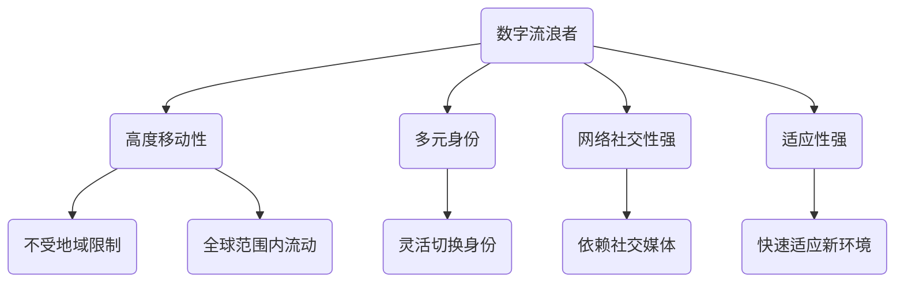

                 

### 什么是数字流浪者

#### 背景介绍

在数字时代，互联网的普及和移动互联网的发展使得人们的日常生活和工作模式发生了翻天覆地的变化。在这一背景下，出现了一个独特的群体——数字流浪者。他们不同于传统意义上的流浪者，而是在虚拟的网络世界中不断移动、探索和适应的个体。

数字流浪者，顾名思义，是指在数字世界中不断漫游、寻找新的机会和挑战的人群。他们可能是一位程序员，在多个项目之间无缝切换；也可能是一位自由职业者，依靠互联网在全球范围内为客户提供服务；还可能是一位创业者，利用数字平台探索新的商业机会。他们的生活方式和职业选择都具有高度灵活性和多样性。

#### 数字流浪者的特点

1. **高度移动性**：数字流浪者不受地域限制，可以在全球范围内自由流动。他们可能是为了寻找更好的工作机会、教育资源，或者仅仅是为了追求更宜居的环境。

2. **多元身份**：在数字世界中，数字流浪者可以轻松地拥有多个身份。这些身份可能是为了适应不同的社交圈子、职业需求或者个人兴趣。

3. **网络社交性强**：数字流浪者依赖于社交媒体和在线社区进行沟通和合作。他们通过互联网建立了广泛的人脉网络，这对于他们的职业发展和个人成长至关重要。

4. **适应性强**：数字流浪者必须具备快速适应新环境的能力。他们不仅要适应不同的文化和社会规范，还要适应不断变化的数字技术和市场趋势。

#### 数字流浪者的起源与发展

数字流浪者的概念起源于20世纪末和21世纪初的互联网浪潮。随着互联网的普及和信息技术的发展，越来越多的人开始利用网络进行工作和社交，从而形成了数字流浪者的雏形。

特别是在近年来，随着移动互联网的迅速发展和云计算技术的普及，数字流浪者的数量和影响力不断扩大。他们不仅在城市之间流动，还跨越国界，形成了全球范围内的数字社群。这一趋势在COVID-19疫情之后尤为明显，许多企业和员工转向远程工作，进一步推动了数字流浪者群体的壮大。

### 总结

数字流浪者是一个在数字时代崛起的特殊群体，他们以高度移动性、多元身份、网络社交性强和适应性强为特点，不断探索和适应新的数字世界。他们的出现不仅改变了人们的传统生活方式和职业选择，也对未来的社会发展产生了深远影响。在接下来的部分中，我们将进一步探讨数字世界的基本特征和数字流浪者面临的挑战。 

### 关键词

- 数字流浪者
- 高度移动性
- 多元身份
- 网络社交性
- 适应性强
- 数字时代
- 互联网
- 移动互联网
- 云计算
- 远程工作

### 摘要

本文将探讨数字流浪者这一特殊群体的定义、特点、起源和发展。通过分析他们在数字世界中的生活方式和面临的挑战，我们将探讨这一群体对现代社会的影响以及他们的未来趋势。文章旨在为数字流浪者提供自我认同和成长的方向，并探讨他们的社会责任和未来机遇。

