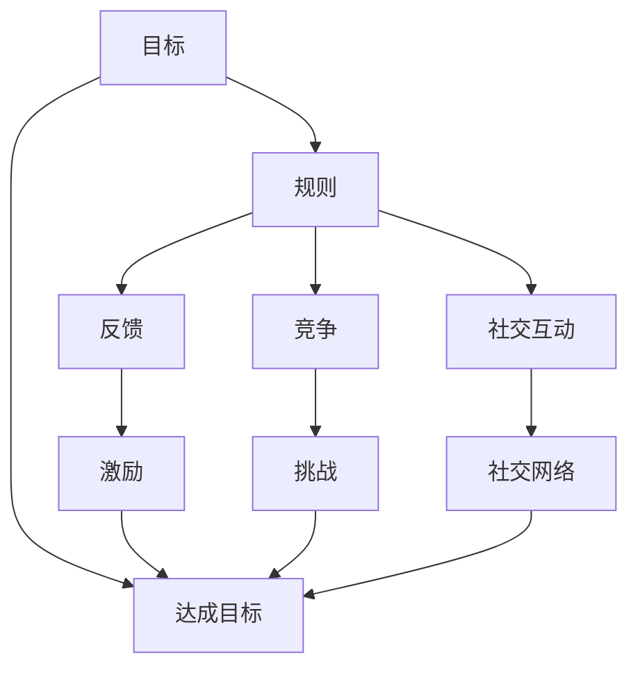

                 

### 什么是数字游戏化

#### 背景介绍

数字游戏化（Gamification）是一种将游戏设计元素和机制应用于非游戏环境中的策略，旨在通过增强用户体验和激励行为来提高参与度和生产力。这个概念最初由学者Deterding等人在2011年提出，他们将其定义为“将游戏设计元素和机制应用于非竞争性的活动，以激励参与和提供乐趣”。

数字游戏化在商业、教育、健康和社交等多个领域都得到了广泛应用。例如，企业可以使用游戏化来提高员工的工作积极性和忠诚度；教育机构可以通过游戏化来激发学生的学习兴趣和动力；医疗机构可以利用游戏化来促进患者的健康行为。

#### 核心概念与联系

数字游戏化的核心概念包括：

1. **目标**：明确用户需要达成的目标和任务。
2. **规则**：定义用户行为和互动的规则和限制。
3. **反馈**：通过奖励、评分和提示来提供即时的正面反馈。
4. **竞争**：设置挑战和竞争机制，激发用户的竞争心理。
5. **社交互动**：鼓励用户之间的社交互动，以增加参与度和用户忠诚度。

这些概念相互关联，共同构成了数字游戏化的基础架构。以下是这些概念之间的关系架构Mermaid流程图：



#### 核心算法原理讲解

为了更好地理解数字游戏化的原理，我们可以使用Python源代码来展示一个简单的积分系统。这个系统将跟踪用户的行动，并根据他们的表现分配积分。

```python
class GamificationSystem:
    def __init__(self):
        self.user_score = 0
        self.user_actions = []

    def add_action(self, action_type):
        self.user_actions.append(action_type)
        if action_type == 'task_completed':
            self.user_score += 10
        elif action_type == 'level_up':
            self.user_score += 20
        elif action_type == 'social_share':
            self.user_score += 5

    def display_score(self):
        print(f"Your current score is: {self.user_score}")

    def display_actions(self):
        print(f"Your recent actions: {self.user_actions}")

# 创建游戏化系统实例
game_system = GamificationSystem()

# 模拟用户行动
game_system.add_action('task_completed')
game_system.add_action('level_up')
game_system.add_action('social_share')

# 显示积分和行动记录
game_system.display_score()
game_system.display_actions()
```

在这个例子中，我们定义了一个`GamificationSystem`类，它包含用户的积分和行动记录。当用户完成一个任务、提升等级或分享内容时，系统会相应地增加积分。我们可以使用这个系统来跟踪用户的行为，并提供即时的反馈。

#### 数学模型与公式应用

在数字游戏化中，数学模型和公式可以用来评估和优化游戏化的效果。一个常见的数学模型是“学习曲线”，它描述了用户随着时间在游戏或学习中的进步。

```latex
y = a \cdot e^{-bx}
```

其中，`y` 是用户在某个时间点的技能水平或得分，`a` 和 `b` 是常数，用于调整曲线的形状和斜率。

以下是一个具体的例子：

$$
y = 10 \cdot e^{-0.1x}
$$

这个公式假设用户在开始时的技能水平为10，并且每经过一个时间单位，技能水平就会减少10%。

#### 项目实战

为了展示如何实现一个简单的数字游戏化项目，我们可以创建一个任务管理应用。在这个应用中，用户可以完成任务并获取积分，积分可以用来提升等级。

**开发环境搭建：**
- 选择Python作为主要编程语言
- 使用Flask框架搭建Web应用
- 使用SQLite数据库存储用户数据和任务信息

**源代码详细实现：**

```python
from flask import Flask, render_template, request, redirect, url_for
import sqlite3

app = Flask(__name__)

# 数据库连接
conn = sqlite3.connect('tasks.db')
c = conn.cursor()

# 创建任务表
c.execute('''CREATE TABLE IF NOT EXISTS tasks
             (id INTEGER PRIMARY KEY, title TEXT, completed INTEGER)''')
conn.commit()

# 添加任务
@app.route('/add_task', methods=['POST'])
def add_task():
    title = request.form['title']
    c.execute("INSERT INTO tasks (title, completed) VALUES (?, ?)", (title, 0))
    conn.commit()
    return redirect(url_for('home'))

# 完成任务
@app.route('/complete_task/<int:task_id>')
def complete_task(task_id):
    c.execute("UPDATE tasks SET completed = 1 WHERE id = ?", (task_id,))
    conn.commit()
    return redirect(url_for('home'))

# 主页面
@app.route('/')
def home():
    c.execute("SELECT * FROM tasks WHERE completed = 0")
    tasks = c.fetchall()
    return render_template('home.html', tasks=tasks)

if __name__ == '__main__':
    app.run(debug=True)
```

**代码解读与分析：**
- 我们首先创建了一个SQLite数据库，并定义了一个任务表。
- `add_task` 函数用于添加新任务到数据库。
- `complete_task` 函数用于标记任务为完成。
- `home` 函数显示未完成的任务列表。

**实际案例分析和详细讲解剖析：**
- 在这个例子中，用户可以添加任务，并通过点击完成任务。
- 每当用户完成一个任务，他们的积分会增加，这可以用来激励他们继续完成任务。

**项目小结：**
- 这个简单的任务管理应用展示了如何使用数字游戏化来激励用户完成任务。
- 通过增加积分和任务完成度，用户可以感受到自己的进步和成就感。

#### 最佳实践 Tips、小结、注意事项、拓展阅读

**最佳实践 Tips：**
- 在设计数字游戏化项目时，确保游戏化的目标和规则与实际业务需求相一致。
- 使用多样化的反馈机制，如即时反馈、成就奖励和排名系统。
- 定期评估和调整游戏化策略，以保持用户的兴趣和参与度。

**小结：**
- 数字游戏化通过将游戏元素应用于非游戏环境，提高了用户的参与度和动力。
- 通过设计明确的目标、规则和反馈机制，数字游戏化实现了寓教于乐的效果。

**注意事项：**
- 在应用数字游戏化时，要避免过度游戏化，以免用户感到疲惫或失去兴趣。
- 注意保护用户的隐私和数据安全，特别是在涉及敏感信息的情况下。

**拓展阅读：**
- Deterding, S., Khaled, R. & Nacke, L. (2011). "What is gamification?". Proceedings of the 2011 annual conference on Human factors in computing systems, pp. 2425–2428.
- Kirriemuir, J. & McFarland, D. (2011). "What is gamification and how does it work?". In proceedings of the 7th international conference on Advances in computer entertainment technology (ACE '11), pp. 1–11.
- Hamari, J., Koivisto, J. & Sarsa, H. (2014). "Does game-based design improve user experience? A framework and a case study". International Journal of Human-Computer Studies, 74(7), pp. 69-78.

通过上述步骤，我们深入探讨了数字游戏化的概念、原理和应用，为后续章节的内容奠定了坚实的基础。接下来，我们将进一步探讨数字游戏化的设计与开发，包括设计原则、核心算法和数学模型等。

