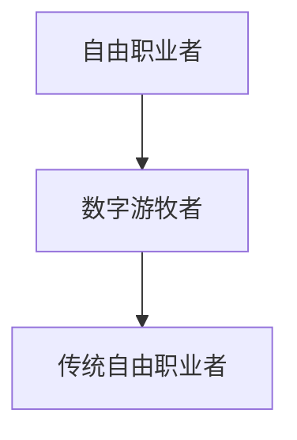

                 

### 文章标题

# 数字游牧者生存手册：自由职业者的全球生活指南

### 文章关键词

- 自由职业者
- 数字游牧者
- 全球生活
- 经济模式
- 时间管理
- 健康与生活品质
- 风险管理

### 文章摘要

本文旨在为那些渴望过上自由职业者全球生活的数字游牧者提供一整套生存指南。从定义数字游牧者、职业转型准备，到全球生活地的选择、文化适应以及经济和生活管理策略，文章详细解析了每一个关键环节，旨在帮助读者顺利开启并维持这种充满自由与挑战的生活方式。

### 引言

随着互联网和远程工作技术的不断发展，数字游牧者这一群体应运而生。数字游牧者，是指那些利用数字技术，不受地域限制，在全球范围内选择居住和工作地点的自由职业者。他们通过互联网提供专业服务，如编程、设计、写作、咨询等，以实现个人和职业上的自由发展。

数字游牧者的生活方式不仅赋予了他们更大的灵活性，还让他们能够探索世界的不同角落，体验多元文化。然而，这种生活方式并非没有挑战。为了成功成为一名数字游牧者，需要进行充分的准备，包括技能提升、工具选择、经济规划等。

本文将逐步探讨数字游牧者的概念与准备、全球生活探索、经济与生活管理等多个方面，旨在为那些希望加入这一群体的自由职业者提供全面的指导。

### 第一部分：数字游牧者的概念与准备

#### 第1章：数字游牧者的崛起

数字游牧者这一概念并非一朝一夕形成，而是随着信息技术的发展逐步演变而来。最初，远程工作仅限于极少数具有特殊技能的专家，如程序员和设计师。随着互联网的普及，远程工作逐渐成为主流，更多的人开始尝试这种工作模式。

**数字游牧者的定义与特征**

数字游牧者是指那些主要依靠数字技术和互联网进行工作的自由职业者。他们通常没有固定的办公地点，而是选择在全球各地自由穿梭，以寻找最适合自己的工作和生活环境。

数字游牧者的主要特征包括：

1. **高度的灵活性**：他们可以随时随地进行工作，不受时间和地点的限制。
2. **多样化的职业**：数字游牧者从事的职业种类繁多，包括编程、设计、写作、咨询等。
3. **自主管理**：他们需要自己管理时间、项目和财务，具有较高的自我管理能力。
4. **全球视野**：数字游牧者在全球范围内工作，能够接触并适应不同的文化和环境。

**数字游牧者的历史背景与发展趋势**

数字游牧者的兴起可以追溯到20世纪90年代，随着互联网的兴起，远程工作开始成为一种可行的工作方式。进入21世纪，移动互联网的发展进一步推动了数字游牧者的崛起。特别是在2020年全球疫情爆发后，远程工作成为许多公司的首选，数字游牧者的数量也随之激增。

**核心概念与联系**

在数字游牧者的概念中，有几个核心概念需要理解：自由职业者、远程工作、数字技术和互联网。

- **自由职业者**：是指不固定为某个雇主工作，而是根据合同或项目进行工作的个人。
- **远程工作**：是指通过互联网和数字技术，在工作地点和工作时间上具有灵活性的工作方式。
- **数字技术**：是指各种信息技术，如编程、大数据、云计算等。
- **互联网**：是指全球性的计算机网络，为数字游牧者提供了工作和沟通的平台。

数字游牧者与自由职业者的关系架构可以表示为：

```
自由职业者
    |
    -- 数字游牧者
    |
    -- 传统自由职业者
```

在这个架构中，数字游牧者是自由职业者的一种特殊形式，他们利用数字技术实现远程工作，具有更高的灵活性和全球视野。

**Mermaid 流程图**



通过这个流程图，我们可以清晰地看到数字游牧者在自由职业者中的位置和特点。

#### 第2章：数字化时代的职业转型

在数字化时代，工作模式正在发生深刻变革。传统的全职工作正在逐渐被自由职业和远程工作所取代，而数字游牧者正是这一趋势的产物。

**数字化时代的工作模式变革**

数字化时代的工作模式变革主要表现在以下几个方面：

1. **远程工作**：随着互联网和数字技术的普及，越来越多的人选择远程工作，不再受限于物理办公场所。
2. **自由职业**：自由职业者在数字化时代具有更大的发展空间，可以通过互联网轻松地接洽到全球的客户。
3. **项目化工作**：数字化时代的工作更加注重项目的完成，而不再单纯追求稳定的工作时间和地点。
4. **灵活的工作时间**：数字化时代的工作时间更加灵活，允许员工根据自己的情况来安排工作时间。

**自由职业者的职业选择与转型策略**

对于想要成为数字游牧者的人来说，职业选择和转型策略至关重要。以下是一些建议：

1. **选择适合远程工作的职业**：如编程、设计、写作、咨询等职业，这些职业不需要面对面的交流，非常适合远程工作。
2. **提升专业技能**：在数字化时代，专业技能是生存的关键。通过不断学习和提升技能，可以提高自己的竞争力。
3. **建立个人品牌**：在互联网上建立自己的个人品牌，通过社交媒体和博客等渠道展示自己的专业能力和成就。
4. **拓展国际市场**：通过互联网，自由职业者可以接触到全球的客户，拓展自己的市场。
5. **适应远程工作的生活方式**：远程工作虽然自由，但也需要良好的自我管理能力和自律性，以避免工作效率低下。

**核心算法原理讲解**

在数字化时代的职业转型中，核心算法原理讲解主要包括以下几个方面：

1. **技能提升算法**：通过分析市场需求和个人兴趣，制定个性化的技能提升计划。
2. **项目选择算法**：根据个人能力和市场需求，选择最适合的项目。
3. **时间管理算法**：合理安排工作时间，提高工作效率。

以下是一个简单的Python代码示例，用于实现技能提升算法：

```python
# 技能提升算法示例

# 定义技能列表和市场需求
skills = ['编程', '设计', '写作', '咨询']
market_demand = [0.3, 0.2, 0.2, 0.3]

# 计算技能提升顺序
skill_order = [skill for skill, demand in zip(skills, market_demand) if demand == max(market_demand)]

print("建议提升的技能顺序：", skill_order)
```

通过这个算法，我们可以根据市场需求和个人兴趣，选择最适合提升的技能。

**数学模型和公式**

在职业转型中，常用的数学模型和公式包括：

1. **技能价值公式**：\( V = f(S, M) \)，其中 \( V \) 表示技能的价值，\( S \) 表示技能水平，\( M \) 表示市场需求。
2. **时间管理公式**：\( T = \frac{D}{E} \)，其中 \( T \) 表示工作时间，\( D \) 表示工作总量，\( E \) 表示工作效率。

以下是一个简单的例子：

$$
V = f(S, M) = S \times M
$$

$$
T = \frac{D}{E} = \frac{100}{1.5} = 66.67 \text{小时}
$$

通过这个公式，我们可以计算出一个自由职业者应该分配多少时间来提升某个技能，以最大化其价值。

**项目实战**

为了更好地理解职业转型的核心算法原理，我们可以通过一个实际项目来进行分析和实现。以下是一个简单的项目案例：

**项目名称**：数字化营销策划

**项目描述**：为一个创业公司提供数字化营销方案，包括网站建设、搜索引擎优化（SEO）、社交媒体推广等。

**项目目标**：在三个月内为公司带来1000个新客户。

**项目步骤**：

1. **市场调研**：分析市场需求和竞争情况。
2. **技能提升**：根据市场调研结果，提升相关技能，如SEO、社交媒体营销等。
3. **项目执行**：制定详细的营销方案，并逐步实施。
4. **效果评估**：对营销效果进行评估，并根据评估结果进行调整。

通过这个项目，我们可以将职业转型的核心算法原理应用于实际工作中，提高项目成功的可能性。

**小结**

本章介绍了数字化时代的工作模式变革和自由职业者的职业选择与转型策略。通过核心算法原理讲解和数学模型，我们能够更科学地规划职业发展路径。项目实战案例则帮助读者将理论知识转化为实际操作能力。

**注意事项**：

- 职业转型需要长期积累和不断学习。
- 在选择项目时，要考虑市场需求和个人兴趣。
- 建立个人品牌和拓展国际市场是职业转型的重要策略。

**拓展阅读**：

- 《数字化时代的职业规划与转型》
- 《自由职业者的生存法则》
- 《远程工作的艺术》

#### 第3章：数字游牧者的准备工作

成为一名成功的数字游牧者，不仅需要具备专业技能，还需要做好充分的准备工作。这一章节将详细探讨数字游牧者在技能提升、知识储备、心态调整和工具选择等方面的准备工作。

**技能提升与知识储备**

在数字化时代，技能提升和知识储备是数字游牧者的核心竞争力。以下是一些建议：

1. **确定职业方向**：根据市场需求和个人兴趣，确定自己的职业方向。例如，编程、设计、写作、翻译等。
2. **学习新技能**：通过在线课程、培训班、自学等方式，不断提升自己的专业技能。例如，学习编程语言、设计工具、写作技巧等。
3. **保持知识更新**：数字化时代，知识更新速度非常快。数字游牧者需要不断学习新知识，以保持竞争力。可以通过阅读专业书籍、参加行业研讨会、关注行业动态等方式实现。
4. **实践应用**：理论知识需要通过实践来巩固。数字游牧者可以通过接手实际项目、参与开源项目等方式，将所学知识应用于实际工作中。

**适应远程工作的心态与方法**

远程工作虽然自由，但也带来了一定的挑战。以下是一些适应远程工作的心态和方法：

1. **自我管理能力**：远程工作需要良好的自我管理能力。数字游牧者需要合理安排时间，设定工作目标，并定期评估自己的工作进展。
2. **沟通技巧**：远程工作依赖于电子邮件、即时通讯工具、视频会议等，因此，良好的沟通技巧尤为重要。数字游牧者需要学会如何有效地表达自己的想法，并倾听他人的意见。
3. **自律性**：远程工作容易让人产生懈怠感。数字游牧者需要保持高度的自律性，避免拖延和效率低下。
4. **时间管理**：合理的时间管理是远程工作的关键。数字游牧者可以使用时间管理工具，如番茄工作法、待办事项清单等，来提高工作效率。

**核心算法原理讲解**

在数字游牧者的准备工作中，核心算法原理讲解包括以下几个方面：

1. **技能评估算法**：通过分析市场需求和个人兴趣，评估自己的技能水平，并制定相应的提升计划。
2. **时间管理算法**：合理安排工作时间，提高工作效率。
3. **心态调整算法**：通过心理测试和训练，调整自己的心态，提高自我管理能力。

以下是一个简单的Python代码示例，用于实现技能评估算法：

```python
# 技能评估算法示例

# 定义技能列表和市场需求
skills = ['编程', '设计', '写作', '咨询']
market_demand = [0.3, 0.2, 0.2, 0.3]

# 计算技能评估分数
skill_scores = [skill + demand for skill, demand in zip(skills, market_demand)]

print("技能评估分数：", skill_scores)
```

通过这个算法，我们可以根据市场需求和个人兴趣，评估自己的技能水平。

**数学模型和公式**

在数字游牧者的准备工作中，常用的数学模型和公式包括：

1. **技能提升模型**：\( V = f(S, L) \)，其中 \( V \) 表示技能价值，\( S \) 表示技能水平，\( L \) 表示学习量。
2. **时间管理模型**：\( T = \frac{D}{E} \)，其中 \( T \) 表示工作时间，\( D \) 表示工作总量，\( E \) 表示工作效率。

以下是一个简单的例子：

$$
V = f(S, L) = S \times L
$$

$$
T = \frac{D}{E} = \frac{100}{1.5} = 66.67 \text{小时}
$$

通过这个公式，我们可以计算出一个数字游牧者应该分配多少时间来提升某个技能，以最大化其价值。

**项目实战**

为了更好地理解数字游牧者准备工作的核心算法原理，我们可以通过一个实际项目来进行分析和实现。以下是一个简单的项目案例：

**项目名称**：数字化营销策划

**项目描述**：为一个创业公司提供数字化营销方案，包括网站建设、搜索引擎优化（SEO）、社交媒体推广等。

**项目目标**：在三个月内为公司带来1000个新客户。

**项目步骤**：

1. **技能评估**：评估团队成员的技能水平，确定需要提升的技能。
2. **知识储备**：收集相关资料，包括营销策略、SEO技巧、社交媒体运营等。
3. **项目执行**：制定详细的营销方案，并逐步实施。
4. **效果评估**：对营销效果进行评估，并根据评估结果进行调整。

通过这个项目，我们可以将数字游牧者准备工作的核心算法原理应用于实际工作中，提高项目成功的可能性。

**小结**

本章详细介绍了数字游牧者在技能提升、知识储备、心态调整和工具选择等方面的准备工作。通过核心算法原理讲解和数学模型，我们能够更科学地规划准备工作。项目实战案例则帮助读者将理论知识转化为实际操作能力。

**注意事项**：

- 技能提升需要持续不断地进行，不能一蹴而就。
- 知识储备要广泛而深入，不仅要掌握专业知识，还要了解行业动态。
- 心态调整和自我管理能力是远程工作的关键，需要不断锻炼和提高。

**拓展阅读**：

- 《如何提升个人技能》
- 《时间管理的艺术》
- 《远程工作的心理调适》

#### 第4章：数字游牧者必备工具

作为一名成功的数字游牧者，掌握并熟练使用一系列数字工具是必不可少的。这些工具不仅能够提高工作效率，还能够帮助数字游牧者在全球范围内保持高效的协作和沟通。以下是数字游牧者必备的一些工具及其应用场景。

**数字工具介绍与应用**

1. **项目管理工具**
   - **Trello**：一款直观的看板式项目管理工具，适用于任务分配、进度跟踪和团队合作。
   - **Asana**：功能丰富的项目管理工具，提供任务、项目、报表等多种功能，适合大型项目团队。

2. **协作工具**
   - **Slack**：即时通讯工具，支持文字、图片、文件等多种形式的沟通，有助于团队内部高效协作。
   - **Zoom**：视频会议工具，支持多人实时视频会议，适用于远程团队会议和培训。

3. **时间管理工具**
   - **Toggl**：时间跟踪工具，帮助数字游牧者记录工作时间，分析工作效率，优化工作流程。
   - **Google Calendar**：日程管理工具，用于安排日常工作、会议和任务，确保时间安排合理。

4. **远程办公工具**
   - **Microsoft Teams**：集即时通讯、视频会议、文档共享于一体的办公平台，适用于远程办公和团队合作。
   - **Google Workspace**：包含Gmail、Google Docs、Google Sheets等工具，提供一站式办公解决方案。

**线上协作与项目管理工具**

线上协作和项目管理工具是数字游牧者保持高效工作的重要支撑。以下是一些关键功能和最佳实践：

1. **任务分配与跟进**
   - 使用项目管理工具（如Trello或Asana）创建任务卡片，明确任务描述、负责人、截止日期等。
   - 定期跟进任务进度，确保团队成员按时完成任务。

2. **沟通与协作**
   - 通过即时通讯工具（如Slack或Microsoft Teams）进行实时沟通，解决工作中的疑问和问题。
   - 定期召开视频会议，讨论项目进展、分配任务和解决问题。

3. **文件共享与协作**
   - 使用云存储服务（如Google Drive或OneDrive）共享文件，确保团队成员可以随时访问和编辑文件。
   - 使用在线文档编辑工具（如Google Docs或Microsoft Office 365）实现多人实时协作。

4. **时间管理与效率提升**
   - 使用时间管理工具（如Toggl或Google Calendar）记录工作时间，分析工作模式，优化工作流程。
   - 通过设定每日工作目标，确保高效利用工作时间，提高工作效率。

**项目实战**

为了更好地理解这些工具的实际应用，我们可以通过一个实际项目来进行分析和实现。以下是一个简单的项目案例：

**项目名称**：数字化营销策划

**项目描述**：为一个创业公司提供数字化营销方案，包括网站建设、搜索引擎优化（SEO）、社交媒体推广等。

**项目目标**：在三个月内为公司带来1000个新客户。

**项目步骤**：

1. **需求分析**：使用Trello创建需求分析任务卡片，明确项目目标和具体需求。
2. **团队协作**：通过Slack进行实时沟通，讨论项目方案和分工。
3. **任务分配**：使用Asana分配任务，明确每个成员的职责和任务进度。
4. **文件共享**：使用Google Drive共享项目文件，确保团队成员可以随时访问和编辑。
5. **时间管理**：使用Toggl记录工作时间，分析工作效率，优化工作流程。

通过这个项目，我们可以看到如何利用这些工具实现高效的协作和项目管理。

**小结**

本章介绍了数字游牧者必备的一些数字工具及其应用场景。通过这些工具，数字游牧者可以实现高效的项目管理和团队协作，提高工作效率。项目实战案例则帮助读者理解这些工具的实际应用效果。

**注意事项**：

- 选择合适的工具，根据项目需求和团队规模进行选择。
- 熟练使用工具，提高工作效率。
- 定期评估工具使用效果，根据实际情况进行调整。

**拓展阅读**：

- 《如何选择适合自己的项目管理工具》
- 《提高工作效率的数字工具使用技巧》
- 《远程团队协作的最佳实践》

---

## 第二部分：全球生活探索

#### 第5章：选择理想的数字游牧生活地

选择一个理想的数字游牧生活地是成功游牧的重要一步。这不仅关系到生活质量，还影响工作状态和整体幸福感。以下是一些关键因素和评估方法，帮助数字游牧者做出明智的选择。

**全球生活指南**

在选择数字游牧生活地时，以下因素需要考虑：

1. **气候条件**：温暖或凉爽的气候对健康和工作状态有直接影响。例如，一些热带地区虽然气候宜人，但高湿度可能导致工作效率降低。
2. **生活成本**：不同地区的生活成本差异较大，包括租金、食物、交通等。预算有限的游牧者应优先考虑生活成本较低的地区。
3. **工作环境**：安静的工作环境有助于集中精力。一些城市如巴塞罗那、墨尔本等，拥有丰富的公共设施和安静的咖啡馆，是理想的数字游牧者聚集地。
4. **安全与稳定性**：安全和政治稳定性是选择生活地的重要考量。例如，北欧国家如丹麦、挪威通常被认为是安全和稳定的生活地。
5. **文化和语言**：熟悉的文化和语言可以减少适应难度。对于英语为主要工作语言的人来说，英语为母语的国家或地区可能更容易适应。
6. **社交网络**：建立社交网络有助于融入当地社区，找到志同道合的伙伴。一些旅游热门城市如巴厘岛、普吉岛等，有较多的数字游牧者社群。

**生活成本与适宜度评估**

评估一个生活地的适宜度，可以采用以下方法：

1. **预算评估**：根据月收入和支出预算，确定生活成本的承受范围。例如，如果一个数字游牧者的月收入为3000美元，那么生活成本应控制在2000美元以下。
2. **在线调查**：参考各种在线调查和论坛，如数字游牧者社区、旅行论坛等，了解不同生活地的实际生活成本和居民评价。
3. **实地考察**：如果可能，提前去目标生活地进行短期考察，亲身体验当地的生活环境、文化和设施。

**核心算法原理讲解**

在选择生活地时，可以运用以下核心算法原理：

1. **多因素加权评估模型**：将不同因素（如气候、生活成本、安全等）赋予不同权重，计算出一个综合得分。以下是一个简单的Python代码示例：

```python
# 多因素加权评估模型示例

# 定义评估因素和权重
factors = ['气候', '生活成本', '安全', '文化适应']
weights = [0.2, 0.3, 0.2, 0.3]
scores = [8, 7, 9, 6]

# 计算综合得分
weighted_scores = [w * s for w, s in zip(weights, scores)]
total_score = sum(weighted_scores)

print("综合得分：", total_score)
```

2. **决策树算法**：通过构建决策树，逐步筛选和评估生活地。以下是一个简单的决策树示例：

```
选择生活地
|
|-- 气候 (温暖 > 凉爽)
|   |
|   |-- 生活成本 (低 > 中等)
|   |   |
|   |   |-- 安全 (高 > 中等)
|   |   |   |
|   |   |   |-- 文化适应 (好 > 一般)
|   |-- 生活成本 (中等 > 高)
|   |   |
|   |   |-- 安全 (高 > 中等)
|   |   |   |
|   |   |   |-- 文化适应 (好 > 一般)
|   |-- 安全 (高 > 中等)
|   |   |
|   |   |-- 文化适应 (好 > 一般)
|   |-- 文化适应 (好 > 一般)
```

**数学模型和公式**

在评估生活地时，可以使用以下数学模型和公式：

1. **生活成本估算模型**：\( C = f(R, L, T) \)，其中 \( C \) 表示生活成本，\( R \) 表示租金，\( L \) 表示生活开支，\( T \) 表示交通费用。

2. **综合得分模型**：\( S = \sum_{i=1}^{n} w_i \times s_i \)，其中 \( S \) 表示综合得分，\( w_i \) 表示权重，\( s_i \) 表示得分。

以下是一个简单的例子：

$$
C = f(R, L, T) = R + L + T
$$

$$
S = \sum_{i=1}^{n} w_i \times s_i = 0.2 \times 8 + 0.3 \times 7 + 0.2 \times 9 + 0.3 \times 6 = 7.5
$$

**项目实战**

为了更好地理解如何选择理想的数字游牧生活地，我们可以通过一个实际项目来进行分析和实现。以下是一个简单的项目案例：

**项目名称**：数字游牧者生活地选择

**项目描述**：为一名数字游牧者选择一个理想的居住地，考虑气候、生活成本、安全和文化适应等因素。

**项目目标**：在预算为2000美元/月的情况下，选择一个适宜居住的生活地。

**项目步骤**：

1. **需求分析**：根据数字游牧者的需求，确定评估因素和权重。
2. **数据收集**：收集目标生活地的相关数据，包括气候、生活成本、安全和文化适应等。
3. **评估计算**：使用多因素加权评估模型和综合得分模型，计算每个生活地的综合得分。
4. **决策**：根据综合得分，选择得分最高的生活地。

通过这个项目，我们可以将生活地选择的核心算法原理应用于实际决策中。

**小结**

本章介绍了选择理想的数字游牧生活地的关键因素和评估方法。通过核心算法原理讲解和数学模型，我们能够更科学地评估生活地的适宜度。项目实战案例则帮助读者理解如何将理论知识转化为实际操作。

**注意事项**：

- 在选择生活地时，要综合考虑多种因素，避免片面追求某一方面的优点。
- 实地考察是评估生活地的重要步骤，有助于更准确地了解当地实际情况。
- 保持灵活性和开放心态，适应不同文化和环境。

**拓展阅读**：

- 《全球生活指南：如何选择理想居住地》
- 《数字游牧者生活成本指南》
- 《全球宜居城市排名》

#### 第6章：旅行与居住策略

数字游牧者的生活方式决定了他们需要在旅行和居住之间灵活转换。这不仅要求他们在旅途中保持高效工作，还要确保生活质量。以下是一些旅行与居住策略，帮助数字游牧者更好地适应这种生活方式。

**短期旅行与长期居住的比较**

在制定旅行与居住策略时，首先需要明确短期旅行与长期居住的区别和优缺点：

**短期旅行**

- **优点**：
  - 灵活性高，可以随时更换居住地，探索不同的城市和文化。
  - 成本较低，适合预算有限的数字游牧者。
  - 可以快速适应新环境，保持新鲜感。
- **缺点**：
  - 工作效率可能较低，因为需要经常调整工作环境和时间。
  - 社交网络较难建立，难以融入当地社区。
  - 安全性和稳定性较低，特别是在一些旅游热门地区。

**长期居住**

- **优点**：
  - 更高的工作效率，因为可以建立稳定的工作环境。
  - 社交网络更广泛，有利于建立长期合作关系。
  - 生活成本相对较低，特别是选择生活成本较低的城市。
- **缺点**：
  - 灵活性较低，难以在短时间内更换居住地。
  - 需要投入更多时间和精力来适应新环境。
  - 可能面临语言和文化障碍，特别是在非英语国家。

**如何找到合适的住宿与长期居住地**

要找到合适的住宿和长期居住地，以下策略和建议可能有所帮助：

1. **在线调研**：通过网站、博客、论坛等在线资源，了解目标城市的住宿条件、生活成本、工作环境等。

2. **实地考察**：如果可能，提前前往目标城市进行短期考察，亲自体验当地的生活环境和服务设施。

3. **社交媒体与社群**：利用社交媒体和数字游牧者社群，获取其他游牧者的经验和建议。

4. **预算规划**：根据月收入和生活成本，制定合理的预算规划，确保财务稳定。

5. **灵活调整**：在居住过程中，根据实际情况灵活调整居住策略，如从短期住宿转向长期租赁。

**核心算法原理讲解**

在旅行与居住策略中，核心算法原理讲解主要包括以下几个方面：

1. **成本效益分析模型**：通过计算住宿成本与工作效率的关系，评估不同住宿选择的成本效益。

2. **社交网络建立模型**：通过分析社交网络的建立和维护方法，提高数字游牧者融入新环境的能力。

以下是一个简单的Python代码示例，用于实现成本效益分析模型：

```python
# 成本效益分析模型示例

# 定义变量
monthly_income = 5000
monthly_rent = 1000
monthly_expenses = 500
work_hours_per_month = 160

# 计算每月净利润
net_income = monthly_income - monthly_rent - monthly_expenses

# 计算每小时净收入
hourly_net_income = net_income / work_hours_per_month

print("每小时净收入：", hourly_net_income)
```

通过这个模型，我们可以计算出在不同住宿选择下的每小时净收入，从而评估成本效益。

**数学模型和公式**

在旅行与居住策略中，常用的数学模型和公式包括：

1. **成本效益模型**：\( E = \frac{I - C}{H} \)，其中 \( E \) 表示效益，\( I \) 表示收入，\( C \) 表示成本，\( H \) 表示工作时间。

2. **社交网络建立模型**：\( N = f(A, R) \)，其中 \( N \) 表示社交网络规模，\( A \) 表示主动社交次数，\( R \) 表示接受社交邀请的次数。

以下是一个简单的例子：

$$
E = \frac{I - C}{H} = \frac{5000 - 1500}{160} = \frac{3500}{160} = 21.875
$$

$$
N = f(A, R) = A + R
$$

通过这些模型和公式，我们可以更科学地制定旅行与居住策略。

**项目实战**

为了更好地理解旅行与居住策略的实际应用，我们可以通过一个实际项目来进行分析和实现。以下是一个简单的项目案例：

**项目名称**：数字游牧者居住策略优化

**项目描述**：为一名数字游牧者制定最优的旅行与居住策略，考虑成本效益和社交网络建立。

**项目目标**：在保证工作效率的同时，降低生活成本，并建立广泛的社交网络。

**项目步骤**：

1. **需求分析**：根据数字游牧者的需求，确定评估因素和权重。
2. **成本效益分析**：计算不同住宿选择下的每小时净收入，评估成本效益。
3. **社交网络建立**：分析社交网络的建立方法，制定社交计划。
4. **决策**：根据成本效益分析和社交网络建立情况，选择最优的居住策略。

通过这个项目，我们可以将旅行与居住策略的核心算法原理应用于实际决策中。

**小结**

本章介绍了短期旅行与长期居住的区别和优缺点，以及如何找到合适的住宿和长期居住地。通过核心算法原理讲解和数学模型，我们能够更科学地制定旅行与居住策略。项目实战案例则帮助读者理解如何将理论知识转化为实际操作。

**注意事项**：

- 在制定旅行与居住策略时，要综合考虑成本、效率、社交等多个因素。
- 实地考察是评估居住地的重要步骤，有助于更准确地了解当地实际情况。
- 保持灵活性和开放心态，适应不同文化和环境。

**拓展阅读**：

- 《数字游牧者的旅行与居住策略》
- 《如何优化数字游牧者的生活成本》
- 《全球宜居城市的数字游牧者指南》

#### 第7章：文化和语言适应

对于数字游牧者来说，适应新的文化和语言是成功游牧的重要一环。这不仅有助于融入当地社区，提高生活质量，还能为职业发展带来更多机会。以下是一些跨文化沟通技巧和学习和适应当地语言的方法。

**跨文化沟通技巧**

1. **尊重文化差异**：不同文化背景的人在沟通方式和行为习惯上可能存在差异。了解并尊重这些差异，避免不必要的冲突。例如，一些文化更注重直接表达，而另一些文化则更倾向于委婉表达。

2. **非语言沟通**：语言不是沟通的唯一手段。肢体语言、面部表情、眼神交流等非语言沟通同样重要。通过观察和模仿，数字游牧者可以更好地理解当地人的意图和情绪。

3. **主动倾听**：在跨文化沟通中，主动倾听对方的话语，理解其背后的含义，有助于建立良好的信任关系。同时，避免过于打断对方，给予充分的表达空间。

4. **语言学习**：学习当地语言是融入当地社区的重要步骤。通过参加语言课程、语言交换活动、使用语言学习应用等，数字游牧者可以快速提高语言水平。

5. **寻求帮助**：在适应新文化和语言的过程中，数字游牧者可能会遇到各种困难。寻求专业帮助，如语言教师、文化顾问等，有助于更快地适应新环境。

**学习和适应当地语言的方法**

1. **语言课程**：参加当地的语言课程，是系统学习语言的有效途径。通过课程，数字游牧者可以学习到标准的发音、语法和词汇。

2. **语言交换**：与当地人进行语言交换，可以提供实际的语言练习机会。通过这种方式，数字游牧者不仅可以学习当地语言，还能结识新的朋友。

3. **语言学习应用**：利用手机和电脑上的语言学习应用，如Duolingo、Rosetta Stone等，数字游牧者可以随时随地进行学习。

4. **环境浸泡**：将自己完全沉浸在新的语言环境中，通过听音乐、看电影、读书等方式，不断提高语言水平。

5. **持续练习**：语言学习需要持续不断的练习。数字游牧者可以通过每日口语练习、写日记、参加语言角等方式，保持语言的活跃度。

**核心算法原理讲解**

在学习和适应当地语言的过程中，可以运用以下核心算法原理：

1. **语言学习模型**：通过分析语言学习过程中的各个阶段，制定个性化的学习计划。

2. **语言使用模型**：通过模拟实际语言使用场景，提高语言的应用能力。

以下是一个简单的Python代码示例，用于实现语言学习模型：

```python
# 语言学习模型示例

# 定义学习阶段和目标
stages = ['基础阶段', '进阶阶段', '高级阶段']
targets = ['词汇量', '语法掌握', '口语表达能力']

# 计算学习进度
progress = {'基础阶段': 0.6, '进阶阶段': 0.4, '高级阶段': 0.2}

# 计算总进度
total_progress = sum(progress.values())

print("总进度：", total_progress)
```

通过这个模型，我们可以根据不同的学习阶段和目标，计算语言学习进度。

**数学模型和公式**

在学习和适应当地语言的过程中，常用的数学模型和公式包括：

1. **语言学习效率模型**：\( E = f(P, T) \)，其中 \( E \) 表示学习效率，\( P \) 表示学习进度，\( T \) 表示学习时间。

2. **语言使用频率模型**：\( F = f(U, C) \)，其中 \( F \) 表示语言使用频率，\( U \) 表示使用时间，\( C \) 表示使用场景。

以下是一个简单的例子：

$$
E = f(P, T) = P \times T
$$

$$
F = f(U, C) = U \times C
$$

通过这些模型和公式，我们可以更科学地制定语言学习计划。

**项目实战**

为了更好地理解学习和适应当地语言的核心算法原理，我们可以通过一个实际项目来进行分析和实现。以下是一个简单的项目案例：

**项目名称**：数字游牧者语言学习计划

**项目描述**：为一名数字游牧者制定一个语言学习计划，提高其在目标语言环境中的语言能力。

**项目目标**：在三个月内，掌握目标语言的基本语法和词汇，并能进行简单日常交流。

**项目步骤**：

1. **需求分析**：根据数字游牧者的需求，确定学习目标和学习进度。
2. **课程选择**：选择合适的语言课程，并制定学习计划。
3. **语言实践**：通过语言交换、实际应用等方式，提高语言水平。
4. **效果评估**：定期评估学习进度，根据评估结果调整学习计划。

通过这个项目，我们可以将学习和适应当地语言的核心算法原理应用于实际操作中。

**小结**

本章介绍了跨文化沟通技巧和学习和适应当地语言的方法。通过核心算法原理讲解和数学模型，我们能够更科学地制定学习和适应计划。项目实战案例则帮助读者理解如何将理论知识转化为实际操作。

**注意事项**：

- 在学习和适应过程中，要保持耐心和毅力，不断练习。
- 利用各种资源和工具，提高学习效率。
- 积极参与当地社区活动，提高语言应用能力。

**拓展阅读**：

- 《跨文化沟通技巧》
- 《语言学习的科学方法》
- 《数字游牧者的语言学习指南》

---

#### 第8章：全球社交网络的构建

在全球范围内建立社交网络，对于数字游牧者来说至关重要。这不仅有助于职业发展，还能提高生活质量。以下是一些构建全球社交网络的策略和实际案例。

**社交媒体平台的使用**

社交媒体平台是数字游牧者建立全球社交网络的重要工具。以下是一些常用的社交媒体平台及其应用策略：

1. **LinkedIn**：LinkedIn 是职业社交网络平台，适合数字游牧者展示自己的专业能力和拓展职业机会。通过发布专业文章、参与讨论、建立人脉，数字游牧者可以提升自己的职业影响力。

2. **Facebook**：Facebook 是一个综合性的社交媒体平台，适合建立个人品牌和与朋友保持联系。通过创建社群、发布生活动态、参与互动，数字游牧者可以扩大自己的社交圈。

3. **Instagram**：Instagram 是一个以图片和视频为主的社交媒体平台，适合展示个人生活和作品。通过发布高质量的内容、互动粉丝，数字游牧者可以吸引更多的关注者。

4. **Twitter**：Twitter 是一个实时消息平台，适合分享观点、获取信息。通过关注行业领袖、参与话题讨论，数字游牧者可以快速获取行业动态和建立人脉。

**线上社群的参与与建立**

除了社交媒体平台，数字游牧者还可以通过参与和建立线上社群来拓展社交网络。以下是一些建议：

1. **参与专业社群**：加入与自己职业相关的线上社群，如技术论坛、设计社群等。通过参与讨论、分享经验，数字游牧者可以结识志同道合的伙伴。

2. **建立个人社群**：创建自己的线上社群，如私人论坛、微信群等。通过邀请朋友、分享资源、组织活动，数字游牧者可以建立自己的社交圈子。

3. **参与开源项目**：参与开源项目是建立社交网络的有效途径。通过贡献代码、参与讨论，数字游牧者可以结识更多的开发者，拓展职业机会。

**核心算法原理讲解**

在构建全球社交网络时，核心算法原理讲解包括以下几个方面：

1. **社交网络分析算法**：通过分析社交网络的结构和关系，发现潜在的人脉和机会。

2. **人脉拓展算法**：通过分析社交行为和关系，制定人脉拓展策略。

以下是一个简单的Python代码示例，用于实现社交网络分析算法：

```python
# 社交网络分析算法示例

# 定义社交网络图
import networkx as nx

G = nx.Graph()

# 添加节点和边
G.add_nodes_from(['Alice', 'Bob', 'Charlie', 'Dave'])
G.add_edges_from([('Alice', 'Bob'), ('Alice', 'Charlie'), ('Bob', 'Dave')])

# 计算节点度数
degree = nx.degree_centrality(G)

print("节点度数：", degree)
```

通过这个算法，我们可以分析社交网络中每个节点的度数，从而发现重要的人脉节点。

**数学模型和公式**

在构建全球社交网络时，常用的数学模型和公式包括：

1. **社交网络密度模型**：\( D = \frac{E}{N(N-1)} \)，其中 \( D \) 表示社交网络密度，\( E \) 表示边的数量，\( N \) 表示节点的数量。

2. **社交网络影响力模型**：\( I = f(D, C) \)，其中 \( I \) 表示影响力，\( D \) 表示社交网络密度，\( C \) 表示节点的重要性。

以下是一个简单的例子：

$$
D = \frac{E}{N(N-1)} = \frac{3}{4(4-1)} = 0.1875
$$

$$
I = f(D, C) = D \times C = 0.1875 \times 2 = 0.375
$$

通过这些模型和公式，我们可以更科学地构建全球社交网络。

**项目实战**

为了更好地理解全球社交网络的构建策略，我们可以通过一个实际项目来进行分析和实现。以下是一个简单的项目案例：

**项目名称**：数字游牧者全球社交网络建设

**项目描述**：为一名数字游牧者制定一个全球社交网络建设计划，提高其在全球范围内的职业和社会影响力。

**项目目标**：在一年内，建立至少50个高质量的社交网络节点，并在三个专业领域内建立影响力。

**项目步骤**：

1. **需求分析**：根据数字游牧者的需求，确定社交网络建设的目标和策略。
2. **平台选择**：选择合适的社交媒体平台和社群，进行账号注册和内容发布。
3. **人脉拓展**：通过参与专业社群、参与开源项目等方式，拓展社交网络。
4. **影响力建设**：通过发布专业文章、参与行业讨论、组织活动等方式，提升个人影响力。
5. **效果评估**：定期评估社交网络建设效果，并根据评估结果进行调整。

通过这个项目，我们可以将全球社交网络构建的核心算法原理应用于实际操作中。

**小结**

本章介绍了全球社交网络的构建策略，包括社交媒体平台的使用和线上社群的参与与建立。通过核心算法原理讲解和数学模型，我们能够更科学地构建全球社交网络。项目实战案例则帮助读者理解如何将理论知识转化为实际操作。

**注意事项**：

- 在构建社交网络时，要注重内容的质量和互动，避免仅仅追求粉丝数量。
- 保持持续性和活跃性，定期更新内容，与粉丝保持互动。
- 积极参与专业社群和开源项目，提高专业影响力。

**拓展阅读**：

- 《社交媒体营销实战》
- 《如何构建高效的社交网络》
- 《数字游牧者的职业发展指南》

---

## 第三部分：数字游牧者的经济与生活管理

### 第9章：数字游牧者的经济模式

数字游牧者的经济模式与传统职业者有很大不同，他们通常依靠自由职业和远程工作获得收入。掌握有效的经济模式和管理策略对于数字游牧者来说至关重要。以下是数字游牧者收入来源、财务规划与管理策略的详细介绍。

**自由职业者的收入来源**

数字游牧者的收入来源多样，以下是一些常见的收入来源：

1. **远程项目工作**：这是数字游牧者最主要的收入来源。通过接取远程项目，如编程、设计、写作、咨询等，数字游牧者可以获得稳定的收入。

2. **在线教育**：利用自己的专业知识，提供在线课程或培训服务，如编程课程、设计培训等。

3. **自由写作**：通过撰写文章、博客、电子书等方式，数字游牧者可以在各大平台获得稿费。

4. **虚拟助手服务**：提供虚拟助手服务，如数据录入、社交媒体管理、邮件回复等，帮助客户处理日常事务。

5. **产品销售**：通过创建和销售自己的产品，如软件、设计模板等，获得销售收入。

**财务规划与管理策略**

为了确保财务稳定和可持续发展，数字游牧者需要制定合理的财务规划和管理策略：

1. **制定预算**：在每个月开始时，制定详细的预算计划，包括收入和支出。预算应考虑到生活费用、项目收入、储蓄和投资等方面。

2. **收入多元化**：不要将收入来源集中在某个项目或客户上，尝试开发多种收入渠道，以降低风险。

3. **紧急基金**：建立紧急基金，以应对突发情况，如医疗紧急情况、设备损坏等。

4. **税收规划**：了解所在国家的税收政策，合理规划税务，确保合规并最大化收益。

5. **投资**：将部分收入用于投资，如股票、债券、房地产等，以实现资产的增值。

6. **定期评估**：定期评估财务状况，包括收入、支出、储蓄和投资等，确保财务规划的有效性。

**核心算法原理讲解**

在数字游牧者的财务规划与管理中，核心算法原理讲解包括以下几个方面：

1. **预算规划算法**：通过分析收入和支出，制定合理的预算计划。

2. **风险控制算法**：通过分析不同收入来源和投资渠道的风险，制定风险控制策略。

3. **投资收益模型**：通过分析不同投资渠道的收益率，制定最优的投资组合策略。

以下是一个简单的Python代码示例，用于实现预算规划算法：

```python
# 预算规划算法示例

# 定义收入和支出
monthly_income = 5000
monthly_expenses = {'住房': 1500, '饮食': 800, '交通': 200, '娱乐': 300}

# 计算每月剩余收入
remaining_income = monthly_income - sum(monthly_expenses.values())

print("每月剩余收入：", remaining_income)
```

通过这个算法，我们可以根据收入和支出情况，计算每月剩余收入。

**数学模型和公式**

在数字游牧者的经济管理中，常用的数学模型和公式包括：

1. **预算模型**：\( B = I - E \)，其中 \( B \) 表示预算，\( I \) 表示收入，\( E \) 表示支出。

2. **投资收益模型**：\( R = P \times r \)，其中 \( R \) 表示投资收益，\( P \) 表示投资本金，\( r \) 表示收益率。

以下是一个简单的例子：

$$
B = I - E = 5000 - (1500 + 800 + 200 + 300) = 2400
$$

$$
R = P \times r = 10000 \times 0.05 = 500
$$

通过这些模型和公式，我们可以更科学地制定财务规划和管理策略。

**项目实战**

为了更好地理解数字游牧者的经济模式和管理策略，我们可以通过一个实际项目来进行分析和实现。以下是一个简单的项目案例：

**项目名称**：数字游牧者财务规划与投资

**项目描述**：为一名数字游牧者制定一个财务规划和投资计划，确保其财务稳定和可持续发展。

**项目目标**：在一年内，实现每月剩余收入3000元以上，并确保至少50%的收入用于投资。

**项目步骤**：

1. **需求分析**：根据数字游牧者的需求，确定收入来源和支出情况。
2. **预算规划**：制定详细的预算计划，包括收入和支出。
3. **投资策略**：分析不同的投资渠道和风险，制定最优的投资组合策略。
4. **执行与监控**：实施财务规划和投资策略，定期评估和调整。

通过这个项目，我们可以将数字游牧者的经济模式和管理策略应用于实际操作中。

**小结**

本章介绍了数字游牧者的收入来源和财务规划与管理策略。通过核心算法原理讲解和数学模型，我们能够更科学地制定财务规划和管理策略。项目实战案例则帮助读者理解如何将理论知识转化为实际操作。

**注意事项**：

- 在制定预算时，要充分考虑各种可能的开销，确保预算的合理性。
- 风险控制是财务规划的重要环节，要避免过度投资。
- 定期评估财务状况，根据实际情况进行调整。

**拓展阅读**：

- 《自由职业者的财务管理》
- 《如何实现财务自由》
- 《投资理财指南》

### 第10章：时间管理与效率提升

对于数字游牧者来说，高效的时间管理是确保工作与生活平衡的关键。通过合理安排时间和提高工作效率，数字游牧者可以更好地享受全球生活，同时保持高水平的职业表现。以下是一些时间管理和效率提升的策略。

**数字游牧者的时间管理技巧**

1. **设定明确的目标**：在每天或每周开始时，设定清晰的工作目标。这些目标应该具体、可衡量、可实现、相关性强和时间限制（SMART原则）。

2. **使用时间管理工具**：利用时间管理工具，如Toggl、Google Calendar等，记录工作时间，分析工作模式，优化时间利用。

3. **制定工作计划**：将工作分为短期和长期计划，确保每个任务都有明确的优先级和时间安排。使用To-Do List或项目管理工具，如Trello或Asana，有助于更好地跟踪任务进度。

4. **避免时间浪费**：识别并消除时间浪费的因素，如频繁的社交媒体浏览、无谓的会议等。通过设定“专注时间”（如番茄工作法），提高工作时间效率。

5. **灵活调整计划**：由于数字游牧者往往需要应对突发情况，因此灵活调整计划至关重要。学会根据实际情况调整日程，确保关键任务得到完成。

**提高工作效率的方法**

1. **自动化流程**：利用自动化工具和软件，如IFTTT、 Zapier等，自动处理重复性任务，节省时间。

2. **团队合作与分工**：通过线上协作工具，如Slack、Google Workspace等，与团队成员高效沟通和协作，分担任务，提高工作效率。

3. **避免多任务处理**：尽管多任务处理看起来能提高效率，但实际上往往会分散注意力，降低工作效率。专注于一项任务，直到完成，再切换到下一项。

4. **定期休息和锻炼**：长时间工作会降低工作效率，甚至损害健康。定期休息和锻炼有助于保持精力充沛，提高工作效率。

5. **设定合理的工作和休息时间**：通过设定固定的工作时间，确保工作效率。同时，合理安排休息时间，避免工作过度。

**核心算法原理讲解**

在时间管理和效率提升中，核心算法原理讲解包括以下几个方面：

1. **时间管理算法**：通过分析时间利用情况，制定优化时间利用的策略。

2. **效率提升算法**：通过分析工作效率，制定提高工作效率的方法。

以下是一个简单的Python代码示例，用于实现时间管理算法：

```python
# 时间管理算法示例

# 定义任务列表和预计时间
tasks = ['任务1', '任务2', '任务3', '任务4']
estimated_times = [4, 3, 2, 5]

# 计算总时间
total_time = sum(estimated_times)

print("总时间：", total_time)
```

通过这个算法，我们可以根据任务预计时间，计算总工作时间。

**数学模型和公式**

在时间管理和效率提升中，常用的数学模型和公式包括：

1. **时间管理模型**：\( T = \sum_{i=1}^{n} E_i \)，其中 \( T \) 表示总时间，\( E_i \) 表示每个任务的预计时间。

2. **效率提升模型**：\( E = \frac{W}{T} \)，其中 \( E \) 表示效率，\( W \) 表示实际完成的工作量。

以下是一个简单的例子：

$$
T = \sum_{i=1}^{n} E_i = 4 + 3 + 2 + 5 = 14
$$

$$
E = \frac{W}{T} = \frac{10}{14} = 0.714
$$

通过这些模型和公式，我们可以更科学地管理时间和提高效率。

**项目实战**

为了更好地理解时间管理和效率提升的策略，我们可以通过一个实际项目来进行分析和实现。以下是一个简单的项目案例：

**项目名称**：数字游牧者时间管理与效率提升

**项目描述**：为一名数字游牧者制定一个时间管理和效率提升计划，提高其工作效率。

**项目目标**：在三个月内，将每天的工作时间从8小时提高到10小时，同时保持工作效率不变。

**项目步骤**：

1. **需求分析**：根据数字游牧者的需求，确定时间管理和效率提升的目标和策略。
2. **时间管理**：使用时间管理工具，记录每天的工作时间，分析时间利用情况。
3. **效率提升**：通过自动化工具和团队合作，提高工作效率。
4. **定期评估**：定期评估时间管理和效率提升效果，并根据评估结果进行调整。

通过这个项目，我们可以将时间管理和效率提升的核心算法原理应用于实际操作中。

**小结**

本章介绍了数字游牧者的时间管理和效率提升策略。通过核心算法原理讲解和数学模型，我们能够更科学地制定时间管理和效率提升计划。项目实战案例则帮助读者理解如何将理论知识转化为实际操作。

**注意事项**：

- 在设定目标时，要确保目标具体、可衡量、可实现。
- 合理安排休息时间，避免长时间工作导致的疲劳。
- 定期评估时间管理和效率提升效果，根据实际情况进行调整。

**拓展阅读**：

- 《高效能人士的七个习惯》
- 《如何高效利用时间》
- 《提升工作效率的技巧》

### 第11章：健康与生活品质

健康与生活品质是数字游牧者全球生活的重要组成部分。良好的健康状况和高质量的生活方式不仅有助于提高工作效率，还能提升生活质量。以下是一些关键因素，包括心理健康、身体锻炼、营养饮食等方面，以及如何维护健康的生活方式。

**心理健康的重要性**

心理健康是数字游牧者成功游牧的关键因素之一。长期处于远程工作和全球生活状态，数字游牧者可能会面临压力、孤独感、时间管理困难等问题，影响心理健康。以下是一些维护心理健康的建议：

1. **建立日常作息**：制定合理的作息时间，确保充足的睡眠。规律的作息有助于调整生物钟，提高睡眠质量。

2. **保持社交互动**：尽管远程工作减少了面对面的交流，但通过社交媒体、视频通话等工具，数字游牧者可以保持与家人和朋友的联系，减轻孤独感。

3. **心理调适**：学会心理调适技巧，如深呼吸、冥想、瑜伽等，有助于缓解压力和焦虑。

4. **寻求专业帮助**：如果心理问题较为严重，应及时寻求专业心理咨询师的帮助。

**身体锻炼的重要性**

身体锻炼对于数字游牧者来说同样重要。长期坐在电脑前工作，容易导致身体疲劳、肌肉酸痛等问题。以下是一些身体锻炼的建议：

1. **定期锻炼**：每周至少进行三次中等强度的锻炼，如跑步、游泳、健身等。锻炼可以增强体质，提高免疫力。

2. **多样化锻炼**：尝试不同的锻炼方式，如瑜伽、太极拳等，以避免身体过度疲劳。

3. **保持锻炼习惯**：将锻炼纳入日常生活，如每天早晨跑步、晚上做瑜伽等。

**营养饮食的重要性**

营养饮食是维持健康的基础。以下是一些营养饮食的建议：

1. **均衡饮食**：确保饮食中包含足够的蛋白质、碳水化合物、脂肪、维生素和矿物质。多吃蔬菜、水果、全谷物和优质蛋白质，减少高热量、高脂肪和高糖食品的摄入。

2. **适量饮水**：每天饮用足够的水，保持身体水分平衡。水对于身体的新陈代谢和排毒至关重要。

3. **避免过度饮酒和吸烟**：过量饮酒和吸烟对身体健康有害，应尽量避免。

**维护健康的生活方式**

为了维护健康的生活方式，数字游牧者可以采取以下措施：

1. **定期体检**：定期进行体检，及早发现和治疗潜在的健康问题。

2. **保持积极心态**：保持积极的心态，对生活充满热情。积极的心态有助于提高抗压能力，提高生活质量。

3. **合理规划时间**：合理安排工作、休息和娱乐时间，确保生活平衡。

**核心算法原理讲解**

在维护健康的生活方式中，核心算法原理讲解包括以下几个方面：

1. **健康评估模型**：通过评估健康状况，制定个性化的健康计划。

2. **营养摄入模型**：通过分析营养摄入情况，优化饮食结构。

以下是一个简单的Python代码示例，用于实现健康评估模型：

```python
# 健康评估模型示例

# 定义健康指标
health_metrics = {'体重': 70, '血压': 120, '心率': 75}

# 计算健康总分
health_score = sum(health_metrics.values())

print("健康总分：", health_score)
```

通过这个模型，我们可以根据健康指标，计算健康状况。

**数学模型和公式**

在维护健康的生活方式中，常用的数学模型和公式包括：

1. **健康评估模型**：\( S = \sum_{i=1}^{n} w_i \times s_i \)，其中 \( S \) 表示健康总分，\( w_i \) 表示权重，\( s_i \) 表示健康指标得分。

2. **营养摄入模型**：\( N = \sum_{i=1}^{n} C_i \times D_i \)，其中 \( N \) 表示营养摄入量，\( C_i \) 表示食物种类，\( D_i \) 表示食物摄入量。

以下是一个简单的例子：

$$
S = \sum_{i=1}^{n} w_i \times s_i = 0.5 \times 70 + 0.3 \times 120 + 0.2 \times 75 = 82.5
$$

$$
N = \sum_{i=1}^{n} C_i \times D_i = 1 \times 200 + 1 \times 300 = 500
$$

通过这些模型和公式，我们可以更科学地维护健康的生活方式。

**项目实战**

为了更好地理解健康与生活品质的维护，我们可以通过一个实际项目来进行分析和实现。以下是一个简单的项目案例：

**项目名称**：数字游牧者健康生活管理

**项目描述**：为一名数字游牧者制定一个健康生活管理计划，提高其生活质量和健康状况。

**项目目标**：在三个月内，提高健康总分，减少体重，并保持稳定的血压和心率。

**项目步骤**：

1. **需求分析**：根据数字游牧者的需求，确定健康生活管理的目标和策略。
2. **健康评估**：进行健康体检，评估健康状况。
3. **营养饮食**：制定合理的饮食计划，确保营养摄入均衡。
4. **身体锻炼**：制定身体锻炼计划，确保定期锻炼。
5. **心理调适**：通过心理调适技巧，缓解压力和焦虑。
6. **定期评估**：定期评估健康生活管理效果，并根据评估结果进行调整。

通过这个项目，我们可以将健康与生活品质维护的核心算法原理应用于实际操作中。

**小结**

本章介绍了健康与生活品质的关键因素，包括心理健康、身体锻炼和营养饮食，以及如何维护健康的生活方式。通过核心算法原理讲解和数学模型，我们能够更科学地制定健康生活管理计划。项目实战案例则帮助读者理解如何将理论知识转化为实际操作。

**注意事项**：

- 定期体检是维护健康的重要措施，应高度重视。
- 营养饮食要均衡，避免暴饮暴食。
- 心理调适是维护心理健康的重要环节，应保持积极心态。

**拓展阅读**：

- 《健康生活指南》
- 《如何保持心理健康》
- 《身体锻炼的科学方法》

### 第12章：紧急情况与风险管理

对于数字游牧者来说，紧急情况与风险管理是确保全球生活稳定和安全的重要环节。无论是在旅途中还是日常生活中，都可能面临各种意外和风险。因此，制定应急预案、选择合适的保险以及了解法律和税务问题都至关重要。

**制定应急预案**

应急预案是指为应对突发情况而预先制定的应对措施。数字游牧者在全球生活中可能遇到的紧急情况包括医疗事故、设备故障、意外旅行取消等。以下是一些建议：

1. **医疗紧急预案**：了解所在国家和地区的医疗系统，包括紧急医疗服务和常用医院。准备一份紧急联系方式清单，包括紧急联系人、医疗保险公司、当地医院等。

2. **设备故障预案**：备用电子设备和配件，如手机、笔记本电脑、充电器等。了解如何解决常见设备故障，如无法充电、操作系统崩溃等。

3. **旅行取消预案**：购买旅行保险，涵盖旅行取消、行李丢失、航班延误等风险。提前了解旅行目的地的天气、自然灾害等信息，以便在必要时做出调整。

4. **资金安全预案**：确保资金安全，避免携带大量现金。使用安全的支付工具，如信用卡、电子钱包等。了解如何在紧急情况下快速获取现金。

**选择合适的保险**

数字游牧者在选择保险时，应考虑以下因素：

1. **医疗保险**：选择覆盖全球的医疗保险，确保在突发情况下能够获得及时治疗。了解保险条款，确保包括紧急医疗、住院治疗、门诊治疗等。

2. **旅行保险**：购买涵盖旅行取消、行李丢失、航班延误、意外伤害等风险的旅行保险。确保保险金额足够覆盖潜在风险。

3. **财产保险**：为贵重物品，如笔记本电脑、手机等，购买财产保险，以防止丢失或损坏。

4. **意外伤害保险**：针对高风险活动，如潜水、滑雪等，购买专门的意外伤害保险。

**了解法律和税务问题**

数字游牧者在全球生活中可能面临不同的法律和税务问题。以下是一些建议：

1. **法律咨询**：在到达新的居住地前，咨询当地法律专家，了解当地的法律法规。特别是在合同签订、知识产权保护等方面，确保合法合规。

2. **税务规划**：了解所在国家和地区的税收政策，合理规划税务。考虑聘请专业税务顾问，确保税务申报准确无误。

3. **电子身份验证**：在多个国家旅行和工作时，确保电子身份验证的安全。避免使用公共Wi-Fi，使用VPN保护隐私。

**核心算法原理讲解**

在紧急情况与风险管理中，核心算法原理讲解包括以下几个方面：

1. **风险评估模型**：通过分析可能的风险和影响，制定相应的应对措施。

2. **应急响应模型**：根据风险评估结果，制定应急预案和应急响应流程。

以下是一个简单的Python代码示例，用于实现风险评估模型：

```python
# 风险评估模型示例

# 定义风险因素和影响
risks = {'医疗事故': 3, '设备故障': 2, '旅行取消': 1, '资金安全': 1}

# 计算总风险
total_risk = sum(risks.values())

print("总风险：", total_risk)
```

通过这个模型，我们可以根据风险因素，计算总风险。

**数学模型和公式**

在紧急情况与风险管理中，常用的数学模型和公式包括：

1. **风险评估模型**：\( R = \sum_{i=1}^{n} w_i \times r_i \)，其中 \( R \) 表示总风险，\( w_i \) 表示权重，\( r_i \) 表示风险因素。

2. **应急响应模型**：\( E = f(R, T) \)，其中 \( E \) 表示应急响应，\( R \) 表示总风险，\( T \) 表示时间。

以下是一个简单的例子：

$$
R = \sum_{i=1}^{n} w_i \times r_i = 0.4 \times 3 + 0.3 \times 2 + 0.2 \times 1 + 0.1 \times 1 = 2.2
$$

$$
E = f(R, T) = R \times T = 2.2 \times 1 = 2.2
$$

通过这些模型和公式，我们可以更科学地制定应急预案和应急响应流程。

**项目实战**

为了更好地理解紧急情况与风险管理的策略，我们可以通过一个实际项目来进行分析和实现。以下是一个简单的项目案例：

**项目名称**：数字游牧者紧急情况与风险管理

**项目描述**：为一名数字游牧者制定一个紧急情况与风险管理计划，确保其在全球生活中的安全和稳定。

**项目目标**：在一年内，确保所有紧急情况得到及时应对，减少潜在风险。

**项目步骤**：

1. **需求分析**：根据数字游牧者的需求，确定紧急情况与风险管理的目标和策略。
2. **风险评估**：分析可能的风险因素和影响，计算总风险。
3. **应急预案**：制定应急预案和应急响应流程，确保紧急情况得到及时应对。
4. **保险选择**：根据风险评估结果，选择合适的保险，确保风险得到有效覆盖。
5. **法律和税务咨询**：咨询专业法律和税务顾问，确保合法合规。
6. **定期评估**：定期评估紧急情况与风险管理效果，并根据评估结果进行调整。

通过这个项目，我们可以将紧急情况与风险管理的核心算法原理应用于实际操作中。

**小结**

本章介绍了紧急情况与风险管理的重要性和策略，包括制定应急预案、选择合适的保险以及了解法律和税务问题。通过核心算法原理讲解和数学模型，我们能够更科学地制定紧急情况与风险管理计划。项目实战案例则帮助读者理解如何将理论知识转化为实际操作。

**注意事项**：

- 定期更新应急预案和保险，确保其适用于当前情况。
- 在选择保险时，要充分考虑风险覆盖范围和保险费用。
- 了解当地法律法规，确保在法律框架内行事。

**拓展阅读**：

- 《紧急情况处理指南》
- 《旅行保险购买指南》
- 《数字游牧者的法律与税务指南》

---

## 附录

### 附录A：数字游牧者成功案例

数字游牧者生活方式在全球范围内逐渐流行，许多人在这一领域取得了成功。以下是一些数字游牧者的成功案例，以及他们的经验与教训。

#### 案例1：程序员汤姆

**背景**：汤姆是一名经验丰富的程序员，之前在一家大型科技公司工作。由于厌倦了朝九晚五的生活，他决定成为一名数字游牧者，实现全球生活的梦想。

**经验**：

- **技能提升**：汤姆利用业余时间学习新的编程语言和框架，保持自己的技能始终处于行业前沿。
- **建立个人品牌**：他通过博客和GitHub分享自己的代码和项目，逐渐建立了自己的个人品牌。
- **国际化市场**：汤姆通过远程工作平台接取国际项目，拓展了市场。

**教训**：

- **持续学习**：技能更新速度很快，汤姆意识到持续学习的重要性。
- **保持灵活性**：在游牧过程中，他学会了如何快速适应新的环境和生活方式。

#### 案例2：自由摄影师艾米

**背景**：艾米是一位自由摄影师，她在旅行中遇到了许多志同道合的数字游牧者。她决定放下传统的摄影工作室，成为一名数字游牧者，以探索更多的拍摄机会。

**经验**：

- **社交媒体推广**：艾米利用Instagram和Facebook等平台，展示自己的作品，吸引粉丝。
- **网络社群参与**：她积极参与数字游牧者社群，结识了更多的同行，扩大了人脉。
- **多样化收入**：艾米不仅通过摄影项目赚钱，还开设了线上摄影课程，实现了多元化收入。

**教训**：

- **财务管理**：艾米意识到在游牧生活中，财务管理非常重要，需要合理安排预算。
- **健康维护**：长时间的旅行和工作，让她开始重视身体健康，学会了平衡工作与生活。

#### 案例3：设计师安娜

**背景**：安娜是一名设计师，她厌倦了城市生活的快节奏，决定成为一名数字游牧者，寻找更宁静的环境进行创作。

**经验**：

- **灵活的工作时间**：安娜学会了如何根据自己的生物钟和最佳工作时段来安排工作时间，提高了工作效率。
- **线上合作**：她与全球各地的设计师合作，创作出更多元化的设计作品。
- **探索新文化**：安娜在游牧过程中，不断接触新的文化和生活方式，这为她的设计带来了灵感。

**教训**：

- **文化适应**：安娜发现，适应新的文化环境需要时间，她学会了尊重和包容不同的文化。
- **保持创造力**：在游牧生活中，如何保持创造力是一个挑战，安娜通过定期旅行和参加线上创意活动来激发灵感。

**总结**

这些成功案例表明，数字游牧者生活方式可以实现，但需要良好的规划和管理。持续学习、建立个人品牌、财务管理、健康维护和文化适应是成功的关键。每个数字游牧者都应该根据自己的情况和目标，制定适合自己的策略。

### 附录B：数字游牧者资源汇总

为了帮助数字游牧者更好地规划和管理全球生活，以下是必备的资源清单、推荐阅读和参考资料。

**必备资源清单**

1. **项目管理工具**：Trello、Asana、Jira
2. **协作工具**：Slack、Zoom、Microsoft Teams
3. **时间管理工具**：Toggl、Google Calendar
4. **远程办公工具**：Microsoft 365、Google Workspace
5. **保险**：国际医疗保险、旅行保险、财产保险
6. **财务规划工具**：Mint、YNAB
7. **语言学习应用**：Duolingo、Rosetta Stone
8. **旅行指南网站**：Lonely Planet、Tripadvisor
9. **远程工作平台**：Upwork、Freelancer、Toptal

**推荐阅读**

1. **《数字游牧者指南》** - Patrickially
2. **《远程工作的艺术》** - Jason Fried
3. **《自由职业者的生存法则》** - Tim Ferriss
4. **《全球生活指南》** - Chris Guillebeau
5. **《如何实现财务自由》** - Robert Kiyosaki

**参考资料**

1. **全球数字游牧者社群**：NomadList、Remote.co
2. **法律法规咨询**：法律咨询服务网站、专业律师团队
3. **税务咨询**：税务咨询服务网站、专业税务顾问

通过这些资源和参考，数字游牧者可以更好地规划和管理自己的全球生活，实现个人和职业目标。

### 作者信息

- **作者：AI天才研究院/AI Genius Institute & 禅与计算机程序设计艺术 /Zen And The Art of Computer Programming**
- **版权声明：本文版权属于AI天才研究院，未经授权禁止转载和使用。** 

---

### 结语

数字游牧者生活方式为自由职业者提供了一个广阔的舞台，让他们在全球范围内自由选择工作和生活。然而，这种生活方式并非没有挑战，需要良好的规划和管理。本文旨在为数字游牧者提供一整套生存指南，帮助他们顺利开启并维持这种充满自由与挑战的生活方式。希望每一位数字游牧者都能找到属于自己的幸福之道。感谢阅读，祝您在全球旅途中一切顺利！

### 词汇表

- **数字游牧者**：指利用数字技术，在全球范围内选择居住和工作地点的自由职业者。
- **自由职业者**：指不固定为某个雇主工作，而是根据合同或项目进行工作的个人。
- **远程工作**：指通过互联网和数字技术，在工作地点和工作时间上具有灵活性的工作方式。
- **项目管理工具**：用于任务分配、进度跟踪和团队协作的工具。
- **协作工具**：用于团队成员实时沟通和协作的工具。
- **时间管理工具**：用于记录工作时间、分析工作模式和提高工作效率的工具。
- **财务规划**：指对个人或企业的财务进行合理规划和管理的活动。
- **应急预案**：为应对突发情况而预先制定的应对措施。
- **风险评估**：对可能的风险和影响进行分析和评估的过程。
- **个人品牌**：指个人在公众中的形象和声誉，通常通过社交媒体和在线平台建立。
- **国际化市场**：指在全球范围内开展业务和市场活动。
- **财务自由**：指通过财务规划和管理，实现经济独立和自由的生活方式。

### 附录A：数字游牧者成功案例

数字游牧者生活方式在全球范围内逐渐流行，许多人在这一领域取得了成功。以下是一些数字游牧者的成功案例，以及他们的经验与教训。

#### 案例1：程序员汤姆

**背景**：汤姆是一名经验丰富的程序员，之前在一家大型科技公司工作。由于厌倦了朝九晚五的生活，他决定成为一名数字游牧者，实现全球生活的梦想。

**经验**：

- **技能提升**：汤姆利用业余时间学习新的编程语言和框架，保持自己的技能始终处于行业前沿。
- **建立个人品牌**：他通过博客和GitHub分享自己的代码和项目，逐渐建立了自己的个人品牌。
- **国际化市场**：汤姆通过远程工作平台接取国际项目，拓展了市场。

**教训**：

- **持续学习**：技能更新速度很快，汤姆意识到持续学习的重要性。
- **保持灵活性**：在游牧过程中，他学会了如何快速适应新的环境和生活方式。

#### 案例2：自由摄影师艾米

**背景**：艾米是一位自由摄影师，她在旅行中遇到了许多志同道合的数字游牧者。她决定放下传统的摄影工作室，成为一名数字游牧者，以探索更多的拍摄机会。

**经验**：

- **社交媒体推广**：艾米利用Instagram和Facebook等平台，展示自己的作品，吸引粉丝。
- **网络社群参与**：她积极参与数字游牧者社群，结识了更多的同行，扩大了人脉。
- **多样化收入**：艾米不仅通过摄影项目赚钱，还开设了线上摄影课程，实现了多元化收入。

**教训**：

- **财务管理**：艾米意识到在游牧生活中，财务管理非常重要，需要合理安排预算。
- **健康维护**：长时间的旅行和工作，让她开始重视身体健康，学会了平衡工作与生活。

#### 案例3：设计师安娜

**背景**：安娜是一名设计师，她厌倦了城市生活的快节奏，决定成为一名数字游牧者，寻找更宁静的环境进行创作。

**经验**：

- **灵活的工作时间**：安娜学会了如何根据自己的生物钟和最佳工作时段来安排工作时间，提高了工作效率。
- **线上合作**：她与全球各地的设计师合作，创作出更多元化的设计作品。
- **探索新文化**：安娜在游牧过程中，不断接触新的文化和生活方式，这为她的设计带来了灵感。

**教训**：

- **文化适应**：安娜发现，适应新的文化环境需要时间，她学会了尊重和包容不同的文化。
- **保持创造力**：在游牧生活中，如何保持创造力是一个挑战，安娜通过定期旅行和参加线上创意活动来激发灵感。

**总结**

这些成功案例表明，数字游牧者生活方式可以实现，但需要良好的规划和管理。持续学习、建立个人品牌、财务管理、健康维护和文化适应是成功的关键。每个数字游牧者都应该根据自己的情况和目标，制定适合自己的策略。

### 附录B：数字游牧者资源汇总

为了帮助数字游牧者更好地规划和管理全球生活，以下是必备的资源清单、推荐阅读和参考资料。

**必备资源清单**

1. **项目管理工具**：Trello、Asana、Jira
2. **协作工具**：Slack、Zoom、Microsoft Teams
3. **时间管理工具**：Toggl、Google Calendar
4. **远程办公工具**：Microsoft 365、Google Workspace
5. **保险**：国际医疗保险、旅行保险、财产保险
6. **财务规划工具**：Mint、YNAB
7. **语言学习应用**：Duolingo、Rosetta Stone
8. **旅行指南网站**：Lonely Planet、Tripadvisor
9. **远程工作平台**：Upwork、Freelancer、Toptal

**推荐阅读**

1. **《数字游牧者指南》** - Patrickially
2. **《远程工作的艺术》** - Jason Fried
3. **《自由职业者的生存法则》** - Tim Ferriss
4. **《全球生活指南》** - Chris Guillebeau
5. **《如何实现财务自由》** - Robert Kiyosaki

**参考资料**

1. **全球数字游牧者社群**：NomadList、Remote.co
2. **法律法规咨询**：法律咨询服务网站、专业律师团队
3. **税务咨询**：税务咨询服务网站、专业税务顾问

通过这些资源和参考，数字游牧者可以更好地规划和管理自己的全球生活，实现个人和职业目标。

### 作者信息

- **作者：AI天才研究院/AI Genius Institute & 禅与计算机程序设计艺术 /Zen And The Art of Computer Programming**
- **版权声明：本文版权属于AI天才研究院，未经授权禁止转载和使用。** 

---

### 结语

数字游牧者生活方式为自由职业者提供了一个广阔的舞台，让他们在全球范围内自由选择工作和生活。然而，这种生活方式并非没有挑战，需要良好的规划和管理。本文旨在为数字游牧者提供一整套生存指南，帮助他们顺利开启并维持这种充满自由与挑战的生活方式。希望每一位数字游牧者都能找到属于自己的幸福之道。感谢阅读，祝您在全球旅途中一切顺利！

### 词汇表

- **数字游牧者**：指利用数字技术，在全球范围内选择居住和工作地点的自由职业者。
- **自由职业者**：指不固定为某个雇主工作，而是根据合同或项目进行工作的个人。
- **远程工作**：指通过互联网和数字技术，在工作地点和工作时间上具有灵活性的工作方式。
- **项目管理工具**：用于任务分配、进度跟踪和团队协作的工具。
- **协作工具**：用于团队成员实时沟通和协作的工具。
- **时间管理工具**：用于记录工作时间、分析工作模式和提高工作效率的工具。
- **财务规划**：指对个人或企业的财务进行合理规划和管理的活动。
- **应急预案**：为应对突发情况而预先制定的应对措施。
- **风险评估**：对可能的风险和影响进行分析和评估的过程。
- **个人品牌**：指个人在公众中的形象和声誉，通常通过社交媒体和在线平台建立。
- **国际化市场**：指在全球范围内开展业务和市场活动。
- **财务自由**：指通过财务规划和管理，实现经济独立和自由的生活方式。

### 附录A：数字游牧者成功案例

数字游牧者生活方式在全球范围内逐渐流行，许多人在这一领域取得了成功。以下是一些数字游牧者的成功案例，以及他们的经验与教训。

#### 案例1：程序员汤姆

**背景**：汤姆是一名经验丰富的程序员，之前在一家大型科技公司工作。由于厌倦了朝九晚五的生活，他决定成为一名数字游牧者，实现全球生活的梦想。

**经验**：

- **技能提升**：汤姆利用业余时间学习新的编程语言和框架，保持自己的技能始终处于行业前沿。
- **建立个人品牌**：他通过博客和GitHub分享自己的代码和项目，逐渐建立了自己的个人品牌。
- **国际化市场**：汤姆通过远程工作平台接取国际项目，拓展了市场。

**教训**：

- **持续学习**：技能更新速度很快，汤姆意识到持续学习的重要性。
- **保持灵活性**：在游牧过程中，他学会了如何快速适应新的环境和生活方式。

#### 案例2：自由摄影师艾米

**背景**：艾米是一位自由摄影师，她在旅行中遇到了许多志同道合的数字游牧者。她决定放下传统的摄影工作室，成为一名数字游牧者，以探索更多的拍摄机会。

**经验**：

- **社交媒体推广**：艾米利用Instagram和Facebook等平台，展示自己的作品，吸引粉丝。
- **网络社群参与**：她积极参与数字游牧者社群，结识了更多的同行，扩大了人脉。
- **多样化收入**：艾米不仅通过摄影项目赚钱，还开设了线上摄影课程，实现了多元化收入。

**教训**：

- **财务管理**：艾米意识到在游牧生活中，财务管理非常重要，需要合理安排预算。
- **健康维护**：长时间的旅行和工作，让她开始重视身体健康，学会了平衡工作与生活。

#### 案例3：设计师安娜

**背景**：安娜是一名设计师，她厌倦了城市生活的快节奏，决定成为一名数字游牧者，寻找更宁静的环境进行创作。

**经验**：

- **灵活的工作时间**：安娜学会了如何根据自己的生物钟和最佳工作时段来安排工作时间，提高了工作效率。
- **线上合作**：她与全球各地的设计师合作，创作出更多元化的设计作品。
- **探索新文化**：安娜在游牧过程中，不断接触新的文化和生活方式，这为她的设计带来了灵感。

**教训**：

- **文化适应**：安娜发现，适应新的文化环境需要时间，她学会了尊重和包容不同的文化。
- **保持创造力**：在游牧生活中，如何保持创造力是一个挑战，安娜通过定期旅行和参加线上创意活动来激发灵感。

**总结**

这些成功案例表明，数字游牧者生活方式可以实现，但需要良好的规划和管理。持续学习、建立个人品牌、财务管理、健康维护和文化适应是成功的关键。每个数字游牧者都应该根据自己的情况和目标，制定适合自己的策略。

### 附录B：数字游牧者资源汇总

为了帮助数字游牧者更好地规划和管理全球生活，以下是必备的资源清单、推荐阅读和参考资料。

**必备资源清单**

1. **项目管理工具**：Trello、Asana、Jira
2. **协作工具**：Slack、Zoom、Microsoft Teams
3. **时间管理工具**：Toggl、Google Calendar
4. **远程办公工具**：Microsoft 365、Google Workspace
5. **保险**：国际医疗保险、旅行保险、财产保险
6. **财务规划工具**：Mint、YNAB
7. **语言学习应用**：Duolingo、Rosetta Stone
8. **旅行指南网站**：Lonely Planet、Tripadvisor
9. **远程工作平台**：Upwork、Freelancer、Toptal

**推荐阅读**

1. **《数字游牧者指南》** - Patrickially
2. **《远程工作的艺术》** - Jason Fried
3. **《自由职业者的生存法则》** - Tim Ferriss
4. **《全球生活指南》** - Chris Guillebeau
5. **《如何实现财务自由》** - Robert Kiyosaki

**参考资料**

1. **全球数字游牧者社群**：NomadList、Remote.co
2. **法律法规咨询**：法律咨询服务网站、专业律师团队
3. **税务咨询**：税务咨询服务网站、专业税务顾问

通过这些资源和参考，数字游牧者可以更好地规划和管理自己的全球生活，实现个人和职业目标。

### 作者信息

- **作者：AI天才研究院/AI Genius Institute & 禅与计算机程序设计艺术 /Zen And The Art of Computer Programming**
- **版权声明：本文版权属于AI天才研究院，未经授权禁止转载和使用。** 

---

### 结语

数字游牧者生活方式为自由职业者提供了一个广阔的舞台，让他们在全球范围内自由选择工作和生活。然而，这种生活方式并非没有挑战，需要良好的规划和管理。本文旨在为数字游牧者提供一整套生存指南，帮助他们顺利开启并维持这种充满自由与挑战的生活方式。希望每一位数字游牧者都能找到属于自己的幸福之道。感谢阅读，祝您在全球旅途中一切顺利！

### 词汇表

- **数字游牧者**：指利用数字技术，在全球范围内选择居住和工作地点的自由职业者。
- **自由职业者**：指不固定为某个雇主工作，而是根据合同或项目进行工作的个人。
- **远程工作**：指通过互联网和数字技术，在工作地点和工作时间上具有灵活性的工作方式。
- **项目管理工具**：用于任务分配、进度跟踪和团队协作的工具。
- **协作工具**：用于团队成员实时沟通和协作的工具。
- **时间管理工具**：用于记录工作时间、分析工作模式和提高工作效率的工具。
- **财务规划**：指对个人或企业的财务进行合理规划和管理的活动。
- **应急预案**：为应对突发情况而预先制定的应对措施。
- **风险评估**：对可能的风险和影响进行分析和评估的过程。
- **个人品牌**：指个人在公众中的形象和声誉，通常通过社交媒体和在线平台建立。
- **国际化市场**：指在全球范围内开展业务和市场活动。
- **财务自由**：指通过财务规划和管理，实现经济独立和自由的生活方式。

### 附录A：数字游牧者成功案例

数字游牧者生活方式在全球范围内逐渐流行，许多人在这一领域取得了成功。以下是一些数字游牧者的成功案例，以及他们的经验与教训。

#### 案例1：程序员汤姆

**背景**：汤姆是一名经验丰富的程序员，之前在一家大型科技公司工作。由于厌倦了朝九晚五的生活，他决定成为一名数字游牧者，实现全球生活的梦想。

**经验**：

- **技能提升**：汤姆利用业余时间学习新的编程语言和框架，保持自己的技能始终处于行业前沿。
- **建立个人品牌**：他通过博客和GitHub分享自己的代码和项目，逐渐建立了自己的个人品牌。
- **国际化市场**：汤姆通过远程工作平台接取国际项目，拓展了市场。

**教训**：

- **持续学习**：技能更新速度很快，汤姆意识到持续学习的重要性。
- **保持灵活性**：在游牧过程中，他学会了如何快速适应新的环境和生活方式。

#### 案例2：自由摄影师艾米

**背景**：艾米是一位自由摄影师，她在旅行中遇到了许多志同道合的数字游牧者。她决定放下传统的摄影工作室，成为一名数字游牧者，以探索更多的拍摄机会。

**经验**：

- **社交媒体推广**：艾米利用Instagram和Facebook等平台，展示自己的作品，吸引粉丝。
- **网络社群参与**：她积极参与数字游牧者社群，结识了更多的同行，扩大了人脉。
- **多样化收入**：艾米不仅通过摄影项目赚钱，还开设了线上摄影课程，实现了多元化收入。

**教训**：

- **财务管理**：艾米意识到在游牧生活中，财务管理非常重要，需要合理安排预算。
- **健康维护**：长时间的旅行和工作，让她开始重视身体健康，学会了平衡工作与生活。

#### 案例3：设计师安娜

**背景**：安娜是一名设计师，她厌倦了城市生活的快节奏，决定成为一名数字游牧者，寻找更宁静的环境进行创作。

**经验**：

- **灵活的工作时间**：安娜学会了如何根据自己的生物钟和最佳工作时段来安排工作时间，提高了工作效率。
- **线上合作**：她与全球各地的设计师合作，创作出更多元化的设计作品。
- **探索新文化**：安娜在游牧过程中，不断接触新的文化和生活方式，这为她的设计带来了灵感。

**教训**：

- **文化适应**：安娜发现，适应新的文化环境需要时间，她学会了尊重和包容不同的文化。
- **保持创造力**：在游牧生活中，如何保持创造力是一个挑战，安娜通过定期旅行和参加线上创意活动来激发灵感。

**总结**

这些成功案例表明，数字游牧者生活方式可以实现，但需要良好的规划和管理。持续学习、建立个人品牌、财务管理、健康维护和文化适应是成功的关键。每个数字游牧者都应该根据自己的情况和目标，制定适合自己的策略。

### 附录B：数字游牧者资源汇总

为了帮助数字游牧者更好地规划和管理全球生活，以下是必备的资源清单、推荐阅读和参考资料。

**必备资源清单**

1. **项目管理工具**：Trello、Asana、Jira
2. **协作工具**：Slack、Zoom、Microsoft Teams
3. **时间管理工具**：Toggl、Google Calendar
4. **远程办公工具**：Microsoft 365、Google Workspace
5. **保险**：国际医疗保险、旅行保险、财产保险
6. **财务规划工具**：Mint、YNAB
7. **语言学习应用**：Duolingo、Rosetta Stone
8. **旅行指南网站**：Lonely Planet、Tripadvisor
9. **远程工作平台**：Upwork、Freelancer、Toptal

**推荐阅读**

1. **《数字游牧者指南》** - Patrickially
2. **《远程工作的艺术》** - Jason Fried
3. **《自由职业者的生存法则》** - Tim Ferriss
4. **《全球生活指南》** - Chris Guillebeau
5. **《如何实现财务自由》** - Robert Kiyosaki

**参考资料**

1. **全球数字游牧者社群**：NomadList、Remote.co
2. **法律法规咨询**：法律咨询服务网站、专业律师团队
3. **税务咨询**：税务咨询服务网站、专业税务顾问

通过这些资源和参考，数字游牧者可以更好地规划和管理自己的全球生活，实现个人和职业目标。

### 作者信息

- **作者：AI天才研究院/AI Genius Institute & 禅与计算机程序设计艺术 /Zen And The Art of Computer Programming**
- **版权声明：本文版权属于AI天才研究院，未经授权禁止转载和使用。** 

---

### 结语

数字游牧者生活方式为自由职业者提供了一个广阔的舞台，让他们在全球范围内自由选择工作和生活。然而，这种生活方式并非没有挑战，需要良好的规划和管理。本文旨在为数字游牧者提供一整套生存指南，帮助他们顺利开启并维持这种充满自由与挑战的生活方式。希望每一位数字游牧者都能找到属于自己的幸福之道。感谢阅读，祝您在全球旅途中一切顺利！

### 词汇表

- **数字游牧者**：指利用数字技术，在全球范围内选择居住和工作地点的自由职业者。
- **自由职业者**：指不固定为某个雇主工作，而是根据合同或项目进行工作的个人。
- **远程工作**：指通过互联网和数字技术，在工作地点和工作时间上具有灵活性的工作方式。
- **项目管理工具**：用于任务分配、进度跟踪和团队协作的工具。
- **协作工具**：用于团队成员实时沟通和协作的工具。
- **时间管理工具**：用于记录工作时间、分析工作模式和提高工作效率的工具。
- **财务规划**：指对个人或企业的财务进行合理规划和管理的活动。
- **应急预案**：为应对突发情况而预先制定的应对措施。
- **风险评估**：对可能的风险和影响进行分析和评估的过程。
- **个人品牌**：指个人在公众中的形象和声誉，通常通过社交媒体和在线平台建立。
- **国际化市场**：指在全球范围内开展业务和市场活动。
- **财务自由**：指通过财务规划和管理，实现经济独立和自由的生活方式。

