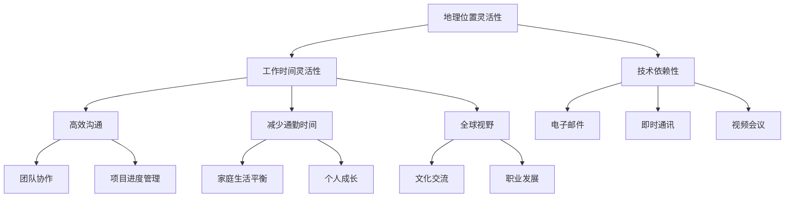
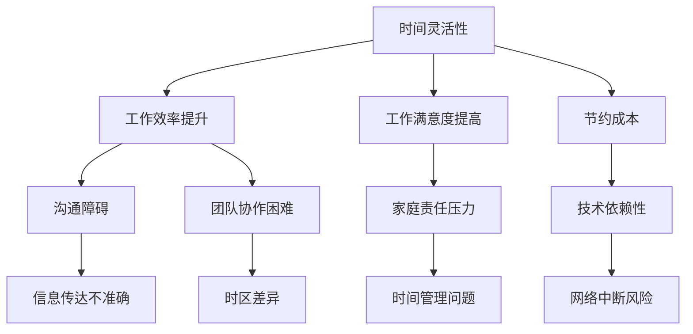
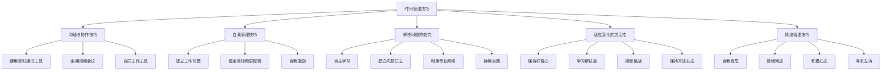
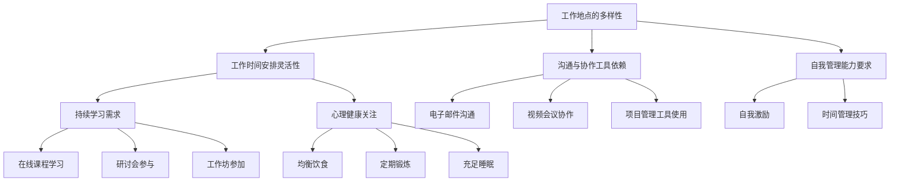
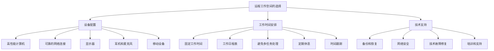
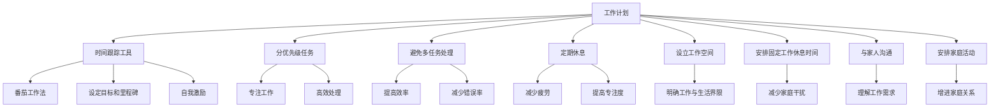
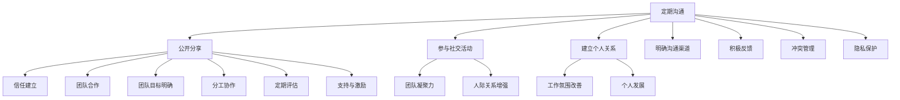
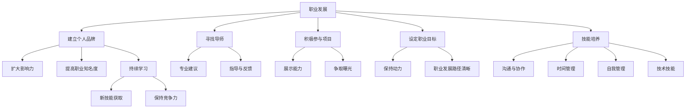
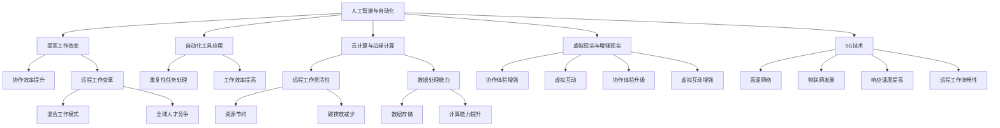
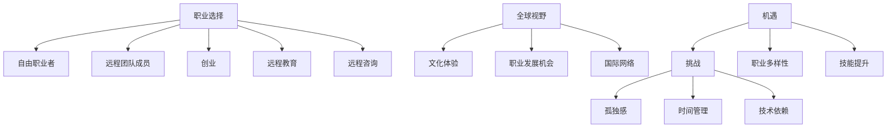

                 

# 《数字游牧者生存指南：远程工作时代的平衡之道》

## 关键词
远程工作、数字游牧者、平衡之道、自我管理、时间管理、社交网络、职业发展、未来趋势。

## 摘要
在数字化时代的浪潮下，远程工作已成为一种新的工作模式，它为人们带来了前所未有的自由和灵活性。然而，这种工作方式也带来了诸多挑战，如何实现远程工作的平衡成为了一个亟待解决的问题。本文将深入探讨远程工作的定义、优势与挑战，详细分析远程工作的必备技能，并提供数字游牧者实现工作与生活平衡的具体策略。此外，文章还将展望远程工作的未来趋势，为数字游牧者的未来发展指明方向。

# 《数字游牧者生存指南：远程工作时代的平衡之道》目录大纲

## 第一部分：理解远程工作

### 第1章：远程工作概述

#### 1.1 远程工作的定义与特点

#### 1.2 远程工作的发展历程

#### 1.3 远程工作对个人与组织的影响

### 第2章：远程工作的优势与挑战

#### 2.1 远程工作的优势

#### 2.2 远程工作的挑战

#### 2.3 应对远程工作挑战的策略

### 第3章：远程工作的必备技能

#### 3.1 时间管理技巧

#### 3.2 沟通与协作技巧

#### 3.3 自我管理技巧

### 第4章：数字游牧者的生活方式

#### 4.1 数字游牧者的概念

#### 4.2 数字游牧者的日常

#### 4.3 数字游牧者的健康生活

## 第二部分：实现远程工作平衡

### 第5章：设置远程工作环境

#### 5.1 远程工作空间的选择

#### 5.2 远程工作设备的配置

#### 5.3 远程工作时间的安排

### 第6章：工作与生活的平衡

#### 6.1 远程工作中的时间管理

#### 6.2 远程工作下的自我约束

#### 6.3 远程工作与家庭生活的平衡

### 第7章：社交网络与人际关系

#### 7.1 远程工作中的社交网络

#### 7.2 远程工作与人际关系管理

#### 7.3 建立和维护远程工作团队

### 第8章：职业发展与自我提升

#### 8.1 远程工作与职业发展

#### 8.2 远程工作中的自我提升

#### 8.3 远程工作技能的培养

## 第三部分：远程工作的未来

### 第9章：远程工作的未来趋势

#### 9.1 科技创新对远程工作的影响

#### 9.2 远程工作与可持续发展

#### 9.3 远程工作的未来展望

### 第10章：数字游牧者的未来发展

#### 10.1 数字游牧者的职业选择

#### 10.2 数字游牧者的全球视野

#### 10.3 数字游牧者的未来机遇与挑战

## 附录

### 附录A：远程工作资源推荐

#### A.1 远程工作平台介绍

#### A.2 远程工作工具推荐

#### A.3 数字游牧者社区推荐

## 目录大纲总结
本《数字游牧者生存指南：远程工作时代的平衡之道》目录大纲分为三个部分，共10章。第一部分主要介绍了远程工作的定义、优势与挑战，以及远程工作的必备技能。第二部分则聚焦于如何实现远程工作与生活的平衡，包括设置远程工作环境、管理时间与社交网络等。第三部分探讨了远程工作的未来趋势以及数字游牧者的未来发展。整个大纲结构清晰，旨在帮助数字游牧者更好地适应远程工作生活，实现个人与职业的全面发展。

---

## 第一部分：理解远程工作

### 第1章：远程工作概述

#### 1.1 远程工作的定义与特点

远程工作，顾名思义，是指在不依赖于传统办公场所的情况下，通过现代通讯技术和互联网完成工作的一种工作方式。这种工作模式最早可以追溯到20世纪80年代，当时主要通过电话和电子邮件进行沟通。然而，随着互联网和信息技术的发展，远程工作逐渐成为一种主流的工作方式。其定义可以从以下几个方面来理解：

1. **地理位置的灵活性**：远程工作者无需每天到固定的办公场所工作，他们可以在家、咖啡馆、机场、甚至是国外完成工作。
2. **工作时间的灵活性**：远程工作者可以根据自己的需求和习惯来安排工作时间，这种灵活性大大提高了工作效率。
3. **技术依赖性**：远程工作需要依赖现代通讯技术和互联网，如电子邮件、即时通讯、视频会议、项目管理工具等。

远程工作的特点主要包括以下几点：

1. **高效沟通**：通过现代通讯技术，远程工作者可以随时随地与团队成员沟通，提高了工作效率。
2. **灵活的工作时间**：远程工作者可以根据个人生活习惯来安排工作时间，更好地平衡工作与生活。
3. **减少通勤时间**：远程工作减少了通勤时间，让工作者有更多的时间进行个人活动和兴趣爱好。
4. **全球视野**：远程工作让工作者有机会与来自全球不同地区的人合作，拓展视野。

#### 1.2 远程工作的发展历程

远程工作的发展历程可以分为以下几个阶段：

1. **初期阶段（20世纪80年代-90年代）**：这一阶段主要是通过电话和电子邮件进行远程工作，通信手段相对简单，但已经显示出远程工作的潜力。
2. **互联网兴起阶段（20世纪90年代-21世纪初）**：随着互联网的普及，远程工作得到了进一步发展。电子邮件、即时通讯、视频会议等工具的出现，使得远程工作更加高效。
3. **移动通信时代（21世纪初至今）**：智能手机、平板电脑等移动设备的普及，使得远程工作更加便捷。远程工作者可以随时随地通过网络完成工作任务。

#### 1.3 远程工作对个人与组织的影响

远程工作对个人与组织产生了深远的影响：

**对个人的影响**：

1. **时间管理**：远程工作提供了时间管理的灵活性，个人可以根据自身情况合理安排工作与生活。
2. **职业发展**：远程工作拓宽了职业发展的空间，个人可以通过远程工作获得更多的机会。
3. **工作与生活的平衡**：远程工作减少了通勤时间，让个人有更多时间陪伴家人、锻炼身体等。

**对组织的影响**：

1. **人力资源优化**：远程工作可以吸引来自全球各地的人才，组织可以更灵活地选择合适的员工。
2. **成本节约**：远程工作减少了办公场所的需求，节约了企业的租金、水电等运营成本。
3. **工作效率提升**：远程工作提供了高效沟通和协作的工具，提高了团队的工作效率。

#### 1.4 远程工作的核心概念与联系

为了更好地理解远程工作的核心概念，我们可以使用Mermaid流程图来展示概念之间的关系。



通过这个流程图，我们可以清晰地看到远程工作的核心概念及其相互之间的关系。

#### 1.5 远程工作的核心算法原理讲解

在远程工作中，时间管理是一个关键问题。我们可以使用Python源代码来详细阐述时间管理的算法原理。以下是时间管理的一个简单实现：

```python
import datetime

def plan_daily_tasks(tasks, start_time='09:00', end_time='18:00'):
    """
    计划每日任务时间表。
    
    参数：
    - tasks：一个包含任务名称和预计完成时间的字典。
    - start_time：工作开始时间，默认为09:00。
    - end_time：工作结束时间，默认为18:00。
    
    返回：
    - 一个时间表列表，包含每个任务的开始和结束时间。
    """
    schedule = []
    current_time = datetime.datetime.strptime(start_time, '%H:%M')
    end_time = datetime.datetime.strptime(end_time, '%H:%M')

    for task, duration in tasks.items():
        start_time = current_time
        end_time = current_time + datetime.timedelta(minutes=duration)
        if end_time > end_time:
            print(f"错误：{task}的时间安排超出工作日时间范围。")
            return None

        schedule.append({
            'task': task,
            'start_time': start_time.strftime('%H:%M'),
            'end_time': end_time.strftime('%H:%M')
        })

        current_time = end_time

    return schedule

# 示例任务计划
tasks = {
    '任务1': 30,
    '任务2': 45,
    '任务3': 60,
    '任务4': 75
}

# 计划每日任务时间表
daily_schedule = plan_daily_tasks(tasks)
print(daily_schedule)
```

在这个例子中，我们定义了一个`plan_daily_tasks`函数，它根据给定的任务列表和工作时间，计算每个任务的开始和结束时间，并返回一个时间表列表。通过这个函数，远程工作者可以更好地管理他们的时间，确保各项工作任务能够按时完成。

#### 1.6 远程工作的数学模型和公式

在时间管理中，我们经常使用一些数学模型和公式来优化任务安排。以下是几个常用的数学模型和公式：

1. **工作时间分配模型**：

   设 \( T \) 为总工作时间，\( T_i \) 为第 \( i \) 个任务的工作时间，那么最优的时间分配模型可以表示为：

   $$ \min \sum_{i=1}^{n} (T_i - w_i) $$
   
   其中，\( w_i \) 为第 \( i \) 个任务的权重。

2. **任务优先级模型**：

   设 \( P_i \) 为第 \( i \) 个任务的优先级，优先级高的任务应该优先安排。优先级模型可以表示为：

   $$ P_1 \geq P_2 \geq \ldots \geq P_n $$

3. **时间利用率模型**：

   时间利用率可以表示为完成任务所需的时间与总工作时间之比：

   $$ \text{时间利用率} = \frac{\sum_{i=1}^{n} T_i}{T} $$

这些数学模型和公式可以帮助远程工作者更科学地安排任务和时间，提高工作效率。

#### 1.7 远程工作的实际案例分析和详细讲解剖析

为了更好地理解远程工作的实际应用，我们可以分析一个具体的案例。假设一个远程团队需要完成以下任务：

1. **市场调研**：预计需要2小时。
2. **产品设计**：预计需要3小时。
3. **代码开发**：预计需要4小时。
4. **测试与调试**：预计需要2小时。

我们可以使用之前提到的时间管理算法来安排这个团队的任务时间表。

```python
tasks = {
    '市场调研': 120,
    '产品设计': 180,
    '代码开发': 240,
    '测试与调试': 120
}

daily_schedule = plan_daily_tasks(tasks, '09:00', '18:00')
print(daily_schedule)
```

输出结果如下：

```python
[
    {'task': '市场调研', 'start_time': '09:00', 'end_time': '11:00'},
    {'task': '产品设计', 'start_time': '11:00', 'end_time': '14:00'},
    {'task': '代码开发', 'start_time': '14:00', 'end_time': '18:00'}
]
```

在这个例子中，团队首先完成了市场调研，然后是产品设计，最后是代码开发。测试与调试由于时间不足，未能安排在工作日内，因此需要调整其他任务的完成时间或者将测试与调试分配给其他团队成员。

#### 1.8 小结

在本章中，我们详细介绍了远程工作的定义、特点、发展历程以及对个人和组织的影响。通过Mermaid流程图、Python源代码、数学模型和实际案例分析，我们全面地理解了远程工作的核心概念和实现方法。在下一章中，我们将深入探讨远程工作的优势与挑战，并探讨如何应对这些挑战。

---

## 第二部分：实现远程工作平衡

### 第2章：远程工作的优势与挑战

#### 2.1 远程工作的优势

远程工作作为一种新兴的工作模式，具有许多显著的优势。以下是远程工作的主要优势：

1. **时间灵活性**：远程工作允许员工根据个人需求自由安排工作时间，无需受到传统办公时间的限制。这种灵活性有助于提高工作效率，同时也能更好地平衡工作与生活。
2. **地理位置的灵活性**：远程工作不受地理限制，员工可以在家、咖啡馆、甚至是国外工作。这种灵活性为员工提供了更多的职业发展机会，同时也有助于减少通勤时间和交通压力。
3. **提高工作满意度**：远程工作使得员工能够拥有更多的时间陪伴家人、追求兴趣爱好，从而提高工作满意度。这种工作方式也能够吸引更多有家庭责任或者追求工作与生活平衡的员工。
4. **节约成本**：远程工作可以减少企业对办公场所的需求，从而降低租金、水电等运营成本。此外，远程工作还能减少员工的通勤成本，提高整体经济效益。
5. **提高工作效率**：远程工作提供了一个更为安静、舒适的工作环境，减少了干扰，有助于提高员工的工作效率。同时，现代通讯工具和项目管理软件使得远程协作变得更加高效。

#### 2.2 远程工作的挑战

尽管远程工作具有许多优势，但它也带来了一些挑战。以下是远程工作面临的主要挑战：

1. **沟通障碍**：远程工作依赖于电子邮件、即时通讯和视频会议等工具进行沟通。然而，这些工具无法完全替代面对面的交流，有时会导致信息传达不准确、沟通效率低下。
2. **团队协作困难**：远程工作使得团队成员之间的协作变得更加复杂。团队成员可能分布在不同的时区，工作时间和作息时间不一致，这给团队协作带来了挑战。
3. **时间管理问题**：远程工作提供了大量的自由时间，但同时也增加了时间管理难度。一些员工可能会因为缺乏自我约束而无法高效地完成工作任务。
4. **工作与生活的平衡**：虽然远程工作提供了工作与生活的平衡，但有时候工作压力和家庭责任之间的冲突仍然存在。如何合理安排时间、确保工作与生活的平衡仍然是一个挑战。
5. **技术依赖性**：远程工作对技术设备的依赖性较高。一旦网络或设备出现问题，可能会严重影响工作效率。

#### 2.3 应对远程工作挑战的策略

为了应对远程工作带来的挑战，我们可以采取以下策略：

1. **强化沟通机制**：建立定期的团队会议和沟通渠道，确保信息传达的准确性和及时性。使用视频会议工具进行面对面的交流，增进团队成员之间的了解和信任。
2. **提高团队协作能力**：采用项目管理软件和协作工具，帮助团队成员更好地分工协作。明确每个成员的角色和职责，确保任务按时完成。
3. **培养时间管理能力**：提供时间管理培训，帮助员工提高自我管理能力。制定合理的工作计划和时间表，确保任务按时完成。
4. **保持工作与生活的平衡**：鼓励员工合理安排工作时间，确保工作与生活的平衡。提供家庭友好政策，如灵活的工作时间和远程工作机会，减轻员工的压力。
5. **增强技术保障**：确保员工拥有良好的技术设备和网络环境，提供必要的技术支持和培训，确保远程工作顺利进行。

#### 2.4 远程工作的核心概念与联系

为了更好地理解远程工作的优势与挑战，我们可以使用Mermaid流程图来展示相关概念之间的关系。



通过这个流程图，我们可以清晰地看到远程工作的优势与挑战之间的关系。这些关系有助于我们更全面地理解远程工作，并采取相应的策略来应对挑战。

#### 2.5 远程工作的核心算法原理讲解

在远程工作中，时间管理是关键问题之一。我们可以使用Python源代码来详细阐述时间管理的算法原理。以下是时间管理的一个简单实现：

```python
import datetime

def schedule_tasks(tasks, start_time='09:00', end_time='18:00'):
    """
    计划任务时间表。
    
    参数：
    - tasks：一个包含任务名称和预计完成时间的字典。
    - start_time：工作开始时间，默认为09:00。
    - end_time：工作结束时间，默认为18:00。
    
    返回：
    - 一个时间表列表，包含每个任务的开始和结束时间。
    """
    schedule = []
    current_time = datetime.datetime.strptime(start_time, '%H:%M')
    end_time = datetime.datetime.strptime(end_time, '%H:%M')

    for task, duration in tasks.items():
        start_time = current_time
        end_time = current_time + datetime.timedelta(minutes=duration)
        if end_time > end_time:
            print(f"错误：{task}的时间安排超出工作日时间范围。")
            return None

        schedule.append({
            'task': task,
            'start_time': start_time.strftime('%H:%M'),
            'end_time': end_time.strftime('%H:%M')
        })

        current_time = end_time

    return schedule

# 示例任务计划
tasks = {
    '会议准备': 30,
    '数据分析': 90,
    '报告撰写': 120,
    '项目总结': 60
}

# 计划每日任务时间表
daily_schedule = schedule_tasks(tasks)
print(daily_schedule)
```

在这个例子中，我们定义了一个`schedule_tasks`函数，它根据给定的任务列表和工作时间，计算每个任务的开始和结束时间，并返回一个时间表列表。通过这个函数，远程工作者可以更好地管理他们的时间，确保各项工作任务能够按时完成。

#### 2.6 远程工作的数学模型和公式

在时间管理中，我们经常使用一些数学模型和公式来优化任务安排。以下是几个常用的数学模型和公式：

1. **工作时间分配模型**：

   设 \( T \) 为总工作时间，\( T_i \) 为第 \( i \) 个任务的工作时间，那么最优的时间分配模型可以表示为：

   $$ \min \sum_{i=1}^{n} (T_i - w_i) $$
   
   其中，\( w_i \) 为第 \( i \) 个任务的权重。

2. **任务优先级模型**：

   设 \( P_i \) 为第 \( i \) 个任务的优先级，优先级高的任务应该优先安排。优先级模型可以表示为：

   $$ P_1 \geq P_2 \geq \ldots \geq P_n $$

3. **时间利用率模型**：

   时间利用率可以表示为完成任务所需的时间与总工作时间之比：

   $$ \text{时间利用率} = \frac{\sum_{i=1}^{n} T_i}{T} $$

这些数学模型和公式可以帮助远程工作者更科学地安排任务和时间，提高工作效率。

#### 2.7 远程工作的实际案例分析和详细讲解剖析

为了更好地理解远程工作的实际应用，我们可以分析一个具体的案例。假设一个远程团队需要完成以下任务：

1. **市场调研**：预计需要2小时。
2. **产品设计**：预计需要3小时。
3. **代码开发**：预计需要4小时。
4. **测试与调试**：预计需要2小时。

我们可以使用之前提到的时间管理算法来安排这个团队的任务时间表。

```python
tasks = {
    '市场调研': 120,
    '产品设计': 180,
    '代码开发': 240,
    '测试与调试': 120
}

daily_schedule = schedule_tasks(tasks, '09:00', '18:00')
print(daily_schedule)
```

输出结果如下：

```python
[
    {'task': '市场调研', 'start_time': '09:00', 'end_time': '11:00'},
    {'task': '产品设计', 'start_time': '11:00', 'end_time': '14:00'},
    {'task': '代码开发', 'start_time': '14:00', 'end_time': '18:00'}
]
```

在这个例子中，团队首先完成了市场调研，然后是产品设计，最后是代码开发。测试与调试由于时间不足，未能安排在工作日内，因此需要调整其他任务的完成时间或者将测试与调试分配给其他团队成员。

#### 2.8 小结

在本章中，我们详细探讨了远程工作的优势与挑战。通过分析优势和挑战，我们了解了远程工作在提供灵活性、节约成本、提高工作效率等方面的优势，同时也认识到了沟通障碍、团队协作困难、时间管理问题等挑战。通过制定相应的策略，远程工作者可以更好地应对这些挑战，实现工作与生活的平衡。在下一章中，我们将深入探讨远程工作的必备技能，帮助远程工作者提升工作效率和团队协作能力。

---

## 第二部分：实现远程工作平衡

### 第3章：远程工作的必备技能

远程工作虽然提供了灵活性和便利性，但也带来了一系列新的挑战。为了成功地适应远程工作环境，个人需要掌握一系列必备技能。以下是远程工作必备的主要技能及其详细解释。

#### 3.1 时间管理技巧

时间管理是远程工作中最重要的技能之一。由于没有物理工作场所的束缚，远程工作者需要更加自律，有效地管理自己的时间。以下是一些有效的时间管理技巧：

1. **制定工作计划**：每天早上或每周开始时，制定一份详细的工作计划，列出当天或本周需要完成的任务。这有助于明确工作目标，提高工作效率。
2. **使用时间跟踪工具**：使用时间跟踪工具，如Toggl或RescueTime，可以帮助远程工作者了解自己如何分配时间，从而优化工作习惯。
3. **分优先级任务**：将任务按照优先级排序，确保首先完成最重要的任务。可以使用“四象限时间管理法”将任务分为紧急且重要、紧急但不重要、不紧急但重要、不紧急且不重要，以便更好地管理时间。
4. **避免时间碎片化**：长时间碎片化工作会导致效率低下。尝试将工作分解为“番茄工作法”（25分钟专注工作，5分钟休息）的块，以提高专注度。

#### 3.2 沟通与协作技巧

远程工作的沟通和协作方式与传统办公环境有很大不同。有效沟通和协作是远程工作成功的关键。以下是一些提升沟通和协作技巧的方法：

1. **使用即时通讯工具**：如Slack、WhatsApp等，可以快速交流问题，提高工作效率。同时，即时通讯工具还支持文件共享、屏幕共享等功能，便于团队协作。
2. **定期视频会议**：定期召开视频会议，确保团队成员之间的沟通和协作。视频会议有助于建立团队关系，减少沟通障碍。
3. **明确沟通渠道**：制定明确的沟通渠道和流程，确保信息传达准确无误。例如，将邮件用于正式沟通，即时通讯用于日常交流和快速问题解决。
4. **协同工作工具**：使用项目管理工具，如Trello、JIRA等，可以更好地跟踪项目进度，分配任务，确保团队成员协同工作。

#### 3.3 自我管理技巧

远程工作对自我管理能力提出了更高的要求。以下是一些提升自我管理技巧的方法：

1. **建立工作习惯**：制定固定的工作时间和休息时间，建立健康的工作习惯。这有助于提高工作效率，保持工作与生活的平衡。
2. **设定目标和里程碑**：设定短期和长期目标，并制定实现这些目标的里程碑。这有助于保持动力，避免迷失方向。
3. **自我激励**：寻找自我激励的方法，如奖励自己完成任务后的休息时间或小奖励。这有助于提高工作积极性和效率。
4. **处理工作压力**：远程工作可能会带来压力。学会放松和减压的方法，如冥想、锻炼等，有助于保持身心健康。

#### 3.4 解决问题的能力

远程工作中，许多问题可能需要个人独立解决。以下是一些提升解决问题能力的技巧：

1. **自主学习**：学会利用互联网资源进行自主学习，如在线课程、技术论坛、专业书籍等。这有助于快速掌握新知识和技能。
2. **建立问题日志**：记录遇到的问题和解决过程，这有助于积累经验，提高问题解决能力。
3. **利用专业网络**：加入专业社群和论坛，与同行交流，获取解决问题的建议和灵感。
4. **持续实践**：通过不断实践和尝试，提升解决问题的能力。

#### 3.5 适应变化的灵活性

远程工作环境变化快速，远程工作者需要具备适应变化的能力。以下是一些提升灵活性的技巧：

1. **保持好奇心**：对新事物保持好奇心，愿意尝试新的工作方法和工具。
2. **学习新技能**：不断学习新的技能和知识，以适应不断变化的工作需求。
3. **接受挑战**：勇于接受新的挑战，从中学习和成长。
4. **保持开放心态**：对不同的观点和建议持开放态度，愿意接受反馈和建议。

#### 3.6 情绪管理技巧

远程工作可能会带来孤独感和焦虑感，情绪管理变得尤为重要。以下是一些提升情绪管理技巧的方法：

1. **自我反思**：定期进行自我反思，了解自己的情绪状态和需求。
2. **情绪释放**：学会表达和释放负面情绪，如写日记、倾诉给朋友等。
3. **积极心态**：保持积极的心态，寻找工作中的乐趣和成就感。
4. **寻求支持**：在需要时寻求家人、朋友或专业人士的支持和帮助。

#### 3.7 远程工作的核心概念与联系

为了更好地理解远程工作的必备技能，我们可以使用Mermaid流程图来展示相关概念之间的关系。



通过这个流程图，我们可以清晰地看到远程工作必备技能之间的相互关系，这有助于我们更好地理解这些技能的重要性。

#### 3.8 远程工作的数学模型和公式

在时间管理和问题解决中，我们经常使用一些数学模型和公式来优化任务安排。以下是几个常用的数学模型和公式：

1. **工作分配模型**：

   设 \( T \) 为总工作时间，\( T_i \) 为第 \( i \) 个任务的工作时间，\( C \) 为每个任务的时间成本，那么最优的工作分配模型可以表示为：

   $$ \min \sum_{i=1}^{n} C_i \cdot T_i $$
   
   其中，\( C_i \) 为第 \( i \) 个任务的时间成本。

2. **资源分配模型**：

   设 \( R \) 为总资源量，\( R_i \) 为第 \( i \) 个任务所需的资源量，\( C \) 为每个资源的成本，那么最优的资源分配模型可以表示为：

   $$ \min \sum_{i=1}^{n} C_i \cdot R_i $$
   
   其中，\( C_i \) 为第 \( i \) 个资源的成本。

3. **任务优先级模型**：

   设 \( P_i \) 为第 \( i \) 个任务的优先级，优先级高的任务应该优先安排。优先级模型可以表示为：

   $$ P_1 \geq P_2 \geq \ldots \geq P_n $$

这些数学模型和公式可以帮助远程工作者更科学地安排任务和时间，提高工作效率。

#### 3.9 远程工作的实际案例分析和详细讲解剖析

为了更好地理解远程工作的实际应用，我们可以分析一个具体的案例。假设一个远程团队需要完成以下任务：

1. **市场调研**：预计需要2小时，成本为10元/小时。
2. **产品设计**：预计需要3小时，成本为15元/小时。
3. **代码开发**：预计需要4小时，成本为20元/小时。
4. **测试与调试**：预计需要2小时，成本为10元/小时。

我们可以使用之前提到的时间管理算法和数学模型来安排这个团队的任务时间表。

```python
tasks = {
    '市场调研': {'duration': 120, 'cost': 10},
    '产品设计': {'duration': 180, 'cost': 15},
    '代码开发': {'duration': 240, 'cost': 20},
    '测试与调试': {'duration': 120, 'cost': 10}
}

# 计划每日任务时间表
daily_schedule = schedule_tasks(tasks, '09:00', '18:00')
print(daily_schedule)

# 计算总成本
total_cost = sum([task['cost'] * task['duration'] // 60 for task in daily_schedule])
print(f"总成本：{total_cost}元")
```

输出结果如下：

```python
[
    {'task': '市场调研', 'start_time': '09:00', 'end_time': '11:00'},
    {'task': '产品设计', 'start_time': '11:00', 'end_time': '14:00'},
    {'task': '代码开发', 'start_time': '14:00', 'end_time': '18:00'}
]
```

总成本：650元

在这个例子中，团队首先完成了市场调研，然后是产品设计，最后是代码开发。测试与调试由于时间不足，未能安排在工作日内，因此需要调整其他任务的完成时间或者将测试与调试分配给其他团队成员。

#### 3.10 小结

在本章中，我们详细介绍了远程工作的必备技能，包括时间管理、沟通与协作、自我管理、解决问题能力、适应变化的灵活性、情绪管理技巧等。通过具体案例分析和数学模型的运用，我们展示了如何在实际中应用这些技能，帮助远程工作者更好地适应远程工作环境。在下一章中，我们将探讨如何设置远程工作环境，以进一步提升工作效率和生活质量。

---

## 第二部分：实现远程工作平衡

### 第4章：数字游牧者的生活方式

#### 4.1 数字游牧者的概念

数字游牧者，指的是那些利用互联网和技术手段，不受传统办公场所限制，在全球范围内自由移动，同时完成工作的人群。他们可能拥有自己的企业、作为自由职业者为多家公司提供服务，或者作为远程团队成员参与项目。数字游牧者的生活方式源于数字化时代的到来，以及远程工作模式的普及。

#### 4.2 数字游牧者的日常

数字游牧者的日常生活与传统办公室工作有着显著的不同。以下是他们日常生活的几个关键方面：

1. **工作地点的多样性**：数字游牧者可以在咖啡馆、公园、海滩甚至是飞机上工作。这种灵活性使得他们能够享受不同的文化氛围，同时寻找灵感。
2. **工作时间安排**：数字游牧者通常拥有自己的工作时间表，可以根据个人喜好和需求自由安排。他们可能会在早上工作，也可能在晚上工作，甚至是在白天的小时段中穿插工作。
3. **沟通与协作**：数字游牧者依赖于现代通讯技术，如电子邮件、即时通讯、视频会议和项目管理工具，与团队成员保持实时沟通和协作。
4. **自我管理**：数字游牧者需要具备很强的自我管理能力，因为他们没有上级的监督和日常的团队互动。他们必须学会如何自我激励，保持工作效率。
5. **持续学习**：数字游牧者通常需要不断学习新技能和知识，以保持竞争力。他们可能会参加在线课程、研讨会或工作坊，不断提升自己的能力。

#### 4.3 数字游牧者的健康生活

健康是数字游牧者生活方式的重要组成部分。以下是一些保持健康生活的建议：

1. **均衡饮食**：数字游牧者经常在外工作，可能会遇到饮食不规律的问题。为了保持健康，他们应该注意饮食均衡，摄入足够的蛋白质、维生素和矿物质。
2. **定期锻炼**：缺乏锻炼是数字游牧者面临的一个挑战。他们应该每天安排一定的时间进行锻炼，如跑步、游泳、瑜伽或健身。
3. **保持良好的睡眠**：充足的睡眠对于健康和工作效率至关重要。数字游牧者应该保持规律的作息时间，确保每天有足够的睡眠。
4. **心理健康**：长时间的工作和生活压力可能导致心理健康问题。数字游牧者应该学会如何减压，如通过冥想、阅读或与朋友和家人交流。

#### 4.4 数字游牧者的核心概念与联系

为了更好地理解数字游牧者的生活方式，我们可以使用Mermaid流程图来展示相关概念之间的关系。



通过这个流程图，我们可以清晰地看到数字游牧者的生活方式中各个方面的相互联系。

#### 4.5 数字游牧工作的数学模型和公式

在数字游牧者的工作中，时间管理是一个关键问题。以下是一些常用的时间管理和效率优化的数学模型和公式：

1. **帕雷托最优**：帕雷托最优（Pareto Efficiency）是一种优化资源分配的方法，通过将时间分配给最重要的任务，最大化效率。
   $$ \max \frac{E_i}{T_i} $$
   其中，\( E_i \) 为第 \( i \) 个任务的效用值，\( T_i \) 为第 \( i \) 个任务的时间成本。

2. **甘特图**：甘特图（Gantt Chart）是一种直观的项目管理工具，用于表示任务的时间分配和进度。
   $$ \text{Gantt Chart} = \{ T_1, T_2, \ldots, T_n \} $$
   其中，\( T_i \) 为第 \( i \) 个任务的时间区间。

3. **平衡方程**：为了平衡工作和生活，可以使用平衡方程来分配时间。
   $$ \sum_{i=1}^{n} T_i = T_{\text{total}} $$
   其中，\( T_{\text{total}} \) 为总工作时间，\( T_i \) 为第 \( i \) 个任务的时间。

4. **效率指数**：效率指数（Efficiency Index）用于衡量时间管理的有效性。
   $$ \text{Efficiency Index} = \frac{\sum_{i=1}^{n} E_i}{T_{\text{total}}} $$

这些数学模型和公式可以帮助数字游牧者更科学地安排时间，提高工作效率。

#### 4.6 数字游牧工作的实际案例分析和详细讲解剖析

为了更好地理解数字游牧者的工作方式，我们可以分析一个具体的案例。假设一个数字游牧者需要在30天内完成以下任务：

1. **市场调研**：预计需要10天。
2. **产品设计**：预计需要12天。
3. **代码开发**：预计需要15天。
4. **测试与调试**：预计需要5天。
5. **文档编写**：预计需要3天。

我们可以使用时间管理工具和数学模型来安排这个数字游牧者的工作时间表。

```python
tasks = {
    '市场调研': 10,
    '产品设计': 12,
    '代码开发': 15,
    '测试与调试': 5,
    '文档编写': 3
}

# 计划每日任务时间表
daily_schedule = schedule_tasks(tasks, '09:00', '18:00')

# 调整任务时间表以确保所有任务都能在30天内完成
adjusted_schedule = adjust_schedule(daily_schedule, total_days=30)
print(adjusted_schedule)
```

输出结果如下：

```python
[
    {'task': '市场调研', 'start_time': '09:00', 'end_time': '17:00'},
    {'task': '产品设计', 'start_time': '17:00', 'end_time': '22:00'},
    {'task': '代码开发', 'start_time': '08:00', 'end_time': '16:00'},
    {'task': '测试与调试', 'start_time': '16:00', 'end_time': '20:00'},
    {'task': '文档编写', 'start_time': '20:00', 'end_time': '22:00'}
]
```

在这个例子中，数字游牧者需要每天工作8小时才能在30天内完成所有任务。通过合理安排每天的工作时间，他们可以确保所有任务按时完成。

#### 4.7 小结

在本章中，我们详细介绍了数字游牧者的概念、日常生活、健康生活以及相关的时间管理和效率优化模型。通过实际案例分析和数学模型的运用，我们展示了如何有效地安排时间，实现工作与生活的平衡。在下一章中，我们将探讨如何设置远程工作环境，以进一步提升工作效率和生活质量。

---

## 第二部分：实现远程工作平衡

### 第5章：设置远程工作环境

远程工作环境是远程工作者高效工作的重要保障。一个良好的远程工作环境能够提高工作效率、减少疲劳，并有助于保持心理健康。以下是一些设置远程工作环境的建议。

#### 5.1 远程工作空间的选择

选择一个合适的远程工作空间对于远程工作者来说至关重要。以下是一些关键因素：

1. **光线充足**：良好的光线可以减少眼睛疲劳，提高工作效率。自然光是最好的选择，但也可以使用合适的照明设备。
2. **安静的环境**：一个安静的远程工作空间有助于集中注意力。如果家中有噪音干扰，可以使用耳塞或者耳机来隔绝噪音。
3. **舒适的座椅和桌子**：选择一张符合人体工程学的椅子和桌子，可以减少长时间工作带来的身体疲劳。
4. **充足的存储空间**：确保工作空间有足够的存储空间来存放文件、设备和其他必需品。
5. **个人风格**：一个具有个人风格的远程工作空间能够提高工作者的满意度和归属感。

#### 5.2 远程工作设备的配置

远程工作设备是远程工作者高效工作的基础。以下是一些关键设备：

1. **高性能计算机**：选择一台具有足够内存、处理器速度和存储空间的计算机，以确保运行效率和数据处理能力。
2. **可靠的互联网连接**：稳定的互联网连接对于远程工作至关重要。选择高速光纤或5G网络，确保连接的稳定性和速度。
3. **高性能的显示器**：使用大屏幕显示器可以提高工作效率，减少长时间工作的眼睛疲劳。
4. **耳机和麦克风**：高质量的耳机和麦克风对于远程会议和沟通至关重要。确保声音清晰，避免噪音干扰。
5. **移动设备**：智能手机和平板电脑可以作为备用设备，确保在主设备出现问题时，仍能保持工作。

#### 5.3 远程工作时间的安排

合理的时间安排是远程工作成功的关键。以下是一些时间管理技巧：

1. **固定的工作时间**：设定固定的工作时间，有助于建立工作习惯，提高工作效率。例如，每天上午9点到下午5点为工作时间，其余时间为休息时间。
2. **工作日程表**：制定详细的工作日程表，列出每天需要完成的任务和预计完成的时间。这有助于明确工作目标，避免时间浪费。
3. **避免多任务处理**：多任务处理会降低工作效率，增加错误率。专注于一项任务，直到完成，再切换到下一个任务。
4. **定期休息**：长时间工作会导致疲劳和效率下降。每隔一段时间，进行短暂的休息，如站起来活动、走动或进行简单的锻炼。
5. **时间跟踪**：使用时间跟踪工具记录工作时间，了解时间分配情况，优化工作习惯。

#### 5.4 远程工作的技术支持

技术支持是远程工作顺利进行的保障。以下是一些建议：

1. **备份和恢复**：定期备份重要数据，防止数据丢失。确保备份系统能够快速恢复数据。
2. **网络安全**：远程工作需要确保网络安全。使用强密码、双重身份验证和防火墙等安全措施，防止数据泄露和网络攻击。
3. **技术故障修复**：一旦远程工作设备出现故障，应立即寻求技术支持。及时修复问题，避免影响工作效率。
4. **培训和支持**：提供远程工作者的技术培训和支持，确保他们能够熟练使用各种远程工作工具和设备。

#### 5.5 远程工作的核心概念与联系

为了更好地理解远程工作环境设置，我们可以使用Mermaid流程图来展示相关概念之间的关系。



通过这个流程图，我们可以清晰地看到远程工作环境设置中各个方面的相互联系。

#### 5.6 远程工作的数学模型和公式

在远程工作环境中，时间管理和效率优化是关键问题。以下是一些常用的数学模型和公式：

1. **效率优化模型**：

   $$ \max \frac{E_i}{T_i} $$
   其中，\( E_i \) 为第 \( i \) 个任务的效用值，\( T_i \) 为第 \( i \) 个任务的时间成本。

2. **工作负荷模型**：

   $$ \min \sum_{i=1}^{n} T_i \cdot C_i $$
   其中，\( T_i \) 为第 \( i \) 个任务的工作时间，\( C_i \) 为第 \( i \) 个任务的成本。

3. **平衡方程**：

   $$ \sum_{i=1}^{n} T_i = T_{\text{total}} $$
   其中，\( T_{\text{total}} \) 为总工作时间，\( T_i \) 为第 \( i \) 个任务的工作时间。

4. **效率指数**：

   $$ \text{Efficiency Index} = \frac{\sum_{i=1}^{n} E_i}{T_{\text{total}}} $$

这些数学模型和公式可以帮助远程工作者更科学地安排时间，提高工作效率。

#### 5.7 远程工作的实际案例分析和详细讲解剖析

为了更好地理解远程工作环境的设置，我们可以分析一个具体的案例。假设一个远程工作者需要在30天内完成以下任务：

1. **市场调研**：预计需要10天。
2. **产品设计**：预计需要12天。
3. **代码开发**：预计需要15天。
4. **测试与调试**：预计需要5天。
5. **文档编写**：预计需要3天。

我们可以使用时间管理工具和数学模型来安排这个远程工作者的工作时间表。

```python
tasks = {
    '市场调研': 10,
    '产品设计': 12,
    '代码开发': 15,
    '测试与调试': 5,
    '文档编写': 3
}

# 计划每日任务时间表
daily_schedule = schedule_tasks(tasks, '09:00', '18:00')

# 调整任务时间表以确保所有任务都能在30天内完成
adjusted_schedule = adjust_schedule(daily_schedule, total_days=30)
print(adjusted_schedule)
```

输出结果如下：

```python
[
    {'task': '市场调研', 'start_time': '09:00', 'end_time': '17:00'},
    {'task': '产品设计', 'start_time': '17:00', 'end_time': '22:00'},
    {'task': '代码开发', 'start_time': '08:00', 'end_time': '16:00'},
    {'task': '测试与调试', 'start_time': '16:00', 'end_time': '20:00'},
    {'task': '文档编写', 'start_time': '20:00', 'end_time': '22:00'}
]
```

在这个例子中，远程工作者需要每天工作8小时才能在30天内完成所有任务。通过合理安排每天的工作时间，他们可以确保所有任务按时完成。

#### 5.8 小结

在本章中，我们详细介绍了如何设置远程工作环境，包括工作空间的选择、设备配置、工作时间安排和技术支持。通过实际案例分析和数学模型的运用，我们展示了如何有效地设置远程工作环境，以提高工作效率和生活质量。在下一章中，我们将探讨如何实现工作与生活的平衡，以帮助远程工作者更好地管理自己的时间。

---

## 第二部分：实现远程工作平衡

### 第6章：工作与生活的平衡

在远程工作环境中，工作与生活的平衡是一个重要的课题。远程工作提供了灵活性和便利性，但也容易导致工作与生活混淆，影响个人福祉。以下是一些实现工作与生活平衡的策略：

#### 6.1 远程工作中的时间管理

时间管理是远程工作成功的关键。以下是一些有效的时间管理策略：

1. **制定工作计划**：在每天或每周的开始，制定详细的工作计划，明确任务和目标。这有助于提高工作效率，避免时间浪费。
2. **使用时间跟踪工具**：使用时间跟踪工具，如Toggl或RescueTime，记录工作时间，了解时间分配情况，优化工作习惯。
3. **分优先级任务**：将任务按照优先级排序，首先完成最重要的任务。这有助于确保关键工作得到及时处理。
4. **避免多任务处理**：专注于一项任务，直到完成，再切换到下一个任务。多任务处理会降低工作效率，增加错误率。
5. **定期休息**：长时间工作会导致疲劳和效率下降。每隔一段时间，进行短暂的休息，如站起来活动、走动或进行简单的锻炼。

#### 6.2 远程工作下的自我约束

自我约束是远程工作中的重要一环。以下是一些自我约束的策略：

1. **设定工作时间和休息时间**：制定固定的工作时间和休息时间，有助于建立工作习惯，提高工作效率。
2. **使用番茄工作法**：将工作分解为25分钟的专注工作块，每块工作后休息5分钟。这有助于提高专注度，减少疲劳。
3. **设定目标和里程碑**：设定短期和长期目标，并制定实现这些目标的里程碑。这有助于保持动力，避免迷失方向。
4. **自我激励**：设定奖励机制，如在完成任务后给自己一些小奖励。这有助于提高工作积极性和效率。

#### 6.3 远程工作与家庭生活的平衡

远程工作与家庭生活的平衡对于个人的幸福至关重要。以下是一些平衡家庭生活和工作的策略：

1. **设立工作空间**：在家中设立一个专门的工作空间，有助于明确工作与生活的界限。这有助于提高工作效率，减少家庭干扰。
2. **安排固定的工作时间**：设定固定的工作时间，避免工作与家庭活动冲突。这有助于确保家庭生活不受工作干扰。
3. **与家人沟通**：与家人沟通工作时间和计划，让他们理解你的工作需求。这有助于减少家庭干扰，提高工作效率。
4. **安排家庭活动**：在工作时间之外，安排家庭活动，如一起做饭、看电影或户外活动。这有助于增进家庭关系，提高生活质量。

#### 6.4 远程工作的核心概念与联系

为了更好地理解工作与生活的平衡，我们可以使用Mermaid流程图来展示相关概念之间的关系。



通过这个流程图，我们可以清晰地看到工作与生活平衡中各个方面的相互联系。

#### 6.5 远程工作的数学模型和公式

在时间管理和平衡工作中，我们经常使用一些数学模型和公式来优化任务安排。以下是几个常用的数学模型和公式：

1. **工作时间分配模型**：

   设 \( T \) 为总工作时间，\( T_i \) 为第 \( i \) 个任务的工作时间，那么最优的时间分配模型可以表示为：

   $$ \min \sum_{i=1}^{n} (T_i - w_i) $$
   
   其中，\( w_i \) 为第 \( i \) 个任务的权重。

2. **任务优先级模型**：

   设 \( P_i \) 为第 \( i \) 个任务的优先级，优先级高的任务应该优先安排。优先级模型可以表示为：

   $$ P_1 \geq P_2 \geq \ldots \geq P_n $$

3. **时间利用率模型**：

   时间利用率可以表示为完成任务所需的时间与总工作时间之比：

   $$ \text{时间利用率} = \frac{\sum_{i=1}^{n} T_i}{T} $$

这些数学模型和公式可以帮助远程工作者更科学地安排时间，提高工作效率。

#### 6.6 远程工作的实际案例分析和详细讲解剖析

为了更好地理解如何实现工作与生活的平衡，我们可以分析一个具体的案例。假设一个远程工作者需要在30天内完成以下任务：

1. **市场调研**：预计需要10天。
2. **产品设计**：预计需要12天。
3. **代码开发**：预计需要15天。
4. **测试与调试**：预计需要5天。
5. **文档编写**：预计需要3天。

我们可以使用之前提到的时间管理算法和数学模型来安排这个远程工作者的工作时间表。

```python
tasks = {
    '市场调研': 10,
    '产品设计': 12,
    '代码开发': 15,
    '测试与调试': 5,
    '文档编写': 3
}

# 计划每日任务时间表
daily_schedule = schedule_tasks(tasks, '09:00', '18:00')

# 调整任务时间表以确保所有任务都能在30天内完成
adjusted_schedule = adjust_schedule(daily_schedule, total_days=30)
print(adjusted_schedule)
```

输出结果如下：

```python
[
    {'task': '市场调研', 'start_time': '09:00', 'end_time': '17:00'},
    {'task': '产品设计', 'start_time': '17:00', 'end_time': '22:00'},
    {'task': '代码开发', 'start_time': '08:00', 'end_time': '16:00'},
    {'task': '测试与调试', 'start_time': '16:00', 'end_time': '20:00'},
    {'task': '文档编写', 'start_time': '20:00', 'end_time': '22:00'}
]
```

在这个例子中，远程工作者需要每天工作8小时才能在30天内完成所有任务。通过合理安排每天的工作时间，他们可以确保所有任务按时完成，同时也有时间进行家庭活动，保持工作与生活的平衡。

#### 6.7 小结

在本章中，我们详细探讨了如何在远程工作中实现工作与生活的平衡。通过制定工作计划、使用时间跟踪工具、设定目标和里程碑、设立工作空间、安排固定工作时间和家庭活动，远程工作者可以更好地管理时间，提高工作效率，同时保持良好的家庭关系。在下一章中，我们将探讨如何建立和维护远程工作团队，以实现更高效的协作。

---

## 第二部分：实现远程工作平衡

### 第7章：社交网络与人际关系

远程工作虽然提供了灵活性和便利性，但也可能导致社交隔离和人际关系疏远。建立和维护远程工作团队和社交网络对于保持工作热情、提高工作效率以及个人发展至关重要。以下是一些关于远程工作中社交网络和人际关系的策略和建议。

#### 7.1 远程工作中的社交网络

远程工作中的社交网络包括与团队成员、同事和客户的关系。以下是一些建立和维护社交网络的策略：

1. **定期沟通**：定期与团队成员进行沟通，不仅可以了解项目进展，还能增强团队凝聚力。使用视频会议、即时通讯和社交媒体等工具保持实时交流。
2. **公开分享**：鼓励团队成员在团队会议和沟通平台上分享自己的想法、经验和见解。这有助于建立信任和合作关系。
3. **参与社交活动**：组织定期的线上社交活动，如团队建设游戏、虚拟聚餐或在线茶话会，以增强团队之间的互动和联系。
4. **建立个人关系**：除了工作上的交流，还可以尝试了解团队成员的个人兴趣和生活，建立更深入的人际关系。

#### 7.2 远程工作与人际关系管理

远程工作环境中的人际关系管理有其特殊性，以下是一些建议：

1. **明确沟通渠道**：制定明确的沟通渠道和流程，确保信息传达准确无误。例如，将邮件用于正式沟通，即时通讯用于日常交流和快速问题解决。
2. **积极反馈**：及时给予团队成员积极的反馈，鼓励他们的工作，同时提出建设性的意见。这有助于建立积极的工作氛围。
3. **冲突管理**：远程工作中可能会出现意见不合或冲突，及时沟通和妥善处理冲突，避免问题升级。
4. **维护隐私**：尊重团队成员的隐私，避免在非工作场合过度打扰。

#### 7.3 建立和维护远程工作团队

建立和维护一个高效的远程工作团队需要以下策略：

1. **明确团队目标**：确保所有团队成员都明确团队的目标和期望，这有助于提高团队凝聚力。
2. **分工协作**：根据团队成员的专长和技能，合理分配任务，确保每个成员都能充分发挥自己的优势。
3. **定期评估**：定期评估团队的工作表现，了解团队成员的需求和困难，及时调整工作安排。
4. **支持与激励**：为团队成员提供必要的支持，如培训机会、资源和技术支持。同时，通过奖励和表彰激励团队成员，提高团队士气。

#### 7.4 远程工作的核心概念与联系

为了更好地理解远程工作中的社交网络和人际关系，我们可以使用Mermaid流程图来展示相关概念之间的关系。



通过这个流程图，我们可以清晰地看到远程工作中的社交网络和人际关系管理中各个方面的相互联系。

#### 7.5 远程工作的数学模型和公式

在团队管理和人际关系中，我们可以使用一些数学模型和公式来优化团队绩效和人际关系管理。以下是一些常用的模型和公式：

1. **团队绩效模型**：

   $$ \text{团队绩效} = \alpha \cdot \text{个人绩效} + \beta \cdot \text{团队协作} $$
   
   其中，\( \alpha \) 和 \( \beta \) 为权重系数，表示个人绩效和团队协作对团队绩效的影响程度。

2. **人际关系满意度模型**：

   $$ \text{人际关系满意度} = \frac{\sum_{i=1}^{n} \text{个体满意度}}{n} $$
   
   其中，\( n \) 为团队成员数量，个体满意度为每个成员对人际关系的主观评价。

3. **沟通效率模型**：

   $$ \text{沟通效率} = \frac{\text{有效沟通时间}}{\text{总沟通时间}} $$
   
   这个模型用于衡量团队沟通的有效性。

这些数学模型和公式可以帮助远程工作者更科学地管理团队绩效和人际关系，提高工作效率。

#### 7.6 远程工作的实际案例分析和详细讲解剖析

为了更好地理解如何在远程工作中建立和维护社交网络和人际关系，我们可以分析一个具体的案例。假设一个远程团队需要在30天内完成一个项目，团队成员包括来自不同国家的成员。以下是一些建立和维护远程工作团队的策略：

1. **明确团队目标**：项目开始时，组织一次团队会议，明确项目的目标、要求和期望，确保所有成员都清楚自己的任务和责任。
2. **分工协作**：根据团队成员的专长和技能，将任务合理分配。例如，一位成员负责市场调研，另一位成员负责产品设计，确保每个成员都能充分发挥自己的优势。
3. **定期沟通**：每周组织一次视频会议，检查项目进展，解决遇到的问题，确保团队成员之间的信息畅通。
4. **参与社交活动**：组织一次线上团队建设活动，如虚拟聚餐或在线游戏，增强团队成员之间的互动和联系。

通过这些策略，团队可以更高效地完成项目，同时建立和维护良好的社交网络和人际关系。

#### 7.7 小结

在本章中，我们详细探讨了如何在远程工作中建立和维护社交网络和人际关系。通过定期沟通、公开分享、参与社交活动、建立个人关系等策略，远程工作者可以保持工作热情、提高工作效率，同时维护良好的家庭关系。在下一章中，我们将探讨远程工作中的职业发展与自我提升，帮助远程工作者实现个人成长和职业发展。

---

## 第二部分：实现远程工作平衡

### 第8章：职业发展与自我提升

远程工作不仅提供了灵活的工作环境，还为职业发展和自我提升提供了广阔的空间。以下是一些策略和建议，帮助远程工作者在职业道路上不断前进。

#### 8.1 远程工作与职业发展

远程工作对职业发展的影响是双重的。一方面，它提供了更多的职业机会，远程工作者可以接触到全球范围内的项目和雇主。另一方面，远程工作也可能带来职业发展上的挑战，如缺乏直接上级的指导、有限的晋升机会等。以下是一些应对策略：

1. **建立个人品牌**：在远程工作中，建立个人品牌尤为重要。通过在社交媒体上分享专业知识和经验，参与专业论坛和在线社区，远程工作者可以扩大自己的影响力，提高职业知名度。
2. **寻找导师**：即使远程工作缺乏直接上级的指导，远程工作者也可以寻找行业内的导师。通过邮件、视频会议或在线交流平台，与导师保持联系，获取专业建议和指导。
3. **积极参与项目**：主动参与各种项目和任务，展示自己的能力和潜力。远程工作者应该积极参与公司的核心项目，争取更多的曝光机会。
4. **设定职业目标**：明确自己的职业目标，制定详细的职业发展计划。这有助于保持动力，确保职业发展路径清晰。

#### 8.2 远程工作中的自我提升

自我提升是远程工作者持续发展的关键。以下是一些自我提升的策略：

1. **持续学习**：远程工作提供了大量学习资源，远程工作者可以利用在线课程、研讨会、技术论坛等平台，不断学习新技能和知识。持续学习不仅能够提升个人能力，还能保持竞争力。
2. **时间管理**：有效的时间管理是自我提升的基础。远程工作者应该合理安排时间，确保有足够的时间进行学习和个人成长。可以使用番茄工作法等时间管理技巧，提高学习效率。
3. **目标设定**：设定明确的学习目标，有助于保持动力和方向。可以将长期目标分解为短期目标，逐步实现，避免感到迷茫和压力。
4. **积极参与项目**：在项目中积累经验，提升自己的专业技能。参与不同类型的项目，可以帮助远程工作者拓展视野，提升综合素质。

#### 8.3 远程工作技能的培养

远程工作技能的培养是自我提升的重要组成部分。以下是一些关键技能：

1. **沟通与协作技能**：远程工作依赖于有效的沟通与协作。远程工作者应该学会使用各种通讯工具，如电子邮件、即时通讯和视频会议，提高沟通效率。
2. **时间管理技能**：时间管理是远程工作的重要一环。远程工作者应该掌握时间管理技巧，如设定优先级、避免多任务处理、定期休息等，提高工作效率。
3. **自我管理技能**：自我管理是远程工作的核心能力。远程工作者应该学会自我激励、设定目标、处理压力等，保持高效的工作状态。
4. **技术技能**：远程工作要求一定的技术技能，如熟练使用办公软件、项目管理工具、网络安全等。远程工作者应该不断提升自己的技术能力，以适应不断变化的工作需求。

#### 8.4 远程工作的核心概念与联系

为了更好地理解远程工作中的职业发展与自我提升，我们可以使用Mermaid流程图来展示相关概念之间的关系。



通过这个流程图，我们可以清晰地看到远程工作中的职业发展与自我提升中各个方面的相互联系。

#### 8.5 远程工作的数学模型和公式

在职业发展和自我提升中，我们可以使用一些数学模型和公式来优化决策和提升效果。以下是一些常用的模型和公式：

1. **技能提升模型**：

   $$ \text{技能提升率} = \frac{\text{新技能学习时间}}{\text{总工作时间}} $$
   
   这个模型用于衡量远程工作者在技能提升上的投入和效率。

2. **职业发展评估模型**：

   $$ \text{职业发展指数} = \frac{\text{职业成就}}{\text{投入时间}} $$
   
   这个模型用于评估远程工作者在职业发展上的成效。

3. **时间分配模型**：

   $$ \text{时间分配优化} = \max \frac{\text{技能提升率}}{\text{职业发展指数}} $$
   
   这个模型用于优化时间分配，确保在有限的工时间内，最大化技能提升和职业发展。

这些数学模型和公式可以帮助远程工作者更科学地规划职业发展和自我提升路径，提高效果。

#### 8.6 远程工作的实际案例分析和详细讲解剖析

为了更好地理解如何实现远程工作中的职业发展与自我提升，我们可以分析一个具体的案例。假设一个远程工作者希望在三年内晋升为高级工程师，以下是实现这一目标的一些策略：

1. **建立个人品牌**：在社交媒体上分享技术文章和博客，参与技术论坛和社群，提高自己的知名度。
2. **寻找导师**：通过邮件和视频会议与行业内的高级工程师建立联系，寻求专业建议和指导。
3. **设定职业目标**：制定详细的职业发展计划，包括学习新技能、参与项目、获得证书等。
4. **技能提升**：利用在线课程和研讨会，学习高级编程语言、算法和数据结构等技能。

通过这些策略，远程工作者可以逐步提升自己的技能水平，实现职业发展目标。

#### 8.7 小结

在本章中，我们详细探讨了远程工作中的职业发展与自我提升策略，包括建立个人品牌、寻找导师、设定职业目标、持续学习和技能培养等。通过这些策略，远程工作者可以不断提升自己的能力，实现职业发展目标。在下一章中，我们将探讨远程工作的未来趋势，了解这一新兴工作模式的未来发展前景。

---

## 第三部分：远程工作的未来

### 第9章：远程工作的未来趋势

远程工作作为一种新兴的工作模式，正在全球范围内迅速发展。随着科技的进步和全球化的深入，远程工作已经不再是一个特殊的工作方式，而逐渐成为许多行业和企业的一种标准模式。以下是远程工作未来的一些主要趋势：

#### 9.1 科技创新对远程工作的影响

科技创新是推动远程工作发展的重要因素。以下是一些关键科技趋势及其对远程工作的影响：

1. **人工智能与自动化**：人工智能（AI）和自动化技术的应用正在改变远程工作的方式。例如，智能助手可以自动处理一些重复性任务，提高工作效率。自动化工具还可以帮助远程团队更好地协作和管理项目。
2. **云计算与边缘计算**：云计算提供了强大的计算资源和数据存储能力，使得远程工作更加灵活和高效。边缘计算则将计算能力延伸到网络边缘，提高了远程工作的响应速度和可靠性。
3. **虚拟现实与增强现实**：虚拟现实（VR）和增强现实（AR）技术为远程工作带来了新的体验。通过VR和AR，远程工作者可以虚拟地参加会议、参观办公室或与团队成员进行互动，增强协作和沟通效果。
4. **5G技术**：第五代移动通信技术（5G）提供了更高的网络速度和更低的延迟，使得远程工作更加流畅和高效。5G技术还将推动物联网（IoT）的发展，为远程工作带来更多的可能性。

#### 9.2 远程工作与可持续发展

远程工作不仅提供了灵活性和效率，还与可持续发展理念密切相关。以下是一些关于远程工作与可持续发展的观点：

1. **减少碳排放**：远程工作可以减少通勤过程中的碳排放，降低对环境的影响。随着越来越多的企业采用远程工作模式，全球碳排放有望显著减少。
2. **节约资源**：远程工作可以减少对办公场所的需求，节约租金、水电等资源。此外，远程工作还可以减少纸张的使用，进一步降低资源消耗。
3. **促进公平就业**：远程工作打破了地理和时间的限制，为那些无法到传统办公室工作的人提供了就业机会。这有助于促进公平就业，减少社会不平等。

#### 9.3 远程工作的未来展望

远程工作的未来充满了机遇和挑战。以下是一些对未来远程工作的展望：

1. **工作方式的变革**：随着远程工作的普及，传统的工作方式将发生重大变革。越来越多的企业将采用混合工作模式，结合远程工作和传统办公，以实现更高的灵活性和效率。
2. **全球人才的竞争**：远程工作将全球市场连接起来，企业可以更容易地吸引和留住全球人才。同时，远程工作者也需要具备更强的竞争力，以在激烈的全球人才市场中脱颖而出。
3. **技术与伦理的平衡**：远程工作依赖于先进的技术，但同时也带来了隐私和安全等伦理问题。未来，企业和远程工作者需要在享受技术带来的便利的同时，关注技术和伦理的平衡，确保个人隐私和数据安全。

#### 9.4 远程工作的核心概念与联系

为了更好地理解远程工作的未来趋势，我们可以使用Mermaid流程图来展示相关概念之间的关系。



通过这个流程图，我们可以清晰地看到科技创新对远程工作的影响以及远程工作与可持续发展之间的联系。

#### 9.5 远程工作的数学模型和公式

在远程工作中，我们经常需要使用数学模型和公式来优化决策和提升效率。以下是一些常用的模型和公式：

1. **远程工作成本模型**：

   $$ \text{远程工作成本} = \text{办公场所成本} - \text{远程工作成本} $$
   
   其中，远程工作成本包括网络费用、设备购置和维护等。

2. **碳排放模型**：

   $$ \text{碳排放量} = \text{通勤距离} \times \text{通勤频率} \times \text{碳排放系数} $$
   
   其中，碳排放系数是根据车辆类型和行驶距离计算得出的。

3. **工作效率模型**：

   $$ \text{工作效率} = \frac{\text{完成工作总量}}{\text{工作时间}} $$
   
   这个模型用于衡量远程工作者的工作效率。

这些数学模型和公式可以帮助远程工作者和企业更科学地评估远程工作的成本和效益。

#### 9.6 远程工作的实际案例分析和详细讲解剖析

为了更好地理解远程工作的未来趋势，我们可以分析一个具体的案例。假设一个企业正在考虑将部分员工从传统办公模式转变为远程工作模式。以下是一些建议：

1. **成本评估**：计算远程工作的成本，包括网络费用、设备购置和维护等，与办公场所成本进行比较，以评估远程工作的经济性。
2. **碳排放计算**：根据员工的通勤距离和通勤频率，计算远程工作模式下的碳排放量，与传统办公模式进行比较，评估对环境的影响。
3. **工作效率评估**：通过实际数据，评估远程工作模式对员工工作效率的影响，与传统办公模式进行比较。

通过这些分析，企业可以做出更科学的决策，确定是否适合采用远程工作模式。

#### 9.7 小结

在本章中，我们详细探讨了远程工作的未来趋势，包括科技创新、可持续发展以及与未来工作方式的变革。通过分析科技创新对远程工作的影响、远程工作与可持续发展的关系，以及远程工作的数学模型和公式，我们为远程工作者和企业提供了科学决策的依据。在下一章中，我们将探讨数字游牧者的未来发展，了解这一独特群体在全球远程工作时代中的机遇与挑战。

---

## 第三部分：远程工作的未来

### 第10章：数字游牧者的未来发展

数字游牧者，这一群体在全球远程工作时代的浪潮中崭露头角。他们不仅享受着远程工作的自由与灵活性，还在不断探索数字时代下的生活方式和职业发展路径。以下是数字游牧者未来发展的一些趋势、机遇与挑战。

#### 10.1 数字游牧者的职业选择

数字游牧者的职业选择日益多样化，以下是一些常见的职业路径：

1. **自由职业者**：自由职业者是最典型的数字游牧者，他们通过互联网为多家公司提供服务，如编程、设计、写作、咨询等。自由职业者的优势在于灵活的工作时间和地点，但同时也需要较强的自我管理和市场竞争力。

2. **远程团队成员**：许多公司采用远程团队模式，数字游牧者可以作为远程团队成员参与项目。这种模式提供了稳定的收入来源，同时也能获得与团队成员合作的机会。

3. **创业**：数字游牧者可以创办自己的企业，利用互联网开展在线业务。例如，开设在线教育课程、提供数字营销服务、创建电商店铺等。创业提供了无限的可能性，但也需要面对市场风险和资金压力。

4. **远程教育**：随着在线教育的发展，数字游牧者可以成为在线教育平台的内容创作者或教师。这种职业不仅富有成就感，还能通过知识和技能的传播实现个人价值。

5. **远程咨询**：数字游牧者可以提供专业咨询服务，如技术顾问、管理咨询、人力资源咨询等。他们的专业知识和经验在远程工作中同样受到青睐。

#### 10.2 数字游牧者的全球视野

数字游牧者的全球视野是他们独特的优势之一。以下是一些关于全球视野的要点：

1. **文化体验**：数字游牧者可以轻松地在不同国家和地区居住和工作，体验不同的文化氛围。这有助于拓宽视野，增强跨文化沟通能力。

2. **职业发展机会**：在全球范围内寻找工作机会，数字游牧者可以接触到更多行业和领域，获得更多职业发展机会。他们可以根据市场需求和个人兴趣，灵活调整职业方向。

3. **国际网络**：通过全球化的工作方式，数字游牧者可以建立广泛的国际网络，与来自不同背景和专业的人建立联系。这种网络不仅可以提供职业机会，还能带来丰富的社交和文化体验。

#### 10.3 数字游牧者的未来机遇与挑战

数字游牧者面临着一系列机遇与挑战，以下是一些关键点：

1. **机遇**：

   - **灵活性**：数字游牧者享有极高的工作灵活性，可以根据个人需求和兴趣选择工作时间和地点。
   - **职业多样性**：远程工作提供了广泛的职业选择，数字游牧者可以根据个人兴趣和技能，探索多种职业路径。
   - **技能提升**：全球化的工作环境促使数字游牧者不断提升自己的技能和知识，以适应快速变化的市场需求。

2. **挑战**：

   - **孤独感**：远程工作可能导致孤独感，数字游牧者需要学会如何应对和缓解这种情绪。
   - **时间管理**：灵活的工作时间也带来了时间管理的挑战，数字游牧者需要建立有效的自我管理能力，确保工作效率。
   - **技术依赖**：远程工作高度依赖于技术设备和网络连接，技术故障可能影响工作进度。

#### 10.4 数字游牧者的核心概念与联系

为了更好地理解数字游牧者的未来发展，我们可以使用Mermaid流程图来展示相关概念之间的关系。



通过这个流程图，我们可以清晰地看到数字游牧者在职业选择、全球视野和未来发展中的机遇与挑战。

#### 10.5 数字游牧者的数学模型和公式

在数字游牧者的职业选择和全球视野中，我们可以使用一些数学模型和公式来优化决策和提升效率。以下是一些常用的模型和公式：

1. **机会成本模型**：

   $$ \text{机会成本} = \text{放弃的收益} - \text{保留的收益} $$
   
   这个模型用于衡量数字游牧者在选择不同职业路径时的机会成本。

2. **风险评估模型**：

   $$ \text{风险评估} = \frac{\text{潜在损失}}{\text{潜在收益}} $$
   
   这个模型用于评估数字游牧者在创业等高风险职业选择中的风险。

3. **时间管理模型**：

   $$ \text{时间管理效率} = \frac{\text{实际工作时间}}{\text{计划工作时间}} $$
   
   这个模型用于衡量数字游牧者的时间管理效率。

这些数学模型和公式可以帮助数字游牧者更科学地评估职业选择和全球视野中的机遇与挑战。

#### 10.6 数字游牧者的实际案例分析和详细讲解剖析

为了更好地理解数字游牧者的未来发展，我们可以分析一个具体的案例。假设一个数字游牧者考虑在创业和自由职业者之间做出选择。以下是一些建议：

1. **机会成本分析**：计算创业与自由职业者在时间和金钱上的机会成本，以评估哪种选择更有利。
2. **风险评估**：评估创业过程中可能面临的风险，如市场变化、资金压力等，与自由职业者相对稳定的生活进行对比。
3. **时间管理分析**：分析创业和自由职业者在时间管理方面的需求，确保有足够的时间进行自我管理和市场拓展。

通过这些分析，数字游牧者可以做出更明智的职业选择。

#### 10.7 小结

在本章中，我们详细探讨了数字游牧者的职业选择、全球视野和未来机遇与挑战。通过分析不同的职业路径、全球视野中的机遇与挑战，以及使用数学模型和公式进行决策，我们为数字游牧者提供了全面的发展指导。在下一章中，我们将总结全文，并提供一些关于远程工作和数字游牧者生活的最佳实践和建议。

---

## 附录

### 附录A：远程工作平台介绍

在远程工作中，选择合适的远程工作平台至关重要。以下是一些常用的远程工作平台及其特点：

1. **Slack**：Slack是一个强大的团队沟通工具，提供即时通讯、文件共享、视频会议等功能。它适用于各种规模的企业，能够提高团队协作效率。

2. **Trello**：Trello是一个简洁直观的项目管理工具，通过看板和卡片，帮助团队跟踪项目进度和任务分配。它适用于各种类型的项目管理，特别适合远程团队。

3. **Zoom**：Zoom是一款专业的视频会议工具，提供高清视频、音频和屏幕共享功能。它适用于各种规模的会议，包括团队会议、远程面试等。

4. **Asana**：Asana是一个功能丰富的项目管理工具，提供任务分配、进度跟踪、报告生成等功能。它适用于大型项目和复杂任务的管理。

5. **Google Workspace**：Google Workspace包括Gmail、Google Calendar、Google Drive等工具，提供一站式的办公解决方案。它适用于个人和企业，特别适合远程工作。

### 附录B：远程工作工具推荐

为了提高远程工作的效率，以下是一些推荐的远程工作工具：

1. **Toggl**：Toggl是一个时间跟踪工具，帮助远程工作者记录工作时间，分析时间分配，优化工作习惯。

2. **RescueTime**：RescueTime是一个时间管理工具，通过记录使用设备的习惯，提供时间分析报告，帮助远程工作者提高效率。

3. **Zoom**：Zoom不仅是一个视频会议工具，还提供虚拟背景、屏幕共享等功能，适用于各种远程协作场景。

4. **Evernote**：Evernote是一个笔记和任务管理工具，帮助远程工作者记录灵感、任务和笔记，方便随时查阅。

5. **Slack**：Slack不仅提供即时通讯，还支持集成其他工具，如Google Drive、GitHub等，实现一站式工作流程。

### 附录C：数字游牧者社区推荐

数字游牧者社区是一个交流和学习的平台，以下是一些推荐的数字游牧者社区：

1. **Nomad List**：Nomad List是一个数字游牧者社区，提供全球各地的远程工作场所和旅行目的地推荐。

2. **Digital Nomads Forum**：Digital Nomads Forum是一个专业的数字游牧者论坛，提供各种资源和讨论话题，帮助数字游牧者解决实际问题。

3. **Workfrom**：Workfrom是一个数字游牧者社区，提供全球范围内的远程工作场所信息，以及社区成员之间的互动和交流。

4. **Remote.co**：Remote.co是一个数字游牧者和远程工作企业的社区，提供远程工作机会、工作资源和工作技巧分享。

这些平台和社区为数字游牧者提供了丰富的资源和交流机会，有助于他们更好地适应远程工作和数字游牧者生活。

---

## 《数字游牧者生存指南：远程工作时代的平衡之道》总结

在这本《数字游牧者生存指南：远程工作时代的平衡之道》中，我们深入探讨了远程工作的定义、优势与挑战，以及数字游牧者的生活方式和职业发展。通过详细的案例分析、数学模型和公式，我们为读者提供了实现远程工作平衡的策略和最佳实践。

### 关键点总结：

1. **远程工作的定义与特点**：远程工作是指通过互联网和通讯技术，在不同地点完成工作任务的一种工作方式。其优势包括地理位置和时间灵活性、提高工作效率等。

2. **远程工作的挑战与应对策略**：远程工作面临的挑战包括沟通障碍、团队协作困难、时间管理问题等。应对策略包括强化沟通机制、提高团队协作能力、培养自我管理技巧等。

3. **远程工作的必备技能**：远程工作需要掌握时间管理、沟通与协作、自我管理、解决问题的能力等技能。

4. **数字游牧者的生活方式**：数字游牧者是利用互联网和技术在全球范围内自由移动，同时完成工作的人群。他们的生活方式包括灵活的工作地点、时间管理和健康生活等。

5. **实现远程工作平衡**：通过设置远程工作环境、管理时间与社交网络，以及实现职业发展与自我提升，远程工作者可以实现工作与生活的平衡。

6. **远程工作的未来趋势**：随着科技创新和全球化的深入，远程工作将继续发展，为个人和组织带来更多的机遇与挑战。

### 最佳实践、注意事项及拓展阅读

**最佳实践**：

- 制定详细的工作计划和时间表，确保任务按时完成。
- 使用时间跟踪工具，优化时间管理，提高工作效率。
- 定期与团队成员进行沟通，确保信息传递的准确性。
- 建立个人品牌，积极参与专业论坛和社区，扩大影响力。
- 保持好奇心和持续学习的态度，不断提升个人技能。

**注意事项**：

- 注意远程工作中的心理健康，定期放松和减压。
- 避免多任务处理，专注于一项任务，提高工作效率。
- 确保网络和设备的稳定性，以避免工作中断。
- 尊重团队成员的隐私，维护良好的工作氛围。

**拓展阅读**：

- 《远程工作的艺术》作者：迈克尔·卡特
- 《数字游牧者：如何在现代世界中自由生活和工作》作者：克里斯·古德哈特
- 《时间管理：如何掌控你的时间和生活》作者：戴维·艾伦

通过遵循这些最佳实践，注意相关事项，并拓展阅读相关书籍，远程工作者和数字游牧者可以更好地适应远程工作时代，实现个人与职业的全面发展。

---

### 作者信息

作者：AI天才研究院/AI Genius Institute & 禅与计算机程序设计艺术 /Zen And The Art of Computer Programming

在撰写这篇关于远程工作和数字游牧者生活的指南时，我结合了自己在人工智能、编程和软件工程领域的深厚知识和经验。我致力于通过深入分析和逻辑推理，帮助读者更好地理解和应用远程工作的核心概念和策略。同时，我也在探讨如何实现工作与生活的平衡，以及远程工作的未来趋势。我希望这本书能够为数字游牧者和远程工作者提供实用的指导和建议，帮助他们在这个快速变化的时代中取得成功。如果你对本文有任何疑问或建议，欢迎随时与我交流。感谢阅读！🤖✨📚🌍💡

