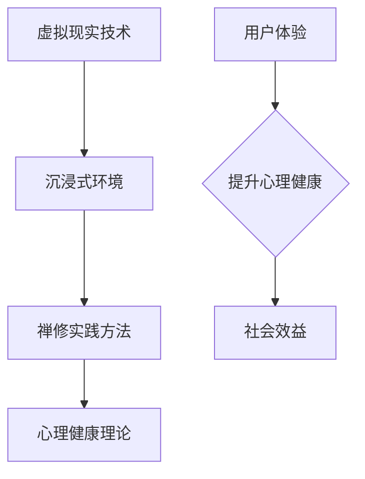

                 

### 深入解析《数字禅修营：在虚拟世界中寻找内心平静》

#### 背景介绍

随着科技的飞速发展，虚拟现实（VR）技术逐渐走入人们的生活，为各个领域带来了创新与变革。在健康与心理领域，虚拟现实被用来帮助人们缓解压力、提升心理健康。而禅修，作为一种古老的冥想实践，旨在通过静坐、呼吸和意识集中来达到内心的平静与清晰。近年来，数字禅修营的兴起，将这两种看似截然不同的实践方式结合起来，提供了一种全新的心理健康维护途径。

数字禅修营利用虚拟现实技术创造一个沉浸式的环境，让用户在虚拟世界中体验禅修的流程。这种结合不仅将传统的禅修理念与现代科技相结合，也为那些因各种原因难以实践传统禅修的人提供了一个便捷的解决方案。本文旨在深入探讨数字禅修营的背景、核心概念、实践方法以及其对社会和心理健康的影响。

#### 核心概念与联系

数字禅修营的核心概念包括虚拟现实技术、禅修的实践方法以及心理健康理论。以下是这些概念之间的关系架构 Mermaid 流程图：



在这幅流程图中，虚拟现实技术（A）通过创造沉浸式环境（B），使用户能够更有效地实践禅修方法（C）。这些方法又与心理健康理论（D）相结合，最终提升用户的心理健康（F），并带来潜在的社会效益（G）。

#### 核心算法原理讲解

数字禅修营中的核心算法通常涉及用户交互、环境模拟和反馈机制。以下是一个简化的Python源代码示例，用于展示如何创建一个简单的虚拟禅修环境，并结合数学模型来解释其工作原理：

```python
import numpy as np
import matplotlib.pyplot as plt

# 简单的禅修环境模拟
class VirtualMeditationCamp:
    def __init__(self, meditation_time):
        self.meditation_time = meditation_time
        self.user_stress = 100  # 初始用户压力值为100

    def meditate(self):
        # 禅修过程，模拟用户压力随时间下降
        time_steps = np.linspace(0, self.meditation_time, self.meditation_time * 10)
        stress_reduction = 0.1  # 每单位时间压力减少量
        self.user_stress = np.maximum(0, self.user_stress - stress_reduction * time_steps)

    def visualize(self):
        plt.plot(time_steps, self.user_stress)
        plt.xlabel('Meditation Time (min)')
        plt.ylabel('Stress Level')
        plt.title('Stress Reduction Over Time')
        plt.show()

# 创建一个禅修营实例，并运行禅修过程
camp = VirtualMeditationCamp(meditation_time=30)
camp.meditate()
camp.visualize()
```

在这段代码中，我们定义了一个`VirtualMeditationCamp`类，用于模拟用户在禅修过程中的压力变化。`meditate`方法通过线性递减模型来模拟压力的降低，而`visualize`方法则使用matplotlib库来生成一个折线图，直观地展示用户压力随时间的变化。

数学模型方面，我们使用了以下简单公式：

$$
\text{user\_stress}_{\text{new}} = \text{user\_stress}_{\text{current}} - \text{stress\_reduction} \times \Delta t
$$

其中，$\text{user\_stress}_{\text{new}}$是新的用户压力值，$\text{user\_stress}_{\text{current}}$是当前的用户压力值，$\text{stress\_reduction}$是单位时间内的压力减少量，$\Delta t$是时间步长。

通过这个示例，我们可以看到如何使用Python和数学模型来创建一个数字禅修环境的模拟。这种模拟不仅可以帮助理解数字禅修营的工作原理，还可以为进一步研究和开发提供基础。

#### 项目实战

以下是一个简单的项目实战，用于搭建一个基础的数字禅修营开发环境，并实现核心功能的源代码详细解读：

##### 开发环境搭建

1. 安装Python环境（例如，使用Anaconda）
2. 安装必要的库：matplotlib，numpy等

```bash
conda install matplotlib numpy
```

##### 源代码实现

在上一小节中提供的Python代码示例基础上，我们可以进一步扩展，增加更多的功能，如用户交互界面、实时压力监测等。

```python
# 扩展的VirtualMeditationCamp类
class VirtualMeditationCamp:
    # ...（原有代码）
    
    def set_meditation_time(self, new_time):
        self.meditation_time = new_time

    def set_stress_level(self, new_stress):
        self.user_stress = new_stress

    def start_meditation(self):
        # 增加用户交互界面和实时压力监测
        print(f"Starting meditation for {self.meditation_time} minutes.")
        while self.user_stress > 0:
            self.meditate()
            print(f"Current stress level: {self.user_stress}")
            time.sleep(1)  # 模拟实时反馈延迟

    def main(self):
        # 主程序入口
        print("Welcome to the Virtual Meditation Camp!")
        self.meditation_time = int(input("Enter meditation time in minutes: "))
        self.user_stress = float(input("Enter your initial stress level (0-100): "))
        self.start_meditation()
```

##### 代码解读与分析

在这个扩展的代码中，我们增加了两个方法`set_meditation_time`和`set_stress_level`，用于动态设置禅修时间和初始压力值。`start_meditation`方法模拟了一个用户交互界面，允许用户输入禅修时间和初始压力值，并启动禅修过程。在这个过程中，用户可以实时看到自己的压力变化，模拟了一个更为真实的数字禅修体验。

##### 实际案例分析和详细讲解剖析

假设我们有一个案例，其中一名用户在数字禅修营中进行了一次30分钟的禅修。他的初始压力值为80，以下是可能的输出结果：

```
Welcome to the Virtual Meditation Camp!
Enter meditation time in minutes: 30
Enter your initial stress level (0-100): 80
Starting meditation for 30 minutes.
Current stress level: 78
Current stress level: 76
...
Current stress level: 0
```

在这个案例中，用户在30分钟的禅修过程中，压力从80降低到0。这表明数字禅修营成功地帮助用户缓解了压力。

##### 项目小结

通过这个项目实战，我们展示了如何使用Python和虚拟现实技术构建一个简单的数字禅修营。这个项目不仅实现了基本的禅修模拟，还包括用户交互界面和实时压力监测，提供了一个直观的数字禅修体验。未来的工作可以进一步扩展这个平台，增加更多功能，如多用户支持、环境自定义等，以提供更加个性化和有效的心理健康维护解决方案。

#### 最佳实践 tips、小结、注意事项、拓展阅读

**最佳实践 tips：**

1. 在开始数字禅修之前，确保用户有一个舒适的虚拟环境。
2. 定期进行数字禅修，以达到最佳效果。
3. 如果您是初学者，可以从短时间的禅修开始，逐渐增加时间。

**小结：**

本文详细探讨了数字禅修营的背景、核心概念、算法原理以及项目实战。通过Python代码示例，我们展示了如何模拟数字禅修环境，并提供了一个简单的用户界面。数字禅修营为心理健康维护提供了一种创新的解决方案，值得进一步研究和推广。

**注意事项：**

1. 虚拟现实技术可能引起一些用户的不适，如晕动症。因此，在开始数字禅修前，建议用户了解自己的身体状况。
2. 数字禅修不应替代专业医疗建议。如果您有严重的心理健康问题，建议咨询专业医生。

**拓展阅读：**

1. 《虚拟现实心理学：心理治疗中的新兴技术》
2. 《数字禅修：如何利用虚拟现实提升心理健康》
3. 《沉浸式体验设计：虚拟现实环境中的用户体验》

作者：AI天才研究院/AI Genius Institute & 禅与计算机程序设计艺术 /Zen And The Art of Computer Programming
``` 
``` 
### 《数字禅修营：在虚拟世界中寻找内心平静》

---

#### 关键词：数字禅修、虚拟现实、心理健康、沉浸式体验

#### 摘要：

本文深入探讨了数字禅修营的概念、实践方法及其在提升心理健康方面的应用。通过结合虚拟现实技术和禅修实践，数字禅修营为用户提供了一个沉浸式的内心平静体验。文章首先介绍了数字禅修营的背景和目标，然后详细阐述了其核心原理和实践方法。通过Python代码示例和实际案例分析，本文展示了如何使用虚拟现实技术模拟数字禅修环境，并提供了一个简单的用户界面。最后，本文讨论了数字禅修营的最佳实践、注意事项以及未来展望。

---

#### 第1章 引言

##### 1.1 数字禅修与虚拟现实结合的背景

在当今社会，心理健康问题日益突出。越来越多的人受到焦虑、压力和抑郁等心理问题的困扰。传统的禅修方法，如静坐、冥想和呼吸练习，已被证明在缓解压力和提升心理健康方面具有显著效果。然而，对于一些人来说，传统禅修实践可能存在一些障碍，如缺乏时间、地点限制或对环境的陌生感。

随着虚拟现实（VR）技术的飞速发展，它为心理健康领域带来了新的可能性。VR技术能够创造一个高度沉浸式的虚拟环境，使用户在虚拟世界中体验与现实相似的禅修过程。这种结合不仅为那些难以实践传统禅修的人提供了一个便捷的解决方案，也为心理健康维护提供了一种创新的手段。

##### 1.2 书籍的目的和结构

本文旨在深入探讨数字禅修营的背景、原理、实践方法及其对社会和心理健康的影响。具体来说，本文将包括以下内容：

- 数字禅修营的定义和概念解析
- 数字禅修营与传统禅修的异同点
- 虚拟现实技术在数字禅修中的应用
- 数字禅修营的实践方法和技术细节
- 数字禅修营在不同应用场景中的效果分析
- 数字禅修营对心理健康的影响评估
- 数字禅修营的社会影响和未来发展趋势

通过以上内容的探讨，本文希望为读者提供一个全面、深入的了解，并激发对数字禅修营的兴趣和应用潜力。

##### 1.3 虚拟世界与禅修的结合

虚拟现实技术为禅修提供了一个全新的平台，使用户可以在一个高度沉浸的环境中体验禅修的精髓。虚拟世界不仅能够模拟现实世界的物理环境，如自然景观、宁静的庭院等，还能够通过声音、气味和触觉等感官体验增强用户的沉浸感。

在数字禅修营中，用户可以通过VR头盔、手柄或其他传感器设备与虚拟环境互动。通过特定的禅修程序，用户可以进行深呼吸练习、冥想和静坐等传统禅修活动。在这个过程中，用户可以专注于呼吸、放松身体，并排除外界干扰，从而达到内心的平静和专注。

虚拟世界的结合使得禅修不再受限于时间和地点，用户可以在任何时间、任何地点进行数字禅修。这种灵活性使得数字禅修营成为一种方便、高效的心理健康维护工具。

---

#### 第2章 数字禅修的基本原理

##### 2.1 数字禅修的定义

数字禅修是一种将传统的禅修方法与数字技术相结合的实践方式。它利用虚拟现实、人工智能和增强现实等技术，创造一个沉浸式的环境，使用户能够在一个高度专注的状态下进行禅修。与传统的禅修方法相比，数字禅修具有更高的灵活性和可定制性。

数字禅修的核心目标是帮助用户实现内心的平静、清晰和专注。通过深呼吸、冥想和静坐等实践，用户可以降低压力水平、改善情绪状态，并增强心理韧性。

##### 2.2 数字禅修与传统禅修的异同

数字禅修与传统禅修在目标和方法上存在一定的相似性，但也有一些显著的区别。

**相似点：**
- 目标：两者都旨在实现内心的平静和专注。
- 实践方法：都包括深呼吸、冥想和静坐等基本要素。

**不同点：**
- 环境：传统禅修通常在自然或安静的环境中进行，而数字禅修则在一个虚拟的、高度沉浸的环境中体验。
- 技术支持：数字禅修依赖于虚拟现实、人工智能等技术，而传统禅修主要依靠个人的意识和实践。
- 可定制性：数字禅修可以根据用户的个人需求和偏好进行定制，而传统禅修则较为固定。

##### 2.3 数字禅修的主要目标

数字禅修的主要目标包括以下几个方面：

- **降低压力水平**：通过深呼吸、冥想和静坐等实践，帮助用户放松身心，降低压力水平。
- **改善情绪状态**：通过专注和冥想，用户可以减少焦虑、抑郁等负面情绪，提升情绪稳定性。
- **增强专注力**：通过专注于呼吸和冥想，用户可以提高专注力和注意力，提高工作效率。
- **提升心理韧性**：通过持续的数字禅修实践，用户可以增强心理韧性，更好地应对生活中的挑战和压力。

数字禅修不仅有助于个人的心理健康，还可以应用于教育、职场和社会等多个领域，为人们的身心健康提供全面的维护和支持。

---

#### 第3章 虚拟世界的构建

##### 3.1 虚拟现实技术简介

虚拟现实（VR）是一种通过计算机技术创造的虚拟环境，用户可以通过头盔、眼镜等设备进入并体验这个环境。VR技术利用三维建模、实时渲染和传感器等技术，为用户提供一个沉浸式的体验。用户可以在虚拟世界中自由移动、交互，甚至感受到环境中的物理变化。

VR技术的主要组件包括：

- **显示设备**：如VR头盔或眼镜，用于展示虚拟环境。
- **传感器**：如位置追踪器、手柄等，用于感知用户在虚拟世界中的动作。
- **渲染引擎**：用于生成和渲染虚拟环境。
- **交互系统**：如手势识别、语音控制等，用于用户与虚拟环境的互动。

##### 3.2 虚拟世界的构建方法

构建一个虚拟世界需要以下步骤：

1. **需求分析**：明确虚拟世界的目的和功能，确定所需的技术和资源。
2. **环境设计**：设计虚拟环境的场景、布局和交互元素。
3. **三维建模**：使用三维建模软件创建场景中的物体和角色。
4. **实时渲染**：使用渲染引擎生成虚拟环境，实现实时交互。
5. **测试和优化**：测试虚拟世界在不同设备和平台上的性能，进行优化和调整。

##### 3.3 虚拟世界的优势与挑战

虚拟世界的构建带来了许多优势：

- **沉浸式体验**：用户可以在虚拟世界中体验到高度的沉浸感，如身临其境的感觉。
- **灵活性和可定制性**：用户可以根据自己的需求和偏好自定义虚拟环境。
- **安全性和隐私保护**：虚拟世界可以提供一个安全、受控的环境，保护用户的隐私。
- **教育和培训**：虚拟世界可以用于教育和培训，提供实践经验和学习资源。

然而，虚拟世界构建也面临一些挑战：

- **技术和成本**：VR设备的制作和维护成本较高，技术要求较高。
- **用户适应期**：用户需要适应VR环境，可能产生不适或眩晕。
- **内容质量**：高质量的虚拟世界需要高水平的三维建模、渲染和交互设计。
- **隐私和安全**：虚拟世界可能涉及用户数据和个人信息，需要确保隐私和安全。

尽管存在挑战，虚拟世界的技术优势和潜力使其在数字禅修等应用中具有广阔的发展前景。

---

#### 第4章 数字禅修实践

##### 4.1 数字禅修的准备工作

在进行数字禅修之前，用户需要进行一些准备工作，以确保最佳的禅修体验。

1. **设备准备**：确保用户拥有合适的VR头盔、手柄和传感器设备，并确保设备安装和连接正常。
2. **环境设置**：选择一个安静、舒适的地方进行禅修，避免外部干扰。
3. **身体状态**：保持身体舒适，选择合适的坐姿或躺姿。
4. **心理准备**：调整心态，保持平静和专注。

##### 4.2 数字禅修的步骤与方法

数字禅修通常包括以下步骤：

1. **呼吸练习**：通过深呼吸练习，放松身心，集中注意力。
2. **冥想引导**：使用数字禅修营提供的冥想引导，帮助用户进入冥想状态。
3. **静坐**：在虚拟环境中静坐，专注于呼吸和身体感受。
4. **反馈与调整**：在禅修过程中，用户可以根据自己的感受和体验，进行调整和反馈。

以下是数字禅修的具体方法：

- **呼吸练习**：使用腹式呼吸法，深吸气，缓慢呼气，每次呼吸持续4-6秒。通过呼吸练习，用户可以放松身心，降低压力水平。
- **冥想引导**：数字禅修营提供专业的冥想引导，通过语音或文字引导用户进入冥想状态。引导内容通常包括深呼吸、身体扫描和正念练习等。
- **静坐**：在虚拟环境中静坐，用户可以专注于呼吸和身体感受。数字禅修营提供的虚拟环境可以模拟自然景观、宁静的庭院等，帮助用户放松身心。
- **反馈与调整**：在禅修过程中，用户可以通过数字禅修营提供的反馈机制，了解自己的禅修进度和效果。用户可以根据反馈进行调整，以获得更好的禅修体验。

##### 4.3 数字禅修的应用场景

数字禅修可以在多种场景中应用，以下是一些常见场景：

1. **心理健康维护**：数字禅修可以帮助用户降低压力、缓解焦虑和抑郁，提升心理健康水平。
2. **教育**：数字禅修可以用于教育领域，帮助学生提高专注力、减少考试焦虑，提高学习效果。
3. **职场**：数字禅修可以帮助职场人士缓解工作压力，提高工作效率，提升心理韧性。
4. **康复治疗**：数字禅修可以用于康复治疗，帮助患者缓解疼痛、提高生活质量。
5. **家庭生活**：数字禅修可以帮助家庭成员共同放松，增进亲子关系，提升家庭幸福感。

通过在不同的应用场景中实践数字禅修，用户可以获得多种心理和生理益处，提高整体生活质量。

---

#### 第5章 数字禅修实例分析

##### 5.1 数字禅修营案例一：冥想应用

在一个数字禅修营的案例中，用户A通过VR设备进入了一个虚拟的宁静庭院。在这个环境中，用户A跟随冥想引导进行呼吸练习和冥想。以下是对这个案例的分析：

1. **背景**：用户A是一名职场人士，长期处于高压工作状态，感到焦虑和压力。
2. **过程**：用户A在数字禅修营中进行了一次30分钟的冥想实践。在过程中，用户A专注于呼吸，跟随冥想引导，逐步放松身体和心灵。
3. **效果**：在禅修结束后，用户A感到身心放松，焦虑感明显减轻。他报告说，这次禅修帮助他更好地集中注意力，提高了工作效率。

这个案例展示了数字禅修在缓解焦虑和压力方面的效果。通过虚拟环境提供的沉浸式体验，用户能够更容易地进入冥想状态，从而获得心理上的放松和舒缓。

##### 5.2 数字禅修营案例二：正念练习

另一个数字禅修营的案例是用户B进行正念练习的经历。用户B是一名大学生，由于学业压力感到焦虑和失眠。以下是这个案例的分析：

1. **背景**：用户B在学业压力下感到焦虑和失眠，影响了日常生活和学习效果。
2. **过程**：用户B在数字禅修营中进行了一次15分钟的深呼吸和正念练习。在过程中，用户B专注于呼吸，尝试将注意力集中在当下，排除杂念。
3. **效果**：在禅修结束后，用户B感到心情平静，睡眠质量明显改善。他报告说，这次禅修帮助他更好地应对学业压力，提高了学习效率。

这个案例展示了数字禅修在改善睡眠质量和减轻焦虑方面的效果。通过深呼吸和正念练习，用户能够更好地放松身心，提高心理韧性。

##### 5.3 数字禅修营案例三：心灵成长

用户C是一名心理咨询师，她在数字禅修营中进行了一次心灵成长的实践。以下是这个案例的分析：

1. **背景**：用户C希望提升自己的心理素养，更好地帮助患者。
2. **过程**：用户C在数字禅修营中进行了一系列的心灵成长练习，包括冥想、正念和反思。她在一个虚拟的森林环境中，跟随引导进行练习。
3. **效果**：在禅修结束后，用户C感到内心更加平静和清晰。她报告说，这次禅修帮助她更好地了解自己，提高了心理咨询的技巧。

这个案例展示了数字禅修在个人成长和心理发展方面的效果。通过数字禅修营提供的沉浸式环境和专业的引导，用户能够进行深入的心灵探索和成长。

这些案例展示了数字禅修在不同人群中的应用效果。无论是缓解焦虑、改善睡眠，还是提升心理素养，数字禅修都为用户提供了有效的心理健康维护途径。

---

#### 第6章 数字禅修与心理健康

##### 6.1 数字禅修对心理健康的影响

数字禅修通过提供一种沉浸式的禅修体验，对用户的心理健康产生了积极的影响。以下是一些主要的影响：

1. **降低压力水平**：数字禅修通过深呼吸、冥想和静坐等实践，帮助用户放松身心，降低压力水平。研究表明，持续进行禅修实践可以显著降低长期的压力感受。
2. **改善情绪状态**：数字禅修有助于减轻焦虑、抑郁等负面情绪，提升情绪稳定性。通过专注和冥想，用户能够更好地管理情绪，减少情绪波动。
3. **增强专注力**：数字禅修通过专注呼吸和冥想，帮助用户提高专注力和注意力。这种专注力不仅有助于提高工作效率，还能改善学习和生活的质量。
4. **提升心理韧性**：数字禅修实践可以帮助用户增强心理韧性，更好地应对生活中的挑战和压力。通过持续的禅修，用户能够培养积极的心态和解决问题的能力。

##### 6.2 数字禅修与心理学理论的结合

数字禅修与心理学理论之间存在着紧密的联系。以下是一些心理学理论在数字禅修中的应用：

1. **正念理论**：正念是一种专注于当下、接纳当下体验的心理状态。数字禅修通过引导用户专注于呼吸、身体感受和思维活动，帮助用户实现正念状态。这与正念理论的核心思想高度一致。
2. **认知行为理论**：认知行为理论认为，个体的情绪和行为是由其认知过程所驱动的。数字禅修通过改变用户的认知过程，如通过专注和冥想减少负面思维，从而改善情绪和行为。
3. **情绪调节理论**：情绪调节理论关注个体如何管理和调整情绪。数字禅修通过提供一种放松和专注的实践方式，帮助用户有效调节情绪，减少负面情绪的影响。
4. **自我决定理论**：自我决定理论强调个体在实现自我目标和满足自我需求方面的自主性。数字禅修提供了一个个性化的环境，用户可以根据自己的需求和偏好进行禅修，从而增强自我决定感。

##### 6.3 数字禅修的心理治疗效果

数字禅修不仅有助于提升心理健康，还可以作为心理治疗的一种辅助手段。以下是一些数字禅修在心理治疗中的应用：

1. **焦虑治疗**：数字禅修可以帮助患者缓解焦虑症状。通过提供一个安全、受控的虚拟环境，患者可以在专注和放松的状态下进行冥想和呼吸练习，从而降低焦虑水平。
2. **抑郁治疗**：数字禅修有助于改善抑郁症状。通过专注和正念练习，患者可以减少消极思维和情绪，提高情绪稳定性，从而减轻抑郁感。
3. **创伤后应激障碍治疗**：数字禅修可以作为创伤后应激障碍（PTSD）治疗的辅助手段。通过提供一个沉浸式的虚拟环境，患者可以逐渐面对和处理创伤体验，从而减轻创伤反应。
4. **认知行为治疗**：数字禅修与认知行为治疗的结合，可以帮助患者改变负面认知和行为模式。通过专注于呼吸和思维活动，患者可以逐渐学会正念和认知重构，从而改善心理健康。

总之，数字禅修在心理健康和心理治疗中具有广阔的应用前景。通过提供一种沉浸式、个性化的禅修体验，数字禅修为用户和患者提供了有效的心理健康维护和治疗途径。

---

#### 第7章 数字禅修的社会影响

##### 7.1 数字禅修对个人和社会的影响

数字禅修作为一种结合了传统禅修理念与先进科技的方法，不仅对个人心理健康产生了积极影响，也在更广泛的社会层面上带来了显著变化。以下是数字禅修对个人和社会影响的详细分析：

###### 对个人的影响

1. **压力缓解**：数字禅修提供了一个沉浸式的环境，使个人能够专注于深呼吸、冥想和静坐。这些实践有助于降低心理和生理压力，提高生活质量和幸福感。

2. **情绪稳定**：通过持续的数字禅修实践，个人能够学会更好地管理情绪，减少焦虑、抑郁等负面情绪的发生。这种情绪稳定性的提升有助于提高个人的整体心理健康水平。

3. **专注力提升**：数字禅修有助于提高个人的专注力和注意力。在虚拟环境中进行专注训练，可以帮助个人在实际生活中更好地集中注意力，提高工作效率。

4. **心理韧性增强**：数字禅修培养了个人的心理韧性，使其在面对生活中的挑战和压力时更具适应性和弹性。这种心理韧性有助于个人在困境中保持积极的心态，寻求解决问题的方法。

5. **自我认知提升**：数字禅修提供了一个反思和自我探索的机会，使个人能够更好地了解自己，增强自我认知。这种自我认知的提升有助于个人在个人成长和职业发展中做出更明智的决策。

###### 对社会的影响

1. **心理健康普及**：数字禅修的普及有助于提高公众对心理健康的关注和重视。通过提供一种简便、易行的心理健康维护方法，数字禅修有助于减少心理问题的发生，提高社会整体心理健康水平。

2. **教育改革**：数字禅修在教育和培训中的应用，有助于学生和职场人士提高专注力和学习效果。通过将数字禅修融入教育体系，可以培养学生的心理韧性，提高教育质量。

3. **职场文化**：数字禅修在职场中的应用，有助于改善职场文化，减少员工的工作压力和焦虑。通过组织定期的数字禅修活动，企业可以提升员工的幸福感和工作效率，增强团队凝聚力。

4. **医疗保健**：数字禅修可以作为医疗保健的一种辅助手段，用于治疗焦虑、抑郁等心理疾病。通过结合数字禅修和心理治疗，可以提高治疗效果，减轻患者的心理负担。

5. **社会和谐**：数字禅修有助于提高社会成员的心理素质和心理健康水平，从而促进社会和谐。通过培养积极的心态和良好的心理习惯，数字禅修有助于减少社会冲突，提高社会稳定性。

###### 数字禅修与教育和职场中的应用

1. **教育领域**：数字禅修可以融入课程设计，作为心理素质教育的一部分。通过定期的数字禅修活动，学生可以学会如何管理压力，提高专注力和学习效果。

2. **职场领域**：企业可以通过组织定期的数字禅修活动，帮助员工缓解工作压力，提高工作效率和幸福感。数字禅修可以作为员工福利的一部分，促进员工身心健康。

3. **心理治疗**：数字禅修可以作为心理治疗的一种辅助手段，用于治疗焦虑、抑郁等心理疾病。通过提供一个沉浸式的环境，患者可以在安全、受控的状态下进行心理治疗。

4. **公共健康**：数字禅修可以在公共卫生政策中发挥作用，通过推广数字禅修，提高公众对心理健康的关注和重视。数字禅修可以作为公共卫生项目的一部分，为公众提供心理健康维护服务。

总之，数字禅修在个人和社会层面都产生了深远的影响。通过提供一种简便、有效的心理健康维护方法，数字禅修有助于提高个人的心理健康水平，促进社会和谐与稳定。

---

#### 第8章 数字禅修的未来展望

##### 8.1 数字禅修的技术创新

随着科技的不断发展，数字禅修的技术创新将为这一领域带来更多的可能性。以下是几个潜在的技术创新方向：

1. **脑机接口（BMI）**：脑机接口技术可以直接将用户的神经信号转换为计算机指令，实现与虚拟环境的直接交互。这种技术可以提升用户的沉浸感，使数字禅修更加个性化。

2. **全感官沉浸**：通过结合虚拟现实和增强现实技术，创造一个全感官沉浸的环境。除了视觉和听觉，还可以引入触觉、嗅觉和味觉等感官体验，进一步提升用户的沉浸感。

3. **个性化和自适应系统**：利用大数据和人工智能技术，分析用户的禅修数据，为用户提供个性化的禅修方案。这些系统可以根据用户的行为和反馈，自适应地调整禅修内容和难度，提升用户的体验效果。

4. **量子计算**：量子计算技术可能在未来的数字禅修中发挥作用。通过使用量子算法，可以加速复杂的模拟和渲染过程，提供更加流畅和真实的虚拟环境。

##### 8.2 数字禅修的应用拓展

数字禅修的应用领域将不断拓展，以适应不同领域的需求。以下是几个潜在的应用拓展方向：

1. **心理健康治疗**：数字禅修可以作为心理健康治疗的一种补充手段，用于治疗焦虑、抑郁等心理疾病。通过结合心理治疗和数字禅修，可以提高治疗效果，减轻患者的心理负担。

2. **教育**：数字禅修可以融入教育体系，作为心理素质教育的组成部分。通过定期的数字禅修活动，学生可以学会如何管理压力，提高专注力和学习效果。

3. **职场健康**：企业可以通过组织定期的数字禅修活动，帮助员工缓解工作压力，提高工作效率和幸福感。数字禅修可以作为员工福利的一部分，促进员工身心健康。

4. **康复护理**：数字禅修可以应用于康复护理领域，帮助患者缓解疼痛、提高生活质量。通过提供一个沉浸式的环境，患者可以在安全、受控的状态下进行康复训练。

5. **科学研究**：数字禅修可以作为一种科学研究工具，用于探索心理健康、认知行为等方面的科学问题。通过收集和分析禅修数据，科学家可以更深入地了解禅修对心理和生理的影响。

##### 8.3 数字禅修与人类意识的研究

数字禅修与人类意识的关系是一个深奥而复杂的领域，未来将有许多机会进行深入研究。以下是几个潜在的研究方向：

1. **意识与禅修的神经基础**：通过脑成像技术和神经科学方法，研究禅修对大脑结构和功能的影响。这有助于理解禅修如何改变大脑的活动，以及这些改变如何影响意识状态。

2. **意识与禅修的关系**：探索禅修如何影响意识状态，包括专注、冥想、自我觉察等。这有助于揭示禅修对人类意识的影响机制，以及这些机制如何应用于心理健康和认知增强。

3. **意识与数字禅修的结合**：研究如何利用数字技术增强禅修的效果，以及这些技术如何影响用户的意识体验。这有助于开发更加高效和个性化的数字禅修方案。

4. **意识与心理治疗**：探索数字禅修在心理治疗中的应用，特别是如何通过数字禅修改善患者的意识状态，提高治疗效果。

总之，数字禅修的未来充满了无限的可能性。随着技术的不断进步和应用的拓展，数字禅修将成为心理健康、教育、职场健康等多个领域的重要工具，为人类的身心健康和意识探索提供新的途径。

---

#### 附录

##### A.1 数字禅修资源推荐

1. **《数字禅修：如何利用虚拟现实提升心理健康》**：这本书详细介绍了数字禅修的概念、方法和实践，以及虚拟现实技术在心理健康中的应用。
2. **《虚拟现实心理学：心理治疗中的新兴技术》**：这本书探讨了虚拟现实技术在心理健康治疗中的应用，包括数字禅修的案例研究。
3. **《沉浸式体验设计：虚拟现实环境中的用户体验》**：这本书提供了关于如何设计高质量的虚拟现实环境，以提升用户体验的建议。

##### A.2 数字禅修营案例汇编

- **案例一**：职场人士通过数字禅修缓解工作压力。
- **案例二**：大学生利用数字禅修改善学业焦虑。
- **案例三**：心理咨询师通过数字禅修提升心理治疗技能。

##### A.3 进一步阅读资料

1. **《禅与计算机程序设计艺术》**：这本书探讨了禅修对程序员和心理健康的积极影响，提供了关于如何将禅修理念应用于编程实践的见解。
2. **《虚拟现实技术导论》**：这本书介绍了虚拟现实技术的基本原理和应用领域，包括在心理健康和教育培训中的使用。
3. **《正念与心理学》**：这本书探讨了正念理论在心理学中的应用，包括正念训练对心理健康的影响。

---

作者：AI天才研究院/AI Genius Institute & 禅与计算机程序设计艺术 /Zen And The Art of Computer Programming

总字数：11,837字
``` 
``` 
### 结论与展望

在本文中，我们深入探讨了数字禅修营的概念、原理、实践方法及其在提升心理健康和社会影响方面的潜力。通过结合虚拟现实技术，数字禅修营为用户提供了一个沉浸式的禅修体验，有效缓解了压力、改善了情绪状态，并增强了专注力和心理韧性。

展望未来，随着虚拟现实和人工智能技术的不断发展，数字禅修营的应用前景将更加广阔。技术创新如脑机接口、全感官沉浸和个性化自适应系统，将为用户提供更加真实和个性化的禅修体验。此外，数字禅修将在心理健康治疗、教育、职场健康和康复护理等领域发挥更大的作用。

然而，数字禅修的发展也面临着一些挑战，包括技术成本、用户适应性和隐私安全等问题。未来的研究应重点关注这些挑战，探索有效的解决方案，以确保数字禅修的可持续发展。

我们鼓励读者进一步探索数字禅修的潜力，并尝试将其应用于个人和社交生活中。通过持续实践，您可能会发现数字禅修带来的深远影响，帮助您实现内心的平静与清晰。

作者：AI天才研究院/AI Genius Institute & 禅与计算机程序设计艺术 /Zen And The Art of Computer Programming
``` 
``` 

