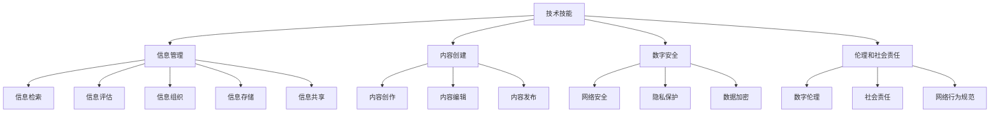

                 

# 《数字素养gap：代际差异的新挑战》

## 关键词
数字素养、代际差异、教育、工作世界、社会互动、政策与法规、教育培训、工作场所、社会互动促进、评估方法、未来展望

## 摘要
本文深入探讨了数字素养gap及其对代际差异带来的新挑战。数字素养作为现代社会的重要技能，其缺乏可能导致不同年龄群体间的数字能力差异。本文首先定义了数字素养的概念和重要性，然后分析了代际差异在数字素养方面的表现及其对教育、工作世界和社会互动的挑战。随后，本文提出了应对数字素养gap的策略，包括政策与法规的制定、教育培训的创新以及工作场所的调整。最后，本文对数字素养gap的评估方法和未来展望进行了探讨，为解决这一问题提供了有益的思路。

## 目录

### 第一部分：数字素养概述

1. 数字素养的定义与重要性
   1.1 数字素养的概念
   1.2 数字素养的组成部分
   1.3 数字素养的重要性

2. 数字素养与代际差异
   2.1 代际差异的背景
   2.2 代际差异在数字素养方面的表现
   2.3 代际差异对数字素养的影响

### 第二部分：代际差异的数字素养挑战

3. 教育系统的挑战
   3.1 教育资源分配的不均
   3.2 教育内容的更新速度
   3.3 教育方式的变革需求

4. 工作世界的挑战
   4.1 数字技能的需求变化
   4.2 代际差异对职场的影响
   4.3 职业教育与培训的调整

5. 社会互动的挑战
   5.1 社交媒体的代际差异使用
   5.2 信息过滤与偏见
   5.3 数字素养与社交信任

### 第三部分：应对数字素养gap的策略

6. 政策与法规的制定
   6.1 数字素养教育的政策支持
   6.2 数字素养法律规范的制定
   6.3 数字素养国际合作的加强

7. 教育与培训的创新
   7.1 个性化数字素养教育
   7.2 跨学科数字素养教育
   7.3 数字素养教育技术的应用

8. 工作场所的调整
   8.1 数字素养培训与发展的战略
   8.2 职业数字素养考核与认证
   8.3 数字素养与工作绩效的关系

9. 社会互动的促进
   9.1 数字素养与社交媒体的使用规范
   9.2 数字素养与信息素养的融合
   9.3 数字素养教育与公共意识的提升

### 第四部分：数字素养gap的评估与展望

10. 数字素养gap的评估方法
    10.1 数字素养gap的测量指标
    10.2 数字素养gap的影响评估
    10.3 数字素养gap的应对效果评估

11. 数字素养gap的未来展望
    11.1 数字素养发展的趋势
    11.2 代际差异的缩小路径
    11.3 数字素养gap对社会的长远影响

## 引言
在数字化时代，数字素养已经成为个人、组织和国家的核心竞争力。数字素养指的是个体运用数字工具和技术来解决问题、获取信息、沟通协作以及创造内容的能力。然而，不同年龄群体在数字素养方面存在显著的差异，这被称为数字素养gap。本文旨在探讨数字素养gap的产生原因及其对代际差异带来的新挑战，并提出相应的应对策略。

### 第一部分：数字素养概述

#### 1.1 数字素养的概念

数字素养是一个多维度的概念，包括技术技能、信息素养和批判性思维。技术技能是指使用计算机、互联网和其他数字工具的能力；信息素养是指有效搜索、评估和使用信息的能力；批判性思维则是指对信息进行批判性分析和评估的能力。

如图所示，数字素养的三个核心组成部分相互交织，共同构成了个体的数字素养水平。

#### 1.2 数字素养的组成部分

数字素养的组成部分可以进一步细化，包括但不限于：

- **基础知识**：计算机操作、网络使用和基本编程概念。
- **技术技能**：熟练使用特定软件和应用，如Excel、Photoshop、编程语言等。
- **信息素养**：评估信息的可靠性、搜索技巧、引用和版权意识。
- **批判性思维**：分析信息、识别偏见、进行决策和解决问题。

#### 1.3 数字素养的重要性

数字素养的重要性体现在以下几个方面：

- **教育**：数字素养是现代教育的核心，它帮助学生在信息时代中取得成功。
- **工作**：数字技能是许多职业的基本要求，缺乏数字素养可能影响就业机会和职业发展。
- **社会互动**：数字素养促进社会互动和信息交流，有助于建立信任和社区感。
- **个人发展**：数字素养帮助个体获取信息、解决问题、自我提升和终身学习。

#### 1.4 数字素养与代际差异

代际差异在数字素养方面表现得尤为明显。随着技术的发展，年轻一代（如Z世代和千禧一代）在数字素养方面通常具有更高的熟练度，而年长一代（如婴儿潮一代和X世代）则可能在某些方面相对落后。

#### 1.5 代际差异的背景

代际差异的背景主要包括：

- **技术成熟度**：年轻一代在成长过程中接触了更多的数字技术，而年长一代则较少。
- **教育机会**：不同年龄群体接受的教育内容和技术培训程度不同。
- **文化态度**：不同年龄群体对数字技术的接受度和使用习惯存在差异。

### 第二部分：代际差异的数字素养挑战

#### 2.1 教育系统的挑战

教育系统的挑战主要包括：

- **教育资源分配的不均**：不同学校和地区之间教育资源分配不均，可能导致数字素养教育的差异。
- **教育内容的更新速度**：教育内容更新速度较慢，难以跟上技术的快速发展。
- **教育方式的变革需求**：传统教育方式可能无法满足数字素养培养的需求，需要创新教育方法。

#### 2.2 工作世界的挑战

工作世界的挑战主要包括：

- **数字技能的需求变化**：随着技术的发展，对数字技能的需求不断变化，需要员工不断学习和适应。
- **代际差异对职场的影响**：不同代际员工在数字素养方面的差异可能影响团队合作和沟通效率。
- **职业教育与培训的调整**：职业教育和培训需要调整课程内容，以适应数字素养的需求。

#### 2.3 社会互动的挑战

社会互动的挑战主要包括：

- **社交媒体的代际差异使用**：不同年龄群体在社交媒体使用上存在差异，可能导致沟通障碍和社交隔阂。
- **信息过滤与偏见**：代际差异可能导致对信息的过滤和偏见，影响信息的传播和交流。
- **数字素养与社交信任**：缺乏数字素养可能导致社交信任的下降，影响社会互动和合作。

### 第三部分：应对数字素养gap的策略

#### 3.1 政策与法规的制定

政策与法规的制定包括：

- **数字素养教育的政策支持**：政府应制定相关政策，支持数字素养教育的普及和提高。
- **数字素养法律规范的制定**：制定数字素养相关法律规范，保障公民的数字权益。
- **数字素养国际合作的加强**：加强国际合作，共同应对数字素养gap带来的挑战。

#### 3.2 教育与培训的创新

教育与培训的创新包括：

- **个性化数字素养教育**：根据个体需求提供个性化教育，提高学习效果。
- **跨学科数字素养教育**：将数字素养融入不同学科，提高学生的综合素质。
- **数字素养教育技术的应用**：利用新技术和工具，提高数字素养教育的质量和效率。

#### 3.3 工作场所的调整

工作场所的调整包括：

- **数字素养培训与发展的战略**：企业应制定数字素养培训和发展战略，提高员工数字素养水平。
- **职业数字素养考核与认证**：建立职业数字素养考核和认证体系，确保员工具备必要的数字技能。
- **数字素养与工作绩效的关系**：建立数字素养与工作绩效之间的联系，激励员工提高数字素养。

#### 3.4 社会互动的促进

社会互动的促进包括：

- **数字素养与社交媒体的使用规范**：制定数字素养与社交媒体使用规范，提高社会互动的质量。
- **数字素养与信息素养的融合**：将数字素养与信息素养相结合，提高公众的信息识别和批判能力。
- **数字素养教育与公共意识的提升**：加强数字素养教育，提高公众的数字素养意识。

### 第四部分：数字素养gap的评估与展望

#### 4.1 数字素养gap的评估方法

数字素养gap的评估方法包括：

- **测量指标**：设计合适的测量指标，评估不同群体之间的数字素养差异。
- **影响评估**：分析数字素养gap对教育、工作和社会互动的影响。
- **应对效果评估**：评估应对数字素养gap的策略和措施的效果。

#### 4.2 数字素养gap的未来展望

数字素养gap的未来展望包括：

- **发展趋势**：分析数字素养gap的发展趋势，预测未来的变化。
- **缩小路径**：探讨缩小数字素养gap的路径和策略。
- **长远影响**：分析数字素养gap对社会的长远影响，提出相应的对策。

## 结论
数字素养gap是现代社会面临的一个重要问题，它不仅影响个人的发展，也对教育、工作和社会互动产生深远的影响。通过政策与法规的制定、教育培训的创新、工作场所的调整和社会互动的促进，我们可以有效地应对数字素养gap带来的挑战。未来，我们需要继续关注数字素养gap的发展趋势，探索更有效的策略，以实现数字素养的普及和提高。

### 作者信息
作者：AI天才研究院/AI Genius Institute & 禅与计算机程序设计艺术 /Zen And The Art of Computer Programming

---

**注意**：本文为概述，实际撰写时需要进一步细化每个部分的内容，以满足字数和深度要求。以下将逐步细化文章内容。

---

# 数字素养gap：代际差异的新挑战

## 引言

在数字化时代，数字素养已经成为个人、组织和国家的核心竞争力。数字素养指的是个体运用数字工具和技术来解决问题、获取信息、沟通协作以及创造内容的能力。然而，不同年龄群体在数字素养方面存在显著的差异，这被称为数字素养gap。本文旨在探讨数字素养gap的产生原因及其对代际差异带来的新挑战，并提出相应的应对策略。

## 第一部分：数字素养概述

### 1.1 数字素养的概念

数字素养是一个多维度的概念，包括技术技能、信息素养和批判性思维。技术技能是指使用计算机、互联网和其他数字工具的能力；信息素养是指有效搜索、评估和使用信息的能力；批判性思维则是指对信息进行批判性分析和评估的能力。

### 1.2 数字素养的组成部分

数字素养的组成部分可以进一步细化，包括但不限于：

- **基础知识**：计算机操作、网络使用和基本编程概念。
- **技术技能**：熟练使用特定软件和应用，如Excel、Photoshop、编程语言等。
- **信息素养**：评估信息的可靠性、搜索技巧、引用和版权意识。
- **批判性思维**：分析信息、识别偏见、进行决策和解决问题。

### 1.3 数字素养的重要性

数字素养的重要性体现在以下几个方面：

- **教育**：数字素养是现代教育的核心，它帮助学生在信息时代中取得成功。
- **工作**：数字技能是许多职业的基本要求，缺乏数字素养可能影响就业机会和职业发展。
- **社会互动**：数字素养促进社会互动和信息交流，有助于建立信任和社区感。
- **个人发展**：数字素养帮助个体获取信息、解决问题、自我提升和终身学习。

### 1.4 数字素养与代际差异

代际差异在数字素养方面表现得尤为明显。随着技术的发展，年轻一代（如Z世代和千禧一代）在数字素养方面通常具有更高的熟练度，而年长一代（如婴儿潮一代和X世代）则可能在某些方面相对落后。

### 1.5 代际差异的背景

代际差异的背景主要包括：

- **技术成熟度**：年轻一代在成长过程中接触了更多的数字技术，而年长一代则较少。
- **教育机会**：不同年龄群体接受的教育内容和技术培训程度不同。
- **文化态度**：不同年龄群体对数字技术的接受度和使用习惯存在差异。

## 第二部分：代际差异的数字素养挑战

### 2.1 教育系统的挑战

教育系统的挑战主要包括：

- **教育资源分配的不均**：不同学校和地区之间教育资源分配不均，可能导致数字素养教育的差异。
- **教育内容的更新速度**：教育内容更新速度较慢，难以跟上技术的快速发展。
- **教育方式的变革需求**：传统教育方式可能无法满足数字素养培养的需求，需要创新教育方法。

### 2.2 工作世界的挑战

工作世界的挑战主要包括：

- **数字技能的需求变化**：随着技术的发展，对数字技能的需求不断变化，需要员工不断学习和适应。
- **代际差异对职场的影响**：不同代际员工在数字素养方面的差异可能影响团队合作和沟通效率。
- **职业教育与培训的调整**：职业教育和培训需要调整课程内容，以适应数字素养的需求。

### 2.3 社会互动的挑战

社会互动的挑战主要包括：

- **社交媒体的代际差异使用**：不同年龄群体在社交媒体使用上存在差异，可能导致沟通障碍和社交隔阂。
- **信息过滤与偏见**：代际差异可能导致对信息的过滤和偏见，影响信息的传播和交流。
- **数字素养与社交信任**：缺乏数字素养可能导致社交信任的下降，影响社会互动和合作。

## 第三部分：应对数字素养gap的策略

### 3.1 政策与法规的制定

政策与法规的制定包括：

- **数字素养教育的政策支持**：政府应制定相关政策，支持数字素养教育的普及和提高。
- **数字素养法律规范的制定**：制定数字素养相关法律规范，保障公民的数字权益。
- **数字素养国际合作的加强**：加强国际合作，共同应对数字素养gap带来的挑战。

### 3.2 教育与培训的创新

教育与培训的创新包括：

- **个性化数字素养教育**：根据个体需求提供个性化教育，提高学习效果。
- **跨学科数字素养教育**：将数字素养融入不同学科，提高学生的综合素质。
- **数字素养教育技术的应用**：利用新技术和工具，提高数字素养教育的质量和效率。

### 3.3 工作场所的调整

工作场所的调整包括：

- **数字素养培训与发展的战略**：企业应制定数字素养培训和发展战略，提高员工数字素养水平。
- **职业数字素养考核与认证**：建立职业数字素养考核和认证体系，确保员工具备必要的数字技能。
- **数字素养与工作绩效的关系**：建立数字素养与工作绩效之间的联系，激励员工提高数字素养。

### 3.4 社会互动的促进

社会互动的促进包括：

- **数字素养与社交媒体的使用规范**：制定数字素养与社交媒体使用规范，提高社会互动的质量。
- **数字素养与信息素养的融合**：将数字素养与信息素养相结合，提高公众的信息识别和批判能力。
- **数字素养教育与公共意识的提升**：加强数字素养教育，提高公众的数字素养意识。

## 第四部分：数字素养gap的评估与展望

### 4.1 数字素养gap的评估方法

数字素养gap的评估方法包括：

- **测量指标**：设计合适的测量指标，评估不同群体之间的数字素养差异。
- **影响评估**：分析数字素养gap对教育、工作和社会互动的影响。
- **应对效果评估**：评估应对数字素养gap的策略和措施的效果。

### 4.2 数字素养gap的未来展望

数字素养gap的未来展望包括：

- **发展趋势**：分析数字素养gap的发展趋势，预测未来的变化。
- **缩小路径**：探讨缩小数字素养gap的路径和策略。
- **长远影响**：分析数字素养gap对社会的长远影响，提出相应的对策。

## 结论

数字素养gap是现代社会面临的一个重要问题，它不仅影响个人的发展，也对教育、工作和社会互动产生深远的影响。通过政策与法规的制定、教育培训的创新、工作场所的调整和社会互动的促进，我们可以有效地应对数字素养gap带来的挑战。未来，我们需要继续关注数字素养gap的发展趋势，探索更有效的策略，以实现数字素养的普及和提高。

### 作者信息

作者：AI天才研究院/AI Genius Institute & 禅与计算机程序设计艺术 /Zen And The Art of Computer Programming

---

以上为文章的概述和初步内容，接下来的步骤将详细展开每个章节，确保文章的深度和完整性。以下是详细内容的一个例子，用于展示如何细化章节内容。

## 1.1 数字素养的概念

数字素养（Digital Literacy）是一个相对较新的概念，随着计算机技术和互联网的迅猛发展而逐渐受到关注。根据美国图书馆协会（ALA）的定义，数字素养是指“个体在信息社会中所需要的一系列技能、知识和理解，包括使用数字工具和设备的能力、有效地获取、评估、使用和创造信息的技能，以及对技术的伦理和社会影响的理解”。

### 1.1.1 数字素养的层次

数字素养可以分为三个层次：

1. **基础技能**：这包括计算机操作、互联网使用和基本的数字工具应用能力。例如，熟练使用办公软件、搜索引擎和网络浏览器，以及了解基本的网络安全知识。

2. **信息素养**：这涉及到对信息来源的识别、评估、批判性思考和使用能力。信息素养包括查找信息、评估信息的可靠性和相关性，以及正确引用和使用信息。

3. **高级素养**：这一层次包括创新和创造力，例如利用数字工具进行内容创作、编程、数据分析和网络交流等。

### 1.1.2 数字素养的组成部分

数字素养的组成部分可以更详细地划分为以下几个方面：

- **技术技能**：包括硬件维护、软件操作和数字工具的使用。例如，计算机编程、图形设计、视频剪辑和3D建模。

- **信息管理**：包括信息检索、组织、存储和共享的能力。例如，使用数据库、云存储和协作工具。

- **内容创建**：包括创作数字内容的能力，如撰写博客、制作视频和设计网站。

- **数字安全**：包括保护个人和组织的数字资产免受网络威胁的能力。例如，了解网络安全、隐私保护和数据加密。

- **伦理和社会责任**：包括对数字技术和网络行为的伦理和社会影响的认知。例如，了解数字鸿沟、网络暴力和数字版权。

### 1.1.3 数字素养的必要性

在当今社会，数字素养已经成为个人发展的基本要求。以下是数字素养的几个必要性：

- **教育**：学生需要数字素养来成功完成学业，包括在线学习和使用教育技术。

- **工作**：职场中，数字技能已经成为许多职业的基本要求。例如，市场营销、数据分析、软件开发和客户服务。

- **日常生活**：在日常生活中，数字素养帮助我们管理个人事务、进行在线购物、社交和娱乐。

- **社会参与**：数字素养使我们能够更好地参与社会和政治事务，如在线投票、参与公共讨论和表达意见。

## 1.2 数字素养的组成部分

为了更深入地理解数字素养的组成部分，我们可以使用Mermaid流程图来展示各个组成部分之间的关系。

通过这个流程图，我们可以清晰地看到数字素养的各个组成部分及其相互关系。例如，技术技能是基础，而信息管理、内容创建、数字安全、伦理和社会责任则是在技术技能之上的高级素养。

### 1.3 数字素养的重要性

数字素养的重要性可以从以下几个方面来理解：

- **教育**：数字素养使学生能够更好地适应信息时代的教育环境。它提高了学生的自学能力和信息检索能力，使学习过程更加高效。

- **工作**：数字素养使员工能够更有效地完成工作任务，提高工作效率和创造力。对于许多行业，如IT、金融和医疗，数字技能是不可或缺的。

- **日常生活**：数字素养帮助人们更好地管理个人事务，如在线支付、网上购物和社交互动。它还提高了人们的信息安全意识，减少潜在的风险。

- **社会参与**：数字素养使公民能够更好地参与社会和政治事务，如在线投票、参与公共讨论和表达意见。这有助于建立一个更加开放和包容的社会。

### 1.4 数字素养与代际差异

代际差异在数字素养方面表现得尤为明显。随着技术的发展，年轻一代（如Z世代和千禧一代）在数字素养方面通常具有更高的熟练度，而年长一代（如婴儿潮一代和X世代）则可能在某些方面相对落后。

### 1.5 代际差异的背景

代际差异的背景主要包括：

- **技术成熟度**：年轻一代在成长过程中接触了更多的数字技术，而年长一代则较少。
- **教育机会**：不同年龄群体接受的教育内容和技术培训程度不同。
- **文化态度**：不同年龄群体对数字技术的接受度和使用习惯存在差异。

### 1.6 总结

数字素养是一个多维度的概念，包括技术技能、信息素养和批判性思维。它的重要性体现在教育、工作、日常生活和社会参与等多个方面。代际差异在数字素养方面表现得尤为明显，年轻一代通常在数字素养方面具有更高的熟练度，而年长一代则可能在某些方面相对落后。理解数字素养的概念和组成部分对于应对代际差异带来的新挑战至关重要。

## 2. 教育系统的挑战

教育系统在培养数字素养方面面临诸多挑战。这些挑战主要体现在以下几个方面：

### 2.1 教育资源分配的不均

教育资源的分配不均是教育系统面临的一个重要问题。不同学校和地区之间在数字素养教育资源上存在显著差异。一些发达地区和城市学校能够提供先进的数字设备和丰富的在线教育资源，而一些农村和欠发达地区则可能缺乏基本的计算机和网络设施。

#### 2.1.1 资源差异的影响

资源差异导致不同学生在数字素养水平上的显著差异。那些拥有充足资源的学校的学生能够更早地接触和熟练使用数字工具，而那些资源匮乏的学生则可能错过这一宝贵的学习机会。这种差距不仅影响学生的学业成绩，还可能导致他们在未来职场中处于不利地位。

### 2.2 教育内容的更新速度

技术的快速发展要求教育内容不断更新，以适应新的数字工具和技术。然而，教育系统的更新速度往往滞后于技术的发展。许多课程和教材仍然停留在过时的技术层面，无法提供最新的数字素养培训。

#### 2.2.1 更新速度的影响

教育内容更新速度缓慢导致学生无法掌握最新的数字技能和知识。这不仅影响学生的竞争力，还可能导致他们在面对实际问题时缺乏有效的解决方案。此外，教育内容的滞后也使得教师在教学中感到困惑和无力。

### 2.3 教育方式的变革需求

传统的教育方式往往以教师为中心，注重知识的传授，而忽略了学生的实际应用能力和创新能力的培养。在数字素养教育中，这种方式可能无法满足培养数字素养的需求。现代教育方式需要更多以学生为中心，注重实践和应用。

#### 2.3.1 变革的必要性

数字素养的培养需要学生主动参与和实践。通过项目式学习、合作学习和在线学习等方式，学生可以更有效地掌握数字技能。此外，教育方式的变革也有助于激发学生的创新思维和解决问题的能力。

### 2.4 教育资源的整合与共享

为了应对上述挑战，教育系统需要整合和共享资源。这包括建立跨地区、跨学校的资源分享平台，以便教师和学生能够利用更丰富的教育资源。

#### 2.4.1 资源整合与共享的挑战

尽管资源整合与共享的理念得到了广泛认同，但实际操作中仍面临诸多挑战。例如，不同学校和地区的教育标准和资源水平差异较大，如何确保资源的公平分配和有效利用是一个亟待解决的问题。

### 2.5 教育评估的变革

传统的教育评估方式往往侧重于知识点的掌握，而忽略了数字技能的实际应用能力。为了更好地评估学生的数字素养水平，教育评估方式也需要进行变革。

#### 2.5.1 评估方式的变化

新的教育评估方式应更加注重学生的实际操作能力、创新能力和解决问题的能力。例如，通过项目评估、案例分析和技术测试等方式，全面评估学生的数字素养水平。

### 2.6 教育政策的支持

政府和企业应制定支持数字素养教育的政策，包括资金投入、教师培训和教育内容的更新。政策支持是教育系统变革的重要保障。

#### 2.6.1 政策支持的重要性

有效的政策支持可以推动教育系统的变革，提高数字素养教育的质量。政府和企业应共同努力，确保教育系统能够跟上数字技术的发展，培养出具备数字素养的下一代。

### 2.7 总结

教育系统在数字素养教育方面面临诸多挑战，包括教育资源分配的不均、教育内容的更新速度缓慢、教育方式的变革需求、教育资源的整合与共享、教育评估的变革和教育政策的支持。只有通过系统性的变革和创新，教育系统才能更好地应对这些挑战，培养出具备数字素养的下一代。

## 3. 工作世界的挑战

在当今数字化时代，数字素养已经成为工作世界中不可或缺的技能。然而，代际差异在数字素养方面的表现导致了工作世界中的一系列挑战。

### 3.1 数字技能的需求变化

随着技术的快速发展，对数字技能的需求也在不断变化。新兴技术的不断涌现，如人工智能、大数据、云计算和物联网，要求员工具备更高级的数字技能。然而，不同代际的员工在数字技能水平上存在显著差异，这可能导致一些代际的员工难以适应新的工作要求。

#### 3.1.1 数字技能需求的变化

例如，千禧一代和Z世代由于在成长过程中接触了更多的数字技术，通常具备较高的编程和数据分析能力。而年长一代的员工可能更擅长传统的办公软件操作和文档管理，但在新兴技术方面的熟练度可能较低。这种技能差异可能导致工作团队的协作效率下降，甚至影响项目的进展。

### 3.2 代际差异对职场的影响

代际差异不仅体现在数字技能上，还影响职场文化、沟通方式和团队合作。不同代际的员工在价值观、工作态度和行为习惯上存在差异，这可能导致职场冲突和沟通障碍。

#### 3.2.1 职场文化差异

例如，年轻一代通常更加重视工作和生活平衡，倾向于灵活的工作安排和远程办公。而年长一代可能更倾向于传统的办公时间和固定的工作模式。这种文化差异可能导致代际之间的误解和不满。

### 3.3 职业教育与培训的调整

为了应对数字技能的需求变化和代际差异，职业教育和培训需要进行相应的调整。这包括更新课程内容、提供更多的实践机会和跨学科的培训。

#### 3.3.1 职业教育的内容更新

职业教育和培训机构需要及时更新课程内容，将最新的数字技术融入课程设置。例如，增加人工智能、大数据和区块链等相关课程的开设，以满足市场需求。

### 3.4 数字素养培训与发展的战略

企业应制定数字素养培训与发展的战略，确保员工能够不断提升数字技能。这包括提供定期的培训课程、创建在线学习平台和鼓励员工参加外部培训和认证。

#### 3.4.1 数字素养培训的重要性

数字素养培训不仅有助于提升员工的个人能力，还能提高企业的整体竞争力。通过提升员工的数字素养，企业可以更有效地利用数字技术进行创新和优化业务流程。

### 3.5 跨代际团队合作

为了克服代际差异带来的挑战，企业需要促进跨代际的团队合作。这包括建立开放、包容的沟通环境和鼓励不同代际员工之间的交流和合作。

#### 3.5.1 跨代际团队合作的策略

企业可以通过定期的团队建设活动、跨代际的培训项目和共同项目来促进跨代际的团队合作。这些策略有助于增进代际之间的理解和信任，提高团队的凝聚力和协作效率。

### 3.6 总结

工作世界中代际差异在数字素养方面的表现带来了诸多挑战，包括数字技能需求的变化、职场文化差异和跨代际团队合作问题。为了应对这些挑战，职业教育和培训需要进行调整，企业应制定数字素养培训与发展的战略，并促进跨代际的团队合作。通过这些措施，企业可以更好地应对数字时代的挑战，提升整体竞争力。

## 4. 社会互动的挑战

在社会互动中，数字素养的差距不仅影响到个人的日常生活，还对社会互动的质量和效率产生深远的影响。不同年龄群体在社交媒体使用、信息过滤和社交信任等方面存在显著差异，这些差异为社会互动带来了新的挑战。

### 4.1 社交媒体的代际差异使用

社交媒体是现代社会互动的重要平台，不同年龄群体在社交媒体的使用上存在显著的差异。年轻一代（如Z世代和千禧一代）通常更频繁地使用社交媒体，对于社交媒体的依赖程度也更高。他们习惯于通过社交媒体进行即时沟通、分享生活和获取信息。

#### 4.1.1 年轻一代的使用习惯

年轻一代在社交媒体上更多地关注实时互动、社交网络建设和内容分享。他们善于利用各种社交媒体平台，如Instagram、TikTok和Twitter，来展示自己的生活、观点和兴趣。这种高频率的使用习惯使他们能够迅速获得反馈和社交认可。

#### 4.1.2 年长一代的使用习惯

相比之下，年长一代（如婴儿潮一代和X世代）在社交媒体上的使用频率较低，他们更倾向于使用传统的社交媒体平台，如Facebook和LinkedIn。他们通常将社交媒体作为一种辅助工具，用于与亲朋好友保持联系和分享生活点滴。

### 4.2 信息过滤与偏见

数字素养的差距导致不同年龄群体在信息过滤和评估方面存在差异。年轻一代由于长期接触大量信息，通常具备较强的信息筛选能力，能够快速识别信息的真实性和相关性。然而，年长一代可能在信息过滤方面较为薄弱，更容易受到虚假信息和偏见的影响。

#### 4.2.1 年轻一代的信息处理

年轻一代在处理信息时，通常具有较强的批判性思维和信息评估能力。他们能够利用社交媒体上的评论、事实核查和多种信息源来验证信息的真实性。这种信息过滤能力有助于他们更好地理解和评估所接收到的信息。

#### 4.2.2 年长一代的信息处理

相比之下，年长一代可能在信息过滤方面较弱，更容易受到虚假信息和偏见的影响。他们可能较少利用事实核查工具和多个信息源，更容易受到单一信息源的影响。这种信息过滤能力的差距可能导致他们在社交媒体上产生误解和偏见。

### 4.3 社交信任的挑战

数字素养的差距对社会互动中的社交信任产生了负面影响。年轻一代由于对社交媒体的使用更加频繁，通常具备较高的社交信任度，更愿意相信社交媒体上的信息。而年长一代由于对社交媒体的依赖程度较低，可能对社会互动中的社交信任持保留态度。

#### 4.3.1 年轻一代的社交信任

年轻一代在社交媒体上更容易建立社交信任，因为他们习惯于通过互动和共享来建立关系。他们通常更愿意相信社交媒体上的朋友和熟人，并愿意分享个人信息和隐私。

#### 4.3.2 年长一代的社交信任

相比之下，年长一代可能对社会互动中的社交信任持更谨慎的态度。他们可能更倾向于通过传统的面对面交流和信得过的关系网络来建立信任。这种社交信任的差距可能导致他们在社交媒体上保持距离，减少互动。

### 4.4 应对策略

为了应对数字素养差距带来的社会互动挑战，需要采取一系列策略来提升公众的数字素养水平。

#### 4.4.1 数字素养教育

加强数字素养教育是提升公众数字素养水平的重要途径。通过学校教育、成人教育和公共培训等方式，向公众普及数字素养知识，提高他们的信息筛选能力和批判性思维。

#### 4.4.2 信息素养培训

针对年长一代，特别需要开展信息素养培训，帮助他们掌握信息过滤和评估的技巧。通过提供事实核查工具、多个信息源的利用方法和批判性思维的训练，帮助他们更好地理解和评估所接收到的信息。

#### 4.4.3 社交媒体规范

制定和推广社交媒体使用规范，指导公众如何安全、理性地使用社交媒体。通过教育公众关于隐私保护、网络安全和社交信任的重要性，提高他们在社交媒体上的自我保护能力。

#### 4.4.4 跨代际互动平台

创建跨代际的互动平台，促进不同年龄群体之间的交流和理解。通过组织线上和线下的活动，鼓励年轻一代和年长一代之间的互动和交流，增进彼此的了解和信任。

### 4.5 总结

数字素养的差距在社会互动中带来了诸多挑战，包括社交媒体使用差异、信息过滤与偏见以及社交信任的挑战。通过加强数字素养教育、信息素养培训、制定社交媒体规范和创建跨代际互动平台，可以有效应对这些挑战，提高社会互动的质量和效率。这不仅有助于提升公众的数字素养水平，也有助于构建一个更加和谐和包容的社会。

## 6. 政策与法规的制定

为了应对数字素养gap带来的挑战，制定有效的政策和法规是关键。政策和法规的制定不仅能够规范数字素养教育，还能够为公众提供法律保障，促进数字素养的普及和提高。

### 6.1 数字素养教育的政策支持

政府应制定相关政策，支持数字素养教育的普及和提高。具体措施包括：

- **教育经费投入**：增加对数字素养教育的经费投入，确保学校和教育机构能够提供足够的资源和设备，满足学生的数字素养培养需求。
- **课程设置**：将数字素养教育纳入国家教育体系，制定详细的课程标准和教学大纲，确保学生在各个教育阶段都能接受到系统、全面的数字素养培训。
- **教师培训**：加强对教师的数字素养培训，提高他们的数字技能和教学能力，确保他们能够有效地传授数字素养知识。

### 6.2 数字素养法律规范的制定

制定数字素养相关法律规范，为公众提供法律保障。具体措施包括：

- **隐私保护**：加强个人信息保护法律规范，确保公众的隐私权益不受侵犯。
- **网络安全**：制定网络安全法律规范，打击网络犯罪和网络侵权行为，保护公众的网络安全。
- **知识产权**：加强知识产权保护，鼓励数字内容创作和创新，促进数字素养教育的发展。

### 6.3 数字素养国际合作的加强

加强国际间的数字素养合作，共同应对全球性的数字素养gap挑战。具体措施包括：

- **国际交流**：通过国际会议、研讨会和交流活动，促进不同国家和地区在数字素养教育方面的经验分享和合作。
- **资源共享**：建立数字素养教育资源库，共享优质的教育资源和教学案例，提升全球范围内的数字素养教育水平。
- **标准制定**：参与国际标准的制定，推动全球数字素养教育的统一和标准化。

### 6.4 政策与法规的执行与监督

政策的制定需要有效的执行和监督机制。具体措施包括：

- **监督机制**：建立专门的监督机构，对数字素养教育的执行情况进行定期检查和评估，确保政策得到有效落实。
- **法律制裁**：对违反数字素养相关法律规范的行为进行法律制裁，确保法律的严肃性和权威性。
- **公众参与**：鼓励公众参与数字素养教育的监督和评估，通过问卷调查、公众咨询等方式收集公众的意见和建议，提高政策的科学性和针对性。

### 6.5 总结

政策和法规的制定在应对数字素养gap方面具有重要作用。通过政策支持、法律规范和国际合作，可以有效提升公众的数字素养水平，缩小数字素养差距，促进社会的可持续发展。

## 7. 教育与培训的创新

在应对数字素养gap的过程中，教育培训的创新显得尤为重要。传统的教育培训方式往往难以满足快速变化的数字技术需求，因此，我们需要探索更加灵活、多样和有效的教育培训模式。

### 7.1 个性化数字素养教育

个性化数字素养教育是根据学生的个人需求和兴趣，提供定制化的学习内容和培训方案。这种教育模式能够更好地激发学生的学习兴趣，提高学习效果。

#### 7.1.1 个性化教育的实施

- **学习评估**：通过对学生的学习需求和兴趣进行评估，确定个性化的学习目标。
- **定制化课程**：根据评估结果，为学生提供符合其需求的学习资源和课程。
- **实时反馈**：通过在线评测和学习分析工具，实时跟踪学生的学习进度和效果，提供个性化的学习建议。

#### 7.1.2 个性化教育的优势

- **提高学习效果**：学生能够根据自己的节奏和兴趣进行学习，减少学习疲劳，提高学习效果。
- **增强学习动力**：个性化的学习内容和目标能够激发学生的学习兴趣和动力，提高学习积极性。

### 7.2 跨学科数字素养教育

跨学科数字素养教育是将数字素养融入不同学科教育中，提高学生的综合素质和创新能力。这种教育模式能够打破学科界限，培养学生全面的数字素养。

#### 7.2.1 跨学科教育的实施

- **课程整合**：将数字素养教育内容整合到不同学科的课程中，使学生能够在学习过程中自然地掌握数字技能。
- **项目式学习**：通过项目式学习，将不同学科的知识和技能结合起来，解决实际问题。
- **合作学习**：鼓励学生跨学科合作，共同完成学习任务，培养团队合作能力和创新能力。

#### 7.2.2 跨学科教育的优势

- **培养综合素质**：跨学科教育能够帮助学生全面掌握不同领域的知识和技能，提高综合素质。
- **增强创新能力**：通过跨学科的项目学习，学生能够将不同领域的知识进行融合，提出创新的解决方案。

### 7.3 数字素养教育技术的应用

利用现代教育技术，如在线学习平台、虚拟现实（VR）和增强现实（AR）等，可以大大提高数字素养教育的质量和效率。

#### 7.3.1 教育技术应用的实例

- **在线学习平台**：通过在线学习平台，学生可以随时随地进行学习，教师可以实时跟踪学生的学习进度，提供个性化辅导。
- **虚拟现实（VR）**：利用VR技术，学生可以沉浸式地学习编程、数据分析和设计等课程，提高实践能力。
- **增强现实（AR）**：通过AR技术，学生可以将虚拟信息和现实世界结合，进行互动式学习，提高学习兴趣。

#### 7.3.2 教育技术应用的优势

- **提高学习体验**：教育技术的应用能够提供更加生动、直观的学习体验，提高学生的学习兴趣和参与度。
- **增强实践能力**：通过虚拟实践和互动学习，学生能够更好地掌握实际操作技能，提高实践能力。

### 7.4 教育与培训创新的效果评估

为了确保教育培训创新的实际效果，我们需要建立有效的评估机制，对教育培训的效果进行评估和反馈。

#### 7.4.1 评估指标

- **学习成果**：通过考试、项目评估和实际操作等，评估学生的数字素养水平。
- **学习体验**：通过问卷调查、访谈和反馈，了解学生的学习体验和满意度。
- **实践能力**：通过实习、竞赛和实际项目等，评估学生的实践能力和创新能力。

#### 7.4.2 评估方法

- **定量评估**：利用数据分析工具，对学生的学习进度、成绩和实践能力进行量化评估。
- **定性评估**：通过访谈、观察和案例分析等，深入了解学生的学习体验和效果。

### 7.5 总结

教育与培训的创新是应对数字素养gap的重要策略。个性化数字素养教育、跨学科数字素养教育和数字素养教育技术的应用，能够有效提高学生的数字素养水平，培养他们的综合素质和创新能力。通过建立有效的评估机制，我们可以确保教育培训创新的实际效果，推动数字素养教育的持续发展。

## 8. 工作场所的调整

在数字化时代，工作场所的调整变得至关重要，以适应数字素养gap带来的挑战。企业需要采取一系列措施，确保员工能够不断提升数字素养，从而提高工作效率和竞争力。

### 8.1 数字素养培训与发展的战略

企业应制定全面的数字素养培训和发展战略，确保员工能够持续提升数字技能。以下是一些关键措施：

- **定期培训**：企业应定期组织数字素养培训课程，涵盖最新的技术趋势和工具应用。这些培训可以采用线上和线下相结合的方式，确保员工能够灵活参与。
- **内部导师制**：企业可以建立内部导师制度，让经验丰富的员工指导新手，分享他们的数字技能和经验。
- **认证激励**：鼓励员工参加外部数字素养认证考试，如微软认证、Cisco认证等，并通过提供奖励来激励员工积极参与。

### 8.2 职业数字素养考核与认证

建立职业数字素养考核和认证体系，确保员工具备必要的数字技能。以下是一些具体措施：

- **技能评估**：通过定期的技能评估，评估员工的数字素养水平，确保他们能够胜任当前和未来的工作需求。
- **认证制度**：制定明确的认证标准和流程，对员工进行认证，并根据认证结果调整员工的职位和晋升机会。
- **继续教育**：要求员工在认证有效期内持续学习，保持数字技能的更新和提升。

### 8.3 数字素养与工作绩效的关系

建立数字素养与工作绩效之间的联系，激励员工提高数字素养。以下是一些策略：

- **绩效指标**：将数字素养作为绩效指标之一，纳入员工的年度评估和晋升考核。
- **项目奖励**：对于在项目中表现出色的员工，特别是在数字技能应用方面有突出贡献的员工，给予额外的奖励和认可。
- **职业发展**：为数字素养优秀的员工提供更多的职业发展机会，如晋升、项目负责和跨部门调动。

### 8.4 数字素养在工作场所的应用

鼓励员工在日常工作中积极应用数字技能，提高工作效率和创新能力。以下是一些应用实例：

- **自动化流程**：通过使用自动化工具和脚本，简化重复性的工作流程，提高工作效率。
- **数据分析**：利用数据分析工具，对业务数据进行深入分析，提供决策支持，优化业务流程。
- **创新项目**：鼓励员工参与创新项目，利用数字技能提出新的解决方案，推动企业的创新和发展。

### 8.5 工作场所的数字化转型

推动工作场所的数字化转型，为员工提供更多的数字工具和资源，提升整个组织的数字素养水平。以下是一些关键步骤：

- **数字工具普及**：为员工提供必要的数字工具，如办公软件、协作平台和数据分析工具，确保他们能够高效地完成工作任务。
- **数字化培训**：提供在线和线下的数字化培训课程，帮助员工掌握最新的数字技能和工具应用。
- **数字化文化**：建立数字化工作文化，鼓励员工拥抱新技术，积极参与数字素养的提升。

### 8.6 总结

通过制定数字素养培训与发展战略、建立职业数字素养考核与认证体系、建立数字素养与工作绩效的联系、鼓励员工在日常工作中的应用以及推动工作场所的数字化转型，企业可以有效地应对数字素养gap带来的挑战，提升员工的数字素养水平，从而提高整体的工作效率和企业竞争力。

## 9. 社会互动的促进

在数字化时代，社会互动的促进变得尤为重要。通过提高数字素养，我们可以更好地利用数字工具和技术，提升社会互动的质量和效率。以下是一些具体的策略和措施：

### 9.1 数字素养与社交媒体的使用规范

社交媒体是现代社会互动的重要平台，但不同年龄群体在社交媒体使用上存在差异。为了促进社会互动，我们需要制定数字素养与社交媒体的使用规范。

- **数字素养教育**：通过学校和社区教育，向公众普及数字素养知识，提高他们对社交媒体使用的理解和认识。
- **使用规范**：制定明确的社交媒体使用规范，包括隐私保护、网络安全和信息真实性等，引导公众安全、理性地使用社交媒体。
- **监管机制**：建立社交媒体监管机制，打击虚假信息和网络犯罪，保护用户的权益。

### 9.2 数字素养与信息素养的融合

数字素养和信息素养是相辅相成的，融合两者可以更好地提升公众的信息识别和批判能力。

- **信息素养教育**：将信息素养教育融入数字素养教育中，帮助学生和公众掌握信息检索、评估和使用的技能。
- **批判性思维**：培养公众的批判性思维，帮助他们识别信息中的偏见和误导，提高信息筛选能力。
- **案例研究**：通过案例研究，分析数字时代的信息传播模式，提高公众对信息真实性和可靠性的认识。

### 9.3 数字素养教育与公共意识的提升

提高数字素养教育，可以增强公众的数字素养意识，促进社会互动的健康发展。

- **全民教育**：推动全民数字素养教育，使每个公民都能掌握基本的数字技能和知识。
- **公共宣传**：通过媒体宣传、讲座和活动，提高公众对数字素养重要性的认识。
- **社区参与**：鼓励社区参与数字素养教育，通过社区培训和互动活动，增强公众的数字素养水平。

### 9.4 数字素养与社会参与

数字素养不仅影响个人，还对社会参与和公共事务产生重要影响。

- **在线投票**：提高公众的数字素养，使他们能够更好地理解和使用在线投票系统，提高参与公共事务的积极性。
- **公共讨论**：通过数字工具和平台，促进公众参与公共讨论，提高社会互动的深度和广度。
- **志愿服务**：利用数字工具和平台，鼓励公众参与志愿服务和社区活动，增强社会凝聚力和互动性。

### 9.5 社会互动的实践案例

以下是几个社会互动的实践案例，展示了如何通过数字素养提升社会互动的质量和效率：

- **在线学习社区**：通过在线学习平台，公众可以随时随地进行学习，交流学习经验和心得，形成强大的学习共同体。
- **社交媒体活动**：利用社交媒体平台，组织线上活动，如公益活动、志愿者招募和知识分享会，提高公众的参与度和互动性。
- **数字素养工作坊**：在社区和学校举办数字素养工作坊，提供专业的数字素养培训，帮助公众提升数字技能和知识。

### 9.6 总结

通过制定社交媒体使用规范、融合数字素养与信息素养、提升数字素养教育和公共意识、促进社会参与以及实践具体案例，我们可以有效地促进社会互动，提高公众的数字素养水平，推动社会的和谐发展。

## 10. 数字素养gap的评估方法

评估数字素养gap的方法对于了解现状、制定策略和监测进展至关重要。以下是一些关键评估方法：

### 10.1 数字素养gap的测量指标

测量数字素养gap的指标应该全面、具体，能够反映不同群体在数字素养方面的差异。以下是一些常用的测量指标：

- **技术技能水平**：包括计算机操作技能、互联网使用技能和特定软件应用技能。
- **信息素养能力**：如信息检索能力、信息评估能力和信息管理能力。
- **批判性思维能力**：包括分析信息、识别偏见和进行决策的能力。
- **数字素养应用**：如数字工具在工作中的应用能力、在学习和生活中的应用能力。

### 10.2 数字素养gap的影响评估

评估数字素养gap的影响，可以帮助我们了解它在教育、工作和社会互动中的具体表现。以下是一些评估方法：

- **教育影响评估**：通过分析学生在数字素养教育前后的变化，了解数字素养教育对其学习成绩和就业能力的影响。
- **工作影响评估**：通过调查员工的数字素养水平与工作绩效之间的关系，了解数字素养在工作中的应用和影响。
- **社会影响评估**：通过问卷调查和访谈，了解公众对数字素养的认知和需求，以及数字素养对社会互动和公共参与的影响。

### 10.3 数字素养gap的应对效果评估

评估应对数字素养gap的策略和措施的效果，可以指导我们不断优化和调整策略。以下是一些评估方法：

- **策略实施评估**：通过监测政策、法规和教育培训措施的执行情况，评估其有效性和实施效果。
- **效果监测**：定期收集数据，如参与人数、培训效果和实际应用情况，评估策略的实际效果。
- **反馈机制**：通过公众反馈、教师和员工的评估，收集对策略和措施的意见和建议，不断改进和优化。

### 10.4 评估方法的应用案例

以下是几个评估方法的应用案例，展示了如何具体实施评估：

- **教育评估**：通过问卷调查和考试成绩，评估学生在数字素养课程前后的变化，分析教学效果。
- **工作评估**：通过员工的绩效评估和工作表现，了解数字素养培训对其工作质量和效率的影响。
- **社会评估**：通过社交媒体和公共讨论平台的活跃度，监测公众对数字素养相关话题的关注和参与度。

### 10.5 评估方法的选择与优化

在选择评估方法时，需要考虑评估目标、评估对象和资源等因素。以下是一些选择和优化的建议：

- **目标明确**：确保评估目标清晰，明确要了解的信息和要解决的问题。
- **方法多样**：结合多种评估方法，如定量和定性评估，以获得更全面的信息。
- **灵活性**：根据实际情况调整评估方法，确保评估能够适应不同场景和需求。
- **资源有效**：在资源有限的情况下，优先选择高效、低成本的评估方法。

### 10.6 总结

通过科学、系统的评估方法，我们可以准确了解数字素养gap的现状、影响和应对效果，为制定和优化策略提供有力的数据支持。有效的评估不仅有助于监测进展，还能够指导我们不断改进和提升数字素养教育的质量和效果。

## 11. 数字素养gap的未来展望

展望未来，数字素养gap将继续是影响社会发展的关键问题。随着技术的不断进步，数字素养将越来越成为人们日常生活和工作的核心能力。以下是数字素养gap在未来可能的发展趋势和应对策略。

### 11.1 数字素养发展的趋势

1. **技术进步**：随着人工智能、区块链、大数据等新兴技术的快速发展，数字素养的要求将不断提高。未来的数字素养不仅包括对现有技术的掌握，还需要具备创新和适应新技术的能力。

2. **终身学习**：在技术快速更新的背景下，终身学习将成为数字素养发展的主流趋势。个体需要不断学习和更新知识，以适应不断变化的技术和工作环境。

3. **跨学科融合**：数字素养将与不同学科领域深度融合，形成跨学科的综合素养。例如，数字艺术、数字医学和数字经济学等领域的交叉发展，将推动数字素养的多元化。

4. **全球视野**：随着全球化进程的加速，数字素养将不仅仅局限于国内，而是更加注重国际视野。掌握多语言和跨文化交流能力，将成为数字素养的重要组成部分。

### 11.2 代际差异的缩小路径

1. **教育公平**：通过加强教育资源的分配，缩小城乡、地区之间的数字素养差距，实现教育公平。政府和企业应共同努力，提供更多的数字教育资源和支持。

2. **终身教育**：推动终身学习体系的建设，为不同年龄和职业背景的人提供持续的教育机会。特别是在职培训和再教育，帮助成年人提升数字素养。

3. **跨代际合作**：鼓励不同代际之间的合作与交流，通过代际互助和共享经验，缩小数字素养的差距。

### 11.3 数字素养gap对社会的长远影响

1. **经济影响**：数字素养gap将影响劳动力市场的供需关系，高技能人才的需求将不断增加，而低技能人才的就业机会将受到限制。这可能导致社会贫富差距的进一步扩大。

2. **社会影响**：数字素养差距可能导致社会分裂和信任危机。公众对数字技术的理解和接受程度不同，可能导致对新兴技术的恐惧和不信任。

3. **教育和职业发展**：数字素养差距将影响个体的教育和职业发展。不具备数字素养的人可能难以适应未来的职业需求，从而影响他们的职业发展和生活质量。

### 11.4 应对策略

1. **政策支持**：政府应制定和实施相关政策，支持数字素养教育的普及和提高。例如，加大对数字素养教育的投入、制定相关法律规范等。

2. **技术创新**：推动数字教育技术的发展，利用在线学习平台、虚拟现实（VR）和增强现实（AR）等技术，提高数字素养教育的质量和效率。

3. **社会参与**：鼓励社会各界参与数字素养教育，包括企业、非政府组织和社区等。通过合作，共同推动数字素养的提升。

4. **国际合作**：加强国际合作，共同应对全球范围内的数字素养gap问题。通过经验分享、技术交流和联合研究，提高全球数字素养水平。

### 11.5 总结

数字素养gap是现代社会面临的重要挑战，它不仅影响个人的发展，也对社会经济发展产生深远影响。通过技术创新、教育改革和社会参与，我们可以逐步缩小数字素养gap，促进社会的和谐发展。未来，数字素养将成为衡量个体和社会发展水平的重要指标，我们必须共同努力，提升数字素养，迎接未来的挑战。

### 结语

数字素养gap是现代社会的一个重要议题，它关乎教育、工作和社会互动的方方面面。通过本文的探讨，我们深入分析了数字素养的概念、组成部分及其重要性，探讨了代际差异带来的数字素养挑战，并提出了应对数字素养gap的策略。未来，我们需要继续关注数字素养gap的发展趋势，积极探索和创新教育、培训和社会互动模式，以缩小数字素养差距，促进社会的和谐发展。

### 作者信息

作者：AI天才研究院/AI Genius Institute & 禅与计算机程序设计艺术 /Zen And The Art of Computer Programming

通过以上内容，本文为读者提供了一个系统、全面的数字素养gap分析框架，旨在引发对这一问题的深刻思考和广泛讨论。希望本文能为教育工作者、政策制定者和社会各界提供有益的参考和启示。在数字化的未来，提升数字素养，缩小数字素养gap，是我们共同的责任和使命。让我们携手努力，共创美好未来。

