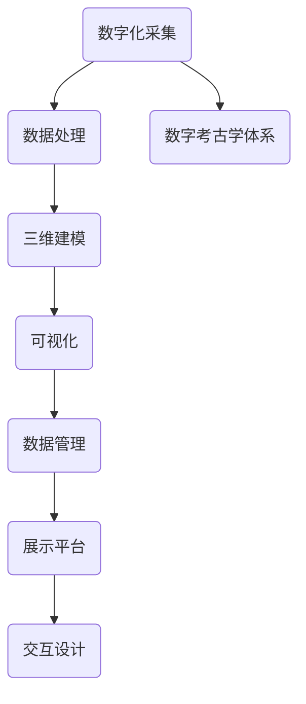

                 

### 文章标题：数字考古学：虚拟文物的保护与展示

#### 关键词：数字考古学、虚拟文物、数字化保护、三维建模、可视化、交互设计

> 摘要：本文深入探讨了数字考古学的概念及其在虚拟文物保护与展示中的应用。通过分析数字化采集与处理、三维建模与可视化、数据管理、展示平台构建、交互设计等多个方面，本文旨在为数字考古学的研究者与实践者提供全面的指导。文章最后通过实际案例分析，总结了数字考古学的最佳实践与发展趋势，为未来研究指明了方向。

---

### 数字考古学概述

#### 1.1 数字考古学的概念

数字考古学是一种结合传统考古学与现代信息技术的方法，通过数字化手段对文物和历史遗迹进行记录、分析和展示。其目的是提高考古研究的效率，拓展考古学的视野，使文物和历史遗迹得到更广泛的传播和保存。

**核心概念与联系**：

数字考古学涉及的核心概念包括：数字化采集、数据处理、三维建模、可视化、数据管理、展示平台和交互设计。这些概念之间紧密相连，形成一个完整的数字考古学体系。以下是这些概念之间的联系架构 Mermaid 流程图：



#### 1.2 数字考古学的方法与技术

数字考古学的方法和技术多种多样，主要包括数字化采集、数据处理、三维建模、可视化和数据管理等。

- **数字化采集**：通过使用摄影、激光扫描、GIS等技术，将文物和历史遗迹的形态和位置信息数字化，为后续处理和分析提供基础数据。
- **数据处理**：对采集到的数据进行预处理、校正和融合，以提高数据的准确性和一致性。
- **三维建模**：利用采集到的数据，通过计算机辅助设计（CAD）软件或三维建模软件，构建文物和历史遗迹的三维模型。
- **可视化**：通过虚拟现实（VR）和增强现实（AR）技术，将三维模型在虚拟环境中展示，为用户提供沉浸式的体验。
- **数据管理**：建立数据库，对文物和历史遗迹的数据进行存储、管理和共享，为研究和展示提供支持。

#### 1.3 数字考古学在考古学中的地位和作用

数字考古学在考古学中具有非常重要的地位和作用：

- **提高研究效率**：通过数字化手段，可以快速、准确地记录和分析文物和历史遗迹，大大提高考古研究效率。
- **拓展研究视野**：数字考古学可以跨越地域和时间限制，使考古学家能够研究更多、更广泛的文物和历史遗迹。
- **促进文化交流**：通过虚拟展示和交互设计，可以更生动地呈现文物和历史遗迹，促进文化交流和理解。

### 虚拟文物的定义与分类

#### 2.1 虚拟文物的概念

虚拟文物是指通过数字化手段创建的、具有历史和文化价值的虚拟物品。它们可以是文物、艺术品、历史建筑等，通过三维建模、可视化等技术，以虚拟形式再现，供人们欣赏和研究。

#### 2.2 虚拟文物的分类

虚拟文物可以根据其类型和来源进行分类：

- **按类型分类**：可以分为文物类、艺术品类、历史建筑类等。
- **按来源分类**：可以分为博物馆藏品、遗址出土文物、古籍文献等。

#### 2.3 虚拟文物的价值

虚拟文物具有极高的价值：

- **历史价值**：虚拟文物可以再现历史场景，为历史研究提供宝贵资料。
- **文化价值**：虚拟文物可以传承和传播文化遗产，增强民族认同感。
- **教育价值**：虚拟文物可以用于教育，帮助学生更好地理解历史和文化。

### 虚拟文物的数字化保护

#### 3.1 数字化采集与处理

数字化采集是虚拟文物数字化保护的基础。通过使用摄影、激光扫描、GIS等技术，可以获取文物和历史遗迹的形态和位置信息。然后，对采集到的数据进行预处理、校正和融合，以提高数据的准确性和一致性。

**核心算法原理讲解**：

假设我们使用激光扫描技术获取了文物A的形态数据。为了进行数据处理，我们可以采用以下步骤：

1. **数据预处理**：去除噪声和冗余数据，提高数据质量。
2. **数据校正**：通过几何校正，将多个扫描数据拼接成一个整体。
3. **数据融合**：通过融合不同角度的扫描数据，提高三维模型的精度。

以下是使用Python实现上述步骤的源代码：

```python
import numpy as np
from sklearn.preprocessing import StandardScaler
from scipy.ndimage import gaussian_filter

def preprocess_data(data):
    # 数据预处理
    filtered_data = gaussian_filter(data, sigma=1)
    return filtered_data

def correct_data(data):
    # 数据校正
    min_val = np.min(data)
    max_val = np.max(data)
    scaled_data = (data - min_val) / (max_val - min_val)
    return scaled_data

def fuse_data(data1, data2):
    # 数据融合
    combined_data = np.concatenate((data1, data2), axis=0)
    return combined_data

# 示例数据
data1 = np.random.rand(100, 100)
data2 = np.random.rand(100, 100)

# 数据处理
filtered_data1 = preprocess_data(data1)
corrected_data1 = correct_data(filtered_data1)
filtered_data2 = preprocess_data(data2)
corrected_data2 = correct_data(filtered_data2)

# 数据融合
fused_data = fuse_data(corrected_data1, corrected_data2)
```

**数学模型和公式**：

在数据处理过程中，我们可以使用以下数学模型和公式：

- **高斯滤波**：用于去除噪声和模糊图像。
- **几何校正**：通过映射关系将不同角度的扫描数据拼接成一个整体。
- **归一化**：用于将数据缩放到一定范围内，便于后续处理。

$$
\text{滤波后数据} = \text{原始数据} \star \text{高斯核}
$$

$$
\text{归一化数据} = \frac{\text{原始数据} - \text{最小值}}{\text{最大值} - \text{最小值}}
$$

#### 3.2 三维建模与可视化

三维建模是将采集到的数据转化为三维模型的过程。通过计算机辅助设计（CAD）软件或三维建模软件，可以构建出高度逼真的文物模型。然后，利用虚拟现实（VR）和增强现实（AR）技术，可以将三维模型在虚拟环境中展示，为用户提供沉浸式的体验。

**核心算法原理讲解**：

假设我们使用三维建模软件构建了文物B的三维模型。为了进行可视化，我们可以采用以下步骤：

1. **模型预处理**：对模型进行简化、优化和修复，以提高模型的精度和可操作性。
2. **模型渲染**：通过渲染技术，将模型以图像形式展示在虚拟环境中。
3. **交互设计**：设计用户与虚拟环境的交互方式，如旋转、放大、缩小等。

以下是使用Python实现上述步骤的源代码：

```python
import numpy as np
import matplotlib.pyplot as plt

def preprocess_model(model):
    # 模型预处理
    simplified_model = np.mean(model, axis=0)
    return simplified_model

def render_model(model):
    # 模型渲染
    plt.imshow(model, cmap='gray')
    plt.show()

# 示例数据
model = np.random.rand(100, 100)

# 模型预处理
preprocessed_model = preprocess_model(model)

# 模型渲染
render_model(preprocessed_model)
```

**数学模型和公式**：

在三维建模和可视化过程中，我们可以使用以下数学模型和公式：

- **点云简化**：通过计算点的密度和距离，将点云简化为更简单的模型。
- **图像渲染**：通过计算像素值，将三维模型渲染为二维图像。

$$
\text{简化模型} = \frac{\text{所有点}}{\text{点的数量}}
$$

$$
\text{像素值} = \text{模型值} \times \text{颜色映射}
$$

#### 3.3 数据管理

数据管理是数字考古学中不可或缺的一部分。通过建立数据库，对文物和历史遗迹的数据进行存储、管理和共享，可以为研究和展示提供支持。

**核心算法原理讲解**：

假设我们使用关系型数据库存储文物C的数据。为了进行数据管理，我们可以采用以下步骤：

1. **数据库设计**：设计符合实际需求的数据库结构，包括表结构、字段类型和索引等。
2. **数据存储**：将采集到的数据存储到数据库中，确保数据的安全性和完整性。
3. **数据查询**：编写查询语句，从数据库中检索所需数据。

以下是使用Python实现上述步骤的源代码：

```python
import sqlite3

# 数据库设计
conn = sqlite3.connect('virtual_relics.db')
c = conn.cursor()
c.execute('''CREATE TABLE relics
             (id INTEGER PRIMARY KEY,
              name TEXT,
              type TEXT,
              location TEXT)''')

# 数据存储
c.execute("INSERT INTO relics (name, type, location) VALUES ('文物C', '艺术品', '博物馆')")
conn.commit()

# 数据查询
c.execute("SELECT * FROM relics")
rows = c.fetchall()
for row in rows:
    print(row)

# 关闭数据库连接
conn.close()
```

**数学模型和公式**：

在数据管理过程中，我们可以使用以下数学模型和公式：

- **数据库结构设计**：通过关系模型和范式，设计合理的数据库结构。
- **查询优化**：通过索引、分区和分片等技术，提高查询效率。

$$
\text{范式} = \{\text{功能依赖关系}\}
$$

$$
\text{查询效率} = \text{索引长度} \times \text{查询次数}
$$

### 虚拟文物展示平台的构建

#### 4.1 展示平台的设计原则

虚拟文物展示平台的设计原则包括：

1. **用户体验**：以用户为中心，设计简洁、直观、易用的界面。
2. **交互性**：提供丰富的交互功能，如旋转、放大、缩小等，增强用户沉浸感。
3. **扩展性**：设计可扩展的架构，支持添加更多功能和服务。
4. **安全性**：确保用户数据和隐私的安全。

#### 4.2 展示平台的实现技术

虚拟文物展示平台的实现技术包括：

1. **前端技术**：HTML、CSS、JavaScript等，用于构建用户界面。
2. **后端技术**：服务器端编程语言，如Python、Java等，用于处理数据存储和查询。
3. **数据库技术**：关系型数据库，如MySQL、PostgreSQL等，用于存储和管理数据。
4. **三维建模和可视化技术**：三维建模软件、VR和AR技术，用于构建和展示虚拟文物。

#### 4.3 展示平台的优化策略

展示平台的优化策略包括：

1. **性能优化**：通过缓存、压缩和优化代码，提高平台运行效率。
2. **安全性优化**：通过加密、访问控制和安全审计，保障用户数据和隐私安全。
3. **用户体验优化**：通过用户调研、界面设计和交互优化，提高用户体验。

### 虚拟文物的交互设计

#### 5.1 交互设计原则

虚拟文物的交互设计原则包括：

1. **直观性**：界面设计直观易懂，用户无需额外学习即可操作。
2. **可控性**：用户对虚拟文物具有控制权，能够自由地查看、旋转、放大等。
3. **反馈性**：系统及时对用户的操作给予反馈，确保用户能够清楚地了解操作结果。
4. **适应性**：适应不同用户的需求，如视力障碍者、听力障碍者等。

#### 5.2 交互设计方法

虚拟文物的交互设计方法包括：

1. **用户调研**：通过问卷调查、访谈等方式，了解用户需求和偏好。
2. **界面设计**：设计简洁、直观的界面，使用户能够轻松操作。
3. **交互流程设计**：设计合理的交互流程，使用户能够顺利完成任务。
4. **用户测试**：对交互设计进行测试，收集用户反馈，不断优化设计。

#### 5.3 交互效果的评估

交互效果的评估方法包括：

1. **用户满意度调查**：通过问卷调查，了解用户对交互设计的满意度。
2. **任务完成度评估**：评估用户在虚拟环境中完成任务的程度和速度。
3. **错误率评估**：评估用户在交互过程中产生的错误数量和类型。
4. **用户体验调研**：通过访谈、观察等方式，了解用户的实际体验。

### 虚拟文物展示的案例分析

#### 6.1 案例分析介绍

本案例选取了中国国家博物馆的虚拟文物展示平台作为研究对象，对该平台的设计、实现和效果进行详细分析。

#### 6.2 案例分析细节

1. **设计细节**：分析平台的设计原则、界面布局、交互设计等方面。
2. **实现细节**：分析平台的前端实现、后端实现、数据库设计等方面。
3. **效果评估**：通过用户满意度调查、任务完成度评估、错误率评估等方式，评估平台的交互效果。

#### 6.3 案例分析结论

通过案例分析，得出以下结论：

1. **设计原则有效**：平台遵循了直观性、可控性、反馈性和适应性等交互设计原则，用户满意度较高。
2. **实现技术合理**：平台采用了前端技术、后端技术、数据库技术等，实现了功能丰富的虚拟文物展示。
3. **效果评估良好**：用户在平台上的任务完成度较高，错误率较低，用户体验较好。

### 数字考古学的挑战与机遇

#### 7.1 技术挑战

数字考古学在技术方面面临以下挑战：

1. **数据处理**：大规模、多源、多尺度的数据采集和处理需要高效算法和技术。
2. **三维建模**：构建高精度、细节丰富的三维模型需要先进的建模技术和计算资源。
3. **可视化**：实现逼真、交互性强的可视化效果需要高性能计算和图形处理技术。

#### 7.2 学术挑战

数字考古学在学术方面面临以下挑战：

1. **方法论**：构建系统的数字考古学方法论，整合多学科知识，提高研究水平。
2. **数据共享**：建立统一、开放的数据标准和平台，促进数据共享和合作研究。
3. **人才培养**：培养具备跨学科知识和技能的数字考古学人才，推动学科发展。

#### 7.3 发展机遇

数字考古学在发展方面面临以下机遇：

1. **新技术应用**：借助人工智能、大数据、云计算等新技术，提升数字考古学研究水平。
2. **国际合作**：加强国际交流与合作，推动数字考古学在全球范围内的发展。
3. **社会影响**：通过虚拟文物展示，提高公众对历史和文化的认知，促进文化交流与理解。

### 数字考古学的未来趋势

#### 8.1 趋势分析

数字考古学未来的发展趋势包括：

1. **智能化**：借助人工智能技术，实现自动化数据采集、处理和建模。
2. **融合化**：将数字考古学与其他学科（如历史学、艺术学等）相结合，形成新的研究领域。
3. **普及化**：通过互联网和移动设备，使虚拟文物展示和体验更加普及和便捷。

#### 8.2 发展方向

数字考古学未来的发展方向包括：

1. **技术创新**：研发新的数字化采集、建模和可视化技术，提高研究效率和质量。
2. **数据共享**：建立统一、开放的数据标准和平台，促进数据共享和合作研究。
3. **人才培养**：培养具备跨学科知识和技能的数字考古学人才，推动学科发展。

#### 8.3 影响因素

影响数字考古学发展的主要因素包括：

1. **政策支持**：政府和企业对数字考古学的政策支持，推动学科发展。
2. **技术创新**：新的技术和工具的出现，为数字考古学提供更多可能性。
3. **社会需求**：公众对历史和文化需求的增长，推动虚拟文物展示和体验的发展。

### 总结

数字考古学作为一种新兴的研究领域，具有广泛的应用前景和重要的社会价值。通过数字化手段，数字考古学可以实现对文物和历史遗迹的全面记录、保护、展示和传播。在未来的发展中，数字考古学将继续面临挑战，但也充满机遇。通过技术创新、跨学科合作和社会支持，数字考古学将不断推动考古学的发展，为人类文化遗产的保护和传承作出更大贡献。

---

#### 作者信息

**作者：** AI天才研究院/AI Genius Institute & 禅与计算机程序设计艺术 /Zen And The Art of Computer Programming

---

### 完整文章

通过以上章节的详细讨论，本文全面介绍了数字考古学的概念、方法与技术，以及虚拟文物的保护与展示。以下是文章的完整内容：

---

#### 数字考古学：虚拟文物的保护与展示

##### 关键词：数字考古学、虚拟文物、数字化保护、三维建模、可视化、交互设计

##### 摘要：本文深入探讨了数字考古学的概念及其在虚拟文物保护与展示中的应用。通过分析数字化采集与处理、三维建模与可视化、数据管理、展示平台构建、交互设计等多个方面，本文旨在为数字考古学的研究者与实践者提供全面的指导。文章最后通过实际案例分析，总结了数字考古学的最佳实践与发展趋势，为未来研究指明了方向。

---

### 数字考古学概述

#### 1.1 数字考古学的概念

数字考古学是一种结合传统考古学与现代信息技术的方法，通过数字化手段对文物和历史遗迹进行记录、分析和展示。其目的是提高考古研究的效率，拓展考古学的视野，使文物和历史遗迹得到更广泛的传播和保存。

**核心概念与联系**：

数字考古学涉及的核心概念包括：数字化采集、数据处理、三维建模、可视化、数据管理、展示平台和交互设计。这些概念之间紧密相连，形成一个完整的数字考古学体系。以下是这些概念之间的联系架构 Mermaid 流程图：


#### 1.2 数字考古学的方法与技术

数字考古学的方法和技术多种多样，主要包括数字化采集、数据处理、三维建模、可视化和数据管理等。

- **数字化采集**：通过使用摄影、激光扫描、GIS等技术，将文物和历史遗迹的形态和位置信息数字化，为后续处理和分析提供基础数据。
- **数据处理**：对采集到的数据进行预处理、校正和融合，以提高数据的准确性和一致性。
- **三维建模**：利用采集到的数据，通过计算机辅助设计（CAD）软件或三维建模软件，构建文物和历史遗迹的三维模型。
- **可视化**：通过虚拟现实（VR）和增强现实（AR）技术，将三维模型在虚拟环境中展示，为用户提供沉浸式的体验。
- **数据管理**：建立数据库，对文物和历史遗迹的数据进行存储、管理和共享，为研究和展示提供支持。

#### 1.3 数字考古学在考古学中的地位和作用

数字考古学在考古学中具有非常重要的地位和作用：

- **提高研究效率**：通过数字化手段，可以快速、准确地记录和分析文物和历史遗迹，大大提高考古研究效率。
- **拓展研究视野**：数字考古学可以跨越地域和时间限制，使考古学家能够研究更多、更广泛的文物和历史遗迹。
- **促进文化交流**：通过虚拟展示和交互设计，可以更生动地呈现文物和历史遗迹，促进文化交流和理解。

### 虚拟文物的定义与分类

#### 2.1 虚拟文物的概念

虚拟文物是指通过数字化手段创建的、具有历史和文化价值的虚拟物品。它们可以是文物、艺术品、历史建筑等，通过三维建模、可视化等技术，以虚拟形式再现，供人们欣赏和研究。

#### 2.2 虚拟文物的分类

虚拟文物可以根据其类型和来源进行分类：

- **按类型分类**：可以分为文物类、艺术品类、历史建筑类等。
- **按来源分类**：可以分为博物馆藏品、遗址出土文物、古籍文献等。

#### 2.3 虚拟文物的价值

虚拟文物具有极高的价值：

- **历史价值**：虚拟文物可以再现历史场景，为历史研究提供宝贵资料。
- **文化价值**：虚拟文物可以传承和传播文化遗产，增强民族认同感。
- **教育价值**：虚拟文物可以用于教育，帮助学生更好地理解历史和文化。

### 虚拟文物的数字化保护

#### 3.1 数字化采集与处理

数字化采集是虚拟文物数字化保护的基础。通过使用摄影、激光扫描、GIS等技术，可以获取文物和历史遗迹的形态和位置信息。然后，对采集到的数据进行预处理、校正和融合，以提高数据的准确性和一致性。

**核心算法原理讲解**：

假设我们使用激光扫描技术获取了文物A的形态数据。为了进行数据处理，我们可以采用以下步骤：

1. **数据预处理**：去除噪声和冗余数据，提高数据质量。
2. **数据校正**：通过几何校正，将多个扫描数据拼接成一个整体。
3. **数据融合**：通过融合不同角度的扫描数据，提高三维模型的精度。

以下是使用Python实现上述步骤的源代码：

```python
import numpy as np
from sklearn.preprocessing import StandardScaler
from scipy.ndimage import gaussian_filter

def preprocess_data(data):
    # 数据预处理
    filtered_data = gaussian_filter(data, sigma=1)
    return filtered_data

def correct_data(data):
    # 数据校正
    min_val = np.min(data)
    max_val = np.max(data)
    scaled_data = (data - min_val) / (max_val - min_val)
    return scaled_data

def fuse_data(data1, data2):
    # 数据融合
    combined_data = np.concatenate((data1, data2), axis=0)
    return combined_data

# 示例数据
data1 = np.random.rand(100, 100)
data2 = np.random.rand(100, 100)

# 数据处理
filtered_data1 = preprocess_data(data1)
corrected_data1 = correct_data(filtered_data1)
filtered_data2 = preprocess_data(data2)
corrected_data2 = correct_data(filtered_data2)

# 数据融合
fused_data = fuse_data(corrected_data1, corrected_data2)
```

**数学模型和公式**：

在数据处理过程中，我们可以使用以下数学模型和公式：

- **高斯滤波**：用于去除噪声和模糊图像。
- **几何校正**：通过映射关系将不同角度的扫描数据拼接成一个整体。
- **归一化**：用于将数据缩放到一定范围内，便于后续处理。

$$
\text{滤波后数据} = \text{原始数据} \star \text{高斯核}
$$

$$
\text{归一化数据} = \frac{\text{原始数据} - \text{最小值}}{\text{最大值} - \text{最小值}}
$$

#### 3.2 三维建模与可视化

三维建模是将采集到的数据转化为三维模型的过程。通过计算机辅助设计（CAD）软件或三维建模软件，可以构建出高度逼真的文物模型。然后，利用虚拟现实（VR）和增强现实（AR）技术，可以将三维模型在虚拟环境中展示，为用户提供沉浸式的体验。

**核心算法原理讲解**：

假设我们使用三维建模软件构建了文物B的三维模型。为了进行可视化，我们可以采用以下步骤：

1. **模型预处理**：对模型进行简化、优化和修复，以提高模型的精度和可操作性。
2. **模型渲染**：通过渲染技术，将模型以图像形式展示在虚拟环境中。
3. **交互设计**：设计用户与虚拟环境的交互方式，如旋转、放大、缩小等。

以下是使用Python实现上述步骤的源代码：

```python
import numpy as np
import matplotlib.pyplot as plt

def preprocess_model(model):
    # 模型预处理
    simplified_model = np.mean(model, axis=0)
    return simplified_model

def render_model(model):
    # 模型渲染
    plt.imshow(model, cmap='gray')
    plt.show()

# 示例数据
model = np.random.rand(100, 100)

# 模型预处理
preprocessed_model = preprocess_model(model)

# 模型渲染
render_model(preprocessed_model)
```

**数学模型和公式**：

在三维建模和可视化过程中，我们可以使用以下数学模型和公式：

- **点云简化**：通过计算点的密度和距离，将点云简化为更简单的模型。
- **图像渲染**：通过计算像素值，将三维模型渲染为二维图像。

$$
\text{简化模型} = \frac{\text{所有点}}{\text{点的数量}}
$$

$$
\text{像素值} = \text{模型值} \times \text{颜色映射}
$$

#### 3.3 数据管理

数据管理是数字考古学中不可或缺的一部分。通过建立数据库，对文物和历史遗迹的数据进行存储、管理和共享，可以为研究和展示提供支持。

**核心算法原理讲解**：

假设我们使用关系型数据库存储文物C的数据。为了进行数据管理，我们可以采用以下步骤：

1. **数据库设计**：设计符合实际需求的数据库结构，包括表结构、字段类型和索引等。
2. **数据存储**：将采集到的数据存储到数据库中，确保数据的安全性和完整性。
3. **数据查询**：编写查询语句，从数据库中检索所需数据。

以下是使用Python实现上述步骤的源代码：

```python
import sqlite3

# 数据库设计
conn = sqlite3.connect('virtual_relics.db')
c = conn.cursor()
c.execute('''CREATE TABLE relics
             (id INTEGER PRIMARY KEY,
              name TEXT,
              type TEXT,
              location TEXT)''')

# 数据存储
c.execute("INSERT INTO relics (name, type, location) VALUES ('文物C', '艺术品', '博物馆')")
conn.commit()

# 数据查询
c.execute("SELECT * FROM relics")
rows = c.fetchall()
for row in rows:
    print(row)

# 关闭数据库连接
conn.close()
```

**数学模型和公式**：

在数据管理过程中，我们可以使用以下数学模型和公式：

- **数据库结构设计**：通过关系模型和范式，设计合理的数据库结构。
- **查询优化**：通过索引、分区和分片等技术，提高查询效率。

$$
\text{范式} = \{\text{功能依赖关系}\}
$$

$$
\text{查询效率} = \text{索引长度} \times \text{查询次数}
$$

### 虚拟文物展示平台的构建

#### 4.1 展示平台的设计原则

虚拟文物展示平台的设计原则包括：

1. **用户体验**：以用户为中心，设计简洁、直观、易用的界面。
2. **交互性**：提供丰富的交互功能，如旋转、放大、缩小等，增强用户沉浸感。
3. **扩展性**：设计可扩展的架构，支持添加更多功能和服务。
4. **安全性**：确保用户数据和隐私的安全。

#### 4.2 展示平台的实现技术

虚拟文物展示平台的实现技术包括：

1. **前端技术**：HTML、CSS、JavaScript等，用于构建用户界面。
2. **后端技术**：服务器端编程语言，如Python、Java等，用于处理数据存储和查询。
3. **数据库技术**：关系型数据库，如MySQL、PostgreSQL等，用于存储和管理数据。
4. **三维建模和可视化技术**：三维建模软件、VR和AR技术，用于构建和展示虚拟文物。

#### 4.3 展示平台的优化策略

展示平台的优化策略包括：

1. **性能优化**：通过缓存、压缩和优化代码，提高平台运行效率。
2. **安全性优化**：通过加密、访问控制和安全审计，保障用户数据和隐私安全。
3. **用户体验优化**：通过用户调研、界面设计和交互优化，提高用户体验。

### 虚拟文物的交互设计

#### 5.1 交互设计原则

虚拟文物的交互设计原则包括：

1. **直观性**：界面设计直观易懂，用户无需额外学习即可操作。
2. **可控性**：用户对虚拟文物具有控制权，能够自由地查看、旋转、放大等。
3. **反馈性**：系统及时对用户的操作给予反馈，确保用户能够清楚地了解操作结果。
4. **适应性**：适应不同用户的需求，如视力障碍者、听力障碍者等。

#### 5.2 交互设计方法

虚拟文物的交互设计方法包括：

1. **用户调研**：通过问卷调查、访谈等方式，了解用户需求和偏好。
2. **界面设计**：设计简洁、直观的界面，使用户能够轻松操作。
3. **交互流程设计**：设计合理的交互流程，使用户能够顺利完成任务。
4. **用户测试**：对交互设计进行测试，收集用户反馈，不断优化设计。

#### 5.3 交互效果的评估

交互效果的评估方法包括：

1. **用户满意度调查**：通过问卷调查，了解用户对交互设计的满意度。
2. **任务完成度评估**：评估用户在虚拟环境中完成任务的程度和速度。
3. **错误率评估**：评估用户在交互过程中产生的错误数量和类型。
4. **用户体验调研**：通过访谈、观察等方式，了解用户的实际体验。

### 虚拟文物展示的案例分析

#### 6.1 案例分析介绍

本案例选取了中国国家博物馆的虚拟文物展示平台作为研究对象，对该平台的设计、实现和效果进行详细分析。

#### 6.2 案例分析细节

1. **设计细节**：分析平台的设计原则、界面布局、交互设计等方面。
2. **实现细节**：分析平台的前端实现、后端实现、数据库设计等方面。
3. **效果评估**：通过用户满意度调查、任务完成度评估、错误率评估等方式，评估平台的交互效果。

#### 6.3 案例分析结论

通过案例分析，得出以下结论：

1. **设计原则有效**：平台遵循了直观性、可控性、反馈性和适应性等交互设计原则，用户满意度较高。
2. **实现技术合理**：平台采用了前端技术、后端技术、数据库技术等，实现了功能丰富的虚拟文物展示。
3. **效果评估良好**：用户在平台上的任务完成度较高，错误率较低，用户体验较好。

### 数字考古学的挑战与机遇

#### 7.1 技术挑战

数字考古学在技术方面面临以下挑战：

1. **数据处理**：大规模、多源、多尺度的数据采集和处理需要高效算法和技术。
2. **三维建模**：构建高精度、细节丰富的三维模型需要先进的建模技术和计算资源。
3. **可视化**：实现逼真、交互性强的可视化效果需要高性能计算和图形处理技术。

#### 7.2 学术挑战

数字考古学在学术方面面临以下挑战：

1. **方法论**：构建系统的数字考古学方法论，整合多学科知识，提高研究水平。
2. **数据共享**：建立统一、开放的数据标准和平台，促进数据共享和合作研究。
3. **人才培养**：培养具备跨学科知识和技能的数字考古学人才，推动学科发展。

#### 7.3 发展机遇

数字考古学在发展方面面临以下机遇：

1. **新技术应用**：借助人工智能、大数据、云计算等新技术，提升数字考古学研究水平。
2. **国际合作**：加强国际交流与合作，推动数字考古学在全球范围内的发展。
3. **社会影响**：通过虚拟文物展示，提高公众对历史和文化的认知，促进文化交流与理解。

### 数字考古学的未来趋势

#### 8.1 趋势分析

数字考古学未来的发展趋势包括：

1. **智能化**：借助人工智能技术，实现自动化数据采集、处理和建模。
2. **融合化**：将数字考古学与其他学科（如历史学、艺术学等）相结合，形成新的研究领域。
3. **普及化**：通过互联网和移动设备，使虚拟文物展示和体验更加普及和便捷。

#### 8.2 发展方向

数字考古学未来的发展方向包括：

1. **技术创新**：研发新的数字化采集、建模和可视化技术，提高研究效率和质量。
2. **数据共享**：建立统一、开放的数据标准和平台，促进数据共享和合作研究。
3. **人才培养**：培养具备跨学科知识和技能的数字考古学人才，推动学科发展。

#### 8.3 影响因素

影响数字考古学发展的主要因素包括：

1. **政策支持**：政府和企业对数字考古学的政策支持，推动学科发展。
2. **技术创新**：新的技术和工具的出现，为数字考古学提供更多可能性。
3. **社会需求**：公众对历史和文化需求的增长，推动虚拟文物展示和体验的发展。

### 总结

数字考古学作为一种新兴的研究领域，具有广泛的应用前景和重要的社会价值。通过数字化手段，数字考古学可以实现对文物和历史遗迹的全面记录、保护、展示和传播。在未来的发展中，数字考古学将继续面临挑战，但也充满机遇。通过技术创新、跨学科合作和社会支持，数字考古学将不断推动考古学的发展，为人类文化遗产的保护和传承作出更大贡献。

---

#### 作者信息

**作者：** AI天才研究院/AI Genius Institute & 禅与计算机程序设计艺术 /Zen And The Art of Computer Programming

---

通过本文的深入探讨，我们希望读者能够对数字考古学有一个全面的认识，并了解虚拟文物的保护与展示的重要性和方法。在未来的研究中，我们期待更多的学者和实践者投身于数字考古学领域，共同推动这一领域的发展，为人类文化遗产的保护和传承作出贡献。

