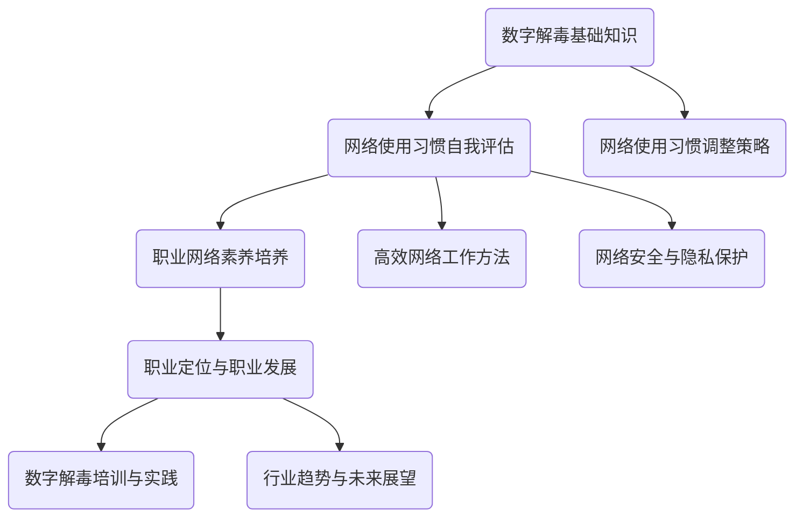

                 

### 文章标题

《数字解毒专家培训：重建健康网络使用习惯的职业课程》

### 文章关键词

数字解毒、健康网络使用习惯、职业课程、网络素养、网络安全

### 文章摘要

本文旨在探讨数字解毒专家培训的重要性，通过系统地构建健康网络使用习惯的职业课程，帮助职场人士重建合理的网络使用模式。文章首先介绍了数字解毒的背景和必要性，随后详细解析了网络使用习惯的自我评估与调整策略。在职业网络素养、高效网络工作方法和网络安全与隐私保护等方面，文章提供了深入的理论指导和实用技巧。通过案例分析、实战演练以及行业趋势分析，本文为数字解毒专家的职业发展提供了全面而前瞻性的指导。

### 目录大纲

#### 第一部分：数字解毒基础知识

- **第1章：数字解毒的背景与重要性**
  - **1.1 数字解毒的定义与范畴**
  - **1.2 当前数字环境面临的挑战**
  - **1.3 数字解毒的必要性

- **第2章：数字解毒基本理论**
  - **2.1 数字解毒的基本原则**
  - **2.2 数字解毒的工作机制**
  - **2.3 数字解毒的技术分类

- **第3章：网络使用习惯的自我评估**
  - **3.1 网络使用习惯的现状分析**
  - **3.2 自我评估工具与方法**
  - **3.3 评估结果分析与改进建议

- **第4章：网络使用习惯的调整策略**
  - **4.1 时间管理技巧**
  - **4.2 分心管理策略**
  - **4.3 消费习惯的改变**

#### 第二部分：职业网络使用习惯的建设

- **第5章：职业网络素养培养**
  - **5.1 职业网络素养的概念**
  - **5.2 提高职业网络素养的方法**
  - **5.3 职业网络素养在职场中的应用

- **第6章：高效网络工作方法**
  - **6.1 工作流程优化**
  - **6.2 高效工具与平台**
  - **6.3 信息整理与处理技巧

- **第7章：网络安全与隐私保护**
  - **7.1 网络安全的威胁与防范**
  - **7.2 隐私保护的法律法规**
  - **7.3 个人网络安全策略**

- **第8章：案例分析与实战演练**
  - **8.1 典型案例解析**
  - **8.2 实战演练计划**
  - **8.3 实战演练效果评估**

#### 第三部分：数字解毒专家的职业发展

- **第9章：数字解毒专家的职业定位**
  - **9.1 数字解毒专家的角色与责任**
  - **9.2 职业发展的路径与机遇**
  - **9.3 职业素养的培养

- **第10章：数字解毒培训与实践**
  - **10.1 数字解毒培训课程设计**
  - **10.2 实践教学与应用**
  - **10.3 职业认证与资格获取

- **第11章：数字解毒行业趋势与未来展望**
  - **11.1 行业发展趋势分析**
  - **11.2 技术革新带来的机遇与挑战**
  - **11.3 数字解毒专家的职业前景

#### 附录：数字解毒工具与资源指南

- **附录 A：数字解毒工具推荐**
- **附录 B：网络使用习惯优化资源**
- **附录 C：数字解毒专家职业发展资源**

### Mermaid 流程图



### Python源代码示例

```python
# 示例：网络使用习惯自我评估函数
def assess_network_habits():
    # 输入自我评估问题列表
    questions = [
        "您每天使用网络的时间是否超过3小时？",
        "您是否经常因为网络而熬夜？",
        "您是否在上网时容易分心？",
        "您是否对网络成瘾，难以自控？"
    ]

    # 存储评估结果
    results = []

    # 对每个问题进行评估
    for question in questions:
        print(question)
        answer = input("是(Y)或否(N)：")
        results.append(answer)

    # 输出评估结果
    for i, result in enumerate(results):
        print(f"问题{i+1}的结果：{result}")

# 调用评估函数
assess_network_habits()
```

### 数学模型和数学公式

#### 网络使用习惯评分模型

$$
H = \frac{1}{N} \sum_{i=1}^{N} w_i \cdot s_i
$$

- \( H \)：网络使用习惯总分
- \( N \)：评估问题总数
- \( w_i \)：第 \( i \) 个问题的权重
- \( s_i \)：第 \( i \) 个问题的得分（1为是，0为否）

---

接下来的文章内容将根据上述目录大纲逐步展开，详细介绍每一章节的核心内容和技术细节。

