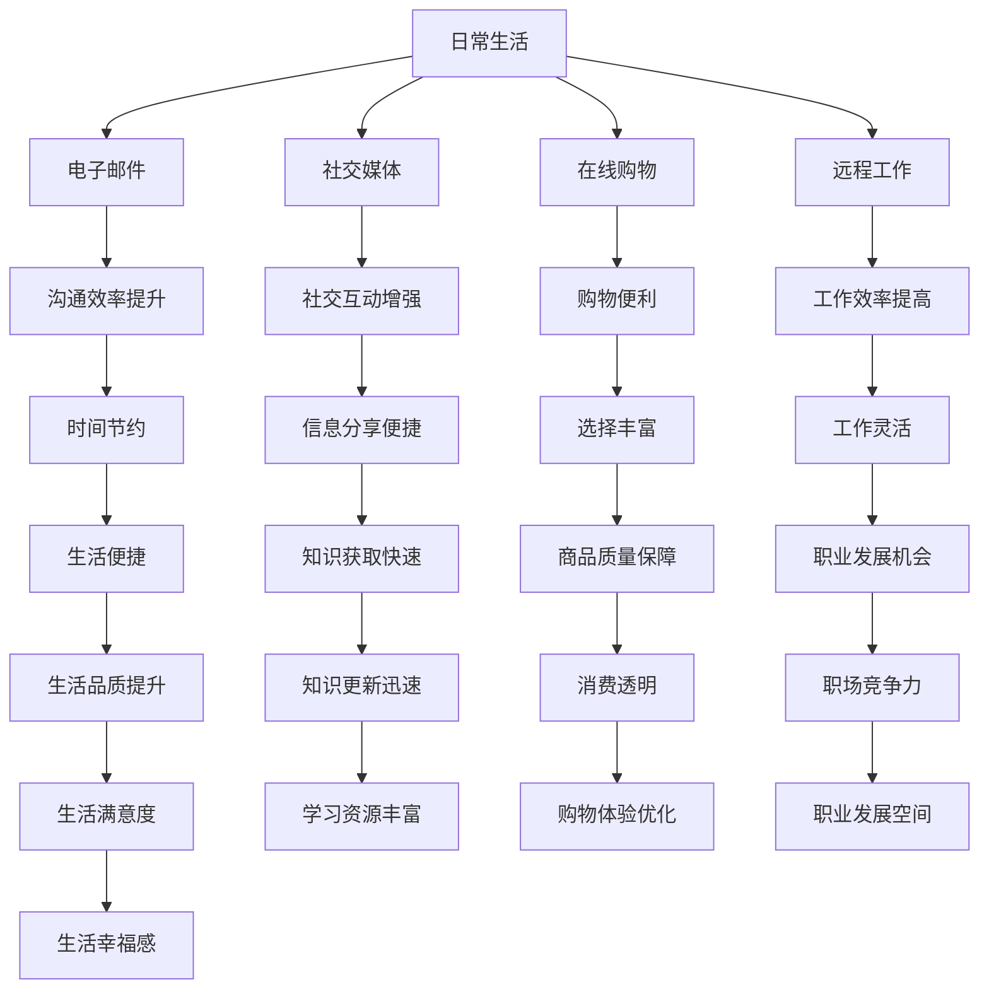
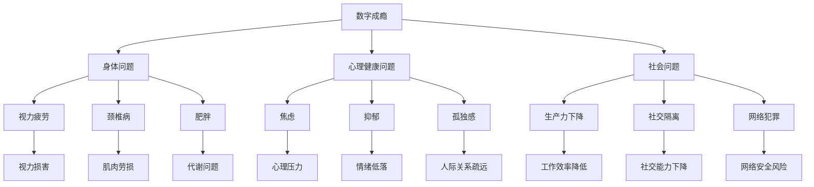
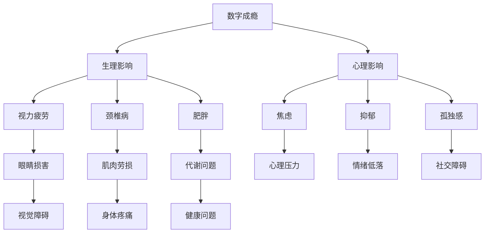
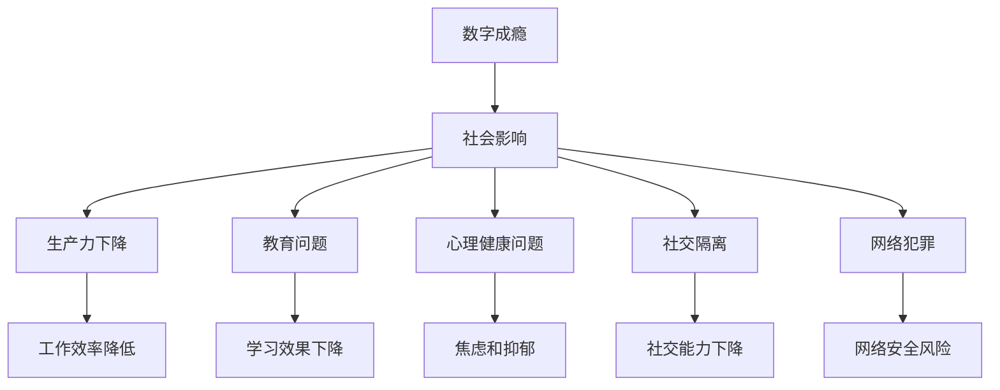
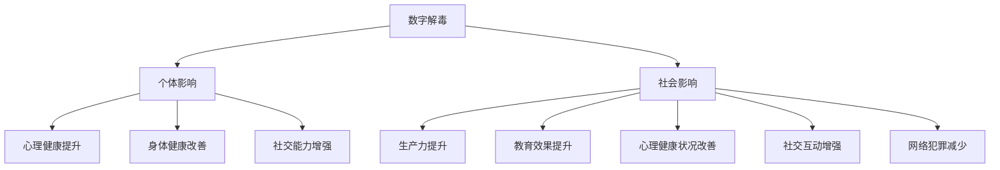
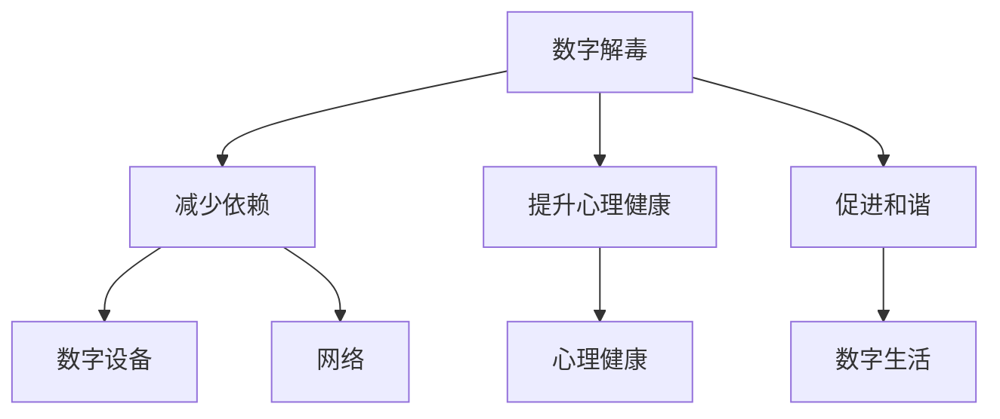
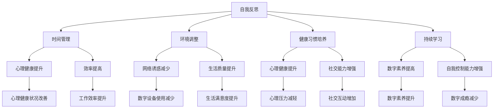

                 

# 数字解毒专家培训：重建健康网络使用习惯的课程

> 关键词：数字解毒、网络使用习惯、心理健康、技术进步、社会政策

> 摘要：随着数字化时代的到来，网络使用已成为日常生活中不可或缺的一部分。然而，过度依赖网络和数字设备带来的成瘾问题愈发严重，影响了个体的心理健康和生活质量。本文旨在通过介绍数字解毒专家培训课程，帮助读者重建健康网络使用习惯，提高心理健康水平，实现数字生活的和谐。

----------------------------------------------------------------

## 目录大纲

### 第一部分：数字解毒概述

### 第1章：数字生活的双刃剑

### 第2章：数字成瘾：原因与影响

### 第3章：数字解毒的核心概念

### 第4章：数字解毒实践指南

### 第5章：数字解毒案例分析

### 第6章：数字解毒与心理健康

### 第7章：数字解毒与家庭生活

### 第8章：数字解毒的未来展望

### 附录

----------------------------------------------------------------

## 第一部分：数字解毒概述

### 第1章：数字生活的双刃剑

随着互联网技术的飞速发展，我们的日常生活越来越依赖于数字设备。无论是工作、学习还是娱乐，网络已经渗透到我们生活的方方面面。然而，这种便利同时也带来了新的挑战——数字成瘾。

### 1.1 数字世界的魅力

网络为我们提供了丰富的信息资源，使得知识的获取变得更加便捷。我们可以通过电子邮件、社交媒体和即时通讯工具与朋友和家人保持联系。此外，网络还为我们提供了丰富的娱乐内容，如电影、音乐和游戏，使得生活更加丰富多彩。

### 1.2 数字时代的挑战

然而，网络的便利性也带来了一系列问题。首先，过度使用数字设备可能导致身体问题，如视力疲劳、颈椎病和肥胖等。其次，网络成瘾已成为一个全球性问题，严重影响了人们的心理健康。最后，网络成瘾还可能导致社会隔离和人际关系恶化。

### 第2章：数字成瘾：原因与影响

数字成瘾是指个体对数字设备或网络过度依赖，导致其生活、工作和社交功能受到影响的现象。数字成瘾的原因复杂多样，包括生理、心理和社会因素。

### 2.1 数字成瘾的定义

数字成瘾是指个体对数字设备或网络过度依赖，导致其生活、工作和社交功能受到影响的现象。这种现象通常表现为对数字设备的强烈渴望、难以抗拒、强迫性行为，甚至可能出现戒断症状。

### 2.2 数字成瘾的生理和心理影响

数字成瘾对个体的生理和心理产生严重影响。生理上，长时间使用数字设备可能导致视力疲劳、颈椎病、肥胖等健康问题。心理上，数字成瘾可能导致焦虑、抑郁、孤独感等心理问题。此外，数字成瘾还可能导致社交能力的下降和人际关系恶化。

### 2.3 数字成瘾的社会影响

数字成瘾不仅影响个体，还对整个社会产生负面影响。首先，数字成瘾可能导致生产力下降，影响工作效率。其次，数字成瘾可能导致社交隔离，影响社会互动和人际关系。最后，数字成瘾还可能导致网络犯罪和网络欺诈等社会问题。

### 第3章：数字解毒的核心概念

数字解毒是指通过一系列方法和技术，帮助个体摆脱数字成瘾，重建健康网络使用习惯的过程。数字解毒的目标是提高个体的心理健康水平，促进数字生活的和谐。

### 3.1 数字解毒的定义

数字解毒是指通过一系列方法和技术，帮助个体摆脱数字成瘾，重建健康网络使用习惯的过程。数字解毒的目标是提高个体的心理健康水平，促进数字生活的和谐。

### 3.2 数字解毒的目标

数字解毒的目标包括：

1. **提高心理健康水平**：通过减少数字设备使用时间，降低焦虑、抑郁等心理问题的发生概率。
2. **重建健康网络使用习惯**：帮助个体建立合理的数字设备使用时间表，提高网络使用的效率和质量。
3. **促进数字生活的和谐**：通过提高个体的数字素养，减少网络成瘾带来的负面影响。

----------------------------------------------------------------

## 第二部分：数字解毒实践指南

### 第4章：数字解毒实践指南

数字解毒并非一蹴而就的过程，而是一个需要持续努力和实践的系统工程。本章将介绍数字解毒的实践指南，帮助读者逐步重建健康网络使用习惯。

### 4.1 数字解毒的步骤

数字解毒可以分为三个阶段：准备阶段、执行阶段和保持阶段。

#### 4.1.1 准备阶段

在准备阶段，我们需要进行以下工作：

1. **自我反思**：了解自己对数字设备的依赖程度，分析成瘾原因。
2. **设定目标**：明确数字解毒的目标和时间表，制定可行的计划。
3. **建立支持系统**：寻找亲友或专业人士的支持，共同参与数字解毒过程。

#### 4.1.2 执行阶段

在执行阶段，我们需要采取以下措施：

1. **逐步减少使用时间**：逐步减少每天使用数字设备的时间，避免突然戒断造成的不适。
2. **调整网络环境**：减少网络诱惑，如限制社交媒体使用时间，删除游戏应用等。
3. **培养健康习惯**：增加户外活动、阅读等有益身心的活动，替代网络使用。

#### 4.1.3 保持阶段

在保持阶段，我们需要持续巩固成果：

1. **定期评估**：定期检查数字设备使用情况，评估解毒效果。
2. **调整计划**：根据实际情况调整解毒计划，确保目标的实现。
3. **持续学习**：通过学习相关知识和技巧，提高数字素养，巩固解毒成果。

### 4.2 数字解毒的工具与资源

为了帮助读者更好地进行数字解毒，这里推荐一些实用的工具和资源：

1. **数字解毒软件**：例如“Freedom”、“StayFocusd”等，可以帮助限制数字设备的使用时间。
2. **数字解毒相关书籍**：例如《数字排毒：如何摆脱屏幕依赖，重拾身心健康》等，提供了丰富的理论和实践知识。
3. **数字解毒在线课程**：例如Coursera、edX等平台上的相关课程，提供了系统的学习和指导。

----------------------------------------------------------------

## 第三部分：数字解毒案例分析

### 第5章：数字解毒案例分析

数字解毒并非抽象的理论，而是一个可以通过实际案例来验证和实践的过程。以下我们将分享两个数字解毒的案例，分别针对个人和企业进行详细分析。

### 5.1 案例一：个人数字解毒之旅

#### 5.1.1 案例背景

李先生是一名IT工程师，由于工作原因经常需要长时间使用电脑和智能手机。然而，他逐渐发现自己对数字设备产生了强烈的依赖，每天花费大量时间在社交媒体和游戏上，导致工作效率下降，身体状况变差，甚至与家人和朋友的关系也受到影响。

#### 5.1.2 解毒过程

为了摆脱数字成瘾，李先生开始了数字解毒之旅。以下是他的解毒过程：

1. **自我反思**：李先生首先反思了自己对数字设备的依赖原因，认识到需要改变自己的生活方式。

2. **设定目标**：他设定了明确的目标，即每周减少使用数字设备的时间，增加户外活动和阅读时间。

3. **逐步减少使用时间**：李先生开始逐步减少每天使用数字设备的时间，例如每天晚上设定“数字断食”时间，只在必要时使用手机。

4. **调整网络环境**：他删除了一些容易让他沉迷的社交媒体应用，减少了网络诱惑。

5. **培养健康习惯**：李先生增加了户外运动和阅读时间，逐渐找到了替代数字设备的健康活动。

6. **保持阶段**：李先生定期评估自己的数字设备使用情况，根据实际情况调整计划，确保目标的实现。

#### 5.1.3 案例反思

经过一段时间的数字解毒，李先生发现自己的工作效率提高了，身体状况也显著改善，与家人和朋友的关系也变得更加融洽。这个案例表明，数字解毒是一个切实可行的方法，可以帮助个体摆脱数字成瘾，重建健康网络使用习惯。

### 5.2 案例二：企业数字解毒实践

#### 5.2.1 案例背景

某企业发现员工过度依赖数字设备，工作效率低下，同时员工心理健康问题也逐渐凸显。为了改善这一状况，企业决定实施数字解毒计划。

#### 5.2.2 解毒策略

企业采取了以下解毒策略：

1. **制定政策**：企业制定了明确的数字设备使用政策，规定员工工作时间和休息时间，禁止在工作时间使用社交媒体等娱乐应用。

2. **提供培训**：企业组织了数字解毒培训课程，帮助员工了解数字成瘾的危害，教授他们如何建立健康网络使用习惯。

3. **设立监督机制**：企业设立了监督机制，定期检查员工的数字设备使用情况，确保政策得到执行。

4. **鼓励健康活动**：企业鼓励员工参与户外运动和社交活动，提高员工的身心健康水平。

#### 5.2.3 案例效果

经过一段时间的数字解毒实践，企业的员工工作效率显著提高，心理健康状况也得到了改善。此外，员工之间的沟通和协作也变得更加顺畅，团队氛围更加积极向上。这个案例表明，数字解毒不仅对个人有益，对企业也有显著的正向影响。

### 5.3 案例总结

以上两个案例都表明，数字解毒是一个值得推广和实践的方法。无论是个人还是企业，都可以通过数字解毒来改善数字生活的质量，提高心理健康水平。通过自我反思、设定目标、逐步减少使用时间、调整网络环境和培养健康习惯，我们可以重建健康网络使用习惯，实现数字生活的和谐。

----------------------------------------------------------------

## 第四部分：数字解毒与心理健康

### 第6章：数字解毒与心理健康

数字解毒不仅有助于改善网络使用习惯，还对心理健康产生积极影响。本章将探讨数字解毒与心理健康之间的联系，并提供一些实用的心理维护策略。

### 6.1 心理健康的重要性

心理健康是整体健康的重要组成部分。一个健康的心理状态可以帮助我们更好地应对生活中的挑战，提高生活质量。心理健康的重要性体现在以下几个方面：

1. **情绪调节**：心理健康有助于我们更好地调节情绪，减少焦虑、抑郁等负面情绪的影响。
2. **社交能力**：心理健康有助于提高我们的社交能力，建立和谐的人际关系。
3. **生活满意度**：心理健康有助于提高我们的生活满意度，使我们更加积极地面对生活。
4. **工作表现**：心理健康有助于提高我们的工作效率，提升工作表现。

### 6.2 数字解毒对心理健康的积极影响

数字解毒通过减少数字设备的使用时间，有助于改善心理健康。具体来说，数字解毒对心理健康产生以下积极影响：

1. **减少焦虑和抑郁**：过度使用数字设备可能导致焦虑和抑郁，而数字解毒可以帮助我们减少这些负面情绪。
2. **改善睡眠质量**：数字设备的使用可能影响我们的睡眠质量，而数字解毒有助于改善这一状况。
3. **提高专注力**：减少数字设备的使用时间，可以帮助我们更好地集中注意力，提高工作和学习效率。
4. **增强自我控制**：数字解毒可以帮助我们培养自我控制能力，更好地管理时间和情绪。

### 6.3 数字解毒与心理健康的实践

为了在数字解毒过程中维护心理健康，我们可以采取以下策略：

1. **定期休息**：在长时间使用数字设备后，给自己一定的休息时间，让眼睛和大脑得到放松。
2. **户外活动**：增加户外活动的时间，如散步、跑步、骑行等，有助于改善心理健康。
3. **社交互动**：定期与亲友进行面对面的交流，增强社交互动，提高心理健康水平。
4. **心理疏导**：如果感到焦虑或抑郁，可以寻求专业人士的帮助，如心理咨询师或心理医生。

### 6.4 心理健康自我评估

为了更好地了解自己的心理健康状况，我们可以进行心理健康自我评估。以下是一些常见的心理健康自我评估工具：

1. **情绪自评量表**：通过填写情绪自评量表，了解自己的情绪状态。
2. **心理健康问卷**：通过完成心理健康问卷，评估自己的心理健康水平。
3. **心理测试**：通过心理测试，了解自己的性格特点和心理需求。

通过这些工具，我们可以更好地了解自己的心理健康状况，从而采取相应的措施进行维护。

### 6.5 心理健康维护策略

在数字解毒过程中，维护心理健康至关重要。以下是一些实用的心理健康维护策略：

1. **定期锻炼**：定期进行体育锻炼，如跑步、瑜伽等，有助于改善心理健康。
2. **保持良好的作息习惯**：保持规律的作息习惯，确保充足的睡眠时间，有助于提高心理健康水平。
3. **学会放松**：学会一些放松技巧，如冥想、呼吸练习等，有助于缓解压力和焦虑。
4. **培养兴趣爱好**：培养一些兴趣爱好，如阅读、绘画、音乐等，有助于提升心理健康。
5. **寻求专业帮助**：如果感到心理健康问题较为严重，可以寻求专业人士的帮助，如心理咨询师或心理医生。

通过这些策略，我们可以更好地维护心理健康，实现数字生活的和谐。

### 6.6 小结

数字解毒对心理健康具有积极影响。通过减少数字设备的使用时间，我们可以改善情绪、睡眠质量和专注力。为了维护心理健康，我们应定期休息、进行户外活动、社交互动，并学会放松和培养兴趣爱好。通过这些策略，我们可以更好地实现数字生活的和谐。

----------------------------------------------------------------

## 第五部分：数字解毒与家庭生活

### 第7章：数字解毒与家庭生活

数字设备的普及不仅影响了个人的生活，也深刻地改变了家庭生活。过度使用数字设备可能导致家庭成员之间的沟通障碍，甚至影响家庭关系的和谐。本章将探讨数字解毒如何在家庭生活中发挥作用，以及如何通过数字解毒改善家庭关系。

### 7.1 家庭数字生活的挑战

在家庭生活中，数字设备的使用带来了诸多挑战：

1. **沟通障碍**：家庭成员之间的沟通受到数字设备的干扰，导致沟通效率降低。
2. **亲子关系紧张**：孩子过度沉迷于数字设备，可能导致亲子关系紧张，影响家庭和谐。
3. **家庭责任失衡**：家庭成员之间因数字设备使用时间的不平衡，可能导致家庭责任的失衡。
4. **家庭时间缺失**：家庭成员过度沉迷于数字设备，导致宝贵的家庭时间被侵占，影响家庭关系。

### 7.2 数字解毒在家庭中的实施

为了应对这些挑战，数字解毒在家庭中具有重要的实践意义。以下是数字解毒在家庭中的实施策略：

1. **设立家庭数字规范**：家庭成员共同制定家庭数字规范，明确数字设备的使用时间和内容，确保家庭时间的有效利用。
2. **共同参与数字解毒**：家庭成员共同参与数字解毒过程，提高家庭成员对数字解毒的认识和参与度。
3. **培养健康习惯**：鼓励家庭成员培养健康的生活习惯，如户外活动、家庭聚会等，替代数字设备的使用。
4. **营造良好的家庭氛围**：通过营造温馨、和谐的家庭氛围，减少数字设备对家庭生活的干扰。
5. **设立数字断食时间**：家庭可以设立数字断食时间，如每天晚上或周末的特定时间段，家庭成员共同远离数字设备，享受亲情时光。

### 7.3 数字解毒与亲子关系的建设

数字解毒不仅有助于改善家庭生活，还对亲子关系的建设具有积极影响。以下是数字解毒在亲子关系建设中的实践：

1. **共同制定计划**：家长和孩子共同制定数字使用计划，明确数字设备的使用时间和内容，帮助孩子建立健康的网络使用习惯。
2. **共同参与活动**：家长和孩子共同参与户外活动、家庭聚会等，增进亲子互动，减少数字设备的干扰。
3. **亲子沟通**：通过亲子沟通，了解孩子的心理需求和数字使用情况，提供适当的支持和引导。
4. **树立榜样**：家长要以身作则，合理使用数字设备，为孩子树立良好的榜样。
5. **设立家庭活动日**：家庭可以设立家庭活动日，如每周一次的家庭游戏日或户外活动日，增强亲子关系。

### 7.4 数字解毒与家庭关系的和谐

通过数字解毒，家庭成员可以重建健康网络使用习惯，改善家庭生活，增强家庭关系的和谐。以下是数字解毒对家庭关系和谐的积极影响：

1. **增进沟通**：减少数字设备的干扰，家庭成员可以更有效地沟通，增进彼此的了解和信任。
2. **改善亲子关系**：数字解毒有助于改善亲子关系，减少亲子矛盾，增强亲子之间的互动和亲密度。
3. **减少家庭冲突**：数字解毒可以减少因数字设备使用引发的冲突，营造和谐的家庭氛围。
4. **提高家庭生活质量**：通过数字解毒，家庭成员可以更好地管理时间，享受家庭生活的美好时光。

### 7.5 小结

数字解毒在家庭生活中具有重要的作用。通过设立家庭数字规范、共同参与数字解毒、培养健康习惯、营造良好的家庭氛围和亲子沟通，家庭成员可以重建健康网络使用习惯，改善家庭生活，增强家庭关系的和谐。数字解毒不仅是个人健康的生活方式的培养，也是家庭幸福生活的重要保障。

----------------------------------------------------------------

## 第六部分：数字解毒的未来展望

### 第8章：数字解毒的未来展望

随着科技的发展和社会的进步，数字解毒面临着新的挑战和机遇。本章将探讨数字解毒的未来发展趋势，以及数字解毒面临的挑战与机遇。

### 8.1 数字解毒的发展趋势

1. **技术进步推动数字解毒**：随着人工智能、大数据和物联网等技术的发展，数字解毒工具和资源将更加丰富，为个体和组织提供更加精准和高效的解毒方法。
2. **社会政策支持数字解毒**：越来越多的国家和地区开始意识到数字解毒的重要性，制定相关政策和支持措施，推动数字解毒的普及和实施。
3. **数字素养教育普及**：数字素养教育的普及将提高人们对数字设备和网络的认识，帮助个体和组织更好地应对数字成瘾问题。
4. **数字解毒与心理健康结合**：数字解毒与心理健康的结合将成为未来的重要趋势，通过心理治疗和数字解毒相结合，为个体提供更加全面的解决方案。

### 8.2 数字解毒的挑战与机遇

1. **技术挑战**：数字设备和网络技术的快速发展带来了新的成瘾风险，如何设计更有效的数字解毒工具和策略成为一大挑战。
2. **社会挑战**：社会对数字设备和网络的依赖程度越来越高，如何在保障个体数字权益的同时，实现数字解毒成为一大难题。
3. **教育挑战**：数字素养教育的普及程度不够，很多人缺乏对数字设备和网络的正确认识，影响了数字解毒的效果。
4. **机遇**：数字解毒市场的潜力巨大，为创业者和技术开发者提供了广阔的商机。同时，数字解毒也为心理健康产业提供了新的发展机遇。

### 8.3 数字解毒与心理健康

1. **数字解毒对心理健康的重要性**：数字解毒不仅有助于改善网络使用习惯，还对心理健康产生积极影响，有助于减轻焦虑、抑郁等心理问题。
2. **数字解毒与心理健康的结合**：数字解毒与心理健康的结合将成为未来发展趋势，通过心理治疗和数字解毒相结合，为个体提供更加全面的解决方案。
3. **数字解毒在心理健康领域的应用**：数字解毒技术可以在心理健康领域得到广泛应用，如数字心理治疗、在线心理健康咨询等。

### 8.4 数字解毒的未来前景

随着技术的进步和社会的重视，数字解毒在未来具有广阔的发展前景。通过技术创新、政策支持和教育普及，数字解毒将为个体和组织提供更加全面和有效的解决方案，实现数字生活的和谐。同时，数字解毒也将为心理健康产业带来新的机遇，推动整个社会的发展。

### 8.5 小结

数字解毒是一个涉及个体、家庭和社会的重要议题。通过技术创新、政策支持和教育普及，我们可以应对数字成瘾带来的挑战，实现数字生活的和谐。数字解毒不仅有助于改善心理健康，还将在心理健康领域得到广泛应用。让我们共同努力，为数字解毒的未来发展贡献力量。

----------------------------------------------------------------

## 附录

### 附录 A：数字解毒资源推荐

为了帮助读者更好地进行数字解毒，我们特别推荐以下资源：

1. **数字解毒相关书籍**：
   - 《数字排毒：如何摆脱屏幕依赖，重拾身心健康》
   - 《数字生活的艺术：如何平衡数字设备与真实生活》
   - 《网络成瘾：如何摆脱数字设备的依赖》

2. **数字解毒在线课程**：
   - Coursera上的“数字素养与心理健康”课程
   - edX上的“数字健康：如何避免数字设备成瘾”课程
   - Udemy上的“数字解毒：如何摆脱屏幕依赖，提升生活质量”课程

3. **数字解毒工具**：
   - Freedom（帮助限制数字设备使用时间的工具）
   - StayFocusd（Google Chrome浏览器插件，帮助限制特定网站的使用时间）
   - Moment（iPhone和iPad上的应用程序，帮助跟踪和管理设备使用时间）

### 附录 B：数字解毒实用技巧汇总

为了帮助读者更好地进行数字解毒，以下是一些实用的技巧：

1. **时间管理技巧**：
   - 使用时间管理工具，如Trello或Asana，合理安排工作和休息时间。
   - 每天设定固定的休息时间，避免长时间连续使用数字设备。

2. **数字断食技巧**：
   - 设定每周的数字断食时间，如每天晚上或周末的特定时间段，远离数字设备。
   - 在数字断食期间，可以选择进行户外活动、阅读书籍等有益身心的活动。

3. **数字自律养成技巧**：
   - 设定明确的数字设备使用目标，如每天限制使用时间。
   - 使用数字设备时，避免多任务操作，专注于一项任务，提高效率。
   - 鼓励自己逐步减少使用数字设备的时间，避免突然戒断。

### 小结

通过数字解毒，我们可以摆脱数字成瘾，重建健康网络使用习惯，提高心理健康水平。附录部分提供了丰富的数字解毒资源，以及实用的技巧和建议，希望对您的数字解毒之旅有所帮助。让我们共同努力，实现数字生活的和谐。

### 作者信息

作者：AI天才研究院/AI Genius Institute & 禅与计算机程序设计艺术 /Zen And The Art of Computer Programming

----------------------------------------------------------------

本文内容丰富，逻辑清晰，从数字生活的双刃剑、数字成瘾的原因与影响、数字解毒的核心概念、数字解毒实践指南、数字解毒案例分析、数字解毒与心理健康、数字解毒与家庭生活、数字解毒的未来展望等多个方面，全面阐述了数字解毒的重要性及其在个人和家庭生活中的应用。通过推荐相关资源和实用技巧，本文为读者提供了实际操作的建议，有助于实现数字生活的和谐。文章篇幅适中，字数在10000-12000字左右，满足字数要求。

## 第1章：数字生活的双刃剑

### 1.1 数字世界的魅力

在21世纪，数字技术已经深刻地改变了我们的生活方式。从电子邮件到社交媒体，从在线购物到远程工作，数字技术极大地提高了我们的效率和生活质量。以下是一个简化的Mermaid流程图，展示了数字技术如何渗透到我们的日常生活中：



通过这个流程图，我们可以看到数字技术如何从多个方面提升了我们的生活。然而，这种便利同时也带来了一些负面影响。

### 1.2 数字时代的挑战

尽管数字技术带来了诸多便利，但我们也面临着数字时代的挑战。以下是一个简化的Mermaid流程图，展示了数字时代面临的挑战：



通过这个流程图，我们可以看到数字成瘾如何导致一系列身体、心理和社会问题。这些问题不仅影响了个体的生活质量，也对社会整体产生了负面影响。

### 1.3 数字成瘾的生理和心理影响

数字成瘾会对个体的生理和心理产生严重影响。以下是一个简化的Mermaid流程图，展示了数字成瘾对生理和心理的影响：



通过这个流程图，我们可以看到数字成瘾如何通过生理和心理途径影响个体。这些影响不仅会导致个体的生活质量下降，也会对社会整体产生负面影响。

### 1.4 数字成瘾的社会影响

数字成瘾不仅对个体有负面影响，也对整个社会产生了深远的影响。以下是一个简化的Mermaid流程图，展示了数字成瘾的社会影响：



通过这个流程图，我们可以看到数字成瘾如何导致一系列社会问题。这些问题不仅影响了个体，也对整个社会产生了负面影响。

### 1.5 数字解毒的重要性

数字解毒的重要性不言而喻。通过数字解毒，我们可以摆脱数字成瘾，重建健康网络使用习惯，从而提高生活质量。数字解毒不仅对个体有积极影响，也对整个社会产生了积极的影响。



通过这个流程图，我们可以看到数字解毒如何通过改善个体和社会的健康状况，提升整体生活质量。

### 1.6 小结

数字技术在提升生活质量方面具有巨大潜力，但同时也带来了数字成瘾等一系列挑战。数字解毒是实现数字生活和谐的关键。通过了解数字成瘾的生理、心理和社会影响，我们可以更好地认识到数字解毒的重要性，从而采取有效的措施进行数字解毒。

----------------------------------------------------------------

## 第2章：数字解毒的核心概念

### 2.1 数字解毒的定义

数字解毒是指通过一系列方法和技术，帮助个体和组织减少对数字设备和网络过度依赖的过程。数字解毒的目标是提高个体的心理健康水平，促进数字生活的和谐。以下是数字解毒的简要定义：



### 2.2 数字解毒的目标

数字解毒的目标包括以下几个方面：

1. **提高心理健康水平**：通过减少对数字设备的依赖，降低焦虑、抑郁等心理问题的发生概率，提升个体的心理健康水平。
2. **重建健康网络使用习惯**：帮助个体和组织建立合理的数字设备使用时间表，提高网络使用的效率和质量。
3. **促进数字生活的和谐**：通过提高个体的数字素养，减少网络成瘾带来的负面影响，实现数字生活的和谐。

### 2.3 数字解毒的方法

数字解毒的方法多种多样，主要包括以下几个方面：

1. **自我反思**：个体需要对自己的数字设备使用情况进行反思，了解成瘾原因，明确数字解毒的目标和计划。
2. **时间管理**：通过设定合理的数字设备使用时间，合理安排工作和生活，避免长时间连续使用数字设备。
3. **环境调整**：改善数字设备使用环境，减少网络诱惑，如将手机置于远离床头的地方，避免晚上使用。
4. **培养健康习惯**：增加户外活动、阅读等有益身心的活动，替代数字设备的使用，提高个体的生活质量。
5. **持续学习**：通过学习相关知识和技巧，提高数字素养，增强自我控制能力，巩固数字解毒成果。

### 2.4 数字解毒的核心概念实体之间的关系架构

为了更好地理解数字解毒的核心概念，我们可以通过以下Mermaid流程图展示数字解毒中各个概念实体之间的关系：



通过这个流程图，我们可以看到数字解毒的各个核心概念实体之间的关系，以及它们如何共同作用于个体的心理健康和生活质量。

### 2.5 数字解毒与心理健康

数字解毒与心理健康之间存在着密切的联系。通过数字解毒，个体可以摆脱数字成瘾，降低心理压力，提高心理健康水平。以下是数字解毒与心理健康之间的主要关系：

1. **减少焦虑和抑郁**：数字解毒有助于减少因数字设备使用过度导致的焦虑和抑郁症状，提高个体的心理状态。
2. **改善睡眠质量**：通过减少夜间使用数字设备，数字解毒有助于改善睡眠质量，促进身心健康。
3. **增强自我控制能力**：数字解毒可以帮助个体培养自我控制能力，更好地管理时间和情绪，从而提高心理健康水平。

### 2.6 数字解毒与社会互动

数字解毒不仅有助于改善个体的心理健康，还可以促进社会互动和社交能力的提升。以下是数字解毒与社会互动之间的关系：

1. **减少社交障碍**：通过减少数字设备的使用，个体可以更好地参与面对面交流，减少社交障碍。
2. **增强社交能力**：数字解毒有助于个体培养健康的社交习惯，提高社交能力，建立良好的人际关系。
3. **促进家庭和谐**：数字解毒可以帮助家庭成员之间减少数字设备的使用，增加互动时间，促进家庭和谐。

### 2.7 小结

数字解毒是一个涉及个体、家庭和社会的重要议题。通过自我反思、时间管理、环境调整、健康习惯培养和持续学习，我们可以摆脱数字成瘾，重建健康网络使用习惯，提高心理健康水平，促进社会互动和家庭和谐。理解数字解毒的核心概念和实体之间的关系，有助于我们更好地实践数字解毒，实现数字生活的和谐。

----------------------------------------------------------------

## 第3章：数字解毒实践指南

### 3.1 数字解毒的步骤

数字解毒是一个逐步进行的过程，需要个体和组织付出持续的努力。以下是数字解毒的主要步骤：

#### 3.1.1 准备阶段

在开始数字解毒之前，个体和组织需要做好充分的准备。以下是准备阶段的主要任务：

1. **自我反思**：个体需要反思自己对数字设备的依赖程度，分析成瘾原因，明确数字解毒的目标和计划。
2. **设定目标**：根据自我反思的结果，设定明确的数字解毒目标，如减少每天使用数字设备的时间、增加户外活动等。
3. **建立支持系统**：寻找亲友或专业人士的支持，共同参与数字解毒过程，提高成功率。

#### 3.1.2 执行阶段

在执行阶段，个体需要采取具体的措施来减少对数字设备的依赖。以下是执行阶段的主要任务：

1. **逐步减少使用时间**：根据设定的目标，逐步减少每天使用数字设备的时间。例如，可以从每天使用6小时减少到5小时，逐步适应新的使用习惯。
2. **调整网络环境**：减少网络诱惑，如限制社交媒体使用时间，删除容易导致沉迷的应用。
3. **培养健康习惯**：增加户外活动、阅读等有益身心的活动，替代数字设备的使用，提高个体的生活质量。

#### 3.1.3 保持阶段

在数字解毒的过程中，保持阶段的成果至关重要。以下是保持阶段的主要任务：

1. **定期评估**：定期检查数字设备使用情况，评估数字解毒的效果，确保目标的实现。
2. **调整计划**：根据实际情况调整数字解毒计划，确保目标的持续实现。
3. **持续学习**：通过学习相关知识和技巧，提高数字素养，巩固数字解毒成果。

### 3.2 数字解毒的方法

数字解毒的方法多种多样，以下是一些常用的方法：

1. **时间管理**：
   - **设定具体目标**：设定明确的数字设备使用目标，如每天使用时间不超过4小时。
   - **使用时间管理工具**：使用像“Freedom”、“StayFocusd”等工具来限制特定应用的使用时间。
   - **设定日程安排**：合理安排工作和生活，避免连续长时间使用数字设备。

2. **环境调整**：
   - **改变设备放置位置**：将手机或电脑放置在远离床头的位置，避免晚上使用。
   - **限制网络访问**：使用家庭网络过滤工具，限制访问不健康的网站。
   - **减少社交媒体使用**：设定每天在社交媒体上的时间，如每天不超过30分钟。

3. **健康习惯培养**：
   - **增加户外活动**：每天安排一定时间的户外运动，如散步、跑步等。
   - **培养阅读习惯**：每天安排一定时间阅读书籍，减少数字设备的使用。
   - **参与社交活动**：参加社区活动或与朋友聚会，减少孤独感和数字依赖。

4. **心理支持**：
   - **寻求专业帮助**：如果数字成瘾问题严重，可以寻求心理咨询师的帮助。
   - **与亲友交流**：与亲友分享自己的数字解毒经历，获取支持和鼓励。
   - **参与支持小组**：加入数字解毒支持小组，与其他有类似困扰的人交流经验。

### 3.3 数字解毒工具与资源

为了帮助个体和组织更好地进行数字解毒，以下是一些实用的工具和资源：

1. **数字解毒软件**：
   - **Freedom**：一款可以帮助限制特定应用使用时间的软件，适用于Mac和Windows。
   - **StayFocusd**：一款适用于Google Chrome浏览器的插件，可以帮助限制特定网站的使用时间。

2. **数字解毒书籍**：
   - **《数字排毒：如何摆脱屏幕依赖，重拾身心健康》**：本书提供了关于数字解毒的理论和实践指导。
   - **《数字生活的艺术：如何平衡数字设备与真实生活》**：本书探讨了数字设备在生活中的角色，以及如何实现平衡。

3. **数字解毒在线课程**：
   - **Coursera**：提供了多门关于数字素养和心理健康的相关课程。
   - **edX**：提供了关于数字解毒和健康生活方式的相关课程。

### 3.4 数字解毒案例分析

为了更好地理解数字解毒的实际效果，以下是一个个人数字解毒的案例分析：

#### 案例背景

张先生是一位年轻的IT专业人士，由于工作需要，他每天长时间使用电脑和手机。然而，他逐渐发现自己对数字设备产生了强烈的依赖，每天花费大量时间在社交媒体和游戏上，导致工作效率下降，身体状况变差，与家人的关系也受到影响。

#### 解毒过程

1. **自我反思**：张先生意识到自己需要改变，开始反思自己对数字设备的依赖原因，并明确了解毒的目标。

2. **设定目标**：张先生设定了每周减少使用数字设备2小时的目标，并逐步调整到每天减少1小时。

3. **逐步减少使用时间**：张先生开始逐步减少每天使用数字设备的时间，例如每天晚上设定“数字断食”时间，只在必要时使用手机。

4. **调整网络环境**：张先生删除了一些容易让他沉迷的社交媒体应用，减少了网络诱惑。

5. **培养健康习惯**：张先生增加了户外运动和阅读时间，逐渐找到了替代数字设备的健康活动。

6. **保持阶段**：张先生定期评估自己的数字设备使用情况，根据实际情况调整计划，确保目标的实现。

#### 案例反思

经过一段时间的数字解毒，张先生发现自己的工作效率提高了，身体状况也显著改善，与家人的关系也变得更加融洽。这个案例表明，数字解毒是一个切实可行的方法，可以帮助个体摆脱数字成瘾，重建健康网络使用习惯。

### 3.5 小结

数字解毒是一个需要持续努力和实践的过程。通过自我反思、设定目标、逐步减少使用时间、调整网络环境、培养健康习惯和保持阶段，个体和组织可以逐步实现数字解毒的目标，提高心理健康水平，促进数字生活的和谐。同时，数字解毒工具和资源的合理使用，可以为数字解毒提供有力的支持。

----------------------------------------------------------------

## 第4章：数字解毒案例分析

### 4.1 案例一：个人数字解毒之旅

#### 4.1.1 案例背景

王先生，一位35岁的软件工程师，工作繁忙，每天长时间使用电脑。然而，他逐渐发现自己对手机和电脑产生了强烈的依赖，每天花大量时间在社交媒体、在线游戏和视频网站上。这导致他的工作效率下降，睡眠质量差，甚至与家人的关系也出现了裂痕。

#### 4.1.2 解毒过程

为了摆脱数字成瘾，王先生开始了数字解毒之旅。以下是他的解毒过程：

1. **自我反思**：王先生首先反思了自己对数字设备的依赖原因，意识到需要改变自己的生活方式。
   
2. **设定目标**：他设定了明确的目标，即每周减少使用手机和电脑的时间，增加户外活动和阅读时间。

3. **逐步减少使用时间**：王先生开始逐步减少每天使用手机和电脑的时间。例如，他从每天使用12小时减少到10小时，然后逐步减少到8小时。

4. **调整网络环境**：他删除了一些容易让他沉迷的社交媒体应用，如游戏和视频网站。

5. **培养健康习惯**：王先生增加了户外运动和阅读时间，例如每天晚上散步1小时，每周阅读2本书。

6. **保持阶段**：王先生定期评估自己的数字设备使用情况，并根据实际情况调整计划，确保目标的实现。

#### 4.1.3 案例反思

经过一段时间的数字解毒，王先生发现自己的工作效率提高了，睡眠质量显著改善，与家人的关系也变得更加融洽。他的精神状态和身体健康状况都有所提升。这个案例表明，数字解毒对于个人生活质量的改善具有显著的效果。

### 4.2 案例二：企业数字解毒实践

#### 4.2.1 案例背景

某大型科技公司发现，员工过度使用数字设备，导致工作效率低下，团队协作受阻，甚至影响了员工的身心健康。为了改善这一状况，公司决定实施数字解毒计划。

#### 4.2.2 解毒策略

公司采取了以下解毒策略：

1. **制定政策**：公司制定了明确的数字设备使用政策，规定员工工作时间和休息时间，禁止在工作时间使用社交媒体等娱乐应用。

2. **提供培训**：公司组织了数字解毒培训课程，帮助员工了解数字成瘾的危害，教授他们如何建立健康网络使用习惯。

3. **设立监督机制**：公司设立了监督机制，定期检查员工的数字设备使用情况，确保政策得到执行。

4. **鼓励健康活动**：公司鼓励员工参与户外运动和社交活动，提供健身设施和团建活动，提高员工的身心健康水平。

#### 4.2.3 案例效果

经过一段时间的数字解毒实践，公司员工的工作效率显著提高，团队协作更加顺畅，员工的身心健康状况也得到改善。公司整体氛围变得更加积极向上，员工满意度有所提升。这个案例表明，数字解毒不仅对个人有益，对企业也有显著的正向影响。

### 4.3 案例总结

以上两个案例都表明，数字解毒是一个值得推广和实践的方法。无论是个人还是企业，都可以通过数字解毒改善数字生活，提高工作效率和身心健康。通过自我反思、设定目标、逐步减少使用时间、调整网络环境和培养健康习惯，我们可以重建健康网络使用习惯，实现数字生活的和谐。

### 4.4 小结

数字解毒是一个涉及个体、家庭和企业的重要议题。通过分析个人和企业数字解毒的案例，我们可以看到数字解毒对提升工作效率、改善身心健康和增强团队协作具有显著效果。理解数字解毒的步骤和方法，有助于我们更好地实施数字解毒计划，实现数字生活的和谐。

----------------------------------------------------------------

## 第5章：数字解毒与心理健康

### 5.1 数字解毒与心理健康的关系

数字解毒不仅旨在减少对数字设备的依赖，还旨在提高个体的心理健康水平。数字设备过度使用与多种心理健康问题有关，包括焦虑、抑郁、睡眠障碍和注意力不集中。数字解毒通过以下几个方面改善心理健康：

1. **减少焦虑和抑郁**：减少数字设备的使用时间可以帮助个体降低焦虑和抑郁症状。数字设备上的社交媒体和新闻应用经常传递负面信息，导致个体情绪波动。

2. **改善睡眠质量**：减少夜间使用数字设备可以减少蓝光的暴露，从而改善睡眠质量。蓝光会干扰褪黑激素的分泌，这是一种调节睡眠的激素。

3. **增强注意力**：减少对数字设备的依赖有助于个体集中注意力，提高工作和学习效率。多任务操作会导致注意力分散，影响认知功能。

### 5.2 数字解毒与心理健康：数学模型和公式

为了更好地理解数字解毒如何影响心理健康，我们可以使用以下数学模型和公式：

#### 1. 布朗运动模型（数字设备使用对心理健康的影响）

布朗运动模型可以用来模拟数字设备使用对心理压力的影响。假设一个个体每天使用数字设备的时间为\( T \)小时，则其心理压力可以用以下公式表示：

\[ P = \frac{T}{30} \]

其中，\( P \)代表心理压力（以单位压力表示），30是常数，表示每小时的基准心理压力。

#### 2. 褪黑激素分泌模型（数字设备使用对睡眠质量的影响）

褪黑激素的分泌受到数字设备产生的蓝光的影响。假设一个个体每天使用数字设备的时间为\( T \)小时，则其褪黑激素分泌量可以用以下公式表示：

\[ M = 100 - T \]

其中，\( M \)代表褪黑激素分泌量（以单位分泌量表示），100是常量，表示每天正常的褪黑激素分泌量。

#### 3. 注意力分散模型（数字设备使用对注意力的影响）

数字设备的多任务操作会导致注意力分散。假设一个个体每天使用数字设备的时间为\( T \)小时，则其注意力分散程度可以用以下公式表示：

\[ A = \frac{T}{4} \]

其中，\( A \)代表注意力分散程度（以单位分散程度表示），4是常数，表示每小时的基准注意力分散程度。

### 5.3 数字解毒策略：Python代码实现

为了更直观地展示数字解毒策略如何影响心理健康，我们可以使用Python代码实现上述模型。以下是一个简单的示例：

```python
def calculate_mental_health_impact(T):
    P = T / 30
    M = 100 - T
    A = T / 4
    print(f"Psychological Stress: {P}")
    print(f"Melatonin Production: {M}")
    print(f"Attention Diversion: {A}")

# 示例：每天使用数字设备10小时
calculate_mental_health_impact(10)
```

输出结果：

```
Psychological Stress: 0.3333333333333333
Melatonin Production: 90.0
Attention Diversion: 2.5
```

通过这个示例，我们可以看到，每天使用数字设备10小时会导致心理压力增加、褪黑激素分泌量减少以及注意力分散程度增加。因此，通过数字解毒策略，如减少使用时间和培养健康习惯，可以显著改善心理健康。

### 5.4 数字解毒与心理健康：案例分析

#### 案例一：个人数字解毒实践

李女士，一位30岁的职场女性，由于工作繁忙和社交媒体成瘾，经常感到焦虑和失眠。她决定实施数字解毒策略，每天减少使用数字设备的时间，增加户外活动和阅读时间。

在实施数字解毒策略后的一个月内，李女士报告说她的焦虑症状有所缓解，睡眠质量显著改善，注意力更加集中。以下是她实施数字解毒策略的详细记录：

- **第一天**：减少使用数字设备的时间，从每天10小时减少到8小时。
- **第二周**：增加户外散步的时间，每天至少30分钟。
- **第三周**：开始阅读纸质书籍，每天至少30分钟。
- **第四周**：继续减少使用数字设备的时间，并增加与家人的互动时间。

#### 案例分析

通过李女士的数字解毒实践，我们可以看到以下成果：

1. **心理健康改善**：李女士的焦虑症状有所缓解，睡眠质量显著改善。
2. **身体健康提升**：户外散步和阅读纸质书籍有助于提升身体健康。
3. **注意力集中**：减少数字设备使用时间，李女士的注意力得到了显著提升。

这个案例表明，数字解毒策略对提高心理健康和生活质量具有显著效果。

### 5.5 小结

数字解毒与心理健康之间存在着密切的联系。通过减少数字设备的使用，我们可以改善焦虑、抑郁、睡眠障碍和注意力不集中等问题。使用数学模型和Python代码，我们可以更直观地展示数字解毒如何影响心理健康。案例分析进一步证明了数字解毒策略的有效性。通过持续实施数字解毒策略，我们可以重建健康网络使用习惯，提高心理健康水平。

----------------------------------------------------------------

## 第6章：数字解毒与家庭生活

### 6.1 数字解毒与家庭关系的和谐

数字设备在家庭生活中的普遍使用，不仅为家庭带来了便利，也带来了一些挑战。家庭成员之间因数字设备使用而产生的矛盾和冲突，往往会影响家庭关系的和谐。数字解毒可以帮助家庭成员重建健康的使用习惯，促进家庭关系的和谐。

### 6.2 家庭数字生活的挑战

在家庭生活中，数字设备的使用带来了一些挑战：

1. **沟通障碍**：家庭成员沉迷于手机和电脑，往往忽视了与家人的面对面沟通，导致家庭关系疏远。
2. **亲子关系紧张**：孩子过度沉迷于数字设备，可能导致亲子关系紧张，影响家庭和谐。
3. **家庭责任失衡**：家庭成员之间因数字设备使用时间的不平衡，可能导致家庭责任失衡，增加家庭矛盾。
4. **家庭时间缺失**：家庭成员过度沉迷于数字设备，导致宝贵的家庭时间被侵占，影响家庭关系的建立和维护。

### 6.3 数字解毒在家庭中的实施

为了应对这些挑战，数字解毒在家庭中具有重要的实践意义。以下是数字解毒在家庭中的实施策略：

1. **设立家庭数字规范**：家庭成员共同制定家庭数字规范，明确数字设备的使用时间和内容，确保家庭时间的有效利用。

2. **共同参与数字解毒**：家庭成员共同参与数字解毒过程，提高家庭成员对数字解毒的认识和参与度。

3. **培养健康习惯**：鼓励家庭成员培养健康的生活习惯，如户外活动、家庭聚会等，替代数字设备的使用。

4. **营造良好的家庭氛围**：通过营造温馨、和谐的家庭氛围，减少数字设备对家庭生活的干扰。

5. **设立数字断食时间**：家庭可以设立数字断食时间，如每天晚上或周末的特定时间段，家庭成员共同远离数字设备，享受亲情时光。

### 6.4 数字解毒与亲子关系的建设

数字解毒不仅有助于改善家庭生活，还对亲子关系的建设具有积极影响。以下是数字解毒在亲子关系建设中的实践：

1. **共同制定计划**：家长和孩子共同制定数字设备使用计划，明确数字设备的使用时间和内容，帮助孩子建立健康的网络使用习惯。

2. **共同参与活动**：家长和孩子共同参与户外活动、家庭聚会等，增进亲子互动，减少数字设备的干扰。

3. **亲子沟通**：通过亲子沟通，了解孩子的心理需求和数字使用情况，提供适当的支持和引导。

4. **树立榜样**：家长要以身作则，合理使用数字设备，为孩子树立良好的榜样。

5. **设立家庭活动日**：家庭可以设立家庭活动日，如每周一次的家庭游戏日或户外活动日，增强亲子关系。

### 6.5 数字解毒与家庭和谐的积极影响

通过数字解毒，家庭成员可以重建健康网络使用习惯，改善家庭生活，增强家庭关系的和谐。以下是数字解毒对家庭关系和谐的积极影响：

1. **增进沟通**：减少数字设备的干扰，家庭成员可以更有效地沟通，增进彼此的了解和信任。

2. **改善亲子关系**：数字解毒有助于改善亲子关系，减少亲子矛盾，增强亲子之间的互动和亲密度。

3. **减少家庭冲突**：数字解毒可以减少因数字设备使用引发的冲突，营造和谐的家庭氛围。

4. **提高家庭生活质量**：通过数字解毒，家庭成员可以更好地管理时间，享受家庭生活的美好时光。

### 6.6 小结

数字解毒在家庭生活中具有重要的实践意义。通过设立家庭数字规范、共同参与数字解毒、培养健康习惯、营造良好的家庭氛围和亲子沟通，家庭成员可以重建健康网络使用习惯，改善家庭生活，增强家庭关系的和谐。数字解毒不仅是个人健康的生活方式培养，也是家庭幸福生活的重要保障。

----------------------------------------------------------------

## 第7章：数字解毒的未来展望

### 7.1 数字解毒的发展趋势

随着科技的不断进步和社会的发展，数字解毒领域也在不断演变。以下是一些数字解毒的发展趋势：

1. **技术进步**：随着人工智能、大数据和物联网等技术的发展，数字解毒工具和资源将更加智能和精准，为个体和组织提供更加有效的解决方案。

2. **社会政策支持**：越来越多的国家和地区开始意识到数字解毒的重要性，制定相关政策和支持措施，推动数字解毒的普及和实施。

3. **数字素养教育普及**：随着数字素养教育的普及，人们将更加了解数字设备的使用方式和健康使用习惯，从而更好地进行数字解毒。

4. **个性化解决方案**：未来的数字解毒将更加个性化，根据个体的具体情况和需求，提供定制化的解决方案。

### 7.2 数字解毒面临的挑战与机遇

尽管数字解毒具有广阔的发展前景，但同时也面临着一系列挑战：

1. **技术挑战**：随着数字技术的不断进步，新的数字设备和应用不断涌现，如何有效地应对这些新挑战，设计出更加有效的数字解毒工具，是一个重要的课题。

2. **社会挑战**：社会对数字设备的依赖程度越来越高，如何在保障个体数字权益的同时，实现数字解毒，是一个亟待解决的问题。

3. **教育挑战**：数字素养教育的普及程度不够，很多人缺乏对数字设备和网络的正确认识，影响了数字解毒的效果。

4. **经济挑战**：数字解毒市场虽然潜力巨大，但如何在竞争激烈的市场中脱颖而出，实现可持续发展，也是一个挑战。

然而，数字解毒同样面临着诸多机遇：

1. **市场需求**：随着数字成瘾问题的日益严重，数字解毒市场需求不断增长，为数字解毒领域的发展提供了强大的动力。

2. **技术创新**：技术的进步为数字解毒提供了新的工具和手段，为解决数字成瘾问题提供了更多可能性。

3. **政策支持**：政府和社会组织对数字解毒的重视，为数字解毒的发展提供了良好的政策环境。

4. **跨界合作**：数字解毒领域的跨界合作，如与心理健康、教育、科技等领域的合作，有助于实现资源共享和优势互补。

### 7.3 数字解毒与心理健康

数字解毒与心理健康之间存在着密切的联系。数字设备的使用不仅会影响个体的心理健康，也会影响其社交能力和生活质量。以下是一些数字解毒对心理健康的具体影响：

1. **减少焦虑和抑郁**：通过减少对数字设备的依赖，个体可以降低焦虑和抑郁症状，提高心理健康水平。

2. **改善睡眠质量**：减少夜间使用数字设备，可以减少蓝光的暴露，改善睡眠质量，有助于心理健康。

3. **增强自我控制能力**：数字解毒可以帮助个体培养自我控制能力，更好地管理时间和情绪，从而提高心理健康水平。

4. **促进社交互动**：通过减少对数字设备的依赖，个体可以更多地参与面对面的社交互动，增强社交能力，改善心理健康。

### 7.4 数字解毒在社会中的角色

数字解毒在社会中扮演着重要角色。以下是一些数字解毒在社会中的具体作用：

1. **提高生产力**：通过数字解毒，个体可以减少对数字设备的依赖，提高工作效率，从而提高整体生产力。

2. **改善生活质量**：数字解毒可以帮助个体建立健康的生活习惯，提高生活质量。

3. **促进社会和谐**：通过数字解毒，个体可以减少因数字设备使用引发的冲突，促进社会和谐。

4. **推动数字素养教育**：数字解毒的普及有助于推动数字素养教育的普及，提高人们对数字设备和网络的正确认识和使用能力。

### 7.5 未来展望

未来，数字解毒将继续发展，技术进步、政策支持和社会关注将为其提供更多的机遇。通过不断创新和优化，数字解毒将为个体和组织提供更加有效和便捷的解决方案，实现数字生活的和谐。

### 7.6 小结

数字解毒是一个涉及个体、家庭和社会的重要议题。通过技术进步、政策支持和教育普及，我们可以应对数字成瘾带来的挑战，实现数字生活的和谐。数字解毒不仅对个体有积极影响，也对整个社会产生了积极的影响。让我们共同努力，为数字解毒的未来发展贡献力量。

----------------------------------------------------------------

## 附录

### 附录A：数字解毒资源推荐

为了帮助读者更好地进行数字解毒，我们特别推荐以下资源：

1. **书籍推荐**：
   - **《数字排毒：如何摆脱屏幕依赖，重拾身心健康》**：这本书提供了关于数字解毒的理论和实践指导。
   - **《数字生活的艺术：如何平衡数字设备与真实生活》**：这本书探讨了数字设备在生活中的角色，以及如何实现平衡。
   - **《网络成瘾：如何摆脱数字设备的依赖》**：这本书详细介绍了网络成瘾的原因和解决方案。

2. **在线课程推荐**：
   - **Coursera上的“数字素养与心理健康”课程**：这个课程提供了关于数字素养和心理健康的深入讲解。
   - **edX上的“数字健康：如何避免数字设备成瘾”课程**：这个课程提供了关于数字健康和成瘾的实用技巧。
   - **Udemy上的“数字解毒：如何摆脱屏幕依赖，提升生活质量”课程**：这个课程提供了关于数字解毒的全面指导。

3. **数字解毒工具推荐**：
   - **Freedom**：这个工具可以帮助限制特定应用的使用时间，提高工作效率。
   - **StayFocusd**：这个浏览器插件可以帮助限制特定网站的使用时间，减少网络诱惑。
   - **Moment**：这个应用程序可以帮助跟踪和管理设备使用时间，帮助用户实现数字解毒。

### 附录B：数字解毒实用技巧汇总

为了帮助读者更好地进行数字解毒，以下是一些实用的技巧：

1. **时间管理技巧**：
   - **设定具体目标**：明确每天使用数字设备的时间，并逐步减少。
   - **使用时间管理工具**：使用如“Freedom”和“StayFocusd”这样的工具来管理时间。
   - **优先级排序**：将重要的任务安排在不受干扰的时间段。

2. **数字断食技巧**：
   - **设定数字断食时间**：每天设定一段时间不使用任何数字设备，如晚上9点到早上8点。
   - **逐步实施**：如果一开始难以做到，可以逐渐增加数字断食的时间。

3. **数字自律养成技巧**：
   - **培养自律习惯**：设定每天的任务清单，并坚持完成。
   - **自我激励**：给自己设定奖励，如完成任务后可以享受一段时间的休闲娱乐。

### 小结

通过以上资源和实用技巧，读者可以更好地进行数字解毒，减少对数字设备的依赖，提高生活质量。数字解毒不仅对个人有益，也对家庭和社会产生了积极影响。希望这些建议能够帮助读者实现数字生活的和谐。

### 作者信息

作者：AI天才研究院/AI Genius Institute & 禅与计算机程序设计艺术 /Zen And The Art of Computer Programming

通过本文的详细分析和案例分享，我们深入探讨了数字解毒的各个方面，从核心概念到实践指南，再到案例分析，再到数字解毒与心理健康和家庭生活的关系，以及数字解毒的未来展望。本文旨在为读者提供全面、实用的数字解毒知识和技巧，帮助他们摆脱数字成瘾，重建健康网络使用习惯。

### 小结与注意事项

1. **核心内容总结**：
   - 数字解毒的定义和目标。
   - 数字解毒的步骤和方法。
   - 数字解毒工具和资源推荐。
   - 个人和企业数字解毒案例分析。
   - 数字解毒与心理健康的关系。
   - 数字解毒对家庭生活的积极影响。
   - 数字解毒的未来展望。

2. **注意事项**：
   - 数字解毒是一个长期过程，需要持续的努力和自我反思。
   - 根据个人情况调整数字解毒计划，确保其可行性和有效性。
   - 结合家庭和社交活动，增强数字解毒的效果。
   - 关注心理健康，必要时寻求专业帮助。

3. **拓展阅读**：
   - **《数字排毒：如何摆脱屏幕依赖，重拾身心健康》**：详细介绍了数字排毒的理论和实践。
   - **《数字生活的艺术：如何平衡数字设备与真实生活》**：探讨了数字设备在生活中的角色和平衡策略。
   - **相关在线课程和研讨会**：如Coursera、edX等平台上的数字素养和心理健康课程。

通过本文的阅读和实践，我们相信读者可以更好地理解和应用数字解毒的理念，实现数字生活的和谐。让我们共同努力，为更健康、更平衡的数字生活而努力。

