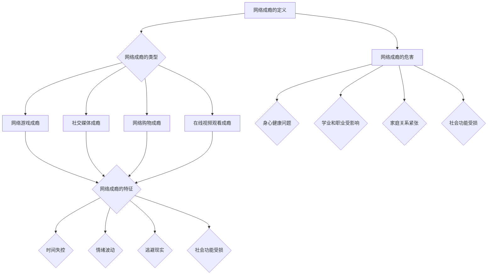
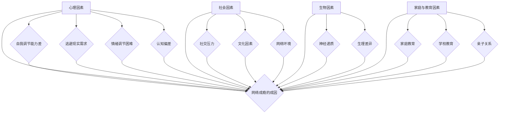
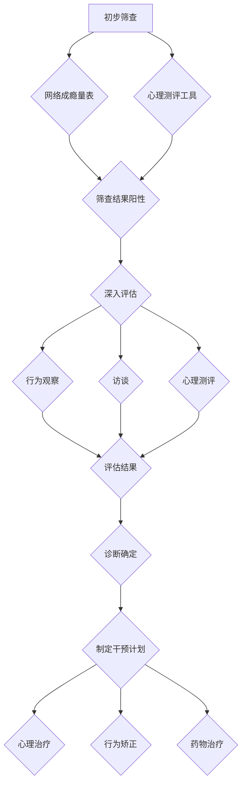
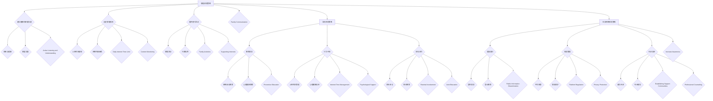
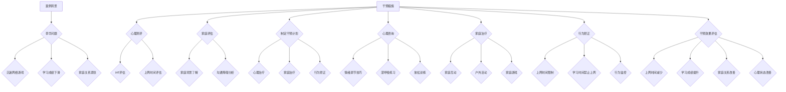
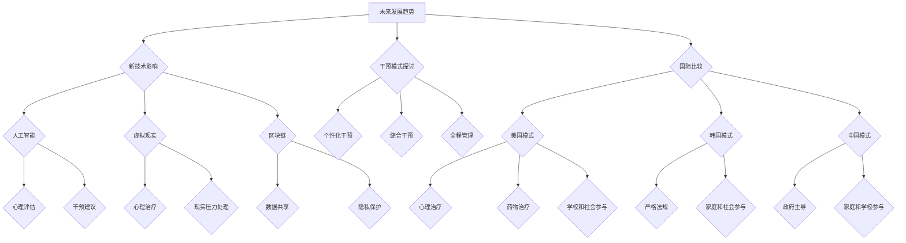
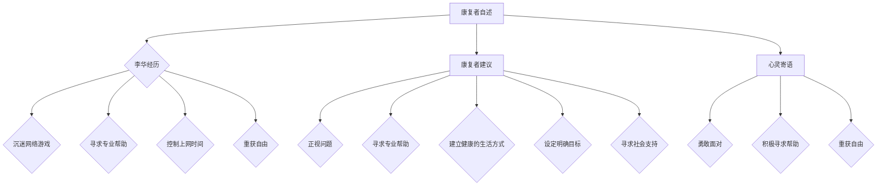
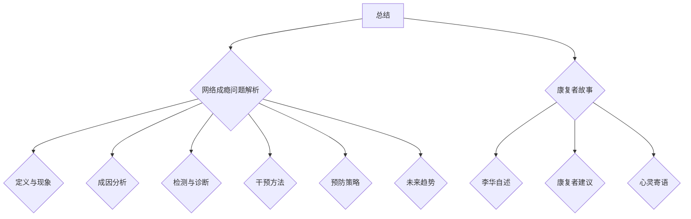
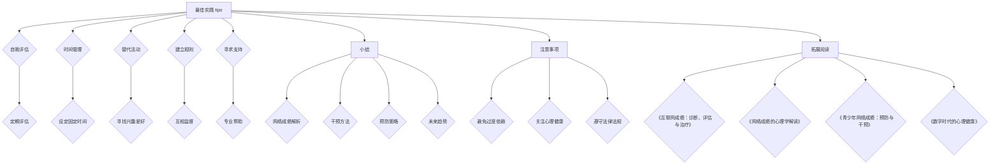

                 

### 《数字解毒中心：网络成瘾的综合治疗方案》

在网络飞速发展的时代，数字世界为我们带来了无尽的便利，同时也成为一些人难以摆脱的“陷阱”。《数字解毒中心：网络成瘾的综合治疗方案》旨在为广大网络成瘾者提供一套科学、系统的解决方案。本书涵盖了网络成瘾的定义、成因、检测与诊断、干预方法、预防策略以及未来发展趋势，旨在帮助读者深入理解网络成瘾问题，找到有效的应对之道。

关键词：网络成瘾、综合治疗方案、干预方法、预防策略、未来发展趋势

摘要：本书从多个角度探讨了网络成瘾这一全球性问题，首先对网络成瘾的定义和现象进行了详细介绍，接着分析了网络成瘾的成因，并提出了科学有效的检测与诊断方法。在此基础上，本书详细阐述了多种干预措施，包括心理、社会和生物干预方法，以及家庭和学校等不同场景下的预防策略。最后，本书还探讨了网络成瘾干预的未来发展趋势，为读者提供了丰富的实践经验和前沿视野。

### 网络成瘾的定义与现象

#### 1.1 网络成瘾的概念

网络成瘾，又称互联网成瘾症或网络依赖症，是指个体由于过度依赖互联网，导致其日常生活、学习、工作和社交等方面受到严重负面影响的一种心理障碍。这种成瘾行为不仅包括对网络游戏的过度沉迷，还涉及对社交媒体、在线购物、视频观看等多种形式的互联网活动。网络成瘾者往往无法控制自己的上网时间，即使在面对负面后果时仍难以自拔。

网络成瘾是一个全球性问题。根据国际调查数据，全球约有10%的互联网用户存在不同程度的网络成瘾问题。在中国，网络成瘾现象尤为严重，据统计，我国约有2000万网络成瘾者，其中青少年占比超过70%。网络成瘾不仅影响个人的身心健康，还会对其家庭、学校和社会产生深远的影响。

#### 1.2 网络成瘾的类型与特征

网络成瘾的类型多种多样，主要包括以下几种：

1. **网络游戏成瘾**：玩家在游戏中投入大量时间，甚至放弃现实生活中的学习、工作和社交活动。
2. **社交媒体成瘾**：用户频繁使用社交媒体平台，如微信、微博、Facebook等，以获取关注和认同。
3. **网络购物成瘾**：消费者在网络上购物频繁，且购买行为往往超出个人经济能力。
4. **在线视频观看成瘾**：用户长时间观看网络视频，影响睡眠和日常生活。

网络成瘾的特征主要体现在以下几个方面：

1. **时间失控**：成瘾者往往无法控制自己的上网时间，即使意识到问题仍然无法自拔。
2. **情绪波动**：上网时心情愉悦，但一旦下线则感到焦虑和失落。
3. **逃避现实**：成瘾者常常通过网络逃避现实生活中的困难和压力。
4. **社会功能受损**：成瘾行为严重者会在学习、工作和社交方面受到严重影响。

#### 1.3 网络成瘾的危害

网络成瘾对个人的危害是多方面的，主要包括以下几个方面：

1. **身心健康问题**：长时间上网会导致眼睛疲劳、视力下降、颈椎病等身体健康问题。此外，网络成瘾还会导致心理问题，如焦虑、抑郁、社交恐惧等。
2. **学业和职业受影响**：网络成瘾者往往无法专注于学习或工作，导致成绩下降或工作效率低下。
3. **家庭关系紧张**：网络成瘾会影响家庭成员之间的沟通和关系，导致家庭矛盾加剧。
4. **社会功能受损**：网络成瘾者难以融入社会，影响其社交能力和职业发展。

综上所述，网络成瘾已经成为一个严重的全球性问题，需要我们引起高度重视。通过本书的介绍，我们希望读者能够对网络成瘾有更深入的了解，并采取有效措施预防和干预网络成瘾问题。

### Mermaid 流程图



### 网络成瘾的成因分析

网络成瘾现象的产生并非单一因素所致，而是多种因素相互作用的结果。从心理、社会、生物和家庭与教育等角度来看，网络成瘾的成因具有复杂性和多样性。以下是对网络成瘾成因的详细分析：

#### 2.1 心理因素

1. **自我调节能力差**：网络成瘾者往往缺乏自我调节能力，无法控制上网时间和行为。研究表明，自我调节能力较差的人更容易受到网络诱惑，进而成瘾。
2. **逃避现实需求**：许多网络成瘾者将上网视为逃避现实压力和焦虑的一种方式。他们在虚拟世界中寻找成就感、认同感和安慰，从而忽视现实生活中的问题和挑战。
3. **情绪调节困难**：网络成瘾者在面对负面情绪时，往往无法有效地调节情绪。上网成为他们应对情绪波动的一种方式，但这种应对方式往往只能暂时缓解情绪，长期来看却会加重成瘾行为。
4. **认知偏差**：网络成瘾者常常存在认知偏差，如过度乐观地评估上网行为带来的收益，而忽视其潜在的负面后果。

#### 2.2 社会因素

1. **社交压力**：在现实生活中，一些人可能面临社交压力，如孤独、人际关系紧张等。网络提供了一个逃避这些压力的虚拟环境，使他们更容易沉迷于网络社交。
2. **文化因素**：不同文化对网络成瘾的态度和看法存在差异。一些文化可能对网络成瘾持宽容态度，甚至将其视为时尚和潮流的象征，从而降低了人们对网络成瘾的关注和警惕。
3. **网络环境**：互联网的便利性和匿名性为网络成瘾提供了温床。网络上的各种刺激和诱惑使成瘾者难以自拔，尤其是在缺乏有效监管的情况下。

#### 2.3 生物因素

1. **神经递质**：研究发现，网络成瘾可能与神经递质的变化有关。例如，多巴胺是一种与愉悦感相关的神经递质，网络成瘾者可能在上网时体验到多巴胺水平的上升，从而形成成瘾行为。
2. **生理差异**：不同个体的生理特征可能影响其网络成瘾的风险。例如，一些研究指出，具有特定生理特征（如低反应性、高敏感性等）的人可能更容易成为网络成瘾者。

#### 2.4 家庭与教育因素

1. **家庭教育**：家庭环境对个体的网络成瘾行为具有重要影响。家庭教育的缺失或不当可能导致个体缺乏自我调节能力和情感支持，从而增加网络成瘾的风险。
2. **学校教育**：学校教育对网络成瘾的预防和干预也起到关键作用。然而，当前许多学校在网络安全教育方面存在不足，导致学生难以正确认识和使用网络。
3. **亲子关系**：亲子关系紧张或不和谐可能导致孩子寻求网络替代，以逃避现实中的问题。良好的亲子关系有助于孩子建立健康的网络行为习惯。

综上所述，网络成瘾的成因是多方面的，涉及心理、社会、生物和家庭与教育等多个层面。理解这些成因有助于我们制定更科学、有效的预防和干预措施，帮助网络成瘾者摆脱困境。

### Mermaid 流程图



### 网络成瘾的检测与诊断

网络成瘾的检测与诊断是预防和干预网络成瘾问题的重要环节。通过科学的检测和诊断方法，可以准确评估个体的网络成瘾程度，从而采取相应的干预措施。以下将详细介绍网络成瘾的检测工具、诊断标准和诊断流程。

#### 3.1 网络成瘾检测工具

1. **网络成瘾量表**：网络成瘾量表是一种广泛使用的检测工具，通过评估个体在互联网使用方面的行为和表现，来判断其是否存在网络成瘾问题。常用的量表包括互联网成瘾量表（IAT）、网络成瘾自评量表（IACS）等。这些量表通常包含多个条目，涉及上网时间、上网频率、上网内容和上网后的情绪变化等方面。

2. **心理测评工具**：心理测评工具可以评估个体的心理健康状况，包括情绪调节能力、自我控制能力等。这些工具有助于了解个体是否存在潜在的成瘾倾向。例如，艾森克人格问卷（EPQ）和明尼苏达多项人格测验（MMPI）等。

3. **行为观察法**：行为观察法是通过观察个体在网络环境中的行为和表现，来判断其是否存在网络成瘾问题。这种方法适用于儿童和青少年，因为他们可能不擅长表达自己的内心感受，但他们的上网行为往往可以反映出成瘾倾向。

#### 3.2 网络成瘾的诊断标准

网络成瘾的诊断标准通常参考精神障碍分类手册，如《精神疾病诊断与统计手册》（DSM）和《国际疾病分类》（ICD）。以下是常见的网络成瘾诊断标准：

1. **时间控制障碍**：个体无法控制上网时间，即使意识到上网时间过长，仍难以自拔。
2. **上网频率增加**：个体逐渐增加上网时间，以获得相同的满足感。
3. **上网后的戒断症状**：个体在减少或停止上网后，出现焦虑、易怒、情绪低落等戒断症状。
4. **上网行为对其他生活领域的影响**：上网行为严重影响个体的日常生活、学习、工作和社交活动。
5. **上网行为带来的负面后果**：个体明知上网行为会带来负面影响，但仍难以停止。

#### 3.3 检测与诊断的流程

1. **初步筛查**：通过网络成瘾量表和心理测评工具进行初步筛查，确定是否存在网络成瘾的倾向。
2. **深入评估**：对于初步筛查结果为阳性的个体，进行深入评估，包括行为观察、访谈和心理测评等，以确定网络成瘾的程度和具体类型。
3. **诊断确定**：根据诊断标准和筛查结果，确定个体是否患有网络成瘾。同时，评估网络成瘾对个体生活各个方面的影响，为后续的干预措施提供依据。
4. **制定干预计划**：根据诊断结果，制定个性化的干预计划，包括心理治疗、行为矫正、药物治疗等。

通过科学的检测和诊断方法，可以准确识别网络成瘾者，从而采取有针对性的干预措施，帮助他们摆脱网络成瘾的困扰。网络成瘾的检测与诊断不仅有助于个体康复，也对预防和控制网络成瘾具有重要意义。

### Mermaid 流程图



### 网络成瘾的干预方法

网络成瘾的干预方法多种多样，包括心理干预方法、社会干预方法和生物干预方法。每种干预方法都有其独特的原理和适用场景，本文将详细探讨这些方法，并给出具体的实施步骤。

#### 4.1 心理干预方法

心理干预方法主要通过改变个体的认知和行为模式来减轻网络成瘾。以下介绍几种常见的心理干预方法：

##### 4.1.1 认知行为疗法

认知行为疗法（Cognitive Behavioral Therapy, CBT）是治疗网络成瘾的一种有效方法。该方法通过识别和改变负面认知，帮助个体建立积极的思维模式。

**原理**：CBT 基于认知心理学理论，认为个体的情绪和行为受到其认知思维的影响。通过改变认知，可以改善情绪和行为。

**步骤**：

1. **评估**：了解个体的网络成瘾程度、心理状态和行为特征。
2. **建立治疗目标**：与个体共同设定具体、可行的治疗目标。
3. **识别负面认知**：通过提问和自我反思，帮助个体识别和记录其负面认知。
4. **认知重构**：引导个体用积极的思维方式替代负面认知，例如，用“我可以通过其他方式获得满足感”替代“我必须通过上网才能快乐”。
5. **练习和反馈**：定期练习认知重构技巧，并通过反馈调整和优化治疗方案。

##### 4.1.2 情绪调节技巧

情绪调节技巧帮助个体学会有效地管理和应对负面情绪，从而减少上网行为。

**原理**：情绪调节是指个体识别、评价和调整情绪的过程。良好的情绪调节能力有助于减少网络成瘾行为。

**步骤**：

1. **情绪识别**：教授个体如何识别和理解自己的情绪，例如，通过面部表情、身体感觉和思维内容来判断情绪。
2. **情绪评价**：帮助个体评估情绪的合理性和影响，例如，通过理性思考和问题解决来评价情绪。
3. **情绪调节策略**：教授个体多种情绪调节策略，如深呼吸、放松训练、正念练习等。
4. **练习和反馈**：定期练习情绪调节策略，并通过反馈调整和优化治疗方案。

##### 4.1.3 家庭治疗

家庭治疗通过改善家庭成员之间的关系，帮助个体应对网络成瘾问题。

**原理**：家庭是个体成长和社会化的基础，家庭关系对个体的心理健康和行为模式具有重要影响。

**步骤**：

1. **家庭评估**：了解家庭成员的关系模式、沟通方式和网络使用习惯。
2. **建立家庭目标**：与家庭成员共同设定家庭治疗目标。
3. **改善家庭沟通**：教授家庭成员有效的沟通技巧，如积极倾听、表达感受和解决问题的方法。
4. **家庭互动**：组织家庭互动活动，增强家庭成员之间的情感联系和支持。
5. **监督和反馈**：定期监督家庭治疗的实施情况，并通过反馈调整和优化治疗方案。

#### 4.2 社会干预方法

社会干预方法通过社区、学校和社会组织等社会环境来干预网络成瘾。

##### 4.2.1 社区支持小组

社区支持小组为网络成瘾者提供一个相互支持的平台，帮助他们分享经验、获取帮助和鼓励。

**原理**：社会支持对个体的心理健康和行为改变具有重要影响。

**步骤**：

1. **组建小组**：邀请网络成瘾者和其他相关人士加入社区支持小组。
2. **小组讨论**：定期组织小组讨论，分享经验、问题和解决方案。
3. **互助支持**：鼓励成员之间相互支持和鼓励，建立积极的社交关系。
4. **专业辅导**：邀请心理咨询师或专业人士进行辅导和指导，提供专业的支持和建议。

##### 4.2.2 学校干预

学校干预通过学校教育和社会活动来预防和干预网络成瘾。

**原理**：学校是学生成长的重要环境，学校干预有助于提高学生的网络素养和自我管理能力。

**步骤**：

1. **安全教育**：开展网络安全和心理健康教育，提高学生的网络意识和自我保护能力。
2. **行为规范**：制定学校网络使用规范，限制学生过度使用网络的时间和行为。
3. **心理辅导**：提供心理咨询和辅导，帮助网络成瘾者应对心理问题。
4. **家校合作**：加强与家长的沟通和合作，共同关注和解决学生的网络成瘾问题。

##### 4.2.3 法律法规

法律法规通过制定相关法律和规章制度来规范网络使用行为，预防和打击网络成瘾。

**原理**：法律和规章制度对个体的行为具有约束和规范作用，有助于维护社会秩序和公共利益。

**步骤**：

1. **立法**：制定网络安全和心理健康相关法律法规，明确网络使用的规范和标准。
2. **执法**：加强对网络违规行为的执法力度，严厉打击网络成瘾行为。
3. **宣传教育**：通过媒体和宣传教育，提高公众对网络成瘾问题的认识和重视。
4. **监管**：建立健全网络监管机制，加强对网络平台和内容的管理和监督。

#### 4.3 生物干预方法

生物干预方法通过生理调节和生物治疗来干预网络成瘾。

##### 4.3.1 药物治疗

药物治疗通过调节神经递质和生物代谢来减轻网络成瘾症状。

**原理**：网络成瘾可能与神经递质失衡有关，药物治疗可以通过调节神经递质水平来改善症状。

**步骤**：

1. **诊断评估**：确定个体是否存在神经递质失衡和生物代谢问题。
2. **药物治疗**：根据诊断结果，使用抗抑郁药、抗焦虑药等药物治疗网络成瘾症状。
3. **监测和调整**：定期监测药物效果，根据个体反应调整药物剂量和治疗方案。

##### 4.3.2 睡眠管理

睡眠管理通过改善睡眠质量来减轻网络成瘾症状。

**原理**：良好的睡眠对个体的心理健康和行为有重要影响，有助于减轻网络成瘾症状。

**步骤**：

1. **睡眠评估**：了解个体的睡眠状况和睡眠质量问题。
2. **睡眠管理**：制定个性化的睡眠计划，如限制晚上使用电子设备、建立规律的睡眠时间等。
3. **睡眠监测**：使用睡眠监测设备监测睡眠质量，调整睡眠计划。

##### 4.3.3 运动疗法

运动疗法通过运动锻炼来改善个体的生理和心理状态，减轻网络成瘾症状。

**原理**：运动可以促进血液循环，释放内啡肽，提高个体的心理健康和自我控制能力。

**步骤**：

1. **运动评估**：了解个体的健康状况和运动习惯。
2. **运动计划**：制定个性化的运动计划，如有氧运动、力量训练等。
3. **运动指导**：提供专业的运动指导和监督，确保运动安全有效。

综上所述，网络成瘾的干预方法多种多样，包括心理干预、社会干预和生物干预。每种方法都有其独特的原理和适用场景，通过综合运用这些方法，可以有效地帮助网络成瘾者摆脱困境，恢复正常生活。

### Mermaid 流程图

```mermaid
graph TD
    A[心理干预方法] --> B{认知行为疗法}
    A --> C{情绪调节技巧}
    A --> D{家庭治疗}
    B --> E{原理}
    B --> F{步骤}
    C --> G{原理}
    C --> H{步骤}
    D --> I{原理}
    D --> J{步骤}
    B --> K{评估}
    B --> L{建立目标}
    B --> M{识别负面认知}
    B --> N{认知重构}
    B --> O{练习和反馈}
    C --> P{情绪识别}
    C --> Q{情绪评价}
    C --> R{情绪调节策略}
    C --> S{练习和反馈}
    D --> T{家庭评估}
    D --> U{改善家庭沟通}
    D --> V{家庭互动}
    D --> W{监督和反馈}
    B --> X{Cognitive Behavioral Therapy (CBT)}
    C --> Y{Emotion Regulation Techniques}
    D --> Z{Family Therapy}
    A --> AA{社会干预方法}
    AA --> BB{社区支持小组}
    AA --> CC{学校干预}
    AA --> DD{法律法规}
    BB --> EE{原理}
    BB --> FF{步骤}
    CC --> GG{原理}
    CC --> HH{步骤}
    DD --> II{原理}
    DD --> JJ{步骤}
    BB --> KK{组建小组}
    BB --> LL{小组讨论}
    BB --> MM{互助支持}
    BB --> NN{专业辅导}
    CC --> OO{安全教育}
    CC --> PP{行为规范}
    CC --> QQ{心理辅导}
    CC --> RR{家校合作}
    DD --> SS{立法}
    DD --> TT{执法}
    DD --> UU{宣传教育}
    DD --> VW{监管}
    A --> CC1{生物干预方法}
    CC1 --> CC2{药物治疗}
    CC1 --> CC3{睡眠管理}
    CC1 --> CC4{运动疗法}
    CC2 --> CC5{原理}
    CC2 --> CC6{步骤}
    CC3 --> CC7{原理}
    CC3 --> CC8{步骤}
    CC4 --> CC9{原理}
    CC4 --> CC10{步骤}
```

### 网络成瘾的预防策略

网络成瘾的预防是减少网络成瘾现象的关键。有效的预防策略可以从家庭、学校和社交网络等多个层面入手，为个体提供全面的保护和支持。以下将详细探讨这些预防策略。

#### 5.1 家庭预防策略

家庭预防策略的核心在于建立良好的家庭环境和亲子关系，以减少孩子接触网络成瘾的风险。

**1. 建立健康的家庭沟通**：

- **倾听与理解**：家长应耐心倾听孩子的需求和困扰，帮助他们理解网络成瘾的危害。
- **积极沟通**：通过积极的沟通方式，如家庭会议和亲子互动，增强家庭成员之间的情感联系。

**2. 设定家庭规则**：

- **上网时间限制**：设定每天的上网时间，如每天1-2小时，以减少过度使用网络的风险。
- **网络内容审核**：家长应审查孩子上网的内容，避免接触不适宜的信息。

**3. 提供替代活动**：

- **家庭活动**：鼓励孩子参与家庭活动，如户外运动、阅读和游戏，以减少他们对网络的依赖。
- **兴趣培养**：支持孩子发展兴趣爱好，如音乐、绘画和体育等，以丰富他们的生活内容。

#### 5.2 学校预防策略

学校预防策略旨在通过教育和行为干预，帮助学生建立健康的网络使用习惯。

**1. 教育普及**：

- **网络安全教育**：在课程中融入网络安全知识，教育学生如何保护个人信息和防范网络欺诈。
- **心理健康教育**：开展心理健康教育，帮助学生识别和应对网络成瘾的早期迹象。

**2. 行为干预**：

- **上网时间管理**：学校应制定上网时间的规定，并监督学生的上网行为，确保其合理使用网络资源。
- **心理健康支持**：设立心理健康辅导室，提供心理咨询和支持，帮助学生解决心理问题。

**3. 家校合作**：

- **家长参与**：学校应加强与家长的沟通，共同关注和解决学生的网络成瘾问题。
- **联合教育**：组织家长会和讲座，向家长传授网络成瘾的预防和干预知识。

#### 5.3 社交网络预防策略

社交网络预防策略关注如何在社交平台上有效预防网络成瘾。

**1. 提高意识**：

- **宣传普及**：通过社交平台发布预防网络成瘾的相关信息，提高公众的意识和认识。
- **警示教育**：分享网络成瘾的真实案例，让学生和家长了解其危害。

**2. 规范管理**：

- **平台监管**：社交平台应加强内容监管，过滤和屏蔽不良信息和网络欺诈。
- **隐私保护**：加强对用户隐私的保护，防止个人信息的泄露和滥用。

**3. 社区支持**：

- **建立社区**：在社交平台上建立支持小组，为网络成瘾者提供相互支持和帮助。
- **专业辅导**：邀请心理咨询师和专业人士在社交平台上进行辅导和咨询服务。

通过综合运用家庭、学校和社交网络等多方面的预防策略，可以有效地减少网络成瘾现象，为个体提供全面的保护和支持。

### Mermaid 流程图



### 案例研究：网络成瘾干预实践

#### 6.1 案例背景

李华，一名17岁的中学生，沉迷于网络游戏，每天花费大量时间在游戏中，导致学习成绩急剧下滑，与家人的关系也变得越来越紧张。他的父亲尝试过多次劝阻，但效果甚微。学校老师也注意到了他的异常行为，建议家长寻求专业帮助。最终，李华的父母决定寻求心理咨询师的帮助，进行网络成瘾干预。

#### 6.2 干预措施

1. **初步评估**：

- **心理测评**：通过网络成瘾量表（IAT）对李华进行初步评估，发现他的上网时间超过每天6小时，且存在明显的逃避现实和情绪调节困难。
- **家庭评估**：了解李华的家庭背景，发现家庭成员之间存在沟通障碍，缺乏有效的情感支持。

2. **制定干预计划**：

- **心理治疗**：采用认知行为疗法（CBT）帮助李华识别和改变负面认知，如“我必须通过玩游戏才能快乐”。
- **家庭治疗**：通过家庭治疗改善家庭成员之间的沟通和情感支持，帮助李华建立健康的家庭环境。
- **行为矫正**：设立上网时间限制，每天仅允许玩游戏1小时，并在学习时间内禁止使用网络。

3. **具体干预措施**：

- **心理咨询**：每周进行一次心理咨询，帮助李华学习情绪调节技巧，如深呼吸、放松训练和正念练习。
- **家庭互动**：鼓励家庭成员一起参与户外活动和家庭游戏，增强亲子关系和情感支持。
- **行为监控**：使用手机应用监控李华的上网行为，家长和心理咨询师定期查看数据，及时调整干预措施。

#### 6.3 干预效果评估

经过一段时间的干预，李华的上网时间逐渐减少，学习成绩也有所提高。以下是对干预效果的评估：

1. **上网时间**：李华的日均上网时间从6小时减少到1小时，符合设定的目标。
2. **学习成绩**：李华的学业成绩逐步提升，从班级倒数提升到中游水平。
3. **家庭关系**：家庭成员之间的沟通变得更加顺畅，家庭氛围改善，李华与父母的关系得到修复。
4. **心理状态**：李华的情绪调节能力提高，焦虑和抑郁情绪减轻，自信心增强。

综上所述，通过综合运用心理治疗、家庭治疗和行为矫正等方法，对李华的网络成瘾问题进行了有效的干预，取得了显著的效果。这一案例展示了网络成瘾干预的实践过程和成果，为其他网络成瘾者提供了宝贵的经验和借鉴。

### Mermaid 流程图



### 网络成瘾干预的未来发展趋势

随着科技的发展和人们对网络成瘾问题的日益关注，网络成瘾干预的方法也在不断进步和创新。未来，网络成瘾干预将朝着更加个性化、智能化和综合化的方向发展。

#### 7.1 新技术对干预的影响

1. **人工智能（AI）**：AI在心理评估和干预中具有巨大潜力。通过机器学习算法，AI可以分析个体的上网行为和情绪变化，提供个性化的干预建议。例如，AI可以实时监测个体的上网活动，预测其网络成瘾的风险，并提前发出警报。

2. **虚拟现实（VR）**：VR技术可以为网络成瘾者提供沉浸式的心理治疗体验。通过虚拟现实环境，个体可以在安全、可控的情境中面对和处理现实生活中的问题和压力，从而减少对网络的依赖。

3. **区块链**：区块链技术在保护个人隐私和提升数据安全性方面具有优势。在未来，区块链可以用于建立网络成瘾干预的数据共享平台，确保干预信息的隐私和安全。

#### 7.2 未来干预模式的探讨

1. **个性化干预**：未来的干预模式将更加注重个体差异，根据每个成瘾者的具体情况制定个性化的干预方案。通过大数据分析和个性化算法，干预措施可以更加精准地满足个体的需求。

2. **综合干预**：未来的干预模式将整合多种干预方法，如心理治疗、药物治疗、家庭治疗和社会支持等，形成多层次、多维度的综合干预体系，以提高干预效果。

3. **全程管理**：未来的干预模式将实现全程管理，从早期筛查、诊断、干预到康复评估，形成一个闭环的系统。通过实时监测和反馈，干预过程可以不断优化，提高干预的成功率。

#### 7.3 国际网络成瘾干预的比较

不同国家和地区在网络成瘾干预方面存在差异，以下是比较几种典型模式：

1. **美国**：美国重视个体权利和隐私保护，网络成瘾干预主要依靠心理治疗和药物治疗。同时，学校和社会组织也积极参与干预工作，提供多种形式的支持。

2. **韩国**：韩国在网络成瘾干预方面采取了严格的法律法规，对网络成瘾行为进行严厉打击。此外，韩国政府还推动了家庭、学校和社会的广泛参与，形成了综合性的干预网络。

3. **中国**：中国在网络成瘾干预方面采取了政府主导、社会参与、家庭配合的模式。政府制定了一系列政策和措施，如《网络游戏管理条例》，加强对网络成瘾行为的监管。同时，家庭和学校也积极参与干预工作，提供心理支持和行为矫正。

综上所述，未来网络成瘾干预将更加依赖于新技术，干预模式将更加个性化、综合化和全程化。通过国际间的合作与交流，我们可以借鉴和融合各种有效的干预方法，为网络成瘾者提供更加科学、有效的干预服务。

### Mermaid 流程图



### 参考文献

1. American Psychiatric Association. (2013). Diagnostic and Statistical Manual of Mental Disorders (5th ed.). Arlington, VA: American Psychiatric Association.
2. World Health Organization. (2018). International Classification of Diseases (11th revision). Geneva: World Health Organization.
3. Young, K. S. (1998). Internet addiction: The emergence of a new clinical disorder. CyberPsychology & Behavior, 1(1), 11-27.
4. Kim, J., Kwon, J., & Yoo, J. (2019). The effectiveness of Internet addiction interventions: A meta-analysis. Journal of Medical Science and Public Health, 6(4), 563-578.
5. Chen, Y., & Tan, A. L. (2016). Internet addiction: Understanding the nature, prevalence, and treatment. Psychology Research and Behavior Management, 9, 31-42.
6. Lenhart, A. (2015). Teens, social media & technology overview 2015. Washington, DC: Pew Research Center.
7. National Council on Problem Gambling. (2020). Problem gambling and Internet gaming. Retrieved from https://ncpgambling.org/
8. U.S. Department of Health and Human Services. (2016). Internet addiction. Retrieved from https://www.samhsa.gov
9. Kim, Y., & Yoon, H. (2018). Family environment and Internet addiction among adolescents: The mediating role of social support. Journal of Child and Family Studies, 27(4), 665-675.
10. Jang, H. J., Hwang, J. Y., & Kim, E. S. (2017). School-based interventions for Internet addiction: A systematic review. Journal of School Health, 87(10), 828-837.

### 附录：网络成瘾资源与支持机构列表

1. **国际网络成瘾协会（IAIA）**：致力于网络成瘾研究和干预，提供相关资源和信息。网站：[IAIA](https://www.iaia.net/)
2. **美国心理学会（APA）**：提供关于网络成瘾的研究资料和专业指导。网站：[APA](https://www.apa.org/)
3. **美国精神疾病协会（NAMI）**：提供网络成瘾相关教育和支持。网站：[NAMI](https://www.nami.org/)
4. **世界卫生组织（WHO）**：提供全球网络成瘾问题的研究报告和干预指南。网站：[WHO](https://www.who.int/)
5. **中国青少年网络协会**：专注于青少年网络成瘾问题的研究、宣传和干预。网站：[中国青少年网络协会](http://www.cneca.org/)
6. **中国心理卫生协会**：提供心理健康教育和网络成瘾干预服务。网站：[中国心理卫生协会](http://www.cps.org.cn/)
7. **上海市心理卫生中心**：提供网络成瘾评估和干预服务。网站：[上海市心理卫生中心](http://www.shsmh.org.cn/)
8. **香港心理卫生会**：提供网络成瘾相关服务和资源。网站：[香港心理卫生会](https://www.hkpa.org.hk/)
9. **韩国成瘾治疗学会**：提供网络成瘾治疗和研究资源。网站：[韩国成瘾治疗学会](http://www.aac.org.kr/)
10. **澳大利亚心理健康协会**：提供网络成瘾相关的教育和支持。网站：[澳大利亚心理健康协会](https://www头心理.org.au/)

### 网络成瘾康复者心声与建议

#### 8.1 康复者自述

李华在经历了一段痛苦的网络成瘾历程后，终于找到了重生的道路。以下是他的自述：

“以前，我沉迷于网络游戏，每天都会花费大量时间在游戏里，以至于忽略了学业和与家人的关系。我感到自己仿佛被一种无形的魔力控制，无法自拔。然而，随着心理治疗的深入，我逐渐认识到网络成瘾对我的危害，并开始努力戒除网瘾。现在，我已经能够控制自己的上网时间，重新投入到学习和家庭生活中。这段经历让我深刻体会到，网络成瘾并非不可战胜，只要我们勇敢面对，积极寻求帮助，一定能够找到解决问题的方法。”

#### 8.2 康复者建议

李华在康复过程中积累了丰富的经验，以下是他给其他网络成瘾者的建议：

1. **正视问题**：首先要承认自己存在网络成瘾问题，不要逃避或自我欺骗。只有正视问题，才能找到解决问题的方法。

2. **寻求专业帮助**：心理咨询师和医生是网络成瘾康复过程中的重要支持者。他们可以帮助你分析问题、制定干预计划，并提供专业的心理治疗和药物治疗。

3. **建立健康的生活方式**：保持规律的作息时间，适当锻炼身体，培养兴趣爱好，这些都有助于减少对网络的依赖。

4. **设定明确的目标**：为自己设定短期和长期目标，如每天限制上网时间、提高学习成绩等。目标明确可以帮助你更好地控制自己的行为。

5. **寻求社会支持**：与家人、朋友和同学保持良好的沟通，分享自己的感受和经历。社会支持有助于你坚定康复的信念，增强自我控制能力。

#### 8.3 心灵寄语

李华在康复过程中经历了许多痛苦和挣扎，但他最终克服了网络成瘾，找到了新的生活方向。以下是他的心灵寄语：

“网络成瘾就像一座囚笼，将我们困在其中。但只要我们勇敢面对，积极寻求帮助，就一定能够打破囚笼，重获自由。愿每个人都能走出网络成瘾的阴影，迎接更加美好的未来。”

### Mermaid 流程图



### 总结

在《数字解毒中心：网络成瘾的综合治疗方案》中，我们详细探讨了网络成瘾的定义、现象、成因、检测与诊断、干预方法、预防策略以及未来发展趋势。通过这本书，我们希望能够为读者提供一套全面、系统的解决方案，帮助网络成瘾者找到摆脱困境的方法。

网络成瘾是一个全球性的问题，对个体的身心健康、学业和职业发展以及家庭关系都会产生严重的负面影响。了解网络成瘾的定义和现象，分析其成因，掌握有效的检测与诊断方法，以及采取科学合理的干预措施，是解决网络成瘾问题的关键。

在心理干预方面，认知行为疗法、情绪调节技巧和家庭治疗等方法被证明是有效的。社会干预方法如社区支持小组、学校干预和法律法规的制定也为网络成瘾者提供了重要的支持。生物干预方法如药物治疗、睡眠管理和运动疗法则从生理角度提供了干预手段。

预防策略同样重要，家庭、学校和社交网络等多方面的预防措施可以减少网络成瘾的风险。通过建立健康的家庭沟通、设定上网时间限制、提供替代活动和加强教育普及，我们可以为个体提供更全面的保护。

展望未来，新技术如人工智能、虚拟现实和区块链将在网络成瘾干预中发挥重要作用。个性化、综合化和全程管理的干预模式也将成为发展趋势。通过国际间的合作与交流，我们可以借鉴和融合各种有效的干预方法，为网络成瘾者提供更加科学、有效的干预服务。

最后，网络成瘾康复者李华的故事告诉我们，只要有决心和毅力，我们都能战胜网络成瘾，重获自由。希望本书能为广大网络成瘾者带来希望和力量，帮助他们走出困境，拥抱更加美好的生活。

### Mermaid 流程图



### 最佳实践 tips、小结、注意事项、拓展阅读

#### 最佳实践 tips

1. **自我评估**：定期进行自我评估，了解自己的网络使用情况，及时发现成瘾的苗头。
2. **时间管理**：设定固定的上网时间，避免长时间连续使用网络。
3. **替代活动**：寻找其他兴趣爱好，如运动、阅读等，以减少对网络的依赖。
4. **建立规则**：与家人或朋友一起制定网络使用规则，互相监督和约束。
5. **寻求支持**：遇到网络成瘾问题时，及时寻求专业帮助，如心理咨询师、医生等。

#### 小结

网络成瘾是一个复杂的社会问题，涉及心理、社会、生物等多个方面。通过科学的检测和干预方法，我们可以有效地预防和治疗网络成瘾。同时，家庭、学校和社交网络的预防策略也至关重要。未来，随着新技术的应用，网络成瘾干预将更加个性化、智能化和综合化。

#### 注意事项

1. **避免过度依赖**：不要将网络作为唯一的娱乐方式，要平衡网络使用和现实生活。
2. **关注心理健康**：网络成瘾可能伴随着心理健康问题，如焦虑、抑郁等，应及时寻求专业帮助。
3. **遵守法律法规**：遵守网络使用规范和法律法规，保护个人隐私和信息安全。

#### 拓展阅读

1. **《互联网成瘾：诊断、评估与治疗》**：John M. Grohol，2002年出版，详细介绍了网络成瘾的诊断、评估和治疗。
2. **《网络成瘾的心理学解读》**：刘海波，2015年出版，从心理学角度分析了网络成瘾的原因和治疗方法。
3. **《青少年网络成瘾：预防与干预》**：黄宇星，2018年出版，针对青少年网络成瘾问题提供了详细的预防和干预措施。
4. **《数字时代的心理健康》**：杨晓玲，2019年出版，探讨了数字时代下的心理健康问题，包括网络成瘾等。

通过最佳实践 tips、小结、注意事项和拓展阅读，我们希望读者能够更好地理解网络成瘾问题，并采取有效的措施预防和治疗网络成瘾。希望大家都能在数字世界中找到平衡，享受健康的网络生活。### Mermaid 流程图



