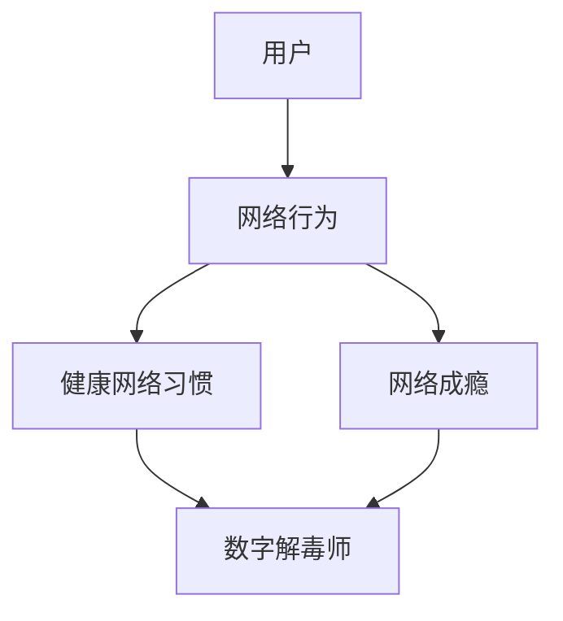

                 

### 数字解毒师认证体系概述

数字解毒师认证体系旨在培养专业的健康网络习惯指导员，帮助人们摆脱网络成瘾，培养健康的网络行为。这一体系不仅仅是一个简单的培训项目，更是一个系统化的、结构化的认证过程，它涵盖了从基础概念到高级实践的各个环节。

#### 核心概念与联系

首先，我们需要明确几个核心概念，这些概念是构建数字解毒师认证体系的基础：

- **数字解毒师**：这是指那些受过专业训练，能够帮助他人建立健康网络行为的专业人士。他们不仅了解网络技术和互联网使用的基本知识，还具备心理学、教育学等跨学科的知识和技能，能够有效地帮助用户识别并解决网络成瘾问题。

- **健康网络习惯**：这是指在互联网使用过程中，用户能够保持理性、适度、安全的行为模式。健康网络习惯包括适度上网、理性对待网络信息、遵守网络安全规则等。

- **网络成瘾**：这是指用户过度依赖网络，以至于影响了其日常生活、工作和社交活动。网络成瘾不仅损害了用户的身体健康，还可能对心理健康造成负面影响。

这些核心概念之间存在着紧密的联系。数字解毒师通过评估用户的网络行为，识别网络成瘾的迹象，并采用科学的策略和技巧，帮助用户建立健康的网络习惯。这一过程不仅涉及到技术层面的干预，还包括心理学、教育学等多个领域的综合应用。

#### Mermaid 流程图

为了更直观地展示这些概念之间的关系，我们可以使用 Mermaid 画出以下流程图：

在这个流程图中，用户的行为是起点和终点，他们的网络行为直接影响到他们的健康网络习惯和网络成瘾状态。数字解毒师在这一过程中扮演着关键角色，通过干预和指导，帮助用户建立健康的网络习惯，防止网络成瘾的发生。

#### 关键步骤

1. **用户网络行为评估**：数字解毒师首先需要收集用户在网络上的行为数据，如上网时间、浏览内容、社交媒体使用情况等，通过对这些数据的分析，评估用户的网络行为是否健康。

2. **网络成瘾识别**：基于评估结果，数字解毒师需要识别用户是否存在网络成瘾的迹象。这通常包括对用户行为模式、心理状态等多方面的综合分析。

3. **健康网络习惯培养**：一旦识别出网络成瘾的问题，数字解毒师需要采取一系列措施，帮助用户建立健康的网络习惯。这可能包括提供个性化的指导方案、监督用户的网络行为、开展心理健康辅导等。

4. **跟踪与反馈**：数字解毒师还需要对用户的进步进行跟踪和评估，根据反馈调整指导方案，确保用户能够持续改善网络行为。

通过这些关键步骤，数字解毒师认证体系能够有效地帮助人们摆脱网络成瘾，培养健康的网络习惯。这不仅有助于提升个人的生活质量，也为构建一个健康、和谐的网络环境做出了贡献。

#### 实际案例

为了更好地理解数字解毒师认证体系的应用，我们可以看一个实际案例。小王是一位高中生，他沉迷于网络游戏，经常熬夜上网，导致学习成绩下滑，身体健康受损。他的父母非常担心，于是寻求数字解毒师的帮助。

数字解毒师首先对小王进行了网络行为评估，发现他每天在网络上花费的时间超过10小时，且主要活动是在游戏和社交媒体上。经过详细的分析，数字解毒师判断小王存在严重的网络成瘾问题。

接下来，数字解毒师制定了一个个性化的干预方案，包括：

- **时间管理**：帮助小王制定合理的作息时间表，减少上网时间，保证充足的睡眠。
- **兴趣培养**：引导小王参与其他有益的活动，如运动、读书等，以减少对网络游戏的依赖。
- **心理辅导**：为小王提供心理咨询服务，帮助他了解网络成瘾的危害，培养积极的自我认知。

在数字解毒师的指导下，小王逐步改善了网络行为，恢复了健康的生活习惯。这个案例展示了数字解毒师认证体系在实际中的应用效果，也证明了其价值。

#### 总结

数字解毒师认证体系是一个综合性的、系统化的认证过程，旨在帮助人们建立健康的网络习惯，摆脱网络成瘾。通过明确的核心概念、紧密的联系和关键步骤，数字解毒师能够有效地帮助用户改善网络行为，提升生活质量。随着互联网的普及和人们对健康网络环境的日益关注，数字解毒师认证体系将发挥越来越重要的作用。

---

# 数字解毒师认证流程与标准

数字解毒师认证体系的成功离不开严格的认证流程和明确的标准。这些流程和标准确保了数字解毒师的专业性和可靠性，使其能够为用户提供高质量的指导和服务。

#### 认证流程

1. **申请与报名**：有兴趣成为数字解毒师的候选人需要填写申请表，并提交相关资质证明。这些证明可能包括教育背景、工作经验、相关证书等。

2. **初步评估**：在收到申请后，认证机构会对候选人进行初步评估，以确保其具备成为数字解毒师的基本条件。这一步骤通常包括面试、在线测试等。

3. **培训课程**：通过初步评估后，候选人需要参加一系列培训课程。这些课程涵盖了互联网技术、心理学、教育学等多方面的内容，旨在提升候选人的专业知识和技能。

4. **实践项目**：培训课程结束后，候选人需要完成一定数量的实践项目。这些项目可以是模拟案例分析，也可以是真实用户案例的处理，目的是检验候选人将理论知识应用到实际工作中的能力。

5. **考试**：完成实践项目后，候选人需要参加认证考试。考试内容通常包括理论知识和实际操作两部分，确保候选人具备全面的数字解毒师技能。

6. **认证评审**：考试通过后，认证机构会对候选人的整体表现进行评审，包括培训成绩、实践项目成果、考试成绩等。评审通过后，候选人将被授予数字解毒师认证。

7. **持续教育**：数字解毒师需要定期参加继续教育培训，以保持其专业知识的更新和技能的提升。

#### 认证标准

1. **专业素养**：数字解毒师需要具备扎实的专业素养，包括对互联网技术、心理学、教育学等领域的深入理解。

2. **实践能力**：数字解毒师需要具备较强的实践能力，能够将理论知识应用到实际工作中，解决用户的网络成瘾问题。

3. **道德标准**：数字解毒师需要遵守职业道德和行为规范，保护用户隐私，确保用户权益。

4. **持续发展**：数字解毒师需要具备持续学习的能力，不断更新知识和技能，以适应不断变化的市场需求。

#### 重要性

数字解毒师认证流程和标准的严格性对于保障认证的质量和可信度至关重要。以下是几个方面的说明：

1. **保障用户权益**：通过严格的认证流程和标准，数字解毒师的专业能力和诚信度得到了保障，用户可以放心地寻求其帮助。

2. **提升行业水平**：严格的认证体系有助于提升整个数字解毒师行业的专业水平和服务质量，促进行业的健康发展。

3. **促进行业规范**：明确的认证标准和流程为数字解毒师行业提供了规范和指导，有助于行业的规范化和标准化。

#### 案例分析

以一位成功获得数字解毒师认证的专业人士为例，小张是一位拥有多年教育背景和丰富实践经验的心理学专家。在参加数字解毒师认证培训之前，小张已经积累了丰富的用户心理分析和干预经验。在培训过程中，他系统地学习了互联网技术、网络行为分析、心理辅导技巧等知识，并通过一系列实践项目，将这些理论知识应用到实际工作中。

在完成实践项目和考试后，小张顺利通过了数字解毒师认证。他的认证过程体现了数字解毒师认证体系的严格性和专业性。通过这个案例，我们可以看到，数字解毒师认证不仅是对个人专业能力的认可，更是对其诚信度和责任感的考验。

#### 总结

数字解毒师认证流程和标准的制定，为数字解毒师行业的专业化发展提供了坚实的基础。通过严格的认证流程和明确的认证标准，数字解毒师不仅能够提升自身的专业素养，还能够为用户提供更高质量的服务，从而促进整个行业的健康发展。

---

### 网络成瘾的定义

网络成瘾是一种复杂的心理和行为问题，通常表现为个体对互联网过度依赖，导致其日常生活、工作和社交活动受到严重干扰。网络成瘾不仅包括对网络游戏的沉迷，还涵盖了社交媒体、在线购物、视频网站等多个方面。

#### 网络成瘾的表现

网络成瘾的具体表现可以归纳为以下几点：

1. **时间投入过多**：用户在网络上花费的时间远超过正常水平，常常忽视睡眠、饮食和其他日常活动。

2. **功能损害**：网络成瘾影响到用户的正常功能，如学习、工作、家庭和社交活动。

3. **戒断症状**：当用户试图减少或停止上网时，会感到焦虑、不安、甚至情绪低落。

4. **社交隔离**：用户逐渐减少与现实生活中人的互动，更倾向于在网络空间中寻找社交满足。

5. **逃避现实**：用户通过网络逃避现实生活中的问题，如工作压力、人际关系冲突等。

6. **忽视健康**：长时间上网导致用户忽视身体健康，可能出现视力下降、睡眠障碍、肥胖等问题。

#### 评估网络成瘾的方法

为了准确评估网络成瘾的程度，可以使用以下几种方法：

1. **自我评估问卷**：常用的自我评估问卷包括《网络成瘾指数》（Internet Addiction Test，IAT）和《网络成瘾诊断问卷》（Internet Addiction Diagnostic Questionnaire，IADQ）。这些问卷通过一系列问题，评估个体在网络上花费的时间、上网频率、上网目的等，从而判断其是否成瘾。

2. **专家评估**：由心理学专家、精神科医生等专业人员对个体进行面谈和评估。他们通过观察用户的行为、访谈用户及其亲友，了解用户的网络使用情况和心理状态，从而进行诊断。

3. **生理指标检测**：使用生理指标检测，如心率、血压、脑电图等，来评估用户在上网时的生理反应。这些指标可以揭示用户在上网时的紧张、焦虑等心理状态。

#### 常见误区

在评估网络成瘾时，存在一些常见的误区：

1. **过度依赖自我评估**：虽然自我评估问卷是一种常用的评估方法，但它们并不能完全反映个体的真实情况。用户可能因为自我防御机制而低估自己的网络使用情况。

2. **忽视个体差异**：每个人的网络使用习惯和心理状态都有所不同，因此不能简单地用统一的标准来评估。需要考虑个体的具体情况，如年龄、性别、心理状态等。

3. **简单归因**：网络成瘾是一个复杂的心理和行为问题，不能简单地归因于网络本身。它通常与其他心理问题、社交问题、生活压力等相互交织。

#### 结论

网络成瘾是一种严重的心理和行为问题，其表现多样，评估方法也多种多样。通过准确的评估，可以更好地了解用户的网络行为和心理状态，从而采取有效的干预措施，帮助他们建立健康的网络习惯，摆脱网络成瘾的困扰。

---

### 健康网络习惯的培养策略

培养健康网络习惯是一个系统性的工程，需要从多个方面进行综合考虑。以下是一些核心策略，旨在帮助用户建立并维持健康的网络习惯。

#### 核心要素

1. **适度上网**：用户应该合理安排上网时间，避免过度沉迷。例如，每天设定一个固定的上网时间，确保其他重要活动不受影响。

2. **理性对待网络信息**：用户需要学会甄别网络信息的真伪，避免被虚假信息误导。例如，通过正规渠道获取信息，不轻易相信未经证实的内容。

3. **遵守网络安全规则**：用户需要了解并遵守网络安全规则，保护个人隐私和数据安全。例如，设置强密码，不轻易泄露个人信息。

4. **培养良好的人际沟通习惯**：用户应该通过网络平台积极与家人、朋友进行交流，增强现实生活中的社交互动。例如，定期进行线下聚会，减少网络沟通的时间。

#### 培养健康网络习惯的步骤

1. **自我评估**：用户首先需要对自己当前的网络行为进行自我评估，识别可能存在的网络成瘾迹象。可以通过填写自我评估问卷或与亲友交流来了解自己的网络使用情况。

2. **设定目标**：根据自我评估的结果，用户可以设定具体的健康网络习惯培养目标。这些目标可以是减少上网时间、增加线下活动时间等。

3. **制定计划**：用户需要制定一个详细的行动计划，包括具体的实施步骤和时间表。例如，每天设定固定的上网时间段，每天安排一定时间进行线下活动。

4. **执行与监督**：用户需要严格执行计划，并通过自我监督或寻求亲友的帮助来确保计划的实施。例如，可以使用手机应用或提醒功能来监督自己的上网时间。

5. **持续调整**：用户需要根据实际情况不断调整和优化自己的健康网络习惯计划。例如，如果发现某个目标难以实现，可以适当调整计划，制定更切实可行的目标。

#### 针对不同人群的策略

1. **儿童与青少年**：对于儿童和青少年，家长和教师需要共同参与，帮助他们建立健康的网络习惯。家长可以通过限制上网时间和内容，引导他们进行有益的线上活动，如学习网站、教育类游戏等。教师可以通过课程教育，提高学生的网络安全意识和信息素养。

2. **成年人**：成年人在培养健康网络习惯时，需要更多地依赖自我管理和自律。他们可以通过设定工作与休闲时间、制定日常计划等方式，合理安排上网时间。此外，成年人还可以通过参与社交活动、兴趣爱好等方式，减少对网络的依赖。

3. **老年人**：老年人由于对互联网使用不熟悉，更容易沉迷于网络。针对老年人，需要提供更多的帮助和支持。例如，可以邀请他们参加互联网培训课程，提高他们的网络技能；家人和社区可以定期陪伴他们进行线下活动，减少网络沉迷的时间。

#### 教学方法与工具

1. **在线课程**：通过在线课程，用户可以系统地学习健康网络习惯的培养方法和技巧。这些课程可以提供理论知识和实践指导，帮助用户更好地理解和应用。

2. **互动小组**：通过组建互动小组，用户可以与其他人分享经验和心得，互相鼓励和支持。这种小组形式可以帮助用户克服孤独感和挫折感，增强培养健康网络习惯的信心。

3. **应用软件**：可以使用各种应用软件来帮助用户监控和管理网络使用。例如，可以设置上网时间限制、提供健康网络提示等。

#### 案例分析

以下是一个具体的案例分析：

李先生是一位年轻上班族，他每天上班时间外都会沉迷于网络游戏，导致工作效率低下，家庭关系紧张。为了改善这一状况，李先生决定培养健康网络习惯。

1. **自我评估**：李先生通过自我评估，发现自己在网络上的时间过长，特别是沉迷于游戏，忽视了工作和其他家庭责任。

2. **设定目标**：李先生设定了一个目标，即每天上网时间不超过2小时，并确保工作日晚上不玩游戏。

3. **制定计划**：李先生制定了详细的计划，包括每天的工作任务和休息时间，并设定了一个专门用于上网的时间段。

4. **执行与监督**：李先生通过使用手机应用来监督自己的上网时间，一旦超过设定时间，应用就会发出提醒。

5. **持续调整**：在实施计划的过程中，李先生发现有时候无法坚持，会拖延上网时间。他及时调整了计划，将上网时间调整到工作日的下午，并在周末进行补偿。

通过这些措施，李先生逐渐改善了网络习惯，工作效率提升，家庭关系也得到改善。

#### 总结

培养健康网络习惯需要用户自觉自律，同时也需要社会和家庭的支持。通过明确的策略和具体的方法，用户可以逐步摆脱网络成瘾，建立健康的网络生活方式。这不仅有助于提升个人生活质量，也为构建一个健康、和谐的网络环境做出了贡献。

---

### 数字解毒师的教学技巧

作为数字解毒师，教学技巧是帮助用户建立健康网络习惯的关键。有效的教学技巧不仅可以提升用户的学习效果，还能增强其自觉性和自律性。以下是一些常用的教学方法和工具，以及实际案例分析和教学效果评估。

#### 常用的教学方法与工具

1. **案例教学法**：通过实际案例，让用户深入了解网络成瘾的危害和健康网络习惯的重要性。例如，可以分析某位用户从沉迷网络到成功戒除网络成瘾的全过程，帮助用户理解行为的转变。

2. **互动式教学**：利用互动式工具，如在线讨论、小组讨论、角色扮演等，激发用户的参与感和积极性。例如，可以组织小组讨论，让用户分享自己的网络使用经历和感受，互相交流心得。

3. **多媒体教学**：使用图片、视频、音频等多种形式，使教学内容更加生动、直观。例如，可以制作一个关于网络成瘾的动画短片，帮助用户更好地理解问题。

4. **个性化辅导**：根据用户的具体情况，提供个性化的辅导方案。例如，对于不同年龄段、不同心理状态的用户，可以采取不同的教学方法和策略。

5. **应用软件辅助**：推荐使用各种应用软件，如上网时间管理工具、网络安全提示工具等，帮助用户实际操作和应用所学知识。

#### 实际案例分析与教学效果评估

以下是一个具体的案例分析和教学效果评估：

**案例：小芳，一名初中女生，沉迷于社交媒体**

1. **案例分析**：

小芳每天花费大量时间在社交媒体上，频繁浏览帖子、点赞和评论，导致学习成绩下滑，家庭关系紧张。她的父母非常担忧，寻求数字解毒师的帮助。

2. **教学策略**：

数字解毒师采取了以下教学策略：

- **初步评估**：通过面谈和问卷调查，了解小芳的网络使用情况和心理状态。
- **设定目标**：与小芳及其家人共同制定目标，包括减少社交媒体使用时间，增加课外阅读和体育活动时间。
- **互动式教学**：组织小组讨论，让小芳分享她的网络使用经历，并与同龄人交流感受。这种互动形式帮助她意识到网络成瘾的危害。
- **个性化辅导**：针对小芳的具体情况，制定个性化辅导方案，包括如何设定上网时间限制、如何管理社交媒体使用等。
- **应用软件辅助**：推荐使用上网时间管理工具，帮助小芳监控自己的网络使用时间。

3. **教学效果评估**：

- **短期效果**：在数字解毒师的帮助下，小芳逐渐减少了社交媒体使用时间，学习成绩有所提升，家庭关系也有所改善。
- **长期效果**：通过持续的教学和辅导，小芳建立了健康网络习惯，能够理性对待网络信息，合理分配时间，提高了生活质量。

#### 教学效果评估方法

1. **问卷调查**：通过问卷调查，收集用户对教学方法的反馈，了解其对教学效果的评价。
2. **行为观察**：观察用户在网络使用过程中的行为变化，如上网时间、浏览内容等，评估其网络习惯的改善程度。
3. **心理测试**：使用专业心理测试工具，评估用户在心理状态上的变化，如焦虑程度、自我控制能力等。
4. **访谈与反馈**：定期与用户进行访谈，了解其对教学过程的感受和建议，及时调整教学策略。

#### 总结

数字解毒师的教学技巧对于培养健康网络习惯至关重要。通过案例教学法、互动式教学、个性化辅导等多样化教学方法，数字解毒师能够有效地帮助用户建立健康的网络行为，提升生活质量。持续的教学效果评估有助于不断完善教学方法和策略，确保用户能够持续受益。

---

### 家庭网络环境优化

家庭网络环境是用户日常上网的主要场所，其优化程度直接影响到用户的网络体验和健康网络习惯的养成。以下是一些具体的优化策略，旨在提升家庭网络环境的舒适度和安全性。

#### 家庭网络环境的重要性

家庭网络环境不仅关乎用户的网络速度和稳定性，还涉及网络安全和个人隐私保护。一个良好的家庭网络环境可以：

1. 提高用户的上网体验，减少网络延迟和中断。
2. 防止家庭网络遭受病毒、黑客攻击等安全威胁。
3. 帮助用户培养健康的网络行为，减少网络成瘾的风险。

#### 家庭网络环境优化策略

1. **设备升级**：定期检查家庭网络设备，如路由器、调制解调器等，确保其性能良好。如果设备老化，可以考虑升级到更先进的设备。

2. **合理布局**：优化家庭网络布局，确保网络信号覆盖均匀。可以采用多路由器覆盖或增加信号放大器等方法，提高网络覆盖范围和稳定性。

3. **网络速度**：确保家庭宽带速度满足用户需求。如果经常出现网络拥堵或速度慢的情况，可以考虑升级宽带服务或优化网络配置。

4. **网络安全**：配置防火墙、启用家长控制功能、定期更新防病毒软件等，确保网络安全。家长控制功能可以帮助限制儿童上网时间和访问不良网站。

5. **网络素养教育**：家庭成员应共同参与网络素养教育，了解网络安全知识，提高自我保护意识。可以通过家庭会议、宣传资料等形式，普及网络安全常识。

#### 家庭网络环境建设案例

以下是一个具体的家庭网络环境建设案例：

**案例**：李先生家

李先生是一名IT从业者，对家庭网络环境有着较高的要求。以下是他采取的一些优化措施：

1. **设备升级**：李先生定期检查家庭网络设备，将老旧的调制解调器升级为最新的型号，提高了网络速度和稳定性。

2. **合理布局**：他在家中不同区域布置了多个路由器，确保每个房间都能稳定连接到网络。同时，他还使用了信号放大器，解决了网络覆盖死角的问题。

3. **网络安全**：李先生安装了专业的防火墙和防病毒软件，并设置了家长控制功能，限制了子女的上网时间和访问不良网站。

4. **网络素养教育**：李先生定期与家人讨论网络安全问题，普及网络安全知识，提高了家庭成员的网络素养。

通过这些措施，李先生家的网络环境得到了显著改善，家庭成员的上网体验更加顺畅，网络成瘾的风险也得到了有效控制。

#### 总结

家庭网络环境优化是保障健康网络习惯的重要一环。通过设备升级、合理布局、网络安全和网络素养教育等措施，可以有效提升家庭网络环境的舒适度和安全性，帮助家庭成员建立良好的网络行为习惯。

---

### 学校网络环境管理

学校网络环境是学生学习、生活的重要场所，其管理和优化对培养健康网络习惯、保障学生网络安全具有至关重要的作用。以下是一些关键策略，旨在提升学校网络环境的管理水平和安全性能。

#### 学校网络环境管理的重要性

1. **保障学生学习**：良好的网络环境可以提供丰富的学习资源，帮助学生更高效地获取知识，提高学习效果。

2. **促进教育公平**：通过优化网络设施，确保每个学生都能平等地享受网络教育资源和学习机会。

3. **提高网络安全**：防范网络攻击、病毒传播等安全威胁，保护学生的个人信息和隐私。

4. **培养网络素养**：通过网络安全教育和网络行为规范，帮助学生建立正确的网络意识和行为习惯。

#### 学校网络环境管理策略

1. **基础设施优化**：定期检查和维护校园网络设施，确保网络设备的性能和安全性。根据学生人数和需求，合理配置带宽和服务器，提升网络速度和稳定性。

2. **网络安全措施**：部署防火墙、入侵检测系统等安全设备，防范网络攻击和病毒传播。定期更新安全软件，确保系统安全。

3. **家长和教师参与**：鼓励家长和教师参与学校网络环境管理，共同关注学生的网络行为。定期开展网络安全教育活动，提高家长和教师的网络安全意识。

4. **网络行为规范**：制定并严格执行学校网络使用规范，明确学生在校内的网络行为要求。例如，禁止访问不良网站、禁止使用非授权软件等。

5. **学生教育**：开展网络安全和健康网络行为的专题教育，帮助学生了解网络安全知识，培养正确的网络行为习惯。

#### 学校网络环境管理案例

以下是一个具体的学校网络环境管理案例：

**案例**：某中学

该中学采取了以下措施来优化网络环境：

1. **基础设施升级**：学校对老旧的网络设备进行了升级，更换了高性能的路由器和交换机，提高了网络速度和稳定性。

2. **网络安全防护**：学校部署了防火墙和入侵检测系统，定期更新安全软件，确保网络环境安全。

3. **家长和教师培训**：学校定期组织家长和教师参加网络安全培训，提高他们的网络安全意识和教育能力。

4. **网络行为规范**：学校制定了详细的网络使用规范，明确了学生在校内的网络行为要求，并通过班会、宣传栏等方式加强宣传。

5. **学生教育**：学校开展了网络安全和健康网络行为的专题教育，通过课堂讲解、实践活动等形式，帮助学生了解网络安全知识和正确使用网络。

通过这些措施，该中学的网络环境得到了显著改善，学生的网络行为更加规范，网络安全问题明显减少。

#### 总结

学校网络环境管理是保障学生网络安全和培养健康网络习惯的重要环节。通过基础设施优化、网络安全措施、家长和教师参与、网络行为规范和学生教育等多方面的综合管理，学校可以为学生提供安全、稳定、健康的网络环境，促进其全面发展。

---

### 认证考试内容与题型

数字解毒师认证考试是评估考生是否具备专业能力和知识的重要环节。为了确保考试的科学性和公平性，考试内容涵盖了广泛的领域，包括理论知识和实际操作。以下是对考试内容的详细描述和常见题型。

#### 考试内容概述

1. **理论知识**：考试的理论知识部分主要涵盖互联网技术、心理学、教育学、网络安全、健康网络习惯培养等核心内容。考生需要掌握以下关键知识点：

   - 互联网基础概念和技术原理
   - 心理学原理，特别是网络成瘾和心理辅导技巧
   - 教育学理论，包括学习行为和教学策略
   - 网络安全知识，如网络安全规则、数据保护、病毒防护等
   - 健康网络习惯的培养方法和策略

2. **实际操作**：考试的实际操作部分主要考察考生在实际工作中应用理论知识的能力。考生需要完成以下任务：

   - 网络行为数据分析
   - 健康网络习惯培养方案的制定和实施
   - 心理辅导和实践案例分析
   - 网络安全事件的处理

#### 常见题型

1. **选择题**：选择题是考试中常见的一种题型，主要考察考生对理论知识点的掌握程度。每个题目通常有多个选项，考生需要选择正确的答案。

2. **填空题**：填空题主要用于考察考生对关键概念和术语的理解。题目中会给出一段不完整的句子或段落，考生需要填写正确的词语或短语。

3. **简答题**：简答题要求考生用简洁明了的语言回答问题，主要考察考生对理论知识点的理解和应用能力。每个问题通常都有明确的答题要求和字数限制。

4. **案例分析题**：案例分析题通过提供具体的案例，要求考生分析问题、提出解决方案并解释其合理性。这种题型考察考生的综合分析能力和实际操作能力。

5. **操作题**：操作题要求考生在规定时间内完成特定的实际操作任务，如使用特定工具进行网络行为分析、制定健康网络习惯培养方案等。这种题型考察考生的实际操作技能和应用能力。

#### 考试难度和评分标准

数字解毒师认证考试的难度适中，旨在确保考生具备专业能力和实践经验。评分标准如下：

1. **理论知识**：主要通过选择题、填空题和简答题进行考察，评分标准主要关注考生的知识掌握程度和答题准确性。

2. **实际操作**：主要通过案例分析题和操作题进行考察，评分标准主要关注考生的分析能力、问题解决能力和实际操作能力。

3. **综合评分**：考试总成绩为两部分分数的平均值，理论知识和实际操作的权重各占50%。最终认证结果将根据总分决定，通常分为合格、良好、优秀等不同等级。

#### 考试准备策略

为了更好地准备数字解毒师认证考试，考生可以采取以下策略：

1. **系统学习**：系统学习考试大纲所涵盖的所有知识点，确保对每个知识点有深入的理解。

2. **实际操作**：通过模拟实际工作场景，进行实际操作练习，提升解决问题的能力。

3. **复习资料**：利用官方提供的复习资料和参考书籍，进行有针对性的复习。

4. **模拟考试**：参加模拟考试，熟悉考试题型和时间分配，提升应试能力。

5. **持续学习**：考试后，持续关注行业发展动态，不断更新知识，保持专业竞争力。

通过以上策略，考生可以全面准备数字解毒师认证考试，提高考试通过率，获得专业认证。

---

### 模拟考试与复习技巧

在准备数字解毒师认证考试的过程中，模拟考试和有效的复习策略是确保成功的关键。以下是一些具体的模拟考试和复习技巧，帮助考生提高考试通过率。

#### 模拟考试的意义

模拟考试对于考生来说具有多重重要意义：

1. **熟悉考试环境**：通过模拟考试，考生可以在模拟的考试环境中熟悉考试流程和考试形式，减少考试时的紧张感。

2. **检测学习效果**：模拟考试可以检测考生对所学知识的掌握程度，帮助考生发现薄弱环节，有针对性地进行复习。

3. **提升应试能力**：模拟考试可以提升考生的应试能力，包括时间管理、答题技巧和心态调整等。

#### 复习技巧与方法

1. **制定复习计划**：考生应该制定详细的复习计划，明确复习内容、时间安排和复习目标。复习计划应包括理论知识的复习、实际操作的练习以及模拟考试。

2. **分阶段复习**：复习过程可以分为三个阶段：基础知识复习、重点难点强化、模拟考试实战。

   - **基础知识复习**：考生应先系统复习考试大纲中的所有知识点，确保对基础概念和理论有深入的理解。
   - **重点难点强化**：在基础知识复习的基础上，考生应重点强化重点和难点，可以通过查阅相关资料、参加辅导课程等方式进行。
   - **模拟考试实战**：通过模拟考试，考生可以在实战中检验自己的复习效果，同时熟悉考试题型和时间分配。

3. **使用多种复习方法**：考生可以结合不同的复习方法，提高复习效果。常用的复习方法包括：

   - **阅读与笔记**：通过阅读教材、参考书籍，结合笔记整理，加深对知识点的理解和记忆。
   - **讨论与交流**：与同学或教师讨论复习内容，通过交流获取不同角度的理解和见解。
   - **做题与练习**：通过做题和练习，巩固所学知识，提升解题能力和应试技巧。
   - **案例分析**：结合实际案例进行分析，将理论知识应用到实际情境中，提升综合分析能力。

#### 应对考试的策略

1. **时间管理**：考试时，合理分配时间，确保每个部分都能充分作答。通常，考生可以使用“倒计时法”来管理时间，例如，给每个部分分配一定的时间，并在剩余时间内进行回顾和检查。

2. **答题技巧**：掌握一些答题技巧，如先易后难、逐条作答等，可以提高答题效率。例如，对于选择题，可以先排除明显错误的选项，再进行选择。

3. **心态调整**：保持良好的心态对于考试至关重要。考生可以通过深呼吸、放松训练等方法来缓解紧张情绪，确保在考试中保持冷静和专注。

#### 模拟考试与实际案例结合

以下是一个具体的模拟考试和复习策略案例：

**案例**：小张，一位准备数字解毒师认证的考生。

1. **模拟考试安排**：小张安排了三次模拟考试，分别在学习初期、中期和考前进行。每次模拟考试的时间、题型和难度都与实际考试相似，以便他熟悉考试环境和形式。

2. **复习计划**：小张制定了详细的复习计划，第一阶段重点复习基础知识，第二阶段集中强化重点和难点，第三阶段进行模拟考试实战。

3. **复习方法**：小张使用了多种复习方法，包括阅读教材、做笔记、参加线上辅导课程和与同学讨论。他还结合实际案例进行分析，将理论知识应用到实际情境中。

4. **时间管理**：在每次模拟考试中，小张都严格按照考试时间进行，确保能够合理分配时间。每次考试结束后，他都会进行反思和总结，找出不足之处并加以改进。

5. **心态调整**：小张通过深呼吸、听音乐等方法来缓解紧张情绪，保持良好的心态。

通过这些策略，小张在模拟考试中逐渐提升了自己的应试能力，最终在实际考试中取得了优异成绩。

#### 总结

模拟考试和有效的复习策略是数字解毒师认证考试成功的关键。通过合理的模拟考试安排、详细的复习计划和多样的复习方法，考生可以充分准备，提高考试通过率。同时，良好的时间管理、答题技巧和心态调整也是确保考试成功的重要因素。

---

### 附录

#### 附录A：数字解毒师认证参考资料

1. **《互联网心理学》** - 作者：[唐纳德·A·诺曼](https://www.amazon.com/Design-Intelligence-Donald-A-Norman/dp/0316177910)
   - 内容摘要：本书深入探讨了互联网使用对人类行为和心理状态的影响，为数字解毒师提供了重要的理论基础。

2. **《网络安全：基础与案例》** - 作者：[威廉·斯蒂文斯](https://www.amazon.com/Security-Foundations-Case-Studies-William/dp/0134856222)
   - 内容摘要：本书涵盖了网络安全的基本概念和实战案例，帮助数字解毒师掌握网络安全知识和防护技巧。

3. **《数字素养：理解、创造和分享》** - 作者：[约翰·普雷斯珀](https://www.amazon.com/Digital-Literacy-Understanding-Creating-Sharing/dp/1138774239)
   - 内容摘要：本书介绍了数字素养的重要性，包括信息搜索、评估、创造和分享，为数字解毒师培养健康网络习惯提供了指导。

#### 附录B：健康网络习惯指导手册

1. **《如何建立健康的网络习惯》**
   - 内容摘要：本手册提供了一系列实用的建议和策略，帮助用户逐步建立健康的网络习惯，减少网络成瘾的风险。

2. **《家长指南：如何帮助孩子建立健康网络习惯》**
   - 内容摘要：本指南为家长提供了具体的指导，帮助家长了解如何监督和引导孩子的网络使用，培养其健康的网络行为。

3. **《健康网络行为指南》**
   - 内容摘要：本指南涵盖了健康网络行为的核心要素，包括适度上网、理性对待网络信息、遵守网络安全规则等，为用户提供全面的指导。

#### 附录C：网络成瘾评估量表

1. **《网络成瘾诊断问卷（IADQ）》**
   - 内容摘要：这是常用的网络成瘾评估工具，包含多个评估维度，帮助专业人员和用户评估网络成瘾的程度。

2. **《网络成瘾指数（IAT）》**
   - 内容摘要：这是另一个常用的网络成瘾评估工具，通过一系列问题，评估个体在互联网使用方面的成瘾程度。

3. **《青少年网络成瘾量表（ANA）》**
   - 内容摘要：专为青少年设计的评估工具，旨在评估青少年网络成瘾的行为和心理状态。

#### 拓展阅读

1. **《互联网成瘾：科学、治疗与公共政策》** - 作者：[艾略特·特鲁贝尔曼](https://www.amazon.com/Addiction-Science-Treatment-Public-Policy/dp/0415877104)
   - 内容摘要：本书探讨了互联网成瘾的科学原理、治疗方法以及公共政策的影响。

2. **《网络成瘾与心理健康》** - 作者：[詹姆斯·J·吉布森](https://www.amazon.com/Addiction-Internet-Mental-Health-Gibson/dp/1499976073)
   - 内容摘要：本书从心理健康的视角，分析了网络成瘾的影响，并提出了一系列预防和干预策略。

3. **《数字时代的教育：从网络成瘾到健康网络行为》** - 作者：[理查德·霍恩](https://www.amazon.com/Digital-Age-Education-Addiction-Healthy/dp/1938262023)
   - 内容摘要：本书探讨了数字时代教育中的挑战，包括网络成瘾问题，并提出培养健康网络行为的策略。

通过这些参考资料，读者可以更深入地了解数字解毒师认证的相关内容，进一步提升健康网络行为的培养和实施效果。

