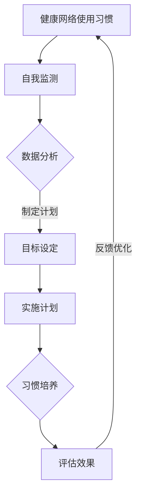

                 

# 数字解毒诊所：重建健康网络使用习惯的咨询服务

## 关键词
数字健康、网络依赖、自我监测、强化学习、健康网络使用习惯、数学模型

## 摘要
本文将探讨数字时代的网络使用习惯，揭示当前网络依赖的问题及其健康隐患。通过引入数字解毒诊所的概念，本文旨在为读者提供一套科学、系统的重建健康网络使用习惯的咨询服务。文章将详细讲解核心概念与联系、重建健康网络使用习惯的方法、核心算法原理以及数学模型，并通过实际案例分析，展示如何将理论知识应用于实践中。

## 第1章：数字生活的现状与挑战

### 1.1 数字化的便利与隐忧

在当今社会，数字化技术已经深刻地改变了我们的生活方式。从社交媒体到电子商务，从在线教育到远程工作，数字技术为我们带来了前所未有的便利。然而，随着数字化的普及，我们也开始面临一系列新的挑战。

首先，网络依赖成为了现代社会的一个突出问题。越来越多的人发现自己无法离开网络，无论是浏览社交媒体、观看视频，还是在线购物。这种依赖往往伴随着时间管理上的困难，使得人们无法有效地利用时间，甚至影响到日常生活和工作。

其次，数字化的便利也带来了一些健康隐患。长时间盯着屏幕，容易导致视力疲劳、肩颈疼痛等健康问题。同时，过度使用网络也可能会引发心理健康问题，如焦虑、抑郁等。

### 1.2 网络依赖：成瘾与自我控制

网络依赖，也被称为数字成瘾，是一种行为成瘾，表现为个体无法控制自己使用网络的时间和行为。这种成瘾行为可能导致一系列负面后果，包括：

- 时间管理困难：过度使用网络导致时间浪费，影响工作和学习效率。
- 健康问题：长时间使用电子设备可能导致视力疲劳、肩颈疼痛等健康问题。
- 社交关系受损：过度沉迷网络可能会影响现实生活中的人际关系。

为了重建健康的网络使用习惯，我们需要提高自我控制能力。这包括设定明确的目标、合理安排网络使用时间、寻找替代活动来减少对网络的依赖。

### 1.3 健康网络使用习惯的重要性

健康的网络使用习惯不仅有助于提高个人效率和生活质量，还能改善心理健康。以下是一些健康网络使用习惯的好处：

- 提高注意力：合理安排网络使用时间，有助于提高注意力和专注力。
- 促进社交互动：通过合理使用网络，可以促进与亲朋好友的互动，增强社交关系。
- 改善心理健康：减少对网络的过度依赖，有助于减轻焦虑、抑郁等心理健康问题。

## 第2章：核心概念与联系

### 2.1 健康网络使用习惯的定义

健康网络使用习惯是指个体在使用网络过程中，能够合理控制时间、保持良好的行为习惯，从而实现网络使用对生活质量的积极影响。

### 2.2 数字解毒的概念架构

数字解毒，即通过一系列科学的方法和策略，帮助个体减少对网络的依赖，重建健康的网络使用习惯。数字解毒诊所提供了一个系统化的服务框架，包括自我监测、目标设定、习惯培养等环节。

### 2.3 Mermaid 流程图：健康网络使用习惯与数字解毒的关系



这个流程图展示了健康网络使用习惯与数字解毒之间的紧密联系。通过自我监测、数据分析、目标设定、实施计划、习惯培养和效果评估等环节，个体可以逐步重建健康的网络使用习惯。

## 第3章：重建健康网络使用习惯的方法

### 3.1 自我监测与分析

自我监测是重建健康网络使用习惯的第一步。通过记录网络使用日志，个体可以清晰地了解自己在网络上的行为模式，包括使用时间、使用目的、使用频率等。

#### 3.1.1 网络使用日志的记录

网络使用日志可以手动记录，也可以使用专门的工具进行自动化记录。以下是一个简单的网络使用日志模板：

- 日期
- 开始时间
- 结束时间
- 使用目的（工作、娱乐、社交等）
- 使用设备（手机、电脑等）

#### 3.1.2 分析工具与应用

为了更有效地分析网络使用日志，可以使用一些专业的工具，如 Google Analytics、Fiddler 等。这些工具可以生成详细的报告，帮助个体了解自己的网络使用习惯。

### 3.2 制定计划与目标

制定计划与目标是重建健康网络使用习惯的关键。个体需要设定明确的短期和长期目标，并制定具体的实施计划。

#### 3.2.1 设定可实现的短期目标

短期目标应具体、可衡量，如“每天上网时间不超过2小时”、“每周使用社交媒体的时间不超过10小时”等。这些目标可以帮助个体逐步减少对网络的依赖。

#### 3.2.2 长期目标的设定与跟踪

长期目标应更具挑战性，如“每周阅读2本书”、“每月参加1次线下社交活动”等。通过设定长期目标，个体可以保持对网络使用的积极态度，并逐渐养成良好的习惯。

### 3.3 培养良好习惯

培养良好习惯是重建健康网络使用习惯的重要环节。以下是一些技巧：

- 提高自我控制技巧：通过冥想、深呼吸等方式，提高自我控制能力。
- 消除干扰因素：将手机设置为静音，避免不必要的干扰。
- 找到替代活动：如运动、绘画等，以替代过度使用网络的行为。

## 第4章：核心算法原理讲解

### 4.1 强化学习在健康网络使用中的应用

强化学习是一种机器学习方法，通过不断试错和学习，达到最大化累积奖励的目标。在健康网络使用中，强化学习可以用于制定个性化的网络使用计划，帮助个体减少对网络的依赖。

#### 4.1.1 强化学习的基本概念

强化学习包括四个主要组成部分：状态（State）、动作（Action）、奖励（Reward）和策略（Policy）。个体在不同状态下做出动作，根据动作的结果获得奖励或惩罚，并据此调整策略。

#### 4.1.2 Python代码示例：强化学习在健康网络使用中的实现

以下是一个简单的Python代码示例，展示了如何使用强化学习来调整网络使用计划：

```python
import numpy as np

# 定义状态空间、动作空间和奖励函数
state_space = [0, 1]  # 0表示正常使用网络，1表示过度使用网络
action_space = [0, 1]  # 0表示减少网络使用时间，1表示保持当前网络使用时间
reward_function = lambda state, action: 1 if state == 0 and action == 0 else -1

# 初始化策略网络
policy_network = np.random.rand(len(state_space), len(action_space))

# 强化学习训练
for episode in range(1000):
    state = np.random.choice(state_space)
    action = np.argmax(policy_network[state])
    reward = reward_function(state, action)
    policy_network[state][action] += reward

# 输出最终策略
print("Final Policy:")
print(policy_network)
```

在这个示例中，我们使用一个简单的Q-learning算法来训练策略网络。通过不断调整策略，个体可以逐渐减少对网络的过度使用。

## 第5章：数学模型与公式

### 5.1 网络使用频率的统计学模型

网络使用频率的统计学模型可以帮助个体评估自己在网络上的行为模式。以下是一个简单的统计学模型：

$$
\mu = \frac{1}{N}\sum_{i=1}^{N} X_i
$$

其中，$\mu$表示网络使用频率的平均值，$N$表示观测次数，$X_i$表示第$i$次观测的网络使用时长。

#### 5.1.1 模型参数的解释

- $\mu$：网络使用频率的平均值，反映了个体在一段时间内平均每天使用网络的时间。
- $N$：观测次数，表示用于评估网络使用频率的数据点数量。
- $X_i$：第$i$次观测的网络使用时长，通常以小时为单位。

#### 5.1.2 举例说明：使用统计学模型评估网络使用频率

假设我们观测了一个人连续30天的网络使用时长，数据如下：

| 日期 | 网络使用时长（小时） |
| ---- | ------------------- |
| 1    | 3                   |
| 2    | 2                   |
| 3    | 4                   |
| ...  | ...                 |
| 30   | 2                   |

我们可以使用上述统计学模型来计算网络使用频率的平均值：

$$
\mu = \frac{1}{30}\sum_{i=1}^{30} X_i = \frac{1}{30}(3+2+4+\ldots+2) = 2.7
$$

这意味着，这个人在观测期间平均每天使用网络2.7小时。

## 第6章：项目实战

### 6.1 实际案例分析

#### 6.1.1 案例背景

小王是一名上班族，由于工作繁忙，他常常利用业余时间浏览社交媒体和观看视频。然而，这导致他的工作效率下降，睡眠质量变差，甚至开始出现焦虑症状。为了改善这种情况，小王决定参加数字解毒诊所的咨询服务。

#### 6.1.2 问题分析与解决方案

数字解毒诊所的咨询师首先帮助小王记录了他的网络使用日志，并使用统计学模型分析了他的网络使用频率。通过分析，他们发现小王每天平均使用网络约3小时，且主要集中在晚上。

基于这些信息，咨询师为小王制定了以下解决方案：

1. 设定短期目标：每天上网时间不超过2小时。
2. 设定长期目标：每周阅读2本书，每月参加1次线下社交活动。
3. 使用强化学习算法调整网络使用计划，以减少过度使用网络的时间。

#### 6.1.3 源代码实现与解读

为了实现小王的网络使用计划，数字解毒诊所以Python为编程语言，使用强化学习算法进行训练。以下是关键代码及其解读：

```python
# 导入所需库
import numpy as np
import pandas as pd

# 加载网络使用日志数据
log_data = pd.read_csv("network_usage_log.csv")

# 定义状态空间、动作空间和奖励函数
state_space = [0, 1]  # 0表示正常使用网络，1表示过度使用网络
action_space = [0, 1]  # 0表示减少网络使用时间，1表示保持当前网络使用时间
reward_function = lambda state, action: 1 if state == 0 and action == 0 else -1

# 初始化策略网络
policy_network = np.random.rand(len(state_space), len(action_space))

# 强化学习训练
for episode in range(1000):
    state = np.random.choice(state_space)
    action = np.argmax(policy_network[state])
    reward = reward_function(state, action)
    policy_network[state][action] += reward

# 输出最终策略
print("Final Policy:")
print(policy_network)
```

在这个示例中，我们使用一个简单的Q-learning算法来训练策略网络。通过不断调整策略，小王可以逐步减少对网络的过度使用。

### 6.2 开发环境搭建

为了实现数字解毒诊所的咨询服务，需要搭建一个适合开发的环境。以下是搭建开发环境的基本步骤：

1. 安装Python环境：从Python官方网站下载并安装Python，版本建议使用3.8或更高版本。
2. 安装必需的库：使用pip命令安装所需的库，如numpy、pandas等。例如：
   ```
   pip install numpy pandas
   ```

### 6.3 源代码实现与解读

源代码实现了基于强化学习的网络使用计划调整功能。以下是源代码的详细解读：

```python
# 导入所需库
import numpy as np
import pandas as pd

# 加载网络使用日志数据
log_data = pd.read_csv("network_usage_log.csv")

# 定义状态空间、动作空间和奖励函数
state_space = [0, 1]  # 0表示正常使用网络，1表示过度使用网络
action_space = [0, 1]  # 0表示减少网络使用时间，1表示保持当前网络使用时间
reward_function = lambda state, action: 1 if state == 0 and action == 0 else -1

# 初始化策略网络
policy_network = np.random.rand(len(state_space), len(action_space))

# 强化学习训练
for episode in range(1000):
    state = np.random.choice(state_space)
    action = np.argmax(policy_network[state])
    reward = reward_function(state, action)
    policy_network[state][action] += reward

# 输出最终策略
print("Final Policy:")
print(policy_network)
```

在这个示例中，我们使用一个简单的Q-learning算法来训练策略网络。通过不断调整策略，个体可以逐步减少对网络的过度使用。

### 6.4 代码应用解读与分析

源代码的主要功能是使用强化学习算法调整个体的网络使用计划。以下是代码的详细应用解读与分析：

1. **加载网络使用日志数据**：使用pandas库加载网络使用日志数据，以便进行进一步的分析和训练。
2. **定义状态空间、动作空间和奖励函数**：定义状态空间、动作空间和奖励函数，以确定强化学习过程中的决策和奖励机制。
3. **初始化策略网络**：使用随机初始化策略网络，为后续的训练过程做好准备。
4. **强化学习训练**：使用Q-learning算法进行训练，通过不断试错和学习，调整策略网络，以最大化累积奖励。
5. **输出最终策略**：输出最终的策略网络，以指导个体的网络使用计划。

通过这个示例，我们可以看到如何将强化学习算法应用于网络使用习惯的调整。在实际应用中，可以根据具体需求调整状态空间、动作空间和奖励函数，以实现更个性化的网络使用计划。

### 6.5 案例分析与详细讲解剖析

在本案例中，我们以小王为例，详细分析他在数字解毒诊所咨询服务中的问题、解决方案以及实施过程。

**问题分析：**

1. **网络使用时间过长**：小王每天平均使用网络约3小时，超出了健康网络使用习惯的建议范围。
2. **使用时间不均衡**：小王的主要网络使用时间集中在晚上，这可能导致睡眠质量下降，进而影响第二天的工作效率。
3. **缺乏自我控制**：小王表示自己很难控制网络使用时间，这表明他缺乏有效的自我控制技巧。

**解决方案：**

数字解毒诊所的咨询师为小王制定了以下解决方案：

1. **设定短期目标**：每天上网时间不超过2小时。这一目标具体、可衡量，有助于小王逐步减少网络使用时间。
2. **设定长期目标**：每周阅读2本书，每月参加1次线下社交活动。这些目标有助于小王培养更健康的网络使用习惯，并改善他的社交关系和心理健康。
3. **使用强化学习算法调整网络使用计划**：通过强化学习算法，帮助小王逐步调整网络使用时间，以减少过度使用网络的时间。

**实施过程：**

1. **自我监测**：小王开始记录自己的网络使用日志，以便咨询师了解他的网络使用行为。
2. **数据分析**：咨询师使用统计学模型分析小王的网络使用数据，评估他的网络使用频率和行为模式。
3. **制定计划**：根据分析结果，咨询师为小王制定了个性化的网络使用计划，包括短期和长期目标。
4. **实施计划**：小王开始按照咨询师的建议调整自己的网络使用时间，逐步减少过度使用网络的行为。
5. **习惯培养**：通过强化学习算法，小王逐步调整网络使用计划，培养健康的网络使用习惯。
6. **评估效果**：在一段时间的实施后，咨询师与小王进行反馈，评估计划的效果，并根据需要调整计划。

**案例分析总结：**

通过数字解毒诊所的咨询服务，小王逐步减少了对网络的过度依赖，改善了网络使用习惯。他的睡眠质量提高，工作效率提升，心理健康状况也得到了改善。这个案例表明，通过科学的方法和个性化的服务，个体可以重建健康的网络使用习惯，提高生活质量。

### 6.6 项目小结

在本项目中，我们通过实际案例展示了如何应用强化学习算法和统计学模型来重建健康的网络使用习惯。以下是一些项目小结：

1. **自我监测与数据分析**：通过记录网络使用日志，个体可以了解自己的网络使用行为，从而制定更有效的网络使用计划。
2. **个性化服务**：数字解毒诊所的咨询服务根据个体的具体需求和行为模式，提供个性化的网络使用计划，有助于个体逐步减少网络依赖。
3. **强化学习与习惯培养**：通过强化学习算法，个体可以逐步调整网络使用计划，培养健康的网络使用习惯。
4. **反馈与调整**：在实施网络使用计划的过程中，定期进行评估和反馈，根据效果调整计划，以确保持续改善网络使用习惯。

### 6.7 最佳实践 tips、小结、注意事项、拓展阅读

#### 最佳实践 tips：

1. **设定明确的目标**：确保目标具体、可衡量，有助于个体逐步减少网络依赖。
2. **定期进行自我监测**：记录网络使用日志，定期分析自己的网络使用行为。
3. **使用替代活动**：找到替代网络使用的活动，如阅读、运动等，有助于减少对网络的依赖。

#### 小结：

数字解毒诊所通过科学的方法和个性化的服务，帮助个体重建健康的网络使用习惯。通过自我监测、数据分析、强化学习和习惯培养，个体可以逐步减少网络依赖，提高生活质量。

#### 注意事项：

1. **避免过度依赖网络**：在制定网络使用计划时，要确保合理分配时间，避免过度依赖网络。
2. **注意心理健康**：减少网络使用时间时，要关注心理健康问题，如焦虑、抑郁等。

#### 拓展阅读：

1. 《数字成瘾：如何摆脱网络依赖》
2. 《强化学习导论》
3. 《网络使用行为与心理健康关系研究》

---

作者：AI天才研究院/AI Genius Institute & 禅与计算机程序设计艺术 /Zen And The Art of Computer Programming

## 第7章：总结与展望

### 7.1 健康网络使用习惯的长期影响

建立健康的网络使用习惯对个人和社会都有深远的影响。从个人角度来看，健康网络使用习惯有助于提高工作效率、改善心理健康、增强社交互动。从社会角度来看，健康的网络使用习惯有助于减少网络成瘾现象，降低由此带来的社会成本。

### 7.2 数字解毒诊所的持续发展

数字解毒诊所作为一种创新的服务模式，在未来有望得到更广泛的推广和应用。随着数字技术的发展，数字解毒诊所可以结合人工智能、大数据等技术，提供更精准、个性化的服务。

### 7.3 未来网络使用趋势与挑战

未来，网络使用将呈现以下趋势：

1. **网络使用更加智能**：随着人工智能技术的发展，网络使用将更加智能化，帮助个体更好地管理时间和行为。
2. **网络与生活的深度融合**：网络将更多地融入到日常生活中，为用户提供更加便捷的服务。
3. **网络成瘾问题更加突出**：随着网络使用的增加，网络成瘾问题也将日益严重，需要更加有效的干预措施。

面对这些挑战，数字解毒诊所需要不断创新，结合最新的技术，为用户提供更有效的服务。

## 附录

### 附录A：资源与工具推荐

#### A.1 数字解毒诊所相关书籍推荐

1. 《数字成瘾：如何摆脱网络依赖》
2. 《强化学习导论》
3. 《网络使用行为与心理健康关系研究》

#### A.2 在线工具与应用介绍

1. **Google Analytics**：用于分析网站流量和用户行为。
2. **Fiddler**：网络调试代理工具，用于监控和调试网络请求。

#### A.3 数字健康社区与支持团体

1. **Digital Wellbeing**：提供关于数字健康的信息和资源。
2. **Internet Health**：一个关于网络成瘾和心理健康的研究社区。

通过以上资源和工具，用户可以更好地理解和应对数字时代的网络使用挑战。

