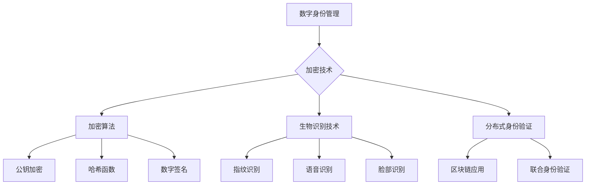

                 

### 背景介绍

在当今数字化时代，互联网、移动设备以及各类在线服务的广泛应用，使得数字身份管理成为了个人和社会关注的重要议题。数字身份管理不仅涉及到个人隐私和数据安全，还关系到商业交易、社会信任、公共管理等多个方面。传统的身份验证方式，如用户名和密码，已难以应对日益复杂的网络安全威胁，因此，如何实现高效、安全且灵活的数字身份管理，成为了亟待解决的问题。

**数字身份管理**，简单来说，是指对个体在数字世界中的身份进行识别、验证和管理的全过程。它旨在确保只有授权用户才能访问受保护的资源和服务，同时保护用户的隐私和数据不被未经授权的访问或泄露。数字身份管理的重要性体现在以下几个方面：

1. **安全性提升**：通过采用高级加密技术和多因素认证，数字身份管理可以显著提高用户账号的安全性，减少因密码泄露或恶意攻击导致的身份盗用风险。
   
2. **隐私保护**：在数字身份管理中，通过数据最小化和用户控制，可以有效减少个人信息的暴露，增强隐私保护。

3. **业务流程优化**：数字身份管理能够简化用户认证过程，减少冗长的登录和验证步骤，从而提升用户体验，优化业务流程。

本文将系统地探讨数字身份管理的概念与重要性，详细介绍其技术基础，分析面临的挑战与解决方案，并进一步探讨如何在虚拟世界中通过数字身份管理策略来塑造个人品牌。

### 核心概念与联系

在深入探讨数字身份管理之前，有必要明确几个核心概念，并分析它们之间的联系。这些概念包括加密技术、生物识别技术和分布式身份验证等，它们构成了数字身份管理的技术基础。

**加密技术**：加密技术是数字身份管理中不可或缺的一部分。通过加密，可以确保数据的机密性和完整性。加密技术的基本原理是利用算法将明文数据转换成密文，只有掌握正确密钥的接收者才能解密并访问原始数据。

- **公钥与私钥加密**：这是一种非对称加密方式，使用一对密钥——公钥和私钥。公钥用于加密，私钥用于解密。这种加密方式不仅提供了数据传输的机密性，还支持数字签名和认证。
- **哈希函数的使用**：哈希函数将任意长度的输入数据映射为固定长度的输出数据。在数字身份管理中，哈希函数用于生成唯一的数据指纹，确保数据的完整性。常见的哈希函数包括SHA-256、MD5和RSA。
- **数字签名**：数字签名是一种基于加密技术的验证方法，用于确认消息的发送者身份和完整性。发送者使用私钥对消息进行签名，接收者使用公钥验证签名。

**生物识别技术**：生物识别技术利用人类生物特征的独特性进行身份识别和验证。这种技术不仅提供了高度的个性化验证，还降低了伪造和盗用的风险。

- **指纹识别**：指纹识别是最常用的生物识别技术之一。通过扫描或捕捉指纹图像，系统能够识别并验证用户的身份。
- **语音识别**：语音识别技术通过分析用户的语音特征进行身份验证。这种方法特别适用于无法使用物理设备进行身份验证的场合。
- **脸部识别**：脸部识别技术通过捕捉和识别用户的面部特征进行身份验证。随着深度学习算法的发展，脸部识别的准确性和实用性得到了显著提升。

**分布式身份验证**：分布式身份验证是一种去中心化的身份验证机制，通过多个节点或服务共同验证用户身份，提高了系统的安全性和灵活性。

- **区块链技术在身份验证中的应用**：区块链技术提供了去中心化、不可篡改的数据存储和验证机制，适合用于分布式身份验证。通过区块链，用户的身份信息可以在多个节点间共享和验证，确保数据的透明性和安全性。
- **联合身份验证机制**：联合身份验证机制允许用户在不同服务间使用相同的身份验证方法，提高了用户体验。通过建立信任链，用户无需在每个服务中重复注册和验证。

综上所述，加密技术、生物识别技术和分布式身份验证共同构成了数字身份管理的技术基础。它们不仅提高了身份验证的安全性和准确性，还促进了业务流程的优化和用户体验的提升。

#### 数字身份管理的重要性

数字身份管理在当今信息化社会中具有举足轻重的地位，其原因主要体现在以下几个方面。

首先，从提高安全性的角度考虑，数字身份管理提供了强大的保障。传统的用户名和密码认证方式已经难以抵御日益复杂的网络攻击，如密码破解、社交工程和网络钓鱼等。通过引入高级加密技术，如公钥与私钥加密和哈希函数，数字身份管理确保了用户数据的机密性和完整性。此外，多因素认证（MFA）的引入，如生物识别技术（如指纹识别和脸部识别）和一次性密码（OTP），进一步提升了账号的安全性，减少了因单一密码泄露而导致的安全风险。

其次，数字身份管理在保障隐私保护方面也发挥了重要作用。在互联网上，用户的个人信息和数据经常被各种服务收集和存储，容易成为隐私泄露的目标。数字身份管理通过数据最小化和透明度原则，最大限度地减少了个人信息的暴露。例如，数据最小化原则要求仅收集和存储必要的信息，而透明度原则则要求用户了解自己的数据被如何使用和保护。此外，用户控制机制，如权限设置和访问日志审计，使得用户可以更有效地管理自己的数据，增强了对隐私的掌控。

最后，数字身份管理有助于促进业务流程的优化。传统的身份验证方式常常涉及复杂的登录流程和多重认证步骤，这不仅降低了用户体验，还增加了业务操作的成本。通过数字身份管理，企业可以实现单点登录（SSO），简化用户的认证过程，提高工作效率。此外，数字身份管理还可以实现自动化身份验证，减少人工干预，提高业务流程的自动化水平，从而降低运营成本。

总之，数字身份管理在安全性、隐私保护和业务流程优化等方面具有重要的价值和作用，是现代信息化社会中不可或缺的一环。

### 数字身份管理的技术基础

数字身份管理依赖于多种技术手段，其中加密技术、生物识别技术和分布式身份验证是三大核心技术，它们共同构成了数字身份管理的基石。

**加密技术**：加密技术在数字身份管理中起着至关重要的作用。它确保数据在传输和存储过程中的安全性，防止数据被未经授权的访问或篡改。主要的加密技术包括：

- **公钥与私钥加密**：这是一种非对称加密方式，使用一对密钥——公钥和私钥。公钥用于加密，私钥用于解密。通过这种方式，可以确保数据的机密性，同时支持数字签名和认证。例如，SSL/TLS协议就是基于公钥加密技术来保护网络通信的安全。

- **哈希函数的使用**：哈希函数将任意长度的输入数据映射为固定长度的输出数据，生成数据指纹。常见的哈希函数包括SHA-256、MD5和RSA。哈希函数在数字身份管理中用于验证数据的完整性和唯一性。例如，SHA-256常用于生成数字签名和确保区块链数据的完整性。

- **数字签名**：数字签名是一种基于加密技术的验证方法，用于确认消息的发送者身份和完整性。发送者使用私钥对消息进行签名，接收者使用公钥验证签名。这种方法不仅确保了消息的真实性，还防止了消息的篡改。例如，数字证书就是基于数字签名技术来实现身份认证和数据加密。

**生物识别技术**：生物识别技术利用人类生物特征的独特性进行身份识别和验证，提供了一种高度个性化的验证方式，减少了伪造和盗用的风险。主要的生物识别技术包括：

- **指纹识别**：指纹识别是通过扫描或捕捉用户的指纹图像，然后与数据库中的指纹模板进行比对，以确认用户身份。指纹识别具有高准确性和低成本，因此在许多场景中得到了广泛应用。

- **语音识别**：语音识别技术通过分析用户的语音特征进行身份验证。这种方法特别适用于无法使用物理设备进行身份验证的场合，例如电话银行服务。

- **脸部识别**：脸部识别技术通过捕捉和识别用户的面部特征进行身份验证。随着深度学习算法的发展，脸部识别的准确性和实用性得到了显著提升。例如，智能手机上的面部解锁功能就是基于脸部识别技术。

**分布式身份验证**：分布式身份验证是一种去中心化的身份验证机制，通过多个节点或服务共同验证用户身份，提高了系统的安全性和灵活性。主要的分布式身份验证技术包括：

- **区块链技术在身份验证中的应用**：区块链技术提供了去中心化、不可篡改的数据存储和验证机制，适合用于分布式身份验证。通过区块链，用户的身份信息可以在多个节点间共享和验证，确保数据的透明性和安全性。例如，比特币网络就是基于区块链技术进行身份验证和数据加密。

- **联合身份验证机制**：联合身份验证机制允许用户在不同服务间使用相同的身份验证方法，提高了用户体验。通过建立信任链，用户无需在每个服务中重复注册和验证，从而简化了身份验证过程。例如，OAuth协议就是一种联合身份验证机制，它允许用户使用第三方账号（如Google或Facebook）登录多个服务。

综上所述，加密技术、生物识别技术和分布式身份验证是数字身份管理的关键技术基础。它们不仅提供了强大的安全保障，还提高了身份验证的准确性和灵活性，为构建高效、安全的数字身份管理系统奠定了基础。

### 数字身份管理的挑战与解决方案

在实现数字身份管理的过程中，面临着诸多挑战，其中最为显著的是安全风险和隐私保护问题。为了应对这些挑战，本文将详细探讨几种常见的解决方案。

#### 安全风险

**数据泄露风险**：在数字世界中，数据泄露是一个常见且严重的安全问题。黑客可以通过多种手段获取用户的敏感信息，例如通过SQL注入、跨站脚本（XSS）攻击或利用弱密码等。为了降低数据泄露的风险，可以采取以下措施：

1. **数据加密**：使用高级加密技术对存储和传输中的数据进行加密，确保即使数据被非法访问，也无法被解读。常用的加密技术包括对称加密（如AES）和非对称加密（如RSA）。
   
2. **访问控制**：通过实施严格的访问控制策略，限制对敏感数据的访问权限。例如，基于角色的访问控制（RBAC）和基于属性的访问控制（ABAC）。

3. **漏洞扫描与安全审计**：定期进行漏洞扫描和安全审计，发现并修补系统中的安全漏洞，降低被攻击的风险。

**网络钓鱼攻击**：网络钓鱼攻击是另一种常见的网络安全威胁，通过伪造合法的网站或邮件，诱骗用户输入密码或其他敏感信息。为了防范网络钓鱼攻击，可以采取以下措施：

1. **多因素认证**：引入多因素认证（MFA），如验证码、手机短信、生物识别等，确保只有合法用户才能访问系统。

2. **安全意识培训**：提高用户的安全意识，教育用户如何识别和防范网络钓鱼攻击。

3. **安全防护工具**：使用反钓鱼软件和邮件过滤工具，实时监测和拦截钓鱼邮件和链接。

**身份盗用的预防措施**：身份盗用是数字身份管理中的另一个重大威胁，黑客可以通过盗取用户身份信息进行欺诈或非法活动。为了预防身份盗用，可以采取以下措施：

1. **强密码策略**：鼓励用户使用强密码，并结合定期密码更新策略。

2. **身份验证协议**：采用安全的身份验证协议，如OAuth 2.0和OpenID Connect，确保用户身份的合法性。

3. **用户行为分析**：通过分析用户的行为模式，实时监测并预警异常行为，及时采取措施防止身份盗用。

#### 隐私保护

**数据最小化原则**：在收集用户数据时，遵循数据最小化原则，仅收集和存储必要的信息，避免过度收集。

**透明度与用户控制**：用户应有权了解其数据的使用情况和保护措施，并通过用户界面进行数据访问和隐私设置。

**隐私政策的设计**：制定清晰的隐私政策，明确告知用户数据收集、存储、使用和分享的方式，确保用户对个人数据的知情权和控制权。

**安全审计与合规性**：定期进行安全审计，确保数字身份管理系统的合规性，遵守相关的法律法规和标准，如GDPR和CCPA。

综上所述，数字身份管理面临的安全风险和隐私保护挑战需要通过多种技术和管理措施相结合来应对。通过加强安全意识、实施多因素认证、数据加密和隐私政策设计等措施，可以显著提高数字身份管理的安全性和隐私保护水平。

### 个人品牌定位与规划

在数字时代，个人品牌塑造成为个体在虚拟世界中赢得关注和信任的关键策略。成功的个人品牌不仅能够提升个人知名度，还能带来商业机会和职业发展。因此，明确个人品牌定位并制定合理的规划至关重要。

**个人品牌的定义与价值**

个人品牌，指的是个人在公众面前的形象和声誉。它不仅仅是一个标志或口号，而是个人价值观、专业知识、技能和人格特质的综合体现。个人品牌的价值在于：

1. **增强信任度**：一个清晰、一致的个人品牌能够增强公众对个体的信任，尤其是在商业和职业环境中。
2. **提高知名度**：通过有效的品牌塑造，个人能够在目标受众中建立高的知名度，从而扩大影响力。
3. **创造商业机会**：个人品牌是吸引合作伙伴、投资者和客户的强大工具，有助于打开商业机会的大门。
4. **职业发展**：强大的个人品牌能够为职业晋升和领导力的培养提供有力支持。

**个人品牌定位分析**

成功塑造个人品牌的第一步是进行定位分析。这包括以下几个关键步骤：

1. **自我评估**：首先，个人需要深入理解自己的专业知识、技能、优点和独特性。这可以通过反思过去的经历、成就和反馈来实现。

2. **目标受众分析**：明确目标受众是关键。了解他们的需求和期望，可以帮助个人品牌定位更准确，内容更具针对性。

3. **竞争对手分析**：研究竞争对手的个人品牌，了解他们的优势和不足，找到差异化的定位点，从而在市场中脱颖而出。

**个人品牌规划**

一旦定位分析完成，接下来是制定个人品牌规划。以下是几个关键步骤：

1. **品牌愿景与使命**：明确个人品牌的长期愿景和使命，这将为品牌定位提供方向和指导。

2. **核心价值观**：确定几个核心价值观，它们将成为个人行为和决策的基准。

3. **品牌口号与标语**：设计简洁、有力且容易记忆的品牌口号和标语，帮助个人快速传达品牌核心价值。

4. **品牌视觉元素**：包括标志、配色方案和字体等，这些元素应与品牌定位和价值观一致。

5. **内容策略**：制定内容创作和发布计划，包括博客、视频、社交媒体等，确保内容与品牌定位和目标受众相契合。

**案例**：以知名科技博主为例，他通过以下步骤成功塑造了个人品牌：

- **自我评估**：他专注于人工智能和机器学习领域，拥有丰富的项目经验和多篇高影响力的论文。
- **目标受众**：确定了自己在科技行业内的专业受众，包括研究人员、工程师和企业家。
- **竞争对手分析**：研究其他知名科技博主，发现他们的内容更注重技术细节，而他更关注实际应用和行业趋势。
- **品牌愿景与使命**：设定了愿景为成为人工智能领域的权威专家，使命是传播知识，推动技术进步。
- **核心价值观**：选择“创新、实用、真实”作为核心价值观。
- **品牌口号与标语**：“人工智能，真实应用，引领未来。”
- **品牌视觉元素**：标志采用蓝色和白色，代表科技和清新，字体选择简洁、现代的设计。
- **内容策略**：定期发布高质量的博客文章、视频教程和行业报告，注重内容实用性和行业趋势分析。

通过这些步骤，他成功塑造了个人品牌，赢得了大量粉丝和行业内的高度认可。

### 内容创作策略

在个人品牌塑造过程中，内容创作是一个至关重要的环节。通过精心策划和高质量的内容，个人品牌能够更好地传递其核心价值，吸引并留住目标受众。以下是一些关键策略：

**内容类型选择**：个人品牌的内容类型应该多样化，以满足不同受众的需求和兴趣。常见的类型包括：

1. **博客文章**：博客是传递深入知识和专业见解的重要渠道。文章可以涵盖技术深入解析、行业趋势分析、案例分析等。
2. **视频教程**：视频教程具有直观、生动的特点，特别适合演示复杂的技术过程或实际操作。可以通过视频分享技术实现、项目教程、行业见解等。
3. **播客**：播客是另一种受欢迎的内容形式，可以通过对话、访谈或单人讲述的形式，分享深度见解和故事。
4. **社交媒体帖子**：社交媒体帖子应简洁明了，适合快速阅读和分享。可以包括行业新闻、生活点滴、专业见解等。
5. **白皮书与报告**：针对特定主题或项目，撰写详尽的白皮书或报告，展示专业能力和深入洞察。

**内容质量保证**：高质量的内容是个人品牌的基石。以下措施有助于提升内容质量：

1. **内容策划**：在创作内容前，进行详细的策划和定位。明确内容的目的、受众和预期效果。
2. **深入研究**：确保内容的准确性、深度和实用性。对于技术文章，深入了解相关技术原理和最新发展。
3. **编辑与校对**：内容发布前，进行严格的编辑和校对，确保无错别字、语法错误和逻辑不通。
4. **用户体验**：关注用户体验，确保内容易于阅读和理解。使用适当的标题、段落分隔、图表和代码示例等。

**内容传播渠道**：选择合适的内容传播渠道，可以最大化内容的触达效果。以下是一些常见的传播渠道：

1. **官方网站或博客**：个人官方网站或博客是内容发布和展示的主阵地。通过SEO优化，提高内容在搜索引擎中的排名。
2. **社交媒体**：社交媒体平台如Twitter、LinkedIn、Facebook、Instagram等，是传播内容、吸引粉丝的重要渠道。根据目标受众的特点选择合适的平台。
3. **行业论坛和社区**：参与专业论坛和社区，发布高质量内容，参与讨论，建立专业声誉。
4. **合作伙伴和媒体**：与相关领域的合作伙伴和媒体建立联系，通过合作发布内容，扩大影响范围。
5. **电子邮件营销**：建立邮件订阅列表，定期发送内容更新和专题报告，保持与受众的长期联系。

通过上述策略，个人品牌能够有效地创作并传播高质量的内容，建立强大的专业声誉，吸引并留住目标受众。

### 社交媒体运用

在数字时代，社交媒体已经成为了个人品牌塑造的重要工具。通过精心策划和策略性的社交媒体运用，个人品牌可以有效地提升知名度、增强影响力并吸引目标受众。以下是一些关键的社交媒体运用策略：

**不同平台的特点与运用**：社交媒体平台各有其独特的特点和用户群体，因此，针对不同的平台，需要采取相应的策略：

- **Twitter**：Twitter是一个实时新闻和讨论的平台，适合快速传播新闻、行业动态和观点。个人品牌可以通过发布简短的推文、参与话题讨论和跟进热点话题来提高曝光度。
- **LinkedIn**：LinkedIn是一个专业的社交网络平台，适合建立职业形象、分享专业知识和行业见解。个人品牌可以通过发布专业文章、参与行业讨论和建立专业联系来增强专业声誉。
- **Facebook**：Facebook拥有广泛的用户群体，适合发布多样化的内容，如图片、视频和文字。个人品牌可以通过创建粉丝页、分享生活点滴和专业内容来建立与受众的互动。
- **Instagram**：Instagram是一个以图片和视频为主的平台，适合展示创意和视觉内容。个人品牌可以通过发布高质量的图片和视频、使用相关标签和参与挑战来吸引关注。
- **YouTube**：YouTube是一个视频内容平台，适合发布教程、演示和访谈等视频内容。个人品牌可以通过制作高质量的视频、优化视频标题和描述来增加观看和订阅量。

**社交媒体营销策略**：在社交媒体上有效地进行个人品牌营销，需要遵循以下策略：

- **内容多样化**：发布多样化的内容，包括文字、图片、视频等，以满足不同受众的喜好。同时，定期更新内容，保持活跃度。
- **互动与参与**：积极参与社交媒体上的讨论，回复评论和私信，与受众建立互动。这不仅能够增强受众的参与感，还能提升品牌的亲和力。
- **故事化**：通过讲述个人的故事和专业经历，使品牌更具人性化和吸引力。故事化内容能够更好地传达品牌的核心理念和价值观。
- **目标受众分析**：深入了解目标受众的兴趣、需求和偏好，根据受众特点制定内容策略和发布计划。
- **KOL与品牌合作**：与意见领袖（Key Opinion Leader，KOL）或行业专家合作，通过他们的推荐和分享来扩大品牌的影响力。

**社交媒体数据分析**：通过数据分析，个人品牌可以评估社交媒体营销的效果，并据此调整策略：

- **粉丝行为分析**：分析粉丝的互动行为，如点赞、评论和分享，了解受众的兴趣和偏好。
- **内容表现分析**：评估不同类型和主题的内容的表现，确定哪些内容更受欢迎，哪些需要改进。
- **受众属性分析**：了解粉丝的年龄、性别、地理位置和兴趣等属性，优化内容和营销策略。
- **渠道效果评估**：比较不同社交媒体平台的性能，确定哪些平台对品牌传播最为有效，调整资源分配。

通过上述策略，个人品牌能够在社交媒体上建立强大的影响力，吸引并留住目标受众，实现长期的品牌价值增长。

### 个人品牌形象建设

在数字世界中，个人品牌形象建设是塑造个人声誉和影响力的重要步骤。一个成功的个人品牌形象不仅能够增强信任度，还能提升知名度，从而在职业和商业领域获得更多机会。以下是从线上和线下两个方面进行个人品牌形象建设的详细步骤。

#### 线上形象管理

**社交媒体形象**：社交媒体是个人品牌形象的重要展示平台。以下是几个关键步骤：

1. **统一头像和封面**：使用统一的头像和封面，确保品牌一致性。头像应清晰、专业，而封面则可以展示个人或品牌的核心价值。
2. **完善个人资料**：确保个人资料的完整和准确，包括姓名、职业、工作经历、教育背景等。使用专业的个人照片，避免使用模糊或不恰当的照片。
3. **定期更新内容**：保持活跃度，定期发布高质量的内容，如博客文章、视频、行业新闻、专业见解等。这有助于维持受众的关注并展示专业能力。
4. **互动与沟通**：积极与粉丝和评论者互动，回复评论和私信，建立良好的沟通和关系。这不仅能够增强粉丝的参与感，还能提升品牌的亲和力。
5. **使用关键词和标签**：在发布内容时使用相关的关键词和标签，提高内容的可见性和搜索排名。例如，在LinkedIn上使用行业关键词和技能标签，帮助潜在雇主或合作伙伴找到。

**网站和博客**：个人网站或博客是个人品牌的重要基础。以下是几个关键步骤：

1. **专业设计**：选择简洁、专业的网站设计，确保网站加载速度快、用户体验良好。使用统一的品牌色彩和字体，保持品牌一致性。
2. **内容丰富**：定期发布高质量、有价值的文章，涵盖专业领域、行业趋势、项目经验等。确保内容原创、准确且具有深度。
3. **SEO优化**：通过搜索引擎优化（SEO）提高网站在搜索引擎中的排名。优化关键词、元标签和内部链接，确保内容易于被搜索引擎索引。
4. **多平台整合**：将社交媒体和个人网站或博客整合，例如，在博客文章中添加社交媒体分享按钮，鼓励受众分享和传播内容。

#### 线下形象管理

**职业形象**：在职业环境中，良好的职业形象能够增强信任度和专业性。以下是几个关键步骤：

1. **专业服饰**：根据职业性质和场合选择适当的服饰，确保整洁、得体。例如，在商务场合，可以选择正装；而在创意行业，可以选择休闲但不失专业的服装。
2. **仪表整洁**：保持仪表整洁，包括发型、指甲和化妆等。一个整洁的外表能够给人留下良好的第一印象。
3. **沟通技巧**：培养良好的沟通技巧，包括清晰、礼貌、自信的表达能力。有效的沟通能够增强个人的专业形象。
4. **专业资质**：展示专业资质和证书，如学位、认证和荣誉，这些能够证明个人的专业能力和成就。

**公共演讲**：公共演讲是提升个人品牌形象的重要方式。以下是几个关键步骤：

1. **准备充分**：提前准备演讲稿，确保内容充实、逻辑清晰。包括开场白、主体内容和结论等。
2. **表达自信**：在演讲中保持自信，使用清晰、有力的语言表达观点。适当的肢体语言和表情能够增强演讲的感染力。
3. **互动与问答**：在演讲过程中鼓励观众提问，与观众互动，增加演讲的互动性和参与感。
4. **后续跟进**：演讲结束后，及时发送感谢邮件或联系表单，邀请观众提供反馈或进一步交流，增强个人品牌的影响力。

通过上述在线和线下形象管理步骤，个人品牌能够在数字和现实世界中建立一致、专业的形象，增强信任度和影响力，从而在职业和商业领域获得更多的机会和成功。

#### 品牌合作与联盟

品牌合作与联盟是个人品牌建设中的一种重要策略，通过与其他品牌或个体合作，可以实现资源共享、优势互补，从而提升个人品牌的知名度和影响力。以下是一些关键的策略和注意事项：

**品牌合作策略**

1. **目标选择**：选择与个人品牌定位和价值观相符的品牌进行合作。确保合作双方的目标受众和品牌形象具有一致性，以提高合作的效果。
2. **价值交换**：在合作过程中，明确双方的价值交换点，例如，资源互补、内容合作、推广支持等。通过相互提供价值，建立长期稳定的合作关系。
3. **合作形式**：根据合作目标和资源，选择合适的合作形式，如共同举办活动、内容合作、联合推广等。多样化的合作形式可以更好地满足不同品牌的需求。

**联盟建立与维护**

1. **沟通与信任**：建立合作联盟的第一步是建立良好的沟通渠道和信任关系。定期举行会议，讨论合作进展、问题和解决方案，确保双方在合作过程中保持一致。
2. **资源共享**：通过联盟，共享资源和信息，提高合作效率。例如，共享客户资源、市场数据、技术资源等，实现优势互补。
3. **利益分配**：明确合作联盟中的利益分配机制，确保合作双方的利益得到公平对待。合理分配收益和风险，避免因利益冲突导致合作关系破裂。
4. **风险管理**：合作过程中，可能面临各种风险，如市场变化、合作伙伴问题等。建立风险预警和应对机制，及时解决合作中的问题，确保合作的稳定性和可持续性。

**注意事项**

1. **品牌一致性**：在合作过程中，确保品牌形象和价值观的一致性，避免因合作而损害个人品牌形象。
2. **透明度**：保持合作过程的透明度，及时向合作方提供信息，确保合作的公平性和信任。
3. **长期规划**：合作不仅仅是短期的项目，而是一个长期的过程。因此，需要制定长期规划，确保合作的持续性和效果。

通过有效的品牌合作与联盟，个人品牌可以在更广泛的范围内获得认可和影响力，实现品牌的快速提升和长期发展。

### 个人品牌危机管理

个人品牌在发展过程中难免会遇到危机，如负面报道、争议事件或数据泄露等。如何预判危机、制定应对策略以及危机后的重建，是每位品牌建设者必须掌握的技能。以下是一套系统的危机管理流程和策略。

#### 危机预判与预警

1. **市场监测**：定期监测社交媒体、新闻报道、行业论坛等渠道，了解公众对品牌的看法和潜在的风险。通过关键词搜索、趋势分析等方法，发现可能引发危机的信号。
2. **数据分析**：利用数据分析工具，对用户的反馈和行为进行分析，识别异常模式或潜在问题。例如，用户投诉激增、负面评论增加等，都可能预示着危机的到来。
3. **内部沟通**：建立高效的内部沟通机制，确保各部门和团队成员能够及时共享信息和预警。定期召开危机管理会议，讨论可能的危机场景和应对措施。

#### 危机应对策略

1. **快速响应**：危机爆发时，立即启动危机应对机制，迅速采取措施。及时发布声明或回应，表明态度并传达解决方案，以控制事态发展。
2. **公开透明**：保持信息公开透明，及时向公众通报危机进展和应对措施。通过新闻发布会、社交媒体声明、官方网站等方式，确保信息的准确传播。
3. **团队协作**：危机应对需要团队协作，各部门协同工作，确保行动的一致性和协调性。例如，公关部门负责对外沟通，技术部门负责解决问题，法务部门负责法律咨询等。
4. **法律手段**：在必要时，采取法律手段保护个人品牌，如申请侵权投诉、提起诉讼等。法律手段可以在危机中为品牌提供有力支持。

#### 危机后的重建

1. **反思与总结**：危机过后，进行深入的反思和总结，分析危机发生的根本原因、应对过程中的不足和改进措施。从经验中吸取教训，为未来做好准备。
2. **改进措施**：根据总结的结果，制定具体的改进措施，如加强内部培训、完善危机应对流程、提升风险管理能力等。
3. **重塑信任**：通过积极采取措施恢复公众对品牌的信任。例如，公开整改措施、加强与公众的沟通、提供高质量的服务等。
4. **宣传推广**：借助媒体和社交媒体，宣传品牌的改进成果和正面信息，重塑品牌形象。通过高质量的内容和活动，重新赢得公众的认可和支持。

#### 案例分析

**案例一：特斯拉数据泄露事件**

2020年，特斯拉发生了用户数据泄露事件，导致数百万客户的个人信息被泄露。特斯拉的危机应对策略如下：

1. **快速响应**：事件曝光后，特斯拉立即发布声明，承认数据泄露并致以诚挚道歉。
2. **透明通报**：特斯拉公开了数据泄露的具体情况和影响范围，并及时更新进展，确保信息的透明度。
3. **团队协作**：特斯拉的技术团队迅速行动，修补漏洞，防止进一步的数据泄露。
4. **重塑信任**：特斯拉采取了一系列措施，如增加数据保护投入、加强内部数据安全培训等，以恢复公众对品牌的信任。

**案例二：亚马逊品牌危机**

2018年，亚马逊在上市一款智能音箱时，因语音助手Alexa误报警察暴力执法事件，引发公众愤怒。亚马逊的应对策略如下：

1. **快速回应**：亚马逊迅速发表声明，承认错误并道歉，表示将加强对Alexa语音助手的审核和监管。
2. **公开透明**：亚马逊公开了事件的详细调查结果，并宣布了改进措施，如增加人工审核环节。
3. **团队协作**：亚马逊的技术和公关团队紧密合作，确保危机应对措施得到有效执行。
4. **重塑形象**：亚马逊通过一系列公关活动，如发布社会责任报告、加强与社区的合作等，重塑品牌形象。

通过上述案例可以看出，有效的危机管理需要快速响应、透明通报、团队协作和重塑信任。在危机过后，通过反思和改进措施，个人品牌可以重新获得公众的认可和支持。

### 数字身份管理的发展趋势

随着技术的不断进步和互联网的深入普及，数字身份管理领域正经历着一系列重要的变化和发展趋势。以下是对这些趋势的详细分析：

#### 新技术的影响

**人工智能（AI）**：人工智能在数字身份管理中的应用日益广泛，特别是在身份验证和风险分析方面。AI可以通过分析用户行为模式、识别异常活动来提高身份验证的准确性和安全性。例如，机器学习算法可以实时监测用户的登录行为，发现潜在的欺诈行为并及时采取措施。

**区块链技术**：区块链技术以其去中心化、不可篡改的特性，在数字身份管理中展现了巨大的潜力。通过区块链，用户可以拥有一个安全的、可验证的身份，且身份信息在多个节点间共享，提高了数据的安全性和隐私保护。此外，智能合约技术也被应用于身份验证和权限管理，确保操作的透明和不可逆。

**生物识别技术**：生物识别技术在数字身份管理中的应用不断成熟，如指纹识别、虹膜识别和面部识别等。这些技术提供了高准确性和用户友好的身份验证方式，特别适用于移动设备和物联网环境。

**零知识证明**：零知识证明（Zero-Knowledge Proof）是一种新型加密技术，允许一方在不透露任何具体信息的情况下，证明某个陈述是真实的。在数字身份管理中，零知识证明可以用于隐私保护，使得用户在验证身份时无需暴露敏感信息。

#### 法规与政策的变化

**全球法规趋严**：随着数字身份管理的重要性日益凸显，全球范围内对数字身份和数据保护的法规越来越严格。例如，欧盟的通用数据保护条例（GDPR）要求企业严格保护用户数据，确保数据隐私和透明度。类似的法律和法规在全球范围内逐渐推广，对数字身份管理提出了更高的要求。

**身份认证标准化**：为了提高数字身份管理的安全性和互操作性，各国政府和行业组织正在推动身份认证的标准化。例如，国际标准化组织（ISO）发布了ISO 30113标准，用于指导数字身份管理系统的设计和实施。

**跨境数据流动**：随着全球化的发展，跨境数据流动日益频繁。各国在推动数字身份管理的同时，也在制定相关政策，确保跨境数据流动的安全和合规。例如，美国的《跨境数据隐私法》旨在规范跨国公司的数据隐私保护实践。

#### 新机遇的出现

**身份验证替代方案**：随着传统身份验证方式的局限性日益显现，新的身份验证方案不断涌现。例如，基于硬件的安全模块（HSM）和移动设备安全解决方案（如手机银行应用）为用户提供了更安全、更便捷的身份验证选择。

**身份管理平台整合**：为了提高效率和管理便利性，越来越多的企业开始整合不同的身份管理平台和工具。这些整合平台不仅提供了更全面的身份管理功能，还能简化用户认证流程，提高用户体验。

**身份数据利用**：随着数据隐私保护法规的加强，如何合法、合理地利用身份数据进行商业创新成为一个新的机遇。通过匿名化处理和去标识化技术，企业可以在保护用户隐私的前提下，挖掘身份数据的潜在价值。

总之，数字身份管理领域正面临新的技术变革和法规政策调整，这既带来了挑战，也提供了新的发展机遇。未来，数字身份管理将继续朝着更安全、更智能、更便捷的方向发展，为个人和社会带来更多的价值。

### 个人品牌塑造的新机遇

随着数字身份管理的不断发展，个人品牌塑造迎来了新的机遇。以下是几个关键领域和趋势，展示了这些变化如何为个人品牌提供新的成长空间。

#### 跨界融合

**技术融合**：不同技术的融合为个人品牌提供了新的表达方式。例如，虚拟现实（VR）和增强现实（AR）技术可以为个人品牌创造全新的互动体验。通过VR，个人品牌可以创建沉浸式的虚拟活动，让观众身临其境。AR技术则可以用于创建虚拟头像或信息标签，将个人品牌融入现实世界。

**行业融合**：随着行业的不断融合，个人品牌可以跨越传统界限，探索新的应用场景。例如，科技与艺术的结合，可以创造技术艺术家这一新职业。通过结合不同领域的知识和技能，个人品牌可以在更广泛的领域中脱颖而出。

**跨平台整合**：在社交媒体、网站和虚拟现实平台之间进行整合，可以为个人品牌提供更全面的曝光。通过在不同的平台上发布多样化的内容，个人品牌可以吸引更广泛的受众，提高影响力。

#### 新兴平台的崛起

**社交媒体平台**：随着新的社交媒体平台不断涌现，个人品牌有了更多的展示和传播渠道。例如，TikTok和Instagram等平台，通过短视频和视觉内容，为个人品牌提供了新的表达方式。个人品牌可以利用这些平台的算法优势，快速获得关注和传播。

**区块链平台**：区块链技术的兴起为个人品牌提供了新的基础设施。通过区块链，个人品牌可以创建去中心化的身份验证和版权保护系统，确保品牌信息的真实性和不可篡改性。此外，NFT（非同质化代币）也为个人品牌提供了新的收藏和交易方式，使其价值得以数字化和资产化。

**虚拟世界**：虚拟世界如Decentraland和The Sandbox，为个人品牌提供了全新的舞台。通过在虚拟世界中创建品牌体验，个人品牌可以与观众进行实时互动，提供独特的虚拟体验。这些虚拟世界不仅提供了新的商业模式，也为品牌传播提供了无限可能性。

#### 个性化与数据驱动

**个性化内容**：通过分析用户数据和行为，个人品牌可以提供更加个性化的内容和体验。例如，基于用户兴趣和行为的数据分析，品牌可以定制化推送相关内容，提高用户参与度和忠诚度。

**数据驱动决策**：数据驱动的决策为个人品牌提供了更加科学和有效的策略。通过分析用户行为数据、社交媒体反馈和市场趋势，个人品牌可以不断优化其内容策略和营销活动，提高品牌效果。

总之，数字身份管理的不断发展为个人品牌塑造带来了新的机遇。通过跨界融合、新兴平台的崛起和个性化与数据驱动的策略，个人品牌可以在虚拟和现实世界中实现更广泛的传播和影响。

### 资源与工具推荐

在数字身份管理和个人品牌塑造的过程中，使用适当的工具和资源可以大大提升效率和效果。以下是对一些主要工具和资源的推荐：

**数字身份管理工具**

- **OpenID Connect**：OpenID Connect 是一种身份验证和授权协议，广泛用于单点登录（SSO）和身份验证。
- **OAuth 2.0**：OAuth 2.0 是一种授权框架，用于保护资源的访问，允许第三方应用程序代表用户访问受保护的资源。
- **Keycloak**：Keycloak 是一个开源的身份和访问管理（IAM）解决方案，支持多种身份验证方式，包括密码、多因素认证（MFA）和生物识别。
- **OneLogin**：OneLogin 是一个商业级的身份管理平台，提供单点登录、访问控制和用户生命周期管理功能。

**个人品牌建设工具**

- **Hootsuite**：Hootsuite 是一个社交媒体管理工具，可以帮助个人品牌规划和管理社交媒体内容，优化发布时间，跟踪互动。
- **Canva**：Canva 是一个图形设计工具，用于创建专业的社交媒体图像、宣传材料和视觉内容。
- **Muck Rack**：Muck Rack 是一个新闻发布跟踪工具，帮助个人品牌监测媒体曝光，管理媒体关系。
- **LinkedIn Premium**：LinkedIn Premium 提供高级功能，如高级搜索、职业机会提示和品牌分析工具，有助于提升职业形象和社交网络影响力。

**内容创作工具**

- **Evernote**：Evernote 是一个笔记和组织工具，帮助个人品牌记录想法、收集信息和管理项目。
- **Google Analytics**：Google Analytics 是一个网站分析工具，用于跟踪用户行为和网站性能，优化内容策略。
- **WordPress**：WordPress 是一个流行的内容管理系统（CMS），用于创建和维护个人品牌网站。

通过利用这些工具和资源，个人品牌可以更有效地管理数字身份、塑造个人形象和创作高质量的内容，从而提升品牌影响力。

### 附录：Mermaid流程图与Python源代码示例

#### Mermaid流程图示例

以下是一个使用Mermaid语法编写的简单流程图，展示了数字身份管理中的核心概念与联系：



#### Python源代码示例

以下是一个简单的Python示例，展示了如何使用哈希函数来加密消息：

```python
# 引入hashlib库
import hashlib

def hash_message(message):
    """
    计算消息的SHA-256哈希值。
    
    :param message: 消息字符串
    :return: 哈希值（字符串）
    """
    # 创建哈希对象
    hash_object = hashlib.sha256(message.encode())
    # 计算哈希值
    hex_digested = hash_object.hexdigest()
    return hex_digested

# 测试代码
message = "Hello, World!"
print(f"原始消息: {message}")
print(f"SHA-256哈希值: {hash_message(message)}")
```

通过上述示例，读者可以直观地了解如何使用Mermaid创建流程图和Python编写简单的加密程序，这些工具和代码在数字身份管理中有着广泛的应用。

### 总结

本文系统地探讨了数字身份管理及其在个人品牌塑造中的关键作用。首先，我们介绍了数字身份管理的概念与重要性，分析了加密技术、生物识别技术和分布式身份验证等核心技术，并探讨了面临的挑战与解决方案。接着，我们详细讨论了个人品牌定位与规划、内容创作策略、社交媒体运用、个人品牌形象建设、品牌合作与联盟，以及危机管理的重要性。此外，我们还展望了数字身份管理的发展趋势和新机遇，并推荐了相关的工具和资源。

通过这些探讨，我们认识到，数字身份管理不仅关乎个人和数据的安全，更是个人品牌塑造的核心组成部分。有效的数字身份管理策略能够增强个人品牌的可信度和影响力，为个人在虚拟世界中建立坚实的声誉打下基础。

**未来研究建议**：

1. **技术创新**：持续关注人工智能、区块链和生物识别等新兴技术的进步，探索其在数字身份管理中的应用潜力。
2. **法规政策研究**：深入研究全球范围内数字身份管理相关法规和政策的变化，为个人品牌管理者提供合规性指导。
3. **用户体验优化**：通过用户研究和行为分析，不断优化数字身份管理系统的用户体验，提高用户满意度和忠诚度。
4. **隐私保护与数据利用**：探讨隐私保护与数据利用之间的平衡，如何在合法合规的前提下，最大化挖掘数字身份数据的价值。

**致谢**：感谢AI天才研究院（AI Genius Institute）和《禅与计算机程序设计艺术》（Zen And The Art of Computer Programming）为本文提供了宝贵的指导和灵感。希望本文能够为数字身份管理和个人品牌塑造领域的研究和实践提供有价值的参考。

**作者信息**：

- 作者：AI天才研究院（AI Genius Institute）
- 联系方式：[info@aigeniusinstitute.com](mailto:info@aigeniusinstitute.com)
- 著作：《禅与计算机程序设计艺术》（Zen And The Art of Computer Programming）系列，作者Donald E. Knuth。

# 《数字身份管理策略：虚拟世界中的个人品牌塑造指南》

关键词：数字身份管理、个人品牌、安全、隐私、社交媒体、新兴技术、趋势、工具。

摘要：本文探讨了数字身份管理在虚拟世界中的重要性，分析了其核心技术、面临的挑战及解决方案，并详细阐述了个人品牌定位与规划、内容创作策略、社交媒体运用、个人品牌形象建设等方面的策略和实践。文章旨在为个人品牌塑造者提供全面的数字身份管理策略指南，助力其在虚拟世界中建立坚实的个人品牌。

