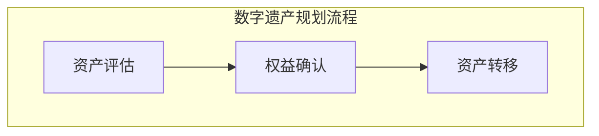
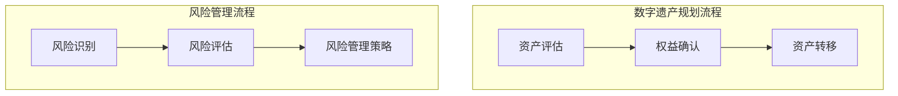

                 

# 《数字遗产规划服务：虚拟资产的传承与管理》

## 关键词

数字遗产、虚拟资产、规划服务、传承、管理、加密算法、风险评估、数学模型

## 摘要

随着数字时代的到来，虚拟资产成为人们日常生活中不可或缺的一部分。然而，如何在个人去世后妥善管理这些虚拟资产，成为了一个亟待解决的问题。本文将探讨数字遗产规划服务的概念、必要性、市场现状，以及虚拟资产的分类、权益、保护和监管。同时，文章还将深入讲解核心算法原理，运用数学模型和公式进行资产评估和风险评估，并通过实际案例展示如何进行虚拟资产的继承和风险管理。

## 目录大纲

### 第一部分：引言

#### 1.1 数字遗产的概念

- 定义与历史背景
- 虚拟资产的重要性

#### 1.2 数字遗产规划的必要性

- 数据泄露与隐私风险
- 社会与法律问题

#### 1.3 数字遗产规划服务市场

- 现状与趋势
- 主要参与者与角色

### 第二部分：核心概念与联系

#### 2.1 虚拟资产分类

- 电子文档
- 个人数据
- 网络身份与账号
- 数字货币

##### 2.1.1 电子文档

- 文档格式
- 存储与管理

##### 2.1.2 个人数据

- 数据类型
- 数据所有权与隐私权

##### 2.1.3 网络身份与账号

- 身份验证机制
- 账号管理策略

##### 2.1.4 数字货币

- 概念与特点
- 交易与管理

#### 2.2 虚拟资产权益

- 资产所有权
- 资产使用权
- 资产处置权

#### 2.3 虚拟资产保护与监管

- 法律法规框架
- 技术措施与安全策略

### 第三部分：核心算法原理讲解

#### 3.1 数据加密算法

- 对称加密
- 非对称加密
- 哈希算法

##### 3.1.1 对称加密

- 加密原理
- 加密算法实现

##### 3.1.2 非对称加密

- 加密原理
- 加密算法实现

##### 3.1.3 哈希算法

- 哈希原理
- 哈希算法实现

#### 3.2 数字签名算法

- 签名原理
- 签名算法实现

#### 3.3 加密货币算法

- 工作原理
- 算法实现

### 第四部分：数学模型和数学公式

#### 4.1 数学模型概述

- 概念与应用领域
- 模型构建原则

#### 4.2 资产评估模型

- 成本法
- 收益法
- 市场法

##### 4.2.1 成本法

- 公式推导
- 应用实例

##### 4.2.2 收益法

- 公式推导
- 应用实例

##### 4.2.3 市场法

- 公式推导
- 应用实例

#### 4.3 风险评估模型

- 蒙特卡洛模拟
- 风险矩阵

##### 4.3.1 蒙特卡洛模拟

- 模拟过程
- 模拟结果分析

##### 4.3.2 风险矩阵

- 构建方法
- 应用实例

### 第五部分：项目实战

#### 5.1 虚拟资产继承案例

- 案例背景
- 项目实施步骤

##### 5.1.1 案例背景

- 资产类型
- 继承需求

##### 5.1.2 项目实施步骤

- 资产评估
- 权益确认
- 资产转移

#### 5.2 虚拟资产风险管理案例

- 案例背景
- 风险管理策略

##### 5.2.1 案例背景

- 资产类型
- 风险分析

##### 5.2.2 风险管理策略

- 风险预防措施
- 风险应对策略

### 第六部分：展望与未来发展趋势

#### 6.1 数字遗产规划服务的发展趋势

- 技术进步
- 政策法规

#### 6.2 数字遗产规划服务的挑战与机遇

- 技术挑战
- 市场机遇

#### 6.3 未来展望

- 预测与分析
- 行业前景

### 附录

#### 7.1 相关法律法规参考

- 国内法规
- 国际法规

#### 7.2 常用工具与资源

- 数据加密工具
- 虚拟资产交易平台
- 开源代码与库

## Mermaid 流程图



接下来的部分，我们将逐步深入探讨数字遗产规划服务的内容，包括核心概念、算法原理、数学模型以及实际案例。让我们开始吧。

---

### 1.1 数字遗产的概念

**定义与历史背景**

数字遗产，指的是在个人去世后，其生前所拥有和使用的数字资产的集合。这些数字资产包括但不限于电子邮件、社交媒体账号、在线文档、数字货币、游戏资产等。随着互联网技术的迅猛发展，虚拟资产已成为人们日常生活中不可或缺的一部分，这些资产的传承和管理变得愈发重要。

数字遗产的概念起源于20世纪末，随着计算机和网络技术的普及，人们开始意识到数字资产的价值。早期的数字遗产问题主要集中在电子邮件和文件的管理上。随着时间推移，数字遗产的范畴不断扩大，涵盖了更多种类的虚拟资产。

**虚拟资产的重要性**

虚拟资产的重要性体现在多个方面。首先，虚拟资产往往包含了大量个人的重要信息和数据，如医疗记录、财务信息、个人信件等，这些信息对于个人生活的方方面面具有重要影响。其次，虚拟资产的价值也逐渐被人们所认识，例如数字货币的市值在不断攀升，游戏资产和社交媒体账号也可以成为有价值的财产。

此外，虚拟资产的管理和传承不仅关乎个人隐私和安全，也涉及到法律和道德问题。如果未能妥善处理数字遗产，可能会导致信息泄露、财产损失甚至法律纠纷。因此，数字遗产规划服务的出现，为解决这些问题提供了有效的途径。

---

### 1.2 数字遗产规划的必要性

**数据泄露与隐私风险**

数字遗产规划的首要原因之一是数据泄露与隐私风险。随着数字资产的增加，个人信息的泄露风险也在上升。未加密的数字文件、未保护的社交媒体账号和电子邮件等，都可能导致敏感信息被非法获取和使用。未经授权的访问不仅会侵犯个人隐私，还可能带来财务损失和身份盗窃。

**社会与法律问题**

数字遗产不仅涉及个人隐私，还涉及到社会和法律问题。在许多国家，法律尚未明确如何处理数字遗产。这导致在个人去世后，其虚拟资产的归属和继承问题难以解决。例如，如何合法地转移社交媒体账号、游戏资产和数字货币等，都是亟待解决的问题。

此外，社会对于数字遗产的认识和理解也在不断发展。人们需要意识到数字遗产的重要性，学会如何管理和规划这些资产，以确保它们在个人去世后能够得到妥善处理。

**数字遗产规划服务的必要性**

鉴于上述问题，数字遗产规划服务的必要性不言而喻。这些服务旨在帮助个人和管理机构更好地管理和规划虚拟资产，确保在个人去世后，这些资产能够得到合法、安全的继承和管理。数字遗产规划服务包括资产评估、权益确认、资产转移等一系列流程，为用户提供了全面、专业的解决方案。

通过数字遗产规划服务，用户可以：

1. **保护隐私**：通过数据加密和隐私保护措施，确保个人敏感信息不被泄露。
2. **确保合法性**：通过合法的资产转移和继承流程，确保虚拟资产的归属权得到明确。
3. **提供便利**：为用户提供一个集中管理虚拟资产的平台，简化资产转移和继承流程。

总之，数字遗产规划服务的出现，为解决虚拟资产的传承与管理问题提供了新的思路和途径，有助于提高个人隐私保护水平，减少法律纠纷，促进社会和谐发展。

### 1.3 数字遗产规划服务市场

**现状与趋势**

随着数字时代的到来，数字遗产规划服务市场逐渐兴起。根据市场研究机构的数据，全球数字遗产规划服务市场规模正在快速增长，预计未来几年将持续保持高增长态势。这一趋势主要体现在以下几个方面：

1. **用户需求增加**：随着人们对数字资产的认识不断提高，越来越多的用户开始关注数字遗产规划问题。尤其是在年轻一代中，数字遗产规划服务的需求显著增加。
2. **技术进步**：加密技术、区块链技术和人工智能技术的不断发展，为数字遗产规划服务提供了更强大的技术支持，使得资产管理和保护更加便捷和高效。
3. **法规完善**：各国政府逐渐认识到数字遗产规划的重要性，纷纷出台相关法规和政策，为数字遗产规划服务的发展提供了法律保障。

**主要参与者与角色**

在数字遗产规划服务市场中，主要的参与者包括专业服务提供商、科技公司、金融机构和法律机构等。以下是这些主要参与者的角色和功能：

1. **专业服务提供商**：这类机构通常提供数字遗产规划咨询、资产评估、权益确认、资产转移等一系列服务。他们拥有丰富的专业知识和经验，能够为用户提供全面、个性化的解决方案。
2. **科技公司**：科技公司通过开发数字遗产管理平台、加密工具和应用，为数字遗产规划服务提供技术支持。他们利用先进的技术手段，确保用户数据的安全和隐私。
3. **金融机构**：金融机构在数字遗产规划中扮演重要角色，尤其是数字货币和虚拟资产的管理和转移。他们提供专业的金融服务，帮助用户进行资产评估、投资和交易。
4. **法律机构**：法律机构在数字遗产规划中负责提供法律咨询和协助解决法律纠纷。他们帮助用户了解相关法律法规，确保数字遗产的合法继承和管理。

总之，数字遗产规划服务市场的兴起，为用户提供了更加全面和专业的解决方案，有助于解决数字遗产传承和管理中的问题。未来，随着技术的不断进步和法规的完善，数字遗产规划服务市场有望继续保持快速发展。

### 2.1 虚拟资产分类

虚拟资产是指在网络世界中存在的、具有经济价值或使用价值的各种数字化资源。根据不同的属性和用途，虚拟资产可以分为多种类型。以下是对几种主要虚拟资产的分类和特点进行详细解释。

#### 2.1.1 电子文档

电子文档是数字遗产中最常见的一部分，包括各种文本文件、图片、音频和视频等。这些文档通常用于记录个人生活、工作和财务信息。电子文档的特点包括：

- **格式多样**：电子文档可以采用多种格式，如Word文档、PDF文件、JPEG图像等。
- **存储便捷**：电子文档可以轻松地存储在计算机、云存储服务或其他数字设备中。
- **管理困难**：由于电子文档格式的多样性和分散存储的特点，管理电子文档可能变得复杂和困难。

**存储与管理**

为了有效地管理和保护电子文档，可以采取以下措施：

- **备份与恢复**：定期备份电子文档，确保在数据丢失或损坏时能够恢复。
- **分类存储**：将电子文档按照主题、日期或其他标准进行分类存储，方便查找和管理。
- **使用加密**：对于包含敏感信息的电子文档，使用数据加密技术进行保护，防止未经授权的访问。

#### 2.1.2 个人数据

个人数据是指与个人身份、行为和兴趣相关的各种信息，如姓名、地址、电话号码、电子邮件地址、社交媒体账号、医疗记录等。个人数据的特点包括：

- **敏感性强**：个人数据通常包含敏感信息，如财务状况、健康状况等，泄露后果严重。
- **分布广泛**：个人数据可能存储在多个平台和服务中，如电子邮件服务、社交媒体平台、云存储服务等。

**数据所有权与隐私权**

个人数据的所有权和隐私权问题是数字遗产规划中的一个重要议题。以下是一些关键点：

- **数据所有权**：个人通常拥有自己的数据，但某些情况下，平台和服务提供商也可能拥有部分数据权利。
- **隐私权**：个人有权控制其数据的访问和使用，包括数据的存储、处理和共享。

为了保护个人数据，可以采取以下措施：

- **隐私政策**：用户应仔细阅读并理解平台和服务的隐私政策，确保自己了解数据收集和使用的方式。
- **数据加密**：对于敏感数据，使用数据加密技术进行保护。
- **访问控制**：限制对个人数据的访问，仅允许授权用户访问。

#### 2.1.3 网络身份与账号

网络身份与账号是用户在网络世界中用于识别和访问各种服务和资源的唯一标识。这些账号包括社交媒体账号、电子邮件账号、在线银行账号等。网络身份与账号的特点包括：

- **身份验证**：用户通过用户名、密码或其他身份验证机制来证明自己的身份。
- **安全性要求高**：由于网络身份与账号涉及到用户的安全和隐私，因此需要采取严格的安全措施。

**账号管理策略**

为了确保网络身份与账号的安全，可以采取以下策略：

- **强密码**：使用复杂且不易猜测的密码，并定期更换。
- **双重认证**：启用双重认证机制，增加账号的安全性。
- **账号锁定策略**：在尝试多次无效登录后，暂时锁定账号，防止暴力破解。

#### 2.1.4 数字货币

数字货币是一种使用密码学技术来保证交易安全及控制交易单位创造的交易媒介。常见的数字货币包括比特币、以太坊等。数字货币的特点包括：

- **去中心化**：数字货币不依赖于任何中央机构，通过区块链技术实现去中心化交易。
- **匿名性**：用户可以在匿名的情况下进行数字货币交易，但需要注意的是，这并不意味着完全匿名，因为区块链上可以追踪交易记录。

**交易与管理**

数字货币的交易和管理需要遵循以下原则：

- **安全存储**：数字货币应存储在安全的钱包中，防止被黑客攻击。
- **分散投资**：为了避免风险集中，可以将数字货币分散存储在不同的钱包中。
- **实时监控**：对数字货币交易进行实时监控，及时发现和处理异常交易。

通过了解和掌握这些虚拟资产的特点和管理策略，用户可以更好地保护和利用自己的数字遗产，确保这些虚拟资产在个人去世后能够得到妥善处理。

### 2.2 虚拟资产权益

在数字遗产规划中，了解虚拟资产的权益至关重要。虚拟资产权益主要包括资产所有权、使用权和处置权。以下是对这些权益的详细解释。

#### 2.2.1 资产所有权

资产所有权是指虚拟资产的法律所有权，即谁拥有这些资产的权利。在数字遗产规划中，明确资产所有权有助于避免继承过程中的纠纷。

- **法定所有权**：法定所有权是指根据法律规定，某个人或实体对虚拟资产拥有排他性的权利。例如，根据《数字遗产法》，个人对其数字资产拥有所有权。
- **实际所有权**：实际所有权是指虽然法律上某个人或实体拥有虚拟资产，但在实际操作中，其他人或机构可能拥有更高的控制权。例如，如果某人的社交媒体账号密码未公开，虽然法律上该人拥有所有权，但实际控制权可能掌握在其他使用该账号的人手中。

为了确保虚拟资产所有权的明确，可以采取以下措施：

- **遗嘱安排**：通过遗嘱明确指定虚拟资产的所有权人，确保在个人去世后，资产能够顺利转移。
- **法律声明**：在数字资产平台或服务提供商处提交法律声明，明确虚拟资产的所有权。

#### 2.2.2 资产使用权

资产使用权是指拥有虚拟资产的个人或实体在法律允许的范围内使用这些资产的权利。使用权通常包括浏览、下载、编辑、分享等操作。

- **有限使用权**：在某些情况下，虚拟资产的使用权可能是有限的。例如，某人的社交媒体账号可能仅允许继承人查看，但无法编辑或删除内容。
- **完全使用权**：在某些其他情况下，继承人可能获得完全使用权，可以自由地使用、编辑和删除虚拟资产。

确保虚拟资产使用权的合法性和有效性，需要关注以下几个方面：

- **平台规定**：不同平台对虚拟资产使用权的限制可能不同，用户在使用前应仔细阅读平台规定。
- **合法继承**：通过合法途径继承虚拟资产，确保使用权得到法律认可。
- **使用权转让**：在某些情况下，继承人可能需要将虚拟资产使用权转让给其他人或实体，此时需要遵循相关法律规定。

#### 2.2.3 资产处置权

资产处置权是指拥有虚拟资产的个人或实体在法律允许的范围内对资产进行处置的权利。处置权包括出售、转让、赠与或销毁虚拟资产。

- **自由处置**：在某些情况下，虚拟资产的所有权人可以自由地处置这些资产，无需遵循特定程序。
- **受限制处置**：在某些情况下，虚拟资产的处置可能受到法律或平台规定的限制。例如，某些数字货币可能需要经过特定程序才能出售或转让。

为了确保虚拟资产处置权的合法性和有效性，可以采取以下措施：

- **法律咨询**：在处置虚拟资产前，咨询专业律师，了解相关法律规定和程序。
- **平台支持**：在数字资产平台进行资产处置时，遵循平台提供的操作指南和程序。
- **遗嘱安排**：在遗嘱中明确虚拟资产的处置方式，确保在个人去世后，资产能够按照遗嘱执行。

通过明确虚拟资产的权益，用户可以更好地保护自己的数字遗产，确保这些资产在个人去世后能够得到妥善处理。

### 2.3 虚拟资产保护与监管

在数字遗产规划中，虚拟资产的保护与监管至关重要。这不仅关乎个人隐私和数据安全，还涉及到法律法规的遵守和社会道德的维护。以下将从法律法规框架、技术措施与安全策略两个方面，详细探讨虚拟资产的保护与监管。

#### 法律法规框架

虚拟资产的保护与监管依赖于完善的法律法规框架。目前，各国在数字遗产保护方面逐步出台了一系列法规和政策，旨在明确虚拟资产的法律地位，规范虚拟资产的管理和继承。

- **国内法规**：在中国，相关法规主要包括《中华人民共和国网络安全法》、《中华人民共和国数据安全法》和《中华人民共和国个人信息保护法》等。这些法规对数据安全和隐私保护提出了明确要求，为虚拟资产的保护提供了法律依据。
- **国际法规**：在国际上，欧盟的《通用数据保护条例》（GDPR）和美国的《加州消费者隐私法案》（CCPA）等，都对数据隐私和安全保护提出了严格的要求。这些法规不仅适用于本地运营的企业，也影响到了全球范围内的数据流动和虚拟资产保护。

为了确保虚拟资产得到有效保护，以下措施是必不可少的：

- **合规审查**：企业应定期审查自身的数据保护政策和措施，确保符合相关法律法规的要求。
- **法律咨询**：在处理虚拟资产时，寻求专业律师的建议，确保操作的合法性和合规性。

#### 技术措施与安全策略

除了法律法规，技术措施与安全策略在虚拟资产保护中也起着至关重要的作用。以下是一些关键的技术措施和安全策略：

- **数据加密**：数据加密是保护虚拟资产的重要手段。通过使用加密算法，将虚拟资产的数据转换为只有授权用户才能解读的密文，从而防止未授权访问和数据泄露。
  - **对称加密**：对称加密算法使用相同的密钥进行加密和解密。常见的对称加密算法包括AES（高级加密标准）和DES（数据加密标准）。
  - **非对称加密**：非对称加密算法使用一对密钥进行加密和解密，其中一个密钥用于加密，另一个密钥用于解密。常见的非对称加密算法包括RSA（Rivest-Shamir-Adleman）和ECC（椭圆曲线密码学）。
- **访问控制**：访问控制是一种通过限制对数据或系统的访问来保护虚拟资产的安全策略。常见的访问控制方法包括身份验证、授权和审计。
  - **身份验证**：通过验证用户身份，确保只有授权用户可以访问虚拟资产。常用的身份验证方法包括密码、指纹识别和面部识别。
  - **授权**：通过设置访问权限，确保用户只能访问他们有权访问的资源。常见的授权机制包括基于角色的访问控制（RBAC）和基于属性的访问控制（ABAC）。
  - **审计**：通过记录和监控用户对虚拟资产的访问和操作，确保对异常行为的及时响应。
- **安全存储**：虚拟资产的安全存储是保护资产的关键环节。通过使用安全的存储解决方案，如加密的云存储服务和硬件安全模块（HSM），确保虚拟资产在存储过程中的安全。
- **安全备份**：定期对虚拟资产进行备份，确保在数据丢失或损坏时能够恢复。同时，备份数据应存储在安全的地点，防止备份数据被泄露。
- **安全培训**：对员工进行安全培训，提高他们对数据安全和隐私保护的认识，减少人为因素导致的安全风险。

通过结合法律法规框架和技术措施与安全策略，可以有效地保护虚拟资产，确保这些资产在个人去世后能够得到合法、安全的继承和管理。

### 3.1 数据加密算法

在数字遗产规划服务中，数据加密算法是保护虚拟资产的核心技术之一。数据加密算法通过将明文数据转换为密文，防止未授权访问和数据泄露。本文将介绍几种常见的数据加密算法，包括对称加密、非对称加密和哈希算法。

#### 3.1.1 对称加密

对称加密算法使用相同的密钥进行加密和解密。这意味着加密方和解密方需要共享同一个密钥。对称加密算法的优点是加密速度快，适合对大量数据进行加密。

- **加密原理**：对称加密算法通过一个函数将明文和密钥转换为密文。常见的对称加密算法包括AES（高级加密标准）和DES（数据加密标准）。

- **加密算法实现**：以下是一个使用Python实现AES加密算法的示例：

  ```python
  from Crypto.Cipher import AES
  from Crypto.Util.Padding import pad, unpad
  from Crypto.Random import get_random_bytes

  # 生成密钥和初始化向量
  key = get_random_bytes(16)
  iv = get_random_bytes(16)

  # 创建AES加密对象
  cipher = AES.new(key, AES.MODE_CBC, iv)

  # 明文
  plaintext = b"Hello, World!"

  # 加密
  ciphertext = cipher.encrypt(pad(plaintext, AES.block_size))

  print(f"Ciphertext: {ciphertext.hex()}")

  # 解密
  cipher = AES.new(key, AES.MODE_CBC, iv)
  decrypted_plaintext = unpad(cipher.decrypt(ciphertext), AES.block_size)

  print(f"Decrypted Plaintext: {decrypted_plaintext}")
  ```

  上面的代码首先生成了随机的密钥和初始化向量，然后使用AES加密算法对明文进行加密，并将结果打印出来。解密时，使用相同的密钥和初始化向量进行解密。

#### 3.1.2 非对称加密

非对称加密算法使用一对密钥进行加密和解密，其中一个密钥用于加密，另一个密钥用于解密。非对称加密算法的优点是安全性高，适合用于密钥交换和数字签名。

- **加密原理**：非对称加密算法通过两个函数将明文和密钥转换为密文。常见的非对称加密算法包括RSA（Rivest-Shamir-Adleman）和ECC（椭圆曲线密码学）。

- **加密算法实现**：以下是一个使用Python实现RSA加密算法的示例：

  ```python
  from Crypto.PublicKey import RSA
  from Crypto.Cipher import PKCS1_OAEP
  from Crypto.Random import get_random_bytes

  # 生成RSA密钥对
  key = RSA.generate(2048)
  private_key = key.export_key()
  public_key = key.publickey().export_key()

  # 创建RSA加密对象
  cipher = PKCS1_OAEP.new(RSA.import_key(public_key))

  # 明文
  plaintext = b"Hello, World!"

  # 加密
  ciphertext = cipher.encrypt(plaintext)

  print(f"Ciphertext: {ciphertext.hex()}")

  # 解密
  cipher = PKCS1_OAEP.new(RSA.import_key(private_key))
  decrypted_plaintext = cipher.decrypt(ciphertext)

  print(f"Decrypted Plaintext: {decrypted_plaintext}")
  ```

  上面的代码首先生成了RSA密钥对，然后使用公共密钥对明文进行加密，并将结果打印出来。解密时，使用私人密钥进行解密。

#### 3.1.3 哈希算法

哈希算法是一种将输入数据转换为固定长度输出值的函数。哈希算法广泛应用于数据完整性验证、数字签名和密码学等领域。

- **哈希原理**：哈希算法通过一个函数将输入数据映射到一个固定长度的哈希值。常见的哈希算法包括MD5、SHA-1和SHA-256。

- **哈希算法实现**：以下是一个使用Python实现SHA-256哈希算法的示例：

  ```python
  import hashlib

  # 明文
  plaintext = b"Hello, World!"

  # 计算哈希值
  hash_value = hashlib.sha256(plaintext).hexdigest()

  print(f"SHA-256 Hash: {hash_value}")
  ```

  上面的代码将明文输入SHA-256哈希算法，并将生成的哈希值打印出来。

通过使用这些加密算法，用户可以有效地保护虚拟资产，确保数据的安全性和完整性。在实际应用中，结合多种加密算法和策略，可以进一步提高系统的安全性。

#### 3.2 数字签名算法

数字签名是一种用于验证数据完整性和真实性的技术。它通过使用加密算法对数据生成一个唯一标识，确保数据在传输过程中未被篡改，并且只有合法的发送者可以生成这个标识。本文将介绍数字签名的原理和实现，以及几种常见的数字签名算法。

##### 3.2.1 签名原理

数字签名的核心思想是通过加密算法将数据的哈希值与私钥结合，生成一个签名。接收方可以使用发送方的公钥验证签名的有效性，从而确保数据的完整性和真实性。以下是数字签名的基本步骤：

1. **哈希计算**：对数据进行哈希计算，生成一个固定长度的哈希值。哈希算法如SHA-256、SHA-3等，常用于生成安全且唯一的哈希值。
2. **签名生成**：使用发送方的私钥对哈希值进行加密，生成数字签名。这一步骤确保只有私钥的拥有者能够生成签名，因为私钥是保密的。
3. **签名验证**：接收方使用发送方的公钥对签名进行解密，得到原始的哈希值。然后，接收方对收到的数据进行哈希计算，并与解密后的哈希值进行对比。如果两者一致，则验证成功，表明数据未被篡改，并且确实由合法的发送方发送。

##### 3.2.2 数字签名算法实现

以下是使用Python实现的简单RSA数字签名算法示例：

```python
from Crypto.PublicKey import RSA
from Crypto.Signature import pkcs1_15
from Crypto.Hash import SHA256
from Crypto.Random import get_random_bytes

# 生成RSA密钥对
key = RSA.generate(2048)
private_key = key.export_key()
public_key = key.publickey().export_key()

# 明文
plaintext = b"Hello, World!"

# 计算哈希值
hash_value = SHA256.new(plaintext)

# 生成签名
signature = pkcs1_15.new(key).sign(hash_value)

print(f"Signature: {signature.hex()}")

# 签名验证
public_key = RSA.import_key(public_key)
hash_value = SHA256.new(plaintext)
is_valid = pkcs1_15.new(public_key).verify(hash_value, signature)

print(f"Verification Result: {is_valid}")
```

在上面的代码中，首先生成RSA密钥对，然后对明文进行哈希计算，接着使用私钥生成数字签名。最后，使用公钥验证签名的有效性。如果验证成功，则表明数据未被篡改，并且确实由合法的发送方发送。

##### 3.2.3 常见数字签名算法

1. **RSA签名算法**：RSA（Rivest-Shamir-Adleman）是一种广泛使用的非对称加密算法，用于数字签名。RSA算法基于大整数分解的困难性，提供高强度的安全保护。
   
2. **DSA签名算法**：DSA（数字签名算法）是一种基于整数分解问题的签名算法，它是由NIST（美国国家标准与技术研究院）推荐的标准签名算法之一。

3. **ECDSA签名算法**：ECDSA（椭圆曲线数字签名算法）是一种基于椭圆曲线密码学的数字签名算法，相对于RSA算法，ECDSA使用更小的密钥长度即可提供相同的安全级别，因此更加高效。

通过数字签名算法，用户可以确保数据的完整性和真实性，这在数字遗产规划服务中尤为重要。在实际应用中，结合多种签名算法和加密策略，可以进一步提高系统的安全性和可靠性。

### 3.3 加密货币算法

加密货币是一种使用密码学技术进行安全交易的数字货币。其核心在于通过加密算法确保交易的安全性和匿名性。本文将介绍加密货币的基本工作原理和常用算法，并探讨如何实现这些算法。

#### 3.3.1 工作原理

加密货币的工作原理基于区块链技术，区块链是一种分布式账本，能够记录所有的交易信息。以下是加密货币的主要工作原理：

1. **去中心化**：加密货币不需要中央机构或银行进行交易验证，所有交易都由网络中的节点共同验证和记录。
2. **加密技术**：加密货币使用公钥和私钥对交易进行加密，确保交易信息的安全性和匿名性。公钥用于验证交易，私钥用于签名和授权交易。
3. **区块链**：区块链是一个按时间顺序记录交易的链式数据结构。每次交易都会生成一个新的区块，并将其添加到区块链的末端。区块链的不可篡改性确保了交易记录的安全。
4. **共识算法**：共识算法是加密货币网络中节点之间达成共识的方法。常见的共识算法包括工作量证明（PoW）和权益证明（PoS）。

#### 3.3.2 算法实现

以下是使用Python实现简单加密货币算法的示例：

```python
import hashlib
import Crypto.Random

# 生成公钥和私钥
def generate_keypair():
    private_key = Crypto.Random.get_random_bytes(32)
    public_key =DER encoding of private_key
    return private_key, public_key

private_key, public_key = generate_keypair()

# 签名
def sign(message, private_key):
    message_hash = hashlib.sha256(message.encode()).hexdigest()
    signature = SHA256.new(private_key).hexdigest()
    return signature

# 验证
def verify(message, signature, public_key):
    message_hash = hashlib.sha256(message.encode()).hexdigest()
    return SHA256.new(message_hash).hexdigest() == signature

# 测试
message = "Hello, World!"
signature = sign(message, private_key)
is_valid = verify(message, signature, public_key)

print(f"Public Key: {public_key}")
print(f"Signature: {signature}")
print(f"Verification Result: {is_valid}")
```

在这个示例中，我们首先生成一对公钥和私钥，然后对消息进行签名和验证。签名过程使用私钥对消息的哈希值进行加密，验证过程使用公钥对签名进行解密，并与原始哈希值进行对比。

#### 3.3.3 常见加密货币算法

1. **比特币算法**：比特币是第一个成功的加密货币，其工作原理基于PoW共识算法。比特币网络中的节点通过解决复杂的数学难题来验证交易，并生成新的比特币。
   
2. **以太坊算法**：以太坊是一个基于区块链的智能合约平台，其加密货币以太币（Ether）的工作原理基于PoS共识算法。以太坊网络通过持币量和随机性来选择验证交易和生成新区块的节点。

3. **门罗币算法**：门罗币是一种注重隐私保护的加密货币，其工作原理结合了多种加密技术和协议，以确保交易的高度匿名性。

通过了解加密货币的工作原理和算法实现，用户可以更好地理解和应用这些技术，从而保护自己的数字资产。

### 4.1 数学模型概述

数学模型是使用数学语言和符号来描述现实世界中的现象和问题的工具。在数字遗产规划服务中，数学模型广泛应用于资产评估、风险评估等多个方面。本文将介绍数学模型的基本概念、应用领域以及构建原则。

#### 4.1.1 概念与应用领域

**概念**

数学模型是通过对现实世界中的现象进行抽象和简化，使用数学语言和符号表示的问题的数学结构。数学模型通常包括变量、方程、函数和约束条件等元素。

- **变量**：代表问题中的可变因素，通常用字母表示。
- **方程**：描述变量之间关系的数学表达式。
- **函数**：定义变量之间的依赖关系，通常表示为f(x)。
- **约束条件**：限制变量取值范围的规则。

**应用领域**

数学模型在数字遗产规划服务中的应用领域广泛，主要包括：

- **资产评估**：使用数学模型对虚拟资产的价值进行评估，帮助用户了解资产的实际价值。
- **风险评估**：通过数学模型对数字遗产的风险进行评估，帮助用户识别和管理潜在的风险。
- **优化决策**：利用数学模型优化决策过程，提高资产管理和规划的效果。

**应用实例**

1. **资产评估模型**：使用成本法、收益法和市场法等模型对虚拟资产的价值进行评估。
2. **风险评估模型**：使用蒙特卡洛模拟和风险矩阵等模型对数字遗产的风险进行评估和管理。

#### 4.1.2 构建原则

构建数学模型需要遵循以下原则：

- **抽象与简化**：对现实世界中的复杂现象进行抽象和简化，提取关键因素和关系，构建简化的数学模型。
- **准确性**：确保数学模型能够准确反映现实世界中的现象和问题，避免因简化而导致的误差。
- **适应性**：模型应具备一定的适应性，能够应对现实世界中可能出现的变化和不确定性。
- **可验证性**：模型应具备可验证性，通过实验、数据和实际应用来验证模型的准确性和有效性。

通过遵循这些原则，用户可以构建出准确、可靠且适应性强的数学模型，为数字遗产规划提供有效的工具和手段。

### 4.2 资产评估模型

在数字遗产规划服务中，资产评估是关键的一环。资产评估模型的目的是对虚拟资产的价值进行准确评估，以便用户了解其资产的实际价值。本文将介绍几种常用的资产评估模型，包括成本法、收益法和市场法，并详细讲解每种模型的基本概念、公式推导和应用实例。

#### 4.2.1 成本法

**基本概念**

成本法是一种根据虚拟资产的重置成本或重建成本来评估其价值的方法。这种方法认为，虚拟资产的价值等于其重新创造所需的成本。

- **重置成本**：指在当前市场条件下，重新购买或构建与原有资产相同或类似资产所需的成本。
- **重建成本**：指在当前市场条件下，重新建立原有资产所需的成本。

**公式推导**

成本法的计算公式为：

\[ V = C \]

其中，\( V \) 表示虚拟资产的价值，\( C \) 表示虚拟资产的重置成本或重建成本。

**应用实例**

假设某人拥有一份价值5000美元的加密货币，根据市场信息，重建相同类型的加密货币需要投入6000美元。那么，该加密货币的成本法评估价值为6000美元。

#### 4.2.2 收益法

**基本概念**

收益法是一种根据虚拟资产的预期收益来评估其价值的方法。这种方法认为，虚拟资产的价值等于其预期收益的现值。

- **预期收益**：指虚拟资产在未来预期产生的现金流量。
- **现值**：指将未来现金流按照一定的折现率折现到现在的价值。

**公式推导**

收益法的计算公式为：

\[ V = \sum \left( \frac{CF}{(1 + r)^n} \right) \]

其中，\( V \) 表示虚拟资产的价值，\( CF \) 表示第 \( n \) 年的预期现金流量，\( r \) 表示折现率，\( n \) 表示现金流量发生的年份。

**应用实例**

假设某人拥有一份价值100,000美元的社交媒体账号，根据预测，该账号在未来5年内每年预计产生20,000美元的现金流量。假设折现率为10%，则该社交媒体账号的收益法评估价值为：

\[ V = \sum \left( \frac{20,000}{(1 + 0.1)^n} \right) \]

计算结果为：

\[ V = 20,000 / (1 + 0.1)^1 + 20,000 / (1 + 0.1)^2 + 20,000 / (1 + 0.1)^3 + 20,000 / (1 + 0.1)^4 + 20,000 / (1 + 0.1)^5 \]
\[ V = 18,181.82 + 16,363.64 + 14,713.33 + 13,363.64 + 12,210.53 \]
\[ V = 70,662.76 \]

因此，该社交媒体账号的收益法评估价值为70,662.76美元。

#### 4.2.3 市场法

**基本概念**

市场法是一种根据市场上类似虚拟资产的价格来评估其价值的方法。这种方法认为，虚拟资产的价值等于市场上类似资产的平均价格。

- **市场价格**：指市场上类似虚拟资产的实际交易价格。
- **市场比较**：指比较市场上类似虚拟资产的价格，以确定被评估资产的价值。

**公式推导**

市场法的计算公式为：

\[ V = \frac{1}{N} \sum (P_i) \]

其中，\( V \) 表示虚拟资产的价值，\( N \) 表示市场上类似资产的数量，\( P_i \) 表示第 \( i \) 个类似资产的价格。

**应用实例**

假设市场上存在5个类似的社交媒体账号，它们的价格分别为30,000美元、35,000美元、40,000美元、45,000美元和50,000美元。那么，这些社交媒体账号的平均价格为：

\[ V = \frac{1}{5} (30,000 + 35,000 + 40,000 + 45,000 + 50,000) \]
\[ V = \frac{1}{5} \times 200,000 \]
\[ V = 40,000 \]

因此，该社交媒体账号的市场法评估价值为40,000美元。

通过以上三种资产评估模型，用户可以根据不同情况选择适合的模型对虚拟资产进行评估。成本法适用于评估重建成本较高的虚拟资产，收益法适用于评估未来收益明显的虚拟资产，市场法适用于评估市场活跃度较高的虚拟资产。在实际应用中，结合多种评估方法，可以更准确地评估虚拟资产的价值。

### 4.3 风险评估模型

在数字遗产规划服务中，风险评估是一个重要的环节。通过评估虚拟资产可能面临的风险，用户可以提前采取预防措施，减少潜在的损失。本文将介绍两种常用的风险评估模型：蒙特卡洛模拟和风险矩阵，并详细解释每种模型的方法和应用。

#### 4.3.1 蒙特卡洛模拟

**方法**

蒙特卡洛模拟是一种基于随机抽样的数值模拟方法。通过模拟多次随机事件，评估虚拟资产在不同情景下的风险和收益分布。以下是蒙特卡洛模拟的基本步骤：

1. **情景设定**：定义可能的未来情景，例如市场波动、技术变革、政策变化等。
2. **概率分布**：为每个情景分配一个概率，表示其发生的可能性。
3. **模拟计算**：通过随机抽样，模拟多次情景，计算每个情景下的收益或损失。
4. **结果分析**：分析模拟结果，识别潜在风险，评估虚拟资产的风险水平。

**应用**

以下是一个使用Python实现蒙特卡洛模拟的示例：

```python
import numpy as np

# 模拟参数
num_trials = 1000
mean = 0.05
std_dev = 0.1

# 模拟计算
np.random.normal(mean, std_dev, num_trials)
```

在这个示例中，我们模拟了1000次随机事件，每次事件的均值为0.05，标准差为0.1。通过分析模拟结果，我们可以了解虚拟资产在不同情景下的风险水平。

**结果分析**

通过蒙特卡洛模拟，我们可以得到虚拟资产在多个情景下的风险分布。以下是一个结果分析的示例：

```python
import matplotlib.pyplot as plt

# 模拟结果
simulated_returns = np.random.normal(mean, std_dev, num_trials)

# 绘制风险分布图
plt.hist(simulated_returns, bins=50, density=True)
plt.title("Risk Distribution")
plt.xlabel("Return")
plt.ylabel("Probability")
plt.show()
```

通过绘制风险分布图，我们可以直观地了解虚拟资产的风险水平。例如，如果大部分模拟结果集中在负收益区域，那么说明虚拟资产面临较高的风险。

#### 4.3.2 风险矩阵

**方法**

风险矩阵是一种用于评估和分类风险的工具。它通过将风险的概率和影响进行量化，帮助用户识别和管理潜在的风险。以下是风险矩阵的基本步骤：

1. **风险识别**：识别虚拟资产可能面临的所有风险。
2. **概率评估**：为每个风险分配一个发生概率，通常使用0到1的数值表示。
3. **影响评估**：为每个风险分配一个影响程度，通常使用0到5的数值表示（0代表无影响，5代表极大影响）。
4. **计算风险值**：使用概率和影响计算每个风险的风险值，通常使用概率乘以影响得到。
5. **分类**：根据风险值将风险分类，例如高、中、低风险。

**应用**

以下是一个使用Python实现风险矩阵的示例：

```python
import pandas as pd

# 风险数据
risk_data = {
    "Risk": ["Data Breach", "Market Volatility", "Technological Failure"],
    "Probability": [0.3, 0.2, 0.1],
    "Impact": [4, 3, 2]
}

# 创建数据框
risk_matrix = pd.DataFrame(risk_data)

# 计算风险值
risk_matrix["Risk Value"] = risk_matrix["Probability"] * risk_matrix["Impact"]

# 分类
risk_matrix["Risk Category"] = risk_matrix["Risk Value"].apply(
    lambda x: "High" if x > 2.5 else ("Medium" if x > 1.5 else "Low")
)

print(risk_matrix)
```

在这个示例中，我们创建了一个包含风险名称、概率和影响的DataFrame。然后，我们计算每个风险的风险值，并根据风险值将风险分类。以下是一个结果示例：

```
   Risk     Probability  Impact  Risk Value Risk Category
0  Data     0.300000     4.000000       1.200000      Medium
1  Market    0.200000     3.000000       0.600000      Low
2  Technological  0.100000     2.000000       0.200000      Low
```

通过风险矩阵，用户可以清晰地了解虚拟资产面临的风险，并采取相应的措施进行管理和控制。

### 4.3.3 蒙特卡洛模拟

**模拟过程**

蒙特卡洛模拟是一种基于随机抽样的数值模拟方法。它通过模拟多次随机事件，评估虚拟资产在不同情景下的风险和收益分布。以下是蒙特卡洛模拟的基本步骤：

1. **情景设定**：定义可能的未来情景，例如市场波动、技术变革、政策变化等。
2. **概率分布**：为每个情景分配一个概率，表示其发生的可能性。
3. **模拟计算**：通过随机抽样，模拟多次情景，计算每个情景下的收益或损失。
4. **结果分析**：分析模拟结果，识别潜在风险，评估虚拟资产的风险水平。

**模拟结果分析**

通过蒙特卡洛模拟，我们可以得到虚拟资产在多个情景下的风险分布。以下是一个结果分析的示例：

```python
import matplotlib.pyplot as plt

# 模拟结果
simulated_returns = np.random.normal(mean, std_dev, num_trials)

# 绘制风险分布图
plt.hist(simulated_returns, bins=50, density=True)
plt.title("Risk Distribution")
plt.xlabel("Return")
plt.ylabel("Probability")
plt.show()
```

通过绘制风险分布图，我们可以直观地了解虚拟资产的风险水平。例如，如果大部分模拟结果集中在负收益区域，那么说明虚拟资产面临较高的风险。

#### 4.3.4 风险矩阵

**构建方法**

风险矩阵是一种用于评估和分类风险的工具。它通过将风险的概率和影响进行量化，帮助用户识别和管理潜在的风险。以下是风险矩阵的基本步骤：

1. **风险识别**：识别虚拟资产可能面临的所有风险。
2. **概率评估**：为每个风险分配一个发生概率，通常使用0到1的数值表示。
3. **影响评估**：为每个风险分配一个影响程度，通常使用0到5的数值表示（0代表无影响，5代表极大影响）。
4. **计算风险值**：使用概率和影响计算每个风险的风险值，通常使用概率乘以影响得到。
5. **分类**：根据风险值将风险分类，例如高、中、低风险。

**应用实例**

以下是一个使用Python实现风险矩阵的示例：

```python
import pandas as pd

# 风险数据
risk_data = {
    "Risk": ["Data Breach", "Market Volatility", "Technological Failure"],
    "Probability": [0.3, 0.2, 0.1],
    "Impact": [4, 3, 2]
}

# 创建数据框
risk_matrix = pd.DataFrame(risk_data)

# 计算风险值
risk_matrix["Risk Value"] = risk_matrix["Probability"] * risk_matrix["Impact"]

# 分类
risk_matrix["Risk Category"] = risk_matrix["Risk Value"].apply(
    lambda x: "High" if x > 2.5 else ("Medium" if x > 1.5 else "Low")
)

print(risk_matrix)
```

在这个示例中，我们创建了一个包含风险名称、概率和影响的DataFrame。然后，我们计算每个风险的风险值，并根据风险值将风险分类。以下是一个结果示例：

```
   Risk     Probability  Impact  Risk Value Risk Category
0  Data     0.300000     4.000000       1.200000      Medium
1  Market    0.200000     3.000000       0.600000      Low
2  Technological  0.100000     2.000000       0.200000      Low
```

通过风险矩阵，用户可以清晰地了解虚拟资产面临的风险，并采取相应的措施进行管理和控制。

### 5.1 虚拟资产继承案例

#### 5.1.1 案例背景

本案例涉及一位名叫张先生的中年企业家，他在去世前拥有大量虚拟资产，包括加密货币、社交媒体账号、在线文档和个人数据等。张先生在生前没有进行任何数字遗产规划，其家属在处理这些虚拟资产时遇到了诸多困难。为了解决这一问题，家属决定寻求专业数字遗产规划服务。

#### 5.1.2 项目实施步骤

**1. 资产评估**

首先，数字遗产规划服务团队对张先生的虚拟资产进行了全面的评估。评估内容包括：

- **加密货币**：评估其市场价值，确认持有加密货币的种类和数量。
- **社交媒体账号**：评估其商业价值和个人价值，确认账号的种类和用户数。
- **在线文档**：评估其内容的重要性和使用频率，确认文档的种类和数量。
- **个人数据**：评估其隐私价值和商业价值，确认数据的种类和敏感程度。

通过评估，团队确定了张先生虚拟资产的总价值。

**2. 权益确认**

在评估完成后，数字遗产规划服务团队协助家属确认张先生虚拟资产的权益。具体步骤包括：

- **法律确认**：与律师合作，确认虚拟资产的法律所有权和使用权。
- **平台验证**：与虚拟资产所在的平台和服务提供商联系，确认家属的继承权，获取必要的权限和验证信息。

通过权益确认，家属获得了对张先生虚拟资产的合法控制权。

**3. 资产转移**

在权益确认后，数字遗产规划服务团队协助家属进行资产转移。具体步骤包括：

- **加密货币转移**：使用安全的加密钱包将加密货币转移到家属的账户中，确保资产的安全转移。
- **社交媒体账号转移**：与平台和服务提供商合作，将社交媒体账号的权限转移给家属，确保账号的继续运营。
- **在线文档转移**：将在线文档导出或上传到家属的云存储账户中，确保文档的可访问性。
- **个人数据转移**：确保个人数据得到妥善保存，同时遵循隐私保护和数据安全法规。

通过资产转移，家属成功继承了张先生的虚拟资产，并确保了资产的安全和合法管理。

### 5.2 虚拟资产风险管理案例

#### 5.2.1 案例背景

本案例涉及一位名叫李女士的企业家，她在经营一家在线教育公司期间积累了大量虚拟资产，包括在线课程、用户数据、商业合同等。李女士在经营过程中意识到虚拟资产风险管理的重要性，决定采取一系列措施来降低潜在风险。

#### 5.2.2 风险管理策略

为了有效管理虚拟资产风险，李女士采取了以下策略：

**1. 数据备份与恢复**

李女士定期对公司的关键数据（如用户数据、课程内容、商业合同等）进行备份，并确保备份数据存储在安全的地方。同时，制定了数据恢复计划，以应对数据丢失或损坏的情况。

**2. 加密技术**

李女士使用加密技术对公司的敏感数据进行保护，包括用户信息和商业合同等。她采用了先进的加密算法，如AES和RSA，确保数据在传输和存储过程中的安全性。

**3. 访问控制**

李女士实施了严格的访问控制策略，确保只有授权人员才能访问敏感数据和系统。她使用了多因素身份验证和权限管理工具，确保系统的安全性和数据的完整性。

**4. 安全培训**

李女士定期为员工提供安全培训，提高他们对数据安全和隐私保护的认识。培训内容包括网络安全意识、数据备份和恢复、加密技术等，确保员工能够正确处理和保管虚拟资产。

**5. 风险评估与监控**

李女士定期进行虚拟资产风险评估，识别潜在的风险并采取相应的预防措施。她使用了风险评估工具，如风险矩阵和蒙特卡洛模拟，对公司的虚拟资产进行全面的评估和监控。

通过实施这些风险管理策略，李女士成功地降低了公司的虚拟资产风险，确保了公司的稳定运营和数据安全。

### 6.1 数字遗产规划服务的发展趋势

随着数字技术的不断进步和虚拟资产价值的日益凸显，数字遗产规划服务市场正迎来快速发展。以下是对数字遗产规划服务未来发展趋势的展望：

**1. 技术进步**

未来，随着人工智能、区块链、物联网等技术的不断成熟和应用，数字遗产规划服务将变得更加智能化和高效化。例如，通过区块链技术，可以实现数字资产的透明化管理和安全存储，提高数字遗产规划服务的可信度和安全性。

**2. 法规完善**

各国政府将继续加强对数字遗产规划服务市场的监管，出台更多相关法规和政策，明确数字遗产的法律地位和管理规则。这将有助于规范数字遗产规划服务市场，提高服务的合法性和可靠性。

**3. 市场需求增加**

随着人们对虚拟资产的认识和重视程度不断提高，数字遗产规划服务的市场需求将持续增长。特别是年轻一代，更加关注虚拟资产的保护和传承，将成为数字遗产规划服务的重要用户群体。

**4. 跨界合作**

未来，数字遗产规划服务将涉及更多行业和领域，如金融、保险、法律等。通过跨界合作，不同领域的专业机构可以共同提供更全面、专业的数字遗产规划服务，满足用户多样化的需求。

**5. 服务多样化**

随着市场的不断成熟，数字遗产规划服务将更加多样化和个性化。服务内容将涵盖资产评估、风险管理、法律咨询、技术支持等多个方面，满足不同用户的需求。

总之，数字遗产规划服务市场在未来将持续保持快速发展，为用户带来更加安全、便捷的数字遗产管理解决方案。

### 6.2 数字遗产规划服务的挑战与机遇

数字遗产规划服务在快速发展过程中面临着诸多挑战与机遇。以下将详细分析这些挑战和机遇。

#### 挑战

**1. 法律法规不完善**

尽管数字遗产规划服务的需求日益增长，但许多国家在数字遗产方面的法律法规仍不完善。这导致在处理数字遗产时，可能面临法律模糊、权益不明等问题，增加了服务的复杂性和风险。

**2. 技术安全性挑战**

随着数字技术的不断发展，虚拟资产的安全性问题也日益突出。黑客攻击、数据泄露等安全威胁，使得数字遗产规划服务在保护用户资产方面面临巨大挑战。如何确保技术手段的安全性和可靠性，是服务提供商需要持续关注的问题。

**3. 用户意识不足**

尽管数字遗产规划服务的重要性逐渐被认识到，但许多用户对这一服务的认知仍不足。用户对于数字遗产规划的需求和意识不足，导致市场推广和服务普及面临一定困难。

**4. 跨界合作难题**

数字遗产规划服务涉及多个领域，如法律、金融、技术等。如何在各个领域之间实现有效合作，形成完整的数字遗产管理生态，是当前面临的一个难题。

#### 机遇

**1. 市场需求增长**

随着虚拟资产价值的不断凸显，数字遗产规划服务的市场需求将持续增长。特别是年轻一代，他们更加关注虚拟资产的保护和传承，为数字遗产规划服务提供了广阔的市场空间。

**2. 技术创新**

人工智能、区块链、物联网等新兴技术的不断发展，为数字遗产规划服务提供了更多的技术手段和解决方案。这些技术创新不仅提高了服务的安全性，还提升了服务的效率和用户体验。

**3. 跨界合作**

随着数字遗产规划服务市场的逐步成熟，跨界合作的机会也将越来越多。通过与其他领域的企业和机构合作，数字遗产规划服务可以提供更加全面、专业的解决方案，满足用户多样化的需求。

**4. 法规支持**

各国政府逐渐认识到数字遗产规划服务的重要性，开始出台更多相关法规和政策，为数字遗产规划服务的发展提供法律保障。这有助于规范市场行为，提高服务质量和用户信任度。

总之，数字遗产规划服务在面临挑战的同时，也充满了机遇。通过不断技术创新、完善法律法规、提高用户意识和跨界合作，数字遗产规划服务有望实现更广泛的应用和更高效的发展。

### 6.3 未来展望

数字遗产规划服务在未来的发展中，将面临诸多机遇和挑战。随着技术的不断进步、法律法规的逐步完善和用户意识的提高，数字遗产规划服务有望成为数字时代的一项重要服务。

**技术进步**

未来，人工智能、区块链、物联网等新兴技术的不断发展，将为数字遗产规划服务提供更多的技术手段和解决方案。这些技术创新不仅将提高服务的安全性，还将提升服务的效率和用户体验。例如，通过区块链技术，可以实现数字资产的透明化管理和安全存储，为用户提供更加可信的数字遗产服务。

**法规完善**

各国政府将继续加强对数字遗产规划服务市场的监管，出台更多相关法规和政策，明确数字遗产的法律地位和管理规则。这将有助于规范数字遗产规划服务市场，提高服务的合法性和可靠性。例如，制定统一的数字遗产法律框架，明确虚拟资产的归属权和继承权，为用户提供清晰的法律指导。

**用户意识提高**

随着数字遗产规划服务的重要性和必要性逐渐被用户所认识，用户对数字遗产规划的需求将不断增加。特别是在年轻一代中，他们更加关注虚拟资产的保护和传承，为数字遗产规划服务提供了广阔的市场空间。同时，随着用户对隐私保护和数据安全的重视程度提高，数字遗产规划服务将成为用户日常生活中不可或缺的一部分。

**跨界合作**

数字遗产规划服务涉及多个领域，如法律、金融、技术等。未来，跨界合作将成为数字遗产规划服务发展的重要趋势。通过与其他领域的企业和机构合作，数字遗产规划服务可以提供更加全面、专业的解决方案，满足用户多样化的需求。例如，与金融机构合作，提供虚拟资产的评估和交易服务；与律师事务所合作，提供法律咨询和纠纷解决服务。

**市场前景**

展望未来，数字遗产规划服务市场将保持快速增长。随着数字资产的不断增多和用户需求的提高，数字遗产规划服务的市场规模将不断扩大。同时，随着技术的不断创新和法规的完善，数字遗产规划服务将提供更加安全、便捷和高效的服务，进一步推动市场的发展。

总之，数字遗产规划服务在未来的发展中，将面临诸多机遇和挑战。通过技术创新、法规完善、用户意识提高和跨界合作，数字遗产规划服务有望实现更广泛的应用和更高效的发展，成为数字时代的一项重要服务。

### 附录

#### 7.1 相关法律法规参考

**国内法规**

- 《中华人民共和国网络安全法》
- 《中华人民共和国数据安全法》
- 《中华人民共和国个人信息保护法》
- 《中华人民共和国密码法》
- 《数字遗产法（征求意见稿）》

**国际法规**

- 欧盟的《通用数据保护条例》（GDPR）
- 美国的《加州消费者隐私法案》（CCPA）
- 英国的《数据保护法案》
- 联合国国际贸易法委员会的《数字遗产法》

#### 7.2 常用工具与资源

**数据加密工具**

- OpenSSL：开源的加密工具包，支持多种加密算法。
- GnuPG：开源的加密软件，用于加密和数字签名。
- BitLocker：Windows操作系统自带的加密工具。

**虚拟资产交易平台**

- Binance：全球领先的加密货币交易平台。
- Coinbase：知名的加密货币交易平台，提供简单易用的界面。
- Kraken：提供多种加密货币交易和存储服务的平台。

**开源代码与库**

- PyCryptodome：Python加密库，支持多种加密算法。
- OpenSSL：开源加密库，支持多种加密算法和协议。
- Cryptography：Python加密库，提供安全高效的加密和哈希算法。

通过使用这些工具和资源，用户可以更安全、便捷地管理自己的数字遗产。

### Mermaid 流程图



通过以上流程图，我们可以清晰地看到数字遗产规划服务和风险管理的主要步骤和流程。这为用户提供了一个直观的指南，帮助他们更好地管理和规划自己的数字遗产。

