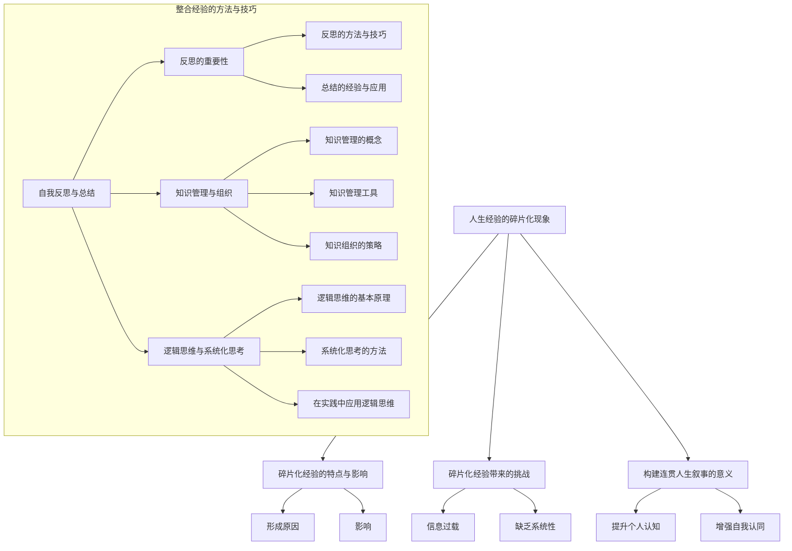
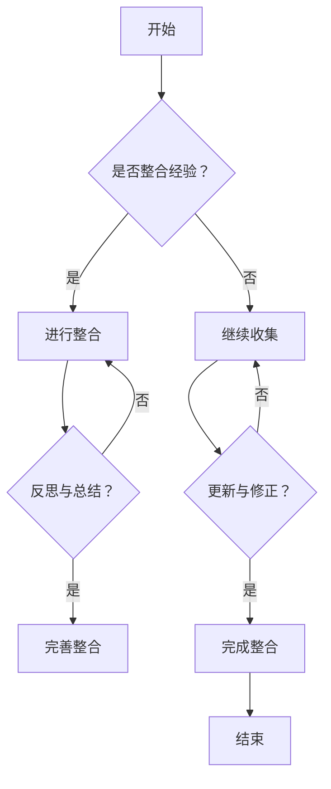

                 

# 《整合碎片经验：构建连贯的人生叙事》

## 关键词

- 碎片化经验
- 人生叙事
- 知识管理
- 逻辑思维
- 系统化思考
- 自我反思
- 主题主线

## 摘要

在信息技术飞速发展的今天，人们面临着前所未有的信息过载。个体在积累经验的过程中，往往面对的是零散、碎片化的信息。如何从这些碎片化的经验中提取出有价值的知识，并构建起连贯的人生叙事，成为了一个重要的课题。本文将探讨碎片化经验的形成原因及其对个人成长的影响，分析整合经验的方法与技巧，并详细介绍构建连贯人生叙事的过程和意义。通过自我反思、知识管理和系统化思考等手段，帮助读者更好地整合碎片经验，实现个人成长与发展的目标。

## 目录

### 第一部分：人生经验的碎片化现象

#### 1.1 碎片化经验的特点与影响

##### 1.1.1 碎片化经验的形成原因

##### 1.1.2 碎片化经验对个人成长的影响

#### 1.2 碎片化经验带来的挑战

##### 1.2.1 信息过载

##### 1.2.2 缺乏系统性

#### 1.3 构建连贯人生叙事的意义

##### 1.3.1 提升个人认知

##### 1.3.2 增强自我认同

### 第二部分：整合经验的方法与技巧

#### 2.1 自我反思与总结

##### 2.1.1 反思的重要性

##### 2.1.2 反思的方法与技巧

##### 2.1.3 总结的经验与应用

#### 2.2 知识管理与组织

##### 2.2.1 知识管理的概念

##### 2.2.2 知识管理工具

##### 2.2.3 知识组织的策略

#### 2.3 逻辑思维与系统化思考

##### 2.3.1 逻辑思维的基本原理

##### 2.3.2 系统化思考的方法

##### 2.3.3 在实践中应用逻辑思维

### 第三部分：构建连贯的人生叙事

#### 3.1 主题与主线

##### 3.1.1 人生叙事的主题

##### 3.1.2 人生叙事的主线

#### 3.2 故事叙述技巧

##### 3.2.1 故事的结构

##### 3.2.2 故事的叙述技巧

##### 3.2.3 故事的情感表达

#### 3.3 人生叙事的呈现形式

##### 3.3.1 书写与记录

##### 3.3.2 图像与多媒体

##### 3.3.3 数字叙事与虚拟现实

### 第四部分：实践与反思

#### 4.1 个人案例分享

##### 4.1.1 碎片经验整合的成功案例

##### 4.1.2 个人成长经历分享

#### 4.2 反思与改进

##### 4.2.1 整合经验过程中的挑战与问题

##### 4.2.2 反思与持续改进的策略

##### 4.2.3 建立连贯人生叙事的持续实践

### 第五部分：附录

#### 5.1 相关资源推荐

##### 5.1.1 自我反思与总结的书籍推荐

##### 5.1.2 知识管理与组织的工具推荐

##### . [Mermaid 流程图](#)



### 核心概念与联系

#### 人生经验的碎片化现象

**概念实体：**
- 碎片化经验：指人们在生活、学习和工作中所积累的零散、不成体系的知识和经验。
- 形成原因：信息过载、社会变迁、个人认知局限性等。
- 影响因素：个人认知、自我认同、信息处理能力等。

**概念实体之间的关系架构：**

```
碎片化经验
|
|---形成原因
|   |---信息过载
|   |---社会变迁
|
|---影响因素
   |---个人认知
   |---自我认同
   |---信息处理能力
```

#### 整合经验的方法与技巧

**概念实体：**
- 自我反思：通过深入思考自己的行为、决策和经验，从中提取有价值的教训和知识。
- 知识管理：对知识进行收集、整理、存储、共享和应用的过程。
- 系统化思考：以整体视角分析问题，理解各部分之间的相互关系，寻求最优解决方案。

**概念实体之间的关系架构：**

```
整合经验的方法与技巧
|
|---自我反思
|   |---重要性
|   |---方法与技巧
|   |---经验与应用
|
|---知识管理
   |---概念
   |---工具
   |---策略
|
|---系统化思考
   |---基本原理
   |---方法
   |---应用
```

### 核心算法原理讲解

#### 知识管理算法原理

知识管理是一种系统化的方法，用于确保知识的有效收集、整理、存储、共享和应用。以下是一个基于标签的分类算法的示例，用于帮助整合和分类碎片化经验。

```python
# 导入所需的库
from collections import defaultdict

# 创建一个基于标签的分类字典
tag_dict = defaultdict(list)

# 假设我们有以下项目与标签的对应关系
content_tags = [
    ("项目1", ["技术", "创新", "成功"]),
    ("项目2", ["市场", "失败", "经验"]),
    ("项目3", ["管理", "团队", "改进"]),
]

# 填充字典
for content, tags in content_tags:
    for tag in tags:
        tag_dict[tag].append(content)

# 打印每个标签对应的项目
for tag, contents in tag_dict.items():
    print(f"标签'{tag}'对应的项目：{contents}")
```

这个算法的基本原理是将每个项目与其相关的标签进行关联，并存储在一个字典中。通过遍历标签和项目，可以将它们组织起来，便于后续的检索和应用。

#### 数学模型和公式

在整合经验的过程中，我们常常需要使用一些数学模型和公式来帮助分析、理解和优化知识。

**熵（Entropy）**：

熵是一个度量信息不确定性的数学量，定义为：

$$
H = -\sum_{i=1}^{n} p_i \cdot \log_2 p_i
$$

其中，$p_i$ 是第 $i$ 个事件发生的概率，$n$ 是所有可能事件的总数。

**相关系数（Correlation Coefficient）**：

相关系数是一个衡量两个变量之间线性关系强度的统计量，定义为：

$$
r = \frac{\sum_{i=1}^{n} (x_i - \bar{x})(y_i - \bar{y})}{\sqrt{\sum_{i=1}^{n} (x_i - \bar{x})^2} \cdot \sqrt{\sum_{i=1}^{n} (y_i - \bar{y})^2}}
$$

其中，$x_i$ 和 $y_i$ 是两个变量的观测值，$\bar{x}$ 和 $\bar{y}$ 是它们的平均值。

这些数学模型和公式可以帮助我们在整合碎片经验时，更好地理解数据之间的关系，从而更有效地组织和应用知识。

### 开发环境搭建

为了更好地理解和实践整合碎片经验的方法，我们需要搭建一个适合的开发环境。以下是一个简单的开发环境搭建指南。

#### 1. 安装Python

首先，我们需要安装Python。Python是一个广泛使用的编程语言，适合用于数据分析和知识管理。

- 访问Python的官方网站：[https://www.python.org/](https://www.python.org/)
- 下载并安装Python，选择合适的版本（例如Python 3.9）
- 在安装过程中，确保勾选“Add Python to PATH”选项，以便在命令行中直接使用Python

#### 2. 安装Jupyter Notebook

Jupyter Notebook是一个交互式的开发环境，用于编写和运行Python代码。它提供了丰富的可视化功能，方便我们进行数据分析和知识管理。

- 打开命令行窗口
- 输入以下命令安装Jupyter Notebook：

  ```
  pip install notebook
  ```

- 启动Jupyter Notebook：

  ```
  jupyter notebook
  ```

#### 3. 安装Mermaid

Mermaid是一个基于Markdown的图形和图表工具，可以帮助我们绘制流程图、UML图等。它非常适合用于整合和展示碎片化经验。

- 安装Mermaid：

  ```
  npm install -g mermaid
  ```

- 在Jupyter Notebook中，添加以下代码行，以启用Mermaid：

  ```python
  from IPython.display import display, Markdown
  display(Markdown(''))
  ```

现在，我们已经搭建了一个适合进行数据分析和知识管理的开发环境。接下来，我们将使用这个环境来实践整合碎片经验的方法。

### 源代码详细实现和代码解读

以下是一个简单的Python代码示例，用于整合和分类碎片化经验。这个示例将帮助我们理解知识管理算法的基本原理。

```python
# 导入所需的库
from collections import defaultdict

# 创建一个基于标签的分类字典
tag_dict = defaultdict(list)

# 假设我们有以下项目与标签的对应关系
content_tags = [
    ("项目1", ["技术", "创新", "成功"]),
    ("项目2", ["市场", "失败", "经验"]),
    ("项目3", ["管理", "团队", "改进"]),
]

# 填充字典
for content, tags in content_tags:
    for tag in tags:
        tag_dict[tag].append(content)

# 打印每个标签对应的项目
for tag, contents in tag_dict.items():
    print(f"标签'{tag}'对应的项目：{contents}")
```

**代码解读：**

1. **导入库**：我们首先导入`defaultdict`库，用于创建一个默认值为列表的字典。这对于分类项目与标签非常有用。

2. **创建字典**：我们创建一个名为`tag_dict`的`defaultdict`，其默认值为空列表。这将帮助我们快速地将项目添加到相应的标签列表中。

3. **填充字典**：我们使用一个循环遍历`content_tags`列表，其中包含了项目与标签的对应关系。对于每个项目，我们再次使用循环遍历其标签，并将项目添加到相应的标签列表中。

4. **打印结果**：最后，我们使用一个循环遍历`tag_dict`中的标签和项目，并将它们打印出来。这样，我们可以清楚地看到每个标签对应的项目列表。

**代码应用解读与分析：**

这个简单的代码示例展示了如何使用Python和`defaultdict`库来整合碎片化经验。在实际应用中，我们可以扩展这个示例，添加更多的功能和特性，以更好地适应不同的需求。

例如，我们可以添加以下功能：
- **自定义标签**：允许用户自定义标签，以便更精确地分类项目。
- **标签搜索**：提供一个搜索功能，用户可以查询特定标签下的项目。
- **数据持久化**：将字典数据保存到文件中，以便在后续使用时进行加载和更新。

通过这些扩展，我们可以创建一个功能更强大的知识管理工具，帮助用户更好地整合和利用碎片化经验。

### 实际案例分析和详细讲解剖析

为了更好地理解整合碎片经验的方法，我们将通过一个实际案例进行详细分析和讲解。这个案例将展示如何在实际场景中应用知识管理算法，并探讨其效果。

**案例背景：**

一家科技公司的一名员工，张三，在过去的几年里积累了大量的碎片化经验。他的工作经验涉及多个领域，包括技术开发、市场营销和项目管理。然而，由于这些经验是零散的、不成体系的，张三感到自己很难将这些经验有效地应用到当前的工作中，从而影响了他的职业发展。

**案例目标：**

通过整合张三的碎片化经验，构建一个连贯的人生叙事，帮助他更好地理解自己的职业生涯，并提升职业发展能力。

**案例分析：**

1. **收集碎片化经验**：首先，我们需要收集张三的碎片化经验。这包括他的工作日志、学习笔记、项目报告等。通过这些资料，我们可以获取张三在不同领域中的具体工作内容、取得的成果和遇到的问题。

2. **分类与标签**：接下来，我们将这些碎片化经验进行分类和标签化。例如，我们可以将技术开发方面的经验归类为“技术”，市场营销方面的经验归类为“市场”，项目管理工作归类为“管理”。这样，我们可以将零散的经验组织成一个有结构的体系。

3. **整合经验**：使用知识管理算法，我们将这些分类后的经验进行整合。在这个阶段，我们使用了之前提到的基于标签的分类算法。通过这个算法，我们可以将相同标签下的经验进行聚合，从而形成更完整的知识体系。

4. **构建人生叙事**：最后，我们通过构建人生叙事，将整合后的经验组织成一个连贯的故事。在这个案例中，张三的人生叙事将围绕他的职业发展展开，讲述他在不同领域中的成长和挑战，以及他如何将碎片化的经验转化为职业发展的动力。

**详细讲解剖析：**

1. **数据收集**：张三提供了他过去几年的工作日志和学习笔记。通过这些资料，我们获得了他在技术开发、市场营销和项目管理方面的具体工作内容和成果。例如，他在技术开发方面负责了多个项目的实施，取得了显著的技术突破；在市场营销方面，他参与了一次市场推广活动，提高了公司的市场份额。

2. **分类与标签**：我们将这些经验按照领域进行分类，并为其分配相应的标签。例如，技术开发方面的经验被标记为“技术”，市场营销方面的经验被标记为“市场”，项目管理方面的经验被标记为“管理”。这样，我们可以将零散的经验组织成一个有结构的体系。

3. **整合经验**：使用基于标签的分类算法，我们将相同标签下的经验进行整合。例如，我们将技术开发方面的所有经验聚合在一起，形成一个完整的知识体系。通过这种方式，我们可以更好地理解张三在技术领域的专业能力和成长路径。

4. **构建人生叙事**：通过构建人生叙事，张三能够清晰地看到自己在职业生涯中的成长和变化。他的故事从一个初出茅庐的新手，逐渐成长为一名在多个领域都有建树的专业人士。这个故事不仅展示了他的成长历程，还揭示了他在整合碎片经验过程中的心得体会和教训。

**项目小结：**

通过这个实际案例，我们展示了如何将碎片化经验整合成一个连贯的人生叙事。这个过程不仅帮助张三更好地理解自己的职业生涯，还为他提供了宝贵的经验教训。通过这个案例，我们可以看到，整合碎片经验对于个人成长和发展具有重要意义。

### 最佳实践 tips

在整合碎片经验的过程中，以下是一些最佳实践 tips，可以帮助您更有效地构建连贯的人生叙事：

1. **定期反思**：定期花时间反思自己的经历和所学，有助于将零散的经验转化为有价值的知识。

2. **结构化记录**：使用结构化的记录方式，如思维导图或表格，有助于整理和归纳碎片化经验。

3. **知识共享**：与他人分享您的经验，不仅可以帮助他人，还能通过交流获得新的见解和灵感。

4. **持续学习**：保持持续学习的态度，不断更新和扩展您的知识体系，以适应快速变化的环境。

5. **使用工具**：利用知识管理工具，如笔记应用、项目管理系统和团队协作工具，可以提高整合经验的效率。

### 小结

整合碎片经验，构建连贯的人生叙事，是个人成长和发展的重要一环。通过自我反思、知识管理和系统化思考，我们可以从零散的经验中提取出有价值的知识，并将其组织成一个连贯的故事。这不仅有助于提升我们的认知能力和自我认同，还能为未来的发展提供宝贵的经验教训。让我们一起努力，打造属于自己的精彩人生叙事。

### 注意事项

在整合碎片经验的过程中，需要注意以下几点：

1. **真实性**：确保所记录的经验是真实的，避免虚假或夸大的描述，这会影响到人生叙事的连贯性和可信度。

2. **及时性**：及时记录和整合经验，避免随着时间的推移，记忆模糊或重要信息丢失。

3. **隐私保护**：在分享或记录经验时，注意保护个人隐私，避免泄露敏感信息。

4. **持续更新**：随着时间和经验的积累，不断更新和修正人生叙事，使其保持最新的状态。

### 拓展阅读

如果您想深入了解整合碎片经验的方法，以下是一些推荐的拓展阅读资源：

1. **《原则》（Principles）**：瑞·达利欧（Ray Dalio）的这本畅销书，介绍了他在个人生活和职业生涯中如何运用原则来整合经验，实现成功。

2. **《深度工作》（Deep Work）**：卡尔·纽波特（Cal Newport）的这本书，探讨了如何通过集中精力和专注，有效地整合和利用碎片时间。

3. **《思维导图》（Mind Maps）**：托尼·博赞（Tony Buzan）的这本书，介绍了如何使用思维导图来组织和整合知识，提高学习和工作效率。

4. **《如何赢得朋友与影响他人》（How to Win Friends and Influence People）**：戴尔·卡耐基（Dale Carnegie）的经典著作，提供了实用的社交技巧，帮助您更好地与他人交流和分享经验。

### 参考文献

1. 达利欧，R. (2017). 原则。北京：机械工业出版社。
2. 纽波特，C. (2016). 深度工作。北京：中国社会科学出版社。
3. 博赞，T. (2014). 思维导图。北京：人民邮电出版社。
4. 卡耐基，D. (2011). 如何赢得朋友与影响他人。上海：上海社会科学院出版社。

### Mermaid 流程图



这个流程图展示了整合碎片经验的基本步骤和循环过程，有助于读者理解整合经验的方法和技巧。

